# MobileIDE 


[](https://kotlinlang.org/)
[](https://developer.android.com/jetpack/compose)
[](LICENSE)

[ [English](README.md) | [**Deutsch**] | [Projekt-Status](status.md) ]

MobileIDE ist eine native Android-Entwicklungsumgebung (IDE) für die App-Entwicklung. Dieses vollständig mit Jetpack Compose entwickelte Projekt implementiert einen kompletten Workflow von der Codebearbeitung bis zum Erstellen von APKs direkt auf Ihrem Mobilgerät.

Dies ist ein experimentelles Entwicklungsprojekt; seine Kernarchitektur und Codelogik wurden in Zusammenarbeit mit mehreren KI-Modellen (Claude, Gemini, DeepSeek) erstellt.

## Screenshots


### Dark Mode
<p align="center">
  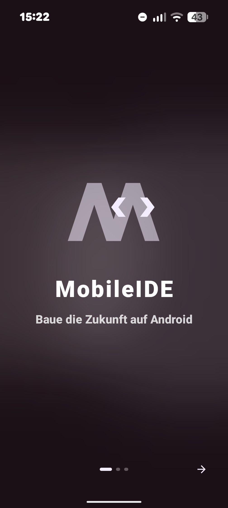
  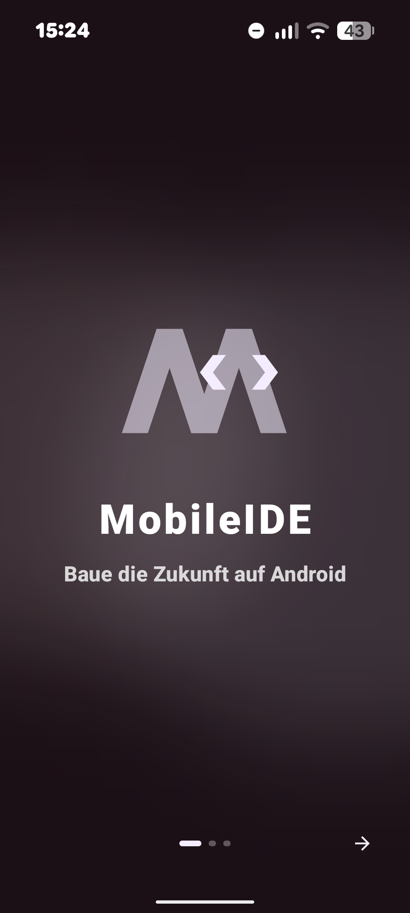
  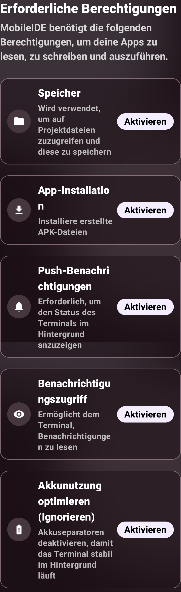
  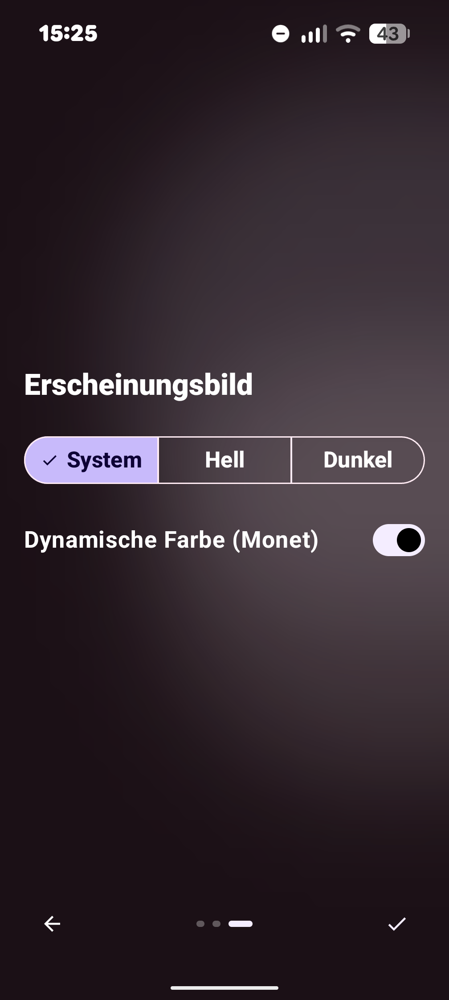
</p>
<p align="center">
  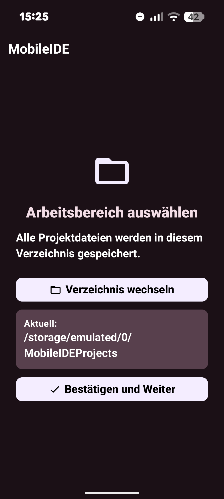
  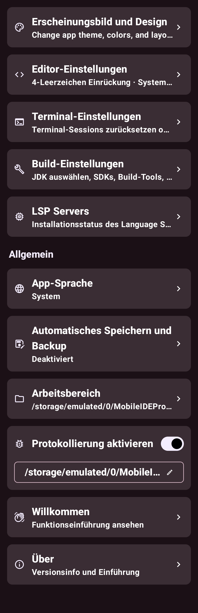
  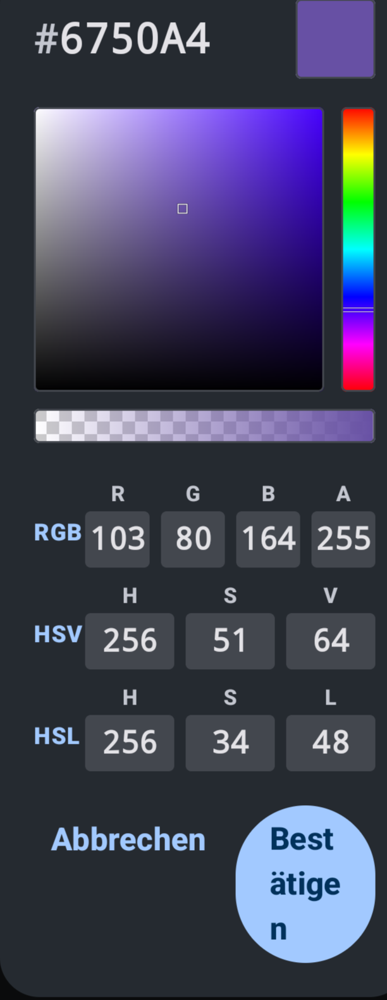
</p>

### Light Mode
<p align="center">
  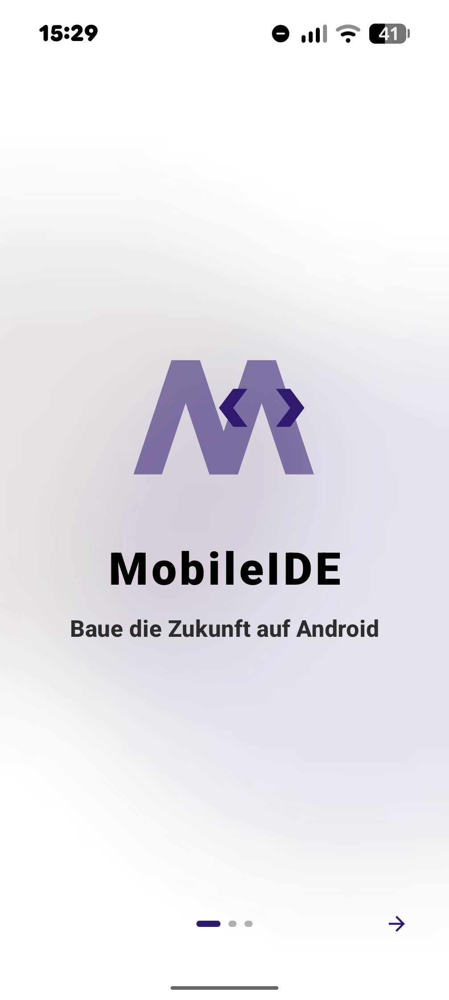
  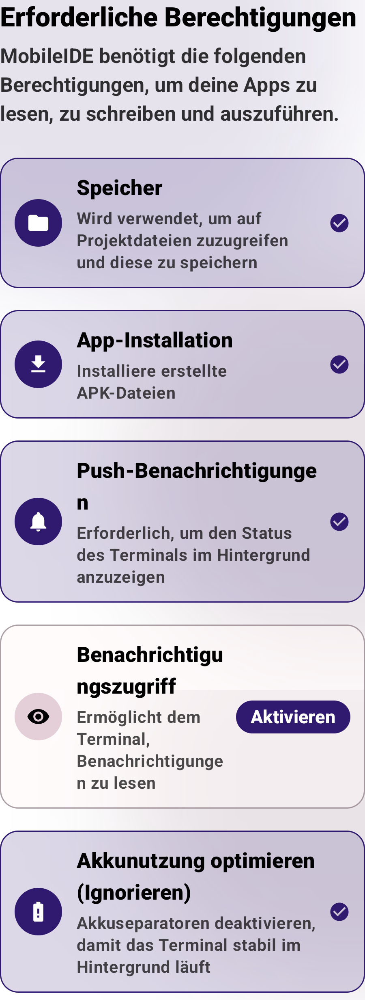
  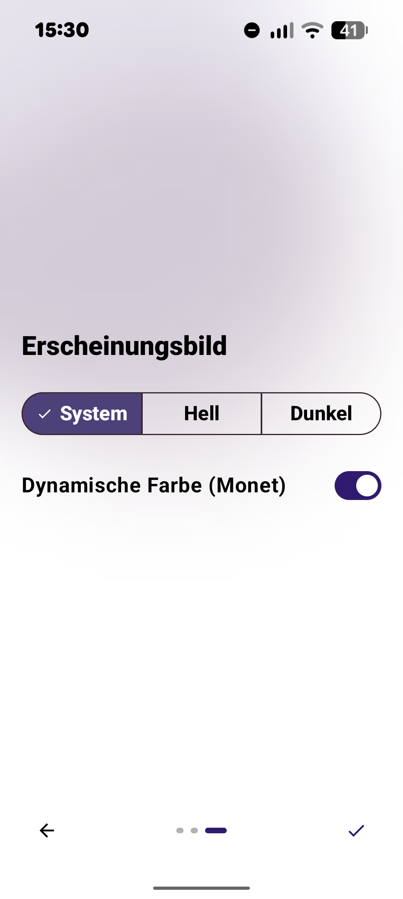
  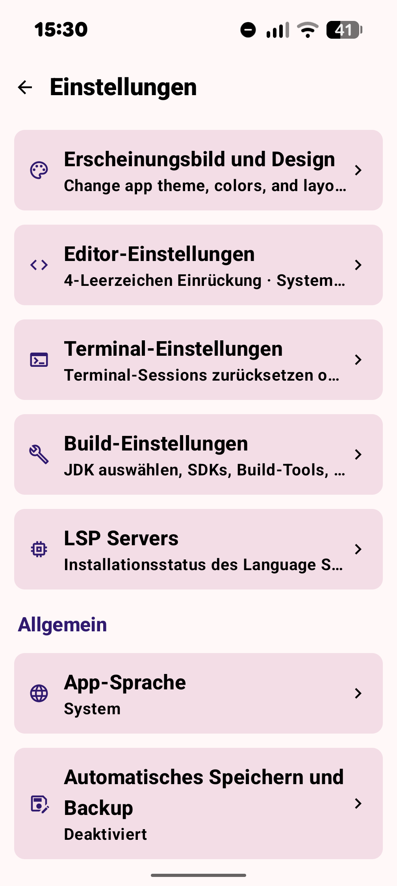
</p>
<p align="center">
  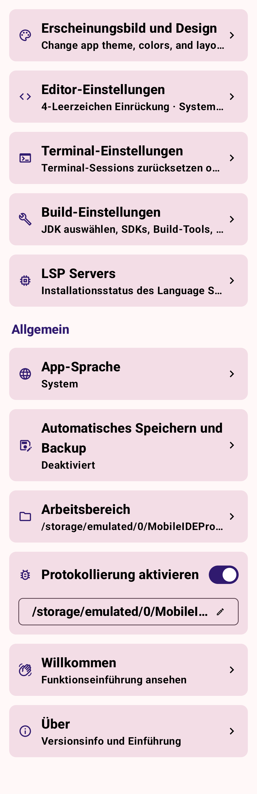
  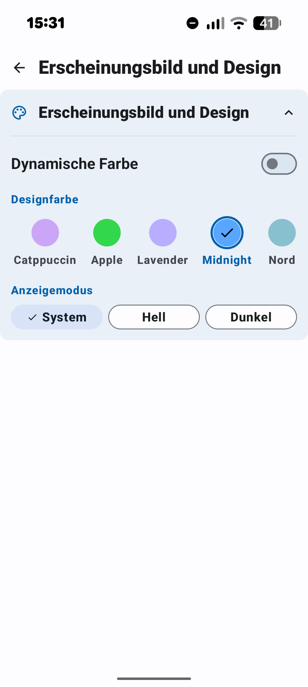
  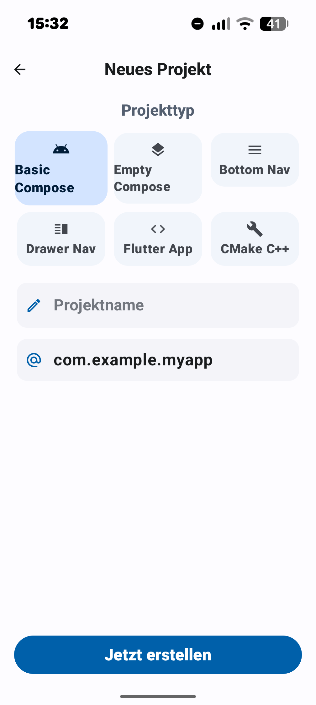
</p>

## Projektstruktur

Das Projekt wurde in eine hochgradig modulare Struktur mit folgenden Kernmodulen aufgeteilt:

*   `:app` - Hauptanwendung (UI-Bildschirme, Onboarding, Willkommenslogik, Projektauswahl, Einstellungen, Vorlagen-Extraktion).
*   `:editor` - Code-Editor-Logik (basierend auf sora-editor, Verwaltung geöffneter Tabs und Editoraktionen).
*   `:editor-lsp` - LSP (Language Server Protocol) Integration und Unterstützung für den Editor.
*   `:language-treesitter` - Syntaxhervorhebungs- und semantische Analyse-Engine via TreeSitter für Java, Kotlin, XML, Log und C++.
*   `:core:main` - Zentrales Kern-IDE-Modul (Hauptnavigation, Terminal-Sitzungsverwaltung-Backend, Design- und Theme-Konfigurationen).
*   `:core:components` - Allgemeine UI-Komponenten, Jetpack Compose Einstellungs-Widgets und BottomSheet-Komponenten.
*   `:core:resources` - Allgemeine Ressourcen (Symbole, String-Übersetzungen, Bild-Assets).
*   `:core:terminal-emulator` - Terminal-Parser, ANSI-Steuerzeichen-Interpreter, PTY-Prozess-Starter/Runner.
*   `:core:terminal-view` - Core-Android-View zur Darstellung der Terminalmatrix und Erfassung von Tastatureingaben.
*   `:core:apk-builder` - Eigenes APK-Kompilierungs-Tool (AAPT2-Compiler, DX/D8-Compiler, Signierung, Zipalign und Paketierung).
*   `:core:tooling:tooling-api` - Schnittstellen für das Logging-Framework und Gradle-Task-Definitionen.
*   `:core:tooling:tooling-impl` - Kategorisiertes Echtzeit-Logging-Panel (Terminal, Fehler, IDE-Protokoll, Build, LSP) und Gradle-Task-Panel mit Checklisten-UI.

**Wichtige Assets (`app/src/main/assets/`)**:
*   `textmate/`: TextMate-Grammatiken und Konfigurationen für die Ausweich-Syntaxhervorhebung.
*   `queries/`: TreeSitter-Abfragen (Query-Dateien).
*   `terminal/`: Integrierte Terminal-Startskripte (`ideenv`, `idesetup`, `init.sh`, `setup.sh`) sowie integrierte Farbschemata unter `terminal/colorschemes/`.

## Funktionen

- [x] **Syntaxhervorhebung**: Duale Highlight-Architektur mit Unterstützung für **TextMate** (robuste Stile für HTML, CSS, JavaScript, JSON usw.) und **TreeSitter** (leistungsstarke semantische Analyse für Kotlin, Java, CPP, JSON, Log und XML).
- [x] **Editor-Engine-Auswahl**: Eintrag in den Einstellungen, der es Benutzern ermöglicht, flexibel zwischen der klassischen TextMate-Engine und der TreeSitter (LSP)-Engine zu wechseln, inklusive automatischem Fallback-Schutz.
- [x] **Optionale Protokollierung**: Integriertes LogCatcher-Subsystem mit einem Schalter in den Einstellungen zum Aktivieren oder Deaktivieren ausführlicher Debug-Protokolle für Compiler- und Editor-Vorgänge.
- [x] **Projektmanagement**: Voller Dateisystemzugriff zur Erstellung und Verwaltung von Webprojekten mit mehreren Dateien.
- [x] **Echtzeitvorschau**: Integrierte WebView-Vorschauumgebung mit Unterstützung für JavaScript-Interaktionstests.
- [x] **Moderne Benutzeroberfläche**: Vollständig in Kotlin und Jetpack Compose geschrieben, mit Unterstützung für dynamische Designs.
- [x] **Git-Integration**: Integrierte Git-Versionskontrolle mit einer visuellen Commit-Historie, unterstützt Klonen, Commit, Push, Pull und Branch-Verwaltung. Ignoriert automatisch sensible Dateien und Build-Artefakte.
- [x] **Integriertes Terminal & Sandbox**: PRoot-basierte Linux-Containerumgebung zur Ausführung von Skripten und Einrichtung von Compiler-Tools direkt auf dem Gerät.
- [x] **Eigener APK-Builder**: AAPT2/D8-Kompilierungs-Infrastruktur zum lokalen Erstellen und Ausführen von Android-Projekten.
- [x] **Smart Environment CLI (`ideenv`)**: Kommandozeilen-Hilfstool zur dynamischen Verwaltung von Pfaden, JDKs, SDKs und Build-Variablen.

## TODO

- [ ] **Interaktiver visueller Debugger**: Integration einer LLDB- / JDWP-Debugger-Schnittstelle zum Echtzeit-Debugging von C++ und Java-Code.
- [ ] **LSP-Diagnose-Overlays**: Anzeige von Compiler-Fehlern und -Warnungen mit Wellenlinien direkt im Code-Editor.
- [ ] **Visueller Layout-Vorschau-Modus**: Interaktive geteilte Ansicht für Compose- und XML-Layout-Vorschauen.
- [ ] **Gradle-Sync & Dependency-Downloader**: Dynamisches Herunterladen und Cachen von Remote-Abhängigkeiten aus Maven Central / Google Maven innerhalb der App.
- [ ] **Grafischer Keystore-Assistent**: Schritt-für-Schritt-Schlüsselgenerator und visueller Manager für Signierungskonfigurationen.
- [ ] **Git-Konfliktlösungstool**: Interaktive Diff-Ansicht und Merge-Tool für Git-Konflikte.
- [ ] **Plugin-Marktplatz**: Schnittstelle zum Durchsuchen, Herunterladen und Installieren von Language-Server-Erweiterungen oder Plugins von Drittanbietern.

 ## Diskussion

* QQ-Gruppe: [1050254184](https://qm.qq.com/q/tFXuqMQDlK)
* TG-Gruppe: [Android_For_MobileIDE](https://t.me/Android_For_MobileIDE)

## Mitwirkende

<a href="https://github.com/scto/MobileIDE/graphs/contributors">


</a>

## Lizenz

``` MobileIDE – Eine leistungsstarke IDE für die Android-App-Entwicklung.

 Copyright (C) 2025 scto <tschmid35@.com>

Dieses Programm ist freie Software: Sie können es weitergeben und/oder verändern
unter den Bedingungen der GNU General Public License, wie von der Free Software Foundation veröffentlicht, entweder Version 3 der Lizenz oder
(nach Ihrer Wahl) jede spätere Version.

Dieses Programm wird in der Hoffnung verbreitet, dass es nützlich sein wird,
aber OHNE JEGLICHE GEWÄHRLEISTUNG, insbesondere ohne die implizite Gewährleistung der
MARKTGÄNGIGKEIT oder EIGNUNG FÜR EINEN BESTIMMTEN ZWECK. Weitere Details finden Sie in der
GNU General Public License.

Sie sollten eine Kopie der GNU General Public License zusammen mit diesem Programm erhalten haben. Falls nicht, besuchen Sie <https://www.gnu.org/licenses/>.

 ```

## Star History

[](https://star-history.com/#scto/MobileIDE&Date)