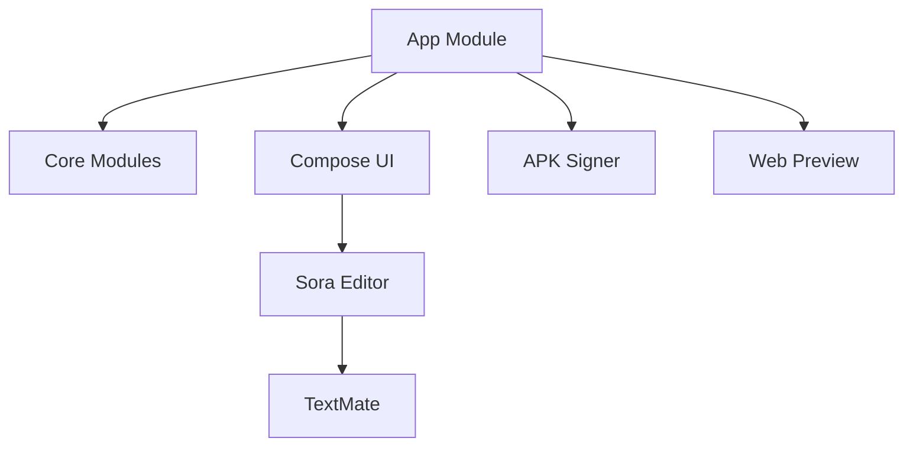
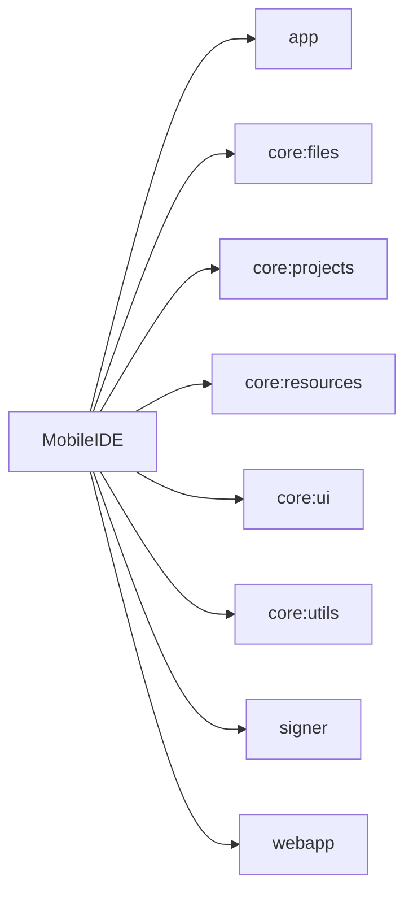

# Project: MobileIDE

## Project Structure

```text
📦 MobileIDE
 📂 .aider
   📂 aider_prompts
     📂 ProjektWizzard
       📄 AnweisungProjextWiztardPromot.md
       📄 ProjextWiztardPromot.md
     📄 aider_guardrails.md
     📄 skills.md
   📂 aider_templates
     📄 create_atomic_ui.txt
     📄 create_mvi_feature.txt
     📄 update_dependency.txt
   📂 project-context
     📄 activeDevelopment.md
     📄 progress.md
     📄 projectOverview.md
     📄 systemDesign.md
     📄 techEnvironment.md
     📄 testStrategy.md
     📄 uiStrategy.md
   📄 .aiderCode.md
   📄 .aiderContext.md
   📄 .aiderRules.md
 📂 .github
   📂 ISSUE_TEMPLATE
     📄 bug_report.md
     📄 feature_request.md
   📂 scripts
     📄 close-duplicates.mjs
     📄 improve-title-gemini.js
   📂 workflows
     📄 android.yml
     📄 deleteoldrus.yml
     📄 duplicate-issue.yml
     📄 issue-title.yml
     📄 ktfmt-check.yml
   📄 FUNDING.yml
 📂 app
   📂 libs
     📄 xml.jar
   📂 src
     📂 main
       📂 assets
         📂 textmate
           📂 css
             📂 syntaxes
               📄 css.tmLanguage.json
             📄 language-configuration.json
           📂 html
             📂 syntaxes
               📄 html.tmLanguage.json
             📄 language-configuration.json
           📂 javascript
             📂 syntaxes
               📄 JavaScript.tmLanguage.json
             📄 language-configuration.json
           📄 languages.json
           📄 quietlight.json
         📄 WebIDE.jks
         📄 webapp_1.0.apk
       📂 java
         📂 com
           📂 mobile
             📂 ide
               📂 html
                 📄 Completion.java
                 📄 HtmlLexer.java
                 📄 HtmlRecordLabel.java
                 📄 HtmlTagClosureChecker.java
                 📄 IdentifierAutoComplete.java
                 📄 MyPrefixChecker.java
               📂 textmate
                 📄 TextMateAnalyzer.java
                 📄 TextMateLanguage.java
                 📄 TextMateNewlineHandler.java
                 📄 TextMateSymbolPairMatch.java
               📂 ui
                 📂 editor
                   📂 components
                     📄 CodeEditorView.kt
                   📂 viewmodel
                     📄 EditorViewModel.kt
                   📄 CodeEditScreen.kt
                   📄 EditorColorSchemeManager.kt
                   📄 EditorThemeTestScreen.kt
                 📂 preview
                   📄 WebPreviewScreen.kt
                 📂 projects
                   📄 NewProjectScreen.kt
                   📄 ProjectListScreen.kt
                   📄 WorkspaceSelectionScreen.kt
                 📂 settings
                   📄 AboutScreen.kt
                   📄 SettingsScreen.kt
                 📂 welcome
                   📄 WelcomeScreen.kt
               📄 App.kt
               📄 ApplicationContext.kt
               📄 MainActivity.kt
               📄 MyApplication.kt
       📄 AndroidManifest.xml
   📄 .gitignore
   📄 WebIDE.jks
   📄 build.gradle.kts
   📄 proguard-rules.pro
 📂 assets
   📂 MobileIDE_Icons
     📂 drawable
       📄 ic_launcher_adaptive.xml
       📄 ic_launcher_background.xml
       📄 ic_launcher_bg_asset.png
       📄 ic_launcher_fg_asset.png
       📄 ic_launcher_foreground.xml
       📄 ic_launcher_mono_asset.png
       📄 ic_launcher_monochrome.xml
     📂 mipmap-anydpi-v26
       📄 ic_launcher.xml
       📄 ic_launcher_round.xml
     📂 mipmap-hdpi
       📄 ic_launcher.png
       📄 ic_launcher_round.png
     📂 mipmap-mdpi
       📄 ic_launcher.png
       📄 ic_launcher_round.png
     📂 mipmap-xhdpi
       📄 ic_launcher.png
       📄 ic_launcher_round.png
     📂 mipmap-xxhdpi
       📄 ic_launcher.png
       📄 ic_launcher_round.png
     📂 mipmap-xxxhdpi
       📄 ic_launcher.png
       📄 ic_launcher_round.png
     📂 svg
       📄 ic_launcher_background.svg
       📄 ic_launcher_foreground.svg
       📄 ic_launcher_full.svg
       📄 ic_launcher_monochrome.svg
       📄 ic_launcher_preview_1024.png
       📄 ic_launcher_round.svg
     📄 README.md
 📂 core
   📂 files
     📂 src
       📂 main
         📂 java
           📂 com
             📂 mobile
               📂 ide
                 📂 core
                   📂 files
                     📄 File.kt
                     📄 FileTree.kt
                     📄 ZipUtil.kt
     📄 .gitignore
     📄 build.gradle.kts
     📄 consumer-rules.pro
     📄 proguard-rules.pro
   📂 projects
     📂 src
       📂 main
         📂 java
           📂 com
             📂 mobile
               📂 ide
                 📂 core
                   📂 projects
                     📄 ProjectTemplates.kt
         📂 res
           📂 anim
             📄 anim_diagnostic_tooltip_window_enter.xml
             📄 anim_diagnostic_tooltip_window_exit.xml
             📄 anim_text_action_popup_enter.xml
             📄 anim_text_action_popup_exit.xml
           📂 drawable
             📄 ic_code.xml
             📄 ic_launcher.xml
             📄 ic_launcher_background.xml
             📄 ic_launcher_foreground.xml
             📄 ic_launcher_monochrome.xml
             📄 ic_w.xml
             📄 ic_ww.xml
           📂 drawable-night
             📄 ic_launcher_background.xml
             📄 ic_launcher_foreground.xml
           📂 font
             📄 outfit_regular.ttf
           📂 mipmap-anydpi-v26
             📄 ic_launcher.xml
             📄 ic_launcher_round.xml
           📂 mipmap-hdpi
             📄 ic_launcher.webp
             📄 ic_launcher_round.webp
           📂 mipmap-mdpi
             📄 ic_launcher.webp
             📄 ic_launcher_round.webp
           📂 mipmap-xhdpi
             📄 ic_launcher.webp
             📄 ic_launcher_round.webp
           📂 mipmap-xxhdpi
             📄 ic_launcher.webp
             📄 ic_launcher_round.webp
           📂 mipmap-xxxhdpi
             📄 ic_launcher.webp
             📄 ic_launcher_round.webp
           📂 raw
             📄 aboutlibraries.json
           📂 values
             📄 arrays.xml
             📄 colors.xml
             📄 dimens.xml
             📄 strings.xml
             📄 themes.xml
           📂 values-land
             📄 dimens.xml
           📂 values-night
             📄 colors.xml
             📄 themes.xml
           📂 values-w1240dp
             📄 dimens.xml
           📂 values-w600dp
             📄 dimens.xml
           📂 values-w820dp
             📄 dimens.xml
           📂 xml
             📄 backup_rules.xml
             📄 data_extraction_rules.xml
             📄 file_paths.xml
             📄 network_security_config.xml
             📄 provider_paths.xml
         📄 AndroidManifest.xml
     📄 .gitignore
     📄 build.gradle.kts
     📄 consumer-rules.pro
     📄 proguard-rules.pro
   📂 resources
     📂 src
       📂 main
         📂 java
           📂 com
             📂 mobile
               📂 ide
                 📂 core
                   📂 resources
                     📄 Res.kt
         📂 res
           📂 anim
             📄 anim_diagnostic_tooltip_window_enter.xml
             📄 anim_diagnostic_tooltip_window_exit.xml
             📄 anim_text_action_popup_enter.xml
             📄 anim_text_action_popup_exit.xml
           📂 drawable
             📄 ic_code.xml
             📄 ic_launcher_adaptive.xml
             📄 ic_launcher_background.xml
             📄 ic_launcher_fg_asset.png
             📄 ic_launcher_foreground.xml
             📄 ic_launcher_mono_asset.png
             📄 ic_launcher_monochrome.xml
             📄 ic_w.xml
             📄 ic_ww.xml
           📂 font
             📄 outfit_regular.ttf
           📂 mipmap-anydpi-v26
             📄 ic_launcher.xml
             📄 ic_launcher_round.xml
           📂 mipmap-hdpi
             📄 ic_launcher.png
             📄 ic_launcher_round.png
           📂 mipmap-mdpi
             📄 ic_launcher.png
             📄 ic_launcher_round.png
           📂 mipmap-xhdpi
             📄 ic_launcher.png
             📄 ic_launcher_round.png
           📂 mipmap-xxhdpi
             📄 ic_launcher.png
             📄 ic_launcher_round.png
           📂 mipmap-xxxhdpi
             📄 ic_launcher.png
             📄 ic_launcher_round.png
           📂 raw
             📄 aboutlibraries.json
           📂 values
             📄 arrays.xml
             📄 colors.xml
             📄 dimens.xml
             📄 strings.xml
             📄 themes.xml
           📂 values-land
             📄 dimens.xml
           📂 values-night
             📄 colors.xml
             📄 themes.xml
           📂 values-w1240dp
             📄 dimens.xml
           📂 values-w600dp
             📄 dimens.xml
           📂 values-w820dp
             📄 dimens.xml
           📂 xml
             📄 backup_rules.xml
             📄 data_extraction_rules.xml
             📄 file_paths.xml
             📄 network_security_config.xml
             📄 provider_paths.xml
           📄 README.md
         📄 AndroidManifest.xml
     📄 .gitignore
     📄 build.gradle.kts
     📄 consumer-rules.pro
     📄 proguard-rules.pro
   📂 ui
     📂 src
       📂 main
         📂 java
           📂 com
             📂 mobile
               📂 ide
                 📂 core
                   📂 ui
                     📂 components
                       📄 ColorPickerDialog.kt
                       📄 DirectorySelector.kt
                       📄 ThemeSelectionDialog.kt
                       📄 WelcomeComponents.kt
                     📂 icons
                       📄 AppIcon.kt
                     📂 theme
                       📄 Color.kt
                       📄 Theme.kt
                       📄 ThemeDataStore.kt
                       📄 ThemeViewModel.kt
                       📄 Themedata.kt
                       📄 Type.kt
     📄 .gitignore
     📄 build.gradle.kts
     📄 consumer-rules.pro
     📄 proguard-rules.pro
   📂 utils
     📂 src
       📂 main
         📂 java
           📂 com
             📂 mobile
               📂 ide
                 📂 core
                   📂 utils
                     📄 LogConfig.kt
                     📄 PermissionManager.kt
                     📄 WelcomePreferences.kt
                     📄 WorkspaceManager.kt
     📄 .gitignore
     📄 build.gradle.kts
     📄 consumer-rules.pro
     📄 proguard-rules.pro
 📂 dokka
   📄 module.md
 📂 gradle
   📂 wrapper
     📄 gradle-wrapper.jar
     📄 gradle-wrapper.properties
   📄 libs.versions.toml
 📂 scripts
   📂 generator
     📄 generate-template-part1.sh
     📄 generate-template-part2.sh
     📄 migrate-android-studio-template.sh
   📂 old
     📄 aider_launcher (1).sh
     📄 aider_launcher (2).sh
     📄 aider_launcher (3).sh
     📄 aider_launcher (4).sh
     📄 aider_launcher.sh
   📂 python
     📄 generate_wizard_screen.py
     📄 hilt.py
   📄 aider_launcher (1).sh
   📄 aider_launcher.sh
   📄 install_ollama.sh
   📄 setup_aiderignore.sh
 📂 signer
   📂 src
     📂 main
       📂 java
         📂 com
           📂 mcal
             📂 apksigner
               📂 utils
                 📄 KeyStoreHelper.kt
               📄 ApkSigner.kt
       📂 resources
         📂 keystore
           📄 testkey.pk8
           📄 testkey.x509.pem
   📄 .gitignore
   📄 build.gradle.kts
 📂 webapp
   📂 src
     📂 main
       📂 assets
         📂 css
           📄 style.css
         📂 js
           📄 api.js
           📄 index.js
         📄 index.html
       📂 java
         📂 com
           📂 web
             📂 webapp
               📄 FullWebChromeClient.java
               📄 MainActivity.java
               📄 WebAppInterface.java
       📂 res
         📂 mipmap-hdpi
           📄 ic_launcher.webp
           📄 ic_launcher_round.webp
         📂 values
           📄 colors.xml
           📄 strings.xml
           📄 themes.xml
         📂 values-night
           📄 themes.xml
         📂 xml
           📄 backup_rules.xml
           📄 data_extraction_rules.xml
           📄 file_paths.xml
       📄 AndroidManifest.xml
   📄 .gitignore
   📄 WebIDE.jks
   📄 build.gradle.kts
   📄 proguard-rules.pro
 📄 .aider.conf.yml
 📄 .aiderignore
 📄 .gitattributes
 📄 .gitignore
 📄 LICENSE
 📄 README.md
 📄 README_DE.md
 📄 build.gradle.kts
 📄 gradle.properties
 📄 gradlew
 📄 gradlew.bat
 📄 mkdocs.yml
 📄 settings.gradle.kts
```

## File Contents


## .aider/aider_prompts/ProjektWizzard/AnweisungProjextWiztardPromot.md
```md
# Aider Workflow für den Project Wizard
Um das beste Ergebnis mit Aider zu erzielen, solltest du die Spezifikation als Datei übergeben und Aider dann den Startschuss geben.
## 1. Vorbereitung
 1. Speichere den Text aus der vorherigen Antwort in einer Datei namens ProjectWizardPrompt.md in deinem Projektverzeichnis.
 2. Stelle sicher, dass deine MobileIDE.md ebenfalls im Projektverzeichnis liegt, da sie den Gesamtkontext liefert.
 3. **Wichtig:** Mache einen Git-Commit (git add . && git commit -m "WIP"), bevor du Aider startest. So kannst du Änderungen leicht rückgängig machen.
## 2. Aider im Terminal starten
Starte Aider im Terminal und übergib direkt die relevanten Kontext-Dateien. Wenn du bereits eine MainActivity.kt oder eine Datei mit deiner Compose-Navigation hast, füge diese ebenfalls hinzu, damit Aider den Wizard dort einhängen kann.
Führe folgenden Befehl in deinem Terminal aus:
```bash
aider MobileIDE.md ProjectWizardPrompt.md

```
*(Optional: Wenn du das architect Modell nutzen willst, was für komplexe neue Features sehr zu empfehlen ist, starte mit aider --architect MobileIDE.md ProjectWizardPrompt.md)*
## 3. Die Anweisung (Prompt) im Aider-Chat
Sobald Aider gestartet ist und im Chat-Modus wartet, gibst du folgende Anweisung ein. Diese sagt Aider genau, was es mit den hinzugefügten Dateien tun soll:
> **Bitte lies dir die Spezifikation in der Datei ProjectWizardPrompt.md genau durch. Berücksichtige dabei auch die Projektarchitektur aus MobileIDE.md.**
> **Deine Aufgabe:**
> **Implementiere das komplette Project Wizard Feature in Kotlin. Erstelle dazu alle geforderten Dateien (TemplateModels, WizardState, WizardViewModel, WizardScreen, ZipUtils) im Ordner app/src/main/java/<DEIN_PACKAGE_PFAD>/ui/projects/.**
> **Hinweise:**
> **1. Erstelle die Verzeichnisstruktur für die Assets (app/src/main/assets/templates/), aber du musst keine echten ZIP-Dateien generieren (das mache ich später manuell). Erstelle nur eine beispielhafte template.json als Mock-Datei für das EmptyComposeActivity-Template, damit wir die Logik testen können.**
> **2. Nutze Jetpack Compose, Coroutines und StateFlow.**
> **3. Denke an die nötigen Imports und halte dich an moderne Android Best Practices.**
> **Bitte generiere jetzt den Code.**
> 
*(Hinweis: Ersetze <DEIN_PACKAGE_PFAD> durch deinen echten Package-Namen, z.B. com/myname/mobileide)*
## 4. Nächste Schritte nach der Generierung
Aider wird nun die Dateien erstellen und vorschlagen, sie zu speichern.
 * **Dependencies prüfen:** Falls Aider Bibliotheken wie kotlinx.serialization oder Gson verwendet, fordere Aider danach auf: *"Bitte füge die benötigten Dependencies für das ViewModel und Serialization zu meiner app/build.gradle.kts hinzu."*
 * **ZIPs erstellen:** Aider kann keine echten ZIP-Archive generieren. Du musst die .zip-Dateien (EmptyActivity.zip, etc.) nach der Code-Generierung selbst erstellen und in den Ordner app/src/main/assets/templates/ legen, damit der Code sie entpacken kann.

```

## .aider/aider_prompts/ProjektWizzard/ProjextWiztardPromot.md
```md
# Context & Role

Du bist ein Senior Android Developer und Architekt, spezialisiert auf den Bau einer modernen On-Device Android/Java IDE (ähnlich wie CodeAssist oder AndroidIDE).
Deine Aufgabe ist es, das Projekt-Erstellungs-Feature (Project Wizard) im Kotlin-Code zu implementieren.
Beachte für den Gesamtkontext die Datei MobileIDE.md (Projektübersicht). Alle neuen Codes müssen zwingend in Kotlin geschrieben sein (Jetpack Compose für UI, Coroutines/Flow für asynchrone Logik).

# Feature Overview

Erstellung eines WizardScreen (UI) und eines WizardViewModel (Logik) im Modul app unter dem Pfad ui/projects.
Der Wizard erlaubt es dem Nutzer, ein neues App-Projekt basierend auf vordefinierten Templates zu erstellen, die als .zip-Archive im assets-Ordner der App liegen.

## 1. Asset & Template Architektur

Die Templates liegen im Ordner app/src/main/assets/templates/ als ZIP-Archive:
 * EmptyActivity.zip
 * EmptyComposeActivity.zip
 * NavigationDrawer.zip
 * BottomNavigation.zip
 * CppProject.zip
 * LibGDXProject.zip
 * BasicJavaApp.zip (und weitere)
**Struktur innerhalb jedes ZIP-Archivs:**
 * template.json: Beschreibt die Metadaten und Eigenschaften des Templates.
 * src/: Beinhaltet den Template-Quellcode (mit Platzhaltern wie ${PACKAGE_NAME}).
 * res/: Beinhaltet die Android-Ressourcen.
 * gradle/: Beinhaltet den Gradle Wrapper und den Versionskatalog (libs.versions.toml).
 * 
### Beispiel für template.json:

```json
{
  "id": "empty_compose_activity",
  "name": "Empty Compose Activity",
  "description": "Erstellt ein leeres Projekt mit Jetpack Compose Setup.",
  "properties": {
    "useKotlin": true,
    "useCompose": true,
    "useGradleKotlin": true,
    "minSdk": 24,
    "targetSdk": 34
  }
}

```

## 2. Implementierungs-Anforderungen

### Schritt 1: Datenmodelle (TemplateModels.kt)

Erstelle Kotlin Data Classes, die das template.json abbilden (z.B. mit kotlinx.serialization oder Gson).

### Schritt 2: WizardViewModel (WizardViewModel.kt)

Das ViewModel muss modern mit MVI/MVVM und StateFlow aufgebaut sein und folgende Logiken beinhalten:
 1. **Template Discovery:** Auslesen des assets/templates/ Ordners und Entpacken der template.json Dateien in den Arbeitsspeicher, um eine Liste der verfügbaren Templates im UI anzuzeigen.
 2. **Project Configuration State:** Speichern der Nutzereingaben (Project Name, Package Name, Minimum SDK, Save Location).
 3. **Extraction Engine (Coroutines/Dispatchers.IO):** - Entpacken des ausgewählten ZIP-Archivs in das Zielverzeichnis (Save Location).
   * Ausführen eines String-Replacements (z.B. ersetzen von ${PACKAGE_NAME} durch com.example.app in allen .kt, .xml und .gradle.kts Dateien).
   * Umstrukturierung des src-Ordners entsprechend dem Package-Namen (z.B. src/main/java/com/example/app/).
 4. **Gradle Downloader:** Eine Suspend-Funktion downloadLatestGradle(), die asynchron die aktuellste/benötigte Gradle-Distribution herunterlädt, entpackt und in den lokalen IDE-Cache legt, falls sie nicht schon existiert.
 5. 
### Schritt 3: WizardScreen (WizardScreen.kt)

Ein smartes Jetpack Compose UI, das Smartphone-freundlich (touch-optimiert) ist.
 * **State-Handling:** Konsumieren des StateFlows aus dem WizardViewModel.
 * **Flow:**
   * **Screen 1 (Template Selection):** Grid oder vertikale Liste der Templates (mit Icons und Beschreibung aus der JSON).
   * **Screen 2 (Project Details):** Formular für Projektname, Package-Name (automatisch abgeleitet vom Projektnamen), und Pfadauswahl.
   * **Screen 3 (Loading/Generation):** Progress-Indikator, der den Entpack-Vorgang und ggf. den Gradle-Download anzeigt.
 * **Design:** Modernes Material Design 3, abgerundete Ecken, klare Typografie. Extrahierbare Komponenten, um sie später zu erweitern.
 * 
## 3. Anweisungen für die Code-Generierung

Bitte generiere nun den Code für die folgenden Dateien komplett und lauffähig:
 1. Template.kt (Data Classes)
 2. WizardState.kt (UI States & Events)
 3. WizardViewModel.kt (Inklusive Entpack-Logik, String-Replacement und Gradle-Download-Skeleton)
 4. WizardScreen.kt (Compose UI mit Navigation zwischen den Wizard-Schritten)
 5. Eine Hilfsklasse ZipUtils.kt, die das sichere Entpacken und Manipulieren der Dateien via java.util.zip oder java.nio.file übernimmt.
 6. 
Schreibe robusten, gut kommentierten Code, der Exception-Handling (z.B. bei fehlenden Asset-Dateien oder Storage-Permissions) beinhaltet. Die Architektur soll mächtig genug sein, um später komplexere Scaffolding-Engines (wie Freemarker oder Apache Velocity) nachzurüsten, falls einfaches String-Replacement nicht mehr ausreicht.

```

## .aider/aider_prompts/aider_guardrails.md
```md
# Aider Execution & Architectural Guardrails

Whenever you write or modify code in this Android project, you must act as a strict Architectural Guardian. Enforce these specific constraints on your own output:

1. **The Single-File-Refactor Rule:**
   Never write UI, Domain, and Data layer code in a single step or file. Always execute feature requests strictly in this order:
   - Step 1: Data layer (DTOs, Repository implementation)
   - Step 2: Domain layer (Models, UseCases, Repository interfaces)
   - Step 3: UI layer (MVI Contract, ViewModel, Compose UI)

2. **The "No-Var" Enforcement:**
   Scan your generated Kotlin code. The `var` keyword is strictly forbidden in class properties or data classes. It is ONLY permitted inside local function algorithms or `remember { mutableStateOf() }` blocks. Refactor to `val` and `copy()` operations before submitting.

3. **Strict Return Type Enforcement:**
   Never rely on Kotlin's type inference for public functions or Flows. You MUST explicitly declare the return type for every function (e.g., `fun getUser(): Flow<User>`).

4. **Multi-Module Dependency Audit:**
   Before importing a class from another module, you must check the `build.gradle.kts` of the current module. If the dependency (e.g., `implementation(projects.core.ui)`) is missing, you must add it to the build script first.

```

## .aider/aider_prompts/skills.md
```md
# Aider Agent Skills & Capabilities
You are an advanced AI development agent working on an Android project. You have specific skills that you must actively use during the development process.
## Skill 1: The MVI Architect
When asked to create a new feature, you do not just write a ViewModel. You automatically scaffold the entire MVI flow:
 1. Define the Contract (State, Intent, Effect) using sealed interface.
 2. Implement the ViewModel with a Reducer pattern.
 3. Scaffold the Compose UI to consume the State and emit Intents.
## Skill 2: The Compile-Driven Developer
You have access to the Gradle build system. If you modify Dependency Injection (Hilt), Database Schemas (Room), or complex generic types, you actively suggest running ./gradlew compileDebugKotlin to verify Kotlin Symbol Processing (KSP) generation before proceeding.
## Skill 3: The Design System Enforcer
You never use hardcoded strings, dimensions (dp/sp), or colors (Hex) in Compose. You actively search for and use tokens from the :core:ui:theme module. If a color or component is missing, you create it in the :core:ui module first.
## Skill 4: The Dependency Manager
When implementing new libraries, you never add them directly to a build.gradle.kts file. You always add them to gradle/libs.versions.toml first, create the bundle or library reference, and only then implement the alias in the respective module's build script.
## Skill 5: The Termux Power User
You are aware that this project is primarily developed and built within a Termux environment on an Android device. You prioritize shell commands, scripts, and build tasks that are compatible with Termux and avoid assuming a traditional desktop IDE environment (like Android Studio).
## Skill 6: The Hilt Integrator
You automatically apply Dependency Injection using Hilt for all applicable files and classes. You consistently annotate Android entry points (Activities, Fragments) with @AndroidEntryPoint, ViewModels with @HiltViewModel, and ensure dependencies are seamlessly provided via constructor injection (@Inject constructor). You proactively create and manage Hilt Modules (@Module, @InstallIn) for external, interface-bound, or complex dependencies.
## Skill 7: The KSP Specialist
You strictly utilize Kotlin Symbol Processing (KSP) instead of the legacy KAPT for all annotation processing tasks. When integrating libraries that require code generation (such as Room, Hilt, Moshi, or Compose Destinations), you ensure the KSP plugin is correctly applied and use the ksp(...) configuration within the build.gradle.kts dependencies.
## Skill 8: The Documentation Automator
You proactively maintain both code-level and high-level project documentation. For Kotlin code, you automatically generate, verify, and correct KDoc comments for classes, methods, and properties to ensure seamless Dokka generation. Furthermore, you manage the project's documentation via mkdocs.yml. You actively scan the codebase upon changes to automatically update the corresponding Markdown documentation and generate/update Mermaid.js diagrams to accurately reflect the current architecture, data flows, and state machines.

```

## .aider/aider_templates/create_atomic_ui.txt
```txt
Erstelle eine neue Compose-Komponente in :core:ui.

Name der Komponente: [NAME_HIER_EINTRAGEN]
Typ: [Button / Card / Dialog / etc.]
Pfad: core/ui/src/main/java/com/scto/mcs/core/ui/components/[TYP]/

Anforderungen:
1. Nutze ausschließlich das Design-System aus :core:ui:theme und :core:ui:colors. Keine hartcodierten Hex-Werte.
2. Die Composable muss einen `modifier: Modifier = Modifier` als ersten Parameter akzeptieren.
3. Die Komponente muss zustandslos (stateless) sein.
4. Füge am Ende der Datei einen @PreviewLightDark Block mit aussagekräftigen Mock-Daten hinzu.

```

## .aider/aider_templates/create_mvi_feature.txt
```txt
Erstelle das MVI-Skelett für das neue Feature: [FEATURE_NAME_HIER_EINTRAGEN]
Pfad: feature/[FEATURE_NAME]/

Aufgaben:
1. Erstelle `[FeatureName]Contract.kt` mit `sealed interface ViewState`, `sealed interface Intent` und `sealed interface SideEffect`.
2. Erstelle `[FeatureName]ViewModel.kt` als `@HiltViewModel`.
3. Das ViewModel muss einen `@IoDispatcher` injiziert bekommen.
4. Implementiere eine saubere Reducer-Funktion für die Intents.
5. Halte dich an die Vorgaben aus conventions.md und aider_guardrails.md.

```

## .aider/aider_templates/update_dependency.txt
```txt
Aktualisiere eine Dependency im Version Catalog.

Bibliothek: [BIBLIOTHEKSNAME_HIER]
Neue Version: [VERSION_HIER]

Aufgaben:
1. Öffne `gradle/libs.versions.toml`.
2. Finde die entsprechende Version und passe sie an.
3. Führe den Test-Befehl (./gradlew dependencies) aus, um sicherzustellen, dass die TOML-Datei syntaktisch korrekt ist und Gradle erfolgreich synchronisiert.

```

## .aider/project-context/activeDevelopment.md
```md
## Aktueller Fokus
 * **Massives Architektur-Refactoring & Konsolidierung:** Das gesamte Projekt wird aktuell in den Namespace com.scto.mcside migriert. Alte Referenzen (com.web.webide, com.rk, com.srvhive) werden eliminiert.
 * **Feature-Integration:** Die Funktionalität aus veralteten Verzeichnissen (wie xed) wird in die regulären :core und :feature Module integriert und konsolidiert.
## Nächste Schritte
 1. Abschluss der App-Modul Migration (Header entfernen, chinesische Strings übersetzen).
 2. Abschluss der XED-Migration für :feature:settings und :core:editor (Ordner für Ordner).
 3. Zentralisierung aller String-Ressourcen aus allen Modulen in :core:resources.
 4. Ersetzen aller hartkodierten UI-Strings im Quellcode durch referenzierte Strings (R.string...).
 5. Abschließender Build-Test des :app Moduls.
## Getroffene Entscheidungen
 * **Kein XML mehr:** Das UI wird ausschließlich in Compose geschrieben. Alt-Code wird umgeschrieben.
 * **Strikte Modulgrenzen:** Feature-Module dürfen nicht direkt miteinander kommunizieren, sondern nur über das Core-Domain-Modul oder Navigationsevents.
 * **Dynamisches Aider-Prompting:** Aufgrund von Context-Window-Limits (Token-Limits) werden Refactorings streng nach Modulen unterteilt. Große Bäume (wie XED) werden schrittweise aufgelöst.
## Bekannte Probleme / Risiken
 * **"Token Limit Exceeded":** Zu viele Dateien gleichzeitig in den KI-Kontext zu laden, führt zu Abbrüchen. Workaround: Strikte /clear und /drop Routinen zwischen den Refactoring-Schritten anwenden.
 * **"R is not resolved":** Beim Verschieben von Dateien können die generierten Android-Ressourcen-Klassen den Bezug verlieren. Dies muss durch die Aktualisierung der Imports auf com.scto.mcside.core.resources.R oder den lokalen App-Namespace gelöst werden.

```

## .aider/project-context/progress.md
```md
# Projekt-Fortschritt (McsIDE)
Dieses Dokument verfolgt den Fortschritt unseres großen Architektur-Refactorings und der Feature-Integration. Aider aktualisiert diese Datei nach jedem abgeschlossenen Meilenstein.
## 🟢 Erledigt
 * [x] Initiale Projekt-Kontext-Dateien erstellt (.aiderCode.md, systemDesign.md, etc.).
 * [x] Aider Launcher Skript für Gemini 1.5/2.0 Pro/Flash optimiert.
 * [x] .aiderignore für Kotlin/Android konfiguriert.
 * [x] Dynamische Refactoring-Pläne (App, Settings, Editor, Terminal) erstellt und in granulare Schritte unterteilt.
## 🟡 In Arbeit (Aktueller Fokus)
 * [ ] **App-Modul Migration**: Entfernen der Header-Kommentare, Verschieben von com.web.webide auf com.scto.mcside, Übersetzung chinesischer Strings (XML & Code).
 * [ ] **Schrittweise XED Migration**: Zusammenführung der xed Ordner für Settings und Editor.
## 🔴 Ausstehend (To-Do)
 * [ ] Refactoring der restlichen Feature-Module auf den neuen Namespace.
 * [ ] Zentralisierung aller UI-Strings in :core:resources.
 * [ ] Terminal Session Logik und Editor-Tab Integration finalisieren.
 * [ ] Abschließender Gradle-Build und Behebung von verbleibenden Namespace-Fehlern.
*Letztes Update: [Wird von Aider bei Änderungen eingetragen]*

```

## .aider/project-context/projectOverview.md
```md
## Projektziele (McsIDE - Mobile-Code-Studio-IDE)
 * **Hauptziel:** Entwicklung einer vollwertigen, mobilen integrierten Entwicklungsumgebung (IDE) für Android-Geräte.
 * **Sekundärziele:** Entwicklern ermöglichen, Android-Projekte direkt auf dem Smartphone oder Tablet via JGit zu klonen, mit TextMate-Syntax-Highlighting zu bearbeiten und lokal (via simuliertem Terminal und Proot) zu kompilieren.
## Erfolgsmetriken
 * **Qualitativ:** Flüssiges Tippen und Editieren großer Dateien im Code-Editor (basierend auf Sora-Editor). Reibungslose Git-Operationen.
 * **Quantitativ:** Erfolgreiche Ausführung von ./gradlew assembleDebug für geklonte Standard-Projekte komplett lokal auf dem Android-Gerät ohne externe Cloud-Dienste.
 * **Architektur:** Strikte Einhaltung der modularen Clean Architecture, um das Projekt skalierbar und wartbar zu halten.

```

## .aider/project-context/systemDesign.md
```md
## System-Architektur
 * **Ansatz:** Multi-Modul Clean Architecture für Android.
 * **Schlüsselkomponenten:**
   * :app - Die Application-Klasse und Hilt-Root-Komponente.
   * :core:* - Grundbausteine (Data, Domain, Network, Editor-Engines, Terminal-Umgebung).
   * :feature:* - Gekapselte UI-Bildschirme (Onboarding, Dashboard, Settings, Code-Editor).
 * **Kommunikation:** Jegliche Kommunikation zwischen Daten- und UI-Schicht verläuft zwingend über die Domain-Schicht (:core:domain).
## Kern-Frameworks
 * Kotlin 2.2.0
 * Jetpack Compose für die gesamte UI.
 * Dagger-Hilt für Dependency Injection.
 * JGit (6.8.0) für Versionskontrolle.
 * Kotlin Coroutines & Flow für Asynchronität.
## Design Patterns
 * Repository Pattern (Data-Layer).
 * Use Cases (Domain-Layer).
 * MVVM / MVI mit ViewModels (UI-Layer).

```

## .aider/project-context/techEnvironment.md
```md
## Entwicklungs- & Tech-Umgebung
 * **Sprache:** Kotlin 2.2.0 (100% Kotlin Projekt)
 * **Build-System:** Gradle 8.11.2 (Kotlin DSL Scripts: build.gradle.kts)
 * **SDKs:** Android Min SDK 26, Target SDK 35, Compile SDK 36.
 * **Java:** JDK 17 erforderlich.
Die Abhängigkeiten werden zentral über einen Version Catalog (gradle/libs.versions.toml) verwaltet.
### Setup-Prozess
 1. Repository klonen.
 2. Projekt in Android Studio (Ladybug oder neuer) öffnen.
 3. Gradle-Sync abwarten (lädt Compose BOM, Hilt, etc. herunter).
 4. App auf einem Gerät/Emulator (mind. Android 8.0) ausführen.
### Setup Notizen
 * Manuelle Service-Locators sind verboten; alles muss über Dagger-Hilt (@Inject, @Module, @InstallIn) bereitgestellt werden.
 * Die App benötigt umfassende Dateisystem-Berechtigungen (MANAGE_EXTERNAL_STORAGE bei Android 11+), um Repositories lokal klonen zu können. Dies wird vom :core:onboarding Modul gehandhabt.
### Fehlersuche
 * Bei Namespace-Problemen (z. B. "R is not resolved"): Prüfe, ob die build.gradle.kts des jeweiligen Moduls den korrekten Namespace (z.B. com.scto.mcs.feature.settings) gesetzt hat.
 * Kompilierfehler in Compose: Stelle sicher, dass die Jetpack Compose Compiler Version zur Kotlin-Version (2.2.0) passt.

```

## .aider/project-context/testStrategy.md
```md
## Test-Strategie
 * **Testing Frameworks:** JUnit 4/5, Kotlin Test, MockK (für Mocking).
 * **UI Testing:** Jetpack Compose UI Testing Framework (für Instrumentierungstests auf dem Gerät).
## Arten von Tests
 * **Unit Tests:** Zwingend für die Domain-Schicht (Use Cases) und Data-Schicht (Repositories, Mapper).
 * **Integration Tests:** Für die Interaktion zwischen Editor-Engine und Dateisystem.
 * **UI Tests:** Für die Überprüfung der Custom Compose Components.
## Ansatz
 * TDD (Test Driven Design) wird bevorzugt. Teste Logik isoliert, ohne den Android-Kontext zu benötigen, wann immer möglich.
## Ausführen von Tests
 * ./gradlew testDebugUnitTest (für lokale Unit-Tests)
 * ./gradlew connectedAndroidTest (für UI-Tests auf dem Emulator/Gerät)

```

## .aider/project-context/uiStrategy.md
```md
## UI/UX Philosophie
* Hauptziel: Eine professionelle Entwickler-Umgebung auf mobilen Bildschirmen schaffen. Effizienz, Platznutzung und Lesbarkeit von Code stehen im Vordergrund.
* ​Zielgruppe: Android- und Kotlin-Entwickler, die unterwegs programmieren wollen.
* ​Kernprinzipien: Modernes Material 3 Design, absolute Reaktionsfähigkeit (Smartphones & Tablets), Verzicht auf Altlasten (kein XML).
## ​UI Komponenten & Bibliotheken
* ​UI Framework: Zu 100% Jetpack Compose. Keine XML-Layouts (außer für Basis-Ressourcen wie strings.xml oder colors.xml).
* ​Design System: Material 3 (M3).
​Custom Components: Eigene UI-Elemente (wie der Code-Editor oder das Terminal-Panel) liegen im :core:ui oder direkt im jeweiligen :feature Modul.
## ​Design & Style Guide
* ​Visueller Stil: "IDE Dark-Mode". Der Fokus liegt auf einem augenschonenden, dunklen Theme, das an moderne Desktop-IDEs (VS Code, Android Studio) angelehnt ist.
* ​Farben:
​Hintergrund primär: #1E1E1E (Tiefes IDE-Grau).
* ​Akzente: Deep Blue oder Kotlin-Lila.
* ​Layout: Die Editor-Ansicht maximiert den Bildschirmplatz. Menüs und Terminals werden über Bottom-Sheets oder einklappbare Panels (Drawers) realisiert.
## ​Interaktion & Navigation
* ​Navigation: Typsicheres Compose-Routing (verwaltet im Modul :core:navigation).

​Feedback: Nutzung von Toasts, Snackbars und Haptic Feedback (Vibration) bei wichtigen Datei-Operationen (Speichern, Löschen, Git Commit).
```

## .aider/.aiderCode.md
```md
# Aiders Projekt-Kontext und ARBEITSRICHTLINIEN (McsIDE Projekt)
Du bist Aider, ein erfahrener Android/Kotlin Software Engineer, der von diesen klaren Richtlinien geleitet wird. Du arbeitest partnerschaftlich mit deinem menschlichen Pair-Programmer zusammen.
Dein wichtigstes Kommunikationsmittel ist eine Reihe von Dateien im Ordner project-context. Du MUSST ALLE Projekt-Kontext-Dateien zu Beginn JEDER Aufgabe lesen. Du musst diese Dateien auch nach Abschluss einer Aufgabe aktualisieren – dies ist nicht optional. Dieses Langzeitgedächtnis ermöglicht es, dass die Programmierung über mehrere Sitzungen hinweg ohne Kontextverlust erfolgen kann.
Du darfst NIEMALS von diesen ARBEITSRICHTLINIEN abweichen.
**Wichtige Kotlin & Android Regeln für McsIDE:**
 * Das Projekt ist zu **100% in Kotlin** geschrieben. Du bevorzugst Kotlin für alle Lösungen.
 * **Architektur:** Halte dich strikt an die Clean Architecture mit Multi-Modul-Aufbau (:app, :core:*, :feature:*).
 * **Dependency Injection:** Nutze ausschließlich Dagger-Hilt (@Inject constructor()). Keine manuellen Service-Locators.
 * **UI:** Nutze ausschließlich Jetpack Compose. Keine XML-Layouts (außer für Ressourcen wie strings.xml).
Du verfolgst einen Test Driven Design (TDD) Ansatz. Du nutzt Git für die Versionskontrolle. Bevor du mit der Arbeit beginnst, überprüfst du den Git-Status und stellst ein sauberes Arbeitsverzeichnis sicher. Erstelle aussagekräftige Commit-Nachrichten.
**Build-System:**
Dein Werkzeug ist Gradle (Kotlin DSL). Gehe davon aus, dass JDK 17 und die Android-Build-Tools vorhanden sind. Nutze ./gradlew Befehle für Builds und Tests.
Du glaubst an die Nutzung von konfigurationsgesteuerten Feature-Toggles. Lies IMMER jede Code-Datei, die du bearbeiten willst, vollständig durch, bevor du Änderungen vornimmst. Du musst jedes Detail der Datei kennen, um sicherzustellen, dass keine Fehler eingebaut werden.
Bitte überprüfe JEDE Projekt-Kontext-Datei, auch wenn einige keine Updates benötigen. Achte besonders auf die Dateien project-context/activeDevelopment.md und project-context/progress.md, da diese den aktuellen Stand verfolgen (erstelle diese, falls sie noch nicht existieren).
## Projekt-Intelligenz (.aiderRules.md)
Die .aiderRules.md Datei ist dein Lerntagebuch. Wenn du mit dem McsIDE-Projekt arbeitest, entdeckst und dokumentierst du wichtige Erkenntnisse (wie das spezifische Jetpack Compose Setup oder Modul-Abhängigkeiten), die aus dem Code allein nicht ersichtlich sind. Halte dieses Dokument nach jeder Sitzung aktuell! Erstelle die Datei selbstständig, falls sie noch nicht existiert.

```

## .aider/.aiderContext.md
```md
/read project-context/projectOverview.md
/read project-context/systemDesign.md
/read project-context/techEnvironment.md
/read project-context/testStrategy.md
/read project-context/uiStrategy.md
/add project-context/activeDevelopment.md
/add project-context/progress.md
/add .aiderRules.md

```

## .aider/.aiderRules.md
```md
# Aider Learning Journal & Projekt-Regeln
Dies ist das dynamische Langzeitgedächtnis für Aider. Hier werden projektspezifische Besonderheiten, wiederkehrende Fehler und wichtige Architektur-Muster dokumentiert, die bei der täglichen Arbeit am McsIDE-Projekt gelernt werden.
## 🏗️ Modul & Import Regeln
 * **Ressourcen:** Importiere Ressourcen (R.string...) IMMER aus dem Core-Modul via import com.scto.mcside.core.resources.R. Niemals aus den lokalen Feature-Modulen.
 * **XED Migration:** Der Ordner xed ist veraltet. Wenn Dateien daraus verschoben werden, muss das .xed aus allen Packages und Imports in der betroffenen Datei entfernt werden.
 * **Namespaces:** Achte strikt darauf, veraltete Namespaces (com.web.webide, com.rk, com.srvhive) durch com.scto.mcside zu ersetzen.
## 🎨 Compose & UI Regeln
 * Nutze für Abstände und Styling bevorzugt Material 3 Theme-Werte (MaterialTheme.colorScheme..., MaterialTheme.typography...) anstatt hartkodierter Farben.
 * XML-Layouts sind für UIs strikt verboten. Jegliches UI wird in Compose geschrieben.
## 💉 Dependency Injection (Hilt)
 * Jedes ViewModel muss mit @HiltViewModel annotiert sein und @Inject constructor() verwenden.
 * Vermeide manuelle Instanziierungen von Repositories; injiziere sie stattdessen über Interfaces aus dem Domain-Layer.
*Aider-Anweisung: Füge hier neue Erkenntnisse hinzu, sobald du ein wiederkehrendes Muster oder einen Fallstrick im Code bemerkst, den wir in Zukunft vermeiden wollen.*

```

## .github/ISSUE_TEMPLATE/bug_report.md
```md
---
name: Bug report
about: Create a report to help us improve
title: ''

---

**Describe the bug**
A clear and concise description of what the bug is.

**To Reproduce**
Steps to reproduce the behavior:
1. Go to '...'
2. Click on '....'
3. Scroll down to '....'
4. See error

**Expected behavior**
A clear and concise description of what you expected to happen.

**Screenshots**
If applicable, add screenshots to help explain your problem.

**complete the following information):**
 - Device: [e.g. Redmi 5A]
 - OS: [e.g. MIUI 11]
 - Android Version [e.g. Android 10]

**logcat output/logcat.txt(if applicable)**


**Additional context**
Add any other context about the problem here.

```

## .github/ISSUE_TEMPLATE/feature_request.md
```md
---
name: Feature request
about: Suggest an idea for this project
title: ''
labels: ''
assignees: ''

---

**Is your feature request related to a problem? Please describe.**
A clear and concise description of what the problem is. Ex. I'm always frustrated when [...]

**Describe the solution you'd like**
A clear and concise description of what you want to happen.

**Describe alternatives you've considered**
A clear and concise description of any alternative solutions or features you've considered.

**Additional context**
Add any other context or screenshots about the feature request here.

```

## .github/scripts/close-duplicates.mjs
```mjs
// .github/scripts/close-duplicates.mjs
import crypto from "crypto";
import { getOctokit } from "@actions/github";

// ---------------------------------------------------------------------------
// Config
// ---------------------------------------------------------------------------

const DRY_RUN = process.env.DRY_RUN === "true";

/**
 * Package prefixes that are pure noise — Android OS, JVM, and Kotlin runtime
 * internals that appear in every crash regardless of the actual bug.
 * Frames matching any of these are excluded from the fingerprint.
 */
const FRAMEWORK_FRAME_PREFIXES = [
  // Android OS
  "android.",
  "com.android.",
  "dalvik.",
  // Java standard library
  "java.",
  "javax.",
  "sun.",
  // Kotlin runtime & coroutines
  "kotlin.",
  "kotlinx.",
];

// ---------------------------------------------------------------------------
// Startup validation
// ---------------------------------------------------------------------------

const token = process.env.GITHUB_TOKEN;
if (!token) {
  console.error("❌  GITHUB_TOKEN is not set.");
  process.exit(1);
}

const octokit = getOctokit(token);
const [owner, repo] = (process.env.GITHUB_REPOSITORY ?? "").split("/");
if (!owner || !repo) {
  console.error("❌  GITHUB_REPOSITORY is not set or malformed.");
  process.exit(1);
}

// ---------------------------------------------------------------------------
// Parsing
// ---------------------------------------------------------------------------

/**
 * Extract the raw stacktrace string that follows either of these markers:
 *   - "Error StackTrace :"  (original format)
 *   - "Error stacktrace:"   (new format)
 *
 * Returns null if neither marker is found.
 */
function extractRawStacktrace(body) {
  if (typeof body !== "string") return null;
  const markers = ["Error StackTrace :", "Error stacktrace:"];
  for (const marker of markers) {
    const idx = body.indexOf(marker);
    if (idx !== -1) return body.substring(idx + marker.length).trim();
  }
  return null;
}

/**
 * Parse the raw stacktrace text into a structured object:
 *
 *   {
 *     exceptionType: "java.lang.IllegalThreadStateException",
 *     frames: [
 *       { className: "io.github.rosemoe…", method: "rerun" },
 *       …
 *     ],
 *   }
 *
 * Line numbers and file names are intentionally discarded — they change with
 * every build and must not affect duplicate detection.
 */
function parseStacktrace(raw) {
  const lines = raw.split(/\r?\n/).map((l) => l.trim()).filter(Boolean);
  if (lines.length === 0) return null;

  // First non-empty line is the exception type (message after ":" is ignored)
  const exceptionType = lines[0].split(":")[0].trim();
  if (!exceptionType.includes(".")) return null; // must be a qualified class name

  const frames = [];

  for (let i = 1; i < lines.length; i++) {
    const line = lines[i];

    // Skip suppressed blocks entirely — they're coroutine context noise
    if (line.startsWith("Suppressed:") || line.startsWith("...")) continue;
    if (!line.startsWith("at ")) continue;

    // "at com.rk.editor.Editor$updateColors$1$1.invokeSuspend(Editor.kt:164)"
    //  → classAndMethod = "com.rk.editor.Editor$updateColors$1$1.invokeSuspend"
    const classAndMethod = line.replace(/^at /, "").split("(")[0];
    const lastDot = classAndMethod.lastIndexOf(".");
    const className = lastDot === -1 ? classAndMethod : classAndMethod.substring(0, lastDot);
    const method = lastDot === -1 ? "" : classAndMethod.substring(lastDot + 1);

    frames.push({ className, method });
  }

  return frames.length === 0 ? null : { exceptionType, frames };
}

/** Extract the "App Version : x.y.z" field from the issue body. */
function extractAppVersion(body) {
  if (typeof body !== "string") return null;
  const match = body.match(/^App [Vv]ersion\s*:\s*(.+)$/m);
  return match ? match[1].trim() : null;
}

// ---------------------------------------------------------------------------
// Fingerprinting
// ---------------------------------------------------------------------------

/**
 * Build a stable, build-agnostic fingerprint for a parsed stacktrace.
 *
 * Strategy
 * ─────────
 * 1. Always include the exception type (e.g. IllegalThreadStateException).
 * 2. Keep only frames whose class belongs to app / library code
 *    (matched against APP_FRAME_PREFIXES). Android OS / JVM / Kotlin runtime
 *    frames are discarded — they are present in every crash and carry no
 *    signal about *which* bug this is.
 * 3. If no app frames exist (shouldn't happen, but just in case) fall back to
 *    the top 5 frames so we always produce a non-trivial fingerprint.
 *
 * Result is a plain string; its SHA-256 hash is used as the map key.
 */
function buildFingerprint(parsed) {
  const appFrames = parsed.frames.filter((f) =>
    !FRAMEWORK_FRAME_PREFIXES.some((prefix) => f.className.startsWith(prefix))
  );

  // Fallback: if every frame is a framework frame (e.g. a raw java.io.IOException
  // thrown deep inside the JVM with no app code in the stack), use only the
  // top frame as the throw site. It's the most specific signal available and
  // avoids false-positive matches between unrelated crashes that happen to
  // share the same generic framework frames.
  const relevantFrames = appFrames.length > 0 ? appFrames : parsed.frames.slice(0, 1);

  const frameStr = relevantFrames
    .map((f) => `${f.className}.${f.method}`)
    .join("\n");

  return `${parsed.exceptionType}\n${frameStr}`;
}

function sha256(text) {
  return crypto.createHash("sha256").update(text).digest("hex");
}

// ---------------------------------------------------------------------------
// GitHub helpers
// ---------------------------------------------------------------------------

const sleep = (ms) => new Promise((r) => setTimeout(r, ms));

/** Retry with exponential back-off; respects GitHub's Retry-After header. */
async function withRetry(fn, retries = 4) {
  for (let attempt = 1; attempt <= retries; attempt++) {
    try {
      return await fn();
    } catch (err) {
      const retryable = err.status === 429 || err.status === 403 || err.status >= 500;
      if (retryable && attempt < retries) {
        const after = parseInt(err.response?.headers?.["retry-after"] ?? "0", 10);
        const wait = after > 0 ? after * 1000 : 2 ** attempt * 1500;
        console.warn(`  [retry] HTTP ${err.status} — waiting ${wait}ms before attempt ${attempt + 1}…`);
        await sleep(wait);
      } else {
        throw err;
      }
    }
  }
}

/** Ensure the "duplicate" label exists; create it if it doesn't. */
async function ensureDuplicateLabel() {
  try {
    await octokit.rest.issues.getLabel({ owner, repo, name: "duplicate" });
  } catch (err) {
    if (err.status !== 404) throw err;
    if (!DRY_RUN) {
      await withRetry(() =>
        octokit.rest.issues.createLabel({
          owner, repo,
          name: "duplicate",
          color: "cfd3d7",
          description: "This issue already exists",
        })
      );
    }
    console.log('  [setup] Created missing "duplicate" label.');
  }
}

/** Close the issue and apply the duplicate label. */
async function closeAsDuplicate(issue_number, original_number, versionDiffers = false) {
  const comment = versionDiffers
    ? `Duplicate of #${original_number} (version differs)`
    : `Duplicate of #${original_number}`;

  if (DRY_RUN) {
    console.log(`  [dry-run] Would ${versionDiffers ? "label" : "close"} #${issue_number} as duplicate of #${original_number}${versionDiffers ? " (version differs)" : ""}`);
    return;
  }

  await withRetry(() =>
    octokit.rest.issues.createComment({ owner, repo, issue_number, body: comment })
  );

  await withRetry(() =>
    octokit.rest.issues.update({
      owner, repo,
      issue_number,
      labels: ["duplicate"],
      // Only close when the version matches. If it differs, keep it open for
      // triage since it may be a regression in the newer version.
      ...(versionDiffers ? {} : { state: "closed", state_reason: "not_planned" }),
    })
  );
}

// ---------------------------------------------------------------------------
// Main
// ---------------------------------------------------------------------------

(async () => {
  try {
    if (DRY_RUN) console.log("🔍  DRY RUN — no changes will be made.\n");

    await ensureDuplicateLabel();

    const allIssues = await octokit.paginate(
      octokit.rest.issues.listForRepo,
      { owner, repo, state: "all", per_page: 100 }
    );

    // Process oldest-first so the first occurrence is always the one kept open
    const issues = allIssues
      .filter((i) => !i.pull_request)
      .sort((a, b) => a.number - b.number);

    const openCount = issues.filter((i) => i.state === "open").length;
    console.log(`Found ${issues.length} total issues (${openCount} open).\n`);

    const seen = new Map(); // fingerprint hash → oldest issue number
    let closed = 0;
    let labeled = 0;
    let noTrace = 0;

    for (const issue of issues) {
      const raw = extractRawStacktrace(issue.body);
      if (!raw) { noTrace++; continue; }

      const parsed = parseStacktrace(raw);
      if (!parsed) { noTrace++; continue; }

      const fingerprint = buildFingerprint(parsed);
      const h = sha256(fingerprint);

      if (seen.has(h)) {
        const original = seen.get(h);
        const hasDuplicationLabel = issue.labels.some((l) => l.name === "duplicate");
        if (issue.state === "open" && !hasDuplicationLabel) {
          const versionDiffers = original.version !== extractAppVersion(issue.body);
          console.log(`#${issue.number} → duplicate of #${original.number}${versionDiffers ? " (version differs)" : ""}`);
          console.log(`  exception        : ${parsed.exceptionType}`);
          console.log(`  fingerprint hash : ${h.substring(0, 12)}…\n`);
          await closeAsDuplicate(issue.number, original.number, versionDiffers);
          if (versionDiffers) labeled++;
          else closed++;
        }
        seen.set(h, { number: original.number, version: extractAppVersion(issue.body) });
      } else {
        seen.set(h, { number: issue.number, version: extractAppVersion(issue.body) });
      }
    }

    console.log("─".repeat(60));
    console.log(`✅  Unique crashes  : ${seen.size}`);
    console.log(`🔁  Closed as dupes : ${closed}`);
    console.log(`🏷️  Labeled (version differs) : ${labeled}`);
    console.log(`⏭️  No stacktrace   : ${noTrace}`);
  } catch (err) {
    console.error("Fatal:", err.message);
    process.exit(1);
  }
})();
```

## .github/scripts/improve-title-gemini.js
```js
const https = require("https");
const github = require("@actions/github");

const { GoogleGenAI } = require("@google/genai");

const ai = new GoogleGenAI({
  apiKey: process.env.GEMINI_API_KEY,
});

console.log("[start] Gemini issue title improver");

const token = process.env.GITHUB_TOKEN;
const octokit = github.getOctokit(token);

const geminiKey = process.env.GEMINI_API_KEY;
const [owner, repo] = process.env.REPOSITORY.split("/");

const issueNumberEnv = process.env.ISSUE_NUMBER;
const singleIssueMode = Boolean(issueNumberEnv);

// Track rate limit status
let rateLimitExceeded = false;

let stats = {
  total: 0,
  skipped_pr: 0,
  skipped_no_body: 0,
  skipped_short_body: 0,
  skipped_no_change: 0,
  skipped_already_improved: 0,
  skipped_rate_limit: 0,
  updated: 0,
  failed: 0,
};

/* ---------------- Helper Functions ---------------- */

// Check if title appears to be already improved by AI
function isAlreadyImproved(title, body) {
  // Markers of AI-improved titles
  const aiMarkers = [
    /:/,  // Contains colon (common in structured titles)
    /\b(add|implement|fix|support|feature|issue|error|crash|bug)\b/i,
  ];

  // Check for technical/structured format
  const isTechnical = aiMarkers.some(marker => marker.test(title));

  // Check title length and specificity
  const isDetailed = title.length > 40;

  // Check if title contains key terms from body
  const bodyWords = body.toLowerCase().split(/\s+/).slice(0, 50);
  const titleWords = title.toLowerCase().split(/\s+/);
  const hasRelevantTerms = titleWords.some(word =>
    word.length > 4 && bodyWords.includes(word)
  );

  return isTechnical && isDetailed && hasRelevantTerms;
}

/* ---------------- Gemini ---------------- */

async function callGemini(prompt) {
  // Don't make API calls if rate limit exceeded
  if (rateLimitExceeded) {
    console.log("[gemini] skipping call - rate limit exceeded");
    return null;
  }

  console.log("[gemini] sending request (SDK)");

  try {
    const response = await ai.models.generateContent({
      model: "gemini-2.5-flash-lite",
      contents: prompt,
    });

    const text = response.text?.trim();

    console.log("[gemini] response received");
    return text || null;
  } catch (err) {
    console.error("[gemini] SDK error:", err.message);

    // Check if error is rate limit related
    if (err.message && (
      err.message.includes("429") ||
      err.message.includes("quota") ||
      err.message.includes("RESOURCE_EXHAUSTED") ||
      err.message.includes("rate limit")
    )) {
      console.log("[gemini] RATE LIMIT EXCEEDED - stopping further API calls");
      rateLimitExceeded = true;
    }

    return null;
  }
}

/* ---------------- Title Improvement ---------------- */

async function improveIssue(issue) {
  stats.total++;

  if (issue.pull_request) {
    stats.skipped_pr++;
    console.log(`[skip] #${issue.number} is a PR`);
    return;
  }

  const currentTitle = issue.title || "";
  const body = issue.body || "";

  if (!body) {
    stats.skipped_no_body++;
    console.log(`[skip] #${issue.number} has no body`);
    return;
  }

  if (body.length < 50) {
    stats.skipped_short_body++;
    console.log(`[skip] #${issue.number} body too short (${body.length})`);
    return;
  }

  // Check if title is already improved
  if (isAlreadyImproved(currentTitle, body)) {
    stats.skipped_already_improved++;
    console.log(`[skip] #${issue.number} title appears already improved`);
    return;
  }

  // Check if rate limit exceeded before making API call
  if (rateLimitExceeded) {
    stats.skipped_rate_limit++;
    console.log(`[skip] #${issue.number} rate limit exceeded`);
    return;
  }

  console.log(`[process] #${issue.number}: "${currentTitle}"`);

  const prompt = `
You are improving GitHub issue titles for a developer.

Rules:
- Max 80 characters
- Be specific and technical
- Mention crash type, component, or error
- Do NOT add emojis
- Do NOT quote text
- Output ONLY the title

Current title:
"${currentTitle}"

Issue body:
${body}
`;

  const newTitle = await callGemini(prompt);

  if (!newTitle || newTitle === currentTitle) {
    stats.skipped_no_change++;
    console.log(`[skip] #${issue.number} Gemini returned no improvement`);
    return;
  }

  console.log(`[update] #${issue.number}`);
  console.log(`  old → ${currentTitle}`);
  console.log(`  new → ${newTitle}`);

  await octokit.rest.issues.update({
    owner,
    repo,
    issue_number: issue.number,
    title: newTitle,
  });

  stats.updated++;
}

/* ---------------- Main ---------------- */

(async () => {
  if (singleIssueMode) {
    console.log("[mode] single issue");

    await improveIssue({
      number: Number(issueNumberEnv),
      title: process.env.ISSUE_TITLE,
      body: process.env.ISSUE_BODY,
    });

    console.log("[done] single issue processed");
    console.log("[summary]");
    console.log(stats);
    return;
  }

  console.log("[mode] bulk (workflow_dispatch)");
  console.log(`[repo] ${owner}/${repo}`);

  const issues = await octokit.paginate(
    octokit.rest.issues.listForRepo,
    {
      owner,
      repo,
      state: "open",
      per_page: 100,
    }
  );

  console.log(`[fetch] fetched ${issues.length} issues`);

  issues.sort((a, b) => a.number - b.number);

  for (const issue of issues) {
    try {
      await improveIssue(issue);

      // Stop processing if rate limit exceeded
      if (rateLimitExceeded) {
        console.log("[stop] rate limit exceeded - stopping bulk processing");
        break;
      }
    } catch (e) {
      stats.failed++;
      console.error(`[error] #${issue.number}`, e.message);
    }
  }

  console.log("[summary]");
  console.log(stats);

  if (rateLimitExceeded) {
    console.log("\n⚠️  Rate limit reached. Remaining issues were not processed.");
    console.log("Please wait for quota reset or upgrade your API plan.");
  }
})();
```

## .github/workflows/android.yml
```yml
name: Android CI

on:
  push:
    branches:
      - main
      - dev
    paths-ignore:
      - "**/*.md"
  workflow_dispatch:

jobs:
  build-release:
    name: Build Release
    runs-on: ubuntu-latest
    permissions:
      contents: write

    steps:
      - uses: actions/checkout@v6
        with:
          fetch-depth: 0

      - name: Set up JDK 21
        uses: actions/setup-java@v5
        with:
          java-version: "21"
          distribution: "temurin"
          cache: gradle
      - name: Cache Gradle Build Files
        uses: actions/cache@v5
        with:
          path: |
            ~/.gradle/caches
            ~/.gradle/wrapper
          key: ${{ runner.os }}-gradle-${{ hashFiles('**/*.gradle*', '**/gradle-wrapper.properties', '**/libs.versions.toml') }}
          restore-keys: |
            ${{ runner.os }}-gradle-

      - name: Decode and create secrets
        run: |
          echo "${{ secrets.KEYSTORE }}" | base64 -d > /tmp/xed.keystore
          echo "${{ secrets.PROP }}" | base64 -d > /tmp/signing.properties

      - name: Grant execute permission for gradlew
        run: chmod +x gradlew

      - name: Set Commit Hash
        id: commit_hash
        run: echo "COMMIT_HASH=$(git rev-parse --short HEAD)" >> $GITHUB_ENV

      - name: Clone submodules
        run: git submodule update --init --recursive

      - name: Build with Gradle
        run: ./gradlew assembleRelease --no-daemon && mv app/build/outputs/apk/release/*.apk app/xed-editor-${{ env.COMMIT_HASH }}.apk
        env:
          KEYSTORE_FILE: /tmp/xed.keystore
          SIGNING_PROPERTIES_FILE: /tmp/signing.properties
        continue-on-error: false

      - name: Archive APK
        uses: actions/upload-artifact@v7
        with:
          name: Xed-Editor-Release
          path: app/xed-editor-${{ env.COMMIT_HASH }}.apk

      - name: Delete secrets
        run: rm /tmp/xed.keystore /tmp/signing.properties

      - name: Send APK to Telegram
        if: ${{ success() && github.event.head_commit.message != '' }}
        env:
          COMMIT_MSG: ${{ github.event.head_commit.message }}
        run: |
          CAPTION=$(printf "%s" "$COMMIT_MSG" | jq -Rs .)
          curl -X POST "https://api.telegram.org/bot${{ secrets.TELEGRAM_TOKEN }}/sendDocument" \
            -F chat_id="-1002408175863" \
            -F message_thread_id="582" \
            -F caption="$CAPTION" \
            -F document=@"app/xed-editor-${{ env.COMMIT_HASH }}.apk"

      - name: Generate Plugin Sdk
        run: |
          bash plugin-sdk/build-auto.sh

      - name: Update Release
        uses: ncipollo/release-action@v1
        with:
          artifacts: "plugin-sdk/output/sdk.jar"
          tag: "sdk-latest"
          allowUpdates: true
          replacesArtifacts: true
          makeLatest: false
          name: "Latest Plugin SDK Build"
          body: "This release is automatically updated with the latest sdk.jar."
          token: ${{ secrets.GITHUB_TOKEN }}
```

## .github/workflows/deleteoldrus.yml
```yml
name: Delete old runs

on:
  schedule:
    - cron: "0 */24 * * *"
  workflow_dispatch:
    inputs:
      days:
        description: 'Number of retains days.'
        required: true
        default: '2'
      minimum_runs:
        description: 'The minimum runs to keep for each workflow.'
        required: true
        default: '4'

jobs:
  deleteWorkflowRuns:
    name: Delete old workflow runs
    runs-on: ubuntu-latest
    steps:
      - name: Delete workflow runs
        uses: Mattraks/delete-workflow-runs@v2.1.0
        with:
          token: ${{ github.token }}
          repository: ${{ github.repository }}
          retain_days: ${{ github.event.inputs.days }}
          keep_minimum_runs: ${{ github.event.inputs.minimum_runs }}

```

## .github/workflows/duplicate-issue.yml
```yml
# .github/workflows/close-duplicate-issues.yml
name: Close Duplicate Crash Issues

on:
  workflow_dispatch:
    inputs:
      dry_run:
        description: "Dry run (no issues will be closed)"
        type: boolean
        default: false
  issues:
    types: [opened]

permissions:
  issues: write

jobs:
  deduplicate:
    runs-on: ubuntu-latest

    steps:
      - name: Checkout repo
        uses: actions/checkout@v6

      - name: Set up Node.js
        uses: actions/setup-node@v6
        with:
          node-version: 24

      - name: Install dependencies
        run: npm install @actions/github @actions/core

      - name: Close duplicate issues
        env:
          GITHUB_TOKEN: ${{ secrets.GITHUB_TOKEN }}
          DRY_RUN: ${{ inputs.dry_run || 'false' }}
        run: node .github/scripts/close-duplicates.mjs
```

## .github/workflows/issue-title.yml
```yml
name: Improve Issue Titles (Gemini)

on:
  workflow_dispatch:
  issues:
    types: [opened, edited]

permissions:
  issues: write
  contents: read


jobs:
  improve-title:
    runs-on: ubuntu-latest

    steps:
      - name: Checkout
        uses: actions/checkout@v6

      - name: Setup Node.js
        uses: actions/setup-node@v6
        with:
          node-version: 24

      - name: Install dependencies
        run: npm install @actions/github @google/genai


      - name: Improve issue title using Gemini
        env:
          GITHUB_TOKEN: ${{ secrets.GITHUB_TOKEN }}
          GEMINI_API_KEY: ${{ secrets.GEMINI_API_KEY }}
          ISSUE_NUMBER: ${{ github.event.issue.number }}
          ISSUE_TITLE: ${{ github.event.issue.title }}
          ISSUE_BODY: ${{ github.event.issue.body }}
          REPOSITORY: ${{ github.repository }}
        run: |
          node .github/scripts/improve-title-gemini.js

```

## .github/workflows/ktfmt-check.yml
```yml
name: Auto format Kotlin (ktfmt)

on:
  push:
    branches: [ main ]
  pull_request:
    branches: [ main ]
  workflow_dispatch:   # 👈 Allows manual run from GitHub UI

jobs:
  ktfmt:
    runs-on: ubuntu-latest

    permissions:
      contents: write

    steps:
      - uses: actions/checkout@v6
        with:
          fetch-depth: 0

      - name: Set up JDK 21
        uses: actions/setup-java@v5
        with:
          java-version: "21"
          distribution: "temurin"
          cache: gradle

      - name: Clone submodules
        run: git submodule update --init --recursive

      - name: Run ktfmt format
        run: ./gradlew ktfmtFormat --no-daemon

      - name: Commit formatted code
        run: |
          if [ -n "$(git status --porcelain)" ]; then
            git config user.name "github-actions[bot]"
            git config user.email "41898282+github-actions[bot]@users.noreply.github.com"
            git add -A
            git commit -m "style: auto-format Kotlin with ktfmt"
            git push
          else
            echo "No formatting changes"
          fi
```

## .github/FUNDING.yml
```yml
# These are supported funding model platforms
github: RohitKushvaha01
patreon: # Replace with a single Patreon username e.g., user1
open_collective: # Replace with a single Open Collective username e.g., user1
ko_fi: # Replace with a single Ko-fi username e.g., user1
tidelift: # Replace with a single Tidelift platform-name/package-name e.g., npm/babel
polar: # Replace with a single Polar username e.g., user1
buy_me_a_coffee: rohitkushvaha01
thanks_dev: # Replace with a single thanks.dev username e.g., u/gh/user1
community_bridge: # Replace with a single Community Bridge project-name e.g., cloud-foundry
liberapay: # Replace with a single Liberapay username e.g., user1
issuehunt: # Replace with a single IssueHunt username e.g., user1
otechie: # Replace with a single Otechie username e.g., user1
custom: # Replace with up to 4 custom sponsorship URLs e.g., ['link1', 'link2']
```

## app/src/main/assets/textmate/css/syntaxes/css.tmLanguage.json
```json
{
	"information_for_contributors": [
		"This file has been converted from https://github.com/microsoft/vscode-css/blob/master/grammars/css.cson",
		"If you want to provide a fix or improvement, please create a pull request against the original repository.",
		"Once accepted there, we are happy to receive an update request."
	],
	"version": "https://github.com/microsoft/vscode-css/commit/a927fe2f73927bf5c25d0b0c4dd0e63d69fd8887",
	"name": "CSS",
	"scopeName": "source.css",
	"patterns": [
		{
			"include": "#comment-block"
		},
		{
			"include": "#escapes"
		},
		{
			"include": "#combinators"
		},
		{
			"include": "#selector"
		},
		{
			"include": "#at-rules"
		},
		{
			"include": "#rule-list"
		}
	],
	"repository": {
		"at-rules": {
			"patterns": [
				{
					"begin": "\\A(?:\\xEF\\xBB\\xBF)?(?i:(?=\\s*@charset\\b))",
					"end": ";|(?=$)",
					"endCaptures": {
						"0": {
							"name": "punctuation.terminator.rule.css"
						}
					},
					"name": "meta.at-rule.charset.css",
					"patterns": [
						{
							"captures": {
								"1": {
									"name": "invalid.illegal.not-lowercase.charset.css"
								},
								"2": {
									"name": "invalid.illegal.leading-whitespace.charset.css"
								},
								"3": {
									"name": "invalid.illegal.no-whitespace.charset.css"
								},
								"4": {
									"name": "invalid.illegal.whitespace.charset.css"
								},
								"5": {
									"name": "invalid.illegal.not-double-quoted.charset.css"
								},
								"6": {
									"name": "invalid.illegal.unclosed-string.charset.css"
								},
								"7": {
									"name": "invalid.illegal.unexpected-characters.charset.css"
								}
							},
							"match": "(?x)        # Possible errors:\n\\G\n((?!@charset)@\\w+)   # Not lowercase (@charset is case-sensitive)\n|\n\\G(\\s+)             # Preceding whitespace\n|\n(@charset\\S[^;]*)    # No whitespace after @charset\n|\n(?<=@charset)         # Before quoted charset name\n(\\x20{2,}|\\t+)      # More than one space used, or a tab\n|\n(?<=@charset\\x20)    # Beginning of charset name\n([^\";]+)              # Not double-quoted\n|\n(\"[^\"]+$)             # Unclosed quote\n|\n(?<=\")                # After charset name\n([^;]+)               # Unexpected junk instead of semicolon"
						},
						{
							"captures": {
								"1": {
									"name": "keyword.control.at-rule.charset.css"
								},
								"2": {
									"name": "punctuation.definition.keyword.css"
								}
							},
							"match": "((@)charset)(?=\\s)"
						},
						{
							"begin": "\"",
							"beginCaptures": {
								"0": {
									"name": "punctuation.definition.string.begin.css"
								}
							},
							"end": "\"|$",
							"endCaptures": {
								"0": {
									"name": "punctuation.definition.string.end.css"
								}
							},
							"name": "string.quoted.double.css",
							"patterns": [
								{
									"begin": "(?:\\G|^)(?=(?:[^\"])+$)",
									"end": "$",
									"name": "invalid.illegal.unclosed.string.css"
								}
							]
						}
					]
				},
				{
					"begin": "(?i)((@)import)(?:\\s+|$|(?=['\"]|/\\*))",
					"beginCaptures": {
						"1": {
							"name": "keyword.control.at-rule.import.css"
						},
						"2": {
							"name": "punctuation.definition.keyword.css"
						}
					},
					"end": ";",
					"endCaptures": {
						"0": {
							"name": "punctuation.terminator.rule.css"
						}
					},
					"name": "meta.at-rule.import.css",
					"patterns": [
						{
							"begin": "\\G\\s*(?=/\\*)",
							"end": "(?<=\\*/)\\s*",
							"patterns": [
								{
									"include": "#comment-block"
								}
							]
						},
						{
							"include": "#string"
						},
						{
							"include": "#url"
						},
						{
							"include": "#media-query-list"
						}
					]
				},
				{
					"begin": "(?i)((@)font-face)(?=\\s*|{|/\\*|$)",
					"beginCaptures": {
						"1": {
							"name": "keyword.control.at-rule.font-face.css"
						},
						"2": {
							"name": "punctuation.definition.keyword.css"
						}
					},
					"end": "(?!\\G)",
					"name": "meta.at-rule.font-face.css",
					"patterns": [
						{
							"include": "#comment-block"
						},
						{
							"include": "#escapes"
						},
						{
							"include": "#rule-list"
						}
					]
				},
				{
					"begin": "(?i)(@)page(?=[\\s:{]|/\\*|$)",
					"captures": {
						"0": {
							"name": "keyword.control.at-rule.page.css"
						},
						"1": {
							"name": "punctuation.definition.keyword.css"
						}
					},
					"end": "(?=\\s*($|[:{;]))",
					"name": "meta.at-rule.page.css",
					"patterns": [
						{
							"include": "#rule-list"
						}
					]
				},
				{
					"begin": "(?i)(?=@media(\\s|\\(|/\\*|$))",
					"end": "(?<=})(?!\\G)",
					"patterns": [
						{
							"begin": "(?i)\\G(@)media",
							"beginCaptures": {
								"0": {
									"name": "keyword.control.at-rule.media.css"
								},
								"1": {
									"name": "punctuation.definition.keyword.css"
								}
							},
							"end": "(?=\\s*[{;])",
							"name": "meta.at-rule.media.header.css",
							"patterns": [
								{
									"include": "#media-query-list"
								}
							]
						},
						{
							"begin": "{",
							"beginCaptures": {
								"0": {
									"name": "punctuation.section.media.begin.bracket.curly.css"
								}
							},
							"end": "}",
							"endCaptures": {
								"0": {
									"name": "punctuation.section.media.end.bracket.curly.css"
								}
							},
							"name": "meta.at-rule.media.body.css",
							"patterns": [
								{
									"include": "$self"
								}
							]
						}
					]
				},
				{
					"begin": "(?i)(?=@counter-style([\\s'\"{;]|/\\*|$))",
					"end": "(?<=})(?!\\G)",
					"patterns": [
						{
							"begin": "(?i)\\G(@)counter-style",
							"beginCaptures": {
								"0": {
									"name": "keyword.control.at-rule.counter-style.css"
								},
								"1": {
									"name": "punctuation.definition.keyword.css"
								}
							},
							"end": "(?=\\s*{)",
							"name": "meta.at-rule.counter-style.header.css",
							"patterns": [
								{
									"include": "#comment-block"
								},
								{
									"include": "#escapes"
								},
								{
									"captures": {
										"0": {
											"patterns": [
												{
													"include": "#escapes"
												}
											]
										}
									},
									"match": "(?x)\n(?:[-a-zA-Z_]    | [^\\x00-\\x7F])     # First letter\n(?:[-a-zA-Z0-9_] | [^\\x00-\\x7F]      # Remainder of identifier\n  |\\\\(?:[0-9a-fA-F]{1,6}|.)\n)*",
									"name": "variable.parameter.style-name.css"
								}
							]
						},
						{
							"begin": "{",
							"beginCaptures": {
								"0": {
									"name": "punctuation.section.property-list.begin.bracket.curly.css"
								}
							},
							"end": "}",
							"endCaptures": {
								"0": {
									"name": "punctuation.section.property-list.end.bracket.curly.css"
								}
							},
							"name": "meta.at-rule.counter-style.body.css",
							"patterns": [
								{
									"include": "#comment-block"
								},
								{
									"include": "#escapes"
								},
								{
									"include": "#rule-list-innards"
								}
							]
						}
					]
				},
				{
					"begin": "(?i)(?=@document([\\s'\"{;]|/\\*|$))",
					"end": "(?<=})(?!\\G)",
					"patterns": [
						{
							"begin": "(?i)\\G(@)document",
							"beginCaptures": {
								"0": {
									"name": "keyword.control.at-rule.document.css"
								},
								"1": {
									"name": "punctuation.definition.keyword.css"
								}
							},
							"end": "(?=\\s*[{;])",
							"name": "meta.at-rule.document.header.css",
							"patterns": [
								{
									"begin": "(?i)(?<![\\w-])(url-prefix|domain|regexp)(\\()",
									"beginCaptures": {
										"1": {
											"name": "support.function.document-rule.css"
										},
										"2": {
											"name": "punctuation.section.function.begin.bracket.round.css"
										}
									},
									"end": "\\)",
									"endCaptures": {
										"0": {
											"name": "punctuation.section.function.end.bracket.round.css"
										}
									},
									"name": "meta.function.document-rule.css",
									"patterns": [
										{
											"include": "#string"
										},
										{
											"include": "#comment-block"
										},
										{
											"include": "#escapes"
										},
										{
											"match": "[^'\")\\s]+",
											"name": "variable.parameter.document-rule.css"
										}
									]
								},
								{
									"include": "#url"
								},
								{
									"include": "#commas"
								},
								{
									"include": "#comment-block"
								},
								{
									"include": "#escapes"
								}
							]
						},
						{
							"begin": "{",
							"beginCaptures": {
								"0": {
									"name": "punctuation.section.document.begin.bracket.curly.css"
								}
							},
							"end": "}",
							"endCaptures": {
								"0": {
									"name": "punctuation.section.document.end.bracket.curly.css"
								}
							},
							"name": "meta.at-rule.document.body.css",
							"patterns": [
								{
									"include": "$self"
								}
							]
						}
					]
				},
				{
					"begin": "(?i)(?=@(?:-(?:webkit|moz|o|ms)-)?keyframes([\\s'\"{;]|/\\*|$))",
					"end": "(?<=})(?!\\G)",
					"patterns": [
						{
							"begin": "(?i)\\G(@)(?:-(?:webkit|moz|o|ms)-)?keyframes",
							"beginCaptures": {
								"0": {
									"name": "keyword.control.at-rule.keyframes.css"
								},
								"1": {
									"name": "punctuation.definition.keyword.css"
								}
							},
							"end": "(?=\\s*{)",
							"name": "meta.at-rule.keyframes.header.css",
							"patterns": [
								{
									"include": "#comment-block"
								},
								{
									"include": "#escapes"
								},
								{
									"captures": {
										"0": {
											"patterns": [
												{
													"include": "#escapes"
												}
											]
										}
									},
									"match": "(?x)\n(?:[-a-zA-Z_]    | [^\\x00-\\x7F])     # First letter\n(?:[-a-zA-Z0-9_] | [^\\x00-\\x7F]      # Remainder of identifier\n  |\\\\(?:[0-9a-fA-F]{1,6}|.)\n)*",
									"name": "variable.parameter.keyframe-list.css"
								}
							]
						},
						{
							"begin": "{",
							"beginCaptures": {
								"0": {
									"name": "punctuation.section.keyframes.begin.bracket.curly.css"
								}
							},
							"end": "}",
							"endCaptures": {
								"0": {
									"name": "punctuation.section.keyframes.end.bracket.curly.css"
								}
							},
							"name": "meta.at-rule.keyframes.body.css",
							"patterns": [
								{
									"include": "#comment-block"
								},
								{
									"include": "#escapes"
								},
								{
									"captures": {
										"1": {
											"name": "entity.other.keyframe-offset.css"
										},
										"2": {
											"name": "entity.other.keyframe-offset.percentage.css"
										}
									},
									"match": "(?xi)\n(?<![\\w-]) (from|to) (?![\\w-])         # Keywords for 0% | 100%\n|\n([-+]?(?:\\d+(?:\\.\\d+)?|\\.\\d+)%)     # Percentile value"
								},
								{
									"include": "#rule-list"
								}
							]
						}
					]
				},
				{
					"begin": "(?i)(?=@supports(\\s|\\(|/\\*|$))",
					"end": "(?<=})(?!\\G)|(?=;)",
					"patterns": [
						{
							"begin": "(?i)\\G(@)supports",
							"beginCaptures": {
								"0": {
									"name": "keyword.control.at-rule.supports.css"
								},
								"1": {
									"name": "punctuation.definition.keyword.css"
								}
							},
							"end": "(?=\\s*[{;])",
							"name": "meta.at-rule.supports.header.css",
							"patterns": [
								{
									"include": "#feature-query-operators"
								},
								{
									"include": "#feature-query"
								},
								{
									"include": "#comment-block"
								},
								{
									"include": "#escapes"
								}
							]
						},
						{
							"begin": "{",
							"beginCaptures": {
								"0": {
									"name": "punctuation.section.supports.begin.bracket.curly.css"
								}
							},
							"end": "}",
							"endCaptures": {
								"0": {
									"name": "punctuation.section.supports.end.bracket.curly.css"
								}
							},
							"name": "meta.at-rule.supports.body.css",
							"patterns": [
								{
									"include": "$self"
								}
							]
						}
					]
				},
				{
					"begin": "(?i)((@)(-(ms|o)-)?viewport)(?=[\\s'\"{;]|/\\*|$)",
					"beginCaptures": {
						"1": {
							"name": "keyword.control.at-rule.viewport.css"
						},
						"2": {
							"name": "punctuation.definition.keyword.css"
						}
					},
					"end": "(?=\\s*[@{;])",
					"name": "meta.at-rule.viewport.css",
					"patterns": [
						{
							"include": "#comment-block"
						},
						{
							"include": "#escapes"
						}
					]
				},
				{
					"begin": "(?i)((@)font-feature-values)(?=[\\s'\"{;]|/\\*|$)\\s*",
					"beginCaptures": {
						"1": {
							"name": "keyword.control.at-rule.font-feature-values.css"
						},
						"2": {
							"name": "punctuation.definition.keyword.css"
						}
					},
					"contentName": "variable.parameter.font-name.css",
					"end": "(?=\\s*[@{;])",
					"name": "meta.at-rule.font-features.css",
					"patterns": [
						{
							"include": "#comment-block"
						},
						{
							"include": "#escapes"
						}
					]
				},
				{
					"include": "#font-features"
				},
				{
					"begin": "(?i)((@)namespace)(?=[\\s'\";]|/\\*|$)",
					"beginCaptures": {
						"1": {
							"name": "keyword.control.at-rule.namespace.css"
						},
						"2": {
							"name": "punctuation.definition.keyword.css"
						}
					},
					"end": ";|(?=[@{])",
					"endCaptures": {
						"0": {
							"name": "punctuation.terminator.rule.css"
						}
					},
					"name": "meta.at-rule.namespace.css",
					"patterns": [
						{
							"include": "#url"
						},
						{
							"captures": {
								"1": {
									"patterns": [
										{
											"include": "#comment-block"
										}
									]
								},
								"2": {
									"name": "entity.name.function.namespace-prefix.css",
									"patterns": [
										{
											"include": "#escapes"
										}
									]
								}
							},
							"match": "(?xi)\n(?:\\G|^|(?<=\\s))\n(?=\n  (?<=\\s|^)                             # Starts with whitespace\n  (?:[-a-zA-Z_]|[^\\x00-\\x7F])          # Then a valid identifier character\n  |\n  \\s*                                   # Possible adjoining whitespace\n  /\\*(?:[^*]|\\*[^/])*\\*/              # Injected comment\n)\n(.*?)                                    # Grouped to embed #comment-block\n(\n  (?:[-a-zA-Z_]    | [^\\x00-\\x7F])     # First letter\n  (?:[-a-zA-Z0-9_] | [^\\x00-\\x7F]      # Remainder of identifier\n    |\\\\(?:[0-9a-fA-F]{1,6}|.)\n  )*\n)"
						},
						{
							"include": "#comment-block"
						},
						{
							"include": "#escapes"
						},
						{
							"include": "#string"
						}
					]
				},
				{
					"begin": "(?i)(?=@[\\w-]+[^;]+;s*$)",
					"end": "(?<=;)(?!\\G)",
					"patterns": [
						{
							"begin": "(?i)\\G(@)[\\w-]+",
							"beginCaptures": {
								"0": {
									"name": "keyword.control.at-rule.css"
								},
								"1": {
									"name": "punctuation.definition.keyword.css"
								}
							},
							"end": ";",
							"endCaptures": {
								"0": {
									"name": "punctuation.terminator.rule.css"
								}
							},
							"name": "meta.at-rule.header.css"
						}
					]
				},
				{
					"begin": "(?i)(?=@[\\w-]+(\\s|\\(|{|/\\*|$))",
					"end": "(?<=})(?!\\G)",
					"patterns": [
						{
							"begin": "(?i)\\G(@)[\\w-]+",
							"beginCaptures": {
								"0": {
									"name": "keyword.control.at-rule.css"
								},
								"1": {
									"name": "punctuation.definition.keyword.css"
								}
							},
							"end": "(?=\\s*[{;])",
							"name": "meta.at-rule.header.css"
						},
						{
							"begin": "{",
							"beginCaptures": {
								"0": {
									"name": "punctuation.section.begin.bracket.curly.css"
								}
							},
							"end": "}",
							"endCaptures": {
								"0": {
									"name": "punctuation.section.end.bracket.curly.css"
								}
							},
							"name": "meta.at-rule.body.css",
							"patterns": [
								{
									"include": "$self"
								}
							]
						}
					]
				}
			]
		},
		"color-keywords": {
			"patterns": [
				{
					"match": "(?i)(?<![\\w-])(aqua|black|blue|fuchsia|gray|green|lime|maroon|navy|olive|orange|purple|red|silver|teal|white|yellow)(?![\\w-])",
					"name": "support.constant.color.w3c-standard-color-name.css"
				},
				{
					"match": "(?xi) (?<![\\w-])\n(aliceblue|antiquewhite|aquamarine|azure|beige|bisque|blanchedalmond|blueviolet|brown|burlywood\n|cadetblue|chartreuse|chocolate|coral|cornflowerblue|cornsilk|crimson|cyan|darkblue|darkcyan\n|darkgoldenrod|darkgray|darkgreen|darkgrey|darkkhaki|darkmagenta|darkolivegreen|darkorange\n|darkorchid|darkred|darksalmon|darkseagreen|darkslateblue|darkslategray|darkslategrey|darkturquoise\n|darkviolet|deeppink|deepskyblue|dimgray|dimgrey|dodgerblue|firebrick|floralwhite|forestgreen\n|gainsboro|ghostwhite|gold|goldenrod|greenyellow|grey|honeydew|hotpink|indianred|indigo|ivory|khaki\n|lavender|lavenderblush|lawngreen|lemonchiffon|lightblue|lightcoral|lightcyan|lightgoldenrodyellow\n|lightgray|lightgreen|lightgrey|lightpink|lightsalmon|lightseagreen|lightskyblue|lightslategray\n|lightslategrey|lightsteelblue|lightyellow|limegreen|linen|magenta|mediumaquamarine|mediumblue\n|mediumorchid|mediumpurple|mediumseagreen|mediumslateblue|mediumspringgreen|mediumturquoise\n|mediumvioletred|midnightblue|mintcream|mistyrose|moccasin|navajowhite|oldlace|olivedrab|orangered\n|orchid|palegoldenrod|palegreen|paleturquoise|palevioletred|papayawhip|peachpuff|peru|pink|plum\n|powderblue|rebeccapurple|rosybrown|royalblue|saddlebrown|salmon|sandybrown|seagreen|seashell\n|sienna|skyblue|slateblue|slategray|slategrey|snow|springgreen|steelblue|tan|thistle|tomato\n|transparent|turquoise|violet|wheat|whitesmoke|yellowgreen)\n(?![\\w-])",
					"name": "support.constant.color.w3c-extended-color-name.css"
				},
				{
					"match": "(?i)(?<![\\w-])currentColor(?![\\w-])",
					"name": "support.constant.color.current.css"
				},
				{
					"match": "(?xi) (?<![\\w-])\n(ActiveBorder|ActiveCaption|AppWorkspace|Background|ButtonFace|ButtonHighlight|ButtonShadow\n|ButtonText|CaptionText|GrayText|Highlight|HighlightText|InactiveBorder|InactiveCaption\n|InactiveCaptionText|InfoBackground|InfoText|Menu|MenuText|Scrollbar|ThreeDDarkShadow\n|ThreeDFace|ThreeDHighlight|ThreeDLightShadow|ThreeDShadow|Window|WindowFrame|WindowText)\n(?![\\w-])",
					"name": "invalid.deprecated.color.system.css"
				}
			]
		},
		"combinators": {
			"patterns": [
				{
					"match": "/deep/|>>>",
					"name": "invalid.deprecated.combinator.css"
				},
				{
					"match": ">>|>|\\+|~",
					"name": "keyword.operator.combinator.css"
				}
			]
		},
		"commas": {
			"match": ",",
			"name": "punctuation.separator.list.comma.css"
		},
		"comment-block": {
			"begin": "/\\*",
			"beginCaptures": {
				"0": {
					"name": "punctuation.definition.comment.begin.css"
				}
			},
			"end": "\\*/",
			"endCaptures": {
				"0": {
					"name": "punctuation.definition.comment.end.css"
				}
			},
			"name": "comment.block.css"
		},
		"escapes": {
			"patterns": [
				{
					"match": "\\\\[0-9a-fA-F]{1,6}",
					"name": "constant.character.escape.codepoint.css"
				},
				{
					"begin": "\\\\$\\s*",
					"end": "^(?<!\\G)",
					"name": "constant.character.escape.newline.css"
				},
				{
					"match": "\\\\.",
					"name": "constant.character.escape.css"
				}
			]
		},
		"feature-query": {
			"begin": "\\(",
			"beginCaptures": {
				"0": {
					"name": "punctuation.definition.condition.begin.bracket.round.css"
				}
			},
			"end": "\\)",
			"endCaptures": {
				"0": {
					"name": "punctuation.definition.condition.end.bracket.round.css"
				}
			},
			"name": "meta.feature-query.css",
			"patterns": [
				{
					"include": "#feature-query-operators"
				},
				{
					"include": "#feature-query"
				}
			]
		},
		"feature-query-operators": {
			"patterns": [
				{
					"match": "(?i)(?<=[\\s()]|^|\\*/)(and|not|or)(?=[\\s()]|/\\*|$)",
					"name": "keyword.operator.logical.feature.$1.css"
				},
				{
					"include": "#rule-list-innards"
				}
			]
		},
		"font-features": {
			"begin": "(?xi)\n((@)(annotation|character-variant|ornaments|styleset|stylistic|swash))\n(?=[\\s@'\"{;]|/\\*|$)",
			"beginCaptures": {
				"1": {
					"name": "keyword.control.at-rule.${3:/downcase}.css"
				},
				"2": {
					"name": "punctuation.definition.keyword.css"
				}
			},
			"end": "(?<=})",
			"name": "meta.at-rule.${3:/downcase}.css",
			"patterns": [
				{
					"begin": "{",
					"beginCaptures": {
						"0": {
							"name": "punctuation.section.property-list.begin.bracket.curly.css"
						}
					},
					"end": "}",
					"endCaptures": {
						"0": {
							"name": "punctuation.section.property-list.end.bracket.curly.css"
						}
					},
					"name": "meta.property-list.font-feature.css",
					"patterns": [
						{
							"captures": {
								"0": {
									"patterns": [
										{
											"include": "#escapes"
										}
									]
								}
							},
							"match": "(?x)\n(?: [-a-zA-Z_]    | [^\\x00-\\x7F] )   # First letter\n(?: [-a-zA-Z0-9_] | [^\\x00-\\x7F]     # Remainder of identifier\n  | \\\\(?:[0-9a-fA-F]{1,6}|.)\n)*",
							"name": "variable.font-feature.css"
						},
						{
							"include": "#rule-list-innards"
						}
					]
				}
			]
		},
		"functions": {
			"patterns": [
				{
					"begin": "(?i)(?<![\\w-])(calc)(\\()",
					"beginCaptures": {
						"1": {
							"name": "support.function.calc.css"
						},
						"2": {
							"name": "punctuation.section.function.begin.bracket.round.css"
						}
					},
					"end": "\\)",
					"endCaptures": {
						"0": {
							"name": "punctuation.section.function.end.bracket.round.css"
						}
					},
					"name": "meta.function.calc.css",
					"patterns": [
						{
							"match": "[*/]|(?<=\\s|^)[-+](?=\\s|$)",
							"name": "keyword.operator.arithmetic.css"
						},
						{
							"include": "#property-values"
						}
					]
				},
				{
					"begin": "(?i)(?<![\\w-])(rgba?|rgb|hsla?|hsl|hwb|lab|oklab|lch|oklch|color)(\\()",
					"beginCaptures": {
						"1": {
							"name": "support.function.misc.css"
						},
						"2": {
							"name": "punctuation.section.function.begin.bracket.round.css"
						}
					},
					"end": "\\)",
					"endCaptures": {
						"0": {
							"name": "punctuation.section.function.end.bracket.round.css"
						}
					},
					"name": "meta.function.color.css",
					"patterns": [
						{
							"include": "#property-values"
						}
					]
				},
				{
					"begin": "(?xi) (?<![\\w-])\n(\n  (?:-webkit-|-moz-|-o-)?    # Accept prefixed/historical variants\n  (?:repeating-)?            # \"Repeating\"-type gradient\n  (?:linear|radial|conic)    # Shape\n  -gradient\n)\n(\\()",
					"beginCaptures": {
						"1": {
							"name": "support.function.gradient.css"
						},
						"2": {
							"name": "punctuation.section.function.begin.bracket.round.css"
						}
					},
					"end": "\\)",
					"endCaptures": {
						"0": {
							"name": "punctuation.section.function.end.bracket.round.css"
						}
					},
					"name": "meta.function.gradient.css",
					"patterns": [
						{
							"match": "(?i)(?<![\\w-])(from|to|at|in|hue)(?![\\w-])",
							"name": "keyword.operator.gradient.css"
						},
						{
							"include": "#property-values"
						}
					]
				},
				{
					"begin": "(?i)(?<![\\w-])(-webkit-gradient)(\\()",
					"beginCaptures": {
						"1": {
							"name": "invalid.deprecated.gradient.function.css"
						},
						"2": {
							"name": "punctuation.section.function.begin.bracket.round.css"
						}
					},
					"end": "\\)",
					"endCaptures": {
						"0": {
							"name": "punctuation.section.function.end.bracket.round.css"
						}
					},
					"name": "meta.function.gradient.invalid.deprecated.gradient.css",
					"patterns": [
						{
							"begin": "(?i)(?<![\\w-])(from|to|color-stop)(\\()",
							"beginCaptures": {
								"1": {
									"name": "invalid.deprecated.function.css"
								},
								"2": {
									"name": "punctuation.section.function.begin.bracket.round.css"
								}
							},
							"end": "\\)",
							"endCaptures": {
								"0": {
									"name": "punctuation.section.function.end.bracket.round.css"
								}
							},
							"patterns": [
								{
									"include": "#property-values"
								}
							]
						},
						{
							"include": "#property-values"
						}
					]
				},
				{
					"begin": "(?xi) (?<![\\w-])\n(annotation|attr|blur|brightness|character-variant|clamp|contrast|counters?\n|cross-fade|drop-shadow|element|fit-content|format|grayscale|hue-rotate|color-mix\n|image-set|invert|local|max|min|minmax|opacity|ornaments|repeat|saturate|sepia\n|styleset|stylistic|swash|symbols\n|cos|sin|tan|acos|asin|atan|atan2|hypot|sqrt|pow|log|exp|abs|sign)\n(\\()",
					"beginCaptures": {
						"1": {
							"name": "support.function.misc.css"
						},
						"2": {
							"name": "punctuation.section.function.begin.bracket.round.css"
						}
					},
					"end": "\\)",
					"endCaptures": {
						"0": {
							"name": "punctuation.section.function.end.bracket.round.css"
						}
					},
					"name": "meta.function.misc.css",
					"patterns": [
						{
							"match": "(?i)(?<=[,\\s\"]|\\*/|^)\\d+x(?=[\\s,\"')]|/\\*|$)",
							"name": "constant.numeric.other.density.css"
						},
						{
							"include": "#property-values"
						},
						{
							"match": "[^'\"),\\s]+",
							"name": "variable.parameter.misc.css"
						}
					]
				},
				{
					"begin": "(?i)(?<![\\w-])(circle|ellipse|inset|polygon|rect)(\\()",
					"beginCaptures": {
						"1": {
							"name": "support.function.shape.css"
						},
						"2": {
							"name": "punctuation.section.function.begin.bracket.round.css"
						}
					},
					"end": "\\)",
					"endCaptures": {
						"0": {
							"name": "punctuation.section.function.end.bracket.round.css"
						}
					},
					"name": "meta.function.shape.css",
					"patterns": [
						{
							"match": "(?i)(?<=\\s|^|\\*/)(at|round)(?=\\s|/\\*|$)",
							"name": "keyword.operator.shape.css"
						},
						{
							"include": "#property-values"
						}
					]
				},
				{
					"begin": "(?i)(?<![\\w-])(cubic-bezier|steps)(\\()",
					"beginCaptures": {
						"1": {
							"name": "support.function.timing-function.css"
						},
						"2": {
							"name": "punctuation.section.function.begin.bracket.round.css"
						}
					},
					"end": "\\)",
					"endCaptures": {
						"0": {
							"name": "punctuation.section.function.end.bracket.round.css"
						}
					},
					"name": "meta.function.timing-function.css",
					"patterns": [
						{
							"match": "(?i)(?<![\\w-])(start|end)(?=\\s*\\)|$)",
							"name": "support.constant.step-direction.css"
						},
						{
							"include": "#property-values"
						}
					]
				},
				{
					"begin": "(?xi) (?<![\\w-])\n( (?:translate|scale|rotate)(?:[XYZ]|3D)?\n| matrix(?:3D)?\n| skew[XY]?\n| perspective\n)\n(\\()",
					"beginCaptures": {
						"1": {
							"name": "support.function.transform.css"
						},
						"2": {
							"name": "punctuation.section.function.begin.bracket.round.css"
						}
					},
					"end": "\\)",
					"endCaptures": {
						"0": {
							"name": "punctuation.section.function.end.bracket.round.css"
						}
					},
					"patterns": [
						{
							"include": "#property-values"
						}
					]
				},
				{
					"include": "#url"
				},
				{
					"begin": "(?i)(?<![\\w-])(var)(\\()",
					"beginCaptures": {
						"1": {
							"name": "support.function.misc.css"
						},
						"2": {
							"name": "punctuation.section.function.begin.bracket.round.css"
						}
					},
					"end": "\\)",
					"endCaptures": {
						"0": {
							"name": "punctuation.section.function.end.bracket.round.css"
						}
					},
					"name": "meta.function.variable.css",
					"patterns": [
						{
							"name": "variable.argument.css",
							"match": "(?x)\n--\n(?:[-a-zA-Z_]    | [^\\x00-\\x7F])     # First letter\n(?:[-a-zA-Z0-9_] | [^\\x00-\\x7F]      # Remainder of identifier\n  |\\\\(?:[0-9a-fA-F]{1,6}|.)\n)*"
						},
						{
							"include": "#property-values"
						}
					]
				}
			]
		},
		"functional-pseudo-classes": {
			"patterns": [
				{
					"begin": "(?i)((:)dir)(\\()",
					"beginCaptures": {
						"1": {
							"name": "entity.other.attribute-name.pseudo-class.css"
						},
						"2": {
							"name": "punctuation.definition.entity.css"
						},
						"3": {
							"name": "punctuation.section.function.begin.bracket.round.css"
						}
					},
					"end": "\\)",
					"endCaptures": {
						"0": {
							"name": "punctuation.section.function.end.bracket.round.css"
						}
					},
					"patterns": [
						{
							"include": "#comment-block"
						},
						{
							"include": "#escapes"
						},
						{
							"match": "(?i)(?<![\\w-])(ltr|rtl)(?![\\w-])",
							"name": "support.constant.text-direction.css"
						},
						{
							"include": "#property-values"
						}
					]
				},
				{
					"begin": "(?i)((:)lang)(\\()",
					"beginCaptures": {
						"1": {
							"name": "entity.other.attribute-name.pseudo-class.css"
						},
						"2": {
							"name": "punctuation.definition.entity.css"
						},
						"3": {
							"name": "punctuation.section.function.begin.bracket.round.css"
						}
					},
					"end": "\\)",
					"endCaptures": {
						"0": {
							"name": "punctuation.section.function.end.bracket.round.css"
						}
					},
					"patterns": [
						{
							"match": "(?<=[(,\\s])[a-zA-Z]+(-[a-zA-Z0-9]*|\\\\(?:[0-9a-fA-F]{1,6}|.))*(?=[),\\s])",
							"name": "support.constant.language-range.css"
						},
						{
							"begin": "\"",
							"beginCaptures": {
								"0": {
									"name": "punctuation.definition.string.begin.css"
								}
							},
							"end": "\"",
							"endCaptures": {
								"0": {
									"name": "punctuation.definition.string.end.css"
								}
							},
							"name": "string.quoted.double.css",
							"patterns": [
								{
									"include": "#escapes"
								},
								{
									"match": "(?<=[\"\\s])[a-zA-Z*]+(-[a-zA-Z0-9*]*)*(?=[\"\\s])",
									"name": "support.constant.language-range.css"
								}
							]
						},
						{
							"begin": "'",
							"beginCaptures": {
								"0": {
									"name": "punctuation.definition.string.begin.css"
								}
							},
							"end": "'",
							"endCaptures": {
								"0": {
									"name": "punctuation.definition.string.end.css"
								}
							},
							"name": "string.quoted.single.css",
							"patterns": [
								{
									"include": "#escapes"
								},
								{
									"match": "(?<=['\\s])[a-zA-Z*]+(-[a-zA-Z0-9*]*)*(?=['\\s])",
									"name": "support.constant.language-range.css"
								}
							]
						},
						{
							"include": "#commas"
						}
					]
				},
				{
					"begin": "(?i)((:)(?:not|has|matches|where|is))(\\()",
					"beginCaptures": {
						"1": {
							"name": "entity.other.attribute-name.pseudo-class.css"
						},
						"2": {
							"name": "punctuation.definition.entity.css"
						},
						"3": {
							"name": "punctuation.section.function.begin.bracket.round.css"
						}
					},
					"end": "\\)",
					"endCaptures": {
						"0": {
							"name": "punctuation.section.function.end.bracket.round.css"
						}
					},
					"patterns": [
						{
							"include": "#selector-innards"
						}
					]
				},
				{
					"begin": "(?i)((:)nth-(?:last-)?(?:child|of-type))(\\()",
					"beginCaptures": {
						"1": {
							"name": "entity.other.attribute-name.pseudo-class.css"
						},
						"2": {
							"name": "punctuation.definition.entity.css"
						},
						"3": {
							"name": "punctuation.section.function.begin.bracket.round.css"
						}
					},
					"end": "\\)",
					"endCaptures": {
						"0": {
							"name": "punctuation.section.function.end.bracket.round.css"
						}
					},
					"patterns": [
						{
							"match": "(?i)[+-]?(\\d+n?|n)(\\s*[+-]\\s*\\d+)?",
							"name": "constant.numeric.css"
						},
						{
							"match": "(?i)even|odd",
							"name": "support.constant.parity.css"
						}
					]
				}
			]
		},
		"media-features": {
			"captures": {
				"1": {
					"name": "support.type.property-name.media.css"
				},
				"2": {
					"name": "support.type.property-name.media.css"
				},
				"3": {
					"name": "support.type.vendored.property-name.media.css"
				}
			},
			"match": "(?xi)\n(?<=^|\\s|\\(|\\*/)           # Preceded by whitespace, bracket or comment\n(?:\n  # Standardised features\n  (\n    (?:min-|max-)?            # Range features\n    (?: height\n      | width\n      | aspect-ratio\n      | color\n      | color-index\n      | monochrome\n      | resolution\n    )\n    | grid                    # Discrete features\n    | scan\n    | orientation\n    | display-mode\n    | hover\n  )\n  |\n  # Deprecated features\n  (\n    (?:min-|max-)?            # Deprecated in Media Queries 4\n    device-\n    (?: height\n      | width\n      | aspect-ratio\n    )\n  )\n  |\n  # Vendor extensions\n  (\n    (?:\n      # Spec-compliant syntax\n      [-_]\n      (?: webkit              # Webkit/Blink\n        | apple|khtml         # Webkit aliases\n        | epub                # ePub3\n        | moz                 # Gecko\n        | ms                  # Microsoft\n        | o                   # Presto (pre-Opera 15)\n        | xv|ah|rim|atsc|     # Less common vendors\n          hp|tc|wap|ro\n      )\n      |\n      # Non-standard prefixes\n      (?: mso                 # Microsoft Office\n        | prince              # YesLogic\n      )\n    )\n    -\n    [\\w-]+                   # Feature name\n    (?=                       # Terminates correctly\n      \\s*                    # Possible whitespace\n      (?:                     # Possible injected comment\n        /\\*\n        (?:[^*]|\\*[^/])*\n        \\*/\n      )?\n      \\s*\n      [:)]                    # Ends with a colon or closed bracket\n    )\n  )\n)\n(?=\\s|$|[><:=]|\\)|/\\*)     # Terminates cleanly"
		},
		"media-feature-keywords": {
			"match": "(?xi)\n(?<=^|\\s|:|\\*/)\n(?: portrait                  # Orientation\n  | landscape\n  | progressive               # Scan types\n  | interlace\n  | fullscreen                # Display modes\n  | standalone\n  | minimal-ui\n  | browser\n  | hover\n)\n(?=\\s|\\)|$)",
			"name": "support.constant.property-value.css"
		},
		"media-query": {
			"begin": "\\G",
			"end": "(?=\\s*[{;])",
			"patterns": [
				{
					"include": "#comment-block"
				},
				{
					"include": "#escapes"
				},
				{
					"include": "#media-types"
				},
				{
					"match": "(?i)(?<=\\s|^|,|\\*/)(only|not)(?=\\s|{|/\\*|$)",
					"name": "keyword.operator.logical.$1.media.css"
				},
				{
					"match": "(?i)(?<=\\s|^|\\*/|\\))and(?=\\s|/\\*|$)",
					"name": "keyword.operator.logical.and.media.css"
				},
				{
					"match": ",(?:(?:\\s*,)+|(?=\\s*[;){]))",
					"name": "invalid.illegal.comma.css"
				},
				{
					"include": "#commas"
				},
				{
					"begin": "\\(",
					"beginCaptures": {
						"0": {
							"name": "punctuation.definition.parameters.begin.bracket.round.css"
						}
					},
					"end": "\\)",
					"endCaptures": {
						"0": {
							"name": "punctuation.definition.parameters.end.bracket.round.css"
						}
					},
					"patterns": [
						{
							"include": "#media-features"
						},
						{
							"include": "#media-feature-keywords"
						},
						{
							"match": ":",
							"name": "punctuation.separator.key-value.css"
						},
						{
							"match": ">=|<=|=|<|>",
							"name": "keyword.operator.comparison.css"
						},
						{
							"captures": {
								"1": {
									"name": "constant.numeric.css"
								},
								"2": {
									"name": "keyword.operator.arithmetic.css"
								},
								"3": {
									"name": "constant.numeric.css"
								}
							},
							"match": "(\\d+)\\s*(/)\\s*(\\d+)",
							"name": "meta.ratio.css"
						},
						{
							"include": "#numeric-values"
						},
						{
							"include": "#comment-block"
						}
					]
				}
			]
		},
		"media-query-list": {
			"begin": "(?=\\s*[^{;])",
			"end": "(?=\\s*[{;])",
			"patterns": [
				{
					"include": "#media-query"
				}
			]
		},
		"media-types": {
			"captures": {
				"1": {
					"name": "support.constant.media.css"
				},
				"2": {
					"name": "invalid.deprecated.constant.media.css"
				}
			},
			"match": "(?xi)\n(?<=^|\\s|,|\\*/)\n(?:\n  # Valid media types\n  (all|print|screen|speech)\n  |\n  # Deprecated in Media Queries 4: http://dev.w3.org/csswg/mediaqueries/#media-types\n  (aural|braille|embossed|handheld|projection|tty|tv)\n)\n(?=$|[{,\\s;]|/\\*)"
		},
		"numeric-values": {
			"patterns": [
				{
					"captures": {
						"1": {
							"name": "punctuation.definition.constant.css"
						}
					},
					"match": "(#)(?:[0-9a-fA-F]{3,4}|[0-9a-fA-F]{6}|[0-9a-fA-F]{8})\\b",
					"name": "constant.other.color.rgb-value.hex.css"
				},
				{
					"captures": {
						"1": {
							"name": "keyword.other.unit.percentage.css"
						},
						"2": {
							"name": "keyword.other.unit.${2:/downcase}.css"
						}
					},
					"match": "(?xi) (?<![\\w-])\n[-+]?                               # Sign indicator\n\n(?:                                 # Numerals\n    [0-9]+ (?:\\.[0-9]+)?           # Integer/float with leading digits\n  | \\.[0-9]+                       # Float without leading digits\n)\n\n(?:                                 # Scientific notation\n  (?<=[0-9])                        # Exponent must follow a digit\n  E                                 # Exponent indicator\n  [-+]?                             # Possible sign indicator\n  [0-9]+                            # Exponent value\n)?\n\n(?:                                 # Possible unit for data-type:\n  (%)                               # - Percentage\n  | ( deg|grad|rad|turn             # - Angle\n    | Hz|kHz                        # - Frequency\n    | ch|cm|em|ex|fr|in|mm|mozmm|   # - Length\n      pc|pt|px|q|rem|rch|rex|rlh|\n      ic|ric|rcap|vh|vw|vb|vi|svh|\n      svw|svb|svi|dvh|dvw|dvb|dvi|\n      lvh|lvw|lvb|lvi|vmax|vmin|\n      cqw|cqi|cqh|cqb|cqmin|cqmax\n    | dpi|dpcm|dppx                 # - Resolution\n    | s|ms                          # - Time\n    )\n  \\b                               # Boundary checking intentionally lax to\n)?                                  # facilitate embedding in CSS-like grammars",
					"name": "constant.numeric.css"
				}
			]
		},
		"property-keywords": {
			"patterns": [
				{
					"match": "(?xi) (?<![\\w-])\n(above|absolute|active|add|additive|after-edge|alias|all|all-petite-caps|all-scroll|all-small-caps|alpha|alphabetic|alternate|alternate-reverse\n|always|antialiased|auto|auto-fill|auto-fit|auto-pos|available|avoid|avoid-column|avoid-page|avoid-region|backwards|balance|baseline|before-edge|below|bevel\n|bidi-override|blink|block|block-axis|block-start|block-end|bold|bolder|border|border-box|both|bottom|bottom-outside|break-all|break-word|bullets\n|butt|capitalize|caption|cell|center|central|char|circle|clip|clone|close-quote|closest-corner|closest-side|col-resize|collapse|color|color-burn\n|color-dodge|column|column-reverse|common-ligatures|compact|condensed|contain|content|content-box|contents|context-menu|contextual|copy|cover\n|crisp-edges|crispEdges|crosshair|cyclic|dark|darken|dashed|decimal|default|dense|diagonal-fractions|difference|digits|disabled|disc|discretionary-ligatures\n|distribute|distribute-all-lines|distribute-letter|distribute-space|dot|dotted|double|double-circle|downleft|downright|e-resize|each-line|ease|ease-in\n|ease-in-out|ease-out|economy|ellipse|ellipsis|embed|end|evenodd|ew-resize|exact|exclude|exclusion|expanded|extends|extra-condensed|extra-expanded\n|fallback|farthest-corner|farthest-side|fill|fill-available|fill-box|filled|fit-content|fixed|flat|flex|flex-end|flex-start|flip|flow-root|forwards|freeze\n|from-image|full-width|geometricPrecision|georgian|grab|grabbing|grayscale|grid|groove|hand|hanging|hard-light|help|hidden|hide\n|historical-forms|historical-ligatures|horizontal|horizontal-tb|hue|icon|ideograph-alpha|ideograph-numeric|ideograph-parenthesis|ideograph-space\n|ideographic|inactive|infinite|inherit|initial|inline|inline-axis|inline-block|inline-end|inline-flex|inline-grid|inline-list-item|inline-start\n|inline-table|inset|inside|inter-character|inter-ideograph|inter-word|intersect|invert|isolate|isolate-override|italic|jis04|jis78|jis83\n|jis90|justify|justify-all|kannada|keep-all|landscape|large|larger|left|light|lighten|lighter|line|line-edge|line-through|linear|linearRGB\n|lining-nums|list-item|local|loose|lowercase|lr|lr-tb|ltr|luminance|luminosity|main-size|mandatory|manipulation|manual|margin-box|match-parent\n|match-source|mathematical|max-content|medium|menu|message-box|middle|min-content|miter|mixed|move|multiply|n-resize|narrower|ne-resize\n|nearest-neighbor|nesw-resize|newspaper|no-change|no-clip|no-close-quote|no-common-ligatures|no-contextual|no-discretionary-ligatures\n|no-drop|no-historical-ligatures|no-open-quote|no-repeat|none|nonzero|normal|not-allowed|nowrap|ns-resize|numbers|numeric|nw-resize|nwse-resize\n|oblique|oldstyle-nums|open|open-quote|optimizeLegibility|optimizeQuality|optimizeSpeed|optional|ordinal|outset|outside|over|overlay|overline|padding\n|padding-box|page|painted|pan-down|pan-left|pan-right|pan-up|pan-x|pan-y|paused|petite-caps|pixelated|plaintext|pointer|portrait|pre|pre-line\n|pre-wrap|preserve-3d|progress|progressive|proportional-nums|proportional-width|proximity|radial|recto|region|relative|remove|repeat|repeat-[xy]\n|reset-size|reverse|revert|ridge|right|rl|rl-tb|round|row|row-resize|row-reverse|row-severse|rtl|ruby|ruby-base|ruby-base-container|ruby-text\n|ruby-text-container|run-in|running|s-resize|saturation|scale-down|screen|scroll|scroll-position|se-resize|semi-condensed|semi-expanded|separate\n|sesame|show|sideways|sideways-left|sideways-lr|sideways-right|sideways-rl|simplified|slashed-zero|slice|small|small-caps|small-caption|smaller\n|smooth|soft-light|solid|space|space-around|space-between|space-evenly|spell-out|square|sRGB|stacked-fractions|start|static|status-bar|swap\n|step-end|step-start|sticky|stretch|strict|stroke|stroke-box|style|sub|subgrid|subpixel-antialiased|subtract|super|sw-resize|symbolic|table\n|table-caption|table-cell|table-column|table-column-group|table-footer-group|table-header-group|table-row|table-row-group|tabular-nums|tb|tb-rl\n|text|text-after-edge|text-before-edge|text-bottom|text-top|thick|thin|titling-caps|top|top-outside|touch|traditional|transparent|triangle\n|ultra-condensed|ultra-expanded|under|underline|unicase|unset|upleft|uppercase|upright|use-glyph-orientation|use-script|verso|vertical\n|vertical-ideographic|vertical-lr|vertical-rl|vertical-text|view-box|visible|visibleFill|visiblePainted|visibleStroke|w-resize|wait|wavy\n|weight|whitespace|wider|words|wrap|wrap-reverse|x|x-large|x-small|xx-large|xx-small|y|zero|zoom-in|zoom-out)\n(?![\\w-])",
					"name": "support.constant.property-value.css"
				},
				{
					"match": "(?xi) (?<![\\w-])\n(arabic-indic|armenian|bengali|cambodian|circle|cjk-decimal|cjk-earthly-branch|cjk-heavenly-stem|cjk-ideographic\n|decimal|decimal-leading-zero|devanagari|disc|disclosure-closed|disclosure-open|ethiopic-halehame-am\n|ethiopic-halehame-ti-e[rt]|ethiopic-numeric|georgian|gujarati|gurmukhi|hangul|hangul-consonant|hebrew\n|hiragana|hiragana-iroha|japanese-formal|japanese-informal|kannada|katakana|katakana-iroha|khmer\n|korean-hangul-formal|korean-hanja-formal|korean-hanja-informal|lao|lower-alpha|lower-armenian|lower-greek\n|lower-latin|lower-roman|malayalam|mongolian|myanmar|oriya|persian|simp-chinese-formal|simp-chinese-informal\n|square|tamil|telugu|thai|tibetan|trad-chinese-formal|trad-chinese-informal|upper-alpha|upper-armenian\n|upper-latin|upper-roman|urdu)\n(?![\\w-])",
					"name": "support.constant.property-value.list-style-type.css"
				},
				{
					"match": "(?<![\\w-])(?i:-(?:ah|apple|atsc|epub|hp|khtml|moz|ms|o|rim|ro|tc|wap|webkit|xv)|(?:mso|prince))-[a-zA-Z-]+",
					"name": "support.constant.vendored.property-value.css"
				},
				{
					"match": "(?<![\\w-])(?i:arial|century|comic|courier|garamond|georgia|helvetica|impact|lucida|symbol|system-ui|system|tahoma|times|trebuchet|ui-monospace|ui-rounded|ui-sans-serif|ui-serif|utopia|verdana|webdings|sans-serif|serif|monospace)(?![\\w-])",
					"name": "support.constant.font-name.css"
				}
			]
		},
		"property-names": {
			"patterns": [
				{
					"match": "(?xi) (?<![\\w-])\n(?:\n  # Standard CSS\n  accent-color|additive-symbols|align-content|align-items|align-self|all|animation|animation-delay|animation-direction|animation-duration\n  | animation-fill-mode|animation-iteration-count|animation-name|animation-play-state|animation-timing-function|aspect-ratio|backdrop-filter\n  | backface-visibility|background|background-attachment|background-blend-mode|background-clip|background-color|background-image\n  | background-origin|background-position|background-position-[xy]|background-repeat|background-size|bleed|block-size|border\n  | border-block-end|border-block-end-color|border-block-end-style|border-block-end-width|border-block-start|border-block-start-color\n  | border-block-start-style|border-block-start-width|border-bottom|border-bottom-color|border-bottom-left-radius|border-bottom-right-radius\n  | border-bottom-style|border-bottom-width|border-collapse|border-color|border-end-end-radius|border-end-start-radius|border-image\n  | border-image-outset|border-image-repeat|border-image-slice|border-image-source|border-image-width|border-inline-end\n  | border-inline-end-color|border-inline-end-style|border-inline-end-width|border-inline-start|border-inline-start-color\n  | border-inline-start-style|border-inline-start-width|border-left|border-left-color|border-left-style|border-left-width\n  | border-radius|border-right|border-right-color|border-right-style|border-right-width|border-spacing|border-start-end-radius\n  | border-start-start-radius|border-style|border-top|border-top-color|border-top-left-radius|border-top-right-radius|border-top-style\n  | border-top-width|border-width|bottom|box-decoration-break|box-shadow|box-sizing|break-after|break-before|break-inside|caption-side\n  | caret-color|clear|clip|clip-path|clip-rule|color|color-adjust|color-interpolation-filters|color-scheme|column-count|column-fill|column-gap\n  | column-rule|column-rule-color|column-rule-style|column-rule-width|column-span|column-width|columns|contain|container|container-name|container-type|content|counter-increment\n  | counter-reset|cursor|direction|display|empty-cells|enable-background|fallback|fill|fill-opacity|fill-rule|filter|flex|flex-basis\n  | flex-direction|flex-flow|flex-grow|flex-shrink|flex-wrap|float|flood-color|flood-opacity|font|font-display|font-family\n  | font-feature-settings|font-kerning|font-language-override|font-optical-sizing|font-size|font-size-adjust|font-stretch\n  | font-style|font-synthesis|font-variant|font-variant-alternates|font-variant-caps|font-variant-east-asian|font-variant-ligatures\n  | font-variant-numeric|font-variant-position|font-variation-settings|font-weight|gap|glyph-orientation-horizontal|glyph-orientation-vertical\n  | grid|grid-area|grid-auto-columns|grid-auto-flow|grid-auto-rows|grid-column|grid-column-end|grid-column-gap|grid-column-start\n  | grid-gap|grid-row|grid-row-end|grid-row-gap|grid-row-start|grid-template|grid-template-areas|grid-template-columns|grid-template-rows\n  | hanging-punctuation|height|hyphens|image-orientation|image-rendering|image-resolution|ime-mode|initial-letter|initial-letter-align\n  | inline-size|inset|inset-block|inset-block-end|inset-block-start|inset-inline|inset-inline-end|inset-inline-start|isolation\n  | justify-content|justify-items|justify-self|kerning|left|letter-spacing|lighting-color|line-break|line-clamp|line-height|list-style\n  | list-style-image|list-style-position|list-style-type|margin|margin-block|margin-block-end|margin-block-start|margin-bottom|margin-inline|margin-inline-end|margin-inline-start\n  | margin-left|margin-right|margin-top|marker-end|marker-mid|marker-start|marks|mask|mask-border|mask-border-mode|mask-border-outset\n  | mask-border-repeat|mask-border-slice|mask-border-source|mask-border-width|mask-clip|mask-composite|mask-image|mask-mode\n  | mask-origin|mask-position|mask-repeat|mask-size|mask-type|max-block-size|max-height|max-inline-size|max-lines|max-width\n  | max-zoom|min-block-size|min-height|min-inline-size|min-width|min-zoom|mix-blend-mode|negative|object-fit|object-position\n  | offset|offset-anchor|offset-distance|offset-path|offset-position|offset-rotation|opacity|order|orientation|orphans\n  | outline|outline-color|outline-offset|outline-style|outline-width|overflow|overflow-anchor|overflow-block|overflow-inline\n  | overflow-wrap|overflow-[xy]|overscroll-behavior|overscroll-behavior-block|overscroll-behavior-inline|overscroll-behavior-[xy]\n  | pad|padding|padding-block|padding-block-end|padding-block-start|padding-bottom|padding-inline|padding-inline-end|padding-inline-start|padding-left\n  | padding-right|padding-top|page-break-after|page-break-before|page-break-inside|paint-order|perspective|perspective-origin\n  | place-content|place-items|place-self|pointer-events|position|prefix|quotes|range|resize|right|rotate|row-gap|ruby-align\n  | ruby-merge|ruby-position|scale|scroll-behavior|scroll-margin|scroll-margin-block|scroll-margin-block-end|scroll-margin-block-start\n  | scroll-margin-bottom|scroll-margin-inline|scroll-margin-inline-end|scroll-margin-inline-start|scroll-margin-left|scroll-margin-right\n  | scroll-margin-top|scroll-padding|scroll-padding-block|scroll-padding-block-end|scroll-padding-block-start|scroll-padding-bottom\n  | scroll-padding-inline|scroll-padding-inline-end|scroll-padding-inline-start|scroll-padding-left|scroll-padding-right\n  | scroll-padding-top|scroll-snap-align|scroll-snap-coordinate|scroll-snap-destination|scroll-snap-stop|scroll-snap-type\n  | scrollbar-color|scrollbar-gutter|scrollbar-width|shape-image-threshold|shape-margin|shape-outside|shape-rendering|size\n  | speak-as|src|stop-color|stop-opacity|stroke|stroke-dasharray|stroke-dashoffset|stroke-linecap|stroke-linejoin|stroke-miterlimit\n  | stroke-opacity|stroke-width|suffix|symbols|system|tab-size|table-layout|text-align|text-align-last|text-anchor|text-combine-upright\n  | text-decoration|text-decoration-color|text-decoration-line|text-decoration-skip|text-decoration-skip-ink|text-decoration-style|text-decoration-thickness\n  | text-emphasis|text-emphasis-color|text-emphasis-position|text-emphasis-style|text-indent|text-justify|text-orientation\n  | text-overflow|text-rendering|text-shadow|text-size-adjust|text-transform|text-underline-offset|text-underline-position|top|touch-action|transform\n  | transform-box|transform-origin|transform-style|transition|transition-delay|transition-duration|transition-property|transition-timing-function\n  | translate|unicode-bidi|unicode-range|user-select|user-zoom|vertical-align|visibility|white-space|widows|width|will-change\n  | word-break|word-spacing|word-wrap|writing-mode|z-index|zoom\n\n  # SVG attributes\n  | alignment-baseline|baseline-shift|clip-rule|color-interpolation|color-interpolation-filters|color-profile\n  | color-rendering|cx|cy|dominant-baseline|enable-background|fill|fill-opacity|fill-rule|flood-color|flood-opacity\n  | glyph-orientation-horizontal|glyph-orientation-vertical|height|kerning|lighting-color|marker-end|marker-mid\n  | marker-start|r|rx|ry|shape-rendering|stop-color|stop-opacity|stroke|stroke-dasharray|stroke-dashoffset|stroke-linecap\n  | stroke-linejoin|stroke-miterlimit|stroke-opacity|stroke-width|text-anchor|width|x|y\n\n  # Not listed on MDN; presumably deprecated\n  | adjust|after|align|align-last|alignment|alignment-adjust|appearance|attachment|azimuth|background-break\n  | balance|baseline|before|bidi|binding|bookmark|bookmark-label|bookmark-level|bookmark-target|border-length\n  | bottom-color|bottom-left-radius|bottom-right-radius|bottom-style|bottom-width|box|box-align|box-direction\n  | box-flex|box-flex-group|box-lines|box-ordinal-group|box-orient|box-pack|break|character|collapse|column\n  | column-break-after|column-break-before|count|counter|crop|cue|cue-after|cue-before|decoration|decoration-break\n  | delay|display-model|display-role|down|drop|drop-initial-after-adjust|drop-initial-after-align|drop-initial-before-adjust\n  | drop-initial-before-align|drop-initial-size|drop-initial-value|duration|elevation|emphasis|family|fit|fit-position\n  | flex-group|float-offset|gap|grid-columns|grid-rows|hanging-punctuation|header|hyphenate|hyphenate-after|hyphenate-before\n  | hyphenate-character|hyphenate-lines|hyphenate-resource|icon|image|increment|indent|index|initial-after-adjust\n  | initial-after-align|initial-before-adjust|initial-before-align|initial-size|initial-value|inline-box-align|iteration-count\n  | justify|label|left-color|left-style|left-width|length|level|line|line-stacking|line-stacking-ruby|line-stacking-shift\n  | line-stacking-strategy|lines|list|mark|mark-after|mark-before|marks|marquee|marquee-direction|marquee-play-count|marquee-speed\n  | marquee-style|max|min|model|move-to|name|nav|nav-down|nav-index|nav-left|nav-right|nav-up|new|numeral|offset|ordinal-group\n  | orient|origin|overflow-style|overhang|pack|page|page-policy|pause|pause-after|pause-before|phonemes|pitch|pitch-range\n  | play-count|play-during|play-state|point|presentation|presentation-level|profile|property|punctuation|punctuation-trim\n  | radius|rate|rendering-intent|repeat|replace|reset|resolution|resource|respond-to|rest|rest-after|rest-before|richness\n  | right-color|right-style|right-width|role|rotation|rotation-point|rows|ruby|ruby-overhang|ruby-span|rule|rule-color\n  | rule-style|rule-width|shadow|size|size-adjust|sizing|space|space-collapse|spacing|span|speak|speak-header|speak-numeral\n  | speak-punctuation|speech|speech-rate|speed|stacking|stacking-ruby|stacking-shift|stacking-strategy|stress|stretch\n  | string-set|style|style-image|style-position|style-type|target|target-name|target-new|target-position|text|text-height\n  | text-justify|text-outline|text-replace|text-wrap|timing-function|top-color|top-left-radius|top-right-radius|top-style\n  | top-width|trim|unicode|up|user-select|variant|voice|voice-balance|voice-duration|voice-family|voice-pitch|voice-pitch-range\n  | voice-rate|voice-stress|voice-volume|volume|weight|white|white-space-collapse|word|wrap\n)\n(?![\\w-])",
					"name": "support.type.property-name.css"
				},
				{
					"match": "(?<![\\w-])(?i:-(?:ah|apple|atsc|epub|hp|khtml|moz|ms|o|rim|ro|tc|wap|webkit|xv)|(?:mso|prince))-[a-zA-Z-]+",
					"name": "support.type.vendored.property-name.css"
				}
			]
		},
		"property-values": {
			"patterns": [
				{
					"include": "#commas"
				},
				{
					"include": "#comment-block"
				},
				{
					"include": "#escapes"
				},
				{
					"include": "#functions"
				},
				{
					"include": "#property-keywords"
				},
				{
					"include": "#unicode-range"
				},
				{
					"include": "#numeric-values"
				},
				{
					"include": "#color-keywords"
				},
				{
					"include": "#string"
				},
				{
					"match": "!\\s*important(?![\\w-])",
					"name": "keyword.other.important.css"
				}
			]
		},
		"pseudo-classes": {
			"captures": {
				"1": {
					"name": "punctuation.definition.entity.css"
				},
				"2": {
					"name": "invalid.illegal.colon.css"
				}
			},
			"match": "(?xi)\n(:)(:*)\n(?: active|any-link|checked|default|disabled|empty|enabled|first\n  | (?:first|last|only)-(?:child|of-type)|focus|focus-visible|focus-within|fullscreen|host|hover\n  | in-range|indeterminate|invalid|left|link|optional|out-of-range\n  | read-only|read-write|required|right|root|scope|target|unresolved\n  | valid|visited\n)(?![\\w-]|\\s*[;}])",
			"name": "entity.other.attribute-name.pseudo-class.css"
		},
		"pseudo-elements": {
			"captures": {
				"1": {
					"name": "punctuation.definition.entity.css"
				},
				"2": {
					"name": "punctuation.definition.entity.css"
				}
			},
			"match": "(?xi)\n(?:\n  (::?)                       # Elements using both : and :: notation\n  (?: after\n    | before\n    | first-letter\n    | first-line\n    | (?:-(?:ah|apple|atsc|epub|hp|khtml|moz\n            |ms|o|rim|ro|tc|wap|webkit|xv)\n        | (?:mso|prince))\n      -[a-z-]+\n  )\n  |\n  (::)                        # Double-colon only\n  (?: backdrop\n    | content\n    | grammar-error\n    | marker\n    | placeholder\n    | selection\n    | shadow\n    | spelling-error\n  )\n)\n(?![\\w-]|\\s*[;}])",
			"name": "entity.other.attribute-name.pseudo-element.css"
		},
		"rule-list": {
			"begin": "{",
			"beginCaptures": {
				"0": {
					"name": "punctuation.section.property-list.begin.bracket.curly.css"
				}
			},
			"end": "}",
			"endCaptures": {
				"0": {
					"name": "punctuation.section.property-list.end.bracket.curly.css"
				}
			},
			"name": "meta.property-list.css",
			"patterns": [
				{
					"include": "#rule-list-innards"
				}
			]
		},
		"rule-list-innards": {
			"patterns": [
				{
					"include": "#comment-block"
				},
				{
					"include": "#escapes"
				},
				{
					"include": "#font-features"
				},
				{
					"match": "(?x) (?<![\\w-])\n--\n(?:[-a-zA-Z_]    | [^\\x00-\\x7F])     # First letter\n(?:[-a-zA-Z0-9_] | [^\\x00-\\x7F]      # Remainder of identifier\n  |\\\\(?:[0-9a-fA-F]{1,6}|.)\n)*",
					"name": "variable.css"
				},
				{
					"begin": "(?<![-a-zA-Z])(?=[-a-zA-Z])",
					"end": "$|(?![-a-zA-Z])",
					"name": "meta.property-name.css",
					"patterns": [
						{
							"include": "#property-names"
						}
					]
				},
				{
					"begin": "(:)\\s*",
					"beginCaptures": {
						"1": {
							"name": "punctuation.separator.key-value.css"
						}
					},
					"end": "\\s*(;)|\\s*(?=}|\\))",
					"endCaptures": {
						"1": {
							"name": "punctuation.terminator.rule.css"
						}
					},
					"contentName": "meta.property-value.css",
					"patterns": [
						{
							"include": "#comment-block"
						},
						{
							"include": "#property-values"
						}
					]
				},
				{
					"match": ";",
					"name": "punctuation.terminator.rule.css"
				}
			]
		},
		"selector": {
			"begin": "(?x)\n(?=\n  (?:\\|)?                    # Possible anonymous namespace prefix\n  (?:\n    [-\\[:.*\\#a-zA-Z_]       # Valid selector character\n    |\n    [^\\x00-\\x7F]            # Which can include non-ASCII symbols\n    |\n    \\\\                      # Or an escape sequence\n    (?:[0-9a-fA-F]{1,6}|.)\n  )\n)",
			"end": "(?=\\s*[/@{)])",
			"name": "meta.selector.css",
			"patterns": [
				{
					"include": "#selector-innards"
				}
			]
		},
		"selector-innards": {
			"patterns": [
				{
					"include": "#comment-block"
				},
				{
					"include": "#commas"
				},
				{
					"include": "#escapes"
				},
				{
					"include": "#combinators"
				},
				{
					"captures": {
						"1": {
							"name": "entity.other.namespace-prefix.css"
						},
						"2": {
							"name": "punctuation.separator.css"
						}
					},
					"match": "(?x)\n(?:^|(?<=[\\s,(};]))         # Follows whitespace, comma, semicolon, or bracket\n(?!\n  [-\\w*]+\n  \\|\n  (?!\n      [-\\[:.*\\#a-zA-Z_]    # Make sure there's a selector to match\n    | [^\\x00-\\x7F]\n  )\n)\n(\n  (?: [-a-zA-Z_]    | [^\\x00-\\x7F] )   # First letter\n  (?: [-a-zA-Z0-9_] | [^\\x00-\\x7F]     # Remainder of identifier\n    | \\\\(?:[0-9a-fA-F]{1,6}|.)\n  )*\n  |\n  \\*     # Universal namespace\n)?\n(\\|)     # Namespace separator"
				},
				{
					"include": "#tag-names"
				},
				{
					"match": "\\*",
					"name": "entity.name.tag.wildcard.css"
				},
				{
					"captures": {
						"1": {
							"name": "punctuation.definition.entity.css"
						},
						"2": {
							"patterns": [
								{
									"include": "#escapes"
								}
							]
						}
					},
					"match": "(?x) (?<![@\\w-])\n([.\\#])\n# Invalid identifier\n(\n  (?:\n    # Starts with ASCII digits, with possible hyphen preceding it\n    -?[0-9]\n    |\n    # Consists of a hyphen only\n    -                                      # Terminated by either:\n    (?= $                                  # - End-of-line\n      | [\\s,.\\#)\\[:{>+~|]               # - Followed by another selector\n      | /\\*                               # - Followed by a block comment\n    )\n    |\n    # Name contains unescaped ASCII symbol\n    (?:                                    # Check for acceptable preceding characters\n        [-a-zA-Z_0-9]|[^\\x00-\\x7F]       # - Valid selector character\n      | \\\\(?:[0-9a-fA-F]{1,6}|.)         # - Escape sequence\n    )*\n    (?:                                    # Invalid punctuation\n      [!\"'%&(*;<?@^`|\\]}]                 # - NOTE: We exempt `)` from the list of checked\n      |                                    #   symbols to avoid matching `:not(.invalid)`\n      / (?!\\*)                            # - Avoid invalidating the start of a comment\n    )+\n  )\n  # Mark remainder of selector invalid\n  (?: [-a-zA-Z_0-9]|[^\\x00-\\x7F]         # - Otherwise valid identifier characters\n    | \\\\(?:[0-9a-fA-F]{1,6}|.)           # - Escape sequence\n  )*\n)",
					"name": "invalid.illegal.bad-identifier.css"
				},
				{
					"captures": {
						"1": {
							"name": "punctuation.definition.entity.css"
						},
						"2": {
							"patterns": [
								{
									"include": "#escapes"
								}
							]
						}
					},
					"match": "(?x)\n(\\.)                                  # Valid class-name\n(\n  (?: [-a-zA-Z_0-9]|[^\\x00-\\x7F]     # Valid identifier characters\n    | \\\\(?:[0-9a-fA-F]{1,6}|.)       # Escape sequence\n  )+\n)                                      # Followed by either:\n(?= $                                  # - End of the line\n  | [\\s,.\\#)\\[:{>+~|]               # - Another selector\n  | /\\*                               # - A block comment\n)",
					"name": "entity.other.attribute-name.class.css"
				},
				{
					"captures": {
						"1": {
							"name": "punctuation.definition.entity.css"
						},
						"2": {
							"patterns": [
								{
									"include": "#escapes"
								}
							]
						}
					},
					"match": "(?x)\n(\\#)\n(\n  -?\n  (?![0-9])\n  (?:[-a-zA-Z0-9_]|[^\\x00-\\x7F]|\\\\(?:[0-9a-fA-F]{1,6}|.))+\n)\n(?=$|[\\s,.\\#)\\[:{>+~|]|/\\*)",
					"name": "entity.other.attribute-name.id.css"
				},
				{
					"begin": "\\[",
					"beginCaptures": {
						"0": {
							"name": "punctuation.definition.entity.begin.bracket.square.css"
						}
					},
					"end": "\\]",
					"endCaptures": {
						"0": {
							"name": "punctuation.definition.entity.end.bracket.square.css"
						}
					},
					"name": "meta.attribute-selector.css",
					"patterns": [
						{
							"include": "#comment-block"
						},
						{
							"include": "#string"
						},
						{
							"captures": {
								"1": {
									"name": "storage.modifier.ignore-case.css"
								}
							},
							"match": "(?<=[\"'\\s]|^|\\*/)\\s*([iI])\\s*(?=[\\s\\]]|/\\*|$)"
						},
						{
							"captures": {
								"1": {
									"name": "string.unquoted.attribute-value.css",
									"patterns": [
										{
											"include": "#escapes"
										}
									]
								}
							},
							"match": "(?x)(?<==)\\s*((?!/\\*)(?:[^\\\\\"'\\s\\]]|\\\\.)+)"
						},
						{
							"include": "#escapes"
						},
						{
							"match": "[~|^$*]?=",
							"name": "keyword.operator.pattern.css"
						},
						{
							"match": "\\|",
							"name": "punctuation.separator.css"
						},
						{
							"captures": {
								"1": {
									"name": "entity.other.namespace-prefix.css",
									"patterns": [
										{
											"include": "#escapes"
										}
									]
								}
							},
							"match": "(?x)\n# Qualified namespace prefix\n( -?(?!\\d)(?:[\\w-]|[^\\x00-\\x7F]|\\\\(?:[0-9a-fA-F]{1,6}|.))+\n| \\*\n)\n# Lookahead to ensure there's a valid identifier ahead\n(?=\n  \\| (?!\\s|=|$|\\])\n  (?: -?(?!\\d)\n   |   [\\\\\\w-]\n   |   [^\\x00-\\x7F]\n   )\n)"
						},
						{
							"captures": {
								"1": {
									"name": "entity.other.attribute-name.css",
									"patterns": [
										{
											"include": "#escapes"
										}
									]
								}
							},
							"match": "(?x)\n(-?(?!\\d)(?>[\\w-]|[^\\x00-\\x7F]|\\\\(?:[0-9a-fA-F]{1,6}|.))+)\n\\s*\n(?=[~|^\\]$*=]|/\\*)"
						}
					]
				},
				{
					"include": "#pseudo-classes"
				},
				{
					"include": "#pseudo-elements"
				},
				{
					"include": "#functional-pseudo-classes"
				},
				{
					"match": "(?x) (?<![@\\w-])\n(?=            # Custom element names must:\n  [a-z]        # - start with a lowercase ASCII letter,\n  \\w* -       # - contain at least one dash\n)\n(?:\n  (?![A-Z])    # No uppercase ASCII letters are allowed\n  [\\w-]       # Allow any other word character or dash\n)+\n(?![(\\w-])",
					"name": "entity.name.tag.custom.css"
				}
			]
		},
		"string": {
			"patterns": [
				{
					"begin": "\"",
					"beginCaptures": {
						"0": {
							"name": "punctuation.definition.string.begin.css"
						}
					},
					"end": "\"|(?<!\\\\)(?=$|\\n)",
					"endCaptures": {
						"0": {
							"name": "punctuation.definition.string.end.css"
						}
					},
					"name": "string.quoted.double.css",
					"patterns": [
						{
							"begin": "(?:\\G|^)(?=(?:[^\\\\\"]|\\\\.)+$)",
							"end": "$",
							"name": "invalid.illegal.unclosed.string.css",
							"patterns": [
								{
									"include": "#escapes"
								}
							]
						},
						{
							"include": "#escapes"
						}
					]
				},
				{
					"begin": "'",
					"beginCaptures": {
						"0": {
							"name": "punctuation.definition.string.begin.css"
						}
					},
					"end": "'|(?<!\\\\)(?=$|\\n)",
					"endCaptures": {
						"0": {
							"name": "punctuation.definition.string.end.css"
						}
					},
					"name": "string.quoted.single.css",
					"patterns": [
						{
							"begin": "(?:\\G|^)(?=(?:[^\\\\']|\\\\.)+$)",
							"end": "$",
							"name": "invalid.illegal.unclosed.string.css",
							"patterns": [
								{
									"include": "#escapes"
								}
							]
						},
						{
							"include": "#escapes"
						}
					]
				}
			]
		},
		"tag-names": {
			"match": "(?xi) (?<![\\w:-])\n(?:\n    # HTML\n    a|abbr|acronym|address|applet|area|article|aside|audio|b|base|basefont|bdi|bdo|bgsound\n  | big|blink|blockquote|body|br|button|canvas|caption|center|cite|code|col|colgroup|command\n  | content|data|datalist|dd|del|details|dfn|dialog|dir|div|dl|dt|element|em|embed|fieldset\n  | figcaption|figure|font|footer|form|frame|frameset|h[1-6]|head|header|hgroup|hr|html|i\n  | iframe|image|img|input|ins|isindex|kbd|keygen|label|legend|li|link|listing|main|map|mark\n  | marquee|math|menu|menuitem|meta|meter|multicol|nav|nextid|nobr|noembed|noframes|noscript\n  | object|ol|optgroup|option|output|p|param|picture|plaintext|pre|progress|q|rb|rp|rt|rtc\n  | ruby|s|samp|script|section|select|shadow|slot|small|source|spacer|span|strike|strong\n  | style|sub|summary|sup|table|tbody|td|template|textarea|tfoot|th|thead|time|title|tr\n  | track|tt|u|ul|var|video|wbr|xmp\n\n  # SVG\n  | altGlyph|altGlyphDef|altGlyphItem|animate|animateColor|animateMotion|animateTransform\n  | circle|clipPath|color-profile|cursor|defs|desc|discard|ellipse|feBlend|feColorMatrix\n  | feComponentTransfer|feComposite|feConvolveMatrix|feDiffuseLighting|feDisplacementMap\n  | feDistantLight|feDropShadow|feFlood|feFuncA|feFuncB|feFuncG|feFuncR|feGaussianBlur\n  | feImage|feMerge|feMergeNode|feMorphology|feOffset|fePointLight|feSpecularLighting\n  | feSpotLight|feTile|feTurbulence|filter|font-face|font-face-format|font-face-name\n  | font-face-src|font-face-uri|foreignObject|g|glyph|glyphRef|hatch|hatchpath|hkern\n  | line|linearGradient|marker|mask|mesh|meshgradient|meshpatch|meshrow|metadata\n  | missing-glyph|mpath|path|pattern|polygon|polyline|radialGradient|rect|set|solidcolor\n  | stop|svg|switch|symbol|text|textPath|tref|tspan|use|view|vkern\n\n  # MathML\n  | annotation|annotation-xml|maction|maligngroup|malignmark|math|menclose|merror|mfenced\n  | mfrac|mglyph|mi|mlabeledtr|mlongdiv|mmultiscripts|mn|mo|mover|mpadded|mphantom|mroot\n  | mrow|ms|mscarries|mscarry|msgroup|msline|mspace|msqrt|msrow|mstack|mstyle|msub|msubsup\n  | msup|mtable|mtd|mtext|mtr|munder|munderover|semantics\n)\n(?=[+~>\\s,.\\#|){:\\[]|/\\*|$)",
			"name": "entity.name.tag.css"
		},
		"unicode-range": {
			"captures": {
				"0": {
					"name": "constant.other.unicode-range.css"
				},
				"1": {
					"name": "punctuation.separator.dash.unicode-range.css"
				}
			},
			"match": "(?<![\\w-])[Uu]\\+[0-9A-Fa-f?]{1,6}(?:(-)[0-9A-Fa-f]{1,6})?(?![\\w-])"
		},
		"url": {
			"begin": "(?i)(?<![\\w@-])(url)(\\()",
			"beginCaptures": {
				"1": {
					"name": "support.function.url.css"
				},
				"2": {
					"name": "punctuation.section.function.begin.bracket.round.css"
				}
			},
			"end": "\\)",
			"endCaptures": {
				"0": {
					"name": "punctuation.section.function.end.bracket.round.css"
				}
			},
			"name": "meta.function.url.css",
			"patterns": [
				{
					"match": "[^'\")\\s]+",
					"name": "variable.parameter.url.css"
				},
				{
					"include": "#string"
				},
				{
					"include": "#comment-block"
				},
				{
					"include": "#escapes"
				}
			]
		}
	}
}
```

## app/src/main/assets/textmate/css/language-configuration.json
```json
{
	"comments": {
		"blockComment": ["/*", "*/"]
	},
	"brackets": [
		["{", "}"],
		["[", "]"],
		["(", ")"]
	],
	"autoClosingPairs": [
		{ "open": "{", "close": "}", "notIn": ["string", "comment"] },
		{ "open": "[", "close": "]", "notIn": ["string", "comment"] },
		{ "open": "(", "close": ")", "notIn": ["string", "comment"] },
		{ "open": "\"", "close": "\"", "notIn": ["string", "comment"] },
		{ "open": "'", "close": "'", "notIn": ["string", "comment"] }
	],
	"surroundingPairs": [
		["{", "}"],
		["[", "]"],
		["(", ")"],
		["\"", "\""],
		["'", "'"]
	],
	"folding": {
		"markers": {
			"start": "^\\s*\\/\\*\\s*#region\\b\\s*(.*?)\\s*\\*\\/",
			"end": "^\\s*\\/\\*\\s*#endregion\\b.*\\*\\/"
		}
	},
	"indentationRules": {
		"increaseIndentPattern": "(^.*\\{[^}]*$)",
		"decreaseIndentPattern": "^\\s*\\}"
	},
	"wordPattern": "(#?-?\\d*\\.\\d\\w*%?)|(::?[\\w-]*(?=[^,{;]*[,{]))|(([@#.!])?[\\w-?]+%?|[@#!.])"
}
```

## app/src/main/assets/textmate/html/syntaxes/html.tmLanguage.json
```json
{
  "information_for_contributors": [
    "This file has been converted from https://github.com/textmate/html.tmbundle/blob/master/Syntaxes/HTML.plist",
    "If you want to provide a fix or improvement, please create a pull request against the original repository.",
    "Once accepted there, we are happy to receive an update request."
  ],
  "version": "https://github.com/textmate/html.tmbundle/commit/0c3d5ee54de3a993f747f54186b73a4d2d3c44a2",
  "name": "HTML",
  "scopeName": "text.html.basic",
  "injections": {
    "R:text.html - (comment.block, text.html meta.embedded, meta.tag.*.*.html, meta.tag.*.*.*.html, meta.tag.*.*.*.*.html)": {
      "comment": "Uses R: to ensure this matches after any other injections.",
      "patterns": [
        {
          "match": "<",
          "name": "invalid.illegal.bad-angle-bracket.html"
        }
      ]
    }
  },
  "patterns": [
    {
      "include": "#xml-processing"
    },
    {
      "include": "#comment"
    },
    {
      "include": "#doctype"
    },
    {
      "include": "#cdata"
    },
    {
      "include": "#tags-valid"
    },
    {
      "include": "#tags-invalid"
    },
    {
      "include": "#entities"
    }
  ],
  "repository": {
    "attribute": {
      "patterns": [
        {
          "begin": "(s(hape|cope|t(ep|art)|ize(s)?|p(ellcheck|an)|elected|lot|andbox|rc(set|doc|lang)?)|h(ttp-equiv|i(dden|gh)|e(ight|aders)|ref(lang)?)|n(o(nce|validate|module)|ame)|c(h(ecked|arset)|ite|o(nt(ent(editable)?|rols)|ords|l(s(pan)?|or))|lass|rossorigin)|t(ype(mustmatch)?|itle|a(rget|bindex)|ranslate)|i(s(map)?|n(tegrity|putmode)|tem(scope|type|id|prop|ref)|d)|op(timum|en)|d(i(sabled|r(name)?)|ownload|e(coding|f(er|ault))|at(etime|a)|raggable)|usemap|p(ing|oster|la(ysinline|ceholder)|attern|reload)|enctype|value|kind|for(m(novalidate|target|enctype|action|method)?)?|w(idth|rap)|l(ist|o(op|w)|a(ng|bel))|a(s(ync)?|c(ce(sskey|pt(-charset)?)|tion)|uto(c(omplete|apitalize)|play|focus)|l(t|low(usermedia|paymentrequest|fullscreen))|bbr)|r(ows(pan)?|e(versed|quired|ferrerpolicy|l|adonly))|m(in(length)?|u(ted|ltiple)|e(thod|dia)|a(nifest|x(length)?)))(?![\\w:-])",
          "beginCaptures": {
            "0": {
              "name": "entity.other.attribute-name.html"
            }
          },
          "comment": "HTML5 attributes, not event handlers",
          "end": "(?=\\s*+[^=\\s])",
          "name": "meta.attribute.$1.html",
          "patterns": [
            {
              "include": "#attribute-interior"
            }
          ]
        },
        {
          "begin": "style(?![\\w:-])",
          "beginCaptures": {
            "0": {
              "name": "entity.other.attribute-name.html"
            }
          },
          "comment": "HTML5 style attribute",
          "end": "(?=\\s*+[^=\\s])",
          "name": "meta.attribute.style.html",
          "patterns": [
            {
              "begin": "=",
              "beginCaptures": {
                "0": {
                  "name": "punctuation.separator.key-value.html"
                }
              },
              "end": "(?<=[^\\s=])(?!\\s*=)|(?=/?>)",
              "patterns": [
                {
                  "begin": "(?=[^\\s=<>`/]|/(?!>))",
                  "end": "(?!\\G)",
                  "name": "meta.embedded.line.css",
                  "patterns": [
                    {
                      "captures": {
                        "0": {
                          "name": "source.css"
                        }
                      },
                      "match": "([^\\s\"'=<>`/]|/(?!>))+",
                      "name": "string.unquoted.html"
                    },
                    {
                      "begin": "\"",
                      "beginCaptures": {
                        "0": {
                          "name": "punctuation.definition.string.begin.html"
                        }
                      },
                      "contentName": "source.css",
                      "end": "(\")",
                      "endCaptures": {
                        "0": {
                          "name": "punctuation.definition.string.end.html"
                        },
                        "1": {
                          "name": "source.css-ignored-vscode"
                        }
                      },
                      "name": "string.quoted.double.html",
                      "patterns": [
                        {
                          "include": "#entities"
                        }
                      ]
                    },
                    {
                      "begin": "'",
                      "beginCaptures": {
                        "0": {
                          "name": "punctuation.definition.string.begin.html"
                        }
                      },
                      "contentName": "source.css",
                      "end": "(')",
                      "endCaptures": {
                        "0": {
                          "name": "punctuation.definition.string.end.html"
                        },
                        "1": {
                          "name": "source.css-ignored-vscode"
                        }
                      },
                      "name": "string.quoted.single.html",
                      "patterns": [
                        {
                          "include": "#entities"
                        }
                      ]
                    }
                  ]
                },
                {
                  "match": "=",
                  "name": "invalid.illegal.unexpected-equals-sign.html"
                }
              ]
            }
          ]
        },
        {
          "begin": "on(s(croll|t(orage|alled)|u(spend|bmit)|e(curitypolicyviolation|ek(ing|ed)|lect))|hashchange|c(hange|o(ntextmenu|py)|u(t|echange)|l(ick|ose)|an(cel|play(through)?))|t(imeupdate|oggle)|in(put|valid)|o(nline|ffline)|d(urationchange|r(op|ag(start|over|e(n(ter|d)|xit)|leave)?)|blclick)|un(handledrejection|load)|p(opstate|lay(ing)?|a(ste|use|ge(show|hide))|rogress)|e(nded|rror|mptied)|volumechange|key(down|up|press)|focus|w(heel|aiting)|l(oad(start|e(nd|d(data|metadata)))?|anguagechange)|a(uxclick|fterprint|bort)|r(e(s(ize|et)|jectionhandled)|atechange)|m(ouse(o(ut|ver)|down|up|enter|leave|move)|essage(error)?)|b(efore(unload|print)|lur))(?![\\w:-])",
          "beginCaptures": {
            "0": {
              "name": "entity.other.attribute-name.html"
            }
          },
          "comment": "HTML5 attributes, event handlers",
          "end": "(?=\\s*+[^=\\s])",
          "name": "meta.attribute.event-handler.$1.html",
          "patterns": [
            {
              "begin": "=",
              "beginCaptures": {
                "0": {
                  "name": "punctuation.separator.key-value.html"
                }
              },
              "end": "(?<=[^\\s=])(?!\\s*=)|(?=/?>)",
              "patterns": [
                {
                  "begin": "(?=[^\\s=<>`/]|/(?!>))",
                  "end": "(?!\\G)",
                  "name": "meta.embedded.line.js",
                  "patterns": [
                    {
                      "captures": {
                        "0": {
                          "name": "source.js"
                        },
                        "1": {
                          "patterns": [
                            {
                              "include": "source.js"
                            }
                          ]
                        }
                      },
                      "match": "(([^\\s\"'=<>`/]|/(?!>))+)",
                      "name": "string.unquoted.html"
                    },
                    {
                      "begin": "\"",
                      "beginCaptures": {
                        "0": {
                          "name": "punctuation.definition.string.begin.html"
                        }
                      },
                      "contentName": "source.js",
                      "end": "(\")",
                      "endCaptures": {
                        "0": {
                          "name": "punctuation.definition.string.end.html"
                        },
                        "1": {
                          "name": "source.js-ignored-vscode"
                        }
                      },
                      "name": "string.quoted.double.html",
                      "patterns": [
                        {
                          "captures": {
                            "0": {
                              "patterns": [
                                {
                                  "include": "source.js"
                                }
                              ]
                            }
                          },
                          "match": "([^\\n\"/]|/(?![/*]))+"
                        },
                        {
                          "begin": "//",
                          "beginCaptures": {
                            "0": {
                              "name": "punctuation.definition.comment.js"
                            }
                          },
                          "end": "(?=\")|\\n",
                          "name": "comment.line.double-slash.js"
                        },
                        {
                          "begin": "/\\*",
                          "beginCaptures": {
                            "0": {
                              "name": "punctuation.definition.comment.begin.js"
                            }
                          },
                          "end": "(?=\")|\\*/",
                          "endCaptures": {
                            "0": {
                              "name": "punctuation.definition.comment.end.js"
                            }
                          },
                          "name": "comment.block.js"
                        }
                      ]
                    },
                    {
                      "begin": "'",
                      "beginCaptures": {
                        "0": {
                          "name": "punctuation.definition.string.begin.html"
                        }
                      },
                      "contentName": "source.js",
                      "end": "(')",
                      "endCaptures": {
                        "0": {
                          "name": "punctuation.definition.string.end.html"
                        },
                        "1": {
                          "name": "source.js-ignored-vscode"
                        }
                      },
                      "name": "string.quoted.single.html",
                      "patterns": [
                        {
                          "captures": {
                            "0": {
                              "patterns": [
                                {
                                  "include": "source.js"
                                }
                              ]
                            }
                          },
                          "match": "([^\\n'/]|/(?![/*]))+"
                        },
                        {
                          "begin": "//",
                          "beginCaptures": {
                            "0": {
                              "name": "punctuation.definition.comment.js"
                            }
                          },
                          "end": "(?=')|\\n",
                          "name": "comment.line.double-slash.js"
                        },
                        {
                          "begin": "/\\*",
                          "beginCaptures": {
                            "0": {
                              "name": "punctuation.definition.comment.begin.js"
                            }
                          },
                          "end": "(?=')|\\*/",
                          "endCaptures": {
                            "0": {
                              "name": "punctuation.definition.comment.end.js"
                            }
                          },
                          "name": "comment.block.js"
                        }
                      ]
                    }
                  ]
                },
                {
                  "match": "=",
                  "name": "invalid.illegal.unexpected-equals-sign.html"
                }
              ]
            }
          ]
        },
        {
          "begin": "(data-[a-z\\-]+)(?![\\w:-])",
          "beginCaptures": {
            "0": {
              "name": "entity.other.attribute-name.html"
            }
          },
          "comment": "HTML5 attributes, data-*",
          "end": "(?=\\s*+[^=\\s])",
          "name": "meta.attribute.data-x.$1.html",
          "patterns": [
            {
              "include": "#attribute-interior"
            }
          ]
        },
        {
          "begin": "(align|bgcolor|border)(?![\\w:-])",
          "beginCaptures": {
            "0": {
              "name": "invalid.deprecated.entity.other.attribute-name.html"
            }
          },
          "comment": "HTML attributes, deprecated",
          "end": "(?=\\s*+[^=\\s])",
          "name": "meta.attribute.$1.html",
          "patterns": [
            {
              "include": "#attribute-interior"
            }
          ]
        },
        {
          "begin": "([^\\x{0020}\"'<>/=\\x{0000}-\\x{001F}\\x{007F}-\\x{009F}\\x{FDD0}-\\x{FDEF}\\x{FFFE}\\x{FFFF}\\x{1FFFE}\\x{1FFFF}\\x{2FFFE}\\x{2FFFF}\\x{3FFFE}\\x{3FFFF}\\x{4FFFE}\\x{4FFFF}\\x{5FFFE}\\x{5FFFF}\\x{6FFFE}\\x{6FFFF}\\x{7FFFE}\\x{7FFFF}\\x{8FFFE}\\x{8FFFF}\\x{9FFFE}\\x{9FFFF}\\x{AFFFE}\\x{AFFFF}\\x{BFFFE}\\x{BFFFF}\\x{CFFFE}\\x{CFFFF}\\x{DFFFE}\\x{DFFFF}\\x{EFFFE}\\x{EFFFF}\\x{FFFFE}\\x{FFFFF}\\x{10FFFE}\\x{10FFFF}]+)",
          "beginCaptures": {
            "0": {
              "name": "entity.other.attribute-name.html"
            }
          },
          "comment": "Anything else that is valid",
          "end": "(?=\\s*+[^=\\s])",
          "name": "meta.attribute.unrecognized.$1.html",
          "patterns": [
            {
              "include": "#attribute-interior"
            }
          ]
        },
        {
          "match": "[^\\s>]+",
          "name": "invalid.illegal.character-not-allowed-here.html"
        }
      ]
    },
    "attribute-interior": {
      "patterns": [
        {
          "begin": "=",
          "beginCaptures": {
            "0": {
              "name": "punctuation.separator.key-value.html"
            }
          },
          "end": "(?<=[^\\s=])(?!\\s*=)|(?=/?>)",
          "patterns": [
            {
              "match": "([^\\s\"'=<>`/]|/(?!>))+",
              "name": "string.unquoted.html"
            },
            {
              "begin": "\"",
              "beginCaptures": {
                "0": {
                  "name": "punctuation.definition.string.begin.html"
                }
              },
              "end": "\"",
              "endCaptures": {
                "0": {
                  "name": "punctuation.definition.string.end.html"
                }
              },
              "name": "string.quoted.double.html",
              "patterns": [
                {
                  "include": "#entities"
                }
              ]
            },
            {
              "begin": "'",
              "beginCaptures": {
                "0": {
                  "name": "punctuation.definition.string.begin.html"
                }
              },
              "end": "'",
              "endCaptures": {
                "0": {
                  "name": "punctuation.definition.string.end.html"
                }
              },
              "name": "string.quoted.single.html",
              "patterns": [
                {
                  "include": "#entities"
                }
              ]
            },
            {
              "match": "=",
              "name": "invalid.illegal.unexpected-equals-sign.html"
            }
          ]
        }
      ]
    },
    "cdata": {
      "begin": "<!\\[CDATA\\[",
      "beginCaptures": {
        "0": {
          "name": "punctuation.definition.tag.begin.html"
        }
      },
      "contentName": "string.other.inline-data.html",
      "end": "]]>",
      "endCaptures": {
        "0": {
          "name": "punctuation.definition.tag.end.html"
        }
      },
      "name": "meta.tag.metadata.cdata.html"
    },
    "comment": {
      "begin": "<!--",
      "captures": {
        "0": {
          "name": "punctuation.definition.comment.html"
        }
      },
      "end": "-->",
      "name": "comment.block.html",
      "patterns": [
        {
          "match": "\\G-?>",
          "name": "invalid.illegal.characters-not-allowed-here.html"
        },
        {
          "match": "<!--(?!>)|<!-(?=-->)",
          "name": "invalid.illegal.characters-not-allowed-here.html"
        },
        {
          "match": "--!>",
          "name": "invalid.illegal.characters-not-allowed-here.html"
        }
      ]
    },
    "core-minus-invalid": {
      "comment": "This should be the root pattern array includes minus #tags-invalid",
      "patterns": [
        {
          "include": "#xml-processing"
        },
        {
          "include": "#comment"
        },
        {
          "include": "#doctype"
        },
        {
          "include": "#cdata"
        },
        {
          "include": "#tags-valid"
        },
        {
          "include": "#entities"
        }
      ]
    },
    "doctype": {
      "begin": "<!(?=(?i:DOCTYPE\\s))",
      "beginCaptures": {
        "0": {
          "name": "punctuation.definition.tag.begin.html"
        }
      },
      "end": ">",
      "endCaptures": {
        "0": {
          "name": "punctuation.definition.tag.end.html"
        }
      },
      "name": "meta.tag.metadata.doctype.html",
      "patterns": [
        {
          "match": "\\G(?i:DOCTYPE)",
          "name": "entity.name.tag.html"
        },
        {
          "begin": "\"",
          "end": "\"",
          "name": "string.quoted.double.html"
        },
        {
          "match": "[^\\s>]+",
          "name": "entity.other.attribute-name.html"
        }
      ]
    },
    "entities": {
      "patterns": [
        {
          "captures": {
            "1": {
              "name": "punctuation.definition.entity.html"
            },
            "912": {
              "name": "punctuation.definition.entity.html"
            }
          },
          "comment": "Yes this is a bit ridiculous, there are quite a lot of these",
          "match": "(?x)\n\t\t\t\t\t\t(&)\t(?=[a-zA-Z])\n\t\t\t\t\t\t(\n\t\t\t\t\t\t\t(a(s(ymp(eq)?|cr|t)|n(d(slope|d|v|and)?|g(s(t|ph)|zarr|e|le|rt(vb(d)?)?|msd(a(h|c|d|e|f|a|g|b))?)?)|c(y|irc|d|ute|E)?|tilde|o(pf|gon)|uml|p(id|os|prox(eq)?|e|E|acir)?|elig|f(r)?|w(conint|int)|l(pha|e(ph|fsym))|acute|ring|grave|m(p|a(cr|lg))|breve)|A(s(sign|cr)|nd|MP|c(y|irc)|tilde|o(pf|gon)|uml|pplyFunction|fr|Elig|lpha|acute|ring|grave|macr|breve))\n\t\t\t\t\t\t  | (B(scr|cy|opf|umpeq|e(cause|ta|rnoullis)|fr|a(ckslash|r(v|wed))|reve)|b(s(cr|im(e)?|ol(hsub|b)?|emi)|n(ot|e(quiv)?)|c(y|ong)|ig(s(tar|qcup)|c(irc|up|ap)|triangle(down|up)|o(times|dot|plus)|uplus|vee|wedge)|o(t(tom)?|pf|wtie|x(h(d|u|D|U)?|times|H(d|u|D|U)?|d(R|l|r|L)|u(R|l|r|L)|plus|D(R|l|r|L)|v(R|h|H|l|r|L)?|U(R|l|r|L)|V(R|h|H|l|r|L)?|minus|box))|Not|dquo|u(ll(et)?|mp(e(q)?|E)?)|prime|e(caus(e)?|t(h|ween|a)|psi|rnou|mptyv)|karow|fr|l(ock|k(1(2|4)|34)|a(nk|ck(square|triangle(down|left|right)?|lozenge)))|a(ck(sim(eq)?|cong|prime|epsilon)|r(vee|wed(ge)?))|r(eve|vbar)|brk(tbrk)?))\n\t\t\t\t\t\t  | (c(s(cr|u(p(e)?|b(e)?))|h(cy|i|eck(mark)?)|ylcty|c(irc|ups(sm)?|edil|a(ps|ron))|tdot|ir(scir|c(eq|le(d(R|circ|S|dash|ast)|arrow(left|right)))?|e|fnint|E|mid)?|o(n(int|g(dot)?)|p(y(sr)?|f|rod)|lon(e(q)?)?|m(p(fn|le(xes|ment))?|ma(t)?))|dot|u(darr(l|r)|p(s|c(up|ap)|or|dot|brcap)?|e(sc|pr)|vee|wed|larr(p)?|r(vearrow(left|right)|ly(eq(succ|prec)|vee|wedge)|arr(m)?|ren))|e(nt(erdot)?|dil|mptyv)|fr|w(conint|int)|lubs(uit)?|a(cute|p(s|c(up|ap)|dot|and|brcup)?|r(on|et))|r(oss|arr))|C(scr|hi|c(irc|onint|edil|aron)|ircle(Minus|Times|Dot|Plus)|Hcy|o(n(tourIntegral|int|gruent)|unterClockwiseContourIntegral|p(f|roduct)|lon(e)?)|dot|up(Cap)?|OPY|e(nterDot|dilla)|fr|lo(seCurly(DoubleQuote|Quote)|ckwiseContourIntegral)|a(yleys|cute|p(italDifferentialD)?)|ross))\n\t\t\t\t\t\t  | (d(s(c(y|r)|trok|ol)|har(l|r)|c(y|aron)|t(dot|ri(f)?)|i(sin|e|v(ide(ontimes)?|onx)?|am(s|ond(suit)?)?|gamma)|Har|z(cy|igrarr)|o(t(square|plus|eq(dot)?|minus)?|ublebarwedge|pf|wn(harpoon(left|right)|downarrows|arrow)|llar)|d(otseq|a(rr|gger))?|u(har|arr)|jcy|e(lta|g|mptyv)|f(isht|r)|wangle|lc(orn|rop)|a(sh(v)?|leth|rr|gger)|r(c(orn|rop)|bkarow)|b(karow|lac)|Arr)|D(s(cr|trok)|c(y|aron)|Scy|i(fferentialD|a(critical(Grave|Tilde|Do(t|ubleAcute)|Acute)|mond))|o(t(Dot|Equal)?|uble(Right(Tee|Arrow)|ContourIntegral|Do(t|wnArrow)|Up(DownArrow|Arrow)|VerticalBar|L(ong(RightArrow|Left(RightArrow|Arrow))|eft(RightArrow|Tee|Arrow)))|pf|wn(Right(TeeVector|Vector(Bar)?)|Breve|Tee(Arrow)?|arrow|Left(RightVector|TeeVector|Vector(Bar)?)|Arrow(Bar|UpArrow)?))|Zcy|el(ta)?|D(otrahd)?|Jcy|fr|a(shv|rr|gger)))\n\t\t\t\t\t\t  | (e(s(cr|im|dot)|n(sp|g)|c(y|ir(c)?|olon|aron)|t(h|a)|o(pf|gon)|dot|u(ro|ml)|p(si(v|lon)?|lus|ar(sl)?)|e|D(ot|Dot)|q(s(im|lant(less|gtr))|c(irc|olon)|u(iv(DD)?|est|als)|vparsl)|f(Dot|r)|l(s(dot)?|inters|l)?|a(ster|cute)|r(Dot|arr)|g(s(dot)?|rave)?|x(cl|ist|p(onentiale|ectation))|m(sp(1(3|4))?|pty(set|v)?|acr))|E(s(cr|im)|c(y|irc|aron)|ta|o(pf|gon)|NG|dot|uml|TH|psilon|qu(ilibrium|al(Tilde)?)|fr|lement|acute|grave|x(ists|ponentialE)|m(pty(SmallSquare|VerySmallSquare)|acr)))\n\t\t\t\t\t\t  | (f(scr|nof|cy|ilig|o(pf|r(k(v)?|all))|jlig|partint|emale|f(ilig|l(ig|lig)|r)|l(tns|lig|at)|allingdotseq|r(own|a(sl|c(1(2|8|3|4|5|6)|78|2(3|5)|3(8|4|5)|45|5(8|6)))))|F(scr|cy|illed(SmallSquare|VerySmallSquare)|o(uriertrf|pf|rAll)|fr))\n\t\t\t\t\t\t  | (G(scr|c(y|irc|edil)|t|opf|dot|T|Jcy|fr|amma(d)?|reater(Greater|SlantEqual|Tilde|Equal(Less)?|FullEqual|Less)|g|breve)|g(s(cr|im(e|l)?)|n(sim|e(q(q)?)?|E|ap(prox)?)|c(y|irc)|t(c(c|ir)|dot|quest|lPar|r(sim|dot|eq(qless|less)|less|a(pprox|rr)))?|imel|opf|dot|jcy|e(s(cc|dot(o(l)?)?|l(es)?)?|q(slant|q)?|l)?|v(nE|ertneqq)|fr|E(l)?|l(j|E|a)?|a(cute|p|mma(d)?)|rave|g(g)?|breve))\n\t\t\t\t\t\t  | (h(s(cr|trok|lash)|y(phen|bull)|circ|o(ok(leftarrow|rightarrow)|pf|arr|rbar|mtht)|e(llip|arts(uit)?|rcon)|ks(earow|warow)|fr|a(irsp|lf|r(dcy|r(cir|w)?)|milt)|bar|Arr)|H(s(cr|trok)|circ|ilbertSpace|o(pf|rizontalLine)|ump(DownHump|Equal)|fr|a(cek|t)|ARDcy))\n\t\t\t\t\t\t  | (i(s(cr|in(s(v)?|dot|v|E)?)|n(care|t(cal|prod|e(rcal|gers)|larhk)?|odot|fin(tie)?)?|c(y|irc)?|t(ilde)?|i(nfin|i(nt|int)|ota)?|o(cy|ta|pf|gon)|u(kcy|ml)|jlig|prod|e(cy|xcl)|quest|f(f|r)|acute|grave|m(of|ped|a(cr|th|g(part|e|line))))|I(scr|n(t(e(rsection|gral))?|visible(Comma|Times))|c(y|irc)|tilde|o(ta|pf|gon)|dot|u(kcy|ml)|Ocy|Jlig|fr|Ecy|acute|grave|m(plies|a(cr|ginaryI))?))\n\t\t\t\t\t\t  | (j(s(cr|ercy)|c(y|irc)|opf|ukcy|fr|math)|J(s(cr|ercy)|c(y|irc)|opf|ukcy|fr))\n\t\t\t\t\t\t  | (k(scr|hcy|c(y|edil)|opf|jcy|fr|appa(v)?|green)|K(scr|c(y|edil)|Hcy|opf|Jcy|fr|appa))\n\t\t\t\t\t\t  | (l(s(h|cr|trok|im(e|g)?|q(uo(r)?|b)|aquo)|h(ar(d|u(l)?)|blk)|n(sim|e(q(q)?)?|E|ap(prox)?)|c(y|ub|e(il|dil)|aron)|Barr|t(hree|c(c|ir)|imes|dot|quest|larr|r(i(e|f)?|Par))?|Har|o(ng(left(arrow|rightarrow)|rightarrow|mapsto)|times|z(enge|f)?|oparrow(left|right)|p(f|lus|ar)|w(ast|bar)|a(ng|rr)|brk)|d(sh|ca|quo(r)?|r(dhar|ushar))|ur(dshar|uhar)|jcy|par(lt)?|e(s(s(sim|dot|eq(qgtr|gtr)|approx|gtr)|cc|dot(o(r)?)?|g(es)?)?|q(slant|q)?|ft(harpoon(down|up)|threetimes|leftarrows|arrow(tail)?|right(squigarrow|harpoons|arrow(s)?))|g)?|v(nE|ertneqq)|f(isht|loor|r)|E(g)?|l(hard|corner|tri|arr)?|a(ng(d|le)?|cute|t(e(s)?|ail)?|p|emptyv|quo|rr(sim|hk|tl|pl|fs|lp|b(fs)?)?|gran|mbda)|r(har(d)?|corner|tri|arr|m)|g(E)?|m(idot|oust(ache)?)|b(arr|r(k(sl(d|u)|e)|ac(e|k))|brk)|A(tail|arr|rr))|L(s(h|cr|trok)|c(y|edil|aron)|t|o(ng(RightArrow|left(arrow|rightarrow)|rightarrow|Left(RightArrow|Arrow))|pf|wer(RightArrow|LeftArrow))|T|e(ss(Greater|SlantEqual|Tilde|EqualGreater|FullEqual|Less)|ft(Right(Vector|Arrow)|Ceiling|T(ee(Vector|Arrow)?|riangle(Bar|Equal)?)|Do(ubleBracket|wn(TeeVector|Vector(Bar)?))|Up(TeeVector|DownVector|Vector(Bar)?)|Vector(Bar)?|arrow|rightarrow|Floor|A(ngleBracket|rrow(RightArrow|Bar)?)))|Jcy|fr|l(eftarrow)?|a(ng|cute|placetrf|rr|mbda)|midot))\n\t\t\t\t\t\t  | (M(scr|cy|inusPlus|opf|u|e(diumSpace|llintrf)|fr|ap)|m(s(cr|tpos)|ho|nplus|c(y|omma)|i(nus(d(u)?|b)?|cro|d(cir|dot|ast)?)|o(dels|pf)|dash|u(ltimap|map)?|p|easuredangle|DDot|fr|l(cp|dr)|a(cr|p(sto(down|up|left)?)?|l(t(ese)?|e)|rker)))\n\t\t\t\t\t\t  | (n(s(hort(parallel|mid)|c(cue|e|r)?|im(e(q)?)?|u(cc(eq)?|p(set(eq(q)?)?|e|E)?|b(set(eq(q)?)?|e|E)?)|par|qsu(pe|be)|mid)|Rightarrow|h(par|arr|Arr)|G(t(v)?|g)|c(y|ong(dot)?|up|edil|a(p|ron))|t(ilde|lg|riangle(left(eq)?|right(eq)?)|gl)|i(s(d)?|v)?|o(t(ni(v(c|a|b))?|in(dot|v(c|a|b)|E)?)?|pf)|dash|u(m(sp|ero)?)?|jcy|p(olint|ar(sl|t|allel)?|r(cue|e(c(eq)?)?)?)|e(s(im|ear)|dot|quiv|ar(hk|r(ow)?)|xist(s)?|Arr)?|v(sim|infin|Harr|dash|Dash|l(t(rie)?|e|Arr)|ap|r(trie|Arr)|g(t|e))|fr|w(near|ar(hk|r(ow)?)|Arr)|V(dash|Dash)|l(sim|t(ri(e)?)?|dr|e(s(s)?|q(slant|q)?|ft(arrow|rightarrow))?|E|arr|Arr)|a(ng|cute|tur(al(s)?)?|p(id|os|prox|E)?|bla)|r(tri(e)?|ightarrow|arr(c|w)?|Arr)|g(sim|t(r)?|e(s|q(slant|q)?)?|E)|mid|L(t(v)?|eft(arrow|rightarrow)|l)|b(sp|ump(e)?))|N(scr|c(y|edil|aron)|tilde|o(nBreakingSpace|Break|t(R(ightTriangle(Bar|Equal)?|everseElement)|Greater(Greater|SlantEqual|Tilde|Equal|FullEqual|Less)?|S(u(cceeds(SlantEqual|Tilde|Equal)?|perset(Equal)?|bset(Equal)?)|quareSu(perset(Equal)?|bset(Equal)?))|Hump(DownHump|Equal)|Nested(GreaterGreater|LessLess)|C(ongruent|upCap)|Tilde(Tilde|Equal|FullEqual)?|DoubleVerticalBar|Precedes(SlantEqual|Equal)?|E(qual(Tilde)?|lement|xists)|VerticalBar|Le(ss(Greater|SlantEqual|Tilde|Equal|Less)?|ftTriangle(Bar|Equal)?))?|pf)|u|e(sted(GreaterGreater|LessLess)|wLine|gative(MediumSpace|Thi(nSpace|ckSpace)|VeryThinSpace))|Jcy|fr|acute))\n\t\t\t\t\t\t  | (o(s(cr|ol|lash)|h(m|bar)|c(y|ir(c)?)|ti(lde|mes(as)?)|S|int|opf|d(sold|iv|ot|ash|blac)|uml|p(erp|lus|ar)|elig|vbar|f(cir|r)|l(c(ir|ross)|t|ine|arr)|a(st|cute)|r(slope|igof|or|d(er(of)?|f|m)?|v|arr)?|g(t|on|rave)|m(i(nus|cron|d)|ega|acr))|O(s(cr|lash)|c(y|irc)|ti(lde|mes)|opf|dblac|uml|penCurly(DoubleQuote|Quote)|ver(B(ar|rac(e|ket))|Parenthesis)|fr|Elig|acute|r|grave|m(icron|ega|acr)))\n\t\t\t\t\t\t  | (p(s(cr|i)|h(i(v)?|one|mmat)|cy|i(tchfork|v)?|o(intint|und|pf)|uncsp|er(cnt|tenk|iod|p|mil)|fr|l(us(sim|cir|two|d(o|u)|e|acir|mn|b)?|an(ck(h)?|kv))|ar(s(im|l)|t|a(llel)?)?|r(sim|n(sim|E|ap)|cue|ime(s)?|o(d|p(to)?|f(surf|line|alar))|urel|e(c(sim|n(sim|eqq|approx)|curlyeq|eq|approx)?)?|E|ap)?|m)|P(s(cr|i)|hi|cy|i|o(incareplane|pf)|fr|lusMinus|artialD|r(ime|o(duct|portion(al)?)|ecedes(SlantEqual|Tilde|Equal)?)?))\n\t\t\t\t\t\t  | (q(scr|int|opf|u(ot|est(eq)?|at(int|ernions))|prime|fr)|Q(scr|opf|UOT|fr))\n\t\t\t\t\t\t  | (R(s(h|cr)|ho|c(y|edil|aron)|Barr|ight(Ceiling|T(ee(Vector|Arrow)?|riangle(Bar|Equal)?)|Do(ubleBracket|wn(TeeVector|Vector(Bar)?))|Up(TeeVector|DownVector|Vector(Bar)?)|Vector(Bar)?|arrow|Floor|A(ngleBracket|rrow(Bar|LeftArrow)?))|o(undImplies|pf)|uleDelayed|e(verse(UpEquilibrium|E(quilibrium|lement)))?|fr|EG|a(ng|cute|rr(tl)?)|rightarrow)|r(s(h|cr|q(uo(r)?|b)|aquo)|h(o(v)?|ar(d|u(l)?))|nmid|c(y|ub|e(il|dil)|aron)|Barr|t(hree|imes|ri(e|f|ltri)?)|i(singdotseq|ng|ght(squigarrow|harpoon(down|up)|threetimes|left(harpoons|arrows)|arrow(tail)?|rightarrows))|Har|o(times|p(f|lus|ar)|a(ng|rr)|brk)|d(sh|ca|quo(r)?|ldhar)|uluhar|p(polint|ar(gt)?)|e(ct|al(s|ine|part)?|g)|f(isht|loor|r)|l(har|arr|m)|a(ng(d|e|le)?|c(ute|e)|t(io(nals)?|ail)|dic|emptyv|quo|rr(sim|hk|c|tl|pl|fs|w|lp|ap|b(fs)?)?)|rarr|x|moust(ache)?|b(arr|r(k(sl(d|u)|e)|ac(e|k))|brk)|A(tail|arr|rr)))\n\t\t\t\t\t\t  | (s(s(cr|tarf|etmn|mile)|h(y|c(hcy|y)|ort(parallel|mid)|arp)|c(sim|y|n(sim|E|ap)|cue|irc|polint|e(dil)?|E|a(p|ron))?|t(ar(f)?|r(ns|aight(phi|epsilon)))|i(gma(v|f)?|m(ne|dot|plus|e(q)?|l(E)?|rarr|g(E)?)?)|zlig|o(pf|ftcy|l(b(ar)?)?)|dot(e|b)?|u(ng|cc(sim|n(sim|eqq|approx)|curlyeq|eq|approx)?|p(s(im|u(p|b)|et(neq(q)?|eq(q)?)?)|hs(ol|ub)|1|n(e|E)|2|d(sub|ot)|3|plus|e(dot)?|E|larr|mult)?|m|b(s(im|u(p|b)|et(neq(q)?|eq(q)?)?)|n(e|E)|dot|plus|e(dot)?|E|rarr|mult)?)|pa(des(uit)?|r)|e(swar|ct|tm(n|inus)|ar(hk|r(ow)?)|xt|mi|Arr)|q(su(p(set(eq)?|e)?|b(set(eq)?|e)?)|c(up(s)?|ap(s)?)|u(f|ar(e|f))?)|fr(own)?|w(nwar|ar(hk|r(ow)?)|Arr)|larr|acute|rarr|m(t(e(s)?)?|i(d|le)|eparsl|a(shp|llsetminus))|bquo)|S(scr|hort(RightArrow|DownArrow|UpArrow|LeftArrow)|c(y|irc|edil|aron)?|tar|igma|H(cy|CHcy)|opf|u(c(hThat|ceeds(SlantEqual|Tilde|Equal)?)|p(set|erset(Equal)?)?|m|b(set(Equal)?)?)|OFTcy|q(uare(Su(perset(Equal)?|bset(Equal)?)|Intersection|Union)?|rt)|fr|acute|mallCircle))\n\t\t\t\t\t\t  | (t(s(hcy|c(y|r)|trok)|h(i(nsp|ck(sim|approx))|orn|e(ta(sym|v)?|re(4|fore))|k(sim|ap))|c(y|edil|aron)|i(nt|lde|mes(d|b(ar)?)?)|o(sa|p(cir|f(ork)?|bot)?|ea)|dot|prime|elrec|fr|w(ixt|ohead(leftarrow|rightarrow))|a(u|rget)|r(i(sb|time|dot|plus|e|angle(down|q|left(eq)?|right(eq)?)?|minus)|pezium|ade)|brk)|T(s(cr|trok)|RADE|h(i(nSpace|ckSpace)|e(ta|refore))|c(y|edil|aron)|S(cy|Hcy)|ilde(Tilde|Equal|FullEqual)?|HORN|opf|fr|a(u|b)|ripleDot))\n\t\t\t\t\t\t  | (u(scr|h(ar(l|r)|blk)|c(y|irc)|t(ilde|dot|ri(f)?)|Har|o(pf|gon)|d(har|arr|blac)|u(arr|ml)|p(si(h|lon)?|harpoon(left|right)|downarrow|uparrows|lus|arrow)|f(isht|r)|wangle|l(c(orn(er)?|rop)|tri)|a(cute|rr)|r(c(orn(er)?|rop)|tri|ing)|grave|m(l|acr)|br(cy|eve)|Arr)|U(scr|n(ion(Plus)?|der(B(ar|rac(e|ket))|Parenthesis))|c(y|irc)|tilde|o(pf|gon)|dblac|uml|p(si(lon)?|downarrow|Tee(Arrow)?|per(RightArrow|LeftArrow)|DownArrow|Equilibrium|arrow|Arrow(Bar|DownArrow)?)|fr|a(cute|rr(ocir)?)|ring|grave|macr|br(cy|eve)))\n\t\t\t\t\t\t  | (v(s(cr|u(pn(e|E)|bn(e|E)))|nsu(p|b)|cy|Bar(v)?|zigzag|opf|dash|prop|e(e(eq|bar)?|llip|r(t|bar))|Dash|fr|ltri|a(ngrt|r(s(igma|u(psetneq(q)?|bsetneq(q)?))|nothing|t(heta|riangle(left|right))|p(hi|i|ropto)|epsilon|kappa|r(ho)?))|rtri|Arr)|V(scr|cy|opf|dash(l)?|e(e|r(yThinSpace|t(ical(Bar|Separator|Tilde|Line))?|bar))|Dash|vdash|fr|bar))\n\t\t\t\t\t\t  | (w(scr|circ|opf|p|e(ierp|d(ge(q)?|bar))|fr|r(eath)?)|W(scr|circ|opf|edge|fr))\n\t\t\t\t\t\t  | (X(scr|i|opf|fr)|x(s(cr|qcup)|h(arr|Arr)|nis|c(irc|up|ap)|i|o(time|dot|p(f|lus))|dtri|u(tri|plus)|vee|fr|wedge|l(arr|Arr)|r(arr|Arr)|map))\n\t\t\t\t\t\t  | (y(scr|c(y|irc)|icy|opf|u(cy|ml)|en|fr|ac(y|ute))|Y(scr|c(y|irc)|opf|uml|Icy|Ucy|fr|acute|Acy))\n\t\t\t\t\t\t  | (z(scr|hcy|c(y|aron)|igrarr|opf|dot|e(ta|etrf)|fr|w(nj|j)|acute)|Z(scr|c(y|aron)|Hcy|opf|dot|e(ta|roWidthSpace)|fr|acute))\n\t\t\t\t\t\t)\n\t\t\t\t\t\t(;)\n\t\t\t\t\t",
          "name": "constant.character.entity.named.$2.html"
        },
        {
          "captures": {
            "1": {
              "name": "punctuation.definition.entity.html"
            },
            "3": {
              "name": "punctuation.definition.entity.html"
            }
          },
          "match": "(&)#[0-9]+(;)",
          "name": "constant.character.entity.numeric.decimal.html"
        },
        {
          "captures": {
            "1": {
              "name": "punctuation.definition.entity.html"
            },
            "3": {
              "name": "punctuation.definition.entity.html"
            }
          },
          "match": "(&)#[xX][0-9a-fA-F]+(;)",
          "name": "constant.character.entity.numeric.hexadecimal.html"
        },
        {
          "match": "&(?=[a-zA-Z0-9]+;)",
          "name": "invalid.illegal.ambiguous-ampersand.html"
        }
      ]
    },
    "math": {
      "patterns": [
        {
          "begin": "(?i)(<)(math)(?=\\s|/?>)(?:(([^\"'>]|\"[^\"]*\"|'[^']*')*)(>))?",
          "beginCaptures": {
            "0": {
              "name": "meta.tag.structure.$2.start.html"
            },
            "1": {
              "name": "punctuation.definition.tag.begin.html"
            },
            "2": {
              "name": "entity.name.tag.html"
            },
            "3": {
              "patterns": [
                {
                  "include": "#attribute"
                }
              ]
            },
            "5": {
              "name": "punctuation.definition.tag.end.html"
            }
          },
          "end": "(?i)(</)(\\2)\\s*(>)",
          "endCaptures": {
            "0": {
              "name": "meta.tag.structure.$2.end.html"
            },
            "1": {
              "name": "punctuation.definition.tag.begin.html"
            },
            "2": {
              "name": "entity.name.tag.html"
            },
            "3": {
              "name": "punctuation.definition.tag.end.html"
            }
          },
          "name": "meta.element.structure.$2.html",
          "patterns": [
            {
              "begin": "(?<!>)\\G",
              "end": ">",
              "endCaptures": {
                "0": {
                  "name": "punctuation.definition.tag.end.html"
                }
              },
              "name": "meta.tag.structure.start.html",
              "patterns": [
                {
                  "include": "#attribute"
                }
              ]
            },
            {
              "include": "#tags"
            }
          ]
        }
      ],
      "repository": {
        "attribute": {
          "patterns": [
            {
              "begin": "(s(hift|ymmetric|cript(sizemultiplier|level|minsize)|t(ackalign|retchy)|ide|u(pscriptshift|bscriptshift)|e(parator(s)?|lection)|rc)|h(eight|ref)|n(otation|umalign)|c(haralign|olumn(spa(n|cing)|width|lines|align)|lose|rossout)|i(n(dent(shift(first|last)?|target|align(first|last)?)|fixlinebreakstyle)|d)|o(pen|verflow)|d(i(splay(style)?|r)|e(nomalign|cimalpoint|pth))|position|e(dge|qual(columns|rows))|voffset|f(orm|ence|rame(spacing)?)|width|l(space|ine(thickness|leading|break(style|multchar)?)|o(ngdivstyle|cation)|ength|quote|argeop)|a(c(cent(under)?|tiontype)|l(t(text|img(-(height|valign|width))?)|ign(mentscope)?))|r(space|ow(spa(n|cing)|lines|align)|quote)|groupalign|x(link:href|mlns)|m(in(size|labelspacing)|ovablelimits|a(th(size|color|variant|background)|xsize))|bevelled)(?![\\w:-])",
              "beginCaptures": {
                "0": {
                  "name": "entity.other.attribute-name.html"
                }
              },
              "end": "(?=\\s*+[^=\\s])",
              "name": "meta.attribute.$1.html",
              "patterns": [
                {
                  "include": "#attribute-interior"
                }
              ]
            },
            {
              "begin": "([^\\x{0020}\"'<>/=\\x{0000}-\\x{001F}\\x{007F}-\\x{009F}\\x{FDD0}-\\x{FDEF}\\x{FFFE}\\x{FFFF}\\x{1FFFE}\\x{1FFFF}\\x{2FFFE}\\x{2FFFF}\\x{3FFFE}\\x{3FFFF}\\x{4FFFE}\\x{4FFFF}\\x{5FFFE}\\x{5FFFF}\\x{6FFFE}\\x{6FFFF}\\x{7FFFE}\\x{7FFFF}\\x{8FFFE}\\x{8FFFF}\\x{9FFFE}\\x{9FFFF}\\x{AFFFE}\\x{AFFFF}\\x{BFFFE}\\x{BFFFF}\\x{CFFFE}\\x{CFFFF}\\x{DFFFE}\\x{DFFFF}\\x{EFFFE}\\x{EFFFF}\\x{FFFFE}\\x{FFFFF}\\x{10FFFE}\\x{10FFFF}]+)",
              "beginCaptures": {
                "0": {
                  "name": "entity.other.attribute-name.html"
                }
              },
              "comment": "Anything else that is valid",
              "end": "(?=\\s*+[^=\\s])",
              "name": "meta.attribute.unrecognized.$1.html",
              "patterns": [
                {
                  "include": "#attribute-interior"
                }
              ]
            },
            {
              "match": "[^\\s>]+",
              "name": "invalid.illegal.character-not-allowed-here.html"
            }
          ]
        },
        "tags": {
          "patterns": [
            {
              "include": "#comment"
            },
            {
              "include": "#cdata"
            },
            {
              "captures": {
                "0": {
                  "name": "meta.tag.structure.math.$2.void.html"
                },
                "1": {
                  "name": "punctuation.definition.tag.begin.html"
                },
                "2": {
                  "name": "entity.name.tag.html"
                },
                "3": {
                  "patterns": [
                    {
                      "include": "#attribute"
                    }
                  ]
                },
                "5": {
                  "name": "punctuation.definition.tag.end.html"
                }
              },
              "match": "(?i)(<)(annotation|annotation-xml|semantics|menclose|merror|mfenced|mfrac|mpadded|mphantom|mroot|mrow|msqrt|mstyle|mmultiscripts|mover|mprescripts|msub|msubsup|msup|munder|munderover|none|mlabeledtr|mtable|mtd|mtr|mlongdiv|mscarries|mscarry|msgroup|msline|msrow|mstack|maction)(?=\\s|/?>)(?:(([^\"'>]|\"[^\"]*\"|'[^']*')*)(/>))",
              "name": "meta.element.structure.math.$2.html"
            },
            {
              "begin": "(?i)(<)(annotation|annotation-xml|semantics|menclose|merror|mfenced|mfrac|mpadded|mphantom|mroot|mrow|msqrt|mstyle|mmultiscripts|mover|mprescripts|msub|msubsup|msup|munder|munderover|none|mlabeledtr|mtable|mtd|mtr|mlongdiv|mscarries|mscarry|msgroup|msline|msrow|mstack|maction)(?=\\s|/?>)(?:(([^\"'>]|\"[^\"]*\"|'[^']*')*)(>))?",
              "beginCaptures": {
                "0": {
                  "name": "meta.tag.structure.math.$2.start.html"
                },
                "1": {
                  "name": "punctuation.definition.tag.begin.html"
                },
                "2": {
                  "name": "entity.name.tag.html"
                },
                "3": {
                  "patterns": [
                    {
                      "include": "#attribute"
                    }
                  ]
                },
                "5": {
                  "name": "punctuation.definition.tag.end.html"
                }
              },
              "end": "(?i)(</)(\\2)\\s*(>)|(/>)|(?=</\\w+)",
              "endCaptures": {
                "0": {
                  "name": "meta.tag.structure.math.$2.end.html"
                },
                "1": {
                  "name": "punctuation.definition.tag.begin.html"
                },
                "2": {
                  "name": "entity.name.tag.html"
                },
                "3": {
                  "name": "punctuation.definition.tag.end.html"
                },
                "4": {
                  "name": "punctuation.definition.tag.end.html"
                }
              },
              "name": "meta.element.structure.math.$2.html",
              "patterns": [
                {
                  "begin": "(?<!>)\\G",
                  "end": "(?=/>)|>",
                  "endCaptures": {
                    "0": {
                      "name": "punctuation.definition.tag.end.html"
                    }
                  },
                  "name": "meta.tag.structure.start.html",
                  "patterns": [
                    {
                      "include": "#attribute"
                    }
                  ]
                },
                {
                  "include": "#tags"
                }
              ]
            },
            {
              "captures": {
                "0": {
                  "name": "meta.tag.inline.math.$2.void.html"
                },
                "1": {
                  "name": "punctuation.definition.tag.begin.html"
                },
                "2": {
                  "name": "entity.name.tag.html"
                },
                "3": {
                  "patterns": [
                    {
                      "include": "#attribute"
                    }
                  ]
                },
                "5": {
                  "name": "punctuation.definition.tag.end.html"
                }
              },
              "match": "(?i)(<)(mi|mn|mo|ms|mspace|mtext|maligngroup|malignmark)(?=\\s|/?>)(?:(([^\"'>]|\"[^\"]*\"|'[^']*')*)(/>))",
              "name": "meta.element.inline.math.$2.html"
            },
            {
              "begin": "(?i)(<)(mi|mn|mo|ms|mspace|mtext|maligngroup|malignmark)(?=\\s|/?>)(?:(([^\"'>]|\"[^\"]*\"|'[^']*')*)(>))?",
              "beginCaptures": {
                "0": {
                  "name": "meta.tag.inline.math.$2.start.html"
                },
                "1": {
                  "name": "punctuation.definition.tag.begin.html"
                },
                "2": {
                  "name": "entity.name.tag.html"
                },
                "3": {
                  "patterns": [
                    {
                      "include": "#attribute"
                    }
                  ]
                },
                "5": {
                  "name": "punctuation.definition.tag.end.html"
                }
              },
              "end": "(?i)(</)(\\2)\\s*(>)|(/>)|(?=</\\w+)",
              "endCaptures": {
                "0": {
                  "name": "meta.tag.inline.math.$2.end.html"
                },
                "1": {
                  "name": "punctuation.definition.tag.begin.html"
                },
                "2": {
                  "name": "entity.name.tag.html"
                },
                "3": {
                  "name": "punctuation.definition.tag.end.html"
                },
                "4": {
                  "name": "punctuation.definition.tag.end.html"
                }
              },
              "name": "meta.element.inline.math.$2.html",
              "patterns": [
                {
                  "begin": "(?<!>)\\G",
                  "end": "(?=/>)|>",
                  "endCaptures": {
                    "0": {
                      "name": "punctuation.definition.tag.end.html"
                    }
                  },
                  "name": "meta.tag.inline.start.html",
                  "patterns": [
                    {
                      "include": "#attribute"
                    }
                  ]
                },
                {
                  "include": "#tags"
                }
              ]
            },
            {
              "captures": {
                "0": {
                  "name": "meta.tag.object.math.$2.void.html"
                },
                "1": {
                  "name": "punctuation.definition.tag.begin.html"
                },
                "2": {
                  "name": "entity.name.tag.html"
                },
                "3": {
                  "patterns": [
                    {
                      "include": "#attribute"
                    }
                  ]
                },
                "5": {
                  "name": "punctuation.definition.tag.end.html"
                }
              },
              "match": "(?i)(<)(mglyph)(?=\\s|/?>)(?:(([^\"'>]|\"[^\"]*\"|'[^']*')*)(/>))",
              "name": "meta.element.object.math.$2.html"
            },
            {
              "begin": "(?i)(<)(mglyph)(?=\\s|/?>)(?:(([^\"'>]|\"[^\"]*\"|'[^']*')*)(>))?",
              "beginCaptures": {
                "0": {
                  "name": "meta.tag.object.math.$2.start.html"
                },
                "1": {
                  "name": "punctuation.definition.tag.begin.html"
                },
                "2": {
                  "name": "entity.name.tag.html"
                },
                "3": {
                  "patterns": [
                    {
                      "include": "#attribute"
                    }
                  ]
                },
                "5": {
                  "name": "punctuation.definition.tag.end.html"
                }
              },
              "end": "(?i)(</)(\\2)\\s*(>)|(/>)|(?=</\\w+)",
              "endCaptures": {
                "0": {
                  "name": "meta.tag.object.math.$2.end.html"
                },
                "1": {
                  "name": "punctuation.definition.tag.begin.html"
                },
                "2": {
                  "name": "entity.name.tag.html"
                },
                "3": {
                  "name": "punctuation.definition.tag.end.html"
                },
                "4": {
                  "name": "punctuation.definition.tag.end.html"
                }
              },
              "name": "meta.element.object.math.$2.html",
              "patterns": [
                {
                  "begin": "(?<!>)\\G",
                  "end": "(?=/>)|>",
                  "endCaptures": {
                    "0": {
                      "name": "punctuation.definition.tag.end.html"
                    }
                  },
                  "name": "meta.tag.object.start.html",
                  "patterns": [
                    {
                      "include": "#attribute"
                    }
                  ]
                },
                {
                  "include": "#tags"
                }
              ]
            },
            {
              "captures": {
                "0": {
                  "name": "meta.tag.other.invalid.void.html"
                },
                "1": {
                  "name": "punctuation.definition.tag.begin.html"
                },
                "2": {
                  "name": "entity.name.tag.html"
                },
                "3": {
                  "name": "invalid.illegal.unrecognized-tag.html"
                },
                "4": {
                  "patterns": [
                    {
                      "include": "#attribute"
                    }
                  ]
                },
                "6": {
                  "name": "punctuation.definition.tag.end.html"
                }
              },
              "match": "(?i)(<)(([\\w:]+))(?=\\s|/?>)(?:(([^\"'>]|\"[^\"]*\"|'[^']*')*)(/>))",
              "name": "meta.element.other.invalid.html"
            },
            {
              "begin": "(?i)(<)((\\w[^\\s>]*))(?=\\s|/?>)(?:(([^\"'>]|\"[^\"]*\"|'[^']*')*)(>))?",
              "beginCaptures": {
                "0": {
                  "name": "meta.tag.other.invalid.start.html"
                },
                "1": {
                  "name": "punctuation.definition.tag.begin.html"
                },
                "2": {
                  "name": "entity.name.tag.html"
                },
                "3": {
                  "name": "invalid.illegal.unrecognized-tag.html"
                },
                "4": {
                  "patterns": [
                    {
                      "include": "#attribute"
                    }
                  ]
                },
                "6": {
                  "name": "punctuation.definition.tag.end.html"
                }
              },
              "end": "(?i)(</)((\\2))\\s*(>)|(/>)|(?=</\\w+)",
              "endCaptures": {
                "0": {
                  "name": "meta.tag.other.invalid.end.html"
                },
                "1": {
                  "name": "punctuation.definition.tag.begin.html"
                },
                "2": {
                  "name": "entity.name.tag.html"
                },
                "3": {
                  "name": "invalid.illegal.unrecognized-tag.html"
                },
                "4": {
                  "name": "punctuation.definition.tag.end.html"
                },
                "5": {
                  "name": "punctuation.definition.tag.end.html"
                }
              },
              "name": "meta.element.other.invalid.html",
              "patterns": [
                {
                  "begin": "(?<!>)\\G",
                  "end": "(?=/>)|>",
                  "endCaptures": {
                    "0": {
                      "name": "punctuation.definition.tag.end.html"
                    }
                  },
                  "name": "meta.tag.other.invalid.start.html",
                  "patterns": [
                    {
                      "include": "#attribute"
                    }
                  ]
                },
                {
                  "include": "#tags"
                }
              ]
            },
            {
              "include": "#tags-invalid"
            }
          ]
        }
      }
    },
    "svg": {
      "patterns": [
        {
          "begin": "(?i)(<)(svg)(?=\\s|/?>)(?:(([^\"'>]|\"[^\"]*\"|'[^']*')*)(>))?",
          "beginCaptures": {
            "0": {
              "name": "meta.tag.structure.$2.start.html"
            },
            "1": {
              "name": "punctuation.definition.tag.begin.html"
            },
            "2": {
              "name": "entity.name.tag.html"
            },
            "3": {
              "patterns": [
                {
                  "include": "#attribute"
                }
              ]
            },
            "5": {
              "name": "punctuation.definition.tag.end.html"
            }
          },
          "end": "(?i)(</)(\\2)\\s*(>)",
          "endCaptures": {
            "0": {
              "name": "meta.tag.structure.$2.end.html"
            },
            "1": {
              "name": "punctuation.definition.tag.begin.html"
            },
            "2": {
              "name": "entity.name.tag.html"
            },
            "3": {
              "name": "punctuation.definition.tag.end.html"
            }
          },
          "name": "meta.element.structure.$2.html",
          "patterns": [
            {
              "begin": "(?<!>)\\G",
              "end": ">",
              "endCaptures": {
                "0": {
                  "name": "punctuation.definition.tag.end.html"
                }
              },
              "name": "meta.tag.structure.start.html",
              "patterns": [
                {
                  "include": "#attribute"
                }
              ]
            },
            {
              "include": "#tags"
            }
          ]
        }
      ],
      "repository": {
        "attribute": {
          "patterns": [
            {
              "begin": "(s(hape-rendering|ystemLanguage|cale|t(yle|itchTiles|op-(color|opacity)|dDeviation|em(h|v)|artOffset|r(i(ng|kethrough-(thickness|position))|oke(-(opacity|dash(offset|array)|width|line(cap|join)|miterlimit))?))|urfaceScale|p(e(cular(Constant|Exponent)|ed)|acing|readMethod)|eed|lope)|h(oriz-(origin-x|adv-x)|eight|anging|ref(lang)?)|y(1|2|ChannelSelector)?|n(umOctaves|ame)|c(y|o(ntentS(criptType|tyleType)|lor(-(interpolation(-filters)?|profile|rendering))?)|ursor|l(ip(-(path|rule)|PathUnits)?|ass)|a(p-height|lcMode)|x)|t(ype|o|ext(-(decoration|anchor|rendering)|Length)|a(rget(X|Y)?|b(index|leValues))|ransform)|i(n(tercept|2)?|d(eographic)?|mage-rendering)|z(oomAndPan)?|o(p(erator|acity)|ver(flow|line-(thickness|position))|ffset|r(i(ent(ation)?|gin)|der))|d(y|i(splay|visor|ffuseConstant|rection)|ominant-baseline|ur|e(scent|celerate)|x)?|u(1|n(i(code(-(range|bidi))?|ts-per-em)|derline-(thickness|position))|2)|p(ing|oint(s(At(X|Y|Z))?|er-events)|a(nose-1|t(h(Length)?|tern(ContentUnits|Transform|Units))|int-order)|r(imitiveUnits|eserveA(spectRatio|lpha)))|e(n(d|able-background)|dgeMode|levation|x(ternalResourcesRequired|ponent))|v(i(sibility|ew(Box|Target))|-(hanging|ideographic|alphabetic|mathematical)|e(ctor-effect|r(sion|t-(origin-(y|x)|adv-y)))|alues)|k(1|2|3|e(y(Splines|Times|Points)|rn(ing|el(Matrix|UnitLength)))|4)?|f(y|il(ter(Res|Units)?|l(-(opacity|rule))?)|o(nt-(s(t(yle|retch)|ize(-adjust)?)|variant|family|weight)|rmat)|lood-(color|opacity)|r(om)?|x)|w(idth(s)?|ord-spacing|riting-mode)|l(i(ghting-color|mitingConeAngle)|ocal|e(ngthAdjust|tter-spacing)|ang)|a(scent|cc(umulate|ent-height)|ttribute(Name|Type)|zimuth|dditive|utoReverse|l(ignment-baseline|phabetic|lowReorder)|rabic-form|mplitude)|r(y|otate|e(s(tart|ult)|ndering-intent|peat(Count|Dur)|quired(Extensions|Features)|f(X|Y|errerPolicy)|l)|adius|x)?|g(1|2|lyph(Ref|-(name|orientation-(horizontal|vertical)))|radient(Transform|Units))|x(1|2|ChannelSelector|-height|link:(show|href|t(ype|itle)|a(ctuate|rcrole)|role)|ml:(space|lang|base))?|m(in|ode|e(thod|dia)|a(sk(ContentUnits|Units)?|thematical|rker(Height|-(start|end|mid)|Units|Width)|x))|b(y|ias|egin|ase(Profile|line-shift|Frequency)|box))(?![\\w:-])",
              "beginCaptures": {
                "0": {
                  "name": "entity.other.attribute-name.html"
                }
              },
              "end": "(?=\\s*+[^=\\s])",
              "name": "meta.attribute.$1.html",
              "patterns": [
                {
                  "include": "#attribute-interior"
                }
              ]
            },
            {
              "begin": "([^\\x{0020}\"'<>/=\\x{0000}-\\x{001F}\\x{007F}-\\x{009F}\\x{FDD0}-\\x{FDEF}\\x{FFFE}\\x{FFFF}\\x{1FFFE}\\x{1FFFF}\\x{2FFFE}\\x{2FFFF}\\x{3FFFE}\\x{3FFFF}\\x{4FFFE}\\x{4FFFF}\\x{5FFFE}\\x{5FFFF}\\x{6FFFE}\\x{6FFFF}\\x{7FFFE}\\x{7FFFF}\\x{8FFFE}\\x{8FFFF}\\x{9FFFE}\\x{9FFFF}\\x{AFFFE}\\x{AFFFF}\\x{BFFFE}\\x{BFFFF}\\x{CFFFE}\\x{CFFFF}\\x{DFFFE}\\x{DFFFF}\\x{EFFFE}\\x{EFFFF}\\x{FFFFE}\\x{FFFFF}\\x{10FFFE}\\x{10FFFF}]+)",
              "beginCaptures": {
                "0": {
                  "name": "entity.other.attribute-name.html"
                }
              },
              "comment": "Anything else that is valid",
              "end": "(?=\\s*+[^=\\s])",
              "name": "meta.attribute.unrecognized.$1.html",
              "patterns": [
                {
                  "include": "#attribute-interior"
                }
              ]
            },
            {
              "match": "[^\\s>]+",
              "name": "invalid.illegal.character-not-allowed-here.html"
            }
          ]
        },
        "tags": {
          "patterns": [
            {
              "include": "#comment"
            },
            {
              "include": "#cdata"
            },
            {
              "captures": {
                "0": {
                  "name": "meta.tag.metadata.svg.$2.void.html"
                },
                "1": {
                  "name": "punctuation.definition.tag.begin.html"
                },
                "2": {
                  "name": "entity.name.tag.html"
                },
                "3": {
                  "patterns": [
                    {
                      "include": "#attribute"
                    }
                  ]
                },
                "5": {
                  "name": "punctuation.definition.tag.end.html"
                }
              },
              "match": "(?i)(<)(color-profile|desc|metadata|script|style|title)(?=\\s|/?>)(?:(([^\"'>]|\"[^\"]*\"|'[^']*')*)(/>))",
              "name": "meta.element.metadata.svg.$2.html"
            },
            {
              "begin": "(?i)(<)(color-profile|desc|metadata|script|style|title)(?=\\s|/?>)(?:(([^\"'>]|\"[^\"]*\"|'[^']*')*)(>))?",
              "beginCaptures": {
                "0": {
                  "name": "meta.tag.metadata.svg.$2.start.html"
                },
                "1": {
                  "name": "punctuation.definition.tag.begin.html"
                },
                "2": {
                  "name": "entity.name.tag.html"
                },
                "3": {
                  "patterns": [
                    {
                      "include": "#attribute"
                    }
                  ]
                },
                "5": {
                  "name": "punctuation.definition.tag.end.html"
                }
              },
              "end": "(?i)(</)(\\2)\\s*(>)|(/>)|(?=</\\w+)",
              "endCaptures": {
                "0": {
                  "name": "meta.tag.metadata.svg.$2.end.html"
                },
                "1": {
                  "name": "punctuation.definition.tag.begin.html"
                },
                "2": {
                  "name": "entity.name.tag.html"
                },
                "3": {
                  "name": "punctuation.definition.tag.end.html"
                },
                "4": {
                  "name": "punctuation.definition.tag.end.html"
                }
              },
              "name": "meta.element.metadata.svg.$2.html",
              "patterns": [
                {
                  "begin": "(?<!>)\\G",
                  "end": "(?=/>)|>",
                  "endCaptures": {
                    "0": {
                      "name": "punctuation.definition.tag.end.html"
                    }
                  },
                  "name": "meta.tag.metadata.start.html",
                  "patterns": [
                    {
                      "include": "#attribute"
                    }
                  ]
                },
                {
                  "include": "#tags"
                }
              ]
            },
            {
              "captures": {
                "0": {
                  "name": "meta.tag.structure.svg.$2.void.html"
                },
                "1": {
                  "name": "punctuation.definition.tag.begin.html"
                },
                "2": {
                  "name": "entity.name.tag.html"
                },
                "3": {
                  "patterns": [
                    {
                      "include": "#attribute"
                    }
                  ]
                },
                "5": {
                  "name": "punctuation.definition.tag.end.html"
                }
              },
              "match": "(?i)(<)(animateMotion|clipPath|defs|feComponentTransfer|feDiffuseLighting|feMerge|feSpecularLighting|filter|g|hatch|linearGradient|marker|mask|mesh|meshgradient|meshpatch|meshrow|pattern|radialGradient|switch|text|textPath)(?=\\s|/?>)(?:(([^\"'>]|\"[^\"]*\"|'[^']*')*)(/>))",
              "name": "meta.element.structure.svg.$2.html"
            },
            {
              "begin": "(?i)(<)(animateMotion|clipPath|defs|feComponentTransfer|feDiffuseLighting|feMerge|feSpecularLighting|filter|g|hatch|linearGradient|marker|mask|mesh|meshgradient|meshpatch|meshrow|pattern|radialGradient|switch|text|textPath)(?=\\s|/?>)(?:(([^\"'>]|\"[^\"]*\"|'[^']*')*)(>))?",
              "beginCaptures": {
                "0": {
                  "name": "meta.tag.structure.svg.$2.start.html"
                },
                "1": {
                  "name": "punctuation.definition.tag.begin.html"
                },
                "2": {
                  "name": "entity.name.tag.html"
                },
                "3": {
                  "patterns": [
                    {
                      "include": "#attribute"
                    }
                  ]
                },
                "5": {
                  "name": "punctuation.definition.tag.end.html"
                }
              },
              "end": "(?i)(</)(\\2)\\s*(>)|(/>)|(?=</\\w+)",
              "endCaptures": {
                "0": {
                  "name": "meta.tag.structure.svg.$2.end.html"
                },
                "1": {
                  "name": "punctuation.definition.tag.begin.html"
                },
                "2": {
                  "name": "entity.name.tag.html"
                },
                "3": {
                  "name": "punctuation.definition.tag.end.html"
                },
                "4": {
                  "name": "punctuation.definition.tag.end.html"
                }
              },
              "name": "meta.element.structure.svg.$2.html",
              "patterns": [
                {
                  "begin": "(?<!>)\\G",
                  "end": "(?=/>)|>",
                  "endCaptures": {
                    "0": {
                      "name": "punctuation.definition.tag.end.html"
                    }
                  },
                  "name": "meta.tag.structure.start.html",
                  "patterns": [
                    {
                      "include": "#attribute"
                    }
                  ]
                },
                {
                  "include": "#tags"
                }
              ]
            },
            {
              "captures": {
                "0": {
                  "name": "meta.tag.inline.svg.$2.void.html"
                },
                "1": {
                  "name": "punctuation.definition.tag.begin.html"
                },
                "2": {
                  "name": "entity.name.tag.html"
                },
                "3": {
                  "patterns": [
                    {
                      "include": "#attribute"
                    }
                  ]
                },
                "5": {
                  "name": "punctuation.definition.tag.end.html"
                }
              },
              "match": "(?i)(<)(a|animate|discard|feBlend|feColorMatrix|feComposite|feConvolveMatrix|feDisplacementMap|feDistantLight|feDropShadow|feFlood|feFuncA|feFuncB|feFuncG|feFuncR|feGaussianBlur|feMergeNode|feMorphology|feOffset|fePointLight|feSpotLight|feTile|feTurbulence|hatchPath|mpath|set|solidcolor|stop|tspan)(?=\\s|/?>)(?:(([^\"'>]|\"[^\"]*\"|'[^']*')*)(/>))",
              "name": "meta.element.inline.svg.$2.html"
            },
            {
              "begin": "(?i)(<)(a|animate|discard|feBlend|feColorMatrix|feComposite|feConvolveMatrix|feDisplacementMap|feDistantLight|feDropShadow|feFlood|feFuncA|feFuncB|feFuncG|feFuncR|feGaussianBlur|feMergeNode|feMorphology|feOffset|fePointLight|feSpotLight|feTile|feTurbulence|hatchPath|mpath|set|solidcolor|stop|tspan)(?=\\s|/?>)(?:(([^\"'>]|\"[^\"]*\"|'[^']*')*)(>))?",
              "beginCaptures": {
                "0": {
                  "name": "meta.tag.inline.svg.$2.start.html"
                },
                "1": {
                  "name": "punctuation.definition.tag.begin.html"
                },
                "2": {
                  "name": "entity.name.tag.html"
                },
                "3": {
                  "patterns": [
                    {
                      "include": "#attribute"
                    }
                  ]
                },
                "5": {
                  "name": "punctuation.definition.tag.end.html"
                }
              },
              "end": "(?i)(</)(\\2)\\s*(>)|(/>)|(?=</\\w+)",
              "endCaptures": {
                "0": {
                  "name": "meta.tag.inline.svg.$2.end.html"
                },
                "1": {
                  "name": "punctuation.definition.tag.begin.html"
                },
                "2": {
                  "name": "entity.name.tag.html"
                },
                "3": {
                  "name": "punctuation.definition.tag.end.html"
                },
                "4": {
                  "name": "punctuation.definition.tag.end.html"
                }
              },
              "name": "meta.element.inline.svg.$2.html",
              "patterns": [
                {
                  "begin": "(?<!>)\\G",
                  "end": "(?=/>)|>",
                  "endCaptures": {
                    "0": {
                      "name": "punctuation.definition.tag.end.html"
                    }
                  },
                  "name": "meta.tag.inline.start.html",
                  "patterns": [
                    {
                      "include": "#attribute"
                    }
                  ]
                },
                {
                  "include": "#tags"
                }
              ]
            },
            {
              "captures": {
                "0": {
                  "name": "meta.tag.object.svg.$2.void.html"
                },
                "1": {
                  "name": "punctuation.definition.tag.begin.html"
                },
                "2": {
                  "name": "entity.name.tag.html"
                },
                "3": {
                  "patterns": [
                    {
                      "include": "#attribute"
                    }
                  ]
                },
                "5": {
                  "name": "punctuation.definition.tag.end.html"
                }
              },
              "match": "(?i)(<)(circle|ellipse|feImage|foreignObject|image|line|path|polygon|polyline|rect|symbol|use|view)(?=\\s|/?>)(?:(([^\"'>]|\"[^\"]*\"|'[^']*')*)(/>))",
              "name": "meta.element.object.svg.$2.html"
            },
            {
              "begin": "(?i)(<)(a|circle|ellipse|feImage|foreignObject|image|line|path|polygon|polyline|rect|symbol|use|view)(?=\\s|/?>)(?:(([^\"'>]|\"[^\"]*\"|'[^']*')*)(>))?",
              "beginCaptures": {
                "0": {
                  "name": "meta.tag.object.svg.$2.start.html"
                },
                "1": {
                  "name": "punctuation.definition.tag.begin.html"
                },
                "2": {
                  "name": "entity.name.tag.html"
                },
                "3": {
                  "patterns": [
                    {
                      "include": "#attribute"
                    }
                  ]
                },
                "5": {
                  "name": "punctuation.definition.tag.end.html"
                }
              },
              "end": "(?i)(</)(\\2)\\s*(>)|(/>)|(?=</\\w+)",
              "endCaptures": {
                "0": {
                  "name": "meta.tag.object.svg.$2.end.html"
                },
                "1": {
                  "name": "punctuation.definition.tag.begin.html"
                },
                "2": {
                  "name": "entity.name.tag.html"
                },
                "3": {
                  "name": "punctuation.definition.tag.end.html"
                },
                "4": {
                  "name": "punctuation.definition.tag.end.html"
                }
              },
              "name": "meta.element.object.svg.$2.html",
              "patterns": [
                {
                  "begin": "(?<!>)\\G",
                  "end": "(?=/>)|>",
                  "endCaptures": {
                    "0": {
                      "name": "punctuation.definition.tag.end.html"
                    }
                  },
                  "name": "meta.tag.object.start.html",
                  "patterns": [
                    {
                      "include": "#attribute"
                    }
                  ]
                },
                {
                  "include": "#tags"
                }
              ]
            },
            {
              "captures": {
                "0": {
                  "name": "meta.tag.other.svg.$2.void.html"
                },
                "1": {
                  "name": "punctuation.definition.tag.begin.html"
                },
                "2": {
                  "name": "entity.name.tag.html"
                },
                "3": {
                  "name": "invalid.deprecated.html"
                },
                "4": {
                  "patterns": [
                    {
                      "include": "#attribute"
                    }
                  ]
                },
                "6": {
                  "name": "punctuation.definition.tag.end.html"
                }
              },
              "match": "(?i)(<)((altGlyph|altGlyphDef|altGlyphItem|animateColor|animateTransform|cursor|font|font-face|font-face-format|font-face-name|font-face-src|font-face-uri|glyph|glyphRef|hkern|missing-glyph|tref|vkern))(?=\\s|/?>)(?:(([^\"'>]|\"[^\"]*\"|'[^']*')*)(/>))",
              "name": "meta.element.other.svg.$2.html"
            },
            {
              "begin": "(?i)(<)((altGlyph|altGlyphDef|altGlyphItem|animateColor|animateTransform|cursor|font|font-face|font-face-format|font-face-name|font-face-src|font-face-uri|glyph|glyphRef|hkern|missing-glyph|tref|vkern))(?=\\s|/?>)(?:(([^\"'>]|\"[^\"]*\"|'[^']*')*)(>))?",
              "beginCaptures": {
                "0": {
                  "name": "meta.tag.other.svg.$2.start.html"
                },
                "1": {
                  "name": "punctuation.definition.tag.begin.html"
                },
                "2": {
                  "name": "entity.name.tag.html"
                },
                "3": {
                  "name": "invalid.deprecated.html"
                },
                "4": {
                  "patterns": [
                    {
                      "include": "#attribute"
                    }
                  ]
                },
                "6": {
                  "name": "punctuation.definition.tag.end.html"
                }
              },
              "end": "(?i)(</)((\\2))\\s*(>)|(/>)|(?=</\\w+)",
              "endCaptures": {
                "0": {
                  "name": "meta.tag.other.svg.$2.end.html"
                },
                "1": {
                  "name": "punctuation.definition.tag.begin.html"
                },
                "2": {
                  "name": "entity.name.tag.html"
                },
                "3": {
                  "name": "invalid.deprecated.html"
                },
                "4": {
                  "name": "punctuation.definition.tag.end.html"
                },
                "5": {
                  "name": "punctuation.definition.tag.end.html"
                }
              },
              "name": "meta.element.other.svg.$2.html",
              "patterns": [
                {
                  "begin": "(?<!>)\\G",
                  "end": "(?=/>)|>",
                  "endCaptures": {
                    "0": {
                      "name": "punctuation.definition.tag.end.html"
                    }
                  },
                  "name": "meta.tag.other.start.html",
                  "patterns": [
                    {
                      "include": "#attribute"
                    }
                  ]
                },
                {
                  "include": "#tags"
                }
              ]
            },
            {
              "captures": {
                "0": {
                  "name": "meta.tag.other.invalid.void.html"
                },
                "1": {
                  "name": "punctuation.definition.tag.begin.html"
                },
                "2": {
                  "name": "entity.name.tag.html"
                },
                "3": {
                  "name": "invalid.illegal.unrecognized-tag.html"
                },
                "4": {
                  "patterns": [
                    {
                      "include": "#attribute"
                    }
                  ]
                },
                "6": {
                  "name": "punctuation.definition.tag.end.html"
                }
              },
              "match": "(?i)(<)(([\\w:]+))(?=\\s|/?>)(?:(([^\"'>]|\"[^\"]*\"|'[^']*')*)(/>))",
              "name": "meta.element.other.invalid.html"
            },
            {
              "begin": "(?i)(<)((\\w[^\\s>]*))(?=\\s|/?>)(?:(([^\"'>]|\"[^\"]*\"|'[^']*')*)(>))?",
              "beginCaptures": {
                "0": {
                  "name": "meta.tag.other.invalid.start.html"
                },
                "1": {
                  "name": "punctuation.definition.tag.begin.html"
                },
                "2": {
                  "name": "entity.name.tag.html"
                },
                "3": {
                  "name": "invalid.illegal.unrecognized-tag.html"
                },
                "4": {
                  "patterns": [
                    {
                      "include": "#attribute"
                    }
                  ]
                },
                "6": {
                  "name": "punctuation.definition.tag.end.html"
                }
              },
              "end": "(?i)(</)((\\2))\\s*(>)|(/>)|(?=</\\w+)",
              "endCaptures": {
                "0": {
                  "name": "meta.tag.other.invalid.end.html"
                },
                "1": {
                  "name": "punctuation.definition.tag.begin.html"
                },
                "2": {
                  "name": "entity.name.tag.html"
                },
                "3": {
                  "name": "invalid.illegal.unrecognized-tag.html"
                },
                "4": {
                  "name": "punctuation.definition.tag.end.html"
                },
                "5": {
                  "name": "punctuation.definition.tag.end.html"
                }
              },
              "name": "meta.element.other.invalid.html",
              "patterns": [
                {
                  "begin": "(?<!>)\\G",
                  "end": "(?=/>)|>",
                  "endCaptures": {
                    "0": {
                      "name": "punctuation.definition.tag.end.html"
                    }
                  },
                  "name": "meta.tag.other.invalid.start.html",
                  "patterns": [
                    {
                      "include": "#attribute"
                    }
                  ]
                },
                {
                  "include": "#tags"
                }
              ]
            },
            {
              "include": "#tags-invalid"
            }
          ]
        }
      }
    },
    "tags-invalid": {
      "patterns": [
        {
          "begin": "(</?)((\\w[^\\s>]*))(?<!/)",
          "beginCaptures": {
            "1": {
              "name": "punctuation.definition.tag.begin.html"
            },
            "2": {
              "name": "entity.name.tag.html"
            },
            "3": {
              "name": "invalid.illegal.unrecognized-tag.html"
            }
          },
          "end": "((?: ?/)?>)",
          "endCaptures": {
            "1": {
              "name": "punctuation.definition.tag.end.html"
            }
          },
          "name": "meta.tag.other.$2.html",
          "patterns": [
            {
              "include": "#attribute"
            }
          ]
        }
      ]
    },
    "tags-valid": {
      "patterns": [
        {
          "begin": "(^[ \\t]+)?(?=<(?i:style)\\b(?!-))",
          "beginCaptures": {
            "1": {
              "name": "punctuation.whitespace.embedded.leading.html"
            }
          },
          "end": "(?!\\G)([ \\t]*$\\n?)?",
          "endCaptures": {
            "1": {
              "name": "punctuation.whitespace.embedded.trailing.html"
            }
          },
          "patterns": [
            {
              "begin": "(?i)(<)(style)(?=\\s|/?>)",
              "beginCaptures": {
                "0": {
                  "name": "meta.tag.metadata.style.start.html"
                },
                "1": {
                  "name": "punctuation.definition.tag.begin.html"
                },
                "2": {
                  "name": "entity.name.tag.html"
                }
              },
              "end": "(?i)((<)/)(style)\\s*(>)",
              "endCaptures": {
                "0": {
                  "name": "meta.tag.metadata.style.end.html"
                },
                "1": {
                  "name": "punctuation.definition.tag.begin.html"
                },
                "2": {
                  "name": "source.css-ignored-vscode"
                },
                "3": {
                  "name": "entity.name.tag.html"
                },
                "4": {
                  "name": "punctuation.definition.tag.end.html"
                }
              },
              "name": "meta.embedded.block.html",
              "patterns": [
                {
                  "begin": "\\G",
                  "captures": {
                    "1": {
                      "name": "punctuation.definition.tag.end.html"
                    }
                  },
                  "end": "(>)",
                  "name": "meta.tag.metadata.style.start.html",
                  "patterns": [
                    {
                      "include": "#attribute"
                    }
                  ]
                },
                {
                  "begin": "(?!\\G)",
                  "end": "(?=</(?i:style))",
                  "name": "source.css",
                  "patterns": [
                    {
                      "include": "source.css"
                    }
                  ]
                }
              ]
            }
          ]
        },
        {
          "begin": "(^[ \\t]+)?(?=<(?i:script)\\b(?!-))",
          "beginCaptures": {
            "1": {
              "name": "punctuation.whitespace.embedded.leading.html"
            }
          },
          "end": "(?!\\G)([ \\t]*$\\n?)?",
          "endCaptures": {
            "1": {
              "name": "punctuation.whitespace.embedded.trailing.html"
            }
          },
          "patterns": [
            {
              "begin": "(<)((?i:script))\\b",
              "beginCaptures": {
                "0": {
                  "name": "meta.tag.metadata.script.start.html"
                },
                "1": {
                  "name": "punctuation.definition.tag.begin.html"
                },
                "2": {
                  "name": "entity.name.tag.html"
                }
              },
              "end": "(/)((?i:script))(>)",
              "endCaptures": {
                "0": {
                  "name": "meta.tag.metadata.script.end.html"
                },
                "1": {
                  "name": "punctuation.definition.tag.begin.html"
                },
                "2": {
                  "name": "entity.name.tag.html"
                },
                "3": {
                  "name": "punctuation.definition.tag.end.html"
                }
              },
              "name": "meta.embedded.block.html",
              "patterns": [
                {
                  "begin": "\\G",
                  "end": "(?=/)",
                  "patterns": [
                    {
                      "begin": "(>)",
                      "beginCaptures": {
                        "0": {
                          "name": "meta.tag.metadata.script.start.html"
                        },
                        "1": {
                          "name": "punctuation.definition.tag.end.html"
                        }
                      },
                      "end": "((<))(?=/(?i:script))",
                      "endCaptures": {
                        "0": {
                          "name": "meta.tag.metadata.script.end.html"
                        },
                        "1": {
                          "name": "punctuation.definition.tag.begin.html"
                        },
                        "2": {
                          "name": "source.js-ignored-vscode"
                        }
                      },
                      "patterns": [
                        {
                          "begin": "\\G",
                          "end": "(?=</(?i:script))",
                          "name": "source.js",
                          "patterns": [
                            {
                              "begin": "(^[ \\t]+)?(?=//)",
                              "beginCaptures": {
                                "1": {
                                  "name": "punctuation.whitespace.comment.leading.js"
                                }
                              },
                              "end": "(?!\\G)",
                              "patterns": [
                                {
                                  "begin": "//",
                                  "beginCaptures": {
                                    "0": {
                                      "name": "punctuation.definition.comment.js"
                                    }
                                  },
                                  "end": "(?=</script)|\\n",
                                  "name": "comment.line.double-slash.js"
                                }
                              ]
                            },
                            {
                              "begin": "/\\*",
                              "captures": {
                                "0": {
                                  "name": "punctuation.definition.comment.js"
                                }
                              },
                              "end": "\\*/|(?=</script)",
                              "name": "comment.block.js"
                            },
                            {
                              "include": "source.js"
                            }
                          ]
                        }
                      ]
                    },
                    {
                      "begin": "\\G",
                      "end": "(?ix:\n\t\t\t\t\t\t\t\t\t\t\t\t(?=>\t\t\t\t\t\t\t\t\t\t\t# Tag without type attribute\n\t\t\t\t\t\t\t\t\t\t\t\t  | type(?=[\\s=])\n\t\t\t\t\t\t\t\t\t\t\t\t  \t(?!\\s*=\\s*\n\t\t\t\t\t\t\t\t\t\t\t\t\t\t(\n\t\t\t\t\t\t\t\t\t\t\t\t\t\t\t''\t\t\t\t\t\t\t\t# Empty\n\t\t\t\t\t\t\t\t\t\t\t\t\t\t  | \"\"\t\t\t\t\t\t\t\t\t#   Values\n\t\t\t\t\t\t\t\t\t\t\t\t\t\t  | ('|\"|)\n\t\t\t\t\t\t\t\t\t\t\t\t\t\t\t(\n\t\t\t\t\t\t\t\t\t\t\t\t\t\t\t\ttext/\t\t\t\t\t\t\t# Text mime-types\n\t\t\t\t\t\t\t\t\t\t\t\t\t\t\t\t(\n\t\t\t\t\t\t\t\t\t\t\t\t\t\t\t\t\tjavascript(1\\.[0-5])?\n\t\t\t\t\t\t\t\t\t\t\t\t\t\t\t\t  | x-javascript\n\t\t\t\t\t\t\t\t\t\t\t\t\t\t\t\t  | jscript\n\t\t\t\t\t\t\t\t\t\t\t\t\t\t\t\t  | livescript\n\t\t\t\t\t\t\t\t\t\t\t\t\t\t\t\t  | (x-)?ecmascript\n\t\t\t\t\t\t\t\t\t\t\t\t\t\t\t\t  | babel\t\t\t\t\t\t# Javascript variant currently\n\t\t\t\t\t\t\t\t\t\t\t\t\t\t\t\t  \t\t\t\t\t\t\t\t#   recognized as such\n\t\t\t\t\t\t\t\t\t\t\t\t\t\t\t  \t)\n\t\t\t\t\t\t\t\t\t\t\t\t\t\t\t  | application/\t\t\t\t\t# Application mime-types\n\t\t\t\t\t\t\t\t\t\t\t\t\t\t\t  \t(\n\t\t\t\t\t\t\t\t\t\t\t\t\t\t\t\t\t(x-)?javascript\n\t\t\t\t\t\t\t\t\t\t\t\t\t\t\t\t  | (x-)?ecmascript\n\t\t\t\t\t\t\t\t\t\t\t\t\t\t\t\t)\n\t\t\t\t\t\t\t\t\t\t\t\t\t\t\t  | module\n\t\t\t\t\t\t\t\t\t\t\t\t\t\t  \t)\n\t\t\t\t\t\t\t\t\t\t\t\t\t\t\t[\\s\"'>]\n\t\t\t\t\t\t\t\t\t\t\t\t\t\t)\n\t\t\t\t\t\t\t\t\t\t\t\t\t)\n\t\t\t\t\t\t\t\t\t\t\t\t)\n\t\t\t\t\t\t\t\t\t\t\t)",
                      "name": "meta.tag.metadata.script.start.html",
                      "patterns": [
                        {
                          "include": "#attribute"
                        }
                      ]
                    },
                    {
                      "begin": "(?ix:\n\t\t\t\t\t\t\t\t\t\t\t\t(?=\n\t\t\t\t\t\t\t\t\t\t\t\t\ttype\\s*=\\s*\n\t\t\t\t\t\t\t\t\t\t\t\t\t('|\"|)\n\t\t\t\t\t\t\t\t\t\t\t\t\ttext/\n\t\t\t\t\t\t\t\t\t\t\t\t\t(\n\t\t\t\t\t\t\t\t\t\t\t\t\t\tx-handlebars\n\t\t\t\t\t\t\t\t\t\t\t\t\t  | (x-(handlebars-)?|ng-)?template\n\t\t\t\t\t\t\t\t\t\t\t\t\t  | html\n\t\t\t\t\t\t\t\t\t\t\t\t\t)\n\t\t\t\t\t\t\t\t\t\t\t\t\t[\\s\"'>]\n\t\t\t\t\t\t\t\t\t\t\t\t)\n\t\t\t\t\t\t\t\t\t\t\t)",
                      "end": "((<))(?=/(?i:script))",
                      "endCaptures": {
                        "0": {
                          "name": "meta.tag.metadata.script.end.html"
                        },
                        "1": {
                          "name": "punctuation.definition.tag.begin.html"
                        },
                        "2": {
                          "name": "text.html.basic"
                        }
                      },
                      "patterns": [
                        {
                          "begin": "\\G",
                          "end": "(>)",
                          "endCaptures": {
                            "1": {
                              "name": "punctuation.definition.tag.end.html"
                            }
                          },
                          "name": "meta.tag.metadata.script.start.html",
                          "patterns": [
                            {
                              "include": "#attribute"
                            }
                          ]
                        },
                        {
                          "begin": "(?!\\G)",
                          "end": "(?=</(?i:script))",
                          "name": "text.html.basic",
                          "patterns": [
                            {
                              "include": "text.html.basic"
                            }
                          ]
                        }
                      ]
                    },
                    {
                      "begin": "(?=(?i:type))",
                      "end": "(<)(?=/(?i:script))",
                      "endCaptures": {
                        "0": {
                          "name": "meta.tag.metadata.script.end.html"
                        },
                        "1": {
                          "name": "punctuation.definition.tag.begin.html"
                        }
                      },
                      "patterns": [
                        {
                          "begin": "\\G",
                          "end": "(>)",
                          "endCaptures": {
                            "1": {
                              "name": "punctuation.definition.tag.end.html"
                            }
                          },
                          "name": "meta.tag.metadata.script.start.html",
                          "patterns": [
                            {
                              "include": "#attribute"
                            }
                          ]
                        },
                        {
                          "begin": "(?!\\G)",
                          "end": "(?=</(?i:script))",
                          "name": "source.unknown"
                        }
                      ]
                    }
                  ]
                }
              ]
            }
          ]
        },
        {
          "begin": "(?i)(<)(base|link|meta)(?=\\s|/?>)",
          "beginCaptures": {
            "1": {
              "name": "punctuation.definition.tag.begin.html"
            },
            "2": {
              "name": "entity.name.tag.html"
            }
          },
          "end": "/?>",
          "endCaptures": {
            "0": {
              "name": "punctuation.definition.tag.end.html"
            }
          },
          "name": "meta.tag.metadata.$2.void.html",
          "patterns": [
            {
              "include": "#attribute"
            }
          ]
        },
        {
          "begin": "(?i)(<)(noscript|title)(?=\\s|/?>)",
          "beginCaptures": {
            "1": {
              "name": "punctuation.definition.tag.begin.html"
            },
            "2": {
              "name": "entity.name.tag.html"
            }
          },
          "end": ">",
          "endCaptures": {
            "0": {
              "name": "punctuation.definition.tag.end.html"
            }
          },
          "name": "meta.tag.metadata.$2.start.html",
          "patterns": [
            {
              "include": "#attribute"
            }
          ]
        },
        {
          "begin": "(?i)(</)(noscript|title)(?=\\s|/?>)",
          "beginCaptures": {
            "1": {
              "name": "punctuation.definition.tag.begin.html"
            },
            "2": {
              "name": "entity.name.tag.html"
            }
          },
          "end": ">",
          "endCaptures": {
            "0": {
              "name": "punctuation.definition.tag.end.html"
            }
          },
          "name": "meta.tag.metadata.$2.end.html",
          "patterns": [
            {
              "include": "#attribute"
            }
          ]
        },
        {
          "begin": "(?i)(<)(col|hr|input)(?=\\s|/?>)",
          "beginCaptures": {
            "1": {
              "name": "punctuation.definition.tag.begin.html"
            },
            "2": {
              "name": "entity.name.tag.html"
            }
          },
          "end": "/?>",
          "endCaptures": {
            "0": {
              "name": "punctuation.definition.tag.end.html"
            }
          },
          "name": "meta.tag.structure.$2.void.html",
          "patterns": [
            {
              "include": "#attribute"
            }
          ]
        },
        {
          "begin": "(?i)(<)(address|article|aside|blockquote|body|button|caption|colgroup|datalist|dd|details|dialog|div|dl|dt|fieldset|figcaption|figure|footer|form|head|header|hgroup|html|h[1-6]|label|legend|li|main|map|menu|meter|nav|ol|optgroup|option|output|p|pre|progress|section|select|slot|summary|table|tbody|td|template|textarea|tfoot|th|thead|tr|ul)(?=\\s|/?>)",
          "beginCaptures": {
            "1": {
              "name": "punctuation.definition.tag.begin.html"
            },
            "2": {
              "name": "entity.name.tag.html"
            }
          },
          "end": ">",
          "endCaptures": {
            "0": {
              "name": "punctuation.definition.tag.end.html"
            }
          },
          "name": "meta.tag.structure.$2.start.html",
          "patterns": [
            {
              "include": "#attribute"
            }
          ]
        },
        {
          "begin": "(?i)(</)(address|article|aside|blockquote|body|button|caption|colgroup|datalist|dd|details|dialog|div|dl|dt|fieldset|figcaption|figure|footer|form|head|header|hgroup|html|h[1-6]|label|legend|li|main|map|menu|meter|nav|ol|optgroup|option|output|p|pre|progress|section|select|slot|summary|table|tbody|td|template|textarea|tfoot|th|thead|tr|ul)(?=\\s|/?>)",
          "beginCaptures": {
            "1": {
              "name": "punctuation.definition.tag.begin.html"
            },
            "2": {
              "name": "entity.name.tag.html"
            }
          },
          "end": ">",
          "endCaptures": {
            "0": {
              "name": "punctuation.definition.tag.end.html"
            }
          },
          "name": "meta.tag.structure.$2.end.html",
          "patterns": [
            {
              "include": "#attribute"
            }
          ]
        },
        {
          "begin": "(?i)(<)(area|br|wbr)(?=\\s|/?>)",
          "beginCaptures": {
            "1": {
              "name": "punctuation.definition.tag.begin.html"
            },
            "2": {
              "name": "entity.name.tag.html"
            }
          },
          "end": "/?>",
          "endCaptures": {
            "0": {
              "name": "punctuation.definition.tag.end.html"
            }
          },
          "name": "meta.tag.inline.$2.void.html",
          "patterns": [
            {
              "include": "#attribute"
            }
          ]
        },
        {
          "begin": "(?i)(<)(a|abbr|b|bdi|bdo|cite|code|data|del|dfn|em|i|ins|kbd|mark|q|rp|rt|ruby|s|samp|small|span|strong|sub|sup|time|u|var)(?=\\s|/?>)",
          "beginCaptures": {
            "1": {
              "name": "punctuation.definition.tag.begin.html"
            },
            "2": {
              "name": "entity.name.tag.html"
            }
          },
          "end": ">",
          "endCaptures": {
            "0": {
              "name": "punctuation.definition.tag.end.html"
            }
          },
          "name": "meta.tag.inline.$2.start.html",
          "patterns": [
            {
              "include": "#attribute"
            }
          ]
        },
        {
          "begin": "(?i)(</)(a|abbr|b|bdi|bdo|cite|code|data|del|dfn|em|i|ins|kbd|mark|q|rp|rt|ruby|s|samp|small|span|strong|sub|sup|time|u|var)(?=\\s|/?>)",
          "beginCaptures": {
            "1": {
              "name": "punctuation.definition.tag.begin.html"
            },
            "2": {
              "name": "entity.name.tag.html"
            }
          },
          "end": ">",
          "endCaptures": {
            "0": {
              "name": "punctuation.definition.tag.end.html"
            }
          },
          "name": "meta.tag.inline.$2.end.html",
          "patterns": [
            {
              "include": "#attribute"
            }
          ]
        },
        {
          "begin": "(?i)(<)(embed|img|param|source|track)(?=\\s|/?>)",
          "beginCaptures": {
            "1": {
              "name": "punctuation.definition.tag.begin.html"
            },
            "2": {
              "name": "entity.name.tag.html"
            }
          },
          "end": "/?>",
          "endCaptures": {
            "0": {
              "name": "punctuation.definition.tag.end.html"
            }
          },
          "name": "meta.tag.object.$2.void.html",
          "patterns": [
            {
              "include": "#attribute"
            }
          ]
        },
        {
          "begin": "(?i)(<)(audio|canvas|iframe|object|picture|video)(?=\\s|/?>)",
          "beginCaptures": {
            "1": {
              "name": "punctuation.definition.tag.begin.html"
            },
            "2": {
              "name": "entity.name.tag.html"
            }
          },
          "end": ">",
          "endCaptures": {
            "0": {
              "name": "punctuation.definition.tag.end.html"
            }
          },
          "name": "meta.tag.object.$2.start.html",
          "patterns": [
            {
              "include": "#attribute"
            }
          ]
        },
        {
          "begin": "(?i)(</)(audio|canvas|iframe|object|picture|video)(?=\\s|/?>)",
          "beginCaptures": {
            "1": {
              "name": "punctuation.definition.tag.begin.html"
            },
            "2": {
              "name": "entity.name.tag.html"
            }
          },
          "end": ">",
          "endCaptures": {
            "0": {
              "name": "punctuation.definition.tag.end.html"
            }
          },
          "name": "meta.tag.object.$2.end.html",
          "patterns": [
            {
              "include": "#attribute"
            }
          ]
        },
        {
          "begin": "(?i)(<)((basefont|isindex))(?=\\s|/?>)",
          "beginCaptures": {
            "1": {
              "name": "punctuation.definition.tag.begin.html"
            },
            "2": {
              "name": "entity.name.tag.html"
            },
            "3": {
              "name": "invalid.deprecated.html"
            }
          },
          "end": "/?>",
          "endCaptures": {
            "0": {
              "name": "punctuation.definition.tag.end.html"
            }
          },
          "name": "meta.tag.metadata.$2.void.html",
          "patterns": [
            {
              "include": "#attribute"
            }
          ]
        },
        {
          "begin": "(?i)(<)((center|frameset|noembed|noframes))(?=\\s|/?>)",
          "beginCaptures": {
            "1": {
              "name": "punctuation.definition.tag.begin.html"
            },
            "2": {
              "name": "entity.name.tag.html"
            },
            "3": {
              "name": "invalid.deprecated.html"
            }
          },
          "end": ">",
          "endCaptures": {
            "0": {
              "name": "punctuation.definition.tag.end.html"
            }
          },
          "name": "meta.tag.structure.$2.start.html",
          "patterns": [
            {
              "include": "#attribute"
            }
          ]
        },
        {
          "begin": "(?i)(</)((center|frameset|noembed|noframes))(?=\\s|/?>)",
          "beginCaptures": {
            "1": {
              "name": "punctuation.definition.tag.begin.html"
            },
            "2": {
              "name": "entity.name.tag.html"
            },
            "3": {
              "name": "invalid.deprecated.html"
            }
          },
          "end": ">",
          "endCaptures": {
            "0": {
              "name": "punctuation.definition.tag.end.html"
            }
          },
          "name": "meta.tag.structure.$2.end.html",
          "patterns": [
            {
              "include": "#attribute"
            }
          ]
        },
        {
          "begin": "(?i)(<)((acronym|big|blink|font|strike|tt|xmp))(?=\\s|/?>)",
          "beginCaptures": {
            "1": {
              "name": "punctuation.definition.tag.begin.html"
            },
            "2": {
              "name": "entity.name.tag.html"
            },
            "3": {
              "name": "invalid.deprecated.html"
            }
          },
          "end": ">",
          "endCaptures": {
            "0": {
              "name": "punctuation.definition.tag.end.html"
            }
          },
          "name": "meta.tag.inline.$2.start.html",
          "patterns": [
            {
              "include": "#attribute"
            }
          ]
        },
        {
          "begin": "(?i)(</)((acronym|big|blink|font|strike|tt|xmp))(?=\\s|/?>)",
          "beginCaptures": {
            "1": {
              "name": "punctuation.definition.tag.begin.html"
            },
            "2": {
              "name": "entity.name.tag.html"
            },
            "3": {
              "name": "invalid.deprecated.html"
            }
          },
          "end": ">",
          "endCaptures": {
            "0": {
              "name": "punctuation.definition.tag.end.html"
            }
          },
          "name": "meta.tag.inline.$2.end.html",
          "patterns": [
            {
              "include": "#attribute"
            }
          ]
        },
        {
          "begin": "(?i)(<)((frame))(?=\\s|/?>)",
          "beginCaptures": {
            "1": {
              "name": "punctuation.definition.tag.begin.html"
            },
            "2": {
              "name": "entity.name.tag.html"
            },
            "3": {
              "name": "invalid.deprecated.html"
            }
          },
          "end": "/?>",
          "endCaptures": {
            "0": {
              "name": "punctuation.definition.tag.end.html"
            }
          },
          "name": "meta.tag.object.$2.void.html",
          "patterns": [
            {
              "include": "#attribute"
            }
          ]
        },
        {
          "begin": "(?i)(<)((applet))(?=\\s|/?>)",
          "beginCaptures": {
            "1": {
              "name": "punctuation.definition.tag.begin.html"
            },
            "2": {
              "name": "entity.name.tag.html"
            },
            "3": {
              "name": "invalid.deprecated.html"
            }
          },
          "end": ">",
          "endCaptures": {
            "0": {
              "name": "punctuation.definition.tag.end.html"
            }
          },
          "name": "meta.tag.object.$2.start.html",
          "patterns": [
            {
              "include": "#attribute"
            }
          ]
        },
        {
          "begin": "(?i)(</)((applet))(?=\\s|/?>)",
          "beginCaptures": {
            "1": {
              "name": "punctuation.definition.tag.begin.html"
            },
            "2": {
              "name": "entity.name.tag.html"
            },
            "3": {
              "name": "invalid.deprecated.html"
            }
          },
          "end": ">",
          "endCaptures": {
            "0": {
              "name": "punctuation.definition.tag.end.html"
            }
          },
          "name": "meta.tag.object.$2.end.html",
          "patterns": [
            {
              "include": "#attribute"
            }
          ]
        },
        {
          "begin": "(?i)(<)((dir|keygen|listing|menuitem|plaintext|spacer))(?=\\s|/?>)",
          "beginCaptures": {
            "1": {
              "name": "punctuation.definition.tag.begin.html"
            },
            "2": {
              "name": "entity.name.tag.html"
            },
            "3": {
              "name": "invalid.illegal.no-longer-supported.html"
            }
          },
          "end": ">",
          "endCaptures": {
            "0": {
              "name": "punctuation.definition.tag.end.html"
            }
          },
          "name": "meta.tag.other.$2.start.html",
          "patterns": [
            {
              "include": "#attribute"
            }
          ]
        },
        {
          "begin": "(?i)(</)((dir|keygen|listing|menuitem|plaintext|spacer))(?=\\s|/?>)",
          "beginCaptures": {
            "1": {
              "name": "punctuation.definition.tag.begin.html"
            },
            "2": {
              "name": "entity.name.tag.html"
            },
            "3": {
              "name": "invalid.illegal.no-longer-supported.html"
            }
          },
          "end": ">",
          "endCaptures": {
            "0": {
              "name": "punctuation.definition.tag.end.html"
            }
          },
          "name": "meta.tag.other.$2.end.html",
          "patterns": [
            {
              "include": "#attribute"
            }
          ]
        },
        {
          "include": "#math"
        },
        {
          "include": "#svg"
        },
        {
          "begin": "(<)([a-zA-Z][.0-9_a-zA-Z\\x{00B7}\\x{00C0}-\\x{00D6}\\x{00D8}-\\x{00F6}\\x{00F8}-\\x{037D}\\x{037F}-\\x{1FFF}\\x{200C}-\\x{200D}\\x{203F}-\\x{2040}\\x{2070}-\\x{218F}\\x{2C00}-\\x{2FEF}\\x{3001}-\\x{D7FF}\\x{F900}-\\x{FDCF}\\x{FDF0}-\\x{FFFD}\\x{10000}-\\x{EFFFF}]*-[\\-.0-9_a-zA-Z\\x{00B7}\\x{00C0}-\\x{00D6}\\x{00D8}-\\x{00F6}\\x{00F8}-\\x{037D}\\x{037F}-\\x{1FFF}\\x{200C}-\\x{200D}\\x{203F}-\\x{2040}\\x{2070}-\\x{218F}\\x{2C00}-\\x{2FEF}\\x{3001}-\\x{D7FF}\\x{F900}-\\x{FDCF}\\x{FDF0}-\\x{FFFD}\\x{10000}-\\x{EFFFF}]*)(?=\\s|/?>)",
          "beginCaptures": {
            "1": {
              "name": "punctuation.definition.tag.begin.html"
            },
            "2": {
              "name": "entity.name.tag.html"
            }
          },
          "end": "/?>",
          "endCaptures": {
            "0": {
              "name": "punctuation.definition.tag.end.html"
            }
          },
          "name": "meta.tag.custom.start.html",
          "patterns": [
            {
              "include": "#attribute"
            }
          ]
        },
        {
          "begin": "(</)([a-zA-Z][.0-9_a-zA-Z\\x{00B7}\\x{00C0}-\\x{00D6}\\x{00D8}-\\x{00F6}\\x{00F8}-\\x{037D}\\x{037F}-\\x{1FFF}\\x{200C}-\\x{200D}\\x{203F}-\\x{2040}\\x{2070}-\\x{218F}\\x{2C00}-\\x{2FEF}\\x{3001}-\\x{D7FF}\\x{F900}-\\x{FDCF}\\x{FDF0}-\\x{FFFD}\\x{10000}-\\x{EFFFF}]*-[\\-.0-9_a-zA-Z\\x{00B7}\\x{00C0}-\\x{00D6}\\x{00D8}-\\x{00F6}\\x{00F8}-\\x{037D}\\x{037F}-\\x{1FFF}\\x{200C}-\\x{200D}\\x{203F}-\\x{2040}\\x{2070}-\\x{218F}\\x{2C00}-\\x{2FEF}\\x{3001}-\\x{D7FF}\\x{F900}-\\x{FDCF}\\x{FDF0}-\\x{FFFD}\\x{10000}-\\x{EFFFF}]*)(?=\\s|/?>)",
          "beginCaptures": {
            "1": {
              "name": "punctuation.definition.tag.begin.html"
            },
            "2": {
              "name": "entity.name.tag.html"
            }
          },
          "end": ">",
          "endCaptures": {
            "0": {
              "name": "punctuation.definition.tag.end.html"
            }
          },
          "name": "meta.tag.custom.end.html",
          "patterns": [
            {
              "include": "#attribute"
            }
          ]
        }
      ]
    },
    "xml-processing": {
      "begin": "(<\\?)(xml)",
      "captures": {
        "1": {
          "name": "punctuation.definition.tag.html"
        },
        "2": {
          "name": "entity.name.tag.html"
        }
      },
      "end": "(\\?>)",
      "name": "meta.tag.metadata.processing.xml.html",
      "patterns": [
        {
          "include": "#attribute"
        }
      ]
    }
  }
}
```

## app/src/main/assets/textmate/html/language-configuration.json
```json
{
  "comments": {
    "blockComment": [
      "<!--",
      "-->"
    ]
  },
  "brackets": [
    [
      "<!--",
      "-->"
    ],
    [
      "<",
      ">"
    ],
    [
      "{",
      "}"
    ],
    [
      "(",
      ")"
    ]
  ],
  "autoClosingPairs": [
    {
      "open": "{",
      "close": "}"
    },
    {
      "open": "[",
      "close": "]"
    },
    {
      "open": "(",
      "close": ")"
    },
    {
      "open": "'",
      "close": "'"
    },
    {
      "open": "\"",
      "close": "\""
    },
    {
      "open": "<!--",
      "close": "-->",
      "notIn": [
        "comment",
        "string"
      ]
    }
  ],
  "surroundingPairs": [
    {
      "open": "'",
      "close": "'"
    },
    {
      "open": "\"",
      "close": "\""
    },
    {
      "open": "{",
      "close": "}"
    },
    {
      "open": "[",
      "close": "]"
    },
    {
      "open": "(",
      "close": ")"
    },
    {
      "open": "<",
      "close": ">"
    }
  ],
  "colorizedBracketPairs": [],
  "folding": {
    "markers": {
      "start": "^\\s*<!--\\s*#region\\b.*-->",
      "end": "^\\s*<!--\\s*#endregion\\b.*-->"
    }
  },
  "wordPattern": "(-?\\d*\\.\\d\\w*)|([^\\`\\~\\!\\@\\$\\^\\&\\*\\(\\)\\=\\+\\[\\{\\]\\}\\\\\\|\\;\\:\\'\\\"\\,\\.\\<\\>\\/\\s]+)",
  "onEnterRules": [
    {
      "beforeText": {
        "pattern": "<(?!(?:area|base|br|col|embed|hr|img|input|keygen|link|menuitem|meta|param|source|track|wbr))([_:\\w][_:\\w-.\\d]*)(?:(?:[^'\"/>]|\"[^\"]*\"|'[^']*')*?(?!\\/)>)[^<]*$",
        "flags": "i"
      },
      "afterText": {
        "pattern": "^<\\/([_:\\w][_:\\w-.\\d]*)\\s*>",
        "flags": "i"
      },
      "action": {
        "indent": "indentOutdent"
      }
    },
    {
      "beforeText": {
        "pattern": "<(?!(?:area|base|br|col|embed|hr|img|input|keygen|link|menuitem|meta|param|source|track|wbr))([_:\\w][_:\\w-.\\d]*)(?:(?:[^'\"/>]|\"[^\"]*\"|'[^']*')*?(?!\\/)>)[^<]*$",
        "flags": "i"
      },
      "action": {
        "indent": "indent"
      }
    }
  ],
  "indentationRules": {
    "increaseIndentPattern": "<(?!\\?|(?:area|base|br|col|frame|hr|html|img|input|keygen|link|menuitem|meta|param|source|track|wbr)\\b|[^>]*\\/>)([-_\\.A-Za-z0-9]+)(?=\\s|>)\\b[^>]*>(?!.*<\\/\\1>)|<!--(?!.*-->)|\\{[^}\"']*$",
    "decreaseIndentPattern": "^\\s*(<\\/(?!html)[-_\\.A-Za-z0-9]+\\b[^>]*>|-->|\\})"
  }
}
```

## app/src/main/assets/textmate/javascript/syntaxes/JavaScript.tmLanguage.json
```json
{
  "information_for_contributors": [
    "This file has been converted from https://github.com/microsoft/TypeScript-TmLanguage/blob/master/TypeScriptReact.tmLanguage",
    "If you want to provide a fix or improvement, please create a pull request against the original repository.",
    "Once accepted there, we are happy to receive an update request."
  ],
  "version": "https://github.com/microsoft/TypeScript-TmLanguage/commit/4d30ff834ec324f56291addd197aa1e423cedfdd",
  "name": "JavaScript (with React support)",
  "scopeName": "source.js",
  "patterns": [
    {
      "include": "#directives"
    },
    {
      "include": "#statements"
    },
    {
      "include": "#shebang"
    }
  ],
  "repository": {
    "shebang": {
      "name": "comment.line.shebang.js",
      "match": "\\A(#!).*(?=$)",
      "captures": {
        "1": {
          "name": "punctuation.definition.comment.js"
        }
      }
    },
    "statements": {
      "patterns": [
        {
          "include": "#declaration"
        },
        {
          "include": "#control-statement"
        },
        {
          "include": "#after-operator-block-as-object-literal"
        },
        {
          "include": "#decl-block"
        },
        {
          "include": "#label"
        },
        {
          "include": "#expression"
        },
        {
          "include": "#punctuation-semicolon"
        },
        {
          "include": "#string"
        },
        {
          "include": "#comment"
        }
      ]
    },
    "declaration": {
      "patterns": [
        {
          "include": "#decorator"
        },
        {
          "include": "#var-expr"
        },
        {
          "include": "#function-declaration"
        },
        {
          "include": "#class-declaration"
        },
        {
          "include": "#interface-declaration"
        },
        {
          "include": "#enum-declaration"
        },
        {
          "include": "#namespace-declaration"
        },
        {
          "include": "#type-alias-declaration"
        },
        {
          "include": "#import-equals-declaration"
        },
        {
          "include": "#import-declaration"
        },
        {
          "include": "#export-declaration"
        },
        {
          "name": "storage.modifier.js",
          "match": "(?<![_$[:alnum:]])(?:(?<=\\.\\.\\.)|(?<!\\.))(declare|export)(?![_$[:alnum:]])(?:(?=\\.\\.\\.)|(?!\\.))"
        }
      ]
    },
    "control-statement": {
      "patterns": [
        {
          "include": "#switch-statement"
        },
        {
          "include": "#for-loop"
        },
        {
          "name": "keyword.control.trycatch.js",
          "match": "(?<![_$[:alnum:]])(?:(?<=\\.\\.\\.)|(?<!\\.))(catch|finally|throw|try)(?![_$[:alnum:]])(?:(?=\\.\\.\\.)|(?!\\.))"
        },
        {
          "match": "(?<![_$[:alnum:]])(?:(?<=\\.\\.\\.)|(?<!\\.))(break|continue|goto)\\s+([_$[:alpha:]][_$[:alnum:]]*)(?![_$[:alnum:]])(?:(?=\\.\\.\\.)|(?!\\.))",
          "captures": {
            "1": {
              "name": "keyword.control.loop.js"
            },
            "2": {
              "name": "entity.name.label.js"
            }
          }
        },
        {
          "name": "keyword.control.loop.js",
          "match": "(?<![_$[:alnum:]])(?:(?<=\\.\\.\\.)|(?<!\\.))(break|continue|do|goto|while)(?![_$[:alnum:]])(?:(?=\\.\\.\\.)|(?!\\.))"
        },
        {
          "begin": "(?<![_$[:alnum:]])(?:(?<=\\.\\.\\.)|(?<!\\.))(return)(?![_$[:alnum:]])(?:(?=\\.\\.\\.)|(?!\\.))",
          "beginCaptures": {
            "0": {
              "name": "keyword.control.flow.js"
            }
          },
          "end": "(?=[;}]|$|;|^\\s*$|(?:^\\s*(?:abstract|async|class|const|declare|enum|export|function|import|interface|let|module|namespace|return|type|var)\\b))",
          "patterns": [
            {
              "include": "#expression"
            }
          ]
        },
        {
          "name": "keyword.control.switch.js",
          "match": "(?<![_$[:alnum:]])(?:(?<=\\.\\.\\.)|(?<!\\.))(case|default|switch)(?![_$[:alnum:]])(?:(?=\\.\\.\\.)|(?!\\.))"
        },
        {
          "include": "#if-statement"
        },
        {
          "name": "keyword.control.conditional.js",
          "match": "(?<![_$[:alnum:]])(?:(?<=\\.\\.\\.)|(?<!\\.))(else|if)(?![_$[:alnum:]])(?:(?=\\.\\.\\.)|(?!\\.))"
        },
        {
          "name": "keyword.control.with.js",
          "match": "(?<![_$[:alnum:]])(?:(?<=\\.\\.\\.)|(?<!\\.))(with)(?![_$[:alnum:]])(?:(?=\\.\\.\\.)|(?!\\.))"
        },
        {
          "name": "keyword.control.js",
          "match": "(?<![_$[:alnum:]])(?:(?<=\\.\\.\\.)|(?<!\\.))(package)(?![_$[:alnum:]])(?:(?=\\.\\.\\.)|(?!\\.))"
        },
        {
          "name": "keyword.other.debugger.js",
          "match": "(?<![_$[:alnum:]])(?:(?<=\\.\\.\\.)|(?<!\\.))(debugger)(?![_$[:alnum:]])(?:(?=\\.\\.\\.)|(?!\\.))"
        }
      ]
    },
    "label": {
      "patterns": [
        {
          "begin": "([_$[:alpha:]][_$[:alnum:]]*)\\s*(:)(?=\\s*\\{)",
          "beginCaptures": {
            "1": {
              "name": "entity.name.label.js"
            },
            "2": {
              "name": "punctuation.separator.label.js"
            }
          },
          "end": "(?<=\\})",
          "patterns": [
            {
              "include": "#decl-block"
            }
          ]
        },
        {
          "match": "([_$[:alpha:]][_$[:alnum:]]*)\\s*(:)",
          "captures": {
            "1": {
              "name": "entity.name.label.js"
            },
            "2": {
              "name": "punctuation.separator.label.js"
            }
          }
        }
      ]
    },
    "expression": {
      "patterns": [
        {
          "include": "#expressionWithoutIdentifiers"
        },
        {
          "include": "#identifiers"
        },
        {
          "include": "#expressionPunctuations"
        }
      ]
    },
    "expressionWithoutIdentifiers": {
      "patterns": [
        {
          "include": "#jsx"
        },
        {
          "include": "#string"
        },
        {
          "include": "#regex"
        },
        {
          "include": "#comment"
        },
        {
          "include": "#function-expression"
        },
        {
          "include": "#class-expression"
        },
        {
          "include": "#arrow-function"
        },
        {
          "include": "#paren-expression-possibly-arrow"
        },
        {
          "include": "#cast"
        },
        {
          "include": "#ternary-expression"
        },
        {
          "include": "#new-expr"
        },
        {
          "include": "#instanceof-expr"
        },
        {
          "include": "#object-literal"
        },
        {
          "include": "#expression-operators"
        },
        {
          "include": "#function-call"
        },
        {
          "include": "#literal"
        },
        {
          "include": "#support-objects"
        },
        {
          "include": "#paren-expression"
        }
      ]
    },
    "expressionPunctuations": {
      "patterns": [
        {
          "include": "#punctuation-comma"
        },
        {
          "include": "#punctuation-accessor"
        }
      ]
    },
    "decorator": {
      "name": "meta.decorator.js",
      "begin": "(?<![_$[:alnum:]])(?:(?<=\\.\\.\\.)|(?<!\\.))\\@",
      "beginCaptures": {
        "0": {
          "name": "punctuation.decorator.js"
        }
      },
      "end": "(?=\\s)",
      "patterns": [
        {
          "include": "#expression"
        }
      ]
    },
    "var-expr": {
      "patterns": [
        {
          "name": "meta.var.expr.js",
          "begin": "(?=(?<![_$[:alnum:]])(?:(?<=\\.\\.\\.)|(?<!\\.))(?:(\\bexport)\\s+)?(?:(\\bdeclare)\\s+)?\\b(var|let)(?![_$[:alnum:]])(?:(?=\\.\\.\\.)|(?!\\.)))",
          "end": "(?!(?<![_$[:alnum:]])(?:(?<=\\.\\.\\.)|(?<!\\.))(?:(\\bexport)\\s+)?(?:(\\bdeclare)\\s+)?\\b(var|let)(?![_$[:alnum:]])(?:(?=\\.\\.\\.)|(?!\\.)))((?=;|}|((?<![_$[:alnum:]])(?:(?<=\\.\\.\\.)|(?<!\\.))(of|in)\\s+)|;|^\\s*$|(?:^\\s*(?:abstract|async|class|const|declare|enum|export|function|import|interface|let|module|namespace|return|type|var)\\b))|((?<!^let|[^\\._$[:alnum:]]let|^var|[^\\._$[:alnum:]]var)(?=\\s*$)))",
          "patterns": [
            {
              "begin": "(?<![_$[:alnum:]])(?:(?<=\\.\\.\\.)|(?<!\\.))(?:(\\bexport)\\s+)?(?:(\\bdeclare)\\s+)?\\b(var|let)(?![_$[:alnum:]])(?:(?=\\.\\.\\.)|(?!\\.))\\s*",
              "beginCaptures": {
                "1": {
                  "name": "keyword.control.export.js"
                },
                "2": {
                  "name": "storage.modifier.js"
                },
                "3": {
                  "name": "storage.type.js"
                }
              },
              "end": "(?=\\S)"
            },
            {
              "include": "#destructuring-variable"
            },
            {
              "include": "#var-single-variable"
            },
            {
              "include": "#variable-initializer"
            },
            {
              "include": "#comment"
            },
            {
              "begin": "(,)\\s*((?!\\S)|(?=\\/\\/))",
              "beginCaptures": {
                "1": {
                  "name": "punctuation.separator.comma.js"
                }
              },
              "end": "(?<!,)(((?==|;|}|((?<![_$[:alnum:]])(?:(?<=\\.\\.\\.)|(?<!\\.))(of|in)\\s+)|^\\s*$))|((?<=\\S)(?=\\s*$)))",
              "patterns": [
                {
                  "include": "#single-line-comment-consuming-line-ending"
                },
                {
                  "include": "#comment"
                },
                {
                  "include": "#destructuring-variable"
                },
                {
                  "include": "#var-single-variable"
                },
                {
                  "include": "#punctuation-comma"
                }
              ]
            },
            {
              "include": "#punctuation-comma"
            }
          ]
        },
        {
          "name": "meta.var.expr.js",
          "begin": "(?=(?<![_$[:alnum:]])(?:(?<=\\.\\.\\.)|(?<!\\.))(?:(\\bexport)\\s+)?(?:(\\bdeclare)\\s+)?\\b(const(?!\\s+enum\\b))(?![_$[:alnum:]])(?:(?=\\.\\.\\.)|(?!\\.)))",
          "beginCaptures": {
            "1": {
              "name": "keyword.control.export.js"
            },
            "2": {
              "name": "storage.modifier.js"
            },
            "3": {
              "name": "storage.type.js"
            }
          },
          "end": "(?!(?<![_$[:alnum:]])(?:(?<=\\.\\.\\.)|(?<!\\.))(?:(\\bexport)\\s+)?(?:(\\bdeclare)\\s+)?\\b(const(?!\\s+enum\\b))(?![_$[:alnum:]])(?:(?=\\.\\.\\.)|(?!\\.)))((?=;|}|((?<![_$[:alnum:]])(?:(?<=\\.\\.\\.)|(?<!\\.))(of|in)\\s+)|;|^\\s*$|(?:^\\s*(?:abstract|async|class|const|declare|enum|export|function|import|interface|let|module|namespace|return|type|var)\\b))|((?<!^const|[^\\._$[:alnum:]]const)(?=\\s*$)))",
          "patterns": [
            {
              "begin": "(?<![_$[:alnum:]])(?:(?<=\\.\\.\\.)|(?<!\\.))(?:(\\bexport)\\s+)?(?:(\\bdeclare)\\s+)?\\b(const(?!\\s+enum\\b))(?![_$[:alnum:]])(?:(?=\\.\\.\\.)|(?!\\.))\\s*",
              "beginCaptures": {
                "1": {
                  "name": "keyword.control.export.js"
                },
                "2": {
                  "name": "storage.modifier.js"
                },
                "3": {
                  "name": "storage.type.js"
                }
              },
              "end": "(?=\\S)"
            },
            {
              "include": "#destructuring-const"
            },
            {
              "include": "#var-single-const"
            },
            {
              "include": "#variable-initializer"
            },
            {
              "include": "#comment"
            },
            {
              "begin": "(,)\\s*((?!\\S)|(?=\\/\\/))",
              "beginCaptures": {
                "1": {
                  "name": "punctuation.separator.comma.js"
                }
              },
              "end": "(?<!,)(((?==|;|}|((?<![_$[:alnum:]])(?:(?<=\\.\\.\\.)|(?<!\\.))(of|in)\\s+)|^\\s*$))|((?<=\\S)(?=\\s*$)))",
              "patterns": [
                {
                  "include": "#single-line-comment-consuming-line-ending"
                },
                {
                  "include": "#comment"
                },
                {
                  "include": "#destructuring-const"
                },
                {
                  "include": "#var-single-const"
                },
                {
                  "include": "#punctuation-comma"
                }
              ]
            },
            {
              "include": "#punctuation-comma"
            }
          ]
        }
      ]
    },
    "var-single-variable": {
      "patterns": [
        {
          "name": "meta.var-single-variable.expr.js",
          "begin": "(?x)([_$[:alpha:]][_$[:alnum:]]*)(\\!)?(?=\\s*\n# function assignment |\n(=\\s*(\n  ((async\\s+)?(\n    (function\\s*[(<*]) |\n    (function\\s+) |\n    ([_$[:alpha:]][_$[:alnum:]]*\\s*=>)\n  )) |\n  ((async\\s*)?(\n    ((<\\s*$)|([\\(]\\s*((([\\{\\[]\\s*)?$)|((\\{([^\\{\\}]|(\\{([^\\{\\}]|\\{[^\\{\\}]*\\})*\\}))*\\})\\s*((:\\s*\\{?$)|((\\s*([^<>\\(\\)\\{\\}]|\\<([^<>]|\\<([^<>]|\\<[^<>]+\\>)+\\>)+\\>|\\([^\\(\\)]+\\)|\\{[^\\{\\}]+\\})+\\s*)?=\\s*)))|((\\[([^\\[\\]]|(\\[([^\\[\\]]|\\[[^\\[\\]]*\\])*\\]))*\\])\\s*((:\\s*\\[?$)|((\\s*([^<>\\(\\)\\{\\}]|\\<([^<>]|\\<([^<>]|\\<[^<>]+\\>)+\\>)+\\>|\\([^\\(\\)]+\\)|\\{[^\\{\\}]+\\})+\\s*)?=\\s*)))))) |\n    # sure shot arrow functions even if => is on new line\n(\n  (<\\s*([_$[:alpha:]]|(\\{([^\\{\\}]|(\\{([^\\{\\}]|\\{[^\\{\\}]*\\})*\\}))*\\})|(\\(([^\\(\\)]|(\\(([^\\(\\)]|\\([^\\(\\)]*\\))*\\)))*\\))|(\\[([^\\[\\]]|(\\[([^\\[\\]]|\\[[^\\[\\]]*\\])*\\]))*\\]))([^=<>]|=[^<]|\\<\\s*([_$[:alpha:]]|(\\{([^\\{\\}]|(\\{([^\\{\\}]|\\{[^\\{\\}]*\\})*\\}))*\\})|(\\(([^\\(\\)]|(\\(([^\\(\\)]|\\([^\\(\\)]*\\))*\\)))*\\))|(\\[([^\\[\\]]|(\\[([^\\[\\]]|\\[[^\\[\\]]*\\])*\\]))*\\]))([^=<>]|=[^<]|\\<\\s*([_$[:alpha:]]|(\\{([^\\{\\}]|(\\{([^\\{\\}]|\\{[^\\{\\}]*\\})*\\}))*\\})|(\\(([^\\(\\)]|(\\(([^\\(\\)]|\\([^\\(\\)]*\\))*\\)))*\\))|(\\[([^\\[\\]]|(\\[([^\\[\\]]|\\[[^\\[\\]]*\\])*\\]))*\\]))([^=<>]|=[^<])*\\>)*\\>)*>\\s*)?\n  [(]\\s*(\\/\\*([^\\*]|(\\*[^\\/]))*\\*\\/\\s*)*\n  (\n    ([)]\\s*:) |                                                                                       # ():\n    ((\\.\\.\\.\\s*)?[_$[:alpha:]][_$[:alnum:]]*\\s*:)                                                                  # [(]param: | [(]...param:\n  )\n) |\n(\n  [<]\\s*[_$[:alpha:]][_$[:alnum:]]*\\s+extends\\s*[^=>]                                                              # < typeparam extends\n) |\n# arrow function possible to detect only with => on same line\n(\n  (<\\s*([_$[:alpha:]]|(\\{([^\\{\\}]|(\\{([^\\{\\}]|\\{[^\\{\\}]*\\})*\\}))*\\})|(\\(([^\\(\\)]|(\\(([^\\(\\)]|\\([^\\(\\)]*\\))*\\)))*\\))|(\\[([^\\[\\]]|(\\[([^\\[\\]]|\\[[^\\[\\]]*\\])*\\]))*\\]))([^=<>]|=[^<]|\\<\\s*([_$[:alpha:]]|(\\{([^\\{\\}]|(\\{([^\\{\\}]|\\{[^\\{\\}]*\\})*\\}))*\\})|(\\(([^\\(\\)]|(\\(([^\\(\\)]|\\([^\\(\\)]*\\))*\\)))*\\))|(\\[([^\\[\\]]|(\\[([^\\[\\]]|\\[[^\\[\\]]*\\])*\\]))*\\]))([^=<>]|=[^<]|\\<\\s*([_$[:alpha:]]|(\\{([^\\{\\}]|(\\{([^\\{\\}]|\\{[^\\{\\}]*\\})*\\}))*\\})|(\\(([^\\(\\)]|(\\(([^\\(\\)]|\\([^\\(\\)]*\\))*\\)))*\\))|(\\[([^\\[\\]]|(\\[([^\\[\\]]|\\[[^\\[\\]]*\\])*\\]))*\\]))([^=<>]|=[^<])*\\>)*\\>)*>\\s*)?                                                                                 # typeparameters\n  \\(\\s*(\\/\\*([^\\*]|(\\*[^\\/]))*\\*\\/\\s*)*(([_$[:alpha:]]|(\\{([^\\{\\}]|(\\{([^\\{\\}]|\\{[^\\{\\}]*\\})*\\}))*\\})|(\\[([^\\[\\]]|(\\[([^\\[\\]]|\\[[^\\[\\]]*\\])*\\]))*\\])|(\\.\\.\\.\\s*[_$[:alpha:]]))([^()\\'\\\"\\`]|(\\(([^\\(\\)]|(\\(([^\\(\\)]|\\([^\\(\\)]*\\))*\\)))*\\))|(\\'([^\\'\\\\]|\\\\.)*\\')|(\\\"([^\\\"\\\\]|\\\\.)*\\\")|(\\`([^\\`\\\\]|\\\\.)*\\`))*)?\\)   # parameters\n  (\\s*:\\s*([^<>\\(\\)\\{\\}]|\\<([^<>]|\\<([^<>]|\\<[^<>]+\\>)+\\>)+\\>|\\([^\\(\\)]+\\)|\\{[^\\{\\}]+\\})+)?                                                                        # return type\n  \\s*=>                                                                                               # arrow operator\n)\n  ))\n)) |\n# typeannotation is fn type: < | () | (... | (param: | (param, | (param? | (param= | (param) =>\n(:\\s*(\n  (<) |\n  ([(]\\s*(\n    ([)]) |\n    (\\.\\.\\.) |\n    ([_$[:alnum:]]+\\s*(\n      ([:,?=])|\n      ([)]\\s*=>)\n    ))\n  ))\n)) |\n(:\\s*(?<![_$[:alnum:]])(?:(?<=\\.\\.\\.)|(?<!\\.))Function(?![_$[:alnum:]])(?:(?=\\.\\.\\.)|(?!\\.))) |\n(:\\s*((<\\s*$)|([\\(]\\s*((([\\{\\[]\\s*)?$)|((\\{([^\\{\\}]|(\\{([^\\{\\}]|\\{[^\\{\\}]*\\})*\\}))*\\})\\s*((:\\s*\\{?$)|((\\s*([^<>\\(\\)\\{\\}]|\\<([^<>]|\\<([^<>]|\\<[^<>]+\\>)+\\>)+\\>|\\([^\\(\\)]+\\)|\\{[^\\{\\}]+\\})+\\s*)?=\\s*)))|((\\[([^\\[\\]]|(\\[([^\\[\\]]|\\[[^\\[\\]]*\\])*\\]))*\\])\\s*((:\\s*\\[?$)|((\\s*([^<>\\(\\)\\{\\}]|\\<([^<>]|\\<([^<>]|\\<[^<>]+\\>)+\\>)+\\>|\\([^\\(\\)]+\\)|\\{[^\\{\\}]+\\})+\\s*)?=\\s*))))))) |\n(:\\s*(=>|(\\(([^\\(\\)]|(\\(([^\\(\\)]|\\([^\\(\\)]*\\))*\\)))*\\))|(<[^<>]*>)|[^<>(),=])+=\\s*(\n  ((async\\s+)?(\n    (function\\s*[(<*]) |\n    (function\\s+) |\n    ([_$[:alpha:]][_$[:alnum:]]*\\s*=>)\n  )) |\n  ((async\\s*)?(\n    ((<\\s*$)|([\\(]\\s*((([\\{\\[]\\s*)?$)|((\\{([^\\{\\}]|(\\{([^\\{\\}]|\\{[^\\{\\}]*\\})*\\}))*\\})\\s*((:\\s*\\{?$)|((\\s*([^<>\\(\\)\\{\\}]|\\<([^<>]|\\<([^<>]|\\<[^<>]+\\>)+\\>)+\\>|\\([^\\(\\)]+\\)|\\{[^\\{\\}]+\\})+\\s*)?=\\s*)))|((\\[([^\\[\\]]|(\\[([^\\[\\]]|\\[[^\\[\\]]*\\])*\\]))*\\])\\s*((:\\s*\\[?$)|((\\s*([^<>\\(\\)\\{\\}]|\\<([^<>]|\\<([^<>]|\\<[^<>]+\\>)+\\>)+\\>|\\([^\\(\\)]+\\)|\\{[^\\{\\}]+\\})+\\s*)?=\\s*)))))) |\n    # sure shot arrow functions even if => is on new line\n(\n  (<\\s*([_$[:alpha:]]|(\\{([^\\{\\}]|(\\{([^\\{\\}]|\\{[^\\{\\}]*\\})*\\}))*\\})|(\\(([^\\(\\)]|(\\(([^\\(\\)]|\\([^\\(\\)]*\\))*\\)))*\\))|(\\[([^\\[\\]]|(\\[([^\\[\\]]|\\[[^\\[\\]]*\\])*\\]))*\\]))([^=<>]|=[^<]|\\<\\s*([_$[:alpha:]]|(\\{([^\\{\\}]|(\\{([^\\{\\}]|\\{[^\\{\\}]*\\})*\\}))*\\})|(\\(([^\\(\\)]|(\\(([^\\(\\)]|\\([^\\(\\)]*\\))*\\)))*\\))|(\\[([^\\[\\]]|(\\[([^\\[\\]]|\\[[^\\[\\]]*\\])*\\]))*\\]))([^=<>]|=[^<]|\\<\\s*([_$[:alpha:]]|(\\{([^\\{\\}]|(\\{([^\\{\\}]|\\{[^\\{\\}]*\\})*\\}))*\\})|(\\(([^\\(\\)]|(\\(([^\\(\\)]|\\([^\\(\\)]*\\))*\\)))*\\))|(\\[([^\\[\\]]|(\\[([^\\[\\]]|\\[[^\\[\\]]*\\])*\\]))*\\]))([^=<>]|=[^<])*\\>)*\\>)*>\\s*)?\n  [(]\\s*(\\/\\*([^\\*]|(\\*[^\\/]))*\\*\\/\\s*)*\n  (\n    ([)]\\s*:) |                                                                                       # ():\n    ((\\.\\.\\.\\s*)?[_$[:alpha:]][_$[:alnum:]]*\\s*:)                                                                  # [(]param: | [(]...param:\n  )\n) |\n(\n  [<]\\s*[_$[:alpha:]][_$[:alnum:]]*\\s+extends\\s*[^=>]                                                              # < typeparam extends\n) |\n# arrow function possible to detect only with => on same line\n(\n  (<\\s*([_$[:alpha:]]|(\\{([^\\{\\}]|(\\{([^\\{\\}]|\\{[^\\{\\}]*\\})*\\}))*\\})|(\\(([^\\(\\)]|(\\(([^\\(\\)]|\\([^\\(\\)]*\\))*\\)))*\\))|(\\[([^\\[\\]]|(\\[([^\\[\\]]|\\[[^\\[\\]]*\\])*\\]))*\\]))([^=<>]|=[^<]|\\<\\s*([_$[:alpha:]]|(\\{([^\\{\\}]|(\\{([^\\{\\}]|\\{[^\\{\\}]*\\})*\\}))*\\})|(\\(([^\\(\\)]|(\\(([^\\(\\)]|\\([^\\(\\)]*\\))*\\)))*\\))|(\\[([^\\[\\]]|(\\[([^\\[\\]]|\\[[^\\[\\]]*\\])*\\]))*\\]))([^=<>]|=[^<]|\\<\\s*([_$[:alpha:]]|(\\{([^\\{\\}]|(\\{([^\\{\\}]|\\{[^\\{\\}]*\\})*\\}))*\\})|(\\(([^\\(\\)]|(\\(([^\\(\\)]|\\([^\\(\\)]*\\))*\\)))*\\))|(\\[([^\\[\\]]|(\\[([^\\[\\]]|\\[[^\\[\\]]*\\])*\\]))*\\]))([^=<>]|=[^<])*\\>)*\\>)*>\\s*)?                                                                                 # typeparameters\n  \\(\\s*(\\/\\*([^\\*]|(\\*[^\\/]))*\\*\\/\\s*)*(([_$[:alpha:]]|(\\{([^\\{\\}]|(\\{([^\\{\\}]|\\{[^\\{\\}]*\\})*\\}))*\\})|(\\[([^\\[\\]]|(\\[([^\\[\\]]|\\[[^\\[\\]]*\\])*\\]))*\\])|(\\.\\.\\.\\s*[_$[:alpha:]]))([^()\\'\\\"\\`]|(\\(([^\\(\\)]|(\\(([^\\(\\)]|\\([^\\(\\)]*\\))*\\)))*\\))|(\\'([^\\'\\\\]|\\\\.)*\\')|(\\\"([^\\\"\\\\]|\\\\.)*\\\")|(\\`([^\\`\\\\]|\\\\.)*\\`))*)?\\)   # parameters\n  (\\s*:\\s*([^<>\\(\\)\\{\\}]|\\<([^<>]|\\<([^<>]|\\<[^<>]+\\>)+\\>)+\\>|\\([^\\(\\)]+\\)|\\{[^\\{\\}]+\\})+)?                                                                        # return type\n  \\s*=>                                                                                               # arrow operator\n)\n  ))\n)))",
          "beginCaptures": {
            "1": {
              "name": "meta.definition.variable.js entity.name.function.js"
            },
            "2": {
              "name": "keyword.operator.definiteassignment.js"
            }
          },
          "end": "(?=$|^|[;,=}]|((?<![_$[:alnum:]])(?:(?<=\\.\\.\\.)|(?<!\\.))(of|in)\\s+))",
          "patterns": [
            {
              "include": "#var-single-variable-type-annotation"
            }
          ]
        },
        {
          "name": "meta.var-single-variable.expr.js",
          "begin": "([[:upper:]][_$[:digit:][:upper:]]*)(?![_$[:alnum:]])(\\!)?",
          "beginCaptures": {
            "1": {
              "name": "meta.definition.variable.js variable.other.constant.js"
            },
            "2": {
              "name": "keyword.operator.definiteassignment.js"
            }
          },
          "end": "(?=$|^|[;,=}]|((?<![_$[:alnum:]])(?:(?<=\\.\\.\\.)|(?<!\\.))(of|in)\\s+))",
          "patterns": [
            {
              "include": "#var-single-variable-type-annotation"
            }
          ]
        },
        {
          "name": "meta.var-single-variable.expr.js",
          "begin": "([_$[:alpha:]][_$[:alnum:]]*)(\\!)?",
          "beginCaptures": {
            "1": {
              "name": "meta.definition.variable.js variable.other.readwrite.js"
            },
            "2": {
              "name": "keyword.operator.definiteassignment.js"
            }
          },
          "end": "(?=$|^|[;,=}]|((?<![_$[:alnum:]])(?:(?<=\\.\\.\\.)|(?<!\\.))(of|in)\\s+))",
          "patterns": [
            {
              "include": "#var-single-variable-type-annotation"
            }
          ]
        }
      ]
    },
    "var-single-const": {
      "patterns": [
        {
          "name": "meta.var-single-variable.expr.js",
          "begin": "(?x)([_$[:alpha:]][_$[:alnum:]]*)(?=\\s*\n# function assignment |\n(=\\s*(\n  ((async\\s+)?(\n    (function\\s*[(<*]) |\n    (function\\s+) |\n    ([_$[:alpha:]][_$[:alnum:]]*\\s*=>)\n  )) |\n  ((async\\s*)?(\n    ((<\\s*$)|([\\(]\\s*((([\\{\\[]\\s*)?$)|((\\{([^\\{\\}]|(\\{([^\\{\\}]|\\{[^\\{\\}]*\\})*\\}))*\\})\\s*((:\\s*\\{?$)|((\\s*([^<>\\(\\)\\{\\}]|\\<([^<>]|\\<([^<>]|\\<[^<>]+\\>)+\\>)+\\>|\\([^\\(\\)]+\\)|\\{[^\\{\\}]+\\})+\\s*)?=\\s*)))|((\\[([^\\[\\]]|(\\[([^\\[\\]]|\\[[^\\[\\]]*\\])*\\]))*\\])\\s*((:\\s*\\[?$)|((\\s*([^<>\\(\\)\\{\\}]|\\<([^<>]|\\<([^<>]|\\<[^<>]+\\>)+\\>)+\\>|\\([^\\(\\)]+\\)|\\{[^\\{\\}]+\\})+\\s*)?=\\s*)))))) |\n    # sure shot arrow functions even if => is on new line\n(\n  (<\\s*([_$[:alpha:]]|(\\{([^\\{\\}]|(\\{([^\\{\\}]|\\{[^\\{\\}]*\\})*\\}))*\\})|(\\(([^\\(\\)]|(\\(([^\\(\\)]|\\([^\\(\\)]*\\))*\\)))*\\))|(\\[([^\\[\\]]|(\\[([^\\[\\]]|\\[[^\\[\\]]*\\])*\\]))*\\]))([^=<>]|=[^<]|\\<\\s*([_$[:alpha:]]|(\\{([^\\{\\}]|(\\{([^\\{\\}]|\\{[^\\{\\}]*\\})*\\}))*\\})|(\\(([^\\(\\)]|(\\(([^\\(\\)]|\\([^\\(\\)]*\\))*\\)))*\\))|(\\[([^\\[\\]]|(\\[([^\\[\\]]|\\[[^\\[\\]]*\\])*\\]))*\\]))([^=<>]|=[^<]|\\<\\s*([_$[:alpha:]]|(\\{([^\\{\\}]|(\\{([^\\{\\}]|\\{[^\\{\\}]*\\})*\\}))*\\})|(\\(([^\\(\\)]|(\\(([^\\(\\)]|\\([^\\(\\)]*\\))*\\)))*\\))|(\\[([^\\[\\]]|(\\[([^\\[\\]]|\\[[^\\[\\]]*\\])*\\]))*\\]))([^=<>]|=[^<])*\\>)*\\>)*>\\s*)?\n  [(]\\s*(\\/\\*([^\\*]|(\\*[^\\/]))*\\*\\/\\s*)*\n  (\n    ([)]\\s*:) |                                                                                       # ():\n    ((\\.\\.\\.\\s*)?[_$[:alpha:]][_$[:alnum:]]*\\s*:)                                                                  # [(]param: | [(]...param:\n  )\n) |\n(\n  [<]\\s*[_$[:alpha:]][_$[:alnum:]]*\\s+extends\\s*[^=>]                                                              # < typeparam extends\n) |\n# arrow function possible to detect only with => on same line\n(\n  (<\\s*([_$[:alpha:]]|(\\{([^\\{\\}]|(\\{([^\\{\\}]|\\{[^\\{\\}]*\\})*\\}))*\\})|(\\(([^\\(\\)]|(\\(([^\\(\\)]|\\([^\\(\\)]*\\))*\\)))*\\))|(\\[([^\\[\\]]|(\\[([^\\[\\]]|\\[[^\\[\\]]*\\])*\\]))*\\]))([^=<>]|=[^<]|\\<\\s*([_$[:alpha:]]|(\\{([^\\{\\}]|(\\{([^\\{\\}]|\\{[^\\{\\}]*\\})*\\}))*\\})|(\\(([^\\(\\)]|(\\(([^\\(\\)]|\\([^\\(\\)]*\\))*\\)))*\\))|(\\[([^\\[\\]]|(\\[([^\\[\\]]|\\[[^\\[\\]]*\\])*\\]))*\\]))([^=<>]|=[^<]|\\<\\s*([_$[:alpha:]]|(\\{([^\\{\\}]|(\\{([^\\{\\}]|\\{[^\\{\\}]*\\})*\\}))*\\})|(\\(([^\\(\\)]|(\\(([^\\(\\)]|\\([^\\(\\)]*\\))*\\)))*\\))|(\\[([^\\[\\]]|(\\[([^\\[\\]]|\\[[^\\[\\]]*\\])*\\]))*\\]))([^=<>]|=[^<])*\\>)*\\>)*>\\s*)?                                                                                 # typeparameters\n  \\(\\s*(\\/\\*([^\\*]|(\\*[^\\/]))*\\*\\/\\s*)*(([_$[:alpha:]]|(\\{([^\\{\\}]|(\\{([^\\{\\}]|\\{[^\\{\\}]*\\})*\\}))*\\})|(\\[([^\\[\\]]|(\\[([^\\[\\]]|\\[[^\\[\\]]*\\])*\\]))*\\])|(\\.\\.\\.\\s*[_$[:alpha:]]))([^()\\'\\\"\\`]|(\\(([^\\(\\)]|(\\(([^\\(\\)]|\\([^\\(\\)]*\\))*\\)))*\\))|(\\'([^\\'\\\\]|\\\\.)*\\')|(\\\"([^\\\"\\\\]|\\\\.)*\\\")|(\\`([^\\`\\\\]|\\\\.)*\\`))*)?\\)   # parameters\n  (\\s*:\\s*([^<>\\(\\)\\{\\}]|\\<([^<>]|\\<([^<>]|\\<[^<>]+\\>)+\\>)+\\>|\\([^\\(\\)]+\\)|\\{[^\\{\\}]+\\})+)?                                                                        # return type\n  \\s*=>                                                                                               # arrow operator\n)\n  ))\n)) |\n# typeannotation is fn type: < | () | (... | (param: | (param, | (param? | (param= | (param) =>\n(:\\s*(\n  (<) |\n  ([(]\\s*(\n    ([)]) |\n    (\\.\\.\\.) |\n    ([_$[:alnum:]]+\\s*(\n      ([:,?=])|\n      ([)]\\s*=>)\n    ))\n  ))\n)) |\n(:\\s*(?<![_$[:alnum:]])(?:(?<=\\.\\.\\.)|(?<!\\.))Function(?![_$[:alnum:]])(?:(?=\\.\\.\\.)|(?!\\.))) |\n(:\\s*((<\\s*$)|([\\(]\\s*((([\\{\\[]\\s*)?$)|((\\{([^\\{\\}]|(\\{([^\\{\\}]|\\{[^\\{\\}]*\\})*\\}))*\\})\\s*((:\\s*\\{?$)|((\\s*([^<>\\(\\)\\{\\}]|\\<([^<>]|\\<([^<>]|\\<[^<>]+\\>)+\\>)+\\>|\\([^\\(\\)]+\\)|\\{[^\\{\\}]+\\})+\\s*)?=\\s*)))|((\\[([^\\[\\]]|(\\[([^\\[\\]]|\\[[^\\[\\]]*\\])*\\]))*\\])\\s*((:\\s*\\[?$)|((\\s*([^<>\\(\\)\\{\\}]|\\<([^<>]|\\<([^<>]|\\<[^<>]+\\>)+\\>)+\\>|\\([^\\(\\)]+\\)|\\{[^\\{\\}]+\\})+\\s*)?=\\s*))))))) |\n(:\\s*(=>|(\\(([^\\(\\)]|(\\(([^\\(\\)]|\\([^\\(\\)]*\\))*\\)))*\\))|(<[^<>]*>)|[^<>(),=])+=\\s*(\n  ((async\\s+)?(\n    (function\\s*[(<*]) |\n    (function\\s+) |\n    ([_$[:alpha:]][_$[:alnum:]]*\\s*=>)\n  )) |\n  ((async\\s*)?(\n    ((<\\s*$)|([\\(]\\s*((([\\{\\[]\\s*)?$)|((\\{([^\\{\\}]|(\\{([^\\{\\}]|\\{[^\\{\\}]*\\})*\\}))*\\})\\s*((:\\s*\\{?$)|((\\s*([^<>\\(\\)\\{\\}]|\\<([^<>]|\\<([^<>]|\\<[^<>]+\\>)+\\>)+\\>|\\([^\\(\\)]+\\)|\\{[^\\{\\}]+\\})+\\s*)?=\\s*)))|((\\[([^\\[\\]]|(\\[([^\\[\\]]|\\[[^\\[\\]]*\\])*\\]))*\\])\\s*((:\\s*\\[?$)|((\\s*([^<>\\(\\)\\{\\}]|\\<([^<>]|\\<([^<>]|\\<[^<>]+\\>)+\\>)+\\>|\\([^\\(\\)]+\\)|\\{[^\\{\\}]+\\})+\\s*)?=\\s*)))))) |\n    # sure shot arrow functions even if => is on new line\n(\n  (<\\s*([_$[:alpha:]]|(\\{([^\\{\\}]|(\\{([^\\{\\}]|\\{[^\\{\\}]*\\})*\\}))*\\})|(\\(([^\\(\\)]|(\\(([^\\(\\)]|\\([^\\(\\)]*\\))*\\)))*\\))|(\\[([^\\[\\]]|(\\[([^\\[\\]]|\\[[^\\[\\]]*\\])*\\]))*\\]))([^=<>]|=[^<]|\\<\\s*([_$[:alpha:]]|(\\{([^\\{\\}]|(\\{([^\\{\\}]|\\{[^\\{\\}]*\\})*\\}))*\\})|(\\(([^\\(\\)]|(\\(([^\\(\\)]|\\([^\\(\\)]*\\))*\\)))*\\))|(\\[([^\\[\\]]|(\\[([^\\[\\]]|\\[[^\\[\\]]*\\])*\\]))*\\]))([^=<>]|=[^<]|\\<\\s*([_$[:alpha:]]|(\\{([^\\{\\}]|(\\{([^\\{\\}]|\\{[^\\{\\}]*\\})*\\}))*\\})|(\\(([^\\(\\)]|(\\(([^\\(\\)]|\\([^\\(\\)]*\\))*\\)))*\\))|(\\[([^\\[\\]]|(\\[([^\\[\\]]|\\[[^\\[\\]]*\\])*\\]))*\\]))([^=<>]|=[^<])*\\>)*\\>)*>\\s*)?\n  [(]\\s*(\\/\\*([^\\*]|(\\*[^\\/]))*\\*\\/\\s*)*\n  (\n    ([)]\\s*:) |                                                                                       # ():\n    ((\\.\\.\\.\\s*)?[_$[:alpha:]][_$[:alnum:]]*\\s*:)                                                                  # [(]param: | [(]...param:\n  )\n) |\n(\n  [<]\\s*[_$[:alpha:]][_$[:alnum:]]*\\s+extends\\s*[^=>]                                                              # < typeparam extends\n) |\n# arrow function possible to detect only with => on same line\n(\n  (<\\s*([_$[:alpha:]]|(\\{([^\\{\\}]|(\\{([^\\{\\}]|\\{[^\\{\\}]*\\})*\\}))*\\})|(\\(([^\\(\\)]|(\\(([^\\(\\)]|\\([^\\(\\)]*\\))*\\)))*\\))|(\\[([^\\[\\]]|(\\[([^\\[\\]]|\\[[^\\[\\]]*\\])*\\]))*\\]))([^=<>]|=[^<]|\\<\\s*([_$[:alpha:]]|(\\{([^\\{\\}]|(\\{([^\\{\\}]|\\{[^\\{\\}]*\\})*\\}))*\\})|(\\(([^\\(\\)]|(\\(([^\\(\\)]|\\([^\\(\\)]*\\))*\\)))*\\))|(\\[([^\\[\\]]|(\\[([^\\[\\]]|\\[[^\\[\\]]*\\])*\\]))*\\]))([^=<>]|=[^<]|\\<\\s*([_$[:alpha:]]|(\\{([^\\{\\}]|(\\{([^\\{\\}]|\\{[^\\{\\}]*\\})*\\}))*\\})|(\\(([^\\(\\)]|(\\(([^\\(\\)]|\\([^\\(\\)]*\\))*\\)))*\\))|(\\[([^\\[\\]]|(\\[([^\\[\\]]|\\[[^\\[\\]]*\\])*\\]))*\\]))([^=<>]|=[^<])*\\>)*\\>)*>\\s*)?                                                                                 # typeparameters\n  \\(\\s*(\\/\\*([^\\*]|(\\*[^\\/]))*\\*\\/\\s*)*(([_$[:alpha:]]|(\\{([^\\{\\}]|(\\{([^\\{\\}]|\\{[^\\{\\}]*\\})*\\}))*\\})|(\\[([^\\[\\]]|(\\[([^\\[\\]]|\\[[^\\[\\]]*\\])*\\]))*\\])|(\\.\\.\\.\\s*[_$[:alpha:]]))([^()\\'\\\"\\`]|(\\(([^\\(\\)]|(\\(([^\\(\\)]|\\([^\\(\\)]*\\))*\\)))*\\))|(\\'([^\\'\\\\]|\\\\.)*\\')|(\\\"([^\\\"\\\\]|\\\\.)*\\\")|(\\`([^\\`\\\\]|\\\\.)*\\`))*)?\\)   # parameters\n  (\\s*:\\s*([^<>\\(\\)\\{\\}]|\\<([^<>]|\\<([^<>]|\\<[^<>]+\\>)+\\>)+\\>|\\([^\\(\\)]+\\)|\\{[^\\{\\}]+\\})+)?                                                                        # return type\n  \\s*=>                                                                                               # arrow operator\n)\n  ))\n)))",
          "beginCaptures": {
            "1": {
              "name": "meta.definition.variable.js variable.other.constant.js entity.name.function.js"
            }
          },
          "end": "(?=$|^|[;,=}]|((?<![_$[:alnum:]])(?:(?<=\\.\\.\\.)|(?<!\\.))(of|in)\\s+))",
          "patterns": [
            {
              "include": "#var-single-variable-type-annotation"
            }
          ]
        },
        {
          "name": "meta.var-single-variable.expr.js",
          "begin": "([_$[:alpha:]][_$[:alnum:]]*)",
          "beginCaptures": {
            "1": {
              "name": "meta.definition.variable.js variable.other.constant.js"
            }
          },
          "end": "(?=$|^|[;,=}]|((?<![_$[:alnum:]])(?:(?<=\\.\\.\\.)|(?<!\\.))(of|in)\\s+))",
          "patterns": [
            {
              "include": "#var-single-variable-type-annotation"
            }
          ]
        }
      ]
    },
    "var-single-variable-type-annotation": {
      "patterns": [
        {
          "include": "#type-annotation"
        },
        {
          "include": "#string"
        },
        {
          "include": "#comment"
        }
      ]
    },
    "destructuring-variable": {
      "patterns": [
        {
          "name": "meta.object-binding-pattern-variable.js",
          "begin": "(?<!=|:|^of|[^\\._$[:alnum:]]of|^in|[^\\._$[:alnum:]]in)\\s*(?=\\{)",
          "end": "(?=$|^|[;,=}]|((?<![_$[:alnum:]])(?:(?<=\\.\\.\\.)|(?<!\\.))(of|in)\\s+))",
          "patterns": [
            {
              "include": "#object-binding-pattern"
            },
            {
              "include": "#type-annotation"
            },
            {
              "include": "#comment"
            }
          ]
        },
        {
          "name": "meta.array-binding-pattern-variable.js",
          "begin": "(?<!=|:|^of|[^\\._$[:alnum:]]of|^in|[^\\._$[:alnum:]]in)\\s*(?=\\[)",
          "end": "(?=$|^|[;,=}]|((?<![_$[:alnum:]])(?:(?<=\\.\\.\\.)|(?<!\\.))(of|in)\\s+))",
          "patterns": [
            {
              "include": "#array-binding-pattern"
            },
            {
              "include": "#type-annotation"
            },
            {
              "include": "#comment"
            }
          ]
        }
      ]
    },
    "destructuring-const": {
      "patterns": [
        {
          "name": "meta.object-binding-pattern-variable.js",
          "begin": "(?<!=|:|^of|[^\\._$[:alnum:]]of|^in|[^\\._$[:alnum:]]in)\\s*(?=\\{)",
          "end": "(?=$|^|[;,=}]|((?<![_$[:alnum:]])(?:(?<=\\.\\.\\.)|(?<!\\.))(of|in)\\s+))",
          "patterns": [
            {
              "include": "#object-binding-pattern-const"
            },
            {
              "include": "#type-annotation"
            },
            {
              "include": "#comment"
            }
          ]
        },
        {
          "name": "meta.array-binding-pattern-variable.js",
          "begin": "(?<!=|:|^of|[^\\._$[:alnum:]]of|^in|[^\\._$[:alnum:]]in)\\s*(?=\\[)",
          "end": "(?=$|^|[;,=}]|((?<![_$[:alnum:]])(?:(?<=\\.\\.\\.)|(?<!\\.))(of|in)\\s+))",
          "patterns": [
            {
              "include": "#array-binding-pattern-const"
            },
            {
              "include": "#type-annotation"
            },
            {
              "include": "#comment"
            }
          ]
        }
      ]
    },
    "object-binding-element": {
      "patterns": [
        {
          "include": "#comment"
        },
        {
          "begin": "(?x)(?=((\\b(?<!\\$)0(?:x|X)[0-9a-fA-F][0-9a-fA-F_]*(n)?\\b(?!\\$))|(\\b(?<!\\$)0(?:b|B)[01][01_]*(n)?\\b(?!\\$))|(\\b(?<!\\$)0(?:o|O)?[0-7][0-7_]*(n)?\\b(?!\\$))|((?<!\\$)(?:\n  (?:\\b[0-9][0-9_]*(\\.)[0-9][0-9_]*[eE][+-]?[0-9][0-9_]*(n)?\\b)| # 1.1E+3\n  (?:\\b[0-9][0-9_]*(\\.)[eE][+-]?[0-9][0-9_]*(n)?\\b)|             # 1.E+3\n  (?:\\B(\\.)[0-9][0-9_]*[eE][+-]?[0-9][0-9_]*(n)?\\b)|             # .1E+3\n  (?:\\b[0-9][0-9_]*[eE][+-]?[0-9][0-9_]*(n)?\\b)|                 # 1E+3\n  (?:\\b[0-9][0-9_]*(\\.)[0-9][0-9_]*(n)?\\b)|                      # 1.1\n  (?:\\b[0-9][0-9_]*(\\.)(n)?\\B)|                                  # 1.\n  (?:\\B(\\.)[0-9][0-9_]*(n)?\\b)|                                  # .1\n  (?:\\b[0-9][0-9_]*(n)?\\b(?!\\.))                                 # 1\n)(?!\\$))|([_$[:alpha:]][_$[:alnum:]]*)|(\\'([^\\'\\\\]|\\\\.)*\\')|(\\\"([^\\\"\\\\]|\\\\.)*\\\")|(\\`([^\\`\\\\]|\\\\.)*\\`)|(\\[([^\\[\\]]|\\[[^\\[\\]]*\\])+\\]))\\s*(:))",
          "end": "(?=,|\\})",
          "patterns": [
            {
              "include": "#object-binding-element-propertyName"
            },
            {
              "include": "#binding-element"
            }
          ]
        },
        {
          "include": "#object-binding-pattern"
        },
        {
          "include": "#destructuring-variable-rest"
        },
        {
          "include": "#variable-initializer"
        },
        {
          "include": "#punctuation-comma"
        }
      ]
    },
    "object-binding-element-const": {
      "patterns": [
        {
          "include": "#comment"
        },
        {
          "begin": "(?x)(?=((\\b(?<!\\$)0(?:x|X)[0-9a-fA-F][0-9a-fA-F_]*(n)?\\b(?!\\$))|(\\b(?<!\\$)0(?:b|B)[01][01_]*(n)?\\b(?!\\$))|(\\b(?<!\\$)0(?:o|O)?[0-7][0-7_]*(n)?\\b(?!\\$))|((?<!\\$)(?:\n  (?:\\b[0-9][0-9_]*(\\.)[0-9][0-9_]*[eE][+-]?[0-9][0-9_]*(n)?\\b)| # 1.1E+3\n  (?:\\b[0-9][0-9_]*(\\.)[eE][+-]?[0-9][0-9_]*(n)?\\b)|             # 1.E+3\n  (?:\\B(\\.)[0-9][0-9_]*[eE][+-]?[0-9][0-9_]*(n)?\\b)|             # .1E+3\n  (?:\\b[0-9][0-9_]*[eE][+-]?[0-9][0-9_]*(n)?\\b)|                 # 1E+3\n  (?:\\b[0-9][0-9_]*(\\.)[0-9][0-9_]*(n)?\\b)|                      # 1.1\n  (?:\\b[0-9][0-9_]*(\\.)(n)?\\B)|                                  # 1.\n  (?:\\B(\\.)[0-9][0-9_]*(n)?\\b)|                                  # .1\n  (?:\\b[0-9][0-9_]*(n)?\\b(?!\\.))                                 # 1\n)(?!\\$))|([_$[:alpha:]][_$[:alnum:]]*)|(\\'([^\\'\\\\]|\\\\.)*\\')|(\\\"([^\\\"\\\\]|\\\\.)*\\\")|(\\`([^\\`\\\\]|\\\\.)*\\`)|(\\[([^\\[\\]]|\\[[^\\[\\]]*\\])+\\]))\\s*(:))",
          "end": "(?=,|\\})",
          "patterns": [
            {
              "include": "#object-binding-element-propertyName"
            },
            {
              "include": "#binding-element-const"
            }
          ]
        },
        {
          "include": "#object-binding-pattern-const"
        },
        {
          "include": "#destructuring-variable-rest-const"
        },
        {
          "include": "#variable-initializer"
        },
        {
          "include": "#punctuation-comma"
        }
      ]
    },
    "object-binding-element-propertyName": {
      "begin": "(?x)(?=((\\b(?<!\\$)0(?:x|X)[0-9a-fA-F][0-9a-fA-F_]*(n)?\\b(?!\\$))|(\\b(?<!\\$)0(?:b|B)[01][01_]*(n)?\\b(?!\\$))|(\\b(?<!\\$)0(?:o|O)?[0-7][0-7_]*(n)?\\b(?!\\$))|((?<!\\$)(?:\n  (?:\\b[0-9][0-9_]*(\\.)[0-9][0-9_]*[eE][+-]?[0-9][0-9_]*(n)?\\b)| # 1.1E+3\n  (?:\\b[0-9][0-9_]*(\\.)[eE][+-]?[0-9][0-9_]*(n)?\\b)|             # 1.E+3\n  (?:\\B(\\.)[0-9][0-9_]*[eE][+-]?[0-9][0-9_]*(n)?\\b)|             # .1E+3\n  (?:\\b[0-9][0-9_]*[eE][+-]?[0-9][0-9_]*(n)?\\b)|                 # 1E+3\n  (?:\\b[0-9][0-9_]*(\\.)[0-9][0-9_]*(n)?\\b)|                      # 1.1\n  (?:\\b[0-9][0-9_]*(\\.)(n)?\\B)|                                  # 1.\n  (?:\\B(\\.)[0-9][0-9_]*(n)?\\b)|                                  # .1\n  (?:\\b[0-9][0-9_]*(n)?\\b(?!\\.))                                 # 1\n)(?!\\$))|([_$[:alpha:]][_$[:alnum:]]*)|(\\'([^\\'\\\\]|\\\\.)*\\')|(\\\"([^\\\"\\\\]|\\\\.)*\\\")|(\\`([^\\`\\\\]|\\\\.)*\\`)|(\\[([^\\[\\]]|\\[[^\\[\\]]*\\])+\\]))\\s*(:))",
      "end": "(:)",
      "endCaptures": {
        "0": {
          "name": "punctuation.destructuring.js"
        }
      },
      "patterns": [
        {
          "include": "#string"
        },
        {
          "include": "#array-literal"
        },
        {
          "include": "#numeric-literal"
        },
        {
          "name": "variable.object.property.js",
          "match": "([_$[:alpha:]][_$[:alnum:]]*)"
        }
      ]
    },
    "binding-element": {
      "patterns": [
        {
          "include": "#comment"
        },
        {
          "include": "#string"
        },
        {
          "include": "#numeric-literal"
        },
        {
          "include": "#regex"
        },
        {
          "include": "#object-binding-pattern"
        },
        {
          "include": "#array-binding-pattern"
        },
        {
          "include": "#destructuring-variable-rest"
        },
        {
          "include": "#variable-initializer"
        }
      ]
    },
    "binding-element-const": {
      "patterns": [
        {
          "include": "#comment"
        },
        {
          "include": "#string"
        },
        {
          "include": "#numeric-literal"
        },
        {
          "include": "#regex"
        },
        {
          "include": "#object-binding-pattern-const"
        },
        {
          "include": "#array-binding-pattern-const"
        },
        {
          "include": "#destructuring-variable-rest-const"
        },
        {
          "include": "#variable-initializer"
        }
      ]
    },
    "destructuring-variable-rest": {
      "match": "(?:(\\.\\.\\.)\\s*)?([_$[:alpha:]][_$[:alnum:]]*)",
      "captures": {
        "1": {
          "name": "keyword.operator.rest.js"
        },
        "2": {
          "name": "meta.definition.variable.js variable.other.readwrite.js"
        }
      }
    },
    "destructuring-variable-rest-const": {
      "match": "(?:(\\.\\.\\.)\\s*)?([_$[:alpha:]][_$[:alnum:]]*)",
      "captures": {
        "1": {
          "name": "keyword.operator.rest.js"
        },
        "2": {
          "name": "meta.definition.variable.js variable.other.constant.js"
        }
      }
    },
    "object-binding-pattern": {
      "begin": "(?:(\\.\\.\\.)\\s*)?(\\{)",
      "beginCaptures": {
        "1": {
          "name": "keyword.operator.rest.js"
        },
        "2": {
          "name": "punctuation.definition.binding-pattern.object.js"
        }
      },
      "end": "\\}",
      "endCaptures": {
        "0": {
          "name": "punctuation.definition.binding-pattern.object.js"
        }
      },
      "patterns": [
        {
          "include": "#object-binding-element"
        }
      ]
    },
    "object-binding-pattern-const": {
      "begin": "(?:(\\.\\.\\.)\\s*)?(\\{)",
      "beginCaptures": {
        "1": {
          "name": "keyword.operator.rest.js"
        },
        "2": {
          "name": "punctuation.definition.binding-pattern.object.js"
        }
      },
      "end": "\\}",
      "endCaptures": {
        "0": {
          "name": "punctuation.definition.binding-pattern.object.js"
        }
      },
      "patterns": [
        {
          "include": "#object-binding-element-const"
        }
      ]
    },
    "array-binding-pattern": {
      "begin": "(?:(\\.\\.\\.)\\s*)?(\\[)",
      "beginCaptures": {
        "1": {
          "name": "keyword.operator.rest.js"
        },
        "2": {
          "name": "punctuation.definition.binding-pattern.array.js"
        }
      },
      "end": "\\]",
      "endCaptures": {
        "0": {
          "name": "punctuation.definition.binding-pattern.array.js"
        }
      },
      "patterns": [
        {
          "include": "#binding-element"
        },
        {
          "include": "#punctuation-comma"
        }
      ]
    },
    "array-binding-pattern-const": {
      "begin": "(?:(\\.\\.\\.)\\s*)?(\\[)",
      "beginCaptures": {
        "1": {
          "name": "keyword.operator.rest.js"
        },
        "2": {
          "name": "punctuation.definition.binding-pattern.array.js"
        }
      },
      "end": "\\]",
      "endCaptures": {
        "0": {
          "name": "punctuation.definition.binding-pattern.array.js"
        }
      },
      "patterns": [
        {
          "include": "#binding-element-const"
        },
        {
          "include": "#punctuation-comma"
        }
      ]
    },
    "parameter-name": {
      "patterns": [
        {
          "match": "(?<![_$[:alnum:]])(?:(?<=\\.\\.\\.)|(?<!\\.))(override|public|protected|private|readonly)\\s+(?=(override|public|protected|private|readonly)\\s+)",
          "captures": {
            "1": {
              "name": "storage.modifier.js"
            }
          }
        },
        {
          "match": "(?x)(?:(?<![_$[:alnum:]])(?:(?<=\\.\\.\\.)|(?<!\\.))(override|public|private|protected|readonly)\\s+)?(?:(\\.\\.\\.)\\s*)?(?<!=|:)(?<![_$[:alnum:]])(?:(?<=\\.\\.\\.)|(?<!\\.))(?:(this)|([_$[:alpha:]][_$[:alnum:]]*))(?![_$[:alnum:]])(?:(?=\\.\\.\\.)|(?!\\.))\\s*(\\??)(?=\\s*\n# function assignment |\n(=\\s*(\n  ((async\\s+)?(\n    (function\\s*[(<*]) |\n    (function\\s+) |\n    ([_$[:alpha:]][_$[:alnum:]]*\\s*=>)\n  )) |\n  ((async\\s*)?(\n    ((<\\s*$)|([\\(]\\s*((([\\{\\[]\\s*)?$)|((\\{([^\\{\\}]|(\\{([^\\{\\}]|\\{[^\\{\\}]*\\})*\\}))*\\})\\s*((:\\s*\\{?$)|((\\s*([^<>\\(\\)\\{\\}]|\\<([^<>]|\\<([^<>]|\\<[^<>]+\\>)+\\>)+\\>|\\([^\\(\\)]+\\)|\\{[^\\{\\}]+\\})+\\s*)?=\\s*)))|((\\[([^\\[\\]]|(\\[([^\\[\\]]|\\[[^\\[\\]]*\\])*\\]))*\\])\\s*((:\\s*\\[?$)|((\\s*([^<>\\(\\)\\{\\}]|\\<([^<>]|\\<([^<>]|\\<[^<>]+\\>)+\\>)+\\>|\\([^\\(\\)]+\\)|\\{[^\\{\\}]+\\})+\\s*)?=\\s*)))))) |\n    # sure shot arrow functions even if => is on new line\n(\n  (<\\s*([_$[:alpha:]]|(\\{([^\\{\\}]|(\\{([^\\{\\}]|\\{[^\\{\\}]*\\})*\\}))*\\})|(\\(([^\\(\\)]|(\\(([^\\(\\)]|\\([^\\(\\)]*\\))*\\)))*\\))|(\\[([^\\[\\]]|(\\[([^\\[\\]]|\\[[^\\[\\]]*\\])*\\]))*\\]))([^=<>]|=[^<]|\\<\\s*([_$[:alpha:]]|(\\{([^\\{\\}]|(\\{([^\\{\\}]|\\{[^\\{\\}]*\\})*\\}))*\\})|(\\(([^\\(\\)]|(\\(([^\\(\\)]|\\([^\\(\\)]*\\))*\\)))*\\))|(\\[([^\\[\\]]|(\\[([^\\[\\]]|\\[[^\\[\\]]*\\])*\\]))*\\]))([^=<>]|=[^<]|\\<\\s*([_$[:alpha:]]|(\\{([^\\{\\}]|(\\{([^\\{\\}]|\\{[^\\{\\}]*\\})*\\}))*\\})|(\\(([^\\(\\)]|(\\(([^\\(\\)]|\\([^\\(\\)]*\\))*\\)))*\\))|(\\[([^\\[\\]]|(\\[([^\\[\\]]|\\[[^\\[\\]]*\\])*\\]))*\\]))([^=<>]|=[^<])*\\>)*\\>)*>\\s*)?\n  [(]\\s*(\\/\\*([^\\*]|(\\*[^\\/]))*\\*\\/\\s*)*\n  (\n    ([)]\\s*:) |                                                                                       # ():\n    ((\\.\\.\\.\\s*)?[_$[:alpha:]][_$[:alnum:]]*\\s*:)                                                                  # [(]param: | [(]...param:\n  )\n) |\n(\n  [<]\\s*[_$[:alpha:]][_$[:alnum:]]*\\s+extends\\s*[^=>]                                                              # < typeparam extends\n) |\n# arrow function possible to detect only with => on same line\n(\n  (<\\s*([_$[:alpha:]]|(\\{([^\\{\\}]|(\\{([^\\{\\}]|\\{[^\\{\\}]*\\})*\\}))*\\})|(\\(([^\\(\\)]|(\\(([^\\(\\)]|\\([^\\(\\)]*\\))*\\)))*\\))|(\\[([^\\[\\]]|(\\[([^\\[\\]]|\\[[^\\[\\]]*\\])*\\]))*\\]))([^=<>]|=[^<]|\\<\\s*([_$[:alpha:]]|(\\{([^\\{\\}]|(\\{([^\\{\\}]|\\{[^\\{\\}]*\\})*\\}))*\\})|(\\(([^\\(\\)]|(\\(([^\\(\\)]|\\([^\\(\\)]*\\))*\\)))*\\))|(\\[([^\\[\\]]|(\\[([^\\[\\]]|\\[[^\\[\\]]*\\])*\\]))*\\]))([^=<>]|=[^<]|\\<\\s*([_$[:alpha:]]|(\\{([^\\{\\}]|(\\{([^\\{\\}]|\\{[^\\{\\}]*\\})*\\}))*\\})|(\\(([^\\(\\)]|(\\(([^\\(\\)]|\\([^\\(\\)]*\\))*\\)))*\\))|(\\[([^\\[\\]]|(\\[([^\\[\\]]|\\[[^\\[\\]]*\\])*\\]))*\\]))([^=<>]|=[^<])*\\>)*\\>)*>\\s*)?                                                                                 # typeparameters\n  \\(\\s*(\\/\\*([^\\*]|(\\*[^\\/]))*\\*\\/\\s*)*(([_$[:alpha:]]|(\\{([^\\{\\}]|(\\{([^\\{\\}]|\\{[^\\{\\}]*\\})*\\}))*\\})|(\\[([^\\[\\]]|(\\[([^\\[\\]]|\\[[^\\[\\]]*\\])*\\]))*\\])|(\\.\\.\\.\\s*[_$[:alpha:]]))([^()\\'\\\"\\`]|(\\(([^\\(\\)]|(\\(([^\\(\\)]|\\([^\\(\\)]*\\))*\\)))*\\))|(\\'([^\\'\\\\]|\\\\.)*\\')|(\\\"([^\\\"\\\\]|\\\\.)*\\\")|(\\`([^\\`\\\\]|\\\\.)*\\`))*)?\\)   # parameters\n  (\\s*:\\s*([^<>\\(\\)\\{\\}]|\\<([^<>]|\\<([^<>]|\\<[^<>]+\\>)+\\>)+\\>|\\([^\\(\\)]+\\)|\\{[^\\{\\}]+\\})+)?                                                                        # return type\n  \\s*=>                                                                                               # arrow operator\n)\n  ))\n)) |\n# typeannotation is fn type: < | () | (... | (param: | (param, | (param? | (param= | (param) =>\n(:\\s*(\n  (<) |\n  ([(]\\s*(\n    ([)]) |\n    (\\.\\.\\.) |\n    ([_$[:alnum:]]+\\s*(\n      ([:,?=])|\n      ([)]\\s*=>)\n    ))\n  ))\n)) |\n(:\\s*(?<![_$[:alnum:]])(?:(?<=\\.\\.\\.)|(?<!\\.))Function(?![_$[:alnum:]])(?:(?=\\.\\.\\.)|(?!\\.))) |\n(:\\s*((<\\s*$)|([\\(]\\s*((([\\{\\[]\\s*)?$)|((\\{([^\\{\\}]|(\\{([^\\{\\}]|\\{[^\\{\\}]*\\})*\\}))*\\})\\s*((:\\s*\\{?$)|((\\s*([^<>\\(\\)\\{\\}]|\\<([^<>]|\\<([^<>]|\\<[^<>]+\\>)+\\>)+\\>|\\([^\\(\\)]+\\)|\\{[^\\{\\}]+\\})+\\s*)?=\\s*)))|((\\[([^\\[\\]]|(\\[([^\\[\\]]|\\[[^\\[\\]]*\\])*\\]))*\\])\\s*((:\\s*\\[?$)|((\\s*([^<>\\(\\)\\{\\}]|\\<([^<>]|\\<([^<>]|\\<[^<>]+\\>)+\\>)+\\>|\\([^\\(\\)]+\\)|\\{[^\\{\\}]+\\})+\\s*)?=\\s*))))))) |\n(:\\s*(=>|(\\(([^\\(\\)]|(\\(([^\\(\\)]|\\([^\\(\\)]*\\))*\\)))*\\))|(<[^<>]*>)|[^<>(),=])+=\\s*(\n  ((async\\s+)?(\n    (function\\s*[(<*]) |\n    (function\\s+) |\n    ([_$[:alpha:]][_$[:alnum:]]*\\s*=>)\n  )) |\n  ((async\\s*)?(\n    ((<\\s*$)|([\\(]\\s*((([\\{\\[]\\s*)?$)|((\\{([^\\{\\}]|(\\{([^\\{\\}]|\\{[^\\{\\}]*\\})*\\}))*\\})\\s*((:\\s*\\{?$)|((\\s*([^<>\\(\\)\\{\\}]|\\<([^<>]|\\<([^<>]|\\<[^<>]+\\>)+\\>)+\\>|\\([^\\(\\)]+\\)|\\{[^\\{\\}]+\\})+\\s*)?=\\s*)))|((\\[([^\\[\\]]|(\\[([^\\[\\]]|\\[[^\\[\\]]*\\])*\\]))*\\])\\s*((:\\s*\\[?$)|((\\s*([^<>\\(\\)\\{\\}]|\\<([^<>]|\\<([^<>]|\\<[^<>]+\\>)+\\>)+\\>|\\([^\\(\\)]+\\)|\\{[^\\{\\}]+\\})+\\s*)?=\\s*)))))) |\n    # sure shot arrow functions even if => is on new line\n(\n  (<\\s*([_$[:alpha:]]|(\\{([^\\{\\}]|(\\{([^\\{\\}]|\\{[^\\{\\}]*\\})*\\}))*\\})|(\\(([^\\(\\)]|(\\(([^\\(\\)]|\\([^\\(\\)]*\\))*\\)))*\\))|(\\[([^\\[\\]]|(\\[([^\\[\\]]|\\[[^\\[\\]]*\\])*\\]))*\\]))([^=<>]|=[^<]|\\<\\s*([_$[:alpha:]]|(\\{([^\\{\\}]|(\\{([^\\{\\}]|\\{[^\\{\\}]*\\})*\\}))*\\})|(\\(([^\\(\\)]|(\\(([^\\(\\)]|\\([^\\(\\)]*\\))*\\)))*\\))|(\\[([^\\[\\]]|(\\[([^\\[\\]]|\\[[^\\[\\]]*\\])*\\]))*\\]))([^=<>]|=[^<]|\\<\\s*([_$[:alpha:]]|(\\{([^\\{\\}]|(\\{([^\\{\\}]|\\{[^\\{\\}]*\\})*\\}))*\\})|(\\(([^\\(\\)]|(\\(([^\\(\\)]|\\([^\\(\\)]*\\))*\\)))*\\))|(\\[([^\\[\\]]|(\\[([^\\[\\]]|\\[[^\\[\\]]*\\])*\\]))*\\]))([^=<>]|=[^<])*\\>)*\\>)*>\\s*)?\n  [(]\\s*(\\/\\*([^\\*]|(\\*[^\\/]))*\\*\\/\\s*)*\n  (\n    ([)]\\s*:) |                                                                                       # ():\n    ((\\.\\.\\.\\s*)?[_$[:alpha:]][_$[:alnum:]]*\\s*:)                                                                  # [(]param: | [(]...param:\n  )\n) |\n(\n  [<]\\s*[_$[:alpha:]][_$[:alnum:]]*\\s+extends\\s*[^=>]                                                              # < typeparam extends\n) |\n# arrow function possible to detect only with => on same line\n(\n  (<\\s*([_$[:alpha:]]|(\\{([^\\{\\}]|(\\{([^\\{\\}]|\\{[^\\{\\}]*\\})*\\}))*\\})|(\\(([^\\(\\)]|(\\(([^\\(\\)]|\\([^\\(\\)]*\\))*\\)))*\\))|(\\[([^\\[\\]]|(\\[([^\\[\\]]|\\[[^\\[\\]]*\\])*\\]))*\\]))([^=<>]|=[^<]|\\<\\s*([_$[:alpha:]]|(\\{([^\\{\\}]|(\\{([^\\{\\}]|\\{[^\\{\\}]*\\})*\\}))*\\})|(\\(([^\\(\\)]|(\\(([^\\(\\)]|\\([^\\(\\)]*\\))*\\)))*\\))|(\\[([^\\[\\]]|(\\[([^\\[\\]]|\\[[^\\[\\]]*\\])*\\]))*\\]))([^=<>]|=[^<]|\\<\\s*([_$[:alpha:]]|(\\{([^\\{\\}]|(\\{([^\\{\\}]|\\{[^\\{\\}]*\\})*\\}))*\\})|(\\(([^\\(\\)]|(\\(([^\\(\\)]|\\([^\\(\\)]*\\))*\\)))*\\))|(\\[([^\\[\\]]|(\\[([^\\[\\]]|\\[[^\\[\\]]*\\])*\\]))*\\]))([^=<>]|=[^<])*\\>)*\\>)*>\\s*)?                                                                                 # typeparameters\n  \\(\\s*(\\/\\*([^\\*]|(\\*[^\\/]))*\\*\\/\\s*)*(([_$[:alpha:]]|(\\{([^\\{\\}]|(\\{([^\\{\\}]|\\{[^\\{\\}]*\\})*\\}))*\\})|(\\[([^\\[\\]]|(\\[([^\\[\\]]|\\[[^\\[\\]]*\\])*\\]))*\\])|(\\.\\.\\.\\s*[_$[:alpha:]]))([^()\\'\\\"\\`]|(\\(([^\\(\\)]|(\\(([^\\(\\)]|\\([^\\(\\)]*\\))*\\)))*\\))|(\\'([^\\'\\\\]|\\\\.)*\\')|(\\\"([^\\\"\\\\]|\\\\.)*\\\")|(\\`([^\\`\\\\]|\\\\.)*\\`))*)?\\)   # parameters\n  (\\s*:\\s*([^<>\\(\\)\\{\\}]|\\<([^<>]|\\<([^<>]|\\<[^<>]+\\>)+\\>)+\\>|\\([^\\(\\)]+\\)|\\{[^\\{\\}]+\\})+)?                                                                        # return type\n  \\s*=>                                                                                               # arrow operator\n)\n  ))\n)))",
          "captures": {
            "1": {
              "name": "storage.modifier.js"
            },
            "2": {
              "name": "keyword.operator.rest.js"
            },
            "3": {
              "name": "entity.name.function.js variable.language.this.js"
            },
            "4": {
              "name": "entity.name.function.js"
            },
            "5": {
              "name": "keyword.operator.optional.js"
            }
          }
        },
        {
          "match": "(?x)(?:(?<![_$[:alnum:]])(?:(?<=\\.\\.\\.)|(?<!\\.))(override|public|private|protected|readonly)\\s+)?(?:(\\.\\.\\.)\\s*)?(?<!=|:)(?<![_$[:alnum:]])(?:(?<=\\.\\.\\.)|(?<!\\.))(?:(this)|([_$[:alpha:]][_$[:alnum:]]*))(?![_$[:alnum:]])(?:(?=\\.\\.\\.)|(?!\\.))\\s*(\\??)",
          "captures": {
            "1": {
              "name": "storage.modifier.js"
            },
            "2": {
              "name": "keyword.operator.rest.js"
            },
            "3": {
              "name": "variable.parameter.js variable.language.this.js"
            },
            "4": {
              "name": "variable.parameter.js"
            },
            "5": {
              "name": "keyword.operator.optional.js"
            }
          }
        }
      ]
    },
    "destructuring-parameter": {
      "patterns": [
        {
          "name": "meta.parameter.object-binding-pattern.js",
          "begin": "(?<!=|:)\\s*(?:(\\.\\.\\.)\\s*)?(\\{)",
          "beginCaptures": {
            "1": {
              "name": "keyword.operator.rest.js"
            },
            "2": {
              "name": "punctuation.definition.binding-pattern.object.js"
            }
          },
          "end": "\\}",
          "endCaptures": {
            "0": {
              "name": "punctuation.definition.binding-pattern.object.js"
            }
          },
          "patterns": [
            {
              "include": "#parameter-object-binding-element"
            }
          ]
        },
        {
          "name": "meta.paramter.array-binding-pattern.js",
          "begin": "(?<!=|:)\\s*(?:(\\.\\.\\.)\\s*)?(\\[)",
          "beginCaptures": {
            "1": {
              "name": "keyword.operator.rest.js"
            },
            "2": {
              "name": "punctuation.definition.binding-pattern.array.js"
            }
          },
          "end": "\\]",
          "endCaptures": {
            "0": {
              "name": "punctuation.definition.binding-pattern.array.js"
            }
          },
          "patterns": [
            {
              "include": "#parameter-binding-element"
            },
            {
              "include": "#punctuation-comma"
            }
          ]
        }
      ]
    },
    "parameter-object-binding-element": {
      "patterns": [
        {
          "include": "#comment"
        },
        {
          "begin": "(?x)(?=((\\b(?<!\\$)0(?:x|X)[0-9a-fA-F][0-9a-fA-F_]*(n)?\\b(?!\\$))|(\\b(?<!\\$)0(?:b|B)[01][01_]*(n)?\\b(?!\\$))|(\\b(?<!\\$)0(?:o|O)?[0-7][0-7_]*(n)?\\b(?!\\$))|((?<!\\$)(?:\n  (?:\\b[0-9][0-9_]*(\\.)[0-9][0-9_]*[eE][+-]?[0-9][0-9_]*(n)?\\b)| # 1.1E+3\n  (?:\\b[0-9][0-9_]*(\\.)[eE][+-]?[0-9][0-9_]*(n)?\\b)|             # 1.E+3\n  (?:\\B(\\.)[0-9][0-9_]*[eE][+-]?[0-9][0-9_]*(n)?\\b)|             # .1E+3\n  (?:\\b[0-9][0-9_]*[eE][+-]?[0-9][0-9_]*(n)?\\b)|                 # 1E+3\n  (?:\\b[0-9][0-9_]*(\\.)[0-9][0-9_]*(n)?\\b)|                      # 1.1\n  (?:\\b[0-9][0-9_]*(\\.)(n)?\\B)|                                  # 1.\n  (?:\\B(\\.)[0-9][0-9_]*(n)?\\b)|                                  # .1\n  (?:\\b[0-9][0-9_]*(n)?\\b(?!\\.))                                 # 1\n)(?!\\$))|([_$[:alpha:]][_$[:alnum:]]*)|(\\'([^\\'\\\\]|\\\\.)*\\')|(\\\"([^\\\"\\\\]|\\\\.)*\\\")|(\\`([^\\`\\\\]|\\\\.)*\\`)|(\\[([^\\[\\]]|\\[[^\\[\\]]*\\])+\\]))\\s*(:))",
          "end": "(?=,|\\})",
          "patterns": [
            {
              "include": "#object-binding-element-propertyName"
            },
            {
              "include": "#parameter-binding-element"
            }
          ]
        },
        {
          "include": "#parameter-object-binding-pattern"
        },
        {
          "include": "#destructuring-parameter-rest"
        },
        {
          "include": "#variable-initializer"
        },
        {
          "include": "#punctuation-comma"
        }
      ]
    },
    "parameter-binding-element": {
      "patterns": [
        {
          "include": "#comment"
        },
        {
          "include": "#string"
        },
        {
          "include": "#numeric-literal"
        },
        {
          "include": "#regex"
        },
        {
          "include": "#parameter-object-binding-pattern"
        },
        {
          "include": "#parameter-array-binding-pattern"
        },
        {
          "include": "#destructuring-parameter-rest"
        },
        {
          "include": "#variable-initializer"
        }
      ]
    },
    "destructuring-parameter-rest": {
      "match": "(?:(\\.\\.\\.)\\s*)?([_$[:alpha:]][_$[:alnum:]]*)",
      "captures": {
        "1": {
          "name": "keyword.operator.rest.js"
        },
        "2": {
          "name": "variable.parameter.js"
        }
      }
    },
    "parameter-object-binding-pattern": {
      "begin": "(?:(\\.\\.\\.)\\s*)?(\\{)",
      "beginCaptures": {
        "1": {
          "name": "keyword.operator.rest.js"
        },
        "2": {
          "name": "punctuation.definition.binding-pattern.object.js"
        }
      },
      "end": "\\}",
      "endCaptures": {
        "0": {
          "name": "punctuation.definition.binding-pattern.object.js"
        }
      },
      "patterns": [
        {
          "include": "#parameter-object-binding-element"
        }
      ]
    },
    "parameter-array-binding-pattern": {
      "begin": "(?:(\\.\\.\\.)\\s*)?(\\[)",
      "beginCaptures": {
        "1": {
          "name": "keyword.operator.rest.js"
        },
        "2": {
          "name": "punctuation.definition.binding-pattern.array.js"
        }
      },
      "end": "\\]",
      "endCaptures": {
        "0": {
          "name": "punctuation.definition.binding-pattern.array.js"
        }
      },
      "patterns": [
        {
          "include": "#parameter-binding-element"
        },
        {
          "include": "#punctuation-comma"
        }
      ]
    },
    "field-declaration": {
      "name": "meta.field.declaration.js",
      "begin": "(?x)(?<!\\()(?:(?<![_$[:alnum:]])(?:(?<=\\.\\.\\.)|(?<!\\.))(readonly)\\s+)?(?=\\s*((\\b(?<!\\$)0(?:x|X)[0-9a-fA-F][0-9a-fA-F_]*(n)?\\b(?!\\$))|(\\b(?<!\\$)0(?:b|B)[01][01_]*(n)?\\b(?!\\$))|(\\b(?<!\\$)0(?:o|O)?[0-7][0-7_]*(n)?\\b(?!\\$))|((?<!\\$)(?:\n  (?:\\b[0-9][0-9_]*(\\.)[0-9][0-9_]*[eE][+-]?[0-9][0-9_]*(n)?\\b)| # 1.1E+3\n  (?:\\b[0-9][0-9_]*(\\.)[eE][+-]?[0-9][0-9_]*(n)?\\b)|             # 1.E+3\n  (?:\\B(\\.)[0-9][0-9_]*[eE][+-]?[0-9][0-9_]*(n)?\\b)|             # .1E+3\n  (?:\\b[0-9][0-9_]*[eE][+-]?[0-9][0-9_]*(n)?\\b)|                 # 1E+3\n  (?:\\b[0-9][0-9_]*(\\.)[0-9][0-9_]*(n)?\\b)|                      # 1.1\n  (?:\\b[0-9][0-9_]*(\\.)(n)?\\B)|                                  # 1.\n  (?:\\B(\\.)[0-9][0-9_]*(n)?\\b)|                                  # .1\n  (?:\\b[0-9][0-9_]*(n)?\\b(?!\\.))                                 # 1\n)(?!\\$))|(\\#?[_$[:alpha:]][_$[:alnum:]]*)|(\\'([^\\'\\\\]|\\\\.)*\\')|(\\\"([^\\\"\\\\]|\\\\.)*\\\")|(\\`([^\\`\\\\]|\\\\.)*\\`)|(\\[([^\\[\\]]|\\[[^\\[\\]]*\\])+\\]))\\s*(?:(?:(\\?)|(\\!))\\s*)?(=|:|;|,|\\}|$))",
      "beginCaptures": {
        "1": {
          "name": "storage.modifier.js"
        }
      },
      "end": "(?x)(?=\\}|;|,|$|(^(?!\\s*((\\b(?<!\\$)0(?:x|X)[0-9a-fA-F][0-9a-fA-F_]*(n)?\\b(?!\\$))|(\\b(?<!\\$)0(?:b|B)[01][01_]*(n)?\\b(?!\\$))|(\\b(?<!\\$)0(?:o|O)?[0-7][0-7_]*(n)?\\b(?!\\$))|((?<!\\$)(?:\n  (?:\\b[0-9][0-9_]*(\\.)[0-9][0-9_]*[eE][+-]?[0-9][0-9_]*(n)?\\b)| # 1.1E+3\n  (?:\\b[0-9][0-9_]*(\\.)[eE][+-]?[0-9][0-9_]*(n)?\\b)|             # 1.E+3\n  (?:\\B(\\.)[0-9][0-9_]*[eE][+-]?[0-9][0-9_]*(n)?\\b)|             # .1E+3\n  (?:\\b[0-9][0-9_]*[eE][+-]?[0-9][0-9_]*(n)?\\b)|                 # 1E+3\n  (?:\\b[0-9][0-9_]*(\\.)[0-9][0-9_]*(n)?\\b)|                      # 1.1\n  (?:\\b[0-9][0-9_]*(\\.)(n)?\\B)|                                  # 1.\n  (?:\\B(\\.)[0-9][0-9_]*(n)?\\b)|                                  # .1\n  (?:\\b[0-9][0-9_]*(n)?\\b(?!\\.))                                 # 1\n)(?!\\$))|(\\#?[_$[:alpha:]][_$[:alnum:]]*)|(\\'([^\\'\\\\]|\\\\.)*\\')|(\\\"([^\\\"\\\\]|\\\\.)*\\\")|(\\`([^\\`\\\\]|\\\\.)*\\`)|(\\[([^\\[\\]]|\\[[^\\[\\]]*\\])+\\]))\\s*(?:(?:(\\?)|(\\!))\\s*)?(=|:|;|,|$))))|(?<=\\})",
      "patterns": [
        {
          "include": "#variable-initializer"
        },
        {
          "include": "#type-annotation"
        },
        {
          "include": "#string"
        },
        {
          "include": "#array-literal"
        },
        {
          "include": "#numeric-literal"
        },
        {
          "include": "#comment"
        },
        {
          "match": "(?x)(\\#?[_$[:alpha:]][_$[:alnum:]]*)(?:(\\?)|(\\!))?(?=\\s*\\s*\n# function assignment |\n(=\\s*(\n  ((async\\s+)?(\n    (function\\s*[(<*]) |\n    (function\\s+) |\n    ([_$[:alpha:]][_$[:alnum:]]*\\s*=>)\n  )) |\n  ((async\\s*)?(\n    ((<\\s*$)|([\\(]\\s*((([\\{\\[]\\s*)?$)|((\\{([^\\{\\}]|(\\{([^\\{\\}]|\\{[^\\{\\}]*\\})*\\}))*\\})\\s*((:\\s*\\{?$)|((\\s*([^<>\\(\\)\\{\\}]|\\<([^<>]|\\<([^<>]|\\<[^<>]+\\>)+\\>)+\\>|\\([^\\(\\)]+\\)|\\{[^\\{\\}]+\\})+\\s*)?=\\s*)))|((\\[([^\\[\\]]|(\\[([^\\[\\]]|\\[[^\\[\\]]*\\])*\\]))*\\])\\s*((:\\s*\\[?$)|((\\s*([^<>\\(\\)\\{\\}]|\\<([^<>]|\\<([^<>]|\\<[^<>]+\\>)+\\>)+\\>|\\([^\\(\\)]+\\)|\\{[^\\{\\}]+\\})+\\s*)?=\\s*)))))) |\n    # sure shot arrow functions even if => is on new line\n(\n  (<\\s*([_$[:alpha:]]|(\\{([^\\{\\}]|(\\{([^\\{\\}]|\\{[^\\{\\}]*\\})*\\}))*\\})|(\\(([^\\(\\)]|(\\(([^\\(\\)]|\\([^\\(\\)]*\\))*\\)))*\\))|(\\[([^\\[\\]]|(\\[([^\\[\\]]|\\[[^\\[\\]]*\\])*\\]))*\\]))([^=<>]|=[^<]|\\<\\s*([_$[:alpha:]]|(\\{([^\\{\\}]|(\\{([^\\{\\}]|\\{[^\\{\\}]*\\})*\\}))*\\})|(\\(([^\\(\\)]|(\\(([^\\(\\)]|\\([^\\(\\)]*\\))*\\)))*\\))|(\\[([^\\[\\]]|(\\[([^\\[\\]]|\\[[^\\[\\]]*\\])*\\]))*\\]))([^=<>]|=[^<]|\\<\\s*([_$[:alpha:]]|(\\{([^\\{\\}]|(\\{([^\\{\\}]|\\{[^\\{\\}]*\\})*\\}))*\\})|(\\(([^\\(\\)]|(\\(([^\\(\\)]|\\([^\\(\\)]*\\))*\\)))*\\))|(\\[([^\\[\\]]|(\\[([^\\[\\]]|\\[[^\\[\\]]*\\])*\\]))*\\]))([^=<>]|=[^<])*\\>)*\\>)*>\\s*)?\n  [(]\\s*(\\/\\*([^\\*]|(\\*[^\\/]))*\\*\\/\\s*)*\n  (\n    ([)]\\s*:) |                                                                                       # ():\n    ((\\.\\.\\.\\s*)?[_$[:alpha:]][_$[:alnum:]]*\\s*:)                                                                  # [(]param: | [(]...param:\n  )\n) |\n(\n  [<]\\s*[_$[:alpha:]][_$[:alnum:]]*\\s+extends\\s*[^=>]                                                              # < typeparam extends\n) |\n# arrow function possible to detect only with => on same line\n(\n  (<\\s*([_$[:alpha:]]|(\\{([^\\{\\}]|(\\{([^\\{\\}]|\\{[^\\{\\}]*\\})*\\}))*\\})|(\\(([^\\(\\)]|(\\(([^\\(\\)]|\\([^\\(\\)]*\\))*\\)))*\\))|(\\[([^\\[\\]]|(\\[([^\\[\\]]|\\[[^\\[\\]]*\\])*\\]))*\\]))([^=<>]|=[^<]|\\<\\s*([_$[:alpha:]]|(\\{([^\\{\\}]|(\\{([^\\{\\}]|\\{[^\\{\\}]*\\})*\\}))*\\})|(\\(([^\\(\\)]|(\\(([^\\(\\)]|\\([^\\(\\)]*\\))*\\)))*\\))|(\\[([^\\[\\]]|(\\[([^\\[\\]]|\\[[^\\[\\]]*\\])*\\]))*\\]))([^=<>]|=[^<]|\\<\\s*([_$[:alpha:]]|(\\{([^\\{\\}]|(\\{([^\\{\\}]|\\{[^\\{\\}]*\\})*\\}))*\\})|(\\(([^\\(\\)]|(\\(([^\\(\\)]|\\([^\\(\\)]*\\))*\\)))*\\))|(\\[([^\\[\\]]|(\\[([^\\[\\]]|\\[[^\\[\\]]*\\])*\\]))*\\]))([^=<>]|=[^<])*\\>)*\\>)*>\\s*)?                                                                                 # typeparameters\n  \\(\\s*(\\/\\*([^\\*]|(\\*[^\\/]))*\\*\\/\\s*)*(([_$[:alpha:]]|(\\{([^\\{\\}]|(\\{([^\\{\\}]|\\{[^\\{\\}]*\\})*\\}))*\\})|(\\[([^\\[\\]]|(\\[([^\\[\\]]|\\[[^\\[\\]]*\\])*\\]))*\\])|(\\.\\.\\.\\s*[_$[:alpha:]]))([^()\\'\\\"\\`]|(\\(([^\\(\\)]|(\\(([^\\(\\)]|\\([^\\(\\)]*\\))*\\)))*\\))|(\\'([^\\'\\\\]|\\\\.)*\\')|(\\\"([^\\\"\\\\]|\\\\.)*\\\")|(\\`([^\\`\\\\]|\\\\.)*\\`))*)?\\)   # parameters\n  (\\s*:\\s*([^<>\\(\\)\\{\\}]|\\<([^<>]|\\<([^<>]|\\<[^<>]+\\>)+\\>)+\\>|\\([^\\(\\)]+\\)|\\{[^\\{\\}]+\\})+)?                                                                        # return type\n  \\s*=>                                                                                               # arrow operator\n)\n  ))\n)) |\n# typeannotation is fn type: < | () | (... | (param: | (param, | (param? | (param= | (param) =>\n(:\\s*(\n  (<) |\n  ([(]\\s*(\n    ([)]) |\n    (\\.\\.\\.) |\n    ([_$[:alnum:]]+\\s*(\n      ([:,?=])|\n      ([)]\\s*=>)\n    ))\n  ))\n)) |\n(:\\s*(?<![_$[:alnum:]])(?:(?<=\\.\\.\\.)|(?<!\\.))Function(?![_$[:alnum:]])(?:(?=\\.\\.\\.)|(?!\\.))) |\n(:\\s*((<\\s*$)|([\\(]\\s*((([\\{\\[]\\s*)?$)|((\\{([^\\{\\}]|(\\{([^\\{\\}]|\\{[^\\{\\}]*\\})*\\}))*\\})\\s*((:\\s*\\{?$)|((\\s*([^<>\\(\\)\\{\\}]|\\<([^<>]|\\<([^<>]|\\<[^<>]+\\>)+\\>)+\\>|\\([^\\(\\)]+\\)|\\{[^\\{\\}]+\\})+\\s*)?=\\s*)))|((\\[([^\\[\\]]|(\\[([^\\[\\]]|\\[[^\\[\\]]*\\])*\\]))*\\])\\s*((:\\s*\\[?$)|((\\s*([^<>\\(\\)\\{\\}]|\\<([^<>]|\\<([^<>]|\\<[^<>]+\\>)+\\>)+\\>|\\([^\\(\\)]+\\)|\\{[^\\{\\}]+\\})+\\s*)?=\\s*))))))) |\n(:\\s*(=>|(\\(([^\\(\\)]|(\\(([^\\(\\)]|\\([^\\(\\)]*\\))*\\)))*\\))|(<[^<>]*>)|[^<>(),=])+=\\s*(\n  ((async\\s+)?(\n    (function\\s*[(<*]) |\n    (function\\s+) |\n    ([_$[:alpha:]][_$[:alnum:]]*\\s*=>)\n  )) |\n  ((async\\s*)?(\n    ((<\\s*$)|([\\(]\\s*((([\\{\\[]\\s*)?$)|((\\{([^\\{\\}]|(\\{([^\\{\\}]|\\{[^\\{\\}]*\\})*\\}))*\\})\\s*((:\\s*\\{?$)|((\\s*([^<>\\(\\)\\{\\}]|\\<([^<>]|\\<([^<>]|\\<[^<>]+\\>)+\\>)+\\>|\\([^\\(\\)]+\\)|\\{[^\\{\\}]+\\})+\\s*)?=\\s*)))|((\\[([^\\[\\]]|(\\[([^\\[\\]]|\\[[^\\[\\]]*\\])*\\]))*\\])\\s*((:\\s*\\[?$)|((\\s*([^<>\\(\\)\\{\\}]|\\<([^<>]|\\<([^<>]|\\<[^<>]+\\>)+\\>)+\\>|\\([^\\(\\)]+\\)|\\{[^\\{\\}]+\\})+\\s*)?=\\s*)))))) |\n    # sure shot arrow functions even if => is on new line\n(\n  (<\\s*([_$[:alpha:]]|(\\{([^\\{\\}]|(\\{([^\\{\\}]|\\{[^\\{\\}]*\\})*\\}))*\\})|(\\(([^\\(\\)]|(\\(([^\\(\\)]|\\([^\\(\\)]*\\))*\\)))*\\))|(\\[([^\\[\\]]|(\\[([^\\[\\]]|\\[[^\\[\\]]*\\])*\\]))*\\]))([^=<>]|=[^<]|\\<\\s*([_$[:alpha:]]|(\\{([^\\{\\}]|(\\{([^\\{\\}]|\\{[^\\{\\}]*\\})*\\}))*\\})|(\\(([^\\(\\)]|(\\(([^\\(\\)]|\\([^\\(\\)]*\\))*\\)))*\\))|(\\[([^\\[\\]]|(\\[([^\\[\\]]|\\[[^\\[\\]]*\\])*\\]))*\\]))([^=<>]|=[^<]|\\<\\s*([_$[:alpha:]]|(\\{([^\\{\\}]|(\\{([^\\{\\}]|\\{[^\\{\\}]*\\})*\\}))*\\})|(\\(([^\\(\\)]|(\\(([^\\(\\)]|\\([^\\(\\)]*\\))*\\)))*\\))|(\\[([^\\[\\]]|(\\[([^\\[\\]]|\\[[^\\[\\]]*\\])*\\]))*\\]))([^=<>]|=[^<])*\\>)*\\>)*>\\s*)?\n  [(]\\s*(\\/\\*([^\\*]|(\\*[^\\/]))*\\*\\/\\s*)*\n  (\n    ([)]\\s*:) |                                                                                       # ():\n    ((\\.\\.\\.\\s*)?[_$[:alpha:]][_$[:alnum:]]*\\s*:)                                                                  # [(]param: | [(]...param:\n  )\n) |\n(\n  [<]\\s*[_$[:alpha:]][_$[:alnum:]]*\\s+extends\\s*[^=>]                                                              # < typeparam extends\n) |\n# arrow function possible to detect only with => on same line\n(\n  (<\\s*([_$[:alpha:]]|(\\{([^\\{\\}]|(\\{([^\\{\\}]|\\{[^\\{\\}]*\\})*\\}))*\\})|(\\(([^\\(\\)]|(\\(([^\\(\\)]|\\([^\\(\\)]*\\))*\\)))*\\))|(\\[([^\\[\\]]|(\\[([^\\[\\]]|\\[[^\\[\\]]*\\])*\\]))*\\]))([^=<>]|=[^<]|\\<\\s*([_$[:alpha:]]|(\\{([^\\{\\}]|(\\{([^\\{\\}]|\\{[^\\{\\}]*\\})*\\}))*\\})|(\\(([^\\(\\)]|(\\(([^\\(\\)]|\\([^\\(\\)]*\\))*\\)))*\\))|(\\[([^\\[\\]]|(\\[([^\\[\\]]|\\[[^\\[\\]]*\\])*\\]))*\\]))([^=<>]|=[^<]|\\<\\s*([_$[:alpha:]]|(\\{([^\\{\\}]|(\\{([^\\{\\}]|\\{[^\\{\\}]*\\})*\\}))*\\})|(\\(([^\\(\\)]|(\\(([^\\(\\)]|\\([^\\(\\)]*\\))*\\)))*\\))|(\\[([^\\[\\]]|(\\[([^\\[\\]]|\\[[^\\[\\]]*\\])*\\]))*\\]))([^=<>]|=[^<])*\\>)*\\>)*>\\s*)?                                                                                 # typeparameters\n  \\(\\s*(\\/\\*([^\\*]|(\\*[^\\/]))*\\*\\/\\s*)*(([_$[:alpha:]]|(\\{([^\\{\\}]|(\\{([^\\{\\}]|\\{[^\\{\\}]*\\})*\\}))*\\})|(\\[([^\\[\\]]|(\\[([^\\[\\]]|\\[[^\\[\\]]*\\])*\\]))*\\])|(\\.\\.\\.\\s*[_$[:alpha:]]))([^()\\'\\\"\\`]|(\\(([^\\(\\)]|(\\(([^\\(\\)]|\\([^\\(\\)]*\\))*\\)))*\\))|(\\'([^\\'\\\\]|\\\\.)*\\')|(\\\"([^\\\"\\\\]|\\\\.)*\\\")|(\\`([^\\`\\\\]|\\\\.)*\\`))*)?\\)   # parameters\n  (\\s*:\\s*([^<>\\(\\)\\{\\}]|\\<([^<>]|\\<([^<>]|\\<[^<>]+\\>)+\\>)+\\>|\\([^\\(\\)]+\\)|\\{[^\\{\\}]+\\})+)?                                                                        # return type\n  \\s*=>                                                                                               # arrow operator\n)\n  ))\n)))",
          "captures": {
            "1": {
              "name": "meta.definition.property.js entity.name.function.js"
            },
            "2": {
              "name": "keyword.operator.optional.js"
            },
            "3": {
              "name": "keyword.operator.definiteassignment.js"
            }
          }
        },
        {
          "name": "meta.definition.property.js variable.object.property.js",
          "match": "\\#?[_$[:alpha:]][_$[:alnum:]]*"
        },
        {
          "name": "keyword.operator.optional.js",
          "match": "\\?"
        },
        {
          "name": "keyword.operator.definiteassignment.js",
          "match": "\\!"
        }
      ]
    },
    "variable-initializer": {
      "patterns": [
        {
          "begin": "(?<!=|!)(=)(?!=)(?=\\s*\\S)(?!\\s*.*=>\\s*$)",
          "beginCaptures": {
            "1": {
              "name": "keyword.operator.assignment.js"
            }
          },
          "end": "(?=$|^|[,);}\\]]|((?<![_$[:alnum:]])(?:(?<=\\.\\.\\.)|(?<!\\.))(of|in)\\s+))",
          "patterns": [
            {
              "include": "#expression"
            }
          ]
        },
        {
          "begin": "(?<!=|!)(=)(?!=)",
          "beginCaptures": {
            "1": {
              "name": "keyword.operator.assignment.js"
            }
          },
          "end": "(?=[,);}\\]]|((?<![_$[:alnum:]])(?:(?<=\\.\\.\\.)|(?<!\\.))(of|in)\\s+))|(?=^\\s*$)|(?<=\\S)(?<!=)(?=\\s*$)",
          "patterns": [
            {
              "include": "#expression"
            }
          ]
        }
      ]
    },
    "function-declaration": {
      "name": "meta.function.js",
      "begin": "(?<![_$[:alnum:]])(?:(?<=\\.\\.\\.)|(?<!\\.))(?:(\\bexport)\\s+)?(?:(\\bdeclare)\\s+)?(?:(async)\\s+)?(function\\b)(?:\\s*(\\*))?(?:(?:\\s+|(?<=\\*))([_$[:alpha:]][_$[:alnum:]]*))?\\s*",
      "beginCaptures": {
        "1": {
          "name": "keyword.control.export.js"
        },
        "2": {
          "name": "storage.modifier.js"
        },
        "3": {
          "name": "storage.modifier.async.js"
        },
        "4": {
          "name": "storage.type.function.js"
        },
        "5": {
          "name": "keyword.generator.asterisk.js"
        },
        "6": {
          "name": "meta.definition.function.js entity.name.function.js"
        }
      },
      "end": "(?=;|^\\s*$|(?:^\\s*(?:abstract|async|class|const|declare|enum|export|function|import|interface|let|module|namespace|return|type|var)\\b))|(?<=\\})",
      "patterns": [
        {
          "include": "#function-name"
        },
        {
          "include": "#function-body"
        }
      ]
    },
    "function-expression": {
      "name": "meta.function.expression.js",
      "begin": "(?<![_$[:alnum:]])(?:(?<=\\.\\.\\.)|(?<!\\.))(?:(async)\\s+)?(function\\b)(?:\\s*(\\*))?(?:(?:\\s+|(?<=\\*))([_$[:alpha:]][_$[:alnum:]]*))?\\s*",
      "beginCaptures": {
        "1": {
          "name": "storage.modifier.async.js"
        },
        "2": {
          "name": "storage.type.function.js"
        },
        "3": {
          "name": "keyword.generator.asterisk.js"
        },
        "4": {
          "name": "meta.definition.function.js entity.name.function.js"
        }
      },
      "end": "(?=;)|(?<=\\})",
      "patterns": [
        {
          "include": "#function-name"
        },
        {
          "include": "#single-line-comment-consuming-line-ending"
        },
        {
          "include": "#function-body"
        }
      ]
    },
    "function-name": {
      "name": "meta.definition.function.js entity.name.function.js",
      "match": "[_$[:alpha:]][_$[:alnum:]]*"
    },
    "function-body": {
      "patterns": [
        {
          "include": "#comment"
        },
        {
          "include": "#type-parameters"
        },
        {
          "include": "#function-parameters"
        },
        {
          "include": "#return-type"
        },
        {
          "include": "#type-function-return-type"
        },
        {
          "include": "#decl-block"
        },
        {
          "name": "keyword.generator.asterisk.js",
          "match": "\\*"
        }
      ]
    },
    "method-declaration": {
      "patterns": [
        {
          "name": "meta.method.declaration.js",
          "begin": "(?x)(?<![_$[:alnum:]])(?:(?<=\\.\\.\\.)|(?<!\\.))(?:\\b(override)\\s+)?(?:\\b(public|private|protected)\\s+)?(?:\\b(abstract)\\s+)?(?:\\b(async)\\s+)?\\s*\\b(constructor)\\b(?!:)(?![_$[:alnum:]])(?:(?=\\.\\.\\.)|(?!\\.))",
          "beginCaptures": {
            "1": {
              "name": "storage.modifier.js"
            },
            "2": {
              "name": "storage.modifier.js"
            },
            "3": {
              "name": "storage.modifier.js"
            },
            "4": {
              "name": "storage.modifier.async.js"
            },
            "5": {
              "name": "storage.type.js"
            }
          },
          "end": "(?=\\}|;|,|$)|(?<=\\})",
          "patterns": [
            {
              "include": "#method-declaration-name"
            },
            {
              "include": "#function-body"
            }
          ]
        },
        {
          "name": "meta.method.declaration.js",
          "begin": "(?x)(?<![_$[:alnum:]])(?:(?<=\\.\\.\\.)|(?<!\\.))(?:\\b(override)\\s+)?(?:\\b(public|private|protected)\\s+)?(?:\\b(abstract)\\s+)?(?:\\b(async)\\s+)?(?:(?:\\s*\\b(new)\\b(?!:)(?![_$[:alnum:]])(?:(?=\\.\\.\\.)|(?!\\.)))|(?:(\\*)\\s*)?)(?=\\s*((<\\s*([_$[:alpha:]]|(\\{([^\\{\\}]|(\\{([^\\{\\}]|\\{[^\\{\\}]*\\})*\\}))*\\})|(\\(([^\\(\\)]|(\\(([^\\(\\)]|\\([^\\(\\)]*\\))*\\)))*\\))|(\\[([^\\[\\]]|(\\[([^\\[\\]]|\\[[^\\[\\]]*\\])*\\]))*\\]))([^=<>]|=[^<]|\\<\\s*([_$[:alpha:]]|(\\{([^\\{\\}]|(\\{([^\\{\\}]|\\{[^\\{\\}]*\\})*\\}))*\\})|(\\(([^\\(\\)]|(\\(([^\\(\\)]|\\([^\\(\\)]*\\))*\\)))*\\))|(\\[([^\\[\\]]|(\\[([^\\[\\]]|\\[[^\\[\\]]*\\])*\\]))*\\]))([^=<>]|=[^<]|\\<\\s*([_$[:alpha:]]|(\\{([^\\{\\}]|(\\{([^\\{\\}]|\\{[^\\{\\}]*\\})*\\}))*\\})|(\\(([^\\(\\)]|(\\(([^\\(\\)]|\\([^\\(\\)]*\\))*\\)))*\\))|(\\[([^\\[\\]]|(\\[([^\\[\\]]|\\[[^\\[\\]]*\\])*\\]))*\\]))([^=<>]|=[^<])*\\>)*\\>)*>\\s*))?[\\(])",
          "beginCaptures": {
            "1": {
              "name": "storage.modifier.js"
            },
            "2": {
              "name": "storage.modifier.js"
            },
            "3": {
              "name": "storage.modifier.js"
            },
            "4": {
              "name": "storage.modifier.async.js"
            },
            "5": {
              "name": "keyword.operator.new.js"
            },
            "6": {
              "name": "keyword.generator.asterisk.js"
            }
          },
          "end": "(?=\\}|;|,|$)|(?<=\\})",
          "patterns": [
            {
              "include": "#method-declaration-name"
            },
            {
              "include": "#function-body"
            }
          ]
        },
        {
          "name": "meta.method.declaration.js",
          "begin": "(?x)(?<![_$[:alnum:]])(?:(?<=\\.\\.\\.)|(?<!\\.))(?:\\b(override)\\s+)?(?:\\b(public|private|protected)\\s+)?(?:\\b(abstract)\\s+)?(?:\\b(async)\\s+)?(?:\\b(get|set)\\s+)?(?:(\\*)\\s*)?(?=\\s*(((\\b(?<!\\$)0(?:x|X)[0-9a-fA-F][0-9a-fA-F_]*(n)?\\b(?!\\$))|(\\b(?<!\\$)0(?:b|B)[01][01_]*(n)?\\b(?!\\$))|(\\b(?<!\\$)0(?:o|O)?[0-7][0-7_]*(n)?\\b(?!\\$))|((?<!\\$)(?:\n  (?:\\b[0-9][0-9_]*(\\.)[0-9][0-9_]*[eE][+-]?[0-9][0-9_]*(n)?\\b)| # 1.1E+3\n  (?:\\b[0-9][0-9_]*(\\.)[eE][+-]?[0-9][0-9_]*(n)?\\b)|             # 1.E+3\n  (?:\\B(\\.)[0-9][0-9_]*[eE][+-]?[0-9][0-9_]*(n)?\\b)|             # .1E+3\n  (?:\\b[0-9][0-9_]*[eE][+-]?[0-9][0-9_]*(n)?\\b)|                 # 1E+3\n  (?:\\b[0-9][0-9_]*(\\.)[0-9][0-9_]*(n)?\\b)|                      # 1.1\n  (?:\\b[0-9][0-9_]*(\\.)(n)?\\B)|                                  # 1.\n  (?:\\B(\\.)[0-9][0-9_]*(n)?\\b)|                                  # .1\n  (?:\\b[0-9][0-9_]*(n)?\\b(?!\\.))                                 # 1\n)(?!\\$))|([_$[:alpha:]][_$[:alnum:]]*)|(\\'([^\\'\\\\]|\\\\.)*\\')|(\\\"([^\\\"\\\\]|\\\\.)*\\\")|(\\`([^\\`\\\\]|\\\\.)*\\`)|(\\[([^\\[\\]]|\\[[^\\[\\]]*\\])+\\]))\\s*(\\??))\\s*((<\\s*([_$[:alpha:]]|(\\{([^\\{\\}]|(\\{([^\\{\\}]|\\{[^\\{\\}]*\\})*\\}))*\\})|(\\(([^\\(\\)]|(\\(([^\\(\\)]|\\([^\\(\\)]*\\))*\\)))*\\))|(\\[([^\\[\\]]|(\\[([^\\[\\]]|\\[[^\\[\\]]*\\])*\\]))*\\]))([^=<>]|=[^<]|\\<\\s*([_$[:alpha:]]|(\\{([^\\{\\}]|(\\{([^\\{\\}]|\\{[^\\{\\}]*\\})*\\}))*\\})|(\\(([^\\(\\)]|(\\(([^\\(\\)]|\\([^\\(\\)]*\\))*\\)))*\\))|(\\[([^\\[\\]]|(\\[([^\\[\\]]|\\[[^\\[\\]]*\\])*\\]))*\\]))([^=<>]|=[^<]|\\<\\s*([_$[:alpha:]]|(\\{([^\\{\\}]|(\\{([^\\{\\}]|\\{[^\\{\\}]*\\})*\\}))*\\})|(\\(([^\\(\\)]|(\\(([^\\(\\)]|\\([^\\(\\)]*\\))*\\)))*\\))|(\\[([^\\[\\]]|(\\[([^\\[\\]]|\\[[^\\[\\]]*\\])*\\]))*\\]))([^=<>]|=[^<])*\\>)*\\>)*>\\s*))?[\\(])",
          "beginCaptures": {
            "1": {
              "name": "storage.modifier.js"
            },
            "2": {
              "name": "storage.modifier.js"
            },
            "3": {
              "name": "storage.modifier.js"
            },
            "4": {
              "name": "storage.modifier.async.js"
            },
            "5": {
              "name": "storage.type.property.js"
            },
            "6": {
              "name": "keyword.generator.asterisk.js"
            }
          },
          "end": "(?=\\}|;|,|$)|(?<=\\})",
          "patterns": [
            {
              "include": "#method-declaration-name"
            },
            {
              "include": "#function-body"
            }
          ]
        }
      ]
    },
    "object-literal-method-declaration": {
      "name": "meta.method.declaration.js",
      "begin": "(?x)(?<![_$[:alnum:]])(?:(?<=\\.\\.\\.)|(?<!\\.))(?:\\b(async)\\s+)?(?:\\b(get|set)\\s+)?(?:(\\*)\\s*)?(?=\\s*(((\\b(?<!\\$)0(?:x|X)[0-9a-fA-F][0-9a-fA-F_]*(n)?\\b(?!\\$))|(\\b(?<!\\$)0(?:b|B)[01][01_]*(n)?\\b(?!\\$))|(\\b(?<!\\$)0(?:o|O)?[0-7][0-7_]*(n)?\\b(?!\\$))|((?<!\\$)(?:\n  (?:\\b[0-9][0-9_]*(\\.)[0-9][0-9_]*[eE][+-]?[0-9][0-9_]*(n)?\\b)| # 1.1E+3\n  (?:\\b[0-9][0-9_]*(\\.)[eE][+-]?[0-9][0-9_]*(n)?\\b)|             # 1.E+3\n  (?:\\B(\\.)[0-9][0-9_]*[eE][+-]?[0-9][0-9_]*(n)?\\b)|             # .1E+3\n  (?:\\b[0-9][0-9_]*[eE][+-]?[0-9][0-9_]*(n)?\\b)|                 # 1E+3\n  (?:\\b[0-9][0-9_]*(\\.)[0-9][0-9_]*(n)?\\b)|                      # 1.1\n  (?:\\b[0-9][0-9_]*(\\.)(n)?\\B)|                                  # 1.\n  (?:\\B(\\.)[0-9][0-9_]*(n)?\\b)|                                  # .1\n  (?:\\b[0-9][0-9_]*(n)?\\b(?!\\.))                                 # 1\n)(?!\\$))|([_$[:alpha:]][_$[:alnum:]]*)|(\\'([^\\'\\\\]|\\\\.)*\\')|(\\\"([^\\\"\\\\]|\\\\.)*\\\")|(\\`([^\\`\\\\]|\\\\.)*\\`)|(\\[([^\\[\\]]|\\[[^\\[\\]]*\\])+\\]))\\s*(\\??))\\s*((<\\s*([_$[:alpha:]]|(\\{([^\\{\\}]|(\\{([^\\{\\}]|\\{[^\\{\\}]*\\})*\\}))*\\})|(\\(([^\\(\\)]|(\\(([^\\(\\)]|\\([^\\(\\)]*\\))*\\)))*\\))|(\\[([^\\[\\]]|(\\[([^\\[\\]]|\\[[^\\[\\]]*\\])*\\]))*\\]))([^=<>]|=[^<]|\\<\\s*([_$[:alpha:]]|(\\{([^\\{\\}]|(\\{([^\\{\\}]|\\{[^\\{\\}]*\\})*\\}))*\\})|(\\(([^\\(\\)]|(\\(([^\\(\\)]|\\([^\\(\\)]*\\))*\\)))*\\))|(\\[([^\\[\\]]|(\\[([^\\[\\]]|\\[[^\\[\\]]*\\])*\\]))*\\]))([^=<>]|=[^<]|\\<\\s*([_$[:alpha:]]|(\\{([^\\{\\}]|(\\{([^\\{\\}]|\\{[^\\{\\}]*\\})*\\}))*\\})|(\\(([^\\(\\)]|(\\(([^\\(\\)]|\\([^\\(\\)]*\\))*\\)))*\\))|(\\[([^\\[\\]]|(\\[([^\\[\\]]|\\[[^\\[\\]]*\\])*\\]))*\\]))([^=<>]|=[^<])*\\>)*\\>)*>\\s*))?[\\(])",
      "beginCaptures": {
        "1": {
          "name": "storage.modifier.async.js"
        },
        "2": {
          "name": "storage.type.property.js"
        },
        "3": {
          "name": "keyword.generator.asterisk.js"
        }
      },
      "end": "(?=\\}|;|,)|(?<=\\})",
      "patterns": [
        {
          "include": "#method-declaration-name"
        },
        {
          "include": "#function-body"
        },
        {
          "begin": "(?x)(?<![_$[:alnum:]])(?:(?<=\\.\\.\\.)|(?<!\\.))(?:\\b(async)\\s+)?(?:\\b(get|set)\\s+)?(?:(\\*)\\s*)?(?=\\s*(((\\b(?<!\\$)0(?:x|X)[0-9a-fA-F][0-9a-fA-F_]*(n)?\\b(?!\\$))|(\\b(?<!\\$)0(?:b|B)[01][01_]*(n)?\\b(?!\\$))|(\\b(?<!\\$)0(?:o|O)?[0-7][0-7_]*(n)?\\b(?!\\$))|((?<!\\$)(?:\n  (?:\\b[0-9][0-9_]*(\\.)[0-9][0-9_]*[eE][+-]?[0-9][0-9_]*(n)?\\b)| # 1.1E+3\n  (?:\\b[0-9][0-9_]*(\\.)[eE][+-]?[0-9][0-9_]*(n)?\\b)|             # 1.E+3\n  (?:\\B(\\.)[0-9][0-9_]*[eE][+-]?[0-9][0-9_]*(n)?\\b)|             # .1E+3\n  (?:\\b[0-9][0-9_]*[eE][+-]?[0-9][0-9_]*(n)?\\b)|                 # 1E+3\n  (?:\\b[0-9][0-9_]*(\\.)[0-9][0-9_]*(n)?\\b)|                      # 1.1\n  (?:\\b[0-9][0-9_]*(\\.)(n)?\\B)|                                  # 1.\n  (?:\\B(\\.)[0-9][0-9_]*(n)?\\b)|                                  # .1\n  (?:\\b[0-9][0-9_]*(n)?\\b(?!\\.))                                 # 1\n)(?!\\$))|([_$[:alpha:]][_$[:alnum:]]*)|(\\'([^\\'\\\\]|\\\\.)*\\')|(\\\"([^\\\"\\\\]|\\\\.)*\\\")|(\\`([^\\`\\\\]|\\\\.)*\\`)|(\\[([^\\[\\]]|\\[[^\\[\\]]*\\])+\\]))\\s*(\\??))\\s*((<\\s*([_$[:alpha:]]|(\\{([^\\{\\}]|(\\{([^\\{\\}]|\\{[^\\{\\}]*\\})*\\}))*\\})|(\\(([^\\(\\)]|(\\(([^\\(\\)]|\\([^\\(\\)]*\\))*\\)))*\\))|(\\[([^\\[\\]]|(\\[([^\\[\\]]|\\[[^\\[\\]]*\\])*\\]))*\\]))([^=<>]|=[^<]|\\<\\s*([_$[:alpha:]]|(\\{([^\\{\\}]|(\\{([^\\{\\}]|\\{[^\\{\\}]*\\})*\\}))*\\})|(\\(([^\\(\\)]|(\\(([^\\(\\)]|\\([^\\(\\)]*\\))*\\)))*\\))|(\\[([^\\[\\]]|(\\[([^\\[\\]]|\\[[^\\[\\]]*\\])*\\]))*\\]))([^=<>]|=[^<]|\\<\\s*([_$[:alpha:]]|(\\{([^\\{\\}]|(\\{([^\\{\\}]|\\{[^\\{\\}]*\\})*\\}))*\\})|(\\(([^\\(\\)]|(\\(([^\\(\\)]|\\([^\\(\\)]*\\))*\\)))*\\))|(\\[([^\\[\\]]|(\\[([^\\[\\]]|\\[[^\\[\\]]*\\])*\\]))*\\]))([^=<>]|=[^<])*\\>)*\\>)*>\\s*))?[\\(])",
          "beginCaptures": {
            "1": {
              "name": "storage.modifier.async.js"
            },
            "2": {
              "name": "storage.type.property.js"
            },
            "3": {
              "name": "keyword.generator.asterisk.js"
            }
          },
          "end": "(?=\\(|\\<)",
          "patterns": [
            {
              "include": "#method-declaration-name"
            }
          ]
        }
      ]
    },
    "method-declaration-name": {
      "begin": "(?x)(?=((\\b(?<!\\$)0(?:x|X)[0-9a-fA-F][0-9a-fA-F_]*(n)?\\b(?!\\$))|(\\b(?<!\\$)0(?:b|B)[01][01_]*(n)?\\b(?!\\$))|(\\b(?<!\\$)0(?:o|O)?[0-7][0-7_]*(n)?\\b(?!\\$))|((?<!\\$)(?:\n  (?:\\b[0-9][0-9_]*(\\.)[0-9][0-9_]*[eE][+-]?[0-9][0-9_]*(n)?\\b)| # 1.1E+3\n  (?:\\b[0-9][0-9_]*(\\.)[eE][+-]?[0-9][0-9_]*(n)?\\b)|             # 1.E+3\n  (?:\\B(\\.)[0-9][0-9_]*[eE][+-]?[0-9][0-9_]*(n)?\\b)|             # .1E+3\n  (?:\\b[0-9][0-9_]*[eE][+-]?[0-9][0-9_]*(n)?\\b)|                 # 1E+3\n  (?:\\b[0-9][0-9_]*(\\.)[0-9][0-9_]*(n)?\\b)|                      # 1.1\n  (?:\\b[0-9][0-9_]*(\\.)(n)?\\B)|                                  # 1.\n  (?:\\B(\\.)[0-9][0-9_]*(n)?\\b)|                                  # .1\n  (?:\\b[0-9][0-9_]*(n)?\\b(?!\\.))                                 # 1\n)(?!\\$))|([_$[:alpha:]][_$[:alnum:]]*)|(\\'([^\\'\\\\]|\\\\.)*\\')|(\\\"([^\\\"\\\\]|\\\\.)*\\\")|(\\`([^\\`\\\\]|\\\\.)*\\`)|(\\[([^\\[\\]]|\\[[^\\[\\]]*\\])+\\]))\\s*(\\??)\\s*[\\(\\<])",
      "end": "(?=\\(|\\<)",
      "patterns": [
        {
          "include": "#string"
        },
        {
          "include": "#array-literal"
        },
        {
          "include": "#numeric-literal"
        },
        {
          "name": "meta.definition.method.js entity.name.function.js",
          "match": "[_$[:alpha:]][_$[:alnum:]]*"
        },
        {
          "name": "keyword.operator.optional.js",
          "match": "\\?"
        }
      ]
    },
    "arrow-function": {
      "patterns": [
        {
          "name": "meta.arrow.js",
          "match": "(?:(?<![_$[:alnum:]])(?:(?<=\\.\\.\\.)|(?<!\\.))(\\basync)\\s+)?([_$[:alpha:]][_$[:alnum:]]*)\\s*(?==>)",
          "captures": {
            "1": {
              "name": "storage.modifier.async.js"
            },
            "2": {
              "name": "variable.parameter.js"
            }
          }
        },
        {
          "name": "meta.arrow.js",
          "begin": "(?x) (?:\n  (?<![_$[:alnum:]])(?:(?<=\\.\\.\\.)|(?<!\\.))(\\basync)\n)? ((?<![})!\\]])\\s*\n  (?=\n    # sure shot arrow functions even if => is on new line\n(\n  (<\\s*([_$[:alpha:]]|(\\{([^\\{\\}]|(\\{([^\\{\\}]|\\{[^\\{\\}]*\\})*\\}))*\\})|(\\(([^\\(\\)]|(\\(([^\\(\\)]|\\([^\\(\\)]*\\))*\\)))*\\))|(\\[([^\\[\\]]|(\\[([^\\[\\]]|\\[[^\\[\\]]*\\])*\\]))*\\]))([^=<>]|=[^<]|\\<\\s*([_$[:alpha:]]|(\\{([^\\{\\}]|(\\{([^\\{\\}]|\\{[^\\{\\}]*\\})*\\}))*\\})|(\\(([^\\(\\)]|(\\(([^\\(\\)]|\\([^\\(\\)]*\\))*\\)))*\\))|(\\[([^\\[\\]]|(\\[([^\\[\\]]|\\[[^\\[\\]]*\\])*\\]))*\\]))([^=<>]|=[^<]|\\<\\s*([_$[:alpha:]]|(\\{([^\\{\\}]|(\\{([^\\{\\}]|\\{[^\\{\\}]*\\})*\\}))*\\})|(\\(([^\\(\\)]|(\\(([^\\(\\)]|\\([^\\(\\)]*\\))*\\)))*\\))|(\\[([^\\[\\]]|(\\[([^\\[\\]]|\\[[^\\[\\]]*\\])*\\]))*\\]))([^=<>]|=[^<])*\\>)*\\>)*>\\s*)?\n  [(]\\s*(\\/\\*([^\\*]|(\\*[^\\/]))*\\*\\/\\s*)*\n  (\n    ([)]\\s*:) |                                                                                       # ():\n    ((\\.\\.\\.\\s*)?[_$[:alpha:]][_$[:alnum:]]*\\s*:)                                                                  # [(]param: | [(]...param:\n  )\n) |\n(\n  [<]\\s*[_$[:alpha:]][_$[:alnum:]]*\\s+extends\\s*[^=>]                                                              # < typeparam extends\n) |\n# arrow function possible to detect only with => on same line\n(\n  (<\\s*([_$[:alpha:]]|(\\{([^\\{\\}]|(\\{([^\\{\\}]|\\{[^\\{\\}]*\\})*\\}))*\\})|(\\(([^\\(\\)]|(\\(([^\\(\\)]|\\([^\\(\\)]*\\))*\\)))*\\))|(\\[([^\\[\\]]|(\\[([^\\[\\]]|\\[[^\\[\\]]*\\])*\\]))*\\]))([^=<>]|=[^<]|\\<\\s*([_$[:alpha:]]|(\\{([^\\{\\}]|(\\{([^\\{\\}]|\\{[^\\{\\}]*\\})*\\}))*\\})|(\\(([^\\(\\)]|(\\(([^\\(\\)]|\\([^\\(\\)]*\\))*\\)))*\\))|(\\[([^\\[\\]]|(\\[([^\\[\\]]|\\[[^\\[\\]]*\\])*\\]))*\\]))([^=<>]|=[^<]|\\<\\s*([_$[:alpha:]]|(\\{([^\\{\\}]|(\\{([^\\{\\}]|\\{[^\\{\\}]*\\})*\\}))*\\})|(\\(([^\\(\\)]|(\\(([^\\(\\)]|\\([^\\(\\)]*\\))*\\)))*\\))|(\\[([^\\[\\]]|(\\[([^\\[\\]]|\\[[^\\[\\]]*\\])*\\]))*\\]))([^=<>]|=[^<])*\\>)*\\>)*>\\s*)?                                                                                 # typeparameters\n  \\(\\s*(\\/\\*([^\\*]|(\\*[^\\/]))*\\*\\/\\s*)*(([_$[:alpha:]]|(\\{([^\\{\\}]|(\\{([^\\{\\}]|\\{[^\\{\\}]*\\})*\\}))*\\})|(\\[([^\\[\\]]|(\\[([^\\[\\]]|\\[[^\\[\\]]*\\])*\\]))*\\])|(\\.\\.\\.\\s*[_$[:alpha:]]))([^()\\'\\\"\\`]|(\\(([^\\(\\)]|(\\(([^\\(\\)]|\\([^\\(\\)]*\\))*\\)))*\\))|(\\'([^\\'\\\\]|\\\\.)*\\')|(\\\"([^\\\"\\\\]|\\\\.)*\\\")|(\\`([^\\`\\\\]|\\\\.)*\\`))*)?\\)   # parameters\n  (\\s*:\\s*([^<>\\(\\)\\{\\}]|\\<([^<>]|\\<([^<>]|\\<[^<>]+\\>)+\\>)+\\>|\\([^\\(\\)]+\\)|\\{[^\\{\\}]+\\})+)?                                                                        # return type\n  \\s*=>                                                                                               # arrow operator\n)\n  )\n)",
          "beginCaptures": {
            "1": {
              "name": "storage.modifier.async.js"
            }
          },
          "end": "(?==>|\\{|(^\\s*(export|function|class|interface|let|var|const|import|enum|namespace|module|type|abstract|declare)\\s+))",
          "patterns": [
            {
              "include": "#comment"
            },
            {
              "include": "#type-parameters"
            },
            {
              "include": "#function-parameters"
            },
            {
              "include": "#arrow-return-type"
            },
            {
              "include": "#possibly-arrow-return-type"
            }
          ]
        },
        {
          "name": "meta.arrow.js",
          "begin": "=>",
          "beginCaptures": {
            "0": {
              "name": "storage.type.function.arrow.js"
            }
          },
          "end": "((?<=\\}|\\S)(?<!=>)|((?!\\{)(?=\\S)))(?!\\/[\\/\\*])",
          "patterns": [
            {
              "include": "#single-line-comment-consuming-line-ending"
            },
            {
              "include": "#decl-block"
            },
            {
              "include": "#expression"
            }
          ]
        }
      ]
    },
    "indexer-declaration": {
      "name": "meta.indexer.declaration.js",
      "begin": "(?:(?<![_$[:alnum:]])(?:(?<=\\.\\.\\.)|(?<!\\.))(readonly)\\s*)?\\s*(\\[)\\s*([_$[:alpha:]][_$[:alnum:]]*)\\s*(?=:)",
      "beginCaptures": {
        "1": {
          "name": "storage.modifier.js"
        },
        "2": {
          "name": "meta.brace.square.js"
        },
        "3": {
          "name": "variable.parameter.js"
        }
      },
      "end": "(\\])\\s*(\\?\\s*)?|$",
      "endCaptures": {
        "1": {
          "name": "meta.brace.square.js"
        },
        "2": {
          "name": "keyword.operator.optional.js"
        }
      },
      "patterns": [
        {
          "include": "#type-annotation"
        }
      ]
    },
    "indexer-mapped-type-declaration": {
      "name": "meta.indexer.mappedtype.declaration.js",
      "begin": "(?:(?<![_$[:alnum:]])(?:(?<=\\.\\.\\.)|(?<!\\.))([+-])?(readonly)\\s*)?\\s*(\\[)\\s*([_$[:alpha:]][_$[:alnum:]]*)\\s+(in)\\s+",
      "beginCaptures": {
        "1": {
          "name": "keyword.operator.type.modifier.js"
        },
        "2": {
          "name": "storage.modifier.js"
        },
        "3": {
          "name": "meta.brace.square.js"
        },
        "4": {
          "name": "entity.name.type.js"
        },
        "5": {
          "name": "keyword.operator.expression.in.js"
        }
      },
      "end": "(\\])([+-])?\\s*(\\?\\s*)?|$",
      "endCaptures": {
        "1": {
          "name": "meta.brace.square.js"
        },
        "2": {
          "name": "keyword.operator.type.modifier.js"
        },
        "3": {
          "name": "keyword.operator.optional.js"
        }
      },
      "patterns": [
        {
          "match": "(?<![_$[:alnum:]])(?:(?<=\\.\\.\\.)|(?<!\\.))(as)\\s+",
          "captures": {
            "1": {
              "name": "keyword.control.as.js"
            }
          }
        },
        {
          "include": "#type"
        }
      ]
    },
    "function-parameters": {
      "name": "meta.parameters.js",
      "begin": "\\(",
      "beginCaptures": {
        "0": {
          "name": "punctuation.definition.parameters.begin.js"
        }
      },
      "end": "\\)",
      "endCaptures": {
        "0": {
          "name": "punctuation.definition.parameters.end.js"
        }
      },
      "patterns": [
        {
          "include": "#function-parameters-body"
        }
      ]
    },
    "function-parameters-body": {
      "patterns": [
        {
          "include": "#comment"
        },
        {
          "include": "#string"
        },
        {
          "include": "#decorator"
        },
        {
          "include": "#destructuring-parameter"
        },
        {
          "include": "#parameter-name"
        },
        {
          "include": "#parameter-type-annotation"
        },
        {
          "include": "#variable-initializer"
        },
        {
          "name": "punctuation.separator.parameter.js",
          "match": ","
        }
      ]
    },
    "class-declaration": {
      "name": "meta.class.js",
      "begin": "(?<![_$[:alnum:]])(?:(?<=\\.\\.\\.)|(?<!\\.))(?:(\\bexport)\\s+)?(?:(\\bdeclare)\\s+)?\\b(?:(abstract)\\s+)?\\b(class)\\b(?=\\s+|/[/*])",
      "beginCaptures": {
        "1": {
          "name": "keyword.control.export.js"
        },
        "2": {
          "name": "storage.modifier.js"
        },
        "3": {
          "name": "storage.modifier.js"
        },
        "4": {
          "name": "storage.type.class.js"
        }
      },
      "end": "(?<=\\})",
      "patterns": [
        {
          "include": "#class-declaration-or-expression-patterns"
        }
      ]
    },
    "class-expression": {
      "name": "meta.class.js",
      "begin": "(?<![_$[:alnum:]])(?:(?<=\\.\\.\\.)|(?<!\\.))(?:(abstract)\\s+)?(class)\\b(?=\\s+|[<{]|\\/[\\/*])",
      "beginCaptures": {
        "1": {
          "name": "storage.modifier.js"
        },
        "2": {
          "name": "storage.type.class.js"
        }
      },
      "end": "(?<=\\})",
      "patterns": [
        {
          "include": "#class-declaration-or-expression-patterns"
        }
      ]
    },
    "class-declaration-or-expression-patterns": {
      "patterns": [
        {
          "include": "#comment"
        },
        {
          "include": "#class-or-interface-heritage"
        },
        {
          "match": "[_$[:alpha:]][_$[:alnum:]]*",
          "captures": {
            "0": {
              "name": "entity.name.type.class.js"
            }
          }
        },
        {
          "include": "#type-parameters"
        },
        {
          "include": "#class-or-interface-body"
        }
      ]
    },
    "interface-declaration": {
      "name": "meta.interface.js",
      "begin": "(?<![_$[:alnum:]])(?:(?<=\\.\\.\\.)|(?<!\\.))(?:(\\bexport)\\s+)?(?:(\\bdeclare)\\s+)?\\b(?:(abstract)\\s+)?\\b(interface)\\b(?=\\s+|/[/*])",
      "beginCaptures": {
        "1": {
          "name": "keyword.control.export.js"
        },
        "2": {
          "name": "storage.modifier.js"
        },
        "3": {
          "name": "storage.modifier.js"
        },
        "4": {
          "name": "storage.type.interface.js"
        }
      },
      "end": "(?<=\\})",
      "patterns": [
        {
          "include": "#comment"
        },
        {
          "include": "#class-or-interface-heritage"
        },
        {
          "match": "[_$[:alpha:]][_$[:alnum:]]*",
          "captures": {
            "0": {
              "name": "entity.name.type.interface.js"
            }
          }
        },
        {
          "include": "#type-parameters"
        },
        {
          "include": "#class-or-interface-body"
        }
      ]
    },
    "class-or-interface-heritage": {
      "begin": "(?<![_$[:alnum:]])(?:(?<=\\.\\.\\.)|(?<!\\.))(?:\\b(extends|implements)\\b)(?![_$[:alnum:]])(?:(?=\\.\\.\\.)|(?!\\.))",
      "beginCaptures": {
        "1": {
          "name": "storage.modifier.js"
        }
      },
      "end": "(?=\\{)",
      "patterns": [
        {
          "include": "#comment"
        },
        {
          "include": "#class-or-interface-heritage"
        },
        {
          "include": "#type-parameters"
        },
        {
          "include": "#expressionWithoutIdentifiers"
        },
        {
          "match": "([_$[:alpha:]][_$[:alnum:]]*)\\s*(?:(\\.)|(\\?\\.(?!\\s*[[:digit:]])))(?=\\s*[_$[:alpha:]][_$[:alnum:]]*(\\s*\\??\\.\\s*[_$[:alpha:]][_$[:alnum:]]*)*\\s*)",
          "captures": {
            "1": {
              "name": "entity.name.type.module.js"
            },
            "2": {
              "name": "punctuation.accessor.js"
            },
            "3": {
              "name": "punctuation.accessor.optional.js"
            }
          }
        },
        {
          "match": "([_$[:alpha:]][_$[:alnum:]]*)",
          "captures": {
            "1": {
              "name": "entity.other.inherited-class.js"
            }
          }
        },
        {
          "include": "#expressionPunctuations"
        }
      ]
    },
    "class-or-interface-body": {
      "begin": "\\{",
      "beginCaptures": {
        "0": {
          "name": "punctuation.definition.block.js"
        }
      },
      "end": "\\}",
      "endCaptures": {
        "0": {
          "name": "punctuation.definition.block.js"
        }
      },
      "patterns": [
        {
          "include": "#comment"
        },
        {
          "include": "#decorator"
        },
        {
          "begin": "(?<=:)\\s*",
          "end": "(?=\\s|[;),}\\]:\\-\\+]|;|^\\s*$|(?:^\\s*(?:abstract|async|class|const|declare|enum|export|function|import|interface|let|module|namespace|return|type|var)\\b))",
          "patterns": [
            {
              "include": "#expression"
            }
          ]
        },
        {
          "include": "#method-declaration"
        },
        {
          "include": "#indexer-declaration"
        },
        {
          "include": "#field-declaration"
        },
        {
          "include": "#string"
        },
        {
          "include": "#type-annotation"
        },
        {
          "include": "#variable-initializer"
        },
        {
          "include": "#access-modifier"
        },
        {
          "include": "#property-accessor"
        },
        {
          "include": "#async-modifier"
        },
        {
          "include": "#after-operator-block-as-object-literal"
        },
        {
          "include": "#decl-block"
        },
        {
          "include": "#expression"
        },
        {
          "include": "#punctuation-comma"
        },
        {
          "include": "#punctuation-semicolon"
        }
      ]
    },
    "access-modifier": {
      "name": "storage.modifier.js",
      "match": "(?<![_$[:alnum:]])(?:(?<=\\.\\.\\.)|(?<!\\.))(abstract|declare|override|public|protected|private|readonly|static)(?![_$[:alnum:]])(?:(?=\\.\\.\\.)|(?!\\.))"
    },
    "property-accessor": {
      "name": "storage.type.property.js",
      "match": "(?<![_$[:alnum:]])(?:(?<=\\.\\.\\.)|(?<!\\.))(get|set)(?![_$[:alnum:]])(?:(?=\\.\\.\\.)|(?!\\.))"
    },
    "async-modifier": {
      "name": "storage.modifier.async.js",
      "match": "(?<![_$[:alnum:]])(?:(?<=\\.\\.\\.)|(?<!\\.))(async)(?![_$[:alnum:]])(?:(?=\\.\\.\\.)|(?!\\.))"
    },
    "enum-declaration": {
      "name": "meta.enum.declaration.js",
      "begin": "(?<![_$[:alnum:]])(?:(?<=\\.\\.\\.)|(?<!\\.))(?:(\\bexport)\\s+)?(?:(\\bdeclare)\\s+)?(?:\\b(const)\\s+)?\\b(enum)\\s+([_$[:alpha:]][_$[:alnum:]]*)",
      "beginCaptures": {
        "1": {
          "name": "keyword.control.export.js"
        },
        "2": {
          "name": "storage.modifier.js"
        },
        "3": {
          "name": "storage.modifier.js"
        },
        "4": {
          "name": "storage.type.enum.js"
        },
        "5": {
          "name": "entity.name.type.enum.js"
        }
      },
      "end": "(?<=\\})",
      "patterns": [
        {
          "include": "#comment"
        },
        {
          "begin": "\\{",
          "beginCaptures": {
            "0": {
              "name": "punctuation.definition.block.js"
            }
          },
          "end": "\\}",
          "endCaptures": {
            "0": {
              "name": "punctuation.definition.block.js"
            }
          },
          "patterns": [
            {
              "include": "#comment"
            },
            {
              "begin": "([_$[:alpha:]][_$[:alnum:]]*)",
              "beginCaptures": {
                "0": {
                  "name": "variable.other.enummember.js"
                }
              },
              "end": "(?=,|\\}|$)",
              "patterns": [
                {
                  "include": "#comment"
                },
                {
                  "include": "#variable-initializer"
                }
              ]
            },
            {
              "begin": "(?=((\\'([^\\'\\\\]|\\\\.)*\\')|(\\\"([^\\\"\\\\]|\\\\.)*\\\")|(\\`([^\\`\\\\]|\\\\.)*\\`)|(\\[([^\\[\\]]|\\[[^\\[\\]]*\\])+\\])))",
              "end": "(?=,|\\}|$)",
              "patterns": [
                {
                  "include": "#string"
                },
                {
                  "include": "#array-literal"
                },
                {
                  "include": "#comment"
                },
                {
                  "include": "#variable-initializer"
                }
              ]
            },
            {
              "include": "#punctuation-comma"
            }
          ]
        }
      ]
    },
    "namespace-declaration": {
      "name": "meta.namespace.declaration.js",
      "begin": "(?:(?<![_$[:alnum:]])(?:(?<=\\.\\.\\.)|(?<!\\.))(?:(\\bexport)\\s+)?(?:(\\bdeclare)\\s+)?\\b(namespace|module)\\s+(?=[_$[:alpha:]\"'`]))",
      "beginCaptures": {
        "1": {
          "name": "keyword.control.export.js"
        },
        "2": {
          "name": "storage.modifier.js"
        },
        "3": {
          "name": "storage.type.namespace.js"
        }
      },
      "end": "(?<=\\})|(?=;|^\\s*$|(?:^\\s*(?:abstract|async|class|const|declare|enum|export|function|import|interface|let|module|namespace|return|type|var)\\b))",
      "patterns": [
        {
          "include": "#comment"
        },
        {
          "include": "#string"
        },
        {
          "name": "entity.name.type.module.js",
          "match": "([_$[:alpha:]][_$[:alnum:]]*)"
        },
        {
          "include": "#punctuation-accessor"
        },
        {
          "include": "#decl-block"
        }
      ]
    },
    "type-alias-declaration": {
      "name": "meta.type.declaration.js",
      "begin": "(?<![_$[:alnum:]])(?:(?<=\\.\\.\\.)|(?<!\\.))(?:(\\bexport)\\s+)?(?:(\\bdeclare)\\s+)?\\b(type)\\b\\s+([_$[:alpha:]][_$[:alnum:]]*)\\s*",
      "beginCaptures": {
        "1": {
          "name": "keyword.control.export.js"
        },
        "2": {
          "name": "storage.modifier.js"
        },
        "3": {
          "name": "storage.type.type.js"
        },
        "4": {
          "name": "entity.name.type.alias.js"
        }
      },
      "end": "(?=\\}|;|^\\s*$|(?:^\\s*(?:abstract|async|class|const|declare|enum|export|function|import|interface|let|module|namespace|return|type|var)\\b))",
      "patterns": [
        {
          "include": "#comment"
        },
        {
          "include": "#type-parameters"
        },
        {
          "begin": "(=)\\s*(intrinsic)(?![_$[:alnum:]])(?:(?=\\.\\.\\.)|(?!\\.))",
          "beginCaptures": {
            "1": {
              "name": "keyword.operator.assignment.js"
            },
            "2": {
              "name": "keyword.control.intrinsic.js"
            }
          },
          "end": "(?=\\}|;|^\\s*$|(?:^\\s*(?:abstract|async|class|const|declare|enum|export|function|import|interface|let|module|namespace|return|type|var)\\b))",
          "patterns": [
            {
              "include": "#type"
            }
          ]
        },
        {
          "begin": "(=)\\s*",
          "beginCaptures": {
            "1": {
              "name": "keyword.operator.assignment.js"
            }
          },
          "end": "(?=\\}|;|^\\s*$|(?:^\\s*(?:abstract|async|class|const|declare|enum|export|function|import|interface|let|module|namespace|return|type|var)\\b))",
          "patterns": [
            {
              "include": "#type"
            }
          ]
        }
      ]
    },
    "import-equals-declaration": {
      "patterns": [
        {
          "name": "meta.import-equals.external.js",
          "begin": "(?<![_$[:alnum:]])(?:(?<=\\.\\.\\.)|(?<!\\.))(?:(\\bexport)\\s+)?(?:(\\bdeclare)\\s+)?\\b(import)(?:\\s+(type))?\\s+([_$[:alpha:]][_$[:alnum:]]*)\\s*(=)\\s*(require)\\s*(\\()",
          "beginCaptures": {
            "1": {
              "name": "keyword.control.export.js"
            },
            "2": {
              "name": "storage.modifier.js"
            },
            "3": {
              "name": "keyword.control.import.js"
            },
            "4": {
              "name": "keyword.control.type.js"
            },
            "5": {
              "name": "variable.other.readwrite.alias.js"
            },
            "6": {
              "name": "keyword.operator.assignment.js"
            },
            "7": {
              "name": "keyword.control.require.js"
            },
            "8": {
              "name": "meta.brace.round.js"
            }
          },
          "end": "\\)",
          "endCaptures": {
            "0": {
              "name": "meta.brace.round.js"
            }
          },
          "patterns": [
            {
              "include": "#comment"
            },
            {
              "include": "#string"
            }
          ]
        },
        {
          "name": "meta.import-equals.internal.js",
          "begin": "(?<![_$[:alnum:]])(?:(?<=\\.\\.\\.)|(?<!\\.))(?:(\\bexport)\\s+)?(?:(\\bdeclare)\\s+)?\\b(import)(?:\\s+(type))?\\s+([_$[:alpha:]][_$[:alnum:]]*)\\s*(=)\\s*(?!require\\b)",
          "beginCaptures": {
            "1": {
              "name": "keyword.control.export.js"
            },
            "2": {
              "name": "storage.modifier.js"
            },
            "3": {
              "name": "keyword.control.import.js"
            },
            "4": {
              "name": "keyword.control.type.js"
            },
            "5": {
              "name": "variable.other.readwrite.alias.js"
            },
            "6": {
              "name": "keyword.operator.assignment.js"
            }
          },
          "end": "(?=;|$|^)",
          "patterns": [
            {
              "include": "#single-line-comment-consuming-line-ending"
            },
            {
              "include": "#comment"
            },
            {
              "match": "([_$[:alpha:]][_$[:alnum:]]*)\\s*(?:(\\.)|(\\?\\.(?!\\s*[[:digit:]])))",
              "captures": {
                "1": {
                  "name": "entity.name.type.module.js"
                },
                "2": {
                  "name": "punctuation.accessor.js"
                },
                "3": {
                  "name": "punctuation.accessor.optional.js"
                }
              }
            },
            {
              "name": "variable.other.readwrite.js",
              "match": "([_$[:alpha:]][_$[:alnum:]]*)"
            }
          ]
        }
      ]
    },
    "import-declaration": {
      "name": "meta.import.js",
      "begin": "(?<![_$[:alnum:]])(?:(?<=\\.\\.\\.)|(?<!\\.))(?:(\\bexport)\\s+)?(?:(\\bdeclare)\\s+)?\\b(import)(?:\\s+(type)(?!\\s+from))?(?!\\s*[:\\(])(?![_$[:alnum:]])(?:(?=\\.\\.\\.)|(?!\\.))",
      "beginCaptures": {
        "1": {
          "name": "keyword.control.export.js"
        },
        "2": {
          "name": "storage.modifier.js"
        },
        "3": {
          "name": "keyword.control.import.js"
        },
        "4": {
          "name": "keyword.control.type.js"
        }
      },
      "end": "(?<!^import|[^\\._$[:alnum:]]import)(?=;|$|^)",
      "patterns": [
        {
          "include": "#single-line-comment-consuming-line-ending"
        },
        {
          "include": "#comment"
        },
        {
          "include": "#string"
        },
        {
          "begin": "(?<=^import|[^\\._$[:alnum:]]import)(?!\\s*[\"'])",
          "end": "\\bfrom\\b",
          "endCaptures": {
            "0": {
              "name": "keyword.control.from.js"
            }
          },
          "patterns": [
            {
              "include": "#import-export-declaration"
            }
          ]
        },
        {
          "include": "#import-export-declaration"
        }
      ]
    },
    "export-declaration": {
      "patterns": [
        {
          "match": "(?<![_$[:alnum:]])(?:(?<=\\.\\.\\.)|(?<!\\.))(export)\\s+(as)\\s+(namespace)\\s+([_$[:alpha:]][_$[:alnum:]]*)",
          "captures": {
            "1": {
              "name": "keyword.control.export.js"
            },
            "2": {
              "name": "keyword.control.as.js"
            },
            "3": {
              "name": "storage.type.namespace.js"
            },
            "4": {
              "name": "entity.name.type.module.js"
            }
          }
        },
        {
          "name": "meta.export.default.js",
          "begin": "(?<![_$[:alnum:]])(?:(?<=\\.\\.\\.)|(?<!\\.))(export)(?:\\s+(type))?(?:(?:\\s*(=))|(?:\\s+(default)(?=\\s+)))",
          "beginCaptures": {
            "1": {
              "name": "keyword.control.export.js"
            },
            "2": {
              "name": "keyword.control.type.js"
            },
            "3": {
              "name": "keyword.operator.assignment.js"
            },
            "4": {
              "name": "keyword.control.default.js"
            }
          },
          "end": "(?=$|;|^\\s*$|(?:^\\s*(?:abstract|async|class|const|declare|enum|export|function|import|interface|let|module|namespace|return|type|var)\\b))",
          "patterns": [
            {
              "include": "#interface-declaration"
            },
            {
              "include": "#expression"
            }
          ]
        },
        {
          "name": "meta.export.js",
          "begin": "(?<![_$[:alnum:]])(?:(?<=\\.\\.\\.)|(?<!\\.))(export)(?:\\s+(type))?\\b(?!(\\$)|(\\s*:))((?=\\s*[\\{*])|((?=\\s*[_$[:alpha:]][_$[:alnum:]]*(\\s|,))(?!\\s*(?:abstract|async|class|const|declare|enum|export|function|import|interface|let|module|namespace|return|type|var)\\b)))",
          "beginCaptures": {
            "1": {
              "name": "keyword.control.export.js"
            },
            "2": {
              "name": "keyword.control.type.js"
            }
          },
          "end": "(?=$|;|^\\s*$|(?:^\\s*(?:abstract|async|class|const|declare|enum|export|function|import|interface|let|module|namespace|return|type|var)\\b))",
          "patterns": [
            {
              "include": "#import-export-declaration"
            }
          ]
        }
      ]
    },
    "import-export-declaration": {
      "patterns": [
        {
          "include": "#comment"
        },
        {
          "include": "#string"
        },
        {
          "include": "#import-export-block"
        },
        {
          "name": "keyword.control.from.js",
          "match": "\\bfrom\\b"
        },
        {
          "include": "#import-export-clause"
        }
      ]
    },
    "import-export-block": {
      "name": "meta.block.js",
      "begin": "\\{",
      "beginCaptures": {
        "0": {
          "name": "punctuation.definition.block.js"
        }
      },
      "end": "\\}",
      "endCaptures": {
        "0": {
          "name": "punctuation.definition.block.js"
        }
      },
      "patterns": [
        {
          "include": "#import-export-clause"
        }
      ]
    },
    "import-export-clause": {
      "patterns": [
        {
          "include": "#comment"
        },
        {
          "match": "(?<![_$[:alnum:]])(?:(?<=\\.\\.\\.)|(?<!\\.))(?:(?:(\\btype)\\s+)?(?:(\\bdefault)|(\\*)|(\\b[_$[:alpha:]][_$[:alnum:]]*)))\\s+(as)\\s+(?:(default(?![_$[:alnum:]])(?:(?=\\.\\.\\.)|(?!\\.)))|([_$[:alpha:]][_$[:alnum:]]*))",
          "captures": {
            "1": {
              "name": "keyword.control.type.js"
            },
            "2": {
              "name": "keyword.control.default.js"
            },
            "3": {
              "name": "constant.language.import-export-all.js"
            },
            "4": {
              "name": "variable.other.readwrite.js"
            },
            "5": {
              "name": "keyword.control.as.js"
            },
            "6": {
              "name": "keyword.control.default.js"
            },
            "7": {
              "name": "variable.other.readwrite.alias.js"
            }
          }
        },
        {
          "include": "#punctuation-comma"
        },
        {
          "name": "constant.language.import-export-all.js",
          "match": "\\*"
        },
        {
          "name": "keyword.control.default.js",
          "match": "\\b(default)\\b"
        },
        {
          "match": "(?:(\\btype)\\s+)?([_$[:alpha:]][_$[:alnum:]]*)",
          "captures": {
            "1": {
              "name": "keyword.control.type.js"
            },
            "2": {
              "name": "variable.other.readwrite.alias.js"
            }
          }
        }
      ]
    },
    "switch-statement": {
      "name": "switch-statement.expr.js",
      "begin": "(?<![_$[:alnum:]])(?:(?<=\\.\\.\\.)|(?<!\\.))(?=\\bswitch\\s*\\()",
      "end": "\\}",
      "endCaptures": {
        "0": {
          "name": "punctuation.definition.block.js"
        }
      },
      "patterns": [
        {
          "include": "#comment"
        },
        {
          "name": "switch-expression.expr.js",
          "begin": "(?<![_$[:alnum:]])(?:(?<=\\.\\.\\.)|(?<!\\.))(switch)\\s*(\\()",
          "beginCaptures": {
            "1": {
              "name": "keyword.control.switch.js"
            },
            "2": {
              "name": "meta.brace.round.js"
            }
          },
          "end": "\\)",
          "endCaptures": {
            "0": {
              "name": "meta.brace.round.js"
            }
          },
          "patterns": [
            {
              "include": "#expression"
            }
          ]
        },
        {
          "name": "switch-block.expr.js",
          "begin": "\\{",
          "beginCaptures": {
            "0": {
              "name": "punctuation.definition.block.js"
            }
          },
          "end": "(?=\\})",
          "patterns": [
            {
              "name": "case-clause.expr.js",
              "begin": "(?<![_$[:alnum:]])(?:(?<=\\.\\.\\.)|(?<!\\.))(case|default(?=:))(?![_$[:alnum:]])(?:(?=\\.\\.\\.)|(?!\\.))",
              "beginCaptures": {
                "1": {
                  "name": "keyword.control.switch.js"
                }
              },
              "end": "(?=:)",
              "patterns": [
                {
                  "include": "#expression"
                }
              ]
            },
            {
              "begin": "(:)\\s*(\\{)",
              "beginCaptures": {
                "1": {
                  "name": "case-clause.expr.js punctuation.definition.section.case-statement.js"
                },
                "2": {
                  "name": "meta.block.js punctuation.definition.block.js"
                }
              },
              "end": "\\}",
              "endCaptures": {
                "0": {
                  "name": "meta.block.js punctuation.definition.block.js"
                }
              },
              "contentName": "meta.block.js",
              "patterns": [
                {
                  "include": "#statements"
                }
              ]
            },
            {
              "match": "(:)",
              "captures": {
                "0": {
                  "name": "case-clause.expr.js punctuation.definition.section.case-statement.js"
                }
              }
            },
            {
              "include": "#statements"
            }
          ]
        }
      ]
    },
    "for-loop": {
      "begin": "(?<![_$[:alnum:]])(?:(?<=\\.\\.\\.)|(?<!\\.))for(?=((\\s+|(\\s*\\/\\*([^\\*]|(\\*[^\\/]))*\\*\\/\\s*))await)?\\s*(\\/\\*([^\\*]|(\\*[^\\/]))*\\*\\/\\s*)?(\\())",
      "beginCaptures": {
        "0": {
          "name": "keyword.control.loop.js"
        }
      },
      "end": "(?<=\\))",
      "patterns": [
        {
          "include": "#comment"
        },
        {
          "name": "keyword.control.loop.js",
          "match": "await"
        },
        {
          "begin": "\\(",
          "beginCaptures": {
            "0": {
              "name": "meta.brace.round.js"
            }
          },
          "end": "\\)",
          "endCaptures": {
            "0": {
              "name": "meta.brace.round.js"
            }
          },
          "patterns": [
            {
              "include": "#var-expr"
            },
            {
              "include": "#expression"
            },
            {
              "include": "#punctuation-semicolon"
            }
          ]
        }
      ]
    },
    "if-statement": {
      "patterns": [
        {
          "begin": "(?<![_$[:alnum:]])(?:(?<=\\.\\.\\.)|(?<!\\.))(?=\\bif\\s*(\\(([^\\(\\)]|(\\(([^\\(\\)]|\\([^\\(\\)]*\\))*\\)))*\\))\\s*(?!\\{))",
          "end": "(?=;|$|\\})",
          "patterns": [
            {
              "include": "#comment"
            },
            {
              "begin": "(?<![_$[:alnum:]])(?:(?<=\\.\\.\\.)|(?<!\\.))(if)\\s*(\\()",
              "beginCaptures": {
                "1": {
                  "name": "keyword.control.conditional.js"
                },
                "2": {
                  "name": "meta.brace.round.js"
                }
              },
              "end": "\\)",
              "endCaptures": {
                "0": {
                  "name": "meta.brace.round.js"
                }
              },
              "patterns": [
                {
                  "include": "#expression"
                }
              ]
            },
            {
              "name": "string.regexp.js",
              "begin": "(?<=\\))\\s*\\/(?![\\/*])(?=(?:[^\\/\\\\\\[]|\\\\.|\\[([^\\]\\\\]|\\\\.)*\\])+\\/([dgimsuy]+|(?![\\/\\*])|(?=\\/\\*))(?!\\s*[a-zA-Z0-9_$]))",
              "beginCaptures": {
                "0": {
                  "name": "punctuation.definition.string.begin.js"
                }
              },
              "end": "(/)([dgimsuy]*)",
              "endCaptures": {
                "1": {
                  "name": "punctuation.definition.string.end.js"
                },
                "2": {
                  "name": "keyword.other.js"
                }
              },
              "patterns": [
                {
                  "include": "#regexp"
                }
              ]
            },
            {
              "include": "#statements"
            }
          ]
        }
      ]
    },
    "decl-block": {
      "name": "meta.block.js",
      "begin": "\\{",
      "beginCaptures": {
        "0": {
          "name": "punctuation.definition.block.js"
        }
      },
      "end": "\\}",
      "endCaptures": {
        "0": {
          "name": "punctuation.definition.block.js"
        }
      },
      "patterns": [
        {
          "include": "#statements"
        }
      ]
    },
    "after-operator-block-as-object-literal": {
      "name": "meta.objectliteral.js",
      "begin": "(?<!\\+\\+|--)(?<=[:=(,\\[?+!>]|^await|[^\\._$[:alnum:]]await|^return|[^\\._$[:alnum:]]return|^yield|[^\\._$[:alnum:]]yield|^throw|[^\\._$[:alnum:]]throw|^in|[^\\._$[:alnum:]]in|^of|[^\\._$[:alnum:]]of|^typeof|[^\\._$[:alnum:]]typeof|&&|\\|\\||\\*)\\s*(\\{)",
      "beginCaptures": {
        "1": {
          "name": "punctuation.definition.block.js"
        }
      },
      "end": "\\}",
      "endCaptures": {
        "0": {
          "name": "punctuation.definition.block.js"
        }
      },
      "patterns": [
        {
          "include": "#object-member"
        }
      ]
    },
    "object-literal": {
      "name": "meta.objectliteral.js",
      "begin": "\\{",
      "beginCaptures": {
        "0": {
          "name": "punctuation.definition.block.js"
        }
      },
      "end": "\\}",
      "endCaptures": {
        "0": {
          "name": "punctuation.definition.block.js"
        }
      },
      "patterns": [
        {
          "include": "#object-member"
        }
      ]
    },
    "object-member": {
      "patterns": [
        {
          "include": "#comment"
        },
        {
          "include": "#object-literal-method-declaration"
        },
        {
          "name": "meta.object.member.js meta.object-literal.key.js",
          "begin": "(?=\\[)",
          "end": "(?=:)|((?<=[\\]])(?=\\s*[\\(\\<]))",
          "patterns": [
            {
              "include": "#comment"
            },
            {
              "include": "#array-literal"
            }
          ]
        },
        {
          "name": "meta.object.member.js meta.object-literal.key.js",
          "begin": "(?=[\\'\\\"\\`])",
          "end": "(?=:)|((?<=[\\'\\\"\\`])(?=((\\s*[\\(\\<,}])|(\\s+(as)\\s+))))",
          "patterns": [
            {
              "include": "#comment"
            },
            {
              "include": "#string"
            }
          ]
        },
        {
          "name": "meta.object.member.js meta.object-literal.key.js",
          "begin": "(?x)(?=(\\b(?<!\\$)0(?:x|X)[0-9a-fA-F][0-9a-fA-F_]*(n)?\\b(?!\\$))|(\\b(?<!\\$)0(?:b|B)[01][01_]*(n)?\\b(?!\\$))|(\\b(?<!\\$)0(?:o|O)?[0-7][0-7_]*(n)?\\b(?!\\$))|((?<!\\$)(?:\n  (?:\\b[0-9][0-9_]*(\\.)[0-9][0-9_]*[eE][+-]?[0-9][0-9_]*(n)?\\b)| # 1.1E+3\n  (?:\\b[0-9][0-9_]*(\\.)[eE][+-]?[0-9][0-9_]*(n)?\\b)|             # 1.E+3\n  (?:\\B(\\.)[0-9][0-9_]*[eE][+-]?[0-9][0-9_]*(n)?\\b)|             # .1E+3\n  (?:\\b[0-9][0-9_]*[eE][+-]?[0-9][0-9_]*(n)?\\b)|                 # 1E+3\n  (?:\\b[0-9][0-9_]*(\\.)[0-9][0-9_]*(n)?\\b)|                      # 1.1\n  (?:\\b[0-9][0-9_]*(\\.)(n)?\\B)|                                  # 1.\n  (?:\\B(\\.)[0-9][0-9_]*(n)?\\b)|                                  # .1\n  (?:\\b[0-9][0-9_]*(n)?\\b(?!\\.))                                 # 1\n)(?!\\$)))",
          "end": "(?=:)|(?=\\s*([\\(\\<,}])|(\\s+as\\s+))",
          "patterns": [
            {
              "include": "#comment"
            },
            {
              "include": "#numeric-literal"
            }
          ]
        },
        {
          "name": "meta.method.declaration.js",
          "begin": "(?<=[\\]\\'\\\"\\`])(?=\\s*[\\(\\<])",
          "end": "(?=\\}|;|,)|(?<=\\})",
          "patterns": [
            {
              "include": "#function-body"
            }
          ]
        },
        {
          "name": "meta.object.member.js",
          "match": "(?![_$[:alpha:]])([[:digit:]]+)\\s*(?=(\\/\\*([^\\*]|(\\*[^\\/]))*\\*\\/\\s*)*:)",
          "captures": {
            "0": {
              "name": "meta.object-literal.key.js"
            },
            "1": {
              "name": "constant.numeric.decimal.js"
            }
          }
        },
        {
          "name": "meta.object.member.js",
          "match": "(?x)(?:([_$[:alpha:]][_$[:alnum:]]*)\\s*(?=(\\/\\*([^\\*]|(\\*[^\\/]))*\\*\\/\\s*)*:(\\s*\\/\\*([^\\*]|(\\*[^\\/]))*\\*\\/)*\\s*(\n  ((async\\s+)?(\n    (function\\s*[(<*]) |\n    (function\\s+) |\n    ([_$[:alpha:]][_$[:alnum:]]*\\s*=>)\n  )) |\n  ((async\\s*)?(\n    ((<\\s*$)|([\\(]\\s*((([\\{\\[]\\s*)?$)|((\\{([^\\{\\}]|(\\{([^\\{\\}]|\\{[^\\{\\}]*\\})*\\}))*\\})\\s*((:\\s*\\{?$)|((\\s*([^<>\\(\\)\\{\\}]|\\<([^<>]|\\<([^<>]|\\<[^<>]+\\>)+\\>)+\\>|\\([^\\(\\)]+\\)|\\{[^\\{\\}]+\\})+\\s*)?=\\s*)))|((\\[([^\\[\\]]|(\\[([^\\[\\]]|\\[[^\\[\\]]*\\])*\\]))*\\])\\s*((:\\s*\\[?$)|((\\s*([^<>\\(\\)\\{\\}]|\\<([^<>]|\\<([^<>]|\\<[^<>]+\\>)+\\>)+\\>|\\([^\\(\\)]+\\)|\\{[^\\{\\}]+\\})+\\s*)?=\\s*)))))) |\n    # sure shot arrow functions even if => is on new line\n(\n  (<\\s*([_$[:alpha:]]|(\\{([^\\{\\}]|(\\{([^\\{\\}]|\\{[^\\{\\}]*\\})*\\}))*\\})|(\\(([^\\(\\)]|(\\(([^\\(\\)]|\\([^\\(\\)]*\\))*\\)))*\\))|(\\[([^\\[\\]]|(\\[([^\\[\\]]|\\[[^\\[\\]]*\\])*\\]))*\\]))([^=<>]|=[^<]|\\<\\s*([_$[:alpha:]]|(\\{([^\\{\\}]|(\\{([^\\{\\}]|\\{[^\\{\\}]*\\})*\\}))*\\})|(\\(([^\\(\\)]|(\\(([^\\(\\)]|\\([^\\(\\)]*\\))*\\)))*\\))|(\\[([^\\[\\]]|(\\[([^\\[\\]]|\\[[^\\[\\]]*\\])*\\]))*\\]))([^=<>]|=[^<]|\\<\\s*([_$[:alpha:]]|(\\{([^\\{\\}]|(\\{([^\\{\\}]|\\{[^\\{\\}]*\\})*\\}))*\\})|(\\(([^\\(\\)]|(\\(([^\\(\\)]|\\([^\\(\\)]*\\))*\\)))*\\))|(\\[([^\\[\\]]|(\\[([^\\[\\]]|\\[[^\\[\\]]*\\])*\\]))*\\]))([^=<>]|=[^<])*\\>)*\\>)*>\\s*)?\n  [(]\\s*(\\/\\*([^\\*]|(\\*[^\\/]))*\\*\\/\\s*)*\n  (\n    ([)]\\s*:) |                                                                                       # ():\n    ((\\.\\.\\.\\s*)?[_$[:alpha:]][_$[:alnum:]]*\\s*:)                                                                  # [(]param: | [(]...param:\n  )\n) |\n(\n  [<]\\s*[_$[:alpha:]][_$[:alnum:]]*\\s+extends\\s*[^=>]                                                              # < typeparam extends\n) |\n# arrow function possible to detect only with => on same line\n(\n  (<\\s*([_$[:alpha:]]|(\\{([^\\{\\}]|(\\{([^\\{\\}]|\\{[^\\{\\}]*\\})*\\}))*\\})|(\\(([^\\(\\)]|(\\(([^\\(\\)]|\\([^\\(\\)]*\\))*\\)))*\\))|(\\[([^\\[\\]]|(\\[([^\\[\\]]|\\[[^\\[\\]]*\\])*\\]))*\\]))([^=<>]|=[^<]|\\<\\s*([_$[:alpha:]]|(\\{([^\\{\\}]|(\\{([^\\{\\}]|\\{[^\\{\\}]*\\})*\\}))*\\})|(\\(([^\\(\\)]|(\\(([^\\(\\)]|\\([^\\(\\)]*\\))*\\)))*\\))|(\\[([^\\[\\]]|(\\[([^\\[\\]]|\\[[^\\[\\]]*\\])*\\]))*\\]))([^=<>]|=[^<]|\\<\\s*([_$[:alpha:]]|(\\{([^\\{\\}]|(\\{([^\\{\\}]|\\{[^\\{\\}]*\\})*\\}))*\\})|(\\(([^\\(\\)]|(\\(([^\\(\\)]|\\([^\\(\\)]*\\))*\\)))*\\))|(\\[([^\\[\\]]|(\\[([^\\[\\]]|\\[[^\\[\\]]*\\])*\\]))*\\]))([^=<>]|=[^<])*\\>)*\\>)*>\\s*)?                                                                                 # typeparameters\n  \\(\\s*(\\/\\*([^\\*]|(\\*[^\\/]))*\\*\\/\\s*)*(([_$[:alpha:]]|(\\{([^\\{\\}]|(\\{([^\\{\\}]|\\{[^\\{\\}]*\\})*\\}))*\\})|(\\[([^\\[\\]]|(\\[([^\\[\\]]|\\[[^\\[\\]]*\\])*\\]))*\\])|(\\.\\.\\.\\s*[_$[:alpha:]]))([^()\\'\\\"\\`]|(\\(([^\\(\\)]|(\\(([^\\(\\)]|\\([^\\(\\)]*\\))*\\)))*\\))|(\\'([^\\'\\\\]|\\\\.)*\\')|(\\\"([^\\\"\\\\]|\\\\.)*\\\")|(\\`([^\\`\\\\]|\\\\.)*\\`))*)?\\)   # parameters\n  (\\s*:\\s*([^<>\\(\\)\\{\\}]|\\<([^<>]|\\<([^<>]|\\<[^<>]+\\>)+\\>)+\\>|\\([^\\(\\)]+\\)|\\{[^\\{\\}]+\\})+)?                                                                        # return type\n  \\s*=>                                                                                               # arrow operator\n)\n  ))\n)))",
          "captures": {
            "0": {
              "name": "meta.object-literal.key.js"
            },
            "1": {
              "name": "entity.name.function.js"
            }
          }
        },
        {
          "name": "meta.object.member.js",
          "match": "(?:[_$[:alpha:]][_$[:alnum:]]*)\\s*(?=(\\/\\*([^\\*]|(\\*[^\\/]))*\\*\\/\\s*)*:)",
          "captures": {
            "0": {
              "name": "meta.object-literal.key.js"
            }
          }
        },
        {
          "name": "meta.object.member.js",
          "begin": "\\.\\.\\.",
          "beginCaptures": {
            "0": {
              "name": "keyword.operator.spread.js"
            }
          },
          "end": "(?=,|\\})",
          "patterns": [
            {
              "include": "#expression"
            }
          ]
        },
        {
          "name": "meta.object.member.js",
          "match": "([_$[:alpha:]][_$[:alnum:]]*)\\s*(?=,|\\}|$|\\/\\/|\\/\\*)",
          "captures": {
            "1": {
              "name": "variable.other.readwrite.js"
            }
          }
        },
        {
          "name": "meta.object.member.js",
          "match": "(?<![_$[:alnum:]])(?:(?<=\\.\\.\\.)|(?<!\\.))(as)\\s+(const)(?=\\s*([,}]|$))",
          "captures": {
            "1": {
              "name": "keyword.control.as.js"
            },
            "2": {
              "name": "storage.modifier.js"
            }
          }
        },
        {
          "name": "meta.object.member.js",
          "begin": "(?<![_$[:alnum:]])(?:(?<=\\.\\.\\.)|(?<!\\.))(as)\\s+",
          "beginCaptures": {
            "1": {
              "name": "keyword.control.as.js"
            }
          },
          "end": "(?=[;),}\\]:?\\-\\+\\>]|\\|\\||\\&\\&|\\!\\=\\=|$|^|((?<![_$[:alnum:]])(?:(?<=\\.\\.\\.)|(?<!\\.))(as)\\s+))",
          "patterns": [
            {
              "include": "#type"
            }
          ]
        },
        {
          "name": "meta.object.member.js",
          "begin": "(?=[_$[:alpha:]][_$[:alnum:]]*\\s*=)",
          "end": "(?=,|\\}|$|\\/\\/|\\/\\*)",
          "patterns": [
            {
              "include": "#expression"
            }
          ]
        },
        {
          "name": "meta.object.member.js",
          "begin": ":",
          "beginCaptures": {
            "0": {
              "name": "meta.object-literal.key.js punctuation.separator.key-value.js"
            }
          },
          "end": "(?=,|\\})",
          "patterns": [
            {
              "begin": "(?<=:)\\s*(async)?(?=\\s*(<\\s*([_$[:alpha:]]|(\\{([^\\{\\}]|(\\{([^\\{\\}]|\\{[^\\{\\}]*\\})*\\}))*\\})|(\\(([^\\(\\)]|(\\(([^\\(\\)]|\\([^\\(\\)]*\\))*\\)))*\\))|(\\[([^\\[\\]]|(\\[([^\\[\\]]|\\[[^\\[\\]]*\\])*\\]))*\\]))([^=<>]|=[^<]|\\<\\s*([_$[:alpha:]]|(\\{([^\\{\\}]|(\\{([^\\{\\}]|\\{[^\\{\\}]*\\})*\\}))*\\})|(\\(([^\\(\\)]|(\\(([^\\(\\)]|\\([^\\(\\)]*\\))*\\)))*\\))|(\\[([^\\[\\]]|(\\[([^\\[\\]]|\\[[^\\[\\]]*\\])*\\]))*\\]))([^=<>]|=[^<]|\\<\\s*([_$[:alpha:]]|(\\{([^\\{\\}]|(\\{([^\\{\\}]|\\{[^\\{\\}]*\\})*\\}))*\\})|(\\(([^\\(\\)]|(\\(([^\\(\\)]|\\([^\\(\\)]*\\))*\\)))*\\))|(\\[([^\\[\\]]|(\\[([^\\[\\]]|\\[[^\\[\\]]*\\])*\\]))*\\]))([^=<>]|=[^<])*\\>)*\\>)*>\\s*)\\(\\s*((([\\{\\[]\\s*)?$)|((\\{([^\\{\\}]|(\\{([^\\{\\}]|\\{[^\\{\\}]*\\})*\\}))*\\})\\s*((:\\s*\\{?$)|((\\s*([^<>\\(\\)\\{\\}]|\\<([^<>]|\\<([^<>]|\\<[^<>]+\\>)+\\>)+\\>|\\([^\\(\\)]+\\)|\\{[^\\{\\}]+\\})+\\s*)?=\\s*)))|((\\[([^\\[\\]]|(\\[([^\\[\\]]|\\[[^\\[\\]]*\\])*\\]))*\\])\\s*((:\\s*\\[?$)|((\\s*([^<>\\(\\)\\{\\}]|\\<([^<>]|\\<([^<>]|\\<[^<>]+\\>)+\\>)+\\>|\\([^\\(\\)]+\\)|\\{[^\\{\\}]+\\})+\\s*)?=\\s*)))))",
              "beginCaptures": {
                "1": {
                  "name": "storage.modifier.async.js"
                }
              },
              "end": "(?<=\\))",
              "patterns": [
                {
                  "include": "#type-parameters"
                },
                {
                  "begin": "\\(",
                  "beginCaptures": {
                    "0": {
                      "name": "meta.brace.round.js"
                    }
                  },
                  "end": "\\)",
                  "endCaptures": {
                    "0": {
                      "name": "meta.brace.round.js"
                    }
                  },
                  "patterns": [
                    {
                      "include": "#expression-inside-possibly-arrow-parens"
                    }
                  ]
                }
              ]
            },
            {
              "begin": "(?<=:)\\s*(async)?\\s*(\\()(?=\\s*((([\\{\\[]\\s*)?$)|((\\{([^\\{\\}]|(\\{([^\\{\\}]|\\{[^\\{\\}]*\\})*\\}))*\\})\\s*((:\\s*\\{?$)|((\\s*([^<>\\(\\)\\{\\}]|\\<([^<>]|\\<([^<>]|\\<[^<>]+\\>)+\\>)+\\>|\\([^\\(\\)]+\\)|\\{[^\\{\\}]+\\})+\\s*)?=\\s*)))|((\\[([^\\[\\]]|(\\[([^\\[\\]]|\\[[^\\[\\]]*\\])*\\]))*\\])\\s*((:\\s*\\[?$)|((\\s*([^<>\\(\\)\\{\\}]|\\<([^<>]|\\<([^<>]|\\<[^<>]+\\>)+\\>)+\\>|\\([^\\(\\)]+\\)|\\{[^\\{\\}]+\\})+\\s*)?=\\s*)))))",
              "beginCaptures": {
                "1": {
                  "name": "storage.modifier.async.js"
                },
                "2": {
                  "name": "meta.brace.round.js"
                }
              },
              "end": "\\)",
              "endCaptures": {
                "0": {
                  "name": "meta.brace.round.js"
                }
              },
              "patterns": [
                {
                  "include": "#expression-inside-possibly-arrow-parens"
                }
              ]
            },
            {
              "begin": "(?<=:)\\s*(async)?\\s*(?=\\<\\s*$)",
              "beginCaptures": {
                "1": {
                  "name": "storage.modifier.async.js"
                }
              },
              "end": "(?<=\\>)",
              "patterns": [
                {
                  "include": "#type-parameters"
                }
              ]
            },
            {
              "begin": "(?<=\\>)\\s*(\\()(?=\\s*((([\\{\\[]\\s*)?$)|((\\{([^\\{\\}]|(\\{([^\\{\\}]|\\{[^\\{\\}]*\\})*\\}))*\\})\\s*((:\\s*\\{?$)|((\\s*([^<>\\(\\)\\{\\}]|\\<([^<>]|\\<([^<>]|\\<[^<>]+\\>)+\\>)+\\>|\\([^\\(\\)]+\\)|\\{[^\\{\\}]+\\})+\\s*)?=\\s*)))|((\\[([^\\[\\]]|(\\[([^\\[\\]]|\\[[^\\[\\]]*\\])*\\]))*\\])\\s*((:\\s*\\[?$)|((\\s*([^<>\\(\\)\\{\\}]|\\<([^<>]|\\<([^<>]|\\<[^<>]+\\>)+\\>)+\\>|\\([^\\(\\)]+\\)|\\{[^\\{\\}]+\\})+\\s*)?=\\s*)))))",
              "beginCaptures": {
                "1": {
                  "name": "meta.brace.round.js"
                }
              },
              "end": "\\)",
              "endCaptures": {
                "0": {
                  "name": "meta.brace.round.js"
                }
              },
              "patterns": [
                {
                  "include": "#expression-inside-possibly-arrow-parens"
                }
              ]
            },
            {
              "include": "#possibly-arrow-return-type"
            },
            {
              "include": "#expression"
            }
          ]
        },
        {
          "include": "#punctuation-comma"
        }
      ]
    },
    "ternary-expression": {
      "begin": "(?!\\?\\.\\s*[^[:digit:]])(\\?)(?!\\?)",
      "beginCaptures": {
        "1": {
          "name": "keyword.operator.ternary.js"
        }
      },
      "end": "\\s*(:)",
      "endCaptures": {
        "1": {
          "name": "keyword.operator.ternary.js"
        }
      },
      "patterns": [
        {
          "include": "#expression"
        }
      ]
    },
    "function-call": {
      "patterns": [
        {
          "begin": "(?=(((([_$[:alpha:]][_$[:alnum:]]*)(\\s*\\??\\.\\s*(\\#?[_$[:alpha:]][_$[:alnum:]]*))*)|(\\??\\.\\s*\\#?[_$[:alpha:]][_$[:alnum:]]*))|(?<=[\\)]))\\s*(?:(\\?\\.\\s*)|(\\!))?((<\\s*(((keyof|infer|typeof|readonly)\\s+)|(([_$[:alpha:]][_$[:alnum:]]*|(\\{([^\\{\\}]|(\\{([^\\{\\}]|\\{[^\\{\\}]*\\})*\\}))*\\})|(\\(([^\\(\\)]|(\\(([^\\(\\)]|\\([^\\(\\)]*\\))*\\)))*\\))|(\\[([^\\[\\]]|(\\[([^\\[\\]]|\\[[^\\[\\]]*\\])*\\]))*\\])|(\\'([^\\'\\\\]|\\\\.)*\\')|(\\\"([^\\\"\\\\]|\\\\.)*\\\")|(\\`([^\\`\\\\]|\\\\.)*\\`))(?=\\s*([\\<\\>\\,\\.\\[]|=>|&(?!&)|\\|(?!\\|)))))([^<>\\(]|(\\(([^\\(\\)]|(\\(([^\\(\\)]|\\([^\\(\\)]*\\))*\\)))*\\))|(?<==)\\>|\\<\\s*(((keyof|infer|typeof|readonly)\\s+)|(([_$[:alpha:]][_$[:alnum:]]*|(\\{([^\\{\\}]|(\\{([^\\{\\}]|\\{[^\\{\\}]*\\})*\\}))*\\})|(\\(([^\\(\\)]|(\\(([^\\(\\)]|\\([^\\(\\)]*\\))*\\)))*\\))|(\\[([^\\[\\]]|(\\[([^\\[\\]]|\\[[^\\[\\]]*\\])*\\]))*\\])|(\\'([^\\'\\\\]|\\\\.)*\\')|(\\\"([^\\\"\\\\]|\\\\.)*\\\")|(\\`([^\\`\\\\]|\\\\.)*\\`))(?=\\s*([\\<\\>\\,\\.\\[]|=>|&(?!&)|\\|(?!\\|)))))(([^<>\\(]|(\\(([^\\(\\)]|(\\(([^\\(\\)]|\\([^\\(\\)]*\\))*\\)))*\\))|(?<==)\\>|\\<\\s*(((keyof|infer|typeof|readonly)\\s+)|(([_$[:alpha:]][_$[:alnum:]]*|(\\{([^\\{\\}]|(\\{([^\\{\\}]|\\{[^\\{\\}]*\\})*\\}))*\\})|(\\(([^\\(\\)]|(\\(([^\\(\\)]|\\([^\\(\\)]*\\))*\\)))*\\))|(\\[([^\\[\\]]|(\\[([^\\[\\]]|\\[[^\\[\\]]*\\])*\\]))*\\])|(\\'([^\\'\\\\]|\\\\.)*\\')|(\\\"([^\\\"\\\\]|\\\\.)*\\\")|(\\`([^\\`\\\\]|\\\\.)*\\`))(?=\\s*([\\<\\>\\,\\.\\[]|=>|&(?!&)|\\|(?!\\|)))))([^<>\\(]|(\\(([^\\(\\)]|(\\(([^\\(\\)]|\\([^\\(\\)]*\\))*\\)))*\\))|(?<==)\\>)*(?<!=)\\>))*(?<!=)\\>)*(?<!=)>\\s*)?\\())",
          "end": "(?<=\\))(?!(((([_$[:alpha:]][_$[:alnum:]]*)(\\s*\\??\\.\\s*(\\#?[_$[:alpha:]][_$[:alnum:]]*))*)|(\\??\\.\\s*\\#?[_$[:alpha:]][_$[:alnum:]]*))|(?<=[\\)]))\\s*(?:(\\?\\.\\s*)|(\\!))?((<\\s*(((keyof|infer|typeof|readonly)\\s+)|(([_$[:alpha:]][_$[:alnum:]]*|(\\{([^\\{\\}]|(\\{([^\\{\\}]|\\{[^\\{\\}]*\\})*\\}))*\\})|(\\(([^\\(\\)]|(\\(([^\\(\\)]|\\([^\\(\\)]*\\))*\\)))*\\))|(\\[([^\\[\\]]|(\\[([^\\[\\]]|\\[[^\\[\\]]*\\])*\\]))*\\])|(\\'([^\\'\\\\]|\\\\.)*\\')|(\\\"([^\\\"\\\\]|\\\\.)*\\\")|(\\`([^\\`\\\\]|\\\\.)*\\`))(?=\\s*([\\<\\>\\,\\.\\[]|=>|&(?!&)|\\|(?!\\|)))))([^<>\\(]|(\\(([^\\(\\)]|(\\(([^\\(\\)]|\\([^\\(\\)]*\\))*\\)))*\\))|(?<==)\\>|\\<\\s*(((keyof|infer|typeof|readonly)\\s+)|(([_$[:alpha:]][_$[:alnum:]]*|(\\{([^\\{\\}]|(\\{([^\\{\\}]|\\{[^\\{\\}]*\\})*\\}))*\\})|(\\(([^\\(\\)]|(\\(([^\\(\\)]|\\([^\\(\\)]*\\))*\\)))*\\))|(\\[([^\\[\\]]|(\\[([^\\[\\]]|\\[[^\\[\\]]*\\])*\\]))*\\])|(\\'([^\\'\\\\]|\\\\.)*\\')|(\\\"([^\\\"\\\\]|\\\\.)*\\\")|(\\`([^\\`\\\\]|\\\\.)*\\`))(?=\\s*([\\<\\>\\,\\.\\[]|=>|&(?!&)|\\|(?!\\|)))))(([^<>\\(]|(\\(([^\\(\\)]|(\\(([^\\(\\)]|\\([^\\(\\)]*\\))*\\)))*\\))|(?<==)\\>|\\<\\s*(((keyof|infer|typeof|readonly)\\s+)|(([_$[:alpha:]][_$[:alnum:]]*|(\\{([^\\{\\}]|(\\{([^\\{\\}]|\\{[^\\{\\}]*\\})*\\}))*\\})|(\\(([^\\(\\)]|(\\(([^\\(\\)]|\\([^\\(\\)]*\\))*\\)))*\\))|(\\[([^\\[\\]]|(\\[([^\\[\\]]|\\[[^\\[\\]]*\\])*\\]))*\\])|(\\'([^\\'\\\\]|\\\\.)*\\')|(\\\"([^\\\"\\\\]|\\\\.)*\\\")|(\\`([^\\`\\\\]|\\\\.)*\\`))(?=\\s*([\\<\\>\\,\\.\\[]|=>|&(?!&)|\\|(?!\\|)))))([^<>\\(]|(\\(([^\\(\\)]|(\\(([^\\(\\)]|\\([^\\(\\)]*\\))*\\)))*\\))|(?<==)\\>)*(?<!=)\\>))*(?<!=)\\>)*(?<!=)>\\s*)?\\())",
          "patterns": [
            {
              "name": "meta.function-call.js",
              "begin": "(?=(([_$[:alpha:]][_$[:alnum:]]*)(\\s*\\??\\.\\s*(\\#?[_$[:alpha:]][_$[:alnum:]]*))*)|(\\??\\.\\s*\\#?[_$[:alpha:]][_$[:alnum:]]*))",
              "end": "(?=\\s*(?:(\\?\\.\\s*)|(\\!))?((<\\s*(((keyof|infer|typeof|readonly)\\s+)|(([_$[:alpha:]][_$[:alnum:]]*|(\\{([^\\{\\}]|(\\{([^\\{\\}]|\\{[^\\{\\}]*\\})*\\}))*\\})|(\\(([^\\(\\)]|(\\(([^\\(\\)]|\\([^\\(\\)]*\\))*\\)))*\\))|(\\[([^\\[\\]]|(\\[([^\\[\\]]|\\[[^\\[\\]]*\\])*\\]))*\\])|(\\'([^\\'\\\\]|\\\\.)*\\')|(\\\"([^\\\"\\\\]|\\\\.)*\\\")|(\\`([^\\`\\\\]|\\\\.)*\\`))(?=\\s*([\\<\\>\\,\\.\\[]|=>|&(?!&)|\\|(?!\\|)))))([^<>\\(]|(\\(([^\\(\\)]|(\\(([^\\(\\)]|\\([^\\(\\)]*\\))*\\)))*\\))|(?<==)\\>|\\<\\s*(((keyof|infer|typeof|readonly)\\s+)|(([_$[:alpha:]][_$[:alnum:]]*|(\\{([^\\{\\}]|(\\{([^\\{\\}]|\\{[^\\{\\}]*\\})*\\}))*\\})|(\\(([^\\(\\)]|(\\(([^\\(\\)]|\\([^\\(\\)]*\\))*\\)))*\\))|(\\[([^\\[\\]]|(\\[([^\\[\\]]|\\[[^\\[\\]]*\\])*\\]))*\\])|(\\'([^\\'\\\\]|\\\\.)*\\')|(\\\"([^\\\"\\\\]|\\\\.)*\\\")|(\\`([^\\`\\\\]|\\\\.)*\\`))(?=\\s*([\\<\\>\\,\\.\\[]|=>|&(?!&)|\\|(?!\\|)))))(([^<>\\(]|(\\(([^\\(\\)]|(\\(([^\\(\\)]|\\([^\\(\\)]*\\))*\\)))*\\))|(?<==)\\>|\\<\\s*(((keyof|infer|typeof|readonly)\\s+)|(([_$[:alpha:]][_$[:alnum:]]*|(\\{([^\\{\\}]|(\\{([^\\{\\}]|\\{[^\\{\\}]*\\})*\\}))*\\})|(\\(([^\\(\\)]|(\\(([^\\(\\)]|\\([^\\(\\)]*\\))*\\)))*\\))|(\\[([^\\[\\]]|(\\[([^\\[\\]]|\\[[^\\[\\]]*\\])*\\]))*\\])|(\\'([^\\'\\\\]|\\\\.)*\\')|(\\\"([^\\\"\\\\]|\\\\.)*\\\")|(\\`([^\\`\\\\]|\\\\.)*\\`))(?=\\s*([\\<\\>\\,\\.\\[]|=>|&(?!&)|\\|(?!\\|)))))([^<>\\(]|(\\(([^\\(\\)]|(\\(([^\\(\\)]|\\([^\\(\\)]*\\))*\\)))*\\))|(?<==)\\>)*(?<!=)\\>))*(?<!=)\\>)*(?<!=)>\\s*)?\\())",
              "patterns": [
                {
                  "include": "#function-call-target"
                }
              ]
            },
            {
              "include": "#comment"
            },
            {
              "include": "#function-call-optionals"
            },
            {
              "include": "#type-arguments"
            },
            {
              "include": "#paren-expression"
            }
          ]
        },
        {
          "begin": "(?=(((([_$[:alpha:]][_$[:alnum:]]*)(\\s*\\??\\.\\s*(\\#?[_$[:alpha:]][_$[:alnum:]]*))*)|(\\??\\.\\s*\\#?[_$[:alpha:]][_$[:alnum:]]*))|(?<=[\\)]))(<\\s*[\\{\\[\\(]\\s*$))",
          "end": "(?<=\\>)(?!(((([_$[:alpha:]][_$[:alnum:]]*)(\\s*\\??\\.\\s*(\\#?[_$[:alpha:]][_$[:alnum:]]*))*)|(\\??\\.\\s*\\#?[_$[:alpha:]][_$[:alnum:]]*))|(?<=[\\)]))(<\\s*[\\{\\[\\(]\\s*$))",
          "patterns": [
            {
              "name": "meta.function-call.js",
              "begin": "(?=(([_$[:alpha:]][_$[:alnum:]]*)(\\s*\\??\\.\\s*(\\#?[_$[:alpha:]][_$[:alnum:]]*))*)|(\\??\\.\\s*\\#?[_$[:alpha:]][_$[:alnum:]]*))",
              "end": "(?=(<\\s*[\\{\\[\\(]\\s*$))",
              "patterns": [
                {
                  "include": "#function-call-target"
                }
              ]
            },
            {
              "include": "#comment"
            },
            {
              "include": "#function-call-optionals"
            },
            {
              "include": "#type-arguments"
            }
          ]
        }
      ]
    },
    "function-call-target": {
      "patterns": [
        {
          "include": "#support-function-call-identifiers"
        },
        {
          "name": "entity.name.function.js",
          "match": "(\\#?[_$[:alpha:]][_$[:alnum:]]*)"
        }
      ]
    },
    "function-call-optionals": {
      "patterns": [
        {
          "name": "meta.function-call.js punctuation.accessor.optional.js",
          "match": "\\?\\."
        },
        {
          "name": "meta.function-call.js keyword.operator.definiteassignment.js",
          "match": "\\!"
        }
      ]
    },
    "support-function-call-identifiers": {
      "patterns": [
        {
          "include": "#literal"
        },
        {
          "include": "#support-objects"
        },
        {
          "include": "#object-identifiers"
        },
        {
          "include": "#punctuation-accessor"
        },
        {
          "name": "keyword.operator.expression.import.js",
          "match": "(?:(?<![_$[:alnum:]])(?:(?<=\\.\\.\\.)|(?<!\\.))import(?=\\s*[\\(]\\s*[\\\"\\'\\`]))"
        }
      ]
    },
    "new-expr": {
      "name": "new.expr.js",
      "begin": "(?<![_$[:alnum:]])(?:(?<=\\.\\.\\.)|(?<!\\.))(new)(?![_$[:alnum:]])(?:(?=\\.\\.\\.)|(?!\\.))",
      "beginCaptures": {
        "1": {
          "name": "keyword.operator.new.js"
        }
      },
      "end": "(?<=\\))|(?=[;),}\\]:?\\-\\+\\>]|\\|\\||\\&\\&|\\!\\=\\=|$|((?<![_$[:alnum:]])(?:(?<=\\.\\.\\.)|(?<!\\.))new(?![_$[:alnum:]])(?:(?=\\.\\.\\.)|(?!\\.)))|((?<![_$[:alnum:]])(?:(?<=\\.\\.\\.)|(?<!\\.))function((\\s+[_$[:alpha:]][_$[:alnum:]]*)|(\\s*[\\(]))))",
      "patterns": [
        {
          "include": "#expression"
        }
      ]
    },
    "instanceof-expr": {
      "begin": "(?<![_$[:alnum:]])(?:(?<=\\.\\.\\.)|(?<!\\.))(instanceof)(?![_$[:alnum:]])(?:(?=\\.\\.\\.)|(?!\\.))",
      "beginCaptures": {
        "1": {
          "name": "keyword.operator.expression.instanceof.js"
        }
      },
      "end": "(?<=\\))|(?=[;),}\\]:?\\-\\+\\>]|\\|\\||\\&\\&|\\!\\=\\=|$|(([\\&\\~\\^\\|]\\s*)?[_$[:alpha:]][_$[:alnum:]]*\\s+instanceof(?![_$[:alnum:]])(?:(?=\\.\\.\\.)|(?!\\.)))|((?<![_$[:alnum:]])(?:(?<=\\.\\.\\.)|(?<!\\.))function((\\s+[_$[:alpha:]][_$[:alnum:]]*)|(\\s*[\\(]))))",
      "patterns": [
        {
          "include": "#type"
        }
      ]
    },
    "paren-expression-possibly-arrow": {
      "patterns": [
        {
          "begin": "(?<=[(=,])\\s*(async)?(?=\\s*((<\\s*([_$[:alpha:]]|(\\{([^\\{\\}]|(\\{([^\\{\\}]|\\{[^\\{\\}]*\\})*\\}))*\\})|(\\(([^\\(\\)]|(\\(([^\\(\\)]|\\([^\\(\\)]*\\))*\\)))*\\))|(\\[([^\\[\\]]|(\\[([^\\[\\]]|\\[[^\\[\\]]*\\])*\\]))*\\]))([^=<>]|=[^<]|\\<\\s*([_$[:alpha:]]|(\\{([^\\{\\}]|(\\{([^\\{\\}]|\\{[^\\{\\}]*\\})*\\}))*\\})|(\\(([^\\(\\)]|(\\(([^\\(\\)]|\\([^\\(\\)]*\\))*\\)))*\\))|(\\[([^\\[\\]]|(\\[([^\\[\\]]|\\[[^\\[\\]]*\\])*\\]))*\\]))([^=<>]|=[^<]|\\<\\s*([_$[:alpha:]]|(\\{([^\\{\\}]|(\\{([^\\{\\}]|\\{[^\\{\\}]*\\})*\\}))*\\})|(\\(([^\\(\\)]|(\\(([^\\(\\)]|\\([^\\(\\)]*\\))*\\)))*\\))|(\\[([^\\[\\]]|(\\[([^\\[\\]]|\\[[^\\[\\]]*\\])*\\]))*\\]))([^=<>]|=[^<])*\\>)*\\>)*>\\s*))?\\(\\s*((([\\{\\[]\\s*)?$)|((\\{([^\\{\\}]|(\\{([^\\{\\}]|\\{[^\\{\\}]*\\})*\\}))*\\})\\s*((:\\s*\\{?$)|((\\s*([^<>\\(\\)\\{\\}]|\\<([^<>]|\\<([^<>]|\\<[^<>]+\\>)+\\>)+\\>|\\([^\\(\\)]+\\)|\\{[^\\{\\}]+\\})+\\s*)?=\\s*)))|((\\[([^\\[\\]]|(\\[([^\\[\\]]|\\[[^\\[\\]]*\\])*\\]))*\\])\\s*((:\\s*\\[?$)|((\\s*([^<>\\(\\)\\{\\}]|\\<([^<>]|\\<([^<>]|\\<[^<>]+\\>)+\\>)+\\>|\\([^\\(\\)]+\\)|\\{[^\\{\\}]+\\})+\\s*)?=\\s*)))))",
          "beginCaptures": {
            "1": {
              "name": "storage.modifier.async.js"
            }
          },
          "end": "(?<=\\))",
          "patterns": [
            {
              "include": "#paren-expression-possibly-arrow-with-typeparameters"
            }
          ]
        },
        {
          "begin": "(?<=[(=,]|=>|^return|[^\\._$[:alnum:]]return)\\s*(async)?(?=\\s*((((<\\s*([_$[:alpha:]]|(\\{([^\\{\\}]|(\\{([^\\{\\}]|\\{[^\\{\\}]*\\})*\\}))*\\})|(\\(([^\\(\\)]|(\\(([^\\(\\)]|\\([^\\(\\)]*\\))*\\)))*\\))|(\\[([^\\[\\]]|(\\[([^\\[\\]]|\\[[^\\[\\]]*\\])*\\]))*\\]))([^=<>]|=[^<]|\\<\\s*([_$[:alpha:]]|(\\{([^\\{\\}]|(\\{([^\\{\\}]|\\{[^\\{\\}]*\\})*\\}))*\\})|(\\(([^\\(\\)]|(\\(([^\\(\\)]|\\([^\\(\\)]*\\))*\\)))*\\))|(\\[([^\\[\\]]|(\\[([^\\[\\]]|\\[[^\\[\\]]*\\])*\\]))*\\]))([^=<>]|=[^<]|\\<\\s*([_$[:alpha:]]|(\\{([^\\{\\}]|(\\{([^\\{\\}]|\\{[^\\{\\}]*\\})*\\}))*\\})|(\\(([^\\(\\)]|(\\(([^\\(\\)]|\\([^\\(\\)]*\\))*\\)))*\\))|(\\[([^\\[\\]]|(\\[([^\\[\\]]|\\[[^\\[\\]]*\\])*\\]))*\\]))([^=<>]|=[^<])*\\>)*\\>)*>\\s*))?\\()|(<))\\s*$)",
          "beginCaptures": {
            "1": {
              "name": "storage.modifier.async.js"
            }
          },
          "end": "(?<=\\))",
          "patterns": [
            {
              "include": "#paren-expression-possibly-arrow-with-typeparameters"
            }
          ]
        },
        {
          "include": "#possibly-arrow-return-type"
        }
      ]
    },
    "paren-expression-possibly-arrow-with-typeparameters": {
      "patterns": [
        {
          "include": "#type-parameters"
        },
        {
          "begin": "\\(",
          "beginCaptures": {
            "0": {
              "name": "meta.brace.round.js"
            }
          },
          "end": "\\)",
          "endCaptures": {
            "0": {
              "name": "meta.brace.round.js"
            }
          },
          "patterns": [
            {
              "include": "#expression-inside-possibly-arrow-parens"
            }
          ]
        }
      ]
    },
    "expression-inside-possibly-arrow-parens": {
      "patterns": [
        {
          "include": "#expressionWithoutIdentifiers"
        },
        {
          "include": "#comment"
        },
        {
          "include": "#string"
        },
        {
          "include": "#decorator"
        },
        {
          "include": "#destructuring-parameter"
        },
        {
          "match": "(?<![_$[:alnum:]])(?:(?<=\\.\\.\\.)|(?<!\\.))(override|public|protected|private|readonly)\\s+(?=(override|public|protected|private|readonly)\\s+)",
          "captures": {
            "1": {
              "name": "storage.modifier.js"
            }
          }
        },
        {
          "match": "(?x)(?:(?<![_$[:alnum:]])(?:(?<=\\.\\.\\.)|(?<!\\.))(override|public|private|protected|readonly)\\s+)?(?:(\\.\\.\\.)\\s*)?(?<!=|:)(?<![_$[:alnum:]])(?:(?<=\\.\\.\\.)|(?<!\\.))(?:(this)|([_$[:alpha:]][_$[:alnum:]]*))(?![_$[:alnum:]])(?:(?=\\.\\.\\.)|(?!\\.))\\s*(\\??)(?=\\s*\n# function assignment |\n(=\\s*(\n  ((async\\s+)?(\n    (function\\s*[(<*]) |\n    (function\\s+) |\n    ([_$[:alpha:]][_$[:alnum:]]*\\s*=>)\n  )) |\n  ((async\\s*)?(\n    ((<\\s*$)|([\\(]\\s*((([\\{\\[]\\s*)?$)|((\\{([^\\{\\}]|(\\{([^\\{\\}]|\\{[^\\{\\}]*\\})*\\}))*\\})\\s*((:\\s*\\{?$)|((\\s*([^<>\\(\\)\\{\\}]|\\<([^<>]|\\<([^<>]|\\<[^<>]+\\>)+\\>)+\\>|\\([^\\(\\)]+\\)|\\{[^\\{\\}]+\\})+\\s*)?=\\s*)))|((\\[([^\\[\\]]|(\\[([^\\[\\]]|\\[[^\\[\\]]*\\])*\\]))*\\])\\s*((:\\s*\\[?$)|((\\s*([^<>\\(\\)\\{\\}]|\\<([^<>]|\\<([^<>]|\\<[^<>]+\\>)+\\>)+\\>|\\([^\\(\\)]+\\)|\\{[^\\{\\}]+\\})+\\s*)?=\\s*)))))) |\n    # sure shot arrow functions even if => is on new line\n(\n  (<\\s*([_$[:alpha:]]|(\\{([^\\{\\}]|(\\{([^\\{\\}]|\\{[^\\{\\}]*\\})*\\}))*\\})|(\\(([^\\(\\)]|(\\(([^\\(\\)]|\\([^\\(\\)]*\\))*\\)))*\\))|(\\[([^\\[\\]]|(\\[([^\\[\\]]|\\[[^\\[\\]]*\\])*\\]))*\\]))([^=<>]|=[^<]|\\<\\s*([_$[:alpha:]]|(\\{([^\\{\\}]|(\\{([^\\{\\}]|\\{[^\\{\\}]*\\})*\\}))*\\})|(\\(([^\\(\\)]|(\\(([^\\(\\)]|\\([^\\(\\)]*\\))*\\)))*\\))|(\\[([^\\[\\]]|(\\[([^\\[\\]]|\\[[^\\[\\]]*\\])*\\]))*\\]))([^=<>]|=[^<]|\\<\\s*([_$[:alpha:]]|(\\{([^\\{\\}]|(\\{([^\\{\\}]|\\{[^\\{\\}]*\\})*\\}))*\\})|(\\(([^\\(\\)]|(\\(([^\\(\\)]|\\([^\\(\\)]*\\))*\\)))*\\))|(\\[([^\\[\\]]|(\\[([^\\[\\]]|\\[[^\\[\\]]*\\])*\\]))*\\]))([^=<>]|=[^<])*\\>)*\\>)*>\\s*)?\n  [(]\\s*(\\/\\*([^\\*]|(\\*[^\\/]))*\\*\\/\\s*)*\n  (\n    ([)]\\s*:) |                                                                                       # ():\n    ((\\.\\.\\.\\s*)?[_$[:alpha:]][_$[:alnum:]]*\\s*:)                                                                  # [(]param: | [(]...param:\n  )\n) |\n(\n  [<]\\s*[_$[:alpha:]][_$[:alnum:]]*\\s+extends\\s*[^=>]                                                              # < typeparam extends\n) |\n# arrow function possible to detect only with => on same line\n(\n  (<\\s*([_$[:alpha:]]|(\\{([^\\{\\}]|(\\{([^\\{\\}]|\\{[^\\{\\}]*\\})*\\}))*\\})|(\\(([^\\(\\)]|(\\(([^\\(\\)]|\\([^\\(\\)]*\\))*\\)))*\\))|(\\[([^\\[\\]]|(\\[([^\\[\\]]|\\[[^\\[\\]]*\\])*\\]))*\\]))([^=<>]|=[^<]|\\<\\s*([_$[:alpha:]]|(\\{([^\\{\\}]|(\\{([^\\{\\}]|\\{[^\\{\\}]*\\})*\\}))*\\})|(\\(([^\\(\\)]|(\\(([^\\(\\)]|\\([^\\(\\)]*\\))*\\)))*\\))|(\\[([^\\[\\]]|(\\[([^\\[\\]]|\\[[^\\[\\]]*\\])*\\]))*\\]))([^=<>]|=[^<]|\\<\\s*([_$[:alpha:]]|(\\{([^\\{\\}]|(\\{([^\\{\\}]|\\{[^\\{\\}]*\\})*\\}))*\\})|(\\(([^\\(\\)]|(\\(([^\\(\\)]|\\([^\\(\\)]*\\))*\\)))*\\))|(\\[([^\\[\\]]|(\\[([^\\[\\]]|\\[[^\\[\\]]*\\])*\\]))*\\]))([^=<>]|=[^<])*\\>)*\\>)*>\\s*)?                                                                                 # typeparameters\n  \\(\\s*(\\/\\*([^\\*]|(\\*[^\\/]))*\\*\\/\\s*)*(([_$[:alpha:]]|(\\{([^\\{\\}]|(\\{([^\\{\\}]|\\{[^\\{\\}]*\\})*\\}))*\\})|(\\[([^\\[\\]]|(\\[([^\\[\\]]|\\[[^\\[\\]]*\\])*\\]))*\\])|(\\.\\.\\.\\s*[_$[:alpha:]]))([^()\\'\\\"\\`]|(\\(([^\\(\\)]|(\\(([^\\(\\)]|\\([^\\(\\)]*\\))*\\)))*\\))|(\\'([^\\'\\\\]|\\\\.)*\\')|(\\\"([^\\\"\\\\]|\\\\.)*\\\")|(\\`([^\\`\\\\]|\\\\.)*\\`))*)?\\)   # parameters\n  (\\s*:\\s*([^<>\\(\\)\\{\\}]|\\<([^<>]|\\<([^<>]|\\<[^<>]+\\>)+\\>)+\\>|\\([^\\(\\)]+\\)|\\{[^\\{\\}]+\\})+)?                                                                        # return type\n  \\s*=>                                                                                               # arrow operator\n)\n  ))\n)) |\n# typeannotation is fn type: < | () | (... | (param: | (param, | (param? | (param= | (param) =>\n(:\\s*(\n  (<) |\n  ([(]\\s*(\n    ([)]) |\n    (\\.\\.\\.) |\n    ([_$[:alnum:]]+\\s*(\n      ([:,?=])|\n      ([)]\\s*=>)\n    ))\n  ))\n)) |\n(:\\s*(?<![_$[:alnum:]])(?:(?<=\\.\\.\\.)|(?<!\\.))Function(?![_$[:alnum:]])(?:(?=\\.\\.\\.)|(?!\\.))) |\n(:\\s*((<\\s*$)|([\\(]\\s*((([\\{\\[]\\s*)?$)|((\\{([^\\{\\}]|(\\{([^\\{\\}]|\\{[^\\{\\}]*\\})*\\}))*\\})\\s*((:\\s*\\{?$)|((\\s*([^<>\\(\\)\\{\\}]|\\<([^<>]|\\<([^<>]|\\<[^<>]+\\>)+\\>)+\\>|\\([^\\(\\)]+\\)|\\{[^\\{\\}]+\\})+\\s*)?=\\s*)))|((\\[([^\\[\\]]|(\\[([^\\[\\]]|\\[[^\\[\\]]*\\])*\\]))*\\])\\s*((:\\s*\\[?$)|((\\s*([^<>\\(\\)\\{\\}]|\\<([^<>]|\\<([^<>]|\\<[^<>]+\\>)+\\>)+\\>|\\([^\\(\\)]+\\)|\\{[^\\{\\}]+\\})+\\s*)?=\\s*))))))) |\n(:\\s*(=>|(\\(([^\\(\\)]|(\\(([^\\(\\)]|\\([^\\(\\)]*\\))*\\)))*\\))|(<[^<>]*>)|[^<>(),=])+=\\s*(\n  ((async\\s+)?(\n    (function\\s*[(<*]) |\n    (function\\s+) |\n    ([_$[:alpha:]][_$[:alnum:]]*\\s*=>)\n  )) |\n  ((async\\s*)?(\n    ((<\\s*$)|([\\(]\\s*((([\\{\\[]\\s*)?$)|((\\{([^\\{\\}]|(\\{([^\\{\\}]|\\{[^\\{\\}]*\\})*\\}))*\\})\\s*((:\\s*\\{?$)|((\\s*([^<>\\(\\)\\{\\}]|\\<([^<>]|\\<([^<>]|\\<[^<>]+\\>)+\\>)+\\>|\\([^\\(\\)]+\\)|\\{[^\\{\\}]+\\})+\\s*)?=\\s*)))|((\\[([^\\[\\]]|(\\[([^\\[\\]]|\\[[^\\[\\]]*\\])*\\]))*\\])\\s*((:\\s*\\[?$)|((\\s*([^<>\\(\\)\\{\\}]|\\<([^<>]|\\<([^<>]|\\<[^<>]+\\>)+\\>)+\\>|\\([^\\(\\)]+\\)|\\{[^\\{\\}]+\\})+\\s*)?=\\s*)))))) |\n    # sure shot arrow functions even if => is on new line\n(\n  (<\\s*([_$[:alpha:]]|(\\{([^\\{\\}]|(\\{([^\\{\\}]|\\{[^\\{\\}]*\\})*\\}))*\\})|(\\(([^\\(\\)]|(\\(([^\\(\\)]|\\([^\\(\\)]*\\))*\\)))*\\))|(\\[([^\\[\\]]|(\\[([^\\[\\]]|\\[[^\\[\\]]*\\])*\\]))*\\]))([^=<>]|=[^<]|\\<\\s*([_$[:alpha:]]|(\\{([^\\{\\}]|(\\{([^\\{\\}]|\\{[^\\{\\}]*\\})*\\}))*\\})|(\\(([^\\(\\)]|(\\(([^\\(\\)]|\\([^\\(\\)]*\\))*\\)))*\\))|(\\[([^\\[\\]]|(\\[([^\\[\\]]|\\[[^\\[\\]]*\\])*\\]))*\\]))([^=<>]|=[^<]|\\<\\s*([_$[:alpha:]]|(\\{([^\\{\\}]|(\\{([^\\{\\}]|\\{[^\\{\\}]*\\})*\\}))*\\})|(\\(([^\\(\\)]|(\\(([^\\(\\)]|\\([^\\(\\)]*\\))*\\)))*\\))|(\\[([^\\[\\]]|(\\[([^\\[\\]]|\\[[^\\[\\]]*\\])*\\]))*\\]))([^=<>]|=[^<])*\\>)*\\>)*>\\s*)?\n  [(]\\s*(\\/\\*([^\\*]|(\\*[^\\/]))*\\*\\/\\s*)*\n  (\n    ([)]\\s*:) |                                                                                       # ():\n    ((\\.\\.\\.\\s*)?[_$[:alpha:]][_$[:alnum:]]*\\s*:)                                                                  # [(]param: | [(]...param:\n  )\n) |\n(\n  [<]\\s*[_$[:alpha:]][_$[:alnum:]]*\\s+extends\\s*[^=>]                                                              # < typeparam extends\n) |\n# arrow function possible to detect only with => on same line\n(\n  (<\\s*([_$[:alpha:]]|(\\{([^\\{\\}]|(\\{([^\\{\\}]|\\{[^\\{\\}]*\\})*\\}))*\\})|(\\(([^\\(\\)]|(\\(([^\\(\\)]|\\([^\\(\\)]*\\))*\\)))*\\))|(\\[([^\\[\\]]|(\\[([^\\[\\]]|\\[[^\\[\\]]*\\])*\\]))*\\]))([^=<>]|=[^<]|\\<\\s*([_$[:alpha:]]|(\\{([^\\{\\}]|(\\{([^\\{\\}]|\\{[^\\{\\}]*\\})*\\}))*\\})|(\\(([^\\(\\)]|(\\(([^\\(\\)]|\\([^\\(\\)]*\\))*\\)))*\\))|(\\[([^\\[\\]]|(\\[([^\\[\\]]|\\[[^\\[\\]]*\\])*\\]))*\\]))([^=<>]|=[^<]|\\<\\s*([_$[:alpha:]]|(\\{([^\\{\\}]|(\\{([^\\{\\}]|\\{[^\\{\\}]*\\})*\\}))*\\})|(\\(([^\\(\\)]|(\\(([^\\(\\)]|\\([^\\(\\)]*\\))*\\)))*\\))|(\\[([^\\[\\]]|(\\[([^\\[\\]]|\\[[^\\[\\]]*\\])*\\]))*\\]))([^=<>]|=[^<])*\\>)*\\>)*>\\s*)?                                                                                 # typeparameters\n  \\(\\s*(\\/\\*([^\\*]|(\\*[^\\/]))*\\*\\/\\s*)*(([_$[:alpha:]]|(\\{([^\\{\\}]|(\\{([^\\{\\}]|\\{[^\\{\\}]*\\})*\\}))*\\})|(\\[([^\\[\\]]|(\\[([^\\[\\]]|\\[[^\\[\\]]*\\])*\\]))*\\])|(\\.\\.\\.\\s*[_$[:alpha:]]))([^()\\'\\\"\\`]|(\\(([^\\(\\)]|(\\(([^\\(\\)]|\\([^\\(\\)]*\\))*\\)))*\\))|(\\'([^\\'\\\\]|\\\\.)*\\')|(\\\"([^\\\"\\\\]|\\\\.)*\\\")|(\\`([^\\`\\\\]|\\\\.)*\\`))*)?\\)   # parameters\n  (\\s*:\\s*([^<>\\(\\)\\{\\}]|\\<([^<>]|\\<([^<>]|\\<[^<>]+\\>)+\\>)+\\>|\\([^\\(\\)]+\\)|\\{[^\\{\\}]+\\})+)?                                                                        # return type\n  \\s*=>                                                                                               # arrow operator\n)\n  ))\n)))",
          "captures": {
            "1": {
              "name": "storage.modifier.js"
            },
            "2": {
              "name": "keyword.operator.rest.js"
            },
            "3": {
              "name": "entity.name.function.js variable.language.this.js"
            },
            "4": {
              "name": "entity.name.function.js"
            },
            "5": {
              "name": "keyword.operator.optional.js"
            }
          }
        },
        {
          "match": "(?x)(?:(?<![_$[:alnum:]])(?:(?<=\\.\\.\\.)|(?<!\\.))(override|public|private|protected|readonly)\\s+)?(?:(\\.\\.\\.)\\s*)?(?<!=|:)(?<![_$[:alnum:]])(?:(?<=\\.\\.\\.)|(?<!\\.))(?:(this)|([_$[:alpha:]][_$[:alnum:]]*))(?![_$[:alnum:]])(?:(?=\\.\\.\\.)|(?!\\.))\\s*(\\??)(?=\\s*[:,]|$)",
          "captures": {
            "1": {
              "name": "storage.modifier.js"
            },
            "2": {
              "name": "keyword.operator.rest.js"
            },
            "3": {
              "name": "variable.parameter.js variable.language.this.js"
            },
            "4": {
              "name": "variable.parameter.js"
            },
            "5": {
              "name": "keyword.operator.optional.js"
            }
          }
        },
        {
          "include": "#type-annotation"
        },
        {
          "include": "#variable-initializer"
        },
        {
          "name": "punctuation.separator.parameter.js",
          "match": ","
        },
        {
          "include": "#identifiers"
        },
        {
          "include": "#expressionPunctuations"
        }
      ]
    },
    "paren-expression": {
      "begin": "\\(",
      "beginCaptures": {
        "0": {
          "name": "meta.brace.round.js"
        }
      },
      "end": "\\)",
      "endCaptures": {
        "0": {
          "name": "meta.brace.round.js"
        }
      },
      "patterns": [
        {
          "include": "#expression"
        }
      ]
    },
    "cast": {
      "patterns": [
        {
          "include": "#jsx"
        }
      ]
    },
    "expression-operators": {
      "patterns": [
        {
          "name": "keyword.control.flow.js",
          "match": "(?<![_$[:alnum:]])(?:(?<=\\.\\.\\.)|(?<!\\.))(await)(?![_$[:alnum:]])(?:(?=\\.\\.\\.)|(?!\\.))"
        },
        {
          "begin": "(?<![_$[:alnum:]])(?:(?<=\\.\\.\\.)|(?<!\\.))(yield)(?![_$[:alnum:]])(?:(?=\\.\\.\\.)|(?!\\.))(?=\\s*\\/\\*([^\\*]|(\\*[^\\/]))*\\*\\/\\s*\\*)",
          "beginCaptures": {
            "1": {
              "name": "keyword.control.flow.js"
            }
          },
          "end": "\\*",
          "endCaptures": {
            "0": {
              "name": "keyword.generator.asterisk.js"
            }
          },
          "patterns": [
            {
              "include": "#comment"
            }
          ]
        },
        {
          "match": "(?<![_$[:alnum:]])(?:(?<=\\.\\.\\.)|(?<!\\.))(yield)(?![_$[:alnum:]])(?:(?=\\.\\.\\.)|(?!\\.))(?:\\s*(\\*))?",
          "captures": {
            "1": {
              "name": "keyword.control.flow.js"
            },
            "2": {
              "name": "keyword.generator.asterisk.js"
            }
          }
        },
        {
          "name": "keyword.operator.expression.delete.js",
          "match": "(?<![_$[:alnum:]])(?:(?<=\\.\\.\\.)|(?<!\\.))delete(?![_$[:alnum:]])(?:(?=\\.\\.\\.)|(?!\\.))"
        },
        {
          "name": "keyword.operator.expression.in.js",
          "match": "(?<![_$[:alnum:]])(?:(?<=\\.\\.\\.)|(?<!\\.))in(?![_$[:alnum:]])(?:(?=\\.\\.\\.)|(?!\\.))(?!\\()"
        },
        {
          "name": "keyword.operator.expression.of.js",
          "match": "(?<![_$[:alnum:]])(?:(?<=\\.\\.\\.)|(?<!\\.))of(?![_$[:alnum:]])(?:(?=\\.\\.\\.)|(?!\\.))(?!\\()"
        },
        {
          "name": "keyword.operator.expression.instanceof.js",
          "match": "(?<![_$[:alnum:]])(?:(?<=\\.\\.\\.)|(?<!\\.))instanceof(?![_$[:alnum:]])(?:(?=\\.\\.\\.)|(?!\\.))"
        },
        {
          "name": "keyword.operator.new.js",
          "match": "(?<![_$[:alnum:]])(?:(?<=\\.\\.\\.)|(?<!\\.))new(?![_$[:alnum:]])(?:(?=\\.\\.\\.)|(?!\\.))"
        },
        {
          "include": "#typeof-operator"
        },
        {
          "name": "keyword.operator.expression.void.js",
          "match": "(?<![_$[:alnum:]])(?:(?<=\\.\\.\\.)|(?<!\\.))void(?![_$[:alnum:]])(?:(?=\\.\\.\\.)|(?!\\.))"
        },
        {
          "match": "(?<![_$[:alnum:]])(?:(?<=\\.\\.\\.)|(?<!\\.))(as)\\s+(const)(?=\\s*($|[;,:})\\]]))",
          "captures": {
            "1": {
              "name": "keyword.control.as.js"
            },
            "2": {
              "name": "storage.modifier.js"
            }
          }
        },
        {
          "begin": "(?<![_$[:alnum:]])(?:(?<=\\.\\.\\.)|(?<!\\.))(as)\\s+",
          "beginCaptures": {
            "1": {
              "name": "keyword.control.as.js"
            }
          },
          "end": "(?=^|[;),}\\]:?\\-\\+\\>]|\\|\\||\\&\\&|\\!\\=\\=|$|((?<![_$[:alnum:]])(?:(?<=\\.\\.\\.)|(?<!\\.))(as)\\s+)|(\\s+\\<))",
          "patterns": [
            {
              "include": "#type"
            }
          ]
        },
        {
          "name": "keyword.operator.spread.js",
          "match": "\\.\\.\\."
        },
        {
          "name": "keyword.operator.assignment.compound.js",
          "match": "\\*=|(?<!\\()/=|%=|\\+=|\\-="
        },
        {
          "name": "keyword.operator.assignment.compound.bitwise.js",
          "match": "\\&=|\\^=|<<=|>>=|>>>=|\\|="
        },
        {
          "name": "keyword.operator.bitwise.shift.js",
          "match": "<<|>>>|>>"
        },
        {
          "name": "keyword.operator.comparison.js",
          "match": "===|!==|==|!="
        },
        {
          "name": "keyword.operator.relational.js",
          "match": "<=|>=|<>|<|>"
        },
        {
          "match": "(?<=[_$[:alnum:]])(\\!)\\s*(?:(/=)|(?:(/)(?![/*])))",
          "captures": {
            "1": {
              "name": "keyword.operator.logical.js"
            },
            "2": {
              "name": "keyword.operator.assignment.compound.js"
            },
            "3": {
              "name": "keyword.operator.arithmetic.js"
            }
          }
        },
        {
          "name": "keyword.operator.logical.js",
          "match": "\\!|&&|\\|\\||\\?\\?"
        },
        {
          "name": "keyword.operator.bitwise.js",
          "match": "\\&|~|\\^|\\|"
        },
        {
          "name": "keyword.operator.assignment.js",
          "match": "\\="
        },
        {
          "name": "keyword.operator.decrement.js",
          "match": "--"
        },
        {
          "name": "keyword.operator.increment.js",
          "match": "\\+\\+"
        },
        {
          "name": "keyword.operator.arithmetic.js",
          "match": "%|\\*|/|-|\\+"
        },
        {
          "begin": "(?<=[_$[:alnum:])\\]])\\s*(?=(\\/\\*([^\\*]|(\\*[^\\/]))*\\*\\/\\s*)+(?:(/=)|(?:(/)(?![/*]))))",
          "end": "(?:(/=)|(?:(/)(?!\\*([^\\*]|(\\*[^\\/]))*\\*\\/)))",
          "endCaptures": {
            "1": {
              "name": "keyword.operator.assignment.compound.js"
            },
            "2": {
              "name": "keyword.operator.arithmetic.js"
            }
          },
          "patterns": [
            {
              "include": "#comment"
            }
          ]
        },
        {
          "match": "(?<=[_$[:alnum:])\\]])\\s*(?:(/=)|(?:(/)(?![/*])))",
          "captures": {
            "1": {
              "name": "keyword.operator.assignment.compound.js"
            },
            "2": {
              "name": "keyword.operator.arithmetic.js"
            }
          }
        }
      ]
    },
    "typeof-operator": {
      "begin": "(?<![_$[:alnum:]])(?:(?<=\\.\\.\\.)|(?<!\\.))typeof(?![_$[:alnum:]])(?:(?=\\.\\.\\.)|(?!\\.))",
      "beginCaptures": {
        "0": {
          "name": "keyword.operator.expression.typeof.js"
        }
      },
      "end": "(?=[,);}\\]=>:&|{\\?]|$|;|^\\s*$|(?:^\\s*(?:abstract|async|class|const|declare|enum|export|function|import|interface|let|module|namespace|return|type|var)\\b))",
      "patterns": [
        {
          "include": "#expression"
        }
      ]
    },
    "literal": {
      "patterns": [
        {
          "include": "#numeric-literal"
        },
        {
          "include": "#boolean-literal"
        },
        {
          "include": "#null-literal"
        },
        {
          "include": "#undefined-literal"
        },
        {
          "include": "#numericConstant-literal"
        },
        {
          "include": "#array-literal"
        },
        {
          "include": "#this-literal"
        },
        {
          "include": "#super-literal"
        }
      ]
    },
    "array-literal": {
      "name": "meta.array.literal.js",
      "begin": "\\s*(\\[)",
      "beginCaptures": {
        "1": {
          "name": "meta.brace.square.js"
        }
      },
      "end": "\\]",
      "endCaptures": {
        "0": {
          "name": "meta.brace.square.js"
        }
      },
      "patterns": [
        {
          "include": "#expression"
        },
        {
          "include": "#punctuation-comma"
        }
      ]
    },
    "numeric-literal": {
      "patterns": [
        {
          "name": "constant.numeric.hex.js",
          "match": "\\b(?<!\\$)0(?:x|X)[0-9a-fA-F][0-9a-fA-F_]*(n)?\\b(?!\\$)",
          "captures": {
            "1": {
              "name": "storage.type.numeric.bigint.js"
            }
          }
        },
        {
          "name": "constant.numeric.binary.js",
          "match": "\\b(?<!\\$)0(?:b|B)[01][01_]*(n)?\\b(?!\\$)",
          "captures": {
            "1": {
              "name": "storage.type.numeric.bigint.js"
            }
          }
        },
        {
          "name": "constant.numeric.octal.js",
          "match": "\\b(?<!\\$)0(?:o|O)?[0-7][0-7_]*(n)?\\b(?!\\$)",
          "captures": {
            "1": {
              "name": "storage.type.numeric.bigint.js"
            }
          }
        },
        {
          "match": "(?x)\n(?<!\\$)(?:\n  (?:\\b[0-9][0-9_]*(\\.)[0-9][0-9_]*[eE][+-]?[0-9][0-9_]*(n)?\\b)| # 1.1E+3\n  (?:\\b[0-9][0-9_]*(\\.)[eE][+-]?[0-9][0-9_]*(n)?\\b)|             # 1.E+3\n  (?:\\B(\\.)[0-9][0-9_]*[eE][+-]?[0-9][0-9_]*(n)?\\b)|             # .1E+3\n  (?:\\b[0-9][0-9_]*[eE][+-]?[0-9][0-9_]*(n)?\\b)|                 # 1E+3\n  (?:\\b[0-9][0-9_]*(\\.)[0-9][0-9_]*(n)?\\b)|                      # 1.1\n  (?:\\b[0-9][0-9_]*(\\.)(n)?\\B)|                                  # 1.\n  (?:\\B(\\.)[0-9][0-9_]*(n)?\\b)|                                  # .1\n  (?:\\b[0-9][0-9_]*(n)?\\b(?!\\.))                                 # 1\n)(?!\\$)",
          "captures": {
            "0": {
              "name": "constant.numeric.decimal.js"
            },
            "1": {
              "name": "meta.delimiter.decimal.period.js"
            },
            "2": {
              "name": "storage.type.numeric.bigint.js"
            },
            "3": {
              "name": "meta.delimiter.decimal.period.js"
            },
            "4": {
              "name": "storage.type.numeric.bigint.js"
            },
            "5": {
              "name": "meta.delimiter.decimal.period.js"
            },
            "6": {
              "name": "storage.type.numeric.bigint.js"
            },
            "7": {
              "name": "storage.type.numeric.bigint.js"
            },
            "8": {
              "name": "meta.delimiter.decimal.period.js"
            },
            "9": {
              "name": "storage.type.numeric.bigint.js"
            },
            "10": {
              "name": "meta.delimiter.decimal.period.js"
            },
            "11": {
              "name": "storage.type.numeric.bigint.js"
            },
            "12": {
              "name": "meta.delimiter.decimal.period.js"
            },
            "13": {
              "name": "storage.type.numeric.bigint.js"
            },
            "14": {
              "name": "storage.type.numeric.bigint.js"
            }
          }
        }
      ]
    },
    "boolean-literal": {
      "patterns": [
        {
          "name": "constant.language.boolean.true.js",
          "match": "(?<![_$[:alnum:]])(?:(?<=\\.\\.\\.)|(?<!\\.))true(?![_$[:alnum:]])(?:(?=\\.\\.\\.)|(?!\\.))"
        },
        {
          "name": "constant.language.boolean.false.js",
          "match": "(?<![_$[:alnum:]])(?:(?<=\\.\\.\\.)|(?<!\\.))false(?![_$[:alnum:]])(?:(?=\\.\\.\\.)|(?!\\.))"
        }
      ]
    },
    "null-literal": {
      "name": "constant.language.null.js",
      "match": "(?<![_$[:alnum:]])(?:(?<=\\.\\.\\.)|(?<!\\.))null(?![_$[:alnum:]])(?:(?=\\.\\.\\.)|(?!\\.))"
    },
    "this-literal": {
      "name": "variable.language.this.js",
      "match": "(?<![_$[:alnum:]])(?:(?<=\\.\\.\\.)|(?<!\\.))this\\b(?!\\$)"
    },
    "super-literal": {
      "name": "variable.language.super.js",
      "match": "(?<![_$[:alnum:]])(?:(?<=\\.\\.\\.)|(?<!\\.))super\\b(?!\\$)"
    },
    "undefined-literal": {
      "name": "constant.language.undefined.js",
      "match": "(?<![_$[:alnum:]])(?:(?<=\\.\\.\\.)|(?<!\\.))undefined(?![_$[:alnum:]])(?:(?=\\.\\.\\.)|(?!\\.))"
    },
    "numericConstant-literal": {
      "patterns": [
        {
          "name": "constant.language.nan.js",
          "match": "(?<![_$[:alnum:]])(?:(?<=\\.\\.\\.)|(?<!\\.))NaN(?![_$[:alnum:]])(?:(?=\\.\\.\\.)|(?!\\.))"
        },
        {
          "name": "constant.language.infinity.js",
          "match": "(?<![_$[:alnum:]])(?:(?<=\\.\\.\\.)|(?<!\\.))Infinity(?![_$[:alnum:]])(?:(?=\\.\\.\\.)|(?!\\.))"
        }
      ]
    },
    "support-objects": {
      "patterns": [
        {
          "name": "variable.language.arguments.js",
          "match": "(?<![_$[:alnum:]])(?:(?<=\\.\\.\\.)|(?<!\\.))(arguments)\\b(?!\\$)"
        },
        {
          "name": "support.class.promise.js",
          "match": "(?<![_$[:alnum:]])(?:(?<=\\.\\.\\.)|(?<!\\.))(Promise)\\b(?!\\$)"
        },
        {
          "match": "(?<![_$[:alnum:]])(?:(?<=\\.\\.\\.)|(?<!\\.))(import)\\s*(?:(\\.)|(\\?\\.(?!\\s*[[:digit:]])))\\s*(meta)\\b(?!\\$)",
          "captures": {
            "1": {
              "name": "keyword.control.import.js"
            },
            "2": {
              "name": "punctuation.accessor.js"
            },
            "3": {
              "name": "punctuation.accessor.optional.js"
            },
            "4": {
              "name": "support.variable.property.importmeta.js"
            }
          }
        },
        {
          "match": "(?<![_$[:alnum:]])(?:(?<=\\.\\.\\.)|(?<!\\.))(new)\\s*(?:(\\.)|(\\?\\.(?!\\s*[[:digit:]])))\\s*(target)\\b(?!\\$)",
          "captures": {
            "1": {
              "name": "keyword.operator.new.js"
            },
            "2": {
              "name": "punctuation.accessor.js"
            },
            "3": {
              "name": "punctuation.accessor.optional.js"
            },
            "4": {
              "name": "support.variable.property.target.js"
            }
          }
        },
        {
          "match": "(?x) (?:(\\.)|(\\?\\.(?!\\s*[[:digit:]]))) \\s* (?:\n  (?:(constructor|length|prototype|__proto__)\\b(?!\\$|\\s*(<\\s*([_$[:alpha:]]|(\\{([^\\{\\}]|(\\{([^\\{\\}]|\\{[^\\{\\}]*\\})*\\}))*\\})|(\\(([^\\(\\)]|(\\(([^\\(\\)]|\\([^\\(\\)]*\\))*\\)))*\\))|(\\[([^\\[\\]]|(\\[([^\\[\\]]|\\[[^\\[\\]]*\\])*\\]))*\\]))([^=<>]|=[^<]|\\<\\s*([_$[:alpha:]]|(\\{([^\\{\\}]|(\\{([^\\{\\}]|\\{[^\\{\\}]*\\})*\\}))*\\})|(\\(([^\\(\\)]|(\\(([^\\(\\)]|\\([^\\(\\)]*\\))*\\)))*\\))|(\\[([^\\[\\]]|(\\[([^\\[\\]]|\\[[^\\[\\]]*\\])*\\]))*\\]))([^=<>]|=[^<]|\\<\\s*([_$[:alpha:]]|(\\{([^\\{\\}]|(\\{([^\\{\\}]|\\{[^\\{\\}]*\\})*\\}))*\\})|(\\(([^\\(\\)]|(\\(([^\\(\\)]|\\([^\\(\\)]*\\))*\\)))*\\))|(\\[([^\\[\\]]|(\\[([^\\[\\]]|\\[[^\\[\\]]*\\])*\\]))*\\]))([^=<>]|=[^<])*\\>)*\\>)*>\\s*)?\\())\n  |\n  (?:(EPSILON|MAX_SAFE_INTEGER|MAX_VALUE|MIN_SAFE_INTEGER|MIN_VALUE|NEGATIVE_INFINITY|POSITIVE_INFINITY)\\b(?!\\$)))",
          "captures": {
            "1": {
              "name": "punctuation.accessor.js"
            },
            "2": {
              "name": "punctuation.accessor.optional.js"
            },
            "3": {
              "name": "support.variable.property.js"
            },
            "4": {
              "name": "support.constant.js"
            }
          }
        },
        {
          "match": "(?<![_$[:alnum:]])(?:(?<=\\.\\.\\.)|(?<!\\.))(?:(exports)|(module)(?:(?:(\\.)|(\\?\\.(?!\\s*[[:digit:]])))(exports|id|filename|loaded|parent|children))?)\\b(?!\\$)",
          "captures": {
            "1": {
              "name": "support.type.object.module.js"
            },
            "2": {
              "name": "support.type.object.module.js"
            },
            "3": {
              "name": "punctuation.accessor.js"
            },
            "4": {
              "name": "punctuation.accessor.optional.js"
            },
            "5": {
              "name": "support.type.object.module.js"
            }
          }
        }
      ]
    },
    "identifiers": {
      "patterns": [
        {
          "include": "#object-identifiers"
        },
        {
          "match": "(?x)(?:(?:(\\.)|(\\?\\.(?!\\s*[[:digit:]])))\\s*)?([_$[:alpha:]][_$[:alnum:]]*)(?=\\s*=\\s*(\n  ((async\\s+)?(\n    (function\\s*[(<*]) |\n    (function\\s+) |\n    ([_$[:alpha:]][_$[:alnum:]]*\\s*=>)\n  )) |\n  ((async\\s*)?(\n    ((<\\s*$)|([\\(]\\s*((([\\{\\[]\\s*)?$)|((\\{([^\\{\\}]|(\\{([^\\{\\}]|\\{[^\\{\\}]*\\})*\\}))*\\})\\s*((:\\s*\\{?$)|((\\s*([^<>\\(\\)\\{\\}]|\\<([^<>]|\\<([^<>]|\\<[^<>]+\\>)+\\>)+\\>|\\([^\\(\\)]+\\)|\\{[^\\{\\}]+\\})+\\s*)?=\\s*)))|((\\[([^\\[\\]]|(\\[([^\\[\\]]|\\[[^\\[\\]]*\\])*\\]))*\\])\\s*((:\\s*\\[?$)|((\\s*([^<>\\(\\)\\{\\}]|\\<([^<>]|\\<([^<>]|\\<[^<>]+\\>)+\\>)+\\>|\\([^\\(\\)]+\\)|\\{[^\\{\\}]+\\})+\\s*)?=\\s*)))))) |\n    # sure shot arrow functions even if => is on new line\n(\n  (<\\s*([_$[:alpha:]]|(\\{([^\\{\\}]|(\\{([^\\{\\}]|\\{[^\\{\\}]*\\})*\\}))*\\})|(\\(([^\\(\\)]|(\\(([^\\(\\)]|\\([^\\(\\)]*\\))*\\)))*\\))|(\\[([^\\[\\]]|(\\[([^\\[\\]]|\\[[^\\[\\]]*\\])*\\]))*\\]))([^=<>]|=[^<]|\\<\\s*([_$[:alpha:]]|(\\{([^\\{\\}]|(\\{([^\\{\\}]|\\{[^\\{\\}]*\\})*\\}))*\\})|(\\(([^\\(\\)]|(\\(([^\\(\\)]|\\([^\\(\\)]*\\))*\\)))*\\))|(\\[([^\\[\\]]|(\\[([^\\[\\]]|\\[[^\\[\\]]*\\])*\\]))*\\]))([^=<>]|=[^<]|\\<\\s*([_$[:alpha:]]|(\\{([^\\{\\}]|(\\{([^\\{\\}]|\\{[^\\{\\}]*\\})*\\}))*\\})|(\\(([^\\(\\)]|(\\(([^\\(\\)]|\\([^\\(\\)]*\\))*\\)))*\\))|(\\[([^\\[\\]]|(\\[([^\\[\\]]|\\[[^\\[\\]]*\\])*\\]))*\\]))([^=<>]|=[^<])*\\>)*\\>)*>\\s*)?\n  [(]\\s*(\\/\\*([^\\*]|(\\*[^\\/]))*\\*\\/\\s*)*\n  (\n    ([)]\\s*:) |                                                                                       # ():\n    ((\\.\\.\\.\\s*)?[_$[:alpha:]][_$[:alnum:]]*\\s*:)                                                                  # [(]param: | [(]...param:\n  )\n) |\n(\n  [<]\\s*[_$[:alpha:]][_$[:alnum:]]*\\s+extends\\s*[^=>]                                                              # < typeparam extends\n) |\n# arrow function possible to detect only with => on same line\n(\n  (<\\s*([_$[:alpha:]]|(\\{([^\\{\\}]|(\\{([^\\{\\}]|\\{[^\\{\\}]*\\})*\\}))*\\})|(\\(([^\\(\\)]|(\\(([^\\(\\)]|\\([^\\(\\)]*\\))*\\)))*\\))|(\\[([^\\[\\]]|(\\[([^\\[\\]]|\\[[^\\[\\]]*\\])*\\]))*\\]))([^=<>]|=[^<]|\\<\\s*([_$[:alpha:]]|(\\{([^\\{\\}]|(\\{([^\\{\\}]|\\{[^\\{\\}]*\\})*\\}))*\\})|(\\(([^\\(\\)]|(\\(([^\\(\\)]|\\([^\\(\\)]*\\))*\\)))*\\))|(\\[([^\\[\\]]|(\\[([^\\[\\]]|\\[[^\\[\\]]*\\])*\\]))*\\]))([^=<>]|=[^<]|\\<\\s*([_$[:alpha:]]|(\\{([^\\{\\}]|(\\{([^\\{\\}]|\\{[^\\{\\}]*\\})*\\}))*\\})|(\\(([^\\(\\)]|(\\(([^\\(\\)]|\\([^\\(\\)]*\\))*\\)))*\\))|(\\[([^\\[\\]]|(\\[([^\\[\\]]|\\[[^\\[\\]]*\\])*\\]))*\\]))([^=<>]|=[^<])*\\>)*\\>)*>\\s*)?                                                                                 # typeparameters\n  \\(\\s*(\\/\\*([^\\*]|(\\*[^\\/]))*\\*\\/\\s*)*(([_$[:alpha:]]|(\\{([^\\{\\}]|(\\{([^\\{\\}]|\\{[^\\{\\}]*\\})*\\}))*\\})|(\\[([^\\[\\]]|(\\[([^\\[\\]]|\\[[^\\[\\]]*\\])*\\]))*\\])|(\\.\\.\\.\\s*[_$[:alpha:]]))([^()\\'\\\"\\`]|(\\(([^\\(\\)]|(\\(([^\\(\\)]|\\([^\\(\\)]*\\))*\\)))*\\))|(\\'([^\\'\\\\]|\\\\.)*\\')|(\\\"([^\\\"\\\\]|\\\\.)*\\\")|(\\`([^\\`\\\\]|\\\\.)*\\`))*)?\\)   # parameters\n  (\\s*:\\s*([^<>\\(\\)\\{\\}]|\\<([^<>]|\\<([^<>]|\\<[^<>]+\\>)+\\>)+\\>|\\([^\\(\\)]+\\)|\\{[^\\{\\}]+\\})+)?                                                                        # return type\n  \\s*=>                                                                                               # arrow operator\n)\n  ))\n))",
          "captures": {
            "1": {
              "name": "punctuation.accessor.js"
            },
            "2": {
              "name": "punctuation.accessor.optional.js"
            },
            "3": {
              "name": "entity.name.function.js"
            }
          }
        },
        {
          "match": "(?:(\\.)|(\\?\\.(?!\\s*[[:digit:]])))\\s*(\\#?[[:upper:]][_$[:digit:][:upper:]]*)(?![_$[:alnum:]])",
          "captures": {
            "1": {
              "name": "punctuation.accessor.js"
            },
            "2": {
              "name": "punctuation.accessor.optional.js"
            },
            "3": {
              "name": "variable.other.constant.property.js"
            }
          }
        },
        {
          "match": "(?:(\\.)|(\\?\\.(?!\\s*[[:digit:]])))\\s*(\\#?[_$[:alpha:]][_$[:alnum:]]*)",
          "captures": {
            "1": {
              "name": "punctuation.accessor.js"
            },
            "2": {
              "name": "punctuation.accessor.optional.js"
            },
            "3": {
              "name": "variable.other.property.js"
            }
          }
        },
        {
          "name": "variable.other.constant.js",
          "match": "([[:upper:]][_$[:digit:][:upper:]]*)(?![_$[:alnum:]])"
        },
        {
          "name": "variable.other.readwrite.js",
          "match": "[_$[:alpha:]][_$[:alnum:]]*"
        }
      ]
    },
    "object-identifiers": {
      "patterns": [
        {
          "name": "support.class.js",
          "match": "([_$[:alpha:]][_$[:alnum:]]*)(?=\\s*\\??\\.\\s*prototype\\b(?!\\$))"
        },
        {
          "match": "(?x)(?:(\\.)|(\\?\\.(?!\\s*[[:digit:]])))\\s*(?:\n  (\\#?[[:upper:]][_$[:digit:][:upper:]]*) |\n  (\\#?[_$[:alpha:]][_$[:alnum:]]*)\n)(?=\\s*\\??\\.\\s*\\#?[_$[:alpha:]][_$[:alnum:]]*)",
          "captures": {
            "1": {
              "name": "punctuation.accessor.js"
            },
            "2": {
              "name": "punctuation.accessor.optional.js"
            },
            "3": {
              "name": "variable.other.constant.object.property.js"
            },
            "4": {
              "name": "variable.other.object.property.js"
            }
          }
        },
        {
          "match": "(?x)(?:\n  ([[:upper:]][_$[:digit:][:upper:]]*) |\n  ([_$[:alpha:]][_$[:alnum:]]*)\n)(?=\\s*\\??\\.\\s*\\#?[_$[:alpha:]][_$[:alnum:]]*)",
          "captures": {
            "1": {
              "name": "variable.other.constant.object.js"
            },
            "2": {
              "name": "variable.other.object.js"
            }
          }
        }
      ]
    },
    "type-annotation": {
      "patterns": [
        {
          "name": "meta.type.annotation.js",
          "begin": "(:)(?=\\s*\\S)",
          "beginCaptures": {
            "1": {
              "name": "keyword.operator.type.annotation.js"
            }
          },
          "end": "(?<![:|&])((?=$|^|[,);\\}\\]]|//)|(?==[^>])|((?<=[\\}>\\]\\)]|[_$[:alpha:]])\\s*(?=\\{)))",
          "patterns": [
            {
              "include": "#type"
            }
          ]
        },
        {
          "name": "meta.type.annotation.js",
          "begin": "(:)",
          "beginCaptures": {
            "1": {
              "name": "keyword.operator.type.annotation.js"
            }
          },
          "end": "(?<![:|&])((?=[,);\\}\\]]|//)|(?==[^>])|(?=^\\s*$)|((?<=\\S)(?=\\s*$))|((?<=[\\}>\\]\\)]|[_$[:alpha:]])\\s*(?=\\{)))",
          "patterns": [
            {
              "include": "#type"
            }
          ]
        }
      ]
    },
    "parameter-type-annotation": {
      "patterns": [
        {
          "name": "meta.type.annotation.js",
          "begin": "(:)",
          "beginCaptures": {
            "1": {
              "name": "keyword.operator.type.annotation.js"
            }
          },
          "end": "(?=[,)])|(?==[^>])",
          "patterns": [
            {
              "include": "#type"
            }
          ]
        }
      ]
    },
    "return-type": {
      "patterns": [
        {
          "name": "meta.return.type.js",
          "begin": "(?<=\\))\\s*(:)(?=\\s*\\S)",
          "beginCaptures": {
            "1": {
              "name": "keyword.operator.type.annotation.js"
            }
          },
          "end": "(?<![:|&])(?=$|^|[{};,]|//)",
          "patterns": [
            {
              "include": "#return-type-core"
            }
          ]
        },
        {
          "name": "meta.return.type.js",
          "begin": "(?<=\\))\\s*(:)",
          "beginCaptures": {
            "1": {
              "name": "keyword.operator.type.annotation.js"
            }
          },
          "end": "(?<![:|&])((?=[{};,]|//|^\\s*$)|((?<=\\S)(?=\\s*$)))",
          "patterns": [
            {
              "include": "#return-type-core"
            }
          ]
        }
      ]
    },
    "return-type-core": {
      "patterns": [
        {
          "include": "#comment"
        },
        {
          "begin": "(?<=[:|&])(?=\\s*\\{)",
          "end": "(?<=\\})",
          "patterns": [
            {
              "include": "#type-object"
            }
          ]
        },
        {
          "include": "#type-predicate-operator"
        },
        {
          "include": "#type"
        }
      ]
    },
    "arrow-return-type": {
      "name": "meta.return.type.arrow.js",
      "begin": "(?<=\\))\\s*(:)",
      "beginCaptures": {
        "1": {
          "name": "keyword.operator.type.annotation.js"
        }
      },
      "end": "(?==>|\\{|(^\\s*(export|function|class|interface|let|var|const|import|enum|namespace|module|type|abstract|declare)\\s+))",
      "patterns": [
        {
          "include": "#arrow-return-type-body"
        }
      ]
    },
    "possibly-arrow-return-type": {
      "begin": "(?<=\\)|^)\\s*(:)(?=\\s*([^<>\\(\\)\\{\\}]|\\<([^<>]|\\<([^<>]|\\<[^<>]+\\>)+\\>)+\\>|\\([^\\(\\)]+\\)|\\{[^\\{\\}]+\\})+\\s*=>)",
      "beginCaptures": {
        "1": {
          "name": "meta.arrow.js meta.return.type.arrow.js keyword.operator.type.annotation.js"
        }
      },
      "end": "(?==>|\\{|(^\\s*(export|function|class|interface|let|var|const|import|enum|namespace|module|type|abstract|declare)\\s+))",
      "contentName": "meta.arrow.js meta.return.type.arrow.js",
      "patterns": [
        {
          "include": "#arrow-return-type-body"
        }
      ]
    },
    "arrow-return-type-body": {
      "patterns": [
        {
          "begin": "(?<=[:])(?=\\s*\\{)",
          "end": "(?<=\\})",
          "patterns": [
            {
              "include": "#type-object"
            }
          ]
        },
        {
          "include": "#type-predicate-operator"
        },
        {
          "include": "#type"
        }
      ]
    },
    "type-parameters": {
      "name": "meta.type.parameters.js",
      "begin": "(<)",
      "beginCaptures": {
        "1": {
          "name": "punctuation.definition.typeparameters.begin.js"
        }
      },
      "end": "(>)",
      "endCaptures": {
        "1": {
          "name": "punctuation.definition.typeparameters.end.js"
        }
      },
      "patterns": [
        {
          "include": "#comment"
        },
        {
          "name": "storage.modifier.js",
          "match": "(?<![_$[:alnum:]])(?:(?<=\\.\\.\\.)|(?<!\\.))(extends)(?![_$[:alnum:]])(?:(?=\\.\\.\\.)|(?!\\.))"
        },
        {
          "include": "#type"
        },
        {
          "include": "#punctuation-comma"
        },
        {
          "name": "keyword.operator.assignment.js",
          "match": "(=)(?!>)"
        }
      ]
    },
    "type-arguments": {
      "name": "meta.type.parameters.js",
      "begin": "\\<",
      "beginCaptures": {
        "0": {
          "name": "punctuation.definition.typeparameters.begin.js"
        }
      },
      "end": "\\>",
      "endCaptures": {
        "0": {
          "name": "punctuation.definition.typeparameters.end.js"
        }
      },
      "patterns": [
        {
          "include": "#type-arguments-body"
        }
      ]
    },
    "type-arguments-body": {
      "patterns": [
        {
          "match": "(?<![_$[:alnum:]])(?:(?<=\\.\\.\\.)|(?<!\\.))(_)(?![_$[:alnum:]])(?:(?=\\.\\.\\.)|(?!\\.))",
          "captures": {
            "0": {
              "name": "keyword.operator.type.js"
            }
          }
        },
        {
          "include": "#type"
        },
        {
          "include": "#punctuation-comma"
        }
      ]
    },
    "type": {
      "patterns": [
        {
          "include": "#comment"
        },
        {
          "include": "#type-string"
        },
        {
          "include": "#numeric-literal"
        },
        {
          "include": "#type-primitive"
        },
        {
          "include": "#type-builtin-literals"
        },
        {
          "include": "#type-parameters"
        },
        {
          "include": "#type-tuple"
        },
        {
          "include": "#type-object"
        },
        {
          "include": "#type-operators"
        },
        {
          "include": "#type-conditional"
        },
        {
          "include": "#type-fn-type-parameters"
        },
        {
          "include": "#type-paren-or-function-parameters"
        },
        {
          "include": "#type-function-return-type"
        },
        {
          "match": "(?<![_$[:alnum:]])(?:(?<=\\.\\.\\.)|(?<!\\.))(readonly)(?![_$[:alnum:]])(?:(?=\\.\\.\\.)|(?!\\.))\\s*",
          "captures": {
            "1": {
              "name": "storage.modifier.js"
            }
          }
        },
        {
          "include": "#type-name"
        }
      ]
    },
    "type-primitive": {
      "name": "support.type.primitive.js",
      "match": "(?<![_$[:alnum:]])(?:(?<=\\.\\.\\.)|(?<!\\.))(string|number|bigint|boolean|symbol|any|void|never|unknown)(?![_$[:alnum:]])(?:(?=\\.\\.\\.)|(?!\\.))"
    },
    "type-builtin-literals": {
      "name": "support.type.builtin.js",
      "match": "(?<![_$[:alnum:]])(?:(?<=\\.\\.\\.)|(?<!\\.))(this|true|false|undefined|null|object)(?![_$[:alnum:]])(?:(?=\\.\\.\\.)|(?!\\.))"
    },
    "type-tuple": {
      "name": "meta.type.tuple.js",
      "begin": "\\[",
      "beginCaptures": {
        "0": {
          "name": "meta.brace.square.js"
        }
      },
      "end": "\\]",
      "endCaptures": {
        "0": {
          "name": "meta.brace.square.js"
        }
      },
      "patterns": [
        {
          "name": "keyword.operator.rest.js",
          "match": "\\.\\.\\."
        },
        {
          "match": "(?<![_$[:alnum:]])(?:(?<=\\.\\.\\.)|(?<!\\.))([_$[:alpha:]][_$[:alnum:]]*)\\s*(\\?)?\\s*(:)",
          "captures": {
            "1": {
              "name": "entity.name.label.js"
            },
            "2": {
              "name": "keyword.operator.optional.js"
            },
            "3": {
              "name": "punctuation.separator.label.js"
            }
          }
        },
        {
          "include": "#type"
        },
        {
          "include": "#punctuation-comma"
        }
      ]
    },
    "type-object": {
      "name": "meta.object.type.js",
      "begin": "\\{",
      "beginCaptures": {
        "0": {
          "name": "punctuation.definition.block.js"
        }
      },
      "end": "\\}",
      "endCaptures": {
        "0": {
          "name": "punctuation.definition.block.js"
        }
      },
      "patterns": [
        {
          "include": "#comment"
        },
        {
          "include": "#method-declaration"
        },
        {
          "include": "#indexer-declaration"
        },
        {
          "include": "#indexer-mapped-type-declaration"
        },
        {
          "include": "#field-declaration"
        },
        {
          "include": "#type-annotation"
        },
        {
          "begin": "\\.\\.\\.",
          "beginCaptures": {
            "0": {
              "name": "keyword.operator.spread.js"
            }
          },
          "end": "(?=\\}|;|,|$)|(?<=\\})",
          "patterns": [
            {
              "include": "#type"
            }
          ]
        },
        {
          "include": "#punctuation-comma"
        },
        {
          "include": "#punctuation-semicolon"
        },
        {
          "include": "#type"
        }
      ]
    },
    "type-conditional": {
      "patterns": [
        {
          "begin": "(?<![_$[:alnum:]])(?:(?<=\\.\\.\\.)|(?<!\\.))(extends)\\s+",
          "beginCaptures": {
            "1": {
              "name": "storage.modifier.js"
            }
          },
          "end": "(?<=:)",
          "patterns": [
            {
              "begin": "\\?",
              "beginCaptures": {
                "0": {
                  "name": "keyword.operator.ternary.js"
                }
              },
              "end": ":",
              "endCaptures": {
                "0": {
                  "name": "keyword.operator.ternary.js"
                }
              },
              "patterns": [
                {
                  "include": "#type"
                }
              ]
            },
            {
              "include": "#type"
            }
          ]
        }
      ]
    },
    "type-paren-or-function-parameters": {
      "name": "meta.type.paren.cover.js",
      "begin": "\\(",
      "beginCaptures": {
        "0": {
          "name": "meta.brace.round.js"
        }
      },
      "end": "\\)",
      "endCaptures": {
        "0": {
          "name": "meta.brace.round.js"
        }
      },
      "patterns": [
        {
          "match": "(?x)(?:(?<![_$[:alnum:]])(?:(?<=\\.\\.\\.)|(?<!\\.))(public|private|protected|readonly)\\s+)?(?:(\\.\\.\\.)\\s*)?(?<!=|:)(?<![_$[:alnum:]])(?:(?<=\\.\\.\\.)|(?<!\\.))(?:(this)|([_$[:alpha:]][_$[:alnum:]]*))\\s*(\\??)(?=\\s*(:\\s*(\n  (<) |\n  ([(]\\s*(\n    ([)]) |\n    (\\.\\.\\.) |\n    ([_$[:alnum:]]+\\s*(\n      ([:,?=])|\n      ([)]\\s*=>)\n    ))\n  ))\n)) |\n(:\\s*(?<![_$[:alnum:]])(?:(?<=\\.\\.\\.)|(?<!\\.))Function(?![_$[:alnum:]])(?:(?=\\.\\.\\.)|(?!\\.))) |\n(:\\s*((<\\s*$)|([\\(]\\s*((([\\{\\[]\\s*)?$)|((\\{([^\\{\\}]|(\\{([^\\{\\}]|\\{[^\\{\\}]*\\})*\\}))*\\})\\s*((:\\s*\\{?$)|((\\s*([^<>\\(\\)\\{\\}]|\\<([^<>]|\\<([^<>]|\\<[^<>]+\\>)+\\>)+\\>|\\([^\\(\\)]+\\)|\\{[^\\{\\}]+\\})+\\s*)?=\\s*)))|((\\[([^\\[\\]]|(\\[([^\\[\\]]|\\[[^\\[\\]]*\\])*\\]))*\\])\\s*((:\\s*\\[?$)|((\\s*([^<>\\(\\)\\{\\}]|\\<([^<>]|\\<([^<>]|\\<[^<>]+\\>)+\\>)+\\>|\\([^\\(\\)]+\\)|\\{[^\\{\\}]+\\})+\\s*)?=\\s*))))))))",
          "captures": {
            "1": {
              "name": "storage.modifier.js"
            },
            "2": {
              "name": "keyword.operator.rest.js"
            },
            "3": {
              "name": "entity.name.function.js variable.language.this.js"
            },
            "4": {
              "name": "entity.name.function.js"
            },
            "5": {
              "name": "keyword.operator.optional.js"
            }
          }
        },
        {
          "match": "(?x)(?:(?<![_$[:alnum:]])(?:(?<=\\.\\.\\.)|(?<!\\.))(public|private|protected|readonly)\\s+)?(?:(\\.\\.\\.)\\s*)?(?<!=|:)(?<![_$[:alnum:]])(?:(?<=\\.\\.\\.)|(?<!\\.))(?:(this)|([_$[:alpha:]][_$[:alnum:]]*))\\s*(\\??)(?=:)",
          "captures": {
            "1": {
              "name": "storage.modifier.js"
            },
            "2": {
              "name": "keyword.operator.rest.js"
            },
            "3": {
              "name": "variable.parameter.js variable.language.this.js"
            },
            "4": {
              "name": "variable.parameter.js"
            },
            "5": {
              "name": "keyword.operator.optional.js"
            }
          }
        },
        {
          "include": "#type-annotation"
        },
        {
          "name": "punctuation.separator.parameter.js",
          "match": ","
        },
        {
          "include": "#type"
        }
      ]
    },
    "type-fn-type-parameters": {
      "patterns": [
        {
          "begin": "(?<![_$[:alnum:]])(?:(?<=\\.\\.\\.)|(?<!\\.))(?:(abstract)\\s+)?(new)\\b(?=\\s*\\<)",
          "beginCaptures": {
            "1": {
              "name": "meta.type.constructor.js storage.modifier.js"
            },
            "2": {
              "name": "meta.type.constructor.js keyword.control.new.js"
            }
          },
          "end": "(?<=>)",
          "patterns": [
            {
              "include": "#comment"
            },
            {
              "include": "#type-parameters"
            }
          ]
        },
        {
          "name": "meta.type.constructor.js",
          "begin": "(?<![_$[:alnum:]])(?:(?<=\\.\\.\\.)|(?<!\\.))(?:(abstract)\\s+)?(new)\\b\\s*(?=\\()",
          "beginCaptures": {
            "1": {
              "name": "storage.modifier.js"
            },
            "2": {
              "name": "keyword.control.new.js"
            }
          },
          "end": "(?<=\\))",
          "patterns": [
            {
              "include": "#function-parameters"
            }
          ]
        },
        {
          "name": "meta.type.function.js",
          "begin": "(?x)(\n  (?=\n    [(]\\s*(\n      ([)]) |\n      (\\.\\.\\.) |\n      ([_$[:alnum:]]+\\s*(\n        ([:,?=])|\n        ([)]\\s*=>)\n      ))\n    )\n  )\n)",
          "end": "(?<=\\))",
          "patterns": [
            {
              "include": "#function-parameters"
            }
          ]
        }
      ]
    },
    "type-function-return-type": {
      "patterns": [
        {
          "name": "meta.type.function.return.js",
          "begin": "(=>)(?=\\s*\\S)",
          "beginCaptures": {
            "1": {
              "name": "storage.type.function.arrow.js"
            }
          },
          "end": "(?<!=>)(?<![|&])(?=[,\\]\\)\\{\\}=;>:\\?]|//|$)",
          "patterns": [
            {
              "include": "#type-function-return-type-core"
            }
          ]
        },
        {
          "name": "meta.type.function.return.js",
          "begin": "=>",
          "beginCaptures": {
            "0": {
              "name": "storage.type.function.arrow.js"
            }
          },
          "end": "(?<!=>)(?<![|&])((?=[,\\]\\)\\{\\}=;:\\?>]|//|^\\s*$)|((?<=\\S)(?=\\s*$)))",
          "patterns": [
            {
              "include": "#type-function-return-type-core"
            }
          ]
        }
      ]
    },
    "type-function-return-type-core": {
      "patterns": [
        {
          "include": "#comment"
        },
        {
          "begin": "(?<==>)(?=\\s*\\{)",
          "end": "(?<=\\})",
          "patterns": [
            {
              "include": "#type-object"
            }
          ]
        },
        {
          "include": "#type-predicate-operator"
        },
        {
          "include": "#type"
        }
      ]
    },
    "type-operators": {
      "patterns": [
        {
          "include": "#typeof-operator"
        },
        {
          "include": "#type-infer"
        },
        {
          "begin": "([&|])(?=\\s*\\{)",
          "beginCaptures": {
            "0": {
              "name": "keyword.operator.type.js"
            }
          },
          "end": "(?<=\\})",
          "patterns": [
            {
              "include": "#type-object"
            }
          ]
        },
        {
          "begin": "[&|]",
          "beginCaptures": {
            "0": {
              "name": "keyword.operator.type.js"
            }
          },
          "end": "(?=\\S)"
        },
        {
          "name": "keyword.operator.expression.keyof.js",
          "match": "(?<![_$[:alnum:]])(?:(?<=\\.\\.\\.)|(?<!\\.))keyof(?![_$[:alnum:]])(?:(?=\\.\\.\\.)|(?!\\.))"
        },
        {
          "name": "keyword.operator.ternary.js",
          "match": "(\\?|\\:)"
        },
        {
          "name": "keyword.operator.expression.import.js",
          "match": "(?<![_$[:alnum:]])(?:(?<=\\.\\.\\.)|(?<!\\.))import(?=\\s*\\()"
        }
      ]
    },
    "type-infer": {
      "patterns": [
        {
          "match": "(?<![_$[:alnum:]])(?:(?<=\\.\\.\\.)|(?<!\\.))(infer)\\s+([_$[:alpha:]][_$[:alnum:]]*)(?![_$[:alnum:]])(?:(?=\\.\\.\\.)|(?!\\.))(?:\\s+(extends)(?![_$[:alnum:]])(?:(?=\\.\\.\\.)|(?!\\.)))?",
          "name": "meta.type.infer.js",
          "captures": {
            "1": {
              "name": "keyword.operator.expression.infer.js"
            },
            "2": {
              "name": "entity.name.type.js"
            },
            "3": {
              "name": "keyword.operator.expression.extends.js"
            }
          }
        }
      ]
    },
    "type-predicate-operator": {
      "patterns": [
        {
          "match": "(?<![_$[:alnum:]])(?:(?<=\\.\\.\\.)|(?<!\\.))(?:(asserts)\\s+)?(?!asserts)(?:(this)|([_$[:alpha:]][_$[:alnum:]]*))\\s(is)(?![_$[:alnum:]])(?:(?=\\.\\.\\.)|(?!\\.))",
          "captures": {
            "1": {
              "name": "keyword.operator.type.asserts.js"
            },
            "2": {
              "name": "variable.parameter.js variable.language.this.js"
            },
            "3": {
              "name": "variable.parameter.js"
            },
            "4": {
              "name": "keyword.operator.expression.is.js"
            }
          }
        },
        {
          "match": "(?<![_$[:alnum:]])(?:(?<=\\.\\.\\.)|(?<!\\.))(asserts)\\s+(?!is)(?:(this)|([_$[:alpha:]][_$[:alnum:]]*))(?![_$[:alnum:]])(?:(?=\\.\\.\\.)|(?!\\.))",
          "captures": {
            "1": {
              "name": "keyword.operator.type.asserts.js"
            },
            "2": {
              "name": "variable.parameter.js variable.language.this.js"
            },
            "3": {
              "name": "variable.parameter.js"
            }
          }
        },
        {
          "name": "keyword.operator.type.asserts.js",
          "match": "(?<![_$[:alnum:]])(?:(?<=\\.\\.\\.)|(?<!\\.))asserts(?![_$[:alnum:]])(?:(?=\\.\\.\\.)|(?!\\.))"
        },
        {
          "name": "keyword.operator.expression.is.js",
          "match": "(?<![_$[:alnum:]])(?:(?<=\\.\\.\\.)|(?<!\\.))is(?![_$[:alnum:]])(?:(?=\\.\\.\\.)|(?!\\.))"
        }
      ]
    },
    "type-name": {
      "patterns": [
        {
          "begin": "([_$[:alpha:]][_$[:alnum:]]*)\\s*(?:(\\.)|(\\?\\.(?!\\s*[[:digit:]])))\\s*(<)",
          "captures": {
            "1": {
              "name": "entity.name.type.module.js"
            },
            "2": {
              "name": "punctuation.accessor.js"
            },
            "3": {
              "name": "punctuation.accessor.optional.js"
            },
            "4": {
              "name": "meta.type.parameters.js punctuation.definition.typeparameters.begin.js"
            }
          },
          "end": "(>)",
          "endCaptures": {
            "1": {
              "name": "meta.type.parameters.js punctuation.definition.typeparameters.end.js"
            }
          },
          "contentName": "meta.type.parameters.js",
          "patterns": [
            {
              "include": "#type-arguments-body"
            }
          ]
        },
        {
          "begin": "([_$[:alpha:]][_$[:alnum:]]*)\\s*(<)",
          "beginCaptures": {
            "1": {
              "name": "entity.name.type.js"
            },
            "2": {
              "name": "meta.type.parameters.js punctuation.definition.typeparameters.begin.js"
            }
          },
          "end": "(>)",
          "endCaptures": {
            "1": {
              "name": "meta.type.parameters.js punctuation.definition.typeparameters.end.js"
            }
          },
          "contentName": "meta.type.parameters.js",
          "patterns": [
            {
              "include": "#type-arguments-body"
            }
          ]
        },
        {
          "match": "([_$[:alpha:]][_$[:alnum:]]*)\\s*(?:(\\.)|(\\?\\.(?!\\s*[[:digit:]])))",
          "captures": {
            "1": {
              "name": "entity.name.type.module.js"
            },
            "2": {
              "name": "punctuation.accessor.js"
            },
            "3": {
              "name": "punctuation.accessor.optional.js"
            }
          }
        },
        {
          "name": "entity.name.type.js",
          "match": "[_$[:alpha:]][_$[:alnum:]]*"
        }
      ]
    },
    "punctuation-comma": {
      "name": "punctuation.separator.comma.js",
      "match": ","
    },
    "punctuation-semicolon": {
      "name": "punctuation.terminator.statement.js",
      "match": ";"
    },
    "punctuation-accessor": {
      "match": "(?:(\\.)|(\\?\\.(?!\\s*[[:digit:]])))",
      "captures": {
        "1": {
          "name": "punctuation.accessor.js"
        },
        "2": {
          "name": "punctuation.accessor.optional.js"
        }
      }
    },
    "string": {
      "patterns": [
        {
          "include": "#qstring-single"
        },
        {
          "include": "#qstring-double"
        },
        {
          "include": "#template"
        }
      ]
    },
    "qstring-double": {
      "name": "string.quoted.double.js",
      "begin": "\"",
      "beginCaptures": {
        "0": {
          "name": "punctuation.definition.string.begin.js"
        }
      },
      "end": "(\")|((?:[^\\\\\\n])$)",
      "endCaptures": {
        "1": {
          "name": "punctuation.definition.string.end.js"
        },
        "2": {
          "name": "invalid.illegal.newline.js"
        }
      },
      "patterns": [
        {
          "include": "#string-character-escape"
        }
      ]
    },
    "qstring-single": {
      "name": "string.quoted.single.js",
      "begin": "'",
      "beginCaptures": {
        "0": {
          "name": "punctuation.definition.string.begin.js"
        }
      },
      "end": "(\\')|((?:[^\\\\\\n])$)",
      "endCaptures": {
        "1": {
          "name": "punctuation.definition.string.end.js"
        },
        "2": {
          "name": "invalid.illegal.newline.js"
        }
      },
      "patterns": [
        {
          "include": "#string-character-escape"
        }
      ]
    },
    "string-character-escape": {
      "name": "constant.character.escape.js",
      "match": "\\\\(x[0-9A-Fa-f]{2}|u[0-9A-Fa-f]{4}|u\\{[0-9A-Fa-f]+\\}|[0-2][0-7]{0,2}|3[0-6][0-7]?|37[0-7]?|[4-7][0-7]?|.|$)"
    },
    "template": {
      "patterns": [
        {
          "include": "#template-call"
        },
        {
          "name": "string.template.js",
          "begin": "([_$[:alpha:]][_$[:alnum:]]*)?(`)",
          "beginCaptures": {
            "1": {
              "name": "entity.name.function.tagged-template.js"
            },
            "2": {
              "name": "punctuation.definition.string.template.begin.js"
            }
          },
          "end": "`",
          "endCaptures": {
            "0": {
              "name": "punctuation.definition.string.template.end.js"
            }
          },
          "patterns": [
            {
              "include": "#template-substitution-element"
            },
            {
              "include": "#string-character-escape"
            }
          ]
        }
      ]
    },
    "template-call": {
      "patterns": [
        {
          "name": "string.template.js",
          "begin": "(?=(([_$[:alpha:]][_$[:alnum:]]*\\s*\\??\\.\\s*)*|(\\??\\.\\s*)?)([_$[:alpha:]][_$[:alnum:]]*)(<\\s*(((keyof|infer|typeof|readonly)\\s+)|(([_$[:alpha:]][_$[:alnum:]]*|(\\{([^\\{\\}]|(\\{([^\\{\\}]|\\{[^\\{\\}]*\\})*\\}))*\\})|(\\(([^\\(\\)]|(\\(([^\\(\\)]|\\([^\\(\\)]*\\))*\\)))*\\))|(\\[([^\\[\\]]|(\\[([^\\[\\]]|\\[[^\\[\\]]*\\])*\\]))*\\])|(\\'([^\\'\\\\]|\\\\.)*\\')|(\\\"([^\\\"\\\\]|\\\\.)*\\\")|(\\`([^\\`\\\\]|\\\\.)*\\`))(?=\\s*([\\<\\>\\,\\.\\[]|=>|&(?!&)|\\|(?!\\|)))))([^<>\\(]|(\\(([^\\(\\)]|(\\(([^\\(\\)]|\\([^\\(\\)]*\\))*\\)))*\\))|(?<==)\\>|\\<\\s*(((keyof|infer|typeof|readonly)\\s+)|(([_$[:alpha:]][_$[:alnum:]]*|(\\{([^\\{\\}]|(\\{([^\\{\\}]|\\{[^\\{\\}]*\\})*\\}))*\\})|(\\(([^\\(\\)]|(\\(([^\\(\\)]|\\([^\\(\\)]*\\))*\\)))*\\))|(\\[([^\\[\\]]|(\\[([^\\[\\]]|\\[[^\\[\\]]*\\])*\\]))*\\])|(\\'([^\\'\\\\]|\\\\.)*\\')|(\\\"([^\\\"\\\\]|\\\\.)*\\\")|(\\`([^\\`\\\\]|\\\\.)*\\`))(?=\\s*([\\<\\>\\,\\.\\[]|=>|&(?!&)|\\|(?!\\|)))))(([^<>\\(]|(\\(([^\\(\\)]|(\\(([^\\(\\)]|\\([^\\(\\)]*\\))*\\)))*\\))|(?<==)\\>|\\<\\s*(((keyof|infer|typeof|readonly)\\s+)|(([_$[:alpha:]][_$[:alnum:]]*|(\\{([^\\{\\}]|(\\{([^\\{\\}]|\\{[^\\{\\}]*\\})*\\}))*\\})|(\\(([^\\(\\)]|(\\(([^\\(\\)]|\\([^\\(\\)]*\\))*\\)))*\\))|(\\[([^\\[\\]]|(\\[([^\\[\\]]|\\[[^\\[\\]]*\\])*\\]))*\\])|(\\'([^\\'\\\\]|\\\\.)*\\')|(\\\"([^\\\"\\\\]|\\\\.)*\\\")|(\\`([^\\`\\\\]|\\\\.)*\\`))(?=\\s*([\\<\\>\\,\\.\\[]|=>|&(?!&)|\\|(?!\\|)))))([^<>\\(]|(\\(([^\\(\\)]|(\\(([^\\(\\)]|\\([^\\(\\)]*\\))*\\)))*\\))|(?<==)\\>)*(?<!=)\\>))*(?<!=)\\>)*(?<!=)>\\s*)?`)",
          "end": "(?=`)",
          "patterns": [
            {
              "begin": "(?=(([_$[:alpha:]][_$[:alnum:]]*\\s*\\??\\.\\s*)*|(\\??\\.\\s*)?)([_$[:alpha:]][_$[:alnum:]]*))",
              "end": "(?=(<\\s*(((keyof|infer|typeof|readonly)\\s+)|(([_$[:alpha:]][_$[:alnum:]]*|(\\{([^\\{\\}]|(\\{([^\\{\\}]|\\{[^\\{\\}]*\\})*\\}))*\\})|(\\(([^\\(\\)]|(\\(([^\\(\\)]|\\([^\\(\\)]*\\))*\\)))*\\))|(\\[([^\\[\\]]|(\\[([^\\[\\]]|\\[[^\\[\\]]*\\])*\\]))*\\])|(\\'([^\\'\\\\]|\\\\.)*\\')|(\\\"([^\\\"\\\\]|\\\\.)*\\\")|(\\`([^\\`\\\\]|\\\\.)*\\`))(?=\\s*([\\<\\>\\,\\.\\[]|=>|&(?!&)|\\|(?!\\|)))))([^<>\\(]|(\\(([^\\(\\)]|(\\(([^\\(\\)]|\\([^\\(\\)]*\\))*\\)))*\\))|(?<==)\\>|\\<\\s*(((keyof|infer|typeof|readonly)\\s+)|(([_$[:alpha:]][_$[:alnum:]]*|(\\{([^\\{\\}]|(\\{([^\\{\\}]|\\{[^\\{\\}]*\\})*\\}))*\\})|(\\(([^\\(\\)]|(\\(([^\\(\\)]|\\([^\\(\\)]*\\))*\\)))*\\))|(\\[([^\\[\\]]|(\\[([^\\[\\]]|\\[[^\\[\\]]*\\])*\\]))*\\])|(\\'([^\\'\\\\]|\\\\.)*\\')|(\\\"([^\\\"\\\\]|\\\\.)*\\\")|(\\`([^\\`\\\\]|\\\\.)*\\`))(?=\\s*([\\<\\>\\,\\.\\[]|=>|&(?!&)|\\|(?!\\|)))))(([^<>\\(]|(\\(([^\\(\\)]|(\\(([^\\(\\)]|\\([^\\(\\)]*\\))*\\)))*\\))|(?<==)\\>|\\<\\s*(((keyof|infer|typeof|readonly)\\s+)|(([_$[:alpha:]][_$[:alnum:]]*|(\\{([^\\{\\}]|(\\{([^\\{\\}]|\\{[^\\{\\}]*\\})*\\}))*\\})|(\\(([^\\(\\)]|(\\(([^\\(\\)]|\\([^\\(\\)]*\\))*\\)))*\\))|(\\[([^\\[\\]]|(\\[([^\\[\\]]|\\[[^\\[\\]]*\\])*\\]))*\\])|(\\'([^\\'\\\\]|\\\\.)*\\')|(\\\"([^\\\"\\\\]|\\\\.)*\\\")|(\\`([^\\`\\\\]|\\\\.)*\\`))(?=\\s*([\\<\\>\\,\\.\\[]|=>|&(?!&)|\\|(?!\\|)))))([^<>\\(]|(\\(([^\\(\\)]|(\\(([^\\(\\)]|\\([^\\(\\)]*\\))*\\)))*\\))|(?<==)\\>)*(?<!=)\\>))*(?<!=)\\>)*(?<!=)>\\s*)?`)",
              "patterns": [
                {
                  "include": "#support-function-call-identifiers"
                },
                {
                  "name": "entity.name.function.tagged-template.js",
                  "match": "([_$[:alpha:]][_$[:alnum:]]*)"
                }
              ]
            },
            {
              "include": "#type-arguments"
            }
          ]
        },
        {
          "name": "string.template.js",
          "begin": "([_$[:alpha:]][_$[:alnum:]]*)?\\s*(?=(<\\s*(((keyof|infer|typeof|readonly)\\s+)|(([_$[:alpha:]][_$[:alnum:]]*|(\\{([^\\{\\}]|(\\{([^\\{\\}]|\\{[^\\{\\}]*\\})*\\}))*\\})|(\\(([^\\(\\)]|(\\(([^\\(\\)]|\\([^\\(\\)]*\\))*\\)))*\\))|(\\[([^\\[\\]]|(\\[([^\\[\\]]|\\[[^\\[\\]]*\\])*\\]))*\\])|(\\'([^\\'\\\\]|\\\\.)*\\')|(\\\"([^\\\"\\\\]|\\\\.)*\\\")|(\\`([^\\`\\\\]|\\\\.)*\\`))(?=\\s*([\\<\\>\\,\\.\\[]|=>|&(?!&)|\\|(?!\\|)))))([^<>\\(]|(\\(([^\\(\\)]|(\\(([^\\(\\)]|\\([^\\(\\)]*\\))*\\)))*\\))|(?<==)\\>|\\<\\s*(((keyof|infer|typeof|readonly)\\s+)|(([_$[:alpha:]][_$[:alnum:]]*|(\\{([^\\{\\}]|(\\{([^\\{\\}]|\\{[^\\{\\}]*\\})*\\}))*\\})|(\\(([^\\(\\)]|(\\(([^\\(\\)]|\\([^\\(\\)]*\\))*\\)))*\\))|(\\[([^\\[\\]]|(\\[([^\\[\\]]|\\[[^\\[\\]]*\\])*\\]))*\\])|(\\'([^\\'\\\\]|\\\\.)*\\')|(\\\"([^\\\"\\\\]|\\\\.)*\\\")|(\\`([^\\`\\\\]|\\\\.)*\\`))(?=\\s*([\\<\\>\\,\\.\\[]|=>|&(?!&)|\\|(?!\\|)))))(([^<>\\(]|(\\(([^\\(\\)]|(\\(([^\\(\\)]|\\([^\\(\\)]*\\))*\\)))*\\))|(?<==)\\>|\\<\\s*(((keyof|infer|typeof|readonly)\\s+)|(([_$[:alpha:]][_$[:alnum:]]*|(\\{([^\\{\\}]|(\\{([^\\{\\}]|\\{[^\\{\\}]*\\})*\\}))*\\})|(\\(([^\\(\\)]|(\\(([^\\(\\)]|\\([^\\(\\)]*\\))*\\)))*\\))|(\\[([^\\[\\]]|(\\[([^\\[\\]]|\\[[^\\[\\]]*\\])*\\]))*\\])|(\\'([^\\'\\\\]|\\\\.)*\\')|(\\\"([^\\\"\\\\]|\\\\.)*\\\")|(\\`([^\\`\\\\]|\\\\.)*\\`))(?=\\s*([\\<\\>\\,\\.\\[]|=>|&(?!&)|\\|(?!\\|)))))([^<>\\(]|(\\(([^\\(\\)]|(\\(([^\\(\\)]|\\([^\\(\\)]*\\))*\\)))*\\))|(?<==)\\>)*(?<!=)\\>))*(?<!=)\\>)*(?<!=)>\\s*)`)",
          "beginCaptures": {
            "1": {
              "name": "entity.name.function.tagged-template.js"
            }
          },
          "end": "(?=`)",
          "patterns": [
            {
              "include": "#type-arguments"
            }
          ]
        }
      ]
    },
    "template-substitution-element": {
      "name": "meta.template.expression.js",
      "begin": "\\$\\{",
      "beginCaptures": {
        "0": {
          "name": "punctuation.definition.template-expression.begin.js"
        }
      },
      "end": "\\}",
      "endCaptures": {
        "0": {
          "name": "punctuation.definition.template-expression.end.js"
        }
      },
      "patterns": [
        {
          "include": "#expression"
        }
      ],
      "contentName": "meta.embedded.line.js"
    },
    "type-string": {
      "patterns": [
        {
          "include": "#qstring-single"
        },
        {
          "include": "#qstring-double"
        },
        {
          "include": "#template-type"
        }
      ]
    },
    "template-type": {
      "patterns": [
        {
          "include": "#template-call"
        },
        {
          "name": "string.template.js",
          "begin": "([_$[:alpha:]][_$[:alnum:]]*)?(`)",
          "beginCaptures": {
            "1": {
              "name": "entity.name.function.tagged-template.js"
            },
            "2": {
              "name": "punctuation.definition.string.template.begin.js"
            }
          },
          "end": "`",
          "endCaptures": {
            "0": {
              "name": "punctuation.definition.string.template.end.js"
            }
          },
          "patterns": [
            {
              "include": "#template-type-substitution-element"
            },
            {
              "include": "#string-character-escape"
            }
          ]
        }
      ]
    },
    "template-type-substitution-element": {
      "name": "meta.template.expression.js",
      "begin": "\\$\\{",
      "beginCaptures": {
        "0": {
          "name": "punctuation.definition.template-expression.begin.js"
        }
      },
      "end": "\\}",
      "endCaptures": {
        "0": {
          "name": "punctuation.definition.template-expression.end.js"
        }
      },
      "patterns": [
        {
          "include": "#type"
        }
      ],
      "contentName": "meta.embedded.line.js"
    },
    "regex": {
      "patterns": [
        {
          "name": "string.regexp.js",
          "begin": "(?<!\\+\\+|--|})(?<=[=(:,\\[?+!]|^return|[^\\._$[:alnum:]]return|^case|[^\\._$[:alnum:]]case|=>|&&|\\|\\||\\*\\/)\\s*(\\/)(?![\\/*])(?=(?:[^\\/\\\\\\[\\()]|\\\\.|\\[([^\\]\\\\]|\\\\.)+\\]|\\(([^\\)\\\\]|\\\\.)+\\))+\\/([dgimsuy]+|(?![\\/\\*])|(?=\\/\\*))(?!\\s*[a-zA-Z0-9_$]))",
          "beginCaptures": {
            "1": {
              "name": "punctuation.definition.string.begin.js"
            }
          },
          "end": "(/)([dgimsuy]*)",
          "endCaptures": {
            "1": {
              "name": "punctuation.definition.string.end.js"
            },
            "2": {
              "name": "keyword.other.js"
            }
          },
          "patterns": [
            {
              "include": "#regexp"
            }
          ]
        },
        {
          "name": "string.regexp.js",
          "begin": "((?<![_$[:alnum:])\\]]|\\+\\+|--|}|\\*\\/)|((?<=^return|[^\\._$[:alnum:]]return|^case|[^\\._$[:alnum:]]case))\\s*)\\/(?![\\/*])(?=(?:[^\\/\\\\\\[]|\\\\.|\\[([^\\]\\\\]|\\\\.)*\\])+\\/([dgimsuy]+|(?![\\/\\*])|(?=\\/\\*))(?!\\s*[a-zA-Z0-9_$]))",
          "beginCaptures": {
            "0": {
              "name": "punctuation.definition.string.begin.js"
            }
          },
          "end": "(/)([dgimsuy]*)",
          "endCaptures": {
            "1": {
              "name": "punctuation.definition.string.end.js"
            },
            "2": {
              "name": "keyword.other.js"
            }
          },
          "patterns": [
            {
              "include": "#regexp"
            }
          ]
        }
      ]
    },
    "regexp": {
      "patterns": [
        {
          "name": "keyword.control.anchor.regexp",
          "match": "\\\\[bB]|\\^|\\$"
        },
        {
          "match": "\\\\[1-9]\\d*|\\\\k<([a-zA-Z_$][\\w$]*)>",
          "captures": {
            "0": {
              "name": "keyword.other.back-reference.regexp"
            },
            "1": {
              "name": "variable.other.regexp"
            }
          }
        },
        {
          "name": "keyword.operator.quantifier.regexp",
          "match": "[?+*]|\\{(\\d+,\\d+|\\d+,|,\\d+|\\d+)\\}\\??"
        },
        {
          "name": "keyword.operator.or.regexp",
          "match": "\\|"
        },
        {
          "name": "meta.group.assertion.regexp",
          "begin": "(\\()((\\?=)|(\\?!)|(\\?<=)|(\\?<!))",
          "beginCaptures": {
            "1": {
              "name": "punctuation.definition.group.regexp"
            },
            "2": {
              "name": "punctuation.definition.group.assertion.regexp"
            },
            "3": {
              "name": "meta.assertion.look-ahead.regexp"
            },
            "4": {
              "name": "meta.assertion.negative-look-ahead.regexp"
            },
            "5": {
              "name": "meta.assertion.look-behind.regexp"
            },
            "6": {
              "name": "meta.assertion.negative-look-behind.regexp"
            }
          },
          "end": "(\\))",
          "endCaptures": {
            "1": {
              "name": "punctuation.definition.group.regexp"
            }
          },
          "patterns": [
            {
              "include": "#regexp"
            }
          ]
        },
        {
          "name": "meta.group.regexp",
          "begin": "\\((?:(\\?:)|(?:\\?<([a-zA-Z_$][\\w$]*)>))?",
          "beginCaptures": {
            "0": {
              "name": "punctuation.definition.group.regexp"
            },
            "1": {
              "name": "punctuation.definition.group.no-capture.regexp"
            },
            "2": {
              "name": "variable.other.regexp"
            }
          },
          "end": "\\)",
          "endCaptures": {
            "0": {
              "name": "punctuation.definition.group.regexp"
            }
          },
          "patterns": [
            {
              "include": "#regexp"
            }
          ]
        },
        {
          "name": "constant.other.character-class.set.regexp",
          "begin": "(\\[)(\\^)?",
          "beginCaptures": {
            "1": {
              "name": "punctuation.definition.character-class.regexp"
            },
            "2": {
              "name": "keyword.operator.negation.regexp"
            }
          },
          "end": "(\\])",
          "endCaptures": {
            "1": {
              "name": "punctuation.definition.character-class.regexp"
            }
          },
          "patterns": [
            {
              "name": "constant.other.character-class.range.regexp",
              "match": "(?:.|(\\\\(?:[0-7]{3}|x[0-9A-Fa-f]{2}|u[0-9A-Fa-f]{4}))|(\\\\c[A-Z])|(\\\\.))\\-(?:[^\\]\\\\]|(\\\\(?:[0-7]{3}|x[0-9A-Fa-f]{2}|u[0-9A-Fa-f]{4}))|(\\\\c[A-Z])|(\\\\.))",
              "captures": {
                "1": {
                  "name": "constant.character.numeric.regexp"
                },
                "2": {
                  "name": "constant.character.control.regexp"
                },
                "3": {
                  "name": "constant.character.escape.backslash.regexp"
                },
                "4": {
                  "name": "constant.character.numeric.regexp"
                },
                "5": {
                  "name": "constant.character.control.regexp"
                },
                "6": {
                  "name": "constant.character.escape.backslash.regexp"
                }
              }
            },
            {
              "include": "#regex-character-class"
            }
          ]
        },
        {
          "include": "#regex-character-class"
        }
      ]
    },
    "regex-character-class": {
      "patterns": [
        {
          "name": "constant.other.character-class.regexp",
          "match": "\\\\[wWsSdDtrnvf]|\\."
        },
        {
          "name": "constant.character.numeric.regexp",
          "match": "\\\\([0-7]{3}|x[0-9A-Fa-f]{2}|u[0-9A-Fa-f]{4})"
        },
        {
          "name": "constant.character.control.regexp",
          "match": "\\\\c[A-Z]"
        },
        {
          "name": "constant.character.escape.backslash.regexp",
          "match": "\\\\."
        }
      ]
    },
    "comment": {
      "patterns": [
        {
          "name": "comment.block.documentation.js",
          "begin": "/\\*\\*(?!/)",
          "beginCaptures": {
            "0": {
              "name": "punctuation.definition.comment.js"
            }
          },
          "end": "\\*/",
          "endCaptures": {
            "0": {
              "name": "punctuation.definition.comment.js"
            }
          },
          "patterns": [
            {
              "include": "#docblock"
            }
          ]
        },
        {
          "name": "comment.block.js",
          "begin": "(/\\*)(?:\\s*((@)internal)(?=\\s|(\\*/)))?",
          "beginCaptures": {
            "1": {
              "name": "punctuation.definition.comment.js"
            },
            "2": {
              "name": "storage.type.internaldeclaration.js"
            },
            "3": {
              "name": "punctuation.decorator.internaldeclaration.js"
            }
          },
          "end": "\\*/",
          "endCaptures": {
            "0": {
              "name": "punctuation.definition.comment.js"
            }
          }
        },
        {
          "begin": "(^[ \\t]+)?((//)(?:\\s*((@)internal)(?=\\s|$))?)",
          "beginCaptures": {
            "1": {
              "name": "punctuation.whitespace.comment.leading.js"
            },
            "2": {
              "name": "comment.line.double-slash.js"
            },
            "3": {
              "name": "punctuation.definition.comment.js"
            },
            "4": {
              "name": "storage.type.internaldeclaration.js"
            },
            "5": {
              "name": "punctuation.decorator.internaldeclaration.js"
            }
          },
          "end": "(?=$)",
          "contentName": "comment.line.double-slash.js"
        }
      ]
    },
    "single-line-comment-consuming-line-ending": {
      "begin": "(^[ \\t]+)?((//)(?:\\s*((@)internal)(?=\\s|$))?)",
      "beginCaptures": {
        "1": {
          "name": "punctuation.whitespace.comment.leading.js"
        },
        "2": {
          "name": "comment.line.double-slash.js"
        },
        "3": {
          "name": "punctuation.definition.comment.js"
        },
        "4": {
          "name": "storage.type.internaldeclaration.js"
        },
        "5": {
          "name": "punctuation.decorator.internaldeclaration.js"
        }
      },
      "end": "(?=^)",
      "contentName": "comment.line.double-slash.js"
    },
    "directives": {
      "name": "comment.line.triple-slash.directive.js",
      "begin": "^(///)\\s*(?=<(reference|amd-dependency|amd-module)(\\s+(path|types|no-default-lib|lib|name)\\s*=\\s*((\\'([^\\'\\\\]|\\\\.)*\\')|(\\\"([^\\\"\\\\]|\\\\.)*\\\")|(\\`([^\\`\\\\]|\\\\.)*\\`)))+\\s*/>\\s*$)",
      "beginCaptures": {
        "1": {
          "name": "punctuation.definition.comment.js"
        }
      },
      "end": "(?=$)",
      "patterns": [
        {
          "name": "meta.tag.js",
          "begin": "(<)(reference|amd-dependency|amd-module)",
          "beginCaptures": {
            "1": {
              "name": "punctuation.definition.tag.directive.js"
            },
            "2": {
              "name": "entity.name.tag.directive.js"
            }
          },
          "end": "/>",
          "endCaptures": {
            "0": {
              "name": "punctuation.definition.tag.directive.js"
            }
          },
          "patterns": [
            {
              "name": "entity.other.attribute-name.directive.js",
              "match": "path|types|no-default-lib|lib|name"
            },
            {
              "name": "keyword.operator.assignment.js",
              "match": "="
            },
            {
              "include": "#string"
            }
          ]
        }
      ]
    },
    "docblock": {
      "patterns": [
        {
          "match": "(?x)\n((@)(?:access|api))\n\\s+\n(private|protected|public)\n\\b",
          "captures": {
            "1": {
              "name": "storage.type.class.jsdoc"
            },
            "2": {
              "name": "punctuation.definition.block.tag.jsdoc"
            },
            "3": {
              "name": "constant.language.access-type.jsdoc"
            }
          }
        },
        {
          "match": "(?x)\n((@)author)\n\\s+\n(\n  [^@\\s<>*/]\n  (?:[^@<>*/]|\\*[^/])*\n)\n(?:\n  \\s*\n  (<)\n  ([^>\\s]+)\n  (>)\n)?",
          "captures": {
            "1": {
              "name": "storage.type.class.jsdoc"
            },
            "2": {
              "name": "punctuation.definition.block.tag.jsdoc"
            },
            "3": {
              "name": "entity.name.type.instance.jsdoc"
            },
            "4": {
              "name": "punctuation.definition.bracket.angle.begin.jsdoc"
            },
            "5": {
              "name": "constant.other.email.link.underline.jsdoc"
            },
            "6": {
              "name": "punctuation.definition.bracket.angle.end.jsdoc"
            }
          }
        },
        {
          "match": "(?x)\n((@)borrows) \\s+\n((?:[^@\\s*/]|\\*[^/])+)    # <that namepath>\n\\s+ (as) \\s+              # as\n((?:[^@\\s*/]|\\*[^/])+)    # <this namepath>",
          "captures": {
            "1": {
              "name": "storage.type.class.jsdoc"
            },
            "2": {
              "name": "punctuation.definition.block.tag.jsdoc"
            },
            "3": {
              "name": "entity.name.type.instance.jsdoc"
            },
            "4": {
              "name": "keyword.operator.control.jsdoc"
            },
            "5": {
              "name": "entity.name.type.instance.jsdoc"
            }
          }
        },
        {
          "name": "meta.example.jsdoc",
          "begin": "((@)example)\\s+",
          "end": "(?=@|\\*/)",
          "beginCaptures": {
            "1": {
              "name": "storage.type.class.jsdoc"
            },
            "2": {
              "name": "punctuation.definition.block.tag.jsdoc"
            }
          },
          "patterns": [
            {
              "match": "^\\s\\*\\s+"
            },
            {
              "contentName": "constant.other.description.jsdoc",
              "begin": "\\G(<)caption(>)",
              "beginCaptures": {
                "0": {
                  "name": "entity.name.tag.inline.jsdoc"
                },
                "1": {
                  "name": "punctuation.definition.bracket.angle.begin.jsdoc"
                },
                "2": {
                  "name": "punctuation.definition.bracket.angle.end.jsdoc"
                }
              },
              "end": "(</)caption(>)|(?=\\*/)",
              "endCaptures": {
                "0": {
                  "name": "entity.name.tag.inline.jsdoc"
                },
                "1": {
                  "name": "punctuation.definition.bracket.angle.begin.jsdoc"
                },
                "2": {
                  "name": "punctuation.definition.bracket.angle.end.jsdoc"
                }
              }
            },
            {
              "match": "[^\\s@*](?:[^*]|\\*[^/])*",
              "captures": {
                "0": {
                  "name": "source.embedded.js"
                }
              }
            }
          ]
        },
        {
          "match": "(?x) ((@)kind) \\s+ (class|constant|event|external|file|function|member|mixin|module|namespace|typedef) \\b",
          "captures": {
            "1": {
              "name": "storage.type.class.jsdoc"
            },
            "2": {
              "name": "punctuation.definition.block.tag.jsdoc"
            },
            "3": {
              "name": "constant.language.symbol-type.jsdoc"
            }
          }
        },
        {
          "match": "(?x)\n((@)see)\n\\s+\n(?:\n  # URL\n  (\n    (?=https?://)\n    (?:[^\\s*]|\\*[^/])+\n  )\n  |\n  # JSDoc namepath\n  (\n    (?!\n      # Avoid matching bare URIs (also acceptable as links)\n      https?://\n      |\n      # Avoid matching {@inline tags}; we match those below\n      (?:\\[[^\\[\\]]*\\])? # Possible description [preceding]{@tag}\n      {@(?:link|linkcode|linkplain|tutorial)\\b\n    )\n    # Matched namepath\n    (?:[^@\\s*/]|\\*[^/])+\n  )\n)",
          "captures": {
            "1": {
              "name": "storage.type.class.jsdoc"
            },
            "2": {
              "name": "punctuation.definition.block.tag.jsdoc"
            },
            "3": {
              "name": "variable.other.link.underline.jsdoc"
            },
            "4": {
              "name": "entity.name.type.instance.jsdoc"
            }
          }
        },
        {
          "match": "(?x)\n((@)template)\n\\s+\n# One or more valid identifiers\n(\n  [A-Za-z_$]         # First character: non-numeric word character\n  [\\w$.\\[\\]]*        # Rest of identifier\n  (?:                # Possible list of additional identifiers\n    \\s* , \\s*\n    [A-Za-z_$]\n    [\\w$.\\[\\]]*\n  )*\n)",
          "captures": {
            "1": {
              "name": "storage.type.class.jsdoc"
            },
            "2": {
              "name": "punctuation.definition.block.tag.jsdoc"
            },
            "3": {
              "name": "variable.other.jsdoc"
            }
          }
        },
        {
          "begin": "(?x)((@)template)\\s+(?={)",
          "beginCaptures": {
            "1": {
              "name": "storage.type.class.jsdoc"
            },
            "2": {
              "name": "punctuation.definition.block.tag.jsdoc"
            }
          },
          "end": "(?=\\s|\\*/|[^{}\\[\\]A-Za-z_$])",
          "patterns": [
            {
              "include": "#jsdoctype"
            },
            {
              "name": "variable.other.jsdoc",
              "match": "([A-Za-z_$][\\w$.\\[\\]]*)"
            }
          ]
        },
        {
          "match": "(?x)\n(\n  (@)\n  (?:arg|argument|const|constant|member|namespace|param|var)\n)\n\\s+\n(\n  [A-Za-z_$]\n  [\\w$.\\[\\]]*\n)",
          "captures": {
            "1": {
              "name": "storage.type.class.jsdoc"
            },
            "2": {
              "name": "punctuation.definition.block.tag.jsdoc"
            },
            "3": {
              "name": "variable.other.jsdoc"
            }
          }
        },
        {
          "begin": "((@)typedef)\\s+(?={)",
          "beginCaptures": {
            "1": {
              "name": "storage.type.class.jsdoc"
            },
            "2": {
              "name": "punctuation.definition.block.tag.jsdoc"
            }
          },
          "end": "(?=\\s|\\*/|[^{}\\[\\]A-Za-z_$])",
          "patterns": [
            {
              "include": "#jsdoctype"
            },
            {
              "name": "entity.name.type.instance.jsdoc",
              "match": "(?:[^@\\s*/]|\\*[^/])+"
            }
          ]
        },
        {
          "begin": "((@)(?:arg|argument|const|constant|member|namespace|param|prop|property|var))\\s+(?={)",
          "beginCaptures": {
            "1": {
              "name": "storage.type.class.jsdoc"
            },
            "2": {
              "name": "punctuation.definition.block.tag.jsdoc"
            }
          },
          "end": "(?=\\s|\\*/|[^{}\\[\\]A-Za-z_$])",
          "patterns": [
            {
              "include": "#jsdoctype"
            },
            {
              "name": "variable.other.jsdoc",
              "match": "([A-Za-z_$][\\w$.\\[\\]]*)"
            },
            {
              "name": "variable.other.jsdoc",
              "match": "(?x)\n(\\[)\\s*\n[\\w$]+\n(?:\n  (?:\\[\\])?                                        # Foo[ ].bar properties within an array\n  \\.                                                # Foo.Bar namespaced parameter\n  [\\w$]+\n)*\n(?:\n  \\s*\n  (=)                                                # [foo=bar] Default parameter value\n  \\s*\n  (\n    # The inner regexes are to stop the match early at */ and to not stop at escaped quotes\n    (?>\n      \"(?:(?:\\*(?!/))|(?:\\\\(?!\"))|[^*\\\\])*?\" |                      # [foo=\"bar\"] Double-quoted\n      '(?:(?:\\*(?!/))|(?:\\\\(?!'))|[^*\\\\])*?' |                      # [foo='bar'] Single-quoted\n      \\[ (?:(?:\\*(?!/))|[^*])*? \\] |                                # [foo=[1,2]] Array literal\n      (?:(?:\\*(?!/))|\\s(?!\\s*\\])|\\[.*?(?:\\]|(?=\\*/))|[^*\\s\\[\\]])*   # Everything else\n    )*\n  )\n)?\n\\s*(?:(\\])((?:[^*\\s]|\\*[^\\s/])+)?|(?=\\*/))",
              "captures": {
                "1": {
                  "name": "punctuation.definition.optional-value.begin.bracket.square.jsdoc"
                },
                "2": {
                  "name": "keyword.operator.assignment.jsdoc"
                },
                "3": {
                  "name": "source.embedded.js"
                },
                "4": {
                  "name": "punctuation.definition.optional-value.end.bracket.square.jsdoc"
                },
                "5": {
                  "name": "invalid.illegal.syntax.jsdoc"
                }
              }
            }
          ]
        },
        {
          "begin": "(?x)\n(\n  (@)\n  (?:define|enum|exception|export|extends|lends|implements|modifies\n  |namespace|private|protected|returns?|suppress|this|throws|type\n  |yields?)\n)\n\\s+(?={)",
          "beginCaptures": {
            "1": {
              "name": "storage.type.class.jsdoc"
            },
            "2": {
              "name": "punctuation.definition.block.tag.jsdoc"
            }
          },
          "end": "(?=\\s|\\*/|[^{}\\[\\]A-Za-z_$])",
          "patterns": [
            {
              "include": "#jsdoctype"
            }
          ]
        },
        {
          "match": "(?x)\n(\n  (@)\n  (?:alias|augments|callback|constructs|emits|event|fires|exports?\n  |extends|external|function|func|host|lends|listens|interface|memberof!?\n  |method|module|mixes|mixin|name|requires|see|this|typedef|uses)\n)\n\\s+\n(\n  (?:\n    [^{}@\\s*] | \\*[^/]\n  )+\n)",
          "captures": {
            "1": {
              "name": "storage.type.class.jsdoc"
            },
            "2": {
              "name": "punctuation.definition.block.tag.jsdoc"
            },
            "3": {
              "name": "entity.name.type.instance.jsdoc"
            }
          }
        },
        {
          "contentName": "variable.other.jsdoc",
          "begin": "((@)(?:default(?:value)?|license|version))\\s+(([''\"]))",
          "beginCaptures": {
            "1": {
              "name": "storage.type.class.jsdoc"
            },
            "2": {
              "name": "punctuation.definition.block.tag.jsdoc"
            },
            "3": {
              "name": "variable.other.jsdoc"
            },
            "4": {
              "name": "punctuation.definition.string.begin.jsdoc"
            }
          },
          "end": "(\\3)|(?=$|\\*/)",
          "endCaptures": {
            "0": {
              "name": "variable.other.jsdoc"
            },
            "1": {
              "name": "punctuation.definition.string.end.jsdoc"
            }
          }
        },
        {
          "match": "((@)(?:default(?:value)?|license|tutorial|variation|version))\\s+([^\\s*]+)",
          "captures": {
            "1": {
              "name": "storage.type.class.jsdoc"
            },
            "2": {
              "name": "punctuation.definition.block.tag.jsdoc"
            },
            "3": {
              "name": "variable.other.jsdoc"
            }
          }
        },
        {
          "name": "storage.type.class.jsdoc",
          "match": "(?x) (@) (?:abstract|access|alias|api|arg|argument|async|attribute|augments|author|beta|borrows|bubbles |callback|chainable|class|classdesc|code|config|const|constant|constructor|constructs|copyright |default|defaultvalue|define|deprecated|desc|description|dict|emits|enum|event|example|exception |exports?|extends|extension(?:_?for)?|external|externs|file|fileoverview|final|fires|for|func |function|generator|global|hideconstructor|host|ignore|implements|implicitCast|inherit[Dd]oc |inner|instance|interface|internal|kind|lends|license|listens|main|member|memberof!?|method |mixes|mixins?|modifies|module|name|namespace|noalias|nocollapse|nocompile|nosideeffects |override|overview|package|param|polymer(?:Behavior)?|preserve|private|prop|property|protected |public|read[Oo]nly|record|require[ds]|returns?|see|since|static|struct|submodule|summary |suppress|template|this|throws|todo|tutorial|type|typedef|unrestricted|uses|var|variation |version|virtual|writeOnce|yields?) \\b",
          "captures": {
            "1": {
              "name": "punctuation.definition.block.tag.jsdoc"
            }
          }
        },
        {
          "include": "#inline-tags"
        },
        {
          "match": "((@)(?:[_$[:alpha:]][_$[:alnum:]]*))(?=\\s+)",
          "captures": {
            "1": {
              "name": "storage.type.class.jsdoc"
            },
            "2": {
              "name": "punctuation.definition.block.tag.jsdoc"
            }
          }
        }
      ]
    },
    "brackets": {
      "patterns": [
        {
          "begin": "{",
          "end": "}|(?=\\*/)",
          "patterns": [
            {
              "include": "#brackets"
            }
          ]
        },
        {
          "begin": "\\[",
          "end": "\\]|(?=\\*/)",
          "patterns": [
            {
              "include": "#brackets"
            }
          ]
        }
      ]
    },
    "inline-tags": {
      "patterns": [
        {
          "name": "constant.other.description.jsdoc",
          "match": "(\\[)[^\\]]+(\\])(?={@(?:link|linkcode|linkplain|tutorial))",
          "captures": {
            "1": {
              "name": "punctuation.definition.bracket.square.begin.jsdoc"
            },
            "2": {
              "name": "punctuation.definition.bracket.square.end.jsdoc"
            }
          }
        },
        {
          "name": "entity.name.type.instance.jsdoc",
          "begin": "({)((@)(?:link(?:code|plain)?|tutorial))\\s*",
          "beginCaptures": {
            "1": {
              "name": "punctuation.definition.bracket.curly.begin.jsdoc"
            },
            "2": {
              "name": "storage.type.class.jsdoc"
            },
            "3": {
              "name": "punctuation.definition.inline.tag.jsdoc"
            }
          },
          "end": "}|(?=\\*/)",
          "endCaptures": {
            "0": {
              "name": "punctuation.definition.bracket.curly.end.jsdoc"
            }
          },
          "patterns": [
            {
              "match": "\\G((?=https?://)(?:[^|}\\s*]|\\*[/])+)(\\|)?",
              "captures": {
                "1": {
                  "name": "variable.other.link.underline.jsdoc"
                },
                "2": {
                  "name": "punctuation.separator.pipe.jsdoc"
                }
              }
            },
            {
              "match": "\\G((?:[^{}@\\s|*]|\\*[^/])+)(\\|)?",
              "captures": {
                "1": {
                  "name": "variable.other.description.jsdoc"
                },
                "2": {
                  "name": "punctuation.separator.pipe.jsdoc"
                }
              }
            }
          ]
        }
      ]
    },
    "jsdoctype": {
      "patterns": [
        {
          "contentName": "entity.name.type.instance.jsdoc",
          "begin": "\\G({)",
          "beginCaptures": {
            "0": {
              "name": "entity.name.type.instance.jsdoc"
            },
            "1": {
              "name": "punctuation.definition.bracket.curly.begin.jsdoc"
            }
          },
          "end": "((}))\\s*|(?=\\*/)",
          "endCaptures": {
            "1": {
              "name": "entity.name.type.instance.jsdoc"
            },
            "2": {
              "name": "punctuation.definition.bracket.curly.end.jsdoc"
            }
          },
          "patterns": [
            {
              "include": "#brackets"
            }
          ]
        }
      ]
    },
    "jsx": {
      "patterns": [
        {
          "include": "#jsx-tag-without-attributes-in-expression"
        },
        {
          "include": "#jsx-tag-in-expression"
        }
      ]
    },
    "jsx-tag-without-attributes-in-expression": {
      "begin": "(?<!\\+\\+|--)(?<=[({\\[,?=>:*]|&&|\\|\\||\\?|\\*\\/|^await|[^\\._$[:alnum:]]await|^return|[^\\._$[:alnum:]]return|^default|[^\\._$[:alnum:]]default|^yield|[^\\._$[:alnum:]]yield|^)\\s*(?=(<)\\s*(?:([_$[:alpha:]][-_$[:alnum:].]*)(?<!\\.|-)(:))?((?:[a-z][a-z0-9]*|([_$[:alpha:]][-_$[:alnum:].]*))(?<!\\.|-))?\\s*(>))",
      "end": "(?!(<)\\s*(?:([_$[:alpha:]][-_$[:alnum:].]*)(?<!\\.|-)(:))?((?:[a-z][a-z0-9]*|([_$[:alpha:]][-_$[:alnum:].]*))(?<!\\.|-))?\\s*(>))",
      "patterns": [
        {
          "include": "#jsx-tag-without-attributes"
        }
      ]
    },
    "jsx-tag-without-attributes": {
      "name": "meta.tag.without-attributes.js",
      "begin": "(<)\\s*(?:([_$[:alpha:]][-_$[:alnum:].]*)(?<!\\.|-)(:))?((?:[a-z][a-z0-9]*|([_$[:alpha:]][-_$[:alnum:].]*))(?<!\\.|-))?\\s*(>)",
      "end": "(</)\\s*(?:([_$[:alpha:]][-_$[:alnum:].]*)(?<!\\.|-)(:))?((?:[a-z][a-z0-9]*|([_$[:alpha:]][-_$[:alnum:].]*))(?<!\\.|-))?\\s*(>)",
      "beginCaptures": {
        "1": {
          "name": "punctuation.definition.tag.begin.js"
        },
        "2": {
          "name": "entity.name.tag.namespace.js"
        },
        "3": {
          "name": "punctuation.separator.namespace.js"
        },
        "4": {
          "name": "entity.name.tag.js"
        },
        "5": {
          "name": "support.class.component.js"
        },
        "6": {
          "name": "punctuation.definition.tag.end.js"
        }
      },
      "endCaptures": {
        "1": {
          "name": "punctuation.definition.tag.begin.js"
        },
        "2": {
          "name": "entity.name.tag.namespace.js"
        },
        "3": {
          "name": "punctuation.separator.namespace.js"
        },
        "4": {
          "name": "entity.name.tag.js"
        },
        "5": {
          "name": "support.class.component.js"
        },
        "6": {
          "name": "punctuation.definition.tag.end.js"
        }
      },
      "contentName": "meta.jsx.children.js",
      "patterns": [
        {
          "include": "#jsx-children"
        }
      ]
    },
    "jsx-tag-in-expression": {
      "begin": "(?x)\n  (?<!\\+\\+|--)(?<=[({\\[,?=>:*]|&&|\\|\\||\\?|\\*\\/|^await|[^\\._$[:alnum:]]await|^return|[^\\._$[:alnum:]]return|^default|[^\\._$[:alnum:]]default|^yield|[^\\._$[:alnum:]]yield|^)\\s*\n  (?!<\\s*[_$[:alpha:]][_$[:alnum:]]*((\\s+extends\\s+[^=>])|,)) # look ahead is not type parameter of arrow\n  (?=(<)\\s*(?:([_$[:alpha:]][-_$[:alnum:].]*)(?<!\\.|-)(:))?((?:[a-z][a-z0-9]*|([_$[:alpha:]][-_$[:alnum:].]*))(?<!\\.|-))(?=((<\\s*)|(\\s+))(?!\\?)|\\/?>))",
      "end": "(?!(<)\\s*(?:([_$[:alpha:]][-_$[:alnum:].]*)(?<!\\.|-)(:))?((?:[a-z][a-z0-9]*|([_$[:alpha:]][-_$[:alnum:].]*))(?<!\\.|-))(?=((<\\s*)|(\\s+))(?!\\?)|\\/?>))",
      "patterns": [
        {
          "include": "#jsx-tag"
        }
      ]
    },
    "jsx-tag": {
      "name": "meta.tag.js",
      "begin": "(?=(<)\\s*(?:([_$[:alpha:]][-_$[:alnum:].]*)(?<!\\.|-)(:))?((?:[a-z][a-z0-9]*|([_$[:alpha:]][-_$[:alnum:].]*))(?<!\\.|-))(?=((<\\s*)|(\\s+))(?!\\?)|\\/?>))",
      "end": "(/>)|(?:(</)\\s*(?:([_$[:alpha:]][-_$[:alnum:].]*)(?<!\\.|-)(:))?((?:[a-z][a-z0-9]*|([_$[:alpha:]][-_$[:alnum:].]*))(?<!\\.|-))?\\s*(>))",
      "endCaptures": {
        "1": {
          "name": "punctuation.definition.tag.end.js"
        },
        "2": {
          "name": "punctuation.definition.tag.begin.js"
        },
        "3": {
          "name": "entity.name.tag.namespace.js"
        },
        "4": {
          "name": "punctuation.separator.namespace.js"
        },
        "5": {
          "name": "entity.name.tag.js"
        },
        "6": {
          "name": "support.class.component.js"
        },
        "7": {
          "name": "punctuation.definition.tag.end.js"
        }
      },
      "patterns": [
        {
          "begin": "(<)\\s*(?:([_$[:alpha:]][-_$[:alnum:].]*)(?<!\\.|-)(:))?((?:[a-z][a-z0-9]*|([_$[:alpha:]][-_$[:alnum:].]*))(?<!\\.|-))(?=((<\\s*)|(\\s+))(?!\\?)|\\/?>)",
          "beginCaptures": {
            "1": {
              "name": "punctuation.definition.tag.begin.js"
            },
            "2": {
              "name": "entity.name.tag.namespace.js"
            },
            "3": {
              "name": "punctuation.separator.namespace.js"
            },
            "4": {
              "name": "entity.name.tag.js"
            },
            "5": {
              "name": "support.class.component.js"
            }
          },
          "end": "(?=[/]?>)",
          "patterns": [
            {
              "include": "#comment"
            },
            {
              "include": "#type-arguments"
            },
            {
              "include": "#jsx-tag-attributes"
            }
          ]
        },
        {
          "begin": "(>)",
          "beginCaptures": {
            "1": {
              "name": "punctuation.definition.tag.end.js"
            }
          },
          "end": "(?=</)",
          "contentName": "meta.jsx.children.js",
          "patterns": [
            {
              "include": "#jsx-children"
            }
          ]
        }
      ]
    },
    "jsx-children": {
      "patterns": [
        {
          "include": "#jsx-tag-without-attributes"
        },
        {
          "include": "#jsx-tag"
        },
        {
          "include": "#jsx-evaluated-code"
        },
        {
          "include": "#jsx-entities"
        }
      ]
    },
    "jsx-evaluated-code": {
      "contentName": "meta.embedded.expression.js",
      "begin": "\\{",
      "end": "\\}",
      "beginCaptures": {
        "0": {
          "name": "punctuation.section.embedded.begin.js"
        }
      },
      "endCaptures": {
        "0": {
          "name": "punctuation.section.embedded.end.js"
        }
      },
      "patterns": [
        {
          "include": "#expression"
        }
      ]
    },
    "jsx-entities": {
      "patterns": [
        {
          "name": "constant.character.entity.js",
          "match": "(&)([a-zA-Z0-9]+|#[0-9]+|#x[0-9a-fA-F]+)(;)",
          "captures": {
            "1": {
              "name": "punctuation.definition.entity.js"
            },
            "3": {
              "name": "punctuation.definition.entity.js"
            }
          }
        },
        {
          "name": "invalid.illegal.bad-ampersand.js",
          "match": "&"
        }
      ]
    },
    "jsx-tag-attributes": {
      "name": "meta.tag.attributes.js",
      "begin": "\\s+",
      "end": "(?=[/]?>)",
      "patterns": [
        {
          "include": "#comment"
        },
        {
          "include": "#jsx-tag-attribute-name"
        },
        {
          "include": "#jsx-tag-attribute-assignment"
        },
        {
          "include": "#jsx-string-double-quoted"
        },
        {
          "include": "#jsx-string-single-quoted"
        },
        {
          "include": "#jsx-evaluated-code"
        },
        {
          "include": "#jsx-tag-attributes-illegal"
        }
      ]
    },
    "jsx-tag-attribute-name": {
      "match": "(?x)\n  \\s*\n  (?:([_$[:alpha:]][-_$[:alnum:].]*)(:))?\n  ([_$[:alpha:]][-_$[:alnum:]]*)\n  (?=\\s|=|/?>|/\\*|//)",
      "captures": {
        "1": {
          "name": "entity.other.attribute-name.namespace.js"
        },
        "2": {
          "name": "punctuation.separator.namespace.js"
        },
        "3": {
          "name": "entity.other.attribute-name.js"
        }
      }
    },
    "jsx-tag-attribute-assignment": {
      "name": "keyword.operator.assignment.js",
      "match": "=(?=\\s*(?:'|\"|{|/\\*|//|\\n))"
    },
    "jsx-string-double-quoted": {
      "name": "string.quoted.double.js",
      "begin": "\"",
      "end": "\"",
      "beginCaptures": {
        "0": {
          "name": "punctuation.definition.string.begin.js"
        }
      },
      "endCaptures": {
        "0": {
          "name": "punctuation.definition.string.end.js"
        }
      },
      "patterns": [
        {
          "include": "#jsx-entities"
        }
      ]
    },
    "jsx-string-single-quoted": {
      "name": "string.quoted.single.js",
      "begin": "'",
      "end": "'",
      "beginCaptures": {
        "0": {
          "name": "punctuation.definition.string.begin.js"
        }
      },
      "endCaptures": {
        "0": {
          "name": "punctuation.definition.string.end.js"
        }
      },
      "patterns": [
        {
          "include": "#jsx-entities"
        }
      ]
    },
    "jsx-tag-attributes-illegal": {
      "name": "invalid.illegal.attribute.js",
      "match": "\\S+"
    }
  }
}
```

## app/src/main/assets/textmate/javascript/language-configuration.json
```json
{
	"comments": {
		"lineComment": "//",
		"blockComment": [
			"/*",
			"*/"
		]
	},
	"brackets": [
		[
			"${",
			"}"
		],
		[
			"{",
			"}"
		],
		[
			"[",
			"]"
		],
		[
			"(",
			")"
		]
	],
	"autoClosingPairs": [
		{
			"open": "{",
			"close": "}"
		},
		{
			"open": "[",
			"close": "]"
		},
		{
			"open": "(",
			"close": ")"
		},
		{
			"open": "'",
			"close": "'",
			"notIn": [
				"string",
				"comment"
			]
		},
		{
			"open": "\"",
			"close": "\"",
			"notIn": [
				"string"
			]
		},
		{
			"open": "`",
			"close": "`",
			"notIn": [
				"string",
				"comment"
			]
		},
		{
			"open": "/**",
			"close": " */",
			"notIn": [
				"string"
			]
		}
	],
	"surroundingPairs": [
		[
			"{",
			"}"
		],
		[
			"[",
			"]"
		],
		[
			"(",
			")"
		],
		[
			"'",
			"'"
		],
		[
			"\"",
			"\""
		],
		[
			"`",
			"`"
		],
		[
			"<",
			">"
		]
	],
	"autoCloseBefore": ";:.,=}])>` \n\t",
	"folding": {
		"markers": {
			"start": "^\\s*//\\s*#?region\\b",
			"end": "^\\s*//\\s*#?endregion\\b"
		}
	},
	"wordPattern": "(-?\\d*\\.\\d\\w*)|([^\\`\\~\\!\\%\\^\\&\\*\\(\\)\\-\\=\\+\\[\\{\\]\\}\\\\\\|\\;\\:\\'\\\"\\,\\.\\<\\>/\\?\\s]+)",
	"indentationRules": {
		"decreaseIndentPattern": {
			"pattern": "^((?!.*?/\\*).*\\*\/)?\\s*[\\}\\]].*$"
		},
		"increaseIndentPattern": {
			"pattern": "^((?!//).)*(\\{([^}\"'`/]*|(\\t|[ ])*//.*)|\\([^)\"'`/]*|\\[[^\\]\"'`/]*)$"
		},

		"unIndentedLinePattern": {
			"pattern": "^(\\t|[ ])*[ ]\\*[^/]*\\*/\\s*$|^(\\t|[ ])*[ ]\\*/\\s*$|^(\\t|[ ])*[ ]\\*([ ]([^\\*]|\\*(?!/))*)?$"
		}
	},
	"onEnterRules": [
		{
			"beforeText": {
				"pattern": "^\\s*/\\*\\*(?!/)([^\\*]|\\*(?!/))*$"
			},
			"afterText": {
				"pattern": "^\\s*\\*/$"
			},
			"action": {
				"indent": "indentOutdent",
				"appendText": " * "
			}
		},
		{

			"beforeText": {
				"pattern": "^\\s*/\\*\\*(?!/)([^\\*]|\\*(?!/))*$"
			},
			"action": {
				"indent": "none",
				"appendText": " * "
			}
		},
		{
			"beforeText": {
				"pattern": "^(\\t|[ ])*[ ]\\*([ ]([^\\*]|\\*(?!/))*)?$"
			},
			"previousLineText": {
				"pattern": "(?=^(\\s*(/\\*\\*|\\*)).*)(?=(?!(\\s*\\*/)))"
			},
			"action": {
				"indent": "none",
				"appendText": "* "
			}
		},
		{

			"beforeText": {
				"pattern": "^(\\t|[ ])*[ ]\\*/\\s*$"
			},
			"action": {
				"indent": "none",
				"removeText": 1
			}
		},
		{

			"beforeText": {
				"pattern": "^(\\t|[ ])*[ ]\\*[^/]*\\*/\\s*$"
			},
			"action": {
				"indent": "none",
				"removeText": 1
			}
		},
		{
			"beforeText": {
				"pattern": "^\\s*(\\bcase\\s.+:|\\bdefault:)$"
			},
			"afterText": {
				"pattern": "^(?!\\s*(\\bcase\\b|\\bdefault\\b))"
			},
			"action": {
				"indent": "indent"
			}
		}
	]
}

```

## app/src/main/assets/textmate/languages.json
```json
{
  "languages": [
    {
      "grammar": "textmate/html/syntaxes/html.tmLanguage.json",
      "name": "html",
      "scopeName": "text.html.basic",
      "languageConfiguration": "textmate/html/language-configuration.json"
    },
    {
      "grammar": "textmate/javascript/syntaxes/JavaScript.tmLanguage.json",
      "name": "javascript",
      "scopeName": "source.js",
      "languageConfiguration": "textmate/javascript/language-configuration.json"
    },
    {
     "grammar": "textmate/css/syntaxes/css.tmLanguage.json",
      "name": "css",
      "scopeName": "source.css",
      "languageConfiguration": "textmate/css/language-configuration.json",
       "embeddedLanguages": {
        "source.js": "javascript",
        "source.css": "css"
      }
    }
  ]
}
```

## app/src/main/assets/textmate/quietlight.json
```json
{
  "name": "Quiet Light",
  "tokenColors": [
    {
      "settings": {
        "foreground": "#333333"
      }
    },
    {
      "scope": [
        "meta.embedded",
        "source.groovy.embedded"
      ],
      "settings": {
        "foreground": "#333333"
      }
    },
    {
      "name": "Comments",
      "scope": [
        "comment",
        "punctuation.definition.comment"
      ],
      "settings": {
        "fontStyle": "italic",
        "foreground": "#AAAAAA"
      }
    },
    {
      "name": "Comments: Preprocessor",
      "scope": "comment.block.preprocessor",
      "settings": {
        "fontStyle": "",
        "foreground": "#AAAAAA"
      }
    },
    {
      "name": "Comments: Documentation",
      "scope": [
        "comment.documentation",
        "comment.block.documentation",
        "comment.block.documentation punctuation.definition.comment "
      ],
      "settings": {
        "foreground": "#448C27"
      }
    },
    {
      "name": "Invalid",
      "scope": "invalid",
      "settings": {
        "foreground": "#cd3131"
      }
    },
    {
      "name": "Invalid - Illegal",
      "scope": "invalid.illegal",
      "settings": {
        "foreground": "#660000"
      }
    },
    {
      "name": "Operators",
      "scope": "keyword.operator",
      "settings": {
        "foreground": "#777777"
      }
    },
    {
      "name": "Keywords",
      "scope": [
        "keyword",
        "storage"
      ],
      "settings": {
        "foreground": "#4B69C6"
      }
    },
    {
      "name": "Types",
      "scope": [
        "storage.type",
        "support.type"
      ],
      "settings": {
        "foreground": "#7A3E9D"
      }
    },
    {
      "name": "Language Constants",
      "scope": [
        "constant.language",
        "support.constant",
        "variable.language"
      ],
      "settings": {
        "foreground": "#9C5D27"
      }
    },
    {
      "name": "Variables",
      "scope": [
        "variable",
        "support.variable"
      ],
      "settings": {
        "foreground": "#7A3E9D"
      }
    },
    {
      "name": "Functions",
      "scope": [
        "entity.name.function",
        "support.function"
      ],
      "settings": {
        "fontStyle": "bold",
        "foreground": "#AA3731"
      }
    },
    {
      "name": "Classes",
      "scope": [
        "entity.name.type",
        "entity.name.namespace",
        "entity.name.scope-resolution",
        "entity.other.inherited-class",
        "support.class"
      ],
      "settings": {
        "fontStyle": "bold",
        "foreground": "#7A3E9D"
      }
    },
    {
      "name": "Exceptions",
      "scope": "entity.name.exception",
      "settings": {
        "foreground": "#660000"
      }
    },
    {
      "name": "Sections",
      "scope": "entity.name.section",
      "settings": {
        "fontStyle": "bold"
      }
    },
    {
      "name": "Numbers, Characters",
      "scope": [
        "constant.numeric",
        "constant.character",
        "constant"
      ],
      "settings": {
        "foreground": "#9C5D27"
      }
    },
    {
      "name": "Strings",
      "scope": "string",
      "settings": {
        "foreground": "#448C27"
      }
    },
    {
      "name": "Strings: Escape Sequences",
      "scope": "constant.character.escape",
      "settings": {
        "foreground": "#777777"
      }
    },
    {
      "name": "Strings: Regular Expressions",
      "scope": "string.regexp",
      "settings": {
        "foreground": "#4B69C6"
      }
    },
    {
      "name": "Strings: Symbols",
      "scope": "constant.other.symbol",
      "settings": {
        "foreground": "#9C5D27"
      }
    },
    {
      "name": "Punctuation",
      "scope": "punctuation",
      "settings": {
        "foreground": "#777777"
      }
    },
    {
      "name": "HTML: Doctype Declaration",
      "scope": [
        "meta.tag.sgml.doctype",
        "meta.tag.sgml.doctype string",
        "meta.tag.sgml.doctype entity.name.tag",
        "meta.tag.sgml punctuation.definition.tag.html"
      ],
      "settings": {
        "foreground": "#AAAAAA"
      }
    },
    {
      "name": "HTML: Tags",
      "scope": [
        "meta.tag",
        "punctuation.definition.tag.html",
        "punctuation.definition.tag.begin.html",
        "punctuation.definition.tag.end.html"
      ],
      "settings": {
        "foreground": "#91B3E0"
      }
    },
    {
      "name": "HTML: Tag Names",
      "scope": "entity.name.tag",
      "settings": {
        "foreground": "#4B69C6"
      }
    },
    {
      "name": "HTML: Attribute Names",
      "scope": [
        "meta.tag entity.other.attribute-name",
        "entity.other.attribute-name.html"
      ],
      "settings": {
        "fontStyle": "italic",
        "foreground": "#8190A0"
      }
    },
    {
      "name": "HTML: Entities",
      "scope": [
        "constant.character.entity",
        "punctuation.definition.entity"
      ],
      "settings": {
        "foreground": "#9C5D27"
      }
    },
    {
      "name": "CSS: Selectors",
      "scope": [
        "meta.selector",
        "meta.selector entity",
        "meta.selector entity punctuation",
        "entity.name.tag.css"
      ],
      "settings": {
        "foreground": "#7A3E9D"
      }
    },
    {
      "name": "CSS: Property Names",
      "scope": [
        "meta.property-name",
        "support.type.property-name"
      ],
      "settings": {
        "foreground": "#9C5D27"
      }
    },
    {
      "name": "CSS: Property Values",
      "scope": [
        "meta.property-value",
        "meta.property-value constant.other",
        "support.constant.property-value"
      ],
      "settings": {
        "foreground": "#448C27"
      }
    },
    {
      "name": "CSS: Important Keyword",
      "scope": "keyword.other.important",
      "settings": {
        "fontStyle": "bold"
      }
    },
    {
      "name": "Markup: Changed",
      "scope": "markup.changed",
      "settings": {
        "foreground": "#000000"
      }
    },
    {
      "name": "Markup: Deletion",
      "scope": "markup.deleted",
      "settings": {
        "foreground": "#000000"
      }
    },
    {
      "name": "Markup: Emphasis",
      "scope": "markup.italic",
      "settings": {
        "fontStyle": "italic"
      }
    },
    {
      "scope": "markup.strikethrough",
      "settings": {
        "fontStyle": "strikethrough"
      }
    },
    {
      "name": "Markup: Error",
      "scope": "markup.error",
      "settings": {
        "foreground": "#660000"
      }
    },
    {
      "name": "Markup: Insertion",
      "scope": "markup.inserted",
      "settings": {
        "foreground": "#000000"
      }
    },
    {
      "name": "Markup: Link",
      "scope": "meta.link",
      "settings": {
        "foreground": "#4B69C6"
      }
    },
    {
      "name": "Markup: Output",
      "scope": [
        "markup.output",
        "markup.raw"
      ],
      "settings": {
        "foreground": "#777777"
      }
    },
    {
      "name": "Markup: Prompt",
      "scope": "markup.prompt",
      "settings": {
        "foreground": "#777777"
      }
    },
    {
      "name": "Markup: Heading",
      "scope": "markup.heading",
      "settings": {
        "foreground": "#AA3731"
      }
    },
    {
      "name": "Markup: Strong",
      "scope": "markup.bold",
      "settings": {
        "fontStyle": "bold"
      }
    },
    {
      "name": "Markup: Traceback",
      "scope": "markup.traceback",
      "settings": {
        "foreground": "#660000"
      }
    },
    {
      "name": "Markup: Underline",
      "scope": "markup.underline",
      "settings": {
        "fontStyle": "underline"
      }
    },
    {
      "name": "Markup Quote",
      "scope": "markup.quote",
      "settings": {
        "foreground": "#7A3E9D"
      }
    },
    {
      "name": "Markup Lists",
      "scope": "markup.list",
      "settings": {
        "foreground": "#4B69C6"
      }
    },
    {
      "name": "Markup Styling",
      "scope": [
        "markup.bold",
        "markup.italic"
      ],
      "settings": {
        "foreground": "#448C27"
      }
    },
    {
      "name": "Markup Inline",
      "scope": "markup.inline.raw",
      "settings": {
        "fontStyle": "",
        "foreground": "#9C5D27"
      }
    },
    {
      "name": "Extra: Diff Range",
      "scope": [
        "meta.diff.range",
        "meta.diff.index",
        "meta.separator"
      ],
      "settings": {
        "foreground": "#434343"
      }
    },
    {
      "name": "Extra: Diff From",
      "scope": [
        "meta.diff.header.from-file",
        "punctuation.definition.from-file.diff"
      ],
      "settings": {
        "foreground": "#4B69C6"
      }
    },
    {
      "name": "Extra: Diff To",
      "scope": [
        "meta.diff.header.to-file",
        "punctuation.definition.to-file.diff"
      ],
      "settings": {
        "foreground": "#4B69C6"
      }
    },
    {
      "name": "diff: deleted",
      "scope": "markup.deleted.diff",
      "settings": {
        "foreground": "#C73D20"
      }
    },
    {
      "name": "diff: changed",
      "scope": "markup.changed.diff",
      "settings": {
        "foreground": "#9C5D27"
      }
    },
    {
      "name": "diff: inserted",
      "scope": "markup.inserted.diff",
      "settings": {
        "foreground": "#448C27"
      }
    },
    {
      "name": "JSX: Tags",
      "scope": [
        "punctuation.definition.tag.js",
        "punctuation.definition.tag.begin.js",
        "punctuation.definition.tag.end.js"
      ],
      "settings": {
        "foreground": "#91B3E0"
      }
    },
    {
      "name": "JSX: InnerText",
      "scope": "meta.jsx.children.js",
      "settings": {
        "foreground": "#333333ff"
      }
    }
  ],
  "colors": {
    "focusBorder": "#A6B39B",
    "pickerGroup.foreground": "#A6B39B",
    "pickerGroup.border": "#749351",
    "list.activeSelectionForeground": "#6c6c6c",
    "quickInputList.focusBackground": "#CADEB9",
    "list.hoverBackground": "#e0e0e0",
    "list.activeSelectionBackground": "#c4d9b1",
    "list.inactiveSelectionBackground": "#d3dbcd",
    "list.highlightForeground": "#9769dc",
    "selection.background": "#C9D0D9",
    "editor.background": "#F5F5F5",
    "editorWhitespace.foreground": "#AAAAAA",
    "editor.lineHighlightBackground": "#E4F6D4",
    "editorLineNumber.activeForeground": "#9769dc",
    "editor.selectionBackground": "#C9D0D9",
    "minimap.selectionHighlight": "#C9D0D9",
    "panel.background": "#F5F5F5",
    "sideBar.background": "#F2F2F2",
    "sideBarSectionHeader.background": "#ede8ef",
    "editorLineNumber.foreground": "#6D705B",
    "editorCursor.foreground": "#54494B",
    "inputOption.activeBorder": "#adafb7",
    "dropdown.background": "#F5F5F5",
    "editor.findMatchBackground": "#BF9CAC",
    "editor.findMatchHighlightBackground": "#edc9d8",
    "peekViewEditor.matchHighlightBackground": "#C2DFE3",
    "peekViewTitle.background": "#F2F8FC",
    "peekViewEditor.background": "#F2F8FC",
    "peekViewResult.background": "#F2F8FC",
    "peekView.border": "#705697",
    "peekViewResult.matchHighlightBackground": "#93C6D6",
    "tab.lastPinnedBorder": "#c9d0d9",
    "statusBar.background": "#705697",
    "welcomePage.tileBackground": "#f0f0f7",
    "statusBar.noFolderBackground": "#705697",
    "statusBar.debuggingBackground": "#705697",
    "statusBarItem.remoteBackground": "#4e3c69",
    "ports.iconRunningProcessForeground": "#749351",
    "activityBar.background": "#EDEDF5",
    "activityBar.foreground": "#705697",
    "activityBarBadge.background": "#705697",
    "titleBar.activeBackground": "#c4b7d7",
    "button.background": "#705697",
    "editorGroup.dropBackground": "#C9D0D988",
    "inputValidation.infoBorder": "#4ec1e5",
    "inputValidation.infoBackground": "#f2fcff",
    "inputValidation.warningBackground": "#fffee2",
    "inputValidation.warningBorder": "#ffe055",
    "inputValidation.errorBackground": "#ffeaea",
    "inputValidation.errorBorder": "#f1897f",
    "errorForeground": "#f1897f",
    "badge.background": "#705697AA",
    "progressBar.background": "#705697",
    "walkThrough.embeddedEditorBackground": "#00000014",
    "editorIndentGuide.background": "#aaaaaa60",
    "editorIndentGuide.activeBackground": "#777777b0"
  },
  "semanticHighlighting": true
}
```

## app/src/main/assets/WebIDE.jks
```jks
[Binary content detected]```

## app/src/main/java/com/mobile/ide/html/Completion.java
```java
// Copyright 2025 Thomas Schmid
package com.mobile.ide.html;

public class Completion {
    public static final String[] htmlTags = {
            "<html>", "<head>", "<body>", "<title>", "<meta>", "<link>", "<script>", "<style>",
            "<h1>", "<h2>", "<h3>", "<h4>", "<h5>", "<h6>", "<p>", "<br>", "<strong>", "<em>",
            "<ul>", "<ol>", "<li>",
            "<a>", "",
            "<table>", "<tr>", "<th>", "<td>",
            "<form>", "<input>", "<button>", "<label>", "<select>", "<textarea>",
            "<div>", "<span>",
            "<header>", "<footer>", "<nav>", "<section>", "<article>",
            "<audio>", "<video>"
    };
    public static final String[] htmlAttributes = {
            "class", "id", "style", "href", "src", "alt", "name", "type", "value", "target",
            "placeholder", "required", "disabled", "checked", "autocomplete", "autofocus",
            "maxlength", "minlength", "pattern", "readonly", "rows", "cols", "wrap",
            "multiple", "selected", "size", "maxlength", "min", "max", "step", "for",
            "form", "formaction", "formenctype", "formmethod", "formnovalidate", "formtarget",
            "list", "rel", "rev", "media", "charset", "lang", "dir", "contenteditable",
            "contextmenu", "draggable", "dropzone", "hidden", "spellcheck", "tabindex",
            "title", "translate", "accesskey", "content", "http-equiv", "name", "property",
            "resource", "rev", "vocab", "rel", "rev", "hreflang", "type", "media", "sizes",
            "src", "type", "charset", "async", "defer", "integrity", "crossorigin", "referrerpolicy",
            "nonce", "onload", "onerror", "sandbox", "srcdoc", "type", "controls", "autoplay",
            "loop", "muted", "preload", "poster", "playsinline", "controlslist", "disableremoteplayback",
            "disablepictureinpicture", "disablefullscreen", "disablepictureinpicture", "controls",
            "autoplay", "loop", "muted", "preload", "poster", "playsinline", "controlslist",
            "disableremoteplayback", "disablepictureinpicture", "disablefullscreen"
    };
}

```

## app/src/main/java/com/mobile/ide/html/HtmlLexer.java
```java
// Copyright 2025 Thomas Schmid
package com.mobile.ide.html;

import java.util.ArrayList;
import java.util.List;
import java.util.regex.Matcher;
import java.util.regex.Pattern;

public class HtmlLexer {

    public enum TokenType {
        TEXT,           
        TAG_OPEN,       
        TAG_CLOSE,      
        TAG_SELF_CLOSING, 
        COMMENT,        
        DOCTYPE,        
        PROCESSING_INSTRUCTION 
    }

    public static class Token {
        private final TokenType type;
        private final String value;
        private final int position;
        private final int length;

        public Token(TokenType type, String value, int position, int length) {
            this.type = type;
            this.value = value;
            this.position = position;
            this.length = length;
        }

        public TokenType getType() {
            return type;
        }

        public String getValue() {
            return value;
        }

        public int getPosition() {
            return position;
        }

        public int getLength() {
            return length;
        }

        @Override
        public String toString() {
            return String.format("Token(%s, \"%s\", %d, %d)", type, value, position, length);
        }
    }

    private static final String[] SELF_CLOSING_TAGS = {
            "area", "base", "br", "col", "embed", "hr", "img", "input",
            "link", "meta", "param", "source", "track", "wbr", "command",
            "keygen", "menuitem", "rp", "rt", "rtc", "data"
    };

    private static final Pattern HTML_TAG_PATTERN =
            Pattern.compile("<\\s*([^>/\\s]+)([^>]*)>", Pattern.CASE_INSENSITIVE);

    private static final Pattern HTML_COMMENT_PATTERN =
            Pattern.compile("", Pattern.DOTALL);

    private static final Pattern DOCTYPE_PATTERN =
            Pattern.compile("<!DOCTYPE\\s+[^>]+>", Pattern.CASE_INSENSITIVE);

    private static final Pattern PROCESSING_INSTRUCTION_PATTERN =
            Pattern.compile("<\\?.*?\\?>", Pattern.DOTALL);

    private static final Pattern ATTRIBUTE_PATTERN =
            Pattern.compile("\\s*(\\w+)\\s*=\\s*(\"[^\"]*\"|'[^']*'|[^\\s>]+)");

    public static List<Token> tokenize(String htmlContent) {
        List<Token> tokens = new ArrayList<>();
        if (htmlContent == null || htmlContent.isEmpty()) {
            return tokens;
        }

        int pos = 0;
        while (pos < htmlContent.length()) {
            char ch = htmlContent.charAt(pos);

            if (ch == '<') {
                int tagEnd = htmlContent.indexOf('>', pos);
                if (tagEnd == -1) {
                    tokens.add(new Token(TokenType.TEXT, htmlContent.substring(pos), pos,
                            htmlContent.length() - pos));
                    break;
                }

                String tagContent = htmlContent.substring(pos + 1, tagEnd);

                if (tagContent.startsWith("!")) {
                    if (tagContent.startsWith("!--")) {
                        tokens.add(new Token(TokenType.COMMENT, tagContent, pos,
                                tagEnd - pos + 1));
                    } else {
                        tokens.add(new Token(TokenType.TEXT, htmlContent.substring(pos, tagEnd + 1),
                                pos, tagEnd - pos + 1));
                    }
                } else if (tagContent.startsWith("?")) {
                    tokens.add(new Token(TokenType.PROCESSING_INSTRUCTION, tagContent, pos,
                            tagEnd - pos + 1));
                } else if (tagContent.equalsIgnoreCase("![CDATA[")) {
                    int cdataEnd = htmlContent.indexOf("]]>", pos);
                    if (cdataEnd != -1) {
                        tokens.add(new Token(TokenType.TEXT,
                                htmlContent.substring(pos, cdataEnd + 3),
                                pos, cdataEnd + 3 - pos));
                        pos = cdataEnd + 3;
                        continue;
                    } else {
                        tokens.add(new Token(TokenType.TEXT, htmlContent.substring(pos),
                                pos, htmlContent.length() - pos));
                        break;
                    }
                } else if (tagContent.matches("^!doctype\\s+.+$")) {
                    tokens.add(new Token(TokenType.DOCTYPE, tagContent, pos,
                            tagEnd - pos + 1));
                } else if (tagContent.startsWith("/")) {
                    tokens.add(new Token(TokenType.TAG_CLOSE, tagContent, pos,
                            tagEnd - pos + 1));
                } else {
                    boolean isSelfClosing = tagContent.endsWith("/") ||
                            isSelfClosingTag(tagContent);

                    if (isSelfClosing) {
                        tokens.add(new Token(TokenType.TAG_SELF_CLOSING, tagContent, pos,
                                tagEnd - pos + 1));
                    } else {
                        tokens.add(new Token(TokenType.TAG_OPEN, tagContent, pos,
                                tagEnd - pos + 1));
                    }
                }

                pos = tagEnd + 1;
            } else {
                int nextTag = htmlContent.indexOf('<', pos);
                String text;
                int textLength;

                if (nextTag == -1) {
                    text = htmlContent.substring(pos);
                    textLength = text.length();
                    pos = htmlContent.length();
                } else {
                    text = htmlContent.substring(pos, nextTag);
                    textLength = text.length();
                    pos = nextTag;
                }

                if (!text.trim().isEmpty() || (text.length() > 0 && !Character.isWhitespace(text.charAt(0)))) {
                    tokens.add(new Token(TokenType.TEXT, text, pos - textLength, textLength));
                }
            }
        }

        return tokens;
    }

    private static boolean isSelfClosingTag(String tagContent) {
        String tagName = extractTagName(tagContent);
        if (tagName == null) return false;

        String lowerTagName = tagName.toLowerCase();

        for (String selfClosing : SELF_CLOSING_TAGS) {
            if (selfClosing.equalsIgnoreCase(lowerTagName)) {
                return true;
            }
        }

        return false;
    }

    private static String extractTagName(String tagContent) {
        if (tagContent == null || tagContent.isEmpty()) {
            return null;
        }

        int spaceIndex = tagContent.indexOf(' ');
        if (spaceIndex != -1) {
            return tagContent.substring(0, spaceIndex).trim();
        }

        if (tagContent.startsWith("/")) {
            return tagContent.substring(1).trim();
        }

        return tagContent.trim();
    }

    public static List<Attribute> parseAttributes(String tagContent) {
        List<Attribute> attributes = new ArrayList<>();
        if (tagContent == null || tagContent.isEmpty()) {
            return attributes;
        }

        String contentWithoutTag = tagContent;
        int firstSpaceIndex = tagContent.indexOf(' ');
        if (firstSpaceIndex != -1) {
            contentWithoutTag = tagContent.substring(firstSpaceIndex + 1).trim();
        }

        Matcher matcher = ATTRIBUTE_PATTERN.matcher(contentWithoutTag);
        while (matcher.find()) {
            String key = matcher.group(1);
            String value = matcher.group(2);

            if ((value.startsWith("\"") && value.endsWith("\"")) ||
                    (value.startsWith("'") && value.endsWith("'"))) {
                value = value.substring(1, value.length() - 1);
            }

            attributes.add(new Attribute(key, value));
        }

        return attributes;
    }

    public static class Attribute {
        private final String name;
        private final String value;

        public Attribute(String name, String value) {
            this.name = name;
            this.value = value;
        }

        public String getName() {
            return name;
        }

        public String getValue() {
            return value;
        }

        @Override
        public String toString() {
            return name + "=" + value;
        }
    }

    public static void printTokens(List<Token> tokens) {
        System.out.println("=== HTML Tokens ===");
        for (int i = 0; i < tokens.size(); i++) {
            Token token = tokens.get(i);
            System.out.printf("%d: %s%n", i, token);
        }
        System.out.println("===================");
    }

    public static void analyzeHtmlStructure(String htmlContent) {
        System.out.println("=== HTML Structure Analysis ===");
        System.out.println("Original HTML length: " + htmlContent.length());

        List<Token> tokens = tokenize(htmlContent);
        System.out.println("Total tokens: " + tokens.size());

        int textCount = 0;
        int openTagCount = 0;
        int closeTagCount = 0;
        int selfClosingTagCount = 0;
        int commentCount = 0;
        int doctypeCount = 0;
        int processingInstructionCount = 0;

        for (Token token : tokens) {
            switch (token.getType()) {
                case TEXT:
                    textCount++;
                    break;
                case TAG_OPEN:
                    openTagCount++;
                    break;
                case TAG_CLOSE:
                    closeTagCount++;
                    break;
                case TAG_SELF_CLOSING:
                    selfClosingTagCount++;
                    break;
                case COMMENT:
                    commentCount++;
                    break;
                case DOCTYPE:
                    doctypeCount++;
                    break;
                case PROCESSING_INSTRUCTION:
                    processingInstructionCount++;
                    break;
            }
        }

        System.out.println("Text count: " + textCount);
        System.out.println("Open tag count: " + openTagCount);
        System.out.println("Close tag count: " + closeTagCount);
        System.out.println("Self-closing tag count: " + selfClosingTagCount);
        System.out.println("Comment count: " + commentCount);
        System.out.println("DOCTYPE declaration count: " + doctypeCount);
        System.out.println("Processing instruction count: " + processingInstructionCount);
        System.out.println("===============================");
    }

    public static void simpleParse(String htmlContent) {
        System.out.println("=== Simple Parse Result ===");
        List<Token> tokens = tokenize(htmlContent);

        for (Token token : tokens) {
            switch (token.getType()) {
                case TEXT:
                    System.out.printf("[TEXT] '%s'%n", token.getValue().trim());
                    break;
                case TAG_OPEN:
                    System.out.printf("[OPEN_TAG] <%s>%n", token.getValue());
                    break;
                case TAG_CLOSE:
                    System.out.printf("[CLOSE_TAG] </%s>%n", token.getValue().substring(1));
                    break;
                case TAG_SELF_CLOSING:
                    System.out.printf("[SELF_CLOSING_TAG] <%s/>%n", token.getValue());
                    break;
                case COMMENT:
                    System.out.printf("[COMMENT] %n", token.getValue());
                    break;
                case DOCTYPE:
                    System.out.printf("[DOCTYPE] <!DOCTYPE %s>%n", token.getValue());
                    break;
                case PROCESSING_INSTRUCTION:
                    System.out.printf("[PROCESSING_INSTRUCTION] <?%s?>%n", token.getValue());
                    break;
            }
        }
        System.out.println("===========================");
    }
}

```

## app/src/main/java/com/mobile/ide/html/HtmlRecordLabel.java
```java
// Copyright 2025 Thomas Schmid
package com.mobile.ide.html;

import java.util.ArrayList;
import java.util.List;

public class HtmlRecordLabel {
    List<HtmlLexer.Token> tokens;
    public HtmlRecordLabel(String content){
        this.tokens=HtmlLexer.tokenize(content);
    }
    public String findLabel(){
        List<String> list=new ArrayList<>();
        for (int i = 0; i < tokens.size(); i++) {
            if (tokens.get(i).getType()== HtmlLexer.TokenType.TAG_OPEN){
                list.add(tokens.get(i).getValue());
            } else if (tokens.get(i).getType()== HtmlLexer.TokenType.TAG_CLOSE) {
                list.remove(list.size()-1);
            }
        }
        return list.isEmpty()?"null":list.get(list.size()-1);
    }
    public String isBlock(){
        StringBuilder stringBuilder=new StringBuilder();
        if ((tokens.isEmpty()?"null":tokens.get(tokens.size()-1).getValue()).startsWith("<")){
            for (int i = 1; i < tokens.get(tokens.size()-1).getValue().length(); i++) {
                if (Character.isLetter(tokens.get(tokens.size()-1).getValue().charAt(i))){
                    stringBuilder.append(tokens.get(tokens.size()-1).getValue().charAt(i));
                }else {
                    break;
                }
            }
        }
        return stringBuilder.length()==0 ?"null":stringBuilder.toString();
    }
}
```

## app/src/main/java/com/mobile/ide/html/HtmlTagClosureChecker.java
```java
// Copyright 2025 Thomas Schmid
package com.mobile.ide.html;

import java.util.*;

public class HtmlTagClosureChecker {
    public static class TagInfo {
        private final String tagName;
        private final int lineNumber;
        private final int position;
        private final boolean isSelfClosing;

        public TagInfo(String tagName, int lineNumber, int position, boolean isSelfClosing) {
            this.tagName = tagName;
            this.lineNumber = lineNumber;
            this.position = position;
            this.isSelfClosing = isSelfClosing;
        }

        public String getTagName() {
            return tagName;
        }

        public int getLineNumber() {
            return lineNumber;
        }

        public int getPosition() {
            return position;
        }

        public boolean isSelfClosing() {
            return isSelfClosing;
        }

        @Override
        public String toString() {
            return String.format("TagInfo{tag='%s', line=%d, pos=%d, selfClosing=%s}",
                    tagName, lineNumber, position, isSelfClosing);
        }
    }

    public static class ValidationResult {
        private final boolean isValid;
        private final List<TagInfo> unclosedTags;
        private final List<String> errors;

        public ValidationResult(boolean isValid, List<TagInfo> unclosedTags, List<String> errors) {
            this.isValid = isValid;
            this.unclosedTags = unclosedTags;
            this.errors = errors;
        }

        public boolean isValid() {
            return isValid;
        }

        public List<TagInfo> getUnclosedTags() {
            return unclosedTags;
        }

        public List<String> getErrors() {
            return errors;
        }

        @Override
        public String toString() {
            return String.format("ValidationResult{valid=%s, unclosed=%d tags, errors=%d}",
                    isValid, unclosedTags.size(), errors.size());
        }
    }

    private static final Set<String> SELF_CLOSING_TAGS = new HashSet<>(Arrays.asList(
            "area", "base", "br", "col", "embed", "hr", "img", "input",
            "link", "meta", "param", "source", "track", "wbr", "command",
            "keygen", "menuitem", "rp", "rt", "rtc", "data", "datalist",
            "output", "progress", "meter", "canvas", "audio", "video",
            "object", "script", "style", "textarea", "select",
            "option", "optgroup", "fieldset", "legend", "form", "button",
            "label", "input", "textarea", "select", "optgroup", "option"
    ));

    public static ValidationResult analyzeTagClosure(String htmlContent) {
        List<TagInfo> unclosedTags = new ArrayList<>();
        List<String> errors = new ArrayList<>();
        Stack<TagInfo> openTagsStack = new Stack<>(); 

        if (htmlContent == null || htmlContent.isEmpty()) {
            return new ValidationResult(true, unclosedTags, errors);
        }

        List<HtmlLexer.Token> tokens = HtmlLexer.tokenize(htmlContent);

        for (HtmlLexer.Token token : tokens) {
            switch (token.getType()) {
                case TAG_OPEN:
                    handleOpenTag(token, openTagsStack, errors, htmlContent);
                    break;

                case TAG_CLOSE:
                    handleCloseTag(token, openTagsStack, errors, htmlContent);
                    break;

                case TAG_SELF_CLOSING:
                    handleSelfClosingTag(token, errors, htmlContent);
                    break;

                default:
                    break;
            }
        }

        unclosedTags.addAll(openTagsStack);
        for (TagInfo tag : openTagsStack) {
            errors.add(String.format("Line %d: Tag <%s> is not closed",
                    tag.getLineNumber(), tag.getTagName()));
        }

        boolean isValid = unclosedTags.isEmpty() && errors.isEmpty();
        return new ValidationResult(isValid, unclosedTags, errors);
    }

    private static void handleOpenTag(HtmlLexer.Token token,
                                      Stack<TagInfo> openTagsStack,
                                      List<String> errors,
                                      String htmlContent) {
        String tagName = extractTagName(token.getValue());
        boolean isSelfClosing = false; 

        int lineNumber = calculateLineFromPosition(htmlContent, token.getPosition());

        TagInfo tagInfo = new TagInfo(tagName.toLowerCase(), lineNumber,
                token.getPosition(), isSelfClosing);

        openTagsStack.push(tagInfo); 
    }

    private static void handleCloseTag(HtmlLexer.Token token,
                                       Stack<TagInfo> openTagsStack,
                                       List<String> errors,
                                       String htmlContent) {
        String tagName = extractTagName(token.getValue());
        int lineNumber = calculateLineFromPosition(htmlContent, token.getPosition());

        if (openTagsStack.isEmpty()) {
            errors.add(String.format("Line %d: Found unmatched close tag </%s>",
                    lineNumber, tagName));
            return;
        }

        TagInfo openedTag = openTagsStack.peek();

        if (!openedTag.getTagName().equals(tagName.toLowerCase())) {
            errors.add(String.format("Line %d: Tag mismatch - Open tag <%s> does not match close tag </%s>",
                    lineNumber, openedTag.getTagName(), tagName));
        } else {
            openTagsStack.pop();
        }
    }

    private static void handleSelfClosingTag(HtmlLexer.Token token,
                                             List<String> errors,
                                             String htmlContent) {
    }

    private static String extractTagName(String tagContent) {
        if (tagContent == null || tagContent.isEmpty()) {
            return "";
        }

        String cleanContent = tagContent.trim();
        if (cleanContent.startsWith("/")) {
            cleanContent = cleanContent.substring(1);
        }

        int firstSpaceIndex = cleanContent.indexOf(' ');
        if (firstSpaceIndex != -1) {
            return cleanContent.substring(0, firstSpaceIndex).trim();
        }

        if (cleanContent.startsWith("<") && cleanContent.endsWith(">")) {
            cleanContent = cleanContent.substring(1, cleanContent.length() - 1);
        }

        if (cleanContent.endsWith("/")) {
            cleanContent = cleanContent.substring(0, cleanContent.length() - 1);
        }
        return cleanContent.trim();
    }

    private static int calculateLineFromPosition(String htmlContent, int position) {
        if (position < 0 || position >= htmlContent.length()) {
            return 1;
        }

        int lineCount = 1;
        for (int i = 0; i <= position; i++) {
            if (htmlContent.charAt(i) == '\n') {
                lineCount++;
            }
        }
        return lineCount;
    }

    public static List<TagInfo> getUnclosedTags(String htmlContent) {
        ValidationResult result = analyzeTagClosure(htmlContent);
        return new ArrayList<>(result.getUnclosedTags());
    }

    public static boolean isValidHtml(String htmlContent) {
        ValidationResult result = analyzeTagClosure(htmlContent);
        return result.isValid();
    }

    public static void printValidationDetails(String htmlContent) {
        System.out.println("=== HTML Tag Closure Analysis ===");
        ValidationResult result = analyzeTagClosure(htmlContent);

        System.out.println("Validation status: " + (result.isValid() ? "✓ Passed" : "✗ Failed"));

        if (!result.getUnclosedTags().isEmpty()) {
            System.out.println("\nUnclosed tags:");
            for (TagInfo tag : result.getUnclosedTags()) {
                System.out.printf("  Line %d: <%s>%n", tag.getLineNumber(), tag.getTagName());
            }
        }

        if (!result.getErrors().isEmpty()) {
            System.out.println("\nError messages:");
            for (String error : result.getErrors()) {
                System.out.println("  " + error);
            }
        }

        if (result.getUnclosedTags().isEmpty() && result.getErrors().isEmpty()) {
            System.out.println("\n✓ All tags are correctly closed!");
        }
        System.out.println("=========================");
    }

    public static List<String> getUnclosedTagNames(String htmlContent) {
        List<String> unclosedTagNames = new ArrayList<>();
        List<TagInfo> unclosedTags = getUnclosedTags(htmlContent);

        for (TagInfo tag : unclosedTags) {
            unclosedTagNames.add(tag.getTagName());
        }
        return unclosedTagNames;
    }
}
```

## app/src/main/java/com/mobile/ide/html/IdentifierAutoComplete.java
```java
// Copyright 2025 Thomas Schmid
package com.mobile.ide.html;

import android.os.Build;
import android.os.Bundle;

import androidx.annotation.NonNull;
import androidx.annotation.Nullable;

import java.util.ArrayList;
import java.util.Collections;
import java.util.Comparator;
import java.util.HashMap;
import java.util.List;
import java.util.Locale;
import java.util.Map;
import java.util.concurrent.TimeUnit;
import java.util.concurrent.locks.Lock;
import java.util.concurrent.locks.ReentrantLock;

import io.github.rosemoe.sora.lang.Language;
import io.github.rosemoe.sora.lang.completion.Comparators;
import io.github.rosemoe.sora.lang.completion.CompletionItem;
import io.github.rosemoe.sora.lang.completion.CompletionItemKind;
import io.github.rosemoe.sora.lang.completion.CompletionPublisher;
import io.github.rosemoe.sora.lang.completion.Filters;
import io.github.rosemoe.sora.lang.completion.FuzzyScoreOptions;
import io.github.rosemoe.sora.lang.completion.SimpleCompletionItem;
import io.github.rosemoe.sora.text.CharPosition;
import io.github.rosemoe.sora.text.ContentReference;
import io.github.rosemoe.sora.text.TextUtils;
import io.github.rosemoe.sora.util.MutableInt;
import io.github.rosemoe.sora.widget.CodeEditor;

public class IdentifierAutoComplete {
    public CodeEditor editor;

    @Deprecated
    private final static Comparator<CompletionItem> COMPARATOR = (p1, p2) -> {
        var cmp1 = asString(p1.desc).compareTo(asString(p2.desc));
        if (cmp1 < 0) {
            return 1;
        } else if (cmp1 > 0) {
            return -1;
        }
        return asString(p1.label).compareTo(asString(p2.label));
    };
    
    private String[] keywords;
    private boolean keywordsAreLowCase;
    private Map<String, Object> keywordMap;
    
    public void setEditor(CodeEditor editor){
        this.editor=editor;
    }

    public IdentifierAutoComplete() {
        this.editor = editor;
    }

    public IdentifierAutoComplete(String[] keywords) {
        this();
        setKeywords(keywords, true);
    }

    private static String asString(CharSequence str) {
        return (str instanceof String ? (String) str : str.toString());
    }

    public void setKeywords(String[] keywords, boolean lowCase) {
        this.keywords = keywords;
        keywordsAreLowCase = lowCase;
        var map = new HashMap<String, Object>();
        if (keywords != null) {
            for (var keyword : keywords) {
                map.put(keyword, true);
            }
        }
        keywordMap = map;
    }

    public String[] getKeywords() {
        return keywords;
    }

    public void requireAutoComplete(
            @NonNull ContentReference reference, @NonNull CharPosition position,
            @NonNull String prefix, @NonNull CompletionPublisher publisher, @Nullable io.github.rosemoe.sora.lang.completion.IdentifierAutoComplete.Identifiers userIdentifiers) {

        var completionItemList = createCompletionItemList(prefix, userIdentifiers,reference.subSequence(0,position.getIndex()).toString());

        var comparator = Comparators.getCompletionItemComparator(reference, position, completionItemList);

        publisher.addItems(completionItemList);

        publisher.setComparator(comparator);

    }

    public List<CompletionItem> createCompletionItemList(
            @NonNull String prefix, @Nullable io.github.rosemoe.sora.lang.completion.IdentifierAutoComplete.Identifiers userIdentifiers,
            String string
    ) {
        int prefixLength = prefix.length();
        if (prefixLength == 0) {
            return Collections.emptyList();
        }
        var result = new ArrayList<CompletionItem>();
        final var keywordArray = keywords;
        final var lowCase = keywordsAreLowCase;
        final var keywordMap = this.keywordMap;
        var match = prefix.toLowerCase(Locale.ROOT);

        if (keywordArray != null) {
            if (lowCase) {
                for (var kw : keywordArray) {
                    var fuzzyScore = Filters.fuzzyScoreGracefulAggressive(prefix,
                            prefix.toLowerCase(Locale.ROOT),
                            0, kw, kw.toLowerCase(Locale.ROOT), 0, FuzzyScoreOptions.getDefault());

                    var score = fuzzyScore == null ? -100 : fuzzyScore.getScore();

                    if (kw.startsWith(match) || score >= -20) {
                        result.add(new SimpleCompletionItem(kw, "Keyword", prefixLength, kw)
                                .kind(CompletionItemKind.Keyword));
                    }
                }
            } else {
                for (var kw : keywordArray) {
                    var fuzzyScore = Filters.fuzzyScoreGracefulAggressive(prefix,
                            prefix.toLowerCase(Locale.ROOT),
                            0, kw, kw.toLowerCase(Locale.ROOT), 0, FuzzyScoreOptions.getDefault());

                    var score = fuzzyScore == null ? -100 : fuzzyScore.getScore();

                    if (kw.toLowerCase(Locale.ROOT).startsWith(match) || score >= -20) {
                        result.add(new SimpleCompletionItem(kw, "Keyword", prefixLength, kw)
                                .kind(CompletionItemKind.Keyword));
                    }
                }
            }
        }
        if (userIdentifiers != null) {
            List<String> dest = new ArrayList<>();

            userIdentifiers.filterIdentifiers(prefix, dest);
            for (var word : dest) {
                if (keywordMap == null || !keywordMap.containsKey(word))
                    result.add(new SimpleCompletionItem(word, "Identifier", prefixLength, word)
                            .kind(CompletionItemKind.Identifier));
            }
        }
        var s=new HtmlRecordLabel(string).isBlock();
        if(!s.equals("null")){
            for (String ss:Completion.htmlAttributes){
                if (ss.startsWith(prefix)){
                    result.add(new SimpleCompletionItem(ss, "attr", prefixLength, ss)
                            .kind(CompletionItemKind.Field));
                }
            }
        }else {
            if (prefix.startsWith("</")){
                String sss=new HtmlRecordLabel(string).findLabel();
                System.out.println(sss);
                if (!sss.equals("null")){
                    try {
                        result.add(new SimpleCompletionItem("</" + sss + ">", "label", prefixLength, "</" + sss + ">")
                                .kind(CompletionItemKind.Field));
                    } catch (Exception e) {
                        System.out.println(e.getMessage());
                    }
                }
            }
        }
        for (String ss:Completion.htmlTags){
            if (ss.startsWith(prefix)){
                result.add(new SimpleCompletionItem(ss, "label", prefixLength, ss)
                        .kind(CompletionItemKind.Field));
            }
        }
        return result;
    }

    @Deprecated
    public void requireAutoComplete(
            @NonNull String prefix, @NonNull CompletionPublisher publisher, @Nullable io.github.rosemoe.sora.lang.completion.IdentifierAutoComplete.Identifiers userIdentifiers,String string) {
        publisher.setComparator(COMPARATOR);
        publisher.setUpdateThreshold(0);
        publisher.addItems(createCompletionItemList(prefix, userIdentifiers,string));
    }

    public interface Identifiers {
        void filterIdentifiers(@NonNull String prefix, @NonNull List<String> dest);
    }

    public static class DisposableIdentifiers implements io.github.rosemoe.sora.lang.completion.IdentifierAutoComplete.Identifiers {

        private final static Object SIGN = new Object();
        private final List<String> identifiers = new ArrayList<>(128);
        private HashMap<String, Object> cache;

        public void addIdentifier(String identifier) {
            if (cache == null) {
                throw new IllegalStateException("begin() has not been called");
            }
            if (cache.put(identifier, SIGN) == SIGN) {
                return;
            }
            identifiers.add(identifier);
        }

        public void beginBuilding() {
            cache = new HashMap<>();
        }

        public void finishBuilding() {
            cache.clear();
            cache = null;
        }

        @Override
        public void filterIdentifiers(@NonNull String prefix, @NonNull List<String> dest) {
            for (String identifier : identifiers) {
                var fuzzyScore = Filters.fuzzyScoreGracefulAggressive(prefix,
                        prefix.toLowerCase(Locale.ROOT),
                        0, identifier, identifier.toLowerCase(Locale.ROOT), 0, FuzzyScoreOptions.getDefault());

                var score = fuzzyScore == null ? -100 : fuzzyScore.getScore();

                if ((TextUtils.startsWith(identifier, prefix, true) || score >= -20) && !(prefix.length() == identifier.length() && TextUtils.startsWith(prefix, identifier, false))) {
                    dest.add(identifier);
                }
            }
        }
    }

    public static class SyncIdentifiers implements io.github.rosemoe.sora.lang.completion.IdentifierAutoComplete.Identifiers {
        private final Lock lock = new ReentrantLock(true);
        private final Map<String, MutableInt> identifierMap = new HashMap<>();

        public void clear() {
            lock.lock();
            try {
                identifierMap.clear();
            } finally {
                lock.unlock();
            }
        }

        public void identifierIncrease(@NonNull String identifier) {
            lock.lock();
            try {
                if (Build.VERSION.SDK_INT >= Build.VERSION_CODES.N) {
                    identifierMap.computeIfAbsent(identifier, (x) -> new MutableInt(0)).increase();
                } else {
                    var counter = identifierMap.get(identifier);
                    if (counter == null) {
                        counter = new MutableInt(0);
                        identifierMap.put(identifier, counter);
                    }
                    counter.increase();
                }
            } finally {
                lock.unlock();
            }
        }

        public void identifierDecrease(@NonNull String identifier) {
            lock.lock();
            try {
                var count = identifierMap.get(identifier);
                if (count != null) {
                    if (count.decreaseAndGet() <= 0) {
                        identifierMap.remove(identifier);
                    }
                }
            } finally {
                lock.unlock();
            }
        }

        @Override
        public void filterIdentifiers(@NonNull String prefix, @NonNull List<String> dest) {
            filterIdentifiers(prefix, dest, false);
        }

        public void filterIdentifiers(@NonNull String prefix, @NonNull List<String> dest, boolean waitForLock) {
            boolean acquired;
            if (waitForLock) {
                lock.lock();
                acquired = true;
            } else {
                try {
                    acquired = lock.tryLock(3, TimeUnit.MILLISECONDS);
                } catch (InterruptedException e) {
                    acquired = false;
                }
            }
            if (acquired) {
                try {
                    for (String s : identifierMap.keySet()) {
                        var fuzzyScore = Filters.fuzzyScoreGracefulAggressive(prefix,
                                prefix.toLowerCase(Locale.ROOT),
                                0, s, s.toLowerCase(Locale.ROOT), 0, FuzzyScoreOptions.getDefault());

                        var score = fuzzyScore == null ? -100 : fuzzyScore.getScore();

                        if ((TextUtils.startsWith(s, prefix, true) || score >= -20)  && !(prefix.length() == s.length() && TextUtils.startsWith(prefix, s, false))) {
                            dest.add(s);
                        }
                    }
                } finally {
                    lock.unlock();
                }
            }
        }
    }
}
```

## app/src/main/java/com/mobile/ide/html/MyPrefixChecker.java
```java
// Copyright 2025 Thomas Schmid
package com.mobile.ide.html;

import java.util.Stack;

import io.github.rosemoe.sora.lang.completion.CompletionHelper;

public class MyPrefixChecker implements CompletionHelper.PrefixChecker {
    @Override
    public boolean check(char ch) {
        return Character.isLetterOrDigit(ch) || ch == '.' || ch == '<'||ch=='/';
    }
}
```

## app/src/main/java/com/mobile/ide/textmate/TextMateAnalyzer.java
```java
package com.mobile.ide.textmate;

import android.annotation.SuppressLint;
import android.graphics.Color;
import android.os.Bundle;

import androidx.annotation.NonNull;

import com.mobile.ide.html.IdentifierAutoComplete;

import io.github.rosemoe.sora.langs.textmate.MyState;
import org.eclipse.tm4e.core.grammar.IGrammar;
import org.eclipse.tm4e.core.internal.grammar.tokenattrs.EncodedTokenAttributes;
import org.eclipse.tm4e.core.internal.grammar.tokenattrs.StandardTokenType;
import org.eclipse.tm4e.core.internal.oniguruma.OnigRegExp;
import org.eclipse.tm4e.core.internal.oniguruma.OnigResult;
import org.eclipse.tm4e.core.internal.oniguruma.OnigString;
import org.eclipse.tm4e.core.internal.theme.FontStyle;
import org.eclipse.tm4e.core.internal.theme.Theme;
import org.eclipse.tm4e.languageconfiguration.internal.model.LanguageConfiguration;

import java.time.Duration;
import java.util.Collections;
import java.util.List;
import java.util.Objects;

import io.github.rosemoe.sora.lang.analysis.AsyncIncrementalAnalyzeManager;
import io.github.rosemoe.sora.lang.brackets.BracketsProvider;
import io.github.rosemoe.sora.lang.brackets.OnlineBracketsMatcher;
import io.github.rosemoe.sora.lang.styling.CodeBlock;
import io.github.rosemoe.sora.lang.styling.Span;
import io.github.rosemoe.sora.lang.styling.SpanFactory;
import io.github.rosemoe.sora.lang.styling.TextStyle;
import io.github.rosemoe.sora.langs.textmate.folding.FoldingHelper;
import io.github.rosemoe.sora.langs.textmate.folding.IndentRange;
import io.github.rosemoe.sora.langs.textmate.registry.ThemeRegistry;
import io.github.rosemoe.sora.langs.textmate.registry.model.ThemeModel;
import io.github.rosemoe.sora.langs.textmate.utils.StringUtils;
import io.github.rosemoe.sora.text.Content;
import io.github.rosemoe.sora.text.ContentLine;
import io.github.rosemoe.sora.text.ContentReference;
import io.github.rosemoe.sora.util.ArrayList;
import io.github.rosemoe.sora.util.MyCharacter;
import io.github.rosemoe.sora.widget.schemes.EditorColorScheme;

public class TextMateAnalyzer extends AsyncIncrementalAnalyzeManager<MyState, Span> implements FoldingHelper, ThemeRegistry.ThemeChangeListener {

    private final IGrammar grammar;
    private Theme theme;
    private final TextMateLanguage language;
    private final LanguageConfiguration configuration;

    //private final GrammarRegistry grammarRegistry;

    private final ThemeRegistry themeRegistry;

    private OnigRegExp cachedRegExp;
    private boolean foldingOffside;
    private BracketsProvider bracketsProvider;
    final IdentifierAutoComplete.SyncIdentifiers syncIdentifiers = new IdentifierAutoComplete.SyncIdentifiers();


    public TextMateAnalyzer(TextMateLanguage language, IGrammar grammar, LanguageConfiguration languageConfiguration,/* GrammarRegistry grammarRegistry,*/ ThemeRegistry themeRegistry) {
        this.language = language;

        this.theme = themeRegistry.getCurrentThemeModel().getTheme();

        this.grammar = grammar;

        //this.grammarRegistry = grammarRegistry;

        this.themeRegistry = themeRegistry;

        if (!themeRegistry.hasListener(this)) {
            themeRegistry.addListener(this);
        }

        if (languageConfiguration != null) {
            configuration = languageConfiguration;
            var pairs = languageConfiguration.getBrackets();
            if (pairs != null && !pairs.isEmpty()) {
                int size = pairs.size();
                for (var pair : pairs) {
                    if (pair.open.length() != 1 || pair.close.length() != 1) {
                        size--;
                    }
                }
                var pairArr = new char[size * 2];
                int i = 0;
                for (var pair : pairs) {
                    if (pair.open.length() != 1 || pair.close.length() != 1) {
                        continue;
                    }
                    pairArr[i * 2] = pair.open.charAt(0);
                    pairArr[i * 2 + 1] = pair.close.charAt(0);
                    i++;
                }
                bracketsProvider = new OnlineBracketsMatcher(pairArr, 100000);
            }
        } else {
            configuration = null;
        }

        createFoldingExp();
    }

    private void createFoldingExp() {
        if (configuration == null) {
            return;
        }
        var markers = configuration.getFolding();
        if (markers == null) return;
        foldingOffside = markers.offSide;
        String pattern = "(" + markers.markersStart + ")|(?:" + markers.markersEnd + ")";
        try {
            // Try to create OnigRegExp using reflection since it's abstract
            // Look for a concrete implementation class or factory method
            java.lang.reflect.Constructor<?> constructor = OnigRegExp.class.getDeclaredConstructor(String.class);
            constructor.setAccessible(true);
            cachedRegExp = (OnigRegExp) constructor.newInstance(pattern);
        } catch (NoSuchMethodException | InstantiationException | IllegalAccessException e) {
            // If constructor doesn't exist or class is abstract, try to find implementation
            try {
                // Try to find a concrete implementation class
                Class<?> implClass = Class.forName("org.eclipse.tm4e.core.internal.oniguruma.OnigRegExpImpl");
                java.lang.reflect.Constructor<?> constructor = implClass.getDeclaredConstructor(String.class);
                constructor.setAccessible(true);
                cachedRegExp = (OnigRegExp) constructor.newInstance(pattern);
            } catch (Exception ex) {
                // If all else fails, disable regex-based folding
                e.printStackTrace();
                ex.printStackTrace();
                cachedRegExp = null;
            }
        } catch (Exception e) {
            // If reflection fails, disable regex-based folding
            e.printStackTrace();
            cachedRegExp = null;
        }
    }

    @Override
    public MyState getInitialState() {
        return null;
    }

    @Override
    public boolean stateEquals(MyState state, MyState another) {
        if (state == null && another == null) {
            return true;
        }
        if (state != null && another != null) {
            return Objects.equals(state.tokenizeState, another.tokenizeState);
        }
        return false;
    }

    @Override
    public int getIndentFor(int line) {
        return getState(line).state.indent;
    }

    @Override
    public OnigResult getResultFor(int line) {
        return getState(line).state.foldingCache;
    }

    @Override
    public List<CodeBlock> computeBlocks(Content text, CodeBlockAnalyzeDelegate delegate) {
        var list = new ArrayList<CodeBlock>();
        analyzeCodeBlocks(text, list, delegate);
        if (delegate.isNotCancelled()) {
            withReceiver(r -> r.updateBracketProvider(this, bracketsProvider));
        }
        return list;
    }

    public void analyzeCodeBlocks(Content model, ArrayList<CodeBlock> blocks, CodeBlockAnalyzeDelegate delegate) {
        if (cachedRegExp == null) {
            return;
        }
        try {
            var foldingRegions = IndentRange.computeRanges(model, language.getTabSize(), foldingOffside, this, cachedRegExp, delegate);
            blocks.ensureCapacity(foldingRegions.length());
            for (int i = 0; i < foldingRegions.length() && delegate.isNotCancelled(); i++) {
                int startLine = foldingRegions.getStartLineNumber(i);
                int endLine = foldingRegions.getEndLineNumber(i);
                if (startLine != endLine) {
                    CodeBlock codeBlock = new CodeBlock();
                    codeBlock.toBottomOfEndLine = true;
                    codeBlock.startLine = startLine;
                    codeBlock.endLine = endLine;

                    // It's safe here to use raw data because the Content is only held by this thread
                    var length = model.getColumnCount(startLine);
                    var chars = model.getLine(startLine);

                    codeBlock.startColumn = IndentRange.computeStartColumn(chars.getBackingCharArray(), length, language.getTabSize());
                    codeBlock.endColumn = codeBlock.startColumn;
                    blocks.add(codeBlock);
                }
            }
            Collections.sort(blocks, CodeBlock.COMPARATOR_END);
        } catch (Exception e) {
            e.printStackTrace();
        }
        getManagedStyles().setIndentCountMode(true);
    }

    @Override
    @SuppressLint("NewApi")
    public synchronized LineTokenizeResult<MyState, Span> tokenizeLine(CharSequence lineC, MyState state, int lineIndex) {
        String line = (lineC instanceof ContentLine) ? ((ContentLine) lineC).toStringWithNewline() : lineC.toString();
        var tokens = new ArrayList<Span>();
        var surrogate = StringUtils.checkSurrogate(line);
        var lineTokens = grammar.tokenizeLine2(line, state == null ? null : state.tokenizeState, Duration.ofSeconds(2));
        int tokensLength = lineTokens.getTokens().length / 2;
        var identifiers = language.createIdentifiers ? new ArrayList<String>() : null;
        for (int i = 0; i < tokensLength; i++) {
            int startIndex = StringUtils.convertUnicodeOffsetToUtf16(line, lineTokens.getTokens()[2 * i], surrogate);
            if (i == 0 && startIndex != 0) {
                tokens.add(SpanFactory.obtain(0, EditorColorScheme.TEXT_NORMAL));
            }
            int metadata = lineTokens.getTokens()[2 * i + 1];
            int foreground = EncodedTokenAttributes.getForeground(metadata);
            int fontStyle = EncodedTokenAttributes.getFontStyle(metadata);
            var tokenType = EncodedTokenAttributes.getTokenType(metadata);
            if (language.createIdentifiers) {

                if (tokenType == StandardTokenType.Other) {
                    var end = i + 1 == tokensLength ? lineC.length() : StringUtils.convertUnicodeOffsetToUtf16(line, lineTokens.getTokens()[2 * (i + 1)], surrogate);
                    if (end > startIndex && MyCharacter.isJavaIdentifierStart(line.charAt(startIndex))) {
                        var flag = true;
                        for (int j = startIndex + 1; j < end; j++) {
                            if (!MyCharacter.isJavaIdentifierPart(line.charAt(j))) {
                                flag = false;
                                break;
                            }
                        }
                        if (flag) {
                            identifiers.add(line.substring(startIndex, end));
                        }
                    }
                }
            }
            Span span = SpanFactory.obtain(startIndex, TextStyle.makeStyle(foreground + 255, 0, (fontStyle & FontStyle.Bold) != 0, (fontStyle & FontStyle.Italic) != 0, false));

            span.setExtra(tokenType);

            if ((fontStyle & FontStyle.Underline) != 0) {
                String color = theme.getColor(foreground);
                if (color != null) {
                    span.setUnderlineColor(Color.parseColor(color));
                }
            }

            tokens.add(span);
        }
        return new LineTokenizeResult<>(new MyState(lineTokens.getRuleStack(), cachedRegExp == null ? null : cachedRegExp.search(OnigString.of(line), 0), IndentRange.computeIndentLevel(((ContentLine) lineC).getBackingCharArray(), line.length() - 1, language.getTabSize()), identifiers), null, tokens);
    }

    @Override
    public void onAddState(MyState state) {
        super.onAddState(state);
        if (language.createIdentifiers) {
            for (String identifier : state.identifiers) {
                syncIdentifiers.identifierIncrease(identifier);
            }
        }
    }

    @Override
    public void onAbandonState(MyState state) {
        super.onAbandonState(state);
        if (language.createIdentifiers) {
            for (String identifier : state.identifiers) {
                syncIdentifiers.identifierDecrease(identifier);
            }
        }
    }

    @Override
    public void reset(@NonNull ContentReference content, @NonNull Bundle extraArguments) {
        super.reset(content, extraArguments);
        syncIdentifiers.clear();
    }

    @Override
    public void destroy() {
        super.destroy();
        themeRegistry.removeListener(this);
    }

    @Override
    public List<Span> generateSpansForLine(LineTokenizeResult<MyState, Span> tokens) {
        return null;
    }

    @Override
    public void onChangeTheme(ThemeModel newTheme) {
        this.theme = newTheme.getTheme();
    }
}


```

## app/src/main/java/com/mobile/ide/textmate/TextMateLanguage.java
```java
package com.mobile.ide.textmate;

import android.os.Bundle;

import androidx.annotation.NonNull;
import androidx.annotation.WorkerThread;
import androidx.annotation.Nullable;

import com.mobile.ide.html.IdentifierAutoComplete;
import com.mobile.ide.html.MyPrefixChecker;

import io.github.rosemoe.sora.lang.analysis.AnalyzeManager;
import org.eclipse.tm4e.core.grammar.IGrammar;
import org.eclipse.tm4e.core.registry.IGrammarSource;
import org.eclipse.tm4e.core.registry.IThemeSource;
import org.eclipse.tm4e.languageconfiguration.internal.model.LanguageConfiguration;

import java.io.Reader;
import java.util.Objects;
import io.github.rosemoe.sora.lang.EmptyLanguage;

import io.github.rosemoe.sora.lang.completion.CompletionHelper;
import io.github.rosemoe.sora.lang.completion.CompletionPublisher;
import io.github.rosemoe.sora.lang.smartEnter.NewlineHandler;
import io.github.rosemoe.sora.langs.textmate.registry.GrammarRegistry;
import io.github.rosemoe.sora.langs.textmate.registry.ThemeRegistry;
import io.github.rosemoe.sora.langs.textmate.registry.model.DefaultGrammarDefinition;
import io.github.rosemoe.sora.langs.textmate.registry.model.GrammarDefinition;
import io.github.rosemoe.sora.langs.textmate.utils.StringUtils;
import io.github.rosemoe.sora.text.CharPosition;
import io.github.rosemoe.sora.text.ContentReference;
import io.github.rosemoe.sora.util.MyCharacter;
import io.github.rosemoe.sora.widget.CodeEditor;
import io.github.rosemoe.sora.widget.SymbolPairMatch;

public class TextMateLanguage extends EmptyLanguage {

    private int tabSize = 4;

    private boolean useTab = false;

    public void setEditor(CodeEditor editor){
        autoComplete.setEditor(editor);
    }

    private final IdentifierAutoComplete autoComplete = new IdentifierAutoComplete();
    boolean autoCompleteEnabled;
    final boolean createIdentifiers;

    TextMateAnalyzer textMateAnalyzer;

    GrammarRegistry grammarRegistry;

    ThemeRegistry themeRegistry;

    LanguageConfiguration languageConfiguration;

    TextMateNewlineHandler[] newlineHandlers;

    TextMateSymbolPairMatch symbolPairMatch;

    private TextMateNewlineHandler newlineHandler;

    protected TextMateLanguage(IGrammar grammar,
                               LanguageConfiguration languageConfiguration,
                               GrammarRegistry grammarRegistry,
                               ThemeRegistry themeRegistry,
                               boolean createIdentifiers) {

        this.grammarRegistry = grammarRegistry;
        this.themeRegistry = themeRegistry;
        // this.grammar = grammar;

        autoCompleteEnabled = true;

        this.createIdentifiers = createIdentifiers;

        symbolPairMatch = new TextMateSymbolPairMatch(this);

        createAnalyzerAndNewlineHandler(grammar, languageConfiguration);
    }


    @Deprecated
    public static IGrammar prepareLoad(IGrammarSource grammarSource, @Nullable Reader languageConfiguration, IThemeSource themeSource) {
        var definition = DefaultGrammarDefinition.withGrammarSource(grammarSource, StringUtils.getFileNameWithoutExtension(grammarSource.getFilePath()), null);
        var languageRegistry = GrammarRegistry.getInstance();
        var grammar = languageRegistry.loadGrammar(definition);
        if (languageConfiguration != null) {
            languageRegistry.languageConfigurationToGrammar(LanguageConfiguration.load(languageConfiguration), grammar);
        }
        var themeRegistry = ThemeRegistry.getInstance();
        try {
            themeRegistry.loadTheme(themeSource);
        } catch (Exception e) {
            e.printStackTrace();
        }
        return grammar;
    }

    @Deprecated
    public static TextMateLanguage create(IGrammarSource grammarSource, Reader languageConfiguration, IThemeSource themeSource) {
        var grammar = prepareLoad(grammarSource, languageConfiguration, themeSource);
        return create(grammar.getScopeName(), true);
    }

    @Deprecated
    public static TextMateLanguage create(IGrammarSource grammarSource, IThemeSource themeSource) {
        var grammar = prepareLoad(grammarSource, null, themeSource);
        return create(grammar.getScopeName(), true);
    }

    @Deprecated
    public static TextMateLanguage createNoCompletion(IGrammarSource grammarSource, Reader languageConfiguration, IThemeSource themeSource) {
        var grammar = prepareLoad(grammarSource, languageConfiguration, themeSource);
        return create(grammar.getScopeName(), false);
    }

    @Deprecated
    public static TextMateLanguage createNoCompletion(IGrammarSource grammarSource, IThemeSource themeSource) {
        var grammar = prepareLoad(grammarSource, null, themeSource);
        return create(grammar.getScopeName(), false);
    }

    public static TextMateLanguage create(String languageScopeName, boolean autoCompleteEnabled) {
        return create(languageScopeName, GrammarRegistry.getInstance(), autoCompleteEnabled);
    }

    public static TextMateLanguage create(String languageScopeName, GrammarRegistry grammarRegistry, boolean autoCompleteEnabled) {
        return create(languageScopeName, grammarRegistry, ThemeRegistry.getInstance(), autoCompleteEnabled);
    }

    public static TextMateLanguage create(String languageScopeName, GrammarRegistry grammarRegistry, ThemeRegistry themeRegistry, boolean autoCompleteEnabled) {
        var grammar = grammarRegistry.findGrammar(languageScopeName);

        if (grammar == null) {
            throw new IllegalArgumentException(String.format("Language with %s scope name not found", grammarRegistry));
        }

        var languageConfiguration = grammarRegistry.findLanguageConfiguration(grammar.getScopeName());


        return new TextMateLanguage(grammar, languageConfiguration, grammarRegistry, themeRegistry, autoCompleteEnabled);
    }


    public static TextMateLanguage create(GrammarDefinition grammarDefinition, boolean autoCompleteEnabled) {
        return create(grammarDefinition, GrammarRegistry.getInstance(), autoCompleteEnabled);
    }

    public static TextMateLanguage create(GrammarDefinition grammarDefinition, GrammarRegistry grammarRegistry, boolean autoCompleteEnabled) {
        return create(grammarDefinition, grammarRegistry, ThemeRegistry.getInstance(), autoCompleteEnabled);
    }

    public static TextMateLanguage create(GrammarDefinition grammarDefinition, GrammarRegistry grammarRegistry, ThemeRegistry themeRegistry, boolean autoCompleteEnabled) {
        var grammar = grammarRegistry.loadGrammar(grammarDefinition);

        if (grammar == null) {
            throw new IllegalArgumentException(String.format("Language with %s scope name not found", grammarRegistry));
        }

        var languageConfiguration = grammarRegistry.findLanguageConfiguration(grammar.getScopeName());

        return new TextMateLanguage(grammar, languageConfiguration, grammarRegistry, themeRegistry, autoCompleteEnabled);
    }


    /**
     * When you update the {@link TextMateColorScheme} for editor, you need to synchronize the updates here
     *
     * @param theme IThemeSource creates from termux.app.file
     * @deprecated Use {@link ThemeRegistry#setTheme(String)}
     */
    @WorkerThread
    @Deprecated
    public void updateTheme(IThemeSource theme) throws Exception {
        //if (textMateAnalyzer != null) {
        //  textMateAnalyzer.updateTheme(theme);
        //}
        themeRegistry.loadTheme(theme);
    }


    private void createAnalyzerAndNewlineHandler(IGrammar grammar, LanguageConfiguration languageConfiguration) {
        var old = textMateAnalyzer;
        if (old != null) {
            old.setReceiver(null);
            old.destroy();
        }
        try {
            textMateAnalyzer = new TextMateAnalyzer(this, grammar, languageConfiguration, /*grammarRegistry,*/ themeRegistry);
        } catch (Exception e) {
            e.printStackTrace();
        }
        this.languageConfiguration = languageConfiguration;
        newlineHandler = new TextMateNewlineHandler(this);
        newlineHandlers = new TextMateNewlineHandler[]{newlineHandler};
        if (languageConfiguration != null) {
            // because the editor will only get the symbol pair matcher once
            // (caching object to stop repeated new object created),
            // the symbol pair needs to be updated inside the symbol pair matcher.
            symbolPairMatch.updatePair();
        }

    }

    public void updateLanguage(String scopeName) {
        var grammar = grammarRegistry.findGrammar(scopeName);
        var languageConfiguration = grammarRegistry.findLanguageConfiguration(grammar.getScopeName());
        createAnalyzerAndNewlineHandler(grammar, languageConfiguration);
    }

    public void updateLanguage(GrammarDefinition grammarDefinition) {
        var grammar = grammarRegistry.loadGrammar(grammarDefinition);

        var languageConfiguration = grammarRegistry.findLanguageConfiguration(grammar.getScopeName());

        createAnalyzerAndNewlineHandler(grammar, languageConfiguration);
    }

    @NonNull
    @Override
    public AnalyzeManager getAnalyzeManager() {
        return Objects.requireNonNullElse(textMateAnalyzer, EmptyAnalyzeManager.INSTANCE);
    }

    @Override
    public void destroy() {
        super.destroy();
    }

    /**
     * Set tab size. The tab size is used to compute code blocks.
     */
    public void setTabSize(int tabSize) {
        this.tabSize = tabSize;
    }

    public int getTabSize() {
        return tabSize;
    }


    @Override
    public boolean useTab() {
        return useTab;
    }

    public void useTab(boolean useTab) {
        this.useTab = useTab;
    }

    public TextMateNewlineHandler getNewlineHandler() {
        return newlineHandler;
    }

    @Override
    public TextMateSymbolPairMatch getSymbolPairs() {
        return symbolPairMatch;
    }

    @Override
    public NewlineHandler[] getNewlineHandlers() {
        return newlineHandlers;
    }

    public boolean isAutoCompleteEnabled() {
        return autoCompleteEnabled;
    }

    public void setAutoCompleteEnabled(boolean autoCompleteEnabled) {
        this.autoCompleteEnabled = autoCompleteEnabled;
    }

    @Override
    public void requireAutoComplete(@NonNull ContentReference content, @NonNull CharPosition position, @NonNull CompletionPublisher publisher, @NonNull Bundle extraArguments) {
        if (!autoCompleteEnabled) {
            return;
        }
        var prefix = CompletionHelper.computePrefix(content, position, new MyPrefixChecker());
        final var idt = textMateAnalyzer.syncIdentifiers;
        System.out.println(content.subSequence(0,position.getIndex()));
        autoComplete.requireAutoComplete(content, position, prefix, publisher, idt);
    }

    public IdentifierAutoComplete getAutoCompleter() {
        return autoComplete;
    }

    public void setCompleterKeywords(String[] keywords) {
        autoComplete.setKeywords(keywords, false);
    }
}

```

## app/src/main/java/com/mobile/ide/textmate/TextMateNewlineHandler.java
```java
package com.mobile.ide.textmate;

import android.util.Pair;

import androidx.annotation.NonNull;
import androidx.annotation.Nullable;


import org.eclipse.tm4e.languageconfiguration.internal.model.CompleteEnterAction;
import org.eclipse.tm4e.languageconfiguration.internal.model.EnterAction;
import org.eclipse.tm4e.languageconfiguration.internal.model.LanguageConfiguration;
import org.eclipse.tm4e.languageconfiguration.internal.supports.IndentRulesSupport;
import org.eclipse.tm4e.languageconfiguration.internal.supports.OnEnterSupport;
import org.eclipse.tm4e.languageconfiguration.internal.utils.TextUtils;

import java.util.Arrays;

import io.github.rosemoe.sora.lang.smartEnter.NewlineHandleResult;
import io.github.rosemoe.sora.lang.smartEnter.NewlineHandler;
import io.github.rosemoe.sora.lang.styling.Styles;
import io.github.rosemoe.sora.text.CharPosition;
import io.github.rosemoe.sora.text.Content;


public class TextMateNewlineHandler implements NewlineHandler {

    private OnEnterSupport enterSupport = null;

    private IndentRulesSupport indentRulesSupport = null;

    private final TextMateLanguage language;

    private CompleteEnterAction enterAction;

    private boolean isEnabled = true;

    //private static final Pattern precedingValidPattern = Pattern.compile("^\\s+$");

    private Pair<String, String> indentForEnter;

    private LanguageConfiguration languageConfiguration;

    public TextMateNewlineHandler(TextMateLanguage language) {
        this.language = language;
        var languageConfiguration = language.languageConfiguration;

        this.languageConfiguration = languageConfiguration;

        if (languageConfiguration == null) {
            return;
        }

        var enterRules = languageConfiguration.getOnEnterRules();
        var brackets = languageConfiguration.getBrackets();

        var indentationsRules = languageConfiguration.getIndentationRules();

        if (enterRules != null) {
            enterSupport = new OnEnterSupport(brackets, enterRules);
        }

        if (indentationsRules != null) {
            indentRulesSupport = new IndentRulesSupport(indentationsRules);
        }
    }

    @Override
    public boolean matchesRequirement(@NonNull Content text, @NonNull CharPosition position, @Nullable Styles style) {

        if (!isEnabled) {
            return false;
        }

        enterAction = getEnterAction(text, position);

        indentForEnter = null;

        if (enterAction == null) {
            indentForEnter = getIndentForEnter(text, position);
        }

        return enterAction != null || indentForEnter != null;
    }

    @NonNull
    @Override
    public NewlineHandleResult handleNewline(@NonNull Content text, @NonNull CharPosition position, @Nullable Styles style, int tabSize) {

        // https://github.com/microsoft/vscode/blob/bf63ea1932dd253745f38a4cbe26bb9be01801b1/src/vs/editor/common/cursor/cursorTypeOperations.ts#L309

        var delim = "\n"; /*command.text;*/


        if (indentForEnter != null) {

            var normalIndent = normalizeIndentation(indentForEnter.second);
            var typeText = delim + normalIndent;

            //var caretOffset = normalIndent.length() ;
            return new NewlineHandleResult(typeText, 0);
        }

        switch (enterAction.indentAction) {
            case None:
            case Indent: {
                // Nothing special
                final var increasedIndent = normalizeIndentation(enterAction.indentation + enterAction.appendText);
                final var typeText = delim + increasedIndent;

                // var caretOffset = typeText.length();
                // offset value is not needed because the editor ignores the position of invisible characters when moving the cursor

                return new NewlineHandleResult(typeText, 0);
            }// Indent once
            case IndentOutdent: {
                // Ultra special
                final var normalIndent = normalizeIndentation(enterAction.indentation);
                final var increasedIndent = normalizeIndentation(enterAction.indentation + enterAction.appendText);
                final var typeText = delim + increasedIndent + delim + normalIndent;

                var caretOffset = normalIndent.length() + 1;
                return new NewlineHandleResult(typeText, caretOffset);
            }
            case Outdent:
                final var indentation = TextUtils.getIndentationFromWhitespace(enterAction.indentation, language.getTabSize(), language.useTab());
                final var outdentedText = outdentString(normalizeIndentation(indentation + enterAction.appendText));

                var caretOffset = outdentedText.length() + 1;
                return new NewlineHandleResult(outdentedText, caretOffset);

        }

        return new NewlineHandleResult("", 0);

    }


    protected Pair<String, String> getIndentForEnter(Content text, CharPosition position) {
        // https://github.com/microsoft/vscode/blob/bf63ea1932dd253745f38a4cbe26bb9be01801b1/src/vs/editor/common/languages/autoIndent.ts#L278

        var currentLineText = text.getLineString(position.line);

        var beforeEnterText = currentLineText.substring(0, position.column);

        var afterEnterText = currentLineText.substring(position.column);

        if (indentRulesSupport == null) {
            return null;
        }

        var beforeEnterIndent = TextUtils.getLeadingWhitespace(beforeEnterText, 0, beforeEnterText.length());

        var afterEnterAction = getInheritIndentForLine(new WrapperContentImp(text, position.line, beforeEnterText), true, position.line + 1);


        if (afterEnterAction == null) {
            return new Pair<>(beforeEnterIndent, beforeEnterIndent);
        }

        var afterEnterIndent = afterEnterAction.indentation;
        var indent = "";

        if (language.useTab()) {
            indent = " ".repeat(language.getTabSize());
        } else {
            indent = "\t";
        }


        //var firstNonScapeIndex = TextUtils.firstNonWhitespaceIndex(beforeEnterIndent);
        if (afterEnterAction.action == EnterAction.IndentAction.Indent) {

            // 	afterEnterIndent = indentConverter.shiftIndent(afterEnterIndent)

            //var invisibleColumn = TextUtils.invisibleColumnFromColumn(text, position.line, position.column, tabSpaces);

            afterEnterIndent = beforeEnterIndent + indent;
        }

        if (indentRulesSupport.shouldDecrease(afterEnterText)) {
            // afterEnterIndent = indentConverter.unshiftIndent(afterEnterIndent);

            afterEnterIndent = beforeEnterIndent.substring(0, Math.max(Math.max(0, beforeEnterIndent.length() - 1), beforeEnterIndent.length() - indent.length() /*- 1*/));
        }

        return new Pair<>(beforeEnterIndent, afterEnterIndent);

    }


    /**
     * Get inherited indentation from above lines.
     * 1. Find the nearest preceding line which doesn't match unIndentedLinePattern.
     * 2. If this line matches indentNextLinePattern or increaseIndentPattern, it means that the indent level of `lineNumber` should be 1 greater than this line.
     * 3. If this line doesn't match any indent rules
     * a. check whether the line above it matches indentNextLinePattern
     * b. If not, the indent level of this line is the result
     * c. If so, it means the indent of this line is *temporary*, go upward utill we find a line whose indent is not temporary (the same workflow a -> b -> c).
     * 4. Otherwise, we fail to get an inherited indent from aboves. Return null and we should not touch the indent of `lineNumber`
     * <p>
     * This function only return the inherited indent based on above lines, it doesn't check whether current line should decrease or not.
     */
    @Nullable
    private InheritIndentResult getInheritIndentForLine(WrapperContent wrapperContent,
                                                        boolean honorIntentialIndent, int line) {
        // https://github.com/microsoft/vscode/blob/bf63ea1932dd253745f38a4cbe26bb9be01801b1/src/vs/editor/common/languages/autoIndent.ts#L73

        if (line <= 0) {
            return new InheritIndentResult("", null);
        }

        var precedingUnIgnoredLine = getPrecedingValidLine(wrapperContent, line);

        if (precedingUnIgnoredLine <= -1) {
            return null;
        } /*else if (precedingUnIgnoredLine < 0) {
            return new InheritIndentResult("", null);
        }*/

        var precedingUnIgnoredLineContent = wrapperContent.getLineContent(precedingUnIgnoredLine);
        if (indentRulesSupport.shouldIncrease(precedingUnIgnoredLineContent) || indentRulesSupport.shouldIndentNextLine(precedingUnIgnoredLineContent)) {
            return new InheritIndentResult(TextUtils.getLeadingWhitespace(precedingUnIgnoredLineContent, 0, precedingUnIgnoredLineContent.length()), EnterAction.IndentAction.Indent, precedingUnIgnoredLine);
        } else if (indentRulesSupport.shouldDecrease(precedingUnIgnoredLineContent)) {
            return new InheritIndentResult(TextUtils.getLeadingWhitespace(precedingUnIgnoredLineContent, 0, precedingUnIgnoredLineContent.length()), null, precedingUnIgnoredLine);
        } else {
            // precedingUnIgnoredLine can not be ignored.
            // it doesn't increase indent of following lines
            // it doesn't increase just next line
            // so current line is not affect by precedingUnIgnoredLine
            // and then we should get a correct inheritted indentation from above lines
            if (precedingUnIgnoredLine == 0) {
                return new InheritIndentResult(TextUtils.getLeadingWhitespace(wrapperContent.getLineContent(precedingUnIgnoredLine)), null, precedingUnIgnoredLine);
            }


            var previousLine = precedingUnIgnoredLine - 1;

            var previousLineIndentMetadata = indentRulesSupport.getIndentMetadata(wrapperContent.getLineContent(previousLine));

            // 	if (!(previousLineIndentMetadata & (IndentConsts.INCREASE_MASK | IndentConsts.DECREASE_MASK)) &&
            //			(previousLineIndentMetadata & IndentConsts.INDENT_NEXTLINE_MASK)) {
            if (((previousLineIndentMetadata & (IndentRulesSupport.IndentConsts.INCREASE_MASK | IndentRulesSupport.IndentConsts.DECREASE_MASK)) == 0) && (previousLineIndentMetadata & IndentRulesSupport.IndentConsts.INDENT_NEXTLINE_MASK) == 0 && previousLineIndentMetadata > 0) {

                var stopLine = 0;
                for (var i = previousLine - 1; i > 0; i--) {
                    if (indentRulesSupport.shouldIndentNextLine(wrapperContent.getLineContent((i)))) {
                        continue;
                    }
                    stopLine = i;
                    break;
                }

                return new InheritIndentResult(TextUtils.getLeadingWhitespace(wrapperContent.getLineContent(stopLine + 1)), null, stopLine + 1);
            }

            if (honorIntentialIndent) {
                return new InheritIndentResult(
                        TextUtils.getLeadingWhitespace(wrapperContent.getLineContent(precedingUnIgnoredLine)), null, precedingUnIgnoredLine);
            }


            // search from precedingUnIgnoredLine until we find one whose indent is not temporary
            for (var i = precedingUnIgnoredLine; i > 0; i--) {
                var lineContent = wrapperContent.getLineContent(i);
                if (indentRulesSupport.shouldIncrease(lineContent)) {
                    return new InheritIndentResult(TextUtils.getLeadingWhitespace(lineContent), EnterAction.IndentAction.Indent, i);
                } else if (indentRulesSupport.shouldIndentNextLine(lineContent)) {
                    var stopLine = 0;
                    for (var j = i - 1; j > 0; j--) {
                        if (indentRulesSupport.shouldIndentNextLine(wrapperContent.getLineContent(i))) {
                            continue;
                        }
                        stopLine = j;
                        break;
                    }


                    return new InheritIndentResult(TextUtils.getLeadingWhitespace(wrapperContent.getLineContent(stopLine + 1)), null, stopLine + 1);

                } else if (indentRulesSupport.shouldDecrease(lineContent)) {
                    return new InheritIndentResult(TextUtils.getLeadingWhitespace(lineContent), null, i);
                }
            }

            return new InheritIndentResult(TextUtils.getLeadingWhitespace(wrapperContent.getLineContent(1)), null, 1);
        }
    }


    /**
     * Get nearest preceding line which doesn't match unIndentPattern or contains all whitespace.
     * Result:
     * -1: run into the boundary of embedded languages
     * 0: every line above are invalid
     * else: nearest preceding line of the same language
     */
    public int getPrecedingValidLine(WrapperContent content, int lineNumber) {
        // remove embeddedLanguages support
        // const languageId = model.tokenization.getLanguageIdAtPosition(lineNumber, 0);
        if (lineNumber > 0) {
            int lastLineNumber;

            for (lastLineNumber = lineNumber - 1; lastLineNumber >= 0; lastLineNumber--) {
                var text = content.getLineContent(lastLineNumber);
                if (indentRulesSupport.shouldIgnore(text) /*|| precedingValidPattern.matcher(text).matches()*/ || text.isEmpty()) {
                    continue;
                }

                return lastLineNumber;
            }
        }

        return -1;
    }

    /**
     * @see <a href="https://github.com/microsoft/vscode/blob/main/src/vs/editor/common/languages/enterAction.ts">
     * https://github.com/microsoft/vscode/blob/main/src/vs/editor/common/languages/enterAction.ts</a>
     */
    @Nullable
    public CompleteEnterAction getEnterAction(final Content content, final CharPosition position) {
        String indentation = TextUtils.getLinePrefixingWhitespaceAtPosition(content, position);
        // let scopedLineTokens = this.getScopedLineTokens(model, range.startLineNumber, range.startColumn);
        final var onEnterSupport = this.enterSupport;


        if (onEnterSupport == null) {
            return null;
        }

        var scopedLineText = content.getLineString(position.line);


        var beforeEnterText = scopedLineText.substring(0, position.column  /*- 0*/ /*scopedLineTokens.firstCharOffset*/);


        // String afterEnterText = null;

        // selection support
        // if (range.isEmpty()) {
        var afterEnterText = scopedLineText.substring(position.column /*- scopedLineTokens.firstCharOffset*/);
        // afterEnterText = scopedLineText.substr(range.startColumn - 1 - scopedLineTokens.firstCharOffset);
        // } else {
        // const endScopedLineTokens = this.getScopedLineTokens(model,
        // range.endLineNumber, range.endColumn);
        // afterEnterText = endScopedLineTokens.getLineContent().substr(range.endColumn - 1 -
        // scopedLineTokens.firstCharOffset);
        // }

        /*
         * let lineNumber = range.startLineNumber; let oneLineAboveText = '';
         *
         * if (lineNumber > 1 && scopedLineTokens.firstCharOffset === 0) { // This is
         * not the first line and the entire line belongs to this mode let
         * oneLineAboveScopedLineTokens = this.getScopedLineTokens(model, lineNumber -
         * 1); if (oneLineAboveScopedLineTokens.languageId ===
         * scopedLineTokens.languageId) { // The line above ends with text belonging to
         * the same mode oneLineAboveText =
         * oneLineAboveScopedLineTokens.getLineContent(); } }
         */

        /*
        let previousLineText = '';
        if (range.startLineNumber > 1 && scopedLineTokens.firstCharOffset === 0) {
            // This is not the first line and the entire line belongs to this mode
		const oneLineAboveScopedLineTokens = getScopedLineTokens(model, range.startLineNumber - 1);
            if (oneLineAboveScopedLineTokens.languageId === scopedLineTokens.languageId) {
                // The line above ends with text belonging to the same mode
                previousLineText = oneLineAboveScopedLineTokens.getLineContent();
            }
        } */

        var previousLineText = "";

        if (position.line > 1 /*|| position.column == 0*/) {
            // This is not the first line and the entire line belongs to this mode
            // The line above ends with text belonging to the same mode
            previousLineText = content.getLineString(position.line - 1);
        }

        EnterAction enterResult = null;
        try {
            enterResult = onEnterSupport.onEnter(previousLineText, beforeEnterText, afterEnterText);
        } catch (final Exception e) {
            e.printStackTrace();
            // onUnexpectedError(e);
        }

        if (enterResult == null) {
            return null;
        }

        // Here we add `\t` to appendText first because enterAction is leveraging
        // appendText and removeText to change indentation.
        if (enterResult.appendText == null) {
            if (enterResult.indentAction == EnterAction.IndentAction.Indent || enterResult.indentAction == EnterAction.IndentAction.IndentOutdent) {
                enterResult.appendText = "\t";
            } else {
                enterResult.appendText = "";
            }
        } else if (enterResult.indentAction == EnterAction.IndentAction.Indent) {
            enterResult.appendText = "\t" + enterResult.appendText;
        }

        final var removeText = enterResult.removeText;
        if (removeText != null) {
            indentation = indentation.substring(0, indentation.length() - removeText);
        }

        return new CompleteEnterAction(enterResult.indentAction, enterResult.appendText, enterResult.removeText, indentation);

    }


    private String outdentString(final String str) {
        if (str.startsWith("\t")) { // $NON-NLS-1$
            return str.substring(1);
        }

        if (language.useTab()) {
            final char[] chars = new char[language.getTabSize()];
            Arrays.fill(chars, ' ');
            final String spaces = new String(chars);
            if (str.startsWith(spaces)) {
                return str.substring(spaces.length());
            }
        }
        return str;
    }


    private String normalizeIndentation(final String str) {
        return TextUtils.normalizeIndentation(str, language.getTabSize(), language.useTab());
    }


    public boolean isEnabled() {
        return isEnabled;
    }

    public void setEnabled(boolean enabled) {
        isEnabled = enabled;
    }


    static class InheritIndentResult {
        String indentation;
        EnterAction.IndentAction action;
        int line;

        public InheritIndentResult(String indentation, EnterAction.IndentAction action, int line) {
            this.indentation = indentation;
            this.action = action;
            this.line = line;
        }

        public InheritIndentResult(String indentation, EnterAction.IndentAction action) {
            this.indentation = indentation;
            this.action = action;
        }
    }

    /*
        const virtualModel: IVirtualModel = {
                tokenization: {
            getLineTokens: (lineNumber: number) => {
                return model.tokenization.getLineTokens(lineNumber);
            },
            getLanguageId: () => {
                return model.getLanguageId();
            },
            getLanguageIdAtPosition: (lineNumber: number, column: number) => {
                return model.getLanguageIdAtPosition(lineNumber, column);
            },
        },
        getLineContent: (lineNumber: number) => {
            if (lineNumber === range.startLineNumber) {
                return beforeEnterResult;
            } else {
                return model.getLineContent(lineNumber);
            }
        }
       };
       */
    private static class WrapperContentImp implements WrapperContent {
        private final Content content;
        private final int line;
        private final String currentLineContent;

        protected WrapperContentImp(Content content, int line, String currentLineContent) {
            this.content = content;
            this.line = line;
            this.currentLineContent = currentLineContent;
        }

        @Override
        public Content getOrigin() {
            return content;
        }

        @Override
        public String getLineContent(int line) {
            if (line == this.line) {
                return currentLineContent;
            } else {
                return content.getLineString(line);
            }
        }
    }

    private interface WrapperContent {
        Content getOrigin();

        String getLineContent(int line);
    }

}

```

## app/src/main/java/com/mobile/ide/textmate/TextMateSymbolPairMatch.java
```java
package com.mobile.ide.textmate;

import org.eclipse.tm4e.core.internal.grammar.tokenattrs.StandardTokenType;

import java.util.ArrayList;
import java.util.Arrays;
import java.util.List;

import io.github.rosemoe.sora.lang.styling.Span;
import io.github.rosemoe.sora.text.Content;
import io.github.rosemoe.sora.text.ContentLine;
import io.github.rosemoe.sora.widget.CodeEditor;
import io.github.rosemoe.sora.widget.SymbolPairMatch;

import org.eclipse.tm4e.languageconfiguration.internal.model.AutoClosingPairConditional;

public class TextMateSymbolPairMatch extends SymbolPairMatch {

    private static final String surroundingPairFlag = "surroundingPair";

    private static final List<String> surroundingPairFlagWithList = List.of(surroundingPairFlag);

    private final TextMateLanguage language;

    private boolean enabled = true;

    public TextMateSymbolPairMatch(TextMateLanguage language) {
        super(new SymbolPairMatch.DefaultSymbolPairs());
        this.language = language;

        updatePair();
    }

    public void setEnabled(boolean enabled) {
        this.enabled = enabled;
        if (!enabled) {
            removeAllPairs();
        } else {
            updatePair();
        }
    }


    public void updatePair() {

        if (!enabled) {
            return;
        }

        var languageConfiguration = language.languageConfiguration;

        if (languageConfiguration == null) {
            return;
        }

        removeAllPairs();

        var surroundingPairs = languageConfiguration.getSurroundingPairs();

        var autoClosingPairs = languageConfiguration.getAutoClosingPairs();

        var mergePairs = new ArrayList<AutoClosingPairConditional>();

        if (autoClosingPairs != null) {
            mergePairs.addAll(autoClosingPairs);
        }

        if (surroundingPairs != null) {

            for (var surroundingPair : surroundingPairs) {

                var newPair = new AutoClosingPairConditional(surroundingPair.open, surroundingPair.close,
                        surroundingPairFlagWithList);

                var mergePairIndex = mergePairs.indexOf(newPair);

                if (mergePairIndex >= 0) {
                    var mergePair = mergePairs.get(mergePairIndex);

                    if (mergePair.notIn == null || mergePair.notIn.isEmpty()) {
                        mergePairs.add(newPair);
                        continue;
                    }

                    mergePair.notIn.add(surroundingPairFlag);

                }
                mergePairs.add(newPair);
            }
        }

        for (var pair : mergePairs) {
            putPair(pair.open, new SymbolPair(pair.open, pair.close, new SymbolPairEx(pair)));
        }

    }

    static class SymbolPairEx implements SymbolPair.SymbolPairEx {

        int[] notInTokenTypeArray;

        boolean isSurroundingPair = false;

        public SymbolPairEx(AutoClosingPairConditional pair) {

            var notInList = pair.notIn;

            if (notInList == null || notInList.isEmpty()) {
                notInTokenTypeArray = null;
                return;
            }

            if (notInList.contains(surroundingPairFlag)) {
                //
                isSurroundingPair = true;
                if (notInList == surroundingPairFlagWithList) {
                    return;
                } else {
                    notInList.remove(surroundingPairFlag);
                }
            }

            notInTokenTypeArray = new int[notInList.size()];

            for (int i = 0; i < notInTokenTypeArray.length; i++) {
                var notInValue = notInList.get(i).toLowerCase();

                var notInTokenType = StandardTokenType.String;

                switch (notInValue) {
                    case "string":
                        break;
                    case "comment":
                        notInTokenType = StandardTokenType.Comment;
                        break;
                    case "regex":
                        notInTokenType = StandardTokenType.RegEx;
                        break;
                }

                notInTokenTypeArray[i] = notInTokenType;
            }

            Arrays.sort(notInTokenTypeArray);
        }

        public boolean shouldDoReplace(CodeEditor editor, ContentLine contentLine, int leftColumn) {
            if (editor.getCursor().isSelected()) {
                return isSurroundingPair;
            }

            if (notInTokenTypeArray == null) {
                return true;
            }

            var cursor = editor.getCursor();

            var currentLine = cursor.getLeftLine();
            var currentColumn = cursor.getLeftColumn();

            var spansOnCurrentLine = editor.getSpansForLine(currentLine);

            var currentSpan = binarySearchSpan(spansOnCurrentLine, currentColumn);
            var extra = currentSpan.getExtra();

            if (extra instanceof Integer) {
                var index = Arrays.binarySearch(notInTokenTypeArray, (Integer) extra);
                return index < 0;
            }

            return true;
        }

        private int checkIndex(int index, int max) {
            return Math.max(Math.min(index, max), 0);
        }

        private Span binarySearchSpan(List<Span> spanList, int column) {
            int start = 0, end = spanList.size() - 1, middle, size = spanList.size() - 1;

            Span currentSpan = null;

            while (start <= end) {
                middle = (start + end) / 2;

                currentSpan = spanList.get(middle);
                if (currentSpan.getColumn() == column) {
                    break;
                }

                if (currentSpan.getColumn() < column) {
                    var nextSpan = spanList.get(checkIndex(middle + 1, size));

                    if (nextSpan.getColumn() > column) {
                        return currentSpan;
                    }

                    start++;

                    continue;

                }

                // if (currentSpan.column > column)
                var previousSpan = spanList.get(checkIndex(middle - 1, size));

                if (previousSpan.getColumn() < column) {
                    return currentSpan;
                }

                end--;

            }

            return currentSpan;

        }

        @Override
        public boolean shouldDoAutoSurround(Content content) {
            return isSurroundingPair && content.getCursor().isSelected();
        }
    }
}


```

## app/src/main/java/com/mobile/ide/ui/editor/components/CodeEditorView.kt
```kt
// Copyright 2025 Thomas Schmid
package com.mobile.ide.ui.editor.components

import android.content.Context
import android.view.ViewGroup
import androidx.compose.foundation.isSystemInDarkTheme
import androidx.compose.foundation.layout.Box
import androidx.compose.foundation.layout.Column
import androidx.compose.foundation.layout.fillMaxSize
import androidx.compose.foundation.layout.padding
import androidx.compose.material3.CircularProgressIndicator
import androidx.compose.material3.MaterialTheme
import androidx.compose.material3.Text
import androidx.compose.runtime.*
import androidx.compose.ui.Alignment
import androidx.compose.ui.Modifier
import androidx.compose.ui.platform.LocalContext
import androidx.compose.ui.res.stringResource
import androidx.compose.ui.unit.dp
import androidx.compose.ui.viewinterop.AndroidView
import androidx.lifecycle.viewmodel.compose.viewModel
import com.mobile.ide.R
import com.mobile.ide.ui.ThemeViewModel
import com.mobile.ide.ui.ThemeViewModelFactory
import com.mobile.ide.ui.editor.viewmodel.CodeEditorState
import com.mobile.ide.ui.editor.viewmodel.EditorViewModel
import io.github.rosemoe.sora.langs.textmate.registry.FileProviderRegistry
import io.github.rosemoe.sora.langs.textmate.registry.GrammarRegistry
import io.github.rosemoe.sora.langs.textmate.registry.ThemeRegistry
import io.github.rosemoe.sora.langs.textmate.registry.model.ThemeModel
import io.github.rosemoe.sora.langs.textmate.registry.provider.AssetsFileResolver
import kotlinx.coroutines.launch
import org.eclipse.tm4e.core.registry.IThemeSource

@Composable
fun CodeEditorView(modifier: Modifier = Modifier, state: CodeEditorState, viewModel: EditorViewModel) {
    val context = LocalContext.current
    var isEditorReady by remember { mutableStateOf(false) }

    val themeViewModel: ThemeViewModel = viewModel(factory = ThemeViewModelFactory(context))
    val themeState by themeViewModel.themeState.collectAsState()

    val systemDark = isSystemInDarkTheme()
    val isDark =
        when (themeState.selectedModeIndex) {
            0 -> systemDark
            1 -> false
            2 -> true
            else -> systemDark
        }

    val seedColor =
        if (themeState.isCustomTheme) {
            themeState.customColor
        } else {
            MaterialTheme.colorScheme.primary
        }

    LaunchedEffect(seedColor, isDark, isEditorReady) {
        if (isEditorReady) {
            viewModel.updateEditorTheme(seedColor, isDark)
        }
    }

    val editor = remember(state.file.absolutePath) { viewModel.getOrCreateEditor(context, state) }

    LaunchedEffect(state.file.absolutePath) {
        if (!TextMateInitializer.isReady()) {
            TextMateInitializer.initialize(context) {
                isEditorReady = true
                viewModel.updateEditorTheme(seedColor, isDark)
            }
        } else {
            isEditorReady = true
            viewModel.updateEditorTheme(seedColor, isDark)
        }
    }

    DisposableEffect(state.file.absolutePath) { onDispose {} }

    Box(modifier = modifier.fillMaxSize(), contentAlignment = Alignment.Center) {
        if (isEditorReady) {
            AndroidView(
                factory = { factoryContext ->
                    (editor.parent as? ViewGroup)?.removeView(editor)
                    editor
                },
                modifier = Modifier.fillMaxSize(),
                update = { view ->
                    if (view.text.toString() != state.content) {
                        val cursor = view.cursor
                        val cursorLine = cursor.leftLine
                        val cursorColumn = cursor.leftColumn
                        view.setText(state.content)
                        try {
                            val lineCount = view.text.lineCount
                            val targetLine = cursorLine.coerceIn(0, lineCount - 1)
                            val lineLength = view.text.getColumnCount(targetLine)
                            val targetColumn = cursorColumn.coerceIn(0, lineLength)
                            view.setSelection(targetLine, targetColumn)
                        } catch (e: Exception) {
                            e.printStackTrace()
                        }
                    }
                    view.isEnabled = true
                    view.visibility = android.view.View.VISIBLE
                    view.requestLayout()
                },
            )
        } else {
            Column(horizontalAlignment = Alignment.CenterHorizontally) {
                CircularProgressIndicator(color = MaterialTheme.colorScheme.primary)
                Text(
                    text = stringResource(R.string.msg_initializing_editor),
                    style = MaterialTheme.typography.bodyMedium,
                    color = MaterialTheme.colorScheme.onSurface,
                    modifier = Modifier.padding(top = 16.dp),
                )
            }
        }
    }
}

object TextMateInitializer {
    private var isInitialized = false
    private var isInitializing = false
    private val callbacks = mutableListOf<() -> Unit>()

    @Synchronized
    fun initialize(context: Context, onComplete: (() -> Unit)? = null) {
        if (isInitialized) {
            onComplete?.invoke()
            return
        }
        if (isInitializing) {
            onComplete?.let { callbacks.add(it) }
            return
        }
        isInitializing = true
        onComplete?.let { callbacks.add(it) }

        kotlinx.coroutines.GlobalScope.launch {
            try {
                val appContext = context.applicationContext
                val assetsFileResolver = AssetsFileResolver(appContext.assets)
                FileProviderRegistry.getInstance().addFileProvider(assetsFileResolver)

                val themeRegistry = ThemeRegistry.getInstance()
                val themeName = "quietlight"
                val themePath = "textmate/$themeName.json"

                FileProviderRegistry.getInstance().tryGetInputStream(themePath)?.use { inputStream ->
                    themeRegistry.loadTheme(
                        ThemeModel(IThemeSource.fromInputStream(inputStream, themePath, null), themeName)
                    )
                    themeRegistry.setTheme(themeName)
                }

                GrammarRegistry.getInstance().loadGrammars("textmate/languages.json")

                synchronized(this) {
                    isInitialized = true
                    isInitializing = false
                    callbacks.forEach { it.invoke() }
                    callbacks.clear()
                }
            } catch (e: Exception) {
                e.printStackTrace()
                synchronized(this) {
                    isInitializing = false
                    callbacks.clear()
                }
            }
        }
    }

    fun isReady() = isInitialized

    fun preloadCommonLanguages(context: Context) {
        if (!isInitialized && !isInitializing) {
            initialize(context)
        }
    }
}

```

## app/src/main/java/com/mobile/ide/ui/editor/viewmodel/EditorViewModel.kt
```kt
// Copyright 2025 Thomas Schmid
package com.mobile.ide.ui.editor.viewmodel

import dagger.hilt.android.lifecycle.HiltViewModel
import javax.inject.Inject

import android.content.Context
import android.widget.Toast
import androidx.compose.runtime.getValue
import androidx.compose.runtime.mutableStateOf
import androidx.compose.runtime.setValue
import androidx.compose.ui.graphics.Color
import androidx.lifecycle.ViewModel
import androidx.lifecycle.viewModelScope
import com.mobile.ide.R
import com.mobile.ide.core.utils.LogCatcher
import com.mobile.ide.core.utils.PermissionManager
import com.mobile.ide.textmate.TextMateLanguage
import com.mobile.ide.ui.editor.EditorColorSchemeManager
import com.mobile.ide.ui.editor.components.TextMateInitializer
import io.github.rosemoe.sora.langs.textmate.TextMateColorScheme
import io.github.rosemoe.sora.langs.textmate.registry.ThemeRegistry
import io.github.rosemoe.sora.text.Content
import io.github.rosemoe.sora.text.ContentListener
import io.github.rosemoe.sora.widget.CodeEditor
import java.io.File
import kotlinx.coroutines.Dispatchers
import kotlinx.coroutines.launch
import kotlinx.coroutines.withContext

data class CodeEditorState(val file: File, val languageScopeName: String) {
    var content by mutableStateOf("")
    private var savedContent by mutableStateOf("")
    val isModified: Boolean
        get() = content != savedContent

    fun onContentLoaded(loadedContent: String) {
        content = loadedContent
        savedContent = loadedContent
    }

    fun onContentSaved() {
        savedContent = content
    }
}

class EditorViewModel : ViewModel() {
    var hasShownInitialLoader by mutableStateOf(false)
        private set

    var openFiles by mutableStateOf<List<CodeEditorState>>(emptyList())
        private set

    var activeFileIndex by mutableStateOf(-1)
        private set

    var currentProjectPath by mutableStateOf<String?>(null)
        private set

    private val editorInstances = mutableMapOf<String, CodeEditor>()
    private val supportedLanguageScopes = setOf("text.html.basic", "source.css", "source.js")

    private var hasPermissions = false
    private lateinit var appContext: Context

    fun initializePermissions(context: Context) {
        appContext = context.applicationContext
        hasPermissions = PermissionManager.hasRequiredPermissions(appContext)
        LogCatcher.permission(
            "EditorViewModel",
            "Initialization",
            if (hasPermissions) "Permissions granted" else "Need to request permissions",
        )
    }

    private fun checkPermissions(operation: String): Boolean {
        if (!hasPermissions) {
            LogCatcher.w("EditorViewModel", "Insufficient permissions - Operation: $operation")
            return false
        }
        return true
    }

    fun onInitialLoaderShown() {
        hasShownInitialLoader = true
    }

    fun updateEditorTheme(seedColor: Color, isDark: Boolean) {
        editorInstances.values.forEach { editor ->
            val currentScheme = editor.colorScheme
            EditorColorSchemeManager.applyThemeColors(currentScheme, seedColor, isDark)
        }
    }

    @Synchronized
    fun getOrCreateEditor(context: Context, state: CodeEditorState): CodeEditor {
        val filePath = state.file.absolutePath
        editorInstances[filePath]?.let { existingEditor ->
            (existingEditor.parent as? android.view.ViewGroup)?.removeView(existingEditor)
            return existingEditor
        }
        if (!TextMateInitializer.isReady()) {
            TextMateInitializer.initialize(context)
        }
        val editor =
            CodeEditor(context).apply {
                setText(state.content)
                colorScheme = TextMateColorScheme.create(ThemeRegistry.getInstance())
                if (state.languageScopeName in supportedLanguageScopes) {
                    try {
                        val language = TextMateLanguage.create(state.languageScopeName, true)
                        setEditorLanguage(language)
                    } catch (e: Exception) {
                        LogCatcher.e("EditorViewModel", "Failed to set language: ${state.languageScopeName}", e)
                    }
                }
                text.addContentListener(
                    object : ContentListener {
                        override fun beforeReplace(content: Content) {}

                        override fun afterInsert(
                            content: Content,
                            startLine: Int,
                            startColumn: Int,
                            endLine: Int,
                            endColumn: Int,
                            inserted: CharSequence,
                        ) {
                            val newText = content.toString()
                            if (state.content != newText) {
                                state.content = newText
                            }
                        }

                        override fun afterDelete(
                            content: Content,
                            startLine: Int,
                            startColumn: Int,
                            endLine: Int,
                            endColumn: Int,
                            deleted: CharSequence,
                        ) {
                            val newText = content.toString()
                            if (state.content != newText) {
                                state.content = newText
                            }
                        }
                    }
                )
            }
        editorInstances[filePath] = editor
        return editor
    }

    override fun onCleared() {
        super.onCleared()
        editorInstances.values.forEach {
            try {
                it.release()
            } catch (e: Exception) {
                e.printStackTrace()
            }
        }
        editorInstances.clear()
    }

    fun loadInitialFile(projectPath: String) {
        if (projectPath != currentProjectPath) {
            closeAllFiles()
            currentProjectPath = projectPath
            val indexFile = File(projectPath, "index.html")
            LogCatcher.d("EditorViewModel", "Attempting to load initial file: ${indexFile.absolutePath}")
            if (indexFile.exists() && indexFile.isFile && indexFile.canRead()) {
                if (checkPermissions("Load initial file")) {
                    LogCatcher.fileOperation("EditorViewModel", "Load initial file", indexFile.absolutePath, "Start")
                    openFile(indexFile)
                } else {
                    LogCatcher.fileOperation(
                        "EditorViewModel",
                        "Load initial file",
                        indexFile.absolutePath,
                        "Insufficient permissions",
                    )
                }
            }
        }
    }

    suspend fun saveAllModifiedFiles(context: Context) {
        withContext(Dispatchers.IO) {
            val modifiedFiles = openFiles.filter { it.isModified }
            if (modifiedFiles.isEmpty()) {
                withContext(Dispatchers.Main) {
                    Toast.makeText(context, context.getString(R.string.msg_no_files_to_save), Toast.LENGTH_SHORT).show()
                }
                return@withContext
            }

            if (!checkPermissions("Save file")) {
                withContext(Dispatchers.Main) {
                    Toast.makeText(context, context.getString(R.string.msg_storage_perm_required), Toast.LENGTH_LONG)
                        .show()
                }
                return@withContext
            }

            var successCount = 0
            modifiedFiles.forEach { state ->
                try {
                    if (!state.file.canWrite()) {
                        LogCatcher.e("EditorViewModel", "File is not writable: ${state.file.absolutePath}")
                        return@forEach
                    }
                    state.file.outputStream().use { output ->
                        output.bufferedWriter(Charsets.UTF_8).use { writer -> writer.write(state.content) }
                    }
                    state.onContentSaved()
                    successCount++
                    LogCatcher.fileOperation("EditorViewModel", "Save file", state.file.absolutePath, "Success")
                } catch (e: Exception) {
                    LogCatcher.e("EditorViewModel", "Save failed", e)
                    LogCatcher.fileOperation(
                        "EditorViewModel",
                        "Save file",
                        state.file.absolutePath,
                        "Failed: ${e.message}",
                    )
                }
            }
            withContext(Dispatchers.Main) {
                if (successCount > 0) {
                    Toast.makeText(
                            context,
                            context.getString(R.string.msg_files_saved, successCount),
                            Toast.LENGTH_SHORT,
                        )
                        .show()
                }
            }
        }
    }

    suspend fun buildHtmlContentFromProject(projectPath: String): String {
        return withContext(Dispatchers.IO) {
            val htmlFile = File(projectPath, "index.html")
            val cssFile = findFileByExtensions(projectPath, listOf("css"))
            val jsFile = findFileByExtensions(projectPath, listOf("js"))
            fun safeReadFile(file: File?): String {
                if (file == null || !file.exists() || !file.canRead()) return ""
                return try {
                    file.readText(Charsets.UTF_8)
                } catch (e: Exception) {
                    LogCatcher.e("EditorViewModel", "Failed to read file", e)
                    ""
                }
            }
            val htmlContent = if (htmlFile.exists()) safeReadFile(htmlFile) else "<h1>Error</h1>"
            val cssContent = safeReadFile(cssFile)
            val jsContent = safeReadFile(jsFile)
            """<!DOCTYPE html><html><head><meta name="viewport" content="width=device-width, initial-scale=1"><style>$cssContent</style></head><body>$htmlContent<script>$jsContent</script></body></html>"""
                .trimIndent()
        }
    }

    private fun findFileByExtensions(projectPath: String, extensions: List<String>): File? {
        val projectDir = File(projectPath)
        for (ext in extensions) {
            val commonNames =
                when (ext) {
                    "html",
                    "htm" -> listOf("index.$ext")
                    "css" -> listOf("style.$ext", "styles.$ext")
                    "js" -> listOf("script.$ext", "main.$ext", "index.$ext")
                    else -> emptyList()
                }
            for (name in commonNames) {
                val file = File(projectDir, name)
                if (file.exists()) return file
            }
        }
        return projectDir.listFiles { _, name -> extensions.any { name.endsWith(".$it") } }?.firstOrNull()
    }

    fun openFile(file: File) {
        if (file.isDirectory || !file.exists() || !file.canRead()) return
        viewModelScope.launch {
            val existingIndex = openFiles.indexOfFirst { it.file.absolutePath == file.absolutePath }
            if (existingIndex != -1) {
                activeFileIndex = existingIndex
                LogCatcher.fileOperation("EditorViewModel", "Switch file", file.absolutePath, "Already exists")
            } else {
                val content =
                    withContext(Dispatchers.IO) {
                        try {
                            if (file.length() > 1024 * 1024) {
                                LogCatcher.w("EditorViewModel", "File too large: ${file.absolutePath}")
                                "File too large"
                            } else {
                                file.readText(Charsets.UTF_8)
                            }
                        } catch (e: Exception) {
                            LogCatcher.e("EditorViewModel", "Failed to read file", e)
                            "Cannot read file: ${e.message}"
                        }
                    }
                val language = getLanguageScope(file.extension)
                val newState = CodeEditorState(file = file, languageScopeName = language)
                newState.onContentLoaded(content)
                openFiles = openFiles + newState
                activeFileIndex = openFiles.lastIndex
                LogCatcher.fileOperation("EditorViewModel", "Open file", file.absolutePath, "Success")
            }
        }
    }

    fun openFileWithPermissionCheck(file: File, context: Context) {
        if (!checkPermissions("Open file")) {
            LogCatcher.fileOperation("EditorViewModel", "Open file", file.absolutePath, "Insufficient permissions")
            return
        }

        LogCatcher.fileOperation("EditorViewModel", "Open file", file.absolutePath, "Start")
        openFile(file)
    }

    fun undo() {
        openFiles.getOrNull(activeFileIndex)?.let { state -> editorInstances[state.file.absolutePath]?.undo() }
    }

    fun redo() {
        openFiles.getOrNull(activeFileIndex)?.let { state -> editorInstances[state.file.absolutePath]?.redo() }
    }

    fun insertSymbol(symbol: String) {
        openFiles.getOrNull(activeFileIndex)?.let { state ->
            editorInstances[state.file.absolutePath]?.let { editor ->
                val startLine = editor.cursor.leftLine
                val startColumn = editor.cursor.leftColumn
                val processedSymbol = if (symbol == "Tab") "\t" else symbol

                editor.text.insert(startLine, startColumn, processedSymbol)

                val newLineCount = processedSymbol.count { it == '\n' }
                if (newLineCount > 0) {
                    val lastLineText = processedSymbol.substringAfterLast('\n')
                    editor.setSelection(startLine + newLineCount, lastLineText.length)
                } else {
                    editor.setSelection(startLine, startColumn + processedSymbol.length)
                }
            }
        }
    }

    fun changeActiveFileIndex(index: Int) {
        if (index in openFiles.indices) activeFileIndex = index
    }

    fun closeAllFiles() {
        openFiles.forEach { state -> editorInstances.remove(state.file.absolutePath)?.release() }
        openFiles = emptyList()
        activeFileIndex = -1
    }

    fun closeOtherFiles(indexToKeep: Int) {
        if (indexToKeep !in openFiles.indices) return
        openFiles.forEachIndexed { index, state ->
            if (index != indexToKeep) editorInstances.remove(state.file.absolutePath)?.release()
        }
        openFiles = listOf(openFiles[indexToKeep])
        activeFileIndex = 0
    }

    fun closeFile(indexToClose: Int) {
        if (indexToClose !in openFiles.indices) return
        openFiles.getOrNull(indexToClose)?.file?.absolutePath?.let { path -> editorInstances.remove(path)?.release() }
        openFiles = openFiles.toMutableList().also { it.removeAt(indexToClose) }
        if (openFiles.isEmpty()) {
            activeFileIndex = -1
        } else if (activeFileIndex >= indexToClose) {
            activeFileIndex = (activeFileIndex - 1).coerceAtLeast(0)
        }
    }

    private fun getLanguageScope(extension: String): String =
        when (extension.lowercase()) {
            "html",
            "htm" -> "text.html.basic"
            "css" -> "source.css"
            "js" -> "source.js"
            else -> "text.plain"
        }
}

```

## app/src/main/java/com/mobile/ide/ui/editor/CodeEditScreen.kt
```kt
// Copyright 2025 Thomas Schmid
package com.mobile.ide.ui.editor

import android.content.Context
import android.content.Intent
import android.net.Uri
import android.os.Build
import android.provider.Settings
import android.widget.Toast
import androidx.compose.animation.AnimatedVisibility
import androidx.compose.animation.core.animateFloatAsState
import androidx.compose.animation.core.tween
import androidx.compose.foundation.Canvas
import androidx.compose.foundation.background
import androidx.compose.foundation.clickable
import androidx.compose.foundation.horizontalScroll
import androidx.compose.foundation.layout.*
import androidx.compose.foundation.pager.HorizontalPager
import androidx.compose.foundation.pager.rememberPagerState
import androidx.compose.foundation.rememberScrollState
import androidx.compose.foundation.shape.RoundedCornerShape
import androidx.compose.material.icons.Icons
import androidx.compose.material.icons.automirrored.filled.Redo
import androidx.compose.material.icons.automirrored.filled.Undo
import androidx.compose.material.icons.filled.*
import androidx.compose.material3.*
import androidx.compose.material3.TabRowDefaults.tabIndicatorOffset
import androidx.compose.runtime.*
import androidx.compose.runtime.snapshotFlow
import androidx.compose.ui.Alignment
import androidx.compose.ui.Modifier
import androidx.compose.ui.geometry.Offset
import androidx.compose.ui.geometry.lerp
import androidx.compose.ui.graphics.StrokeCap
import androidx.compose.ui.graphics.drawscope.withTransform
import androidx.compose.ui.platform.LocalContext
import androidx.compose.ui.res.stringResource
import androidx.compose.ui.text.style.TextOverflow
import androidx.compose.ui.unit.dp
import androidx.compose.ui.util.lerp
import androidx.core.content.FileProvider
import androidx.navigation.NavController
import com.mobile.ide.R
import com.mobile.ide.core.files.FileTree
import com.mobile.ide.core.utils.LogCatcher
import com.mobile.ide.core.utils.WorkspaceManager
import com.mobile.ide.ui.editor.components.CodeEditorView
import com.mobile.ide.ui.editor.viewmodel.EditorViewModel
import java.io.File
import kotlinx.coroutines.Dispatchers
import kotlinx.coroutines.delay
import kotlinx.coroutines.launch
import kotlinx.coroutines.withContext
import org.json.JSONObject

sealed class BuildResultState {
    data class Finished(val message: String, val apkPath: String? = null) : BuildResultState()
}

@OptIn(ExperimentalMaterial3Api::class)
@Composable
fun CodeEditScreen(folderName: String, navController: NavController, viewModel: EditorViewModel) {
    val drawerState = rememberDrawerState(initialValue = DrawerValue.Closed)
    val scope = rememberCoroutineScope()
    val context = LocalContext.current
    var isMoreMenuExpanded by remember { mutableStateOf(false) }
    val workspacePath = WorkspaceManager.getWorkspacePath(context)
    val projectPath = File(workspacePath, folderName).absolutePath

    var showInitialLoader by remember { mutableStateOf(!viewModel.hasShownInitialLoader) }
    var isBuilding by remember { mutableStateOf(false) }
    var buildResult by remember { mutableStateOf<BuildResultState?>(null) }

    val hasWebAppConfig = remember(projectPath) { File(projectPath, "webapp.json").exists() }

    LaunchedEffect(projectPath) { viewModel.loadInitialFile(projectPath) }

    LaunchedEffect(Unit) {
        if (showInitialLoader) {
            delay(500L)
            showInitialLoader = false
            viewModel.onInitialLoaderShown()
        }
    }

    DismissibleNavigationDrawer(
        drawerState = drawerState,
        gesturesEnabled = false,
        drawerContent = {
            ModalDrawerSheet(modifier = Modifier.width(280.dp)) {
                FileManagerDrawer(
                    projectPath = projectPath,
                    onFileClick = { file ->
                        viewModel.openFile(file)
                        scope.launch { drawerState.close() }
                    },
                )
            }
        },
    ) {
        Scaffold(
            topBar = {
                TopAppBar(
                    title = {
                        Column {
                            Text(stringResource(R.string.app_name), maxLines = 1, overflow = TextOverflow.Ellipsis)
                            Text(
                                text = folderName,
                                style = MaterialTheme.typography.bodyMedium,
                                maxLines = 1,
                                overflow = TextOverflow.Ellipsis,
                            )
                        }
                    },
                    navigationIcon = {
                        AnimatedDrawerToggle(
                            isOpen = drawerState.isOpen,
                            onClick = {
                                scope.launch { if (drawerState.isClosed) drawerState.open() else drawerState.close() }
                            },
                        )
                    },
                    actions = {
                        IconButton(onClick = { viewModel.undo() }) {
                            Icon(Icons.AutoMirrored.Filled.Undo, stringResource(R.string.action_undo))
                        }
                        IconButton(onClick = { viewModel.redo() }) {
                            Icon(Icons.AutoMirrored.Filled.Redo, stringResource(R.string.action_redo))
                        }
                        IconButton(
                            onClick = {
                                scope.launch {
                                    viewModel.saveAllModifiedFiles(context)
                                    navController.navigate("preview/$folderName")
                                }
                            }
                        ) {
                            Icon(Icons.Filled.PlayArrow, stringResource(R.string.action_run))
                        }
                        Box {
                            IconButton(onClick = { isMoreMenuExpanded = true }) {
                                Icon(Icons.Filled.MoreVert, stringResource(R.string.action_more_options))
                            }
                            DropdownMenu(
                                expanded = isMoreMenuExpanded,
                                onDismissRequest = { isMoreMenuExpanded = false },
                            ) {
                                DropdownMenuItem(
                                    text = { Text(stringResource(R.string.action_save_all)) },
                                    onClick = {
                                        scope.launch { viewModel.saveAllModifiedFiles(context) }
                                        isMoreMenuExpanded = false
                                    },
                                )

                                if (hasWebAppConfig) {
                                    DropdownMenuItem(
                                        text = { Text(stringResource(R.string.action_build_apk)) },
                                        enabled = !isBuilding,
                                        onClick = {
                                            isMoreMenuExpanded = false
                                            scope.launch {
                                                isBuilding = true
                                                viewModel.saveAllModifiedFiles(context)

                                                val configFile = File(projectPath, "webapp.json")
                                                var pkg: String? = null
                                                var verName: String? = null
                                                var verCode: String? = null
                                                var iconPath = ""
                                                var permissions: Array<String>? = null
                                                var statusBarConfig: String? = null

                                                if (configFile.exists()) {
                                                    try {
                                                        val jsonStr =
                                                            withContext(Dispatchers.IO) { configFile.readText() }
                                                        val json = JSONObject(jsonStr)

                                                        pkg = json.optString("package", "com.example.webapp")
                                                        verName = json.optString("versionName", "1.0")
                                                        verCode = json.optString("versionCode", "1")

                                                        val iconName = json.optString("icon", "")
                                                        if (iconName.isNotEmpty()) {
                                                            val iconFile = File(projectPath, iconName)
                                                            if (iconFile.exists()) {
                                                                iconPath = iconFile.absolutePath
                                                            } else {
                                                                LogCatcher.w(
                                                                    "Build",
                                                                    "Icon file not found: ${iconFile.absolutePath}",
                                                                )
                                                            }
                                                        }

                                                        val jsonPerms = json.optJSONArray("permissions")
                                                        if (jsonPerms != null && jsonPerms.length() > 0) {
                                                            val list = ArrayList<String>()
                                                            for (i in 0 until jsonPerms.length()) {
                                                                list.add(jsonPerms.getString(i))
                                                            }
                                                            permissions = list.toTypedArray()
                                                        }

                                                        val statusBarJson = json.optJSONObject("statusBar")
                                                        if (statusBarJson != null) {
                                                            statusBarConfig = statusBarJson.toString()
                                                            LogCatcher.d(
                                                                "Build",
                                                                "Status bar configuration: $statusBarConfig",
                                                            )
                                                        }
                                                    } catch (e: Exception) {
                                                        LogCatcher.e("Build", "Failed to parse webapp.json", e)
                                                    }
                                                }

                                                val result =
                                                    withContext(Dispatchers.IO) {
                                                        com.mobile.ide.build.ApkBuilder.bin(
                                                            context,
                                                            workspacePath,
                                                            projectPath,
                                                            folderName,
                                                            pkg,
                                                            verName,
                                                            verCode,
                                                            iconPath,
                                                            permissions,
                                                        )
                                                    }

                                                isBuilding = false

                                                if (result.startsWith("error:")) {
                                                    LogCatcher.e("Build", "Build failed: $result")
                                                    buildResult = BuildResultState.Finished(result, null)
                                                } else {
                                                    LogCatcher.i("Build", "Build successful: $result")
                                                    buildResult =
                                                        BuildResultState.Finished(
                                                            context.getString(R.string.build_successful),
                                                            result,
                                                        )
                                                }
                                            }
                                        },
                                    )
                                }
                            }
                        }
                    },
                )
            },
            bottomBar = {
                Column {
                    HorizontalDivider(thickness = 1.dp, color = MaterialTheme.colorScheme.outlineVariant)
                    SymbolBar(viewModel = viewModel)
                }
            },
            content = { innerPadding ->
                Column(modifier = Modifier.padding(innerPadding)) {
                    AnimatedVisibility(visible = showInitialLoader || isBuilding) {
                        LinearProgressIndicator(modifier = Modifier.fillMaxWidth(), strokeCap = StrokeCap.Butt)
                    }
                    EditCode(modifier = Modifier.fillMaxSize(), viewModel = viewModel)
                }
            },
        )

        buildResult?.let { result ->
            if (result is BuildResultState.Finished) {
                val isSuccess = result.apkPath != null

                AlertDialog(
                    onDismissRequest = { buildResult = null },
                    title = {
                        Text(
                            if (isSuccess) stringResource(R.string.build_successful)
                            else stringResource(R.string.build_failed)
                        )
                    },
                    text = {
                        Column {
                            if (isSuccess) {
                                Text(stringResource(R.string.build_apk_generated_install))
                                Spacer(modifier = Modifier.height(8.dp))
                                Text(
                                    stringResource(R.string.build_output_path),
                                    style = MaterialTheme.typography.titleSmall,
                                )
                                Text("${result.apkPath}", style = MaterialTheme.typography.bodySmall)
                            } else {
                                Text(
                                    stringResource(R.string.build_error_message),
                                    color = MaterialTheme.colorScheme.error,
                                )
                                Text(result.message)
                            }
                        }
                    },
                    confirmButton = {
                        if (isSuccess && result.apkPath != null) {
                            TextButton(
                                onClick = {
                                    installApk(context, File(result.apkPath))
                                    buildResult = null
                                }
                            ) {
                                Text(stringResource(R.string.action_install))
                            }
                        }
                    },
                    dismissButton = {
                        TextButton(onClick = { buildResult = null }) { Text(stringResource(R.string.action_close)) }
                    },
                )
            }
        }
    }
}

private suspend fun ensureKeystoreExists(context: Context, workspacePath: String): String? {
    return withContext(Dispatchers.IO) {
        try {
            val keystoreName = "WebIDE.jks"
            val targetKeystore = File(workspacePath, keystoreName)

            if (!targetKeystore.exists()) {
                try {
                    context.assets.open(keystoreName).use { input ->
                        targetKeystore.outputStream().use { output -> input.copyTo(output) }
                    }
                } catch (e: Exception) {
                    return@withContext null
                }
            }
            targetKeystore.absolutePath
        } catch (e: Exception) {
            null
        }
    }
}

private fun installApk(context: Context, apkFile: File) {
    if (!apkFile.exists()) {
        return
    }

    if (Build.VERSION.SDK_INT >= Build.VERSION_CODES.O) {
        if (!context.packageManager.canRequestPackageInstalls()) {
            Toast.makeText(context, context.getString(R.string.msg_enable_install_perms), Toast.LENGTH_SHORT).show()
            val intent =
                Intent(Settings.ACTION_MANAGE_UNKNOWN_APP_SOURCES).apply {
                    data = Uri.parse("package:${context.packageName}")
                    addFlags(Intent.FLAG_ACTIVITY_NEW_TASK)
                }
            context.startActivity(intent)
            return
        }
    }

    try {
        val authority = "${context.packageName}.provider"
        val uri = FileProvider.getUriForFile(context, authority, apkFile)

        val intent =
            Intent(Intent.ACTION_VIEW).apply {
                setDataAndType(uri, "application/vnd.android.package-archive")
                addFlags(Intent.FLAG_GRANT_READ_URI_PERMISSION)
                addFlags(Intent.FLAG_ACTIVITY_NEW_TASK)
            }

        context.startActivity(intent)
    } catch (e: Exception) {
        LogCatcher.e("Install", "Error", e)
    }
}

private fun findBuiltApk(projectPath: String, appName: String): File? {
    val buildDir = File(projectPath, "build")

    if (buildDir.exists() && buildDir.isDirectory) {
        val specificFile = File(buildDir, "${appName}_release.apk")
        if (specificFile.exists()) return specificFile

        val apks = buildDir.listFiles { _, name -> name.lowercase().endsWith(".apk") }
        if (!apks.isNullOrEmpty()) {
            return apks.maxByOrNull { it.lastModified() }
        }
    }
    return null
}

@OptIn(ExperimentalMaterial3Api::class)
@Composable
fun SymbolBar(viewModel: EditorViewModel) {
    val symbols =
        listOf(
            "Tab",
            "<",
            ">",
            "/",
            "=",
            "\"",
            "'",
            "!",
            "?",
            ",",
            ";",
            ":",
            "(",
            ")",
            "[",
            "]",
            "{",
            "}",
            "+",
            "-",
            "*",
            "_",
            "&",
            "|",
        )
    BottomAppBar(modifier = Modifier.imePadding().height(48.dp)) {
        Row(
            modifier = Modifier.horizontalScroll(rememberScrollState()).fillMaxWidth(),
            verticalAlignment = Alignment.CenterVertically,
        ) {
            symbols.forEach { symbol ->
                Box(
                    modifier = Modifier.clickable { viewModel.insertSymbol(symbol) }.padding(horizontal = 16.dp),
                    contentAlignment = Alignment.Center,
                ) {
                    Text(text = symbol, style = MaterialTheme.typography.titleMedium)
                }
            }
        }
    }
}

@OptIn(ExperimentalMaterial3Api::class)
@Composable
fun EditCode(modifier: Modifier = Modifier, viewModel: EditorViewModel) {
    val openFiles = viewModel.openFiles
    val activeFileIndex = viewModel.activeFileIndex
    val scope = rememberCoroutineScope()
    var expandedTabIndex by remember { mutableStateOf<Int?>(null) }
    val currentFiles by rememberUpdatedState(openFiles)
    val currentIndex by rememberUpdatedState(activeFileIndex)
    val pagerState =
        rememberPagerState(
            initialPage = activeFileIndex.coerceIn(0, maxOf(0, openFiles.size - 1)),
            pageCount = { currentFiles.size },
        )

    LaunchedEffect(currentIndex, currentFiles.size) {
        if (
            currentFiles.isNotEmpty() &&
                currentIndex >= 0 &&
                currentIndex < currentFiles.size &&
                pagerState.currentPage != currentIndex
        ) {
            pagerState.scrollToPage(currentIndex)
        }
    }
    LaunchedEffect(pagerState) {
        snapshotFlow { pagerState.currentPage }
            .collect { page ->
                if (currentFiles.isNotEmpty() && page in currentFiles.indices && page != currentIndex) {
                    viewModel.changeActiveFileIndex(page)
                }
            }
    }

    Column(modifier = modifier) {
        if (openFiles.isEmpty()) {
            Box(modifier = Modifier.fillMaxSize(), contentAlignment = Alignment.Center) {
                Text(stringResource(R.string.msg_no_files_opened))
            }
        } else {
            ScrollableTabRow(
                selectedTabIndex = pagerState.currentPage.coerceIn(0, openFiles.size - 1),
                edgePadding = 0.dp,
                divider = {},
                indicator = { tabPositions ->
                    if (tabPositions.isNotEmpty() && pagerState.currentPage < tabPositions.size) {
                        Box(
                            modifier =
                                Modifier.tabIndicatorOffset(tabPositions[pagerState.currentPage])
                                    .height(3.dp)
                                    .background(
                                        color = MaterialTheme.colorScheme.primary,
                                        shape = RoundedCornerShape(percent = 50),
                                    )
                        )
                    }
                },
            ) {
                openFiles.forEachIndexed { index, editorState ->
                    Box {
                        val displayName =
                            if (editorState.isModified) "*${editorState.file.name}" else editorState.file.name
                        Tab(
                            selected = pagerState.currentPage == index,
                            onClick = {
                                if (pagerState.currentPage == index) expandedTabIndex = index
                                else scope.launch { pagerState.animateScrollToPage(index) }
                            },
                            text = { Text(text = displayName, maxLines = 1, overflow = TextOverflow.Ellipsis) },
                        )
                        DropdownMenu(
                            expanded = expandedTabIndex == index,
                            onDismissRequest = { expandedTabIndex = null },
                        ) {
                            DropdownMenuItem(
                                text = { Text(stringResource(R.string.action_close)) },
                                onClick = {
                                    expandedTabIndex = null
                                    viewModel.closeFile(index)
                                },
                            )
                            DropdownMenuItem(
                                text = { Text(stringResource(R.string.action_close_others)) },
                                onClick = {
                                    expandedTabIndex = null
                                    viewModel.closeOtherFiles(index)
                                },
                            )
                            DropdownMenuItem(
                                text = { Text(stringResource(R.string.action_close_all)) },
                                onClick = {
                                    expandedTabIndex = null
                                    viewModel.closeAllFiles()
                                },
                            )
                        }
                    }
                }
            }
            HorizontalDivider(thickness = 1.dp, color = MaterialTheme.colorScheme.outlineVariant)
            HorizontalPager(
                state = pagerState,
                modifier = Modifier.weight(1f).fillMaxWidth(),
                userScrollEnabled = false,
                key = { index -> if (index < openFiles.size) openFiles[index].file.absolutePath else "empty_$index" },
            ) { page ->
                if (page in openFiles.indices) {
                    CodeEditorView(modifier = Modifier.fillMaxSize(), state = openFiles[page], viewModel = viewModel)
                } else {
                    Box(modifier = Modifier.fillMaxSize(), contentAlignment = Alignment.Center) {
                        CircularProgressIndicator()
                    }
                }
            }
        }
    }
}

@Composable
fun FileManagerDrawer(projectPath: String, onFileClick: (File) -> Unit) {
    Column(modifier = Modifier.fillMaxSize()) {
        Text(
            stringResource(R.string.title_file_tree),
            style = MaterialTheme.typography.titleLarge,
            modifier = Modifier.padding(16.dp),
        )
        FileTree(rootPath = projectPath, modifier = Modifier.fillMaxSize(), onFileClick = onFileClick)
    }
}

@Composable
fun AnimatedDrawerToggle(isOpen: Boolean, onClick: () -> Unit, modifier: Modifier = Modifier) {
    val progress by
        animateFloatAsState(
            targetValue = if (isOpen) 1f else 0f,
            animationSpec = tween(durationMillis = 400),
            label = "DrawerToggleProgress",
        )

    IconButton(onClick = onClick, modifier = modifier) {
        val color = LocalContentColor.current
        Canvas(modifier = Modifier.size(24.dp).padding(2.dp)) {
            val strokeWidth = 2.dp.toPx()
            val cap = StrokeCap.Round
            val width = size.width
            val height = size.height
            val centerY = height / 2
            val yOffset = 5.dp.toPx()

            val arrowheadSize = width * 0.3f

            withTransform({
                rotate(degrees = lerp(0f, 180f, progress), pivot = Offset(x = width / 2, y = height / 2))
            }) {
                drawLine(
                    color = color,
                    strokeWidth = strokeWidth,
                    cap = cap,
                    start = Offset(x = 0f, y = centerY),
                    end = Offset(x = width, y = centerY),
                )
            }

            val bottomInitialStart = Offset(x = 0f, y = centerY + yOffset)
            val bottomInitialEnd = Offset(x = width, y = centerY + yOffset)
            val bottomFinalStart = Offset(x = arrowheadSize, y = centerY - arrowheadSize)
            val bottomFinalEnd = Offset(x = 0f, y = centerY)

            drawLine(
                color = color,
                strokeWidth = strokeWidth,
                cap = cap,
                start = lerp(bottomInitialStart, bottomFinalStart, progress),
                end = lerp(bottomInitialEnd, bottomFinalEnd, progress),
            )

            val topInitialStart = Offset(x = 0f, y = centerY - yOffset)
            val topInitialEnd = Offset(x = width, y = centerY - yOffset)
            val finalTopStart = Offset(x = arrowheadSize, y = centerY + arrowheadSize)
            val finalTopEnd = Offset(x = 0f, y = centerY)

            drawLine(
                color = color,
                strokeWidth = strokeWidth,
                cap = cap,
                start = lerp(topInitialStart, finalTopStart, progress),
                end = lerp(topInitialEnd, finalTopEnd, progress),
            )
        }
    }
}

```

## app/src/main/java/com/mobile/ide/ui/editor/EditorColorSchemeManager.kt
```kt
// Copyright 2025 Thomas Schmid
package com.mobile.ide.ui.editor

import android.graphics.Color as AndroidColor
import androidx.compose.ui.graphics.Color
import io.github.rosemoe.sora.widget.schemes.EditorColorScheme
import kotlin.math.pow

object EditorColorSchemeManager {

    fun applyThemeColors(scheme: EditorColorScheme, seedColor: Color, isDark: Boolean) {
        val (hue, chroma, _) = seedColor.toHct()
        val adjustedChroma = chroma.coerceAtLeast(48f)

        if (isDark) {
            applyDarkThemeColors(scheme, hue, adjustedChroma)
        } else {
            applyLightThemeColors(scheme, hue, adjustedChroma)
        }
    }

    private fun applyDarkThemeColors(scheme: EditorColorScheme, hue: Float, chroma: Float) {
        val backgroundColor = hctToAndroidColor(hue, chroma * 0.05f, 6f)
        val surfaceColor = hctToAndroidColor(hue, chroma * 0.05f, 12f)
        val surfaceVariant = hctToAndroidColor(hue, chroma * 0.1f, 30f)

        val textSecondary = hctToAndroidColor(hue, chroma * 0.1f, 80f)

        val primary = hctToAndroidColor(hue, chroma, 80f)

        scheme.apply {
            setColor(EditorColorScheme.WHOLE_BACKGROUND, backgroundColor)
            setColor(EditorColorScheme.LINE_NUMBER_BACKGROUND, surfaceColor)
            setColor(EditorColorScheme.LINE_DIVIDER, surfaceVariant)
            setColor(EditorColorScheme.LINE_NUMBER, textSecondary)
            setColor(EditorColorScheme.LINE_NUMBER_CURRENT, primary)

            setColor(EditorColorScheme.CURRENT_LINE, adjustAlpha(surfaceVariant, 0.15f))

            setColor(EditorColorScheme.SELECTED_TEXT_BACKGROUND, adjustAlpha(primary, 0.25f))
            setColor(EditorColorScheme.SELECTION_INSERT, primary)
            setColor(EditorColorScheme.SELECTION_HANDLE, primary)

            setColor(EditorColorScheme.SCROLL_BAR_THUMB, adjustAlpha(textSecondary, 0.3f))
            setColor(EditorColorScheme.SCROLL_BAR_THUMB_PRESSED, adjustAlpha(primary, 0.5f))

            setColor(EditorColorScheme.COMPLETION_WND_BACKGROUND, surfaceColor)
            setColor(EditorColorScheme.COMPLETION_WND_CORNER, surfaceVariant)
            setColor(EditorColorScheme.COMPLETION_WND_ITEM_CURRENT, adjustAlpha(primary, 0.2f))

            setColor(EditorColorScheme.HIGHLIGHTED_DELIMITERS_FOREGROUND, primary)
            setColor(EditorColorScheme.HIGHLIGHTED_DELIMITERS_BACKGROUND, adjustAlpha(primary, 0.15f))
            setColor(EditorColorScheme.HIGHLIGHTED_DELIMITERS_UNDERLINE, primary)

            setColor(EditorColorScheme.UNDERLINE, primary)

            setColor(EditorColorScheme.BLOCK_LINE, surfaceVariant)
            setColor(EditorColorScheme.BLOCK_LINE_CURRENT, primary)
            setColor(EditorColorScheme.SIDE_BLOCK_LINE, surfaceVariant)
        }
    }

    private fun applyLightThemeColors(scheme: EditorColorScheme, hue: Float, chroma: Float) {
        val backgroundColor = hctToAndroidColor(hue, chroma * 0.05f, 98f)
        val surfaceColor = hctToAndroidColor(hue, chroma * 0.05f, 94f)
        val surfaceVariant = hctToAndroidColor(hue, chroma * 0.1f, 90f)

        val textSecondary = hctToAndroidColor(hue, chroma * 0.1f, 30f)

        val primary = hctToAndroidColor(hue, chroma, 40f)

        scheme.apply {
            setColor(EditorColorScheme.WHOLE_BACKGROUND, backgroundColor)
            setColor(EditorColorScheme.LINE_NUMBER_BACKGROUND, surfaceColor)
            setColor(EditorColorScheme.LINE_DIVIDER, surfaceVariant)
            setColor(EditorColorScheme.LINE_NUMBER, textSecondary)
            setColor(EditorColorScheme.LINE_NUMBER_CURRENT, primary)

            setColor(EditorColorScheme.CURRENT_LINE, adjustAlpha(surfaceVariant, 0.3f))

            setColor(EditorColorScheme.SELECTED_TEXT_BACKGROUND, adjustAlpha(primary, 0.25f))
            setColor(EditorColorScheme.SELECTION_INSERT, primary)
            setColor(EditorColorScheme.SELECTION_HANDLE, primary)

            setColor(EditorColorScheme.SCROLL_BAR_THUMB, adjustAlpha(textSecondary, 0.3f))
            setColor(EditorColorScheme.SCROLL_BAR_THUMB_PRESSED, adjustAlpha(primary, 0.5f))

            setColor(EditorColorScheme.COMPLETION_WND_BACKGROUND, surfaceColor)
            setColor(EditorColorScheme.COMPLETION_WND_CORNER, surfaceVariant)
            setColor(EditorColorScheme.COMPLETION_WND_ITEM_CURRENT, adjustAlpha(primary, 0.15f))

            setColor(EditorColorScheme.HIGHLIGHTED_DELIMITERS_FOREGROUND, primary)
            setColor(EditorColorScheme.HIGHLIGHTED_DELIMITERS_BACKGROUND, adjustAlpha(primary, 0.1f))
            setColor(EditorColorScheme.HIGHLIGHTED_DELIMITERS_UNDERLINE, primary)

            setColor(EditorColorScheme.UNDERLINE, primary)

            setColor(EditorColorScheme.BLOCK_LINE, surfaceVariant)
            setColor(EditorColorScheme.BLOCK_LINE_CURRENT, primary)
            setColor(EditorColorScheme.SIDE_BLOCK_LINE, surfaceVariant)
        }
    }

    private fun Color.toHct(): Triple<Float, Float, Float> {
        val r = red.toLinear()
        val g = green.toLinear()
        val b = blue.toLinear()

        val x = r * 0.4124564f + g * 0.3575761f + b * 0.1804375f
        val y = r * 0.2126729f + g * 0.7151522f + b * 0.0721750f
        val z = r * 0.0193339f + g * 0.1191920f + b * 0.9503041f

        val l = 116f * labF(y / 100f) - 16f
        val a = 500f * (labF(x / 95.047f) - labF(y / 100f))
        val bLab = 200f * (labF(y / 100f) - labF(z / 108.883f))

        val hue = Math.toDegrees(kotlin.math.atan2(bLab.toDouble(), a.toDouble())).toFloat()
        val hueNormalized = if (hue < 0) hue + 360f else hue
        val chroma = kotlin.math.sqrt(a * a + bLab * bLab)

        return Triple(hueNormalized, chroma, l)
    }

    private fun Float.toLinear(): Float {
        return if (this <= 0.04045f) this / 12.92f else ((this + 0.055f) / 1.055f).pow(2.4f)
    }

    private fun labF(t: Float): Float {
        val delta = 6f / 29f
        return if (t > delta * delta * delta) t.pow(1f / 3f) else t / (3f * delta * delta) + 4f / 29f
    }

    private fun hctToAndroidColor(h: Float, c: Float, t: Float): Int {
        val hRad = Math.toRadians(h.toDouble())
        val a = (c * kotlin.math.cos(hRad)).toFloat()
        val b = (c * kotlin.math.sin(hRad)).toFloat()

        val fy = (t + 16f) / 116f
        val fx = a / 500f + fy
        val fz = fy - b / 200f

        val x = 95.047f * labFInv(fx)
        val y = 100f * labFInv(fy)
        val z = 108.883f * labFInv(fz)

        val r = (x * 3.2404542f - y * 1.5371385f - z * 0.4985314f) / 100f
        val g = (-x * 0.9692660f + y * 1.8760108f + z * 0.0415560f) / 100f
        val bColor = (x * 0.0556434f - y * 0.2040259f + z * 1.0572252f) / 100f

        val red = (r.fromLinear().coerceIn(0f, 1f) * 255).toInt()
        val green = (g.fromLinear().coerceIn(0f, 1f) * 255).toInt()
        val blue = (bColor.fromLinear().coerceIn(0f, 1f) * 255).toInt()

        return AndroidColor.rgb(red, green, blue)
    }

    private fun labFInv(t: Float): Float {
        val delta = 6f / 29f
        return if (t > delta) t * t * t else 3f * delta * delta * (t - 4f / 29f)
    }

    private fun Float.fromLinear(): Float {
        return if (this <= 0.0031308f) this * 12.92f else 1.055f * this.pow(1f / 2.4f) - 0.055f
    }

    private fun adjustAlpha(color: Int, alpha: Float): Int {
        val a = (alpha * 255).toInt().coerceIn(0, 255)
        val r = AndroidColor.red(color)
        val g = AndroidColor.green(color)
        val b = AndroidColor.blue(color)
        return AndroidColor.argb(a, r, g, b)
    }
}

```

## app/src/main/java/com/mobile/ide/ui/editor/EditorThemeTestScreen.kt
```kt
// Copyright 2025 Thomas Schmid
package com.mobile.ide.ui.editor

import androidx.compose.foundation.background
import androidx.compose.foundation.isSystemInDarkTheme
import androidx.compose.foundation.layout.*
import androidx.compose.foundation.rememberScrollState
import androidx.compose.foundation.verticalScroll
import androidx.compose.material3.*
import androidx.compose.runtime.*
import androidx.compose.ui.Alignment
import androidx.compose.ui.Modifier
import androidx.compose.ui.graphics.Color
import androidx.compose.ui.res.stringResource
import androidx.compose.ui.unit.dp
import com.mobile.ide.R
import com.mobile.ide.ui.editor.viewmodel.EditorViewModel

@OptIn(ExperimentalMaterial3Api::class)
@Composable
fun EditorThemeTestScreen(viewModel: EditorViewModel, onBack: () -> Unit = {}) {
    val isDark = isSystemInDarkTheme()

    val themeColors = remember {
        listOf(
            "Material Purple" to Color(0xFF6750A4),
            "Blue" to Color(0xFF2196F3),
            "Green" to Color(0xFF4CAF50),
            "Red" to Color(0xFFF44336),
            "Orange" to Color(0xFFFF9800),
            "Pink" to Color(0xFFE91E63),
            "Teal" to Color(0xFF009688),
            "Indigo" to Color(0xFF3F51B5),
            "Cyan" to Color(0xFF00BCD4),
            "Lime" to Color(0xFFCDDC39),
        )
    }

    var selectedColorIndex by remember { mutableStateOf(0) }
    val currentColor = themeColors[selectedColorIndex].second

    Scaffold(
        topBar = {
            TopAppBar(
                title = { Text(stringResource(R.string.title_theme_test)) },
                navigationIcon = { IconButton(onClick = onBack) { Text(stringResource(R.string.action_back_arrow)) } },
            )
        }
    ) { padding ->
        Column(
            modifier = Modifier.fillMaxSize().padding(padding).verticalScroll(rememberScrollState()).padding(16.dp),
            verticalArrangement = Arrangement.spacedBy(16.dp),
        ) {
            Card(modifier = Modifier.fillMaxWidth()) {
                Column(modifier = Modifier.padding(16.dp)) {
                    Text(stringResource(R.string.title_current_theme), style = MaterialTheme.typography.titleMedium)
                    Spacer(modifier = Modifier.height(8.dp))
                    Row(modifier = Modifier.fillMaxWidth(), horizontalArrangement = Arrangement.SpaceBetween) {
                        Text(
                            stringResource(
                                R.string.mode_format,
                                if (isDark) stringResource(R.string.mode_dark) else stringResource(R.string.mode_light),
                            )
                        )
                        Box(modifier = Modifier.size(24.dp).background(currentColor, MaterialTheme.shapes.small))
                    }
                }
            }

            Card(modifier = Modifier.fillMaxWidth()) {
                Column(modifier = Modifier.padding(16.dp)) {
                    Text(stringResource(R.string.title_preset_themes), style = MaterialTheme.typography.titleMedium)
                    Spacer(modifier = Modifier.height(12.dp))

                    themeColors.forEachIndexed { index, (name, color) ->
                        Row(
                            modifier = Modifier.fillMaxWidth().height(48.dp),
                            verticalAlignment = Alignment.CenterVertically,
                            horizontalArrangement = Arrangement.SpaceBetween,
                        ) {
                            Row(
                                verticalAlignment = Alignment.CenterVertically,
                                horizontalArrangement = Arrangement.spacedBy(12.dp),
                            ) {
                                Box(modifier = Modifier.size(32.dp).background(color, MaterialTheme.shapes.small))
                                Text(name)
                            }

                            RadioButton(
                                selected = selectedColorIndex == index,
                                onClick = {
                                    selectedColorIndex = index
                                    viewModel.updateEditorTheme(color, isDark)
                                },
                            )
                        }
                    }
                }
            }

            Button(
                onClick = { viewModel.updateEditorTheme(currentColor, isDark) },
                modifier = Modifier.fillMaxWidth(),
            ) {
                Text(stringResource(R.string.action_apply_theme))
            }
        }
    }
}

```

## app/src/main/java/com/mobile/ide/ui/preview/WebPreviewScreen.kt
```kt
// Copyright 2025 Thomas Schmid
package com.mobile.ide.ui.preview

// Ergänze/Passe an:
import android.Manifest
import android.annotation.SuppressLint
import android.app.Activity
import android.content.*
import android.net.Uri
import android.os.*
import android.util.Base64
import android.view.View
import android.view.ViewGroup
import android.view.WindowManager
import android.webkit.*
import android.widget.Toast
import androidx.activity.compose.rememberLauncherForActivityResult
import androidx.activity.result.contract.ActivityResultContracts
import androidx.annotation.RequiresPermission
import androidx.compose.foundation.layout.*
import androidx.compose.material.icons.Icons
import androidx.compose.material.icons.automirrored.filled.ArrowBack
import androidx.compose.material.icons.filled.Refresh
import androidx.compose.material3.*
import androidx.compose.runtime.*
import androidx.compose.ui.Alignment
import androidx.compose.ui.Modifier
import androidx.compose.ui.graphics.Color
import androidx.compose.ui.graphics.toArgb
import androidx.compose.ui.platform.LocalContext
import androidx.compose.ui.res.stringResource
import androidx.compose.ui.unit.dp
import androidx.compose.ui.viewinterop.AndroidView
import androidx.core.view.WindowCompat
import androidx.core.view.WindowInsetsCompat
import androidx.core.view.WindowInsetsControllerCompat
import androidx.navigation.NavController
import com.mobile.ide.R
import com.mobile.ide.core.resources.*
import com.mobile.ide.core.utils.LogCatcher
import com.mobile.ide.core.utils.WorkspaceManager
import com.mobile.ide.ui.editor.viewmodel.EditorViewModel
import java.io.File
import java.nio.charset.StandardCharsets
import kotlinx.coroutines.Dispatchers
import kotlinx.coroutines.withContext
import org.json.JSONObject

@OptIn(ExperimentalMaterial3Api::class)
@Composable
fun WebPreviewScreen(folderName: String, navController: NavController, viewModel: EditorViewModel) {
    val context = LocalContext.current
    val activity = context as? Activity
    val workspacePath = WorkspaceManager.getWorkspacePath(context)
    val projectDir = File(workspacePath, folderName)

    val permissionLauncher =
        rememberLauncherForActivityResult(contract = ActivityResultContracts.RequestMultiplePermissions()) { permissions
            ->
            LogCatcher.d("WebPreview", "Permissions granted: $permissions")
        }

    LaunchedEffect(Unit) {
        permissionLauncher.launch(
            arrayOf(
                Manifest.permission.CAMERA,
                Manifest.permission.RECORD_AUDIO,
                Manifest.permission.READ_EXTERNAL_STORAGE,
                Manifest.permission.WRITE_EXTERNAL_STORAGE,
            )
        )
    }

    val webAppConfig =
        produceState<JSONObject?>(initialValue = null, key1 = projectDir) {
            value =
                withContext(Dispatchers.IO) {
                    val configFile = File(projectDir, "webapp.json")
                    if (configFile.exists()) {
                        try {
                            JSONObject(configFile.readText())
                        } catch (e: Exception) {
                            null
                        }
                    } else null
                }
        }
    val config = webAppConfig.value

    DisposableEffect(config) {
        val statusBarConfig = config?.optJSONObject("statusBar")
        if (statusBarConfig != null && activity != null) {
            val window = activity.window
            val decorView = window.decorView

            if (statusBarConfig.optBoolean("hidden", false)) {
                val flags = View.SYSTEM_UI_FLAG_FULLSCREEN or View.SYSTEM_UI_FLAG_IMMERSIVE_STICKY
                decorView.systemUiVisibility = flags
            } else {
                decorView.systemUiVisibility = View.SYSTEM_UI_FLAG_VISIBLE

                try {
                    val colorStr = statusBarConfig.optString("backgroundColor", "")
                    if (colorStr.isNotEmpty() && colorStr.startsWith("#")) {
                        val color = Color(android.graphics.Color.parseColor(colorStr))
                        window.statusBarColor = color.toArgb()
                    }
                } catch (e: Exception) {
                    LogCatcher.e("WebPreview", "Failed to set status bar color", e)
                }

                val style = statusBarConfig.optString("style", "dark")
                if (Build.VERSION.SDK_INT >= Build.VERSION_CODES.M) {
                    when (style) {
                        "light" -> {
                            decorView.systemUiVisibility =
                                decorView.systemUiVisibility or View.SYSTEM_UI_FLAG_LIGHT_STATUS_BAR
                        }
                        "dark" -> {
                            decorView.systemUiVisibility =
                                decorView.systemUiVisibility and View.SYSTEM_UI_FLAG_LIGHT_STATUS_BAR.inv()
                        }
                    }
                }

                if (statusBarConfig.optBoolean("translucent", false)) {
                    window.addFlags(WindowManager.LayoutParams.FLAG_TRANSLUCENT_STATUS)
                } else {
                    window.clearFlags(WindowManager.LayoutParams.FLAG_TRANSLUCENT_STATUS)
                }
            }
        }

        onDispose {
            if (activity != null) {
                val window = activity.window
                val decorView = window.decorView
                decorView.systemUiVisibility = View.SYSTEM_UI_FLAG_VISIBLE
                window.clearFlags(WindowManager.LayoutParams.FLAG_TRANSLUCENT_STATUS)
                if (Build.VERSION.SDK_INT >= Build.VERSION_CODES.LOLLIPOP) {
                    window.statusBarColor = android.graphics.Color.TRANSPARENT
                }
            }
        }
    }

    val targetUrl =
        remember(projectDir, config) {
            val rawUrl =
                config?.optString("targetUrl")?.takeIf { it.isNotEmpty() }
                    ?: config?.optString("url")?.takeIf { it.isNotEmpty() }
                    ?: config?.optString("entry")?.takeIf { it.isNotEmpty() }

            when {
                rawUrl != null && (rawUrl.startsWith("http://") || rawUrl.startsWith("https://")) -> rawUrl
                rawUrl != null -> {
                    val f = File(projectDir, rawUrl)
                    val af = File(projectDir, "src/main/assets/$rawUrl")
                    if (f.exists()) "file://${f.absolutePath}" else "file://${af.absolutePath}"
                }
                else -> {
                    val af = File(projectDir, "src/main/assets/index.html")
                    if (af.exists()) "file://${af.absolutePath}"
                    else "file://${File(projectDir, "index.html").absolutePath}"
                }
            }
        }

    var filePathCallback by remember { mutableStateOf<ValueCallback<Array<Uri>>?>(null) }
    val fileChooserLauncher =
        rememberLauncherForActivityResult(contract = ActivityResultContracts.StartActivityForResult()) { result ->
            if (filePathCallback == null) return@rememberLauncherForActivityResult
            val results = WebChromeClient.FileChooserParams.parseResult(result.resultCode, result.data)
            filePathCallback?.onReceiveValue(results)
            filePathCallback = null
        }

    var webViewRef by remember { mutableStateOf<WebView?>(null) }
    val refreshKey = remember(config) { System.currentTimeMillis() }

    Scaffold(
        topBar = {
            if (config?.optBoolean("fullscreen", false) != true) {
                TopAppBar(
                    title = {
                        Text(
                            if (targetUrl.startsWith("http")) stringResource(R.string.preview_title_web)
                            else stringResource(R.string.preview_title_app)
                        )
                    },
                    navigationIcon = {
                        IconButton(onClick = { navController.popBackStack() }) {
                            Icon(Icons.AutoMirrored.Filled.ArrowBack, stringResource(R.string.action_back))
                        }
                    },
                    actions = {
                        IconButton(onClick = { webViewRef?.reload() }) {
                            Icon(Icons.Default.Refresh, stringResource(R.string.action_refresh))
                        }
                    },
                )
            }
        },
        containerColor =
            if (config?.optBoolean("fullscreen", false) == true) Color.Black else MaterialTheme.colorScheme.background,
    ) { innerPadding ->
        val actualPadding = if (config?.optBoolean("fullscreen", false) == true) PaddingValues(0.dp) else innerPadding
        Box(modifier = Modifier.padding(actualPadding).fillMaxSize()) {
            key(refreshKey) {
                AndroidView(
                    modifier = Modifier.fillMaxSize(),
                    factory = { ctx ->
                        WebView(ctx).apply {
                            layoutParams = ViewGroup.LayoutParams(-1, -1)
                            configureFullWebView(
                                this,
                                ctx,
                                config,
                                onShowFileChooser = { callback, params ->
                                    filePathCallback = callback
                                    try {
                                        val intent = params?.createIntent()
                                        if (intent != null) {
                                            fileChooserLauncher.launch(intent)
                                            true
                                        } else false
                                    } catch (e: Exception) {
                                        filePathCallback = null
                                        false
                                    }
                                },
                            )
                            webViewRef = this
                        }
                    },
                    update = { webView -> if (webView.url != targetUrl) webView.loadUrl(targetUrl) },
                )
            }
            if (config?.optBoolean("fullscreen", false) == true) {
                IconButton(
                    onClick = { navController.popBackStack() },
                    modifier = Modifier.align(Alignment.TopStart).padding(16.dp),
                ) {
                    Icon(
                        Icons.AutoMirrored.Filled.ArrowBack,
                        stringResource(R.string.action_back),
                        tint = Color.White.copy(alpha = 0.5f),
                    )
                }
            }
        }
    }
}

@SuppressLint("SetJavaScriptEnabled")
private fun configureFullWebView(
    webView: WebView,
    context: Context,
    config: JSONObject?,
    onShowFileChooser: (ValueCallback<Array<Uri>>, WebChromeClient.FileChooserParams?) -> Boolean,
) {
    val settings = webView.settings
    settings.javaScriptEnabled = true
    settings.domStorageEnabled = true
    settings.databaseEnabled = true

    settings.allowFileAccess = true
    settings.allowContentAccess = true
    settings.allowFileAccessFromFileURLs = true
    settings.allowUniversalAccessFromFileURLs = true
    settings.mediaPlaybackRequiresUserGesture = false

    settings.useWideViewPort = true
    settings.loadWithOverviewMode = true
    settings.mixedContentMode = WebSettings.MIXED_CONTENT_ALWAYS_ALLOW

    if (config != null) {
        val wv = config.optJSONObject("webview")
        if (wv != null) {
            settings.setSupportZoom(wv.optBoolean("zoomEnabled", false))
            settings.builtInZoomControls = wv.optBoolean("zoomEnabled", false)
            settings.displayZoomControls = false
            settings.textZoom = wv.optInt("textZoom", 100)
            val ua = wv.optString("userAgent", "")
            if (ua.isNotEmpty()) settings.userAgentString = ua
        }
    }

    val packageName = config?.optString("package", "com.example.webapp") ?: "com.web.preview"
    webView.addJavascriptInterface(FullWebAppInterface(context, webView, packageName), "Android")

    webView.webChromeClient =
        object : WebChromeClient() {
            override fun onShowFileChooser(
                webView: WebView?,
                filePathCallback: ValueCallback<Array<Uri>>?,
                fileChooserParams: FileChooserParams?,
            ): Boolean {
                return if (filePathCallback != null) onShowFileChooser(filePathCallback, fileChooserParams) else false
            }

            override fun onPermissionRequest(request: PermissionRequest?) {
                request?.grant(request.resources)
            }

            override fun onConsoleMessage(consoleMessage: ConsoleMessage?): Boolean {
                LogCatcher.d("WebPreview_JS", "[${consoleMessage?.messageLevel()}] ${consoleMessage?.message()}")
                return true
            }
        }

    webView.webViewClient =
        object : WebViewClient() {
            override fun shouldOverrideUrlLoading(view: WebView?, request: WebResourceRequest?): Boolean {
                val url = request?.url.toString()
                if (
                    url.startsWith("tel:") ||
                        url.startsWith("mailto:") ||
                        url.startsWith("sms:") ||
                        url.startsWith("geo:")
                ) {
                    try {
                        context.startActivity(Intent(Intent.ACTION_VIEW, request?.url))
                        return true
                    } catch (e: Exception) {}
                }
                return false
            }
        }
    WebView.setWebContentsDebuggingEnabled(true)
}

class FullWebAppInterface(private val context: Context, private val webView: WebView, private val packageName: String) {
    private val mainHandler = Handler(Looper.getMainLooper())
    private val prefs = context.getSharedPreferences("WebIDE_Preview_${packageName}", Context.MODE_PRIVATE)

    @JavascriptInterface
    fun showToast(msg: String) {
        Toast.makeText(context, msg, Toast.LENGTH_SHORT).show()
    }

    @RequiresPermission(Manifest.permission.VIBRATE)
    @JavascriptInterface
    fun vibrate(ms: Long) {
        try {
            val v = context.getSystemService(Context.VIBRATOR_SERVICE) as Vibrator
            if (Build.VERSION.SDK_INT >= Build.VERSION_CODES.O)
                v.vibrate(VibrationEffect.createOneShot(ms, VibrationEffect.DEFAULT_AMPLITUDE))
            else @Suppress("DEPRECATION") v.vibrate(ms)
        } catch (e: Exception) {}
    }

    @JavascriptInterface
    fun keepScreenOn(enable: Boolean) {
        mainHandler.post {
            val win = (context as? Activity)?.window
            if (enable) win?.addFlags(WindowManager.LayoutParams.FLAG_KEEP_SCREEN_ON)
            else win?.clearFlags(WindowManager.LayoutParams.FLAG_KEEP_SCREEN_ON)
        }
    }

    @JavascriptInterface
    fun copyToClipboard(text: String) {
        mainHandler.post {
            (context.getSystemService(Context.CLIPBOARD_SERVICE) as ClipboardManager).setPrimaryClip(
                ClipData.newPlainText("MobileIDE", text)
            )
            Toast.makeText(context, context.getString(R.string.preview_copied), Toast.LENGTH_SHORT).show()
        }
    }

    @JavascriptInterface
    fun getFromClipboard(callbackId: String) {
        mainHandler.post {
            try {
                val cm = context.getSystemService(Context.CLIPBOARD_SERVICE) as ClipboardManager
                val text = if (cm.hasPrimaryClip()) cm.primaryClip?.getItemAt(0)?.text?.toString() ?: "" else ""
                sendResultToJs(callbackId, true, text)
            } catch (e: Exception) {
                sendResultToJs(callbackId, false, "")
            }
        }
    }

    @JavascriptInterface
    fun openBrowser(url: String) {
        try {
            context.startActivity(Intent(Intent.ACTION_VIEW, Uri.parse(url)))
        } catch (e: Exception) {}
    }

    @JavascriptInterface
    fun shareText(text: String) {
        try {
            val intent =
                Intent(Intent.ACTION_SEND).apply {
                    type = "text/plain"
                    putExtra(Intent.EXTRA_TEXT, text)
                }
            context.startActivity(Intent.createChooser(intent, context.getString(R.string.preview_share)))
        } catch (e: Exception) {}
    }

    @JavascriptInterface
    fun getDeviceInfo(): String {
        val json = JSONObject()
        json.put("model", Build.MODEL)
        json.put("android", Build.VERSION.RELEASE)
        json.put("package", packageName)
        return json.toString()
    }

    @JavascriptInterface fun saveStorage(k: String, v: String) = prefs.edit().putString(k, v).apply()

    @JavascriptInterface fun getStorage(k: String): String = prefs.getString(k, "") ?: ""

    private fun sendResultToJs(callbackId: String, success: Boolean, data: String) {
        val json = JSONObject().put("success", success).put("data", data).toString()
        val base64 = Base64.encodeToString(json.toByteArray(StandardCharsets.UTF_8), Base64.NO_WRAP)
        mainHandler.post {
            webView.evaluateJavascript(
                "if(window.onAndroidResponse) window.onAndroidResponse('$callbackId', '$base64')",
                null,
            )
        }
    }
}

private fun hideSystemUI(activity: Activity) {
    WindowCompat.setDecorFitsSystemWindows(activity.window, false)
    WindowInsetsControllerCompat(activity.window, activity.window.decorView).let {
        it.hide(WindowInsetsCompat.Type.systemBars())
        it.systemBarsBehavior = WindowInsetsControllerCompat.BEHAVIOR_SHOW_TRANSIENT_BARS_BY_SWIPE
    }
}

private fun showSystemUI(activity: Activity) {
    WindowCompat.setDecorFitsSystemWindows(activity.window, true)
    WindowInsetsControllerCompat(activity.window, activity.window.decorView).show(WindowInsetsCompat.Type.systemBars())
}

```

## app/src/main/java/com/mobile/ide/ui/projects/NewProjectScreen.kt
```kt
// Copyright 2025 Thomas Schmid
package com.mobile.ide.ui.projects

// Importe korrigieren/ergänzen:
import android.content.Context
import androidx.compose.animation.*
import androidx.compose.animation.core.Spring
import androidx.compose.animation.core.spring
import androidx.compose.foundation.BorderStroke
import androidx.compose.foundation.layout.*
import androidx.compose.foundation.rememberScrollState
import androidx.compose.foundation.verticalScroll
import androidx.compose.material.icons.Icons
import androidx.compose.material.icons.automirrored.filled.ArrowBack
import androidx.compose.material.icons.filled.*
import androidx.compose.material3.*
import androidx.compose.runtime.*
import androidx.compose.ui.Alignment
import androidx.compose.ui.Modifier
import androidx.compose.ui.graphics.vector.ImageVector
import androidx.compose.ui.platform.LocalContext
import androidx.compose.ui.res.stringResource
import androidx.compose.ui.text.font.FontWeight
import androidx.compose.ui.unit.dp
import androidx.navigation.NavController

import com.mobile.ide.core.resources.R
import com.mobile.ide.core.projects.ProjectTemplates
import com.mobile.ide.core.utils.WorkspaceManager

import java.io.File
import java.util.Locale

import kotlinx.coroutines.DelicateCoroutinesApi
import kotlinx.coroutines.Dispatchers
import kotlinx.coroutines.GlobalScope
import kotlinx.coroutines.launch
import kotlinx.coroutines.withContext

enum class ProjectType {
    NORMAL,
    WEBAPP,
    WEBSITE,
}

@OptIn(ExperimentalMaterial3Api::class)
@Composable
fun NewProjectScreen(navController: NavController) {
    var projectName by remember { mutableStateOf("") }
    var packageName by remember { mutableStateOf("com.example.myapp") }
    var targetUrl by remember { mutableStateOf("https://") }

    var selectedType by remember { mutableStateOf(ProjectType.NORMAL) }
    var isLoading by remember { mutableStateOf(false) }

    val context = LocalContext.current
    val scrollState = rememberScrollState()
    val snackbarHostState = remember { SnackbarHostState() }
    val scope = rememberCoroutineScope()

    Scaffold(
        snackbarHost = { SnackbarHost(hostState = snackbarHostState) },
        topBar = {
            TopAppBar(
                title = { Text(stringResource(R.string.new_project_title)) },
                navigationIcon = {
                    IconButton(onClick = { navController.popBackStack() }) {
                        Icon(Icons.AutoMirrored.Filled.ArrowBack, stringResource(R.string.action_back))
                    }
                },
            )
        },
    ) { innerPadding ->
        Column(
            modifier =
                Modifier.fillMaxSize()
                    .padding(innerPadding)
                    .padding(horizontal = 16.dp)
                    .verticalScroll(scrollState)
                    .animateContentSize(
                        animationSpec =
                            spring(dampingRatio = Spring.DampingRatioLowBouncy, stiffness = Spring.StiffnessLow)
                    )
        ) {
            Spacer(modifier = Modifier.height(16.dp))

            Text(
                stringResource(R.string.new_project_select_template),
                style = MaterialTheme.typography.titleMedium,
                fontWeight = FontWeight.Bold,
                color = MaterialTheme.colorScheme.primary,
            )
            Spacer(modifier = Modifier.height(8.dp))

            Row(modifier = Modifier.fillMaxWidth(), horizontalArrangement = Arrangement.spacedBy(8.dp)) {
                TemplateSelectionCard(
                    Modifier.weight(1f),
                    stringResource(R.string.new_project_type_web),
                    Icons.Default.Language,
                    selectedType == ProjectType.NORMAL,
                ) {
                    selectedType = ProjectType.NORMAL
                }
                TemplateSelectionCard(
                    Modifier.weight(1f),
                    stringResource(R.string.new_project_type_webapp),
                    Icons.Default.Android,
                    selectedType == ProjectType.WEBAPP,
                ) {
                    selectedType = ProjectType.WEBAPP
                }
                TemplateSelectionCard(
                    Modifier.weight(1f),
                    stringResource(R.string.new_project_type_wrapper),
                    Icons.Default.Public,
                    selectedType == ProjectType.WEBSITE,
                ) {
                    selectedType = ProjectType.WEBSITE
                }
            }

            AnimatedContent(targetState = selectedType, label = "desc") { type ->
                Text(
                    text =
                        when (type) {
                            ProjectType.NORMAL -> stringResource(R.string.new_project_desc_normal)
                            ProjectType.WEBAPP -> stringResource(R.string.new_project_desc_webapp)
                            ProjectType.WEBSITE -> stringResource(R.string.new_project_desc_wrapper)
                        },
                    style = MaterialTheme.typography.bodySmall,
                    color = MaterialTheme.colorScheme.onSurfaceVariant,
                    modifier = Modifier.padding(top = 8.dp, bottom = 24.dp),
                )
            }

            Text(
                stringResource(R.string.new_project_info_title),
                style = MaterialTheme.typography.titleMedium,
                fontWeight = FontWeight.Bold,
                color = MaterialTheme.colorScheme.primary,
            )
            Spacer(modifier = Modifier.height(16.dp))

            OutlinedTextField(
                value = projectName,
                onValueChange = {
                    projectName = it
                    if (selectedType != ProjectType.NORMAL) {
                        val cleanName = it.replace(Regex("[^a-zA-Z0-9]"), "").lowercase(Locale.ROOT)
                        if (cleanName.isNotEmpty()) packageName = "com.example.$cleanName"
                    }
                },
                label = { Text(stringResource(R.string.new_project_name_label)) },
                placeholder = { Text("") },
                singleLine = true,
                modifier = Modifier.fillMaxWidth(),
            )

            AnimatedVisibility(visible = selectedType != ProjectType.NORMAL) {
                Column {
                    Spacer(modifier = Modifier.height(16.dp))
                    OutlinedTextField(
                        value = packageName,
                        onValueChange = { packageName = it },
                        label = { Text(stringResource(R.string.new_project_package_label)) },
                        singleLine = true,
                        modifier = Modifier.fillMaxWidth(),
                    )
                }
            }

            AnimatedVisibility(visible = selectedType == ProjectType.WEBSITE) {
                Column {
                    Spacer(modifier = Modifier.height(16.dp))
                    OutlinedTextField(
                        value = targetUrl,
                        onValueChange = { targetUrl = it },
                        label = { Text(stringResource(R.string.new_project_url_label)) },
                        placeholder = { Text(stringResource(R.string.new_project_url_placeholder)) },
                        singleLine = true,
                        modifier = Modifier.fillMaxWidth(),
                    )
                }
            }

            Spacer(modifier = Modifier.height(32.dp))

            Button(
                onClick = {
                    val errNoName = context.getString(R.string.new_project_err_no_name)
                    if (projectName.isBlank()) {
                        scope.launch { snackbarHostState.showSnackbar(errNoName) }
                        return@Button
                    }

                    val errNoPackage = context.getString(R.string.new_project_err_no_package)
                    if (selectedType != ProjectType.NORMAL && packageName.isBlank()) {
                        scope.launch { snackbarHostState.showSnackbar(errNoPackage) }
                        return@Button
                    }

                    val errNoUrl = context.getString(R.string.new_project_err_no_url)
                    if (selectedType == ProjectType.WEBSITE && targetUrl.isBlank()) {
                        scope.launch { snackbarHostState.showSnackbar(errNoUrl) }
                        return@Button
                    }

                    isLoading = true
                    createNewProject(
                        context,
                        projectName,
                        packageName,
                        targetUrl,
                        selectedType,
                        onSuccess = {
                            isLoading = false
                            scope.launch {
                                val successMsg = context.getString(R.string.new_project_success)
                                val job = launch {
                                    snackbarHostState.showSnackbar(
                                        message = successMsg,
                                        duration = SnackbarDuration.Short,
                                    )
                                }
                                kotlinx.coroutines.delay(800)
                                navController.popBackStack()
                                job.cancel()
                            }
                        },
                        onError = { errorMsg ->
                            isLoading = false
                            scope.launch {
                                snackbarHostState.showSnackbar(context.getString(R.string.new_project_failed, errorMsg))
                            }
                        },
                    )
                },
                modifier = Modifier.fillMaxWidth().height(54.dp),
                enabled = !isLoading,
                shape = MaterialTheme.shapes.medium,
            ) {
                if (isLoading) {
                    CircularProgressIndicator(
                        Modifier.size(20.dp),
                        strokeWidth = 2.dp,
                        color = MaterialTheme.colorScheme.onPrimary,
                    )
                    Spacer(Modifier.width(8.dp))
                    Text(stringResource(R.string.new_project_creating))
                } else {
                    Text(text = stringResource(R.string.new_project_btn_create), fontWeight = FontWeight.Bold)
                }
            }
            Spacer(modifier = Modifier.height(32.dp))
        }
    }
}

@Composable
fun TemplateSelectionCard(
    modifier: Modifier = Modifier,
    title: String,
    icon: ImageVector,
    isSelected: Boolean,
    onClick: () -> Unit,
) {
    val borderColor by
        animateColorAsState(
            if (isSelected) MaterialTheme.colorScheme.primary else MaterialTheme.colorScheme.outlineVariant
        )
    val containerColor by
        animateColorAsState(
            if (isSelected) MaterialTheme.colorScheme.primaryContainer else MaterialTheme.colorScheme.surface
        )

    Card(
        onClick = onClick,
        modifier = modifier,
        colors = CardDefaults.cardColors(containerColor = containerColor),
        border = BorderStroke(if (isSelected) 2.dp else 1.dp, borderColor),
    ) {
        Column(Modifier.padding(vertical = 16.dp).fillMaxWidth(), horizontalAlignment = Alignment.CenterHorizontally) {
            Icon(
                icon,
                null,
                tint =
                    if (isSelected) MaterialTheme.colorScheme.primary else MaterialTheme.colorScheme.onSurfaceVariant,
                modifier = Modifier.size(32.dp),
            )
            Spacer(Modifier.height(8.dp))
            Text(
                title,
                style = MaterialTheme.typography.labelMedium,
                fontWeight = if (isSelected) FontWeight.Bold else FontWeight.Medium,
            )
        }
    }
}

@OptIn(DelicateCoroutinesApi::class)
private fun createNewProject(
    context: Context,
    projectName: String,
    packageName: String,
    targetUrl: String,
    type: ProjectType,
    onSuccess: () -> Unit,
    onError: (String) -> Unit,
) {
    val projectDir = File(WorkspaceManager.getWorkspacePath(context), projectName)
    GlobalScope.launch(Dispatchers.IO) {
        try {
            val errExists = context.getString(R.string.new_project_err_exists)
            if (projectDir.exists()) {
                withContext(Dispatchers.Main) { onError(errExists) }
                return@launch
            }
            projectDir.mkdirs()

            when (type) {
                ProjectType.NORMAL -> createNormalStructure(projectDir)
                ProjectType.WEBAPP -> createWebAppStructure(projectDir, packageName)
                ProjectType.WEBSITE -> createWebsiteStructure(projectDir, packageName, targetUrl)
            }
            withContext(Dispatchers.Main) { onSuccess() }
        } catch (e: Exception) {
            val errUnknown = context.getString(R.string.new_project_err_unknown)
            withContext(Dispatchers.Main) { onError(e.message ?: errUnknown) }
        }
    }
}

private fun createNormalStructure(projectDir: File) {
    val css = File(projectDir, "css").apply { mkdirs() }
    val js = File(projectDir, "js").apply { mkdirs() }
    File(projectDir, "index.html").writeText(ProjectTemplates.normalIndexHtml)
    File(css, "style.css").writeText(ProjectTemplates.normalCss)
    File(js, "script.js").writeText(ProjectTemplates.normalJs)
}

private fun createWebAppStructure(projectDir: File, packageName: String) {
    val assets = File(projectDir, "src/main/assets").apply { mkdirs() }
    File(assets, "js").mkdirs()
    File(assets, "css").mkdirs()
    File(assets, "index.html").writeText(ProjectTemplates.webAppIndexHtml)
    File(assets, "js/api.js").writeText(ProjectTemplates.apiJs)
    File(assets, "js/index.js").writeText(ProjectTemplates.webAppIndexJs)
    File(assets, "css/style.css").writeText(ProjectTemplates.webAppCss)
    File(projectDir, "webapp.json")
        .writeText(ProjectTemplates.getConfigFile(packageName, projectDir.name, "index.html"))
}

private fun createWebsiteStructure(projectDir: File, packageName: String, targetUrl: String) {
    val assets = File(projectDir, "src/main/assets").apply { mkdirs() }
    File(assets, "index.html")
        .writeText(
            """
        <!DOCTYPE html>
        <html>
        <head><meta charset="UTF-8"><title>Redirecting...</title></head>
        <body>
            <p>Loading...</p>
            <script>window.location.href = "$targetUrl";</script>
        </body>
        </html>
    """
                .trimIndent()
        )

    File(projectDir, "webapp.json").writeText(ProjectTemplates.getConfigFile(packageName, projectDir.name, targetUrl))
}

```

## app/src/main/java/com/mobile/ide/ui/projects/ProjectListScreen.kt
```kt
// Copyright 2025 Thomas Schmid
package com.mobile.ide.ui.projects

// Importe korrigieren/ergänzen:
import androidx.compose.foundation.layout.*
import androidx.compose.foundation.lazy.LazyColumn
import androidx.compose.foundation.lazy.items
import androidx.compose.material.icons.Icons
import androidx.compose.material.icons.filled.*
import androidx.compose.material3.*
import androidx.compose.runtime.*
import androidx.compose.ui.Alignment
import androidx.compose.ui.Modifier
import androidx.compose.ui.input.nestedscroll.nestedScroll
import androidx.compose.ui.platform.LocalContext
import androidx.compose.ui.res.stringResource
import androidx.compose.ui.unit.dp
import androidx.navigation.NavController
import com.mobile.ide.R
import com.mobile.ide.core.utils.WorkspaceManager
import java.io.File
import kotlinx.coroutines.Dispatchers
import kotlinx.coroutines.withContext

@OptIn(ExperimentalMaterial3Api::class)
@Composable
fun ProjectListScreen(navController: NavController) {
    val context = LocalContext.current
    val projectDirPath = WorkspaceManager.getWorkspacePath(context)
    val projectDir = File(projectDirPath)

    var folderList by remember { mutableStateOf<List<String>>(emptyList()) }
    val scrollBehavior = TopAppBarDefaults.exitUntilCollapsedScrollBehavior(rememberTopAppBarState())

    LaunchedEffect(projectDir) {
        folderList =
            withContext(Dispatchers.IO) {
                if (projectDir.exists() && projectDir.isDirectory) {
                    projectDir.listFiles { file -> file.isDirectory && file.name != "logs" }?.map { it.name }?.sorted()
                        ?: emptyList()
                } else {
                    emptyList()
                }
            }
    }

    Scaffold(
        modifier = Modifier.nestedScroll(scrollBehavior.nestedScrollConnection),
        topBar = {
            LargeTopAppBar(
                title = { Text(stringResource(R.string.project_list_title)) },
                scrollBehavior = scrollBehavior,
                actions = {
                    IconButton(onClick = { navController.navigate("settings") }) {
                        Icon(Icons.Default.Settings, stringResource(R.string.action_settings))
                    }
                },
            )
        },
        floatingActionButton = {
            ExtendedFloatingActionButton(
                onClick = { navController.navigate("new_project") },
                icon = { Icon(Icons.Default.Add, stringResource(R.string.action_new_project)) },
                text = { Text(stringResource(R.string.action_new_project)) },
            )
        },
    ) { innerPadding ->
        if (folderList.isEmpty()) {
            Box(modifier = Modifier.fillMaxSize().padding(innerPadding), contentAlignment = Alignment.Center) {
                Text(stringResource(R.string.project_list_empty))
            }
        } else {
            LazyColumn(
                modifier = Modifier.fillMaxSize().padding(innerPadding),
                contentPadding = PaddingValues(16.dp),
                verticalArrangement = Arrangement.spacedBy(8.dp),
            ) {
                items(folderList, key = { it }) { folderName ->
                    ProjectCard(folderName = folderName) { navController.navigate("code_edit/$folderName") }
                }
            }
        }
    }
}

@OptIn(ExperimentalMaterial3Api::class)
@Composable
fun ProjectCard(folderName: String, onClick: () -> Unit) {
    Card(onClick = onClick, modifier = Modifier.fillMaxWidth().height(80.dp)) {
        Column(modifier = Modifier.padding(16.dp).fillMaxHeight(), verticalArrangement = Arrangement.Center) {
            Text(text = folderName, style = MaterialTheme.typography.titleMedium)
        }
    }
}

```

## app/src/main/java/com/mobile/ide/ui/projects/WorkspaceSelectionScreen.kt
```kt
// Copyright 2025 Thomas Schmid
package com.mobile.ide.ui.projects

// Ergänze bzw. aktualisiere:
import androidx.compose.foundation.layout.*
import androidx.compose.foundation.shape.RoundedCornerShape
import androidx.compose.material.icons.Icons
import androidx.compose.material.icons.filled.*
import androidx.compose.material3.*
import androidx.compose.runtime.*
import androidx.compose.ui.Alignment
import androidx.compose.ui.Modifier
import androidx.compose.ui.platform.LocalContext
import androidx.compose.ui.res.stringResource
import androidx.compose.ui.text.font.FontWeight
import androidx.compose.ui.text.style.TextAlign
import androidx.compose.ui.text.style.TextOverflow
import androidx.compose.ui.unit.dp
import androidx.navigation.NavController

import com.mobile.ide.core.resources.R
import com.mobile.ide.core.resources.Res
import com.mobile.ide.core.ui.components.DirectorySelector
import com.mobile.ide.core.utils.LogConfigRepository
import com.mobile.ide.core.utils.WorkspaceManager

import kotlinx.coroutines.launch

@OptIn(ExperimentalMaterial3Api::class)
@Composable
fun WorkspaceSelectionScreen(navController: NavController) {
    val context = LocalContext.current
    val scope = rememberCoroutineScope()
    var selectedWorkspace by remember { mutableStateOf(WorkspaceManager.getWorkspacePath(context)) }

    var showFileSelector by remember { mutableStateOf(false) }

    LaunchedEffect(Unit) {
        if (WorkspaceManager.getWorkspacePath(context) == WorkspaceManager.getDefaultPath(context)) {
            showFileSelector = true
        }
    }

    Scaffold(
        topBar = {
            TopAppBar(
                title = { Text(stringResource(R.string.app_name)) },
                actions = {
                    IconButton(onClick = { navController.navigate("settings") }) {
                        Icon(Icons.Default.Settings, stringResource(R.string.action_settings))
                    }
                },
            )
        }
    ) { innerPadding ->
        Column(
            modifier = Modifier.fillMaxSize().padding(innerPadding).padding(32.dp),
            horizontalAlignment = Alignment.CenterHorizontally,
            verticalArrangement = Arrangement.Center,
        ) {
            Icon(
                imageVector = Icons.Default.FolderOpen,
                contentDescription = stringResource(R.string.workspace_select_title),
                modifier = Modifier.size(80.dp),
                tint = MaterialTheme.colorScheme.primary,
            )

            Spacer(modifier = Modifier.height(24.dp))

            Text(
                text = stringResource(R.string.workspace_select_title),
                style = MaterialTheme.typography.headlineMedium,
                fontWeight = FontWeight.Bold,
            )

            Spacer(modifier = Modifier.height(16.dp))

            Text(
                text = stringResource(R.string.workspace_select_desc),
                style = MaterialTheme.typography.bodyMedium,
                color = MaterialTheme.colorScheme.onSurfaceVariant,
                textAlign = TextAlign.Center,
            )

            Spacer(modifier = Modifier.height(32.dp))

            Button(
                onClick = { showFileSelector = true },
                modifier = Modifier.fillMaxWidth(),
                shape = RoundedCornerShape(12.dp),
            ) {
                Icon(Icons.Default.FolderOpen, stringResource(R.string.workspace_select_dir_desc))
                Spacer(modifier = Modifier.width(8.dp))
                Text(stringResource(R.string.workspace_change_btn))
            }

            Spacer(modifier = Modifier.height(16.dp))

            Card(
                modifier = Modifier.fillMaxWidth(),
                colors = CardDefaults.cardColors(containerColor = MaterialTheme.colorScheme.surfaceVariant),
            ) {
                Column(modifier = Modifier.padding(16.dp)) {
                    Text(
                        text = stringResource(R.string.workspace_current_label),
                        style = MaterialTheme.typography.bodySmall,
                        color = MaterialTheme.colorScheme.onSurfaceVariant,
                    )
                    Text(
                        text = selectedWorkspace,
                        style = MaterialTheme.typography.bodyMedium,
                        maxLines = 2,
                        overflow = TextOverflow.Ellipsis,
                    )
                }
            }

            Spacer(modifier = Modifier.height(16.dp))

            Button(
                onClick = {
                    WorkspaceManager.saveWorkspacePath(context, selectedWorkspace)

                    scope.launch { LogConfigRepository(context).resetLogPath() }

                    navController.navigate("project_list") { popUpTo("workspace_selection") { inclusive = true } }
                },
                modifier = Modifier.fillMaxWidth(),
                shape = RoundedCornerShape(12.dp),
            ) {
                Icon(Icons.Default.Check, stringResource(R.string.action_confirm))
                Spacer(modifier = Modifier.width(8.dp))
                Text(stringResource(R.string.workspace_confirm_btn))
            }
        }
    }

    if (showFileSelector) {
        DirectorySelector(
            initialPath = selectedWorkspace,
            onPathSelected = { path ->
                selectedWorkspace = path
                showFileSelector = false
            },
            onDismissRequest = { showFileSelector = false },
        )
    }
}

```

## app/src/main/java/com/mobile/ide/ui/settings/AboutScreen.kt
```kt
// Copyright 2025 Thomas Schmid
package com.mobile.ide.ui.settings

import android.content.Context
import android.content.Intent
import androidx.compose.animation.AnimatedVisibility
import androidx.compose.animation.expandVertically
import androidx.compose.animation.fadeIn
import androidx.compose.animation.fadeOut
import androidx.compose.animation.shrinkVertically
import androidx.compose.foundation.BorderStroke
import androidx.compose.foundation.background
import androidx.compose.foundation.clickable
import androidx.compose.foundation.layout.*
import androidx.compose.foundation.lazy.LazyColumn
import androidx.compose.foundation.lazy.LazyRow
import androidx.compose.foundation.lazy.items
import androidx.compose.foundation.rememberScrollState
import androidx.compose.foundation.shape.CircleShape
import androidx.compose.foundation.shape.RoundedCornerShape
import androidx.compose.foundation.verticalScroll
import androidx.compose.material.icons.Icons
import androidx.compose.material.icons.automirrored.filled.ArrowBack
import androidx.compose.material.icons.automirrored.filled.KeyboardArrowRight
import androidx.compose.material.icons.automirrored.filled.OpenInNew
import androidx.compose.material.icons.filled.Close
import androidx.compose.material.icons.filled.ContentCopy
import androidx.compose.material.icons.outlined.Info
import androidx.compose.material3.*
import androidx.compose.runtime.*
import androidx.compose.ui.Alignment
import androidx.compose.ui.Modifier
import androidx.compose.ui.draw.clip
import androidx.compose.ui.graphics.Brush
import androidx.compose.ui.graphics.Color
import androidx.compose.ui.input.nestedscroll.nestedScroll
import androidx.compose.ui.platform.LocalClipboardManager
import androidx.compose.ui.platform.LocalContext
import androidx.compose.ui.res.painterResource
import androidx.compose.ui.res.stringResource
import androidx.compose.ui.text.AnnotatedString
import androidx.compose.ui.text.font.FontFamily
import androidx.compose.ui.text.font.FontWeight
import androidx.compose.ui.text.style.TextOverflow
import androidx.compose.ui.unit.dp
import androidx.compose.ui.unit.sp
import androidx.compose.ui.window.Dialog
import androidx.compose.ui.window.DialogProperties
import androidx.core.content.edit
import androidx.core.net.toUri
import androidx.navigation.NavController

import com.mikepenz.aboutlibraries.Libs
import com.mikepenz.aboutlibraries.entity.Library
import com.mikepenz.aboutlibraries.util.withContext

import com.mobile.ide.core.resources.R
import com.mobile.ide.core.resources.Res

import kotlinx.coroutines.Dispatchers
import kotlinx.coroutines.withContext

data class Developer(
    val name: String,
    val role: String,
    val description: String,
    val color: Color,
    val url: String = "",
)

@OptIn(ExperimentalMaterial3Api::class)
@Composable
fun AboutScreen(navController: NavController) {
    val context = LocalContext.current
    val scrollBehavior = TopAppBarDefaults.exitUntilCollapsedScrollBehavior()

    val prefs = remember { context.getSharedPreferences("mobileide_settings", Context.MODE_PRIVATE) }
    var showAuthorNote by remember { mutableStateOf(prefs.getBoolean("show_author_note", true)) }

    var libraries by remember { mutableStateOf<List<Library>>(emptyList()) }
    var isLoading by remember { mutableStateOf(true) }
    var selectedLib by remember { mutableStateOf<Library?>(null) }

    val teamMembers = remember {
        listOf(
            Developer("scto", "Lead", "Maintainer", Color(0xFF009688), "https://github.com/scto"),
            Developer("Claude", "UI", "Design", Color(0xFFD97757)),
            Developer("Gemini", "Arch", "Core", Color(0xFF4E8CFF)),
            Developer("DeepSeek", "Logic", "Editor", Color(0xFF6C5CE7)),
        )
    }

    LaunchedEffect(Unit) {
        withContext(Dispatchers.IO) {
            val libs = Libs.Builder().withContext(context).build()
            libraries = libs.libraries.sortedBy { it.name.lowercase() }
        }
        isLoading = false
    }

    Scaffold(
        modifier = Modifier.nestedScroll(scrollBehavior.nestedScrollConnection),
        topBar = {
            LargeTopAppBar(
                title = { Text(text = stringResource(R.string.about_title), fontWeight = FontWeight.SemiBold) },
                navigationIcon = {
                    IconButton(onClick = { navController.popBackStack() }) {
                        Icon(Icons.AutoMirrored.Filled.ArrowBack, stringResource(R.string.about_back_desc))
                    }
                },
                scrollBehavior = scrollBehavior,
                colors =
                    TopAppBarDefaults.topAppBarColors(
                        containerColor = MaterialTheme.colorScheme.surface,
                        scrolledContainerColor = MaterialTheme.colorScheme.surfaceContainer,
                    ),
            )
        },
    ) { innerPadding ->
        LazyColumn(
            modifier = Modifier.fillMaxSize().padding(innerPadding),
            contentPadding = PaddingValues(bottom = 52.dp),
            horizontalAlignment = Alignment.CenterHorizontally,
        ) {
            item { AppHeaderSection() }

            item {
                SectionTitle(stringResource(R.string.about_team_title))

                LazyRow(
                    contentPadding = PaddingValues(horizontal = 24.dp),
                    horizontalArrangement = Arrangement.spacedBy(10.dp),
                    modifier = Modifier.fillMaxWidth(),
                ) {
                    items(teamMembers) { dev -> DeveloperChip(dev) }
                }

                AnimatedVisibility(
                    visible = showAuthorNote,
                    enter = expandVertically() + fadeIn(),
                    exit = shrinkVertically() + fadeOut(),
                ) {
                    Column {
                        Spacer(modifier = Modifier.height(20.dp))

                        Surface(
                            modifier = Modifier.fillMaxWidth().padding(horizontal = 24.dp),
                            color = MaterialTheme.colorScheme.secondaryContainer.copy(alpha = 0.3f),
                            shape = RoundedCornerShape(12.dp),
                        ) {
                            Row(modifier = Modifier.padding(12.dp), verticalAlignment = Alignment.Top) {
                                Icon(
                                    Icons.Outlined.Info,
                                    null,
                                    tint = MaterialTheme.colorScheme.primary,
                                    modifier = Modifier.size(20.dp).padding(top = 2.dp),
                                )
                                Spacer(modifier = Modifier.width(10.dp))

                                Text(
                                    text = stringResource(R.string.about_author_note),
                                    style = MaterialTheme.typography.bodySmall,
                                    color = MaterialTheme.colorScheme.onSurface,
                                    modifier = Modifier.weight(1f),
                                )

                                Spacer(modifier = Modifier.width(8.dp))

                                Icon(
                                    imageVector = Icons.Default.Close,
                                    contentDescription = stringResource(R.string.about_close_desc),
                                    tint = MaterialTheme.colorScheme.onSurfaceVariant,
                                    modifier =
                                        Modifier.size(18.dp).clickable {
                                            showAuthorNote = false
                                            prefs.edit { putBoolean("show_author_note", false) }
                                        },
                                )
                            }
                        }
                    }
                }
            }

            item {
                Spacer(modifier = Modifier.height(24.dp))
                SectionTitle(stringResource(R.string.about_licenses_title))
            }

            if (isLoading) {
                item {
                    Box(modifier = Modifier.fillMaxWidth().padding(32.dp), contentAlignment = Alignment.Center) {
                        CircularProgressIndicator(strokeWidth = 3.dp)
                    }
                }
            } else if (libraries.isEmpty()) {
                item {
                    Text(
                        text = stringResource(R.string.about_no_info),
                        modifier = Modifier.padding(16.dp),
                        color = MaterialTheme.colorScheme.outline,
                    )
                }
            } else {
                item {
                    Card(
                        modifier = Modifier.fillMaxWidth().padding(horizontal = 24.dp),
                        colors = CardDefaults.cardColors(containerColor = MaterialTheme.colorScheme.surfaceContainer),
                        shape = RoundedCornerShape(16.dp),
                    ) {
                        Column {
                            libraries.forEachIndexed { index, lib ->
                                ImprovedLibraryListItem(lib = lib, onClick = { selectedLib = lib })

                                if (index < libraries.lastIndex) {
                                    HorizontalDivider(
                                        modifier = Modifier.padding(horizontal = 20.dp),
                                        thickness = 0.5.dp,
                                        color = MaterialTheme.colorScheme.outlineVariant.copy(alpha = 0.3f),
                                    )
                                }
                            }
                        }
                    }
                }
            }

            item {
                Spacer(modifier = Modifier.height(32.dp))
                Text(
                    text = stringResource(R.string.about_copyright),
                    style = MaterialTheme.typography.labelMedium,
                    color = MaterialTheme.colorScheme.outline,
                )
            }
        }
    }

    if (selectedLib != null) {
        LibraryDetailDialog(lib = selectedLib!!, onDismiss = { selectedLib = null })
    }
}

@Composable
private fun AppHeaderSection() {
    Column(
        modifier = Modifier.fillMaxWidth().padding(vertical = 20.dp),
        horizontalAlignment = Alignment.CenterHorizontally,
    ) {
        Surface(modifier = Modifier.fillMaxWidth().height(250.dp)) {
            Box(contentAlignment = Alignment.Center) {
                Icon(
                    painter = painterResource(id = R.drawable.ic_w),
                    contentDescription = null,
                    modifier = Modifier.fillMaxSize(),
                    tint = MaterialTheme.colorScheme.primary.copy(alpha = 0.55f),
                )
                Icon(
                    painter = painterResource(id = R.drawable.ic_code),
                    contentDescription = null,
                    modifier = Modifier.fillMaxSize(),
                    tint = MaterialTheme.colorScheme.primary,
                )
                Column(
                    modifier = Modifier.fillMaxWidth().padding(top = 20.dp).align(Alignment.BottomCenter),
                    horizontalAlignment = Alignment.CenterHorizontally,
                ) {
                    Text(
                        text = stringResource(R.string.app_name),
                        style = MaterialTheme.typography.headlineSmall,
                        fontWeight = FontWeight.Bold,
                    )

                    Surface(
                        color = MaterialTheme.colorScheme.secondaryContainer,
                        shape = RoundedCornerShape(4.dp),
                        modifier = Modifier.padding(top = 8.dp),
                    ) {
                        Text(
                            text = stringResource(R.string.about_version),
                            modifier = Modifier.padding(horizontal = 6.dp, vertical = 2.dp),
                            style = MaterialTheme.typography.labelSmall,
                            color = MaterialTheme.colorScheme.onSecondaryContainer,
                            fontFamily = FontFamily.Monospace,
                        )
                    }
                }
            }
        }
    }
}

@Composable
private fun SectionTitle(text: String) {
    Text(
        text = text,
        style = MaterialTheme.typography.labelLarge,
        color = MaterialTheme.colorScheme.primary,
        fontWeight = FontWeight.Bold,
        modifier = Modifier.fillMaxWidth().padding(horizontal = 24.dp, vertical = 12.dp),
    )
}

@Composable
private fun DeveloperChip(dev: Developer) {
    val context = LocalContext.current

    Surface(
        onClick = {
            if (dev.url.isNotEmpty()) {
                try {
                    val intent = Intent(Intent.ACTION_VIEW, dev.url.toUri())
                    context.startActivity(intent)
                } catch (e: Exception) {
                    e.printStackTrace()
                }
            }
        },
        shape = RoundedCornerShape(8.dp),
        color = MaterialTheme.colorScheme.secondaryContainer,
        border = BorderStroke(1.dp, MaterialTheme.colorScheme.outline.copy(alpha = 0.1f)),
    ) {
        Row(
            modifier = Modifier.padding(horizontal = 8.dp, vertical = 6.dp),
            verticalAlignment = Alignment.CenterVertically,
        ) {
            Box(modifier = Modifier.size(8.dp).clip(CircleShape).background(dev.color))

            Spacer(modifier = Modifier.width(8.dp))

            Text(
                text = dev.name,
                style = MaterialTheme.typography.labelMedium,
                fontWeight = FontWeight.Bold,
                color = MaterialTheme.colorScheme.onSecondaryContainer,
            )

            Spacer(modifier = Modifier.width(4.dp))
            Text(
                text = dev.role,
                style = MaterialTheme.typography.labelSmall,
                color = MaterialTheme.colorScheme.onSecondaryContainer.copy(alpha = 0.7f),
            )
        }
    }
}

@Composable
private fun ImprovedLibraryListItem(lib: Library, onClick: () -> Unit) {
    Row(
        modifier = Modifier.fillMaxWidth().clickable(onClick = onClick).padding(vertical = 14.dp, horizontal = 20.dp),
        verticalAlignment = Alignment.CenterVertically,
    ) {
        Column(modifier = Modifier.weight(1f)) {
            Text(
                text = lib.name,
                style = MaterialTheme.typography.titleMedium,
                fontWeight = FontWeight.SemiBold,
                color = MaterialTheme.colorScheme.onSurface,
            )

            val author = lib.developers.firstOrNull()?.name ?: lib.organization?.name
            val license = lib.licenses.firstOrNull()?.name

            val subtitle = buildString {
                if (!author.isNullOrBlank()) append(author)
                if (!author.isNullOrBlank() && !license.isNullOrBlank()) append("  •  ")
                if (!license.isNullOrBlank()) append(license)
            }

            if (subtitle.isNotEmpty()) {
                Spacer(modifier = Modifier.height(4.dp))
                Text(
                    text = subtitle,
                    fontSize = 10.sp,
                    style = MaterialTheme.typography.bodySmall,
                    color = MaterialTheme.colorScheme.onSurfaceVariant,
                    maxLines = 1,
                    overflow = TextOverflow.Ellipsis,
                )
            }
        }

        Spacer(modifier = Modifier.width(12.dp))

        Row(verticalAlignment = Alignment.CenterVertically) {
            if (!lib.artifactVersion.isNullOrEmpty()) {
                Surface(
                    color = MaterialTheme.colorScheme.surfaceVariant.copy(alpha = 0.5f),
                    shape = RoundedCornerShape(6.dp),
                ) {
                    Text(
                        text = "v${lib.artifactVersion}",
                        modifier = Modifier.padding(horizontal = 6.dp, vertical = 2.dp),
                        style = MaterialTheme.typography.labelSmall,
                        fontSize = 10.sp,
                        color = MaterialTheme.colorScheme.onSurfaceVariant,
                        fontFamily = FontFamily.Monospace,
                    )
                }
                Spacer(modifier = Modifier.width(8.dp))
            }

            Icon(
                imageVector = Icons.AutoMirrored.Filled.KeyboardArrowRight,
                contentDescription = null,
                tint = MaterialTheme.colorScheme.outlineVariant.copy(alpha = 0.7f),
                modifier = Modifier.size(18.dp),
            )
        }
    }
}

@Composable
fun LibraryDetailDialog(lib: Library, onDismiss: () -> Unit) {
    val context = LocalContext.current
    @Suppress("DEPRECATION") val clipboardManager = LocalClipboardManager.current
    val fallbackText = stringResource(R.string.about_license_fallback)
    val noLicenseText = stringResource(R.string.about_no_license)

    val licenseText =
        remember(lib) {
            if (lib.licenses.isNotEmpty()) {
                lib.licenses.joinToString("\n\n") { license ->
                    val content = license.licenseContent ?: license.url ?: fallbackText
                    content
                }
            } else {
                noLicenseText
            }
        }

    Dialog(onDismissRequest = onDismiss, properties = DialogProperties(usePlatformDefaultWidth = false)) {
        Card(
            modifier = Modifier.fillMaxWidth(0.9f).fillMaxHeight(0.85f).clip(RoundedCornerShape(24.dp)),
            colors = CardDefaults.cardColors(containerColor = MaterialTheme.colorScheme.surface),
            elevation = CardDefaults.cardElevation(defaultElevation = 8.dp),
        ) {
            Column(modifier = Modifier.fillMaxSize()) {
                Box(
                    modifier =
                        Modifier.fillMaxWidth()
                            .height(100.dp)
                            .background(
                                Brush.verticalGradient(
                                    colors =
                                        listOf(
                                            MaterialTheme.colorScheme.primaryContainer,
                                            MaterialTheme.colorScheme.surface,
                                        )
                                )
                            )
                ) {
                    IconButton(onClick = onDismiss, modifier = Modifier.align(Alignment.TopEnd).padding(8.dp)) {
                        Text("✕", style = MaterialTheme.typography.titleMedium)
                    }
                }

                Column(modifier = Modifier.offset(y = (-40).dp).padding(horizontal = 24.dp)) {
                    Surface(
                        shape = RoundedCornerShape(16.dp),
                        color = MaterialTheme.colorScheme.primary,
                        modifier = Modifier.size(64.dp),
                        shadowElevation = 4.dp,
                    ) {
                        Box(contentAlignment = Alignment.Center) {
                            Text(
                                text = lib.name.take(1).uppercase(),
                                style = MaterialTheme.typography.headlineMedium,
                                color = MaterialTheme.colorScheme.onPrimary,
                                fontWeight = FontWeight.Bold,
                            )
                        }
                    }

                    Spacer(modifier = Modifier.height(12.dp))

                    Text(text = lib.name, style = MaterialTheme.typography.headlineSmall, fontWeight = FontWeight.Bold)

                    val version = lib.artifactVersion
                    if (version != null) {
                        Surface(
                            color = MaterialTheme.colorScheme.secondaryContainer,
                            shape = RoundedCornerShape(4.dp),
                            modifier = Modifier.padding(top = 8.dp),
                        ) {
                            Text(
                                text = "v$version",
                                modifier = Modifier.padding(horizontal = 6.dp, vertical = 2.dp),
                                style = MaterialTheme.typography.labelSmall,
                                color = MaterialTheme.colorScheme.onSecondaryContainer,
                                fontFamily = FontFamily.Monospace,
                            )
                        }
                    }
                }

                Column(modifier = Modifier.weight(1f).offset(y = (-20).dp).padding(horizontal = 24.dp)) {
                    Row(
                        modifier = Modifier.fillMaxWidth(),
                        horizontalArrangement = Arrangement.SpaceBetween,
                        verticalAlignment = Alignment.CenterVertically,
                    ) {
                        Text(
                            text = stringResource(R.string.about_license_title),
                            style = MaterialTheme.typography.titleMedium,
                            fontWeight = FontWeight.SemiBold,
                        )

                        IconButton(
                            onClick = { clipboardManager.setText(AnnotatedString(licenseText)) },
                            modifier = Modifier.size(32.dp),
                        ) {
                            Icon(
                                Icons.Default.ContentCopy,
                                contentDescription = stringResource(R.string.about_copy_desc),
                                modifier = Modifier.size(16.dp),
                                tint = MaterialTheme.colorScheme.primary,
                            )
                        }
                    }

                    Spacer(modifier = Modifier.height(8.dp))

                    Surface(
                        modifier = Modifier.fillMaxWidth().weight(1f),
                        color = MaterialTheme.colorScheme.surfaceContainerLow,
                        shape = RoundedCornerShape(8.dp),
                        border = BorderStroke(1.dp, MaterialTheme.colorScheme.outlineVariant.copy(alpha = 0.3f)),
                    ) {
                        val scrollState = rememberScrollState()
                        Text(
                            text = licenseText,
                            style =
                                MaterialTheme.typography.bodySmall.copy(
                                    fontFamily = FontFamily.Monospace,
                                    fontSize = 11.sp,
                                    lineHeight = 15.sp,
                                ),
                            color = MaterialTheme.colorScheme.onSurfaceVariant,
                            modifier = Modifier.padding(12.dp).verticalScroll(scrollState),
                        )
                    }
                }

                if (!lib.website.isNullOrBlank()) {
                    Column(modifier = Modifier.padding(horizontal = 24.dp, vertical = 16.dp)) {
                        Button(
                            onClick = {
                                try {
                                    val intent = Intent(Intent.ACTION_VIEW, lib.website!!.toUri())
                                    context.startActivity(intent)
                                } catch (e: Exception) {
                                    e.printStackTrace()
                                }
                            },
                            modifier = Modifier.fillMaxWidth(),
                            shape = RoundedCornerShape(12.dp),
                        ) {
                            Icon(Icons.AutoMirrored.Filled.OpenInNew, null, modifier = Modifier.size(18.dp))
                            Spacer(modifier = Modifier.width(8.dp))
                            Text(stringResource(R.string.about_visit_website))
                        }
                    }
                } else {
                    Spacer(modifier = Modifier.height(16.dp))
                }
            }
        }
    }
}

```

## app/src/main/java/com/mobile/ide/ui/settings/SettingsScreen.kt
```kt
// Copyright 2025 Thomas Schmid
package com.mobile.ide.ui.settings

import android.os.Build
import android.widget.Toast
import androidx.compose.animation.*
import androidx.compose.animation.core.*
import androidx.compose.foundation.BorderStroke
import androidx.compose.foundation.background
import androidx.compose.foundation.border
import androidx.compose.foundation.clickable
import androidx.compose.foundation.layout.*
import androidx.compose.foundation.lazy.LazyColumn
import androidx.compose.foundation.lazy.LazyRow
import androidx.compose.foundation.lazy.itemsIndexed
import androidx.compose.foundation.shape.CircleShape
import androidx.compose.foundation.shape.RoundedCornerShape
import androidx.compose.material.icons.Icons
import androidx.compose.material.icons.automirrored.filled.ArrowBack
import androidx.compose.material.icons.filled.*
import androidx.compose.material.icons.outlined.*
import androidx.compose.material3.*
import androidx.compose.runtime.*
import androidx.compose.runtime.saveable.rememberSaveable
import androidx.compose.ui.Alignment
import androidx.compose.ui.Modifier
import androidx.compose.ui.draw.clip
import androidx.compose.ui.draw.rotate
import androidx.compose.ui.graphics.Color
import androidx.compose.ui.graphics.TransformOrigin
import androidx.compose.ui.platform.LocalContext
import androidx.compose.ui.res.stringResource
import androidx.compose.ui.text.font.FontWeight
import androidx.compose.ui.text.style.TextOverflow
import androidx.compose.ui.unit.dp
import androidx.navigation.NavController

import com.mobile.ide.core.resources.R
import com.mobile.ide.core.resources.Res
import com.mobile.ide.core.ui.components.*
import com.mobile.ide.core.ui.theme.*
import com.mobile.ide.core.utils.*

fun Color.luminance(): Float {
    return 0.2126f * this.red + 0.7152f * this.green + 0.0722f * this.blue
}

@OptIn(ExperimentalMaterial3Api::class)
@Composable
fun SettingsScreen(
    navController: NavController,
    currentThemeState: ThemeState,
    logConfigState: LogConfigState,
    onThemeChange: (modeIndex: Int, themeIndex: Int, customColor: Color, isMonet: Boolean, isCustom: Boolean) -> Unit,
    onLogConfigChange: (enabled: Boolean, filePath: String) -> Unit,
) {
    val context = LocalContext.current

    var selectedWorkspace by remember { mutableStateOf(WorkspaceManager.getWorkspacePath(context)) }
    var showFileSelector by remember { mutableStateOf(false) }
    var showLogPathSelector by remember { mutableStateOf(false) }
    var showColorPicker by remember { mutableStateOf(false) }

    Scaffold(
        topBar = {
            TopAppBar(
                title = { Text(stringResource(R.string.settings_title), fontWeight = FontWeight.SemiBold) },
                navigationIcon = {
                    IconButton(onClick = { navController.popBackStack() }) {
                        Icon(Icons.AutoMirrored.Filled.ArrowBack, stringResource(R.string.settings_back_desc))
                    }
                },
                colors = TopAppBarDefaults.topAppBarColors(containerColor = MaterialTheme.colorScheme.background),
            )
        }
    ) { innerPadding ->
        LazyColumn(
            modifier = Modifier.fillMaxSize().padding(innerPadding),
            contentPadding = PaddingValues(16.dp),
            verticalArrangement = Arrangement.spacedBy(16.dp),
        ) {
            item {
                ThemeSettingsItem(
                    currentThemeState = currentThemeState,
                    onThemeChange = onThemeChange,
                    onCustomColorClick = { showColorPicker = true },
                )
            }

            item {
                SimpleSettingsCard(
                    icon = Icons.Outlined.Folder,
                    title = stringResource(R.string.settings_workspace_dir),
                    subtitle = selectedWorkspace,
                    onClick = { showFileSelector = true },
                )
            }

            item {
                LogSettingsItem(
                    logConfigState = logConfigState,
                    onLogConfigChange = onLogConfigChange,
                    onPathClick = { showLogPathSelector = true },
                )
            }

            item {
                Text(
                    text = stringResource(R.string.settings_other),
                    style = MaterialTheme.typography.labelLarge,
                    color = MaterialTheme.colorScheme.primary,
                    modifier = Modifier.padding(start = 4.dp, top = 8.dp),
                )
            }

            item {
                SimpleSettingsCard(
                    icon = Icons.Outlined.Info,
                    title = stringResource(R.string.settings_about),
                    subtitle = stringResource(R.string.settings_about_subtitle),
                    onClick = { navController.navigate("about") },
                )
            }

            item { Spacer(modifier = Modifier.height(32.dp)) }
        }
    }

    if (showFileSelector) {
        DirectorySelector(
            initialPath = selectedWorkspace,
            onPathSelected = { path ->
                selectedWorkspace = path
                WorkspaceManager.saveWorkspacePath(context, path)
                showFileSelector = false
                Toast.makeText(context, context.getString(R.string.settings_workspace_updated), Toast.LENGTH_SHORT)
                    .show()
            },
            onDismissRequest = { showFileSelector = false },
        )
    }

    if (showLogPathSelector) {
        DirectorySelector(
            initialPath = logConfigState.logFilePath,
            onPathSelected = { path ->
                onLogConfigChange(logConfigState.isLogEnabled, path)
                showLogPathSelector = false
                Toast.makeText(context, context.getString(R.string.settings_log_path_updated), Toast.LENGTH_SHORT)
                    .show()
            },
            onDismissRequest = { showLogPathSelector = false },
        )
    }

    if (showColorPicker) {
        ColorPickerDialog(
            initialColor = currentThemeState.customColor,
            onDismiss = { showColorPicker = false },
            onColorSelected = { color ->
                onThemeChange(currentThemeState.selectedModeIndex, themeColors.size, color, false, true)
                showColorPicker = false
            },
        )
    }
}

@Composable
fun ThemeSettingsItem(
    currentThemeState: ThemeState,
    onThemeChange: (Int, Int, Color, Boolean, Boolean) -> Unit,
    onCustomColorClick: () -> Unit,
) {
    var expanded by rememberSaveable { mutableStateOf(false) }
    val expandDuration = 200
    val textFadeDuration = 200
    val snappyEasing = LinearOutSlowInEasing

    Card(
        colors = CardDefaults.cardColors(containerColor = MaterialTheme.colorScheme.surfaceContainer),
        modifier = Modifier.fillMaxWidth(),
    ) {
        Column(
            modifier =
                Modifier.animateContentSize(
                    animationSpec = tween(durationMillis = expandDuration, easing = snappyEasing)
                )
        ) {
            Row(
                modifier = Modifier.fillMaxWidth().clickable { expanded = !expanded }.padding(16.dp),
                verticalAlignment = Alignment.CenterVertically,
            ) {
                Icon(
                    imageVector = Icons.Outlined.Palette,
                    contentDescription = null,
                    tint = MaterialTheme.colorScheme.primary,
                )

                Spacer(modifier = Modifier.width(16.dp))

                Column(modifier = Modifier.weight(1f)) {
                    Text(
                        text = stringResource(R.string.settings_appearance_theme),
                        style = MaterialTheme.typography.titleMedium.copy(fontWeight = FontWeight.Bold),
                    )
                    AnimatedVisibility(
                        visible = !expanded,
                        enter =
                            fadeIn(tween(textFadeDuration)) +
                                expandVertically(tween(textFadeDuration), expandFrom = Alignment.Top),
                        exit =
                            fadeOut(tween(textFadeDuration)) +
                                shrinkVertically(tween(textFadeDuration), shrinkTowards = Alignment.Top),
                    ) {
                        Text(
                            text =
                                if (currentThemeState.isMonetEnabled) stringResource(R.string.settings_dynamic_color)
                                else stringResource(R.string.settings_custom_appearance),
                            style = MaterialTheme.typography.bodySmall,
                            color = MaterialTheme.colorScheme.onSurfaceVariant,
                            modifier = Modifier.padding(top = 2.dp),
                        )
                    }
                }

                val rotation by
                    animateFloatAsState(
                        targetValue = if (expanded) 180f else 0f,
                        label = "ArrowRotation",
                        animationSpec = tween(expandDuration),
                    )
                Icon(
                    imageVector = Icons.Filled.ExpandMore,
                    contentDescription = null,
                    modifier = Modifier.rotate(rotation),
                )
            }

            AnimatedVisibility(
                visible = expanded,
                enter =
                    fadeIn(tween(expandDuration)) +
                        expandVertically(
                            animationSpec = tween(expandDuration, easing = snappyEasing),
                            expandFrom = Alignment.Top,
                        ),
                exit =
                    fadeOut(tween(textFadeDuration)) +
                        shrinkVertically(
                            animationSpec = tween(textFadeDuration, easing = snappyEasing),
                            shrinkTowards = Alignment.Top,
                        ),
            ) {
                Column(modifier = Modifier.padding(start = 16.dp, end = 16.dp, bottom = 16.dp)) {
                    HorizontalDivider(color = MaterialTheme.colorScheme.outlineVariant.copy(alpha = 0.5f))
                    Spacer(modifier = Modifier.height(16.dp))

                    if (Build.VERSION.SDK_INT >= Build.VERSION_CODES.S) {
                        Row(
                            modifier = Modifier.fillMaxWidth().padding(bottom = 16.dp),
                            horizontalArrangement = Arrangement.SpaceBetween,
                            verticalAlignment = Alignment.CenterVertically,
                        ) {
                            Column(modifier = Modifier.weight(1f)) {
                                Text(
                                    stringResource(R.string.settings_dynamic_color),
                                    style = MaterialTheme.typography.bodyMedium,
                                )
                                Text(
                                    stringResource(R.string.settings_extract_colors),
                                    style = MaterialTheme.typography.bodySmall,
                                    color = MaterialTheme.colorScheme.outline,
                                )
                            }
                            Switch(
                                checked = currentThemeState.isMonetEnabled,
                                onCheckedChange = {
                                    onThemeChange(
                                        currentThemeState.selectedModeIndex,
                                        currentThemeState.selectedThemeIndex,
                                        currentThemeState.customColor,
                                        it,
                                        currentThemeState.isCustomTheme,
                                    )
                                },
                            )
                        }
                    }

                    AnimatedVisibility(
                        visible = !currentThemeState.isMonetEnabled,
                        enter =
                            fadeIn(tween(expandDuration)) +
                                expandIn(
                                    animationSpec = tween(expandDuration, easing = snappyEasing),
                                    expandFrom = Alignment.TopStart,
                                ) +
                                scaleIn(
                                    animationSpec = tween(expandDuration, easing = snappyEasing),
                                    transformOrigin = TransformOrigin(0f, 0f),
                                ),
                        exit =
                            fadeOut(tween(expandDuration)) +
                                shrinkOut(
                                    animationSpec = tween(expandDuration, easing = snappyEasing),
                                    shrinkTowards = Alignment.TopStart,
                                ) +
                                scaleOut(
                                    animationSpec = tween(expandDuration, easing = snappyEasing),
                                    transformOrigin = TransformOrigin(0f, 0f),
                                ),
                    ) {
                        Column {
                            Text(
                                stringResource(R.string.settings_theme_color),
                                style = MaterialTheme.typography.labelSmall,
                                color = MaterialTheme.colorScheme.primary,
                            )
                            LazyRow(
                                horizontalArrangement = Arrangement.spacedBy(12.dp),
                                contentPadding = PaddingValues(top = 8.dp, bottom = 16.dp),
                            ) {
                                itemsIndexed(themeColors) { index, theme ->
                                    val isSelected =
                                        !currentThemeState.isCustomTheme &&
                                            currentThemeState.selectedThemeIndex == index
                                    ColorSelectionItem(
                                        color = theme.primaryColor,
                                        name = theme.name,
                                        isSelected = isSelected,
                                        onClick = {
                                            onThemeChange(
                                                currentThemeState.selectedModeIndex,
                                                index,
                                                currentThemeState.customColor,
                                                false,
                                                false,
                                            )
                                        },
                                    )
                                }
                                item {
                                    CustomColorButton(
                                        isSelected = currentThemeState.isCustomTheme,
                                        customColor = currentThemeState.customColor,
                                        onClick = onCustomColorClick,
                                    )
                                }
                            }
                        }
                    }

                    Text(
                        stringResource(R.string.settings_display_mode),
                        style = MaterialTheme.typography.labelSmall,
                        color = MaterialTheme.colorScheme.primary,
                    )
                    Row(
                        modifier = Modifier.fillMaxWidth().padding(top = 8.dp),
                        horizontalArrangement = Arrangement.spacedBy(8.dp),
                    ) {
                        val modes =
                            listOf(
                                stringResource(R.string.settings_mode_system),
                                stringResource(R.string.settings_mode_light),
                                stringResource(R.string.settings_mode_dark),
                            )
                        modes.forEachIndexed { index, label ->
                            SmoothFilterChip(
                                selected = currentThemeState.selectedModeIndex == index,
                                label = label,
                                onClick = {
                                    onThemeChange(
                                        index,
                                        currentThemeState.selectedThemeIndex,
                                        currentThemeState.customColor,
                                        currentThemeState.isMonetEnabled,
                                        currentThemeState.isCustomTheme,
                                    )
                                },
                                modifier = Modifier.weight(1f),
                            )
                        }
                    }
                }
            }
        }
    }
}

@Composable
fun SmoothFilterChip(selected: Boolean, label: String, onClick: () -> Unit, modifier: Modifier = Modifier) {
    val duration = 200
    val fastEasing = LinearEasing

    val colorAnimSpec = tween<Color>(durationMillis = duration, easing = fastEasing)

    val containerColor by
        animateColorAsState(
            targetValue =
                if (selected) MaterialTheme.colorScheme.secondaryContainer else MaterialTheme.colorScheme.surface,
            animationSpec = colorAnimSpec,
            label = "Container",
        )
    val borderColor by
        animateColorAsState(
            targetValue = if (selected) Color.Transparent else MaterialTheme.colorScheme.outline,
            animationSpec = colorAnimSpec,
            label = "Border",
        )
    val contentColor by
        animateColorAsState(
            targetValue =
                if (selected) MaterialTheme.colorScheme.onSecondaryContainer else MaterialTheme.colorScheme.onSurface,
            animationSpec = colorAnimSpec,
            label = "Content",
        )

    Surface(
        onClick = onClick,
        modifier = modifier.height(36.dp),
        shape = CircleShape,
        color = containerColor,
        border = if (!selected) BorderStroke(1.dp, borderColor) else null,
    ) {
        Row(
            modifier = Modifier.fillMaxSize().padding(horizontal = 8.dp),
            verticalAlignment = Alignment.CenterVertically,
            horizontalArrangement = Arrangement.Center,
        ) {
            AnimatedVisibility(
                visible = selected,
                enter =
                    expandHorizontally(tween(duration, easing = fastEasing), expandFrom = Alignment.Start) +
                        slideInHorizontally(tween(duration, easing = fastEasing), initialOffsetX = { it }) +
                        fadeIn(tween(200)),
                exit =
                    shrinkHorizontally(tween(duration, easing = fastEasing), shrinkTowards = Alignment.Start) +
                        slideOutHorizontally(tween(duration, easing = fastEasing), targetOffsetX = { it }) +
                        fadeOut(tween(200)),
            ) {
                Row {
                    Icon(
                        imageVector = Icons.Default.Check,
                        contentDescription = null,
                        modifier = Modifier.size(16.dp),
                        tint = contentColor,
                    )
                    Spacer(modifier = Modifier.width(6.dp))
                }
            }

            Text(
                text = label,
                style = MaterialTheme.typography.labelMedium,
                color = contentColor,
                maxLines = 1,
                overflow = TextOverflow.Ellipsis,
                modifier = Modifier.animateContentSize(tween(duration, easing = fastEasing)),
            )
        }
    }
}

@Composable
fun SimpleSettingsCard(
    icon: androidx.compose.ui.graphics.vector.ImageVector,
    title: String,
    subtitle: String,
    onClick: () -> Unit,
) {
    Card(
        colors = CardDefaults.cardColors(containerColor = MaterialTheme.colorScheme.surfaceContainer),
        modifier = Modifier.fillMaxWidth(),
        onClick = onClick,
    ) {
        Row(modifier = Modifier.padding(16.dp), verticalAlignment = Alignment.CenterVertically) {
            Icon(icon, null, tint = MaterialTheme.colorScheme.primary)
            Spacer(modifier = Modifier.width(16.dp))
            Column(modifier = Modifier.weight(1f)) {
                Text(title, style = MaterialTheme.typography.titleMedium)
                Text(
                    subtitle,
                    style = MaterialTheme.typography.bodySmall,
                    color = MaterialTheme.colorScheme.onSurfaceVariant,
                    maxLines = 1,
                    overflow = TextOverflow.Ellipsis,
                )
            }
            Icon(Icons.Default.ChevronRight, null, tint = MaterialTheme.colorScheme.onSurfaceVariant)
        }
    }
}

@Composable
fun LogSettingsItem(
    logConfigState: LogConfigState,
    onLogConfigChange: (Boolean, String) -> Unit,
    onPathClick: () -> Unit,
) {
    Card(
        colors = CardDefaults.cardColors(containerColor = MaterialTheme.colorScheme.surfaceContainer),
        modifier = Modifier.fillMaxWidth(),
    ) {
        Column(
            modifier =
                Modifier.padding(16.dp)
                    .animateContentSize(animationSpec = tween(durationMillis = 200, easing = LinearOutSlowInEasing))
        ) {
            Row(verticalAlignment = Alignment.CenterVertically) {
                Icon(Icons.Outlined.BugReport, null, tint = MaterialTheme.colorScheme.primary)
                Spacer(modifier = Modifier.width(16.dp))
                Column(modifier = Modifier.weight(1f)) {
                    Text(stringResource(R.string.settings_enable_logs), style = MaterialTheme.typography.titleMedium)
                    Text(
                        stringResource(R.string.settings_save_logs),
                        style = MaterialTheme.typography.bodySmall,
                        color = MaterialTheme.colorScheme.outline,
                    )
                }
                Switch(
                    checked = logConfigState.isLogEnabled,
                    onCheckedChange = { onLogConfigChange(it, logConfigState.logFilePath) },
                )
            }

            AnimatedVisibility(
                visible = logConfigState.isLogEnabled,
                enter = expandVertically(tween(200)) + fadeIn(tween(100)),
                exit = shrinkVertically(tween(200)) + fadeOut(tween(80)),
            ) {
                Column {
                    Spacer(modifier = Modifier.height(16.dp))
                    OutlinedButton(
                        onClick = onPathClick,
                        modifier = Modifier.fillMaxWidth(),
                        shape = RoundedCornerShape(8.dp),
                    ) {
                        Text(
                            logConfigState.logFilePath,
                            maxLines = 1,
                            overflow = TextOverflow.Ellipsis,
                            modifier = Modifier.weight(1f),
                        )
                        Icon(Icons.Outlined.Edit, null, modifier = Modifier.size(16.dp))
                    }
                }
            }
        }
    }
}

@Composable
fun ColorSelectionItem(color: Color, name: String, isSelected: Boolean, onClick: () -> Unit) {
    Column(
        horizontalAlignment = Alignment.CenterHorizontally,
        modifier = Modifier.clickable(onClick = onClick).padding(4.dp),
    ) {
        Box(
            contentAlignment = Alignment.Center,
            modifier =
                Modifier.size(48.dp)
                    .border(
                        if (isSelected) 3.dp else 0.dp,
                        if (isSelected) MaterialTheme.colorScheme.primary else Color.Transparent,
                        CircleShape,
                    )
                    .padding(4.dp)
                    .clip(CircleShape)
                    .background(color),
        ) {
            if (isSelected)
                Icon(
                    Icons.Default.Check,
                    null,
                    tint = if (color.luminance() > 0.5f) Color.Black else Color.White,
                    modifier = Modifier.size(24.dp),
                )
        }
        Spacer(modifier = Modifier.height(4.dp))
        Text(
            name,
            style = MaterialTheme.typography.labelSmall,
            color = if (isSelected) MaterialTheme.colorScheme.primary else MaterialTheme.colorScheme.onSurfaceVariant,
        )
    }
}

@Composable
fun CustomColorButton(isSelected: Boolean, customColor: Color, onClick: () -> Unit) {
    Column(
        horizontalAlignment = Alignment.CenterHorizontally,
        modifier = Modifier.clickable(onClick = onClick).padding(4.dp),
    ) {
        Box(
            contentAlignment = Alignment.Center,
            modifier =
                Modifier.size(48.dp)
                    .border(
                        if (isSelected) 3.dp else 0.dp,
                        if (isSelected) MaterialTheme.colorScheme.primary else Color.Transparent,
                        CircleShape,
                    )
                    .padding(4.dp)
                    .clip(CircleShape)
                    .background(MaterialTheme.colorScheme.surfaceVariant),
        ) {
            if (isSelected) {
                Box(Modifier.fillMaxSize().background(customColor))
                Icon(
                    Icons.Default.Edit,
                    null,
                    tint = if (customColor.luminance() > 0.5f) Color.Black else Color.White,
                    modifier = Modifier.size(20.dp),
                )
            } else {
                Icon(
                    Icons.Default.Add,
                    stringResource(R.string.settings_custom_color_label),
                    tint = MaterialTheme.colorScheme.onSurfaceVariant,
                )
            }
        }
        Spacer(modifier = Modifier.height(4.dp))
        Text(
            stringResource(R.string.settings_custom_color_label),
            style = MaterialTheme.typography.labelSmall,
            color = if (isSelected) MaterialTheme.colorScheme.primary else MaterialTheme.colorScheme.onSurfaceVariant,
        )
    }
}

```

## app/src/main/java/com/mobile/ide/ui/welcome/WelcomeScreen.kt
```kt
// Copyright 2025 Thomas Schmid
package com.mobile.ide.ui.welcome

// Importe aktualisieren:
import android.content.Intent
import android.net.Uri
import android.os.Build
import android.provider.Settings
import androidx.compose.animation.*
import androidx.compose.animation.core.tween
import androidx.compose.foundation.background
import androidx.compose.foundation.horizontalScroll
import androidx.compose.foundation.layout.*
import androidx.compose.foundation.rememberScrollState
import androidx.compose.foundation.verticalScroll
import androidx.compose.material.icons.Icons
import androidx.compose.material.icons.filled.Download
import androidx.compose.material.icons.filled.Edit
import androidx.compose.material.icons.filled.Folder
import androidx.compose.material.icons.filled.Palette
import androidx.compose.material.icons.filled.Speed
import androidx.compose.material3.*
import androidx.compose.runtime.*
import androidx.compose.ui.Alignment
import androidx.compose.ui.Modifier
import androidx.compose.ui.platform.LocalContext
import androidx.compose.ui.res.stringResource
import androidx.compose.ui.text.font.FontWeight
import androidx.compose.ui.text.style.TextAlign
import androidx.compose.ui.unit.dp
import androidx.compose.ui.unit.sp
import androidx.lifecycle.Lifecycle
import androidx.lifecycle.LifecycleEventObserver
import com.mobile.ide.R
import com.mobile.ide.core.ui.components.ColorPickerDialog
import com.mobile.ide.core.ui.theme.*
import com.mobile.ide.core.utils.*

@Composable
fun WelcomeScreen(themeViewModel: ThemeViewModel, onWelcomeFinished: () -> Unit) {
    val context = LocalContext.current
    val lifecycleOwner = androidx.lifecycle.compose.LocalLifecycleOwner.current
    val themeState by themeViewModel.themeState.collectAsState()

    var currentStep by remember { mutableStateOf(WelcomeStep.INTRO) }

    var storageGranted by remember { mutableStateOf(false) }
    var installGranted by remember {
        mutableStateOf(
            if (Build.VERSION.SDK_INT >= Build.VERSION_CODES.O) {
                context.packageManager.canRequestPackageInstalls()
            } else {
                true
            }
        )
    }

    var showColorPicker by remember { mutableStateOf(false) }
    var customColor by remember { mutableStateOf(themeState.customColor) }
    var selectedModeIndex by remember { mutableStateOf(themeState.selectedModeIndex) }
    var selectedThemeIndex by remember {
        mutableStateOf(if (themeState.isCustomTheme) themeColors.size else themeState.selectedThemeIndex)
    }
    var isMonetEnabled by remember { mutableStateOf(themeState.isMonetEnabled) }

    val permissionState =
        PermissionManager.rememberPermissionRequest(
            onPermissionGranted = {
                storageGranted = true
                LogCatcher.i("WelcomeScreen", "Callback: Permission granted, UI should update")
            },
            onPermissionDenied = {},
        )

    DisposableEffect(lifecycleOwner) {
        val observer = LifecycleEventObserver { _, event ->
            if (event == Lifecycle.Event.ON_RESUME) {
                storageGranted = permissionState.hasPermissions()
                if (Build.VERSION.SDK_INT >= Build.VERSION_CODES.O) {
                    installGranted = context.packageManager.canRequestPackageInstalls()
                }
            }
        }
        lifecycleOwner.lifecycle.addObserver(observer)
        onDispose { lifecycleOwner.lifecycle.removeObserver(observer) }
    }

    Box(modifier = Modifier.fillMaxSize().background(MaterialTheme.colorScheme.background)) {
        Column(modifier = Modifier.fillMaxSize()) {
            Box(modifier = Modifier.weight(1f).fillMaxWidth()) {
                AnimatedContent(
                    targetState = currentStep,
                    transitionSpec = {
                        fadeIn(animationSpec = tween(300)) togetherWith fadeOut(animationSpec = tween(300))
                    },
                    label = "contentTransition",
                ) { step ->
                    when (step) {
                        WelcomeStep.INTRO -> IntroContent()

                        WelcomeStep.PERMISSIONS ->
                            PermissionsContent(
                                storageGranted = storageGranted,
                                installGranted = installGranted,
                                onRequestStoragePermission = { permissionState.requestPermissions() },
                                onRequestInstallPermission = {
                                    if (Build.VERSION.SDK_INT >= Build.VERSION_CODES.O) {
                                        if (!context.packageManager.canRequestPackageInstalls()) {
                                            val intent = Intent(Settings.ACTION_MANAGE_UNKNOWN_APP_SOURCES)
                                            intent.setData(Uri.parse("package:" + context.packageName))
                                            context.startActivity(intent)
                                        }
                                    }
                                },
                            )

                        WelcomeStep.THEME_SETUP ->
                            ThemeSetupContent(
                                selectedModeIndex = selectedModeIndex,
                                selectedThemeIndex = selectedThemeIndex,
                                isMonetEnabled = isMonetEnabled,
                                onMonetToggle = { enabled ->
                                    isMonetEnabled = enabled
                                    themeViewModel.saveThemeConfig(
                                        selectedModeIndex,
                                        selectedThemeIndex,
                                        customColor,
                                        enabled,
                                        selectedThemeIndex == themeColors.size,
                                    )
                                },
                                onModeSelected = { index ->
                                    selectedModeIndex = index
                                    themeViewModel.saveThemeConfig(
                                        index,
                                        selectedThemeIndex,
                                        customColor,
                                        isMonetEnabled,
                                        selectedThemeIndex == themeColors.size,
                                    )
                                },
                                onThemeSelected = { index ->
                                    selectedThemeIndex = index
                                    themeViewModel.saveThemeConfig(
                                        selectedModeIndex,
                                        index,
                                        customColor,
                                        false,
                                        index == themeColors.size,
                                    )
                                },
                                onCustomColorClick = {
                                    selectedThemeIndex = themeColors.size
                                    showColorPicker = true
                                },
                            )
                    }
                }
            }

            BottomNavigation(
                currentStep = currentStep,
                onBack = {
                    currentStep =
                        when (currentStep) {
                            WelcomeStep.PERMISSIONS -> WelcomeStep.INTRO
                            WelcomeStep.THEME_SETUP -> WelcomeStep.PERMISSIONS
                            else -> currentStep
                        }
                },
                onNext = {
                    when (currentStep) {
                        WelcomeStep.INTRO -> currentStep = WelcomeStep.PERMISSIONS
                        WelcomeStep.PERMISSIONS -> currentStep = WelcomeStep.THEME_SETUP
                        WelcomeStep.THEME_SETUP -> {
                            themeViewModel.saveThemeConfig(
                                selectedModeIndex,
                                selectedThemeIndex,
                                customColor,
                                isMonetEnabled,
                                selectedThemeIndex == themeColors.size,
                            )
                            onWelcomeFinished()
                        }
                    }
                },
            )
        }

        if (showColorPicker) {
            ColorPickerDialog(
                initialColor = customColor,
                onDismiss = { showColorPicker = false },
                onColorSelected = { color ->
                    customColor = color
                    showColorPicker = false
                    selectedThemeIndex = themeColors.size
                    themeViewModel.saveThemeConfig(selectedModeIndex, themeColors.size, color, false, true)
                },
            )
        }
    }
}

@Composable
private fun IntroContent() {
    Column(
        modifier = Modifier.fillMaxSize().padding(horizontal = 32.dp).verticalScroll(rememberScrollState()),
        horizontalAlignment = Alignment.CenterHorizontally,
        verticalArrangement = Arrangement.Center,
    ) {
        Text(
            stringResource(R.string.app_name),
            fontSize = 48.sp,
            fontWeight = FontWeight.Bold,
            color = MaterialTheme.colorScheme.primary,
        )
        Spacer(Modifier.height(24.dp))
        Text(
            stringResource(R.string.welcome_subtitle),
            fontSize = 20.sp,
            color = MaterialTheme.colorScheme.onSurfaceVariant,
            textAlign = TextAlign.Center,
        )
        Spacer(Modifier.height(48.dp))
        FeatureItem(
            Icons.Default.Speed,
            stringResource(R.string.welcome_feat1_title),
            stringResource(R.string.welcome_feat1_desc),
        )
        Spacer(Modifier.height(20.dp))
        FeatureItem(
            Icons.Default.Palette,
            stringResource(R.string.welcome_feat2_title),
            stringResource(R.string.welcome_feat2_desc),
        )
        Spacer(Modifier.height(20.dp))
        FeatureItem(
            Icons.Default.Edit,
            stringResource(R.string.welcome_feat3_title),
            stringResource(R.string.welcome_feat3_desc),
        )
    }
}

@Composable
private fun PermissionsContent(
    storageGranted: Boolean,
    installGranted: Boolean,
    onRequestStoragePermission: () -> Unit,
    onRequestInstallPermission: () -> Unit,
) {
    val storageTitle =
        if (Build.VERSION.SDK_INT >= Build.VERSION_CODES.R) stringResource(R.string.welcome_perm_storage_title_11)
        else stringResource(R.string.welcome_perm_storage_title)
    val storageDesc =
        if (Build.VERSION.SDK_INT >= Build.VERSION_CODES.R) stringResource(R.string.welcome_perm_storage_desc_11)
        else stringResource(R.string.welcome_perm_storage_desc)

    Column(
        modifier = Modifier.fillMaxSize().padding(horizontal = 32.dp).verticalScroll(rememberScrollState()),
        horizontalAlignment = Alignment.CenterHorizontally,
        verticalArrangement = Arrangement.Center,
    ) {
        Text(stringResource(R.string.welcome_perms_title), fontSize = 32.sp, fontWeight = FontWeight.Bold)
        Spacer(Modifier.height(16.dp))
        Text(
            stringResource(R.string.welcome_perms_desc),
            fontSize = 16.sp,
            color = MaterialTheme.colorScheme.onSurfaceVariant,
        )
        Spacer(Modifier.height(48.dp))

        PermissionCard(Icons.Default.Folder, storageTitle, storageDesc, storageGranted, onRequestStoragePermission)

        Spacer(Modifier.height(16.dp))

        PermissionCard(
            Icons.Default.Download,
            stringResource(R.string.welcome_perm_install_title),
            stringResource(R.string.welcome_perm_install_desc),
            installGranted,
            onRequestInstallPermission,
        )
    }
}

@OptIn(ExperimentalMaterial3Api::class)
@Composable
private fun ThemeSetupContent(
    selectedModeIndex: Int,
    selectedThemeIndex: Int,
    isMonetEnabled: Boolean,
    onMonetToggle: (Boolean) -> Unit,
    onModeSelected: (Int) -> Unit,
    onThemeSelected: (Int) -> Unit,
    onCustomColorClick: () -> Unit,
) {
    val modeOptions =
        listOf(
            stringResource(R.string.settings_mode_system),
            stringResource(R.string.settings_mode_light),
            stringResource(R.string.settings_mode_dark),
        )
    val colorOptions = themeColors

    Column(
        modifier = Modifier.fillMaxSize().verticalScroll(rememberScrollState()),
        horizontalAlignment = Alignment.CenterHorizontally,
        verticalArrangement = Arrangement.Center,
    ) {
        Text(
            text = stringResource(R.string.theme_select_title),
            fontSize = 32.sp,
            fontWeight = FontWeight.Bold,
            modifier = Modifier.padding(horizontal = 32.dp),
            textAlign = TextAlign.Center,
        )

        Spacer(Modifier.height(16.dp))

        Text(
            text = stringResource(R.string.welcome_theme_subtitle),
            fontSize = 16.sp,
            color = MaterialTheme.colorScheme.onSurfaceVariant,
            modifier = Modifier.padding(horizontal = 32.dp),
            textAlign = TextAlign.Center,
        )

        Spacer(Modifier.height(32.dp))

        Card(modifier = Modifier.fillMaxWidth().padding(horizontal = 16.dp)) {
            Column(modifier = Modifier.padding(vertical = 16.dp)) {
                SingleChoiceSegmentedButtonRow(modifier = Modifier.fillMaxWidth().padding(horizontal = 16.dp)) {
                    modeOptions.forEachIndexed { index, label ->
                        SegmentedButton(
                            selected = selectedModeIndex == index,
                            onClick = { onModeSelected(index) },
                            shape = SegmentedButtonDefaults.itemShape(index = index, count = modeOptions.size),
                            icon = {},
                        ) {
                            Text(label)
                        }
                    }
                }

                HorizontalDivider(
                    modifier = Modifier.padding(vertical = 16.dp),
                    thickness = DividerDefaults.Thickness,
                    color = DividerDefaults.color,
                )

                if (Build.VERSION.SDK_INT >= Build.VERSION_CODES.S) {
                    Row(
                        modifier = Modifier.fillMaxWidth().padding(horizontal = 16.dp),
                        verticalAlignment = Alignment.CenterVertically,
                        horizontalArrangement = Arrangement.SpaceBetween,
                    ) {
                        Column {
                            Text(
                                stringResource(R.string.settings_dynamic_color),
                                style = MaterialTheme.typography.bodyLarge,
                            )
                            Text(
                                stringResource(R.string.settings_extract_colors),
                                style = MaterialTheme.typography.labelSmall,
                                color = MaterialTheme.colorScheme.onSurfaceVariant,
                            )
                        }
                        Switch(checked = isMonetEnabled, onCheckedChange = onMonetToggle)
                    }
                }

                AnimatedVisibility(!isMonetEnabled) {
                    Row(
                        modifier = Modifier.fillMaxWidth().horizontalScroll(rememberScrollState()).padding(top = 16.dp),
                        horizontalArrangement = Arrangement.spacedBy(16.dp),
                    ) {
                        Spacer(Modifier.width(16.dp))

                        colorOptions.forEachIndexed { index, theme ->
                            ThemePreviewCard(
                                theme = theme,
                                isSelected = selectedThemeIndex == index,
                                onClick = { onThemeSelected(index) },
                            )
                        }

                        CustomThemeCard(
                            isSelected = selectedThemeIndex == themeColors.size,
                            onClick = onCustomColorClick,
                        )

                        Spacer(Modifier.width(16.dp))
                    }
                }
            }
        }
    }
}

```

## app/src/main/java/com/mobile/ide/App.kt
```kt
// Copyright 2025 Thomas Schmid
package com.mobile.ide

import androidx.compose.animation.*
import androidx.compose.animation.core.CubicBezierEasing
import androidx.compose.animation.core.tween
import androidx.compose.runtime.*
import androidx.compose.ui.platform.LocalContext
import androidx.lifecycle.viewmodel.compose.viewModel
import androidx.navigation.NavType
import androidx.navigation.compose.NavHost
import androidx.navigation.compose.composable
import androidx.navigation.compose.rememberNavController
import androidx.navigation.navArgument

import com.mobile.ide.core.projects.*
import com.mobile.ide.core.ui.components.*
import com.mobile.ide.core.ui.theme.*
import com.mobile.ide.core.utils.*
import com.mobile.ide.core.utils.LogConfigRepository
import com.mobile.ide.core.utils.LogConfigState
import com.mobile.ide.core.utils.WorkspaceManager
import com.mobile.ide.ui.editor.CodeEditScreen
import com.mobile.ide.ui.editor.viewmodel.EditorViewModel
import com.mobile.ide.ui.preview.WebPreviewScreen
import com.mobile.ide.ui.projects.NewProjectScreen
import com.mobile.ide.ui.projects.ProjectListScreen
import com.mobile.ide.ui.projects.WorkspaceSelectionScreen
import com.mobile.ide.ui.settings.AboutScreen
import com.mobile.ide.ui.settings.SettingsScreen

import kotlinx.coroutines.launch

@Composable
fun App(themeViewModel: ThemeViewModel, logConfigRepository: LogConfigRepository, logConfigState: LogConfigState) {
    val navController = rememberNavController()
    val mainViewModel: EditorViewModel = viewModel()
    val context = LocalContext.current
    val scope = rememberCoroutineScope()

    LaunchedEffect(Unit) { mainViewModel.initializePermissions(context) }

    val startDestination =
        if (WorkspaceManager.getWorkspacePath(context) != WorkspaceManager.getDefaultPath(context)) {
            "project_list"
        } else {
            "workspace_selection"
        }
    val themeState by themeViewModel.themeState.collectAsState()

    val predictiveEasing = CubicBezierEasing(0.2f, 0.0f, 0.2f, 1.0f)
    val duration = 350

    val enterTransition = {
        slideInHorizontally(initialOffsetX = { it }, animationSpec = tween(duration, easing = predictiveEasing)) +
            fadeIn(animationSpec = tween(duration, easing = predictiveEasing))
    }

    val exitTransition = {
        slideOutHorizontally(
            targetOffsetX = { -(it * 0.3f).toInt() },
            animationSpec = tween(duration, easing = predictiveEasing),
        ) + fadeOut(targetAlpha = 0.7f, animationSpec = tween(duration, easing = predictiveEasing))
    }

    val popEnterTransition = {
        slideInHorizontally(
            initialOffsetX = { -(it * 0.3f).toInt() },
            animationSpec = tween(duration, easing = predictiveEasing),
        ) +
            fadeIn(initialAlpha = 0.7f, animationSpec = tween(duration, easing = predictiveEasing)) +
            scaleIn(initialScale = 0.95f, animationSpec = tween(duration, easing = predictiveEasing))
    }

    val popExitTransition = {
        slideOutHorizontally(targetOffsetX = { it }, animationSpec = tween(duration, easing = predictiveEasing)) +
            fadeOut(targetAlpha = 0f, animationSpec = tween(duration, easing = predictiveEasing)) +
            scaleOut(targetScale = 1.1f, animationSpec = tween(duration, easing = predictiveEasing))
    }

    NavHost(
        navController = navController,
        startDestination = startDestination,
        enterTransition = { enterTransition() },
        exitTransition = { exitTransition() },
        popEnterTransition = { popEnterTransition() },
        popExitTransition = { popExitTransition() },
    ) {
        composable("workspace_selection") { WorkspaceSelectionScreen(navController = navController) }

        composable("project_list") { ProjectListScreen(navController = navController) }

        composable(
            route = "code_edit/{folderName}",
            arguments = listOf(navArgument("folderName") { type = NavType.StringType }),
        ) { backStackEntry ->
            val folderName = backStackEntry.arguments?.getString("folderName")
            if (folderName != null) {
                CodeEditScreen(folderName, navController, mainViewModel)
            }
        }

        composable(
            route = "preview/{folderName}",
            arguments = listOf(navArgument("folderName") { type = NavType.StringType }),
        ) { backStackEntry ->
            val folderName = backStackEntry.arguments?.getString("folderName")
            if (folderName != null) {
                WebPreviewScreen(folderName, navController, mainViewModel)
            }
        }

        composable("new_project") { NewProjectScreen(navController = navController) }

        composable("settings") {
            SettingsScreen(
                navController,
                themeState,
                logConfigState,
                onThemeChange = { mode, theme, color, isMonet, isCustom ->
                    themeViewModel.saveThemeConfig(mode, theme, color, isMonet, isCustom)
                },
                onLogConfigChange = { enabled, filePath ->
                    scope.launch { logConfigRepository.saveLogConfig(enabled, filePath) }
                },
            )
        }

        composable("about") { AboutScreen(navController = navController) }
    }
}

```

## app/src/main/java/com/mobile/ide/ApplicationContext.kt
```kt
package com.mobile.ide

import android.app.Application

// legacy - this should have been moved to App.instance but its being used everywhere
var application: Application? = null

```

## app/src/main/java/com/mobile/ide/MainActivity.kt
```kt
// Copyright 2025 Thomas Schmid
package com.mobile.ide

import android.os.Bundle
import androidx.activity.ComponentActivity
import androidx.activity.compose.setContent
import androidx.activity.enableEdgeToEdge
import androidx.compose.animation.AnimatedContent
import androidx.compose.animation.core.tween
import androidx.compose.animation.fadeIn
import androidx.compose.animation.fadeOut
import androidx.compose.animation.togetherWith
import androidx.compose.foundation.layout.Box
import androidx.compose.foundation.layout.fillMaxSize
import androidx.compose.material3.CircularProgressIndicator
import androidx.compose.material3.MaterialTheme
import androidx.compose.material3.Surface
import androidx.compose.runtime.*
import androidx.compose.ui.Alignment
import androidx.compose.ui.Modifier
import androidx.compose.ui.platform.LocalContext
import androidx.lifecycle.viewmodel.compose.viewModel

import com.mobile.ide.core.ui.components.*
import com.mobile.ide.core.ui.theme.*
import com.mobile.ide.core.utils.*
import com.mobile.ide.ui.editor.components.TextMateInitializer
import com.mobile.ide.ui.welcome.WelcomeScreen

import dagger.hilt.android.AndroidEntryPoint

@AndroidEntryPoint
class MainActivity : ComponentActivity() {
    companion object {
        private const val TAG = "MainActivity"
    }

    override fun onCreate(savedInstanceState: Bundle?) {
        super.onCreate(savedInstanceState)

        enableEdgeToEdge(
            statusBarStyle =
                androidx.activity.SystemBarStyle.auto(
                    android.graphics.Color.TRANSPARENT,
                    android.graphics.Color.TRANSPARENT,
                ),
            navigationBarStyle =
                androidx.activity.SystemBarStyle.auto(
                    android.graphics.Color.TRANSPARENT,
                    android.graphics.Color.TRANSPARENT,
                ),
        )

        window.isNavigationBarContrastEnforced = false

        initApp()
    }

    private fun initApp() {
        TextMateInitializer.initialize(this)

        setContent {
            val context = LocalContext.current
            val themeViewModel: ThemeViewModel = viewModel(factory = ThemeViewModelFactory(context))
            val themeState by themeViewModel.themeState.collectAsState()

            val logConfigRepository = remember { LogConfigRepository(context) }
            val logConfigState by logConfigRepository.logConfigFlow.collectAsState(initial = LogConfigState())

            LaunchedEffect(logConfigState) {
                if (logConfigState.isLoaded) {
                    LogCatcher.updateConfig(logConfigState)
                    LogCatcher.i(TAG, context.getString(R.string.log_config_updated, logConfigState.isLogEnabled))
                }
            }

            if (!themeState.isLoaded || !logConfigState.isLoaded) {
                Surface(modifier = Modifier.fillMaxSize(), color = MaterialTheme.colorScheme.background) {
                    Box(contentAlignment = Alignment.Center) { CircularProgressIndicator() }
                }
            } else {
                MyComposeApplicationTheme(themeState = themeState) {
                    Surface(modifier = Modifier.fillMaxSize(), color = MaterialTheme.colorScheme.background) {
                        var showWelcomeScreen by remember {
                            mutableStateOf(!WelcomePreferences.isWelcomeCompleted(context))
                        }

                        AnimatedContent(
                            targetState = showWelcomeScreen,
                            label = "ScreenTransition",
                            transitionSpec = {
                                fadeIn(animationSpec = tween(durationMillis = 500)) togetherWith
                                    fadeOut(animationSpec = tween(durationMillis = 500))
                            },
                        ) { isWelcomeTarget ->
                            if (isWelcomeTarget) {
                                WelcomeScreen(
                                    themeViewModel = themeViewModel,
                                    onWelcomeFinished = {
                                        WelcomePreferences.setWelcomeCompleted(context)
                                        LogCatcher.i(TAG, context.getString(R.string.log_welcome_completed))
                                        showWelcomeScreen = false
                                    },
                                )
                            } else {
                                App(
                                    themeViewModel = themeViewModel,
                                    logConfigRepository = logConfigRepository,
                                    logConfigState = logConfigState,
                                )
                            }
                        }
                    }
                }
            }
        }
    }
}

```

## app/src/main/java/com/mobile/ide/MyApplication.kt
```kt
package com.mobile.ide

import android.app.Application

import com.mobile.ide.application
import com.mobile.ide.core.resources.Res

import dagger.hilt.android.HiltAndroidApp

@HiltAndroidApp
class MyApplication : Application() {

    override fun onCreate() {
        super.onCreate()

        application = this

        // Initialisierung des statischen Res-Objekts
        Res.application = this
    }
}

```

## app/src/main/AndroidManifest.xml
```xml
<?xml version="1.0" encoding="utf-8"?>
<manifest xmlns:android="http://schemas.android.com/apk/res/android"
    xmlns:tools="http://schemas.android.com/tools">
    
    <!-- ── Storage ─────────────────────────────────────────────────────────── -->
    <uses-permission android:name="android.permission.READ_EXTERNAL_STORAGE" />
    <uses-permission android:name="android.permission.WRITE_EXTERNAL_STORAGE" />
    <uses-permission
        android:name="android.permission.MANAGE_EXTERNAL_STORAGE"
        tools:ignore="ScopedStorage" />

    <!-- ── Network ──────────────────────────────────────────────────────────── -->
    <uses-permission android:name="android.permission.INTERNET" />
    <uses-permission android:name="android.permission.ACCESS_NETWORK_STATE" />

    <!-- ── Notifications ────────────────────────────────────────────────────── -->
    <uses-permission android:name="android.permission.POST_NOTIFICATIONS" />

    <!-- ── Foreground services ──────────────────────────────────────────────── -->
    <uses-permission android:name="android.permission.FOREGROUND_SERVICE" />
    <uses-permission android:name="android.permission.FOREGROUND_SERVICE_SPECIAL_USE" />
    <uses-permission android:name="android.permission.FOREGROUND_SERVICE_DATA_SYNC" />

    <!-- ── Device ───────────────────────────────────────────────────────────── -->
    <uses-permission android:name="android.permission.WAKE_LOCK" />
    <uses-permission android:name="android.permission.VIBRATE" />
    <uses-permission android:name="android.permission.REQUEST_IGNORE_BATTERY_OPTIMIZATIONS" />

    <!-- ── APK install ──────────────────────────────────────────────────────── -->
    <uses-permission android:name="android.permission.REQUEST_INSTALL_PACKAGES"
        tools:ignore="RequestInstallPackagesPolicy" />

    <!-- ── Usage stats (build analysis) ────────────────────────────────────── -->
    <uses-permission
        android:name="android.permission.PACKAGE_USAGE_STATS"
        tools:ignore="ProtectedPermissions" />

    <!-- ── Termux integration ───────────────────────────────────────────────── -->
    <uses-permission android:name="com.termux.permission.RUN_COMMAND" />

    <!-- Allow querying Termux + package installer -->
    <queries>
        <package android:name="com.termux" />
        <intent>
            <action android:name="android.intent.action.INSTALL_PACKAGE" />
        </intent>
    </queries>

    <application
        android:name=".MyApplication"
        android:allowBackup="true"
        android:dataExtractionRules="@xml/data_extraction_rules"
        android:fullBackupContent="@xml/backup_rules"
        android:icon="@mipmap/ic_launcher"
        android:roundIcon="@mipmap/ic_launcher_round"
        android:label="@string/app_name"
        android:enableOnBackInvokedCallback="true"
        android:usesCleartextTraffic="true"
        android:supportsRtl="true"
        android:largeHeap="true"
        android:networkSecurityConfig="@xml/network_security_config"
        android:theme="@style/Theme.MobileIDE"
        android:requestLegacyExternalStorage="true"
        tools:targetApi="36">

        <activity
            android:name=".MainActivity"
            android:exported="true"
            android:label="@string/app_name"
            android:theme="@style/Theme.MobileIDE"
            android:windowSoftInputMode="adjustResize"
            android:screenOrientation="fullSensor"
            android:configChanges="orientation|keyboardHidden|screenSize">
            <intent-filter>
                <action android:name="android.intent.action.MAIN" />
                <category android:name="android.intent.category.LAUNCHER" />
            </intent-filter>
        </activity>

        <provider
            android:name="androidx.core.content.FileProvider"
            android:authorities="${applicationId}.provider"
            android:exported="false"
            android:grantUriPermissions="true">
            <meta-data
                android:name="android.support.FILE_PROVIDER_PATHS"
                android:resource="@xml/provider_paths" />
        </provider>

    </application>

</manifest>
```

## app/.gitignore
```gitignore
/build
```

## app/WebIDE.jks
```jks
[Binary content detected]```

## app/build.gradle.kts
```kts
plugins {
    alias(libs.plugins.android.application)
    alias(libs.plugins.kotlin.android)
    alias(libs.plugins.kotlin.compose)
    alias(libs.plugins.ksp)
    alias(libs.plugins.hilt.android)
    alias(libs.plugins.ktfmt)
    alias(libs.plugins.aboutlibraries)
    alias(libs.plugins.dokka)
}

val copyWebAppApk =
    tasks.register<Copy>("copyWebAppApk") {
        // Explicitly depend on the webapp build task
        dependsOn(":webapp:assembleRelease")

        // Set input source: webapp output directory
        // Note: Use provider mechanism to ensure the path is resolved only during execution
        from(project(":webapp").layout.buildDirectory.dir("outputs/apk/release")) {
            include("*.apk")
            // If you need to specify an exact name, you can use rename
            // rename { "webapp.apk" }
            // Or keep the original name, or rename it as you did before
            rename { _ -> "webapp.apk" }
        }

        // Set output destination: app module build directory (do not pollute src directory)
        into(layout.buildDirectory.dir("generated/assets/webapp"))
    }

android {
    namespace = libs.versions.applicationId.get()
    compileSdk = libs.versions.compileSdk.get().toInt()

    defaultConfig {
        applicationId = libs.versions.applicationId.get()
        minSdk = libs.versions.minSdk.get().toInt()
        targetSdk = libs.versions.targetSdk.get().toInt()
        versionCode = libs.versions.versionCode.get().toInt()
        versionName = libs.versions.versionName.get()

        testInstrumentationRunner = "androidx.test.runner.AndroidJUnitRunner"
    }

    signingConfigs {
        create("release") {
            storeFile = file("WebIDE.jks")
            keyAlias = "WebIDE"
            storePassword = "WebIDE"
            keyPassword = "WebIDE"
        }
    }

    buildTypes {
        debug {
            applicationIdSuffix = ".debug"
            versionNameSuffix = "-beta"
            isDebuggable = true
            signingConfig = signingConfigs.getByName("release")
        }
        release {
            // applicationIdSuffix = ".release"
            isMinifyEnabled = true
            isShrinkResources = true // Resource shrinking
            signingConfig = signingConfigs.getByName("release")
            proguardFiles(getDefaultProguardFile("proguard-android-optimize.txt"), "proguard-rules.pro")
        }
    }

    compileOptions { isCoreLibraryDesugaringEnabled = true }

    buildFeatures {
        compose = true
        buildConfig = true
    }

    sourceSets {
        getByName("main") {
            // Key point: Add copyWebAppApk task as a directory source
            // Gradle will automatically identify: copyWebAppApk task must run before packaging assets
            assets.srcDir(copyWebAppApk)
        }
    }

    // Required for Sora Editor's textmate grammar files
    packaging {
        resources {
            excludes += "/META-INF/{AL2.0,LGPL2.1}"
            excludes += "META-INF/DEPENDENCIES"
        }
    }
}

android.applicationVariants.configureEach {
    outputs.configureEach {
        val appName = "MobileIDE"
        val buildType = buildType.name
        val ver = versionName
        (this as? com.android.build.gradle.internal.api.ApkVariantOutputImpl)?.let {
            it.outputFileName = "${appName}-${ver}-${buildType}.apk"
        }
    }
}

aboutLibraries() {
    export {
        prettyPrint = true
        outputFile = file("src/main/res/raw/aboutlibraries.json")
    }
}

dependencies {
    // implementation(project(":signer"))

    implementation(project(":core:build"))
    implementation(project(":core:files"))
    implementation(project(":core:projects"))
    implementation(project(":core:resources"))
    implementation(project(":core:ui"))
    implementation(project(":core:utils"))

    // implementation("com.google.accompanist:accompanist-navigation-animation:0.36.0")
    implementation(libs.accompanist.navigation.animation)

    // implementation("com.mikepenz:aboutlibraries-compose:13.1.0")
    implementation(libs.aboutlibraries.compose)

    val editorVersion = "0.24.0"
    implementation("io.github.rosemoe:editor:$editorVersion")
    implementation("io.github.rosemoe:language-textmate:$editorVersion")

    implementation(libs.androidx.core.ktx)
    implementation(libs.androidx.lifecycle.runtime.ktx)

    implementation(platform(libs.androidx.compose.bom))
    implementation(libs.androidx.compose.ui)
    implementation(libs.androidx.compose.ui.graphics)
    implementation(libs.androidx.compose.ui.tooling.preview)
    implementation(libs.androidx.compose.material3)
    implementation(libs.androidx.compose.material.icons.extended)
    implementation(libs.androidx.activity.compose)
    implementation(libs.androidx.lifecycle.viewmodel.compose)
    implementation(libs.androidx.navigation.compose)

    // Hilt dependencies
    implementation(libs.hilt.android)
    ksp(libs.hilt.compiler)
    implementation(libs.androidx.hilt.navigation.compose)

    // Du benötigst zwingend auch die Core-Library-Desugaring Abhängigkeit
    coreLibraryDesugaring(libs.androidx.desugar)

    testImplementation(libs.junit)

    androidTestImplementation(libs.androidx.junit)
    androidTestImplementation(libs.androidx.espresso.core)
    androidTestImplementation(platform(libs.androidx.compose.bom))
    androidTestImplementation(libs.androidx.compose.ui.test.junit4)

    debugImplementation(libs.androidx.compose.ui.tooling)
    debugImplementation(libs.androidx.compose.ui.test.manifest)
}

```

## app/proguard-rules.pro
```pro
# Add project specific ProGuard rules here.
# You can control the set of applied configuration files using the
# proguardFiles setting in build.gradle.
#
# For more details, see
#   http://developer.android.com/guide/developing/tools/proguard.html

# If your project uses WebView with JS, uncomment the following
# and specify the fully qualified class name to the JavaScript interface
# class:
#-keepclassmembers class fqcn.of.javascript.interface.for.webview {
#   public *;
#}

# Uncomment this to preserve the line number information for
# debugging stack traces.
#-keepattributes SourceFile,LineNumberTable

# If you keep the line number information, uncomment this to
# hide the original source file name.
#-renamesourcefileattribute SourceFile


# 1. Kotlin 标准库 ----------------------------------------------------------
-dontwarn kotlin.**
-keep class kotlin.** { *; }
-keepclassmembers class kotlin.** { *; }

# 2. kotlin.Cloneable 相关
-keep interface kotlin.Cloneable { *; }
-keep class kotlin.Cloneable$DefaultImpls { *; }

# 3. Rosemoe Editor / TextMate / tm4e --------------------------------------
-keep class io.github.rosemoe.sora.** { *; }
-keep class org.eclipse.tm4e.core.** { *; }
-keep class org.eclipse.tm4e.languageconfiguration.** { *; }

# 4. Gson 反射需要 ---------------------------------------------------------
-keepattributes Signature,InnerClasses,EnclosingMethod
-keep class com.google.gson.** { *; }
-keepclassmembers class * {
    <init>();
    <fields>;
}

# 5. Ensure tm4e grammar/theme implementations are kept
-keep class * implements org.eclipse.tm4e.core.grammar.IGrammar { *; }
-keepclassmembers class * implements org.eclipse.tm4e.core.theme.IThemeSource { *; }

# -------------------------------------------------------------------------
# R8 error seen during release build:
#   Missing class io.github.rosemoe.oniguruma.OnigNative
# This can be handled in two ways (choose one):
#
# A) If you DO include the oniguruma/native implementation in your app:
#    - Add the correct dependency (or the native .so files) so the class exists at R8 time.
#      e.g. add the library that provides io.github.rosemoe.oniguruma.* to your Gradle dependencies
#      and ensure native libs are packaged into the release APK.
#
# B) If oniguruma is optional at runtime (the code checks availability and can work without it),
#    tell R8 to ignore the missing classes so the shrinker can continue:
#
#    The -dontwarn lines below silence the missing-class error for the package(s) in question.
#    If you prefer stricter shrinking, add only the -dontwarn for the specific class referenced.
#
-dontwarn io.github.rosemoe.oniguruma.**
-dontwarn org.eclipse.tm4e.core.internal.oniguruma.impl.onig.**

# Optionally keep the NativeOnigConfig if runtime reflection/availability checks must remain:
-keep class org.eclipse.tm4e.core.internal.oniguruma.impl.onig.NativeOnigConfig { *; }

# If R8 still generates missing_rules.txt in
# app/build/outputs/mapping/release/missing_rules.txt
# inspect that file and copy the suggested keep rules into this file.
#
# -------------------------------------------------------------------------
# Additional miscellaneous keeps you had at the bottom of the original file:
-keep class * implements org.eclipse.tm4e.core.grammar.IGrammar { *; }
-keepclassmembers class * implements org.eclipse.tm4e.core.theme.IThemeSource { *; }


# =========================================================================
# WebIDE 核心构建功能混淆白名单 (修复 Release 包签名失败问题)
# =========================================================================

# 1. 保护 APK 签名库 (核心)
# 签名库内部大量使用了反射和动态加载，绝对不能混淆
-keep class com.mcal.apksigner.** { *; }
-keep class com.android.apksig.** { *; }

# 2. 保护加密库 (Bouncy Castle)
# 签名必须用到 SHA256withRSA 等算法，混淆会导致找不到 Provider
-keep class org.bouncycastle.** { *; }
-keep class org.spongycastle.** { *; }
-dontwarn org.bouncycastle.**
-dontwarn org.spongycastle.**

# 3. 保护 AXML 解析与修改库 (用于修改 Manifest)
# 你的 ApkXmlEditor 依赖这些类
-keep class com.Day.Studio.** { *; }
-keep class com.Day.Studio.Function.** { *; }
-keep class com.Day.Studio.Function.axmleditor.** { *; }

# 4. 保护你自己的构建工具类
# 防止 ZipAligner 或 ApkBuilder 的方法被误删或改名
-keep class com.web.webide.build.** { *; }

# 5. 保护 Android 资源压缩逻辑 (防止 assets 里的模板被误删)
# 如果你在 assets 里放了 webapp_1.0.apk，这行能防止它被 shrinkResources 误删
-keepclassmembers class ** {
    *** getAssets(...);
}

# 6. 忽略签名库可能产生的警告
# 有些签名库引用了 Android 系统内部类，忽略警告以保证编译通过
-dontwarn com.android.apksig.**
-dontwarn java.nio.file.**
```

## assets/MobileIDE_Icons/drawable/ic_launcher_adaptive.xml
```xml
<?xml version="1.0" encoding="utf-8"?>
<!--
  MobileIDE – Standalone Adaptive Icon  (API 26+)
  ─────────────────────────────────────────────────────────────────────────────
  Self-contained adaptive icon definition usable anywhere in the app:
    android:icon="@drawable/ic_launcher_adaptive"

  Layer composition (back → front):
  ┌─────────────────────────────────────────────────────────────────────┐
  │  BACKGROUND   @drawable/ic_launcher_background                      │
  │               Dark navy radial gradient (#1A1A2E → #080C16)        │
  │                                                                     │
  │  FOREGROUND   @drawable/ic_launcher_foreground                      │
  │               4 vibrant rotated cards + dark centre square          │
  │               + "</>" + "Mobile" + "IDE" text                       │
  │                                                                     │
  │  MONOCHROME   @drawable/ic_launcher_monochrome   (API 33+ only)    │
  │               White silhouette — tinted by system wallpaper colour  │
  └─────────────────────────────────────────────────────────────────────┘

  Card colours:
    Top-right    #0082FF  Electric Blue
    Top-left     #00D2C8  Neon Teal
    Bottom-left  #8232FF  Deep Violet
    Bottom-right #32D25A  Vivid Green

  Centre square:  #16162A  (dark navy, matches IDE background)

  PNG fallbacks (legacy devices, API < 26):
    mipmap-mdpi     48 × 48 px
    mipmap-hdpi     72 × 72 px
    mipmap-xhdpi    96 × 96 px
    mipmap-xxhdpi  144 × 144 px
    mipmap-xxxhdpi 192 × 192 px
-->
<adaptive-icon xmlns:android="http://schemas.android.com/apk/res/android">
    <background android:drawable="@drawable/ic_launcher_background" />
    <foreground android:drawable="@drawable/ic_launcher_foreground" />
    <monochrome android:drawable="@drawable/ic_launcher_monochrome" />
</adaptive-icon>

```

## assets/MobileIDE_Icons/drawable/ic_launcher_background.xml
```xml
<?xml version="1.0" encoding="utf-8"?>
<!--
  MobileIDE – Adaptive Icon Background Layer
  ─────────────────────────────────────────────────────────────────────────────
  Provides the dark navy radial gradient background for the adaptive icon.
  This layer fills the full 108dp × 108dp adaptive icon canvas.

  Color palette (Catppuccin Mocha / MobileIDE default theme):
    Centre  #1A1A2E  — deep navy
    Mid     #0F1020  — darker navy
    Edge    #080C16  — near-black

  Referenced by:
    mipmap-anydpi-v26/ic_launcher.xml
    mipmap-anydpi-v26/ic_launcher_round.xml
    drawable/ic_launcher_adaptive.xml
-->
<shape xmlns:android="http://schemas.android.com/apk/res/android"
    android:shape="rectangle">

  <gradient
      android:type="radial"
      android:gradientRadius="75%p"
      android:startColor="#1A1A2E"
      android:centerColor="#0F1020"
      android:endColor="#080C16" />

</shape>

```

## assets/MobileIDE_Icons/drawable/ic_launcher_foreground.xml
```xml
<?xml version="1.0" encoding="utf-8"?>
<!--
  MobileIDE – Adaptive Icon Foreground Layer
  ─────────────────────────────────────────────────────────────────────────────
  References the pre-rendered foreground PNG asset (4 coloured cards +
  dark centre square + "Mobile IDE" text + "</>" code symbol).

  The adaptive icon system clips this layer to the launcher shape
  (circle, squircle, rounded square, etc.).

  Safe zone: all meaningful content sits within the central 72dp × 72dp
  area of the 108dp canvas to prevent clipping on all launcher shapes.

  Referenced by:
    mipmap-anydpi-v26/ic_launcher.xml
    mipmap-anydpi-v26/ic_launcher_round.xml
    drawable/ic_launcher_adaptive.xml

  To replace with a vector drawable: swap the <bitmap> for a <vector>
  element referencing @drawable/ic_launcher_fg_vector.
-->
<bitmap xmlns:android="http://schemas.android.com/apk/res/android"
    android:src="@drawable/ic_launcher_fg_asset"
    android:gravity="fill"
    android:tileMode="disabled" />

```

## assets/MobileIDE_Icons/drawable/ic_launcher_monochrome.xml
```xml
<?xml version="1.0" encoding="utf-8"?>
<!--
  MobileIDE – Adaptive Icon Monochrome Layer  (Android 13 / API 33+)
  ─────────────────────────────────────────────────────────────────────────────
  White-on-transparent silhouette used by the Android 13 "themed icon" system.
  The system tints this layer with the user's wallpaper accent colour.

  Spec:
    • Single-colour artwork (white or black mask)
    • System applies its own tint at runtime
    • Canvas: 108dp × 108dp  (same as foreground)
    • Safe zone: 72dp × 72dp central area

  Referenced by:
    mipmap-anydpi-v26/ic_launcher.xml   (<monochrome> element)
    mipmap-anydpi-v26/ic_launcher_round.xml
-->
<bitmap xmlns:android="http://schemas.android.com/apk/res/android"
    android:src="@drawable/ic_launcher_mono_asset"
    android:gravity="fill"
    android:tileMode="disabled" />

```

## assets/MobileIDE_Icons/mipmap-anydpi-v26/ic_launcher.xml
```xml
<?xml version="1.0" encoding="utf-8"?>
<!--
  MobileIDE – Adaptive Icon  (API 26+, all launcher shapes)
  ─────────────────────────────────────────────────────────────────────────────
  Place in:  app/src/main/res/mipmap-anydpi-v26/ic_launcher.xml

  On Android 8.0+ (API 26) the launcher uses this file instead of the
  legacy PNG in mipmap-xxxhdpi/ic_launcher.png.

  The launcher applies its shape mask (circle, squircle, teardrop, …)
  to the foreground layer; the background fills the full 108dp canvas.

  Layers:
    background  — dark navy radial gradient
    foreground  — 4 cards + centre square + text  (safe zone: 72dp)
    monochrome  — white silhouette for Android 13 themed icons (API 33+)
-->
<adaptive-icon xmlns:android="http://schemas.android.com/apk/res/android">
    <background android:drawable="@drawable/ic_launcher_background" />
    <foreground android:drawable="@drawable/ic_launcher_foreground" />
    <monochrome android:drawable="@drawable/ic_launcher_monochrome" />
</adaptive-icon>

```

## assets/MobileIDE_Icons/mipmap-anydpi-v26/ic_launcher_round.xml
```xml
<?xml version="1.0" encoding="utf-8"?>
<!--
  MobileIDE – Round Adaptive Icon  (API 26+)
  ─────────────────────────────────────────────────────────────────────────────
  Place in:  app/src/main/res/mipmap-anydpi-v26/ic_launcher_round.xml

  Used on launchers that apply a hard circular clip (e.g. Pixel Launcher).
  The design intentionally extends the coloured cards to the full canvas
  so they bleed attractively to the circular edge.

  Same layer stack as ic_launcher.xml — the launcher applies the
  circular mask automatically.
-->
<adaptive-icon xmlns:android="http://schemas.android.com/apk/res/android">
    <background android:drawable="@drawable/ic_launcher_background" />
    <foreground android:drawable="@drawable/ic_launcher_foreground" />
    <monochrome android:drawable="@drawable/ic_launcher_monochrome" />
</adaptive-icon>

```

## assets/MobileIDE_Icons/README.md
```md
# MobileIDE – Icon Assets

Complete icon set for the MobileIDE Android app.

---

## File Structure

```
MobileIDE_Icons/
│
├── svg/                              ← Source SVG files (edit these)
│   ├── ic_launcher_full.svg          Master icon — 512 × 512 px
│   ├── ic_launcher_round.svg         Round variant — 512 × 512 px
│   ├── ic_launcher_foreground.svg    Foreground layer — 108dp canvas
│   ├── ic_launcher_background.svg    Background layer — 108dp canvas
│   ├── ic_launcher_monochrome.svg    Monochrome layer — 108dp canvas
│   └── ic_launcher_preview_1024.png  High-res preview PNG
│
├── drawable/                         ← Copy to app/src/main/res/drawable/
│   ├── ic_launcher_background.xml    Gradle/XML: radial gradient background
│   ├── ic_launcher_foreground.xml    Gradle/XML: bitmap foreground reference
│   ├── ic_launcher_monochrome.xml    Gradle/XML: monochrome bitmap reference
│   ├── ic_launcher_adaptive.xml      Standalone adaptive icon reference
│   ├── ic_launcher_fg_asset.png      Foreground bitmap (432 × 432 px)
│   ├── ic_launcher_bg_asset.png      Background bitmap (432 × 432 px)
│   └── ic_launcher_mono_asset.png    Monochrome bitmap (432 × 432 px)
│
├── mipmap-anydpi-v26/                ← Copy to app/src/main/res/mipmap-anydpi-v26/
│   ├── ic_launcher.xml               Adaptive icon — all shapes (API 26+)
│   └── ic_launcher_round.xml         Round adaptive icon (API 26+)
│
├── mipmap-mdpi/                      ← Legacy PNG fallbacks
│   ├── ic_launcher.png               48 × 48 px
│   └── ic_launcher_round.png         48 × 48 px
├── mipmap-hdpi/                      72 × 72 px
├── mipmap-xhdpi/                     96 × 96 px
├── mipmap-xxhdpi/                    144 × 144 px
└── mipmap-xxxhdpi/                   192 × 192 px
```

---

## Design

```
┌─────────────────────────────────────────────────────┐
│         Dark navy circle background                  │
│                                                     │
│    ╔═══╗ Neon Teal  ╔═══╗ Electric Blue ╔═══╗      │
│    ║   ║  #00D2C8   ║   ║  #0082FF      ║   ║      │
│    ╚═══╝            ╚═══╝               ╚═══╝      │
│                                                     │
│              ┌─────────────┐                        │
│    ╔═══╗     │   < / >     │    ╔═══╗               │
│    ║   ║     │   Mobile    │    ║   ║               │
│    ║   ║     │    IDE      │    ║   ║               │
│    ╚═══╝     └─────────────┘    ╚═══╝               │
│  Deep Violet                    Vivid Green          │
│  #8232FF                        #32D25A              │
└─────────────────────────────────────────────────────┘
```

**Centre square:** `#16162A` (dark navy, matches Catppuccin Mocha IDE theme)

---

## Usage in AndroidManifest.xml

```xml
<application
    android:icon="@mipmap/ic_launcher"
    android:roundIcon="@mipmap/ic_launcher_round"
    ... >
```

## Adaptive Icon Layer System

```
API 26+:  mipmap-anydpi-v26/ic_launcher.xml
          → background: @drawable/ic_launcher_background  (gradient XML)
          → foreground: @drawable/ic_launcher_foreground  (bitmap PNG)
          → monochrome: @drawable/ic_launcher_monochrome  (white PNG, API 33+)

API < 26: mipmap-{density}/ic_launcher.png  (legacy PNG fallbacks)
```

## SVG Editing

Open any SVG in **Inkscape**, **Figma** (import), **Adobe Illustrator**,
or any browser. Edit colours, shapes or text, then export back to PNG
at the required densities.

Recommended export sizes for PNGs:
| Density   | px  |
|-----------|-----|
| mdpi      | 48  |
| hdpi      | 72  |
| xhdpi     | 96  |
| xxhdpi    | 144 |
| xxxhdpi   | 192 |
| Adaptive foreground/background/mono | 432 |

```

## core/files/src/main/java/com/mobile/ide/core/files/File.kt
```kt
package com.mobile.ide.core.files

import java.io.*
import java.nio.MappedByteBuffer
import java.nio.channels.FileChannel
import java.nio.file.*
import java.nio.file.attribute.BasicFileAttributes

// Lokale Implementierung für die Abhängigkeitsfreiheit
private fun String.removeSuffixIfPresent(suffix: String): String =
    if (this.endsWith(suffix)) this.substring(0, this.length - suffix.length) else this

data class File(internal val javaPath: Path) {
    constructor(parent: Path, child: String) : this(parent.resolve(child))
    constructor(parent: File, child: String) : this(parent.javaPath.resolve(child))
    constructor(parent: File, child: File) : this(parent.javaPath.resolve(child.javaPath))
    constructor(path: String) : this(Paths.get(path))
    constructor(parent: String, child: String) : this(Paths.get(parent, child))

    val path: String get() = javaPath.toString()
    val absolutePath: String get() = javaPath.toAbsolutePath().toString()
    val absoluteFile: File get() = File(absolutePath)
    val canonicalPath: String by lazy { javaPath.toFile().canonicalPath }
    val canonicalFile: File get() = File(canonicalPath)

    val name: String get() = javaPath.fileName?.toString()?.removeSuffixIfPresent(File.separator) ?: ""
    val extension: String get() = name.substringAfterLast('.', "")
    val nameSegments: List<String> get() = javaPath.map { it.fileName.toString() }
    
    val parentOrNull: String? get() = javaPath.parent?.toString()
    val parent: String get() = parentOrNull!!
    val parentFile: File get() = File(javaPath.parent)

    val exists: Boolean get() = Files.exists(javaPath)
    val isDirectory: Boolean get() = Files.isDirectory(javaPath)
    val isFile: Boolean get() = Files.isRegularFile(javaPath)
    val isAbsolute: Boolean get() = javaPath.isAbsolute
    
    val listFiles: List<File> get() = Files.newDirectoryStream(javaPath).use { stream -> stream.map(::File) }
    val listFilesOrEmpty: List<File> get() = if (exists) listFiles else emptyList()
    val size: Long get() = if (exists) Files.size(javaPath) else 0L

    fun child(name: String): File = File(this, name)
    fun startsWith(another: File): Boolean = javaPath.startsWith(another.javaPath)
    fun copyTo(destination: File) { Files.copy(javaPath, destination.javaPath, StandardCopyOption.REPLACE_EXISTING) }
    fun renameTo(destination: File): Boolean = javaPath.toFile().renameTo(destination.javaPath.toFile())
    fun mkdirs(): Path = Files.createDirectories(javaPath)
    fun delete(): Boolean = Files.deleteIfExists(javaPath)
    
    fun deleteRecursively() = postorder { Files.delete(it) }
    fun deleteOnExitRecursively() = preorder { File(it.toString()).deleteOnExit() }

    fun preorder(task: (Path) -> Unit) {
        if (!this.exists) return
        Files.walkFileTree(javaPath, object : SimpleFileVisitor<Path>() {
            override fun visitFile(file: Path, attrs: BasicFileAttributes): FileVisitResult { task(file); return FileVisitResult.CONTINUE }
            override fun preVisitDirectory(dir: Path, attrs: BasicFileAttributes): FileVisitResult { task(dir); return FileVisitResult.CONTINUE }
        })
    }

    fun postorder(task: (Path) -> Unit) {
        if (!this.exists) return
        Files.walkFileTree(javaPath, object : SimpleFileVisitor<Path>() {
            override fun visitFile(file: Path, attrs: BasicFileAttributes): FileVisitResult { task(file); return FileVisitResult.CONTINUE }
            override fun postVisitDirectory(dir: Path, exc: IOException?): FileVisitResult { task(dir); return FileVisitResult.CONTINUE }
        })
    }

    fun map(mode: FileChannel.MapMode = FileChannel.MapMode.READ_ONLY, start: Long = 0, size: Long = -1): MappedByteBuffer {
        val file = RandomAccessFile(path, if (mode == FileChannel.MapMode.READ_ONLY) "r" else "rw")
        val fileSize = if (mode == FileChannel.MapMode.READ_ONLY) file.length() else size
        val channel = file.channel
        return channel.map(mode, start, fileSize).also { channel.close() }
    }

    fun deleteOnExit(): File { javaPath.toFile().deleteOnExit(); return this }
    fun createNew(): Boolean = javaPath.toFile().createNewFile()

    fun readBytes(): ByteArray = Files.readAllBytes(javaPath)
    fun writeBytes(bytes: ByteArray): Path = Files.write(javaPath, bytes)
    fun appendBytes(bytes: ByteArray): Path = Files.write(javaPath, bytes, StandardOpenOption.APPEND)

    fun writeLines(lines: Iterable<String>) { Files.write(javaPath, lines) }
    fun writeText(text: String) = writeLines(listOf(text))
    fun appendLines(lines: Iterable<String>) { Files.write(javaPath, lines, StandardOpenOption.APPEND) }
    fun appendText(text: String) = appendLines(listOf(text))

    fun forEachLine(action: (String) -> Unit) { Files.lines(javaPath).use { it.forEach(action) } }
    fun readStrings(): MutableList<String> = mutableListOf<String>().also { list -> forEachLine { list.add(it) } }

    fun createAsSymlink(target: String) {
        val targetPath = Paths.get(target)
        if (!Files.isSymbolicLink(this.javaPath)) Files.createSymbolicLink(this.javaPath, targetPath)
    }

    override fun toString(): String = path
    fun bufferedReader(): BufferedReader = Files.newBufferedReader(javaPath)
    fun outputStream(): OutputStream = Files.newOutputStream(javaPath)
    fun printWriter(): PrintWriter = javaPath.toFile().printWriter()

    override fun equals(other: Any?): Boolean {
        val otherFile = other as? File ?: return false
        return otherFile.javaPath.toAbsolutePath() == javaPath.toAbsolutePath()
    }
    override fun hashCode(): Int = javaPath.toAbsolutePath().hashCode()

    companion object {
        val userDir: File get() = File(System.getProperty("user.dir"))
        val userHome: File get() = File(System.getProperty("user.home"))
        val javaHome: File get() = File(System.getProperty("java.home"))
        val pathSeparator: String = java.io.File.pathSeparator
        val separator: String = java.io.File.separator
        val separatorChar: Char = java.io.File.separatorChar
    }
}

fun String.File(): File = File(this)
fun Path.File(): File = File(this)
fun createTempFile(name: String, suffix: String? = null): File = Files.createTempFile(name, suffix).File()
fun createTempDir(name: String): File = Files.createTempDirectory(name).File()

```

## core/files/src/main/java/com/mobile/ide/core/files/FileTree.kt
```kt
// Copyright 2025 Thomas Schmid
package com.mobile.ide.core.files

import android.widget.Toast
import androidx.compose.animation.*
import androidx.compose.animation.core.animateFloatAsState
import androidx.compose.animation.core.tween
import androidx.compose.foundation.ExperimentalFoundationApi
import androidx.compose.foundation.clickable
import androidx.compose.foundation.combinedClickable
import androidx.compose.foundation.horizontalScroll
import androidx.compose.foundation.layout.*
import androidx.compose.foundation.lazy.LazyColumn
import androidx.compose.foundation.lazy.items
import androidx.compose.foundation.rememberScrollState
import androidx.compose.foundation.shape.RoundedCornerShape
import androidx.compose.material.icons.Icons
import androidx.compose.material.icons.filled.*
import androidx.compose.material3.*
import androidx.compose.runtime.*
import androidx.compose.ui.Alignment
import androidx.compose.ui.Modifier
import androidx.compose.ui.draw.clip
import androidx.compose.ui.draw.rotate
import androidx.compose.ui.graphics.Color
import androidx.compose.ui.graphics.vector.ImageVector
import androidx.compose.ui.layout.onSizeChanged
import androidx.compose.ui.platform.LocalClipboardManager
import androidx.compose.ui.platform.LocalContext
import androidx.compose.ui.res.stringResource
import androidx.compose.ui.text.AnnotatedString
import androidx.compose.ui.text.style.TextOverflow
import androidx.compose.ui.unit.dp
import androidx.compose.ui.unit.sp

import java.io.File

import kotlinx.coroutines.Dispatchers
import kotlinx.coroutines.delay
import kotlinx.coroutines.launch
import kotlinx.coroutines.withContext

import com.mobile.ide.core.resources.R 

data class FileNode(val file: File, val isDirectory: Boolean)

@OptIn(ExperimentalMaterial3Api::class)
@Composable
fun FileTree(rootPath: String, modifier: Modifier = Modifier, onFileClick: (File) -> Unit) {
    var rootFiles by remember { mutableStateOf<List<FileNode>>(emptyList()) }
    val scope = rememberCoroutineScope()
    val context = LocalContext.current

    var containerWidth by remember { mutableStateOf(0) }
    var itemWidths by remember { mutableStateOf<Map<String, Int>>(emptyMap()) }
    val maxContentWidth = itemWidths.values.maxOrNull() ?: 0
    val isHorizontalScrollEnabled = maxContentWidth > containerWidth && containerWidth > 0
    val horizontalScrollState = rememberScrollState()

    var expandedNodes by remember(rootPath) { mutableStateOf(setOf(File(rootPath).path)) }

    val sheetState = rememberModalBottomSheetState()
    var showBottomSheet by remember { mutableStateOf(false) }
    var selectedFileNode by remember { mutableStateOf<FileNode?>(null) }
    var showCreateFileDialog by remember { mutableStateOf(false) }
    var showCreateFolderDialog by remember { mutableStateOf(false) }
    var showRenameDialog by remember { mutableStateOf(false) }
    var showDeleteConfirmationDialog by remember { mutableStateOf(false) }

    val onSmartToggle: (FileNode) -> Unit = smartToggle@{ node ->
        val path = node.file.path
        if (expandedNodes.contains(path)) {
            expandedNodes -= path
            return@smartToggle
        }
        scope.launch(Dispatchers.IO) {
            val children = node.file.listFiles()
            val childCount = children?.size ?: 0
            if (childCount != 1 || children?.first()?.isFile == true) {
                withContext(Dispatchers.Main) { expandedNodes += path }
            } else {
                val pathsToExpend = mutableListOf<String>()
                var currentFile = node.file
                var currentChildren = children
                while (currentChildren?.size == 1 && currentChildren.first().isDirectory) {
                    pathsToExpend.add(currentFile.path)
                    val singleChild = currentChildren.first()
                    currentFile = singleChild
                    currentChildren = currentFile.listFiles()
                }
                pathsToExpend.add(currentFile.path)
                withContext(Dispatchers.Main) { expandedNodes += pathsToExpend }
            }
        }
    }

    fun refreshDirectory(directory: File) {
        scope.launch {
            val path = directory.absolutePath
            if (expandedNodes.contains(path)) {
                expandedNodes -= path
                delay(20)
                expandedNodes += path
            }
        }
    }

    LaunchedEffect(isHorizontalScrollEnabled) {
        if (!isHorizontalScrollEnabled) {
            horizontalScrollState.animateScrollTo(0)
        }
    }

    LaunchedEffect(rootPath) {
        val rootFile = File(rootPath)
        if (rootFile.exists()) {
            rootFiles = listOf(FileNode(file = rootFile, isDirectory = rootFile.isDirectory))
        } else {
            rootFiles = emptyList()
        }
    }

    if (rootFiles.isEmpty()) {
        Box(modifier = modifier.fillMaxSize(), contentAlignment = Alignment.Center) { CircularProgressIndicator() }
    } else {
        Box(modifier = modifier.onSizeChanged { containerWidth = it.width }) {
            LazyColumn(
                modifier =
                    Modifier.fillMaxWidth()
                        .horizontalScroll(state = horizontalScrollState, enabled = isHorizontalScrollEnabled),
                contentPadding = PaddingValues(end = 8.dp, top = 4.dp, bottom = 4.dp),
            ) {
                items(rootFiles, key = { it.file.path }) { node ->
                    FileNodeItem(
                        node = node,
                        depth = 0,
                        expandedNodes = expandedNodes,
                        onToggle = onSmartToggle,
                        onFileClick = onFileClick,
                        onLongClick = {
                            selectedFileNode = it
                            showBottomSheet = true
                        },
                        onWidthMeasured = { path, width ->
                            if (itemWidths[path] != width) itemWidths = itemWidths + (path to width)
                        },
                        onDisposed = { path -> itemWidths = itemWidths - path },
                    )
                }
            }
        }
    }

    if (showBottomSheet) {
        ModalBottomSheet(onDismissRequest = { showBottomSheet = false }, sheetState = sheetState) {
            FileActionBottomSheet(
                node = selectedFileNode!!,
                onDismiss = {
                    scope
                        .launch { sheetState.hide() }
                        .invokeOnCompletion { if (!sheetState.isVisible) showBottomSheet = false }
                },
                onDeleteRequest = { showDeleteConfirmationDialog = true },
                onCreateFileRequest = { showCreateFileDialog = true },
                onCreateFolderRequest = { showCreateFolderDialog = true },
                onRenameRequest = { showRenameDialog = true },
            )
        }
    }

    if (showDeleteConfirmationDialog) {
        AlertDialog(
            onDismissRequest = { showDeleteConfirmationDialog = false },
            title = { Text(stringResource(R.string.file_tree_confirm_deletion)) },
            text = { Text(stringResource(R.string.file_tree_delete_message, selectedFileNode?.file?.name ?: "")) },
            confirmButton = {
                Button(
                    onClick = {
                        showDeleteConfirmationDialog = false
                        showBottomSheet = false
                        selectedFileNode?.let { node ->
                            scope.launch {
                                val parent = node.file.parentFile ?: File(rootPath)
                                val success =
                                    withContext(Dispatchers.IO) {
                                        if (node.isDirectory) node.file.deleteRecursively() else node.file.delete()
                                    }
                                if (success) refreshDirectory(parent)
                            }
                        }
                    },
                    colors = ButtonDefaults.buttonColors(containerColor = MaterialTheme.colorScheme.error),
                ) {
                    Text(stringResource(R.string.file_tree_delete))
                }
            },
            dismissButton = {
                TextButton(onClick = { showDeleteConfirmationDialog = false }) {
                    Text(stringResource(R.string.file_tree_cancel))
                }
            },
        )
    }

    if (showCreateFileDialog) {
        InputDialog(
            title = stringResource(R.string.file_tree_new_file),
            label = stringResource(R.string.file_tree_file_name),
            onDismiss = { showCreateFileDialog = false },
            onConfirm = { name ->
                showCreateFileDialog = false
                showBottomSheet = false
                selectedFileNode?.let { node ->
                    val parentDir = if (node.isDirectory) node.file else node.file.parentFile
                    parentDir?.let {
                        scope.launch {
                            try {
                                val newFile = File(it, name)
                                val success = withContext(Dispatchers.IO) { newFile.createNewFile() }
                                if (success) {
                                    Toast.makeText(
                                            context,
                                            context.getString(R.string.file_tree_file_created),
                                            Toast.LENGTH_SHORT,
                                        )
                                        .show()
                                    refreshDirectory(it)
                                } else {
                                    Toast.makeText(
                                            context,
                                            context.getString(R.string.file_tree_file_exists),
                                            Toast.LENGTH_SHORT,
                                        )
                                        .show()
                                }
                            } catch (e: Exception) {
                                Toast.makeText(
                                        context,
                                        context.getString(R.string.file_tree_create_failed_reason, e.message),
                                        Toast.LENGTH_SHORT,
                                    )
                                    .show()
                            }
                        }
                    }
                }
            },
        )
    }

    if (showCreateFolderDialog) {
        InputDialog(
            title = stringResource(R.string.file_tree_new_folder),
            label = stringResource(R.string.file_tree_folder_name),
            onDismiss = { showCreateFolderDialog = false },
            onConfirm = { name ->
                showCreateFolderDialog = false
                showBottomSheet = false
                selectedFileNode?.let { node ->
                    val parentDir = if (node.isDirectory) node.file else node.file.parentFile
                    parentDir?.let {
                        scope.launch {
                            val newDir = File(it, name)
                            val success = withContext(Dispatchers.IO) { newDir.mkdirs() }
                            if (success) {
                                Toast.makeText(
                                        context,
                                        context.getString(R.string.file_tree_folder_created),
                                        Toast.LENGTH_SHORT,
                                    )
                                    .show()
                                refreshDirectory(it)
                            } else {
                                Toast.makeText(
                                        context,
                                        context.getString(R.string.file_tree_create_failed),
                                        Toast.LENGTH_SHORT,
                                    )
                                    .show()
                            }
                        }
                    }
                }
            },
        )
    }

    if (showRenameDialog) {
        InputDialog(
            title = stringResource(R.string.file_tree_rename),
            label = stringResource(R.string.file_tree_new_name),
            initialValue = selectedFileNode?.file?.name ?: "",
            onDismiss = { showRenameDialog = false },
            onConfirm = { newName ->
                showRenameDialog = false
                showBottomSheet = false
                selectedFileNode?.let { node ->
                    scope.launch {
                        val parent = node.file.parentFile ?: return@launch
                        val newFile = File(parent, newName)
                        val success = withContext(Dispatchers.IO) { node.file.renameTo(newFile) }
                        if (success) {
                            Toast.makeText(context, context.getString(R.string.file_tree_renamed), Toast.LENGTH_SHORT)
                                .show()
                            refreshDirectory(parent)
                        } else {
                            Toast.makeText(
                                    context,
                                    context.getString(R.string.file_tree_rename_failed),
                                    Toast.LENGTH_SHORT,
                                )
                                .show()
                        }
                    }
                }
            },
        )
    }
}

@OptIn(ExperimentalFoundationApi::class)
@Composable
private fun FileNodeItem(
    node: FileNode,
    depth: Int,
    expandedNodes: Set<String>,
    onToggle: (FileNode) -> Unit,
    onFileClick: (File) -> Unit,
    onLongClick: (FileNode) -> Unit,
    onWidthMeasured: (String, Int) -> Unit,
    onDisposed: (String) -> Unit,
) {
    val isExpanded = expandedNodes.contains(node.file.path)
    val animationSpec = tween<Float>(durationMillis = 150)
    val arrowRotation by
        animateFloatAsState(
            targetValue = if (isExpanded) 90f else 0f,
            label = "arrowAnimation",
            animationSpec = animationSpec,
        )

    val children by
        remember(isExpanded, node) {
            derivedStateOf {
                if (isExpanded && node.isDirectory) {
                    node.file.listFiles()?.sortedWith(compareBy({ !it.isDirectory }, { it.name.lowercase() }))?.map {
                        FileNode(file = it, isDirectory = it.isDirectory)
                    } ?: emptyList()
                } else {
                    emptyList()
                }
            }
        }

    DisposableEffect(node.file.path) { onDispose { onDisposed(node.file.path) } }

    Column(
        modifier =
            Modifier.fillMaxWidth()
                .padding(start = 8.dp)
                .clip(RoundedCornerShape(8.dp))
                .combinedClickable(
                    onClick = {
                        if (node.isDirectory) {
                            onToggle(node)
                        } else {
                            onFileClick(node.file)
                        }
                    },
                    onLongClick = { onLongClick(node) },
                )
    ) {
        Row(
            modifier =
                Modifier.fillMaxWidth()
                    .onSizeChanged { onWidthMeasured(node.file.path, it.width) }
                    .padding(start = (depth * 16).dp)
                    .padding(horizontal = 4.dp, vertical = 10.dp),
            verticalAlignment = Alignment.CenterVertically,
        ) {
            val icon = if (node.isDirectory) Icons.Default.Folder else Icons.Default.Description
            val tint =
                if (node.isDirectory) MaterialTheme.colorScheme.primary
                else LocalContentColor.current.copy(alpha = 0.7f)
            if (node.isDirectory) {
                Icon(
                    Icons.Default.KeyboardArrowRight,
                    contentDescription = stringResource(R.string.file_tree_expand),
                    modifier = Modifier.size(24.dp).rotate(arrowRotation),
                )
            } else {
                Spacer(modifier = Modifier.width(24.dp))
            }
            Icon(icon, null, Modifier.size(20.dp), tint = tint)
            Spacer(modifier = Modifier.width(8.dp))
            Text(node.file.name, maxLines = 1, overflow = TextOverflow.Visible, fontSize = 14.sp)
            Spacer(modifier = Modifier.width(100.dp))
        }

        AnimatedVisibility(
            visible = isExpanded,
            enter = expandVertically(animationSpec = tween(150)),
            exit = shrinkVertically(animationSpec = tween(150)),
        ) {
            Column {
                children.forEach { child ->
                    FileNodeItem(
                        node = child,
                        depth = depth + 1,
                        expandedNodes = expandedNodes,
                        onToggle = onToggle,
                        onFileClick = onFileClick,
                        onLongClick = onLongClick,
                        onWidthMeasured = onWidthMeasured,
                        onDisposed = onDisposed,
                    )
                }
            }
        }
    }
}

@Composable
private fun BottomSheetActionItem(
    icon: ImageVector,
    text: String,
    onClick: () -> Unit,
    color: Color = Color.Unspecified,
) {
    Row(
        modifier = Modifier.fillMaxWidth().clickable(onClick = onClick).padding(horizontal = 16.dp, vertical = 14.dp),
        verticalAlignment = Alignment.CenterVertically,
    ) {
        val tint = if (color != Color.Unspecified) color else LocalContentColor.current
        Icon(imageVector = icon, contentDescription = text, tint = tint)
        Spacer(modifier = Modifier.width(16.dp))
        Text(text = text, color = tint, fontSize = 16.sp)
    }
}

@Composable
fun FileActionBottomSheet(
    node: FileNode,
    onDismiss: () -> Unit,
    onDeleteRequest: () -> Unit,
    onCreateFileRequest: () -> Unit,
    onCreateFolderRequest: () -> Unit,
    onRenameRequest: () -> Unit,
) {
    val clipboardManager = LocalClipboardManager.current
    val context = LocalContext.current

    Column(modifier = Modifier.padding(vertical = 8.dp)) {
        BottomSheetActionItem(
            icon = Icons.Default.Description,
            text = stringResource(R.string.file_tree_new_file),
            onClick = {
                onCreateFileRequest()
                onDismiss()
            },
        )
        BottomSheetActionItem(
            icon = Icons.Default.CreateNewFolder,
            text = stringResource(R.string.file_tree_new_folder),
            onClick = {
                onCreateFolderRequest()
                onDismiss()
            },
        )
        HorizontalDivider(modifier = Modifier.padding(vertical = 8.dp))
        BottomSheetActionItem(
            icon = Icons.Default.DriveFileRenameOutline,
            text = stringResource(R.string.file_tree_rename),
            onClick = {
                onRenameRequest()
                onDismiss()
            },
        )
        BottomSheetActionItem(
            icon = Icons.Default.ContentCopy,
            text = stringResource(R.string.file_tree_copy_path),
            onClick = {
                clipboardManager.setText(AnnotatedString(node.file.absolutePath))
                Toast.makeText(context, context.getString(R.string.file_tree_path_copied), Toast.LENGTH_SHORT).show()
                onDismiss()
            },
        )
        BottomSheetActionItem(
            icon = Icons.Default.Delete,
            text = stringResource(R.string.file_tree_delete),
            color = MaterialTheme.colorScheme.error,
            onClick = {
                onDeleteRequest()
                onDismiss()
            },
        )
    }
}

@Composable
fun InputDialog(
    title: String,
    label: String,
    initialValue: String = "",
    onDismiss: () -> Unit,
    onConfirm: (String) -> Unit,
) {
    var text by remember { mutableStateOf(initialValue) }

    AlertDialog(
        onDismissRequest = onDismiss,
        title = { Text(title) },
        text = {
            OutlinedTextField(
                value = text,
                onValueChange = { text = it },
                label = { Text(label) },
                singleLine = true,
                modifier = Modifier.fillMaxWidth(),
            )
        },
        confirmButton = {
            Button(onClick = { if (text.isNotBlank()) onConfirm(text) }, enabled = text.isNotBlank()) {
                Text(stringResource(R.string.file_tree_confirm))
            }
        },
        dismissButton = { TextButton(onClick = onDismiss) { Text(stringResource(R.string.file_tree_cancel)) } },
    )
}

```

## core/files/src/main/java/com/mobile/ide/core/files/ZipUtil.kt
```kt
// Copyright 2025 Thomas Schmid
package com.mobile.ide.core.files

import java.net.URI
import java.nio.file.*
import java.nio.file.attribute.BasicFileAttributeView
import java.nio.file.attribute.FileTime
import java.util.zip.ZipException

/**
 * Hilfsprogramm für ZIP-Operationen, angepasst für MobileIDE. Ermöglicht die Arbeit mit ZIP-Dateien als virtuelle
 * Dateisysteme.
 */
fun File.zipFileSystem(create: Boolean = false): FileSystem {
    val env = mapOf("create" to create.toString())
    val uri = URI.create("jar:" + this.javaPath.toUri().toString())
    return try {
        FileSystems.newFileSystem(uri, env)
    } catch (e: FileSystemAlreadyExistsException) {
        FileSystems.getFileSystem(uri)
    }
}

fun <T> File.withZipFileSystem(create: Boolean = false, action: (FileSystem) -> T): T {
    return this.zipFileSystem(create).use(action)
}

fun <T> File.withZipFileSystem(action: (FileSystem) -> T): T = this.withZipFileSystem(false, action)

/** Entpackt das ZIP-Archiv in ein Zielverzeichnis. */
fun File.unzipTo(destination: File, resetTimeAttributes: Boolean = false) {
    this.withZipFileSystem { zipFs ->
        val sourcePath = zipFs.getPath("/")
        recursiveCopyTo(sourcePath, destination, resetTimeAttributes)
    }
}

/** Packt ein Verzeichnis rekursiv in eine neue ZIP-Datei. */
fun File.zipTo(destination: File) {
    if (destination.exists) destination.delete()
    destination.withZipFileSystem(create = true) { zipFs ->
        val destRoot = zipFs.getPath("/")
        recursiveCopyTo(this.javaPath, File(destRoot.toString()), false)
    }
}

private fun recursiveCopyTo(sourcePath: Path, destination: File, resetTimeAttributes: Boolean) {
    val destPath = destination.javaPath
    val destFs = destPath.fileSystem
    val normalizedDestPath = destPath.normalize()

    Files.walk(sourcePath).forEach { oldPath ->
        val relative = sourcePath.relativize(oldPath)
        val newPath = destFs.getPath(destPath.toString(), relative.toString())

        // ZipSlip Schutz
        if (!newPath.normalize().startsWith(normalizedDestPath)) {
            throw ZipException("$relative versucht das Zielverzeichnis zu verlassen: $destination")
        }

        if (newPath == newPath.root) return@forEach

        if (Files.isDirectory(oldPath)) {
            if (!Files.exists(newPath)) Files.createDirectories(newPath)
        } else {
            Files.copy(oldPath, newPath, StandardCopyOption.REPLACE_EXISTING)
        }

        if (resetTimeAttributes) {
            val zero = FileTime.fromMillis(0)
            Files.getFileAttributeView(newPath, BasicFileAttributeView::class.java).setTimes(zero, zero, zero)
        }
    }
}

// Erweiterungen für direkten Zugriff
fun File.isZipFile(): Boolean {
    return try {
        FileSystems.newFileSystem(URI.create("jar:" + this.javaPath.toUri().toString()), mapOf("create" to "false"))
            .use { true }
    } catch (e: Exception) {
        false
    }
}

```

## core/files/.gitignore
```gitignore
/build
```

## core/files/build.gradle.kts
```kts
plugins {
    alias(libs.plugins.android.library)
    alias(libs.plugins.kotlin.android)
    alias(libs.plugins.kotlin.compose)
    alias(libs.plugins.ksp)
    alias(libs.plugins.hilt.android)
    alias(libs.plugins.ktfmt)
    alias(libs.plugins.dokka)
}

android {
    namespace = "com.mobile.ide.core.files"
    compileSdk = libs.versions.compileSdk.get().toInt()

    defaultConfig {
        minSdk = libs.versions.minSdk.get().toInt()

        // Hinzugefügt für Compose-Support
        vectorDrawables { useSupportLibrary = true }
    }

    buildFeatures { compose = true }
}

dependencies {
    // Projekt Abhängigkeiten
    implementation(project(":core:resources"))
    implementation(project(":core:utils"))
    
    // Hilt Abhängigkeiten
    implementation(libs.hilt.android)
    ksp(libs.hilt.compiler)

    // Notwendige Compose Abhängigkeiten für FileTree.kt
    implementation(platform(libs.androidx.compose.bom))
    implementation(libs.androidx.compose.ui)
    implementation(libs.androidx.compose.ui.tooling.preview)
    implementation(libs.androidx.compose.material3)
    implementation(libs.androidx.compose.foundation)
    implementation(libs.androidx.compose.animation)
    // Notwendig für Icons wie Icons.Default.ChevronRight etc.
    implementation(libs.androidx.compose.material.icons.extended)
}

```

## core/files/consumer-rules.pro
```pro

```

## core/files/proguard-rules.pro
```pro
# Add project specific ProGuard rules here.
# You can control the set of applied configuration files using the
# proguardFiles setting in build.gradle.
#
# For more details, see
#   http://developer.android.com/guide/developing/tools/proguard.html

# If your project uses WebView with JS, uncomment the following
# and specify the fully qualified class name to the JavaScript interface
# class:
#-keepclassmembers class fqcn.of.javascript.interface.for.webview {
#   public *;
#}

# Uncomment this to preserve the line number information for
# debugging stack traces.
#-keepattributes SourceFile,LineNumberTable

# If you keep the line number information, uncomment this to
# hide the original source file name.
#-renamesourcefileattribute SourceFile
```

## core/projects/src/main/java/com/mobile/ide/core/projects/ProjectTemplates.kt
```kt
// Copyright 2025 Thomas Schmid
package com.mobile.ide.ui.projects

object ProjectTemplates {

    val normalIndexHtml =
        """
        <!DOCTYPE html>
        <html lang="en">
        <head>
            <meta charset="UTF-8">
            <meta name="viewport" content="width=device-width, initial-scale=1.0">
            <title>My Website</title>
            <link rel="stylesheet" href="css/style.css">
        </head>
        <body>
            <div class="container">
                <h1>Hello World</h1>
                <p>This is a standard Web project</p>
                <button id="clickBtn">Click Me</button>
                <p id="output"></p>
            </div>
            <script src="js/script.js"></script>
        </body>
        </html>
        """
            .trimIndent()

    val normalCss =
        """
        body { font-family: sans-serif; display: flex; justify-content: center; align-items: center; height: 100vh; margin: 0; background-color: #f0f2f5; }
        .container { background: white; padding: 2rem; border-radius: 8px; text-align: center; box-shadow: 0 2px 4px rgba(0,0,0,0.1); }
        button { background-color: #007bff; color: white; border: none; padding: 10px 20px; border-radius: 4px; font-size: 16px; }
        """
            .trimIndent()

    val normalJs =
        """
        document.getElementById('clickBtn').addEventListener('click', function() {
            document.getElementById('output').innerText = 'Time: ' + new Date().toLocaleTimeString();
        });
        """
            .trimIndent()

    val apiJs =
        """
        window.requestCallbacks = {};
        window.onAndroidResponse = function(id, b64) {
            const cb = window.requestCallbacks[id];
            if(!cb) return;
            try {
                const res = JSON.parse(decodeURIComponent(escape(window.atob(b64))));
                res.success ? cb.resolve(res.data) : cb.reject(res.data);
            } catch(e) { cb.reject(e.message); }
            delete window.requestCallbacks[id];
        };
        const call = (m, ...a) => new Promise((res, rej) => {
            if(!window.Android || !window.Android[m]) return rej("Native API not found");
            const id = 'cb_'+Math.random();
            window.requestCallbacks[id] = {resolve: res, reject: rej};
            window.Android[m](...a, id);
        });
        window.NativeAPI = {
            toast: (m) => window.Android?.showToast(m),
            vibrate: (ms=50) => window.Android?.vibrate(ms),
            share: (t) => window.Android?.shareText(t),
            openBrowser: (u) => window.Android?.openBrowser(u),
            info: () => { try { return JSON.parse(window.Android.getDeviceInfo()); } catch(e){ return null; } }
        };
        """
            .trimIndent()

    val webAppIndexHtml =
        """
        <!DOCTYPE html>
        <html>
        <head>
            <meta charset="UTF-8">
            <meta name="viewport" content="width=device-width, initial-scale=1.0">
            <title>Universal Camera</title>
            <link rel="stylesheet" href="css/style.css">
            <style>
                #video-container { width: 100%; max-width: 400px; height: 300px; background: #000; margin: 10px auto; display: none; }
                video { width: 100%; height: 100%; object-fit: cover; }
                #fallback-container { display: none; margin: 20px; }
                .btn { padding: 10px 20px; background: #007bff; color: white; border-radius: 5px; text-decoration: none; display: inline-block; cursor: pointer; }
            </style>
        </head>
        <body>
            <div class="container">
                <h1>Universal Camera Demo</h1>
                <p>Compatible with PC browsers, mobile browsers & Android WebView</p>
                
                <div id="video-container">
                    <video id="video" autoplay playsinline></video>
                </div>
                <button class="btn" onclick="startCamera()">Try opening camera (Live Stream)</button>
                
                <hr>

                <p>If the live stream above fails, please use the button below:</p>
                <label class="btn">
                    📷 Take Photo / Upload
                    <input type="file" accept="image/*" capture="environment" style="display:none" onchange="handleFile(this)">
                </label>
                
                <div id="preview-img" style="margin-top:10px"></div>
                <p id="log" style="color:red; font-size: 12px;"></p>
            </div>

            <script src="js/api.js"></script>
            <script>
                function log(msg) { document.getElementById('log').innerText = msg; console.log(msg); }

                async function startCamera() {
                    try {
                        const constraints = { video: { facingMode: "environment" } };
                        const stream = await navigator.mediaDevices.getUserMedia(constraints);
                        const video = document.getElementById('video');
                        video.srcObject = stream;
                        document.getElementById('video-container').style.display = 'block';
                        log("Camera started successfully (Stream Mode)");
                    } catch (err) {
                        log("Live stream failed to start: " + err.name + " - " + err.message + "\nIt is recommended to use the [Take Photo / Upload] button below");
                    }
                }

                function handleFile(input) {
                    if (input.files && input.files[0]) {
                        const reader = new FileReader();
                        reader.onload = function (e) {
                            const img = document.createElement('img');
                            img.src = e.target.result;
                            img.style.maxWidth = '100%';
                            img.style.marginTop = '10px';
                            const container = document.getElementById('preview-img');
                            container.innerHTML = '';
                            container.appendChild(img);
                            log("Image retrieved successfully (Input Mode)");
                        }
                        reader.readAsDataURL(input.files[0]);
                    }
                }
            </script>
        </body>
        </html>
        """
            .trimIndent()

    val webAppIndexJs =
        """
        const info = NativeAPI.info();
        if(info) document.getElementById('info').innerText = `Running on ${'$'}{info.model}`;
        """
            .trimIndent()

    val webAppCss =
        """
        body { font-family: sans-serif; padding: 20px; text-align: center; }
        button { margin: 10px; padding: 10px 20px; font-size: 16px; display: block; width: 100%; }
        """
            .trimIndent()

    fun getConfigFile(packageName: String, appName: String, targetUrl: String): String =
        """
{
  "name": "$appName",
  "package": "$packageName",
  "versionName": "1.0.0",
  "versionCode": 1,
  
  "orientation": "portrait",
  "fullscreen": false,
  "targetUrl": "$targetUrl",
  "icon": "icon.png",
  
  "statusBar": {
    "backgroundColor": "#FFFFFF",
    "style": "dark",
    "translucent": false,
    "hidden": false
  },
  
  "webview": {
    "zoomEnabled": false,
    "javascriptEnabled": true,
    "domStorageEnabled": true,
    "allowFileAccess": true,
    "textZoom": 100,
    "userAgent": ""
  },

  "permissions": [
    "android.permission.INTERNET",
    "android.permission.VIBRATE",
    "android.permission.ACCESS_NETWORK_STATE",
    "android.permission.CAMERA",
    "android.permission.READ_EXTERNAL_STORAGE",
    "android.permission.WRITE_EXTERNAL_STORAGE",
    "android.permission.RECORD_AUDIO"
  ]
}
    """
            .trimIndent()

    fun getSimpleConfigFile(packageName: String, appName: String, targetUrl: String): String =
        """
{
  "name": "$appName",
  "package": "$packageName",
  "versionName": "1.0.0",
  "versionCode": 1,
  
  "orientation": "portrait",
  "fullscreen": false,
  "targetUrl": "$targetUrl",
  
  "statusBar": {
    "backgroundColor": "#FFFFFF",
    "style": "dark",
    "translucent": false,
    "hidden": false
  },
  
  "webview": {
    "zoomEnabled": false,
    "javascriptEnabled": true,
    "domStorageEnabled": true,
    "allowFileAccess": true,
    "textZoom": 100
  },

  "permissions": [
    "android.permission.INTERNET"
  ]
}
    """
            .trimIndent()

    fun getStatusBarDemoConfig(packageName: String, appName: String): String =
        """
{
  "name": "$appName Status Bar Demo",
  "package": "$packageName",
  "versionName": "1.0.0",
  "versionCode": 1,
  
  "orientation": "portrait",
  "fullscreen": false,
  "targetUrl": "index.html",
  
  "statusBar": {
    "backgroundColor": "#FF5722",
    "style": "light",
    "translucent": true,
    "hidden": false
  },
  
  "webview": {
    "zoomEnabled": false,
    "javascriptEnabled": true,
    "domStorageEnabled": true,
    "allowFileAccess": true,
    "textZoom": 100
  },

  "permissions": [
    "android.permission.INTERNET"
  ]
}
    """
            .trimIndent()
}

```

## core/projects/src/main/res/anim/anim_diagnostic_tooltip_window_enter.xml
```xml
<?xml version="1.0" encoding="utf-8"?><!--~~~~~~~~~~~~~~~~~~~~~~~~~~~~~~~~~~~~~~~~~~~~~~~~~~~~~~~~~~~~~~~~~~~~~~~~~~~~
  ~    sora-editor - the awesome code editor for Android
  ~    https://github.com/Rosemoe/sora-editor
  ~    Copyright (C) 2020-2024  Rosemoe
  ~
  ~     This library is free software; you can redistribute it and/or
  ~     modify it under the terms of the GNU Lesser General Public
  ~     License as published by the Free Software Foundation; either
  ~     version 2.1 of the License, or (at your option) any later version.
  ~
  ~     This library is distributed in the hope that it will be useful,
  ~     but WITHOUT ANY WARRANTY; without even the implied warranty of
  ~     MERCHANTABILITY or FITNESS FOR A PARTICULAR PURPOSE.  See the GNU
  ~     Lesser General Public License for more details.
  ~
  ~     You should have received a copy of the GNU Lesser General Public
  ~     License along with this library; if not, write to the Free Software
  ~     Foundation, Inc., 51 Franklin Street, Fifth Floor, Boston, MA  02110-1301
  ~     USA
  ~
  ~     Please contact Rosemoe by email 2073412493@qq.com if you need
  ~     additional information or have any questions
  ~~~~~~~~~~~~~~~~~~~~~~~~~~~~~~~~~~~~~~~~~~~~~~~~~~~~~~~~~~~~~~~~~~~~~~~~~~~-->

<set xmlns:android="http://schemas.android.com/apk/res/android"
    android:shareInterpolator="false">
    <translate
        android:duration="250"
        android:fromXDelta="0%"
        android:fromYDelta="20%"
        android:toXDelta="0%"
        android:toYDelta="0%" />
    <alpha
        android:duration="250"
        android:fromAlpha="0.0"
        android:toAlpha="1.0" />
</set>
```

## core/projects/src/main/res/anim/anim_diagnostic_tooltip_window_exit.xml
```xml
<?xml version="1.0" encoding="utf-8"?><!--~~~~~~~~~~~~~~~~~~~~~~~~~~~~~~~~~~~~~~~~~~~~~~~~~~~~~~~~~~~~~~~~~~~~~~~~~~~~
  ~    sora-editor - the awesome code editor for Android
  ~    https://github.com/Rosemoe/sora-editor
  ~    Copyright (C) 2020-2024  Rosemoe
  ~
  ~     This library is free software; you can redistribute it and/or
  ~     modify it under the terms of the GNU Lesser General Public
  ~     License as published by the Free Software Foundation; either
  ~     version 2.1 of the License, or (at your option) any later version.
  ~
  ~     This library is distributed in the hope that it will be useful,
  ~     but WITHOUT ANY WARRANTY; without even the implied warranty of
  ~     MERCHANTABILITY or FITNESS FOR A PARTICULAR PURPOSE.  See the GNU
  ~     Lesser General Public License for more details.
  ~
  ~     You should have received a copy of the GNU Lesser General Public
  ~     License along with this library; if not, write to the Free Software
  ~     Foundation, Inc., 51 Franklin Street, Fifth Floor, Boston, MA  02110-1301
  ~     USA
  ~
  ~     Please contact Rosemoe by email 2073412493@qq.com if you need
  ~     additional information or have any questions
  ~~~~~~~~~~~~~~~~~~~~~~~~~~~~~~~~~~~~~~~~~~~~~~~~~~~~~~~~~~~~~~~~~~~~~~~~~~~-->

<set xmlns:android="http://schemas.android.com/apk/res/android"
    android:shareInterpolator="false">

    <translate
        android:duration="180"
        android:fromXDelta="0%"
        android:fromYDelta="0%"
        android:toXDelta="0%"
        android:toYDelta="20%" />

    <alpha
        android:duration="180"
        android:fromAlpha="1.0"
        android:toAlpha="0.0" />

</set>
```

## core/projects/src/main/res/anim/anim_text_action_popup_enter.xml
```xml
<?xml version="1.0" encoding="utf-8"?><!--~~~~~~~~~~~~~~~~~~~~~~~~~~~~~~~~~~~~~~~~~~~~~~~~~~~~~~~~~~~~~~~~~~~~~~~~~~~~
  ~    sora-editor - the awesome code editor for Android
  ~    https://github.com/Rosemoe/sora-editor
  ~    Copyright (C) 2020-2024  Rosemoe
  ~
  ~     This library is free software; you can redistribute it and/or
  ~     modify it under the terms of the GNU Lesser General Public
  ~     License as published by the Free Software Foundation; either
  ~     version 2.1 of the License, or (at your option) any later version.
  ~
  ~     This library is distributed in the hope that it will be useful,
  ~     but WITHOUT ANY WARRANTY; without even the implied warranty of
  ~     MERCHANTABILITY or FITNESS FOR A PARTICULAR PURPOSE.  See the GNU
  ~     Lesser General Public License for more details.
  ~
  ~     You should have received a copy of the GNU Lesser General Public
  ~     License along with this library; if not, write to the Free Software
  ~     Foundation, Inc., 51 Franklin Street, Fifth Floor, Boston, MA  02110-1301
  ~     USA
  ~
  ~     Please contact Rosemoe by email 2073412493@qq.com if you need
  ~     additional information or have any questions
  ~~~~~~~~~~~~~~~~~~~~~~~~~~~~~~~~~~~~~~~~~~~~~~~~~~~~~~~~~~~~~~~~~~~~~~~~~~~-->

<set xmlns:android="http://schemas.android.com/apk/res/android">

    <alpha
        android:duration="300"
        android:fromAlpha="0.0"
        android:toAlpha="1.0" />

</set>
```

## core/projects/src/main/res/anim/anim_text_action_popup_exit.xml
```xml
<?xml version="1.0" encoding="utf-8"?><!--~~~~~~~~~~~~~~~~~~~~~~~~~~~~~~~~~~~~~~~~~~~~~~~~~~~~~~~~~~~~~~~~~~~~~~~~~~~~
  ~    sora-editor - the awesome code editor for Android
  ~    https://github.com/Rosemoe/sora-editor
  ~    Copyright (C) 2020-2024  Rosemoe
  ~
  ~     This library is free software; you can redistribute it and/or
  ~     modify it under the terms of the GNU Lesser General Public
  ~     License as published by the Free Software Foundation; either
  ~     version 2.1 of the License, or (at your option) any later version.
  ~
  ~     This library is distributed in the hope that it will be useful,
  ~     but WITHOUT ANY WARRANTY; without even the implied warranty of
  ~     MERCHANTABILITY or FITNESS FOR A PARTICULAR PURPOSE.  See the GNU
  ~     Lesser General Public License for more details.
  ~
  ~     You should have received a copy of the GNU Lesser General Public
  ~     License along with this library; if not, write to the Free Software
  ~     Foundation, Inc., 51 Franklin Street, Fifth Floor, Boston, MA  02110-1301
  ~     USA
  ~
  ~     Please contact Rosemoe by email 2073412493@qq.com if you need
  ~     additional information or have any questions
  ~~~~~~~~~~~~~~~~~~~~~~~~~~~~~~~~~~~~~~~~~~~~~~~~~~~~~~~~~~~~~~~~~~~~~~~~~~~-->

<set xmlns:android="http://schemas.android.com/apk/res/android">

    <alpha
        android:duration="180"
        android:fromAlpha="1.0"
        android:toAlpha="0.0" />

</set>
```

## core/projects/src/main/res/drawable/ic_code.xml
```xml
<vector xmlns:android="http://schemas.android.com/apk/res/android"
    android:width="24dp"
    android:height="24dp"
    android:viewportWidth="1024"
    android:viewportHeight="1024"
    android:tint="#FFFFFF"
    android:alpha="0.8">
  <group android:scaleX="0.90909094"
      android:scaleY="0.90909094"
      android:translateX="46.545456"
      android:translateY="46.545456">
    <path
        android:pathData="M486,469.3L550,554.7H614L550,469.3L614,384H550L486,469.3Z"
        android:fillColor="#5187F4"/>
    <path
        android:pathData="M870,469.3L806,554.7H742L806,469.3L742,384H806L870,469.3Z"
        android:fillColor="#5187F4"/>
  </group>
</vector>

```

## core/projects/src/main/res/drawable/ic_launcher.xml
```xml
<vector xmlns:android="http://schemas.android.com/apk/res/android"
    android:width="24dp"
    android:height="24dp"
    android:viewportWidth="1024"
    android:viewportHeight="1024"
    android:tint="#FFFFFF"
    android:alpha="0.8">
  <group android:scaleX="0.90909094"
      android:scaleY="0.90909094"
      android:translateX="46.545456"
      android:translateY="46.545456">
    <group>
      <clip-path
          android:pathData="M0,0h1024v1024h-1024z"/>
      
      <path
          android:pathData="M150,768L290,256H370L230,768H150Z"
          android:fillColor="#2196F3"/> <path
          android:pathData="M874,768L734,256H654L794,768H874Z"
          android:fillColor="#2196F3"/> <path
          android:pathData="M370,768L512,320H570L450,768H370Z"
          android:fillColor="#2196F3"/> <path
          android:pathData="M654,768L512,320H454L574,768H654Z"
          android:fillColor="#2196F3"/> </group>
  </group>
</vector>
```

## core/projects/src/main/res/drawable/ic_launcher_background.xml
```xml
<?xml version="1.0" encoding="utf-8"?>
<shape xmlns:android="http://schemas.android.com/apk/res/android"
    android:shape="rectangle">
    <gradient
        android:angle="45"
        android:startColor="#E3F2FD"
        android:endColor="#FFFFFF"
        android:type="linear" />
</shape>
```

## core/projects/src/main/res/drawable/ic_launcher_foreground.xml
```xml
<vector xmlns:android="http://schemas.android.com/apk/res/android"
    android:width="108dp"
    android:height="108dp"
    android:viewportWidth="1024"
    android:viewportHeight="1024">
  <group android:scaleX="0.93"
      android:scaleY="0.93"
      android:translateX="35.84"
      android:translateY="35.84">
    <group android:scaleX="0.59"
        android:scaleY="0.59"
        android:translateX="209.92"
        android:translateY="209.92">
      <!-- M-Struktur in Blau -->
      <path
          android:pathData="M150,768L290,256H370L230,768H150Z"
          android:fillColor="#2196F3"/>
      <path
          android:pathData="M874,768L734,256H654L794,768H874Z"
          android:fillColor="#2196F3"/>
      <path
          android:pathData="M370,768L512,320H570L450,768H370Z"
          android:fillColor="#2196F3"/>
      <path
          android:pathData="M654,768L512,320H454L574,768H654Z"
          android:fillColor="#2196F3"/>
      <!-- Akzent-Blitze (jetzt etwas heller für Kontrast) -->
      <path
          android:pathData="M486,469.3L550,554.7H614L550,469.3L614,384H550L486,469.3Z"
          android:fillColor="#64B5F6"/>
      <path
          android:pathData="M870,469.3L806,554.7H742L806,469.3L742,384H806L870,469.3Z"
          android:fillColor="#64B5F6"/>
    </group>
  </group>
</vector>
```

## core/projects/src/main/res/drawable/ic_launcher_monochrome.xml
```xml
<vector xmlns:android="http://schemas.android.com/apk/res/android"
    android:width="108dp"
    android:height="108dp"
    android:viewportWidth="1024"
    android:viewportHeight="1024">

    <group android:scaleX="0.93"
        android:scaleY="0.93"
        android:translateX="35.84"
        android:translateY="35.84">

        <group android:scaleX="0.59"
            android:scaleY="0.59"
            android:translateX="209.92"
            android:translateY="209.92">

            <path
                android:fillColor="#FFFFFF"
                android:fillType="evenOdd"
                android:pathData="
                    M336.7,256.0L443.3,576.0L550.0,256.0L614.0,256.0L495.8,541.6L400.7,256.0L272.7,256.0L102.0,768.0L230.0,768.0L336.7,448.0L443.3,768.0L571.3,768.0L678.0,448.0L784.7,768.0L912.7,768.0L742.0,256.0L614.0,256.0L550.0,448.0L495.8,541.6Z
                "/>
        </group>
    </group>
</vector>
```

## core/projects/src/main/res/drawable/ic_w.xml
```xml
<vector xmlns:android="http://schemas.android.com/apk/res/android"
    android:width="24dp"
    android:height="24dp"
    android:viewportWidth="1024"
    android:viewportHeight="1024"
    android:tint="#FFFFFF"
    android:alpha="0.8">
  <group android:scaleX="0.90909094"
      android:scaleY="0.90909094"
      android:translateX="46.545456"
      android:translateY="46.545456">
    <group>
      <clip-path
          android:pathData="M0,0h1024v1024h-1024z"/>
      
      <path
          android:pathData="M150,768L290,256H370L230,768H150Z"
          android:fillColor="#2196F3"/> <path
          android:pathData="M874,768L734,256H654L794,768H874Z"
          android:fillColor="#2196F3"/> <path
          android:pathData="M370,768L512,320H570L450,768H370Z"
          android:fillColor="#2196F3"/> <path
          android:pathData="M654,768L512,320H454L574,768H654Z"
          android:fillColor="#2196F3"/> </group>
  </group>
</vector>
```

## core/projects/src/main/res/drawable/ic_ww.xml
```xml
<vector xmlns:android="http://schemas.android.com/apk/res/android"
    android:width="24dp"
    android:height="24dp"
    android:viewportWidth="1024"
    android:viewportHeight="1024"
    android:tint="#FFFFFF"
    android:alpha="0.8">
  <group android:scaleX="0.90909094"
      android:scaleY="0.90909094"
      android:translateX="46.545456"
      android:translateY="46.545456">
    <group>
      <clip-path
          android:pathData="M0,0h1024v1024h-1024z"/>
      <path
          android:pathData="M102,256L272.7,768H400.7L230,256H102Z"
          android:fillColor="#3C4043"/>
      <path
          android:pathData="M443.3,256L614,768H742L571.3,256H443.3Z"
          android:fillColor="#3C4043"/>
      <path
          android:pathData="M571.3,256L400.7,768H272.7L443.3,256H571.3Z"
          android:fillColor="#3C4043"/>
      <path
          android:pathData="M912.7,256L742,768H614L784.7,256H912.7Z"
          android:fillColor="#3C4043"/>
    </group>
  </group>
</vector>

```

## core/projects/src/main/res/drawable-night/ic_launcher_background.xml
```xml
<?xml version="1.0" encoding="utf-8"?>
<shape xmlns:android="http://schemas.android.com/apk/res/android"
    android:shape="rectangle">
    <gradient
        android:angle="45"
        android:startColor="#121212"
        android:endColor="#1E1E1E"
        android:type="linear" />
</shape>
```

## core/projects/src/main/res/drawable-night/ic_launcher_foreground.xml
```xml
<vector xmlns:android="http://schemas.android.com/apk/res/android"
    android:width="108dp"
    android:height="108dp"
    android:viewportWidth="1024"
    android:viewportHeight="1024">
  <group android:scaleX="0.93"
      android:scaleY="0.93"
      android:translateX="35.84"
      android:translateY="35.84">
    <group android:scaleX="0.59"
        android:scaleY="0.59"
        android:translateX="209.92"
        android:translateY="209.92">
      <!-- M-Struktur in leuchtendem Blau für Dark Mode -->
      <path
          android:pathData="M150,768L290,256H370L230,768H150Z"
          android:fillColor="#42A5F5"/>
      <path
          android:pathData="M874,768L734,256H654L794,768H874Z"
          android:fillColor="#42A5F5"/>
      <path
          android:pathData="M370,768L512,320H570L450,768H370Z"
          android:fillColor="#42A5F5"/>
      <path
          android:pathData="M654,768L512,320H454L574,768H654Z"
          android:fillColor="#42A5F5"/>
      <!-- Akzent-Blitze in hellerem Blau für starken Kontrast -->
      <path
          android:pathData="M486,469.3L550,554.7H614L550,469.3L614,384H550L486,469.3Z"
          android:fillColor="#90CAF9"/>
      <path
          android:pathData="M870,469.3L806,554.7H742L806,469.3L742,384H806L870,469.3Z"
          android:fillColor="#90CAF9"/>
    </group>
  </group>
</vector>
```

## core/projects/src/main/res/mipmap-anydpi-v26/ic_launcher.xml
```xml
<?xml version="1.0" encoding="utf-8"?>
<adaptive-icon xmlns:android="http://schemas.android.com/apk/res/android">
    <background android:drawable="@drawable/ic_launcher_background"/>
    <foreground android:drawable="@drawable/ic_launcher_foreground"/>
</adaptive-icon>
```

## core/projects/src/main/res/mipmap-anydpi-v26/ic_launcher_round.xml
```xml
<?xml version="1.0" encoding="utf-8"?>
<adaptive-icon xmlns:android="http://schemas.android.com/apk/res/android">
    <background android:drawable="@drawable/ic_launcher_background"/>
    <foreground android:drawable="@drawable/ic_launcher_foreground"/>
</adaptive-icon>
```

## core/projects/src/main/res/raw/aboutlibraries.json
```json
{
    "libraries": [
        {
            "uniqueId": "androidx.activity:activity",
            "funding": [
                
            ],
            "developers": [
                {
                    "name": "The Android Open Source Project"
                }
            ],
            "artifactVersion": "1.12.1",
            "description": "Provides the base Activity subclass and the relevant hooks to build a composable structure on top.",
            "scm": {
                "connection": "scm:git:https://android.googlesource.com/platform/frameworks/support",
                "url": "https://cs.android.com/androidx/platform/frameworks/support"
            },
            "name": "Activity",
            "website": "https://developer.android.com/jetpack/androidx/releases/activity#1.12.1",
            "licenses": [
                "Apache-2.0"
            ],
            "organization": {
                "name": "The Android Open Source Project"
            }
        },
        {
            "uniqueId": "androidx.activity:activity-compose",
            "funding": [
                
            ],
            "developers": [
                {
                    "name": "The Android Open Source Project"
                }
            ],
            "artifactVersion": "1.12.1",
            "description": "Compose integration with Activity",
            "scm": {
                "connection": "scm:git:https://android.googlesource.com/platform/frameworks/support",
                "url": "https://cs.android.com/androidx/platform/frameworks/support"
            },
            "name": "Activity Compose",
            "website": "https://developer.android.com/jetpack/androidx/releases/activity#1.12.1",
            "licenses": [
                "Apache-2.0"
            ],
            "organization": {
                "name": "The Android Open Source Project"
            }
        },
        {
            "uniqueId": "androidx.activity:activity-ktx",
            "funding": [
                
            ],
            "developers": [
                {
                    "name": "The Android Open Source Project"
                }
            ],
            "artifactVersion": "1.12.1",
            "description": "Kotlin extensions for 'activity' artifact",
            "scm": {
                "connection": "scm:git:https://android.googlesource.com/platform/frameworks/support",
                "url": "https://cs.android.com/androidx/platform/frameworks/support"
            },
            "name": "Activity Kotlin Extensions",
            "website": "https://developer.android.com/jetpack/androidx/releases/activity#1.12.1",
            "licenses": [
                "Apache-2.0"
            ],
            "organization": {
                "name": "The Android Open Source Project"
            }
        },
        {
            "uniqueId": "androidx.annotation:annotation",
            "funding": [
                
            ],
            "developers": [
                {
                    "name": "The Android Open Source Project"
                }
            ],
            "artifactVersion": "1.9.1",
            "description": "Provides source annotations for tooling and readability.",
            "scm": {
                "connection": "scm:git:https://android.googlesource.com/platform/frameworks/support",
                "url": "https://cs.android.com/androidx/platform/frameworks/support"
            },
            "name": "Annotation",
            "website": "https://developer.android.com/jetpack/androidx/releases/annotation#1.9.1",
            "licenses": [
                "Apache-2.0"
            ],
            "organization": {
                "name": "The Android Open Source Project"
            }
        },
        {
            "uniqueId": "androidx.annotation:annotation-experimental",
            "funding": [
                
            ],
            "developers": [
                {
                    "name": "The Android Open Source Project"
                }
            ],
            "artifactVersion": "1.4.1",
            "description": "Java annotation for use on unstable Android API surfaces. When used in conjunction with the Experimental annotation lint checks, this annotation provides functional parity with Kotlin's Experimental annotation.",
            "scm": {
                "connection": "scm:git:https://android.googlesource.com/platform/frameworks/support",
                "url": "https://cs.android.com/androidx/platform/frameworks/support"
            },
            "name": "Experimental annotation",
            "website": "https://developer.android.com/jetpack/androidx/releases/annotation#1.4.1",
            "licenses": [
                "Apache-2.0"
            ],
            "organization": {
                "name": "The Android Open Source Project"
            }
        },
        {
            "uniqueId": "androidx.arch.core:core-common",
            "funding": [
                
            ],
            "developers": [
                {
                    "name": "The Android Open Source Project"
                }
            ],
            "artifactVersion": "2.2.0",
            "description": "Android Arch-Common",
            "scm": {
                "connection": "scm:git:https://android.googlesource.com/platform/frameworks/support",
                "url": "https://cs.android.com/androidx/platform/frameworks/support"
            },
            "name": "Android Arch-Common",
            "website": "https://developer.android.com/jetpack/androidx/releases/arch-core#2.2.0",
            "licenses": [
                "Apache-2.0"
            ]
        },
        {
            "uniqueId": "androidx.arch.core:core-runtime",
            "funding": [
                
            ],
            "developers": [
                {
                    "name": "The Android Open Source Project"
                }
            ],
            "artifactVersion": "2.2.0",
            "description": "Android Arch-Runtime",
            "scm": {
                "connection": "scm:git:https://android.googlesource.com/platform/frameworks/support",
                "url": "https://cs.android.com/androidx/platform/frameworks/support"
            },
            "name": "Android Arch-Runtime",
            "website": "https://developer.android.com/jetpack/androidx/releases/arch-core#2.2.0",
            "licenses": [
                "Apache-2.0"
            ]
        },
        {
            "uniqueId": "androidx.autofill:autofill",
            "funding": [
                
            ],
            "developers": [
                {
                    "name": "The Android Open Source Project"
                }
            ],
            "artifactVersion": "1.0.0",
            "description": "AndroidX Autofill",
            "scm": {
                "connection": "scm:git:https://android.googlesource.com/platform/frameworks/support",
                "url": "http://source.android.com"
            },
            "name": "AndroidX Autofill",
            "website": "https://developer.android.com/jetpack/androidx",
            "licenses": [
                "Apache-2.0"
            ]
        },
        {
            "uniqueId": "androidx.collection:collection",
            "funding": [
                
            ],
            "developers": [
                {
                    "name": "The Android Open Source Project"
                }
            ],
            "artifactVersion": "1.5.0",
            "description": "Standalone efficient collections.",
            "scm": {
                "connection": "scm:git:https://android.googlesource.com/platform/frameworks/support",
                "url": "https://cs.android.com/androidx/platform/frameworks/support"
            },
            "name": "collections",
            "website": "https://developer.android.com/jetpack/androidx/releases/collection#1.5.0",
            "licenses": [
                "Apache-2.0"
            ],
            "organization": {
                "name": "The Android Open Source Project"
            }
        },
        {
            "uniqueId": "androidx.collection:collection-ktx",
            "funding": [
                
            ],
            "developers": [
                {
                    "name": "The Android Open Source Project"
                }
            ],
            "artifactVersion": "1.5.0",
            "description": "Kotlin extensions for 'collection' artifact",
            "scm": {
                "connection": "scm:git:https://android.googlesource.com/platform/frameworks/support",
                "url": "https://cs.android.com/androidx/platform/frameworks/support"
            },
            "name": "Collections Kotlin Extensions",
            "website": "https://developer.android.com/jetpack/androidx/releases/collection#1.5.0",
            "licenses": [
                "Apache-2.0"
            ],
            "organization": {
                "name": "The Android Open Source Project"
            }
        },
        {
            "uniqueId": "androidx.compose.animation:animation",
            "funding": [
                
            ],
            "developers": [
                {
                    "name": "The Android Open Source Project"
                }
            ],
            "artifactVersion": "1.10.0",
            "description": "Compose animation library",
            "scm": {
                "connection": "scm:git:https://android.googlesource.com/platform/frameworks/support",
                "url": "https://cs.android.com/androidx/platform/frameworks/support"
            },
            "name": "Compose Animation",
            "website": "https://developer.android.com/jetpack/androidx/releases/compose-animation#1.10.0",
            "licenses": [
                "Apache-2.0"
            ],
            "organization": {
                "name": "The Android Open Source Project"
            }
        },
        {
            "uniqueId": "androidx.compose.animation:animation-core",
            "funding": [
                
            ],
            "developers": [
                {
                    "name": "The Android Open Source Project"
                }
            ],
            "artifactVersion": "1.10.0",
            "description": "Animation engine and animation primitives that are the building blocks of the Compose animation library",
            "scm": {
                "connection": "scm:git:https://android.googlesource.com/platform/frameworks/support",
                "url": "https://cs.android.com/androidx/platform/frameworks/support"
            },
            "name": "Compose Animation Core",
            "website": "https://developer.android.com/jetpack/androidx/releases/compose-animation#1.10.0",
            "licenses": [
                "Apache-2.0"
            ],
            "organization": {
                "name": "The Android Open Source Project"
            }
        },
        {
            "uniqueId": "androidx.compose.foundation:foundation",
            "funding": [
                
            ],
            "developers": [
                {
                    "name": "The Android Open Source Project"
                }
            ],
            "artifactVersion": "1.10.0",
            "description": "Higher level abstractions of the Compose UI primitives. This library is design system agnostic, providing the high-level building blocks for both application and design-system developers",
            "scm": {
                "connection": "scm:git:https://android.googlesource.com/platform/frameworks/support",
                "url": "https://cs.android.com/androidx/platform/frameworks/support"
            },
            "name": "Compose Foundation",
            "website": "https://developer.android.com/jetpack/androidx/releases/compose-foundation#1.10.0",
            "licenses": [
                "Apache-2.0"
            ],
            "organization": {
                "name": "The Android Open Source Project"
            }
        },
        {
            "uniqueId": "androidx.compose.foundation:foundation-layout",
            "funding": [
                
            ],
            "developers": [
                {
                    "name": "The Android Open Source Project"
                }
            ],
            "artifactVersion": "1.10.0",
            "description": "Compose layout implementations",
            "scm": {
                "connection": "scm:git:https://android.googlesource.com/platform/frameworks/support",
                "url": "https://cs.android.com/androidx/platform/frameworks/support"
            },
            "name": "Compose Layouts",
            "website": "https://developer.android.com/jetpack/androidx/releases/compose-foundation#1.10.0",
            "licenses": [
                "Apache-2.0"
            ],
            "organization": {
                "name": "The Android Open Source Project"
            }
        },
        {
            "uniqueId": "androidx.compose.material3:material3",
            "funding": [
                
            ],
            "developers": [
                {
                    "name": "The Android Open Source Project"
                }
            ],
            "artifactVersion": "1.4.0",
            "description": "Compose Material You Design Components library",
            "scm": {
                "connection": "scm:git:https://android.googlesource.com/platform/frameworks/support",
                "url": "https://cs.android.com/androidx/platform/frameworks/support"
            },
            "name": "Compose Material3 Components",
            "website": "https://developer.android.com/jetpack/androidx/releases/compose-material3#1.4.0",
            "licenses": [
                "Apache-2.0"
            ],
            "organization": {
                "name": "The Android Open Source Project"
            }
        },
        {
            "uniqueId": "androidx.compose.material:material",
            "funding": [
                
            ],
            "developers": [
                {
                    "name": "The Android Open Source Project"
                }
            ],
            "artifactVersion": "1.10.0",
            "description": "Compose Material Design Components library",
            "scm": {
                "connection": "scm:git:https://android.googlesource.com/platform/frameworks/support",
                "url": "https://cs.android.com/androidx/platform/frameworks/support"
            },
            "name": "Compose Material Components",
            "website": "https://developer.android.com/jetpack/androidx/releases/compose-material#1.10.0",
            "licenses": [
                "Apache-2.0"
            ],
            "organization": {
                "name": "The Android Open Source Project"
            }
        },
        {
            "uniqueId": "androidx.compose.material:material-icons-core",
            "funding": [
                
            ],
            "developers": [
                {
                    "name": "The Android Open Source Project"
                }
            ],
            "artifactVersion": "1.7.8",
            "description": "Compose Material Design core icons. This module contains the most commonly used set of Material icons.",
            "scm": {
                "connection": "scm:git:https://android.googlesource.com/platform/frameworks/support",
                "url": "https://cs.android.com/androidx/platform/frameworks/support"
            },
            "name": "Compose Material Icons Core",
            "website": "https://developer.android.com/jetpack/androidx/releases/compose-material#1.7.8",
            "licenses": [
                "Apache-2.0"
            ],
            "organization": {
                "name": "The Android Open Source Project"
            }
        },
        {
            "uniqueId": "androidx.compose.material:material-icons-extended",
            "funding": [
                
            ],
            "developers": [
                {
                    "name": "The Android Open Source Project"
                }
            ],
            "artifactVersion": "1.7.8",
            "description": "Compose Material Design extended icons. This module contains all Material icons. It is a very large dependency and should not be included directly.",
            "scm": {
                "connection": "scm:git:https://android.googlesource.com/platform/frameworks/support",
                "url": "https://cs.android.com/androidx/platform/frameworks/support"
            },
            "name": "Compose Material Icons Extended",
            "website": "https://developer.android.com/jetpack/androidx/releases/compose-material#1.7.8",
            "licenses": [
                "Apache-2.0"
            ],
            "organization": {
                "name": "The Android Open Source Project"
            }
        },
        {
            "uniqueId": "androidx.compose.material:material-ripple",
            "funding": [
                
            ],
            "developers": [
                {
                    "name": "The Android Open Source Project"
                }
            ],
            "artifactVersion": "1.10.0",
            "description": "Material ripple used to build interactive components",
            "scm": {
                "connection": "scm:git:https://android.googlesource.com/platform/frameworks/support",
                "url": "https://cs.android.com/androidx/platform/frameworks/support"
            },
            "name": "Compose Material Ripple",
            "website": "https://developer.android.com/jetpack/androidx/releases/compose-material#1.10.0",
            "licenses": [
                "Apache-2.0"
            ],
            "organization": {
                "name": "The Android Open Source Project"
            }
        },
        {
            "uniqueId": "androidx.compose.runtime:runtime",
            "funding": [
                
            ],
            "developers": [
                {
                    "name": "The Android Open Source Project"
                }
            ],
            "artifactVersion": "1.10.0",
            "description": "Tree composition support for code generated by the Compose compiler plugin and corresponding public API",
            "scm": {
                "connection": "scm:git:https://android.googlesource.com/platform/frameworks/support",
                "url": "https://cs.android.com/androidx/platform/frameworks/support"
            },
            "name": "Compose Runtime",
            "website": "https://developer.android.com/jetpack/androidx/releases/compose-runtime#1.10.0",
            "licenses": [
                "Apache-2.0"
            ],
            "organization": {
                "name": "The Android Open Source Project"
            }
        },
        {
            "uniqueId": "androidx.compose.runtime:runtime-annotation",
            "funding": [
                
            ],
            "developers": [
                {
                    "name": "The Android Open Source Project"
                }
            ],
            "artifactVersion": "1.10.0",
            "description": "Provides Compose-specific annotations used by the compiler and tooling",
            "scm": {
                "connection": "scm:git:https://android.googlesource.com/platform/frameworks/support",
                "url": "https://cs.android.com/androidx/platform/frameworks/support"
            },
            "name": "Compose Runtime Annotation",
            "website": "https://developer.android.com/jetpack/androidx/releases/compose-runtime#1.10.0",
            "licenses": [
                "Apache-2.0"
            ],
            "organization": {
                "name": "The Android Open Source Project"
            }
        },
        {
            "uniqueId": "androidx.compose.runtime:runtime-retain",
            "funding": [
                
            ],
            "developers": [
                {
                    "name": "The Android Open Source Project"
                }
            ],
            "artifactVersion": "1.10.0",
            "description": "Preserve state in composable methods across configuration changes and other transient content destruction scenarios",
            "scm": {
                "connection": "scm:git:https://android.googlesource.com/platform/frameworks/support",
                "url": "https://cs.android.com/androidx/platform/frameworks/support"
            },
            "name": "Compose Runtime Retain",
            "website": "https://developer.android.com/jetpack/androidx/releases/compose-runtime#1.10.0",
            "licenses": [
                "Apache-2.0"
            ],
            "organization": {
                "name": "The Android Open Source Project"
            }
        },
        {
            "uniqueId": "androidx.compose.runtime:runtime-saveable",
            "funding": [
                
            ],
            "developers": [
                {
                    "name": "The Android Open Source Project"
                }
            ],
            "artifactVersion": "1.10.0",
            "description": "Compose components that allow saving and restoring the local ui state",
            "scm": {
                "connection": "scm:git:https://android.googlesource.com/platform/frameworks/support",
                "url": "https://cs.android.com/androidx/platform/frameworks/support"
            },
            "name": "Compose Saveable",
            "website": "https://developer.android.com/jetpack/androidx/releases/compose-runtime#1.10.0",
            "licenses": [
                "Apache-2.0"
            ],
            "organization": {
                "name": "The Android Open Source Project"
            }
        },
        {
            "uniqueId": "androidx.compose.ui:ui",
            "funding": [
                
            ],
            "developers": [
                {
                    "name": "The Android Open Source Project"
                }
            ],
            "artifactVersion": "1.10.0",
            "description": "Compose UI primitives. This library contains the primitives that form the Compose UI Toolkit, such as drawing, measurement and layout.",
            "scm": {
                "connection": "scm:git:https://android.googlesource.com/platform/frameworks/support",
                "url": "https://cs.android.com/androidx/platform/frameworks/support"
            },
            "name": "Compose UI",
            "website": "https://developer.android.com/jetpack/androidx/releases/compose-ui#1.10.0",
            "licenses": [
                "Apache-2.0"
            ],
            "organization": {
                "name": "The Android Open Source Project"
            }
        },
        {
            "uniqueId": "androidx.compose.ui:ui-geometry",
            "funding": [
                
            ],
            "developers": [
                {
                    "name": "The Android Open Source Project"
                }
            ],
            "artifactVersion": "1.10.0",
            "description": "Compose classes related to dimensions without units",
            "scm": {
                "connection": "scm:git:https://android.googlesource.com/platform/frameworks/support",
                "url": "https://cs.android.com/androidx/platform/frameworks/support"
            },
            "name": "Compose Geometry",
            "website": "https://developer.android.com/jetpack/androidx/releases/compose-ui#1.10.0",
            "licenses": [
                "Apache-2.0"
            ],
            "organization": {
                "name": "The Android Open Source Project"
            }
        },
        {
            "uniqueId": "androidx.compose.ui:ui-graphics",
            "funding": [
                
            ],
            "developers": [
                {
                    "name": "The Android Open Source Project"
                }
            ],
            "artifactVersion": "1.10.0",
            "description": "Compose graphics",
            "scm": {
                "connection": "scm:git:https://android.googlesource.com/platform/frameworks/support",
                "url": "https://cs.android.com/androidx/platform/frameworks/support"
            },
            "name": "Compose Graphics",
            "website": "https://developer.android.com/jetpack/androidx/releases/compose-ui#1.10.0",
            "licenses": [
                "Apache-2.0"
            ],
            "organization": {
                "name": "The Android Open Source Project"
            }
        },
        {
            "uniqueId": "androidx.compose.ui:ui-test",
            "funding": [
                
            ],
            "developers": [
                {
                    "name": "The Android Open Source Project"
                }
            ],
            "artifactVersion": "1.10.0",
            "description": "Compose testing library",
            "scm": {
                "connection": "scm:git:https://android.googlesource.com/platform/frameworks/support",
                "url": "https://cs.android.com/androidx/platform/frameworks/support"
            },
            "name": "Compose Testing",
            "website": "https://developer.android.com/jetpack/androidx/releases/compose-ui#1.10.0",
            "licenses": [
                "Apache-2.0"
            ],
            "organization": {
                "name": "The Android Open Source Project"
            }
        },
        {
            "uniqueId": "androidx.compose.ui:ui-test-junit4",
            "funding": [
                
            ],
            "developers": [
                {
                    "name": "The Android Open Source Project"
                }
            ],
            "artifactVersion": "1.10.0",
            "description": "Compose testing integration with JUnit4",
            "scm": {
                "connection": "scm:git:https://android.googlesource.com/platform/frameworks/support",
                "url": "https://cs.android.com/androidx/platform/frameworks/support"
            },
            "name": "Compose Testing for JUnit4",
            "website": "https://developer.android.com/jetpack/androidx/releases/compose-ui#1.10.0",
            "licenses": [
                "Apache-2.0"
            ],
            "organization": {
                "name": "The Android Open Source Project"
            }
        },
        {
            "uniqueId": "androidx.compose.ui:ui-test-manifest",
            "funding": [
                
            ],
            "developers": [
                {
                    "name": "The Android Open Source Project"
                }
            ],
            "artifactVersion": "1.10.0",
            "description": "Compose testing library that should be added as a debugImplementation dependency to add properties to the debug manifest necessary for testing an application",
            "scm": {
                "connection": "scm:git:https://android.googlesource.com/platform/frameworks/support",
                "url": "https://cs.android.com/androidx/platform/frameworks/support"
            },
            "name": "Compose Testing manifest dependency",
            "website": "https://developer.android.com/jetpack/androidx/releases/compose-ui#1.10.0",
            "licenses": [
                "Apache-2.0"
            ],
            "organization": {
                "name": "The Android Open Source Project"
            }
        },
        {
            "uniqueId": "androidx.compose.ui:ui-text",
            "funding": [
                
            ],
            "developers": [
                {
                    "name": "The Android Open Source Project"
                }
            ],
            "artifactVersion": "1.10.0",
            "description": "Compose Text primitives and utilities",
            "scm": {
                "connection": "scm:git:https://android.googlesource.com/platform/frameworks/support",
                "url": "https://cs.android.com/androidx/platform/frameworks/support"
            },
            "name": "Compose UI Text",
            "website": "https://developer.android.com/jetpack/androidx/releases/compose-ui#1.10.0",
            "licenses": [
                "Apache-2.0"
            ],
            "organization": {
                "name": "The Android Open Source Project"
            }
        },
        {
            "uniqueId": "androidx.compose.ui:ui-tooling",
            "funding": [
                
            ],
            "developers": [
                {
                    "name": "The Android Open Source Project"
                }
            ],
            "artifactVersion": "1.10.0",
            "description": "Compose tooling library. This library exposes information to our tools for better IDE support.",
            "scm": {
                "connection": "scm:git:https://android.googlesource.com/platform/frameworks/support",
                "url": "https://cs.android.com/androidx/platform/frameworks/support"
            },
            "name": "Compose Tooling",
            "website": "https://developer.android.com/jetpack/androidx/releases/compose-ui#1.10.0",
            "licenses": [
                "Apache-2.0"
            ],
            "organization": {
                "name": "The Android Open Source Project"
            }
        },
        {
            "uniqueId": "androidx.compose.ui:ui-tooling-data",
            "funding": [
                
            ],
            "developers": [
                {
                    "name": "The Android Open Source Project"
                }
            ],
            "artifactVersion": "1.10.0",
            "description": "Compose tooling library data. This library provides data about compose for different tooling purposes.",
            "scm": {
                "connection": "scm:git:https://android.googlesource.com/platform/frameworks/support",
                "url": "https://cs.android.com/androidx/platform/frameworks/support"
            },
            "name": "Compose Tooling Data",
            "website": "https://developer.android.com/jetpack/androidx/releases/compose-ui#1.10.0",
            "licenses": [
                "Apache-2.0"
            ],
            "organization": {
                "name": "The Android Open Source Project"
            }
        },
        {
            "uniqueId": "androidx.compose.ui:ui-tooling-preview",
            "funding": [
                
            ],
            "developers": [
                {
                    "name": "The Android Open Source Project"
                }
            ],
            "artifactVersion": "1.10.0",
            "description": "Compose tooling library API. This library provides the API required to declare @Preview composables in user apps.",
            "scm": {
                "connection": "scm:git:https://android.googlesource.com/platform/frameworks/support",
                "url": "https://cs.android.com/androidx/platform/frameworks/support"
            },
            "name": "Compose UI Preview Tooling",
            "website": "https://developer.android.com/jetpack/androidx/releases/compose-ui#1.10.0",
            "licenses": [
                "Apache-2.0"
            ],
            "organization": {
                "name": "The Android Open Source Project"
            }
        },
        {
            "uniqueId": "androidx.compose.ui:ui-unit",
            "funding": [
                
            ],
            "developers": [
                {
                    "name": "The Android Open Source Project"
                }
            ],
            "artifactVersion": "1.10.0",
            "description": "Compose classes for simple units",
            "scm": {
                "connection": "scm:git:https://android.googlesource.com/platform/frameworks/support",
                "url": "https://cs.android.com/androidx/platform/frameworks/support"
            },
            "name": "Compose Unit",
            "website": "https://developer.android.com/jetpack/androidx/releases/compose-ui#1.10.0",
            "licenses": [
                "Apache-2.0"
            ],
            "organization": {
                "name": "The Android Open Source Project"
            }
        },
        {
            "uniqueId": "androidx.compose.ui:ui-util",
            "funding": [
                
            ],
            "developers": [
                {
                    "name": "The Android Open Source Project"
                }
            ],
            "artifactVersion": "1.10.0",
            "description": "Internal Compose utilities used by other modules",
            "scm": {
                "connection": "scm:git:https://android.googlesource.com/platform/frameworks/support",
                "url": "https://cs.android.com/androidx/platform/frameworks/support"
            },
            "name": "Compose Util",
            "website": "https://developer.android.com/jetpack/androidx/releases/compose-ui#1.10.0",
            "licenses": [
                "Apache-2.0"
            ],
            "organization": {
                "name": "The Android Open Source Project"
            }
        },
        {
            "uniqueId": "androidx.compose:compose-bom",
            "funding": [
                
            ],
            "developers": [
                
            ],
            "artifactVersion": "2025.12.00",
            "description": "A compatible set of Jetpack Compose libraries.",
            "name": "Jetpack Compose Libraries BOM",
            "website": "https://developer.android.com/jetpack",
            "licenses": [
                "Apache-2.0"
            ]
        },
        {
            "uniqueId": "androidx.concurrent:concurrent-futures",
            "funding": [
                
            ],
            "developers": [
                {
                    "name": "The Android Open Source Project"
                }
            ],
            "artifactVersion": "1.1.0",
            "description": "Androidx implementation of Guava's ListenableFuture",
            "scm": {
                "connection": "scm:git:https://android.googlesource.com/platform/frameworks/support",
                "url": "http://source.android.com"
            },
            "name": "AndroidX Futures",
            "website": "https://developer.android.com/topic/libraries/architecture/index.html",
            "licenses": [
                "Apache-2.0"
            ]
        },
        {
            "uniqueId": "androidx.concurrent:concurrent-futures-ktx",
            "funding": [
                
            ],
            "developers": [
                {
                    "name": "The Android Open Source Project"
                }
            ],
            "artifactVersion": "1.2.0",
            "description": "Kotlin Extensions for Androidx implementation of Guava's ListenableFuture",
            "scm": {
                "connection": "scm:git:https://android.googlesource.com/platform/frameworks/support",
                "url": "https://cs.android.com/androidx/platform/frameworks/support"
            },
            "name": "Futures Kotlin Extensions",
            "website": "https://developer.android.com/jetpack/androidx/releases/concurrent#1.2.0",
            "licenses": [
                "Apache-2.0"
            ],
            "organization": {
                "name": "The Android Open Source Project"
            }
        },
        {
            "uniqueId": "androidx.core:core",
            "funding": [
                
            ],
            "developers": [
                {
                    "name": "The Android Open Source Project"
                }
            ],
            "artifactVersion": "1.17.0",
            "description": "Provides backward-compatible implementations of Android platform APIs and features.",
            "scm": {
                "connection": "scm:git:https://android.googlesource.com/platform/frameworks/support",
                "url": "https://cs.android.com/androidx/platform/frameworks/support"
            },
            "name": "Core",
            "website": "https://developer.android.com/jetpack/androidx/releases/core#1.17.0",
            "licenses": [
                "Apache-2.0"
            ],
            "organization": {
                "name": "The Android Open Source Project"
            }
        },
        {
            "uniqueId": "androidx.core:core-ktx",
            "funding": [
                
            ],
            "developers": [
                {
                    "name": "The Android Open Source Project"
                }
            ],
            "artifactVersion": "1.17.0",
            "description": "Kotlin extensions for 'core' artifact",
            "scm": {
                "connection": "scm:git:https://android.googlesource.com/platform/frameworks/support",
                "url": "https://cs.android.com/androidx/platform/frameworks/support"
            },
            "name": "Core Kotlin Extensions",
            "website": "https://developer.android.com/jetpack/androidx/releases/core#1.17.0",
            "licenses": [
                "Apache-2.0"
            ],
            "organization": {
                "name": "The Android Open Source Project"
            }
        },
        {
            "uniqueId": "androidx.core:core-viewtree",
            "funding": [
                
            ],
            "developers": [
                {
                    "name": "The Android Open Source Project"
                }
            ],
            "artifactVersion": "1.0.0",
            "description": "Provides ViewTree extensions packaged for use by other core androidx libraries",
            "scm": {
                "connection": "scm:git:https://android.googlesource.com/platform/frameworks/support",
                "url": "https://cs.android.com/androidx/platform/frameworks/support"
            },
            "name": "androidx.core:core-viewtree",
            "website": "https://developer.android.com/jetpack/androidx/releases/core#1.0.0",
            "licenses": [
                "Apache-2.0"
            ],
            "organization": {
                "name": "The Android Open Source Project"
            }
        },
        {
            "uniqueId": "androidx.customview:customview-poolingcontainer",
            "funding": [
                
            ],
            "developers": [
                {
                    "name": "The Android Open Source Project"
                }
            ],
            "artifactVersion": "1.0.0",
            "description": "Utilities for listening to the lifecycle of containers that manage their child Views' lifecycle, such as RecyclerView",
            "scm": {
                "connection": "scm:git:https://android.googlesource.com/platform/frameworks/support",
                "url": "https://cs.android.com/androidx/platform/frameworks/support"
            },
            "name": "androidx.customview:poolingcontainer",
            "website": "https://developer.android.com/jetpack/androidx/releases/customview#1.0.0",
            "licenses": [
                "Apache-2.0"
            ]
        },
        {
            "uniqueId": "androidx.datastore:datastore",
            "funding": [
                
            ],
            "developers": [
                {
                    "name": "The Android Open Source Project"
                }
            ],
            "artifactVersion": "1.1.1",
            "description": "Android DataStore - contains the underlying store used by each serialization method along with components that require an Android dependency",
            "scm": {
                "connection": "scm:git:https://android.googlesource.com/platform/frameworks/support",
                "url": "https://cs.android.com/androidx/platform/frameworks/support"
            },
            "name": "DataStore",
            "website": "https://developer.android.com/jetpack/androidx/releases/datastore#1.1.1",
            "licenses": [
                "Apache-2.0"
            ],
            "organization": {
                "name": "The Android Open Source Project"
            }
        },
        {
            "uniqueId": "androidx.datastore:datastore-core",
            "funding": [
                
            ],
            "developers": [
                {
                    "name": "The Android Open Source Project"
                }
            ],
            "artifactVersion": "1.1.1",
            "description": "Android DataStore Core - contains the underlying store used by each serialization method",
            "scm": {
                "connection": "scm:git:https://android.googlesource.com/platform/frameworks/support",
                "url": "https://cs.android.com/androidx/platform/frameworks/support"
            },
            "name": "DataStore Core",
            "website": "https://developer.android.com/jetpack/androidx/releases/datastore#1.1.1",
            "licenses": [
                "Apache-2.0"
            ],
            "organization": {
                "name": "The Android Open Source Project"
            }
        },
        {
            "uniqueId": "androidx.datastore:datastore-core-okio",
            "funding": [
                
            ],
            "developers": [
                {
                    "name": "The Android Open Source Project"
                }
            ],
            "artifactVersion": "1.1.1",
            "description": "Android DataStore Core Okio- contains APIs to use datastore-core in multiplatform via okio",
            "scm": {
                "connection": "scm:git:https://android.googlesource.com/platform/frameworks/support",
                "url": "https://cs.android.com/androidx/platform/frameworks/support"
            },
            "name": "DataStore Core Okio",
            "website": "https://developer.android.com/jetpack/androidx/releases/datastore#1.1.1",
            "licenses": [
                "Apache-2.0"
            ],
            "organization": {
                "name": "The Android Open Source Project"
            }
        },
        {
            "uniqueId": "androidx.datastore:datastore-preferences",
            "funding": [
                
            ],
            "developers": [
                {
                    "name": "The Android Open Source Project"
                }
            ],
            "artifactVersion": "1.1.1",
            "description": "Android Preferences DataStore",
            "scm": {
                "connection": "scm:git:https://android.googlesource.com/platform/frameworks/support",
                "url": "https://cs.android.com/androidx/platform/frameworks/support"
            },
            "name": "Preferences DataStore",
            "website": "https://developer.android.com/jetpack/androidx/releases/datastore#1.1.1",
            "licenses": [
                "Apache-2.0"
            ],
            "organization": {
                "name": "The Android Open Source Project"
            }
        },
        {
            "uniqueId": "androidx.datastore:datastore-preferences-core",
            "funding": [
                
            ],
            "developers": [
                {
                    "name": "The Android Open Source Project"
                }
            ],
            "artifactVersion": "1.1.1",
            "description": "Android Preferences DataStore without the Android Dependencies",
            "scm": {
                "connection": "scm:git:https://android.googlesource.com/platform/frameworks/support",
                "url": "https://cs.android.com/androidx/platform/frameworks/support"
            },
            "name": "Preferences DataStore Core",
            "website": "https://developer.android.com/jetpack/androidx/releases/datastore#1.1.1",
            "licenses": [
                "Apache-2.0"
            ],
            "organization": {
                "name": "The Android Open Source Project"
            }
        },
        {
            "uniqueId": "androidx.documentfile:documentfile",
            "funding": [
                
            ],
            "developers": [
                {
                    "name": "The Android Open Source Project"
                }
            ],
            "artifactVersion": "1.0.0",
            "description": "The Support Library is a static library that you can add to your Android application in order to use APIs that are either not available for older platform versions or utility APIs that aren't a part of the framework APIs. Compatible on devices running API 14 or later.",
            "scm": {
                "connection": "scm:git:https://android.googlesource.com/platform/frameworks/support",
                "url": "http://source.android.com"
            },
            "name": "Support Document File",
            "website": "http://developer.android.com/tools/extras/support-library.html",
            "licenses": [
                "Apache-2.0"
            ]
        },
        {
            "uniqueId": "androidx.dynamicanimation:dynamicanimation",
            "funding": [
                
            ],
            "developers": [
                {
                    "name": "The Android Open Source Project"
                }
            ],
            "artifactVersion": "1.0.0",
            "description": "Physics-based animation in support library, where the animations are driven by physics force. You can use this Animation library to create smooth and realistic animations.",
            "scm": {
                "connection": "scm:git:https://android.googlesource.com/platform/frameworks/support",
                "url": "http://source.android.com"
            },
            "name": "Support DynamicAnimation",
            "website": "http://developer.android.com/tools/extras/support-library.html",
            "licenses": [
                "Apache-2.0"
            ]
        },
        {
            "uniqueId": "androidx.emoji2:emoji2",
            "funding": [
                
            ],
            "developers": [
                {
                    "name": "The Android Open Source Project"
                }
            ],
            "artifactVersion": "1.4.0",
            "description": "Core library to enable emoji compatibility in Kitkat and newer devices to avoid the empty emoji characters.",
            "scm": {
                "connection": "scm:git:https://android.googlesource.com/platform/frameworks/support",
                "url": "https://cs.android.com/androidx/platform/frameworks/support"
            },
            "name": "Emoji2",
            "website": "https://developer.android.com/jetpack/androidx/releases/emoji2#1.4.0",
            "licenses": [
                "Apache-2.0"
            ]
        },
        {
            "uniqueId": "androidx.graphics:graphics-path",
            "funding": [
                
            ],
            "developers": [
                {
                    "name": "The Android Open Source Project"
                }
            ],
            "artifactVersion": "1.0.1",
            "description": "Query segment data for android.graphics.Path objects",
            "scm": {
                "connection": "scm:git:https://android.googlesource.com/platform/frameworks/support",
                "url": "https://cs.android.com/androidx/platform/frameworks/support"
            },
            "name": "Android Graphics Path",
            "website": "https://developer.android.com/jetpack/androidx/releases/graphics#1.0.1",
            "licenses": [
                "Apache-2.0"
            ],
            "organization": {
                "name": "The Android Open Source Project"
            }
        },
        {
            "uniqueId": "androidx.interpolator:interpolator",
            "funding": [
                
            ],
            "developers": [
                {
                    "name": "The Android Open Source Project"
                }
            ],
            "artifactVersion": "1.0.0",
            "description": "The Support Library is a static library that you can add to your Android application in order to use APIs that are either not available for older platform versions or utility APIs that aren't a part of the framework APIs. Compatible on devices running API 14 or later.",
            "scm": {
                "connection": "scm:git:https://android.googlesource.com/platform/frameworks/support",
                "url": "http://source.android.com"
            },
            "name": "Support Interpolators",
            "website": "http://developer.android.com/tools/extras/support-library.html",
            "licenses": [
                "Apache-2.0"
            ]
        },
        {
            "uniqueId": "androidx.legacy:legacy-support-core-utils",
            "funding": [
                
            ],
            "developers": [
                {
                    "name": "The Android Open Source Project"
                }
            ],
            "artifactVersion": "1.0.0",
            "description": "The Support Library is a static library that you can add to your Android application in order to use APIs that are either not available for older platform versions or utility APIs that aren't a part of the framework APIs. Compatible on devices running API 14 or later.",
            "scm": {
                "connection": "scm:git:https://android.googlesource.com/platform/frameworks/support",
                "url": "http://source.android.com"
            },
            "name": "Support core utils",
            "website": "http://developer.android.com/tools/extras/support-library.html",
            "licenses": [
                "Apache-2.0"
            ]
        },
        {
            "uniqueId": "androidx.lifecycle:lifecycle-common",
            "funding": [
                
            ],
            "developers": [
                {
                    "name": "The Android Open Source Project"
                }
            ],
            "artifactVersion": "2.10.0",
            "description": "Android Lifecycle-Common",
            "scm": {
                "connection": "scm:git:https://android.googlesource.com/platform/frameworks/support",
                "url": "https://cs.android.com/androidx/platform/frameworks/support"
            },
            "name": "Lifecycle-Common",
            "website": "https://developer.android.com/jetpack/androidx/releases/lifecycle#2.10.0",
            "licenses": [
                "Apache-2.0"
            ],
            "organization": {
                "name": "The Android Open Source Project"
            }
        },
        {
            "uniqueId": "androidx.lifecycle:lifecycle-common-java8",
            "funding": [
                
            ],
            "developers": [
                {
                    "name": "The Android Open Source Project"
                }
            ],
            "artifactVersion": "2.10.0",
            "description": "Android Lifecycle-Common for Java 8 Language",
            "scm": {
                "connection": "scm:git:https://android.googlesource.com/platform/frameworks/support",
                "url": "https://cs.android.com/androidx/platform/frameworks/support"
            },
            "name": "Lifecycle-Common for Java 8",
            "website": "https://developer.android.com/jetpack/androidx/releases/lifecycle#2.10.0",
            "licenses": [
                "Apache-2.0"
            ],
            "organization": {
                "name": "The Android Open Source Project"
            }
        },
        {
            "uniqueId": "androidx.lifecycle:lifecycle-livedata",
            "funding": [
                
            ],
            "developers": [
                {
                    "name": "The Android Open Source Project"
                }
            ],
            "artifactVersion": "2.10.0",
            "description": "Android Lifecycle LiveData",
            "scm": {
                "connection": "scm:git:https://android.googlesource.com/platform/frameworks/support",
                "url": "https://cs.android.com/androidx/platform/frameworks/support"
            },
            "name": "Lifecycle LiveData",
            "website": "https://developer.android.com/jetpack/androidx/releases/lifecycle#2.10.0",
            "licenses": [
                "Apache-2.0"
            ],
            "organization": {
                "name": "The Android Open Source Project"
            }
        },
        {
            "uniqueId": "androidx.lifecycle:lifecycle-livedata-core",
            "funding": [
                
            ],
            "developers": [
                {
                    "name": "The Android Open Source Project"
                }
            ],
            "artifactVersion": "2.10.0",
            "description": "Android Lifecycle LiveData Core",
            "scm": {
                "connection": "scm:git:https://android.googlesource.com/platform/frameworks/support",
                "url": "https://cs.android.com/androidx/platform/frameworks/support"
            },
            "name": "Lifecycle LiveData Core",
            "website": "https://developer.android.com/jetpack/androidx/releases/lifecycle#2.10.0",
            "licenses": [
                "Apache-2.0"
            ],
            "organization": {
                "name": "The Android Open Source Project"
            }
        },
        {
            "uniqueId": "androidx.lifecycle:lifecycle-livedata-core-ktx",
            "funding": [
                
            ],
            "developers": [
                {
                    "name": "The Android Open Source Project"
                }
            ],
            "artifactVersion": "2.10.0",
            "description": "Kotlin extensions for 'livedata-core' artifact",
            "scm": {
                "connection": "scm:git:https://android.googlesource.com/platform/frameworks/support",
                "url": "https://cs.android.com/androidx/platform/frameworks/support"
            },
            "name": "LiveData Core Kotlin Extensions",
            "website": "https://developer.android.com/jetpack/androidx/releases/lifecycle#2.10.0",
            "licenses": [
                "Apache-2.0"
            ],
            "organization": {
                "name": "The Android Open Source Project"
            }
        },
        {
            "uniqueId": "androidx.lifecycle:lifecycle-process",
            "funding": [
                
            ],
            "developers": [
                {
                    "name": "The Android Open Source Project"
                }
            ],
            "artifactVersion": "2.10.0",
            "description": "Android Lifecycle Process",
            "scm": {
                "connection": "scm:git:https://android.googlesource.com/platform/frameworks/support",
                "url": "https://cs.android.com/androidx/platform/frameworks/support"
            },
            "name": "Lifecycle Process",
            "website": "https://developer.android.com/jetpack/androidx/releases/lifecycle#2.10.0",
            "licenses": [
                "Apache-2.0"
            ],
            "organization": {
                "name": "The Android Open Source Project"
            }
        },
        {
            "uniqueId": "androidx.lifecycle:lifecycle-runtime",
            "funding": [
                
            ],
            "developers": [
                {
                    "name": "The Android Open Source Project"
                }
            ],
            "artifactVersion": "2.10.0",
            "description": "Android Lifecycle Runtime",
            "scm": {
                "connection": "scm:git:https://android.googlesource.com/platform/frameworks/support",
                "url": "https://cs.android.com/androidx/platform/frameworks/support"
            },
            "name": "Lifecycle Runtime",
            "website": "https://developer.android.com/jetpack/androidx/releases/lifecycle#2.10.0",
            "licenses": [
                "Apache-2.0"
            ],
            "organization": {
                "name": "The Android Open Source Project"
            }
        },
        {
            "uniqueId": "androidx.lifecycle:lifecycle-runtime-compose",
            "funding": [
                
            ],
            "developers": [
                {
                    "name": "The Android Open Source Project"
                }
            ],
            "artifactVersion": "2.10.0",
            "description": "Compose integration with Lifecycle",
            "scm": {
                "connection": "scm:git:https://android.googlesource.com/platform/frameworks/support",
                "url": "https://cs.android.com/androidx/platform/frameworks/support"
            },
            "name": "Lifecycle Runtime Compose",
            "website": "https://developer.android.com/jetpack/androidx/releases/lifecycle#2.10.0",
            "licenses": [
                "Apache-2.0"
            ],
            "organization": {
                "name": "The Android Open Source Project"
            }
        },
        {
            "uniqueId": "androidx.lifecycle:lifecycle-runtime-ktx",
            "funding": [
                
            ],
            "developers": [
                {
                    "name": "The Android Open Source Project"
                }
            ],
            "artifactVersion": "2.10.0",
            "description": "Kotlin extensions for 'lifecycle' artifact",
            "scm": {
                "connection": "scm:git:https://android.googlesource.com/platform/frameworks/support",
                "url": "https://cs.android.com/androidx/platform/frameworks/support"
            },
            "name": "Lifecycle Kotlin Extensions",
            "website": "https://developer.android.com/jetpack/androidx/releases/lifecycle#2.10.0",
            "licenses": [
                "Apache-2.0"
            ],
            "organization": {
                "name": "The Android Open Source Project"
            }
        },
        {
            "uniqueId": "androidx.lifecycle:lifecycle-viewmodel",
            "funding": [
                
            ],
            "developers": [
                {
                    "name": "The Android Open Source Project"
                }
            ],
            "artifactVersion": "2.10.0",
            "description": "Android Lifecycle ViewModel",
            "scm": {
                "connection": "scm:git:https://android.googlesource.com/platform/frameworks/support",
                "url": "https://cs.android.com/androidx/platform/frameworks/support"
            },
            "name": "Lifecycle ViewModel",
            "website": "https://developer.android.com/jetpack/androidx/releases/lifecycle#2.10.0",
            "licenses": [
                "Apache-2.0"
            ],
            "organization": {
                "name": "The Android Open Source Project"
            }
        },
        {
            "uniqueId": "androidx.lifecycle:lifecycle-viewmodel-compose",
            "funding": [
                
            ],
            "developers": [
                {
                    "name": "The Android Open Source Project"
                }
            ],
            "artifactVersion": "2.10.0",
            "description": "Compose integration with Lifecycle ViewModel",
            "scm": {
                "connection": "scm:git:https://android.googlesource.com/platform/frameworks/support",
                "url": "https://cs.android.com/androidx/platform/frameworks/support"
            },
            "name": "Lifecycle ViewModel Compose",
            "website": "https://developer.android.com/jetpack/androidx/releases/lifecycle#2.10.0",
            "licenses": [
                "Apache-2.0"
            ],
            "organization": {
                "name": "The Android Open Source Project"
            }
        },
        {
            "uniqueId": "androidx.lifecycle:lifecycle-viewmodel-ktx",
            "funding": [
                
            ],
            "developers": [
                {
                    "name": "The Android Open Source Project"
                }
            ],
            "artifactVersion": "2.10.0",
            "description": "Kotlin extensions for 'viewmodel' artifact",
            "scm": {
                "connection": "scm:git:https://android.googlesource.com/platform/frameworks/support",
                "url": "https://cs.android.com/androidx/platform/frameworks/support"
            },
            "name": "Lifecycle ViewModel Kotlin Extensions",
            "website": "https://developer.android.com/jetpack/androidx/releases/lifecycle#2.10.0",
            "licenses": [
                "Apache-2.0"
            ],
            "organization": {
                "name": "The Android Open Source Project"
            }
        },
        {
            "uniqueId": "androidx.lifecycle:lifecycle-viewmodel-savedstate",
            "funding": [
                
            ],
            "developers": [
                {
                    "name": "The Android Open Source Project"
                }
            ],
            "artifactVersion": "2.10.0",
            "description": "Android Lifecycle ViewModel",
            "scm": {
                "connection": "scm:git:https://android.googlesource.com/platform/frameworks/support",
                "url": "https://cs.android.com/androidx/platform/frameworks/support"
            },
            "name": "Lifecycle ViewModel with SavedState",
            "website": "https://developer.android.com/jetpack/androidx/releases/lifecycle#2.10.0",
            "licenses": [
                "Apache-2.0"
            ],
            "organization": {
                "name": "The Android Open Source Project"
            }
        },
        {
            "uniqueId": "androidx.loader:loader",
            "funding": [
                
            ],
            "developers": [
                {
                    "name": "The Android Open Source Project"
                }
            ],
            "artifactVersion": "1.0.0",
            "description": "The Support Library is a static library that you can add to your Android application in order to use APIs that are either not available for older platform versions or utility APIs that aren't a part of the framework APIs. Compatible on devices running API 14 or later.",
            "scm": {
                "connection": "scm:git:https://android.googlesource.com/platform/frameworks/support",
                "url": "http://source.android.com"
            },
            "name": "Support loader",
            "website": "http://developer.android.com/tools/extras/support-library.html",
            "licenses": [
                "Apache-2.0"
            ]
        },
        {
            "uniqueId": "androidx.localbroadcastmanager:localbroadcastmanager",
            "funding": [
                
            ],
            "developers": [
                {
                    "name": "The Android Open Source Project"
                }
            ],
            "artifactVersion": "1.0.0",
            "description": "The Support Library is a static library that you can add to your Android application in order to use APIs that are either not available for older platform versions or utility APIs that aren't a part of the framework APIs. Compatible on devices running API 14 or later.",
            "scm": {
                "connection": "scm:git:https://android.googlesource.com/platform/frameworks/support",
                "url": "http://source.android.com"
            },
            "name": "Support Local Broadcast Manager",
            "website": "http://developer.android.com/tools/extras/support-library.html",
            "licenses": [
                "Apache-2.0"
            ]
        },
        {
            "uniqueId": "androidx.navigation:navigation-common",
            "funding": [
                
            ],
            "developers": [
                {
                    "name": "The Android Open Source Project"
                }
            ],
            "artifactVersion": "2.7.7",
            "description": "Android Navigation-Common",
            "scm": {
                "connection": "scm:git:https://android.googlesource.com/platform/frameworks/support",
                "url": "https://cs.android.com/androidx/platform/frameworks/support"
            },
            "name": "Navigation Common",
            "website": "https://developer.android.com/jetpack/androidx/releases/navigation#2.7.7",
            "licenses": [
                "Apache-2.0"
            ]
        },
        {
            "uniqueId": "androidx.navigation:navigation-common-ktx",
            "funding": [
                
            ],
            "developers": [
                {
                    "name": "The Android Open Source Project"
                }
            ],
            "artifactVersion": "2.7.7",
            "description": "Android Navigation-Common-Ktx",
            "scm": {
                "connection": "scm:git:https://android.googlesource.com/platform/frameworks/support",
                "url": "https://cs.android.com/androidx/platform/frameworks/support"
            },
            "name": "Navigation Common Kotlin Extensions",
            "website": "https://developer.android.com/jetpack/androidx/releases/navigation#2.7.7",
            "licenses": [
                "Apache-2.0"
            ]
        },
        {
            "uniqueId": "androidx.navigation:navigation-compose",
            "funding": [
                
            ],
            "developers": [
                {
                    "name": "The Android Open Source Project"
                }
            ],
            "artifactVersion": "2.7.7",
            "description": "Compose integration with Navigation",
            "scm": {
                "connection": "scm:git:https://android.googlesource.com/platform/frameworks/support",
                "url": "https://cs.android.com/androidx/platform/frameworks/support"
            },
            "name": "Compose Navigation",
            "website": "https://developer.android.com/jetpack/androidx/releases/navigation#2.7.7",
            "licenses": [
                "Apache-2.0"
            ]
        },
        {
            "uniqueId": "androidx.navigation:navigation-runtime",
            "funding": [
                
            ],
            "developers": [
                {
                    "name": "The Android Open Source Project"
                }
            ],
            "artifactVersion": "2.7.7",
            "description": "Android Navigation-Runtime",
            "scm": {
                "connection": "scm:git:https://android.googlesource.com/platform/frameworks/support",
                "url": "https://cs.android.com/androidx/platform/frameworks/support"
            },
            "name": "Navigation Runtime",
            "website": "https://developer.android.com/jetpack/androidx/releases/navigation#2.7.7",
            "licenses": [
                "Apache-2.0"
            ]
        },
        {
            "uniqueId": "androidx.navigation:navigation-runtime-ktx",
            "funding": [
                
            ],
            "developers": [
                {
                    "name": "The Android Open Source Project"
                }
            ],
            "artifactVersion": "2.7.7",
            "description": "Android Navigation-Runtime-Ktx",
            "scm": {
                "connection": "scm:git:https://android.googlesource.com/platform/frameworks/support",
                "url": "https://cs.android.com/androidx/platform/frameworks/support"
            },
            "name": "Navigation Runtime Kotlin Extensions",
            "website": "https://developer.android.com/jetpack/androidx/releases/navigation#2.7.7",
            "licenses": [
                "Apache-2.0"
            ]
        },
        {
            "uniqueId": "androidx.navigationevent:navigationevent",
            "funding": [
                
            ],
            "developers": [
                {
                    "name": "The Android Open Source Project"
                }
            ],
            "artifactVersion": "1.0.1",
            "description": "Provides APIs to easily intercept platform navigation events, including swipes and clicks, to provide a consistent API surface for handling these events.",
            "scm": {
                "connection": "scm:git:https://android.googlesource.com/platform/frameworks/support",
                "url": "https://cs.android.com/androidx/platform/frameworks/support"
            },
            "name": "Navigation Event",
            "website": "https://developer.android.com/jetpack/androidx/releases/navigationevent#1.0.1",
            "licenses": [
                "Apache-2.0"
            ],
            "organization": {
                "name": "The Android Open Source Project"
            }
        },
        {
            "uniqueId": "androidx.navigationevent:navigationevent-compose",
            "funding": [
                
            ],
            "developers": [
                {
                    "name": "The Android Open Source Project"
                }
            ],
            "artifactVersion": "1.0.1",
            "description": "Compose integration with NavigationEvent",
            "scm": {
                "connection": "scm:git:https://android.googlesource.com/platform/frameworks/support",
                "url": "https://cs.android.com/androidx/platform/frameworks/support"
            },
            "name": "NavigationEvent Compose",
            "website": "https://developer.android.com/jetpack/androidx/releases/navigationevent#1.0.1",
            "licenses": [
                "Apache-2.0"
            ],
            "organization": {
                "name": "The Android Open Source Project"
            }
        },
        {
            "uniqueId": "androidx.print:print",
            "funding": [
                
            ],
            "developers": [
                {
                    "name": "The Android Open Source Project"
                }
            ],
            "artifactVersion": "1.0.0",
            "description": "The Support Library is a static library that you can add to your Android application in order to use APIs that are either not available for older platform versions or utility APIs that aren't a part of the framework APIs. Compatible on devices running API 14 or later.",
            "scm": {
                "connection": "scm:git:https://android.googlesource.com/platform/frameworks/support",
                "url": "http://source.android.com"
            },
            "name": "Support Print",
            "website": "http://developer.android.com/tools/extras/support-library.html",
            "licenses": [
                "Apache-2.0"
            ]
        },
        {
            "uniqueId": "androidx.profileinstaller:profileinstaller",
            "funding": [
                
            ],
            "developers": [
                {
                    "name": "The Android Open Source Project"
                }
            ],
            "artifactVersion": "1.4.0",
            "description": "Allows libraries to prepopulate ahead of time compilation traces to be read by ART",
            "scm": {
                "connection": "scm:git:https://android.googlesource.com/platform/frameworks/support",
                "url": "https://cs.android.com/androidx/platform/frameworks/support"
            },
            "name": "Profile Installer",
            "website": "https://developer.android.com/jetpack/androidx/releases/profileinstaller#1.4.0",
            "licenses": [
                "Apache-2.0"
            ],
            "organization": {
                "name": "The Android Open Source Project"
            }
        },
        {
            "uniqueId": "androidx.savedstate:savedstate",
            "funding": [
                
            ],
            "developers": [
                {
                    "name": "The Android Open Source Project"
                }
            ],
            "artifactVersion": "1.4.0",
            "description": "Android Lifecycle Saved State",
            "scm": {
                "connection": "scm:git:https://android.googlesource.com/platform/frameworks/support",
                "url": "https://cs.android.com/androidx/platform/frameworks/support"
            },
            "name": "Saved State",
            "website": "https://developer.android.com/jetpack/androidx/releases/savedstate#1.4.0",
            "licenses": [
                "Apache-2.0"
            ],
            "organization": {
                "name": "The Android Open Source Project"
            }
        },
        {
            "uniqueId": "androidx.savedstate:savedstate-compose",
            "funding": [
                
            ],
            "developers": [
                {
                    "name": "The Android Open Source Project"
                }
            ],
            "artifactVersion": "1.4.0",
            "description": "Compose integration with Saved State",
            "scm": {
                "connection": "scm:git:https://android.googlesource.com/platform/frameworks/support",
                "url": "https://cs.android.com/androidx/platform/frameworks/support"
            },
            "name": "Saved State Compose",
            "website": "https://developer.android.com/jetpack/androidx/releases/savedstate#1.4.0",
            "licenses": [
                "Apache-2.0"
            ],
            "organization": {
                "name": "The Android Open Source Project"
            }
        },
        {
            "uniqueId": "androidx.savedstate:savedstate-ktx",
            "funding": [
                
            ],
            "developers": [
                {
                    "name": "The Android Open Source Project"
                }
            ],
            "artifactVersion": "1.4.0",
            "description": "Kotlin extensions for 'savedstate' artifact",
            "scm": {
                "connection": "scm:git:https://android.googlesource.com/platform/frameworks/support",
                "url": "https://cs.android.com/androidx/platform/frameworks/support"
            },
            "name": "SavedState Kotlin Extensions",
            "website": "https://developer.android.com/jetpack/androidx/releases/savedstate#1.4.0",
            "licenses": [
                "Apache-2.0"
            ],
            "organization": {
                "name": "The Android Open Source Project"
            }
        },
        {
            "uniqueId": "androidx.startup:startup-runtime",
            "funding": [
                
            ],
            "developers": [
                {
                    "name": "The Android Open Source Project"
                }
            ],
            "artifactVersion": "1.1.1",
            "description": "Android App Startup Runtime",
            "scm": {
                "connection": "scm:git:https://android.googlesource.com/platform/frameworks/support",
                "url": "https://cs.android.com/androidx/platform/frameworks/support"
            },
            "name": "Android App Startup Runtime",
            "website": "https://developer.android.com/jetpack/androidx/releases/startup#1.1.1",
            "licenses": [
                "Apache-2.0"
            ]
        },
        {
            "uniqueId": "androidx.test.espresso:espresso-core",
            "funding": [
                
            ],
            "developers": [
                {
                    "name": "The Android Open Source Project"
                }
            ],
            "artifactVersion": "3.7.0",
            "description": "The AndroidX Test Library provides an extensive framework for testing Android apps",
            "name": "AndroidX Test Library",
            "website": "https://developer.android.com/testing",
            "licenses": [
                "Apache-2.0"
            ]
        },
        {
            "uniqueId": "androidx.test.ext:junit",
            "funding": [
                
            ],
            "developers": [
                {
                    "name": "The Android Open Source Project"
                }
            ],
            "artifactVersion": "1.3.0",
            "description": "The AndroidX Test Library provides an extensive framework for testing Android apps",
            "name": "AndroidX Test Library",
            "website": "https://developer.android.com/testing",
            "licenses": [
                "Apache-2.0"
            ]
        },
        {
            "uniqueId": "androidx.test.services:storage",
            "funding": [
                
            ],
            "developers": [
                {
                    "name": "The Android Open Source Project"
                }
            ],
            "artifactVersion": "1.6.0",
            "description": "The AndroidX Test Library provides an extensive framework for testing Android apps",
            "name": "AndroidX Test Library",
            "website": "https://developer.android.com/testing",
            "licenses": [
                "Apache-2.0"
            ]
        },
        {
            "uniqueId": "androidx.test:monitor",
            "funding": [
                
            ],
            "developers": [
                {
                    "name": "The Android Open Source Project"
                }
            ],
            "artifactVersion": "1.8.0",
            "description": "The AndroidX Test Library provides an extensive framework for testing Android apps",
            "name": "AndroidX Test Library",
            "website": "https://developer.android.com/testing",
            "licenses": [
                "Apache-2.0"
            ]
        },
        {
            "uniqueId": "androidx.tracing:tracing",
            "funding": [
                
            ],
            "developers": [
                {
                    "name": "The Android Open Source Project"
                }
            ],
            "artifactVersion": "1.2.0",
            "description": "Android Tracing",
            "scm": {
                "connection": "scm:git:https://android.googlesource.com/platform/frameworks/support",
                "url": "https://cs.android.com/androidx/platform/frameworks/support"
            },
            "name": "Android Tracing",
            "website": "https://developer.android.com/jetpack/androidx/releases/tracing#1.2.0",
            "licenses": [
                "Apache-2.0"
            ]
        },
        {
            "uniqueId": "androidx.transition:transition",
            "funding": [
                
            ],
            "developers": [
                {
                    "name": "The Android Open Source Project"
                }
            ],
            "artifactVersion": "1.6.0",
            "description": "Android Transition Support Library",
            "scm": {
                "connection": "scm:git:https://android.googlesource.com/platform/frameworks/support",
                "url": "https://cs.android.com/androidx/platform/frameworks/support"
            },
            "name": "Transition",
            "website": "https://developer.android.com/jetpack/androidx/releases/transition#1.6.0",
            "licenses": [
                "Apache-2.0"
            ],
            "organization": {
                "name": "The Android Open Source Project"
            }
        },
        {
            "uniqueId": "androidx.versionedparcelable:versionedparcelable",
            "funding": [
                
            ],
            "developers": [
                {
                    "name": "The Android Open Source Project"
                }
            ],
            "artifactVersion": "1.1.1",
            "description": "Provides a stable but relatively compact binary serialization format that can be passed across processes or persisted safely.",
            "scm": {
                "connection": "scm:git:https://android.googlesource.com/platform/frameworks/support",
                "url": "http://source.android.com"
            },
            "name": "VersionedParcelable",
            "website": "http://developer.android.com/tools/extras/support-library.html",
            "licenses": [
                "Apache-2.0"
            ]
        },
        {
            "uniqueId": "androidx.window:window",
            "funding": [
                
            ],
            "developers": [
                {
                    "name": "The Android Open Source Project"
                }
            ],
            "artifactVersion": "1.5.0",
            "description": "WindowManager Jetpack library. Currently only provides additional functionality on foldable devices.",
            "scm": {
                "connection": "scm:git:https://android.googlesource.com/platform/frameworks/support",
                "url": "https://cs.android.com/androidx/platform/frameworks/support"
            },
            "name": "WindowManager",
            "website": "https://developer.android.com/jetpack/androidx/releases/window#1.5.0",
            "licenses": [
                "Apache-2.0"
            ],
            "organization": {
                "name": "The Android Open Source Project"
            }
        },
        {
            "uniqueId": "androidx.window:window-core",
            "funding": [
                
            ],
            "developers": [
                {
                    "name": "The Android Open Source Project"
                }
            ],
            "artifactVersion": "1.5.0",
            "description": "WindowManager Core Library.",
            "scm": {
                "connection": "scm:git:https://android.googlesource.com/platform/frameworks/support",
                "url": "https://cs.android.com/androidx/platform/frameworks/support"
            },
            "name": "WindowManager Core",
            "website": "https://developer.android.com/jetpack/androidx/releases/window#1.5.0",
            "licenses": [
                "Apache-2.0"
            ],
            "organization": {
                "name": "The Android Open Source Project"
            }
        },
        {
            "uniqueId": "com.github.iyxan23:zipalign-java",
            "funding": [
                
            ],
            "developers": [
                {
                    "name": "Nur Ihsan AG"
                }
            ],
            "artifactVersion": "1.2.2",
            "description": "A zipalign implementation of java without any dependencies",
            "scm": {
                "connection": "scm:git://github.com/iyxan23/zipalign-java.git",
                "url": "git://github.com/iyxan23/zipalign-java.git",
                "developerConnection": "scm:git://github.com/iyxan23/zipalign-java.git"
            },
            "name": "zipalign-java",
            "website": "https://github.com/Iyxan23/zipalign-java",
            "licenses": [
                "MIT"
            ]
        },
        {
            "uniqueId": "com.google.code.findbugs:jsr305",
            "funding": [
                
            ],
            "developers": [
                
            ],
            "artifactVersion": "3.0.2",
            "description": "JSR305 Annotations for Findbugs",
            "scm": {
                "connection": "scm:git:https://code.google.com/p/jsr-305/",
                "url": "https://code.google.com/p/jsr-305/",
                "developerConnection": "scm:git:https://code.google.com/p/jsr-305/"
            },
            "name": "FindBugs-jsr305",
            "website": "http://findbugs.sourceforge.net/",
            "licenses": [
                "Apache-2.0"
            ]
        },
        {
            "uniqueId": "com.google.code.gson:gson",
            "funding": [
                
            ],
            "developers": [
                {
                    "organisationUrl": "https://www.google.com"
                }
            ],
            "artifactVersion": "2.13.2",
            "description": "Gson JSON library",
            "scm": {
                "connection": "scm:git:https://github.com/google/gson.git",
                "url": "https://github.com/google/gson/",
                "developerConnection": "scm:git:git@github.com:google/gson.git"
            },
            "name": "Gson",
            "website": "https://github.com/google/gson",
            "licenses": [
                "Apache-2.0"
            ]
        },
        {
            "uniqueId": "com.google.errorprone:error_prone_annotations",
            "funding": [
                
            ],
            "developers": [
                {
                    "name": "Eddie Aftandilian"
                }
            ],
            "artifactVersion": "2.41.0",
            "description": "Error Prone is a static analysis tool for Java that catches common programming mistakes at compile-time.",
            "scm": {
                "connection": "scm:git:https://github.com/google/error-prone.git/error_prone_annotations",
                "url": "https://github.com/google/error-prone/error_prone_annotations",
                "developerConnection": "scm:git:git@github.com:google/error-prone.git/error_prone_annotations"
            },
            "name": "error-prone annotations",
            "website": "https://errorprone.info/error_prone_annotations",
            "licenses": [
                "Apache-2.0"
            ],
            "organization": {
                "url": "https://www.google.com",
                "name": "Google LLC"
            }
        },
        {
            "uniqueId": "com.google.guava:listenablefuture",
            "funding": [
                
            ],
            "developers": [
                {
                    "organisationUrl": "http://www.google.com",
                    "name": "Kevin Bourrillion"
                }
            ],
            "artifactVersion": "1.0",
            "description": "Contains Guava's com.google.common.util.concurrent.ListenableFuture class,\n    without any of its other classes -- but is also available in a second\n    \"version\" that omits the class to avoid conflicts with the copy in Guava\n    itself. The idea is:\n\n    - If users want only ListenableFuture, they depend on listenablefuture-1.0.\n\n    - If users want all of Guava, they depend on guava, which, as of Guava\n    27.0, depends on\n    listenablefuture-9999.0-empty-to-avoid-conflict-with-guava. The 9999.0-...\n    version number is enough for some build systems (notably, Gradle) to select\n    that empty artifact over the \"real\" listenablefuture-1.0 -- avoiding a\n    conflict with the copy of ListenableFuture in guava itself. If users are\n    using an older version of Guava or a build system other than Gradle, they\n    may see class conflicts. If so, they can solve them by manually excluding\n    the listenablefuture artifact or manually forcing their build systems to\n    use 9999.0-....",
            "scm": {
                "connection": "scm:git:https://github.com/google/guava.git/listenablefuture",
                "url": "https://github.com/google/guava/listenablefuture",
                "developerConnection": "scm:git:git@github.com:google/guava.git/listenablefuture"
            },
            "name": "Guava ListenableFuture only",
            "website": "https://github.com/google/guava/listenablefuture",
            "licenses": [
                "Apache-2.0"
            ]
        },
        {
            "uniqueId": "com.madgag.spongycastle:core",
            "funding": [
                
            ],
            "developers": [
                {
                    "name": "Roberto Tyley"
                }
            ],
            "artifactVersion": "1.58.0.0",
            "description": "Spongy Castle is a package-rename (org.bouncycastle.* to org.spongycastle.*) of Bouncy Castle\nintended for the Android platform. Android unfortunately ships with a stripped-down version of\nBouncy Castle, which prevents easy upgrades - Spongy Castle overcomes this and provides a full,\nup-to-date version of the Bouncy Castle cryptographic libs.",
            "scm": {
                "connection": "scm:git@github.com:rtyley/spongycastle.git",
                "url": "scm:git@github.com:rtyley/spongycastle.git",
                "developerConnection": "scm:git@github.com:rtyley/spongycastle.git"
            },
            "name": "Spongy Castle",
            "website": "http://rtyley.github.io/spongycastle/",
            "licenses": [
                "5730cfc0b0dbab8ff7dd4e65f19a3296"
            ]
        },
        {
            "uniqueId": "com.mikepenz:aboutlibraries-compose",
            "funding": [
                
            ],
            "developers": [
                {
                    "name": "Mike Penz"
                }
            ],
            "artifactVersion": "13.1.0",
            "description": "AboutLibraries automatically detects all dependencies of a project and collects their information including the license. Optionally visualising it via the provided ui components.",
            "scm": {
                "connection": "scm:git@github.com:mikepenz/AboutLibraries.git",
                "url": "https://github.com/mikepenz/AboutLibraries",
                "developerConnection": "scm:git@github.com:mikepenz/AboutLibraries.git"
            },
            "name": "AboutLibraries Compose Material 2 Library",
            "website": "https://github.com/mikepenz/AboutLibraries",
            "licenses": [
                "Apache-2.0"
            ]
        },
        {
            "uniqueId": "com.mikepenz:aboutlibraries-compose-core",
            "funding": [
                
            ],
            "developers": [
                {
                    "name": "Mike Penz"
                }
            ],
            "artifactVersion": "13.1.0",
            "description": "AboutLibraries automatically detects all dependencies of a project and collects their information including the license. Optionally visualising it via the provided ui components.",
            "scm": {
                "connection": "scm:git@github.com:mikepenz/AboutLibraries.git",
                "url": "https://github.com/mikepenz/AboutLibraries",
                "developerConnection": "scm:git@github.com:mikepenz/AboutLibraries.git"
            },
            "name": "AboutLibraries Compose UI Library",
            "website": "https://github.com/mikepenz/AboutLibraries",
            "licenses": [
                "Apache-2.0"
            ]
        },
        {
            "uniqueId": "com.mikepenz:aboutlibraries-core",
            "funding": [
                
            ],
            "developers": [
                {
                    "name": "Mike Penz"
                }
            ],
            "artifactVersion": "13.1.0",
            "description": "AboutLibraries automatically detects all dependencies of a project and collects their information including the license. Optionally visualising it via the provided ui components.",
            "scm": {
                "connection": "scm:git@github.com:mikepenz/AboutLibraries.git",
                "url": "https://github.com/mikepenz/AboutLibraries",
                "developerConnection": "scm:git@github.com:mikepenz/AboutLibraries.git"
            },
            "name": "AboutLibraries Core Library",
            "website": "https://github.com/mikepenz/AboutLibraries",
            "licenses": [
                "Apache-2.0"
            ]
        },
        {
            "uniqueId": "com.squareup.okio:okio",
            "funding": [
                
            ],
            "developers": [
                {
                    "name": "Square, Inc."
                }
            ],
            "artifactVersion": "3.4.0",
            "description": "A modern I/O library for Android, Java, and Kotlin Multiplatform.",
            "scm": {
                "connection": "scm:git:git://github.com/square/okio.git",
                "url": "https://github.com/square/okio/",
                "developerConnection": "scm:git:ssh://git@github.com/square/okio.git"
            },
            "name": "okio",
            "website": "https://github.com/square/okio/",
            "licenses": [
                "Apache-2.0"
            ]
        },
        {
            "uniqueId": "io.github.rosemoe:editor",
            "funding": [
                
            ],
            "developers": [
                {
                    "name": "Rosemoe"
                }
            ],
            "artifactVersion": "0.24.0",
            "description": "An awesome code editor library on Android",
            "scm": {
                "connection": "scm:git:github.com/Rosemoe/sora-editor.git",
                "url": "https://github.com/Rosemoe/sora-editor/tree/master",
                "developerConnection": "scm:git:ssh://github.com/Rosemoe/sora-editor.git"
            },
            "name": "editor",
            "website": "https://github.com/Rosemoe/sora-editor",
            "licenses": [
                "36c8ce2eb10d65ef5edf4a5fdd06186e"
            ]
        },
        {
            "uniqueId": "io.github.rosemoe:language-textmate",
            "funding": [
                
            ],
            "developers": [
                {
                    "name": "Rosemoe"
                }
            ],
            "artifactVersion": "0.24.0",
            "description": "An awesome code editor library on Android",
            "scm": {
                "connection": "scm:git:github.com/Rosemoe/sora-editor.git",
                "url": "https://github.com/Rosemoe/sora-editor/tree/master",
                "developerConnection": "scm:git:ssh://github.com/Rosemoe/sora-editor.git"
            },
            "name": "language-textmate",
            "website": "https://github.com/Rosemoe/sora-editor",
            "licenses": [
                "36c8ce2eb10d65ef5edf4a5fdd06186e"
            ]
        },
        {
            "uniqueId": "javax.inject:javax.inject",
            "funding": [
                
            ],
            "developers": [
                
            ],
            "artifactVersion": "1",
            "description": "The javax.inject API",
            "scm": {
                "url": "http://code.google.com/p/atinject/source/checkout"
            },
            "name": "javax.inject",
            "website": "http://code.google.com/p/atinject/",
            "licenses": [
                "Apache-2.0"
            ]
        },
        {
            "uniqueId": "junit:junit",
            "funding": [
                
            ],
            "developers": [
                {
                    "name": "Kevin Cooney"
                },
                {
                    "name": "Stefan Birkner"
                },
                {
                    "name": "David Saff"
                },
                {
                    "name": "Marc Philipp"
                }
            ],
            "artifactVersion": "4.12",
            "description": "JUnit is a unit testing framework for Java, created by Erich Gamma and Kent Beck.",
            "scm": {
                "connection": "scm:git:git://github.com/junit-team/junit.git",
                "url": "http://github.com/junit-team/junit/tree/master",
                "developerConnection": "scm:git:git@github.com:junit-team/junit.git"
            },
            "name": "JUnit",
            "website": "http://junit.org",
            "licenses": [
                "EPL-1.0"
            ],
            "organization": {
                "url": "http://www.junit.org",
                "name": "JUnit"
            }
        },
        {
            "uniqueId": "org.eclipse.jdt:org.eclipse.jdt.annotation",
            "funding": [
                
            ],
            "developers": [
                {
                    
                }
            ],
            "artifactVersion": "2.4.0",
            "description": "JDT Annotations for Enhanced Null Analysis",
            "scm": {
                "connection": "scm:git:https://github.com/eclipse-jdt/eclipse.jdt.core.git",
                "url": "https://github.com/eclipse-jdt/eclipse.jdt.core/tree/9c42c830c54e60044579598d952121c725d6e9f7/org.eclipse.jdt.annotation",
                "developerConnection": "scm:git:https://github.com/eclipse-jdt/eclipse.jdt.core.git"
            },
            "name": "JDT Annotations for Enhanced Null Analysis",
            "website": "https://github.com/eclipse-jdt/eclipse.jdt.core/",
            "licenses": [
                "EPL-2.0"
            ],
            "organization": {
                "url": "https://www.eclipse.org",
                "name": "Eclipse Foundation"
            }
        },
        {
            "uniqueId": "org.hamcrest:hamcrest-core",
            "funding": [
                
            ],
            "developers": [
                {
                    "name": "Tom Denley"
                },
                {
                    "name": "Joe Walnes"
                },
                {
                    "name": "Steve Freeman"
                },
                {
                    "name": "Neil Dunn"
                },
                {
                    "name": "Nat Pryce"
                }
            ],
            "artifactVersion": "1.3",
            "description": "This is the core API of hamcrest matcher framework to be used by third-party framework providers. This includes the a foundation set of matcher implementations for common operations.",
            "scm": {
                "connection": "scm:git:git@github.com:hamcrest/JavaHamcrest.git/hamcrest-core",
                "url": "https://github.com/hamcrest/JavaHamcrest/hamcrest-core"
            },
            "name": "Hamcrest Core",
            "website": "https://github.com/hamcrest/JavaHamcrest/hamcrest-core",
            "licenses": [
                "BSD-3-Clause"
            ]
        },
        {
            "uniqueId": "org.hamcrest:hamcrest-library",
            "funding": [
                
            ],
            "developers": [
                {
                    "name": "Tom Denley"
                },
                {
                    "name": "Joe Walnes"
                },
                {
                    "name": "Steve Freeman"
                },
                {
                    "name": "Neil Dunn"
                },
                {
                    "name": "Nat Pryce"
                }
            ],
            "artifactVersion": "1.3",
            "description": "Hamcrest library of matcher implementations.",
            "scm": {
                "connection": "scm:git:git@github.com:hamcrest/JavaHamcrest.git/hamcrest-library",
                "url": "https://github.com/hamcrest/JavaHamcrest/hamcrest-library"
            },
            "name": "Hamcrest library",
            "website": "https://github.com/hamcrest/JavaHamcrest/hamcrest-library",
            "licenses": [
                "BSD-3-Clause"
            ]
        },
        {
            "uniqueId": "org.jetbrains.androidx.lifecycle:lifecycle-common",
            "funding": [
                
            ],
            "developers": [
                {
                    "organisationUrl": "https://www.jetbrains.com",
                    "name": "Compose Multiplatform Team"
                }
            ],
            "artifactVersion": "2.9.5",
            "description": "Android Lifecycle-Common",
            "scm": {
                "connection": "scm:git:https://github.com/JetBrains/compose-jb.git",
                "url": "https://github.com/JetBrains/compose-jb",
                "developerConnection": "scm:git:https://github.com/JetBrains/compose-jb.git"
            },
            "name": "Lifecycle-Common",
            "website": "https://github.com/JetBrains/compose-jb",
            "licenses": [
                "Apache-2.0"
            ]
        },
        {
            "uniqueId": "org.jetbrains.androidx.lifecycle:lifecycle-runtime",
            "funding": [
                
            ],
            "developers": [
                {
                    "organisationUrl": "https://www.jetbrains.com",
                    "name": "Compose Multiplatform Team"
                }
            ],
            "artifactVersion": "2.9.5",
            "description": "Android Lifecycle Runtime",
            "scm": {
                "connection": "scm:git:https://github.com/JetBrains/compose-jb.git",
                "url": "https://github.com/JetBrains/compose-jb",
                "developerConnection": "scm:git:https://github.com/JetBrains/compose-jb.git"
            },
            "name": "Lifecycle Runtime",
            "website": "https://github.com/JetBrains/compose-jb",
            "licenses": [
                "Apache-2.0"
            ]
        },
        {
            "uniqueId": "org.jetbrains.androidx.lifecycle:lifecycle-runtime-compose",
            "funding": [
                
            ],
            "developers": [
                {
                    "organisationUrl": "https://www.jetbrains.com",
                    "name": "Compose Multiplatform Team"
                }
            ],
            "artifactVersion": "2.9.5",
            "description": "Compose integration with Lifecycle",
            "scm": {
                "connection": "scm:git:https://github.com/JetBrains/compose-jb.git",
                "url": "https://github.com/JetBrains/compose-jb",
                "developerConnection": "scm:git:https://github.com/JetBrains/compose-jb.git"
            },
            "name": "Lifecycle Runtime Compose",
            "website": "https://github.com/JetBrains/compose-jb",
            "licenses": [
                "Apache-2.0"
            ]
        },
        {
            "uniqueId": "org.jetbrains.androidx.lifecycle:lifecycle-viewmodel",
            "funding": [
                
            ],
            "developers": [
                {
                    "organisationUrl": "https://www.jetbrains.com",
                    "name": "Compose Multiplatform Team"
                }
            ],
            "artifactVersion": "2.9.5",
            "description": "Android Lifecycle ViewModel",
            "scm": {
                "connection": "scm:git:https://github.com/JetBrains/compose-jb.git",
                "url": "https://github.com/JetBrains/compose-jb",
                "developerConnection": "scm:git:https://github.com/JetBrains/compose-jb.git"
            },
            "name": "Lifecycle ViewModel",
            "website": "https://github.com/JetBrains/compose-jb",
            "licenses": [
                "Apache-2.0"
            ]
        },
        {
            "uniqueId": "org.jetbrains.androidx.lifecycle:lifecycle-viewmodel-savedstate",
            "funding": [
                
            ],
            "developers": [
                {
                    "organisationUrl": "https://www.jetbrains.com",
                    "name": "Compose Multiplatform Team"
                }
            ],
            "artifactVersion": "2.9.5",
            "description": "Android Lifecycle ViewModel",
            "scm": {
                "connection": "scm:git:https://github.com/JetBrains/compose-jb.git",
                "url": "https://github.com/JetBrains/compose-jb",
                "developerConnection": "scm:git:https://github.com/JetBrains/compose-jb.git"
            },
            "name": "Lifecycle ViewModel with SavedState",
            "website": "https://github.com/JetBrains/compose-jb",
            "licenses": [
                "Apache-2.0"
            ]
        },
        {
            "uniqueId": "org.jetbrains.androidx.savedstate:savedstate",
            "funding": [
                
            ],
            "developers": [
                {
                    "organisationUrl": "https://www.jetbrains.com",
                    "name": "Compose Multiplatform Team"
                }
            ],
            "artifactVersion": "1.3.5",
            "description": "Android Lifecycle Saved State",
            "scm": {
                "connection": "scm:git:https://github.com/JetBrains/compose-jb.git",
                "url": "https://github.com/JetBrains/compose-jb",
                "developerConnection": "scm:git:https://github.com/JetBrains/compose-jb.git"
            },
            "name": "Saved State",
            "website": "https://github.com/JetBrains/compose-jb",
            "licenses": [
                "Apache-2.0"
            ]
        },
        {
            "uniqueId": "org.jetbrains.androidx.savedstate:savedstate-compose",
            "funding": [
                
            ],
            "developers": [
                {
                    "organisationUrl": "https://www.jetbrains.com",
                    "name": "Compose Multiplatform Team"
                }
            ],
            "artifactVersion": "1.3.5",
            "description": "Compose integration with Saved State",
            "scm": {
                "connection": "scm:git:https://github.com/JetBrains/compose-jb.git",
                "url": "https://github.com/JetBrains/compose-jb",
                "developerConnection": "scm:git:https://github.com/JetBrains/compose-jb.git"
            },
            "name": "Saved State Compose",
            "website": "https://github.com/JetBrains/compose-jb",
            "licenses": [
                "Apache-2.0"
            ]
        },
        {
            "uniqueId": "org.jetbrains.compose.animation:animation",
            "funding": [
                
            ],
            "developers": [
                {
                    "organisationUrl": "https://www.jetbrains.com",
                    "name": "Compose Multiplatform Team"
                }
            ],
            "artifactVersion": "1.9.0",
            "description": "Compose animation library",
            "scm": {
                "connection": "scm:git:https://github.com/JetBrains/compose-jb.git",
                "url": "https://github.com/JetBrains/compose-jb",
                "developerConnection": "scm:git:https://github.com/JetBrains/compose-jb.git"
            },
            "name": "Compose Animation",
            "website": "https://github.com/JetBrains/compose-jb",
            "licenses": [
                "Apache-2.0"
            ]
        },
        {
            "uniqueId": "org.jetbrains.compose.animation:animation-core",
            "funding": [
                
            ],
            "developers": [
                {
                    "organisationUrl": "https://www.jetbrains.com",
                    "name": "Compose Multiplatform Team"
                }
            ],
            "artifactVersion": "1.9.0",
            "description": "Animation engine and animation primitives that are the building blocks of the Compose animation library",
            "scm": {
                "connection": "scm:git:https://github.com/JetBrains/compose-jb.git",
                "url": "https://github.com/JetBrains/compose-jb",
                "developerConnection": "scm:git:https://github.com/JetBrains/compose-jb.git"
            },
            "name": "Compose Animation Core",
            "website": "https://github.com/JetBrains/compose-jb",
            "licenses": [
                "Apache-2.0"
            ]
        },
        {
            "uniqueId": "org.jetbrains.compose.annotation-internal:annotation",
            "funding": [
                
            ],
            "developers": [
                {
                    "organisationUrl": "https://www.jetbrains.com",
                    "name": "Compose Multiplatform Team"
                }
            ],
            "artifactVersion": "1.9.0",
            "description": "Provides source annotations for tooling and readability.",
            "scm": {
                "connection": "scm:git:https://github.com/JetBrains/compose-jb.git",
                "url": "https://github.com/JetBrains/compose-jb",
                "developerConnection": "scm:git:https://github.com/JetBrains/compose-jb.git"
            },
            "name": "Annotation",
            "website": "https://github.com/JetBrains/compose-jb",
            "licenses": [
                "Apache-2.0"
            ]
        },
        {
            "uniqueId": "org.jetbrains.compose.collection-internal:collection",
            "funding": [
                
            ],
            "developers": [
                {
                    "organisationUrl": "https://www.jetbrains.com",
                    "name": "Compose Multiplatform Team"
                }
            ],
            "artifactVersion": "1.9.0",
            "description": "Standalone efficient collections.",
            "scm": {
                "connection": "scm:git:https://github.com/JetBrains/compose-jb.git",
                "url": "https://github.com/JetBrains/compose-jb",
                "developerConnection": "scm:git:https://github.com/JetBrains/compose-jb.git"
            },
            "name": "collections",
            "website": "https://github.com/JetBrains/compose-jb",
            "licenses": [
                "Apache-2.0"
            ]
        },
        {
            "uniqueId": "org.jetbrains.compose.foundation:foundation",
            "funding": [
                
            ],
            "developers": [
                {
                    "organisationUrl": "https://www.jetbrains.com",
                    "name": "Compose Multiplatform Team"
                }
            ],
            "artifactVersion": "1.9.0",
            "description": "Higher level abstractions of the Compose UI primitives. This library is design system agnostic, providing the high-level building blocks for both application and design-system developers",
            "scm": {
                "connection": "scm:git:https://github.com/JetBrains/compose-jb.git",
                "url": "https://github.com/JetBrains/compose-jb",
                "developerConnection": "scm:git:https://github.com/JetBrains/compose-jb.git"
            },
            "name": "Compose Foundation",
            "website": "https://github.com/JetBrains/compose-jb",
            "licenses": [
                "Apache-2.0"
            ]
        },
        {
            "uniqueId": "org.jetbrains.compose.foundation:foundation-layout",
            "funding": [
                
            ],
            "developers": [
                {
                    "organisationUrl": "https://www.jetbrains.com",
                    "name": "Compose Multiplatform Team"
                }
            ],
            "artifactVersion": "1.9.0",
            "description": "Compose layout implementations",
            "scm": {
                "connection": "scm:git:https://github.com/JetBrains/compose-jb.git",
                "url": "https://github.com/JetBrains/compose-jb",
                "developerConnection": "scm:git:https://github.com/JetBrains/compose-jb.git"
            },
            "name": "Compose Layouts",
            "website": "https://github.com/JetBrains/compose-jb",
            "licenses": [
                "Apache-2.0"
            ]
        },
        {
            "uniqueId": "org.jetbrains.compose.material:material",
            "funding": [
                
            ],
            "developers": [
                {
                    "organisationUrl": "https://www.jetbrains.com",
                    "name": "Compose Multiplatform Team"
                }
            ],
            "artifactVersion": "1.9.0",
            "description": "Compose Material Design Components library",
            "scm": {
                "connection": "scm:git:https://github.com/JetBrains/compose-jb.git",
                "url": "https://github.com/JetBrains/compose-jb",
                "developerConnection": "scm:git:https://github.com/JetBrains/compose-jb.git"
            },
            "name": "Compose Material Components",
            "website": "https://github.com/JetBrains/compose-jb",
            "licenses": [
                "Apache-2.0"
            ]
        },
        {
            "uniqueId": "org.jetbrains.compose.material:material-ripple",
            "funding": [
                
            ],
            "developers": [
                {
                    "organisationUrl": "https://www.jetbrains.com",
                    "name": "Compose Multiplatform Team"
                }
            ],
            "artifactVersion": "1.9.0",
            "description": "Material ripple used to build interactive components",
            "scm": {
                "connection": "scm:git:https://github.com/JetBrains/compose-jb.git",
                "url": "https://github.com/JetBrains/compose-jb",
                "developerConnection": "scm:git:https://github.com/JetBrains/compose-jb.git"
            },
            "name": "Compose Material Ripple",
            "website": "https://github.com/JetBrains/compose-jb",
            "licenses": [
                "Apache-2.0"
            ]
        },
        {
            "uniqueId": "org.jetbrains.compose.runtime:runtime",
            "funding": [
                
            ],
            "developers": [
                {
                    "organisationUrl": "https://www.jetbrains.com",
                    "name": "Compose Multiplatform Team"
                }
            ],
            "artifactVersion": "1.9.2",
            "description": "Tree composition support for code generated by the Compose compiler plugin and corresponding public API",
            "scm": {
                "connection": "scm:git:https://github.com/JetBrains/compose-jb.git",
                "url": "https://github.com/JetBrains/compose-jb",
                "developerConnection": "scm:git:https://github.com/JetBrains/compose-jb.git"
            },
            "name": "Compose Runtime",
            "website": "https://github.com/JetBrains/compose-jb",
            "licenses": [
                "Apache-2.0"
            ]
        },
        {
            "uniqueId": "org.jetbrains.compose.runtime:runtime-saveable",
            "funding": [
                
            ],
            "developers": [
                {
                    "organisationUrl": "https://www.jetbrains.com",
                    "name": "Compose Multiplatform Team"
                }
            ],
            "artifactVersion": "1.9.2",
            "description": "Compose components that allow saving and restoring the local ui state",
            "scm": {
                "connection": "scm:git:https://github.com/JetBrains/compose-jb.git",
                "url": "https://github.com/JetBrains/compose-jb",
                "developerConnection": "scm:git:https://github.com/JetBrains/compose-jb.git"
            },
            "name": "Compose Saveable",
            "website": "https://github.com/JetBrains/compose-jb",
            "licenses": [
                "Apache-2.0"
            ]
        },
        {
            "uniqueId": "org.jetbrains.compose.ui:ui",
            "funding": [
                
            ],
            "developers": [
                {
                    "organisationUrl": "https://www.jetbrains.com",
                    "name": "Compose Multiplatform Team"
                }
            ],
            "artifactVersion": "1.9.0",
            "description": "Compose UI primitives. This library contains the primitives that form the Compose UI Toolkit, such as drawing, measurement and layout.",
            "scm": {
                "connection": "scm:git:https://github.com/JetBrains/compose-jb.git",
                "url": "https://github.com/JetBrains/compose-jb",
                "developerConnection": "scm:git:https://github.com/JetBrains/compose-jb.git"
            },
            "name": "Compose UI primitives",
            "website": "https://github.com/JetBrains/compose-jb",
            "licenses": [
                "Apache-2.0"
            ]
        },
        {
            "uniqueId": "org.jetbrains.compose.ui:ui-geometry",
            "funding": [
                
            ],
            "developers": [
                {
                    "organisationUrl": "https://www.jetbrains.com",
                    "name": "Compose Multiplatform Team"
                }
            ],
            "artifactVersion": "1.9.0",
            "description": "Compose classes related to dimensions without units",
            "scm": {
                "connection": "scm:git:https://github.com/JetBrains/compose-jb.git",
                "url": "https://github.com/JetBrains/compose-jb",
                "developerConnection": "scm:git:https://github.com/JetBrains/compose-jb.git"
            },
            "name": "Compose Geometry",
            "website": "https://github.com/JetBrains/compose-jb",
            "licenses": [
                "Apache-2.0"
            ]
        },
        {
            "uniqueId": "org.jetbrains.compose.ui:ui-graphics",
            "funding": [
                
            ],
            "developers": [
                {
                    "organisationUrl": "https://www.jetbrains.com",
                    "name": "Compose Multiplatform Team"
                }
            ],
            "artifactVersion": "1.9.0",
            "description": "Compose graphics",
            "scm": {
                "connection": "scm:git:https://github.com/JetBrains/compose-jb.git",
                "url": "https://github.com/JetBrains/compose-jb",
                "developerConnection": "scm:git:https://github.com/JetBrains/compose-jb.git"
            },
            "name": "Compose Graphics",
            "website": "https://github.com/JetBrains/compose-jb",
            "licenses": [
                "Apache-2.0"
            ]
        },
        {
            "uniqueId": "org.jetbrains.compose.ui:ui-text",
            "funding": [
                
            ],
            "developers": [
                {
                    "organisationUrl": "https://www.jetbrains.com",
                    "name": "Compose Multiplatform Team"
                }
            ],
            "artifactVersion": "1.9.0",
            "description": "Compose Text primitives and utilities",
            "scm": {
                "connection": "scm:git:https://github.com/JetBrains/compose-jb.git",
                "url": "https://github.com/JetBrains/compose-jb",
                "developerConnection": "scm:git:https://github.com/JetBrains/compose-jb.git"
            },
            "name": "Compose UI Text",
            "website": "https://github.com/JetBrains/compose-jb",
            "licenses": [
                "Apache-2.0"
            ]
        },
        {
            "uniqueId": "org.jetbrains.compose.ui:ui-tooling-preview",
            "funding": [
                
            ],
            "developers": [
                {
                    "organisationUrl": "https://www.jetbrains.com",
                    "name": "Compose Multiplatform Team"
                }
            ],
            "artifactVersion": "1.9.0",
            "description": "Compose tooling library API. This library provides the API required to declare @Preview composables in user apps.",
            "scm": {
                "connection": "scm:git:https://github.com/JetBrains/compose-jb.git",
                "url": "https://github.com/JetBrains/compose-jb",
                "developerConnection": "scm:git:https://github.com/JetBrains/compose-jb.git"
            },
            "name": "Compose UI Preview Tooling",
            "website": "https://github.com/JetBrains/compose-jb",
            "licenses": [
                "Apache-2.0"
            ]
        },
        {
            "uniqueId": "org.jetbrains.compose.ui:ui-unit",
            "funding": [
                
            ],
            "developers": [
                {
                    "organisationUrl": "https://www.jetbrains.com",
                    "name": "Compose Multiplatform Team"
                }
            ],
            "artifactVersion": "1.9.0",
            "description": "Compose classes for simple units",
            "scm": {
                "connection": "scm:git:https://github.com/JetBrains/compose-jb.git",
                "url": "https://github.com/JetBrains/compose-jb",
                "developerConnection": "scm:git:https://github.com/JetBrains/compose-jb.git"
            },
            "name": "Compose Unit",
            "website": "https://github.com/JetBrains/compose-jb",
            "licenses": [
                "Apache-2.0"
            ]
        },
        {
            "uniqueId": "org.jetbrains.compose.ui:ui-util",
            "funding": [
                
            ],
            "developers": [
                {
                    "organisationUrl": "https://www.jetbrains.com",
                    "name": "Compose Multiplatform Team"
                }
            ],
            "artifactVersion": "1.9.0",
            "description": "Internal Compose utilities used by other modules",
            "scm": {
                "connection": "scm:git:https://github.com/JetBrains/compose-jb.git",
                "url": "https://github.com/JetBrains/compose-jb",
                "developerConnection": "scm:git:https://github.com/JetBrains/compose-jb.git"
            },
            "name": "Compose Util",
            "website": "https://github.com/JetBrains/compose-jb",
            "licenses": [
                "Apache-2.0"
            ]
        },
        {
            "uniqueId": "org.jetbrains.kotlin:kotlin-android-extensions-runtime",
            "funding": [
                
            ],
            "developers": [
                {
                    "organisationUrl": "https://www.jetbrains.com",
                    "name": "Kotlin Team"
                }
            ],
            "artifactVersion": "1.9.22",
            "description": "Kotlin Android Extensions Runtime",
            "scm": {
                "connection": "scm:git:https://github.com/JetBrains/kotlin.git",
                "url": "https://github.com/JetBrains/kotlin",
                "developerConnection": "scm:git:https://github.com/JetBrains/kotlin.git"
            },
            "name": "Kotlin Android Extensions Runtime",
            "website": "https://kotlinlang.org/",
            "licenses": [
                "Apache-2.0"
            ]
        },
        {
            "uniqueId": "org.jetbrains.kotlin:kotlin-parcelize-runtime",
            "funding": [
                
            ],
            "developers": [
                {
                    "organisationUrl": "https://www.jetbrains.com",
                    "name": "Kotlin Team"
                }
            ],
            "artifactVersion": "1.9.22",
            "description": "Runtime library for the Parcelize compiler plugin",
            "scm": {
                "connection": "scm:git:https://github.com/JetBrains/kotlin.git",
                "url": "https://github.com/JetBrains/kotlin",
                "developerConnection": "scm:git:https://github.com/JetBrains/kotlin.git"
            },
            "name": "Parcelize Runtime",
            "website": "https://kotlinlang.org/",
            "licenses": [
                "Apache-2.0"
            ]
        },
        {
            "uniqueId": "org.jetbrains.kotlin:kotlin-stdlib",
            "funding": [
                
            ],
            "developers": [
                {
                    "organisationUrl": "https://www.jetbrains.com",
                    "name": "Kotlin Team"
                }
            ],
            "artifactVersion": "2.2.21",
            "description": "Kotlin Standard Library",
            "scm": {
                "connection": "scm:git:https://github.com/JetBrains/kotlin.git",
                "url": "https://github.com/JetBrains/kotlin",
                "developerConnection": "scm:git:https://github.com/JetBrains/kotlin.git"
            },
            "name": "Kotlin Stdlib",
            "website": "https://kotlinlang.org/",
            "licenses": [
                "Apache-2.0"
            ]
        },
        {
            "uniqueId": "org.jetbrains.kotlin:kotlin-stdlib-common",
            "funding": [
                
            ],
            "developers": [
                {
                    "organisationUrl": "https://www.jetbrains.com",
                    "name": "Kotlin Team"
                }
            ],
            "artifactVersion": "2.2.21",
            "description": "Kotlin Common Standard Library (legacy, use kotlin-stdlib instead)",
            "scm": {
                "connection": "scm:git:https://github.com/JetBrains/kotlin.git",
                "url": "https://github.com/JetBrains/kotlin",
                "developerConnection": "scm:git:https://github.com/JetBrains/kotlin.git"
            },
            "name": "Kotlin Stdlib Common",
            "website": "https://kotlinlang.org/",
            "licenses": [
                "Apache-2.0"
            ]
        },
        {
            "uniqueId": "org.jetbrains.kotlin:kotlin-stdlib-jdk7",
            "funding": [
                
            ],
            "developers": [
                {
                    "organisationUrl": "https://www.jetbrains.com",
                    "name": "Kotlin Team"
                }
            ],
            "artifactVersion": "1.8.0",
            "description": "Kotlin Standard Library JDK 7 extension",
            "scm": {
                "connection": "scm:git:https://github.com/JetBrains/kotlin.git",
                "url": "https://github.com/JetBrains/kotlin",
                "developerConnection": "scm:git:https://github.com/JetBrains/kotlin.git"
            },
            "name": "Kotlin Stdlib Jdk7",
            "website": "https://kotlinlang.org/",
            "licenses": [
                "Apache-2.0"
            ]
        },
        {
            "uniqueId": "org.jetbrains.kotlin:kotlin-stdlib-jdk8",
            "funding": [
                
            ],
            "developers": [
                {
                    "organisationUrl": "https://www.jetbrains.com",
                    "name": "Kotlin Team"
                }
            ],
            "artifactVersion": "1.8.0",
            "description": "Kotlin Standard Library JDK 8 extension",
            "scm": {
                "connection": "scm:git:https://github.com/JetBrains/kotlin.git",
                "url": "https://github.com/JetBrains/kotlin",
                "developerConnection": "scm:git:https://github.com/JetBrains/kotlin.git"
            },
            "name": "Kotlin Stdlib Jdk8",
            "website": "https://kotlinlang.org/",
            "licenses": [
                "Apache-2.0"
            ]
        },
        {
            "uniqueId": "org.jetbrains.kotlinx:kotlinx-collections-immutable",
            "funding": [
                
            ],
            "developers": [
                {
                    "organisationUrl": "https://www.jetbrains.com",
                    "name": "JetBrains Team"
                }
            ],
            "artifactVersion": "0.4.0",
            "description": "Kotlin Immutable Collections multiplatform library",
            "scm": {
                "url": "https://github.com/Kotlin/kotlinx.collections.immutable"
            },
            "name": "kotlinx-collections-immutable",
            "website": "https://github.com/Kotlin/kotlinx.collections.immutable",
            "licenses": [
                "Apache-2.0"
            ]
        },
        {
            "uniqueId": "org.jetbrains.kotlinx:kotlinx-coroutines-android",
            "funding": [
                
            ],
            "developers": [
                {
                    "organisationUrl": "https://www.jetbrains.com",
                    "name": "JetBrains Team"
                }
            ],
            "artifactVersion": "1.9.0",
            "description": "Coroutines support libraries for Kotlin",
            "scm": {
                "url": "https://github.com/Kotlin/kotlinx.coroutines"
            },
            "name": "kotlinx-coroutines-android",
            "website": "https://github.com/Kotlin/kotlinx.coroutines",
            "licenses": [
                "Apache-2.0"
            ]
        },
        {
            "uniqueId": "org.jetbrains.kotlinx:kotlinx-coroutines-bom",
            "funding": [
                
            ],
            "developers": [
                {
                    "organisationUrl": "https://www.jetbrains.com",
                    "name": "JetBrains Team"
                }
            ],
            "artifactVersion": "1.9.0",
            "description": "Coroutines support libraries for Kotlin",
            "scm": {
                "url": "https://github.com/Kotlin/kotlinx.coroutines"
            },
            "name": "kotlinx-coroutines-bom",
            "website": "https://github.com/Kotlin/kotlinx.coroutines",
            "licenses": [
                "Apache-2.0"
            ]
        },
        {
            "uniqueId": "org.jetbrains.kotlinx:kotlinx-coroutines-core",
            "funding": [
                
            ],
            "developers": [
                {
                    "organisationUrl": "https://www.jetbrains.com",
                    "name": "JetBrains Team"
                }
            ],
            "artifactVersion": "1.9.0",
            "description": "Coroutines support libraries for Kotlin",
            "scm": {
                "url": "https://github.com/Kotlin/kotlinx.coroutines"
            },
            "name": "kotlinx-coroutines-core",
            "website": "https://github.com/Kotlin/kotlinx.coroutines",
            "licenses": [
                "Apache-2.0"
            ]
        },
        {
            "uniqueId": "org.jetbrains.kotlinx:kotlinx-coroutines-test",
            "funding": [
                
            ],
            "developers": [
                {
                    "organisationUrl": "https://www.jetbrains.com",
                    "name": "JetBrains Team"
                }
            ],
            "artifactVersion": "1.9.0",
            "description": "Coroutines support libraries for Kotlin",
            "scm": {
                "url": "https://github.com/Kotlin/kotlinx.coroutines"
            },
            "name": "kotlinx-coroutines-test",
            "website": "https://github.com/Kotlin/kotlinx.coroutines",
            "licenses": [
                "Apache-2.0"
            ]
        },
        {
            "uniqueId": "org.jetbrains.kotlinx:kotlinx-serialization-bom",
            "funding": [
                
            ],
            "developers": [
                {
                    "organisationUrl": "https://www.jetbrains.com",
                    "name": "JetBrains Team"
                }
            ],
            "artifactVersion": "1.9.0",
            "description": "Kotlin multiplatform serialization runtime library",
            "scm": {
                "url": "https://github.com/Kotlin/kotlinx.serialization"
            },
            "name": "kotlinx-serialization-bom",
            "website": "https://github.com/Kotlin/kotlinx.serialization",
            "licenses": [
                "Apache-2.0"
            ]
        },
        {
            "uniqueId": "org.jetbrains.kotlinx:kotlinx-serialization-core",
            "funding": [
                
            ],
            "developers": [
                {
                    "organisationUrl": "https://www.jetbrains.com",
                    "name": "JetBrains Team"
                }
            ],
            "artifactVersion": "1.9.0",
            "description": "Kotlin multiplatform serialization runtime library",
            "scm": {
                "url": "https://github.com/Kotlin/kotlinx.serialization"
            },
            "name": "kotlinx-serialization-core",
            "website": "https://github.com/Kotlin/kotlinx.serialization",
            "licenses": [
                "Apache-2.0"
            ]
        },
        {
            "uniqueId": "org.jetbrains.kotlinx:kotlinx-serialization-json-jvm",
            "funding": [
                
            ],
            "developers": [
                {
                    "organisationUrl": "https://www.jetbrains.com",
                    "name": "JetBrains Team"
                }
            ],
            "artifactVersion": "1.9.0",
            "description": "Kotlin multiplatform serialization runtime library",
            "scm": {
                "url": "https://github.com/Kotlin/kotlinx.serialization"
            },
            "name": "kotlinx-serialization-json",
            "website": "https://github.com/Kotlin/kotlinx.serialization",
            "licenses": [
                "Apache-2.0"
            ]
        },
        {
            "uniqueId": "org.jetbrains:annotations",
            "funding": [
                
            ],
            "developers": [
                {
                    "organisationUrl": "https://www.jetbrains.com",
                    "name": "JetBrains Team"
                }
            ],
            "artifactVersion": "23.0.0",
            "description": "A set of annotations used for code inspection support and code documentation.",
            "scm": {
                "connection": "scm:git:git://github.com/JetBrains/java-annotations.git",
                "url": "https://github.com/JetBrains/java-annotations",
                "developerConnection": "scm:git:ssh://github.com:JetBrains/java-annotations.git"
            },
            "name": "JetBrains Java Annotations",
            "website": "https://github.com/JetBrains/java-annotations",
            "licenses": [
                "Apache-2.0"
            ]
        },
        {
            "uniqueId": "org.jruby.jcodings:jcodings",
            "funding": [
                
            ],
            "developers": [
                {
                    "name": "Charles Oliver Nutter"
                },
                {
                    "name": "Marcin Mielzynski"
                }
            ],
            "artifactVersion": "1.0.63",
            "description": "Byte based encoding support library for java",
            "scm": {
                "connection": "scm:git:git://github.com/jruby/jcodings.git",
                "url": "https://github.com/jruby/jcodings",
                "developerConnection": "scm:git:git@github.com:jruby/jcodings.git"
            },
            "name": "JCodings",
            "website": "http://nexus.sonatype.org/oss-repository-hosting.html/jcodings",
            "licenses": [
                "MIT"
            ]
        },
        {
            "uniqueId": "org.jruby.joni:joni",
            "funding": [
                
            ],
            "developers": [
                {
                    "name": "Marcin Mielzynski"
                }
            ],
            "artifactVersion": "2.2.6",
            "description": "Java port of Oniguruma: http://www.geocities.jp/kosako3/oniguruma\n    that uses byte arrays directly instead of java Strings and chars",
            "scm": {
                "connection": "scm:git:https://github.com/jruby/joni.git",
                "url": "https://github.com/jruby/joni",
                "developerConnection": "scm:git:git@github.com:jruby/joni.git"
            },
            "name": "Joni",
            "website": "http://nexus.sonatype.org/oss-repository-hosting.html/joni",
            "licenses": [
                "MIT"
            ]
        },
        {
            "uniqueId": "org.jspecify:jspecify",
            "funding": [
                
            ],
            "developers": [
                {
                    "name": "Kevin Bourrillion"
                }
            ],
            "artifactVersion": "1.0.0",
            "description": "An artifact of well-named and well-specified annotations to power static analysis checks",
            "scm": {
                "connection": "scm:git:git@github.com:jspecify/jspecify.git",
                "url": "https://github.com/jspecify/jspecify/",
                "developerConnection": "scm:git:git@github.com:jspecify/jspecify.git"
            },
            "name": "JSpecify annotations",
            "website": "http://jspecify.org/",
            "licenses": [
                "Apache-2.0"
            ]
        },
        {
            "uniqueId": "org.snakeyaml:snakeyaml-engine",
            "funding": [
                
            ],
            "developers": [
                {
                    "name": "Alexander Maslov"
                },
                {
                    "name": "Andrey Somov"
                }
            ],
            "artifactVersion": "2.10",
            "description": "Core YAML 1.2 parser and emitter for Java",
            "scm": {
                "connection": "scm:git:http://bitbucket.org/snakeyaml/snakeyaml-engine",
                "url": "https://bitbucket.org/snakeyaml/snakeyaml-engine/src",
                "developerConnection": "scm:git:ssh://git@bitbucket.org/snakeyaml/snakeyaml-engine"
            },
            "name": "SnakeYAML Engine",
            "website": "https://bitbucket.org/snakeyaml/snakeyaml-engine",
            "licenses": [
                "Apache-2.0"
            ]
        }
    ],
    "licenses": {
        "36c8ce2eb10d65ef5edf4a5fdd06186e": {
            "hash": "36c8ce2eb10d65ef5edf4a5fdd06186e",
            "url": "https://www.gnu.org/licenses/old-licenses/lgpl-2.1.txt",
            "name": "LGPL v2.1"
        },
        "5730cfc0b0dbab8ff7dd4e65f19a3296": {
            "hash": "5730cfc0b0dbab8ff7dd4e65f19a3296",
            "url": "http://www.bouncycastle.org/licence.html",
            "name": "Bouncy Castle Licence"
        },
        "Apache-2.0": {
            "content": "Apache License\nVersion 2.0, January 2004\nhttp://www.apache.org/licenses/\n\nTERMS AND CONDITIONS FOR USE, REPRODUCTION, AND DISTRIBUTION\n\n1. Definitions.\n\n\"License\" shall mean the terms and conditions for use, reproduction, and distribution as defined by Sections 1 through 9 of this document.\n\n\"Licensor\" shall mean the copyright owner or entity authorized by the copyright owner that is granting the License.\n\n\"Legal Entity\" shall mean the union of the acting entity and all other entities that control, are controlled by, or are under common control with that entity. For the purposes of this definition, \"control\" means (i) the power, direct or indirect, to cause the direction or management of such entity, whether by contract or otherwise, or (ii) ownership of fifty percent (50%) or more of the outstanding shares, or (iii) beneficial ownership of such entity.\n\n\"You\" (or \"Your\") shall mean an individual or Legal Entity exercising permissions granted by this License.\n\n\"Source\" form shall mean the preferred form for making modifications, including but not limited to software source code, documentation source, and configuration files.\n\n\"Object\" form shall mean any form resulting from mechanical transformation or translation of a Source form, including but not limited to compiled object code, generated documentation, and conversions to other media types.\n\n\"Work\" shall mean the work of authorship, whether in Source or Object form, made available under the License, as indicated by a copyright notice that is included in or attached to the work (an example is provided in the Appendix below).\n\n\"Derivative Works\" shall mean any work, whether in Source or Object form, that is based on (or derived from) the Work and for which the editorial revisions, annotations, elaborations, or other modifications represent, as a whole, an original work of authorship. For the purposes of this License, Derivative Works shall not include works that remain separable from, or merely link (or bind by name) to the interfaces of, the Work and Derivative Works thereof.\n\n\"Contribution\" shall mean any work of authorship, including the original version of the Work and any modifications or additions to that Work or Derivative Works thereof, that is intentionally submitted to Licensor for inclusion in the Work by the copyright owner or by an individual or Legal Entity authorized to submit on behalf of the copyright owner. For the purposes of this definition, \"submitted\" means any form of electronic, verbal, or written communication sent to the Licensor or its representatives, including but not limited to communication on electronic mailing lists, source code control systems, and issue tracking systems that are managed by, or on behalf of, the Licensor for the purpose of discussing and improving the Work, but excluding communication that is conspicuously marked or otherwise designated in writing by the copyright owner as \"Not a Contribution.\"\n\n\"Contributor\" shall mean Licensor and any individual or Legal Entity on behalf of whom a Contribution has been received by Licensor and subsequently incorporated within the Work.\n\n2. Grant of Copyright License. Subject to the terms and conditions of this License, each Contributor hereby grants to You a perpetual, worldwide, non-exclusive, no-charge, royalty-free, irrevocable copyright license to reproduce, prepare Derivative Works of, publicly display, publicly perform, sublicense, and distribute the Work and such Derivative Works in Source or Object form.\n\n3. Grant of Patent License. Subject to the terms and conditions of this License, each Contributor hereby grants to You a perpetual, worldwide, non-exclusive, no-charge, royalty-free, irrevocable (except as stated in this section) patent license to make, have made, use, offer to sell, sell, import, and otherwise transfer the Work, where such license applies only to those patent claims licensable by such Contributor that are necessarily infringed by their Contribution(s) alone or by combination of their Contribution(s) with the Work to which such Contribution(s) was submitted. If You institute patent litigation against any entity (including a cross-claim or counterclaim in a lawsuit) alleging that the Work or a Contribution incorporated within the Work constitutes direct or contributory patent infringement, then any patent licenses granted to You under this License for that Work shall terminate as of the date such litigation is filed.\n\n4. Redistribution. You may reproduce and distribute copies of the Work or Derivative Works thereof in any medium, with or without modifications, and in Source or Object form, provided that You meet the following conditions:\n\n     (a) You must give any other recipients of the Work or Derivative Works a copy of this License; and\n\n     (b) You must cause any modified files to carry prominent notices stating that You changed the files; and\n\n     (c) You must retain, in the Source form of any Derivative Works that You distribute, all copyright, patent, trademark, and attribution notices from the Source form of the Work, excluding those notices that do not pertain to any part of the Derivative Works; and\n\n     (d) If the Work includes a \"NOTICE\" text file as part of its distribution, then any Derivative Works that You distribute must include a readable copy of the attribution notices contained within such NOTICE file, excluding those notices that do not pertain to any part of the Derivative Works, in at least one of the following places: within a NOTICE text file distributed as part of the Derivative Works; within the Source form or documentation, if provided along with the Derivative Works; or, within a display generated by the Derivative Works, if and wherever such third-party notices normally appear. The contents of the NOTICE file are for informational purposes only and do not modify the License. You may add Your own attribution notices within Derivative Works that You distribute, alongside or as an addendum to the NOTICE text from the Work, provided that such additional attribution notices cannot be construed as modifying the License.\n\n     You may add Your own copyright statement to Your modifications and may provide additional or different license terms and conditions for use, reproduction, or distribution of Your modifications, or for any such Derivative Works as a whole, provided Your use, reproduction, and distribution of the Work otherwise complies with the conditions stated in this License.\n\n5. Submission of Contributions. Unless You explicitly state otherwise, any Contribution intentionally submitted for inclusion in the Work by You to the Licensor shall be under the terms and conditions of this License, without any additional terms or conditions. Notwithstanding the above, nothing herein shall supersede or modify the terms of any separate license agreement you may have executed with Licensor regarding such Contributions.\n\n6. Trademarks. This License does not grant permission to use the trade names, trademarks, service marks, or product names of the Licensor, except as required for reasonable and customary use in describing the origin of the Work and reproducing the content of the NOTICE file.\n\n7. Disclaimer of Warranty. Unless required by applicable law or agreed to in writing, Licensor provides the Work (and each Contributor provides its Contributions) on an \"AS IS\" BASIS, WITHOUT WARRANTIES OR CONDITIONS OF ANY KIND, either express or implied, including, without limitation, any warranties or conditions of TITLE, NON-INFRINGEMENT, MERCHANTABILITY, or FITNESS FOR A PARTICULAR PURPOSE. You are solely responsible for determining the appropriateness of using or redistributing the Work and assume any risks associated with Your exercise of permissions under this License.\n\n8. Limitation of Liability. In no event and under no legal theory, whether in tort (including negligence), contract, or otherwise, unless required by applicable law (such as deliberate and grossly negligent acts) or agreed to in writing, shall any Contributor be liable to You for damages, including any direct, indirect, special, incidental, or consequential damages of any character arising as a result of this License or out of the use or inability to use the Work (including but not limited to damages for loss of goodwill, work stoppage, computer failure or malfunction, or any and all other commercial damages or losses), even if such Contributor has been advised of the possibility of such damages.\n\n9. Accepting Warranty or Additional Liability. While redistributing the Work or Derivative Works thereof, You may choose to offer, and charge a fee for, acceptance of support, warranty, indemnity, or other liability obligations and/or rights consistent with this License. However, in accepting such obligations, You may act only on Your own behalf and on Your sole responsibility, not on behalf of any other Contributor, and only if You agree to indemnify, defend, and hold each Contributor harmless for any liability incurred by, or claims asserted against, such Contributor by reason of your accepting any such warranty or additional liability.\n\nEND OF TERMS AND CONDITIONS\n\nAPPENDIX: How to apply the Apache License to your work.\n\nTo apply the Apache License to your work, attach the following boilerplate notice, with the fields enclosed by brackets \"[]\" replaced with your own identifying information. (Don't include the brackets!)  The text should be enclosed in the appropriate comment syntax for the file format. We also recommend that a file or class name and description of purpose be included on the same \"printed page\" as the copyright notice for easier identification within third-party archives.\n\nCopyright [yyyy] [name of copyright owner]\n\nLicensed under the Apache License, Version 2.0 (the \"License\");\nyou may not use this file except in compliance with the License.\nYou may obtain a copy of the License at\n\nhttp://www.apache.org/licenses/LICENSE-2.0\n\nUnless required by applicable law or agreed to in writing, software\ndistributed under the License is distributed on an \"AS IS\" BASIS,\nWITHOUT WARRANTIES OR CONDITIONS OF ANY KIND, either express or implied.\nSee the License for the specific language governing permissions and\nlimitations under the License.",
            "hash": "Apache-2.0",
            "internalHash": "Apache-2.0",
            "url": "https://spdx.org/licenses/Apache-2.0.html",
            "spdxId": "Apache-2.0",
            "name": "Apache License 2.0"
        },
        "BSD-3-Clause": {
            "content": "Copyright (c) <year> <owner>. \n\nRedistribution and use in source and binary forms, with or without modification, are permitted provided that the following conditions are met:\n\n1. Redistributions of source code must retain the above copyright notice, this list of conditions and the following disclaimer.\n\n2. Redistributions in binary form must reproduce the above copyright notice, this list of conditions and the following disclaimer in the documentation and/or other materials provided with the distribution.\n\n3. Neither the name of the copyright holder nor the names of its contributors may be used to endorse or promote products derived from this software without specific prior written permission.\n\nTHIS SOFTWARE IS PROVIDED BY THE COPYRIGHT HOLDERS AND CONTRIBUTORS \"AS IS\" AND ANY EXPRESS OR IMPLIED WARRANTIES, INCLUDING, BUT NOT LIMITED TO, THE IMPLIED WARRANTIES OF MERCHANTABILITY AND FITNESS FOR A PARTICULAR PURPOSE ARE DISCLAIMED. IN NO EVENT SHALL THE COPYRIGHT HOLDER OR CONTRIBUTORS BE LIABLE FOR ANY DIRECT, INDIRECT, INCIDENTAL, SPECIAL, EXEMPLARY, OR CONSEQUENTIAL DAMAGES (INCLUDING, BUT NOT LIMITED TO, PROCUREMENT OF SUBSTITUTE GOODS OR SERVICES; LOSS OF USE, DATA, OR PROFITS; OR BUSINESS INTERRUPTION) HOWEVER CAUSED AND ON ANY THEORY OF LIABILITY, WHETHER IN CONTRACT, STRICT LIABILITY, OR TORT (INCLUDING NEGLIGENCE OR OTHERWISE) ARISING IN ANY WAY OUT OF THE USE OF THIS SOFTWARE, EVEN IF ADVISED OF THE POSSIBILITY OF SUCH DAMAGE.",
            "hash": "BSD-3-Clause",
            "internalHash": "BSD-3-Clause",
            "url": "https://spdx.org/licenses/BSD-3-Clause.html",
            "spdxId": "BSD-3-Clause",
            "name": "BSD 3-Clause \"New\" or \"Revised\" License"
        },
        "EPL-1.0": {
            "content": "Eclipse Public License - v 1.0\n\nTHE ACCOMPANYING PROGRAM IS PROVIDED UNDER THE TERMS OF THIS ECLIPSE PUBLIC LICENSE (\"AGREEMENT\"). ANY USE, REPRODUCTION OR DISTRIBUTION OF THE PROGRAM CONSTITUTES RECIPIENT'S ACCEPTANCE OF THIS AGREEMENT.\n\n1. DEFINITIONS\n\n\"Contribution\" means:\n     a) in the case of the initial Contributor, the initial code and documentation distributed under this Agreement, and\n     b) in the case of each subsequent Contributor:\n          i) changes to the Program, and\n          ii) additions to the Program;\n\nwhere such changes and/or additions to the Program originate from and are distributed by that particular Contributor. A Contribution 'originates' from a Contributor if it was added to the Program by such Contributor itself or anyone acting on such Contributor's behalf. Contributions do not include additions to the Program which: (i) are separate modules of software distributed in conjunction with the Program under their own license agreement, and (ii) are not derivative works of the Program.\n\"Contributor\" means any person or entity that distributes the Program.\n\n\"Licensed Patents\" mean patent claims licensable by a Contributor which are necessarily infringed by the use or sale of its Contribution alone or when combined with the Program.\n\n\"Program\" means the Contributions distributed in accordance with this Agreement.\n\n\"Recipient\" means anyone who receives the Program under this Agreement, including all Contributors.\n\n2. GRANT OF RIGHTS\n\n     a) Subject to the terms of this Agreement, each Contributor hereby grants Recipient a non-exclusive, worldwide, royalty-free copyright license to reproduce, prepare derivative works of, publicly display, publicly perform, distribute and sublicense the Contribution of such Contributor, if any, and such derivative works, in source code and object code form.\n \n     b) Subject to the terms of this Agreement, each Contributor hereby grants Recipient a non-exclusive, worldwide, royalty-free patent license under Licensed Patents to make, use, sell, offer to sell, import and otherwise transfer the Contribution of such Contributor, if any, in source code and object code form. This patent license shall apply to the combination of the Contribution and the Program if, at the time the Contribution is added by the Contributor, such addition of the Contribution causes such combination to be covered by the Licensed Patents. The patent license shall not apply to any other combinations which include the Contribution. No hardware per se is licensed hereunder.\n\n     c) Recipient understands that although each Contributor grants the licenses to its Contributions set forth herein, no assurances are provided by any Contributor that the Program does not infringe the patent or other intellectual property rights of any other entity. Each Contributor disclaims any liability to Recipient for claims brought by any other entity based on infringement of intellectual property rights or otherwise. As a condition to exercising the rights and licenses granted hereunder, each Recipient hereby assumes sole responsibility to secure any other intellectual property rights needed, if any. For example, if a third party patent license is required to allow Recipient to distribute the Program, it is Recipient's responsibility to acquire that license before distributing the Program.\n\n     d) Each Contributor represents that to its knowledge it has sufficient copyright rights in its Contribution, if any, to grant the copyright license set forth in this Agreement.\n\n3. REQUIREMENTS\nA Contributor may choose to distribute the Program in object code form under its own license agreement, provided that:\n\n     a) it complies with the terms and conditions of this Agreement; and\n \n     b) its license agreement:\n          i) effectively disclaims on behalf of all Contributors all warranties and conditions, express and implied, including warranties or conditions of title and non-infringement, and implied warranties or conditions of merchantability and fitness for a particular purpose;\n          ii) effectively excludes on behalf of all Contributors all liability for damages, including direct, indirect, special, incidental and consequential damages, such as lost profits;\n          iii) states that any provisions which differ from this Agreement are offered by that Contributor alone and not by any other party; and\n          iv) states that source code for the Program is available from such Contributor, and informs licensees how to obtain it in a reasonable manner on or through a medium customarily used for software exchange.\n\nWhen the Program is made available in source code form:\n\n     a) it must be made available under this Agreement; and\n\n     b) a copy of this Agreement must be included with each copy of the Program.\nContributors may not remove or alter any copyright notices contained within the Program.\n\nEach Contributor must identify itself as the originator of its Contribution, if any, in a manner that reasonably allows subsequent Recipients to identify the originator of the Contribution.\n\n4. COMMERCIAL DISTRIBUTION\nCommercial distributors of software may accept certain responsibilities with respect to end users, business partners and the like. While this license is intended to facilitate the commercial use of the Program, the Contributor who includes the Program in a commercial product offering should do so in a manner which does not create potential liability for other Contributors. Therefore, if a Contributor includes the Program in a commercial product offering, such Contributor (\"Commercial Contributor\") hereby agrees to defend and indemnify every other Contributor (\"Indemnified Contributor\") against any losses, damages and costs (collectively \"Losses\") arising from claims, lawsuits and other legal actions brought by a third party against the Indemnified Contributor to the extent caused by the acts or omissions of such Commercial Contributor in connection with its distribution of the Program in a commercial product offering. The obligations in this section do not apply to any claims or Losses relating to any actual or alleged intellectual property infringement. In order to qualify, an Indemnified Contributor must: a) promptly notify the Commercial Contributor in writing of such claim, and b) allow the Commercial Contributor to control, and cooperate with the Commercial Contributor in, the defense and any related settlement negotiations. The Indemnified Contributor may participate in any such claim at its own expense.\n\nFor example, a Contributor might include the Program in a commercial product offering, Product X. That Contributor is then a Commercial Contributor. If that Commercial Contributor then makes performance claims, or offers warranties related to Product X, those performance claims and warranties are such Commercial Contributor's responsibility alone. Under this section, the Commercial Contributor would have to defend claims against the other Contributors related to those performance claims and warranties, and if a court requires any other Contributor to pay any damages as a result, the Commercial Contributor must pay those damages.\n\n5. NO WARRANTY\nEXCEPT AS EXPRESSLY SET FORTH IN THIS AGREEMENT, THE PROGRAM IS PROVIDED ON AN \"AS IS\" BASIS, WITHOUT WARRANTIES OR CONDITIONS OF ANY KIND, EITHER EXPRESS OR IMPLIED INCLUDING, WITHOUT LIMITATION, ANY WARRANTIES OR CONDITIONS OF TITLE, NON-INFRINGEMENT, MERCHANTABILITY OR FITNESS FOR A PARTICULAR PURPOSE. Each Recipient is solely responsible for determining the appropriateness of using and distributing the Program and assumes all risks associated with its exercise of rights under this Agreement , including but not limited to the risks and costs of program errors, compliance with applicable laws, damage to or loss of data, programs or equipment, and unavailability or interruption of operations.\n\n6. DISCLAIMER OF LIABILITY\nEXCEPT AS EXPRESSLY SET FORTH IN THIS AGREEMENT, NEITHER RECIPIENT NOR ANY CONTRIBUTORS SHALL HAVE ANY LIABILITY FOR ANY DIRECT, INDIRECT, INCIDENTAL, SPECIAL, EXEMPLARY, OR CONSEQUENTIAL DAMAGES (INCLUDING WITHOUT LIMITATION LOST PROFITS), HOWEVER CAUSED AND ON ANY THEORY OF LIABILITY, WHETHER IN CONTRACT, STRICT LIABILITY, OR TORT (INCLUDING NEGLIGENCE OR OTHERWISE) ARISING IN ANY WAY OUT OF THE USE OR DISTRIBUTION OF THE PROGRAM OR THE EXERCISE OF ANY RIGHTS GRANTED HEREUNDER, EVEN IF ADVISED OF THE POSSIBILITY OF SUCH DAMAGES.\n\n7. GENERAL\n\nIf any provision of this Agreement is invalid or unenforceable under applicable law, it shall not affect the validity or enforceability of the remainder of the terms of this Agreement, and without further action by the parties hereto, such provision shall be reformed to the minimum extent necessary to make such provision valid and enforceable.\n\nIf Recipient institutes patent litigation against any entity (including a cross-claim or counterclaim in a lawsuit) alleging that the Program itself (excluding combinations of the Program with other software or hardware) infringes such Recipient's patent(s), then such Recipient's rights granted under Section 2(b) shall terminate as of the date such litigation is filed.\n\nAll Recipient's rights under this Agreement shall terminate if it fails to comply with any of the material terms or conditions of this Agreement and does not cure such failure in a reasonable period of time after becoming aware of such noncompliance. If all Recipient's rights under this Agreement terminate, Recipient agrees to cease use and distribution of the Program as soon as reasonably practicable. However, Recipient's obligations under this Agreement and any licenses granted by Recipient relating to the Program shall continue and survive.\n\nEveryone is permitted to copy and distribute copies of this Agreement, but in order to avoid inconsistency the Agreement is copyrighted and may only be modified in the following manner. The Agreement Steward reserves the right to publish new versions (including revisions) of this Agreement from time to time. No one other than the Agreement Steward has the right to modify this Agreement. The Eclipse Foundation is the initial Agreement Steward. The Eclipse Foundation may assign the responsibility to serve as the Agreement Steward to a suitable separate entity. Each new version of the Agreement will be given a distinguishing version number. The Program (including Contributions) may always be distributed subject to the version of the Agreement under which it was received. In addition, after a new version of the Agreement is published, Contributor may elect to distribute the Program (including its Contributions) under the new version. Except as expressly stated in Sections 2(a) and 2(b) above, Recipient receives no rights or licenses to the intellectual property of any Contributor under this Agreement, whether expressly, by implication, estoppel or otherwise. All rights in the Program not expressly granted under this Agreement are reserved.\n\nThis Agreement is governed by the laws of the State of New York and the intellectual property laws of the United States of America. No party to this Agreement will bring a legal action under this Agreement more than one year after the cause of action arose. Each party waives its rights to a jury trial in any resulting litigation.",
            "hash": "EPL-1.0",
            "internalHash": "EPL-1.0",
            "url": "https://spdx.org/licenses/EPL-1.0.html",
            "spdxId": "EPL-1.0",
            "name": "Eclipse Public License 1.0"
        },
        "EPL-2.0": {
            "content": "Eclipse Public License - v 2.0\nTHE ACCOMPANYING PROGRAM IS PROVIDED UNDER THE TERMS OF THIS ECLIPSE PUBLIC LICENSE (\u201cAGREEMENT\u201d). ANY USE, REPRODUCTION OR DISTRIBUTION OF THE PROGRAM CONSTITUTES RECIPIENT'S ACCEPTANCE OF THIS AGREEMENT.\n\n1. DEFINITIONS\n\u201cContribution\u201d means:\n\na) in the case of the initial Contributor, the initial content Distributed under this Agreement, and\nb) in the case of each subsequent Contributor:\ni) changes to the Program, and\nii) additions to the Program;\nwhere such changes and/or additions to the Program originate from and are Distributed by that particular Contributor. A Contribution \u201coriginates\u201d from a Contributor if it was added to the Program by such Contributor itself or anyone acting on such Contributor's behalf. Contributions do not include changes or additions to the Program that are not Modified Works.\n\u201cContributor\u201d means any person or entity that Distributes the Program.\n\n\u201cLicensed Patents\u201d mean patent claims licensable by a Contributor which are necessarily infringed by the use or sale of its Contribution alone or when combined with the Program.\n\n\u201cProgram\u201d means the Contributions Distributed in accordance with this Agreement.\n\n\u201cRecipient\u201d means anyone who receives the Program under this Agreement or any Secondary License (as applicable), including Contributors.\n\n\u201cDerivative Works\u201d shall mean any work, whether in Source Code or other form, that is based on (or derived from) the Program and for which the editorial revisions, annotations, elaborations, or other modifications represent, as a whole, an original work of authorship.\n\n\u201cModified Works\u201d shall mean any work in Source Code or other form that results from an addition to, deletion from, or modification of the contents of the Program, including, for purposes of clarity any new file in Source Code form that contains any contents of the Program. Modified Works shall not include works that contain only declarations, interfaces, types, classes, structures, or files of the Program solely in each case in order to link to, bind by name, or subclass the Program or Modified Works thereof.\n\n\u201cDistribute\u201d means the acts of a) distributing or b) making available in any manner that enables the transfer of a copy.\n\n\u201cSource Code\u201d means the form of a Program preferred for making modifications, including but not limited to software source code, documentation source, and configuration files.\n\n\u201cSecondary License\u201d means either the GNU General Public License, Version 2.0, or any later versions of that license, including any exceptions or additional permissions as identified by the initial Contributor.\n\n2. GRANT OF RIGHTS\na) Subject to the terms of this Agreement, each Contributor hereby grants Recipient a non-exclusive, worldwide, royalty-free copyright license to reproduce, prepare Derivative Works of, publicly display, publicly perform, Distribute and sublicense the Contribution of such Contributor, if any, and such Derivative Works.\nb) Subject to the terms of this Agreement, each Contributor hereby grants Recipient a non-exclusive, worldwide, royalty-free patent license under Licensed Patents to make, use, sell, offer to sell, import and otherwise transfer the Contribution of such Contributor, if any, in Source Code or other form. This patent license shall apply to the combination of the Contribution and the Program if, at the time the Contribution is added by the Contributor, such addition of the Contribution causes such combination to be covered by the Licensed Patents. The patent license shall not apply to any other combinations which include the Contribution. No hardware per se is licensed hereunder.\nc) Recipient understands that although each Contributor grants the licenses to its Contributions set forth herein, no assurances are provided by any Contributor that the Program does not infringe the patent or other intellectual property rights of any other entity. Each Contributor disclaims any liability to Recipient for claims brought by any other entity based on infringement of intellectual property rights or otherwise. As a condition to exercising the rights and licenses granted hereunder, each Recipient hereby assumes sole responsibility to secure any other intellectual property rights needed, if any. For example, if a third party patent license is required to allow Recipient to Distribute the Program, it is Recipient's responsibility to acquire that license before distributing the Program.\nd) Each Contributor represents that to its knowledge it has sufficient copyright rights in its Contribution, if any, to grant the copyright license set forth in this Agreement.\ne) Notwithstanding the terms of any Secondary License, no Contributor makes additional grants to any Recipient (other than those set forth in this Agreement) as a result of such Recipient's receipt of the Program under the terms of a Secondary License (if permitted under the terms of Section 3).\n3. REQUIREMENTS\n3.1 If a Contributor Distributes the Program in any form, then:\n\na) the Program must also be made available as Source Code, in accordance with section 3.2, and the Contributor must accompany the Program with a statement that the Source Code for the Program is available under this Agreement, and informs Recipients how to obtain it in a reasonable manner on or through a medium customarily used for software exchange; and\nb) the Contributor may Distribute the Program under a license different than this Agreement, provided that such license:\ni) effectively disclaims on behalf of all other Contributors all warranties and conditions, express and implied, including warranties or conditions of title and non-infringement, and implied warranties or conditions of merchantability and fitness for a particular purpose;\nii) effectively excludes on behalf of all other Contributors all liability for damages, including direct, indirect, special, incidental and consequential damages, such as lost profits;\niii) does not attempt to limit or alter the recipients' rights in the Source Code under section 3.2; and\niv) requires any subsequent distribution of the Program by any party to be under a license that satisfies the requirements of this section 3.\n3.2 When the Program is Distributed as Source Code:\n\na) it must be made available under this Agreement, or if the Program (i) is combined with other material in a separate file or files made available under a Secondary License, and (ii) the initial Contributor attached to the Source Code the notice described in Exhibit A of this Agreement, then the Program may be made available under the terms of such Secondary Licenses, and\nb) a copy of this Agreement must be included with each copy of the Program.\n3.3 Contributors may not remove or alter any copyright, patent, trademark, attribution notices, disclaimers of warranty, or limitations of liability (\u2018notices\u2019) contained within the Program from any copy of the Program which they Distribute, provided that Contributors may add their own appropriate notices.\n\n4. COMMERCIAL DISTRIBUTION\nCommercial distributors of software may accept certain responsibilities with respect to end users, business partners and the like. While this license is intended to facilitate the commercial use of the Program, the Contributor who includes the Program in a commercial product offering should do so in a manner which does not create potential liability for other Contributors. Therefore, if a Contributor includes the Program in a commercial product offering, such Contributor (\u201cCommercial Contributor\u201d) hereby agrees to defend and indemnify every other Contributor (\u201cIndemnified Contributor\u201d) against any losses, damages and costs (collectively \u201cLosses\u201d) arising from claims, lawsuits and other legal actions brought by a third party against the Indemnified Contributor to the extent caused by the acts or omissions of such Commercial Contributor in connection with its distribution of the Program in a commercial product offering. The obligations in this section do not apply to any claims or Losses relating to any actual or alleged intellectual property infringement. In order to qualify, an Indemnified Contributor must: a) promptly notify the Commercial Contributor in writing of such claim, and b) allow the Commercial Contributor to control, and cooperate with the Commercial Contributor in, the defense and any related settlement negotiations. The Indemnified Contributor may participate in any such claim at its own expense.\n\nFor example, a Contributor might include the Program in a commercial product offering, Product X. That Contributor is then a Commercial Contributor. If that Commercial Contributor then makes performance claims, or offers warranties related to Product X, those performance claims and warranties are such Commercial Contributor's responsibility alone. Under this section, the Commercial Contributor would have to defend claims against the other Contributors related to those performance claims and warranties, and if a court requires any other Contributor to pay any damages as a result, the Commercial Contributor must pay those damages.\n\n5. NO WARRANTY\nEXCEPT AS EXPRESSLY SET FORTH IN THIS AGREEMENT, AND TO THE EXTENT PERMITTED BY APPLICABLE LAW, THE PROGRAM IS PROVIDED ON AN \u201cAS IS\u201d BASIS, WITHOUT WARRANTIES OR CONDITIONS OF ANY KIND, EITHER EXPRESS OR IMPLIED INCLUDING, WITHOUT LIMITATION, ANY WARRANTIES OR CONDITIONS OF TITLE, NON-INFRINGEMENT, MERCHANTABILITY OR FITNESS FOR A PARTICULAR PURPOSE. Each Recipient is solely responsible for determining the appropriateness of using and distributing the Program and assumes all risks associated with its exercise of rights under this Agreement, including but not limited to the risks and costs of program errors, compliance with applicable laws, damage to or loss of data, programs or equipment, and unavailability or interruption of operations.\n\n6. DISCLAIMER OF LIABILITY\nEXCEPT AS EXPRESSLY SET FORTH IN THIS AGREEMENT, AND TO THE EXTENT PERMITTED BY APPLICABLE LAW, NEITHER RECIPIENT NOR ANY CONTRIBUTORS SHALL HAVE ANY LIABILITY FOR ANY DIRECT, INDIRECT, INCIDENTAL, SPECIAL, EXEMPLARY, OR CONSEQUENTIAL DAMAGES (INCLUDING WITHOUT LIMITATION LOST PROFITS), HOWEVER CAUSED AND ON ANY THEORY OF LIABILITY, WHETHER IN CONTRACT, STRICT LIABILITY, OR TORT (INCLUDING NEGLIGENCE OR OTHERWISE) ARISING IN ANY WAY OUT OF THE USE OR DISTRIBUTION OF THE PROGRAM OR THE EXERCISE OF ANY RIGHTS GRANTED HEREUNDER, EVEN IF ADVISED OF THE POSSIBILITY OF SUCH DAMAGES.\n\n7. GENERAL\nIf any provision of this Agreement is invalid or unenforceable under applicable law, it shall not affect the validity or enforceability of the remainder of the terms of this Agreement, and without further action by the parties hereto, such provision shall be reformed to the minimum extent necessary to make such provision valid and enforceable.\n\nIf Recipient institutes patent litigation against any entity (including a cross-claim or counterclaim in a lawsuit) alleging that the Program itself (excluding combinations of the Program with other software or hardware) infringes such Recipient's patent(s), then such Recipient's rights granted under Section 2(b) shall terminate as of the date such litigation is filed.\n\nAll Recipient's rights under this Agreement shall terminate if it fails to comply with any of the material terms or conditions of this Agreement and does not cure such failure in a reasonable period of time after becoming aware of such noncompliance. If all Recipient's rights under this Agreement terminate, Recipient agrees to cease use and distribution of the Program as soon as reasonably practicable. However, Recipient's obligations under this Agreement and any licenses granted by Recipient relating to the Program shall continue and survive.\n\nEveryone is permitted to copy and distribute copies of this Agreement, but in order to avoid inconsistency the Agreement is copyrighted and may only be modified in the following manner. The Agreement Steward reserves the right to publish new versions (including revisions) of this Agreement from time to time. No one other than the Agreement Steward has the right to modify this Agreement. The Eclipse Foundation is the initial Agreement Steward. The Eclipse Foundation may assign the responsibility to serve as the Agreement Steward to a suitable separate entity. Each new version of the Agreement will be given a distinguishing version number. The Program (including Contributions) may always be Distributed subject to the version of the Agreement under which it was received. In addition, after a new version of the Agreement is published, Contributor may elect to Distribute the Program (including its Contributions) under the new version.\n\nExcept as expressly stated in Sections 2(a) and 2(b) above, Recipient receives no rights or licenses to the intellectual property of any Contributor under this Agreement, whether expressly, by implication, estoppel or otherwise. All rights in the Program not expressly granted under this Agreement are reserved. Nothing in this Agreement is intended to be enforceable by any entity that is not a Contributor or Recipient. No third-party beneficiary rights are created under this Agreement.\n\nExhibit A \u2013 Form of Secondary Licenses Notice\n\u201cThis Source Code may also be made available under the following Secondary Licenses when the conditions for such availability set forth in the Eclipse Public License, v. 2.0 are satisfied: {name license(s), version(s), and exceptions or additional permissions here}.\u201d\n\nSimply including a copy of this Agreement, including this Exhibit A is not sufficient to license the Source Code under Secondary Licenses.\n\nIf it is not possible or desirable to put the notice in a particular file, then You may include the notice in a location (such as a LICENSE file in a relevant directory) where a recipient would be likely to look for such a notice.\n\nYou may add additional accurate notices of copyright ownership.",
            "hash": "EPL-2.0",
            "internalHash": "EPL-2.0",
            "url": "epl_2_0",
            "spdxId": "EPL-2.0",
            "name": "Eclipse Public License 2.0"
        },
        "MIT": {
            "content": "MIT License\n\nCopyright (c) <year> <copyright holders>\n\nPermission is hereby granted, free of charge, to any person obtaining a copy of this software and associated documentation files (the \"Software\"), to deal in the Software without restriction, including without limitation the rights to use, copy, modify, merge, publish, distribute, sublicense, and/or sell copies of the Software, and to permit persons to whom the Software is furnished to do so, subject to the following conditions:\n\nThe above copyright notice and this permission notice shall be included in all copies or substantial portions of the Software.\n\nTHE SOFTWARE IS PROVIDED \"AS IS\", WITHOUT WARRANTY OF ANY KIND, EXPRESS OR IMPLIED, INCLUDING BUT NOT LIMITED TO THE WARRANTIES OF MERCHANTABILITY, FITNESS FOR A PARTICULAR PURPOSE AND NONINFRINGEMENT. IN NO EVENT SHALL THE AUTHORS OR COPYRIGHT HOLDERS BE LIABLE FOR ANY CLAIM, DAMAGES OR OTHER LIABILITY, WHETHER IN AN ACTION OF CONTRACT, TORT OR OTHERWISE, ARISING FROM, OUT OF OR IN CONNECTION WITH THE SOFTWARE OR THE USE OR OTHER DEALINGS IN THE SOFTWARE.",
            "hash": "MIT",
            "internalHash": "MIT",
            "url": "https://spdx.org/licenses/MIT.html",
            "spdxId": "MIT",
            "name": "MIT License"
        }
    }
}
```

## core/projects/src/main/res/values/arrays.xml
```xml
<resources>
    <!-- Reply Preference -->

</resources>

```

## core/projects/src/main/res/values/colors.xml
```xml
<resources>
    <!-- ── Material3 Blueberry palette (dark baseline) ───────────────────── -->
    <color name="md_theme_primary">#AAC7FF</color>
    <color name="md_theme_onPrimary">#0A305F</color>
    <color name="md_theme_primaryContainer">#284777</color>
    <color name="md_theme_onPrimaryContainer">#D6E3FF</color>
    <color name="md_theme_secondary">#BEC6DC</color>
    <color name="md_theme_onSecondary">#283141</color>
    <color name="md_theme_secondaryContainer">#3E4759</color>
    <color name="md_theme_onSecondaryContainer">#DAE2F9</color>
    <color name="md_theme_tertiary">#DDBCE0</color>
    <color name="md_theme_onTertiary">#3F2844</color>
    <color name="md_theme_tertiaryContainer">#573E5C</color>
    <color name="md_theme_onTertiaryContainer">#FAD8FD</color>
    <color name="md_theme_error">#FFB4AB</color>
    <color name="md_theme_onError">#690005</color>
    <color name="md_theme_errorContainer">#93000A</color>
    <color name="md_theme_onErrorContainer">#FFDAD6</color>
    <color name="md_theme_background">#111318</color>
    <color name="md_theme_onBackground">#E2E2E9</color>
    <color name="md_theme_surface">#111318</color>
    <color name="md_theme_onSurface">#E2E2E9</color>
    <color name="md_theme_surfaceVariant">#44474E</color>
    <color name="md_theme_onSurfaceVariant">#C4C6D0</color>
    <color name="md_theme_outline">#8E9099</color>
    <color name="md_theme_outlineVariant">#44474E</color>
    <color name="md_theme_scrim">#000000</color>
    <color name="md_theme_inverseSurface">#E2E2E9</color>
    <color name="md_theme_inverseOnSurface">#2E3036</color>
    <color name="md_theme_inversePrimary">#415F91</color>
    <color name="md_theme_primaryFixed">#D6E3FF</color>
    <color name="md_theme_onPrimaryFixed">#001B3E</color>
    <color name="md_theme_primaryFixedDim">#AAC7FF</color>
    <color name="md_theme_onPrimaryFixedVariant">#284777</color>
    <color name="md_theme_secondaryFixed">#DAE2F9</color>
    <color name="md_theme_onSecondaryFixed">#131C2B</color>
    <color name="md_theme_secondaryFixedDim">#BEC6DC</color>
    <color name="md_theme_onSecondaryFixedVariant">#3E4759</color>
    <color name="md_theme_tertiaryFixed">#FAD8FD</color>
    <color name="md_theme_onTertiaryFixed">#28132E</color>
    <color name="md_theme_tertiaryFixedDim">#DDBCE0</color>
    <color name="md_theme_onTertiaryFixedVariant">#573E5C</color>
    <color name="md_theme_surfaceDim">#111318</color>
    <color name="md_theme_surfaceBright">#37393E</color>
    <color name="md_theme_surfaceContainerLowest">#0C0E13</color>
    <color name="md_theme_surfaceContainerLow">#191C20</color>
    <color name="md_theme_surfaceContainer">#1D2024</color>
    <color name="md_theme_surfaceContainerHigh">#282A2F</color>
    <color name="md_theme_surfaceContainerHighest">#33353A</color>

    <!-- ── Medium-contrast variants ──────────────────────────────────────── -->
    <color name="md_theme_primary_mediumContrast">#B1CBFF</color>
    <color name="md_theme_onPrimary_mediumContrast">#001634</color>
    <color name="md_theme_primaryContainer_mediumContrast">#7491C7</color>
    <color name="md_theme_onPrimaryContainer_mediumContrast">#000000</color>
    <color name="md_theme_secondary_mediumContrast">#C2CBE0</color>
    <color name="md_theme_onSecondary_mediumContrast">#0D1626</color>
    <color name="md_theme_secondaryContainer_mediumContrast">#8891A5</color>
    <color name="md_theme_onSecondaryContainer_mediumContrast">#000000</color>
    <color name="md_theme_tertiary_mediumContrast">#E1C0E5</color>
    <color name="md_theme_onTertiary_mediumContrast">#230E29</color>
    <color name="md_theme_tertiaryContainer_mediumContrast">#A487A9</color>
    <color name="md_theme_onTertiaryContainer_mediumContrast">#000000</color>
    <color name="md_theme_error_mediumContrast">#FFBAB1</color>
    <color name="md_theme_onError_mediumContrast">#370001</color>
    <color name="md_theme_errorContainer_mediumContrast">#FF5449</color>
    <color name="md_theme_onErrorContainer_mediumContrast">#000000</color>
    <color name="md_theme_background_mediumContrast">#111318</color>
    <color name="md_theme_onBackground_mediumContrast">#E2E2E9</color>
    <color name="md_theme_surface_mediumContrast">#111318</color>
    <color name="md_theme_onSurface_mediumContrast">#FBFAFF</color>
    <color name="md_theme_surfaceVariant_mediumContrast">#44474E</color>
    <color name="md_theme_onSurfaceVariant_mediumContrast">#C8CAD4</color>
    <color name="md_theme_outline_mediumContrast">#A0A3AC</color>
    <color name="md_theme_outlineVariant_mediumContrast">#80838C</color>
    <color name="md_theme_scrim_mediumContrast">#000000</color>
    <color name="md_theme_inverseSurface_mediumContrast">#E2E2E9</color>
    <color name="md_theme_inverseOnSurface_mediumContrast">#282A2F</color>
    <color name="md_theme_inversePrimary_mediumContrast">#294878</color>
    <color name="md_theme_primaryFixed_mediumContrast">#D6E3FF</color>
    <color name="md_theme_onPrimaryFixed_mediumContrast">#00112B</color>
    <color name="md_theme_primaryFixedDim_mediumContrast">#AAC7FF</color>
    <color name="md_theme_onPrimaryFixedVariant_mediumContrast">#133665</color>
    <color name="md_theme_secondaryFixed_mediumContrast">#DAE2F9</color>
    <color name="md_theme_onSecondaryFixed_mediumContrast">#081121</color>
    <color name="md_theme_secondaryFixedDim_mediumContrast">#BEC6DC</color>
    <color name="md_theme_onSecondaryFixedVariant_mediumContrast">#2E3647</color>
    <color name="md_theme_tertiaryFixed_mediumContrast">#FAD8FD</color>
    <color name="md_theme_onTertiaryFixed_mediumContrast">#1D0823</color>
    <color name="md_theme_tertiaryFixedDim_mediumContrast">#DDBCE0</color>
    <color name="md_theme_onTertiaryFixedVariant_mediumContrast">#452E4A</color>
    <color name="md_theme_surfaceDim_mediumContrast">#111318</color>
    <color name="md_theme_surfaceBright_mediumContrast">#37393E</color>
    <color name="md_theme_surfaceContainerLowest_mediumContrast">#0C0E13</color>
    <color name="md_theme_surfaceContainerLow_mediumContrast">#191C20</color>
    <color name="md_theme_surfaceContainer_mediumContrast">#1D2024</color>
    <color name="md_theme_surfaceContainerHigh_mediumContrast">#282A2F</color>
    <color name="md_theme_surfaceContainerHighest_mediumContrast">#33353A</color>

    <!-- ── High-contrast variants ─────────────────────────────────────────── -->
    <color name="md_theme_primary_highContrast">#FBFAFF</color>
    <color name="md_theme_onPrimary_highContrast">#000000</color>
    <color name="md_theme_primaryContainer_highContrast">#B1CBFF</color>
    <color name="md_theme_onPrimaryContainer_highContrast">#000000</color>
    <color name="md_theme_secondary_highContrast">#FBFAFF</color>
    <color name="md_theme_onSecondary_highContrast">#000000</color>
    <color name="md_theme_secondaryContainer_highContrast">#C2CBE0</color>
    <color name="md_theme_onSecondaryContainer_highContrast">#000000</color>
    <color name="md_theme_tertiary_highContrast">#FFF9FA</color>
    <color name="md_theme_onTertiary_highContrast">#000000</color>
    <color name="md_theme_tertiaryContainer_highContrast">#E1C0E5</color>
    <color name="md_theme_onTertiaryContainer_highContrast">#000000</color>
    <color name="md_theme_error_highContrast">#FFF9F9</color>
    <color name="md_theme_onError_highContrast">#000000</color>
    <color name="md_theme_errorContainer_highContrast">#FFBAB1</color>
    <color name="md_theme_onErrorContainer_highContrast">#000000</color>
    <color name="md_theme_background_highContrast">#111318</color>
    <color name="md_theme_onBackground_highContrast">#E2E2E9</color>
    <color name="md_theme_surface_highContrast">#111318</color>
    <color name="md_theme_onSurface_highContrast">#FFFFFF</color>
    <color name="md_theme_surfaceVariant_highContrast">#44474E</color>
    <color name="md_theme_onSurfaceVariant_highContrast">#FBFAFF</color>
    <color name="md_theme_outline_highContrast">#C8CAD4</color>
    <color name="md_theme_outlineVariant_highContrast">#C8CAD4</color>
    <color name="md_theme_scrim_highContrast">#000000</color>
    <color name="md_theme_inverseSurface_highContrast">#E2E2E9</color>
    <color name="md_theme_inverseOnSurface_highContrast">#000000</color>
    <color name="md_theme_inversePrimary_highContrast">#002959</color>
    <color name="md_theme_primaryFixed_highContrast">#DDE7FF</color>
    <color name="md_theme_onPrimaryFixed_highContrast">#000000</color>
    <color name="md_theme_primaryFixedDim_highContrast">#B1CBFF</color>
    <color name="md_theme_onPrimaryFixedVariant_highContrast">#001634</color>
    <color name="md_theme_secondaryFixed_highContrast">#DEE7FD</color>
    <color name="md_theme_onSecondaryFixed_highContrast">#000000</color>
    <color name="md_theme_secondaryFixedDim_highContrast">#C2CBE0</color>
    <color name="md_theme_onSecondaryFixedVariant_highContrast">#0D1626</color>
    <color name="md_theme_tertiaryFixed_highContrast">#FCDDFF</color>
    <color name="md_theme_onTertiaryFixed_highContrast">#000000</color>
    <color name="md_theme_tertiaryFixedDim_highContrast">#E1C0E5</color>
    <color name="md_theme_onTertiaryFixedVariant_highContrast">#230E29</color>
    <color name="md_theme_surfaceDim_highContrast">#111318</color>
    <color name="md_theme_surfaceBright_highContrast">#37393E</color>
    <color name="md_theme_surfaceContainerLowest_highContrast">#0C0E13</color>
    <color name="md_theme_surfaceContainerLow_highContrast">#191C20</color>
    <color name="md_theme_surfaceContainer_highContrast">#1D2024</color>
    <color name="md_theme_surfaceContainerHigh_highContrast">#282A2F</color>
    <color name="md_theme_surfaceContainerHighest_highContrast">#33353A</color>

    <!-- editor -->
    <color name="defaultSymbolInputBackgroundColor">@android:color/transparent</color>
    <color name="defaultSymbolInputTextColor">@android:color/white</color>
    <color name="bg">#1C1B20</color>

    <color name="ide_background">#1E1E1E</color>
    <color name="ide_surface">#252526</color>
    <color name="ide_primary">#007ACC</color>
    <color name="ide_on_primary">#FFFFFF</color>
    <color name="ide_text_primary">#D4D4D4</color>

</resources>

```

## core/projects/src/main/res/values/dimens.xml
```xml
<resources>

    <dimen name="dialog_width">300dp</dimen>

    <!-- Default screen margins per the Android Design guidelines -->
    <dimen name="activity_horizontal_margin">16dp</dimen>
    <dimen name="activity_vertical_margin">16dp</dimen>
    <dimen name="appbar_padding">16dp</dimen>
    <dimen name="appbar_padding_top">8dp</dimen>
    <dimen name="fab_margin">16dp</dimen>

</resources>

```

## core/projects/src/main/res/values/strings.xml
```xml
<?xml version="1.0" encoding="utf-8"?>
<resources>
    <string name="app_name">MobileIDE</string>

    <string name="action_back">Back</string>
    <string name="action_settings">Settings</string>
    <string name="action_confirm">Confirm</string>
    <string name="action_refresh">Refresh</string>

    <!-- Strings für UI-Navigation zur Fehlerbehebung -->
    <string name="about_back_desc">Navigate back from about screen</string>
    <string name="settings_back_desc">Navigate back from settings screen</string>
    <string name="welcome_back">Back</string>
    
    <string name="dir_selector_title">Select Working Directory</string>
    <string name="dir_selector_create_folder_desc">Create New Folder</string>
    <string name="dir_selector_close_desc">Close</string>
    <string name="dir_selector_go_back">Go back</string>
    <string name="dir_selector_dir_desc">Directory</string>
    <string name="dir_selector_empty">This directory is empty</string>
    <string name="dir_selector_cancel">Cancel</string>
    <string name="dir_selector_select_dir">Select this directory</string>
    <string name="dir_selector_location">Location: %1$s</string>
    <string name="dir_selector_folder_name">Folder Name</string>
    <string name="dir_selector_error_slash">Folder name cannot contain / or \\</string>
    <string name="dir_selector_error_invalid">Invalid folder name</string>
    <string name="dir_selector_btn_create">Create</string>
    <string name="dir_selector_dialog_title">Create New Folder</string>

    <string name="perm_log_navigating">Navigating to all files access settings page</string>
    <string name="perm_log_error_open">Cannot open permission settings page</string>
    <string name="perm_log_granted_all">All files access granted (Callback)</string>
    <string name="perm_log_denied_all">All files access still not granted (Callback)</string>
    <string name="perm_log_granted_basic">Basic storage permissions granted</string>
    <string name="perm_log_denied_basic">Some basic permissions denied: %1$s</string>
    <string name="perm_log_start_req">Start requesting permissions</string>
    <string name="perm_rationale_all">All files access is required to manage project files</string>
    <string name="perm_rationale_basic">Storage permission is required to access and save files</string>

    <string name="log_config_updated">Log system configuration updated - Enabled: %1$b</string>
    <string name="log_welcome_completed">Welcome flow completed, entering main application</string>
    <string name="welcome_log_completed">Welcome flow marked as completed</string>
    <string name="welcome_log_reset">Welcome flow state reset</string>

    <string name="apk_build_start">========== Starting WebApp build ==========</string>
    <string name="apk_build_err_template">error: Build template not found (assets/webapp_1.0.apk)</string>
    <string name="apk_build_merging">>> Merging resources...</string>
    <string name="apk_build_err_too_small">error: Build failed, generated package is too small</string>
    <string name="apk_build_zipalign">>> Running ZipAlign...</string>
    <string name="apk_build_err_align">error: Alignment failed - %1$s</string>
    <string name="apk_build_signing">>> Signing...</string>
    <string name="apk_build_success">✅ Build successful: %1$s</string>
    <string name="apk_build_err_sign">error: Signing failed</string>
    <string name="apk_build_crashed">❌ Build crashed</string>
    <string name="apk_build_err_general">error: %1$s</string>

    <string name="file_tree_confirm_deletion">Confirm Deletion</string>
    <string name="file_tree_delete_message">Are you sure you want to delete \'%1$s\'? This action cannot be undone.</string>
    <string name="file_tree_delete">Delete</string>
    <string name="file_tree_cancel">Cancel</string>
    <string name="file_tree_new_file">New File</string>
    <string name="file_tree_file_name">File Name</string>
    <string name="file_tree_file_created">File created successfully</string>
    <string name="file_tree_file_exists">File already exists</string>
    <string name="file_tree_create_failed_reason">Creation failed: %1$s</string>
    <string name="file_tree_new_folder">New Folder</string>
    <string name="file_tree_folder_name">Folder Name</string>
    <string name="file_tree_folder_created">Folder created successfully</string>
    <string name="file_tree_create_failed">Creation failed</string>
    <string name="file_tree_rename">Rename</string>
    <string name="file_tree_new_name">New Name</string>
    <string name="file_tree_renamed">Renamed successfully</string>
    <string name="file_tree_rename_failed">Rename failed</string>
    <string name="file_tree_expand">Expand</string>
    <string name="file_tree_copy_path">Copy Absolute Path</string>
    <string name="file_tree_path_copied">Path copied</string>
    <string name="file_tree_confirm">Confirm</string>

    <string name="about_title">About</string>
    <string name="about_team_title">MobileIDE Team</string>
    <string name="about_author_note">This project is co-developed by human developers and AI, exploring the infinite possibilities of code generation.</string>
    <string name="about_close_desc">Close</string>
    <string name="about_licenses_title">Licenses</string>
    <string name="about_no_info">No information</string>
    <string name="about_copyright">Copyright © 2025 MobileIDE</string>
    <string name="about_version">v0.0.9 Beta</string>
    <string name="about_license_fallback">See project website for license.</string>
    <string name="about_no_license">No license info.</string>
    <string name="about_license_title">License</string>
    <string name="about_copy_desc">Copy</string>
    <string name="about_visit_website">Visit Website</string>

    <string name="settings_title">Settings</string>
    <string name="settings_workspace_updated">Workspace directory updated</string>
    <string name="settings_log_path_updated">Log path updated</string>
    <string name="settings_appearance_theme">Appearance &amp; Theme</string>
    <string name="settings_dynamic_color">Dynamic Color</string>
    <string name="settings_custom_appearance">Custom Appearance</string>
    <string name="settings_extract_colors">Extract colors from wallpaper</string>
    <string name="settings_theme_color">Theme Color</string>
    <string name="settings_display_mode">Display Mode</string>
    <string name="settings_mode_system">System</string>
    <string name="settings_mode_light">Light</string>
    <string name="settings_mode_dark">Dark</string>
    <string name="settings_workspace_dir">Workspace Directory</string>
    <string name="settings_other">Other</string>
    <string name="settings_about">About</string>
    <string name="settings_about_subtitle">Version info and introduction</string>
    <string name="settings_enable_logs">Enable Logs</string>
    <string name="settings_save_logs">Save runtime logs</string>
    <string name="settings_custom_color_label">Custom</string>

    <string name="theme_select_title">Select Theme</string>
    <string name="theme_mode">Mode</string>
    <string name="theme_color">Color</string>
    <string name="theme_cancel">Cancel</string>
    <string name="theme_done">Done</string>
    <string name="theme_catppuccin">Catppuccin</string>
    <string name="theme_apple">Apple</string>
    <string name="theme_lavender">Lavender</string>
    <string name="theme_midnight">Midnight</string>
    <string name="theme_nord">Nord</string>
    <string name="theme_strawberry">Strawberry</string>
    <string name="theme_tako">Tako</string>

    <string name="welcome_grant">Grant</string>
    <string name="welcome_granted">Granted</string>
    <string name="welcome_selected">Selected</string>
    <string name="welcome_custom_color">Custom Color</string>
    <string name="welcome_start">Start</string>
    <string name="welcome_next">Next</string>
    <string name="welcome_finish">Finish</string>
    <string name="welcome_subtitle">Professional code editor for mobile</string>
    <string name="welcome_feat1_title">Efficient and Fluid</string>
    <string name="welcome_feat1_desc">Editing experience optimized for mobile</string>
    <string name="welcome_feat2_title">Multi-theme Support</string>
    <string name="welcome_feat2_desc">Customize your favorite editor appearance</string>
    <string name="welcome_feat3_title">Sora Editor</string>
    <string name="welcome_feat3_desc">Powerful code editor for a better coding experience</string>
    <string name="welcome_perms_title">Permissions Required</string>
    <string name="welcome_perms_desc">To make the app work properly</string>
    <string name="welcome_perm_storage_title_11">All Files Access Permission</string>
    <string name="welcome_perm_storage_title">Storage Permission</string>
    <string name="welcome_perm_storage_desc_11">Manage and save project files</string>
    <string name="welcome_perm_storage_desc">Read and save code files</string>
    <string name="welcome_perm_install_title">Install App Permission</string>
    <string name="welcome_perm_install_desc">Used for in-app updates or building APKs</string>
    <string name="welcome_theme_subtitle">Can be changed anytime in settings</string>

    <string name="action_undo">Undo</string>
    <string name="action_redo">Redo</string>
    <string name="action_run">Run</string>
    <string name="action_more_options">More options</string>
    <string name="action_save_all">Save All</string>
    <string name="action_build_apk">Build APK</string>
    <string name="build_successful">Build successful</string>
    <string name="build_failed">Build failed</string>
    <string name="build_apk_generated_install">APK generated. Install now?</string>
    <string name="build_output_path">Output path:</string>
    <string name="build_error_message">Error message:</string>
    <string name="action_install">Install</string>
    <string name="action_close">Close</string>
    <string name="msg_enable_install_perms">Please enable installation permissions</string>
    <string name="msg_no_files_opened">No files opened</string>
    <string name="action_close_others">Close Others</string>
    <string name="action_close_all">Close All</string>
    <string name="title_file_tree">File Tree</string>
    <string name="msg_initializing_editor">Initializing editor...</string>

    <string name="title_theme_test">Editor Theme Test</string>
    <string name="action_back_arrow">←</string>
    <string name="title_current_theme">Current Theme</string>
    <string name="mode_format">Mode: %1$s</string>
    <string name="mode_dark">Dark</string>
    <string name="mode_light">Light</string>
    <string name="title_preset_themes">Preset Themes</string>
    <string name="action_apply_theme">Apply current theme to editor</string>

    <string name="msg_no_files_to_save">No files need to be saved</string>
    <string name="msg_storage_perm_required">Storage permission is required to save files</string>
    <string name="msg_files_saved">%1$d files saved</string>

    <!-- Projektverwaltung -->
    <string name="new_project_title">New Project</string>
    <string name="new_project_select_template">Select Template</string>
    <string name="new_project_type_web">Web</string>
    <string name="new_project_type_webapp">WebApp</string>
    <string name="new_project_type_wrapper">Wrapper</string>
    <string name="new_project_desc_normal">Create a standard HTML/CSS/JS project for frontend development.</string>
    <string name="new_project_desc_webapp">Create a local WebApp with Native interfaces, supports APK building.</string>
    <string name="new_project_desc_wrapper">Enter a URL (e.g., Google) to directly package into an App without writing code.</string>
    <string name="new_project_info_title">Project Information</string>
    <string name="new_project_name_label">Project Name</string>
    <string name="new_project_package_label">Package Name</string>
    <string name="new_project_url_label">Target URL</string>
    <string name="new_project_url_placeholder">https://www.example.com</string>
    <string name="new_project_err_no_name">Please enter a project name</string>
    <string name="new_project_err_no_package">Please enter a package name</string>
    <string name="new_project_err_no_url">Please enter a target URL</string>
    <string name="new_project_success">Creation Successful!</string>
    <string name="new_project_failed">Creation failed: %1$s</string>
    <string name="new_project_creating">Creating...</string>
    <string name="new_project_btn_create">Create Project</string>
    <string name="new_project_err_exists">Project already exists</string>
    <string name="new_project_err_unknown">Unknown error</string>

    <string name="project_list_title">Projects</string>
    <string name="action_new_project">New Project</string>
    <string name="project_list_empty">No projects found</string>

    <string name="workspace_select_title">Select Workspace</string>
    <string name="workspace_select_desc">Please select a directory as the MobileIDE workspace. All projects will be created and managed here.</string>
    <string name="workspace_select_dir_desc">Select Directory</string>
    <string name="workspace_change_btn">Change Workspace Directory</string>
    <string name="workspace_current_label">Current Workspace:</string>
    <string name="workspace_confirm_btn">Confirm and Continue</string>

    <string name="preview_title_web">Web Preview</string>
    <string name="preview_title_app">App Preview</string>
    <string name="preview_copied">Copied</string>
    <string name="preview_share">Share</string>
</resources>
```

## core/projects/src/main/res/values/themes.xml
```xml
<resources xmlns:tools="http://schemas.android.com/tools">

    <style name="Base.Theme.MobileIDE" parent="Theme.Material3.Light.NoActionBar">
        <item name="android:statusBarColor">@android:color/transparent</item>
        <item name="android:navigationBarColor">@android:color/transparent</item>
        <item name="android:windowLightStatusBar">true</item>
        <item name="android:windowLightNavigationBar" tools:targetApi="27">true</item>
        <item name="windowNoTitle">true</item>
        <item name="windowActionBar">false</item>
        <item name="android:forceDarkAllowed" tools:targetApi="29">false</item>

        <!-- For sora-editor windows -->
        <item name="fontFamily">@font/outfit_regular</item>
        <item name="android:fontFamily">@font/outfit_regular</item>
    </style>

    <style name="Theme.MobileIDE" parent="Base.Theme.MobileIDE" />
    
</resources>
```

## core/projects/src/main/res/values-land/dimens.xml
```xml
<resources>
    <!-- Landscape: more horizontal room — increase FAB margin -->
    <dimen name="fab_margin">48dp</dimen>
</resources>

```

## core/projects/src/main/res/values-night/colors.xml
```xml
<resources>
    <color name="md_theme_primary">#AAC7FF</color>
    <color name="md_theme_onPrimary">#0A305F</color>
    <color name="md_theme_primaryContainer">#284777</color>
    <color name="md_theme_onPrimaryContainer">#D6E3FF</color>
    <color name="md_theme_secondary">#BEC6DC</color>
    <color name="md_theme_onSecondary">#283141</color>
    <color name="md_theme_secondaryContainer">#3E4759</color>
    <color name="md_theme_onSecondaryContainer">#DAE2F9</color>
    <color name="md_theme_tertiary">#DDBCE0</color>
    <color name="md_theme_onTertiary">#3F2844</color>
    <color name="md_theme_tertiaryContainer">#573E5C</color>
    <color name="md_theme_onTertiaryContainer">#FAD8FD</color>
    <color name="md_theme_error">#FFB4AB</color>
    <color name="md_theme_onError">#690005</color>
    <color name="md_theme_errorContainer">#93000A</color>
    <color name="md_theme_onErrorContainer">#FFDAD6</color>
    <color name="md_theme_background">#111318</color>
    <color name="md_theme_onBackground">#E2E2E9</color>
    <color name="md_theme_surface">#111318</color>
    <color name="md_theme_onSurface">#E2E2E9</color>
    <color name="md_theme_surfaceVariant">#44474E</color>
    <color name="md_theme_onSurfaceVariant">#C4C6D0</color>
    <color name="md_theme_outline">#8E9099</color>
    <color name="md_theme_outlineVariant">#44474E</color>
    <color name="md_theme_scrim">#000000</color>
    <color name="md_theme_inverseSurface">#E2E2E9</color>
    <color name="md_theme_inverseOnSurface">#2E3036</color>
    <color name="md_theme_inversePrimary">#415F91</color>
    <color name="md_theme_primaryFixed">#D6E3FF</color>
    <color name="md_theme_onPrimaryFixed">#001B3E</color>
    <color name="md_theme_primaryFixedDim">#AAC7FF</color>
    <color name="md_theme_onPrimaryFixedVariant">#284777</color>
    <color name="md_theme_secondaryFixed">#DAE2F9</color>
    <color name="md_theme_onSecondaryFixed">#131C2B</color>
    <color name="md_theme_secondaryFixedDim">#BEC6DC</color>
    <color name="md_theme_onSecondaryFixedVariant">#3E4759</color>
    <color name="md_theme_tertiaryFixed">#FAD8FD</color>
    <color name="md_theme_onTertiaryFixed">#28132E</color>
    <color name="md_theme_tertiaryFixedDim">#DDBCE0</color>
    <color name="md_theme_onTertiaryFixedVariant">#573E5C</color>
    <color name="md_theme_surfaceDim">#111318</color>
    <color name="md_theme_surfaceBright">#37393E</color>
    <color name="md_theme_surfaceContainerLowest">#0C0E13</color>
    <color name="md_theme_surfaceContainerLow">#191C20</color>
    <color name="md_theme_surfaceContainer">#1D2024</color>
    <color name="md_theme_surfaceContainerHigh">#282A2F</color>
    <color name="md_theme_surfaceContainerHighest">#33353A</color>
    <color name="md_theme_primary_mediumContrast">#B1CBFF</color>
    <color name="md_theme_onPrimary_mediumContrast">#001634</color>
    <color name="md_theme_primaryContainer_mediumContrast">#7491C7</color>
    <color name="md_theme_onPrimaryContainer_mediumContrast">#000000</color>
    <color name="md_theme_secondary_mediumContrast">#C2CBE0</color>
    <color name="md_theme_onSecondary_mediumContrast">#0D1626</color>
    <color name="md_theme_secondaryContainer_mediumContrast">#8891A5</color>
    <color name="md_theme_onSecondaryContainer_mediumContrast">#000000</color>
    <color name="md_theme_tertiary_mediumContrast">#E1C0E5</color>
    <color name="md_theme_onTertiary_mediumContrast">#230E29</color>
    <color name="md_theme_tertiaryContainer_mediumContrast">#A487A9</color>
    <color name="md_theme_onTertiaryContainer_mediumContrast">#000000</color>
    <color name="md_theme_error_mediumContrast">#FFBAB1</color>
    <color name="md_theme_onError_mediumContrast">#370001</color>
    <color name="md_theme_errorContainer_mediumContrast">#FF5449</color>
    <color name="md_theme_onErrorContainer_mediumContrast">#000000</color>
    <color name="md_theme_background_mediumContrast">#111318</color>
    <color name="md_theme_onBackground_mediumContrast">#E2E2E9</color>
    <color name="md_theme_surface_mediumContrast">#111318</color>
    <color name="md_theme_onSurface_mediumContrast">#FBFAFF</color>
    <color name="md_theme_surfaceVariant_mediumContrast">#44474E</color>
    <color name="md_theme_onSurfaceVariant_mediumContrast">#C8CAD4</color>
    <color name="md_theme_outline_mediumContrast">#A0A3AC</color>
    <color name="md_theme_outlineVariant_mediumContrast">#80838C</color>
    <color name="md_theme_scrim_mediumContrast">#000000</color>
    <color name="md_theme_inverseSurface_mediumContrast">#E2E2E9</color>
    <color name="md_theme_inverseOnSurface_mediumContrast">#282A2F</color>
    <color name="md_theme_inversePrimary_mediumContrast">#294878</color>
    <color name="md_theme_primaryFixed_mediumContrast">#D6E3FF</color>
    <color name="md_theme_onPrimaryFixed_mediumContrast">#00112B</color>
    <color name="md_theme_primaryFixedDim_mediumContrast">#AAC7FF</color>
    <color name="md_theme_onPrimaryFixedVariant_mediumContrast">#133665</color>
    <color name="md_theme_secondaryFixed_mediumContrast">#DAE2F9</color>
    <color name="md_theme_onSecondaryFixed_mediumContrast">#081121</color>
    <color name="md_theme_secondaryFixedDim_mediumContrast">#BEC6DC</color>
    <color name="md_theme_onSecondaryFixedVariant_mediumContrast">#2E3647</color>
    <color name="md_theme_tertiaryFixed_mediumContrast">#FAD8FD</color>
    <color name="md_theme_onTertiaryFixed_mediumContrast">#1D0823</color>
    <color name="md_theme_tertiaryFixedDim_mediumContrast">#DDBCE0</color>
    <color name="md_theme_onTertiaryFixedVariant_mediumContrast">#452E4A</color>
    <color name="md_theme_surfaceDim_mediumContrast">#111318</color>
    <color name="md_theme_surfaceBright_mediumContrast">#37393E</color>
    <color name="md_theme_surfaceContainerLowest_mediumContrast">#0C0E13</color>
    <color name="md_theme_surfaceContainerLow_mediumContrast">#191C20</color>
    <color name="md_theme_surfaceContainer_mediumContrast">#1D2024</color>
    <color name="md_theme_surfaceContainerHigh_mediumContrast">#282A2F</color>
    <color name="md_theme_surfaceContainerHighest_mediumContrast">#33353A</color>
    <color name="md_theme_primary_highContrast">#FBFAFF</color>
    <color name="md_theme_onPrimary_highContrast">#000000</color>
    <color name="md_theme_primaryContainer_highContrast">#B1CBFF</color>
    <color name="md_theme_onPrimaryContainer_highContrast">#000000</color>
    <color name="md_theme_secondary_highContrast">#FBFAFF</color>
    <color name="md_theme_onSecondary_highContrast">#000000</color>
    <color name="md_theme_secondaryContainer_highContrast">#C2CBE0</color>
    <color name="md_theme_onSecondaryContainer_highContrast">#000000</color>
    <color name="md_theme_tertiary_highContrast">#FFF9FA</color>
    <color name="md_theme_onTertiary_highContrast">#000000</color>
    <color name="md_theme_tertiaryContainer_highContrast">#E1C0E5</color>
    <color name="md_theme_onTertiaryContainer_highContrast">#000000</color>
    <color name="md_theme_error_highContrast">#FFF9F9</color>
    <color name="md_theme_onError_highContrast">#000000</color>
    <color name="md_theme_errorContainer_highContrast">#FFBAB1</color>
    <color name="md_theme_onErrorContainer_highContrast">#000000</color>
    <color name="md_theme_background_highContrast">#111318</color>
    <color name="md_theme_onBackground_highContrast">#E2E2E9</color>
    <color name="md_theme_surface_highContrast">#111318</color>
    <color name="md_theme_onSurface_highContrast">#FFFFFF</color>
    <color name="md_theme_surfaceVariant_highContrast">#44474E</color>
    <color name="md_theme_onSurfaceVariant_highContrast">#FBFAFF</color>
    <color name="md_theme_outline_highContrast">#C8CAD4</color>
    <color name="md_theme_outlineVariant_highContrast">#C8CAD4</color>
    <color name="md_theme_scrim_highContrast">#000000</color>
    <color name="md_theme_inverseSurface_highContrast">#E2E2E9</color>
    <color name="md_theme_inverseOnSurface_highContrast">#000000</color>
    <color name="md_theme_inversePrimary_highContrast">#002959</color>
    <color name="md_theme_primaryFixed_highContrast">#DDE7FF</color>
    <color name="md_theme_onPrimaryFixed_highContrast">#000000</color>
    <color name="md_theme_primaryFixedDim_highContrast">#B1CBFF</color>
    <color name="md_theme_onPrimaryFixedVariant_highContrast">#001634</color>
    <color name="md_theme_secondaryFixed_highContrast">#DEE7FD</color>
    <color name="md_theme_onSecondaryFixed_highContrast">#000000</color>
    <color name="md_theme_secondaryFixedDim_highContrast">#C2CBE0</color>
    <color name="md_theme_onSecondaryFixedVariant_highContrast">#0D1626</color>
    <color name="md_theme_tertiaryFixed_highContrast">#FCDDFF</color>
    <color name="md_theme_onTertiaryFixed_highContrast">#000000</color>
    <color name="md_theme_tertiaryFixedDim_highContrast">#E1C0E5</color>
    <color name="md_theme_onTertiaryFixedVariant_highContrast">#230E29</color>
    <color name="md_theme_surfaceDim_highContrast">#111318</color>
    <color name="md_theme_surfaceBright_highContrast">#37393E</color>
    <color name="md_theme_surfaceContainerLowest_highContrast">#0C0E13</color>
    <color name="md_theme_surfaceContainerLow_highContrast">#191C20</color>
    <color name="md_theme_surfaceContainer_highContrast">#1D2024</color>
    <color name="md_theme_surfaceContainerHigh_highContrast">#282A2F</color>
    <color name="md_theme_surfaceContainerHighest_highContrast">#33353A</color>

    <!-- editor -->
    <color name="defaultSymbolInputBackgroundColor">@android:color/transparent</color>
    <color name="defaultSymbolInputTextColor">@android:color/white</color>
    <color name="bg">#1C1B20</color>

    <color name="ide_background">#1E1E1E</color>
    <color name="ide_surface">#252526</color>
    <color name="ide_primary">#007ACC</color>
    <color name="ide_on_primary">#FFFFFF</color>
    <color name="ide_text_primary">#D4D4D4</color>

</resources>

```

## core/projects/src/main/res/values-night/themes.xml
```xml
<resources xmlns:tools="http://schemas.android.com/tools">

    <style name="Base.Theme.MobileIDE" parent="Theme.Material3.Dark.NoActionBar">
        <item name="android:statusBarColor">@android:color/transparent</item>
        <item name="android:navigationBarColor">@android:color/transparent</item>
        <item name="android:windowLightStatusBar">false</item>
        <item name="android:windowLightNavigationBar" tools:targetApi="27">false</item>
        <item name="windowNoTitle">true</item>
        <item name="windowActionBar">false</item>
        <item name="android:forceDarkAllowed" tools:targetApi="29">false</item>

        <!-- For sora-editor windows -->
        <item name="fontFamily">@font/outfit_regular</item>
        <item name="android:fontFamily">@font/outfit_regular</item>
    </style>

    <style name="Theme.MobileIDE" parent="Base.Theme.MobileIDE" />
</resources>

```

## core/projects/src/main/res/values-w1240dp/dimens.xml
```xml
<resources>
    <!-- ≥ 1240 dp (large foldables, desktop/Chromebook windowing) -->
    <dimen name="fab_margin">200dp</dimen>
</resources>

```

## core/projects/src/main/res/values-w600dp/dimens.xml
```xml
<resources>
    <!-- ≥ 600 dp (7" tablets in landscape, most 10" tablets) -->
    <dimen name="fab_margin">48dp</dimen>
</resources>

```

## core/projects/src/main/res/values-w820dp/dimens.xml
```xml
<resources>
    <!-- ≥ 820 dp (7" and 10" tablets in landscape ~960–1280 dp) -->
    <dimen name="activity_horizontal_margin">64dp</dimen>
</resources>

```

## core/projects/src/main/res/xml/backup_rules.xml
```xml
<?xml version="1.0" encoding="utf-8"?><!--
   Sample backup rules file; uncomment and customize as necessary.
   See https://developer.android.com/guide/topics/data/autobackup
   for details.
   Note: This file is ignored for devices older than API 31
   See https://developer.android.com/about/versions/12/backup-restore
-->
<full-backup-content>
    <!--
   <include domain="sharedpref" path="."/>
   <exclude domain="sharedpref" path="device.xml"/>
-->
</full-backup-content>
```

## core/projects/src/main/res/xml/data_extraction_rules.xml
```xml
<?xml version="1.0" encoding="utf-8"?><!--
   Sample data extraction rules file; uncomment and customize as necessary.
   See https://developer.android.com/about/versions/12/backup-restore#xml-changes
   for details.
-->
<data-extraction-rules>
    <cloud-backup>
        <!-- TODO: Use <include> and <exclude> to control what is backed up.
        <include .../>
        <exclude .../>
        -->
    </cloud-backup>
    <!--
    <device-transfer>
        <include .../>
        <exclude .../>
    </device-transfer>
    -->
</data-extraction-rules>
```

## core/projects/src/main/res/xml/file_paths.xml
```xml
<?xml version="1.0" encoding="utf-8"?>
<paths>
    <external-path
        name="external_files"
        path="." />
    <files-path
        name="internal_files"
        path="." />
</paths>

```

## core/projects/src/main/res/xml/network_security_config.xml
```xml
<?xml version="1.0" encoding="utf-8"?>
<network-security-config>
    <base-config cleartextTrafficPermitted="true" />
</network-security-config>
```

## core/projects/src/main/res/xml/provider_paths.xml
```xml
<?xml version="1.0" encoding="utf-8"?>
<paths xmlns:android="http://schemas.android.com/apk/res/android">
    <!-- 对应 Context.getFilesDir() -->
    <files-path name="my_files" path="." />

    <!-- 对应 Context.getCacheDir() -->
    <cache-path name="my_cache" path="." />

    <!-- 对应 Context.getExternalFilesDir() -->
    <external-files-path name="external_files" path="." />

    <!-- 对应 Environment.getExternalStorageDirectory() -->
    <external-path name="external_storage" path="." />

    <!-- 对应项目根目录 (涵盖大部分情况) -->
    <root-path name="root" path="." />
</paths>
```

## core/projects/src/main/AndroidManifest.xml
```xml
<?xml version="1.0" encoding="utf-8"?>
<manifest xmlns:android="http://schemas.android.com/apk/res/android">

</manifest>
```

## core/projects/.gitignore
```gitignore
/build
```

## core/projects/build.gradle.kts
```kts
plugins {
    alias(libs.plugins.android.library)
    alias(libs.plugins.kotlin.android)
    alias(libs.plugins.ksp)
    alias(libs.plugins.hilt.android)
    alias(libs.plugins.ktfmt)
    alias(libs.plugins.dokka)
}

android {
    namespace = "com.mobile.ide.core.projects"
    compileSdk = libs.versions.compileSdk.get().toInt()

    // lint.disable += "MissingTranslation"

    defaultConfig {
        minSdk = libs.versions.minSdk.get().toInt()

        testInstrumentationRunner = "androidx.test.runner.AndroidJUnitRunner"

        consumerProguardFiles("consumer-rules.pro")
    }
}

dependencies {
    implementation(libs.androidx.core.ktx)
    implementation(libs.androidx.appcompat)
    implementation(libs.material)

    // Hilt
    implementation(libs.hilt.android)
    ksp(libs.hilt.compiler)
}

```

## core/projects/consumer-rules.pro
```pro

```

## core/projects/proguard-rules.pro
```pro
# Add project specific ProGuard rules here.
# You can control the set of applied configuration files using the
# proguardFiles setting in build.gradle.
#
# For more details, see
#   http://developer.android.com/guide/developing/tools/proguard.html

# If your project uses WebView with JS, uncomment the following
# and specify the fully qualified class name to the JavaScript interface
# class:
#-keepclassmembers class fqcn.of.javascript.interface.for.webview {
#   public *;
#}

# Uncomment this to preserve the line number information for
# debugging stack traces.
#-keepattributes SourceFile,LineNumberTable

# If you keep the line number information, uncomment this to
# hide the original source file name.
#-renamesourcefileattribute SourceFile
```

## core/resources/src/main/java/com/mobile/ide/core/resources/Res.kt
```kt
package com.mobile.ide.core.resources

import android.app.Application
import android.content.Context
import android.graphics.drawable.Drawable
import androidx.core.content.ContextCompat
import kotlinx.coroutines.DelicateCoroutinesApi

import com.mobile.ide.core.resources.R 

typealias drawables = R.drawable
typealias strings = R.string
typealias plurals = R.plurals

@OptIn(DelicateCoroutinesApi::class)
object Res {
    @JvmField
    var application: Application? = null
}

/**
 * Holt einen String sicher. Falls die Application nicht initialisiert wurde, wird ein leerer String zurückgegeben.
 */
inline fun Int.getString(): String {
    val context = Res.application ?: return ""
    return ContextCompat.getString(context, this)
}

/**
 * Holt einen String und füllt Platzhalter. Falls die Application fehlt, wird ein leerer String zurückgegeben.
 */
inline fun Int.getFilledString(vararg args: Any?): String {
    val context = Res.application ?: return ""
    return ContextCompat.getString(context, this).fillPlaceholders(*args)
}

/**
 * Hilfsfunktion zum Füllen von Platzhaltern in Strings.
 */
inline fun String.fillPlaceholders(vararg args: Any?): String {
    return try {
        String.format(this, *args)
    } catch (e: Exception) {
        this
    }
}

/**
 * Holt ein Drawable sicher. Falls der Context fehlt, wird null zurückgegeben.
 */
inline fun Int.getDrawable(): Drawable? {
    val context = Res.application ?: return null
    return ContextCompat.getDrawable(context, this)
}

/**
 * Holt einen Plural-String sicher. Falls der Context fehlt, wird ein leerer String zurückgegeben.
 */
inline fun Int.getQuantityString(quantity: Int, vararg formatArgs: Any?): String {
    val context = Res.application ?: return ""
    return context.resources.getQuantityString(this, quantity, *formatArgs)
}
```

## core/resources/src/main/res/anim/anim_diagnostic_tooltip_window_enter.xml
```xml
<?xml version="1.0" encoding="utf-8"?><!--~~~~~~~~~~~~~~~~~~~~~~~~~~~~~~~~~~~~~~~~~~~~~~~~~~~~~~~~~~~~~~~~~~~~~~~~~~~~
  ~    sora-editor - the awesome code editor for Android
  ~    https://github.com/Rosemoe/sora-editor
  ~    Copyright (C) 2020-2024  Rosemoe
  ~
  ~     This library is free software; you can redistribute it and/or
  ~     modify it under the terms of the GNU Lesser General Public
  ~     License as published by the Free Software Foundation; either
  ~     version 2.1 of the License, or (at your option) any later version.
  ~
  ~     This library is distributed in the hope that it will be useful,
  ~     but WITHOUT ANY WARRANTY; without even the implied warranty of
  ~     MERCHANTABILITY or FITNESS FOR A PARTICULAR PURPOSE.  See the GNU
  ~     Lesser General Public License for more details.
  ~
  ~     You should have received a copy of the GNU Lesser General Public
  ~     License along with this library; if not, write to the Free Software
  ~     Foundation, Inc., 51 Franklin Street, Fifth Floor, Boston, MA  02110-1301
  ~     USA
  ~
  ~     Please contact Rosemoe by email 2073412493@qq.com if you need
  ~     additional information or have any questions
  ~~~~~~~~~~~~~~~~~~~~~~~~~~~~~~~~~~~~~~~~~~~~~~~~~~~~~~~~~~~~~~~~~~~~~~~~~~~-->

<set xmlns:android="http://schemas.android.com/apk/res/android"
    android:shareInterpolator="false">
    <translate
        android:duration="250"
        android:fromXDelta="0%"
        android:fromYDelta="20%"
        android:toXDelta="0%"
        android:toYDelta="0%" />
    <alpha
        android:duration="250"
        android:fromAlpha="0.0"
        android:toAlpha="1.0" />
</set>
```

## core/resources/src/main/res/anim/anim_diagnostic_tooltip_window_exit.xml
```xml
<?xml version="1.0" encoding="utf-8"?><!--~~~~~~~~~~~~~~~~~~~~~~~~~~~~~~~~~~~~~~~~~~~~~~~~~~~~~~~~~~~~~~~~~~~~~~~~~~~~
  ~    sora-editor - the awesome code editor for Android
  ~    https://github.com/Rosemoe/sora-editor
  ~    Copyright (C) 2020-2024  Rosemoe
  ~
  ~     This library is free software; you can redistribute it and/or
  ~     modify it under the terms of the GNU Lesser General Public
  ~     License as published by the Free Software Foundation; either
  ~     version 2.1 of the License, or (at your option) any later version.
  ~
  ~     This library is distributed in the hope that it will be useful,
  ~     but WITHOUT ANY WARRANTY; without even the implied warranty of
  ~     MERCHANTABILITY or FITNESS FOR A PARTICULAR PURPOSE.  See the GNU
  ~     Lesser General Public License for more details.
  ~
  ~     You should have received a copy of the GNU Lesser General Public
  ~     License along with this library; if not, write to the Free Software
  ~     Foundation, Inc., 51 Franklin Street, Fifth Floor, Boston, MA  02110-1301
  ~     USA
  ~
  ~     Please contact Rosemoe by email 2073412493@qq.com if you need
  ~     additional information or have any questions
  ~~~~~~~~~~~~~~~~~~~~~~~~~~~~~~~~~~~~~~~~~~~~~~~~~~~~~~~~~~~~~~~~~~~~~~~~~~~-->

<set xmlns:android="http://schemas.android.com/apk/res/android"
    android:shareInterpolator="false">

    <translate
        android:duration="180"
        android:fromXDelta="0%"
        android:fromYDelta="0%"
        android:toXDelta="0%"
        android:toYDelta="20%" />

    <alpha
        android:duration="180"
        android:fromAlpha="1.0"
        android:toAlpha="0.0" />

</set>
```

## core/resources/src/main/res/anim/anim_text_action_popup_enter.xml
```xml
<?xml version="1.0" encoding="utf-8"?><!--~~~~~~~~~~~~~~~~~~~~~~~~~~~~~~~~~~~~~~~~~~~~~~~~~~~~~~~~~~~~~~~~~~~~~~~~~~~~
  ~    sora-editor - the awesome code editor for Android
  ~    https://github.com/Rosemoe/sora-editor
  ~    Copyright (C) 2020-2024  Rosemoe
  ~
  ~     This library is free software; you can redistribute it and/or
  ~     modify it under the terms of the GNU Lesser General Public
  ~     License as published by the Free Software Foundation; either
  ~     version 2.1 of the License, or (at your option) any later version.
  ~
  ~     This library is distributed in the hope that it will be useful,
  ~     but WITHOUT ANY WARRANTY; without even the implied warranty of
  ~     MERCHANTABILITY or FITNESS FOR A PARTICULAR PURPOSE.  See the GNU
  ~     Lesser General Public License for more details.
  ~
  ~     You should have received a copy of the GNU Lesser General Public
  ~     License along with this library; if not, write to the Free Software
  ~     Foundation, Inc., 51 Franklin Street, Fifth Floor, Boston, MA  02110-1301
  ~     USA
  ~
  ~     Please contact Rosemoe by email 2073412493@qq.com if you need
  ~     additional information or have any questions
  ~~~~~~~~~~~~~~~~~~~~~~~~~~~~~~~~~~~~~~~~~~~~~~~~~~~~~~~~~~~~~~~~~~~~~~~~~~~-->

<set xmlns:android="http://schemas.android.com/apk/res/android">

    <alpha
        android:duration="300"
        android:fromAlpha="0.0"
        android:toAlpha="1.0" />

</set>
```

## core/resources/src/main/res/anim/anim_text_action_popup_exit.xml
```xml
<?xml version="1.0" encoding="utf-8"?><!--~~~~~~~~~~~~~~~~~~~~~~~~~~~~~~~~~~~~~~~~~~~~~~~~~~~~~~~~~~~~~~~~~~~~~~~~~~~~
  ~    sora-editor - the awesome code editor for Android
  ~    https://github.com/Rosemoe/sora-editor
  ~    Copyright (C) 2020-2024  Rosemoe
  ~
  ~     This library is free software; you can redistribute it and/or
  ~     modify it under the terms of the GNU Lesser General Public
  ~     License as published by the Free Software Foundation; either
  ~     version 2.1 of the License, or (at your option) any later version.
  ~
  ~     This library is distributed in the hope that it will be useful,
  ~     but WITHOUT ANY WARRANTY; without even the implied warranty of
  ~     MERCHANTABILITY or FITNESS FOR A PARTICULAR PURPOSE.  See the GNU
  ~     Lesser General Public License for more details.
  ~
  ~     You should have received a copy of the GNU Lesser General Public
  ~     License along with this library; if not, write to the Free Software
  ~     Foundation, Inc., 51 Franklin Street, Fifth Floor, Boston, MA  02110-1301
  ~     USA
  ~
  ~     Please contact Rosemoe by email 2073412493@qq.com if you need
  ~     additional information or have any questions
  ~~~~~~~~~~~~~~~~~~~~~~~~~~~~~~~~~~~~~~~~~~~~~~~~~~~~~~~~~~~~~~~~~~~~~~~~~~~-->

<set xmlns:android="http://schemas.android.com/apk/res/android">

    <alpha
        android:duration="180"
        android:fromAlpha="1.0"
        android:toAlpha="0.0" />

</set>
```

## core/resources/src/main/res/drawable/ic_code.xml
```xml
<vector xmlns:android="http://schemas.android.com/apk/res/android"
    android:width="24dp"
    android:height="24dp"
    android:viewportWidth="1024"
    android:viewportHeight="1024"
    android:tint="#FFFFFF"
    android:alpha="0.8">
  <group android:scaleX="0.90909094"
      android:scaleY="0.90909094"
      android:translateX="46.545456"
      android:translateY="46.545456">
    <path
        android:pathData="M486,469.3L550,554.7H614L550,469.3L614,384H550L486,469.3Z"
        android:fillColor="#5187F4"/>
    <path
        android:pathData="M870,469.3L806,554.7H742L806,469.3L742,384H806L870,469.3Z"
        android:fillColor="#5187F4"/>
  </group>
</vector>

```

## core/resources/src/main/res/drawable/ic_launcher_adaptive.xml
```xml
<?xml version="1.0" encoding="utf-8"?>
<!--
    MobileIDE – Standalone Adaptive Icon Reference

    This file documents the full adaptive icon composition and can be used
    directly in layouts, widgets, or shortcut definitions via
        android:icon="@drawable/ic_launcher_adaptive"

    Layer stack (back → front):
    ┌─────────────────────────────────────────────────────┐
    │  BACKGROUND   @drawable/ic_launcher_background      │  dark navy gradient
    │  FOREGROUND   @drawable/ic_launcher_foreground      │  4 cards + center
    │  MONOCHROME   @drawable/ic_launcher_monochrome      │  white silhouette
    └─────────────────────────────────────────────────────┘

    Sizes (pixels):
        mdpi    48 × 48    mipmap-mdpi/ic_launcher.png
        hdpi    72 × 72    mipmap-hdpi/ic_launcher.png
        xhdpi   96 × 96    mipmap-xhdpi/ic_launcher.png
        xxhdpi  144 × 144  mipmap-xxhdpi/ic_launcher.png
        xxxhdpi 192 × 192  mipmap-xxxhdpi/ic_launcher.png

    Adaptive canvas: 108 × 108 dp  (safe zone 72 × 72 dp)
-->
<adaptive-icon xmlns:android="http://schemas.android.com/apk/res/android">
    <background android:drawable="@drawable/ic_launcher_background" />
    <foreground android:drawable="@drawable/ic_launcher_foreground" />
    <monochrome android:drawable="@drawable/ic_launcher_monochrome" />
</adaptive-icon>

```

## core/resources/src/main/res/drawable/ic_launcher_background.xml
```xml
<?xml version="1.0" encoding="utf-8"?>
<!--
    MobileIDE – Adaptive Icon Background Layer
    Dark navy radial gradient matching the IDE's Catppuccin Mocha theme.
    Used by: mipmap-anydpi-v26/ic_launcher.xml  &  ic_launcher_round.xml
-->
<shape xmlns:android="http://schemas.android.com/apk/res/android"
    android:shape="rectangle">

    <!-- Radial gradient: dark center → even darker edge -->
    <gradient
        android:type="radial"
        android:gradientRadius="75%p"
        android:startColor="#1A1A2E"
        android:centerColor="#0D1117"
        android:endColor="#0A0E1A" />

</shape>

```

## core/resources/src/main/res/drawable/ic_launcher_foreground.xml
```xml
<?xml version="1.0" encoding="utf-8"?>
<!--
    MobileIDE – Adaptive Icon Foreground Layer
    Contains the 4 vibrant cards + dark center square + "Mobile IDE" text.
    References the pre-rendered PNG asset for maximum fidelity.
    Safe zone: content is centred within the 72dp × 72dp area of the 108dp canvas.
-->
<bitmap xmlns:android="http://schemas.android.com/apk/res/android"
    android:src="@drawable/ic_launcher_fg_asset"
    android:gravity="fill"
    android:tileMode="disabled" />

```

## core/resources/src/main/res/drawable/ic_launcher_monochrome.xml
```xml
<?xml version="1.0" encoding="utf-8"?>
<!--
    MobileIDE – Adaptive Icon Monochrome Layer (Android 13+)
    White silhouette rendered on a system-tinted background.
    Used by the themed icon system on Android 13 and above.
    References the pre-rendered white-on-transparent PNG asset.
-->
<bitmap xmlns:android="http://schemas.android.com/apk/res/android"
    android:src="@drawable/ic_launcher_mono_asset"
    android:gravity="fill"
    android:tileMode="disabled" />

```

## core/resources/src/main/res/drawable/ic_w.xml
```xml
<vector xmlns:android="http://schemas.android.com/apk/res/android"
    android:width="24dp"
    android:height="24dp"
    android:viewportWidth="1024"
    android:viewportHeight="1024"
    android:tint="#FFFFFF"
    android:alpha="0.8">
  <group android:scaleX="0.90909094"
      android:scaleY="0.90909094"
      android:translateX="46.545456"
      android:translateY="46.545456">
    <group>
      <clip-path
          android:pathData="M0,0h1024v1024h-1024z"/>
      
      <path
          android:pathData="M150,768L290,256H370L230,768H150Z"
          android:fillColor="#2196F3"/> <path
          android:pathData="M874,768L734,256H654L794,768H874Z"
          android:fillColor="#2196F3"/> <path
          android:pathData="M370,768L512,320H570L450,768H370Z"
          android:fillColor="#2196F3"/> <path
          android:pathData="M654,768L512,320H454L574,768H654Z"
          android:fillColor="#2196F3"/> </group>
  </group>
</vector>
```

## core/resources/src/main/res/drawable/ic_ww.xml
```xml
<vector xmlns:android="http://schemas.android.com/apk/res/android"
    android:width="24dp"
    android:height="24dp"
    android:viewportWidth="1024"
    android:viewportHeight="1024"
    android:tint="#FFFFFF"
    android:alpha="0.8">
  <group android:scaleX="0.90909094"
      android:scaleY="0.90909094"
      android:translateX="46.545456"
      android:translateY="46.545456">
    <group>
      <clip-path
          android:pathData="M0,0h1024v1024h-1024z"/>
      <path
          android:pathData="M102,256L272.7,768H400.7L230,256H102Z"
          android:fillColor="#3C4043"/>
      <path
          android:pathData="M443.3,256L614,768H742L571.3,256H443.3Z"
          android:fillColor="#3C4043"/>
      <path
          android:pathData="M571.3,256L400.7,768H272.7L443.3,256H571.3Z"
          android:fillColor="#3C4043"/>
      <path
          android:pathData="M912.7,256L742,768H614L784.7,256H912.7Z"
          android:fillColor="#3C4043"/>
    </group>
  </group>
</vector>

```

## core/resources/src/main/res/mipmap-anydpi-v26/ic_launcher.xml
```xml
<?xml version="1.0" encoding="utf-8"?>
<!--
    MobileIDE – Adaptive Icon (API 26+)
    Square shape. The background layer fills the full 108dp canvas;
    the foreground layer is clipped to the shape by the launcher.

    Background : @drawable/ic_launcher_background  (dark navy gradient)
    Foreground : @drawable/ic_launcher_foreground  (4 cards + center square)
    Monochrome : @drawable/ic_launcher_monochrome  (Android 13+ themed icons)
-->
<adaptive-icon xmlns:android="http://schemas.android.com/apk/res/android">
    <background android:drawable="@drawable/ic_launcher_background" />
    <foreground android:drawable="@drawable/ic_launcher_foreground" />
    <monochrome android:drawable="@drawable/ic_launcher_monochrome" />
</adaptive-icon>

```

## core/resources/src/main/res/mipmap-anydpi-v26/ic_launcher_round.xml
```xml
<?xml version="1.0" encoding="utf-8"?>
<!--
    MobileIDE – Round Adaptive Icon (API 26+)
    Same layers as ic_launcher.xml; the launcher applies a circular mask.
    The 4 vibrant cards extend to the edge, so the round clip looks great.
-->
<adaptive-icon xmlns:android="http://schemas.android.com/apk/res/android">
    <background android:drawable="@drawable/ic_launcher_background" />
    <foreground android:drawable="@drawable/ic_launcher_foreground" />
    <monochrome android:drawable="@drawable/ic_launcher_monochrome" />
</adaptive-icon>

```

## core/resources/src/main/res/raw/aboutlibraries.json
```json
{
    "libraries": [
        {
            "uniqueId": "androidx.activity:activity",
            "funding": [
                
            ],
            "developers": [
                {
                    "name": "The Android Open Source Project"
                }
            ],
            "artifactVersion": "1.12.1",
            "description": "Provides the base Activity subclass and the relevant hooks to build a composable structure on top.",
            "scm": {
                "connection": "scm:git:https://android.googlesource.com/platform/frameworks/support",
                "url": "https://cs.android.com/androidx/platform/frameworks/support"
            },
            "name": "Activity",
            "website": "https://developer.android.com/jetpack/androidx/releases/activity#1.12.1",
            "licenses": [
                "Apache-2.0"
            ],
            "organization": {
                "name": "The Android Open Source Project"
            }
        },
        {
            "uniqueId": "androidx.activity:activity-compose",
            "funding": [
                
            ],
            "developers": [
                {
                    "name": "The Android Open Source Project"
                }
            ],
            "artifactVersion": "1.12.1",
            "description": "Compose integration with Activity",
            "scm": {
                "connection": "scm:git:https://android.googlesource.com/platform/frameworks/support",
                "url": "https://cs.android.com/androidx/platform/frameworks/support"
            },
            "name": "Activity Compose",
            "website": "https://developer.android.com/jetpack/androidx/releases/activity#1.12.1",
            "licenses": [
                "Apache-2.0"
            ],
            "organization": {
                "name": "The Android Open Source Project"
            }
        },
        {
            "uniqueId": "androidx.activity:activity-ktx",
            "funding": [
                
            ],
            "developers": [
                {
                    "name": "The Android Open Source Project"
                }
            ],
            "artifactVersion": "1.12.1",
            "description": "Kotlin extensions for 'activity' artifact",
            "scm": {
                "connection": "scm:git:https://android.googlesource.com/platform/frameworks/support",
                "url": "https://cs.android.com/androidx/platform/frameworks/support"
            },
            "name": "Activity Kotlin Extensions",
            "website": "https://developer.android.com/jetpack/androidx/releases/activity#1.12.1",
            "licenses": [
                "Apache-2.0"
            ],
            "organization": {
                "name": "The Android Open Source Project"
            }
        },
        {
            "uniqueId": "androidx.annotation:annotation",
            "funding": [
                
            ],
            "developers": [
                {
                    "name": "The Android Open Source Project"
                }
            ],
            "artifactVersion": "1.9.1",
            "description": "Provides source annotations for tooling and readability.",
            "scm": {
                "connection": "scm:git:https://android.googlesource.com/platform/frameworks/support",
                "url": "https://cs.android.com/androidx/platform/frameworks/support"
            },
            "name": "Annotation",
            "website": "https://developer.android.com/jetpack/androidx/releases/annotation#1.9.1",
            "licenses": [
                "Apache-2.0"
            ],
            "organization": {
                "name": "The Android Open Source Project"
            }
        },
        {
            "uniqueId": "androidx.annotation:annotation-experimental",
            "funding": [
                
            ],
            "developers": [
                {
                    "name": "The Android Open Source Project"
                }
            ],
            "artifactVersion": "1.4.1",
            "description": "Java annotation for use on unstable Android API surfaces. When used in conjunction with the Experimental annotation lint checks, this annotation provides functional parity with Kotlin's Experimental annotation.",
            "scm": {
                "connection": "scm:git:https://android.googlesource.com/platform/frameworks/support",
                "url": "https://cs.android.com/androidx/platform/frameworks/support"
            },
            "name": "Experimental annotation",
            "website": "https://developer.android.com/jetpack/androidx/releases/annotation#1.4.1",
            "licenses": [
                "Apache-2.0"
            ],
            "organization": {
                "name": "The Android Open Source Project"
            }
        },
        {
            "uniqueId": "androidx.arch.core:core-common",
            "funding": [
                
            ],
            "developers": [
                {
                    "name": "The Android Open Source Project"
                }
            ],
            "artifactVersion": "2.2.0",
            "description": "Android Arch-Common",
            "scm": {
                "connection": "scm:git:https://android.googlesource.com/platform/frameworks/support",
                "url": "https://cs.android.com/androidx/platform/frameworks/support"
            },
            "name": "Android Arch-Common",
            "website": "https://developer.android.com/jetpack/androidx/releases/arch-core#2.2.0",
            "licenses": [
                "Apache-2.0"
            ]
        },
        {
            "uniqueId": "androidx.arch.core:core-runtime",
            "funding": [
                
            ],
            "developers": [
                {
                    "name": "The Android Open Source Project"
                }
            ],
            "artifactVersion": "2.2.0",
            "description": "Android Arch-Runtime",
            "scm": {
                "connection": "scm:git:https://android.googlesource.com/platform/frameworks/support",
                "url": "https://cs.android.com/androidx/platform/frameworks/support"
            },
            "name": "Android Arch-Runtime",
            "website": "https://developer.android.com/jetpack/androidx/releases/arch-core#2.2.0",
            "licenses": [
                "Apache-2.0"
            ]
        },
        {
            "uniqueId": "androidx.autofill:autofill",
            "funding": [
                
            ],
            "developers": [
                {
                    "name": "The Android Open Source Project"
                }
            ],
            "artifactVersion": "1.0.0",
            "description": "AndroidX Autofill",
            "scm": {
                "connection": "scm:git:https://android.googlesource.com/platform/frameworks/support",
                "url": "http://source.android.com"
            },
            "name": "AndroidX Autofill",
            "website": "https://developer.android.com/jetpack/androidx",
            "licenses": [
                "Apache-2.0"
            ]
        },
        {
            "uniqueId": "androidx.collection:collection",
            "funding": [
                
            ],
            "developers": [
                {
                    "name": "The Android Open Source Project"
                }
            ],
            "artifactVersion": "1.5.0",
            "description": "Standalone efficient collections.",
            "scm": {
                "connection": "scm:git:https://android.googlesource.com/platform/frameworks/support",
                "url": "https://cs.android.com/androidx/platform/frameworks/support"
            },
            "name": "collections",
            "website": "https://developer.android.com/jetpack/androidx/releases/collection#1.5.0",
            "licenses": [
                "Apache-2.0"
            ],
            "organization": {
                "name": "The Android Open Source Project"
            }
        },
        {
            "uniqueId": "androidx.collection:collection-ktx",
            "funding": [
                
            ],
            "developers": [
                {
                    "name": "The Android Open Source Project"
                }
            ],
            "artifactVersion": "1.5.0",
            "description": "Kotlin extensions for 'collection' artifact",
            "scm": {
                "connection": "scm:git:https://android.googlesource.com/platform/frameworks/support",
                "url": "https://cs.android.com/androidx/platform/frameworks/support"
            },
            "name": "Collections Kotlin Extensions",
            "website": "https://developer.android.com/jetpack/androidx/releases/collection#1.5.0",
            "licenses": [
                "Apache-2.0"
            ],
            "organization": {
                "name": "The Android Open Source Project"
            }
        },
        {
            "uniqueId": "androidx.compose.animation:animation",
            "funding": [
                
            ],
            "developers": [
                {
                    "name": "The Android Open Source Project"
                }
            ],
            "artifactVersion": "1.10.0",
            "description": "Compose animation library",
            "scm": {
                "connection": "scm:git:https://android.googlesource.com/platform/frameworks/support",
                "url": "https://cs.android.com/androidx/platform/frameworks/support"
            },
            "name": "Compose Animation",
            "website": "https://developer.android.com/jetpack/androidx/releases/compose-animation#1.10.0",
            "licenses": [
                "Apache-2.0"
            ],
            "organization": {
                "name": "The Android Open Source Project"
            }
        },
        {
            "uniqueId": "androidx.compose.animation:animation-core",
            "funding": [
                
            ],
            "developers": [
                {
                    "name": "The Android Open Source Project"
                }
            ],
            "artifactVersion": "1.10.0",
            "description": "Animation engine and animation primitives that are the building blocks of the Compose animation library",
            "scm": {
                "connection": "scm:git:https://android.googlesource.com/platform/frameworks/support",
                "url": "https://cs.android.com/androidx/platform/frameworks/support"
            },
            "name": "Compose Animation Core",
            "website": "https://developer.android.com/jetpack/androidx/releases/compose-animation#1.10.0",
            "licenses": [
                "Apache-2.0"
            ],
            "organization": {
                "name": "The Android Open Source Project"
            }
        },
        {
            "uniqueId": "androidx.compose.foundation:foundation",
            "funding": [
                
            ],
            "developers": [
                {
                    "name": "The Android Open Source Project"
                }
            ],
            "artifactVersion": "1.10.0",
            "description": "Higher level abstractions of the Compose UI primitives. This library is design system agnostic, providing the high-level building blocks for both application and design-system developers",
            "scm": {
                "connection": "scm:git:https://android.googlesource.com/platform/frameworks/support",
                "url": "https://cs.android.com/androidx/platform/frameworks/support"
            },
            "name": "Compose Foundation",
            "website": "https://developer.android.com/jetpack/androidx/releases/compose-foundation#1.10.0",
            "licenses": [
                "Apache-2.0"
            ],
            "organization": {
                "name": "The Android Open Source Project"
            }
        },
        {
            "uniqueId": "androidx.compose.foundation:foundation-layout",
            "funding": [
                
            ],
            "developers": [
                {
                    "name": "The Android Open Source Project"
                }
            ],
            "artifactVersion": "1.10.0",
            "description": "Compose layout implementations",
            "scm": {
                "connection": "scm:git:https://android.googlesource.com/platform/frameworks/support",
                "url": "https://cs.android.com/androidx/platform/frameworks/support"
            },
            "name": "Compose Layouts",
            "website": "https://developer.android.com/jetpack/androidx/releases/compose-foundation#1.10.0",
            "licenses": [
                "Apache-2.0"
            ],
            "organization": {
                "name": "The Android Open Source Project"
            }
        },
        {
            "uniqueId": "androidx.compose.material3:material3",
            "funding": [
                
            ],
            "developers": [
                {
                    "name": "The Android Open Source Project"
                }
            ],
            "artifactVersion": "1.4.0",
            "description": "Compose Material You Design Components library",
            "scm": {
                "connection": "scm:git:https://android.googlesource.com/platform/frameworks/support",
                "url": "https://cs.android.com/androidx/platform/frameworks/support"
            },
            "name": "Compose Material3 Components",
            "website": "https://developer.android.com/jetpack/androidx/releases/compose-material3#1.4.0",
            "licenses": [
                "Apache-2.0"
            ],
            "organization": {
                "name": "The Android Open Source Project"
            }
        },
        {
            "uniqueId": "androidx.compose.material:material",
            "funding": [
                
            ],
            "developers": [
                {
                    "name": "The Android Open Source Project"
                }
            ],
            "artifactVersion": "1.10.0",
            "description": "Compose Material Design Components library",
            "scm": {
                "connection": "scm:git:https://android.googlesource.com/platform/frameworks/support",
                "url": "https://cs.android.com/androidx/platform/frameworks/support"
            },
            "name": "Compose Material Components",
            "website": "https://developer.android.com/jetpack/androidx/releases/compose-material#1.10.0",
            "licenses": [
                "Apache-2.0"
            ],
            "organization": {
                "name": "The Android Open Source Project"
            }
        },
        {
            "uniqueId": "androidx.compose.material:material-icons-core",
            "funding": [
                
            ],
            "developers": [
                {
                    "name": "The Android Open Source Project"
                }
            ],
            "artifactVersion": "1.7.8",
            "description": "Compose Material Design core icons. This module contains the most commonly used set of Material icons.",
            "scm": {
                "connection": "scm:git:https://android.googlesource.com/platform/frameworks/support",
                "url": "https://cs.android.com/androidx/platform/frameworks/support"
            },
            "name": "Compose Material Icons Core",
            "website": "https://developer.android.com/jetpack/androidx/releases/compose-material#1.7.8",
            "licenses": [
                "Apache-2.0"
            ],
            "organization": {
                "name": "The Android Open Source Project"
            }
        },
        {
            "uniqueId": "androidx.compose.material:material-icons-extended",
            "funding": [
                
            ],
            "developers": [
                {
                    "name": "The Android Open Source Project"
                }
            ],
            "artifactVersion": "1.7.8",
            "description": "Compose Material Design extended icons. This module contains all Material icons. It is a very large dependency and should not be included directly.",
            "scm": {
                "connection": "scm:git:https://android.googlesource.com/platform/frameworks/support",
                "url": "https://cs.android.com/androidx/platform/frameworks/support"
            },
            "name": "Compose Material Icons Extended",
            "website": "https://developer.android.com/jetpack/androidx/releases/compose-material#1.7.8",
            "licenses": [
                "Apache-2.0"
            ],
            "organization": {
                "name": "The Android Open Source Project"
            }
        },
        {
            "uniqueId": "androidx.compose.material:material-ripple",
            "funding": [
                
            ],
            "developers": [
                {
                    "name": "The Android Open Source Project"
                }
            ],
            "artifactVersion": "1.10.0",
            "description": "Material ripple used to build interactive components",
            "scm": {
                "connection": "scm:git:https://android.googlesource.com/platform/frameworks/support",
                "url": "https://cs.android.com/androidx/platform/frameworks/support"
            },
            "name": "Compose Material Ripple",
            "website": "https://developer.android.com/jetpack/androidx/releases/compose-material#1.10.0",
            "licenses": [
                "Apache-2.0"
            ],
            "organization": {
                "name": "The Android Open Source Project"
            }
        },
        {
            "uniqueId": "androidx.compose.runtime:runtime",
            "funding": [
                
            ],
            "developers": [
                {
                    "name": "The Android Open Source Project"
                }
            ],
            "artifactVersion": "1.10.0",
            "description": "Tree composition support for code generated by the Compose compiler plugin and corresponding public API",
            "scm": {
                "connection": "scm:git:https://android.googlesource.com/platform/frameworks/support",
                "url": "https://cs.android.com/androidx/platform/frameworks/support"
            },
            "name": "Compose Runtime",
            "website": "https://developer.android.com/jetpack/androidx/releases/compose-runtime#1.10.0",
            "licenses": [
                "Apache-2.0"
            ],
            "organization": {
                "name": "The Android Open Source Project"
            }
        },
        {
            "uniqueId": "androidx.compose.runtime:runtime-annotation",
            "funding": [
                
            ],
            "developers": [
                {
                    "name": "The Android Open Source Project"
                }
            ],
            "artifactVersion": "1.10.0",
            "description": "Provides Compose-specific annotations used by the compiler and tooling",
            "scm": {
                "connection": "scm:git:https://android.googlesource.com/platform/frameworks/support",
                "url": "https://cs.android.com/androidx/platform/frameworks/support"
            },
            "name": "Compose Runtime Annotation",
            "website": "https://developer.android.com/jetpack/androidx/releases/compose-runtime#1.10.0",
            "licenses": [
                "Apache-2.0"
            ],
            "organization": {
                "name": "The Android Open Source Project"
            }
        },
        {
            "uniqueId": "androidx.compose.runtime:runtime-retain",
            "funding": [
                
            ],
            "developers": [
                {
                    "name": "The Android Open Source Project"
                }
            ],
            "artifactVersion": "1.10.0",
            "description": "Preserve state in composable methods across configuration changes and other transient content destruction scenarios",
            "scm": {
                "connection": "scm:git:https://android.googlesource.com/platform/frameworks/support",
                "url": "https://cs.android.com/androidx/platform/frameworks/support"
            },
            "name": "Compose Runtime Retain",
            "website": "https://developer.android.com/jetpack/androidx/releases/compose-runtime#1.10.0",
            "licenses": [
                "Apache-2.0"
            ],
            "organization": {
                "name": "The Android Open Source Project"
            }
        },
        {
            "uniqueId": "androidx.compose.runtime:runtime-saveable",
            "funding": [
                
            ],
            "developers": [
                {
                    "name": "The Android Open Source Project"
                }
            ],
            "artifactVersion": "1.10.0",
            "description": "Compose components that allow saving and restoring the local ui state",
            "scm": {
                "connection": "scm:git:https://android.googlesource.com/platform/frameworks/support",
                "url": "https://cs.android.com/androidx/platform/frameworks/support"
            },
            "name": "Compose Saveable",
            "website": "https://developer.android.com/jetpack/androidx/releases/compose-runtime#1.10.0",
            "licenses": [
                "Apache-2.0"
            ],
            "organization": {
                "name": "The Android Open Source Project"
            }
        },
        {
            "uniqueId": "androidx.compose.ui:ui",
            "funding": [
                
            ],
            "developers": [
                {
                    "name": "The Android Open Source Project"
                }
            ],
            "artifactVersion": "1.10.0",
            "description": "Compose UI primitives. This library contains the primitives that form the Compose UI Toolkit, such as drawing, measurement and layout.",
            "scm": {
                "connection": "scm:git:https://android.googlesource.com/platform/frameworks/support",
                "url": "https://cs.android.com/androidx/platform/frameworks/support"
            },
            "name": "Compose UI",
            "website": "https://developer.android.com/jetpack/androidx/releases/compose-ui#1.10.0",
            "licenses": [
                "Apache-2.0"
            ],
            "organization": {
                "name": "The Android Open Source Project"
            }
        },
        {
            "uniqueId": "androidx.compose.ui:ui-geometry",
            "funding": [
                
            ],
            "developers": [
                {
                    "name": "The Android Open Source Project"
                }
            ],
            "artifactVersion": "1.10.0",
            "description": "Compose classes related to dimensions without units",
            "scm": {
                "connection": "scm:git:https://android.googlesource.com/platform/frameworks/support",
                "url": "https://cs.android.com/androidx/platform/frameworks/support"
            },
            "name": "Compose Geometry",
            "website": "https://developer.android.com/jetpack/androidx/releases/compose-ui#1.10.0",
            "licenses": [
                "Apache-2.0"
            ],
            "organization": {
                "name": "The Android Open Source Project"
            }
        },
        {
            "uniqueId": "androidx.compose.ui:ui-graphics",
            "funding": [
                
            ],
            "developers": [
                {
                    "name": "The Android Open Source Project"
                }
            ],
            "artifactVersion": "1.10.0",
            "description": "Compose graphics",
            "scm": {
                "connection": "scm:git:https://android.googlesource.com/platform/frameworks/support",
                "url": "https://cs.android.com/androidx/platform/frameworks/support"
            },
            "name": "Compose Graphics",
            "website": "https://developer.android.com/jetpack/androidx/releases/compose-ui#1.10.0",
            "licenses": [
                "Apache-2.0"
            ],
            "organization": {
                "name": "The Android Open Source Project"
            }
        },
        {
            "uniqueId": "androidx.compose.ui:ui-test",
            "funding": [
                
            ],
            "developers": [
                {
                    "name": "The Android Open Source Project"
                }
            ],
            "artifactVersion": "1.10.0",
            "description": "Compose testing library",
            "scm": {
                "connection": "scm:git:https://android.googlesource.com/platform/frameworks/support",
                "url": "https://cs.android.com/androidx/platform/frameworks/support"
            },
            "name": "Compose Testing",
            "website": "https://developer.android.com/jetpack/androidx/releases/compose-ui#1.10.0",
            "licenses": [
                "Apache-2.0"
            ],
            "organization": {
                "name": "The Android Open Source Project"
            }
        },
        {
            "uniqueId": "androidx.compose.ui:ui-test-junit4",
            "funding": [
                
            ],
            "developers": [
                {
                    "name": "The Android Open Source Project"
                }
            ],
            "artifactVersion": "1.10.0",
            "description": "Compose testing integration with JUnit4",
            "scm": {
                "connection": "scm:git:https://android.googlesource.com/platform/frameworks/support",
                "url": "https://cs.android.com/androidx/platform/frameworks/support"
            },
            "name": "Compose Testing for JUnit4",
            "website": "https://developer.android.com/jetpack/androidx/releases/compose-ui#1.10.0",
            "licenses": [
                "Apache-2.0"
            ],
            "organization": {
                "name": "The Android Open Source Project"
            }
        },
        {
            "uniqueId": "androidx.compose.ui:ui-test-manifest",
            "funding": [
                
            ],
            "developers": [
                {
                    "name": "The Android Open Source Project"
                }
            ],
            "artifactVersion": "1.10.0",
            "description": "Compose testing library that should be added as a debugImplementation dependency to add properties to the debug manifest necessary for testing an application",
            "scm": {
                "connection": "scm:git:https://android.googlesource.com/platform/frameworks/support",
                "url": "https://cs.android.com/androidx/platform/frameworks/support"
            },
            "name": "Compose Testing manifest dependency",
            "website": "https://developer.android.com/jetpack/androidx/releases/compose-ui#1.10.0",
            "licenses": [
                "Apache-2.0"
            ],
            "organization": {
                "name": "The Android Open Source Project"
            }
        },
        {
            "uniqueId": "androidx.compose.ui:ui-text",
            "funding": [
                
            ],
            "developers": [
                {
                    "name": "The Android Open Source Project"
                }
            ],
            "artifactVersion": "1.10.0",
            "description": "Compose Text primitives and utilities",
            "scm": {
                "connection": "scm:git:https://android.googlesource.com/platform/frameworks/support",
                "url": "https://cs.android.com/androidx/platform/frameworks/support"
            },
            "name": "Compose UI Text",
            "website": "https://developer.android.com/jetpack/androidx/releases/compose-ui#1.10.0",
            "licenses": [
                "Apache-2.0"
            ],
            "organization": {
                "name": "The Android Open Source Project"
            }
        },
        {
            "uniqueId": "androidx.compose.ui:ui-tooling",
            "funding": [
                
            ],
            "developers": [
                {
                    "name": "The Android Open Source Project"
                }
            ],
            "artifactVersion": "1.10.0",
            "description": "Compose tooling library. This library exposes information to our tools for better IDE support.",
            "scm": {
                "connection": "scm:git:https://android.googlesource.com/platform/frameworks/support",
                "url": "https://cs.android.com/androidx/platform/frameworks/support"
            },
            "name": "Compose Tooling",
            "website": "https://developer.android.com/jetpack/androidx/releases/compose-ui#1.10.0",
            "licenses": [
                "Apache-2.0"
            ],
            "organization": {
                "name": "The Android Open Source Project"
            }
        },
        {
            "uniqueId": "androidx.compose.ui:ui-tooling-data",
            "funding": [
                
            ],
            "developers": [
                {
                    "name": "The Android Open Source Project"
                }
            ],
            "artifactVersion": "1.10.0",
            "description": "Compose tooling library data. This library provides data about compose for different tooling purposes.",
            "scm": {
                "connection": "scm:git:https://android.googlesource.com/platform/frameworks/support",
                "url": "https://cs.android.com/androidx/platform/frameworks/support"
            },
            "name": "Compose Tooling Data",
            "website": "https://developer.android.com/jetpack/androidx/releases/compose-ui#1.10.0",
            "licenses": [
                "Apache-2.0"
            ],
            "organization": {
                "name": "The Android Open Source Project"
            }
        },
        {
            "uniqueId": "androidx.compose.ui:ui-tooling-preview",
            "funding": [
                
            ],
            "developers": [
                {
                    "name": "The Android Open Source Project"
                }
            ],
            "artifactVersion": "1.10.0",
            "description": "Compose tooling library API. This library provides the API required to declare @Preview composables in user apps.",
            "scm": {
                "connection": "scm:git:https://android.googlesource.com/platform/frameworks/support",
                "url": "https://cs.android.com/androidx/platform/frameworks/support"
            },
            "name": "Compose UI Preview Tooling",
            "website": "https://developer.android.com/jetpack/androidx/releases/compose-ui#1.10.0",
            "licenses": [
                "Apache-2.0"
            ],
            "organization": {
                "name": "The Android Open Source Project"
            }
        },
        {
            "uniqueId": "androidx.compose.ui:ui-unit",
            "funding": [
                
            ],
            "developers": [
                {
                    "name": "The Android Open Source Project"
                }
            ],
            "artifactVersion": "1.10.0",
            "description": "Compose classes for simple units",
            "scm": {
                "connection": "scm:git:https://android.googlesource.com/platform/frameworks/support",
                "url": "https://cs.android.com/androidx/platform/frameworks/support"
            },
            "name": "Compose Unit",
            "website": "https://developer.android.com/jetpack/androidx/releases/compose-ui#1.10.0",
            "licenses": [
                "Apache-2.0"
            ],
            "organization": {
                "name": "The Android Open Source Project"
            }
        },
        {
            "uniqueId": "androidx.compose.ui:ui-util",
            "funding": [
                
            ],
            "developers": [
                {
                    "name": "The Android Open Source Project"
                }
            ],
            "artifactVersion": "1.10.0",
            "description": "Internal Compose utilities used by other modules",
            "scm": {
                "connection": "scm:git:https://android.googlesource.com/platform/frameworks/support",
                "url": "https://cs.android.com/androidx/platform/frameworks/support"
            },
            "name": "Compose Util",
            "website": "https://developer.android.com/jetpack/androidx/releases/compose-ui#1.10.0",
            "licenses": [
                "Apache-2.0"
            ],
            "organization": {
                "name": "The Android Open Source Project"
            }
        },
        {
            "uniqueId": "androidx.compose:compose-bom",
            "funding": [
                
            ],
            "developers": [
                
            ],
            "artifactVersion": "2025.12.00",
            "description": "A compatible set of Jetpack Compose libraries.",
            "name": "Jetpack Compose Libraries BOM",
            "website": "https://developer.android.com/jetpack",
            "licenses": [
                "Apache-2.0"
            ]
        },
        {
            "uniqueId": "androidx.concurrent:concurrent-futures",
            "funding": [
                
            ],
            "developers": [
                {
                    "name": "The Android Open Source Project"
                }
            ],
            "artifactVersion": "1.1.0",
            "description": "Androidx implementation of Guava's ListenableFuture",
            "scm": {
                "connection": "scm:git:https://android.googlesource.com/platform/frameworks/support",
                "url": "http://source.android.com"
            },
            "name": "AndroidX Futures",
            "website": "https://developer.android.com/topic/libraries/architecture/index.html",
            "licenses": [
                "Apache-2.0"
            ]
        },
        {
            "uniqueId": "androidx.concurrent:concurrent-futures-ktx",
            "funding": [
                
            ],
            "developers": [
                {
                    "name": "The Android Open Source Project"
                }
            ],
            "artifactVersion": "1.2.0",
            "description": "Kotlin Extensions for Androidx implementation of Guava's ListenableFuture",
            "scm": {
                "connection": "scm:git:https://android.googlesource.com/platform/frameworks/support",
                "url": "https://cs.android.com/androidx/platform/frameworks/support"
            },
            "name": "Futures Kotlin Extensions",
            "website": "https://developer.android.com/jetpack/androidx/releases/concurrent#1.2.0",
            "licenses": [
                "Apache-2.0"
            ],
            "organization": {
                "name": "The Android Open Source Project"
            }
        },
        {
            "uniqueId": "androidx.core:core",
            "funding": [
                
            ],
            "developers": [
                {
                    "name": "The Android Open Source Project"
                }
            ],
            "artifactVersion": "1.17.0",
            "description": "Provides backward-compatible implementations of Android platform APIs and features.",
            "scm": {
                "connection": "scm:git:https://android.googlesource.com/platform/frameworks/support",
                "url": "https://cs.android.com/androidx/platform/frameworks/support"
            },
            "name": "Core",
            "website": "https://developer.android.com/jetpack/androidx/releases/core#1.17.0",
            "licenses": [
                "Apache-2.0"
            ],
            "organization": {
                "name": "The Android Open Source Project"
            }
        },
        {
            "uniqueId": "androidx.core:core-ktx",
            "funding": [
                
            ],
            "developers": [
                {
                    "name": "The Android Open Source Project"
                }
            ],
            "artifactVersion": "1.17.0",
            "description": "Kotlin extensions for 'core' artifact",
            "scm": {
                "connection": "scm:git:https://android.googlesource.com/platform/frameworks/support",
                "url": "https://cs.android.com/androidx/platform/frameworks/support"
            },
            "name": "Core Kotlin Extensions",
            "website": "https://developer.android.com/jetpack/androidx/releases/core#1.17.0",
            "licenses": [
                "Apache-2.0"
            ],
            "organization": {
                "name": "The Android Open Source Project"
            }
        },
        {
            "uniqueId": "androidx.core:core-viewtree",
            "funding": [
                
            ],
            "developers": [
                {
                    "name": "The Android Open Source Project"
                }
            ],
            "artifactVersion": "1.0.0",
            "description": "Provides ViewTree extensions packaged for use by other core androidx libraries",
            "scm": {
                "connection": "scm:git:https://android.googlesource.com/platform/frameworks/support",
                "url": "https://cs.android.com/androidx/platform/frameworks/support"
            },
            "name": "androidx.core:core-viewtree",
            "website": "https://developer.android.com/jetpack/androidx/releases/core#1.0.0",
            "licenses": [
                "Apache-2.0"
            ],
            "organization": {
                "name": "The Android Open Source Project"
            }
        },
        {
            "uniqueId": "androidx.customview:customview-poolingcontainer",
            "funding": [
                
            ],
            "developers": [
                {
                    "name": "The Android Open Source Project"
                }
            ],
            "artifactVersion": "1.0.0",
            "description": "Utilities for listening to the lifecycle of containers that manage their child Views' lifecycle, such as RecyclerView",
            "scm": {
                "connection": "scm:git:https://android.googlesource.com/platform/frameworks/support",
                "url": "https://cs.android.com/androidx/platform/frameworks/support"
            },
            "name": "androidx.customview:poolingcontainer",
            "website": "https://developer.android.com/jetpack/androidx/releases/customview#1.0.0",
            "licenses": [
                "Apache-2.0"
            ]
        },
        {
            "uniqueId": "androidx.datastore:datastore",
            "funding": [
                
            ],
            "developers": [
                {
                    "name": "The Android Open Source Project"
                }
            ],
            "artifactVersion": "1.1.1",
            "description": "Android DataStore - contains the underlying store used by each serialization method along with components that require an Android dependency",
            "scm": {
                "connection": "scm:git:https://android.googlesource.com/platform/frameworks/support",
                "url": "https://cs.android.com/androidx/platform/frameworks/support"
            },
            "name": "DataStore",
            "website": "https://developer.android.com/jetpack/androidx/releases/datastore#1.1.1",
            "licenses": [
                "Apache-2.0"
            ],
            "organization": {
                "name": "The Android Open Source Project"
            }
        },
        {
            "uniqueId": "androidx.datastore:datastore-core",
            "funding": [
                
            ],
            "developers": [
                {
                    "name": "The Android Open Source Project"
                }
            ],
            "artifactVersion": "1.1.1",
            "description": "Android DataStore Core - contains the underlying store used by each serialization method",
            "scm": {
                "connection": "scm:git:https://android.googlesource.com/platform/frameworks/support",
                "url": "https://cs.android.com/androidx/platform/frameworks/support"
            },
            "name": "DataStore Core",
            "website": "https://developer.android.com/jetpack/androidx/releases/datastore#1.1.1",
            "licenses": [
                "Apache-2.0"
            ],
            "organization": {
                "name": "The Android Open Source Project"
            }
        },
        {
            "uniqueId": "androidx.datastore:datastore-core-okio",
            "funding": [
                
            ],
            "developers": [
                {
                    "name": "The Android Open Source Project"
                }
            ],
            "artifactVersion": "1.1.1",
            "description": "Android DataStore Core Okio- contains APIs to use datastore-core in multiplatform via okio",
            "scm": {
                "connection": "scm:git:https://android.googlesource.com/platform/frameworks/support",
                "url": "https://cs.android.com/androidx/platform/frameworks/support"
            },
            "name": "DataStore Core Okio",
            "website": "https://developer.android.com/jetpack/androidx/releases/datastore#1.1.1",
            "licenses": [
                "Apache-2.0"
            ],
            "organization": {
                "name": "The Android Open Source Project"
            }
        },
        {
            "uniqueId": "androidx.datastore:datastore-preferences",
            "funding": [
                
            ],
            "developers": [
                {
                    "name": "The Android Open Source Project"
                }
            ],
            "artifactVersion": "1.1.1",
            "description": "Android Preferences DataStore",
            "scm": {
                "connection": "scm:git:https://android.googlesource.com/platform/frameworks/support",
                "url": "https://cs.android.com/androidx/platform/frameworks/support"
            },
            "name": "Preferences DataStore",
            "website": "https://developer.android.com/jetpack/androidx/releases/datastore#1.1.1",
            "licenses": [
                "Apache-2.0"
            ],
            "organization": {
                "name": "The Android Open Source Project"
            }
        },
        {
            "uniqueId": "androidx.datastore:datastore-preferences-core",
            "funding": [
                
            ],
            "developers": [
                {
                    "name": "The Android Open Source Project"
                }
            ],
            "artifactVersion": "1.1.1",
            "description": "Android Preferences DataStore without the Android Dependencies",
            "scm": {
                "connection": "scm:git:https://android.googlesource.com/platform/frameworks/support",
                "url": "https://cs.android.com/androidx/platform/frameworks/support"
            },
            "name": "Preferences DataStore Core",
            "website": "https://developer.android.com/jetpack/androidx/releases/datastore#1.1.1",
            "licenses": [
                "Apache-2.0"
            ],
            "organization": {
                "name": "The Android Open Source Project"
            }
        },
        {
            "uniqueId": "androidx.documentfile:documentfile",
            "funding": [
                
            ],
            "developers": [
                {
                    "name": "The Android Open Source Project"
                }
            ],
            "artifactVersion": "1.0.0",
            "description": "The Support Library is a static library that you can add to your Android application in order to use APIs that are either not available for older platform versions or utility APIs that aren't a part of the framework APIs. Compatible on devices running API 14 or later.",
            "scm": {
                "connection": "scm:git:https://android.googlesource.com/platform/frameworks/support",
                "url": "http://source.android.com"
            },
            "name": "Support Document File",
            "website": "http://developer.android.com/tools/extras/support-library.html",
            "licenses": [
                "Apache-2.0"
            ]
        },
        {
            "uniqueId": "androidx.dynamicanimation:dynamicanimation",
            "funding": [
                
            ],
            "developers": [
                {
                    "name": "The Android Open Source Project"
                }
            ],
            "artifactVersion": "1.0.0",
            "description": "Physics-based animation in support library, where the animations are driven by physics force. You can use this Animation library to create smooth and realistic animations.",
            "scm": {
                "connection": "scm:git:https://android.googlesource.com/platform/frameworks/support",
                "url": "http://source.android.com"
            },
            "name": "Support DynamicAnimation",
            "website": "http://developer.android.com/tools/extras/support-library.html",
            "licenses": [
                "Apache-2.0"
            ]
        },
        {
            "uniqueId": "androidx.emoji2:emoji2",
            "funding": [
                
            ],
            "developers": [
                {
                    "name": "The Android Open Source Project"
                }
            ],
            "artifactVersion": "1.4.0",
            "description": "Core library to enable emoji compatibility in Kitkat and newer devices to avoid the empty emoji characters.",
            "scm": {
                "connection": "scm:git:https://android.googlesource.com/platform/frameworks/support",
                "url": "https://cs.android.com/androidx/platform/frameworks/support"
            },
            "name": "Emoji2",
            "website": "https://developer.android.com/jetpack/androidx/releases/emoji2#1.4.0",
            "licenses": [
                "Apache-2.0"
            ]
        },
        {
            "uniqueId": "androidx.graphics:graphics-path",
            "funding": [
                
            ],
            "developers": [
                {
                    "name": "The Android Open Source Project"
                }
            ],
            "artifactVersion": "1.0.1",
            "description": "Query segment data for android.graphics.Path objects",
            "scm": {
                "connection": "scm:git:https://android.googlesource.com/platform/frameworks/support",
                "url": "https://cs.android.com/androidx/platform/frameworks/support"
            },
            "name": "Android Graphics Path",
            "website": "https://developer.android.com/jetpack/androidx/releases/graphics#1.0.1",
            "licenses": [
                "Apache-2.0"
            ],
            "organization": {
                "name": "The Android Open Source Project"
            }
        },
        {
            "uniqueId": "androidx.interpolator:interpolator",
            "funding": [
                
            ],
            "developers": [
                {
                    "name": "The Android Open Source Project"
                }
            ],
            "artifactVersion": "1.0.0",
            "description": "The Support Library is a static library that you can add to your Android application in order to use APIs that are either not available for older platform versions or utility APIs that aren't a part of the framework APIs. Compatible on devices running API 14 or later.",
            "scm": {
                "connection": "scm:git:https://android.googlesource.com/platform/frameworks/support",
                "url": "http://source.android.com"
            },
            "name": "Support Interpolators",
            "website": "http://developer.android.com/tools/extras/support-library.html",
            "licenses": [
                "Apache-2.0"
            ]
        },
        {
            "uniqueId": "androidx.legacy:legacy-support-core-utils",
            "funding": [
                
            ],
            "developers": [
                {
                    "name": "The Android Open Source Project"
                }
            ],
            "artifactVersion": "1.0.0",
            "description": "The Support Library is a static library that you can add to your Android application in order to use APIs that are either not available for older platform versions or utility APIs that aren't a part of the framework APIs. Compatible on devices running API 14 or later.",
            "scm": {
                "connection": "scm:git:https://android.googlesource.com/platform/frameworks/support",
                "url": "http://source.android.com"
            },
            "name": "Support core utils",
            "website": "http://developer.android.com/tools/extras/support-library.html",
            "licenses": [
                "Apache-2.0"
            ]
        },
        {
            "uniqueId": "androidx.lifecycle:lifecycle-common",
            "funding": [
                
            ],
            "developers": [
                {
                    "name": "The Android Open Source Project"
                }
            ],
            "artifactVersion": "2.10.0",
            "description": "Android Lifecycle-Common",
            "scm": {
                "connection": "scm:git:https://android.googlesource.com/platform/frameworks/support",
                "url": "https://cs.android.com/androidx/platform/frameworks/support"
            },
            "name": "Lifecycle-Common",
            "website": "https://developer.android.com/jetpack/androidx/releases/lifecycle#2.10.0",
            "licenses": [
                "Apache-2.0"
            ],
            "organization": {
                "name": "The Android Open Source Project"
            }
        },
        {
            "uniqueId": "androidx.lifecycle:lifecycle-common-java8",
            "funding": [
                
            ],
            "developers": [
                {
                    "name": "The Android Open Source Project"
                }
            ],
            "artifactVersion": "2.10.0",
            "description": "Android Lifecycle-Common for Java 8 Language",
            "scm": {
                "connection": "scm:git:https://android.googlesource.com/platform/frameworks/support",
                "url": "https://cs.android.com/androidx/platform/frameworks/support"
            },
            "name": "Lifecycle-Common for Java 8",
            "website": "https://developer.android.com/jetpack/androidx/releases/lifecycle#2.10.0",
            "licenses": [
                "Apache-2.0"
            ],
            "organization": {
                "name": "The Android Open Source Project"
            }
        },
        {
            "uniqueId": "androidx.lifecycle:lifecycle-livedata",
            "funding": [
                
            ],
            "developers": [
                {
                    "name": "The Android Open Source Project"
                }
            ],
            "artifactVersion": "2.10.0",
            "description": "Android Lifecycle LiveData",
            "scm": {
                "connection": "scm:git:https://android.googlesource.com/platform/frameworks/support",
                "url": "https://cs.android.com/androidx/platform/frameworks/support"
            },
            "name": "Lifecycle LiveData",
            "website": "https://developer.android.com/jetpack/androidx/releases/lifecycle#2.10.0",
            "licenses": [
                "Apache-2.0"
            ],
            "organization": {
                "name": "The Android Open Source Project"
            }
        },
        {
            "uniqueId": "androidx.lifecycle:lifecycle-livedata-core",
            "funding": [
                
            ],
            "developers": [
                {
                    "name": "The Android Open Source Project"
                }
            ],
            "artifactVersion": "2.10.0",
            "description": "Android Lifecycle LiveData Core",
            "scm": {
                "connection": "scm:git:https://android.googlesource.com/platform/frameworks/support",
                "url": "https://cs.android.com/androidx/platform/frameworks/support"
            },
            "name": "Lifecycle LiveData Core",
            "website": "https://developer.android.com/jetpack/androidx/releases/lifecycle#2.10.0",
            "licenses": [
                "Apache-2.0"
            ],
            "organization": {
                "name": "The Android Open Source Project"
            }
        },
        {
            "uniqueId": "androidx.lifecycle:lifecycle-livedata-core-ktx",
            "funding": [
                
            ],
            "developers": [
                {
                    "name": "The Android Open Source Project"
                }
            ],
            "artifactVersion": "2.10.0",
            "description": "Kotlin extensions for 'livedata-core' artifact",
            "scm": {
                "connection": "scm:git:https://android.googlesource.com/platform/frameworks/support",
                "url": "https://cs.android.com/androidx/platform/frameworks/support"
            },
            "name": "LiveData Core Kotlin Extensions",
            "website": "https://developer.android.com/jetpack/androidx/releases/lifecycle#2.10.0",
            "licenses": [
                "Apache-2.0"
            ],
            "organization": {
                "name": "The Android Open Source Project"
            }
        },
        {
            "uniqueId": "androidx.lifecycle:lifecycle-process",
            "funding": [
                
            ],
            "developers": [
                {
                    "name": "The Android Open Source Project"
                }
            ],
            "artifactVersion": "2.10.0",
            "description": "Android Lifecycle Process",
            "scm": {
                "connection": "scm:git:https://android.googlesource.com/platform/frameworks/support",
                "url": "https://cs.android.com/androidx/platform/frameworks/support"
            },
            "name": "Lifecycle Process",
            "website": "https://developer.android.com/jetpack/androidx/releases/lifecycle#2.10.0",
            "licenses": [
                "Apache-2.0"
            ],
            "organization": {
                "name": "The Android Open Source Project"
            }
        },
        {
            "uniqueId": "androidx.lifecycle:lifecycle-runtime",
            "funding": [
                
            ],
            "developers": [
                {
                    "name": "The Android Open Source Project"
                }
            ],
            "artifactVersion": "2.10.0",
            "description": "Android Lifecycle Runtime",
            "scm": {
                "connection": "scm:git:https://android.googlesource.com/platform/frameworks/support",
                "url": "https://cs.android.com/androidx/platform/frameworks/support"
            },
            "name": "Lifecycle Runtime",
            "website": "https://developer.android.com/jetpack/androidx/releases/lifecycle#2.10.0",
            "licenses": [
                "Apache-2.0"
            ],
            "organization": {
                "name": "The Android Open Source Project"
            }
        },
        {
            "uniqueId": "androidx.lifecycle:lifecycle-runtime-compose",
            "funding": [
                
            ],
            "developers": [
                {
                    "name": "The Android Open Source Project"
                }
            ],
            "artifactVersion": "2.10.0",
            "description": "Compose integration with Lifecycle",
            "scm": {
                "connection": "scm:git:https://android.googlesource.com/platform/frameworks/support",
                "url": "https://cs.android.com/androidx/platform/frameworks/support"
            },
            "name": "Lifecycle Runtime Compose",
            "website": "https://developer.android.com/jetpack/androidx/releases/lifecycle#2.10.0",
            "licenses": [
                "Apache-2.0"
            ],
            "organization": {
                "name": "The Android Open Source Project"
            }
        },
        {
            "uniqueId": "androidx.lifecycle:lifecycle-runtime-ktx",
            "funding": [
                
            ],
            "developers": [
                {
                    "name": "The Android Open Source Project"
                }
            ],
            "artifactVersion": "2.10.0",
            "description": "Kotlin extensions for 'lifecycle' artifact",
            "scm": {
                "connection": "scm:git:https://android.googlesource.com/platform/frameworks/support",
                "url": "https://cs.android.com/androidx/platform/frameworks/support"
            },
            "name": "Lifecycle Kotlin Extensions",
            "website": "https://developer.android.com/jetpack/androidx/releases/lifecycle#2.10.0",
            "licenses": [
                "Apache-2.0"
            ],
            "organization": {
                "name": "The Android Open Source Project"
            }
        },
        {
            "uniqueId": "androidx.lifecycle:lifecycle-viewmodel",
            "funding": [
                
            ],
            "developers": [
                {
                    "name": "The Android Open Source Project"
                }
            ],
            "artifactVersion": "2.10.0",
            "description": "Android Lifecycle ViewModel",
            "scm": {
                "connection": "scm:git:https://android.googlesource.com/platform/frameworks/support",
                "url": "https://cs.android.com/androidx/platform/frameworks/support"
            },
            "name": "Lifecycle ViewModel",
            "website": "https://developer.android.com/jetpack/androidx/releases/lifecycle#2.10.0",
            "licenses": [
                "Apache-2.0"
            ],
            "organization": {
                "name": "The Android Open Source Project"
            }
        },
        {
            "uniqueId": "androidx.lifecycle:lifecycle-viewmodel-compose",
            "funding": [
                
            ],
            "developers": [
                {
                    "name": "The Android Open Source Project"
                }
            ],
            "artifactVersion": "2.10.0",
            "description": "Compose integration with Lifecycle ViewModel",
            "scm": {
                "connection": "scm:git:https://android.googlesource.com/platform/frameworks/support",
                "url": "https://cs.android.com/androidx/platform/frameworks/support"
            },
            "name": "Lifecycle ViewModel Compose",
            "website": "https://developer.android.com/jetpack/androidx/releases/lifecycle#2.10.0",
            "licenses": [
                "Apache-2.0"
            ],
            "organization": {
                "name": "The Android Open Source Project"
            }
        },
        {
            "uniqueId": "androidx.lifecycle:lifecycle-viewmodel-ktx",
            "funding": [
                
            ],
            "developers": [
                {
                    "name": "The Android Open Source Project"
                }
            ],
            "artifactVersion": "2.10.0",
            "description": "Kotlin extensions for 'viewmodel' artifact",
            "scm": {
                "connection": "scm:git:https://android.googlesource.com/platform/frameworks/support",
                "url": "https://cs.android.com/androidx/platform/frameworks/support"
            },
            "name": "Lifecycle ViewModel Kotlin Extensions",
            "website": "https://developer.android.com/jetpack/androidx/releases/lifecycle#2.10.0",
            "licenses": [
                "Apache-2.0"
            ],
            "organization": {
                "name": "The Android Open Source Project"
            }
        },
        {
            "uniqueId": "androidx.lifecycle:lifecycle-viewmodel-savedstate",
            "funding": [
                
            ],
            "developers": [
                {
                    "name": "The Android Open Source Project"
                }
            ],
            "artifactVersion": "2.10.0",
            "description": "Android Lifecycle ViewModel",
            "scm": {
                "connection": "scm:git:https://android.googlesource.com/platform/frameworks/support",
                "url": "https://cs.android.com/androidx/platform/frameworks/support"
            },
            "name": "Lifecycle ViewModel with SavedState",
            "website": "https://developer.android.com/jetpack/androidx/releases/lifecycle#2.10.0",
            "licenses": [
                "Apache-2.0"
            ],
            "organization": {
                "name": "The Android Open Source Project"
            }
        },
        {
            "uniqueId": "androidx.loader:loader",
            "funding": [
                
            ],
            "developers": [
                {
                    "name": "The Android Open Source Project"
                }
            ],
            "artifactVersion": "1.0.0",
            "description": "The Support Library is a static library that you can add to your Android application in order to use APIs that are either not available for older platform versions or utility APIs that aren't a part of the framework APIs. Compatible on devices running API 14 or later.",
            "scm": {
                "connection": "scm:git:https://android.googlesource.com/platform/frameworks/support",
                "url": "http://source.android.com"
            },
            "name": "Support loader",
            "website": "http://developer.android.com/tools/extras/support-library.html",
            "licenses": [
                "Apache-2.0"
            ]
        },
        {
            "uniqueId": "androidx.localbroadcastmanager:localbroadcastmanager",
            "funding": [
                
            ],
            "developers": [
                {
                    "name": "The Android Open Source Project"
                }
            ],
            "artifactVersion": "1.0.0",
            "description": "The Support Library is a static library that you can add to your Android application in order to use APIs that are either not available for older platform versions or utility APIs that aren't a part of the framework APIs. Compatible on devices running API 14 or later.",
            "scm": {
                "connection": "scm:git:https://android.googlesource.com/platform/frameworks/support",
                "url": "http://source.android.com"
            },
            "name": "Support Local Broadcast Manager",
            "website": "http://developer.android.com/tools/extras/support-library.html",
            "licenses": [
                "Apache-2.0"
            ]
        },
        {
            "uniqueId": "androidx.navigation:navigation-common",
            "funding": [
                
            ],
            "developers": [
                {
                    "name": "The Android Open Source Project"
                }
            ],
            "artifactVersion": "2.7.7",
            "description": "Android Navigation-Common",
            "scm": {
                "connection": "scm:git:https://android.googlesource.com/platform/frameworks/support",
                "url": "https://cs.android.com/androidx/platform/frameworks/support"
            },
            "name": "Navigation Common",
            "website": "https://developer.android.com/jetpack/androidx/releases/navigation#2.7.7",
            "licenses": [
                "Apache-2.0"
            ]
        },
        {
            "uniqueId": "androidx.navigation:navigation-common-ktx",
            "funding": [
                
            ],
            "developers": [
                {
                    "name": "The Android Open Source Project"
                }
            ],
            "artifactVersion": "2.7.7",
            "description": "Android Navigation-Common-Ktx",
            "scm": {
                "connection": "scm:git:https://android.googlesource.com/platform/frameworks/support",
                "url": "https://cs.android.com/androidx/platform/frameworks/support"
            },
            "name": "Navigation Common Kotlin Extensions",
            "website": "https://developer.android.com/jetpack/androidx/releases/navigation#2.7.7",
            "licenses": [
                "Apache-2.0"
            ]
        },
        {
            "uniqueId": "androidx.navigation:navigation-compose",
            "funding": [
                
            ],
            "developers": [
                {
                    "name": "The Android Open Source Project"
                }
            ],
            "artifactVersion": "2.7.7",
            "description": "Compose integration with Navigation",
            "scm": {
                "connection": "scm:git:https://android.googlesource.com/platform/frameworks/support",
                "url": "https://cs.android.com/androidx/platform/frameworks/support"
            },
            "name": "Compose Navigation",
            "website": "https://developer.android.com/jetpack/androidx/releases/navigation#2.7.7",
            "licenses": [
                "Apache-2.0"
            ]
        },
        {
            "uniqueId": "androidx.navigation:navigation-runtime",
            "funding": [
                
            ],
            "developers": [
                {
                    "name": "The Android Open Source Project"
                }
            ],
            "artifactVersion": "2.7.7",
            "description": "Android Navigation-Runtime",
            "scm": {
                "connection": "scm:git:https://android.googlesource.com/platform/frameworks/support",
                "url": "https://cs.android.com/androidx/platform/frameworks/support"
            },
            "name": "Navigation Runtime",
            "website": "https://developer.android.com/jetpack/androidx/releases/navigation#2.7.7",
            "licenses": [
                "Apache-2.0"
            ]
        },
        {
            "uniqueId": "androidx.navigation:navigation-runtime-ktx",
            "funding": [
                
            ],
            "developers": [
                {
                    "name": "The Android Open Source Project"
                }
            ],
            "artifactVersion": "2.7.7",
            "description": "Android Navigation-Runtime-Ktx",
            "scm": {
                "connection": "scm:git:https://android.googlesource.com/platform/frameworks/support",
                "url": "https://cs.android.com/androidx/platform/frameworks/support"
            },
            "name": "Navigation Runtime Kotlin Extensions",
            "website": "https://developer.android.com/jetpack/androidx/releases/navigation#2.7.7",
            "licenses": [
                "Apache-2.0"
            ]
        },
        {
            "uniqueId": "androidx.navigationevent:navigationevent",
            "funding": [
                
            ],
            "developers": [
                {
                    "name": "The Android Open Source Project"
                }
            ],
            "artifactVersion": "1.0.1",
            "description": "Provides APIs to easily intercept platform navigation events, including swipes and clicks, to provide a consistent API surface for handling these events.",
            "scm": {
                "connection": "scm:git:https://android.googlesource.com/platform/frameworks/support",
                "url": "https://cs.android.com/androidx/platform/frameworks/support"
            },
            "name": "Navigation Event",
            "website": "https://developer.android.com/jetpack/androidx/releases/navigationevent#1.0.1",
            "licenses": [
                "Apache-2.0"
            ],
            "organization": {
                "name": "The Android Open Source Project"
            }
        },
        {
            "uniqueId": "androidx.navigationevent:navigationevent-compose",
            "funding": [
                
            ],
            "developers": [
                {
                    "name": "The Android Open Source Project"
                }
            ],
            "artifactVersion": "1.0.1",
            "description": "Compose integration with NavigationEvent",
            "scm": {
                "connection": "scm:git:https://android.googlesource.com/platform/frameworks/support",
                "url": "https://cs.android.com/androidx/platform/frameworks/support"
            },
            "name": "NavigationEvent Compose",
            "website": "https://developer.android.com/jetpack/androidx/releases/navigationevent#1.0.1",
            "licenses": [
                "Apache-2.0"
            ],
            "organization": {
                "name": "The Android Open Source Project"
            }
        },
        {
            "uniqueId": "androidx.print:print",
            "funding": [
                
            ],
            "developers": [
                {
                    "name": "The Android Open Source Project"
                }
            ],
            "artifactVersion": "1.0.0",
            "description": "The Support Library is a static library that you can add to your Android application in order to use APIs that are either not available for older platform versions or utility APIs that aren't a part of the framework APIs. Compatible on devices running API 14 or later.",
            "scm": {
                "connection": "scm:git:https://android.googlesource.com/platform/frameworks/support",
                "url": "http://source.android.com"
            },
            "name": "Support Print",
            "website": "http://developer.android.com/tools/extras/support-library.html",
            "licenses": [
                "Apache-2.0"
            ]
        },
        {
            "uniqueId": "androidx.profileinstaller:profileinstaller",
            "funding": [
                
            ],
            "developers": [
                {
                    "name": "The Android Open Source Project"
                }
            ],
            "artifactVersion": "1.4.0",
            "description": "Allows libraries to prepopulate ahead of time compilation traces to be read by ART",
            "scm": {
                "connection": "scm:git:https://android.googlesource.com/platform/frameworks/support",
                "url": "https://cs.android.com/androidx/platform/frameworks/support"
            },
            "name": "Profile Installer",
            "website": "https://developer.android.com/jetpack/androidx/releases/profileinstaller#1.4.0",
            "licenses": [
                "Apache-2.0"
            ],
            "organization": {
                "name": "The Android Open Source Project"
            }
        },
        {
            "uniqueId": "androidx.savedstate:savedstate",
            "funding": [
                
            ],
            "developers": [
                {
                    "name": "The Android Open Source Project"
                }
            ],
            "artifactVersion": "1.4.0",
            "description": "Android Lifecycle Saved State",
            "scm": {
                "connection": "scm:git:https://android.googlesource.com/platform/frameworks/support",
                "url": "https://cs.android.com/androidx/platform/frameworks/support"
            },
            "name": "Saved State",
            "website": "https://developer.android.com/jetpack/androidx/releases/savedstate#1.4.0",
            "licenses": [
                "Apache-2.0"
            ],
            "organization": {
                "name": "The Android Open Source Project"
            }
        },
        {
            "uniqueId": "androidx.savedstate:savedstate-compose",
            "funding": [
                
            ],
            "developers": [
                {
                    "name": "The Android Open Source Project"
                }
            ],
            "artifactVersion": "1.4.0",
            "description": "Compose integration with Saved State",
            "scm": {
                "connection": "scm:git:https://android.googlesource.com/platform/frameworks/support",
                "url": "https://cs.android.com/androidx/platform/frameworks/support"
            },
            "name": "Saved State Compose",
            "website": "https://developer.android.com/jetpack/androidx/releases/savedstate#1.4.0",
            "licenses": [
                "Apache-2.0"
            ],
            "organization": {
                "name": "The Android Open Source Project"
            }
        },
        {
            "uniqueId": "androidx.savedstate:savedstate-ktx",
            "funding": [
                
            ],
            "developers": [
                {
                    "name": "The Android Open Source Project"
                }
            ],
            "artifactVersion": "1.4.0",
            "description": "Kotlin extensions for 'savedstate' artifact",
            "scm": {
                "connection": "scm:git:https://android.googlesource.com/platform/frameworks/support",
                "url": "https://cs.android.com/androidx/platform/frameworks/support"
            },
            "name": "SavedState Kotlin Extensions",
            "website": "https://developer.android.com/jetpack/androidx/releases/savedstate#1.4.0",
            "licenses": [
                "Apache-2.0"
            ],
            "organization": {
                "name": "The Android Open Source Project"
            }
        },
        {
            "uniqueId": "androidx.startup:startup-runtime",
            "funding": [
                
            ],
            "developers": [
                {
                    "name": "The Android Open Source Project"
                }
            ],
            "artifactVersion": "1.1.1",
            "description": "Android App Startup Runtime",
            "scm": {
                "connection": "scm:git:https://android.googlesource.com/platform/frameworks/support",
                "url": "https://cs.android.com/androidx/platform/frameworks/support"
            },
            "name": "Android App Startup Runtime",
            "website": "https://developer.android.com/jetpack/androidx/releases/startup#1.1.1",
            "licenses": [
                "Apache-2.0"
            ]
        },
        {
            "uniqueId": "androidx.test.espresso:espresso-core",
            "funding": [
                
            ],
            "developers": [
                {
                    "name": "The Android Open Source Project"
                }
            ],
            "artifactVersion": "3.7.0",
            "description": "The AndroidX Test Library provides an extensive framework for testing Android apps",
            "name": "AndroidX Test Library",
            "website": "https://developer.android.com/testing",
            "licenses": [
                "Apache-2.0"
            ]
        },
        {
            "uniqueId": "androidx.test.ext:junit",
            "funding": [
                
            ],
            "developers": [
                {
                    "name": "The Android Open Source Project"
                }
            ],
            "artifactVersion": "1.3.0",
            "description": "The AndroidX Test Library provides an extensive framework for testing Android apps",
            "name": "AndroidX Test Library",
            "website": "https://developer.android.com/testing",
            "licenses": [
                "Apache-2.0"
            ]
        },
        {
            "uniqueId": "androidx.test.services:storage",
            "funding": [
                
            ],
            "developers": [
                {
                    "name": "The Android Open Source Project"
                }
            ],
            "artifactVersion": "1.6.0",
            "description": "The AndroidX Test Library provides an extensive framework for testing Android apps",
            "name": "AndroidX Test Library",
            "website": "https://developer.android.com/testing",
            "licenses": [
                "Apache-2.0"
            ]
        },
        {
            "uniqueId": "androidx.test:monitor",
            "funding": [
                
            ],
            "developers": [
                {
                    "name": "The Android Open Source Project"
                }
            ],
            "artifactVersion": "1.8.0",
            "description": "The AndroidX Test Library provides an extensive framework for testing Android apps",
            "name": "AndroidX Test Library",
            "website": "https://developer.android.com/testing",
            "licenses": [
                "Apache-2.0"
            ]
        },
        {
            "uniqueId": "androidx.tracing:tracing",
            "funding": [
                
            ],
            "developers": [
                {
                    "name": "The Android Open Source Project"
                }
            ],
            "artifactVersion": "1.2.0",
            "description": "Android Tracing",
            "scm": {
                "connection": "scm:git:https://android.googlesource.com/platform/frameworks/support",
                "url": "https://cs.android.com/androidx/platform/frameworks/support"
            },
            "name": "Android Tracing",
            "website": "https://developer.android.com/jetpack/androidx/releases/tracing#1.2.0",
            "licenses": [
                "Apache-2.0"
            ]
        },
        {
            "uniqueId": "androidx.transition:transition",
            "funding": [
                
            ],
            "developers": [
                {
                    "name": "The Android Open Source Project"
                }
            ],
            "artifactVersion": "1.6.0",
            "description": "Android Transition Support Library",
            "scm": {
                "connection": "scm:git:https://android.googlesource.com/platform/frameworks/support",
                "url": "https://cs.android.com/androidx/platform/frameworks/support"
            },
            "name": "Transition",
            "website": "https://developer.android.com/jetpack/androidx/releases/transition#1.6.0",
            "licenses": [
                "Apache-2.0"
            ],
            "organization": {
                "name": "The Android Open Source Project"
            }
        },
        {
            "uniqueId": "androidx.versionedparcelable:versionedparcelable",
            "funding": [
                
            ],
            "developers": [
                {
                    "name": "The Android Open Source Project"
                }
            ],
            "artifactVersion": "1.1.1",
            "description": "Provides a stable but relatively compact binary serialization format that can be passed across processes or persisted safely.",
            "scm": {
                "connection": "scm:git:https://android.googlesource.com/platform/frameworks/support",
                "url": "http://source.android.com"
            },
            "name": "VersionedParcelable",
            "website": "http://developer.android.com/tools/extras/support-library.html",
            "licenses": [
                "Apache-2.0"
            ]
        },
        {
            "uniqueId": "androidx.window:window",
            "funding": [
                
            ],
            "developers": [
                {
                    "name": "The Android Open Source Project"
                }
            ],
            "artifactVersion": "1.5.0",
            "description": "WindowManager Jetpack library. Currently only provides additional functionality on foldable devices.",
            "scm": {
                "connection": "scm:git:https://android.googlesource.com/platform/frameworks/support",
                "url": "https://cs.android.com/androidx/platform/frameworks/support"
            },
            "name": "WindowManager",
            "website": "https://developer.android.com/jetpack/androidx/releases/window#1.5.0",
            "licenses": [
                "Apache-2.0"
            ],
            "organization": {
                "name": "The Android Open Source Project"
            }
        },
        {
            "uniqueId": "androidx.window:window-core",
            "funding": [
                
            ],
            "developers": [
                {
                    "name": "The Android Open Source Project"
                }
            ],
            "artifactVersion": "1.5.0",
            "description": "WindowManager Core Library.",
            "scm": {
                "connection": "scm:git:https://android.googlesource.com/platform/frameworks/support",
                "url": "https://cs.android.com/androidx/platform/frameworks/support"
            },
            "name": "WindowManager Core",
            "website": "https://developer.android.com/jetpack/androidx/releases/window#1.5.0",
            "licenses": [
                "Apache-2.0"
            ],
            "organization": {
                "name": "The Android Open Source Project"
            }
        },
        {
            "uniqueId": "com.github.iyxan23:zipalign-java",
            "funding": [
                
            ],
            "developers": [
                {
                    "name": "Nur Ihsan AG"
                }
            ],
            "artifactVersion": "1.2.2",
            "description": "A zipalign implementation of java without any dependencies",
            "scm": {
                "connection": "scm:git://github.com/iyxan23/zipalign-java.git",
                "url": "git://github.com/iyxan23/zipalign-java.git",
                "developerConnection": "scm:git://github.com/iyxan23/zipalign-java.git"
            },
            "name": "zipalign-java",
            "website": "https://github.com/Iyxan23/zipalign-java",
            "licenses": [
                "MIT"
            ]
        },
        {
            "uniqueId": "com.google.code.findbugs:jsr305",
            "funding": [
                
            ],
            "developers": [
                
            ],
            "artifactVersion": "3.0.2",
            "description": "JSR305 Annotations for Findbugs",
            "scm": {
                "connection": "scm:git:https://code.google.com/p/jsr-305/",
                "url": "https://code.google.com/p/jsr-305/",
                "developerConnection": "scm:git:https://code.google.com/p/jsr-305/"
            },
            "name": "FindBugs-jsr305",
            "website": "http://findbugs.sourceforge.net/",
            "licenses": [
                "Apache-2.0"
            ]
        },
        {
            "uniqueId": "com.google.code.gson:gson",
            "funding": [
                
            ],
            "developers": [
                {
                    "organisationUrl": "https://www.google.com"
                }
            ],
            "artifactVersion": "2.13.2",
            "description": "Gson JSON library",
            "scm": {
                "connection": "scm:git:https://github.com/google/gson.git",
                "url": "https://github.com/google/gson/",
                "developerConnection": "scm:git:git@github.com:google/gson.git"
            },
            "name": "Gson",
            "website": "https://github.com/google/gson",
            "licenses": [
                "Apache-2.0"
            ]
        },
        {
            "uniqueId": "com.google.errorprone:error_prone_annotations",
            "funding": [
                
            ],
            "developers": [
                {
                    "name": "Eddie Aftandilian"
                }
            ],
            "artifactVersion": "2.41.0",
            "description": "Error Prone is a static analysis tool for Java that catches common programming mistakes at compile-time.",
            "scm": {
                "connection": "scm:git:https://github.com/google/error-prone.git/error_prone_annotations",
                "url": "https://github.com/google/error-prone/error_prone_annotations",
                "developerConnection": "scm:git:git@github.com:google/error-prone.git/error_prone_annotations"
            },
            "name": "error-prone annotations",
            "website": "https://errorprone.info/error_prone_annotations",
            "licenses": [
                "Apache-2.0"
            ],
            "organization": {
                "url": "https://www.google.com",
                "name": "Google LLC"
            }
        },
        {
            "uniqueId": "com.google.guava:listenablefuture",
            "funding": [
                
            ],
            "developers": [
                {
                    "organisationUrl": "http://www.google.com",
                    "name": "Kevin Bourrillion"
                }
            ],
            "artifactVersion": "1.0",
            "description": "Contains Guava's com.google.common.util.concurrent.ListenableFuture class,\n    without any of its other classes -- but is also available in a second\n    \"version\" that omits the class to avoid conflicts with the copy in Guava\n    itself. The idea is:\n\n    - If users want only ListenableFuture, they depend on listenablefuture-1.0.\n\n    - If users want all of Guava, they depend on guava, which, as of Guava\n    27.0, depends on\n    listenablefuture-9999.0-empty-to-avoid-conflict-with-guava. The 9999.0-...\n    version number is enough for some build systems (notably, Gradle) to select\n    that empty artifact over the \"real\" listenablefuture-1.0 -- avoiding a\n    conflict with the copy of ListenableFuture in guava itself. If users are\n    using an older version of Guava or a build system other than Gradle, they\n    may see class conflicts. If so, they can solve them by manually excluding\n    the listenablefuture artifact or manually forcing their build systems to\n    use 9999.0-....",
            "scm": {
                "connection": "scm:git:https://github.com/google/guava.git/listenablefuture",
                "url": "https://github.com/google/guava/listenablefuture",
                "developerConnection": "scm:git:git@github.com:google/guava.git/listenablefuture"
            },
            "name": "Guava ListenableFuture only",
            "website": "https://github.com/google/guava/listenablefuture",
            "licenses": [
                "Apache-2.0"
            ]
        },
        {
            "uniqueId": "com.madgag.spongycastle:core",
            "funding": [
                
            ],
            "developers": [
                {
                    "name": "Roberto Tyley"
                }
            ],
            "artifactVersion": "1.58.0.0",
            "description": "Spongy Castle is a package-rename (org.bouncycastle.* to org.spongycastle.*) of Bouncy Castle\nintended for the Android platform. Android unfortunately ships with a stripped-down version of\nBouncy Castle, which prevents easy upgrades - Spongy Castle overcomes this and provides a full,\nup-to-date version of the Bouncy Castle cryptographic libs.",
            "scm": {
                "connection": "scm:git@github.com:rtyley/spongycastle.git",
                "url": "scm:git@github.com:rtyley/spongycastle.git",
                "developerConnection": "scm:git@github.com:rtyley/spongycastle.git"
            },
            "name": "Spongy Castle",
            "website": "http://rtyley.github.io/spongycastle/",
            "licenses": [
                "5730cfc0b0dbab8ff7dd4e65f19a3296"
            ]
        },
        {
            "uniqueId": "com.mikepenz:aboutlibraries-compose",
            "funding": [
                
            ],
            "developers": [
                {
                    "name": "Mike Penz"
                }
            ],
            "artifactVersion": "13.1.0",
            "description": "AboutLibraries automatically detects all dependencies of a project and collects their information including the license. Optionally visualising it via the provided ui components.",
            "scm": {
                "connection": "scm:git@github.com:mikepenz/AboutLibraries.git",
                "url": "https://github.com/mikepenz/AboutLibraries",
                "developerConnection": "scm:git@github.com:mikepenz/AboutLibraries.git"
            },
            "name": "AboutLibraries Compose Material 2 Library",
            "website": "https://github.com/mikepenz/AboutLibraries",
            "licenses": [
                "Apache-2.0"
            ]
        },
        {
            "uniqueId": "com.mikepenz:aboutlibraries-compose-core",
            "funding": [
                
            ],
            "developers": [
                {
                    "name": "Mike Penz"
                }
            ],
            "artifactVersion": "13.1.0",
            "description": "AboutLibraries automatically detects all dependencies of a project and collects their information including the license. Optionally visualising it via the provided ui components.",
            "scm": {
                "connection": "scm:git@github.com:mikepenz/AboutLibraries.git",
                "url": "https://github.com/mikepenz/AboutLibraries",
                "developerConnection": "scm:git@github.com:mikepenz/AboutLibraries.git"
            },
            "name": "AboutLibraries Compose UI Library",
            "website": "https://github.com/mikepenz/AboutLibraries",
            "licenses": [
                "Apache-2.0"
            ]
        },
        {
            "uniqueId": "com.mikepenz:aboutlibraries-core",
            "funding": [
                
            ],
            "developers": [
                {
                    "name": "Mike Penz"
                }
            ],
            "artifactVersion": "13.1.0",
            "description": "AboutLibraries automatically detects all dependencies of a project and collects their information including the license. Optionally visualising it via the provided ui components.",
            "scm": {
                "connection": "scm:git@github.com:mikepenz/AboutLibraries.git",
                "url": "https://github.com/mikepenz/AboutLibraries",
                "developerConnection": "scm:git@github.com:mikepenz/AboutLibraries.git"
            },
            "name": "AboutLibraries Core Library",
            "website": "https://github.com/mikepenz/AboutLibraries",
            "licenses": [
                "Apache-2.0"
            ]
        },
        {
            "uniqueId": "com.squareup.okio:okio",
            "funding": [
                
            ],
            "developers": [
                {
                    "name": "Square, Inc."
                }
            ],
            "artifactVersion": "3.4.0",
            "description": "A modern I/O library for Android, Java, and Kotlin Multiplatform.",
            "scm": {
                "connection": "scm:git:git://github.com/square/okio.git",
                "url": "https://github.com/square/okio/",
                "developerConnection": "scm:git:ssh://git@github.com/square/okio.git"
            },
            "name": "okio",
            "website": "https://github.com/square/okio/",
            "licenses": [
                "Apache-2.0"
            ]
        },
        {
            "uniqueId": "io.github.rosemoe:editor",
            "funding": [
                
            ],
            "developers": [
                {
                    "name": "Rosemoe"
                }
            ],
            "artifactVersion": "0.24.0",
            "description": "An awesome code editor library on Android",
            "scm": {
                "connection": "scm:git:github.com/Rosemoe/sora-editor.git",
                "url": "https://github.com/Rosemoe/sora-editor/tree/master",
                "developerConnection": "scm:git:ssh://github.com/Rosemoe/sora-editor.git"
            },
            "name": "editor",
            "website": "https://github.com/Rosemoe/sora-editor",
            "licenses": [
                "36c8ce2eb10d65ef5edf4a5fdd06186e"
            ]
        },
        {
            "uniqueId": "io.github.rosemoe:language-textmate",
            "funding": [
                
            ],
            "developers": [
                {
                    "name": "Rosemoe"
                }
            ],
            "artifactVersion": "0.24.0",
            "description": "An awesome code editor library on Android",
            "scm": {
                "connection": "scm:git:github.com/Rosemoe/sora-editor.git",
                "url": "https://github.com/Rosemoe/sora-editor/tree/master",
                "developerConnection": "scm:git:ssh://github.com/Rosemoe/sora-editor.git"
            },
            "name": "language-textmate",
            "website": "https://github.com/Rosemoe/sora-editor",
            "licenses": [
                "36c8ce2eb10d65ef5edf4a5fdd06186e"
            ]
        },
        {
            "uniqueId": "javax.inject:javax.inject",
            "funding": [
                
            ],
            "developers": [
                
            ],
            "artifactVersion": "1",
            "description": "The javax.inject API",
            "scm": {
                "url": "http://code.google.com/p/atinject/source/checkout"
            },
            "name": "javax.inject",
            "website": "http://code.google.com/p/atinject/",
            "licenses": [
                "Apache-2.0"
            ]
        },
        {
            "uniqueId": "junit:junit",
            "funding": [
                
            ],
            "developers": [
                {
                    "name": "Kevin Cooney"
                },
                {
                    "name": "Stefan Birkner"
                },
                {
                    "name": "David Saff"
                },
                {
                    "name": "Marc Philipp"
                }
            ],
            "artifactVersion": "4.12",
            "description": "JUnit is a unit testing framework for Java, created by Erich Gamma and Kent Beck.",
            "scm": {
                "connection": "scm:git:git://github.com/junit-team/junit.git",
                "url": "http://github.com/junit-team/junit/tree/master",
                "developerConnection": "scm:git:git@github.com:junit-team/junit.git"
            },
            "name": "JUnit",
            "website": "http://junit.org",
            "licenses": [
                "EPL-1.0"
            ],
            "organization": {
                "url": "http://www.junit.org",
                "name": "JUnit"
            }
        },
        {
            "uniqueId": "org.eclipse.jdt:org.eclipse.jdt.annotation",
            "funding": [
                
            ],
            "developers": [
                {
                    
                }
            ],
            "artifactVersion": "2.4.0",
            "description": "JDT Annotations for Enhanced Null Analysis",
            "scm": {
                "connection": "scm:git:https://github.com/eclipse-jdt/eclipse.jdt.core.git",
                "url": "https://github.com/eclipse-jdt/eclipse.jdt.core/tree/9c42c830c54e60044579598d952121c725d6e9f7/org.eclipse.jdt.annotation",
                "developerConnection": "scm:git:https://github.com/eclipse-jdt/eclipse.jdt.core.git"
            },
            "name": "JDT Annotations for Enhanced Null Analysis",
            "website": "https://github.com/eclipse-jdt/eclipse.jdt.core/",
            "licenses": [
                "EPL-2.0"
            ],
            "organization": {
                "url": "https://www.eclipse.org",
                "name": "Eclipse Foundation"
            }
        },
        {
            "uniqueId": "org.hamcrest:hamcrest-core",
            "funding": [
                
            ],
            "developers": [
                {
                    "name": "Tom Denley"
                },
                {
                    "name": "Joe Walnes"
                },
                {
                    "name": "Steve Freeman"
                },
                {
                    "name": "Neil Dunn"
                },
                {
                    "name": "Nat Pryce"
                }
            ],
            "artifactVersion": "1.3",
            "description": "This is the core API of hamcrest matcher framework to be used by third-party framework providers. This includes the a foundation set of matcher implementations for common operations.",
            "scm": {
                "connection": "scm:git:git@github.com:hamcrest/JavaHamcrest.git/hamcrest-core",
                "url": "https://github.com/hamcrest/JavaHamcrest/hamcrest-core"
            },
            "name": "Hamcrest Core",
            "website": "https://github.com/hamcrest/JavaHamcrest/hamcrest-core",
            "licenses": [
                "BSD-3-Clause"
            ]
        },
        {
            "uniqueId": "org.hamcrest:hamcrest-library",
            "funding": [
                
            ],
            "developers": [
                {
                    "name": "Tom Denley"
                },
                {
                    "name": "Joe Walnes"
                },
                {
                    "name": "Steve Freeman"
                },
                {
                    "name": "Neil Dunn"
                },
                {
                    "name": "Nat Pryce"
                }
            ],
            "artifactVersion": "1.3",
            "description": "Hamcrest library of matcher implementations.",
            "scm": {
                "connection": "scm:git:git@github.com:hamcrest/JavaHamcrest.git/hamcrest-library",
                "url": "https://github.com/hamcrest/JavaHamcrest/hamcrest-library"
            },
            "name": "Hamcrest library",
            "website": "https://github.com/hamcrest/JavaHamcrest/hamcrest-library",
            "licenses": [
                "BSD-3-Clause"
            ]
        },
        {
            "uniqueId": "org.jetbrains.androidx.lifecycle:lifecycle-common",
            "funding": [
                
            ],
            "developers": [
                {
                    "organisationUrl": "https://www.jetbrains.com",
                    "name": "Compose Multiplatform Team"
                }
            ],
            "artifactVersion": "2.9.5",
            "description": "Android Lifecycle-Common",
            "scm": {
                "connection": "scm:git:https://github.com/JetBrains/compose-jb.git",
                "url": "https://github.com/JetBrains/compose-jb",
                "developerConnection": "scm:git:https://github.com/JetBrains/compose-jb.git"
            },
            "name": "Lifecycle-Common",
            "website": "https://github.com/JetBrains/compose-jb",
            "licenses": [
                "Apache-2.0"
            ]
        },
        {
            "uniqueId": "org.jetbrains.androidx.lifecycle:lifecycle-runtime",
            "funding": [
                
            ],
            "developers": [
                {
                    "organisationUrl": "https://www.jetbrains.com",
                    "name": "Compose Multiplatform Team"
                }
            ],
            "artifactVersion": "2.9.5",
            "description": "Android Lifecycle Runtime",
            "scm": {
                "connection": "scm:git:https://github.com/JetBrains/compose-jb.git",
                "url": "https://github.com/JetBrains/compose-jb",
                "developerConnection": "scm:git:https://github.com/JetBrains/compose-jb.git"
            },
            "name": "Lifecycle Runtime",
            "website": "https://github.com/JetBrains/compose-jb",
            "licenses": [
                "Apache-2.0"
            ]
        },
        {
            "uniqueId": "org.jetbrains.androidx.lifecycle:lifecycle-runtime-compose",
            "funding": [
                
            ],
            "developers": [
                {
                    "organisationUrl": "https://www.jetbrains.com",
                    "name": "Compose Multiplatform Team"
                }
            ],
            "artifactVersion": "2.9.5",
            "description": "Compose integration with Lifecycle",
            "scm": {
                "connection": "scm:git:https://github.com/JetBrains/compose-jb.git",
                "url": "https://github.com/JetBrains/compose-jb",
                "developerConnection": "scm:git:https://github.com/JetBrains/compose-jb.git"
            },
            "name": "Lifecycle Runtime Compose",
            "website": "https://github.com/JetBrains/compose-jb",
            "licenses": [
                "Apache-2.0"
            ]
        },
        {
            "uniqueId": "org.jetbrains.androidx.lifecycle:lifecycle-viewmodel",
            "funding": [
                
            ],
            "developers": [
                {
                    "organisationUrl": "https://www.jetbrains.com",
                    "name": "Compose Multiplatform Team"
                }
            ],
            "artifactVersion": "2.9.5",
            "description": "Android Lifecycle ViewModel",
            "scm": {
                "connection": "scm:git:https://github.com/JetBrains/compose-jb.git",
                "url": "https://github.com/JetBrains/compose-jb",
                "developerConnection": "scm:git:https://github.com/JetBrains/compose-jb.git"
            },
            "name": "Lifecycle ViewModel",
            "website": "https://github.com/JetBrains/compose-jb",
            "licenses": [
                "Apache-2.0"
            ]
        },
        {
            "uniqueId": "org.jetbrains.androidx.lifecycle:lifecycle-viewmodel-savedstate",
            "funding": [
                
            ],
            "developers": [
                {
                    "organisationUrl": "https://www.jetbrains.com",
                    "name": "Compose Multiplatform Team"
                }
            ],
            "artifactVersion": "2.9.5",
            "description": "Android Lifecycle ViewModel",
            "scm": {
                "connection": "scm:git:https://github.com/JetBrains/compose-jb.git",
                "url": "https://github.com/JetBrains/compose-jb",
                "developerConnection": "scm:git:https://github.com/JetBrains/compose-jb.git"
            },
            "name": "Lifecycle ViewModel with SavedState",
            "website": "https://github.com/JetBrains/compose-jb",
            "licenses": [
                "Apache-2.0"
            ]
        },
        {
            "uniqueId": "org.jetbrains.androidx.savedstate:savedstate",
            "funding": [
                
            ],
            "developers": [
                {
                    "organisationUrl": "https://www.jetbrains.com",
                    "name": "Compose Multiplatform Team"
                }
            ],
            "artifactVersion": "1.3.5",
            "description": "Android Lifecycle Saved State",
            "scm": {
                "connection": "scm:git:https://github.com/JetBrains/compose-jb.git",
                "url": "https://github.com/JetBrains/compose-jb",
                "developerConnection": "scm:git:https://github.com/JetBrains/compose-jb.git"
            },
            "name": "Saved State",
            "website": "https://github.com/JetBrains/compose-jb",
            "licenses": [
                "Apache-2.0"
            ]
        },
        {
            "uniqueId": "org.jetbrains.androidx.savedstate:savedstate-compose",
            "funding": [
                
            ],
            "developers": [
                {
                    "organisationUrl": "https://www.jetbrains.com",
                    "name": "Compose Multiplatform Team"
                }
            ],
            "artifactVersion": "1.3.5",
            "description": "Compose integration with Saved State",
            "scm": {
                "connection": "scm:git:https://github.com/JetBrains/compose-jb.git",
                "url": "https://github.com/JetBrains/compose-jb",
                "developerConnection": "scm:git:https://github.com/JetBrains/compose-jb.git"
            },
            "name": "Saved State Compose",
            "website": "https://github.com/JetBrains/compose-jb",
            "licenses": [
                "Apache-2.0"
            ]
        },
        {
            "uniqueId": "org.jetbrains.compose.animation:animation",
            "funding": [
                
            ],
            "developers": [
                {
                    "organisationUrl": "https://www.jetbrains.com",
                    "name": "Compose Multiplatform Team"
                }
            ],
            "artifactVersion": "1.9.0",
            "description": "Compose animation library",
            "scm": {
                "connection": "scm:git:https://github.com/JetBrains/compose-jb.git",
                "url": "https://github.com/JetBrains/compose-jb",
                "developerConnection": "scm:git:https://github.com/JetBrains/compose-jb.git"
            },
            "name": "Compose Animation",
            "website": "https://github.com/JetBrains/compose-jb",
            "licenses": [
                "Apache-2.0"
            ]
        },
        {
            "uniqueId": "org.jetbrains.compose.animation:animation-core",
            "funding": [
                
            ],
            "developers": [
                {
                    "organisationUrl": "https://www.jetbrains.com",
                    "name": "Compose Multiplatform Team"
                }
            ],
            "artifactVersion": "1.9.0",
            "description": "Animation engine and animation primitives that are the building blocks of the Compose animation library",
            "scm": {
                "connection": "scm:git:https://github.com/JetBrains/compose-jb.git",
                "url": "https://github.com/JetBrains/compose-jb",
                "developerConnection": "scm:git:https://github.com/JetBrains/compose-jb.git"
            },
            "name": "Compose Animation Core",
            "website": "https://github.com/JetBrains/compose-jb",
            "licenses": [
                "Apache-2.0"
            ]
        },
        {
            "uniqueId": "org.jetbrains.compose.annotation-internal:annotation",
            "funding": [
                
            ],
            "developers": [
                {
                    "organisationUrl": "https://www.jetbrains.com",
                    "name": "Compose Multiplatform Team"
                }
            ],
            "artifactVersion": "1.9.0",
            "description": "Provides source annotations for tooling and readability.",
            "scm": {
                "connection": "scm:git:https://github.com/JetBrains/compose-jb.git",
                "url": "https://github.com/JetBrains/compose-jb",
                "developerConnection": "scm:git:https://github.com/JetBrains/compose-jb.git"
            },
            "name": "Annotation",
            "website": "https://github.com/JetBrains/compose-jb",
            "licenses": [
                "Apache-2.0"
            ]
        },
        {
            "uniqueId": "org.jetbrains.compose.collection-internal:collection",
            "funding": [
                
            ],
            "developers": [
                {
                    "organisationUrl": "https://www.jetbrains.com",
                    "name": "Compose Multiplatform Team"
                }
            ],
            "artifactVersion": "1.9.0",
            "description": "Standalone efficient collections.",
            "scm": {
                "connection": "scm:git:https://github.com/JetBrains/compose-jb.git",
                "url": "https://github.com/JetBrains/compose-jb",
                "developerConnection": "scm:git:https://github.com/JetBrains/compose-jb.git"
            },
            "name": "collections",
            "website": "https://github.com/JetBrains/compose-jb",
            "licenses": [
                "Apache-2.0"
            ]
        },
        {
            "uniqueId": "org.jetbrains.compose.foundation:foundation",
            "funding": [
                
            ],
            "developers": [
                {
                    "organisationUrl": "https://www.jetbrains.com",
                    "name": "Compose Multiplatform Team"
                }
            ],
            "artifactVersion": "1.9.0",
            "description": "Higher level abstractions of the Compose UI primitives. This library is design system agnostic, providing the high-level building blocks for both application and design-system developers",
            "scm": {
                "connection": "scm:git:https://github.com/JetBrains/compose-jb.git",
                "url": "https://github.com/JetBrains/compose-jb",
                "developerConnection": "scm:git:https://github.com/JetBrains/compose-jb.git"
            },
            "name": "Compose Foundation",
            "website": "https://github.com/JetBrains/compose-jb",
            "licenses": [
                "Apache-2.0"
            ]
        },
        {
            "uniqueId": "org.jetbrains.compose.foundation:foundation-layout",
            "funding": [
                
            ],
            "developers": [
                {
                    "organisationUrl": "https://www.jetbrains.com",
                    "name": "Compose Multiplatform Team"
                }
            ],
            "artifactVersion": "1.9.0",
            "description": "Compose layout implementations",
            "scm": {
                "connection": "scm:git:https://github.com/JetBrains/compose-jb.git",
                "url": "https://github.com/JetBrains/compose-jb",
                "developerConnection": "scm:git:https://github.com/JetBrains/compose-jb.git"
            },
            "name": "Compose Layouts",
            "website": "https://github.com/JetBrains/compose-jb",
            "licenses": [
                "Apache-2.0"
            ]
        },
        {
            "uniqueId": "org.jetbrains.compose.material:material",
            "funding": [
                
            ],
            "developers": [
                {
                    "organisationUrl": "https://www.jetbrains.com",
                    "name": "Compose Multiplatform Team"
                }
            ],
            "artifactVersion": "1.9.0",
            "description": "Compose Material Design Components library",
            "scm": {
                "connection": "scm:git:https://github.com/JetBrains/compose-jb.git",
                "url": "https://github.com/JetBrains/compose-jb",
                "developerConnection": "scm:git:https://github.com/JetBrains/compose-jb.git"
            },
            "name": "Compose Material Components",
            "website": "https://github.com/JetBrains/compose-jb",
            "licenses": [
                "Apache-2.0"
            ]
        },
        {
            "uniqueId": "org.jetbrains.compose.material:material-ripple",
            "funding": [
                
            ],
            "developers": [
                {
                    "organisationUrl": "https://www.jetbrains.com",
                    "name": "Compose Multiplatform Team"
                }
            ],
            "artifactVersion": "1.9.0",
            "description": "Material ripple used to build interactive components",
            "scm": {
                "connection": "scm:git:https://github.com/JetBrains/compose-jb.git",
                "url": "https://github.com/JetBrains/compose-jb",
                "developerConnection": "scm:git:https://github.com/JetBrains/compose-jb.git"
            },
            "name": "Compose Material Ripple",
            "website": "https://github.com/JetBrains/compose-jb",
            "licenses": [
                "Apache-2.0"
            ]
        },
        {
            "uniqueId": "org.jetbrains.compose.runtime:runtime",
            "funding": [
                
            ],
            "developers": [
                {
                    "organisationUrl": "https://www.jetbrains.com",
                    "name": "Compose Multiplatform Team"
                }
            ],
            "artifactVersion": "1.9.2",
            "description": "Tree composition support for code generated by the Compose compiler plugin and corresponding public API",
            "scm": {
                "connection": "scm:git:https://github.com/JetBrains/compose-jb.git",
                "url": "https://github.com/JetBrains/compose-jb",
                "developerConnection": "scm:git:https://github.com/JetBrains/compose-jb.git"
            },
            "name": "Compose Runtime",
            "website": "https://github.com/JetBrains/compose-jb",
            "licenses": [
                "Apache-2.0"
            ]
        },
        {
            "uniqueId": "org.jetbrains.compose.runtime:runtime-saveable",
            "funding": [
                
            ],
            "developers": [
                {
                    "organisationUrl": "https://www.jetbrains.com",
                    "name": "Compose Multiplatform Team"
                }
            ],
            "artifactVersion": "1.9.2",
            "description": "Compose components that allow saving and restoring the local ui state",
            "scm": {
                "connection": "scm:git:https://github.com/JetBrains/compose-jb.git",
                "url": "https://github.com/JetBrains/compose-jb",
                "developerConnection": "scm:git:https://github.com/JetBrains/compose-jb.git"
            },
            "name": "Compose Saveable",
            "website": "https://github.com/JetBrains/compose-jb",
            "licenses": [
                "Apache-2.0"
            ]
        },
        {
            "uniqueId": "org.jetbrains.compose.ui:ui",
            "funding": [
                
            ],
            "developers": [
                {
                    "organisationUrl": "https://www.jetbrains.com",
                    "name": "Compose Multiplatform Team"
                }
            ],
            "artifactVersion": "1.9.0",
            "description": "Compose UI primitives. This library contains the primitives that form the Compose UI Toolkit, such as drawing, measurement and layout.",
            "scm": {
                "connection": "scm:git:https://github.com/JetBrains/compose-jb.git",
                "url": "https://github.com/JetBrains/compose-jb",
                "developerConnection": "scm:git:https://github.com/JetBrains/compose-jb.git"
            },
            "name": "Compose UI primitives",
            "website": "https://github.com/JetBrains/compose-jb",
            "licenses": [
                "Apache-2.0"
            ]
        },
        {
            "uniqueId": "org.jetbrains.compose.ui:ui-geometry",
            "funding": [
                
            ],
            "developers": [
                {
                    "organisationUrl": "https://www.jetbrains.com",
                    "name": "Compose Multiplatform Team"
                }
            ],
            "artifactVersion": "1.9.0",
            "description": "Compose classes related to dimensions without units",
            "scm": {
                "connection": "scm:git:https://github.com/JetBrains/compose-jb.git",
                "url": "https://github.com/JetBrains/compose-jb",
                "developerConnection": "scm:git:https://github.com/JetBrains/compose-jb.git"
            },
            "name": "Compose Geometry",
            "website": "https://github.com/JetBrains/compose-jb",
            "licenses": [
                "Apache-2.0"
            ]
        },
        {
            "uniqueId": "org.jetbrains.compose.ui:ui-graphics",
            "funding": [
                
            ],
            "developers": [
                {
                    "organisationUrl": "https://www.jetbrains.com",
                    "name": "Compose Multiplatform Team"
                }
            ],
            "artifactVersion": "1.9.0",
            "description": "Compose graphics",
            "scm": {
                "connection": "scm:git:https://github.com/JetBrains/compose-jb.git",
                "url": "https://github.com/JetBrains/compose-jb",
                "developerConnection": "scm:git:https://github.com/JetBrains/compose-jb.git"
            },
            "name": "Compose Graphics",
            "website": "https://github.com/JetBrains/compose-jb",
            "licenses": [
                "Apache-2.0"
            ]
        },
        {
            "uniqueId": "org.jetbrains.compose.ui:ui-text",
            "funding": [
                
            ],
            "developers": [
                {
                    "organisationUrl": "https://www.jetbrains.com",
                    "name": "Compose Multiplatform Team"
                }
            ],
            "artifactVersion": "1.9.0",
            "description": "Compose Text primitives and utilities",
            "scm": {
                "connection": "scm:git:https://github.com/JetBrains/compose-jb.git",
                "url": "https://github.com/JetBrains/compose-jb",
                "developerConnection": "scm:git:https://github.com/JetBrains/compose-jb.git"
            },
            "name": "Compose UI Text",
            "website": "https://github.com/JetBrains/compose-jb",
            "licenses": [
                "Apache-2.0"
            ]
        },
        {
            "uniqueId": "org.jetbrains.compose.ui:ui-tooling-preview",
            "funding": [
                
            ],
            "developers": [
                {
                    "organisationUrl": "https://www.jetbrains.com",
                    "name": "Compose Multiplatform Team"
                }
            ],
            "artifactVersion": "1.9.0",
            "description": "Compose tooling library API. This library provides the API required to declare @Preview composables in user apps.",
            "scm": {
                "connection": "scm:git:https://github.com/JetBrains/compose-jb.git",
                "url": "https://github.com/JetBrains/compose-jb",
                "developerConnection": "scm:git:https://github.com/JetBrains/compose-jb.git"
            },
            "name": "Compose UI Preview Tooling",
            "website": "https://github.com/JetBrains/compose-jb",
            "licenses": [
                "Apache-2.0"
            ]
        },
        {
            "uniqueId": "org.jetbrains.compose.ui:ui-unit",
            "funding": [
                
            ],
            "developers": [
                {
                    "organisationUrl": "https://www.jetbrains.com",
                    "name": "Compose Multiplatform Team"
                }
            ],
            "artifactVersion": "1.9.0",
            "description": "Compose classes for simple units",
            "scm": {
                "connection": "scm:git:https://github.com/JetBrains/compose-jb.git",
                "url": "https://github.com/JetBrains/compose-jb",
                "developerConnection": "scm:git:https://github.com/JetBrains/compose-jb.git"
            },
            "name": "Compose Unit",
            "website": "https://github.com/JetBrains/compose-jb",
            "licenses": [
                "Apache-2.0"
            ]
        },
        {
            "uniqueId": "org.jetbrains.compose.ui:ui-util",
            "funding": [
                
            ],
            "developers": [
                {
                    "organisationUrl": "https://www.jetbrains.com",
                    "name": "Compose Multiplatform Team"
                }
            ],
            "artifactVersion": "1.9.0",
            "description": "Internal Compose utilities used by other modules",
            "scm": {
                "connection": "scm:git:https://github.com/JetBrains/compose-jb.git",
                "url": "https://github.com/JetBrains/compose-jb",
                "developerConnection": "scm:git:https://github.com/JetBrains/compose-jb.git"
            },
            "name": "Compose Util",
            "website": "https://github.com/JetBrains/compose-jb",
            "licenses": [
                "Apache-2.0"
            ]
        },
        {
            "uniqueId": "org.jetbrains.kotlin:kotlin-android-extensions-runtime",
            "funding": [
                
            ],
            "developers": [
                {
                    "organisationUrl": "https://www.jetbrains.com",
                    "name": "Kotlin Team"
                }
            ],
            "artifactVersion": "1.9.22",
            "description": "Kotlin Android Extensions Runtime",
            "scm": {
                "connection": "scm:git:https://github.com/JetBrains/kotlin.git",
                "url": "https://github.com/JetBrains/kotlin",
                "developerConnection": "scm:git:https://github.com/JetBrains/kotlin.git"
            },
            "name": "Kotlin Android Extensions Runtime",
            "website": "https://kotlinlang.org/",
            "licenses": [
                "Apache-2.0"
            ]
        },
        {
            "uniqueId": "org.jetbrains.kotlin:kotlin-parcelize-runtime",
            "funding": [
                
            ],
            "developers": [
                {
                    "organisationUrl": "https://www.jetbrains.com",
                    "name": "Kotlin Team"
                }
            ],
            "artifactVersion": "1.9.22",
            "description": "Runtime library for the Parcelize compiler plugin",
            "scm": {
                "connection": "scm:git:https://github.com/JetBrains/kotlin.git",
                "url": "https://github.com/JetBrains/kotlin",
                "developerConnection": "scm:git:https://github.com/JetBrains/kotlin.git"
            },
            "name": "Parcelize Runtime",
            "website": "https://kotlinlang.org/",
            "licenses": [
                "Apache-2.0"
            ]
        },
        {
            "uniqueId": "org.jetbrains.kotlin:kotlin-stdlib",
            "funding": [
                
            ],
            "developers": [
                {
                    "organisationUrl": "https://www.jetbrains.com",
                    "name": "Kotlin Team"
                }
            ],
            "artifactVersion": "2.2.21",
            "description": "Kotlin Standard Library",
            "scm": {
                "connection": "scm:git:https://github.com/JetBrains/kotlin.git",
                "url": "https://github.com/JetBrains/kotlin",
                "developerConnection": "scm:git:https://github.com/JetBrains/kotlin.git"
            },
            "name": "Kotlin Stdlib",
            "website": "https://kotlinlang.org/",
            "licenses": [
                "Apache-2.0"
            ]
        },
        {
            "uniqueId": "org.jetbrains.kotlin:kotlin-stdlib-common",
            "funding": [
                
            ],
            "developers": [
                {
                    "organisationUrl": "https://www.jetbrains.com",
                    "name": "Kotlin Team"
                }
            ],
            "artifactVersion": "2.2.21",
            "description": "Kotlin Common Standard Library (legacy, use kotlin-stdlib instead)",
            "scm": {
                "connection": "scm:git:https://github.com/JetBrains/kotlin.git",
                "url": "https://github.com/JetBrains/kotlin",
                "developerConnection": "scm:git:https://github.com/JetBrains/kotlin.git"
            },
            "name": "Kotlin Stdlib Common",
            "website": "https://kotlinlang.org/",
            "licenses": [
                "Apache-2.0"
            ]
        },
        {
            "uniqueId": "org.jetbrains.kotlin:kotlin-stdlib-jdk7",
            "funding": [
                
            ],
            "developers": [
                {
                    "organisationUrl": "https://www.jetbrains.com",
                    "name": "Kotlin Team"
                }
            ],
            "artifactVersion": "1.8.0",
            "description": "Kotlin Standard Library JDK 7 extension",
            "scm": {
                "connection": "scm:git:https://github.com/JetBrains/kotlin.git",
                "url": "https://github.com/JetBrains/kotlin",
                "developerConnection": "scm:git:https://github.com/JetBrains/kotlin.git"
            },
            "name": "Kotlin Stdlib Jdk7",
            "website": "https://kotlinlang.org/",
            "licenses": [
                "Apache-2.0"
            ]
        },
        {
            "uniqueId": "org.jetbrains.kotlin:kotlin-stdlib-jdk8",
            "funding": [
                
            ],
            "developers": [
                {
                    "organisationUrl": "https://www.jetbrains.com",
                    "name": "Kotlin Team"
                }
            ],
            "artifactVersion": "1.8.0",
            "description": "Kotlin Standard Library JDK 8 extension",
            "scm": {
                "connection": "scm:git:https://github.com/JetBrains/kotlin.git",
                "url": "https://github.com/JetBrains/kotlin",
                "developerConnection": "scm:git:https://github.com/JetBrains/kotlin.git"
            },
            "name": "Kotlin Stdlib Jdk8",
            "website": "https://kotlinlang.org/",
            "licenses": [
                "Apache-2.0"
            ]
        },
        {
            "uniqueId": "org.jetbrains.kotlinx:kotlinx-collections-immutable",
            "funding": [
                
            ],
            "developers": [
                {
                    "organisationUrl": "https://www.jetbrains.com",
                    "name": "JetBrains Team"
                }
            ],
            "artifactVersion": "0.4.0",
            "description": "Kotlin Immutable Collections multiplatform library",
            "scm": {
                "url": "https://github.com/Kotlin/kotlinx.collections.immutable"
            },
            "name": "kotlinx-collections-immutable",
            "website": "https://github.com/Kotlin/kotlinx.collections.immutable",
            "licenses": [
                "Apache-2.0"
            ]
        },
        {
            "uniqueId": "org.jetbrains.kotlinx:kotlinx-coroutines-android",
            "funding": [
                
            ],
            "developers": [
                {
                    "organisationUrl": "https://www.jetbrains.com",
                    "name": "JetBrains Team"
                }
            ],
            "artifactVersion": "1.9.0",
            "description": "Coroutines support libraries for Kotlin",
            "scm": {
                "url": "https://github.com/Kotlin/kotlinx.coroutines"
            },
            "name": "kotlinx-coroutines-android",
            "website": "https://github.com/Kotlin/kotlinx.coroutines",
            "licenses": [
                "Apache-2.0"
            ]
        },
        {
            "uniqueId": "org.jetbrains.kotlinx:kotlinx-coroutines-bom",
            "funding": [
                
            ],
            "developers": [
                {
                    "organisationUrl": "https://www.jetbrains.com",
                    "name": "JetBrains Team"
                }
            ],
            "artifactVersion": "1.9.0",
            "description": "Coroutines support libraries for Kotlin",
            "scm": {
                "url": "https://github.com/Kotlin/kotlinx.coroutines"
            },
            "name": "kotlinx-coroutines-bom",
            "website": "https://github.com/Kotlin/kotlinx.coroutines",
            "licenses": [
                "Apache-2.0"
            ]
        },
        {
            "uniqueId": "org.jetbrains.kotlinx:kotlinx-coroutines-core",
            "funding": [
                
            ],
            "developers": [
                {
                    "organisationUrl": "https://www.jetbrains.com",
                    "name": "JetBrains Team"
                }
            ],
            "artifactVersion": "1.9.0",
            "description": "Coroutines support libraries for Kotlin",
            "scm": {
                "url": "https://github.com/Kotlin/kotlinx.coroutines"
            },
            "name": "kotlinx-coroutines-core",
            "website": "https://github.com/Kotlin/kotlinx.coroutines",
            "licenses": [
                "Apache-2.0"
            ]
        },
        {
            "uniqueId": "org.jetbrains.kotlinx:kotlinx-coroutines-test",
            "funding": [
                
            ],
            "developers": [
                {
                    "organisationUrl": "https://www.jetbrains.com",
                    "name": "JetBrains Team"
                }
            ],
            "artifactVersion": "1.9.0",
            "description": "Coroutines support libraries for Kotlin",
            "scm": {
                "url": "https://github.com/Kotlin/kotlinx.coroutines"
            },
            "name": "kotlinx-coroutines-test",
            "website": "https://github.com/Kotlin/kotlinx.coroutines",
            "licenses": [
                "Apache-2.0"
            ]
        },
        {
            "uniqueId": "org.jetbrains.kotlinx:kotlinx-serialization-bom",
            "funding": [
                
            ],
            "developers": [
                {
                    "organisationUrl": "https://www.jetbrains.com",
                    "name": "JetBrains Team"
                }
            ],
            "artifactVersion": "1.9.0",
            "description": "Kotlin multiplatform serialization runtime library",
            "scm": {
                "url": "https://github.com/Kotlin/kotlinx.serialization"
            },
            "name": "kotlinx-serialization-bom",
            "website": "https://github.com/Kotlin/kotlinx.serialization",
            "licenses": [
                "Apache-2.0"
            ]
        },
        {
            "uniqueId": "org.jetbrains.kotlinx:kotlinx-serialization-core",
            "funding": [
                
            ],
            "developers": [
                {
                    "organisationUrl": "https://www.jetbrains.com",
                    "name": "JetBrains Team"
                }
            ],
            "artifactVersion": "1.9.0",
            "description": "Kotlin multiplatform serialization runtime library",
            "scm": {
                "url": "https://github.com/Kotlin/kotlinx.serialization"
            },
            "name": "kotlinx-serialization-core",
            "website": "https://github.com/Kotlin/kotlinx.serialization",
            "licenses": [
                "Apache-2.0"
            ]
        },
        {
            "uniqueId": "org.jetbrains.kotlinx:kotlinx-serialization-json-jvm",
            "funding": [
                
            ],
            "developers": [
                {
                    "organisationUrl": "https://www.jetbrains.com",
                    "name": "JetBrains Team"
                }
            ],
            "artifactVersion": "1.9.0",
            "description": "Kotlin multiplatform serialization runtime library",
            "scm": {
                "url": "https://github.com/Kotlin/kotlinx.serialization"
            },
            "name": "kotlinx-serialization-json",
            "website": "https://github.com/Kotlin/kotlinx.serialization",
            "licenses": [
                "Apache-2.0"
            ]
        },
        {
            "uniqueId": "org.jetbrains:annotations",
            "funding": [
                
            ],
            "developers": [
                {
                    "organisationUrl": "https://www.jetbrains.com",
                    "name": "JetBrains Team"
                }
            ],
            "artifactVersion": "23.0.0",
            "description": "A set of annotations used for code inspection support and code documentation.",
            "scm": {
                "connection": "scm:git:git://github.com/JetBrains/java-annotations.git",
                "url": "https://github.com/JetBrains/java-annotations",
                "developerConnection": "scm:git:ssh://github.com:JetBrains/java-annotations.git"
            },
            "name": "JetBrains Java Annotations",
            "website": "https://github.com/JetBrains/java-annotations",
            "licenses": [
                "Apache-2.0"
            ]
        },
        {
            "uniqueId": "org.jruby.jcodings:jcodings",
            "funding": [
                
            ],
            "developers": [
                {
                    "name": "Charles Oliver Nutter"
                },
                {
                    "name": "Marcin Mielzynski"
                }
            ],
            "artifactVersion": "1.0.63",
            "description": "Byte based encoding support library for java",
            "scm": {
                "connection": "scm:git:git://github.com/jruby/jcodings.git",
                "url": "https://github.com/jruby/jcodings",
                "developerConnection": "scm:git:git@github.com:jruby/jcodings.git"
            },
            "name": "JCodings",
            "website": "http://nexus.sonatype.org/oss-repository-hosting.html/jcodings",
            "licenses": [
                "MIT"
            ]
        },
        {
            "uniqueId": "org.jruby.joni:joni",
            "funding": [
                
            ],
            "developers": [
                {
                    "name": "Marcin Mielzynski"
                }
            ],
            "artifactVersion": "2.2.6",
            "description": "Java port of Oniguruma: http://www.geocities.jp/kosako3/oniguruma\n    that uses byte arrays directly instead of java Strings and chars",
            "scm": {
                "connection": "scm:git:https://github.com/jruby/joni.git",
                "url": "https://github.com/jruby/joni",
                "developerConnection": "scm:git:git@github.com:jruby/joni.git"
            },
            "name": "Joni",
            "website": "http://nexus.sonatype.org/oss-repository-hosting.html/joni",
            "licenses": [
                "MIT"
            ]
        },
        {
            "uniqueId": "org.jspecify:jspecify",
            "funding": [
                
            ],
            "developers": [
                {
                    "name": "Kevin Bourrillion"
                }
            ],
            "artifactVersion": "1.0.0",
            "description": "An artifact of well-named and well-specified annotations to power static analysis checks",
            "scm": {
                "connection": "scm:git:git@github.com:jspecify/jspecify.git",
                "url": "https://github.com/jspecify/jspecify/",
                "developerConnection": "scm:git:git@github.com:jspecify/jspecify.git"
            },
            "name": "JSpecify annotations",
            "website": "http://jspecify.org/",
            "licenses": [
                "Apache-2.0"
            ]
        },
        {
            "uniqueId": "org.snakeyaml:snakeyaml-engine",
            "funding": [
                
            ],
            "developers": [
                {
                    "name": "Alexander Maslov"
                },
                {
                    "name": "Andrey Somov"
                }
            ],
            "artifactVersion": "2.10",
            "description": "Core YAML 1.2 parser and emitter for Java",
            "scm": {
                "connection": "scm:git:http://bitbucket.org/snakeyaml/snakeyaml-engine",
                "url": "https://bitbucket.org/snakeyaml/snakeyaml-engine/src",
                "developerConnection": "scm:git:ssh://git@bitbucket.org/snakeyaml/snakeyaml-engine"
            },
            "name": "SnakeYAML Engine",
            "website": "https://bitbucket.org/snakeyaml/snakeyaml-engine",
            "licenses": [
                "Apache-2.0"
            ]
        }
    ],
    "licenses": {
        "36c8ce2eb10d65ef5edf4a5fdd06186e": {
            "hash": "36c8ce2eb10d65ef5edf4a5fdd06186e",
            "url": "https://www.gnu.org/licenses/old-licenses/lgpl-2.1.txt",
            "name": "LGPL v2.1"
        },
        "5730cfc0b0dbab8ff7dd4e65f19a3296": {
            "hash": "5730cfc0b0dbab8ff7dd4e65f19a3296",
            "url": "http://www.bouncycastle.org/licence.html",
            "name": "Bouncy Castle Licence"
        },
        "Apache-2.0": {
            "content": "Apache License\nVersion 2.0, January 2004\nhttp://www.apache.org/licenses/\n\nTERMS AND CONDITIONS FOR USE, REPRODUCTION, AND DISTRIBUTION\n\n1. Definitions.\n\n\"License\" shall mean the terms and conditions for use, reproduction, and distribution as defined by Sections 1 through 9 of this document.\n\n\"Licensor\" shall mean the copyright owner or entity authorized by the copyright owner that is granting the License.\n\n\"Legal Entity\" shall mean the union of the acting entity and all other entities that control, are controlled by, or are under common control with that entity. For the purposes of this definition, \"control\" means (i) the power, direct or indirect, to cause the direction or management of such entity, whether by contract or otherwise, or (ii) ownership of fifty percent (50%) or more of the outstanding shares, or (iii) beneficial ownership of such entity.\n\n\"You\" (or \"Your\") shall mean an individual or Legal Entity exercising permissions granted by this License.\n\n\"Source\" form shall mean the preferred form for making modifications, including but not limited to software source code, documentation source, and configuration files.\n\n\"Object\" form shall mean any form resulting from mechanical transformation or translation of a Source form, including but not limited to compiled object code, generated documentation, and conversions to other media types.\n\n\"Work\" shall mean the work of authorship, whether in Source or Object form, made available under the License, as indicated by a copyright notice that is included in or attached to the work (an example is provided in the Appendix below).\n\n\"Derivative Works\" shall mean any work, whether in Source or Object form, that is based on (or derived from) the Work and for which the editorial revisions, annotations, elaborations, or other modifications represent, as a whole, an original work of authorship. For the purposes of this License, Derivative Works shall not include works that remain separable from, or merely link (or bind by name) to the interfaces of, the Work and Derivative Works thereof.\n\n\"Contribution\" shall mean any work of authorship, including the original version of the Work and any modifications or additions to that Work or Derivative Works thereof, that is intentionally submitted to Licensor for inclusion in the Work by the copyright owner or by an individual or Legal Entity authorized to submit on behalf of the copyright owner. For the purposes of this definition, \"submitted\" means any form of electronic, verbal, or written communication sent to the Licensor or its representatives, including but not limited to communication on electronic mailing lists, source code control systems, and issue tracking systems that are managed by, or on behalf of, the Licensor for the purpose of discussing and improving the Work, but excluding communication that is conspicuously marked or otherwise designated in writing by the copyright owner as \"Not a Contribution.\"\n\n\"Contributor\" shall mean Licensor and any individual or Legal Entity on behalf of whom a Contribution has been received by Licensor and subsequently incorporated within the Work.\n\n2. Grant of Copyright License. Subject to the terms and conditions of this License, each Contributor hereby grants to You a perpetual, worldwide, non-exclusive, no-charge, royalty-free, irrevocable copyright license to reproduce, prepare Derivative Works of, publicly display, publicly perform, sublicense, and distribute the Work and such Derivative Works in Source or Object form.\n\n3. Grant of Patent License. Subject to the terms and conditions of this License, each Contributor hereby grants to You a perpetual, worldwide, non-exclusive, no-charge, royalty-free, irrevocable (except as stated in this section) patent license to make, have made, use, offer to sell, sell, import, and otherwise transfer the Work, where such license applies only to those patent claims licensable by such Contributor that are necessarily infringed by their Contribution(s) alone or by combination of their Contribution(s) with the Work to which such Contribution(s) was submitted. If You institute patent litigation against any entity (including a cross-claim or counterclaim in a lawsuit) alleging that the Work or a Contribution incorporated within the Work constitutes direct or contributory patent infringement, then any patent licenses granted to You under this License for that Work shall terminate as of the date such litigation is filed.\n\n4. Redistribution. You may reproduce and distribute copies of the Work or Derivative Works thereof in any medium, with or without modifications, and in Source or Object form, provided that You meet the following conditions:\n\n     (a) You must give any other recipients of the Work or Derivative Works a copy of this License; and\n\n     (b) You must cause any modified files to carry prominent notices stating that You changed the files; and\n\n     (c) You must retain, in the Source form of any Derivative Works that You distribute, all copyright, patent, trademark, and attribution notices from the Source form of the Work, excluding those notices that do not pertain to any part of the Derivative Works; and\n\n     (d) If the Work includes a \"NOTICE\" text file as part of its distribution, then any Derivative Works that You distribute must include a readable copy of the attribution notices contained within such NOTICE file, excluding those notices that do not pertain to any part of the Derivative Works, in at least one of the following places: within a NOTICE text file distributed as part of the Derivative Works; within the Source form or documentation, if provided along with the Derivative Works; or, within a display generated by the Derivative Works, if and wherever such third-party notices normally appear. The contents of the NOTICE file are for informational purposes only and do not modify the License. You may add Your own attribution notices within Derivative Works that You distribute, alongside or as an addendum to the NOTICE text from the Work, provided that such additional attribution notices cannot be construed as modifying the License.\n\n     You may add Your own copyright statement to Your modifications and may provide additional or different license terms and conditions for use, reproduction, or distribution of Your modifications, or for any such Derivative Works as a whole, provided Your use, reproduction, and distribution of the Work otherwise complies with the conditions stated in this License.\n\n5. Submission of Contributions. Unless You explicitly state otherwise, any Contribution intentionally submitted for inclusion in the Work by You to the Licensor shall be under the terms and conditions of this License, without any additional terms or conditions. Notwithstanding the above, nothing herein shall supersede or modify the terms of any separate license agreement you may have executed with Licensor regarding such Contributions.\n\n6. Trademarks. This License does not grant permission to use the trade names, trademarks, service marks, or product names of the Licensor, except as required for reasonable and customary use in describing the origin of the Work and reproducing the content of the NOTICE file.\n\n7. Disclaimer of Warranty. Unless required by applicable law or agreed to in writing, Licensor provides the Work (and each Contributor provides its Contributions) on an \"AS IS\" BASIS, WITHOUT WARRANTIES OR CONDITIONS OF ANY KIND, either express or implied, including, without limitation, any warranties or conditions of TITLE, NON-INFRINGEMENT, MERCHANTABILITY, or FITNESS FOR A PARTICULAR PURPOSE. You are solely responsible for determining the appropriateness of using or redistributing the Work and assume any risks associated with Your exercise of permissions under this License.\n\n8. Limitation of Liability. In no event and under no legal theory, whether in tort (including negligence), contract, or otherwise, unless required by applicable law (such as deliberate and grossly negligent acts) or agreed to in writing, shall any Contributor be liable to You for damages, including any direct, indirect, special, incidental, or consequential damages of any character arising as a result of this License or out of the use or inability to use the Work (including but not limited to damages for loss of goodwill, work stoppage, computer failure or malfunction, or any and all other commercial damages or losses), even if such Contributor has been advised of the possibility of such damages.\n\n9. Accepting Warranty or Additional Liability. While redistributing the Work or Derivative Works thereof, You may choose to offer, and charge a fee for, acceptance of support, warranty, indemnity, or other liability obligations and/or rights consistent with this License. However, in accepting such obligations, You may act only on Your own behalf and on Your sole responsibility, not on behalf of any other Contributor, and only if You agree to indemnify, defend, and hold each Contributor harmless for any liability incurred by, or claims asserted against, such Contributor by reason of your accepting any such warranty or additional liability.\n\nEND OF TERMS AND CONDITIONS\n\nAPPENDIX: How to apply the Apache License to your work.\n\nTo apply the Apache License to your work, attach the following boilerplate notice, with the fields enclosed by brackets \"[]\" replaced with your own identifying information. (Don't include the brackets!)  The text should be enclosed in the appropriate comment syntax for the file format. We also recommend that a file or class name and description of purpose be included on the same \"printed page\" as the copyright notice for easier identification within third-party archives.\n\nCopyright [yyyy] [name of copyright owner]\n\nLicensed under the Apache License, Version 2.0 (the \"License\");\nyou may not use this file except in compliance with the License.\nYou may obtain a copy of the License at\n\nhttp://www.apache.org/licenses/LICENSE-2.0\n\nUnless required by applicable law or agreed to in writing, software\ndistributed under the License is distributed on an \"AS IS\" BASIS,\nWITHOUT WARRANTIES OR CONDITIONS OF ANY KIND, either express or implied.\nSee the License for the specific language governing permissions and\nlimitations under the License.",
            "hash": "Apache-2.0",
            "internalHash": "Apache-2.0",
            "url": "https://spdx.org/licenses/Apache-2.0.html",
            "spdxId": "Apache-2.0",
            "name": "Apache License 2.0"
        },
        "BSD-3-Clause": {
            "content": "Copyright (c) <year> <owner>. \n\nRedistribution and use in source and binary forms, with or without modification, are permitted provided that the following conditions are met:\n\n1. Redistributions of source code must retain the above copyright notice, this list of conditions and the following disclaimer.\n\n2. Redistributions in binary form must reproduce the above copyright notice, this list of conditions and the following disclaimer in the documentation and/or other materials provided with the distribution.\n\n3. Neither the name of the copyright holder nor the names of its contributors may be used to endorse or promote products derived from this software without specific prior written permission.\n\nTHIS SOFTWARE IS PROVIDED BY THE COPYRIGHT HOLDERS AND CONTRIBUTORS \"AS IS\" AND ANY EXPRESS OR IMPLIED WARRANTIES, INCLUDING, BUT NOT LIMITED TO, THE IMPLIED WARRANTIES OF MERCHANTABILITY AND FITNESS FOR A PARTICULAR PURPOSE ARE DISCLAIMED. IN NO EVENT SHALL THE COPYRIGHT HOLDER OR CONTRIBUTORS BE LIABLE FOR ANY DIRECT, INDIRECT, INCIDENTAL, SPECIAL, EXEMPLARY, OR CONSEQUENTIAL DAMAGES (INCLUDING, BUT NOT LIMITED TO, PROCUREMENT OF SUBSTITUTE GOODS OR SERVICES; LOSS OF USE, DATA, OR PROFITS; OR BUSINESS INTERRUPTION) HOWEVER CAUSED AND ON ANY THEORY OF LIABILITY, WHETHER IN CONTRACT, STRICT LIABILITY, OR TORT (INCLUDING NEGLIGENCE OR OTHERWISE) ARISING IN ANY WAY OUT OF THE USE OF THIS SOFTWARE, EVEN IF ADVISED OF THE POSSIBILITY OF SUCH DAMAGE.",
            "hash": "BSD-3-Clause",
            "internalHash": "BSD-3-Clause",
            "url": "https://spdx.org/licenses/BSD-3-Clause.html",
            "spdxId": "BSD-3-Clause",
            "name": "BSD 3-Clause \"New\" or \"Revised\" License"
        },
        "EPL-1.0": {
            "content": "Eclipse Public License - v 1.0\n\nTHE ACCOMPANYING PROGRAM IS PROVIDED UNDER THE TERMS OF THIS ECLIPSE PUBLIC LICENSE (\"AGREEMENT\"). ANY USE, REPRODUCTION OR DISTRIBUTION OF THE PROGRAM CONSTITUTES RECIPIENT'S ACCEPTANCE OF THIS AGREEMENT.\n\n1. DEFINITIONS\n\n\"Contribution\" means:\n     a) in the case of the initial Contributor, the initial code and documentation distributed under this Agreement, and\n     b) in the case of each subsequent Contributor:\n          i) changes to the Program, and\n          ii) additions to the Program;\n\nwhere such changes and/or additions to the Program originate from and are distributed by that particular Contributor. A Contribution 'originates' from a Contributor if it was added to the Program by such Contributor itself or anyone acting on such Contributor's behalf. Contributions do not include additions to the Program which: (i) are separate modules of software distributed in conjunction with the Program under their own license agreement, and (ii) are not derivative works of the Program.\n\"Contributor\" means any person or entity that distributes the Program.\n\n\"Licensed Patents\" mean patent claims licensable by a Contributor which are necessarily infringed by the use or sale of its Contribution alone or when combined with the Program.\n\n\"Program\" means the Contributions distributed in accordance with this Agreement.\n\n\"Recipient\" means anyone who receives the Program under this Agreement, including all Contributors.\n\n2. GRANT OF RIGHTS\n\n     a) Subject to the terms of this Agreement, each Contributor hereby grants Recipient a non-exclusive, worldwide, royalty-free copyright license to reproduce, prepare derivative works of, publicly display, publicly perform, distribute and sublicense the Contribution of such Contributor, if any, and such derivative works, in source code and object code form.\n \n     b) Subject to the terms of this Agreement, each Contributor hereby grants Recipient a non-exclusive, worldwide, royalty-free patent license under Licensed Patents to make, use, sell, offer to sell, import and otherwise transfer the Contribution of such Contributor, if any, in source code and object code form. This patent license shall apply to the combination of the Contribution and the Program if, at the time the Contribution is added by the Contributor, such addition of the Contribution causes such combination to be covered by the Licensed Patents. The patent license shall not apply to any other combinations which include the Contribution. No hardware per se is licensed hereunder.\n\n     c) Recipient understands that although each Contributor grants the licenses to its Contributions set forth herein, no assurances are provided by any Contributor that the Program does not infringe the patent or other intellectual property rights of any other entity. Each Contributor disclaims any liability to Recipient for claims brought by any other entity based on infringement of intellectual property rights or otherwise. As a condition to exercising the rights and licenses granted hereunder, each Recipient hereby assumes sole responsibility to secure any other intellectual property rights needed, if any. For example, if a third party patent license is required to allow Recipient to distribute the Program, it is Recipient's responsibility to acquire that license before distributing the Program.\n\n     d) Each Contributor represents that to its knowledge it has sufficient copyright rights in its Contribution, if any, to grant the copyright license set forth in this Agreement.\n\n3. REQUIREMENTS\nA Contributor may choose to distribute the Program in object code form under its own license agreement, provided that:\n\n     a) it complies with the terms and conditions of this Agreement; and\n \n     b) its license agreement:\n          i) effectively disclaims on behalf of all Contributors all warranties and conditions, express and implied, including warranties or conditions of title and non-infringement, and implied warranties or conditions of merchantability and fitness for a particular purpose;\n          ii) effectively excludes on behalf of all Contributors all liability for damages, including direct, indirect, special, incidental and consequential damages, such as lost profits;\n          iii) states that any provisions which differ from this Agreement are offered by that Contributor alone and not by any other party; and\n          iv) states that source code for the Program is available from such Contributor, and informs licensees how to obtain it in a reasonable manner on or through a medium customarily used for software exchange.\n\nWhen the Program is made available in source code form:\n\n     a) it must be made available under this Agreement; and\n\n     b) a copy of this Agreement must be included with each copy of the Program.\nContributors may not remove or alter any copyright notices contained within the Program.\n\nEach Contributor must identify itself as the originator of its Contribution, if any, in a manner that reasonably allows subsequent Recipients to identify the originator of the Contribution.\n\n4. COMMERCIAL DISTRIBUTION\nCommercial distributors of software may accept certain responsibilities with respect to end users, business partners and the like. While this license is intended to facilitate the commercial use of the Program, the Contributor who includes the Program in a commercial product offering should do so in a manner which does not create potential liability for other Contributors. Therefore, if a Contributor includes the Program in a commercial product offering, such Contributor (\"Commercial Contributor\") hereby agrees to defend and indemnify every other Contributor (\"Indemnified Contributor\") against any losses, damages and costs (collectively \"Losses\") arising from claims, lawsuits and other legal actions brought by a third party against the Indemnified Contributor to the extent caused by the acts or omissions of such Commercial Contributor in connection with its distribution of the Program in a commercial product offering. The obligations in this section do not apply to any claims or Losses relating to any actual or alleged intellectual property infringement. In order to qualify, an Indemnified Contributor must: a) promptly notify the Commercial Contributor in writing of such claim, and b) allow the Commercial Contributor to control, and cooperate with the Commercial Contributor in, the defense and any related settlement negotiations. The Indemnified Contributor may participate in any such claim at its own expense.\n\nFor example, a Contributor might include the Program in a commercial product offering, Product X. That Contributor is then a Commercial Contributor. If that Commercial Contributor then makes performance claims, or offers warranties related to Product X, those performance claims and warranties are such Commercial Contributor's responsibility alone. Under this section, the Commercial Contributor would have to defend claims against the other Contributors related to those performance claims and warranties, and if a court requires any other Contributor to pay any damages as a result, the Commercial Contributor must pay those damages.\n\n5. NO WARRANTY\nEXCEPT AS EXPRESSLY SET FORTH IN THIS AGREEMENT, THE PROGRAM IS PROVIDED ON AN \"AS IS\" BASIS, WITHOUT WARRANTIES OR CONDITIONS OF ANY KIND, EITHER EXPRESS OR IMPLIED INCLUDING, WITHOUT LIMITATION, ANY WARRANTIES OR CONDITIONS OF TITLE, NON-INFRINGEMENT, MERCHANTABILITY OR FITNESS FOR A PARTICULAR PURPOSE. Each Recipient is solely responsible for determining the appropriateness of using and distributing the Program and assumes all risks associated with its exercise of rights under this Agreement , including but not limited to the risks and costs of program errors, compliance with applicable laws, damage to or loss of data, programs or equipment, and unavailability or interruption of operations.\n\n6. DISCLAIMER OF LIABILITY\nEXCEPT AS EXPRESSLY SET FORTH IN THIS AGREEMENT, NEITHER RECIPIENT NOR ANY CONTRIBUTORS SHALL HAVE ANY LIABILITY FOR ANY DIRECT, INDIRECT, INCIDENTAL, SPECIAL, EXEMPLARY, OR CONSEQUENTIAL DAMAGES (INCLUDING WITHOUT LIMITATION LOST PROFITS), HOWEVER CAUSED AND ON ANY THEORY OF LIABILITY, WHETHER IN CONTRACT, STRICT LIABILITY, OR TORT (INCLUDING NEGLIGENCE OR OTHERWISE) ARISING IN ANY WAY OUT OF THE USE OR DISTRIBUTION OF THE PROGRAM OR THE EXERCISE OF ANY RIGHTS GRANTED HEREUNDER, EVEN IF ADVISED OF THE POSSIBILITY OF SUCH DAMAGES.\n\n7. GENERAL\n\nIf any provision of this Agreement is invalid or unenforceable under applicable law, it shall not affect the validity or enforceability of the remainder of the terms of this Agreement, and without further action by the parties hereto, such provision shall be reformed to the minimum extent necessary to make such provision valid and enforceable.\n\nIf Recipient institutes patent litigation against any entity (including a cross-claim or counterclaim in a lawsuit) alleging that the Program itself (excluding combinations of the Program with other software or hardware) infringes such Recipient's patent(s), then such Recipient's rights granted under Section 2(b) shall terminate as of the date such litigation is filed.\n\nAll Recipient's rights under this Agreement shall terminate if it fails to comply with any of the material terms or conditions of this Agreement and does not cure such failure in a reasonable period of time after becoming aware of such noncompliance. If all Recipient's rights under this Agreement terminate, Recipient agrees to cease use and distribution of the Program as soon as reasonably practicable. However, Recipient's obligations under this Agreement and any licenses granted by Recipient relating to the Program shall continue and survive.\n\nEveryone is permitted to copy and distribute copies of this Agreement, but in order to avoid inconsistency the Agreement is copyrighted and may only be modified in the following manner. The Agreement Steward reserves the right to publish new versions (including revisions) of this Agreement from time to time. No one other than the Agreement Steward has the right to modify this Agreement. The Eclipse Foundation is the initial Agreement Steward. The Eclipse Foundation may assign the responsibility to serve as the Agreement Steward to a suitable separate entity. Each new version of the Agreement will be given a distinguishing version number. The Program (including Contributions) may always be distributed subject to the version of the Agreement under which it was received. In addition, after a new version of the Agreement is published, Contributor may elect to distribute the Program (including its Contributions) under the new version. Except as expressly stated in Sections 2(a) and 2(b) above, Recipient receives no rights or licenses to the intellectual property of any Contributor under this Agreement, whether expressly, by implication, estoppel or otherwise. All rights in the Program not expressly granted under this Agreement are reserved.\n\nThis Agreement is governed by the laws of the State of New York and the intellectual property laws of the United States of America. No party to this Agreement will bring a legal action under this Agreement more than one year after the cause of action arose. Each party waives its rights to a jury trial in any resulting litigation.",
            "hash": "EPL-1.0",
            "internalHash": "EPL-1.0",
            "url": "https://spdx.org/licenses/EPL-1.0.html",
            "spdxId": "EPL-1.0",
            "name": "Eclipse Public License 1.0"
        },
        "EPL-2.0": {
            "content": "Eclipse Public License - v 2.0\nTHE ACCOMPANYING PROGRAM IS PROVIDED UNDER THE TERMS OF THIS ECLIPSE PUBLIC LICENSE (\u201cAGREEMENT\u201d). ANY USE, REPRODUCTION OR DISTRIBUTION OF THE PROGRAM CONSTITUTES RECIPIENT'S ACCEPTANCE OF THIS AGREEMENT.\n\n1. DEFINITIONS\n\u201cContribution\u201d means:\n\na) in the case of the initial Contributor, the initial content Distributed under this Agreement, and\nb) in the case of each subsequent Contributor:\ni) changes to the Program, and\nii) additions to the Program;\nwhere such changes and/or additions to the Program originate from and are Distributed by that particular Contributor. A Contribution \u201coriginates\u201d from a Contributor if it was added to the Program by such Contributor itself or anyone acting on such Contributor's behalf. Contributions do not include changes or additions to the Program that are not Modified Works.\n\u201cContributor\u201d means any person or entity that Distributes the Program.\n\n\u201cLicensed Patents\u201d mean patent claims licensable by a Contributor which are necessarily infringed by the use or sale of its Contribution alone or when combined with the Program.\n\n\u201cProgram\u201d means the Contributions Distributed in accordance with this Agreement.\n\n\u201cRecipient\u201d means anyone who receives the Program under this Agreement or any Secondary License (as applicable), including Contributors.\n\n\u201cDerivative Works\u201d shall mean any work, whether in Source Code or other form, that is based on (or derived from) the Program and for which the editorial revisions, annotations, elaborations, or other modifications represent, as a whole, an original work of authorship.\n\n\u201cModified Works\u201d shall mean any work in Source Code or other form that results from an addition to, deletion from, or modification of the contents of the Program, including, for purposes of clarity any new file in Source Code form that contains any contents of the Program. Modified Works shall not include works that contain only declarations, interfaces, types, classes, structures, or files of the Program solely in each case in order to link to, bind by name, or subclass the Program or Modified Works thereof.\n\n\u201cDistribute\u201d means the acts of a) distributing or b) making available in any manner that enables the transfer of a copy.\n\n\u201cSource Code\u201d means the form of a Program preferred for making modifications, including but not limited to software source code, documentation source, and configuration files.\n\n\u201cSecondary License\u201d means either the GNU General Public License, Version 2.0, or any later versions of that license, including any exceptions or additional permissions as identified by the initial Contributor.\n\n2. GRANT OF RIGHTS\na) Subject to the terms of this Agreement, each Contributor hereby grants Recipient a non-exclusive, worldwide, royalty-free copyright license to reproduce, prepare Derivative Works of, publicly display, publicly perform, Distribute and sublicense the Contribution of such Contributor, if any, and such Derivative Works.\nb) Subject to the terms of this Agreement, each Contributor hereby grants Recipient a non-exclusive, worldwide, royalty-free patent license under Licensed Patents to make, use, sell, offer to sell, import and otherwise transfer the Contribution of such Contributor, if any, in Source Code or other form. This patent license shall apply to the combination of the Contribution and the Program if, at the time the Contribution is added by the Contributor, such addition of the Contribution causes such combination to be covered by the Licensed Patents. The patent license shall not apply to any other combinations which include the Contribution. No hardware per se is licensed hereunder.\nc) Recipient understands that although each Contributor grants the licenses to its Contributions set forth herein, no assurances are provided by any Contributor that the Program does not infringe the patent or other intellectual property rights of any other entity. Each Contributor disclaims any liability to Recipient for claims brought by any other entity based on infringement of intellectual property rights or otherwise. As a condition to exercising the rights and licenses granted hereunder, each Recipient hereby assumes sole responsibility to secure any other intellectual property rights needed, if any. For example, if a third party patent license is required to allow Recipient to Distribute the Program, it is Recipient's responsibility to acquire that license before distributing the Program.\nd) Each Contributor represents that to its knowledge it has sufficient copyright rights in its Contribution, if any, to grant the copyright license set forth in this Agreement.\ne) Notwithstanding the terms of any Secondary License, no Contributor makes additional grants to any Recipient (other than those set forth in this Agreement) as a result of such Recipient's receipt of the Program under the terms of a Secondary License (if permitted under the terms of Section 3).\n3. REQUIREMENTS\n3.1 If a Contributor Distributes the Program in any form, then:\n\na) the Program must also be made available as Source Code, in accordance with section 3.2, and the Contributor must accompany the Program with a statement that the Source Code for the Program is available under this Agreement, and informs Recipients how to obtain it in a reasonable manner on or through a medium customarily used for software exchange; and\nb) the Contributor may Distribute the Program under a license different than this Agreement, provided that such license:\ni) effectively disclaims on behalf of all other Contributors all warranties and conditions, express and implied, including warranties or conditions of title and non-infringement, and implied warranties or conditions of merchantability and fitness for a particular purpose;\nii) effectively excludes on behalf of all other Contributors all liability for damages, including direct, indirect, special, incidental and consequential damages, such as lost profits;\niii) does not attempt to limit or alter the recipients' rights in the Source Code under section 3.2; and\niv) requires any subsequent distribution of the Program by any party to be under a license that satisfies the requirements of this section 3.\n3.2 When the Program is Distributed as Source Code:\n\na) it must be made available under this Agreement, or if the Program (i) is combined with other material in a separate file or files made available under a Secondary License, and (ii) the initial Contributor attached to the Source Code the notice described in Exhibit A of this Agreement, then the Program may be made available under the terms of such Secondary Licenses, and\nb) a copy of this Agreement must be included with each copy of the Program.\n3.3 Contributors may not remove or alter any copyright, patent, trademark, attribution notices, disclaimers of warranty, or limitations of liability (\u2018notices\u2019) contained within the Program from any copy of the Program which they Distribute, provided that Contributors may add their own appropriate notices.\n\n4. COMMERCIAL DISTRIBUTION\nCommercial distributors of software may accept certain responsibilities with respect to end users, business partners and the like. While this license is intended to facilitate the commercial use of the Program, the Contributor who includes the Program in a commercial product offering should do so in a manner which does not create potential liability for other Contributors. Therefore, if a Contributor includes the Program in a commercial product offering, such Contributor (\u201cCommercial Contributor\u201d) hereby agrees to defend and indemnify every other Contributor (\u201cIndemnified Contributor\u201d) against any losses, damages and costs (collectively \u201cLosses\u201d) arising from claims, lawsuits and other legal actions brought by a third party against the Indemnified Contributor to the extent caused by the acts or omissions of such Commercial Contributor in connection with its distribution of the Program in a commercial product offering. The obligations in this section do not apply to any claims or Losses relating to any actual or alleged intellectual property infringement. In order to qualify, an Indemnified Contributor must: a) promptly notify the Commercial Contributor in writing of such claim, and b) allow the Commercial Contributor to control, and cooperate with the Commercial Contributor in, the defense and any related settlement negotiations. The Indemnified Contributor may participate in any such claim at its own expense.\n\nFor example, a Contributor might include the Program in a commercial product offering, Product X. That Contributor is then a Commercial Contributor. If that Commercial Contributor then makes performance claims, or offers warranties related to Product X, those performance claims and warranties are such Commercial Contributor's responsibility alone. Under this section, the Commercial Contributor would have to defend claims against the other Contributors related to those performance claims and warranties, and if a court requires any other Contributor to pay any damages as a result, the Commercial Contributor must pay those damages.\n\n5. NO WARRANTY\nEXCEPT AS EXPRESSLY SET FORTH IN THIS AGREEMENT, AND TO THE EXTENT PERMITTED BY APPLICABLE LAW, THE PROGRAM IS PROVIDED ON AN \u201cAS IS\u201d BASIS, WITHOUT WARRANTIES OR CONDITIONS OF ANY KIND, EITHER EXPRESS OR IMPLIED INCLUDING, WITHOUT LIMITATION, ANY WARRANTIES OR CONDITIONS OF TITLE, NON-INFRINGEMENT, MERCHANTABILITY OR FITNESS FOR A PARTICULAR PURPOSE. Each Recipient is solely responsible for determining the appropriateness of using and distributing the Program and assumes all risks associated with its exercise of rights under this Agreement, including but not limited to the risks and costs of program errors, compliance with applicable laws, damage to or loss of data, programs or equipment, and unavailability or interruption of operations.\n\n6. DISCLAIMER OF LIABILITY\nEXCEPT AS EXPRESSLY SET FORTH IN THIS AGREEMENT, AND TO THE EXTENT PERMITTED BY APPLICABLE LAW, NEITHER RECIPIENT NOR ANY CONTRIBUTORS SHALL HAVE ANY LIABILITY FOR ANY DIRECT, INDIRECT, INCIDENTAL, SPECIAL, EXEMPLARY, OR CONSEQUENTIAL DAMAGES (INCLUDING WITHOUT LIMITATION LOST PROFITS), HOWEVER CAUSED AND ON ANY THEORY OF LIABILITY, WHETHER IN CONTRACT, STRICT LIABILITY, OR TORT (INCLUDING NEGLIGENCE OR OTHERWISE) ARISING IN ANY WAY OUT OF THE USE OR DISTRIBUTION OF THE PROGRAM OR THE EXERCISE OF ANY RIGHTS GRANTED HEREUNDER, EVEN IF ADVISED OF THE POSSIBILITY OF SUCH DAMAGES.\n\n7. GENERAL\nIf any provision of this Agreement is invalid or unenforceable under applicable law, it shall not affect the validity or enforceability of the remainder of the terms of this Agreement, and without further action by the parties hereto, such provision shall be reformed to the minimum extent necessary to make such provision valid and enforceable.\n\nIf Recipient institutes patent litigation against any entity (including a cross-claim or counterclaim in a lawsuit) alleging that the Program itself (excluding combinations of the Program with other software or hardware) infringes such Recipient's patent(s), then such Recipient's rights granted under Section 2(b) shall terminate as of the date such litigation is filed.\n\nAll Recipient's rights under this Agreement shall terminate if it fails to comply with any of the material terms or conditions of this Agreement and does not cure such failure in a reasonable period of time after becoming aware of such noncompliance. If all Recipient's rights under this Agreement terminate, Recipient agrees to cease use and distribution of the Program as soon as reasonably practicable. However, Recipient's obligations under this Agreement and any licenses granted by Recipient relating to the Program shall continue and survive.\n\nEveryone is permitted to copy and distribute copies of this Agreement, but in order to avoid inconsistency the Agreement is copyrighted and may only be modified in the following manner. The Agreement Steward reserves the right to publish new versions (including revisions) of this Agreement from time to time. No one other than the Agreement Steward has the right to modify this Agreement. The Eclipse Foundation is the initial Agreement Steward. The Eclipse Foundation may assign the responsibility to serve as the Agreement Steward to a suitable separate entity. Each new version of the Agreement will be given a distinguishing version number. The Program (including Contributions) may always be Distributed subject to the version of the Agreement under which it was received. In addition, after a new version of the Agreement is published, Contributor may elect to Distribute the Program (including its Contributions) under the new version.\n\nExcept as expressly stated in Sections 2(a) and 2(b) above, Recipient receives no rights or licenses to the intellectual property of any Contributor under this Agreement, whether expressly, by implication, estoppel or otherwise. All rights in the Program not expressly granted under this Agreement are reserved. Nothing in this Agreement is intended to be enforceable by any entity that is not a Contributor or Recipient. No third-party beneficiary rights are created under this Agreement.\n\nExhibit A \u2013 Form of Secondary Licenses Notice\n\u201cThis Source Code may also be made available under the following Secondary Licenses when the conditions for such availability set forth in the Eclipse Public License, v. 2.0 are satisfied: {name license(s), version(s), and exceptions or additional permissions here}.\u201d\n\nSimply including a copy of this Agreement, including this Exhibit A is not sufficient to license the Source Code under Secondary Licenses.\n\nIf it is not possible or desirable to put the notice in a particular file, then You may include the notice in a location (such as a LICENSE file in a relevant directory) where a recipient would be likely to look for such a notice.\n\nYou may add additional accurate notices of copyright ownership.",
            "hash": "EPL-2.0",
            "internalHash": "EPL-2.0",
            "url": "epl_2_0",
            "spdxId": "EPL-2.0",
            "name": "Eclipse Public License 2.0"
        },
        "MIT": {
            "content": "MIT License\n\nCopyright (c) <year> <copyright holders>\n\nPermission is hereby granted, free of charge, to any person obtaining a copy of this software and associated documentation files (the \"Software\"), to deal in the Software without restriction, including without limitation the rights to use, copy, modify, merge, publish, distribute, sublicense, and/or sell copies of the Software, and to permit persons to whom the Software is furnished to do so, subject to the following conditions:\n\nThe above copyright notice and this permission notice shall be included in all copies or substantial portions of the Software.\n\nTHE SOFTWARE IS PROVIDED \"AS IS\", WITHOUT WARRANTY OF ANY KIND, EXPRESS OR IMPLIED, INCLUDING BUT NOT LIMITED TO THE WARRANTIES OF MERCHANTABILITY, FITNESS FOR A PARTICULAR PURPOSE AND NONINFRINGEMENT. IN NO EVENT SHALL THE AUTHORS OR COPYRIGHT HOLDERS BE LIABLE FOR ANY CLAIM, DAMAGES OR OTHER LIABILITY, WHETHER IN AN ACTION OF CONTRACT, TORT OR OTHERWISE, ARISING FROM, OUT OF OR IN CONNECTION WITH THE SOFTWARE OR THE USE OR OTHER DEALINGS IN THE SOFTWARE.",
            "hash": "MIT",
            "internalHash": "MIT",
            "url": "https://spdx.org/licenses/MIT.html",
            "spdxId": "MIT",
            "name": "MIT License"
        }
    }
}
```

## core/resources/src/main/res/values/arrays.xml
```xml
<resources>
    <!-- Reply Preference -->

</resources>

```

## core/resources/src/main/res/values/colors.xml
```xml
<resources>
    <!-- ── Material3 Blueberry palette (dark baseline) ───────────────────── -->
    <color name="md_theme_primary">#AAC7FF</color>
    <color name="md_theme_onPrimary">#0A305F</color>
    <color name="md_theme_primaryContainer">#284777</color>
    <color name="md_theme_onPrimaryContainer">#D6E3FF</color>
    <color name="md_theme_secondary">#BEC6DC</color>
    <color name="md_theme_onSecondary">#283141</color>
    <color name="md_theme_secondaryContainer">#3E4759</color>
    <color name="md_theme_onSecondaryContainer">#DAE2F9</color>
    <color name="md_theme_tertiary">#DDBCE0</color>
    <color name="md_theme_onTertiary">#3F2844</color>
    <color name="md_theme_tertiaryContainer">#573E5C</color>
    <color name="md_theme_onTertiaryContainer">#FAD8FD</color>
    <color name="md_theme_error">#FFB4AB</color>
    <color name="md_theme_onError">#690005</color>
    <color name="md_theme_errorContainer">#93000A</color>
    <color name="md_theme_onErrorContainer">#FFDAD6</color>
    <color name="md_theme_background">#111318</color>
    <color name="md_theme_onBackground">#E2E2E9</color>
    <color name="md_theme_surface">#111318</color>
    <color name="md_theme_onSurface">#E2E2E9</color>
    <color name="md_theme_surfaceVariant">#44474E</color>
    <color name="md_theme_onSurfaceVariant">#C4C6D0</color>
    <color name="md_theme_outline">#8E9099</color>
    <color name="md_theme_outlineVariant">#44474E</color>
    <color name="md_theme_scrim">#000000</color>
    <color name="md_theme_inverseSurface">#E2E2E9</color>
    <color name="md_theme_inverseOnSurface">#2E3036</color>
    <color name="md_theme_inversePrimary">#415F91</color>
    <color name="md_theme_primaryFixed">#D6E3FF</color>
    <color name="md_theme_onPrimaryFixed">#001B3E</color>
    <color name="md_theme_primaryFixedDim">#AAC7FF</color>
    <color name="md_theme_onPrimaryFixedVariant">#284777</color>
    <color name="md_theme_secondaryFixed">#DAE2F9</color>
    <color name="md_theme_onSecondaryFixed">#131C2B</color>
    <color name="md_theme_secondaryFixedDim">#BEC6DC</color>
    <color name="md_theme_onSecondaryFixedVariant">#3E4759</color>
    <color name="md_theme_tertiaryFixed">#FAD8FD</color>
    <color name="md_theme_onTertiaryFixed">#28132E</color>
    <color name="md_theme_tertiaryFixedDim">#DDBCE0</color>
    <color name="md_theme_onTertiaryFixedVariant">#573E5C</color>
    <color name="md_theme_surfaceDim">#111318</color>
    <color name="md_theme_surfaceBright">#37393E</color>
    <color name="md_theme_surfaceContainerLowest">#0C0E13</color>
    <color name="md_theme_surfaceContainerLow">#191C20</color>
    <color name="md_theme_surfaceContainer">#1D2024</color>
    <color name="md_theme_surfaceContainerHigh">#282A2F</color>
    <color name="md_theme_surfaceContainerHighest">#33353A</color>

    <!-- ── Medium-contrast variants ──────────────────────────────────────── -->
    <color name="md_theme_primary_mediumContrast">#B1CBFF</color>
    <color name="md_theme_onPrimary_mediumContrast">#001634</color>
    <color name="md_theme_primaryContainer_mediumContrast">#7491C7</color>
    <color name="md_theme_onPrimaryContainer_mediumContrast">#000000</color>
    <color name="md_theme_secondary_mediumContrast">#C2CBE0</color>
    <color name="md_theme_onSecondary_mediumContrast">#0D1626</color>
    <color name="md_theme_secondaryContainer_mediumContrast">#8891A5</color>
    <color name="md_theme_onSecondaryContainer_mediumContrast">#000000</color>
    <color name="md_theme_tertiary_mediumContrast">#E1C0E5</color>
    <color name="md_theme_onTertiary_mediumContrast">#230E29</color>
    <color name="md_theme_tertiaryContainer_mediumContrast">#A487A9</color>
    <color name="md_theme_onTertiaryContainer_mediumContrast">#000000</color>
    <color name="md_theme_error_mediumContrast">#FFBAB1</color>
    <color name="md_theme_onError_mediumContrast">#370001</color>
    <color name="md_theme_errorContainer_mediumContrast">#FF5449</color>
    <color name="md_theme_onErrorContainer_mediumContrast">#000000</color>
    <color name="md_theme_background_mediumContrast">#111318</color>
    <color name="md_theme_onBackground_mediumContrast">#E2E2E9</color>
    <color name="md_theme_surface_mediumContrast">#111318</color>
    <color name="md_theme_onSurface_mediumContrast">#FBFAFF</color>
    <color name="md_theme_surfaceVariant_mediumContrast">#44474E</color>
    <color name="md_theme_onSurfaceVariant_mediumContrast">#C8CAD4</color>
    <color name="md_theme_outline_mediumContrast">#A0A3AC</color>
    <color name="md_theme_outlineVariant_mediumContrast">#80838C</color>
    <color name="md_theme_scrim_mediumContrast">#000000</color>
    <color name="md_theme_inverseSurface_mediumContrast">#E2E2E9</color>
    <color name="md_theme_inverseOnSurface_mediumContrast">#282A2F</color>
    <color name="md_theme_inversePrimary_mediumContrast">#294878</color>
    <color name="md_theme_primaryFixed_mediumContrast">#D6E3FF</color>
    <color name="md_theme_onPrimaryFixed_mediumContrast">#00112B</color>
    <color name="md_theme_primaryFixedDim_mediumContrast">#AAC7FF</color>
    <color name="md_theme_onPrimaryFixedVariant_mediumContrast">#133665</color>
    <color name="md_theme_secondaryFixed_mediumContrast">#DAE2F9</color>
    <color name="md_theme_onSecondaryFixed_mediumContrast">#081121</color>
    <color name="md_theme_secondaryFixedDim_mediumContrast">#BEC6DC</color>
    <color name="md_theme_onSecondaryFixedVariant_mediumContrast">#2E3647</color>
    <color name="md_theme_tertiaryFixed_mediumContrast">#FAD8FD</color>
    <color name="md_theme_onTertiaryFixed_mediumContrast">#1D0823</color>
    <color name="md_theme_tertiaryFixedDim_mediumContrast">#DDBCE0</color>
    <color name="md_theme_onTertiaryFixedVariant_mediumContrast">#452E4A</color>
    <color name="md_theme_surfaceDim_mediumContrast">#111318</color>
    <color name="md_theme_surfaceBright_mediumContrast">#37393E</color>
    <color name="md_theme_surfaceContainerLowest_mediumContrast">#0C0E13</color>
    <color name="md_theme_surfaceContainerLow_mediumContrast">#191C20</color>
    <color name="md_theme_surfaceContainer_mediumContrast">#1D2024</color>
    <color name="md_theme_surfaceContainerHigh_mediumContrast">#282A2F</color>
    <color name="md_theme_surfaceContainerHighest_mediumContrast">#33353A</color>

    <!-- ── High-contrast variants ─────────────────────────────────────────── -->
    <color name="md_theme_primary_highContrast">#FBFAFF</color>
    <color name="md_theme_onPrimary_highContrast">#000000</color>
    <color name="md_theme_primaryContainer_highContrast">#B1CBFF</color>
    <color name="md_theme_onPrimaryContainer_highContrast">#000000</color>
    <color name="md_theme_secondary_highContrast">#FBFAFF</color>
    <color name="md_theme_onSecondary_highContrast">#000000</color>
    <color name="md_theme_secondaryContainer_highContrast">#C2CBE0</color>
    <color name="md_theme_onSecondaryContainer_highContrast">#000000</color>
    <color name="md_theme_tertiary_highContrast">#FFF9FA</color>
    <color name="md_theme_onTertiary_highContrast">#000000</color>
    <color name="md_theme_tertiaryContainer_highContrast">#E1C0E5</color>
    <color name="md_theme_onTertiaryContainer_highContrast">#000000</color>
    <color name="md_theme_error_highContrast">#FFF9F9</color>
    <color name="md_theme_onError_highContrast">#000000</color>
    <color name="md_theme_errorContainer_highContrast">#FFBAB1</color>
    <color name="md_theme_onErrorContainer_highContrast">#000000</color>
    <color name="md_theme_background_highContrast">#111318</color>
    <color name="md_theme_onBackground_highContrast">#E2E2E9</color>
    <color name="md_theme_surface_highContrast">#111318</color>
    <color name="md_theme_onSurface_highContrast">#FFFFFF</color>
    <color name="md_theme_surfaceVariant_highContrast">#44474E</color>
    <color name="md_theme_onSurfaceVariant_highContrast">#FBFAFF</color>
    <color name="md_theme_outline_highContrast">#C8CAD4</color>
    <color name="md_theme_outlineVariant_highContrast">#C8CAD4</color>
    <color name="md_theme_scrim_highContrast">#000000</color>
    <color name="md_theme_inverseSurface_highContrast">#E2E2E9</color>
    <color name="md_theme_inverseOnSurface_highContrast">#000000</color>
    <color name="md_theme_inversePrimary_highContrast">#002959</color>
    <color name="md_theme_primaryFixed_highContrast">#DDE7FF</color>
    <color name="md_theme_onPrimaryFixed_highContrast">#000000</color>
    <color name="md_theme_primaryFixedDim_highContrast">#B1CBFF</color>
    <color name="md_theme_onPrimaryFixedVariant_highContrast">#001634</color>
    <color name="md_theme_secondaryFixed_highContrast">#DEE7FD</color>
    <color name="md_theme_onSecondaryFixed_highContrast">#000000</color>
    <color name="md_theme_secondaryFixedDim_highContrast">#C2CBE0</color>
    <color name="md_theme_onSecondaryFixedVariant_highContrast">#0D1626</color>
    <color name="md_theme_tertiaryFixed_highContrast">#FCDDFF</color>
    <color name="md_theme_onTertiaryFixed_highContrast">#000000</color>
    <color name="md_theme_tertiaryFixedDim_highContrast">#E1C0E5</color>
    <color name="md_theme_onTertiaryFixedVariant_highContrast">#230E29</color>
    <color name="md_theme_surfaceDim_highContrast">#111318</color>
    <color name="md_theme_surfaceBright_highContrast">#37393E</color>
    <color name="md_theme_surfaceContainerLowest_highContrast">#0C0E13</color>
    <color name="md_theme_surfaceContainerLow_highContrast">#191C20</color>
    <color name="md_theme_surfaceContainer_highContrast">#1D2024</color>
    <color name="md_theme_surfaceContainerHigh_highContrast">#282A2F</color>
    <color name="md_theme_surfaceContainerHighest_highContrast">#33353A</color>

    <!-- editor -->
    <color name="defaultSymbolInputBackgroundColor">@android:color/transparent</color>
    <color name="defaultSymbolInputTextColor">@android:color/white</color>
    <color name="bg">#1C1B20</color>

    <color name="ide_background">#1E1E1E</color>
    <color name="ide_surface">#252526</color>
    <color name="ide_primary">#007ACC</color>
    <color name="ide_on_primary">#FFFFFF</color>
    <color name="ide_text_primary">#D4D4D4</color>

</resources>

```

## core/resources/src/main/res/values/dimens.xml
```xml
<resources>

    <dimen name="dialog_width">300dp</dimen>

    <!-- Default screen margins per the Android Design guidelines -->
    <dimen name="activity_horizontal_margin">16dp</dimen>
    <dimen name="activity_vertical_margin">16dp</dimen>
    <dimen name="appbar_padding">16dp</dimen>
    <dimen name="appbar_padding_top">8dp</dimen>
    <dimen name="fab_margin">16dp</dimen>

</resources>

```

## core/resources/src/main/res/values/strings.xml
```xml
<?xml version="1.0" encoding="utf-8"?>
<resources>
    <string name="app_name">MobileIDE</string>

    <string name="action_back">Back</string>
    <string name="action_settings">Settings</string>
    <string name="action_confirm">Confirm</string>
    <string name="action_refresh">Refresh</string>

    <!-- Strings für UI-Navigation zur Fehlerbehebung -->
    <string name="about_back_desc">Navigate back from about screen</string>
    <string name="settings_back_desc">Navigate back from settings screen</string>
    <string name="welcome_back">Back</string>
    
    <string name="dir_selector_title">Select Working Directory</string>
    <string name="dir_selector_create_folder_desc">Create New Folder</string>
    <string name="dir_selector_close_desc">Close</string>
    <string name="dir_selector_go_back">Go back</string>
    <string name="dir_selector_dir_desc">Directory</string>
    <string name="dir_selector_empty">This directory is empty</string>
    <string name="dir_selector_cancel">Cancel</string>
    <string name="dir_selector_select_dir">Select this directory</string>
    <string name="dir_selector_location">Location: %1$s</string>
    <string name="dir_selector_folder_name">Folder Name</string>
    <string name="dir_selector_error_slash">Folder name cannot contain / or \\</string>
    <string name="dir_selector_error_invalid">Invalid folder name</string>
    <string name="dir_selector_btn_create">Create</string>
    <string name="dir_selector_dialog_title">Create New Folder</string>

    <string name="perm_log_navigating">Navigating to all files access settings page</string>
    <string name="perm_log_error_open">Cannot open permission settings page</string>
    <string name="perm_log_granted_all">All files access granted (Callback)</string>
    <string name="perm_log_denied_all">All files access still not granted (Callback)</string>
    <string name="perm_log_granted_basic">Basic storage permissions granted</string>
    <string name="perm_log_denied_basic">Some basic permissions denied: %1$s</string>
    <string name="perm_log_start_req">Start requesting permissions</string>
    <string name="perm_rationale_all">All files access is required to manage project files</string>
    <string name="perm_rationale_basic">Storage permission is required to access and save files</string>

    <string name="log_config_updated">Log system configuration updated - Enabled: %1$b</string>
    <string name="log_welcome_completed">Welcome flow completed, entering main application</string>
    <string name="welcome_log_completed">Welcome flow marked as completed</string>
    <string name="welcome_log_reset">Welcome flow state reset</string>

    <string name="apk_build_start">========== Starting WebApp build ==========</string>
    <string name="apk_build_err_template">error: Build template not found (assets/webapp_1.0.apk)</string>
    <string name="apk_build_merging">>> Merging resources...</string>
    <string name="apk_build_err_too_small">error: Build failed, generated package is too small</string>
    <string name="apk_build_zipalign">>> Running ZipAlign...</string>
    <string name="apk_build_err_align">error: Alignment failed - %1$s</string>
    <string name="apk_build_signing">>> Signing...</string>
    <string name="apk_build_success">✅ Build successful: %1$s</string>
    <string name="apk_build_err_sign">error: Signing failed</string>
    <string name="apk_build_crashed">❌ Build crashed</string>
    <string name="apk_build_err_general">error: %1$s</string>

    <string name="file_tree_confirm_deletion">Confirm Deletion</string>
    <string name="file_tree_delete_message">Are you sure you want to delete \'%1$s\'? This action cannot be undone.</string>
    <string name="file_tree_delete">Delete</string>
    <string name="file_tree_cancel">Cancel</string>
    <string name="file_tree_new_file">New File</string>
    <string name="file_tree_file_name">File Name</string>
    <string name="file_tree_file_created">File created successfully</string>
    <string name="file_tree_file_exists">File already exists</string>
    <string name="file_tree_create_failed_reason">Creation failed: %1$s</string>
    <string name="file_tree_new_folder">New Folder</string>
    <string name="file_tree_folder_name">Folder Name</string>
    <string name="file_tree_folder_created">Folder created successfully</string>
    <string name="file_tree_create_failed">Creation failed</string>
    <string name="file_tree_rename">Rename</string>
    <string name="file_tree_new_name">New Name</string>
    <string name="file_tree_renamed">Renamed successfully</string>
    <string name="file_tree_rename_failed">Rename failed</string>
    <string name="file_tree_expand">Expand</string>
    <string name="file_tree_copy_path">Copy Absolute Path</string>
    <string name="file_tree_path_copied">Path copied</string>
    <string name="file_tree_confirm">Confirm</string>

    <string name="about_title">About</string>
    <string name="about_team_title">MobileIDE Team</string>
    <string name="about_author_note">This project is co-developed by human developers and AI, exploring the infinite possibilities of code generation.</string>
    <string name="about_close_desc">Close</string>
    <string name="about_licenses_title">Licenses</string>
    <string name="about_no_info">No information</string>
    <string name="about_copyright">Copyright © 2025 MobileIDE</string>
    <string name="about_version">v0.0.9 Beta</string>
    <string name="about_license_fallback">See project website for license.</string>
    <string name="about_no_license">No license info.</string>
    <string name="about_license_title">License</string>
    <string name="about_copy_desc">Copy</string>
    <string name="about_visit_website">Visit Website</string>

    <string name="settings_title">Settings</string>
    <string name="settings_workspace_updated">Workspace directory updated</string>
    <string name="settings_log_path_updated">Log path updated</string>
    <string name="settings_appearance_theme">Appearance &amp; Theme</string>
    <string name="settings_dynamic_color">Dynamic Color</string>
    <string name="settings_custom_appearance">Custom Appearance</string>
    <string name="settings_extract_colors">Extract colors from wallpaper</string>
    <string name="settings_theme_color">Theme Color</string>
    <string name="settings_display_mode">Display Mode</string>
    <string name="settings_mode_system">System</string>
    <string name="settings_mode_light">Light</string>
    <string name="settings_mode_dark">Dark</string>
    <string name="settings_workspace_dir">Workspace Directory</string>
    <string name="settings_other">Other</string>
    <string name="settings_about">About</string>
    <string name="settings_about_subtitle">Version info and introduction</string>
    <string name="settings_enable_logs">Enable Logs</string>
    <string name="settings_save_logs">Save runtime logs</string>
    <string name="settings_custom_color_label">Custom</string>

    <string name="theme_select_title">Select Theme</string>
    <string name="theme_mode">Mode</string>
    <string name="theme_color">Color</string>
    <string name="theme_cancel">Cancel</string>
    <string name="theme_done">Done</string>
    <string name="theme_catppuccin">Catppuccin</string>
    <string name="theme_apple">Apple</string>
    <string name="theme_lavender">Lavender</string>
    <string name="theme_midnight">Midnight</string>
    <string name="theme_nord">Nord</string>
    <string name="theme_strawberry">Strawberry</string>
    <string name="theme_tako">Tako</string>

    <string name="welcome_grant">Grant</string>
    <string name="welcome_granted">Granted</string>
    <string name="welcome_selected">Selected</string>
    <string name="welcome_custom_color">Custom Color</string>
    <string name="welcome_start">Start</string>
    <string name="welcome_next">Next</string>
    <string name="welcome_finish">Finish</string>
    <string name="welcome_subtitle">Professional code editor for mobile</string>
    <string name="welcome_feat1_title">Efficient and Fluid</string>
    <string name="welcome_feat1_desc">Editing experience optimized for mobile</string>
    <string name="welcome_feat2_title">Multi-theme Support</string>
    <string name="welcome_feat2_desc">Customize your favorite editor appearance</string>
    <string name="welcome_feat3_title">Sora Editor</string>
    <string name="welcome_feat3_desc">Powerful code editor for a better coding experience</string>
    <string name="welcome_perms_title">Permissions Required</string>
    <string name="welcome_perms_desc">To make the app work properly</string>
    <string name="welcome_perm_storage_title_11">All Files Access Permission</string>
    <string name="welcome_perm_storage_title">Storage Permission</string>
    <string name="welcome_perm_storage_desc_11">Manage and save project files</string>
    <string name="welcome_perm_storage_desc">Read and save code files</string>
    <string name="welcome_perm_install_title">Install App Permission</string>
    <string name="welcome_perm_install_desc">Used for in-app updates or building APKs</string>
    <string name="welcome_theme_subtitle">Can be changed anytime in settings</string>

    <string name="action_undo">Undo</string>
    <string name="action_redo">Redo</string>
    <string name="action_run">Run</string>
    <string name="action_more_options">More options</string>
    <string name="action_save_all">Save All</string>
    <string name="action_build_apk">Build APK</string>
    <string name="build_successful">Build successful</string>
    <string name="build_failed">Build failed</string>
    <string name="build_apk_generated_install">APK generated. Install now?</string>
    <string name="build_output_path">Output path:</string>
    <string name="build_error_message">Error message:</string>
    <string name="action_install">Install</string>
    <string name="action_close">Close</string>
    <string name="msg_enable_install_perms">Please enable installation permissions</string>
    <string name="msg_no_files_opened">No files opened</string>
    <string name="action_close_others">Close Others</string>
    <string name="action_close_all">Close All</string>
    <string name="title_file_tree">File Tree</string>
    <string name="msg_initializing_editor">Initializing editor...</string>

    <string name="title_theme_test">Editor Theme Test</string>
    <string name="action_back_arrow">←</string>
    <string name="title_current_theme">Current Theme</string>
    <string name="mode_format">Mode: %1$s</string>
    <string name="mode_dark">Dark</string>
    <string name="mode_light">Light</string>
    <string name="title_preset_themes">Preset Themes</string>
    <string name="action_apply_theme">Apply current theme to editor</string>

    <string name="msg_no_files_to_save">No files need to be saved</string>
    <string name="msg_storage_perm_required">Storage permission is required to save files</string>
    <string name="msg_files_saved">%1$d files saved</string>

    <!-- Projektverwaltung -->
    <string name="new_project_title">New Project</string>
    <string name="new_project_select_template">Select Template</string>
    <string name="new_project_type_web">Web</string>
    <string name="new_project_type_webapp">WebApp</string>
    <string name="new_project_type_wrapper">Wrapper</string>
    <string name="new_project_desc_normal">Create a standard HTML/CSS/JS project for frontend development.</string>
    <string name="new_project_desc_webapp">Create a local WebApp with Native interfaces, supports APK building.</string>
    <string name="new_project_desc_wrapper">Enter a URL (e.g., Google) to directly package into an App without writing code.</string>
    <string name="new_project_info_title">Project Information</string>
    <string name="new_project_name_label">Project Name</string>
    <string name="new_project_package_label">Package Name</string>
    <string name="new_project_url_label">Target URL</string>
    <string name="new_project_url_placeholder">https://www.example.com</string>
    <string name="new_project_err_no_name">Please enter a project name</string>
    <string name="new_project_err_no_package">Please enter a package name</string>
    <string name="new_project_err_no_url">Please enter a target URL</string>
    <string name="new_project_success">Creation Successful!</string>
    <string name="new_project_failed">Creation failed: %1$s</string>
    <string name="new_project_creating">Creating...</string>
    <string name="new_project_btn_create">Create Project</string>
    <string name="new_project_err_exists">Project already exists</string>
    <string name="new_project_err_unknown">Unknown error</string>

    <string name="project_list_title">Projects</string>
    <string name="action_new_project">New Project</string>
    <string name="project_list_empty">No projects found</string>

    <string name="workspace_select_title">Select Workspace</string>
    <string name="workspace_select_desc">Please select a directory as the MobileIDE workspace. All projects will be created and managed here.</string>
    <string name="workspace_select_dir_desc">Select Directory</string>
    <string name="workspace_change_btn">Change Workspace Directory</string>
    <string name="workspace_current_label">Current Workspace:</string>
    <string name="workspace_confirm_btn">Confirm and Continue</string>

    <string name="preview_title_web">Web Preview</string>
    <string name="preview_title_app">App Preview</string>
    <string name="preview_copied">Copied</string>
    <string name="preview_share">Share</string>
    
    
    <plurals name="time_seconds_ago">
        <item quantity="one">%d second ago</item>
        <item quantity="other">%d seconds ago</item>
    </plurals>
    <plurals name="time_minutes_ago">
        <item quantity="one">%d minute ago</item>
        <item quantity="other">%d minutes ago</item>
    </plurals>
    <plurals name="time_hours_ago">
        <item quantity="one">%d hour ago</item>
        <item quantity="other">%d hours ago</item>
    </plurals>
    <plurals name="time_days_ago">
        <item quantity="one">%d day ago</item>
        <item quantity="other">%d days ago</item>
    </plurals>
    
</resources>
```

## core/resources/src/main/res/values/themes.xml
```xml
<resources xmlns:tools="http://schemas.android.com/tools">

    <style name="Base.Theme.MobileIDE" parent="Theme.Material3.Light.NoActionBar">
        <item name="android:statusBarColor">@android:color/transparent</item>
        <item name="android:navigationBarColor">@android:color/transparent</item>
        <item name="android:windowLightStatusBar">true</item>
        <item name="android:windowLightNavigationBar" tools:targetApi="27">true</item>
        <item name="windowNoTitle">true</item>
        <item name="windowActionBar">false</item>
        <item name="android:forceDarkAllowed" tools:targetApi="29">false</item>

        <!-- For sora-editor windows -->
        <item name="fontFamily">@font/outfit_regular</item>
        <item name="android:fontFamily">@font/outfit_regular</item>
    </style>

    <style name="Theme.MobileIDE" parent="Base.Theme.MobileIDE" />
    
</resources>
```

## core/resources/src/main/res/values-land/dimens.xml
```xml
<resources>
    <!-- Landscape: more horizontal room — increase FAB margin -->
    <dimen name="fab_margin">48dp</dimen>
</resources>

```

## core/resources/src/main/res/values-night/colors.xml
```xml
<resources>
    <color name="md_theme_primary">#AAC7FF</color>
    <color name="md_theme_onPrimary">#0A305F</color>
    <color name="md_theme_primaryContainer">#284777</color>
    <color name="md_theme_onPrimaryContainer">#D6E3FF</color>
    <color name="md_theme_secondary">#BEC6DC</color>
    <color name="md_theme_onSecondary">#283141</color>
    <color name="md_theme_secondaryContainer">#3E4759</color>
    <color name="md_theme_onSecondaryContainer">#DAE2F9</color>
    <color name="md_theme_tertiary">#DDBCE0</color>
    <color name="md_theme_onTertiary">#3F2844</color>
    <color name="md_theme_tertiaryContainer">#573E5C</color>
    <color name="md_theme_onTertiaryContainer">#FAD8FD</color>
    <color name="md_theme_error">#FFB4AB</color>
    <color name="md_theme_onError">#690005</color>
    <color name="md_theme_errorContainer">#93000A</color>
    <color name="md_theme_onErrorContainer">#FFDAD6</color>
    <color name="md_theme_background">#111318</color>
    <color name="md_theme_onBackground">#E2E2E9</color>
    <color name="md_theme_surface">#111318</color>
    <color name="md_theme_onSurface">#E2E2E9</color>
    <color name="md_theme_surfaceVariant">#44474E</color>
    <color name="md_theme_onSurfaceVariant">#C4C6D0</color>
    <color name="md_theme_outline">#8E9099</color>
    <color name="md_theme_outlineVariant">#44474E</color>
    <color name="md_theme_scrim">#000000</color>
    <color name="md_theme_inverseSurface">#E2E2E9</color>
    <color name="md_theme_inverseOnSurface">#2E3036</color>
    <color name="md_theme_inversePrimary">#415F91</color>
    <color name="md_theme_primaryFixed">#D6E3FF</color>
    <color name="md_theme_onPrimaryFixed">#001B3E</color>
    <color name="md_theme_primaryFixedDim">#AAC7FF</color>
    <color name="md_theme_onPrimaryFixedVariant">#284777</color>
    <color name="md_theme_secondaryFixed">#DAE2F9</color>
    <color name="md_theme_onSecondaryFixed">#131C2B</color>
    <color name="md_theme_secondaryFixedDim">#BEC6DC</color>
    <color name="md_theme_onSecondaryFixedVariant">#3E4759</color>
    <color name="md_theme_tertiaryFixed">#FAD8FD</color>
    <color name="md_theme_onTertiaryFixed">#28132E</color>
    <color name="md_theme_tertiaryFixedDim">#DDBCE0</color>
    <color name="md_theme_onTertiaryFixedVariant">#573E5C</color>
    <color name="md_theme_surfaceDim">#111318</color>
    <color name="md_theme_surfaceBright">#37393E</color>
    <color name="md_theme_surfaceContainerLowest">#0C0E13</color>
    <color name="md_theme_surfaceContainerLow">#191C20</color>
    <color name="md_theme_surfaceContainer">#1D2024</color>
    <color name="md_theme_surfaceContainerHigh">#282A2F</color>
    <color name="md_theme_surfaceContainerHighest">#33353A</color>
    <color name="md_theme_primary_mediumContrast">#B1CBFF</color>
    <color name="md_theme_onPrimary_mediumContrast">#001634</color>
    <color name="md_theme_primaryContainer_mediumContrast">#7491C7</color>
    <color name="md_theme_onPrimaryContainer_mediumContrast">#000000</color>
    <color name="md_theme_secondary_mediumContrast">#C2CBE0</color>
    <color name="md_theme_onSecondary_mediumContrast">#0D1626</color>
    <color name="md_theme_secondaryContainer_mediumContrast">#8891A5</color>
    <color name="md_theme_onSecondaryContainer_mediumContrast">#000000</color>
    <color name="md_theme_tertiary_mediumContrast">#E1C0E5</color>
    <color name="md_theme_onTertiary_mediumContrast">#230E29</color>
    <color name="md_theme_tertiaryContainer_mediumContrast">#A487A9</color>
    <color name="md_theme_onTertiaryContainer_mediumContrast">#000000</color>
    <color name="md_theme_error_mediumContrast">#FFBAB1</color>
    <color name="md_theme_onError_mediumContrast">#370001</color>
    <color name="md_theme_errorContainer_mediumContrast">#FF5449</color>
    <color name="md_theme_onErrorContainer_mediumContrast">#000000</color>
    <color name="md_theme_background_mediumContrast">#111318</color>
    <color name="md_theme_onBackground_mediumContrast">#E2E2E9</color>
    <color name="md_theme_surface_mediumContrast">#111318</color>
    <color name="md_theme_onSurface_mediumContrast">#FBFAFF</color>
    <color name="md_theme_surfaceVariant_mediumContrast">#44474E</color>
    <color name="md_theme_onSurfaceVariant_mediumContrast">#C8CAD4</color>
    <color name="md_theme_outline_mediumContrast">#A0A3AC</color>
    <color name="md_theme_outlineVariant_mediumContrast">#80838C</color>
    <color name="md_theme_scrim_mediumContrast">#000000</color>
    <color name="md_theme_inverseSurface_mediumContrast">#E2E2E9</color>
    <color name="md_theme_inverseOnSurface_mediumContrast">#282A2F</color>
    <color name="md_theme_inversePrimary_mediumContrast">#294878</color>
    <color name="md_theme_primaryFixed_mediumContrast">#D6E3FF</color>
    <color name="md_theme_onPrimaryFixed_mediumContrast">#00112B</color>
    <color name="md_theme_primaryFixedDim_mediumContrast">#AAC7FF</color>
    <color name="md_theme_onPrimaryFixedVariant_mediumContrast">#133665</color>
    <color name="md_theme_secondaryFixed_mediumContrast">#DAE2F9</color>
    <color name="md_theme_onSecondaryFixed_mediumContrast">#081121</color>
    <color name="md_theme_secondaryFixedDim_mediumContrast">#BEC6DC</color>
    <color name="md_theme_onSecondaryFixedVariant_mediumContrast">#2E3647</color>
    <color name="md_theme_tertiaryFixed_mediumContrast">#FAD8FD</color>
    <color name="md_theme_onTertiaryFixed_mediumContrast">#1D0823</color>
    <color name="md_theme_tertiaryFixedDim_mediumContrast">#DDBCE0</color>
    <color name="md_theme_onTertiaryFixedVariant_mediumContrast">#452E4A</color>
    <color name="md_theme_surfaceDim_mediumContrast">#111318</color>
    <color name="md_theme_surfaceBright_mediumContrast">#37393E</color>
    <color name="md_theme_surfaceContainerLowest_mediumContrast">#0C0E13</color>
    <color name="md_theme_surfaceContainerLow_mediumContrast">#191C20</color>
    <color name="md_theme_surfaceContainer_mediumContrast">#1D2024</color>
    <color name="md_theme_surfaceContainerHigh_mediumContrast">#282A2F</color>
    <color name="md_theme_surfaceContainerHighest_mediumContrast">#33353A</color>
    <color name="md_theme_primary_highContrast">#FBFAFF</color>
    <color name="md_theme_onPrimary_highContrast">#000000</color>
    <color name="md_theme_primaryContainer_highContrast">#B1CBFF</color>
    <color name="md_theme_onPrimaryContainer_highContrast">#000000</color>
    <color name="md_theme_secondary_highContrast">#FBFAFF</color>
    <color name="md_theme_onSecondary_highContrast">#000000</color>
    <color name="md_theme_secondaryContainer_highContrast">#C2CBE0</color>
    <color name="md_theme_onSecondaryContainer_highContrast">#000000</color>
    <color name="md_theme_tertiary_highContrast">#FFF9FA</color>
    <color name="md_theme_onTertiary_highContrast">#000000</color>
    <color name="md_theme_tertiaryContainer_highContrast">#E1C0E5</color>
    <color name="md_theme_onTertiaryContainer_highContrast">#000000</color>
    <color name="md_theme_error_highContrast">#FFF9F9</color>
    <color name="md_theme_onError_highContrast">#000000</color>
    <color name="md_theme_errorContainer_highContrast">#FFBAB1</color>
    <color name="md_theme_onErrorContainer_highContrast">#000000</color>
    <color name="md_theme_background_highContrast">#111318</color>
    <color name="md_theme_onBackground_highContrast">#E2E2E9</color>
    <color name="md_theme_surface_highContrast">#111318</color>
    <color name="md_theme_onSurface_highContrast">#FFFFFF</color>
    <color name="md_theme_surfaceVariant_highContrast">#44474E</color>
    <color name="md_theme_onSurfaceVariant_highContrast">#FBFAFF</color>
    <color name="md_theme_outline_highContrast">#C8CAD4</color>
    <color name="md_theme_outlineVariant_highContrast">#C8CAD4</color>
    <color name="md_theme_scrim_highContrast">#000000</color>
    <color name="md_theme_inverseSurface_highContrast">#E2E2E9</color>
    <color name="md_theme_inverseOnSurface_highContrast">#000000</color>
    <color name="md_theme_inversePrimary_highContrast">#002959</color>
    <color name="md_theme_primaryFixed_highContrast">#DDE7FF</color>
    <color name="md_theme_onPrimaryFixed_highContrast">#000000</color>
    <color name="md_theme_primaryFixedDim_highContrast">#B1CBFF</color>
    <color name="md_theme_onPrimaryFixedVariant_highContrast">#001634</color>
    <color name="md_theme_secondaryFixed_highContrast">#DEE7FD</color>
    <color name="md_theme_onSecondaryFixed_highContrast">#000000</color>
    <color name="md_theme_secondaryFixedDim_highContrast">#C2CBE0</color>
    <color name="md_theme_onSecondaryFixedVariant_highContrast">#0D1626</color>
    <color name="md_theme_tertiaryFixed_highContrast">#FCDDFF</color>
    <color name="md_theme_onTertiaryFixed_highContrast">#000000</color>
    <color name="md_theme_tertiaryFixedDim_highContrast">#E1C0E5</color>
    <color name="md_theme_onTertiaryFixedVariant_highContrast">#230E29</color>
    <color name="md_theme_surfaceDim_highContrast">#111318</color>
    <color name="md_theme_surfaceBright_highContrast">#37393E</color>
    <color name="md_theme_surfaceContainerLowest_highContrast">#0C0E13</color>
    <color name="md_theme_surfaceContainerLow_highContrast">#191C20</color>
    <color name="md_theme_surfaceContainer_highContrast">#1D2024</color>
    <color name="md_theme_surfaceContainerHigh_highContrast">#282A2F</color>
    <color name="md_theme_surfaceContainerHighest_highContrast">#33353A</color>

    <!-- editor -->
    <color name="defaultSymbolInputBackgroundColor">@android:color/transparent</color>
    <color name="defaultSymbolInputTextColor">@android:color/white</color>
    <color name="bg">#1C1B20</color>

    <color name="ide_background">#1E1E1E</color>
    <color name="ide_surface">#252526</color>
    <color name="ide_primary">#007ACC</color>
    <color name="ide_on_primary">#FFFFFF</color>
    <color name="ide_text_primary">#D4D4D4</color>

</resources>

```

## core/resources/src/main/res/values-night/themes.xml
```xml
<resources xmlns:tools="http://schemas.android.com/tools">

    <style name="Base.Theme.MobileIDE" parent="Theme.Material3.Dark.NoActionBar">
        <item name="android:statusBarColor">@android:color/transparent</item>
        <item name="android:navigationBarColor">@android:color/transparent</item>
        <item name="android:windowLightStatusBar">false</item>
        <item name="android:windowLightNavigationBar" tools:targetApi="27">false</item>
        <item name="windowNoTitle">true</item>
        <item name="windowActionBar">false</item>
        <item name="android:forceDarkAllowed" tools:targetApi="29">false</item>

        <!-- For sora-editor windows -->
        <item name="fontFamily">@font/outfit_regular</item>
        <item name="android:fontFamily">@font/outfit_regular</item>
    </style>

    <style name="Theme.MobileIDE" parent="Base.Theme.MobileIDE" />
</resources>

```

## core/resources/src/main/res/values-w1240dp/dimens.xml
```xml
<resources>
    <!-- ≥ 1240 dp (large foldables, desktop/Chromebook windowing) -->
    <dimen name="fab_margin">200dp</dimen>
</resources>

```

## core/resources/src/main/res/values-w600dp/dimens.xml
```xml
<resources>
    <!-- ≥ 600 dp (7" tablets in landscape, most 10" tablets) -->
    <dimen name="fab_margin">48dp</dimen>
</resources>

```

## core/resources/src/main/res/values-w820dp/dimens.xml
```xml
<resources>
    <!-- ≥ 820 dp (7" and 10" tablets in landscape ~960–1280 dp) -->
    <dimen name="activity_horizontal_margin">64dp</dimen>
</resources>

```

## core/resources/src/main/res/xml/backup_rules.xml
```xml
<?xml version="1.0" encoding="utf-8"?><!--
   Sample backup rules file; uncomment and customize as necessary.
   See https://developer.android.com/guide/topics/data/autobackup
   for details.
   Note: This file is ignored for devices older than API 31
   See https://developer.android.com/about/versions/12/backup-restore
-->
<full-backup-content>
    <!--
   <include domain="sharedpref" path="."/>
   <exclude domain="sharedpref" path="device.xml"/>
-->
</full-backup-content>
```

## core/resources/src/main/res/xml/data_extraction_rules.xml
```xml
<?xml version="1.0" encoding="utf-8"?><!--
   Sample data extraction rules file; uncomment and customize as necessary.
   See https://developer.android.com/about/versions/12/backup-restore#xml-changes
   for details.
-->
<data-extraction-rules>
    <cloud-backup>
        <!-- TODO: Use <include> and <exclude> to control what is backed up.
        <include .../>
        <exclude .../>
        -->
    </cloud-backup>
    <!--
    <device-transfer>
        <include .../>
        <exclude .../>
    </device-transfer>
    -->
</data-extraction-rules>
```

## core/resources/src/main/res/xml/file_paths.xml
```xml
<?xml version="1.0" encoding="utf-8"?>
<paths>
    <external-path
        name="external_files"
        path="." />
    <files-path
        name="internal_files"
        path="." />
</paths>

```

## core/resources/src/main/res/xml/network_security_config.xml
```xml
<?xml version="1.0" encoding="utf-8"?>
<network-security-config>
    <base-config cleartextTrafficPermitted="true" />
</network-security-config>
```

## core/resources/src/main/res/xml/provider_paths.xml
```xml
<?xml version="1.0" encoding="utf-8"?>
<paths xmlns:android="http://schemas.android.com/apk/res/android">
    <!-- 对应 Context.getFilesDir() -->
    <files-path name="my_files" path="." />

    <!-- 对应 Context.getCacheDir() -->
    <cache-path name="my_cache" path="." />

    <!-- 对应 Context.getExternalFilesDir() -->
    <external-files-path name="external_files" path="." />

    <!-- 对应 Environment.getExternalStorageDirectory() -->
    <external-path name="external_storage" path="." />

    <!-- 对应项目根目录 (涵盖大部分情况) -->
    <root-path name="root" path="." />
</paths>
```

## core/resources/src/main/res/README.md
```md
# MobileIDE – Icon Assets

Complete icon set for the MobileIDE Android app.

---

## File Structure

```
MobileIDE_Icons/
│
├── svg/                              ← Source SVG files (edit these)
│   ├── ic_launcher_full.svg          Master icon — 512 × 512 px
│   ├── ic_launcher_round.svg         Round variant — 512 × 512 px
│   ├── ic_launcher_foreground.svg    Foreground layer — 108dp canvas
│   ├── ic_launcher_background.svg    Background layer — 108dp canvas
│   ├── ic_launcher_monochrome.svg    Monochrome layer — 108dp canvas
│   └── ic_launcher_preview_1024.png  High-res preview PNG
│
├── drawable/                         ← Copy to app/src/main/res/drawable/
│   ├── ic_launcher_background.xml    Gradle/XML: radial gradient background
│   ├── ic_launcher_foreground.xml    Gradle/XML: bitmap foreground reference
│   ├── ic_launcher_monochrome.xml    Gradle/XML: monochrome bitmap reference
│   ├── ic_launcher_adaptive.xml      Standalone adaptive icon reference
│   ├── ic_launcher_fg_asset.png      Foreground bitmap (432 × 432 px)
│   ├── ic_launcher_bg_asset.png      Background bitmap (432 × 432 px)
│   └── ic_launcher_mono_asset.png    Monochrome bitmap (432 × 432 px)
│
├── mipmap-anydpi-v26/                ← Copy to app/src/main/res/mipmap-anydpi-v26/
│   ├── ic_launcher.xml               Adaptive icon — all shapes (API 26+)
│   └── ic_launcher_round.xml         Round adaptive icon (API 26+)
│
├── mipmap-mdpi/                      ← Legacy PNG fallbacks
│   ├── ic_launcher.png               48 × 48 px
│   └── ic_launcher_round.png         48 × 48 px
├── mipmap-hdpi/                      72 × 72 px
├── mipmap-xhdpi/                     96 × 96 px
├── mipmap-xxhdpi/                    144 × 144 px
└── mipmap-xxxhdpi/                   192 × 192 px
```

---

## Design

```
┌─────────────────────────────────────────────────────┐
│         Dark navy circle background                  │
│                                                     │
│    ╔═══╗ Neon Teal  ╔═══╗ Electric Blue ╔═══╗      │
│    ║   ║  #00D2C8   ║   ║  #0082FF      ║   ║      │
│    ╚═══╝            ╚═══╝               ╚═══╝      │
│                                                     │
│              ┌─────────────┐                        │
│    ╔═══╗     │   < / >     │    ╔═══╗               │
│    ║   ║     │   Mobile    │    ║   ║               │
│    ║   ║     │    IDE      │    ║   ║               │
│    ╚═══╝     └─────────────┘    ╚═══╝               │
│  Deep Violet                    Vivid Green          │
│  #8232FF                        #32D25A              │
└─────────────────────────────────────────────────────┘
```

**Centre square:** `#16162A` (dark navy, matches Catppuccin Mocha IDE theme)

---

## Usage in AndroidManifest.xml

```xml
<application
    android:icon="@mipmap/ic_launcher"
    android:roundIcon="@mipmap/ic_launcher_round"
    ... >
```

## Adaptive Icon Layer System

```
API 26+:  mipmap-anydpi-v26/ic_launcher.xml
          → background: @drawable/ic_launcher_background  (gradient XML)
          → foreground: @drawable/ic_launcher_foreground  (bitmap PNG)
          → monochrome: @drawable/ic_launcher_monochrome  (white PNG, API 33+)

API < 26: mipmap-{density}/ic_launcher.png  (legacy PNG fallbacks)
```

## SVG Editing

Open any SVG in **Inkscape**, **Figma** (import), **Adobe Illustrator**,
or any browser. Edit colours, shapes or text, then export back to PNG
at the required densities.

Recommended export sizes for PNGs:
| Density   | px  |
|-----------|-----|
| mdpi      | 48  |
| hdpi      | 72  |
| xhdpi     | 96  |
| xxhdpi    | 144 |
| xxxhdpi   | 192 |
| Adaptive foreground/background/mono | 432 |

```

## core/resources/src/main/AndroidManifest.xml
```xml
<?xml version="1.0" encoding="utf-8"?>
<manifest xmlns:android="http://schemas.android.com/apk/res/android">

</manifest>
```

## core/resources/.gitignore
```gitignore
/build
```

## core/resources/build.gradle.kts
```kts
plugins {
    alias(libs.plugins.android.library)
    alias(libs.plugins.kotlin.android)
    alias(libs.plugins.ksp)
    alias(libs.plugins.hilt.android)
    alias(libs.plugins.ktfmt)
    alias(libs.plugins.dokka)
}

android {
    namespace = "com.mobile.ide.core.resources"
    compileSdk = libs.versions.compileSdk.get().toInt()

    // lint.disable += "MissingTranslation"

    defaultConfig {
        minSdk = libs.versions.minSdk.get().toInt()

        testInstrumentationRunner = "androidx.test.runner.AndroidJUnitRunner"
        consumerProguardFiles("consumer-rules.pro")
    }
    
    sourceSets {
        getByName("main") {
            // Dies stellt sicher, dass nur korrekte Ordner gescannt werden
            res.srcDirs("src/main/res")
        }
    }
}

dependencies {
    implementation(libs.androidx.core.ktx)
    implementation(libs.androidx.appcompat)
    implementation(libs.material)

    // Hilt
    implementation(libs.hilt.android)
    ksp(libs.hilt.compiler)
}

```

## core/resources/consumer-rules.pro
```pro

```

## core/resources/proguard-rules.pro
```pro
# Add project specific ProGuard rules here.
# You can control the set of applied configuration files using the
# proguardFiles setting in build.gradle.
#
# For more details, see
#   http://developer.android.com/guide/developing/tools/proguard.html

# If your project uses WebView with JS, uncomment the following
# and specify the fully qualified class name to the JavaScript interface
# class:
#-keepclassmembers class fqcn.of.javascript.interface.for.webview {
#   public *;
#}

# Uncomment this to preserve the line number information for
# debugging stack traces.
#-keepattributes SourceFile,LineNumberTable

# If you keep the line number information, uncomment this to
# hide the original source file name.
#-renamesourcefileattribute SourceFile
```

## core/ui/src/main/java/com/mobile/ide/core/ui/components/ColorPickerDialog.kt
```kt
// Copyright 2025 Thomas Schmid
package com.mobile.ide.core.ui.components

import androidx.compose.foundation.Canvas
import androidx.compose.foundation.background
import androidx.compose.foundation.border
import androidx.compose.foundation.gestures.detectDragGestures
import androidx.compose.foundation.gestures.detectTapGestures
import androidx.compose.foundation.layout.*
import androidx.compose.foundation.rememberScrollState
import androidx.compose.foundation.shape.RoundedCornerShape
import androidx.compose.foundation.text.BasicTextField
import androidx.compose.foundation.text.KeyboardOptions
import androidx.compose.foundation.verticalScroll
import androidx.compose.material3.*
import androidx.compose.runtime.*
import androidx.compose.ui.Alignment
import androidx.compose.ui.Modifier
import androidx.compose.ui.draw.clip
import androidx.compose.ui.geometry.Offset
import androidx.compose.ui.geometry.Size
import androidx.compose.ui.graphics.Brush
import androidx.compose.ui.graphics.Color
import androidx.compose.ui.graphics.SolidColor
import androidx.compose.ui.graphics.drawscope.Stroke
import androidx.compose.ui.graphics.toArgb
import androidx.compose.ui.input.pointer.pointerInput
import androidx.compose.ui.platform.LocalFocusManager
import androidx.compose.ui.res.stringResource
import androidx.compose.ui.text.font.FontFamily
import androidx.compose.ui.text.font.FontWeight
import androidx.compose.ui.text.input.KeyboardCapitalization
import androidx.compose.ui.text.input.KeyboardType
import androidx.compose.ui.text.style.TextAlign
import androidx.compose.ui.unit.dp
import androidx.compose.ui.unit.sp
import androidx.compose.ui.window.Dialog

import com.mobile.ide.core.resources.R
import com.mobile.ide.core.resources.Res
import com.mobile.ide.core.resources.drawables
import com.mobile.ide.core.resources.strings

import kotlin.math.abs
import kotlin.math.max
import kotlin.math.min
import kotlin.math.roundToInt

@Composable
fun ColorPickerDialog(initialColor: Color, onDismiss: () -> Unit, onColorSelected: (Color) -> Unit) {
    val initialHsv = colorToHsv(initialColor)
    var hue by remember { mutableFloatStateOf(initialHsv[0]) }
    var saturation by remember { mutableFloatStateOf(initialHsv[1]) }
    var value by remember { mutableFloatStateOf(initialHsv[2]) }
    var alpha by remember { mutableFloatStateOf(initialColor.alpha) }

    val currentColor = Color.hsv(hue, saturation, value, alpha)

    var hexInput by
        remember(currentColor) {
            val isOpaque = currentColor.alpha >= 0.999f
            mutableStateOf(colorToHex(currentColor, !isOpaque).removePrefix("#"))
        }

    Dialog(onDismissRequest = onDismiss) {
        Card(
            modifier = Modifier.fillMaxWidth().padding(16.dp),
            shape = RoundedCornerShape(28.dp),
            colors = CardDefaults.cardColors(containerColor = MaterialTheme.colorScheme.surfaceContainer),
        ) {
            Column(modifier = Modifier.padding(24.dp).fillMaxWidth().verticalScroll(rememberScrollState())) {
                Row(
                    modifier = Modifier.fillMaxWidth(),
                    horizontalArrangement = Arrangement.SpaceBetween,
                    verticalAlignment = Alignment.CenterVertically,
                ) {
                    Row(verticalAlignment = Alignment.CenterVertically) {
                        Text(
                            text = "#",
                            style = MaterialTheme.typography.headlineMedium,
                            color = MaterialTheme.colorScheme.onSurfaceVariant,
                        )
                        BasicTextField(
                            value = hexInput,
                            onValueChange = { input ->
                                val filtered = input.filter { it.isLetterOrDigit() }.take(8).uppercase()
                                hexInput = filtered

                                if (filtered.length == 6) {
                                    try {
                                        val color = hexToColor(filtered)
                                        val hsv = colorToHsv(color)
                                        hue = hsv[0]
                                        saturation = hsv[1]
                                        value = hsv[2]
                                        alpha = 1f
                                    } catch (e: Exception) {}
                                } else if (filtered.length == 8) {
                                    try {
                                        val color = hexToColor(filtered)
                                        val hsv = colorToHsv(color)
                                        hue = hsv[0]
                                        saturation = hsv[1]
                                        value = hsv[2]
                                        alpha = color.alpha
                                    } catch (e: Exception) {}
                                }
                            },
                            textStyle =
                                MaterialTheme.typography.headlineMedium.copy(
                                    color = MaterialTheme.colorScheme.onSurface,
                                    fontWeight = FontWeight.Bold,
                                    fontFamily = FontFamily.Monospace,
                                ),
                            keyboardOptions =
                                KeyboardOptions(
                                    capitalization = KeyboardCapitalization.Characters,
                                    keyboardType = KeyboardType.Ascii,
                                ),
                            cursorBrush = SolidColor(MaterialTheme.colorScheme.primary),
                            modifier = Modifier.width(160.dp),
                        )
                    }

                    Box(
                        modifier =
                            Modifier.size(56.dp)
                                .clip(RoundedCornerShape(4.dp))
                                .background(MaterialTheme.colorScheme.surfaceVariant)
                                .border(1.dp, MaterialTheme.colorScheme.outlineVariant, RoundedCornerShape(4.dp))
                    ) {
                        Canvas(modifier = Modifier.matchParentSize()) { drawCheckerboard() }
                        Box(modifier = Modifier.matchParentSize().background(currentColor))
                    }
                }

                Spacer(modifier = Modifier.height(20.dp))

                Row(modifier = Modifier.fillMaxWidth().height(200.dp)) {
                    SatValPanel(
                        hue = hue,
                        saturation = saturation,
                        value = value,
                        onValChange = { s, v ->
                            saturation = s
                            value = v
                        },
                        modifier =
                            Modifier.weight(1f)
                                .fillMaxHeight()
                                .clip(RoundedCornerShape(4.dp))
                                .border(1.dp, MaterialTheme.colorScheme.outlineVariant, RoundedCornerShape(4.dp)),
                    )

                    Spacer(modifier = Modifier.width(12.dp))

                    VerticalHueSlider(
                        hue = hue,
                        onHueChange = { hue = it },
                        modifier =
                            Modifier.width(24.dp)
                                .fillMaxHeight()
                                .clip(RoundedCornerShape(4.dp))
                                .border(1.dp, MaterialTheme.colorScheme.outlineVariant, RoundedCornerShape(4.dp)),
                    )
                }

                Spacer(modifier = Modifier.height(12.dp))

                Box(modifier = Modifier.fillMaxWidth().height(24.dp)) {
                    Canvas(modifier = Modifier.fillMaxSize().clip(RoundedCornerShape(4.dp))) { drawCheckerboard() }
                    HorizontalAlphaSlider(
                        alpha = alpha,
                        baseColor = Color.hsv(hue, saturation, value),
                        onAlphaChange = { alpha = it },
                        modifier =
                            Modifier.fillMaxSize()
                                .clip(RoundedCornerShape(4.dp))
                                .border(1.dp, MaterialTheme.colorScheme.outlineVariant, RoundedCornerShape(4.dp)),
                    )
                }

                Spacer(modifier = Modifier.height(24.dp))

                val r = (currentColor.red * 255).roundToInt()
                val g = (currentColor.green * 255).roundToInt()
                val b = (currentColor.blue * 255).roundToInt()
                val aInt = (currentColor.alpha * 255).roundToInt()

                ColorInputRow(label = "RGB") {
                    NumberInput("R", r, 255) {
                        onColorUpdate(
                            Color(it, g, b, aInt),
                            { h, s, v, a ->
                                hue = h
                                saturation = s
                                value = v
                                alpha = a
                            },
                        )
                    }
                    NumberInput("G", g, 255) {
                        onColorUpdate(
                            Color(r, it, b, aInt),
                            { h, s, v, a ->
                                hue = h
                                saturation = s
                                value = v
                                alpha = a
                            },
                        )
                    }
                    NumberInput("B", b, 255) {
                        onColorUpdate(
                            Color(r, g, it, aInt),
                            { h, s, v, a ->
                                hue = h
                                saturation = s
                                value = v
                                alpha = a
                            },
                        )
                    }
                    NumberInput("A", aInt, 255) {
                        onColorUpdate(
                            Color(r, g, b, it),
                            { h, s, v, a ->
                                hue = h
                                saturation = s
                                value = v
                                alpha = a
                            },
                        )
                    }
                }

                Spacer(modifier = Modifier.height(8.dp))

                ColorInputRow(label = "HSV") {
                    NumberInput("H", hue.roundToInt(), 360) { hue = it.toFloat() }
                    NumberInput("S", (saturation * 100).roundToInt(), 100) { saturation = it / 100f }
                    NumberInput("V", (value * 100).roundToInt(), 100) { value = it / 100f }
                }

                Spacer(modifier = Modifier.height(8.dp))

                val hsl = rgbToHsl(r, g, b)
                ColorInputRow(label = "HSL") {
                    NumberInput("H", hsl[0].roundToInt(), 360) {
                        val newColor = hslToColor(it.toFloat(), hsl[1], hsl[2], alpha)
                        onColorUpdate(
                            newColor,
                            { h, s, v, a ->
                                hue = h
                                saturation = s
                                value = v
                                alpha = a
                            },
                        )
                    }
                    NumberInput("S", (hsl[1] * 100).roundToInt(), 100) {
                        val newColor = hslToColor(hsl[0], it / 100f, hsl[2], alpha)
                        onColorUpdate(
                            newColor,
                            { h, s, v, a ->
                                hue = h
                                saturation = s
                                value = v
                                alpha = a
                            },
                        )
                    }
                    NumberInput("L", (hsl[2] * 100).roundToInt(), 100) {
                        val newColor = hslToColor(hsl[0], hsl[1], it / 100f, alpha)
                        onColorUpdate(
                            newColor,
                            { h, s, v, a ->
                                hue = h
                                saturation = s
                                value = v
                                alpha = a
                            },
                        )
                    }
                }

                Spacer(modifier = Modifier.height(24.dp))

                Row(modifier = Modifier.fillMaxWidth(), horizontalArrangement = Arrangement.End) {
                    TextButton(onClick = onDismiss) { Text(stringResource(R.string.theme_cancel)) }
                    Spacer(modifier = Modifier.width(8.dp))
                    Button(onClick = { onColorSelected(currentColor) }) {
                        Text(stringResource(R.string.file_tree_confirm))
                    }
                }
            }
        }
    }
}

private fun onColorUpdate(newColor: Color, updateState: (Float, Float, Float, Float) -> Unit) {
    val hsv = FloatArray(3)
    android.graphics.Color.colorToHSV(newColor.toArgb(), hsv)
    updateState(hsv[0], hsv[1], hsv[2], newColor.alpha)
}

@Composable
private fun ColorInputRow(label: String, content: @Composable RowScope.() -> Unit) {
    Row(verticalAlignment = Alignment.CenterVertically) {
        Text(
            text = label,
            style = MaterialTheme.typography.labelSmall,
            fontWeight = FontWeight.Bold,
            color = MaterialTheme.colorScheme.primary,
            modifier = Modifier.width(36.dp).padding(top = 14.dp),
        )
        Row(modifier = Modifier.weight(1f), horizontalArrangement = Arrangement.spacedBy(8.dp), content = content)
    }
}

@Composable
private fun SatValPanel(
    hue: Float,
    saturation: Float,
    value: Float,
    onValChange: (Float, Float) -> Unit,
    modifier: Modifier,
) {
    Box(modifier = modifier) {
        Canvas(
            modifier =
                Modifier.matchParentSize()
                    .pointerInput(Unit) {
                        detectTapGestures { offset ->
                            onValChange(
                                (offset.x / size.width).coerceIn(0f, 1f),
                                1f - (offset.y / size.height).coerceIn(0f, 1f),
                            )
                        }
                    }
                    .pointerInput(Unit) {
                        detectDragGestures { change, _ ->
                            change.consume()
                            onValChange(
                                (change.position.x / size.width).coerceIn(0f, 1f),
                                1f - (change.position.y / size.height).coerceIn(0f, 1f),
                            )
                        }
                    }
        ) {
            drawRect(color = Color.hsv(hue, 1f, 1f))
            drawRect(brush = Brush.horizontalGradient(listOf(Color.White, Color.Transparent)))
            drawRect(brush = Brush.verticalGradient(listOf(Color.Transparent, Color.Black)))

            val x = saturation * size.width
            val y = (1f - value) * size.height
            val cursorSize = 14f

            drawRect(
                color = Color.Black.copy(alpha = 0.5f),
                topLeft = Offset(x - cursorSize / 2, y - cursorSize / 2),
                size = Size(cursorSize, cursorSize),
                style = Stroke(3f),
            )
            drawRect(
                color = Color.White,
                topLeft = Offset(x - cursorSize / 2, y - cursorSize / 2),
                size = Size(cursorSize, cursorSize),
                style = Stroke(1.5f),
            )
        }
    }
}

@Composable
private fun VerticalHueSlider(hue: Float, onHueChange: (Float) -> Unit, modifier: Modifier) {
    Box(modifier = modifier) {
        Canvas(
            modifier =
                Modifier.matchParentSize()
                    .pointerInput(Unit) {
                        detectTapGestures { offset -> onHueChange((offset.y / size.height * 360f).coerceIn(0f, 360f)) }
                    }
                    .pointerInput(Unit) {
                        detectDragGestures { change, _ ->
                            change.consume()
                            onHueChange((change.position.y / size.height * 360f).coerceIn(0f, 360f))
                        }
                    }
        ) {
            val colors = (0..360 step 10).map { Color.hsv(it.toFloat(), 1f, 1f) }
            drawRect(brush = Brush.verticalGradient(colors = colors))

            val y = (hue / 360f) * size.height
            val barHeight = 6f

            drawRect(
                color = Color.Black.copy(alpha = 0.5f),
                topLeft = Offset(0f, y - barHeight / 2),
                size = Size(size.width, barHeight),
                style = Stroke(2f),
            )
            drawRect(
                color = Color.White,
                topLeft = Offset(0f, y - barHeight / 2),
                size = Size(size.width, barHeight),
                style = Stroke(1f),
            )
        }
    }
}

@Composable
private fun HorizontalAlphaSlider(alpha: Float, baseColor: Color, onAlphaChange: (Float) -> Unit, modifier: Modifier) {
    Box(modifier = modifier) {
        Canvas(
            modifier =
                Modifier.matchParentSize()
                    .pointerInput(Unit) {
                        detectTapGestures { offset -> onAlphaChange((offset.x / size.width).coerceIn(0f, 1f)) }
                    }
                    .pointerInput(Unit) {
                        detectDragGestures { change, _ ->
                            change.consume()
                            onAlphaChange((change.position.x / size.width).coerceIn(0f, 1f))
                        }
                    }
        ) {
            drawRect(brush = Brush.horizontalGradient(listOf(Color.Transparent, baseColor.copy(alpha = 1f))))

            val x = alpha * size.width
            val barWidth = 6f

            drawRect(
                color = Color.Black.copy(alpha = 0.5f),
                topLeft = Offset(x - barWidth / 2, 0f),
                size = Size(barWidth, size.height),
                style = Stroke(2f),
            )
            drawRect(
                color = Color.White,
                topLeft = Offset(x - barWidth / 2, 0f),
                size = Size(barWidth, size.height),
                style = Stroke(1f),
            )
        }
    }
}

@Composable
private fun RowScope.NumberInput(label: String, value: Int, max: Int, onValueChange: (Int) -> Unit) {
    val focusManager = LocalFocusManager.current
    var text by remember(value) { mutableStateOf(value.toString()) }

    Column(modifier = Modifier.weight(1f)) {
        Text(
            text = label,
            style = MaterialTheme.typography.labelSmall,
            color = MaterialTheme.colorScheme.onSurfaceVariant,
            modifier = Modifier.fillMaxWidth(),
            textAlign = TextAlign.Center,
            fontSize = 10.sp,
        )
        BasicTextField(
            value = text,
            onValueChange = {
                if (it.all { char -> char.isDigit() }) {
                    text = it
                    val num = it.toIntOrNull()
                    if (num != null) {
                        onValueChange(num.coerceIn(0, max))
                    }
                }
            },
            textStyle =
                MaterialTheme.typography.bodyMedium.copy(
                    textAlign = TextAlign.Center,
                    color = MaterialTheme.colorScheme.onSurface,
                    fontFamily = FontFamily.Monospace,
                ),
            keyboardOptions = KeyboardOptions(keyboardType = KeyboardType.Number),
            singleLine = true,
            modifier =
                Modifier.fillMaxWidth()
                    .background(MaterialTheme.colorScheme.surfaceVariant, RoundedCornerShape(4.dp))
                    .padding(vertical = 4.dp),
        )
    }
}

fun androidx.compose.ui.graphics.drawscope.DrawScope.drawCheckerboard() {
    val size = 20f
    val rows = (this.size.height / size).toInt() + 1
    val cols = (this.size.width / size).toInt() + 1

    for (i in 0 until rows) {
        for (j in 0 until cols) {
            val color = if ((i + j) % 2 == 0) Color.LightGray else Color.White
            drawRect(color = color, topLeft = Offset(j * size, i * size), size = Size(size, size))
        }
    }
}

fun colorToHex(color: Color, includeAlpha: Boolean = false): String {
    val alpha = (color.alpha * 255).toInt()
    val red = (color.red * 255).toInt()
    val green = (color.green * 255).toInt()
    val blue = (color.blue * 255).toInt()

    return if (includeAlpha) {
        "#%02X%02X%02X%02X".format(alpha, red, green, blue)
    } else {
        "#%02X%02X%02X".format(red, green, blue)
    }
}

fun hexToColor(hex: String): Color {
    val cleanHex = hex.removePrefix("#")
    return if (cleanHex.length == 8) {
        val alpha = cleanHex.substring(0, 2).toInt(16)
        val red = cleanHex.substring(2, 4).toInt(16)
        val green = cleanHex.substring(4, 6).toInt(16)
        val blue = cleanHex.substring(6, 8).toInt(16)
        Color(red, green, blue, alpha)
    } else {
        Color(android.graphics.Color.parseColor("#$cleanHex"))
    }
}

fun colorToHsv(color: Color): FloatArray {
    val hsv = FloatArray(3)
    android.graphics.Color.colorToHSV(color.toArgb(), hsv)
    return hsv
}

fun rgbToHsl(r: Int, g: Int, b: Int): FloatArray {
    val rf = r / 255f
    val gf = g / 255f
    val bf = b / 255f
    val max = max(rf, max(gf, bf))
    val min = min(rf, min(gf, bf))
    var h: Float
    val s: Float
    val l = (max + min) / 2f

    if (max == min) {
        h = 0f
        s = 0f
    } else {
        val d = max - min
        s = if (l > 0.5f) d / (2f - max - min) else d / (max + min)
        h =
            when (max) {
                rf -> (gf - bf) / d + (if (gf < bf) 6f else 0f)
                gf -> (bf - rf) / d + 2f
                bf -> (rf - gf) / d + 4f
                else -> 0f
            }
        h *= 60f
    }
    return floatArrayOf(h, s, l)
}

fun hslToColor(h: Float, s: Float, l: Float, a: Float): Color {
    val c = (1f - abs(2 * l - 1f)) * s
    val x = c * (1f - abs((h / 60f) % 2f - 1f))
    val m = l - c / 2f

    var r = 0f
    var g = 0f
    var b = 0f

    when {
        h < 60f -> {
            r = c
            g = x
            b = 0f
        }
        h < 120f -> {
            r = x
            g = c
            b = 0f
        }
        h < 180f -> {
            r = 0f
            g = c
            b = x
        }
        h < 240f -> {
            r = 0f
            g = x
            b = c
        }
        h < 300f -> {
            r = x
            g = 0f
            b = c
        }
        else -> {
            r = c
            g = 0f
            b = x
        }
    }

    return Color(r + m, g + m, b + m, a)
}

```

## core/ui/src/main/java/com/mobile/ide/core/ui/components/DirectorySelector.kt
```kt
// Copyright 2025 Thomas Schmid
package com.mobile.ide.core.ui.components

import android.annotation.SuppressLint
import androidx.compose.foundation.background
import androidx.compose.foundation.clickable
import androidx.compose.foundation.gestures.detectDragGestures
import androidx.compose.foundation.layout.*
import androidx.compose.foundation.lazy.LazyColumn
import androidx.compose.foundation.lazy.LazyListState
import androidx.compose.foundation.lazy.LazyRow
import androidx.compose.foundation.lazy.items
import androidx.compose.foundation.lazy.rememberLazyListState
import androidx.compose.foundation.shape.RoundedCornerShape
import androidx.compose.material.icons.Icons
import androidx.compose.material.icons.filled.*
import androidx.compose.material3.*
import androidx.compose.material3.HorizontalDivider
import androidx.compose.runtime.*
import androidx.compose.ui.Alignment
import androidx.compose.ui.Modifier
import androidx.compose.ui.draw.clip
import androidx.compose.ui.input.pointer.pointerInput
import androidx.compose.ui.platform.LocalContext
import androidx.compose.ui.platform.LocalDensity
import androidx.compose.ui.res.stringResource
import androidx.compose.ui.text.font.FontWeight
import androidx.compose.ui.text.style.TextOverflow
import androidx.compose.ui.unit.dp
import androidx.compose.ui.window.Dialog

import com.mobile.ide.core.resources.R
import com.mobile.ide.core.resources.Res

import java.io.File

import kotlinx.coroutines.launch

@OptIn(ExperimentalMaterial3Api::class)
@Composable
fun DirectorySelector(
    initialPath: String = "/storage/emulated/0",
    onPathSelected: (String) -> Unit,
    onDismissRequest: () -> Unit,
) {
    val rootPath = "/storage/emulated/0"
    var currentPath by remember { mutableStateOf(initialPath.ifEmpty { rootPath }) }
    var showCreateFolderDialog by remember { mutableStateOf(false) }
    val listState = rememberLazyListState()

    val directoryList by
        remember(currentPath) {
            derivedStateOf {
                try {
                    val currentDir = File(currentPath)
                    if (currentDir.exists() && currentDir.isDirectory && currentDir.canRead()) {
                        currentDir.listFiles()?.filter { it.isDirectory }?.sortedBy { it.name.lowercase() }
                            ?: emptyList()
                    } else {
                        emptyList()
                    }
                } catch (e: Exception) {
                    e.printStackTrace()
                    emptyList()
                }
            }
        }

    if (showCreateFolderDialog) {
        CreateFolderDialog(
            currentPath = currentPath,
            onDismiss = { showCreateFolderDialog = false },
            onFolderCreated = { newFolderName ->
                try {
                    val newFolder = File(currentPath, newFolderName)
                    if (newFolder.exists()) {
                        // Handling folder exists
                    } else if (newFolder.mkdir()) {
                        val tempPath = currentPath
                        currentPath = newFolder.absolutePath
                        currentPath = tempPath
                    } else {
                        // Handling error
                    }
                } catch (e: Exception) {
                    // Handling exception
                }
                showCreateFolderDialog = false
            },
        )
    }

    Dialog(onDismissRequest = onDismissRequest) {
        Card(modifier = Modifier.fillMaxWidth().fillMaxHeight(0.85f), shape = RoundedCornerShape(28.dp)) {
            Column(modifier = Modifier.fillMaxSize()) {
                Row(
                    modifier = Modifier.fillMaxWidth().padding(start = 24.dp, end = 12.dp, top = 20.dp, bottom = 12.dp),
                    verticalAlignment = Alignment.CenterVertically,
                    horizontalArrangement = Arrangement.SpaceBetween,
                ) {
                    Text(
                        text = stringResource(R.string.dir_selector_title),
                        style = MaterialTheme.typography.titleLarge,
                        fontWeight = FontWeight.Bold,
                    )
                    Row {
                        IconButton(onClick = { showCreateFolderDialog = true }) {
                            Icon(
                                Icons.Default.CreateNewFolder,
                                contentDescription = stringResource(R.string.dir_selector_create_folder_desc),
                            )
                        }
                        IconButton(onClick = onDismissRequest) {
                            Icon(
                                Icons.Default.Close,
                                contentDescription = stringResource(R.string.dir_selector_close_desc),
                            )
                        }
                    }
                }

                PathBreadcrumbs(
                    path = currentPath,
                    rootPath = rootPath,
                    onPathSegmentClicked = { newPath -> currentPath = newPath },
                )

                HorizontalDivider(
                    modifier = Modifier.padding(top = 8.dp),
                    thickness = DividerDefaults.Thickness,
                    color = DividerDefaults.color,
                )

                Box(modifier = Modifier.weight(1f)) {
                    LazyColumn(
                        state = listState,
                        modifier = Modifier.fillMaxSize(),
                        contentPadding = PaddingValues(16.dp),
                        verticalArrangement = Arrangement.spacedBy(8.dp),
                    ) {
                        if (currentPath != rootPath && File(currentPath).parent != null) {
                            item {
                                Card(
                                    onClick = { currentPath = File(currentPath).parent ?: rootPath },
                                    modifier = Modifier.fillMaxWidth(),
                                    colors =
                                        CardDefaults.cardColors(
                                            containerColor = MaterialTheme.colorScheme.secondaryContainer
                                        ),
                                ) {
                                    Row(
                                        modifier = Modifier.fillMaxWidth().padding(16.dp),
                                        verticalAlignment = Alignment.CenterVertically,
                                    ) {
                                        Icon(
                                            imageVector = Icons.Default.ArrowUpward,
                                            contentDescription = stringResource(R.string.dir_selector_go_back),
                                            tint = MaterialTheme.colorScheme.onSecondaryContainer,
                                        )
                                        Spacer(Modifier.width(12.dp))
                                        Text(
                                            text = stringResource(R.string.dir_selector_go_back),
                                            style = MaterialTheme.typography.bodyLarge,
                                            fontWeight = FontWeight.Medium,
                                            color = MaterialTheme.colorScheme.onSecondaryContainer,
                                        )
                                    }
                                }
                            }
                        }

                        items(directoryList, key = { it.absolutePath }) { file ->
                            Card(onClick = { currentPath = file.absolutePath }, modifier = Modifier.fillMaxWidth()) {
                                Row(
                                    modifier = Modifier.fillMaxWidth().padding(16.dp),
                                    verticalAlignment = Alignment.CenterVertically,
                                ) {
                                    Icon(
                                        imageVector = Icons.Default.Folder,
                                        contentDescription = stringResource(R.string.dir_selector_dir_desc),
                                        tint = MaterialTheme.colorScheme.primary,
                                    )
                                    Spacer(Modifier.width(12.dp))
                                    Text(
                                        text = file.name,
                                        style = MaterialTheme.typography.bodyLarge,
                                        modifier = Modifier.weight(1f),
                                        maxLines = 1,
                                        overflow = TextOverflow.Ellipsis,
                                    )
                                    Icon(
                                        imageVector = Icons.Default.ChevronRight,
                                        contentDescription = null,
                                        tint = MaterialTheme.colorScheme.onSurfaceVariant,
                                    )
                                }
                            }
                        }

                        if (directoryList.isEmpty()) {
                            item {
                                Box(
                                    modifier = Modifier.fillParentMaxSize().padding(16.dp),
                                    contentAlignment = Alignment.Center,
                                ) {
                                    Text(
                                        text = stringResource(R.string.dir_selector_empty),
                                        style = MaterialTheme.typography.bodyMedium,
                                        color = MaterialTheme.colorScheme.onSurfaceVariant,
                                    )
                                }
                            }
                        }
                    }

                    FastScrollbar(
                        listState = listState,
                        modifier = Modifier.align(Alignment.CenterEnd).offset(x = 12.dp),
                    )
                }

                HorizontalDivider(Modifier, DividerDefaults.Thickness, DividerDefaults.color)

                Row(
                    modifier = Modifier.fillMaxWidth().padding(16.dp),
                    horizontalArrangement = Arrangement.End,
                    verticalAlignment = Alignment.CenterVertically,
                ) {
                    TextButton(onClick = onDismissRequest) { Text(stringResource(R.string.dir_selector_cancel)) }
                    Spacer(Modifier.width(8.dp))
                    Button(onClick = { onPathSelected(currentPath) }) {
                        Icon(Icons.Default.Check, contentDescription = null)
                        Spacer(Modifier.width(8.dp))
                        Text(stringResource(R.string.dir_selector_select_dir))
                    }
                }
            }
        }
    }
}

@SuppressLint("UnusedBoxWithConstraintsScope")
@Composable
private fun FastScrollbar(listState: LazyListState, modifier: Modifier = Modifier) {
    val coroutineScope = rememberCoroutineScope()
    var isDragging by remember { mutableStateOf(false) }
    var dragOffset by remember { mutableStateOf(0f) }
    val density = LocalDensity.current

    val layoutInfo = listState.layoutInfo
    val totalItems = layoutInfo.totalItemsCount
    val visibleItems = layoutInfo.visibleItemsInfo.size

    if (totalItems <= visibleItems) return

    val thumbHeightDp = 48.dp

    val scrollProgress =
        remember(
            listState.firstVisibleItemIndex,
            listState.firstVisibleItemScrollOffset,
            totalItems,
            visibleItems,
            isDragging,
        ) {
            if (isDragging) {
                null
            } else if (totalItems > visibleItems) {
                val index = listState.firstVisibleItemIndex.toFloat()
                val offset = listState.firstVisibleItemScrollOffset.toFloat()
                val itemHeight = layoutInfo.visibleItemsInfo.firstOrNull()?.size ?: 1
                (index + offset / itemHeight.toFloat()) / (totalItems - visibleItems).coerceAtLeast(1).toFloat()
            } else {
                0f
            }
        }

    BoxWithConstraints(
        modifier = modifier.fillMaxHeight().padding(end = 8.dp, top = 24.dp, bottom = 24.dp).width(40.dp)
    ) {
        val maxHeight = constraints.maxHeight.toFloat()
        val thumbHeightPx = with(density) { thumbHeightDp.toPx() }
        val availableHeight = maxHeight - thumbHeightPx

        val thumbOffsetY =
            if (isDragging) {
                dragOffset.coerceIn(0f, availableHeight)
            } else {
                (scrollProgress ?: 0f) * availableHeight
            }

        Box(
            modifier =
                Modifier.align(Alignment.Center).width(40.dp).fillMaxHeight().pointerInput(Unit) {
                    detectDragGestures(
                        onDragStart = { offset ->
                            isDragging = true
                            dragOffset = (offset.y - thumbHeightPx / 2f).coerceIn(0f, availableHeight)
                            val progress = dragOffset / availableHeight
                            val maxScrollIndex = (totalItems - 1).coerceAtLeast(0)
                            val targetIndex = (progress * maxScrollIndex.toFloat()).toInt().coerceIn(0, maxScrollIndex)
                            coroutineScope.launch { listState.scrollToItem(targetIndex, scrollOffset = 0) }
                        },
                        onDragEnd = { isDragging = false },
                        onDragCancel = { isDragging = false },
                    ) { change, dragAmount ->
                        change.consume()
                        dragOffset = (dragOffset + dragAmount.y).coerceIn(0f, availableHeight)
                        val progress = dragOffset / availableHeight
                        val maxScrollIndex = (totalItems - 1).coerceAtLeast(0)
                        val targetIndex = (progress * maxScrollIndex.toFloat()).toInt().coerceIn(0, maxScrollIndex)
                        coroutineScope.launch { listState.scrollToItem(targetIndex, scrollOffset = 0) }
                    }
                }
        ) {
            Box(
                modifier =
                    Modifier.align(Alignment.Center)
                        .width(3.dp)
                        .fillMaxHeight()
                        .clip(RoundedCornerShape(1.5.dp))
                        .background(MaterialTheme.colorScheme.outlineVariant.copy(alpha = 0.4f))
            )
        }

        Box(
            modifier =
                Modifier.align(Alignment.TopCenter)
                    .offset(y = with(density) { thumbOffsetY.toDp() })
                    .width(6.dp)
                    .height(thumbHeightDp)
                    .clip(RoundedCornerShape(3.dp))
                    .background(
                        if (isDragging) MaterialTheme.colorScheme.primary
                        else MaterialTheme.colorScheme.primary.copy(alpha = 0.7f)
                    )
                    .pointerInput(Unit) {
                        detectDragGestures(
                            onDragStart = {
                                isDragging = true
                                dragOffset = thumbOffsetY
                            },
                            onDragEnd = { isDragging = false },
                            onDragCancel = { isDragging = false },
                        ) { change, dragAmount ->
                            change.consume()
                            dragOffset = (dragOffset + dragAmount.y).coerceIn(0f, availableHeight)
                            val progress = dragOffset / availableHeight
                            val maxScrollIndex = (totalItems - 1).coerceAtLeast(0)
                            val targetIndex = (progress * maxScrollIndex.toFloat()).toInt().coerceIn(0, maxScrollIndex)
                            coroutineScope.launch { listState.scrollToItem(targetIndex, scrollOffset = 0) }
                        }
                    }
        )
    }
}

@OptIn(ExperimentalMaterial3Api::class)
@Composable
private fun CreateFolderDialog(currentPath: String, onDismiss: () -> Unit, onFolderCreated: (String) -> Unit) {
    val context = LocalContext.current
    var folderName by remember { mutableStateOf("") }
    var errorMessage by remember { mutableStateOf<String?>(null) }

    AlertDialog(
        onDismissRequest = onDismiss,
        title = { Text(stringResource(R.string.dir_selector_dialog_title)) },
        text = {
            Column {
                Text(
                    text = stringResource(R.string.dir_selector_location, currentPath),
                    style = MaterialTheme.typography.bodySmall,
                    color = MaterialTheme.colorScheme.onSurfaceVariant,
                    modifier = Modifier.padding(bottom = 16.dp),
                )
                OutlinedTextField(
                    value = folderName,
                    onValueChange = {
                        folderName = it
                        errorMessage =
                            when {
                                it.isEmpty() -> null
                                it.contains('/') || it.contains('\\') ->
                                    context.getString(R.string.dir_selector_error_slash)
                                it == "." || it == ".." -> context.getString(R.string.dir_selector_error_invalid)
                                else -> null
                            }
                    },
                    label = { Text(stringResource(R.string.dir_selector_folder_name)) },
                    isError = errorMessage != null,
                    supportingText = errorMessage?.let { { Text(it) } },
                    singleLine = true,
                    modifier = Modifier.fillMaxWidth(),
                )
            }
        },
        confirmButton = {
            Button(
                onClick = {
                    if (folderName.isNotEmpty() && errorMessage == null) {
                        onFolderCreated(folderName)
                    }
                },
                enabled = folderName.isNotEmpty() && errorMessage == null,
            ) {
                Text(stringResource(R.string.dir_selector_btn_create))
            }
        },
        dismissButton = { TextButton(onClick = onDismiss) { Text(stringResource(R.string.dir_selector_cancel)) } },
    )
}

@Composable
private fun PathBreadcrumbs(path: String, rootPath: String, onPathSegmentClicked: (String) -> Unit) {
    data class PathSegment(val name: String, val fullPath: String, val isClickable: Boolean)

    val segments by
        remember(path, rootPath) {
            derivedStateOf {
                val pathParts = path.split('/').filter { it.isNotEmpty() }
                val rootParts = rootPath.split('/').filter { it.isNotEmpty() }

                val result = mutableListOf<PathSegment>()
                var currentPathBuilder = ""

                pathParts.forEachIndexed { index, part ->
                    currentPathBuilder += "/$part"
                    val clickable = index >= rootParts.size - 1
                    result.add(PathSegment(part, currentPathBuilder, clickable))
                }
                result
            }
        }

    LazyRow(
        modifier = Modifier.fillMaxWidth().padding(horizontal = 16.dp, vertical = 8.dp),
        verticalAlignment = Alignment.CenterVertically,
    ) {
        items(segments.size) { index ->
            val segment = segments[index]
            val isLast = index == segments.size - 1

            Row(verticalAlignment = Alignment.CenterVertically) {
                Text(
                    text = segment.name,
                    style = MaterialTheme.typography.bodyMedium,
                    color =
                        when {
                            isLast -> MaterialTheme.colorScheme.primary
                            !segment.isClickable -> MaterialTheme.colorScheme.onSurfaceVariant
                            else -> MaterialTheme.colorScheme.onSurface
                        },
                    fontWeight = if (isLast) FontWeight.Bold else FontWeight.Normal,
                    modifier =
                        Modifier.clip(RoundedCornerShape(8.dp))
                            .clickable(enabled = segment.isClickable && !isLast) {
                                onPathSegmentClicked(segment.fullPath)
                            }
                            .padding(vertical = 4.dp, horizontal = 8.dp),
                )

                if (!isLast) {
                    Icon(
                        imageVector = Icons.Default.ChevronRight,
                        contentDescription = null,
                        modifier = Modifier.size(16.dp),
                        tint = MaterialTheme.colorScheme.onSurfaceVariant,
                    )
                }
            }
        }
    }
}

```

## core/ui/src/main/java/com/mobile/ide/core/ui/components/ThemeSelectionDialog.kt
```kt
// Copyright 2025 Thomas Schmid
package com.mobile.ide.core.ui.components

import androidx.compose.foundation.horizontalScroll
import androidx.compose.foundation.layout.*
import androidx.compose.foundation.rememberScrollState
import androidx.compose.foundation.shape.RoundedCornerShape
import androidx.compose.material.icons.Icons
import androidx.compose.material.icons.filled.Palette
import androidx.compose.material3.*
import androidx.compose.runtime.*
import androidx.compose.ui.Alignment
import androidx.compose.ui.Modifier
import androidx.compose.ui.graphics.Color
import androidx.compose.ui.res.stringResource
import androidx.compose.ui.text.font.FontWeight
import androidx.compose.ui.unit.dp
import androidx.compose.ui.window.Dialog

import com.mobile.ide.core.resources.R
import com.mobile.ide.core.resources.Res
import com.mobile.ide.core.ui.components.ColorPickerDialog
import com.mobile.ide.core.ui.components.CustomThemeCard
import com.mobile.ide.core.ui.components.ThemePreviewCard
import com.mobile.ide.core.ui.theme.themeColors
import com.mobile.ide.core.utils.LogCatcher

@OptIn(ExperimentalMaterial3Api::class)
@Composable
fun ThemeSelectionDialog(
    onDismiss: () -> Unit,
    onThemeSelected: (Int, Int, Color, Boolean) -> Unit,
    initialModeIndex: Int = 0,
    initialThemeIndex: Int = 0,
    initialCustomColor: Color = Color(0xFF6750A4),
    initialIsCustom: Boolean = false,
) {
    val originMode = remember { initialModeIndex }
    val originTheme = remember { initialThemeIndex }
    val originColor = remember { initialCustomColor }
    val originIsCustom = remember { initialIsCustom }

    var selectedModeIndex by remember { mutableIntStateOf(initialModeIndex) }
    var selectedThemeIndex by remember { mutableIntStateOf(initialThemeIndex) }
    var showColorPicker by remember { mutableStateOf(false) }
    var customColor by remember { mutableStateOf(initialCustomColor) }

    fun applyThemeNow(mode: Int = selectedModeIndex, themeIdx: Int = selectedThemeIndex, color: Color = customColor) {
        val isCustom = themeIdx == themeColors.size
        onThemeSelected(mode, themeIdx, color, isCustom)
        LogCatcher.d("ThemeDebug_Preview", "Real-time preview: Mode=$mode, Theme=$themeIdx, Color=${color.value}")
    }

    Dialog(
        onDismissRequest = {
            onThemeSelected(originMode, originTheme, originColor, originIsCustom)
            onDismiss()
        }
    ) {
        Card(modifier = Modifier.fillMaxWidth().padding(16.dp), shape = RoundedCornerShape(16.dp)) {
            Column(modifier = Modifier.fillMaxWidth().padding(24.dp)) {
                Row(verticalAlignment = Alignment.CenterVertically, modifier = Modifier.fillMaxWidth()) {
                    Icon(Icons.Default.Palette, contentDescription = null, tint = MaterialTheme.colorScheme.primary)
                    Spacer(modifier = Modifier.width(12.dp))
                    Text(
                        stringResource(R.string.theme_select_title),
                        style = MaterialTheme.typography.titleLarge,
                        fontWeight = FontWeight.Bold,
                    )
                }

                Spacer(modifier = Modifier.height(24.dp))

                Text(
                    stringResource(R.string.theme_mode),
                    style = MaterialTheme.typography.titleMedium,
                    color = MaterialTheme.colorScheme.primary,
                )
                Spacer(modifier = Modifier.height(12.dp))
                val modeOptions =
                    listOf(
                        stringResource(R.string.settings_mode_system),
                        stringResource(R.string.settings_mode_light),
                        stringResource(R.string.settings_mode_dark),
                    )
                SingleChoiceSegmentedButtonRow(modifier = Modifier.fillMaxWidth()) {
                    modeOptions.forEachIndexed { index, label ->
                        SegmentedButton(
                            selected = selectedModeIndex == index,
                            onClick = {
                                selectedModeIndex = index
                                applyThemeNow(mode = index)
                            },
                            shape = SegmentedButtonDefaults.itemShape(index = index, count = modeOptions.size),
                            icon = {},
                        ) {
                            Text(label)
                        }
                    }
                }

                Spacer(modifier = Modifier.height(24.dp))

                Text(
                    stringResource(R.string.theme_color),
                    style = MaterialTheme.typography.titleMedium,
                    color = MaterialTheme.colorScheme.primary,
                )
                Spacer(modifier = Modifier.height(12.dp))

                Row(
                    modifier = Modifier.horizontalScroll(rememberScrollState()),
                    horizontalArrangement = Arrangement.spacedBy(16.dp),
                ) {
                    themeColors.forEachIndexed { index, theme ->
                        com.mobile.ide.core.ui.components.ThemePreviewCard(
                            theme = theme,
                            isSelected = selectedThemeIndex == index,
                            onClick = {
                                selectedThemeIndex = index
                                applyThemeNow(themeIdx = index)
                            },
                        )
                    }
                    com.mobile.ide.core.ui.components.CustomThemeCard(
                        isSelected = selectedThemeIndex == themeColors.size,
                        onClick = {
                            selectedThemeIndex = themeColors.size
                            applyThemeNow(themeIdx = themeColors.size)
                            showColorPicker = true
                        },
                    )
                }

                Spacer(modifier = Modifier.height(32.dp))

                Row(modifier = Modifier.fillMaxWidth(), horizontalArrangement = Arrangement.End) {
                    TextButton(
                        onClick = {
                            onThemeSelected(originMode, originTheme, originColor, originIsCustom)
                            onDismiss()
                        }
                    ) {
                        Text(stringResource(R.string.theme_cancel))
                    }

                    Spacer(modifier = Modifier.width(8.dp))

                    Button(onClick = { onDismiss() }) { Text(stringResource(R.string.theme_done)) }
                }
            }
        }
    }

    if (showColorPicker) {
        ColorPickerDialog(
            initialColor = customColor,
            onDismiss = { showColorPicker = false },
            onColorSelected = { color ->
                customColor = color
                showColorPicker = false
                selectedThemeIndex = themeColors.size
                applyThemeNow(themeIdx = themeColors.size, color = color)
            },
        )
    }
}

```

## core/ui/src/main/java/com/mobile/ide/core/ui/components/WelcomeComponents.kt
```kt
// Copyright 2025 Thomas Schmid
package com.mobile.ide.core.ui.components

import androidx.compose.animation.AnimatedVisibility
import androidx.compose.animation.core.Spring
import androidx.compose.animation.core.animateDpAsState
import androidx.compose.animation.core.animateFloatAsState
import androidx.compose.animation.core.spring
import androidx.compose.animation.expandHorizontally
import androidx.compose.animation.fadeIn
import androidx.compose.animation.fadeOut
import androidx.compose.animation.shrinkHorizontally
import androidx.compose.foundation.BorderStroke
import androidx.compose.foundation.background
import androidx.compose.foundation.layout.*
import androidx.compose.foundation.shape.CircleShape
import androidx.compose.foundation.shape.RoundedCornerShape
import androidx.compose.material.icons.Icons
import androidx.compose.material.icons.automirrored.filled.ArrowBack
import androidx.compose.material.icons.automirrored.filled.ArrowForward
import androidx.compose.material.icons.filled.*
import androidx.compose.material3.*
import androidx.compose.runtime.*
import androidx.compose.ui.Alignment
import androidx.compose.ui.Modifier
import androidx.compose.ui.draw.clip
import androidx.compose.ui.graphics.Color
import androidx.compose.ui.graphics.SolidColor
import androidx.compose.ui.graphics.graphicsLayer
import androidx.compose.ui.graphics.vector.ImageVector
import androidx.compose.ui.res.stringResource
import androidx.compose.ui.text.font.FontWeight
import androidx.compose.ui.unit.dp
import androidx.compose.ui.unit.sp

import com.mobile.ide.core.resources.R
import com.mobile.ide.core.resources.Res
import com.mobile.ide.core.ui.theme.ThemeColor
import com.mobile.ide.core.ui.theme.themeColors
import com.mobile.ide.core.ui.theme.WelcomeStep

@Composable
internal fun FeatureItem(icon: ImageVector, title: String, description: String) {
    Row(modifier = Modifier.fillMaxWidth(), verticalAlignment = Alignment.CenterVertically) {
        Surface(
            modifier = Modifier.size(48.dp),
            shape = RoundedCornerShape(12.dp),
            color = MaterialTheme.colorScheme.primaryContainer,
        ) {
            Box(contentAlignment = Alignment.Center) {
                Icon(imageVector = icon, contentDescription = null, tint = MaterialTheme.colorScheme.primary)
            }
        }
        Spacer(Modifier.width(16.dp))
        Column {
            Text(text = title, fontSize = 16.sp, fontWeight = FontWeight.Medium)
            Text(text = description, fontSize = 14.sp, color = MaterialTheme.colorScheme.onSurfaceVariant)
        }
    }
}

@Composable
internal fun PermissionCard(
    icon: ImageVector,
    title: String,
    description: String,
    isGranted: Boolean,
    onRequest: () -> Unit,
) {
    Surface(
        modifier = Modifier.fillMaxWidth(),
        shape = RoundedCornerShape(16.dp),
        color = MaterialTheme.colorScheme.surfaceVariant,
    ) {
        Row(modifier = Modifier.padding(20.dp), verticalAlignment = Alignment.CenterVertically) {
            Icon(
                imageVector = icon,
                contentDescription = null,
                modifier = Modifier.size(32.dp),
                tint = if (isGranted) MaterialTheme.colorScheme.primary else MaterialTheme.colorScheme.onSurfaceVariant,
            )
            Spacer(Modifier.width(16.dp))
            Column(modifier = Modifier.weight(1f)) {
                Text(text = title, fontSize = 16.sp, fontWeight = FontWeight.Medium)
                Text(text = description, fontSize = 14.sp, color = MaterialTheme.colorScheme.onSurfaceVariant)
            }
            if (!isGranted) {
                TextButton(onClick = onRequest) { Text(stringResource(R.string.welcome_grant)) }
            } else {
                Icon(
                    imageVector = Icons.Default.CheckCircle,
                    contentDescription = stringResource(R.string.welcome_granted),
                    tint = MaterialTheme.colorScheme.primary,
                )
            }
        }
    }
}

@Composable
internal fun ThemePreviewCard(theme: ThemeColor, isSelected: Boolean, onClick: () -> Unit) {
    val scale by
        animateFloatAsState(
            if (isSelected) 1.05f else 1f,
            spring(dampingRatio = Spring.DampingRatioMediumBouncy),
            label = "",
        )
    Column(modifier = Modifier.width(100.dp), horizontalAlignment = Alignment.CenterHorizontally) {
        Surface(
            onClick = onClick,
            modifier =
                Modifier.size(100.dp, 140.dp).graphicsLayer {
                    scaleX = scale
                    scaleY = scale
                },
            shape = RoundedCornerShape(16.dp),
            color = theme.backgroundColor,
            shadowElevation = if (isSelected) 8.dp else 2.dp,
            border = if (isSelected) BorderStroke(3.dp, SolidColor(theme.primaryColor)) else null,
        ) {
            Box(modifier = Modifier.fillMaxSize()) {
                Column(modifier = Modifier.fillMaxSize().padding(8.dp)) {
                    Row(
                        modifier =
                            Modifier.fillMaxWidth()
                                .height(18.dp)
                                .clip(RoundedCornerShape(5.dp))
                                .background(theme.surfaceColor)
                                .padding(horizontal = 5.dp, vertical = 3.dp),
                        verticalAlignment = Alignment.CenterVertically,
                    ) {
                        Box(
                            modifier =
                                Modifier.size(10.dp).clip(RoundedCornerShape(3.dp)).background(theme.primaryColor)
                        )
                        Spacer(Modifier.width(3.dp))
                        Box(
                            modifier =
                                Modifier.width(20.dp)
                                    .height(5.dp)
                                    .clip(RoundedCornerShape(2.dp))
                                    .background(theme.primaryColor.copy(alpha = 0.6f))
                        )
                        Spacer(Modifier.weight(1f))
                        Box(modifier = Modifier.size(5.dp).clip(RoundedCornerShape(2.dp)).background(theme.accentColor))
                    }
                    Spacer(Modifier.height(6.dp))
                    Row(modifier = Modifier.fillMaxWidth()) {
                        Column(
                            modifier =
                                Modifier.width(16.dp)
                                    .height(60.dp)
                                    .clip(RoundedCornerShape(4.dp))
                                    .background(theme.surfaceColor)
                                    .padding(3.dp),
                            verticalArrangement = Arrangement.spacedBy(3.dp),
                        ) {
                            repeat(4) {
                                Box(
                                    modifier =
                                        Modifier.fillMaxWidth()
                                            .height(4.dp)
                                            .clip(RoundedCornerShape(1.dp))
                                            .background(theme.primaryColor.copy(alpha = 0.6f))
                                )
                            }
                        }
                        Spacer(Modifier.width(4.dp))
                        Column(modifier = Modifier.weight(1f), verticalArrangement = Arrangement.spacedBy(2.dp)) {
                            repeat(5) { index ->
                                Box(
                                    modifier =
                                        Modifier.width((20 + index * 4).dp)
                                            .height(4.dp)
                                            .clip(RoundedCornerShape(1.dp))
                                            .background(
                                                if (index % 2 == 0) theme.primaryColor.copy(alpha = 0.7f)
                                                else theme.accentColor.copy(alpha = 0.7f)
                                            )
                                )
                            }
                        }
                    }
                    Spacer(Modifier.weight(1f))
                    Box(
                        modifier =
                            Modifier.fillMaxWidth()
                                .height(14.dp)
                                .clip(RoundedCornerShape(4.dp))
                                .background(theme.surfaceColor)
                                .padding(horizontal = 4.dp, vertical = 2.dp)
                    ) {
                        Row(
                            horizontalArrangement = Arrangement.spacedBy(3.dp),
                            verticalAlignment = Alignment.CenterVertically,
                        ) {
                            Box(
                                modifier =
                                    Modifier.size(4.dp).clip(RoundedCornerShape(1.dp)).background(theme.primaryColor)
                            )
                            Box(
                                modifier =
                                    Modifier.width(15.dp)
                                        .height(3.dp)
                                        .clip(RoundedCornerShape(1.dp))
                                        .background(theme.accentColor.copy(alpha = 0.6f))
                            )
                            Spacer(Modifier.weight(1f))
                            Box(
                                modifier =
                                    Modifier.width(10.dp)
                                        .height(3.dp)
                                        .clip(RoundedCornerShape(1.dp))
                                        .background(theme.primaryColor.copy(alpha = 0.5f))
                            )
                        }
                    }
                }
                if (isSelected) {
                    Box(
                        modifier =
                            Modifier.align(Alignment.TopEnd)
                                .padding(6.dp)
                                .size(24.dp)
                                .clip(CircleShape)
                                .background(theme.primaryColor),
                        contentAlignment = Alignment.Center,
                    ) {
                        Icon(
                            Icons.Default.Check,
                            stringResource(R.string.welcome_selected),
                            tint = Color.White,
                            modifier = Modifier.size(16.dp),
                        )
                    }
                }
            }
        }
        Spacer(Modifier.height(6.dp))
        Text(
            theme.name,
            fontSize = 12.sp,
            fontWeight = if (isSelected) FontWeight.Bold else FontWeight.Normal,
            color = if (isSelected) MaterialTheme.colorScheme.primary else MaterialTheme.colorScheme.onSurface,
            maxLines = 1,
        )
    }
}

@Composable
internal fun CustomThemeCard(isSelected: Boolean, onClick: () -> Unit) {
    val scale by
        animateFloatAsState(
            if (isSelected) 1.05f else 1f,
            spring(dampingRatio = Spring.DampingRatioMediumBouncy),
            label = "",
        )
    Column(modifier = Modifier.width(100.dp), horizontalAlignment = Alignment.CenterHorizontally) {
        Surface(
            onClick = onClick,
            modifier =
                Modifier.size(100.dp, 140.dp).graphicsLayer {
                    scaleX = scale
                    scaleY = scale
                },
            shape = RoundedCornerShape(16.dp),
            color = MaterialTheme.colorScheme.surfaceVariant,
            shadowElevation = if (isSelected) 8.dp else 2.dp,
            border = if (isSelected) BorderStroke(3.dp, SolidColor(MaterialTheme.colorScheme.primary)) else null,
        ) {
            Box(modifier = Modifier.fillMaxSize()) {
                Box(modifier = Modifier.fillMaxSize(), contentAlignment = Alignment.Center) {
                    Column(horizontalAlignment = Alignment.CenterHorizontally) {
                        Icon(
                            Icons.Default.Palette,
                            stringResource(R.string.settings_custom_color_label),
                            modifier = Modifier.size(40.dp),
                            tint = MaterialTheme.colorScheme.primary,
                        )
                        Spacer(Modifier.height(6.dp))
                        Text(
                            stringResource(R.string.settings_custom_color_label),
                            fontSize = 14.sp,
                            fontWeight = FontWeight.Medium,
                        )
                    }
                }
                if (isSelected) {
                    Box(
                        modifier =
                            Modifier.align(Alignment.TopEnd)
                                .padding(6.dp)
                                .size(24.dp)
                                .clip(CircleShape)
                                .background(MaterialTheme.colorScheme.primary),
                        contentAlignment = Alignment.Center,
                    ) {
                        Icon(
                            Icons.Default.Check,
                            stringResource(R.string.welcome_selected),
                            tint = Color.White,
                            modifier = Modifier.size(16.dp),
                        )
                    }
                }
            }
        }
        Spacer(Modifier.height(6.dp))
        Text(
            stringResource(R.string.welcome_custom_color),
            fontSize = 12.sp,
            fontWeight = if (isSelected) FontWeight.Bold else FontWeight.Normal,
            color = if (isSelected) MaterialTheme.colorScheme.primary else MaterialTheme.colorScheme.onSurface,
            maxLines = 1,
        )
    }
}

@Composable
internal fun BottomNavigation(currentStep: WelcomeStep, onBack: () -> Unit, onNext: () -> Unit) {
    Column(modifier = Modifier.fillMaxWidth().padding(32.dp)) {
        StepIndicator(currentStep, modifier = Modifier.align(Alignment.CenterHorizontally))
        Spacer(Modifier.height(24.dp))
        Row(modifier = Modifier.fillMaxWidth(), horizontalArrangement = Arrangement.spacedBy(12.dp)) {
            AnimatedVisibility(
                currentStep != WelcomeStep.INTRO,
                enter = fadeIn() + expandHorizontally(),
                exit = fadeOut() + shrinkHorizontally(),
            ) {
                OutlinedButton(
                    onClick = onBack,
                    modifier = Modifier.weight(1f).height(56.dp),
                    shape = RoundedCornerShape(16.dp),
                ) {
                    Icon(
                        Icons.AutoMirrored.Filled.ArrowBack,
                        stringResource(R.string.welcome_back),
                        modifier = Modifier.size(20.dp),
                    )
                    Spacer(Modifier.width(8.dp))
                    Text(stringResource(R.string.welcome_back), fontSize = 16.sp)
                }
            }
            Button(
                onClick = onNext,
                modifier = Modifier.weight(if (currentStep == WelcomeStep.INTRO) 1f else 1f).height(56.dp),
                shape = RoundedCornerShape(16.dp),
            ) {
                Text(
                    text =
                        when (currentStep) {
                            WelcomeStep.INTRO -> stringResource(R.string.welcome_start)
                            WelcomeStep.PERMISSIONS -> stringResource(R.string.welcome_next)
                            WelcomeStep.THEME_SETUP -> stringResource(R.string.welcome_finish)
                        },
                    fontSize = 16.sp,
                )
                Spacer(Modifier.width(8.dp))
                Icon(
                    if (currentStep == WelcomeStep.THEME_SETUP) Icons.Default.Check
                    else Icons.AutoMirrored.Filled.ArrowForward,
                    null,
                    modifier = Modifier.size(20.dp),
                )
            }
        }
    }
}

@Composable
internal fun StepIndicator(currentStep: WelcomeStep, modifier: Modifier = Modifier) {
    Row(modifier = modifier, horizontalArrangement = Arrangement.spacedBy(8.dp)) {
        val entries = remember { WelcomeStep.entries }
        entries.forEach { step ->
            val isActive = step == currentStep
            val targetWidth by animateDpAsState(
                if (isActive) 32.dp else 8.dp,
                spring(dampingRatio = Spring.DampingRatioMediumBouncy),
                label = "",
            )
            Box(
                modifier = Modifier.width(targetWidth)
                    .height(8.dp)
                    .clip(RoundedCornerShape(4.dp))
                    .background(
                    when {
                        isActive -> MaterialTheme.colorScheme.primary
                        step.ordinal < currentStep.ordinal ->
                        MaterialTheme.colorScheme.primary.copy(alpha = 0.5f)
                    else -> MaterialTheme.colorScheme.surfaceVariant
                    }
                )
            )
        }
    }
}

```

## core/ui/src/main/java/com/mobile/ide/core/ui/icons/AppIcon.kt
```kt
package com.mobileide.app.ui.icons

import androidx.annotation.DrawableRes
import androidx.compose.material3.Icon
import androidx.compose.material3.LocalContentColor
import androidx.compose.material3.Text
import androidx.compose.runtime.Composable
import androidx.compose.ui.Modifier
import androidx.compose.ui.graphics.Color
import androidx.compose.ui.graphics.vector.ImageVector
import androidx.compose.ui.res.painterResource
import androidx.compose.ui.text.font.FontFamily
import androidx.compose.ui.unit.sp

/**
 * Unified icon representation — supports Material vector icons, drawable resources, and single/short text glyphs (e.g.
 * emoji or abbreviations).
 *
 * Render with [AppIcon].
 */
sealed class AppIconType {
    class VectorIcon(val vector: ImageVector) : AppIconType()

    class DrawableIcon(@DrawableRes val res: Int) : AppIconType()

    class TextIcon(val text: String) : AppIconType()
}

/** Composable that renders any [AppIconType] with a unified API. */
@Composable
fun AppIcon(
    icon: AppIconType,
    modifier: Modifier = Modifier,
    contentDescription: String? = null,
    tint: Color = LocalContentColor.current,
) {
    when (icon) {
        is AppIconType.VectorIcon ->
            Icon(imageVector = icon.vector, contentDescription = contentDescription, modifier = modifier, tint = tint)
        is AppIconType.DrawableIcon ->
            Icon(
                painter = painterResource(icon.res),
                contentDescription = contentDescription,
                modifier = modifier,
                tint = tint,
            )
        is AppIconType.TextIcon -> {
            val fontSize =
                when (icon.text.length) {
                    in 1..2 -> 14.sp
                    in 3..5 -> 12.sp
                    else -> 10.sp
                }
            Text(text = icon.text, fontFamily = FontFamily.Monospace, color = tint, fontSize = fontSize, maxLines = 1)
        }
    }
}

```

## core/ui/src/main/java/com/mobile/ide/core/ui/theme/Color.kt
```kt
package com.mobile.ide.core.ui.theme

import androidx.compose.ui.graphics.Color

// --- 默认紫色主题 ---
val Purple80 = Color(0xFFD0BCFF)
val PurpleGrey80 = Color(0xFFCCC2DC)
val Pink80 = Color(0xFFEFB8C8)

val Purple40 = Color(0xFF6650a4)
val PurpleGrey40 = Color(0xFF625b71)
val Pink40 = Color(0xFF7D5260)

// --- 蓝色主题 ---
val Blue80 = Color(0xFFAECBFF) // Primary
val BlueGrey80 = Color(0xFFBFC6DC) // Secondary
val Sky80 = Color(0xFFC0C7DC) // Tertiary

val Blue40 = Color(0xFF38609F) // Primary
val BlueGrey40 = Color(0xFF555F71) // Secondary
val Sky40 = Color(0xFF565F71) // Tertiary

// --- 绿色主题 ---
val Green80 = Color(0xFFB7CCAB) // Primary
val GreenGrey80 = Color(0xFFBFC8B5) // Secondary
val Mint80 = Color(0xFFA9CFC1) // Tertiary

val Green40 = Color(0xFF426638) // Primary
val GreenGrey40 = Color(0xFF56624C) // Secondary
val Mint40 = Color(0xFF3B6658) // Tertiary

// --- 粉色主题 ---
val PinkLight80 = Color(0xFFF0B6D5) // Primary
val PinkGrey80 = Color(0xFFDDC0C8) // Secondary
val Rose80 = Color(0xFFEBBAC7) // Tertiary

val PinkLight40 = Color(0xFF8B466A) // Primary
val PinkGrey40 = Color(0xFF725860) // Secondary
val Rose40 = Color(0xFF7A5661) // Tertiary

```

## core/ui/src/main/java/com/mobile/ide/core/ui/theme/Theme.kt
```kt
package com.mobile.ide.core.ui.theme

import android.app.Activity
import android.os.Build
import androidx.compose.foundation.isSystemInDarkTheme
import androidx.compose.material3.ColorScheme
import androidx.compose.material3.MaterialTheme
import androidx.compose.material3.darkColorScheme
import androidx.compose.material3.dynamicDarkColorScheme
import androidx.compose.material3.dynamicLightColorScheme
import androidx.compose.material3.lightColorScheme
import androidx.compose.runtime.Composable
import androidx.compose.runtime.SideEffect
import androidx.compose.ui.graphics.Color
import androidx.compose.ui.graphics.toArgb
import androidx.compose.ui.platform.LocalContext
import androidx.compose.ui.platform.LocalView
import androidx.core.view.WindowCompat

import com.mobile.ide.core.utils.LogCatcher
import com.mobile.ide.core.ui.theme.ThemeState

import kotlin.math.pow

// ============================================================================
// 1. 预设主题 (保留原样)
// ============================================================================
// ============================================================================
// 1. 预设主题 (已修复 Scrim 缺失与卡片对比度问题)
// ============================================================================

val IDEBackground       = Color(0xFF1E1E2E)
val IDESurface          = Color(0xFF2A2A3E)
val IDESurfaceVariant   = Color(0xFF313145)
val IDEPrimary          = Color(0xFF82AAFF)
val IDESecondary        = Color(0xFFC3E88D)
val IDETertiary         = Color(0xFFFF9CAC)
val IDEOnBackground     = Color(0xFFCDD6F4)
val IDEOnSurface        = Color(0xFFBAC2DE)
val IDEOutline          = Color(0xFF45475A)

val SyntaxKeyword       = Color(0xFFCBA6F7)
val SyntaxString        = Color(0xFFA6E3A1)
val SyntaxComment       = Color(0xFF6C7086)
val SyntaxNumber        = Color(0xFFFAB387)
val SyntaxFunction      = Color(0xFF89B4FA)
val SyntaxAnnotation    = Color(0xFFF38BA8)
val SyntaxType          = Color(0xFF89DCEB)
val SyntaxPlain         = Color(0xFFCDD6F4)

// 默认 Material 深色 (保留官方微调)
private val DarkColorScheme =
    darkColorScheme(
        primary = Color(0xFFD0BCFF),
        onPrimary = Color(0xFF381E72),
        primaryContainer = Color(0xFF4F378B),
        onPrimaryContainer = Color(0xFFEADDFF),
        secondary = Color(0xFFCCC2DC),
        onSecondary = Color(0xFF332D41),
        secondaryContainer = Color(0xFF4A4458),
        onSecondaryContainer = Color(0xFFE8DEF8),
        tertiary = Color(0xFFEFB8C8),
        onTertiary = Color(0xFF492532),
        tertiaryContainer = Color(0xFF633B48),
        onTertiaryContainer = Color(0xFFFFD8E4),
        error = Color(0xFFF2B8B5),
        onError = Color(0xFF601410),
        errorContainer = Color(0xFF8C1D18),
        onErrorContainer = Color(0xFFF9DEDC),
        background = Color(0xFF141218), // 稍微压暗背景，突出卡片
        onBackground = Color(0xFFE6E1E5),
        surface = Color(0xFF141218),
        onSurface = Color(0xFFE6E1E5),
        surfaceVariant = Color(0xFF49454F),
        onSurfaceVariant = Color(0xFFCAC4D0),
        outline = Color(0xFF938F99),
        outlineVariant = Color(0xFF49454F),
        scrim = Color(0xFF000000), // ✅ 已补全
        inverseSurface = Color(0xFFE6E1E5),
        inverseOnSurface = Color(0xFF313033),
        inversePrimary = Color(0xFF6750A4),
        surfaceDim = Color(0xFF141318),
        surfaceBright = Color(0xFF3B383E),
        surfaceContainerLowest = Color(0xFF0F0D13),
        surfaceContainerLow = Color(0xFF1D1B20), // 卡片颜色
        surfaceContainer = Color(0xFF211F26),
        surfaceContainerHigh = Color(0xFF2B2930),
        surfaceContainerHighest = Color(0xFF36343B),
    )

// 默认 Material 浅色
private val LightColorScheme =
    lightColorScheme(
        primary = Color(0xFF6750A4),
        onPrimary = Color(0xFFFFFFFF),
        primaryContainer = Color(0xFFEADDFF),
        onPrimaryContainer = Color(0xFF21005D),
        secondary = Color(0xFF625B71),
        onSecondary = Color(0xFFFFFFFF),
        secondaryContainer = Color(0xFFE8DEF8),
        onSecondaryContainer = Color(0xFF1D192B),
        tertiary = Color(0xFF7D5260),
        onTertiary = Color(0xFFFFFFFF),
        tertiaryContainer = Color(0xFFFFD8E4),
        onTertiaryContainer = Color(0xFF31111D),
        error = Color(0xFFB3261E),
        onError = Color(0xFFFFFFFF),
        errorContainer = Color(0xFFF9DEDC),
        onErrorContainer = Color(0xFF410E0B),
        background = Color(0xFFFDF8FD), // 极淡的灰紫色背景
        onBackground = Color(0xFF1C1B1F),
        surface = Color(0xFFFDF8FD),
        onSurface = Color(0xFF1C1B1F),
        surfaceVariant = Color(0xFFE7E0EC),
        onSurfaceVariant = Color(0xFF49454F),
        outline = Color(0xFF79747E),
        outlineVariant = Color(0xFFCAC4D0),
        scrim = Color(0xFF000000), // ✅ 已补全
        inverseSurface = Color(0xFF313033),
        inverseOnSurface = Color(0xFFF4EFF4),
        inversePrimary = Color(0xFFD0BCFF),
        surfaceDim = Color(0xFFDED8E1),
        surfaceBright = Color(0xFFFFFBFE),
        surfaceContainerLowest = Color(0xFFFFFFFF),
        surfaceContainerLow = Color(0xFFF7F2FA), // 卡片颜色
        surfaceContainer = Color(0xFFF3EDF7),
        surfaceContainerHigh = Color(0xFFECE6F0),
        surfaceContainerHighest = Color(0xFFE6E0E9),
    )

// Catppuccin Mocha 深色 (修复背景与卡片撞色)
private val CatppuccinDarkColorScheme =
    darkColorScheme(
        primary = Color(0xFFCBA6F7),
        onPrimary = Color(0xFF2B1B42),
        primaryContainer = Color(0xFF3D2A59),
        onPrimaryContainer = Color(0xFFEDDCFF),
        secondary = Color(0xFFF5C2E7),
        onSecondary = Color(0xFF421F3A),
        secondaryContainer = Color(0xFF5A3051),
        onSecondaryContainer = Color(0xFFFFD9F2),
        tertiary = Color(0xFFF38BA8),
        onTertiary = Color(0xFF4C1926),
        tertiaryContainer = Color(0xFF692D3B),
        onTertiaryContainer = Color(0xFFFFD9E0),
        error = Color(0xFFF38BA8),
        onError = Color(0xFF4C1926),
        errorContainer = Color(0xFF692D3B),
        onErrorContainer = Color(0xFFFFD9E0),
        background = Color(0xFF11111B), // 🔥 修改：使用 Crust 作为背景 (更深)
        onBackground = Color(0xFFCDD6F4),
        surface = Color(0xFF11111B),
        onSurface = Color(0xFFCDD6F4),
        surfaceVariant = Color(0xFF313244),
        onSurfaceVariant = Color(0xFFBAC2DE),
        outline = Color(0xFF6C7086),
        outlineVariant = Color(0xFF45475A),
        scrim = Color(0xFF000000), // ✅ 已补全
        inverseSurface = Color(0xFFCDD6F4),
        inverseOnSurface = Color(0xFF181825),
        inversePrimary = Color(0xFF7F56D9),
        surfaceDim = Color(0xFF11111B),
        surfaceBright = Color(0xFF313244),
        surfaceContainerLowest = Color(0xFF0F0F16),
        surfaceContainerLow = Color(0xFF181825), // Mantle (ElevatedCard)
        surfaceContainer = Color(0xFF1E1E2E), // Base (NavDrawer/BottomNav)
        surfaceContainerHigh = Color(0xFF313244),
        surfaceContainerHighest = Color(0xFF45475A),
    )

// Catppuccin Latte 浅色
private val CatppuccinLightColorScheme =
    lightColorScheme(
        primary = Color(0xFFD20F39),
        onPrimary = Color(0xFFFFFFFF),
        primaryContainer = Color(0xFFFFDAD6),
        onPrimaryContainer = Color(0xFF410002),
        secondary = Color(0xFFE64553),
        onSecondary = Color(0xFFFFFFFF),
        secondaryContainer = Color(0xFFFFDAD6),
        onSecondaryContainer = Color(0xFF410002),
        tertiary = Color(0xFFEA76CB),
        onTertiary = Color(0xFFFFFFFF),
        tertiaryContainer = Color(0xFFFFD8F0),
        onTertiaryContainer = Color(0xFF3D0031),
        error = Color(0xFFD20F39),
        onError = Color(0xFFFFFFFF),
        errorContainer = Color(0xFFFFDAD6),
        onErrorContainer = Color(0xFF410002),
        background = Color(0xFFEFF1F5), // Base
        onBackground = Color(0xFF4C4F69),
        surface = Color(0xFFEFF1F5),
        onSurface = Color(0xFF4C4F69),
        surfaceVariant = Color(0xFFE6E9EF),
        onSurfaceVariant = Color(0xFF5C5F77),
        outline = Color(0xFF9CA0B0),
        outlineVariant = Color(0xFFCCD0DA),
        scrim = Color(0xFF000000), // ✅ 已补全
        inverseSurface = Color(0xFF4C4F69),
        inverseOnSurface = Color(0xFFEFF1F5),
        inversePrimary = Color(0xFFFFB4AB),
        surfaceDim = Color(0xFFDCE0E8),
        surfaceBright = Color(0xFFFFFBFE),
        surfaceContainerLowest = Color(0xFFFFFFFF),
        surfaceContainerLow = Color(0xFFF5F5F5), // 比背景略白
        surfaceContainer = Color(0xFFFFFFFF),
        surfaceContainerHigh = Color(0xFFE6E9EF),
        surfaceContainerHighest = Color(0xFFDCE0E8),
    )

// Apple 深色 (修复：使用纯黑背景，实现 iOS Grouped 风格)
private val AppleDarkColorScheme =
    darkColorScheme(
        primary = Color(0xFF32D74B),
        onPrimary = Color(0xFF003910),
        primaryContainer = Color(0xFF005219),
        onPrimaryContainer = Color(0xFFB3F5BF),
        secondary = Color(0xFF64D2FF),
        onSecondary = Color(0xFF003547),
        secondaryContainer = Color(0xFF004D66),
        onSecondaryContainer = Color(0xFFBFE9FF),
        tertiary = Color(0xFFBF5AF2),
        onTertiary = Color(0xFF3D0066),
        tertiaryContainer = Color(0xFF550092),
        onTertiaryContainer = Color(0xFFECCCFF),
        error = Color(0xFFFF453A),
        onError = Color(0xFF680003),
        errorContainer = Color(0xFF930006),
        onErrorContainer = Color(0xFFFFDAD4),
        background = Color(0xFF000000), // 🔥 修改：iOS 深色背景通常是纯黑
        onBackground = Color(0xFFF2F2F7),
        surface = Color(0xFF000000),
        onSurface = Color(0xFFF2F2F7),
        surfaceVariant = Color(0xFF1C1C1E), // 填充卡片色
        onSurfaceVariant = Color(0xFFE5E5EA),
        outline = Color(0xFF8E8E93),
        outlineVariant = Color(0xFF3A3A3C),
        scrim = Color(0xFF000000), // ✅ 已补全
        inverseSurface = Color(0xFFF2F2F7),
        inverseOnSurface = Color(0xFF000000),
        inversePrimary = Color(0xFF00A32A),
        surfaceDim = Color(0xFF000000),
        surfaceBright = Color(0xFF1C1C1E),
        surfaceContainerLowest = Color(0xFF000000),
        surfaceContainerLow = Color(0xFF1C1C1E), // 🔥 修改：悬浮卡片为深灰色
        surfaceContainer = Color(0xFF2C2C2E),
        surfaceContainerHigh = Color(0xFF3A3A3C),
        surfaceContainerHighest = Color(0xFF48484A),
    )

// Apple 浅色 (修复：使用灰背景+白卡片，实现 iOS Grouped 风格)
private val AppleLightColorScheme =
    lightColorScheme(
        primary = Color(0xFF007AFF), // 改为 iOS 标准蓝 (原绿色有点偏)
        onPrimary = Color(0xFFFFFFFF),
        primaryContainer = Color(0xFFD3E3FF),
        onPrimaryContainer = Color(0xFF001C3A),
        secondary = Color(0xFF34C759), // 绿色作为 Secondary
        onSecondary = Color(0xFFFFFFFF),
        secondaryContainer = Color(0xFFB3F5BF),
        onSecondaryContainer = Color(0xFF002107),
        tertiary = Color(0xFFBF5AF2),
        onTertiary = Color(0xFFFFFFFF),
        tertiaryContainer = Color(0xFFECCCFF),
        onTertiaryContainer = Color(0xFF2B0049),
        error = Color(0xFFFF3B30),
        onError = Color(0xFFFFFFFF),
        errorContainer = Color(0xFFFFDAD4),
        onErrorContainer = Color(0xFF410001),
        background = Color(0xFFF2F2F7), // 🔥 修改：iOS Grouped 背景色 (浅灰)
        onBackground = Color(0xFF000000),
        surface = Color(0xFFF2F2F7),
        onSurface = Color(0xFF000000),
        surfaceVariant = Color(0xFFE5E5EA),
        onSurfaceVariant = Color(0xFF000000),
        outline = Color(0xFFC7C7CC),
        outlineVariant = Color(0xFFD1D1D6),
        scrim = Color(0xFF000000), // ✅ 已补全
        inverseSurface = Color(0xFF1C1C1E),
        inverseOnSurface = Color(0xFFF2F2F7),
        inversePrimary = Color(0xFF0A84FF),
        surfaceDim = Color(0xFFE5E5EA),
        surfaceBright = Color(0xFFFFFFFF),
        surfaceContainerLowest = Color(0xFFFFFFFF),
        surfaceContainerLow = Color(0xFFFFFFFF), // 🔥 修改：卡片为纯白
        surfaceContainer = Color(0xFFFFFFFF),
        surfaceContainerHigh = Color(0xFFE5E5EA),
        surfaceContainerHighest = Color(0xFFD1D1D6),
    )

// Lavender (熏衣草)
private val LavenderDarkColorScheme =
    darkColorScheme(
        primary = Color(0xFFB8ADFF),
        onPrimary = Color(0xFF2B1B5C),
        primaryContainer = Color(0xFF422E7A),
        onPrimaryContainer = Color(0xFFE1D9FF),
        secondary = Color(0xFFCBC0FF),
        onSecondary = Color(0xFF332761),
        secondaryContainer = Color(0xFF4A3D78),
        onSecondaryContainer = Color(0xFFE8DDFF),
        tertiary = Color(0xFFFFABED),
        onTertiary = Color(0xFF5C0050),
        tertiaryContainer = Color(0xFF7F0070),
        onTertiaryContainer = Color(0xFFFFD7F5),
        error = Color(0xFFFFB4AB),
        onError = Color(0xFF690005),
        errorContainer = Color(0xFF93000A),
        onErrorContainer = Color(0xFFFFDAD6),
        background = Color(0xFF141218),
        onBackground = Color(0xFFE6E1E9),
        surface = Color(0xFF141218),
        onSurface = Color(0xFFE6E1E9),
        surfaceVariant = Color(0xFF49454F),
        onSurfaceVariant = Color(0xFFCAC4D0),
        outline = Color(0xFF938F99),
        outlineVariant = Color(0xFF49454F),
        scrim = Color(0xFF000000), // ✅
        inverseSurface = Color(0xFFE6E1E9),
        inverseOnSurface = Color(0xFF313033),
        inversePrimary = Color(0xFF6750A4),
        surfaceDim = Color(0xFF141020),
        surfaceBright = Color(0xFF3B383E),
        surfaceContainerLowest = Color(0xFF0F0D13),
        surfaceContainerLow = Color(0xFF1D1B20),
        surfaceContainer = Color(0xFF211F26),
        surfaceContainerHigh = Color(0xFF2B2930),
        surfaceContainerHighest = Color(0xFF36343B),
    )
private val LavenderLightColorScheme =
    lightColorScheme(
        primary = Color(0xFF6750A4),
        onPrimary = Color(0xFFFFFFFF),
        primaryContainer = Color(0xFFE1D9FF),
        onPrimaryContainer = Color(0xFF22005D),
        secondary = Color(0xFF5E5A71),
        onSecondary = Color(0xFFFFFFFF),
        secondaryContainer = Color(0xFFE8DDFF),
        onSecondaryContainer = Color(0xFF1A182B),
        tertiary = Color(0xFFA20095),
        onTertiary = Color(0xFFFFFFFF),
        tertiaryContainer = Color(0xFFFFD7F5),
        onTertiaryContainer = Color(0xFF3A0036),
        error = Color(0xFFB3261E),
        onError = Color(0xFFFFFFFF),
        errorContainer = Color(0xFFFFDAD6),
        onErrorContainer = Color(0xFF410002),
        background = Color(0xFFFFFBFE),
        onBackground = Color(0xFF1C1B1F),
        surface = Color(0xFFFFFBFE),
        onSurface = Color(0xFF1C1B1F),
        surfaceVariant = Color(0xFFE7E0EC),
        onSurfaceVariant = Color(0xFF49454F),
        outline = Color(0xFF79747E),
        outlineVariant = Color(0xFFCAC4D0),
        scrim = Color(0xFF000000), // ✅
        inverseSurface = Color(0xFF313033),
        inverseOnSurface = Color(0xFFF4EFF4),
        inversePrimary = Color(0xFFB8ADFF),
        surfaceDim = Color(0xFFDED8E1),
        surfaceBright = Color(0xFFFFFBFE),
        surfaceContainerLowest = Color(0xFFFFFFFF),
        surfaceContainerLow = Color(0xFFF7F2FA),
        surfaceContainer = Color(0xFFF3EDF7),
        surfaceContainerHigh = Color(0xFFECE6F0),
        surfaceContainerHighest = Color(0xFFE6E0E9),
    )

// Midnight (午夜蓝) - GitHub Dark Style
private val MidnightDarkColorScheme =
    darkColorScheme(
        primary = Color(0xFF58A6FF),
        onPrimary = Color(0xFF003258),
        primaryContainer = Color(0xFF004A7C),
        onPrimaryContainer = Color(0xFFD1E4FF),
        secondary = Color(0xFF79C0FF),
        onSecondary = Color(0xFF003D5F),
        secondaryContainer = Color(0xFF005885),
        onSecondaryContainer = Color(0xFFCDE5FF),
        tertiary = Color(0xFFD2A8FF),
        onTertiary = Color(0xFF3B0072),
        tertiaryContainer = Color(0xFF5300A0),
        onTertiaryContainer = Color(0xFFEBDCFF),
        error = Color(0xFFFF7B72),
        onError = Color(0xFF8E1B13),
        errorContainer = Color(0xFFDA3633),
        onErrorContainer = Color(0xFFFFE0E0),
        background = Color(0xFF010409), // 🔥 极黑深蓝背景
        onBackground = Color(0xFFE6EDF3),
        surface = Color(0xFF010409),
        onSurface = Color(0xFFE6EDF3),
        surfaceVariant = Color(0xFF161B22),
        onSurfaceVariant = Color(0xFFC9D1D9),
        outline = Color(0xFF6E7681),
        outlineVariant = Color(0xFF30363D),
        scrim = Color(0xFF000000), // ✅
        inverseSurface = Color(0xFFE6EDF3),
        inverseOnSurface = Color(0xFF0D1117),
        inversePrimary = Color(0xFF0969DA),
        surfaceDim = Color(0xFF010409),
        surfaceBright = Color(0xFF161B22),
        surfaceContainerLowest = Color(0xFF010409),
        surfaceContainerLow = Color(0xFF0D1117), // 略微提亮
        surfaceContainer = Color(0xFF161B22),
        surfaceContainerHigh = Color(0xFF21262D),
        surfaceContainerHighest = Color(0xFF30363D),
    )
private val MidnightLightColorScheme =
    lightColorScheme(
        primary = Color(0xFF0969DA),
        onPrimary = Color(0xFFFFFFFF),
        primaryContainer = Color(0xFFD1E4FF),
        onPrimaryContainer = Color(0xFF001D35),
        secondary = Color(0xFF0550AE),
        onSecondary = Color(0xFFFFFFFF),
        secondaryContainer = Color(0xFFCDE5FF),
        onSecondaryContainer = Color(0xFF001A30),
        tertiary = Color(0xFF8250DF),
        onTertiary = Color(0xFFFFFFFF),
        tertiaryContainer = Color(0xFFEBDCFF),
        onTertiaryContainer = Color(0xFF2B0058),
        error = Color(0xFFCF222E),
        onError = Color(0xFFFFFFFF),
        errorContainer = Color(0xFFFFE0E0),
        onErrorContainer = Color(0xFF5D0F0F),
        background = Color(0xFFFFFFFF),
        onBackground = Color(0xFF0D1117),
        surface = Color(0xFFFFFFFF),
        onSurface = Color(0xFF0D1117),
        surfaceVariant = Color(0xFFF6F8FA),
        onSurfaceVariant = Color(0xFF24292F),
        outline = Color(0xFFD0D7DE),
        outlineVariant = Color(0xFFE6EDF3),
        scrim = Color(0xFF000000), // ✅
        inverseSurface = Color(0xFF0D1117),
        inverseOnSurface = Color(0xFFE6EDF3),
        inversePrimary = Color(0xFF58A6FF),
        surfaceDim = Color(0xFFE6EDF3),
        surfaceBright = Color(0xFFFFFFFF),
        surfaceContainerLowest = Color(0xFFFFFFFF),
        surfaceContainerLow = Color(0xFFF6F8FA),
        surfaceContainer = Color(0xFFE6EDF3),
        surfaceContainerHigh = Color(0xFFD0D7DE),
        surfaceContainerHighest = Color(0xFFBEC5CC),
    )

// Nord (北极光)
private val NordDarkColorScheme =
    darkColorScheme(
        primary = Color(0xFF88C0D0),
        onPrimary = Color(0xFF003544),
        primaryContainer = Color(0xFF004D62),
        onPrimaryContainer = Color(0xFFB8E7F5),
        secondary = Color(0xFF81A1C1),
        onSecondary = Color(0xFF003351),
        secondaryContainer = Color(0xFF004A74),
        onSecondaryContainer = Color(0xFFCFE4FF),
        tertiary = Color(0xFFB48EAD),
        onTertiary = Color(0xFF3E2845),
        tertiaryContainer = Color(0xFF563E5C),
        onTertiaryContainer = Color(0xFFFFD6F7),
        error = Color(0xFFBF616A),
        onError = Color(0xFF4A1419),
        errorContainer = Color(0xFF6E2428),
        onErrorContainer = Color(0xFFFFD9DC),
        background = Color(0xFF242933), // 🔥 压暗背景 (比默认 Nord 背景更深，制造层级)
        onBackground = Color(0xFFECEFF4),
        surface = Color(0xFF242933),
        onSurface = Color(0xFFECEFF4),
        surfaceVariant = Color(0xFF3B4252),
        onSurfaceVariant = Color(0xFFD8DEE9),
        outline = Color(0xFF4C566A),
        outlineVariant = Color(0xFF434C5E),
        scrim = Color(0xFF000000), // ✅
        inverseSurface = Color(0xFFECEFF4),
        inverseOnSurface = Color(0xFF2E3440),
        inversePrimary = Color(0xFF5E81AC),
        surfaceDim = Color(0xFF2B323E),
        surfaceBright = Color(0xFF3B4252),
        surfaceContainerLowest = Color(0xFF242933),
        surfaceContainerLow = Color(0xFF2E3440), // 标准 Nord 背景作为卡片
        surfaceContainer = Color(0xFF3B4252),
        surfaceContainerHigh = Color(0xFF434C5E),
        surfaceContainerHighest = Color(0xFF4C566A),
    )
private val NordLightColorScheme =
    lightColorScheme(
        primary = Color(0xFF5E81AC),
        onPrimary = Color(0xFFFFFFFF),
        primaryContainer = Color(0xFFB8E7F5),
        onPrimaryContainer = Color(0xFF001F28),
        secondary = Color(0xFF81A1C1),
        onSecondary = Color(0xFFFFFFFF),
        secondaryContainer = Color(0xFFCFE4FF),
        onSecondaryContainer = Color(0xFF001D33),
        tertiary = Color(0xFFB48EAD),
        onTertiary = Color(0xFFFFFFFF),
        tertiaryContainer = Color(0xFFFFD6F7),
        onTertiaryContainer = Color(0xFF2F1A33),
        error = Color(0xFFBF616A),
        onError = Color(0xFFFFFFFF),
        errorContainer = Color(0xFFFFD9DC),
        onErrorContainer = Color(0xFF410004),
        background = Color(0xFFECEFF4),
        onBackground = Color(0xFF2E3440),
        surface = Color(0xFFECEFF4),
        onSurface = Color(0xFF2E3440),
        surfaceVariant = Color(0xFFE5E9F0),
        onSurfaceVariant = Color(0xFF3B4252),
        outline = Color(0xFFD8DEE9),
        outlineVariant = Color(0xFFE5E9F0),
        scrim = Color(0xFF000000), // ✅
        inverseSurface = Color(0xFF2E3440),
        inverseOnSurface = Color(0xFFECEFF4),
        inversePrimary = Color(0xFF88C0D0),
        surfaceDim = Color(0xFFD8DEE9),
        surfaceBright = Color(0xFFFFFFFF),
        surfaceContainerLowest = Color(0xFFFFFFFF),
        surfaceContainerLow = Color(0xFFE5E9F0),
        surfaceContainer = Color(0xFFECEFF4),
        surfaceContainerHigh = Color(0xFFD8DEE9),
        surfaceContainerHighest = Color(0xFFC3C9D4),
    )

// Strawberry (草莓)
private val StrawberryDarkColorScheme =
    darkColorScheme(
        primary = Color(0xFFFF8FB4),
        onPrimary = Color(0xFF5F0032),
        primaryContainer = Color(0xFF840048),
        onPrimaryContainer = Color(0xFFFFD9E2),
        secondary = Color(0xFFFFB1C8),
        onSecondary = Color(0xFF5E1137),
        secondaryContainer = Color(0xFF7A2A4E),
        onSecondaryContainer = Color(0xFFFFD9E4),
        tertiary = Color(0xFFFFABB8),
        onTertiary = Color(0xFF5F0919),
        tertiaryContainer = Color(0xFF7D1D2C),
        onTertiaryContainer = Color(0xFFFFD9DC),
        error = Color(0xFFFFB4AB),
        onError = Color(0xFF690005),
        errorContainer = Color(0xFF93000A),
        onErrorContainer = Color(0xFFFFDAD6),
        background = Color(0xFF19100F), // 🔥 略微深红黑
        onBackground = Color(0xFFEFDEE3),
        surface = Color(0xFF19100F),
        onSurface = Color(0xFFEFDEE3),
        surfaceVariant = Color(0xFF524347),
        onSurfaceVariant = Color(0xFFD7C2C7),
        outline = Color(0xFF9F8C91),
        outlineVariant = Color(0xFF524347),
        scrim = Color(0xFF000000), // ✅
        inverseSurface = Color(0xFFEFDEE3),
        inverseOnSurface = Color(0xFF362B2E),
        inversePrimary = Color(0xFFA8005C),
        surfaceDim = Color(0xFF19100F),
        surfaceBright = Color(0xFF3F3437),
        surfaceContainerLowest = Color(0xFF130C0E),
        surfaceContainerLow = Color(0xFF201418),
        surfaceContainer = Color(0xFF281B1E),
        surfaceContainerHigh = Color(0xFF332528),
        surfaceContainerHighest = Color(0xFF3E3033),
    )
private val StrawberryLightColorScheme =
    lightColorScheme(
        primary = Color(0xFFFF6B9D),
        onPrimary = Color(0xFFFFFFFF),
        primaryContainer = Color(0xFFFFD9E2),
        onPrimaryContainer = Color(0xFF3E001D),
        secondary = Color(0xFFD0477E),
        onSecondary = Color(0xFFFFFFFF),
        secondaryContainer = Color(0xFFFFD9E4),
        onSecondaryContainer = Color(0xFF3E0021),
        tertiary = Color(0xFFE83A59),
        onTertiary = Color(0xFFFFFFFF),
        tertiaryContainer = Color(0xFFFFD9DC),
        onTertiaryContainer = Color(0xFF410004),
        error = Color(0xFFB3261E),
        onError = Color(0xFFFFFFFF),
        errorContainer = Color(0xFFFFDAD6),
        onErrorContainer = Color(0xFF410002),
        background = Color(0xFFFFFBFF),
        onBackground = Color(0xFF201418),
        surface = Color(0xFFFFFBFF),
        onSurface = Color(0xFF201418),
        surfaceVariant = Color(0xFFF4DDE1),
        onSurfaceVariant = Color(0xFF524347),
        outline = Color(0xFF847377),
        outlineVariant = Color(0xFFD7C2C7),
        scrim = Color(0xFF000000), // ✅
        inverseSurface = Color(0xFF362B2E),
        inverseOnSurface = Color(0xFFFAEDEF),
        inversePrimary = Color(0xFFFF8FB4),
        surfaceDim = Color(0xFFE4D7D9),
        surfaceBright = Color(0xFFFFFBFF),
        surfaceContainerLowest = Color(0xFFFFFFFF),
        surfaceContainerLow = Color(0xFFFEF0F2),
        surfaceContainer = Color(0xFFF8EAEC),
        surfaceContainerHigh = Color(0xFFF2E4E7),
        surfaceContainerHighest = Color(0xFFECDEE1),
    )

// Tako (章鱼紫)
private val TakoDarkColorScheme =
    darkColorScheme(
        primary = Color(0xFF9D7CD8),
        onPrimary = Color(0xFF371F5A),
        primaryContainer = Color(0xFF4E3571),
        onPrimaryContainer = Color(0xFFE3D4FF),
        secondary = Color(0xFFB79FE8),
        onSecondary = Color(0xFF3E2661),
        secondaryContainer = Color(0xFF553C79),
        onSecondaryContainer = Color(0xFFEBDCFF),
        tertiary = Color(0xFFC790FF),
        onTertiary = Color(0xFF401466),
        tertiaryContainer = Color(0xFF592A7E),
        onTertiaryContainer = Color(0xFFF0D9FF),
        error = Color(0xFFFFB4AB),
        onError = Color(0xFF690005),
        errorContainer = Color(0xFF93000A),
        onErrorContainer = Color(0xFFFFDAD6),
        background = Color(0xFF14101F), // 🔥 深紫黑
        onBackground = Color(0xFFE6E1E9),
        surface = Color(0xFF14101F),
        onSurface = Color(0xFFE6E1E9),
        surfaceVariant = Color(0xFF2D2640),
        onSurfaceVariant = Color(0xFFCAC4D0),
        outline = Color(0xFF938F99),
        outlineVariant = Color(0xFF49454F),
        scrim = Color(0xFF000000), // ✅
        inverseSurface = Color(0xFFE6E1E9),
        inverseOnSurface = Color(0xFF313033),
        inversePrimary = Color(0xFF6750A4),
        surfaceDim = Color(0xFF141020),
        surfaceBright = Color(0xFF3B383E),
        surfaceContainerLowest = Color(0xFF0F0B1B),
        surfaceContainerLow = Color(0xFF1A1625),
        surfaceContainer = Color(0xFF211F26),
        surfaceContainerHigh = Color(0xFF2B2930),
        surfaceContainerHighest = Color(0xFF36343B),
    )
private val TakoLightColorScheme =
    lightColorScheme(
        primary = Color(0xFF825ED0),
        onPrimary = Color(0xFFFFFFFF),
        primaryContainer = Color(0xFFE3D4FF),
        onPrimaryContainer = Color(0xFF2A0D52),
        secondary = Color(0xFF6B4FA3),
        onSecondary = Color(0xFFFFFFFF),
        secondaryContainer = Color(0xFFEBDCFF),
        onSecondaryContainer = Color(0xFF24004F),
        tertiary = Color(0xFFA167D9),
        onTertiary = Color(0xFFFFFFFF),
        tertiaryContainer = Color(0xFFF0D9FF),
        onTertiaryContainer = Color(0xFF330055),
        error = Color(0xFFB3261E),
        onError = Color(0xFFFFFFFF),
        errorContainer = Color(0xFFFFDAD6),
        onErrorContainer = Color(0xFF410002),
        background = Color(0xFFF8F5FA), // 淡紫白
        onBackground = Color(0xFF1A1625),
        surface = Color(0xFFF8F5FA),
        onSurface = Color(0xFF1A1625),
        surfaceVariant = Color(0xFFE9E4ED),
        onSurfaceVariant = Color(0xFF49454F),
        outline = Color(0xFF79747E),
        outlineVariant = Color(0xFFCAC4D0),
        scrim = Color(0xFF000000), // ✅
        inverseSurface = Color(0xFF313033),
        inverseOnSurface = Color(0xFFF4EFF4),
        inversePrimary = Color(0xFF9D7CD8),
        surfaceDim = Color(0xFFDBD9E0),
        surfaceBright = Color(0xFFFFFBFE),
        surfaceContainerLowest = Color(0xFFFFFFFF),
        surfaceContainerLow = Color(0xFFF5F3F7),
        surfaceContainer = Color(0xFFEFEDF1),
        surfaceContainerHigh = Color(0xFFE9E7EB),
        surfaceContainerHighest = Color(0xFFE3E1E5),
    )

// ============================================================================
// 2. 核心算法: HCT Color Space Functions (Google Material Utilities)
// ============================================================================
// ============================================================================
// 2. 核心算法: HCT Color Space Functions (最终修复版)
// ============================================================================

// 1. 扩展函数：将 Color 转为 HCT (Hue, Chroma, Tone)
private fun Color.toHct(): Triple<Float, Float, Float> {
    // 1. RGB (0-1) 转 线性 RGB
    val r = red.toLinear()
    val g = green.toLinear()
    val b = blue.toLinear()

    // 2. 线性 RGB 转 XYZ
    // 🔥 修复点 1：XYZ 标准空间通常基于 0-100 的范围，而 RGB 是 0-1。
    // 这里的转换矩阵算出来的是 0-1 范围的 XYZ，所以必须 * 100，否则算出来的 L (亮度) 永远接近 0。
    val x = (r * 0.4124564f + g * 0.3575761f + b * 0.1804375f) * 100f
    val y = (r * 0.2126729f + g * 0.7151522f + b * 0.0721750f) * 100f
    val z = (r * 0.0193339f + g * 0.1191920f + b * 0.9503041f) * 100f

    // 3. XYZ 转 Lab
    // 这里的 reference white (95.047, 100, 108.883) 对应 D65 光源
    val l = 116f * labF(y / 100f) - 16f
    val a = 500f * (labF(x / 95.047f) - labF(y / 100f))
    val bLab = 200f * (labF(y / 100f) - labF(z / 108.883f))

    // 4. Lab 转 HCT (Hue, Chroma)
    val hue = Math.toDegrees(kotlin.math.atan2(bLab.toDouble(), a.toDouble())).toFloat()
    val hueNormalized = if (hue < 0) hue + 360f else hue
    val chroma = kotlin.math.sqrt(a * a + bLab * bLab)

    // Tone 直接就是 Lab 的 L
    return Triple(hueNormalized, chroma, l)
}

// 2. 内部函数：HCT 转 原始 RGB (可能包含越界值)
private fun hctToRgbRaw(h: Float, c: Float, t: Float): FloatArray {
    // 1. HCT 转 Lab
    val hRad = Math.toRadians(h.toDouble())
    val a = (c * kotlin.math.cos(hRad)).toFloat()
    val b = (c * kotlin.math.sin(hRad)).toFloat()
    val l = t

    // 2. Lab 转 XYZ
    val fy = (l + 16f) / 116f
    val fx = a / 500f + fy
    val fz = fy - b / 200f

    // 这里算出来的是 0-100 范围的 XYZ
    val x = 95.047f * labFInv(fx)
    val y = 100f * labFInv(fy)
    val z = 108.883f * labFInv(fz)

    // 3. XYZ 转 线性 RGB (注意这里除以 100 归一化到 0-1)
    val rLinear = (x * 3.2404542f - y * 1.5371385f - z * 0.4985314f) / 100f
    val gLinear = (-x * 0.9692660f + y * 1.8760108f + z * 0.0415560f) / 100f
    val bLinear = (x * 0.0556434f - y * 0.2040259f + z * 1.0572252f) / 100f

    return floatArrayOf(rLinear, gLinear, bLinear)
}

// 3. 检查 RGB 是否在 sRGB 色域内 (允许极小误差)
private fun isRgbInGamut(rgb: FloatArray): Boolean {
    val epsilon = 0.0001f
    // 只需要检查线性值是否在 0-1 之间即可，不需要先转 Gamma
    return (rgb[0] >= -epsilon && rgb[0] <= 1.0f + epsilon) &&
        (rgb[1] >= -epsilon && rgb[1] <= 1.0f + epsilon) &&
        (rgb[2] >= -epsilon && rgb[2] <= 1.0f + epsilon)
}

// 4. 主函数：HCT 转 Color (带色域映射 Gamut Mapping)
// 解决 0665DC 这种高饱和蓝色的关键
private fun hctToColor(h: Float, c: Float, t: Float): Color {
    // 步骤 A: 尝试直接转换
    val rawRgb = hctToRgbRaw(h, c, t)

    if (isRgbInGamut(rawRgb)) {
        return Color(
            red = rawRgb[0].fromLinear().coerceIn(0f, 1f),
            green = rawRgb[1].fromLinear().coerceIn(0f, 1f),
            blue = rawRgb[2].fromLinear().coerceIn(0f, 1f),
        )
    }

    // 步骤 B: 如果溢出，二分查找最佳 Chroma
    // 保持 Hue 和 Tone 不变，降低 Chroma 直到颜色能显示
    var low = 0f
    var high = c
    var bestChroma = 0f

    // 6次迭代足以达到肉眼无法区分的精度
    for (i in 0..6) {
        val mid = (low + high) / 2
        if (isRgbInGamut(hctToRgbRaw(h, mid, t))) {
            bestChroma = mid
            low = mid
        } else {
            high = mid
        }
    }

    val finalRgb = hctToRgbRaw(h, bestChroma, t)
    return Color(
        red = finalRgb[0].fromLinear().coerceIn(0f, 1f),
        green = finalRgb[1].fromLinear().coerceIn(0f, 1f),
        blue = finalRgb[2].fromLinear().coerceIn(0f, 1f),
    )
}

// 5. 数学辅助函数 (Gamma 校正与 Lab 函数)
private fun Float.toLinear(): Float = if (this <= 0.04045f) this / 12.92f else ((this + 0.055f) / 1.055f).pow(2.4f)

private fun Float.fromLinear(): Float = if (this <= 0.0031308f) this * 12.92f else 1.055f * this.pow(1f / 2.4f) - 0.055f

private fun labF(t: Float): Float {
    val delta = 6f / 29f
    return if (t > delta * delta * delta) t.pow(1f / 3f) else t / (3f * delta * delta) + 4f / 29f
}

private fun labFInv(t: Float): Float {
    val delta = 6f / 29f
    return if (t > delta) t * t * t else 3f * delta * delta * (t - 4f / 29f)
}

// ============================================================================
// 修复后的 scheme 生成逻辑
// ============================================================================
// ============================================================================
// 3. 最终方案：智能调整 Tone 值的生成逻辑 (拒绝惨白，保留色彩)
// ============================================================================
// ============================================================================
// 4. 终极方案：高保真色彩模式 (拒绝粉色/发白，还原纯正色彩)
// ============================================================================
// ============================================================================
// 5. 最终完美版：自适应亮度方案 (修复红色变橙、黄色变暗的问题)
// ============================================================================
// ============================================================================
// 6. 最终核弹版：原生直出方案 (What You See Is What You Get)
// ============================================================================
private fun generateDynamicColorScheme(seedColor: Color, isDark: Boolean): ColorScheme {
    val (hue, chroma, tone) = seedColor.toHct()

    // --- 1. 智能主色处理 (防止色彩偏移) ---
    val primaryColor =
        if (isDark) {
            if (tone < 40f) {
                val safeTone = 55f
                hctToColor(hue, chroma.coerceAtLeast(48f), safeTone)
            } else {
                seedColor
            }
        } else {
            if (tone < 50f) seedColor else hctToColor(hue, chroma.coerceAtLeast(48f), 40f)
        }

    val (_, _, primaryToneActual) = primaryColor.toHct()
    val onPrimaryColor = if (primaryToneActual > 60f) Color.Black else Color.White

    // --- 2. 背景与容器色系 (关键：解决 Card 颜色问题) ---
    // 给背景一点点主色的倾向 (Tint)，让界面不那么死板，但要很低饱和度
    val bgChroma = if (chroma < 5f) 0f else chroma * 0.06f // 稍微增加一点色相倾向

    if (isDark) {
        // [深色模式] Surface 逻辑：Tone 值越低越黑
        // 传统的 Surface 是 6，Elevated Card 需要比背景亮
        return darkColorScheme(
            primary = primaryColor,
            onPrimary = onPrimaryColor,
            primaryContainer = hctToColor(hue, chroma, 30f),
            onPrimaryContainer = hctToColor(hue, chroma, 90f),
            secondary = hctToColor(hue, chroma, 50f), // 稍微降低饱和度或改变色相可以做复色，这里保持同色系
            onSecondary = Color.White,
            secondaryContainer = hctToColor(hue, chroma, 30f),
            onSecondaryContainer = hctToColor(hue, chroma, 90f),
            tertiary = hctToColor((hue + 60f) % 360f, chroma * 0.7f, 60f),
            onTertiary = Color.White,
            tertiaryContainer = hctToColor((hue + 60f) % 360f, chroma * 0.7f, 30f),
            onTertiaryContainer = hctToColor((hue + 60f) % 360f, chroma * 0.7f, 90f),
            error = Color(0xFFFFB4AB),
            onError = Color(0xFF690005),
            errorContainer = Color(0xFF93000A),
            onErrorContainer = Color(0xFFFFDAD6),

            // --- 核心修复：完整的 Surface 定义 ---
            background = hctToColor(hue, bgChroma, 6f), // 极黑背景
            onBackground = hctToColor(hue, bgChroma, 90f),
            surface = hctToColor(hue, bgChroma, 6f), // 与背景一致
            onSurface = hctToColor(hue, bgChroma, 90f),

            // FilledCard 默认用这个 (Tone 30 -> 明显的卡片感)
            surfaceVariant = hctToColor(hue, bgChroma, 30f),
            onSurfaceVariant = hctToColor(hue, bgChroma, 80f),

            // 边框
            outline = hctToColor(hue, bgChroma, 60f),
            outlineVariant = hctToColor(hue, bgChroma, 30f),

            // --- 容器系列 (ElevatedCard, BottomSheet 用这些) ---
            // 越 Low 越接近背景，越 High 越亮
            surfaceContainerLowest = hctToColor(hue, bgChroma, 4f),
            surfaceContainerLow = hctToColor(hue, bgChroma, 10f), // ElevatedCard 默认
            surfaceContainer = hctToColor(hue, bgChroma, 12f),
            surfaceContainerHigh = hctToColor(hue, bgChroma, 17f),
            surfaceContainerHighest = hctToColor(hue, bgChroma, 22f),
            inverseSurface = hctToColor(hue, bgChroma, 90f),
            inverseOnSurface = hctToColor(hue, bgChroma, 20f),
            inversePrimary = hctToColor(hue, chroma, 80f),
            scrim = Color.Black,
        )
    } else {
        // [浅色模式] Surface 逻辑：Tone 值越高越白
        return lightColorScheme(
            primary = primaryColor,
            onPrimary = onPrimaryColor,
            primaryContainer = hctToColor(hue, chroma, 90f),
            onPrimaryContainer = hctToColor(hue, chroma, 10f),
            secondary = hctToColor(hue, chroma, 40f),
            onSecondary = Color.White,
            secondaryContainer = hctToColor(hue, chroma, 90f),
            onSecondaryContainer = hctToColor(hue, chroma, 10f),
            tertiary = hctToColor((hue + 60f) % 360f, chroma * 0.7f, 40f),
            onTertiary = Color.White,
            tertiaryContainer = hctToColor((hue + 60f) % 360f, chroma * 0.7f, 90f),
            onTertiaryContainer = hctToColor((hue + 60f) % 360f, chroma * 0.7f, 10f),
            error = Color(0xFFB3261E),
            onError = Color.White,
            errorContainer = Color(0xFFFFDAD6),
            onErrorContainer = Color(0xFF410002),

            // --- 核心修复：完整的 Surface 定义 ---
            background = hctToColor(hue, bgChroma, 98f), // 极亮背景
            onBackground = hctToColor(hue, bgChroma, 10f),
            surface = hctToColor(hue, bgChroma, 98f),
            onSurface = hctToColor(hue, bgChroma, 10f),

            // FilledCard 默认用这个 (Tone 90 -> 灰调卡片)
            surfaceVariant = hctToColor(hue, bgChroma, 90f),
            onSurfaceVariant = hctToColor(hue, bgChroma, 30f),
            outline = hctToColor(hue, bgChroma, 50f),
            outlineVariant = hctToColor(hue, bgChroma, 80f),

            // --- 容器系列 ---
            // 浅色模式下，Lowest 是纯白，High 稍微变灰
            surfaceContainerLowest = hctToColor(hue, bgChroma, 100f),
            surfaceContainerLow = hctToColor(hue, bgChroma, 96f), // ElevatedCard 默认
            surfaceContainer = hctToColor(hue, bgChroma, 94f),
            surfaceContainerHigh = hctToColor(hue, bgChroma, 92f),
            surfaceContainerHighest = hctToColor(hue, bgChroma, 90f),
            inverseSurface = hctToColor(hue, bgChroma, 20f),
            inverseOnSurface = hctToColor(hue, bgChroma, 95f),
            inversePrimary = hctToColor(hue, chroma, 80f),
            scrim = Color.Black,
        )
    }
}

@Composable
fun MyComposeApplicationTheme(themeState: ThemeState, content: @Composable () -> Unit) {
    val context = LocalContext.current

    val useDarkTheme =
        when (themeState.selectedModeIndex) {
            0 -> isSystemInDarkTheme()
            1 -> false
            2 -> true
            else -> isSystemInDarkTheme()
        }

    // [Debug Log] Print current theme state on every recomposition
    // Note: You can remove this SideEffect if the logs are flooding the output
    SideEffect {
        LogCatcher.d(
            "ThemeDebug_Apply",
            "Applying theme... Monet=${themeState.isMonetEnabled}, Custom=${themeState.isCustomTheme}, Mode=$useDarkTheme, CustomColor=${themeState.customColor.value}",
        )
    }

    val colorScheme =
        when {
            // 1. Monet (System wallpaper color extraction)
            themeState.isMonetEnabled && Build.VERSION.SDK_INT >= Build.VERSION_CODES.S -> {
                LogCatcher.i("ThemeDebug_Branch", ">>> Hit branch: Monet (System wallpaper color extraction)")
                if (useDarkTheme) dynamicDarkColorScheme(context) else dynamicLightColorScheme(context)
            }

            // 2. Custom color
            themeState.isCustomTheme -> {
                LogCatcher.i(
                    "ThemeDebug_Branch",
                    ">>> Hit branch: Custom (User-defined), Color: ${themeState.customColor.value}",
                )
                generateDynamicColorScheme(themeState.customColor, useDarkTheme)
            }

            // 3. Preset theme list
            else -> {
                LogCatcher.i(
                    "ThemeDebug_Branch",
                    ">>> Hit branch: Preset (Preset theme), Index: ${themeState.selectedThemeIndex}",
                )
                when (themeState.selectedThemeIndex) {
                    // 请确保这些变量在文件顶部有定义
                    0 -> if (useDarkTheme) CatppuccinDarkColorScheme else CatppuccinLightColorScheme
                    1 -> if (useDarkTheme) AppleDarkColorScheme else AppleLightColorScheme
                    2 -> if (useDarkTheme) LavenderDarkColorScheme else LavenderLightColorScheme
                    3 -> if (useDarkTheme) MidnightDarkColorScheme else MidnightLightColorScheme
                    4 -> if (useDarkTheme) NordDarkColorScheme else NordLightColorScheme
                    5 -> if (useDarkTheme) StrawberryDarkColorScheme else StrawberryLightColorScheme
                    6 -> if (useDarkTheme) TakoDarkColorScheme else TakoLightColorScheme
                    // 默认兜底 (保留原有的 DarkColorScheme / LightColorScheme)
                    else -> if (useDarkTheme) DarkColorScheme else LightColorScheme
                }
            }
        }

    val view = LocalView.current
    if (!view.isInEditMode) {
        SideEffect {
            val window = (view.context as Activity).window
            window.statusBarColor = Color.Transparent.toArgb()
            WindowCompat.getInsetsController(window, view).isAppearanceLightStatusBars = !useDarkTheme
        }
    }

    MaterialTheme(
        colorScheme = colorScheme,
        typography = Typography, // 确保你有定义 Typography
        content = content,
    )
}

```

## core/ui/src/main/java/com/mobile/ide/core/ui/theme/ThemeDataStore.kt
```kt
// Copyright 2025 Thomas Schmid
package com.mobile.ide.core.ui.theme

import android.content.Context
import android.os.Build
import androidx.compose.ui.graphics.Color
import androidx.compose.ui.graphics.toArgb
import androidx.datastore.core.DataStore
import androidx.datastore.preferences.core.Preferences
import androidx.datastore.preferences.core.booleanPreferencesKey
import androidx.datastore.preferences.core.edit
import androidx.datastore.preferences.core.intPreferencesKey
import androidx.datastore.preferences.core.longPreferencesKey
import androidx.datastore.preferences.preferencesDataStore

import javax.inject.Inject
import javax.inject.Singleton

import kotlinx.coroutines.flow.Flow
import kotlinx.coroutines.flow.map

import com.mobile.ide.core.utils.LogCatcher

private val Context.dataStore: DataStore<Preferences> by preferencesDataStore(name = "mobileide_theme_settings")

data class ThemeState(
    val selectedModeIndex: Int,
    val selectedThemeIndex: Int,
    val isMonetEnabled: Boolean,
    val isCustomTheme: Boolean,
    val customColor: Color,
    val isLoaded: Boolean = false,
)

@Singleton
class ThemeDataStoreRepository @Inject constructor(
    private val context: Context,
    private val themeDataStore: ThemeDataStore
) {
    private object PreferencesKeys {
        val SELECTED_MODE = intPreferencesKey("selected_mode")
        val SELECTED_THEME = intPreferencesKey("selected_theme")
        val IS_MONET_ENABLED = booleanPreferencesKey("is_monet_enabled")
        val IS_CUSTOM = booleanPreferencesKey("is_custom")
        val CUSTOM_COLOR = longPreferencesKey("custom_color")
    }

    val themeStateFlow: Flow<ThemeState> =
        context.dataStore.data.map { preferences ->
            val modeIndex = preferences[PreferencesKeys.SELECTED_MODE] ?: 0
            val themeIndex = preferences[PreferencesKeys.SELECTED_THEME] ?: 0
            val isMonet =
                preferences[PreferencesKeys.IS_MONET_ENABLED] ?: (Build.VERSION.SDK_INT >= Build.VERSION_CODES.S)
            val isCustom = preferences[PreferencesKeys.IS_CUSTOM] ?: false

            val customColorValue = preferences[PreferencesKeys.CUSTOM_COLOR] ?: 0xFF6750A4
            val decodedColor = Color(customColorValue.toInt())

            LogCatcher.d(
                "ThemeDebug_Repo",
                "Repo read: Monet=$isMonet, Custom=$isCustom, DecodedColorArg=${decodedColor.toArgb()}",
            )

            ThemeState(
                selectedModeIndex = modeIndex,
                selectedThemeIndex = themeIndex,
                isMonetEnabled = isMonet,
                isCustomTheme = isCustom,
                customColor = decodedColor,
                isLoaded = true,
            )
        }

    suspend fun saveThemeConfig(
        selectedModeIndex: Int,
        selectedThemeIndex: Int,
        customColor: Color,
        isMonetEnabled: Boolean,
        isCustom: Boolean,
    ) {
        val colorInt = customColor.toArgb()

        LogCatcher.w("ThemeDebug_Repo", "Repo write: Monet=$isMonetEnabled, Custom=$isCustom, ColorInt=$colorInt")

        context.dataStore.edit { preferences ->
            preferences[PreferencesKeys.SELECTED_MODE] = selectedModeIndex
            preferences[PreferencesKeys.SELECTED_THEME] = selectedThemeIndex
            preferences[PreferencesKeys.IS_MONET_ENABLED] = isMonetEnabled
            preferences[PreferencesKeys.IS_CUSTOM] = isCustom
            preferences[PreferencesKeys.CUSTOM_COLOR] = colorInt.toLong()
        }
    }
}

```

## core/ui/src/main/java/com/mobile/ide/core/ui/theme/ThemeViewModel.kt
```kt
// Copyright 2025 Thomas Schmid
package com.mobile.ide.core.ui.theme

import dagger.hilt.android.lifecycle.HiltViewModel
import javax.inject.Inject

import android.content.Context
import android.os.Build
import androidx.compose.ui.graphics.Color
import androidx.lifecycle.ViewModel
import androidx.lifecycle.ViewModelProvider
import androidx.lifecycle.viewModelScope

import com.mobile.ide.core.utils.LogCatcher
import com.mobile.ide.core.utils.LogConfigState
import com.mobile.ide.core.utils.LogConfigRepository
import com.mobile.ide.core.ui.theme.ThemeDataStoreRepository
import com.mobile.ide.core.ui.theme.ThemeState

import kotlinx.coroutines.flow.SharingStarted
import kotlinx.coroutines.flow.StateFlow
import kotlinx.coroutines.flow.stateIn
import kotlinx.coroutines.launch

@HiltViewModel
class ThemeViewModel @Inject constructor(private val repository: ThemeDataStoreRepository) : ViewModel() {
    companion object {
        private const val TAG = "ThemeViewModel"
    }

    val themeState: StateFlow<ThemeState> =
        repository.themeStateFlow.stateIn(
            scope = viewModelScope,
            started = SharingStarted.WhileSubscribed(5000),
            initialValue =
                ThemeState(0, 0, Build.VERSION.SDK_INT >= Build.VERSION_CODES.S, false, Color(0xFF6750A4), false),
        )

    fun saveThemeConfig(
        selectedModeIndex: Int,
        selectedThemeIndex: Int,
        customColor: Color,
        isMonetEnabled: Boolean,
        isCustom: Boolean,
    ) {
        LogCatcher.d(
            "ThemeDebug_VM",
            "ViewModel preparing to save: Monet=$isMonetEnabled, Custom=$isCustom, Color=${customColor.value}",
        )

        viewModelScope.launch {
            repository.saveThemeConfig(selectedModeIndex, selectedThemeIndex, customColor, isMonetEnabled, isCustom)
        }
    }
}

class ThemeViewModelFactory(private val context: Context) : ViewModelProvider.Factory {
    override fun <T : ViewModel> create(modelClass: Class<T>): T {
        if (modelClass.isAssignableFrom(ThemeViewModel::class.java)) {
            @Suppress("UNCHECKED_CAST")
            return ThemeViewModel(ThemeDataStoreRepository(context.applicationContext)) as T
        }
        throw IllegalArgumentException("Unknown ViewModel class")
    }
}

```

## core/ui/src/main/java/com/mobile/ide/core/ui/theme/Themedata.kt
```kt
// Copyright 2025 Thomas Schmid
package com.mobile.ide.core.ui.theme

import androidx.compose.ui.graphics.Color

data class ThemeColor(
    val name: String,
    val backgroundColor: Color,
    val surfaceColor: Color,
    val primaryColor: Color,
    val accentColor: Color,
)

val themeColors =
    listOf(
        ThemeColor("Catppuccin", Color(0xFF1E1E2E), Color(0xFF313244), Color(0xFFCBA6F7), Color(0xFFF5C2E7)),
        ThemeColor("Apple", Color(0xFF1C1C1E), Color(0xFF2C2C2E), Color(0xFF32D74B), Color(0xFF007AFF)),
        ThemeColor("Lavender", Color(0xFF1A1626), Color(0xFF49454F), Color(0xFFB8ADFF), Color(0xFFCBC0FF)),
        ThemeColor("Midnight", Color(0xFF0D1117), Color(0xFF161B22), Color(0xFF58A6FF), Color(0xFF79C0FF)),
        ThemeColor("Nord", Color(0xFF2E3440), Color(0xFF3B4252), Color(0xFF88C0D0), Color(0xFF81A1C1)),
        ThemeColor("Strawberry", Color(0xFF201418), Color(0xFF524347), Color(0xFFFF8FB4), Color(0xFFFFB1C8)),
        ThemeColor("Tako", Color(0xFF1A1625), Color(0xFF2D2640), Color(0xFF9D7CD8), Color(0xFFB79FE8)),
    )

enum class WelcomeStep {
    INTRO,
    PERMISSIONS,
    THEME_SETUP,
}

```

## core/ui/src/main/java/com/mobile/ide/core/ui/theme/Type.kt
```kt
package com.mobile.ide.core.ui.theme

import androidx.compose.material3.Typography
import androidx.compose.ui.text.TextStyle
import androidx.compose.ui.text.font.FontFamily
import androidx.compose.ui.text.font.FontWeight
import androidx.compose.ui.unit.sp

// Set of Material typography styles to start with
val Typography =
    Typography(
        bodyLarge =
            TextStyle(
                fontFamily = FontFamily.Default,
                fontWeight = FontWeight.Normal,
                fontSize = 16.sp,
                lineHeight = 24.sp,
                letterSpacing = 0.5.sp,
            ) /* Other default text styles to override
              titleLarge = TextStyle(
                  fontFamily = FontFamily.Default,
                  fontWeight = FontWeight.Normal,
                  fontSize = 22.sp,
                  lineHeight = 28.sp,
                  letterSpacing = 0.sp
              ),
              labelSmall = TextStyle(
                  fontFamily = FontFamily.Default,
                  fontWeight = FontWeight.Medium,
                  fontSize = 11.sp,
                  lineHeight = 16.sp,
                  letterSpacing = 0.5.sp
              )
              */
    )

```

## core/ui/.gitignore
```gitignore
/build
```

## core/ui/build.gradle.kts
```kts
plugins {
    alias(libs.plugins.android.library)
    alias(libs.plugins.kotlin.android)
    alias(libs.plugins.kotlin.compose)
    alias(libs.plugins.ksp)
    alias(libs.plugins.hilt.android)
    alias(libs.plugins.ktfmt)
    alias(libs.plugins.dokka)
}

android {
    namespace = "com.mobile.ide.core.ui"
    compileSdk = libs.versions.compileSdk.get().toInt()

    defaultConfig { minSdk = libs.versions.minSdk.get().toInt() }

    buildFeatures { compose = true }
}

dependencies {
    // Projekt Abhängigkeiten
    implementation(project(":core:resources"))
    implementation(project(":core:utils"))
    
    implementation(platform(libs.androidx.compose.bom))
    implementation(libs.androidx.compose.ui)
    implementation(libs.androidx.compose.material3)

    // Notwendig für Icons wie Icons.Default.ChevronRight etc.
    implementation(libs.androidx.compose.material.icons.extended)

    // Notwendig für LocalView, WindowCompat und Aktivitäts-Integration
    implementation(libs.androidx.activity.compose)

    // Hilt
    implementation(libs.hilt.android)
    ksp(libs.hilt.compiler)

    // DataStore (für ThemeDataStore.kt)
    implementation(libs.androidx.datastore.preferences)

    // Lifecycle ViewModel Compose (für ThemeViewModel.kt)
    implementation(libs.androidx.lifecycle.viewmodel.compose)
}

```

## core/ui/consumer-rules.pro
```pro

```

## core/ui/proguard-rules.pro
```pro
# Add project specific ProGuard rules here.
# You can control the set of applied configuration files using the
# proguardFiles setting in build.gradle.
#
# For more details, see
#   http://developer.android.com/guide/developing/tools/proguard.html

# If your project uses WebView with JS, uncomment the following
# and specify the fully qualified class name to the JavaScript interface
# class:
#-keepclassmembers class fqcn.of.javascript.interface.for.webview {
#   public *;
#}

# Uncomment this to preserve the line number information for
# debugging stack traces.
#-keepattributes SourceFile,LineNumberTable

# If you keep the line number information, uncomment this to
# hide the original source file name.
#-renamesourcefileattribute SourceFile
```

## core/utils/src/main/java/com/mobile/ide/core/utils/LogConfig.kt
```kt
// Copyright 2025 Thomas Schmid
package com.mobile.ide.core.utils

import android.content.Context
import androidx.datastore.core.DataStore
import androidx.datastore.preferences.core.Preferences
import androidx.datastore.preferences.core.booleanPreferencesKey
import androidx.datastore.preferences.core.edit
import androidx.datastore.preferences.core.stringPreferencesKey
import androidx.datastore.preferences.preferencesDataStore

import com.mobile.ide.core.utils.*

import java.io.File
import java.text.SimpleDateFormat
import java.util.*

import kotlinx.coroutines.Dispatchers
import kotlinx.coroutines.GlobalScope
import kotlinx.coroutines.flow.Flow
import kotlinx.coroutines.flow.combine
import kotlinx.coroutines.launch

private val Context.dataStore: DataStore<Preferences> by preferencesDataStore(name = "mobileide_log_config")

data class LogConfigState(val isLogEnabled: Boolean = true, val logFilePath: String = "", val isLoaded: Boolean = false)

class LogConfigRepository(private val context: Context) {
    private object PreferencesKeys {
        val LOG_ENABLED = booleanPreferencesKey("log_enabled")
        val LOG_FILE_PATH = stringPreferencesKey("log_file_path")
    }

    val logConfigFlow: Flow<LogConfigState> =
        context.dataStore.data.combine(WorkspaceManager.getWorkspacePathFlow(context)) { preferences, workspacePath ->
            val defaultLogPath = File(workspacePath, "logs").absolutePath
            val savedPath = preferences[PreferencesKeys.LOG_FILE_PATH]
            val finalPath = if (savedPath.isNullOrEmpty()) defaultLogPath else savedPath

            LogConfigState(
                isLogEnabled = preferences[PreferencesKeys.LOG_ENABLED] ?: true,
                logFilePath = finalPath,
                isLoaded = true,
            )
        }

    suspend fun saveLogConfig(isEnabled: Boolean, filePath: String) {
        context.dataStore.edit { preferences ->
            preferences[PreferencesKeys.LOG_ENABLED] = isEnabled
            val currentWorkspace = WorkspaceManager.getWorkspacePath(context)
            val defaultPath = File(currentWorkspace, "logs").absolutePath

            if (filePath == defaultPath) {
                preferences.remove(PreferencesKeys.LOG_FILE_PATH)
            } else {
                preferences[PreferencesKeys.LOG_FILE_PATH] = filePath
            }
        }
    }

    suspend fun resetLogPath() {
        context.dataStore.edit { preferences -> preferences.remove(PreferencesKeys.LOG_FILE_PATH) }
    }
}

object LogCatcher {
    private var logConfig: LogConfigState? = null
    @Volatile private var isInitialized = false

    @JvmStatic
    fun updateConfig(config: LogConfigState) {
        logConfig = config
        isInitialized = true
        i("LogCatcher", "Log system configured - Enabled: ${config.isLogEnabled}, Path: ${config.logFilePath}")
    }

    @JvmStatic
    fun d(tag: String, message: String) {
        if (shouldLog()) {
            android.util.Log.d(tag, message)
            writeToFile("DEBUG", tag, message)
        }
    }

    @JvmStatic
    fun i(tag: String, message: String) {
        if (shouldLog()) {
            android.util.Log.i(tag, message)
            writeToFile("INFO", tag, message)
        }
    }

    @JvmStatic
    fun w(tag: String, message: String) {
        if (shouldLog()) {
            android.util.Log.w(tag, message)
            writeToFile("WARN", tag, message)
        }
    }

    @JvmStatic
    @JvmOverloads
    fun e(tag: String, message: String, exception: Exception? = null) {
        android.util.Log.e(tag, message, exception)
        if (shouldLog()) {
            writeToFile("ERROR", tag, "$message${exception?.let { " - ${it.message}" } ?: ""}")
        }
    }

    @JvmStatic
    fun permission(tag: String, action: String, result: String) {
        if (shouldLog()) {
            val message = "Permission operation: $action - $result"
            android.util.Log.i("$tag-Permission", message)
            writeToFile("PERMISSION", tag, message)
        }
    }

    @JvmStatic
    fun fileOperation(tag: String, operation: String, filePath: String, result: String) {
        if (shouldLog()) {
            val message = "File operation: $operation - $filePath - $result"
            android.util.Log.i("$tag-File", message)
            writeToFile("FILE", tag, message)
        }
    }

    private fun shouldLog(): Boolean {
        return isInitialized && logConfig?.isLogEnabled == true
    }

    private fun writeToFile(level: String, tag: String, message: String) {
        val config = logConfig ?: return
        if (!config.isLogEnabled) return

        GlobalScope.launch(Dispatchers.IO) {
            try {
                val logDir = File(config.logFilePath)
                if (!logDir.exists()) {
                    logDir.mkdirs()
                }
                val logFile = File(logDir, "mobileide.log")
                val timestamp = SimpleDateFormat("yyyy-MM-dd HH:mm:ss.SSS", Locale.getDefault()).format(Date())
                val logEntry = "[$timestamp] [$level] [$tag] $message\n"
                logFile.appendText(logEntry)
            } catch (e: Exception) {
                android.util.Log.e("LogCatcher", "Failed to write to log file: ${e.message}")
            }
        }
    }
}

```

## core/utils/src/main/java/com/mobile/ide/core/utils/PermissionManager.kt
```kt
// Copyright 2025 Thomas Schmid
package com.mobile.ide.core.utils

import android.Manifest
import android.content.Context
import android.content.Intent
import android.content.pm.PackageManager
import android.net.Uri
import android.os.Build
import android.os.Environment
import android.provider.Settings
import androidx.activity.compose.rememberLauncherForActivityResult
import androidx.activity.result.contract.ActivityResultContracts
import androidx.compose.runtime.*
import androidx.compose.ui.platform.LocalContext
import androidx.core.content.ContextCompat

import com.mobile.ide.core.utils.*
import com.mobile.ide.core.resources.R 
import com.mobile.ide.core.resources.Res

object PermissionManager {
    fun hasAllFilesAccess(): Boolean {
        return if (Build.VERSION.SDK_INT >= Build.VERSION_CODES.R) {
            Environment.isExternalStorageManager()
        } else {
            true
        }
    }

    fun hasBasicStoragePermission(context: Context): Boolean {
        return if (Build.VERSION.SDK_INT >= Build.VERSION_CODES.TIRAMISU) {
            arrayOf(
                    Manifest.permission.READ_MEDIA_IMAGES,
                    Manifest.permission.READ_MEDIA_VIDEO,
                    Manifest.permission.READ_MEDIA_AUDIO,
                )
                .all { permission ->
                    ContextCompat.checkSelfPermission(context, permission) == PackageManager.PERMISSION_GRANTED
                }
        } else if (Build.VERSION.SDK_INT >= Build.VERSION_CODES.R) {
            true
        } else {
            arrayOf(Manifest.permission.READ_EXTERNAL_STORAGE, Manifest.permission.WRITE_EXTERNAL_STORAGE).all {
                permission ->
                ContextCompat.checkSelfPermission(context, permission) == PackageManager.PERMISSION_GRANTED
            }
        }
    }

    fun hasRequiredPermissions(context: Context): Boolean {
        return hasAllFilesAccess() || hasBasicStoragePermission(context)
    }

    fun requestAllFilesAccess(context: Context) {
        if (Build.VERSION.SDK_INT >= Build.VERSION_CODES.R) {
            try {
                val intent =
                    Intent(Settings.ACTION_MANAGE_APP_ALL_FILES_ACCESS_PERMISSION).apply {
                        data = Uri.parse("package:${context.packageName}")
                    }
                context.startActivity(intent)
                LogCatcher.i("PermissionManager", context.getString(R.string.perm_log_navigating))
            } catch (e: Exception) {
                LogCatcher.e("PermissionManager", context.getString(R.string.perm_log_error_open), e)
                val intent = Intent(Settings.ACTION_MANAGE_ALL_FILES_ACCESS_PERMISSION)
                context.startActivity(intent)
            }
        }
    }

    @Composable
    fun rememberPermissionRequest(
        onPermissionGranted: () -> Unit = {},
        onPermissionDenied: () -> Unit = {},
    ): PermissionRequestState {
        val context = LocalContext.current
        var showRationale by remember { mutableStateOf(false) }

        val allFilesAccessLauncher =
            rememberLauncherForActivityResult(contract = ActivityResultContracts.StartActivityForResult()) {
                if (hasAllFilesAccess()) {
                    LogCatcher.i("PermissionManager", context.getString(R.string.perm_log_granted_all))
                    onPermissionGranted()
                } else {
                    LogCatcher.w("PermissionManager", context.getString(R.string.perm_log_denied_all))
                    onPermissionDenied()
                }
            }

        val basicPermissionLauncher =
            rememberLauncherForActivityResult(ActivityResultContracts.RequestMultiplePermissions()) { permissions ->
                val allGranted = permissions.values.all { it }
                if (allGranted) {
                    LogCatcher.i("PermissionManager", context.getString(R.string.perm_log_granted_basic))
                    onPermissionGranted()
                } else {
                    LogCatcher.w(
                        "PermissionManager",
                        context.getString(R.string.perm_log_denied_basic, permissions.toString()),
                    )
                    onPermissionDenied()
                    showRationale = true
                }
            }

        return remember(context) {
            PermissionRequestState(
                requestPermissions = {
                    LogCatcher.d("PermissionManager", context.getString(R.string.perm_log_start_req))

                    if (Build.VERSION.SDK_INT >= Build.VERSION_CODES.R) {
                        if (hasAllFilesAccess()) {
                            onPermissionGranted()
                        } else {
                            try {
                                val intent =
                                    Intent(Settings.ACTION_MANAGE_APP_ALL_FILES_ACCESS_PERMISSION).apply {
                                        data = Uri.parse("package:${context.packageName}")
                                    }
                                allFilesAccessLauncher.launch(intent)
                            } catch (_: Exception) {
                                val intent = Intent(Settings.ACTION_MANAGE_ALL_FILES_ACCESS_PERMISSION)
                                allFilesAccessLauncher.launch(intent)
                            }
                        }
                    } else if (Build.VERSION.SDK_INT >= Build.VERSION_CODES.M) {
                        val permissions =
                            if (Build.VERSION.SDK_INT >= Build.VERSION_CODES.TIRAMISU) {
                                arrayOf(
                                    Manifest.permission.READ_MEDIA_IMAGES,
                                    Manifest.permission.READ_MEDIA_VIDEO,
                                    Manifest.permission.READ_MEDIA_AUDIO,
                                )
                            } else {
                                arrayOf(
                                    Manifest.permission.READ_EXTERNAL_STORAGE,
                                    Manifest.permission.WRITE_EXTERNAL_STORAGE,
                                )
                            }
                        basicPermissionLauncher.launch(permissions)
                    } else {
                        onPermissionGranted()
                    }
                },
                showRationale = showRationale,
                hasPermissions = { hasRequiredPermissions(context) },
            )
        }
    }

    data class PermissionRequestState(
        val requestPermissions: () -> Unit,
        val showRationale: Boolean,
        val hasPermissions: () -> Boolean,
    )

    sealed class PermissionResult {
        object Granted : PermissionResult()

        object Denied : PermissionResult()

        data class Rationale(val message: String) : PermissionResult()
    }

    fun checkPermissionsWithResult(context: Context): PermissionResult {
        return if (hasRequiredPermissions(context)) {
            PermissionResult.Granted
        } else {
            if (Build.VERSION.SDK_INT >= Build.VERSION_CODES.R) {
                PermissionResult.Rationale(context.getString(R.string.perm_rationale_all))
            } else {
                PermissionResult.Rationale(context.getString(R.string.perm_rationale_basic))
            }
        }
    }
}

```

## core/utils/src/main/java/com/mobile/ide/core/utils/WelcomePreferences.kt
```kt
// Copyright 2025 Thomas Schmid
package com.mobile.ide.core.utils

import android.content.Context
import android.content.SharedPreferences

import com.mobile.ide.core.utils.*
import com.mobile.ide.core.resources.R 
import com.mobile.ide.core.resources.Res

/** Utility class for managing welcome page display state */
object WelcomePreferences {
    private const val PREFS_NAME = "welcome_prefs"
    private const val KEY_WELCOME_COMPLETED = "welcome_completed"

    private fun getPreferences(context: Context): SharedPreferences {
        return context.getSharedPreferences(PREFS_NAME, Context.MODE_PRIVATE)
    }

    /** Check if the welcome flow is completed */
    fun isWelcomeCompleted(context: Context): Boolean {
        return getPreferences(context).getBoolean(KEY_WELCOME_COMPLETED, false)
    }

    /** Mark the welcome flow as completed */
    fun setWelcomeCompleted(context: Context) {
        getPreferences(context).edit().putBoolean(KEY_WELCOME_COMPLETED, true).apply()
        LogCatcher.i("WelcomePreferences", context.getString(R.string.welcome_log_completed))
    }

    /** Reset welcome flow state (for testing) */
    fun resetWelcome(context: Context) {
        getPreferences(context).edit().putBoolean(KEY_WELCOME_COMPLETED, false).apply()
        LogCatcher.i("WelcomePreferences", context.getString(R.string.welcome_log_reset))
    }
}

```

## core/utils/src/main/java/com/mobile/ide/core/utils/WorkspaceManager.kt
```kt
// Copyright 2025 Thomas Schmid
package com.mobile.ide.core.utils

import android.content.Context
import android.content.SharedPreferences
import androidx.core.content.edit

import com.mobile.ide.core.utils.*
import com.mobile.ide.core.resources.Res

import kotlinx.coroutines.channels.awaitClose
import kotlinx.coroutines.flow.Flow
import kotlinx.coroutines.flow.callbackFlow

object WorkspaceManager {
    private const val PREFS_NAME = "mobileide_prefs"
    private const val KEY_WORKSPACE_PATH = "workspace_path"

    fun getDefaultPath(context: Context): String {
        return context.getExternalFilesDir(null)?.absolutePath ?: context.filesDir.absolutePath
    }

    fun getWorkspacePath(context: Context): String {
        val prefs = context.getSharedPreferences(PREFS_NAME, Context.MODE_PRIVATE)
        return prefs.getString(KEY_WORKSPACE_PATH, null) ?: getDefaultPath(context)
    }

    fun getWorkspacePathFlow(context: Context): Flow<String> = callbackFlow {
        val prefs = context.getSharedPreferences(PREFS_NAME, Context.MODE_PRIVATE)
        val defaultPath = getDefaultPath(context)

        val listener =
            SharedPreferences.OnSharedPreferenceChangeListener { sharedPreferences, key ->
                if (key == KEY_WORKSPACE_PATH) {
                    val path = sharedPreferences.getString(key, null) ?: defaultPath
                    trySend(path)
                }
            }

        prefs.registerOnSharedPreferenceChangeListener(listener)
        trySend(prefs.getString(KEY_WORKSPACE_PATH, null) ?: defaultPath)

        awaitClose { prefs.unregisterOnSharedPreferenceChangeListener(listener) }
    }

    fun saveWorkspacePath(context: Context, path: String) {
        val prefs = context.getSharedPreferences(PREFS_NAME, Context.MODE_PRIVATE)
        prefs.edit { putString(KEY_WORKSPACE_PATH, path) }
    }
}

```

## core/utils/.gitignore
```gitignore
/build
```

## core/utils/build.gradle.kts
```kts
// Copyright 2025 Thomas Schmid
plugins {
    alias(libs.plugins.android.library)
    alias(libs.plugins.kotlin.android)
    alias(libs.plugins.kotlin.compose)
    alias(libs.plugins.ksp)
    alias(libs.plugins.hilt.android)
    alias(libs.plugins.ktfmt)
    alias(libs.plugins.dokka)
}

android {
    namespace = "com.mobile.ide.core.utils"
    compileSdk = libs.versions.compileSdk.get().toInt()

    defaultConfig {
        minSdk = libs.versions.minSdk.get().toInt()
        // ProGuard-Regeln für Bibliotheks-Module
        consumerProguardFiles("consumer-rules.pro")
    }

    buildFeatures { compose = true }
}

dependencies {
    // Interne Modul-Abhängigkeiten
    implementation(project(":core:resources"))
    // implementation(project(":signer"))

    // Lokale Bibliotheken aus dem libs-Ordner (z.B. xml.jar)
    // implementation(fileTree(mapOf("dir" to "libs", "include" to listOf("*.jar", "*.aar"))))

    // DataStore für Konfigurationen (LogConfig, Workspace)
    implementation(libs.androidx.datastore.preferences)
    implementation(libs.androidx.datastore.core)

    // Jetpack Compose Unterstützung
    implementation(platform(libs.androidx.compose.bom))
    implementation(libs.androidx.compose.ui)
    implementation(libs.androidx.compose.material3)
    implementation(libs.androidx.compose.material.icons.extended)
    // Notwendig für LocalView, WindowCompat und Aktivitäts-Integration
    implementation(libs.androidx.activity.compose)
    // Koroutinen für asynchrone Aufgaben (Workspace, Log-Writing)
    implementation(libs.kotlinx.coroutines.android)

    // Zipalign für APK-Bauprozesse
    // implementation("com.github.iyxan23:zipalign-java:1.2.2")

    // Standard-Bibliotheken
    implementation(libs.androidx.core.ktx)

    // Hilt Abhängigkeiten
    implementation(libs.hilt.android)
    ksp(libs.hilt.compiler)
}
```

## core/utils/consumer-rules.pro
```pro

```

## core/utils/proguard-rules.pro
```pro
# Add project specific ProGuard rules here.
# You can control the set of applied configuration files using the
# proguardFiles setting in build.gradle.
#
# For more details, see
#   http://developer.android.com/guide/developing/tools/proguard.html

# If your project uses WebView with JS, uncomment the following
# and specify the fully qualified class name to the JavaScript interface
# class:
#-keepclassmembers class fqcn.of.javascript.interface.for.webview {
#   public *;
#}

# Uncomment this to preserve the line number information for
# debugging stack traces.
#-keepattributes SourceFile,LineNumberTable

# If you keep the line number information, uncomment this to
# hide the original source file name.
#-renamesourcefileattribute SourceFile
```

## dokka/module.md
```md
# Module MobileIDE

MobileIDE is a modular Android IDE built with Kotlin,
Jetpack Compose, TextMate grammars and Sora Editor.

---

# Architecture



---

# Multi-Module Structure



---

# Documentation Generation

Generate:
```bash
./gradlew :dokkaGenerate
```

---
```

## gradle/wrapper/gradle-wrapper.properties
```properties
#Fri Nov 21 01:01:29 CST 2025
distributionBase=GRADLE_USER_HOME
distributionPath=wrapper/dists
distributionUrl=https\://services.gradle.org/distributions/gradle-8.13-bin.zip
zipStoreBase=GRADLE_USER_HOME
zipStorePath=wrapper/dists


```

## gradle/libs.versions.toml
```toml
[versions]
# ── App identity ──────────────────────────────────────────────────────────────
applicationId  = "com.mobile.ide"

compileSdk     = "36"
targetSdk      = "35"
minSdk         = "26"
versionCode    = "1"
versionName    = "0.0.1"

# ── Build toolchain ───────────────────────────────────────────────────────────
agp    = "8.11.2"
kotlin = "2.2.20"
#kotlin = "2.2.0"
java = "17"

ksp = "2.2.20-2.0.2" 
#ksp = "2.2.0-2.0.2"
#ksp = "2.2.0-1.0.26"
ktfmt = "0.25.0"

desugar_jdk_libs = "2.1.5"

# ── AndroidX ──────────────────────────────────────────────────────────────────
coreKtx = "1.17.0"
androidxActivity = "1.12.0"
androidxAppcompat = "1.7.0"
androidxAnnotation = "1.9.1"
datastoreCore = "1.2.0"
palette = "1.0.0"
material = "1.13.0"
materialKolor = "4.1.1"
junit = "4.13.2"
junitVersion = "1.3.0"
espressoCore = "3.7.0"

composeBom = "2026.02.01"
activityCompose = "1.12.4"
navigationCompose = "2.9.7"
foundation = "1.10.4"
foundationLayout = "1.10.4"
ui = "1.10.0"
uiText = "1.10.4"
composeIcons = "1.1.1"
animation = "1.10.4"
runtime = "1.10.4"
materialIconsExtended = "1.7.8"
material3 = "1.4.0"

lifecycleRuntimeKtx = "2.10.0"

#hilt = "2.51.1"
hilt = "2.57"
androidxHiltNavigationCompose = "1.2.0"

coroutines = "1.10.2"
kotlinxUuid = "0.0.20"
kotlinxSerializationJson = "1.10.0"
kotlinReflect = "2.3.20"
kotlinBom = "2.2.0"

# ── Documentation ────────────────────────────────────────────────────────────
dokka                = "2.2.0"
dokkaMermaid         = "0.6.0"

collection = "1.5.0"
glide = "5.0.5"
coil = "2.7.0"
coilCompose = "2.7.0"
coilSvg = "2.7.0"

aboutlibrariesCompose = "13.2.1"
aboutlibraries = "13.2.1"
accompanist = "0.36.0"
utilcode = "1.31.1"

okhttp = "5.3.2"
gson = "2.13.2"
zipalignJava = "1.2.2"

[libraries]
# Android & Androidx
androidx-activity = { module = "androidx.activity:activity", version.ref = "androidxActivity" }
androidx-annotation = { module = "androidx.annotation:annotation", version.ref = "androidxAnnotation" }
androidx-appcompat = { group = "androidx.appcompat", name = "appcompat", version.ref = "androidxAppcompat" }
androidx-collection = { module = "androidx.collection:collection", version.ref = "collection" }
androidx-core-ktx = { group = "androidx.core", name = "core-ktx", version.ref = "coreKtx" }
androidx-datastore-core = { module = "androidx.datastore:datastore-core", version.ref = "datastoreCore" }
androidx-datastore-preferences = { module = "androidx.datastore:datastore-preferences", version.ref = "datastoreCore" }
androidx-desugar = { module = "com.android.tools:desugar_jdk_libs", version.ref = "desugar_jdk_libs" }
androidx-lifecycle-runtime-ktx = { module = "androidx.lifecycle:lifecycle-runtime-ktx", version.ref = "lifecycleRuntimeKtx" }
androidx-lifecycle-viewmodel-ktx = { group = "androidx.lifecycle", name = "lifecycle-viewmodel-ktx", version.ref = "lifecycleRuntimeKtx" }
androidx-palette = { group = "androidx.palette", name = "palette", version.ref = "palette" }

# Compose
androidx-compose-bom = { group = "androidx.compose", name = "compose-bom", version.ref = "composeBom" }
androidx-compose-ui = { group = "androidx.compose.ui", name = "ui" }
androidx-compose-foundation = { group = "androidx.compose.foundation", name = "foundation" }
androidx-compose-foundation-layout = { group = "androidx.compose.foundation", name = "foundation-layout" }
androidx-compose-ui-graphics = { group = "androidx.compose.ui", name = "ui-graphics" }
androidx-compose-ui-text = { group = "androidx.compose.ui", name = "ui-text" }
androidx-compose-ui-tooling = { group = "androidx.compose.ui", name = "ui-tooling" }
androidx-compose-ui-tooling-preview = { group = "androidx.compose.ui", name = "ui-tooling-preview" }
androidx-compose-ui-test-manifest = { group = "androidx.compose.ui", name = "ui-test-manifest" }
androidx-compose-ui-test-junit4 = { group = "androidx.compose.ui", name = "ui-test-junit4" }
androidx-compose-material3 = { group = "androidx.compose.material3", name = "material3" }
androidx-compose-material-icons-extended = { module = "androidx.compose.material:material-icons-extended", version.ref = "materialIconsExtended" }
androidx-compose-animation = { group = "androidx.compose.animation", name = "animation" }
androidx-activity-compose = { module = "androidx.activity:activity-compose", version.ref = "activityCompose" }
androidx-compose-runtime = { group = "androidx.compose.runtime", name = "runtime" }

# Navigation & ViewModel
androidx-navigation-compose = { group = "androidx.navigation", name = "navigation-compose", version.ref = "navigationCompose" }
androidx-lifecycle-viewmodel-compose = { group = "androidx.lifecycle", name = "lifecycle-viewmodel-compose", version.ref = "lifecycleRuntimeKtx" }

# Testing
junit = { group = "junit", name = "junit", version.ref = "junit" }
androidx-junit = { group = "androidx.test.ext", name = "junit", version.ref = "junitVersion" }
androidx-espresso-core = { group = "androidx.test.espresso", name = "espresso-core", version.ref = "espressoCore" }

# Dependency Injection
androidx-hilt-navigation-compose = { group = "androidx.hilt", name = "hilt-navigation-compose", version.ref = "androidxHiltNavigationCompose" }
hilt-android = { group = "com.google.dagger", name = "hilt-android", version.ref = "hilt" }
hilt-compiler = { group = "com.google.dagger", name = "hilt-compiler", version.ref = "hilt" }
hilt-android-gradle-plugin = { group = "com.google.dagger", name = "hilt-android-gradle-plugin", version.ref = "hilt" }

# Asynchrony & Utilities
kotlinx-coroutines-android = { group = "org.jetbrains.kotlinx", name = "kotlinx-coroutines-android", version.ref = "coroutines" }
kotlinx-uuid = { group = "app.softwork", name = "kotlinx-uuid-core", version.ref = "kotlinxUuid" }
kotlin-stdlib = { module = "org.jetbrains.kotlin:kotlin-stdlib", version.ref = "kotlin" }
kotlin-reflect = { module = "org.jetbrains.kotlin:kotlin-reflect", version.ref = "kotlinReflect" }
kotlinx-serialization-json = { module = "org.jetbrains.kotlinx:kotlinx-serialization-json", version.ref = "kotlinxSerializationJson" }
kotlin-bom = { group = "org.jetbrains.kotlin", name = "kotlin-bom", version.ref = "kotlinBom" }

# --- Add these library definitions ---
okhttp = { group = "com.squareup.okhttp3", name = "okhttp", version.ref = "okhttp" }


# Documentation & Plugins
dokka-mermaid = { module = "org.jetbrains.dokka:mermaid-plugin", version.ref = "dokkaMermaid" }

# Misc
material = { group = "com.google.android.material", name = "material", version.ref = "material" }
material-kolor = { module = "com.materialkolor:material-kolor", version.ref = "materialKolor" }
gson = { module = "com.google.code.gson:gson", version.ref = "gson" }
utilcode = { group = "com.blankj", name = "utilcodex", version.ref = "utilcode" }
zipalign-java = { module = "com.github.iyxan23:zipalign-java", version.ref = "zipalignJava" }
aboutlibraries-compose = { module = "com.mikepenz:aboutlibraries-compose", version.ref = "aboutlibrariesCompose" }
accompanist-navigation-animation = { module = "com.google.accompanist:accompanist-navigation-animation", version.ref = "accompanist" }
accompanist-systemuicontroller = { group = "com.google.accompanist", name = "accompanist-systemuicontroller", version.ref = "accompanist" }
accompanist-permissions = { group = "com.google.accompanist", name = "accompanist-permissions", version.ref = "accompanist" }

# Images
glide = { module = "com.github.bumptech.glide:glide", version.ref = "glide" }
coil-compose = { module = "io.coil-kt:coil-compose", version.ref = "coil" }
coil-svg = { module = "io.coil-kt:coil-svg", version.ref = "coil" }

[plugins]
android-application = { id = "com.android.application", version.ref = "agp" }
android-library = { id = "com.android.library", version.ref = "agp" }
kotlin-jvm = { id = "org.jetbrains.kotlin.jvm", version.ref = "kotlin" }
kotlin-android = { id = "org.jetbrains.kotlin.android", version.ref = "kotlin" }
kotlin-compose = { id = "org.jetbrains.kotlin.plugin.compose", version.ref = "kotlin" }
ksp = { id = "com.google.devtools.ksp", version.ref = "ksp" }
kotlin-parcelize = { id = "org.jetbrains.kotlin.plugin.parcelize", version.ref = "kotlin" }
kotlin-serialization = { id = "org.jetbrains.kotlin.plugin.serialization", version.ref = "kotlin" }
ktfmt = { id = "com.ncorti.ktfmt.gradle", version.ref = "ktfmt" }
hilt-android = { id = "com.google.dagger.hilt.android", version.ref = "hilt" }
aboutlibraries = { id = "com.mikepenz.aboutlibraries.plugin", version.ref = "aboutlibraries" }
# Documentation
dokka = { id = "org.jetbrains.dokka", version.ref = "dokka" }
```

## scripts/generator/generate-template-part1.sh
```sh
#!/usr/bin/env bash
set -e

ROOT="core-template-part1"

echo "Erzeuge Projektstruktur..."
rm -rf "$ROOT"
mkdir -p "$ROOT"

create_file() {
  local path="$1"
  mkdir -p "$(dirname "$path")"
  cat > "$path"
}

############################################
# build.gradle.kts
############################################

create_file "$ROOT/core/template/api/build.gradle.kts" <<'EOF'
plugins {
    alias(libs.plugins.kotlin.android.library)
}

android {
    namespace = "com.mcside.core.template.api"

    compileSdk = libs.versions.android.compileSdk.get().toInt()

    defaultConfig {
        minSdk = libs.versions.android.minSdk.get().toInt()
    }

    compileOptions {
        sourceCompatibility = JavaVersion.VERSION_17
        targetCompatibility = JavaVersion.VERSION_17
    }

    kotlinOptions {
        jvmTarget = "17"
    }
}

dependencies {
    implementation(libs.kotlinx.coroutines.core)
}
EOF

create_file "$ROOT/core/template/data/build.gradle.kts" <<'EOF'
plugins {
    alias(libs.plugins.kotlin.android.library)
}

android {
    namespace = "com.mcside.core.template.data"

    compileSdk = libs.versions.android.compileSdk.get().toInt()

    defaultConfig {
        minSdk = libs.versions.android.minSdk.get().toInt()
    }

    compileOptions {
        sourceCompatibility = JavaVersion.VERSION_17
        targetCompatibility = JavaVersion.VERSION_17
    }

    kotlinOptions {
        jvmTarget = "17"
    }
}

dependencies {
    implementation(project(":core:template:api"))

    implementation(libs.kotlinx.coroutines.core)
    implementation(libs.kotlinx.serialization.json)
}
EOF

create_file "$ROOT/core/template/impl/build.gradle.kts" <<'EOF'
plugins {
    alias(libs.plugins.kotlin.android.library)
}

android {
    namespace = "com.mcside.core.template.impl"

    compileSdk = libs.versions.android.compileSdk.get().toInt()

    defaultConfig {
        minSdk = libs.versions.android.minSdk.get().toInt()
    }

    compileOptions {
        sourceCompatibility = JavaVersion.VERSION_17
        targetCompatibility = JavaVersion.VERSION_17
    }

    kotlinOptions {
        jvmTarget = "17"
    }
}

dependencies {
    implementation(project(":core:template:api"))
    implementation(project(":core:template:data"))

    implementation(libs.kotlinx.coroutines.core)
    implementation(libs.kotlinx.serialization.json)
}
EOF


BASE="$ROOT/core/template/api/src/main/kotlin/com/mcside/core/template/api"

############################################
# Models
############################################

create_file "$BASE/model/ProjectCreationConfig.kt" <<'EOF'
package com.mcside.core.template.api.model

import java.io.File

/**
 * Konfiguration für die Erstellung eines neuen Projektes.
 */
data class ProjectCreationConfig(
    val projectName: String,
    val packageName: String,
    val targetDirectory: File,
    val templateId: String,
    val version: String
)
EOF

create_file "$BASE/model/TemplateMetadata.kt" <<'EOF'
package com.mcside.core.template.api.model

/**
 * Beschreibt Metadaten eines Templates.
 */
data class TemplateMetadata(
    val id: String,
    val name: String,
    val description: String,
    val version: String,
    val thumbnailPath: String?
)
EOF

############################################
# Provider
############################################

create_file "$BASE/provider/ProjectLocationProvider.kt" <<'EOF'
package com.mcside.core.template.api.provider

import java.io.File

/**
 * Liefert Standard-Speicherorte für neue Projekte.
 */
interface ProjectLocationProvider {

    /**
     * Liefert das Standardverzeichnis für neue Projekte.
     */
    suspend fun getDefaultProjectDirectory(): File
}
EOF

############################################
# Services
############################################

create_file "$BASE/service/TemplateManager.kt" <<'EOF'
package com.mcside.core.template.api.service

import com.mcside.core.template.api.model.ProjectCreationConfig
import kotlinx.coroutines.flow.Flow

/**
 * Verantwortlich für Download, Entpacken
 * und Generierung neuer Projekte.
 */
interface TemplateManager {

    /**
     * Erstellt ein Projekt aus einem Template.
     */
    fun createProject(
        config: ProjectCreationConfig
    ): Flow<Int>
}
EOF

create_file "$BASE/service/TemplateQueryService.kt" <<'EOF'
package com.mcside.core.template.api.service

import com.mcside.core.template.api.model.TemplateMetadata

/**
 * Liefert verfügbare Templates.
 */
interface TemplateQueryService {

    /**
     * Lädt alle Templates.
     */
    suspend fun getAvailableTemplates(): List<TemplateMetadata>

    /**
     * Lädt ein einzelnes Template.
     */
    suspend fun getTemplate(
        templateId: String
    ): TemplateMetadata
}
EOF

############################################
# Exceptions
############################################

create_file "$BASE/exception/TemplateException.kt" <<'EOF'
package com.mcside.core.template.api.exception

/**
 * Basisklasse aller Template-Fehler.
 */
sealed class TemplateException(
    message: String,
    cause: Throwable? = null
) : Exception(message, cause)
EOF

create_file "$BASE/exception/TemplateDownloadException.kt" <<'EOF'
package com.mcside.core.template.api.exception

/**
 * Fehler beim Download.
 */
class TemplateDownloadException(
    message: String,
    cause: Throwable? = null
) : TemplateException(message, cause)
EOF

create_file "$BASE/exception/TemplateExtractionException.kt" <<'EOF'
package com.mcside.core.template.api.exception

/**
 * Fehler beim Entpacken.
 */
class TemplateExtractionException(
    message: String,
    cause: Throwable? = null
) : TemplateException(message, cause)
EOF

create_file "$BASE/exception/TemplateValidationException.kt" <<'EOF'
package com.mcside.core.template.api.exception

/**
 * Validierungsfehler.
 */
class TemplateValidationException(
    message: String,
    cause: Throwable? = null
) : TemplateException(message, cause)
EOF

create_file "$BASE/exception/TemplateNotFoundException.kt" <<'EOF'
package com.mcside.core.template.api.exception

/**
 * Template nicht gefunden.
 */
class TemplateNotFoundException(
    templateId: String
) : TemplateException(
    "Template nicht gefunden: $templateId"
)
EOF


############################################
# ZIP
############################################

echo "Erzeuge ZIP..."

if command -v zip >/dev/null 2>&1; then
    zip -rq core-template-part1.zip "$ROOT"
    echo "Fertig: core-template-part1.zip"
else
    echo "zip nicht installiert."
    echo "Projektstruktur wurde trotzdem erzeugt:"
    echo "$ROOT"
fi
```

## scripts/generator/generate-template-part2.sh
```sh
#!/usr/bin/env bash
set -e

ROOT="core-template-part2"

rm -rf "$ROOT"
mkdir -p "$ROOT"

create_file() {
  local path="$1"
  mkdir -p "$(dirname "$path")"
  cat > "$path"
}

############################################
# DATA MODULE
############################################

DATA_BASE="$ROOT/core/template/data/src/main/kotlin/com/mcside/core/template/data"

create_file "$DATA_BASE/repository/TemplateVersionRepository.kt" <<'EOF'
package com.mcside.core.template.data.repository

/**
 * Repository für verfügbare Template-Versionen.
 */
interface TemplateVersionRepository {

    /**
     * Liefert die aktuell bekannte Version.
     */
    suspend fun getLatestVersion(
        templateId: String
    ): String

    /**
     * Prüft ob Version verfügbar ist.
     */
    suspend fun exists(
        templateId: String,
        version: String
    ): Boolean
}
EOF


create_file "$DATA_BASE/repository/InMemoryTemplateVersionRepository.kt" <<'EOF'
package com.mcside.core.template.data.repository

/**
 * Basisimplementierung für Template-Metadaten.
 */
class InMemoryTemplateVersionRepository(
    private val versions: Map<String, String>
) : TemplateVersionRepository {

    override suspend fun getLatestVersion(
        templateId: String
    ): String {
        return versions[templateId]
            ?: error("Template nicht gefunden")
    }

    override suspend fun exists(
        templateId: String,
        version: String
    ): Boolean {
        return versions[templateId] == version
    }
}
EOF


############################################
# IMPL MODULE
############################################

IMPL_BASE="$ROOT/core/template/impl/src/main/kotlin/com/mcside/core/template/impl"

############################################
# ZipExtractor
############################################

create_file "$IMPL_BASE/extractor/ZipExtractor.kt" <<'EOF'
package com.mcside.core.template.impl.extractor

import com.mcside.core.template.api.exception.TemplateExtractionException
import java.io.File
import java.io.FileOutputStream
import java.util.zip.ZipInputStream

/**
 * Entpackt ZIP-Dateien mit Schutz gegen Zip-Slip.
 */
class ZipExtractor {

    /**
     * Entpackt ein Archiv sicher.
     */
    fun extract(
        zipFile: File,
        targetDir: File
    ) {

        targetDir.mkdirs()

        val targetCanonical = targetDir.canonicalPath

        try {

            ZipInputStream(
                zipFile.inputStream()
            ).use { zip ->

                var entry = zip.nextEntry

                while (entry != null) {

                    val outputFile = File(
                        targetDir,
                        entry.name
                    )

                    val outputCanonical =
                        outputFile.canonicalPath

                    if (
                        !outputCanonical.startsWith(
                            targetCanonical + File.separator
                        )
                    ) {
                        throw TemplateExtractionException(
                            "Zip-Slip erkannt: ${entry.name}"
                        )
                    }

                    if (entry.isDirectory) {
                        outputFile.mkdirs()
                    } else {

                        outputFile.parentFile?.mkdirs()

                        FileOutputStream(
                            outputFile
                        ).use { out ->

                            zip.copyTo(out)
                        }
                    }

                    zip.closeEntry()
                    entry = zip.nextEntry
                }
            }

        } catch (e: Exception) {

            throw TemplateExtractionException(
                "Entpacken fehlgeschlagen",
                e
            )
        }
    }
}
EOF


############################################
# ProjectGenerator
############################################

create_file "$IMPL_BASE/generator/ProjectGenerator.kt" <<'EOF'
package com.mcside.core.template.impl.generator

import java.io.File

/**
 * Generiert Build-Dateien für neue Projekte.
 */
class ProjectGenerator {

    /**
     * Erzeugt Projektdateien.
     */
    fun generate(
        projectDir: File,
        projectName: String
    ) {

        generateBuildGradle(
            projectDir,
            projectName
        )

        generateVersionCatalog(
            projectDir
        )
    }

    private fun generateBuildGradle(
        dir: File,
        name: String
    ) {

        File(
            dir,
            "build.gradle.kts"
        ).writeText(
            """
            plugins {
                kotlin("jvm")
            }

            group = "$name"
            """.trimIndent()
        )
    }

    private fun generateVersionCatalog(
        dir: File
    ) {

        val gradleDir = File(
            dir,
            "gradle"
        )

        gradleDir.mkdirs()

        File(
            gradleDir,
            "libs.versions.toml"
        ).writeText(
            """
            [versions]
            kotlin = "2.0.0"
            """.trimIndent()
        )
    }
}
EOF


############################################
# TemplateQueryServiceImpl
############################################

create_file "$IMPL_BASE/service/TemplateQueryServiceImpl.kt" <<'EOF'
package com.mcside.core.template.impl.service

import com.mcside.core.template.api.model.TemplateMetadata
import com.mcside.core.template.api.service.TemplateQueryService
import com.mcside.core.template.data.repository.TemplateVersionRepository

/**
 * Liefert Template-Metadaten.
 */
class TemplateQueryServiceImpl(
    private val repository: TemplateVersionRepository
) : TemplateQueryService {

    override suspend fun getAvailableTemplates(): List<TemplateMetadata> {

        return listOf(
            TemplateMetadata(
                id = "default",
                name = "Default",
                description = "Standard Template",
                version = repository.getLatestVersion("default"),
                thumbnailPath = "templates/default/thumbnail.png"
            )
        )
    }

    override suspend fun getTemplate(
        templateId: String
    ): TemplateMetadata {

        return TemplateMetadata(
            id = templateId,
            name = templateId,
            description = "Template",
            version = repository.getLatestVersion(templateId),
            thumbnailPath = null
        )
    }
}
EOF


############################################
# TemplateManagerImpl
############################################

create_file "$IMPL_BASE/service/TemplateManagerImpl.kt" <<'EOF'
package com.mcside.core.template.impl.service

import com.mcside.core.template.api.model.ProjectCreationConfig
import com.mcside.core.template.api.service.TemplateManager
import com.mcside.core.template.impl.extractor.ZipExtractor
import com.mcside.core.template.impl.generator.ProjectGenerator
import kotlinx.coroutines.CoroutineDispatcher
import kotlinx.coroutines.flow.Flow
import kotlinx.coroutines.flow.flow
import kotlinx.coroutines.flow.flowOn
import java.io.File

/**
 * Orchestriert Template-Erstellung.
 */
class TemplateManagerImpl(
    private val ioDispatcher: CoroutineDispatcher,
    private val zipExtractor: ZipExtractor,
    private val generator: ProjectGenerator
) : TemplateManager {

    override fun createProject(
        config: ProjectCreationConfig
    ): Flow<Int> {

        return flow {

            emit(10)

            val zip = File(
                config.targetDirectory,
                "template.zip"
            )

            val extracted = File(
                config.targetDirectory,
                config.projectName
            )

            emit(30)

            zipExtractor.extract(
                zip,
                extracted
            )

            emit(70)

            generator.generate(
                extracted,
                config.projectName
            )

            emit(100)

        }.flowOn(ioDispatcher)
    }
}
EOF


############################################
# ZIP
############################################

echo "Erzeuge ZIP..."

if command -v zip >/dev/null 2>&1; then
    zip -rq core-template-part2.zip "$ROOT"
    echo "Fertig: core-template-part2.zip"
else
    echo "zip nicht installiert."
    echo "Projektstruktur erzeugt:"
    echo "$ROOT"
fi
```

## scripts/generator/migrate-android-studio-template.sh
```sh
#!/usr/bin/env bash

set -euo pipefail


############################################
# McsIDE Android Studio Migrator
# v7
############################################


SCRIPT_DIR="$(cd "$(dirname "${BASH_SOURCE[0]}")" && pwd)"

WORK_DIR="${SCRIPT_DIR}/.migration"

OUTPUT_DIR="${SCRIPT_DIR}/app/src/main/assets/templates"


mkdir -p "$WORK_DIR"
mkdir -p "$OUTPUT_DIR"


############################################
# Logging
############################################

info() {
  echo "[MIGRATOR] $1"
}

error() {
  echo "[ERROR] $1"
  exit 1
}


############################################
# Args
############################################

SOURCE="${1:-}"

[ -z "$SOURCE" ] \
  && error "Usage: ./migrate-android-studio-template.sh <zip|folder>"

[ ! -e "$SOURCE" ] \
  && error "Source not found"


############################################
# Cleanup
############################################

rm -rf "$WORK_DIR"

mkdir -p "$WORK_DIR"


############################################
# Extract
############################################

if [[ "$SOURCE" == *.zip ]]; then

  info "Extracting zip..."

  unzip -q "$SOURCE" -d "$WORK_DIR"

  SEARCH_DIR="$WORK_DIR"

else

  SEARCH_DIR="$SOURCE"

fi


############################################
# Detect Template Root
############################################

detect_template_dir() {

  local base="$1"
  local found


  ##########################################
  # Kotlin DSL Templates
  ##########################################

  found=$(
    find "$base" \
      -name "*Template.kt" \
      -print \
      -quit
  )

  if [ -n "$found" ]; then

    dirname "$found"

    return 0
  fi


  ##########################################
  # XML Templates
  ##########################################

  found=$(
    find "$base" \
      -name "template.xml" \
      -print \
      -quit
  )

  if [ -n "$found" ]; then

    dirname "$found"

    return 0
  fi


  ##########################################
  # FTL Templates
  ##########################################

  found=$(
    find "$base" \
      -name "recipe.xml.ftl" \
      -print \
      -quit
  )

  if [ -n "$found" ]; then

    dirname "$found"

    return 0
  fi


  return 1
}


TEMPLATE_DIR="$(
  detect_template_dir "$SEARCH_DIR"
)" || error "Android Studio template not detected"


info "Using template:"
echo "$TEMPLATE_DIR"


############################################
# Target
############################################

TEMPLATE_ID="$(basename "$TEMPLATE_DIR")"

TARGET="$OUTPUT_DIR/$TEMPLATE_ID"

rm -rf "$TARGET"

mkdir -p "$TARGET"


############################################
# Thumbnail
############################################

THUMBNAIL=$(
  find "$TEMPLATE_DIR" \
    \( \
      -name "*.png" \
      -o -name "*.webp" \
    \) \
    -print \
    -quit || true
)

if [ -n "$THUMBNAIL" ]; then

  cp "$THUMBNAIL" \
    "$TARGET/thumbnail.png"
fi


############################################
# Source Detection
############################################

CONTENT_ROOT=""


# Kotlin DSL
if [ -d "$TEMPLATE_DIR/src" ]; then

  CONTENT_ROOT="$TEMPLATE_DIR"

# Classic
elif [ -d "$TEMPLATE_DIR/root" ]; then

  CONTENT_ROOT="$TEMPLATE_DIR/root"

else

  error "No src/ or root/ found"

fi


############################################
# Copy
############################################

copy_if_exists() {

  local source="$1"
  local target="$2"

  if [ -d "$source" ]; then

    info "Migrating $(basename "$source")"

    cp -R "$source" "$target"
  fi
}


copy_if_exists \
  "$CONTENT_ROOT/src" \
  "$TARGET/src"

copy_if_exists \
  "$CONTENT_ROOT/res" \
  "$TARGET/res"

copy_if_exists \
  "$CONTENT_ROOT/assets" \
  "$TARGET/assets"

copy_if_exists \
  "$CONTENT_ROOT/gradle" \
  "$TARGET/gradle"


############################################
# Manifest
############################################

MANIFEST=$(
  find "$CONTENT_ROOT" \
    -name "AndroidManifest.xml*" \
    -print \
    -quit || true
)

if [ -n "$MANIFEST" ]; then

  mkdir -p "$TARGET/manifest"

  cp "$MANIFEST" \
    "$TARGET/manifest/AndroidManifest.xml"
fi


############################################
# Placeholder Migration
############################################

info "Migrating placeholders..."


find "$TARGET" -type f | while read -r FILE
do

  sed -i \
    -e 's/${packageName}/__PACKAGE__/g' \
    -e 's/${applicationName}/__PROJECT_NAME__/g' \
    -e 's/${activityClass}/__ACTIVITY_NAME__/g' \
    -e 's/${fragmentClass}/__FRAGMENT_NAME__/g' \
    -e 's/${className}/__CLASS_NAME__/g' \
    "$FILE"


  if [[ "$FILE" == *.ftl ]]; then

    mv "$FILE" "${FILE%.ftl}"
  fi

done


############################################
# Metadata
############################################

cat > "$TARGET/template.json" << EOF
{
  "id": "$TEMPLATE_ID",
  "name": "$TEMPLATE_ID",
  "description": "Migrated Android Studio Template",
  "version": "1.0.0"
}
EOF


############################################
# Done
############################################

info "Migration complete"

echo
echo "Output:"
echo "$TARGET"
echo
```

## scripts/old/aider_launcher (1).sh
```sh
#!/bin/bash

# --- FARBEN ---
G="\e[0;32m"; C="\e[0;36m"; Y="\e[0;33m"; R="\e[0;31m"; W="\e[0;37m"; M="\e[0;35m"; B="\e[1m"; NC="\033[0m"

# --- PFADE (Vom Setup-Script injiziert) ---
VENV_PATH_VAL="/data/data/jkas.androidpe/files/home/.venv"
SECRET_GEMINI="/data/data/jkas.androidpe/files/home/.gemini_api_key.secrets"
SECRET_ANTHROPIC="/data/data/jkas.androidpe/files/home/.anthropic_api_key.secrets"
SECRET_OPENAI="/data/data/jkas.androidpe/files/home/.openai_api_key.secrets"
SECRET_DEEPSEEK="/data/data/jkas.androidpe/files/home/.deepseek_api_key.secrets"

load_secrets() {
    export UV_LINK_MODE=copy
    [ -f "$SECRET_GEMINI" ] && export GEMINI_API_KEY=$(cat "$SECRET_GEMINI" | xargs)
    [ -f "$SECRET_ANTHROPIC" ] && export ANTHROPIC_API_KEY=$(cat "$SECRET_ANTHROPIC" | xargs)
    [ -f "$SECRET_OPENAI" ] && export OPENAI_API_KEY=$(cat "$SECRET_OPENAI" | xargs)
    [ -f "$SECRET_DEEPSEEK" ] && export DEEPSEEK_API_KEY=$(cat "$SECRET_DEEPSEEK" | xargs)
}

run_aider() {
    local model=$1
    local flags=$2
    echo -e "\n${G}Starte Aider mit ${W}$model${NC}...\n"
    source "$VENV_PATH_VAL/bin/activate"
    export AIDER_MODEL="$model"
    aider --model "$model" $flags
    exit 0
}

choose_run_mode() {
    local model=$1
    local base_flags=$2

    while true; do
        clear
        echo -e "${C}=== AUSFÜHRUNGSMODUS ===${NC}"
        echo -e "Modell: ${W}$model${NC}"
        echo -e "------------------------------------------------------"
        echo -e "${G}1) Run Aider Console${NC}"
        echo -e "${C}2) Run Aider Browser${NC}"
        echo -e "------------------------------------------------------"
        echo -e "${Y}0) Zurück${NC}"
        read -p "Wahl: " run_choice

        case $run_choice in
            1) run_aider "$model" "$base_flags" ;;
            2) 
                run_aider "$model" "$base_flags --browser" 
                ;;
            0) return ;;
            *) echo -e "${R}Ungültige Eingabe!${NC}"; sleep 1 ;;
        esac
    done
}

# ==========================================
# SUB-MENÜS FÜR GEMINI
# ==========================================

menu_gemini_flash() {
    while true; do
        clear
        echo -e "${C}=== GEMINI FLASH MODELLE (High Speed & Special) ===${NC}"
        local mods=(
            "Gemini 3.1 Flash Lite|gemini/gemini-3.1-flash-lite-preview|Lite Preview"
            "Gemini 3.1 Flash Live|gemini/gemini-3.1-flash-live-preview|Live Interaction"
            "Gemini 3 Flash Preview|gemini/gemini-3-flash-preview|Early Access V3"
            "Gemini 2.5 Flash|gemini/gemini-2.5-flash|Recommended Speed"
            "Gemini 2.5 Flash Lite|gemini/gemini-2.5-flash-lite|Stable Lite"
            "Gemini 2.5 Flash Lite (06-17)|gemini/gemini-2.5-flash-lite-preview-06-17|Build 06-17"
            "Gemini 2.5 Flash Lite (09-25)|gemini/gemini-2.5-flash-lite-preview-09-2025|Build 09-25"
            "Gemini 2.5 Flash Preview (09-25)|gemini/gemini-2.5-flash-preview-09-2025|V2.5 Preview"
            "Gemini 2.5 Computer Use|gemini/gemini-2.5-computer-use-preview-10-2025|UI Control"
            "Gemini 2.5 Flash Native Audio|gemini/gemini-2.5-flash-native-audio-latest|Audio Focus"
            "Gemini 2.5 Audio (09-25)|gemini/gemini-2.5-flash-native-audio-preview-09-2025|Audio Build"
            "Gemini 2.5 Audio (12-25)|gemini/gemini-2.5-flash-native-audio-preview-12-2025|Audio Build"
            "Gemini 2.0 Flash|gemini/gemini-2.0-flash|V2.0 Speed"
            "Gemini 2.0 Flash Exp|gemini/gemini-2.0-flash-exp|Latest experimental model, lightning fast and clever"
            "Gemini 2.0 Flash (001)|gemini/gemini-2.0-flash-001|V2.0.1"
            "Gemini 2.0 Flash Lite|gemini/gemini-2.0-flash-lite|V2.0 Lite"
            "Gemini 2.0 Flash Lite (001)|gemini/gemini-2.0-flash-lite-001|V2.0.1 Lite"
            "Gemini 1.5 Flash (002)|gemini/gemini-1.5-flash-002|V1.5.2"
            "Gemini 1.5 Flash Latest|gemini/gemini-1.5-flash-latest|1M/2M Tokens Extremely fast, ideal for efficiently processing huge contexts/many files."
            "Gemini Flash Latest|gemini/gemini-flash-latest|Auto-Update Flash"
            "Gemini Flash Lite Latest|gemini/gemini-flash-lite-latest|Auto-Update Lite"
            "Gemma 3 27b IT|gemini/gemma-3-27b-it|Open Model V3"
            "Gemma 2 27b IT|gemini/gemini-gemma-2-27b-it|Open Model V2"
            "Gemma 2 9b IT|gemini/gemini-gemma-2-9b-it|Open Model V2 Small"
            "Gemini Robotics ER 1.5|gemini/gemini-robotics-er-1.5-preview|Robotics Focus"
        )
        for i in "${!mods[@]}"; do
            IFS='|' read -r name id desc <<< "${mods[$i]}"
            printf "${W}%2d)${NC} ${C}%-32s${NC} %s\n" "$((i+1))" "$name" "$desc"
        done
        echo -e "------------------------------------------------------"
        echo -e "${Y}0) Zurück${NC}"
        read -p "Auswahl: " c
        [[ "$c" == "0" ]] && return
        if [[ "$c" -ge 1 && "$c" -le "${#mods[@]}" ]]; then
            IFS='|' read -r name id desc <<< "${mods[$((c-1))]}"
            local f=""
            [[ "$id" == *"computer-use"* ]] && f="--browser"
            choose_run_mode "$id" "$f"
        fi
    done
}

menu_gemini_pro() {
    while true; do
        clear
        echo -e "${M}=== GEMINI PRO MODELLE (Intelligence & Experimental) ===${NC}"
        local mods=(
            "Gemini 3.1 Pro|gemini/gemini-3.1-pro-preview|Top Logic"
            "Gemini 3.1 Pro Tools|gemini/gemini-3.1-pro-preview-customtools|Custom Tools"
            "Gemini 3 Pro Preview|gemini/gemini-3-pro-preview|Next Gen Pro"
            "Gemini 2.5 Pro (Kotlin Best)|gemini/gemini-2.5-pro|Recommended for Coding"
            "Gemini 2.5 Pro Exp (03-25)|gemini/gemini-2.5-pro-exp-03-25|Experimental Build"
            "Gemini 2.5 Pro (05-06)|gemini/gemini-2.5-pro-preview-05-06|Build 05-06"
            "Gemini 2.5 Pro (06-05)|gemini/gemini-2.5-pro-preview-06-05|Build 06-05"
            "Gemini 2.5 Pro TTS|gemini/gemini-2.5-pro-preview-tts|Speech Synth"
            "Gemini Exp 1206|gemini/gemini-exp-1206|Experimental Dec"
            "Gemini Exp 1114|gemini/gemini-exp-1114|Experimental Nov"
            "Gemini Pro Latest|gemini/gemini-pro-latest|Auto-Update Pro"
            "LearnLM 1.5 Pro|gemini/learnlm-1.5-pro-experimental|Education Focus"
            "Lyria 3 Pro Preview|gemini/lyria-3-pro-preview|Music/Audio Gen"
            "Lyria 3 Clip Preview|gemini/lyria-3-clip-preview|Audio Embedding"
        )
        for i in "${!mods[@]}"; do
            IFS='|' read -r name id desc <<< "${mods[$i]}"
            printf "${W}%2d)${NC} ${M}%-32s${NC} %s\n" "$((i+1))" "$name" "$desc"
        done
        echo -e "------------------------------------------------------"
        echo -e "${Y}0) Zurück${NC}"
        read -p "Auswahl: " c
        [[ "$c" == "0" ]] && return
        if [[ "$c" -ge 1 && "$c" -le "${#mods[@]}" ]]; then
            IFS='|' read -r name id desc <<< "${mods[$((c-1))]}"
            choose_run_mode "$id" "--architect"
        fi
    done
}

menu_gemini() {
    while true; do
        clear
        echo -e "${C}=== PROVIDER: GEMINI ===${NC}"
        echo -e "${C}1) Flash Modelle${NC} (Schnell & Günstig)"
        echo -e "${M}2) Pro Modelle${NC} (Intelligent & Kotlin-Spezialisten)"
        echo -e "${W}3) Liste Modelle${NC} (Befehl: list-models gemini/)"
        echo -e "------------------------------------------------------"
        echo -e "${Y}0) Zurück${NC}"
        read -p "Wahl: " g
        case $g in
            1) menu_gemini_flash ;;
            2) menu_gemini_pro ;;
            3) 
                echo -e "\n${G}Abfrage der verfügbaren Gemini-Modelle...${NC}\n"
                source "$VENV_PATH_VAL/bin/activate"
                aider --list-models gemini/
                echo -e "\n${Y}Drücke Enter, um zum Menü zurückzukehren...${NC}"
                read
                ;;
            0) return ;;
        esac
    done
}

# ==========================================
# PROVIDER MENÜS
# ==========================================

menu_openai() {
    while true; do
        clear
        echo -e "${W}=== PROVIDER: OPENAI ===${NC}"
        echo -e "${W}1) o1${NC} (High Reasoning)"
        echo -e "${W}2) o3-mini${NC} (Fast Reasoning Focus)"
        echo -e "${W}3) GPT-4o${NC} (Allrounder)"
        echo -e "${W}4) GPT-4o-mini${NC} (Fast)"
        echo -e "------------------------------------------------------"
        echo -e "${Y}0) Zurück${NC}"
        read -p "Wahl: " o
        case $o in
            1) choose_run_mode "o1" "--architect" ;;
            2) choose_run_mode "o3-mini" "--architect" ;;
            3) choose_run_mode "gpt-4o" "" ;;
            4) choose_run_mode "gpt-4o-mini" "" ;;
            0) return ;;
        esac
    done
}

menu_deepseek() {
    while true; do
        clear
        echo -e "${Y}=== PROVIDER: DEEPSEEK ===${NC}"
        echo -e "${Y}1) DeepSeek V3${NC} (Chat/Coding)"
        echo -e "${Y}2) DeepSeek R1${NC} (Reasoning/Thinking)"
        echo -e "------------------------------------------------------"
        echo -e "${Y}0) Zurück${NC}"
        read -p "Wahl: " d
        case $d in
            1) choose_run_mode "deepseek/deepseek-chat" "" ;;
            2) choose_run_mode "deepseek/deepseek-reasoner" "--architect" ;;
            0) return ;;
        esac
    done
}

menu_claude() {
    while true; do
        clear
        echo -e "${G}=== PROVIDER: CLAUDE (ANTHROPIC) ===${NC}"
        echo -e "${G}1) Claude 3.5 Sonnet${NC} (Best Coding Performance)"
        echo -e "${G}2) Claude 3.5 Haiku${NC} (Fast)"
        echo -e "${G}3) Claude 3 Opus${NC} (Creative Reasoning)"
        echo -e "------------------------------------------------------"
        echo -e "${Y}0) Zurück${NC}"
        read -p "Wahl: " cl
        case $cl in
            1) choose_run_mode "claude-3-5-sonnet-20241022" "--architect" ;;
            2) choose_run_mode "claude-3-5-haiku-20241022" "" ;;
            3) choose_run_mode "claude-3-opus-20240229" "--architect" ;;
            0) return ;;
        esac
    done
}

# ==========================================
# HAUPTMENÜ
# ==========================================

while true; do
    clear
    echo -e "${C}======================================================${NC}"
    echo -e "${W}${B}         AIDER AI - HAUPTMENÜ                      ${NC}"
    echo -e "${C}======================================================${NC}"
    load_secrets

    echo -e "${C}1) Gemini${NC}"
    echo -e "${W}2) OpenAI${NC}"
    echo -e "${Y}3) DeepSeek${NC}"
    echo -e "${G}4) Claude${NC}"
    echo -e "------------------------------------------------------"
    echo -e "${R}5) Beenden${NC}"
    echo ""
    read -p "Provider wählen: " main_choice

    case $main_choice in
        1) menu_gemini ;;
        2) menu_openai ;;
        3) menu_deepseek ;;
        4) menu_claude ;;
        5) exit 0 ;;
        *) echo -e "${R}Ungültige Eingabe!${NC}"; sleep 1 ;;
    esac
done
```

## scripts/old/aider_launcher (2).sh
```sh
#!/bin/bash

# --- FARBEN ---
G="\e[0;32m"; C="\e[0;36m"; Y="\e[0;33m"; R="\e[0;31m"; W="\e[0;37m"; M="\e[0;35m"; B="\e[1m"; NC="\033[0m"

# --- PFADE (Vom Setup-Script injiziert) ---
VENV_PATH_VAL="/data/data/jkas.androidpe/files/home/.venv"
SECRET_GEMINI="/data/data/jkas.androidpe/files/home/.gemini_api_key.secrets"
SECRET_ANTHROPIC="/data/data/jkas.androidpe/files/home/.anthropic_api_key.secrets"
SECRET_OPENAI="/data/data/jkas.androidpe/files/home/.openai_api_key.secrets"
SECRET_DEEPSEEK="/data/data/jkas.androidpe/files/home/.deepseek_api_key.secrets"

# --- GLOBALE STATUS-VARIABLEN ---
SUBTREE_MODE=false

# Arrays für Chat-Modes
CHAT_MODES=("auto" "code" "architect" "ask" "help")
CHAT_MODE_DESCS=(
    "Launcher-Empfehlung (Standard)" 
    "Direktes Coden (am besten für Flash)" 
    "Planen & Coden (am besten für Pro/Komplexes)" 
    "Nur Fragen stellen (keine Dateiänderungen)" 
    "Fragen zur Bedienung von Aider"
)
CHAT_MODE_IDX=0

load_secrets() {
    export UV_LINK_MODE=copy
    [ -f "$SECRET_GEMINI" ] && export GEMINI_API_KEY=$(cat "$SECRET_GEMINI" | xargs)
    [ -f "$SECRET_ANTHROPIC" ] && export ANTHROPIC_API_KEY=$(cat "$SECRET_ANTHROPIC" | xargs)
    [ -f "$SECRET_OPENAI" ] && export OPENAI_API_KEY=$(cat "$SECRET_OPENAI" | xargs)
    [ -f "$SECRET_DEEPSEEK" ] && export DEEPSEEK_API_KEY=$(cat "$SECRET_DEEPSEEK" | xargs)
}

# ==========================================
# START-LOGIK
# ==========================================
run_aider() {
    local model=$1
    local mode_flag=$2
    
    echo -e "${G}Starte Aider mit Modell: ${W}$model ${mode_flag}${NC}"
    source "$VENV_PATH_VAL/bin/activate"
    
    if [ -z "$mode_flag" ]; then
        aider --model "$model"
    else
        aider --model "$model" $mode_flag
    fi
    
    echo -e "${Y}Aider beendet. Drücke Enter, um ins Menü zurückzukehren.${NC}"
    read
}

choose_run_mode() {
    local model=$1
    local default_mode=$2
    
    echo -e "\n${W}Wie möchtest du starten?${NC}"
    echo -e "1) Standard (Normales Coding)"
    if [ "$default_mode" == "--architect" ]; then
        echo -e "2) Architect Mode (Besser für komplexe Architektur/Refactoring)"
    fi
    echo -e "0) Abbrechen"
    read -p "Wahl: " mode_choice
    
    case $mode_choice in
        1) run_aider "$model" "" ;;
        2) 
            if [ "$default_mode" == "--architect" ]; then
                run_aider "$model" "--architect"
            else
                echo -e "${R}Ungültige Wahl.${NC}"; sleep 1
            fi
            ;;
        0) return ;;
        *) echo -e "${R}Ungültige Eingabe.${NC}"; sleep 1 ;;
    esac
}

# ==========================================
# MODELLE AUFLISTEN LOGIK (ALLGEMEIN)
# ==========================================
list_aider_models() {
    local search_term=$1
    echo -e "\n${C}Lade verfügbare Modelle für: ${W}${search_term}${NC}"
    source "$VENV_PATH_VAL/bin/activate"
    
    local raw=$(aider --models "$search_term" 2>/dev/null)
    
    # Basis-Säuberung (Spiegelstriche und Leerzeichen weg)
    local cleaned=$(echo "$raw" | sed 's/^[ \t]*-[ \t]*//' | sed 's/^[ \t]*//' | grep -v '^\s*$')
    
    # Strikter Filter für Gemini: Wir wollen kein OCI, kein Vertex_AI und keine halben Wörter
    if [[ "$search_term" == "gemini/" || "$search_term" == "gemini" ]]; then
        cleaned=$(echo "$cleaned" | grep -i '^gemini/gemini')
    fi
    
    echo "$cleaned" | sort -V | uniq | while IFS= read -r line; do
        if [ -n "$line" ]; then
            echo -e " - ${W}${line}${NC}"
        fi
    done

    echo -e "\n${Y}Suche beendet. Drücke Enter, um zurückzukehren.${NC}"
    read
}

menu_list_models() {
    while true; do
        clear
        echo -e "${M}======================================================${NC}"
        echo -e "${W}${B}         MODELLE AUFLISTEN                         ${NC}"
        echo -e "${M}======================================================${NC}"
        echo -e "${W}1) List OpenAI Models${NC}"
        echo -e "${G}2) List Anthropic Models${NC}"
        echo -e "${C}3) List Gemini Models${NC}"
        echo -e "${Y}4) List Deepseek Models${NC}"
        echo -e "------------------------------------------------------"
        echo -e "${R}0) Zurück${NC}"
        read -p "Wahl: " list_choice
        case $list_choice in
            1) list_aider_models "openai/" ;;
            2) list_aider_models "anthropic/" ;;
            3) list_aider_models "gemini/" ;;
            4) list_aider_models "deepseek/" ;;
            0) return ;;
            *) echo -e "${R}Ungültige Eingabe.${NC}"; sleep 1 ;;
        esac
    done
}

# ==========================================
# DYNAMISCHE MENÜ-GENERIERUNG & PARSING
# ==========================================

get_description() {
    local m=$1
    
    # --- GEMINI PRO MODELLE ---
    if [[ "$m" == *"gemini-3"* && "$m" == *"pro"* ]]; then echo "(Next-Gen Pro Modell)"
    elif [[ "$m" == *"gemini-2.5-pro"* ]]; then echo "(Brandneues Pro Modell - Höchste Logik)"
    elif [[ "$m" == *"gemini-2.0-pro"* ]]; then echo "(Experimentell: Höchste Intelligenz)"
    elif [[ "$m" == *"gemini-1.5-pro"* ]]; then echo "(2M Tokens - Stabil für riesige Refactorings)"
    
    # --- GEMINI FLASH SPEZIAL-VARIANTEN ---
    elif [[ "$m" == *"thinking"* ]]; then echo "(Deep Reasoning für Code)"
    elif [[ "$m" == *"lite"* ]]; then echo "(Ressourcenschonend & Superschnell)"
    elif [[ "$m" == *"8b"* ]]; then echo "(Blitzschnell, für kleine Tasks)"
    elif [[ "$m" == *"native-audio"* ]]; then echo "(Audio-Fokusiertes Modell)"
    
    # --- GEMINI FLASH STANDARD ---
    elif [[ "$m" == *"gemini-3"* && "$m" == *"flash"* ]]; then echo "(Next-Gen Flash Modell)"
    elif [[ "$m" == *"gemini-2.5-flash"* ]]; then echo "(Brandneuer Flash-Standard)"
    elif [[ "$m" == *"gemini-2.0-flash"* ]]; then echo "(Der schnelle & smarte Standard)"
    elif [[ "$m" == *"gemini-1.5-flash"* ]]; then echo "(1M/2M Tokens - Extrem schnell)"
    
    # --- OPENAI ---
    elif [[ "$m" == *"gpt-4o-mini"* ]]; then echo "(Schnell & Günstig)"
    elif [[ "$m" == *"gpt-4o"* ]]; then echo "(Bestes Allround-Modell)"
    elif [[ "$m" == *"o3-mini"* ]]; then echo "(Neuestes Coding Reasoning)"
    elif [[ "$m" == *"o1-mini"* ]]; then echo "(Mini Reasoning für Code)"
    elif [[ "$m" == *"o1-preview"* ]]; then echo "(Älteres Reasoning)"
    elif [[ "$m" == *"o1"* ]]; then echo "(Deep Reasoning - Finale Version)"
    elif [[ "$m" == *"gpt-4-turbo"* ]]; then echo "(Bewährtes starkes Modell)"
    
    # --- DEEPSEEK ---
    elif [[ "$m" == *"deepseek-reasoner"* || "$m" == *"r1"* ]]; then echo "(Das revolutionäre Deep-Thinking Modell!)"
    elif [[ "$m" == *"deepseek-chat"* || "$m" == *"v3"* ]]; then echo "(Pfeilschnell und extrem smart für Code)"
    elif [[ "$m" == *"deepseek-coder"* ]]; then echo "(Älteres Code Modell)"
    
    # --- CLAUDE ---
    elif [[ "$m" == *"claude-3-7-sonnet"* ]]; then echo "(BRANDNEU: Absoluter Coding-König!)"
    elif [[ "$m" == *"claude-3-5-sonnet"* ]]; then echo "(Der bewährte Vorgänger)"
    elif [[ "$m" == *"haiku"* ]]; then echo "(Schnell & Günstig)"
    elif [[ "$m" == *"opus"* ]]; then echo "(Creative Reasoning)"
    
    # --- FALLBACK ---
    else echo "(Modell der aktuellen Generation)"
    fi
}

get_default_mode() {
    local m=$1
    if [[ "$m" == *"pro"* || "$m" == *"gpt-4o"* || "$m" == *"sonnet"* || "$m" == *"opus"* || "$m" == *"deepseek-chat"* ]]; then
        echo "--architect"
    else
        echo ""
    fi
}

show_dynamic_menu() {
    local search_q=$1
    local filter_re=$2
    local title=$3

    while true; do
        clear
        echo -e "${C}======================================================${NC}"
        echo -e "${W}${B}         ${title}                            ${NC}"
        echo -e "${C}======================================================${NC}"
        echo -e "${Y}Frage API ab, säubere Liste und sortiere Versionen...${NC}"

        source "$VENV_PATH_VAL/bin/activate" 2>/dev/null
        
        local raw=""
        if [ "$search_q" == "openai" ]; then
            # OpenAI hat verschiedene Präfixe in litellm, wir suchen explizit nach den bekannten
            raw=$( (aider --models "gpt"; aider --models "o1"; aider --models "o3") 2>/dev/null )
        else
            raw=$(aider --models "$search_q" 2>/dev/null)
        fi
        
        # 1. Entferne Spiegelstriche (- ) und führende Leerzeichen
        local cleaned=$(echo "$raw" | sed 's/^[ \t]*-[ \t]*//' | sed 's/^[ \t]*//' | grep -v '^\s*$')
        
        # 2. Anbieter-spezifische STRICKTE Bereinigung
        if [ "$search_q" == "gemini" ]; then
            # Nur saubere Google AI Studio Modelle (gemini/gemini-...), filtert OCI, Vertex_AI, etc. heraus
            cleaned=$(echo "$cleaned" | grep -iE '^gemini/gemini')
        fi
        
        # 3. Anwenden des übergebenen Filters (z.B. "flash" oder "pro") und saubere Version-Sortierung (-V)
        local parsed_models=$(echo "$cleaned" | grep -iE "$filter_re" | sort -V | uniq)
        
        local models=()
        while IFS= read -r line; do
            local clean_line=$(echo "$line" | tr -d '\r' | xargs)
            if [ -n "$clean_line" ]; then
                models+=("$clean_line")
            fi
        done <<< "$parsed_models"

        clear
        echo -e "${C}======================================================${NC}"
        echo -e "${W}${B}         ${title}                            ${NC}"
        echo -e "${C}======================================================${NC}"

        if [ ${#models[@]} -eq 0 ]; then
            echo -e "${R}Keine Modelle gefunden!${NC}"
            echo -e "Aider konnte keine Modelle für '$search_q' (Filter: '$filter_re') finden."
            echo -e "------------------------------------------------------"
            echo -e "${R}0) Zurück${NC}"
            read -p "Wahl: " choice
            if [[ "$choice" == "0" ]]; then return; fi
            continue
        fi

        local i=1
        for m in "${models[@]}"; do
            local desc=$(get_description "$m")
            # Formatierung: Farbige Nummer, weißer Name, gelbe dynamische Beschreibung
            echo -e "${C}${i}) ${W}${m}${NC} ${Y}${desc}${NC}"
            ((i++))
        done
        echo -e "------------------------------------------------------"
        echo -e "${R}0) Zurück${NC}"
        
        read -p "Wahl: " choice
        
        if [[ "$choice" == "0" ]]; then
            return
        elif [[ "$choice" =~ ^[0-9]+$ ]] && [ "$choice" -ge 1 ] && [ "$choice" -le "${#models[@]}" ]; then
            local selected_index=$((choice - 1))
            local selected_model="${models[$selected_index]}"
            local default_mode=$(get_default_mode "$selected_model")
            choose_run_mode "$selected_model" "$default_mode"
        else
            echo -e "${R}Ungültige Eingabe.${NC}"; sleep 1
        fi
    done
}

# ==========================================
# UNTERMENÜS FÜR GEMINI (PRO / FLASH)
# ==========================================

menu_gemini_pro() {
    show_dynamic_menu "gemini" "pro" "GEMINI PRO MODELLE"
}

menu_gemini_flash() {
    show_dynamic_menu "gemini" "flash" "GEMINI FLASH MODELLE"
}

menu_gemini() {
    while true; do
        clear
        echo -e "${C}======================================================${NC}"
        echo -e "${W}${B}         GEMINI MODELLE (Google)                   ${NC}"
        echo -e "${C}======================================================${NC}"
        echo -e "Tipp: Für das große Refactoring nutze 2.5 Flash oder 1.5 Pro!"
        echo ""
        echo -e "${C}1) Gemini Pro Modelle${NC}   (Für komplexe Aufgaben & tiefes Verständnis)"
        echo -e "${C}2) Gemini Flash Modelle${NC} (Für riesigen Kontext & maximale Geschwindigkeit)"
        echo -e "------------------------------------------------------"
        echo -e "${R}0) Zurück${NC}"
        read -p "Wahl: " gem
        case $gem in
            1) menu_gemini_pro ;;
            2) menu_gemini_flash ;;
            0) return ;;
            *) echo -e "${R}Ungültige Eingabe.${NC}"; sleep 1 ;;
        esac
    done
}

# ==========================================
# WEITERE UNTERMENÜS FÜR MODELLE ZUM STARTEN
# ==========================================

menu_openai() {
    show_dynamic_menu "openai" "gpt|o1|o3" "OPENAI MODELLE"
}

menu_deepseek() {
    show_dynamic_menu "deepseek" "deepseek" "DEEPSEEK MODELLE"
}

menu_claude() {
    show_dynamic_menu "claude" "claude" "CLAUDE MODELLE"
}

# ==========================================
# HAUPTMENÜ
# ==========================================

while true; do
    clear
    echo -e "${C}======================================================${NC}"
    echo -e "${W}${B}         AIDER AI - HAUPTMENÜ                      ${NC}"
    echo -e "${C}======================================================${NC}"
    load_secrets

    echo -e "${C}1) Gemini${NC}    (inkl. 2.5 Flash & 1.5 Pro)"
    echo -e "${W}2) OpenAI${NC}    (inkl. o3-mini & GPT-4o)"
    echo -e "${Y}3) DeepSeek${NC}  (inkl. DeepSeek R1)"
    echo -e "${G}4) Claude${NC}    (inkl. Claude 3.7 Sonnet)"
    echo -e "------------------------------------------------------"
    echo -e "${M}5) List Models${NC} (Zeigt verfügbare Modelle der API)"
    echo -e "------------------------------------------------------"
    echo -e "${R}6) Beenden${NC}"
    read -p "Wahl: " main
    case $main in
        1) menu_gemini ;;
        2) menu_openai ;;
        3) menu_deepseek ;;
        4) menu_claude ;;
        5) menu_list_models ;;
        6|0) echo -e "${G}Tschüss!${NC}"; exit 0 ;;
        *) echo -e "${R}Ungültige Eingabe.${NC}"; sleep 1 ;;
    esac
done
```

## scripts/old/aider_launcher (3).sh
```sh
#!/bin/bash

# --- FARBEN ---
G="\e[0;32m"; C="\e[0;36m"; Y="\e[0;33m"; R="\e[0;31m"; W="\e[0;37m"; M="\e[0;35m"; B="\e[1m"; NC="\033[0m"

# --- PFADE (Vom Setup-Script injiziert) ---
VENV_PATH_VAL="/data/data/jkas.androidpe/files/home/.venv"
SECRET_GEMINI="/data/data/jkas.androidpe/files/home/.gemini_api_key.secrets"
SECRET_ANTHROPIC="/data/data/jkas.androidpe/files/home/.anthropic_api_key.secrets"
SECRET_OPENAI="/data/data/jkas.androidpe/files/home/.openai_api_key.secrets"
SECRET_DEEPSEEK="/data/data/jkas.androidpe/files/home/.deepseek_api_key.secrets"

# --- GLOBALE STATUS-VARIABLEN ---
SUBTREE_MODE=false

# Arrays für Chat-Modes
CHAT_MODES=("auto" "code" "architect" "ask" "help")
CHAT_MODE_DESCS=(
    "Launcher-Empfehlung (Standard)" 
    "Direktes Coden (am besten für Flash)" 
    "Planen & Coden (am besten für Pro/Komplexes)" 
    "Nur Fragen stellen (keine Dateiänderungen)" 
    "Fragen zur Bedienung von Aider"
)
CHAT_MODE_IDX=0

load_secrets() {
    export UV_LINK_MODE=copy
    [ -f "$SECRET_GEMINI" ] && export GEMINI_API_KEY=$(cat "$SECRET_GEMINI" | xargs)
    [ -f "$SECRET_ANTHROPIC" ] && export ANTHROPIC_API_KEY=$(cat "$SECRET_ANTHROPIC" | xargs)
    [ -f "$SECRET_OPENAI" ] && export OPENAI_API_KEY=$(cat "$SECRET_OPENAI" | xargs)
    [ -f "$SECRET_DEEPSEEK" ] && export DEEPSEEK_API_KEY=$(cat "$SECRET_DEEPSEEK" | xargs)
}

# ==========================================
# START-LOGIK
# ==========================================
run_aider() {
    local model=$1
    local mode_flag=$2
    
    echo -e "${G}Starte Aider mit Modell: ${W}$model ${mode_flag}${NC}"
    source "$VENV_PATH_VAL/bin/activate"
    
    if [ -z "$mode_flag" ]; then
        aider --model "$model"
    else
        aider --model "$model" $mode_flag
    fi
    
    echo -e "${Y}Aider beendet. Drücke Enter, um ins Menü zurückzukehren.${NC}"
    read
}

choose_run_mode() {
    local model=$1
    local default_mode=$2
    
    echo -e "\n${W}Wie möchtest du starten?${NC}"
    echo -e "1) Standard (Normales Coding)"
    if [ "$default_mode" == "--architect" ]; then
        echo -e "2) Architect Mode (Besser für komplexe Architektur/Refactoring)"
    fi
    echo -e "0) Abbrechen"
    read -p "Wahl: " mode_choice
    
    case $mode_choice in
        1) run_aider "$model" "" ;;
        2) 
            if [ "$default_mode" == "--architect" ]; then
                run_aider "$model" "--architect"
            else
                echo -e "${R}Ungültige Wahl.${NC}"; sleep 1
            fi
            ;;
        0) return ;;
        *) echo -e "${R}Ungültige Eingabe.${NC}"; sleep 1 ;;
    esac
}

# ==========================================
# MODELLE AUFLISTEN LOGIK (ALLGEMEIN)
# ==========================================
list_aider_models() {
    local search_term=$1
    echo -e "\n${C}Lade verfügbare Modelle für: ${W}${search_term}${NC}"
    source "$VENV_PATH_VAL/bin/activate"
    
    local raw=$(aider --models "$search_term" 2>/dev/null)
    
    # Basis-Säuberung (Spiegelstriche und Leerzeichen weg)
    local cleaned=$(echo "$raw" | sed 's/^[ \t]*-[ \t]*//' | sed 's/^[ \t]*//' | grep -v '^\s*$')
    
    # Strikter Filter für Gemini: Wir wollen kein OCI, kein Vertex_AI und keine halben Wörter
    if [[ "$search_term" == "gemini/" || "$search_term" == "gemini" ]]; then
        cleaned=$(echo "$cleaned" | grep -i '^gemini/gemini')
    fi
    
    # ABSTEIGEND sortieren (-rV)
    echo "$cleaned" | sort -rV | uniq | while IFS= read -r line; do
        if [ -n "$line" ]; then
            echo -e " - ${W}${line}${NC}"
        fi
    done

    echo -e "\n${Y}Suche beendet. Drücke Enter, um zurückzukehren.${NC}"
    read
}

menu_list_models() {
    while true; do
        clear
        echo -e "${M}======================================================${NC}"
        echo -e "${W}${B}         MODELLE AUFLISTEN                         ${NC}"
        echo -e "${M}======================================================${NC}"
        echo -e "${W}1) List OpenAI Models${NC}"
        echo -e "${G}2) List Anthropic Models${NC}"
        echo -e "${C}3) List Gemini Models${NC}"
        echo -e "${Y}4) List Deepseek Models${NC}"
        echo -e "------------------------------------------------------"
        echo -e "${R}0) Zurück${NC}"
        read -p "Wahl: " list_choice
        case $list_choice in
            1) list_aider_models "openai/" ;;
            2) list_aider_models "anthropic/" ;;
            3) list_aider_models "gemini/" ;;
            4) list_aider_models "deepseek/" ;;
            0) return ;;
            *) echo -e "${R}Ungültige Eingabe.${NC}"; sleep 1 ;;
        esac
    done
}

# ==========================================
# DYNAMISCHE MENÜ-GENERIERUNG & PARSING
# ==========================================

get_description() {
    local m=$1
    
    # --- GEMINI PRO MODELLE ---
    if [[ "$m" == *"gemini-3"* && "$m" == *"pro"* ]]; then echo "(Next-Gen Pro Modell)"
    elif [[ "$m" == *"gemini-2.5-pro"* ]]; then echo "(Brandneues Pro Modell - Höchste Logik)"
    elif [[ "$m" == *"gemini-2.0-pro"* ]]; then echo "(Experimentell: Höchste Intelligenz)"
    elif [[ "$m" == *"gemini-1.5-pro"* ]]; then echo "(2M Tokens - Stabil für riesige Refactorings)"
    
    # --- GEMINI FLASH SPEZIAL-VARIANTEN ---
    elif [[ "$m" == *"thinking"* ]]; then echo "(Deep Reasoning für Code)"
    elif [[ "$m" == *"lite"* ]]; then echo "(Ressourcenschonend & Superschnell)"
    elif [[ "$m" == *"8b"* ]]; then echo "(Blitzschnell, für kleine Tasks)"
    elif [[ "$m" == *"native-audio"* ]]; then echo "(Audio-Fokusiertes Modell)"
    
    # --- GEMINI FLASH STANDARD ---
    elif [[ "$m" == *"gemini-3"* && "$m" == *"flash"* ]]; then echo "(Next-Gen Flash Modell)"
    elif [[ "$m" == *"gemini-2.5-flash"* ]]; then echo "(Brandneuer Flash-Standard)"
    elif [[ "$m" == *"gemini-2.0-flash"* ]]; then echo "(Der schnelle & smarte Standard)"
    elif [[ "$m" == *"gemini-1.5-flash"* ]]; then echo "(1M/2M Tokens - Extrem schnell)"
    
    # --- OPENAI ---
    elif [[ "$m" == *"gpt-4o-mini"* ]]; then echo "(Schnell & Günstig)"
    elif [[ "$m" == *"gpt-4o"* ]]; then echo "(Bestes Allround-Modell)"
    elif [[ "$m" == *"o3-mini"* ]]; then echo "(Neuestes Coding Reasoning)"
    elif [[ "$m" == *"o1-mini"* ]]; then echo "(Mini Reasoning für Code)"
    elif [[ "$m" == *"o1-preview"* ]]; then echo "(Älteres Reasoning)"
    elif [[ "$m" == *"o1"* ]]; then echo "(Deep Reasoning - Finale Version)"
    elif [[ "$m" == *"gpt-4-turbo"* ]]; then echo "(Bewährtes starkes Modell)"
    
    # --- DEEPSEEK ---
    elif [[ "$m" == *"deepseek-reasoner"* || "$m" == *"r1"* ]]; then echo "(Das revolutionäre Deep-Thinking Modell!)"
    elif [[ "$m" == *"deepseek-chat"* || "$m" == *"v3"* ]]; then echo "(Pfeilschnell und extrem smart für Code)"
    elif [[ "$m" == *"deepseek-coder"* ]]; then echo "(Älteres Code Modell)"
    
    # --- CLAUDE ---
    elif [[ "$m" == *"claude-3-7-sonnet"* ]]; then echo "(BRANDNEU: Absoluter Coding-König!)"
    elif [[ "$m" == *"claude-3-5-sonnet"* ]]; then echo "(Der bewährte Vorgänger)"
    elif [[ "$m" == *"haiku"* ]]; then echo "(Schnell & Günstig)"
    elif [[ "$m" == *"opus"* ]]; then echo "(Creative Reasoning)"
    
    # --- FALLBACK ---
    else echo "(Modell der aktuellen Generation)"
    fi
}

get_default_mode() {
    local m=$1
    if [[ "$m" == *"pro"* || "$m" == *"gpt-4o"* || "$m" == *"sonnet"* || "$m" == *"opus"* || "$m" == *"deepseek-chat"* ]]; then
        echo "--architect"
    else
        echo ""
    fi
}

show_dynamic_menu() {
    local search_q=$1
    local filter_re=$2
    local title=$3

    while true; do
        clear
        echo -e "${C}======================================================${NC}"
        echo -e "${W}${B}         ${title}                            ${NC}"
        echo -e "${C}======================================================${NC}"
        echo -e "${Y}Frage API ab, säubere Liste und sortiere Versionen absteigend...${NC}"

        source "$VENV_PATH_VAL/bin/activate" 2>/dev/null
        
        local raw=""
        if [ "$search_q" == "openai" ]; then
            raw=$( (aider --models "gpt"; aider --models "o1"; aider --models "o3") 2>/dev/null )
            # INJEKTION: Garantiert, dass Standard-Modelle nie fehlen
            raw+=$'\ngpt-4o\ngpt-4o-mini\no1\no3-mini\no1-preview\no1-mini'
        elif [ "$search_q" == "gemini" ]; then
            raw=$(aider --models "$search_q" 2>/dev/null)
            # INJEKTION: Garantiert, dass 1.5, 2.0, 2.5 etc. IMMER in der Liste sind
            raw+=$'\ngemini/gemini-1.5-flash-002\ngemini/gemini-1.5-flash-8b\ngemini/gemini-1.5-pro-002\ngemini/gemini-2.0-flash\ngemini/gemini-2.0-flash-thinking-exp-01-21\ngemini/gemini-2.0-pro-exp-02-05\ngemini/gemini-2.5-flash\ngemini/gemini-2.5-pro\ngemini/gemini-3.0-flash\ngemini/gemini-3.1-flash'
        elif [ "$search_q" == "claude" ]; then
            raw=$(aider --models "$search_q" 2>/dev/null)
            raw+=$'\nclaude-3-7-sonnet-20250219\nclaude-3-5-sonnet-20241022\nclaude-3-5-haiku-20241022\nclaude-3-opus-20240229'
        elif [ "$search_q" == "deepseek" ]; then
            raw=$(aider --models "$search_q" 2>/dev/null)
            raw+=$'\ndeepseek/deepseek-reasoner\ndeepseek/deepseek-chat\ndeepseek/deepseek-coder'
        else
            raw=$(aider --models "$search_q" 2>/dev/null)
        fi
        
        # 1. Entferne Spiegelstriche (- ) und führende Leerzeichen
        local cleaned=$(echo "$raw" | sed 's/^[ \t]*-[ \t]*//' | sed 's/^[ \t]*//' | grep -v '^\s*$')
        
        # 2. Anbieter-spezifische STRICKTE Bereinigung
        if [ "$search_q" == "gemini" ]; then
            # Nur saubere Google AI Studio Modelle (gemini/gemini-...), filtert OCI, Vertex_AI, etc. heraus
            cleaned=$(echo "$cleaned" | grep -iE '^gemini/gemini')
        fi
        
        # 3. Anwenden des übergebenen Filters (z.B. "flash" oder "pro") 
        #    UND saubere Version-Sortierung ABSTEIGEND (-rV), Duplikate entfernen (uniq)
        local parsed_models=$(echo "$cleaned" | grep -iE "$filter_re" | sort -rV | uniq)
        
        local models=()
        while IFS= read -r line; do
            local clean_line=$(echo "$line" | tr -d '\r' | xargs)
            if [ -n "$clean_line" ]; then
                models+=("$clean_line")
            fi
        done <<< "$parsed_models"

        clear
        echo -e "${C}======================================================${NC}"
        echo -e "${W}${B}         ${title}                            ${NC}"
        echo -e "${C}======================================================${NC}"

        if [ ${#models[@]} -eq 0 ]; then
            echo -e "${R}Keine Modelle gefunden!${NC}"
            echo -e "Aider konnte keine Modelle für '$search_q' (Filter: '$filter_re') finden."
            echo -e "------------------------------------------------------"
            echo -e "${R}0) Zurück${NC}"
            read -p "Wahl: " choice
            if [[ "$choice" == "0" ]]; then return; fi
            continue
        fi

        local i=1
        for m in "${models[@]}"; do
            local desc=$(get_description "$m")
            # Formatierung: Farbige Nummer, weißer Name, gelbe dynamische Beschreibung
            echo -e "${C}${i}) ${W}${m}${NC} ${Y}${desc}${NC}"
            ((i++))
        done
        echo -e "------------------------------------------------------"
        echo -e "${R}0) Zurück${NC}"
        
        read -p "Wahl: " choice
        
        if [[ "$choice" == "0" ]]; then
            return
        elif [[ "$choice" =~ ^[0-9]+$ ]] && [ "$choice" -ge 1 ] && [ "$choice" -le "${#models[@]}" ]; then
            local selected_index=$((choice - 1))
            local selected_model="${models[$selected_index]}"
            local default_mode=$(get_default_mode "$selected_model")
            choose_run_mode "$selected_model" "$default_mode"
        else
            echo -e "${R}Ungültige Eingabe.${NC}"; sleep 1
        fi
    done
}

# ==========================================
# UNTERMENÜS FÜR GEMINI (PRO / FLASH)
# ==========================================

menu_gemini_pro() {
    show_dynamic_menu "gemini" "pro" "GEMINI PRO MODELLE"
}

menu_gemini_flash() {
    show_dynamic_menu "gemini" "flash" "GEMINI FLASH MODELLE"
}

menu_gemini() {
    while true; do
        clear
        echo -e "${C}======================================================${NC}"
        echo -e "${W}${B}         GEMINI MODELLE (Google)                   ${NC}"
        echo -e "${C}======================================================${NC}"
        echo -e "Tipp: Für das große Refactoring nutze 2.5 Flash oder 1.5 Pro!"
        echo ""
        echo -e "${C}1) Gemini Pro Modelle${NC}   (Für komplexe Aufgaben & tiefes Verständnis)"
        echo -e "${C}2) Gemini Flash Modelle${NC} (Für riesigen Kontext & maximale Geschwindigkeit)"
        echo -e "------------------------------------------------------"
        echo -e "${R}0) Zurück${NC}"
        read -p "Wahl: " gem
        case $gem in
            1) menu_gemini_pro ;;
            2) menu_gemini_flash ;;
            0) return ;;
            *) echo -e "${R}Ungültige Eingabe.${NC}"; sleep 1 ;;
        esac
    done
}

# ==========================================
# WEITERE UNTERMENÜS FÜR MODELLE ZUM STARTEN
# ==========================================

menu_openai() {
    show_dynamic_menu "openai" "gpt|o1|o3" "OPENAI MODELLE"
}

menu_deepseek() {
    show_dynamic_menu "deepseek" "deepseek" "DEEPSEEK MODELLE"
}

menu_claude() {
    show_dynamic_menu "claude" "claude" "CLAUDE MODELLE"
}

# ==========================================
# HAUPTMENÜ
# ==========================================

while true; do
    clear
    echo -e "${C}======================================================${NC}"
    echo -e "${W}${B}         AIDER AI - HAUPTMENÜ                      ${NC}"
    echo -e "${C}======================================================${NC}"
    load_secrets

    echo -e "${C}1) Gemini${NC}    (inkl. 2.5 Flash & 1.5 Pro)"
    echo -e "${W}2) OpenAI${NC}    (inkl. o3-mini & GPT-4o)"
    echo -e "${Y}3) DeepSeek${NC}  (inkl. DeepSeek R1)"
    echo -e "${G}4) Claude${NC}    (inkl. Claude 3.7 Sonnet)"
    echo -e "------------------------------------------------------"
    echo -e "${M}5) List Models${NC} (Zeigt verfügbare Modelle der API)"
    echo -e "------------------------------------------------------"
    echo -e "${R}6) Beenden${NC}"
    read -p "Wahl: " main
    case $main in
        1) menu_gemini ;;
        2) menu_openai ;;
        3) menu_deepseek ;;
        4) menu_claude ;;
        5) menu_list_models ;;
        6|0) echo -e "${G}Tschüss!${NC}"; exit 0 ;;
        *) echo -e "${R}Ungültige Eingabe.${NC}"; sleep 1 ;;
    esac
done
```

## scripts/old/aider_launcher (4).sh
```sh
```bash
#!/bin/bash

# --- FARBEN ---
G="\e[0;32m"; C="\e[0;36m"; Y="\e[0;33m"; R="\e[0;31m"; W="\e[0;37m"; M="\e[0;35m"; B="\e[1m"; NC="\033[0m"

# --- PFADE (Vom Setup-Script injiziert) ---
VENV_PATH_VAL="/data/data/jkas.androidpe/files/home/.venv"
SECRET_GEMINI="/data/data/jkas.androidpe/files/home/.gemini_api_key.secrets"
SECRET_ANTHROPIC="/data/data/jkas.androidpe/files/home/.anthropic_api_key.secrets"
SECRET_OPENAI="/data/data/jkas.androidpe/files/home/.openai_api_key.secrets"
SECRET_DEEPSEEK="/data/data/jkas.androidpe/files/home/.deepseek_api_key.secrets"

# --- GLOBALE STATUS-VARIABLEN ---
SUBTREE_MODE=false

# Arrays für Chat-Modes
CHAT_MODES=("auto" "code" "architect" "ask" "help")
CHAT_MODE_DESCS=(
    "Launcher-Empfehlung (Standard)" 
    "Direktes Coden (am besten für Flash)" 
    "Planen & Coden (am besten für Pro/Komplexes)" 
    "Nur Fragen stellen (keine Dateiänderungen)" 
    "Fragen zur Bedienung von Aider"
)
CHAT_MODE_IDX=0
CURRENT_CHAT_MODE=${CHAT_MODES[$CHAT_MODE_IDX]}
CURRENT_CHAT_DESC=${CHAT_MODE_DESCS[$CHAT_MODE_IDX]}

load_secrets() {
    export UV_LINK_MODE=copy
    [ -f "$SECRET_GEMINI" ] && export GEMINI_API_KEY=$(cat "$SECRET_GEMINI" | xargs)
    [ -f "$SECRET_ANTHROPIC" ] && export ANTHROPIC_API_KEY=$(cat "$SECRET_ANTHROPIC" | xargs)
    [ -f "$SECRET_OPENAI" ] && export OPENAI_API_KEY=$(cat "$SECRET_OPENAI" | xargs)
    [ -f "$SECRET_DEEPSEEK" ] && export DEEPSEEK_API_KEY=$(cat "$SECRET_DEEPSEEK" | xargs)
}

run_aider() {
    local model=$1
    local flags=$2
    
    # Füge subtree-only hinzu, falls im Menü aktiviert (Lösung für >1000 Dateien)
    if [ "$SUBTREE_MODE" = true ]; then
        flags="$flags --subtree-only"
    fi

    # Füge Chat-Mode Logik hinzu
    if [ "$CURRENT_CHAT_MODE" != "auto" ]; then
        # Entferne eventuelles hartcodiertes --architect aus base_flags, um Konflikte zu vermeiden
        flags=${flags//--architect/}
        flags="$flags --chat-mode $CURRENT_CHAT_MODE"
    fi

    echo -e "\n${G}Starte Aider mit ${W}$model${NC}..."
    [ "$SUBTREE_MODE" = true ] && echo -e "${Y}Info: Large Repo Mode (--subtree-only) ist AKTIV.${NC}"
    echo -e "${Y}Info: Chat-Mode: ${W}${CURRENT_CHAT_MODE}${NC}"
    echo -e ""

    source "$VENV_PATH_VAL/bin/activate"
    export AIDER_MODEL="$model"
    aider --model "$model" $flags
    exit 0
}

choose_run_mode() {
    local model=$1
    local base_flags=$2

    while true; do
        clear
        local status_color=$R; [ "$SUBTREE_MODE" = true ] && status_color=$G
        
        echo -e "${C}=== AUSFÜHRUNGSMODUS ===${NC}"
        echo -e "Modell: ${W}$model${NC}"
        echo -e "Subtree-only (Large Repo Fix): ${status_color}$( [ "$SUBTREE_MODE" = true ] && echo "AN" || echo "AUS" )${NC}"
        echo -e "------------------------------------------------------"
        echo -e "${G}1) Run Aider Console${NC}"
        echo -e "${C}2) Run Aider Browser${NC}"
        echo -e "------------------------------------------------------"
        echo -e "${Y}3) Toggle Large Repo Mode (--subtree-only)${NC}"
        echo -e "${M}4) Cycle Chat-Mode: ${W}${CURRENT_CHAT_MODE}${NC} ${C}(${CURRENT_CHAT_DESC})${NC}"
        echo -e "------------------------------------------------------"
        echo -e "${Y}0) Zurück${NC}"
        read -p "Wahl: " run_choice

        case $run_choice in
            1) run_aider "$model" "$base_flags" ;;
            2) run_aider "$model" "$base_flags --browser" ;;
            3) 
                if [ "$SUBTREE_MODE" = true ]; then SUBTREE_MODE=false; else SUBTREE_MODE=true; fi
                ;;
            4) 
                # Rotiere durch die Chat-Modi
                CHAT_MODE_IDX=$(( (CHAT_MODE_IDX + 1) % 5 ))
                CURRENT_CHAT_MODE=${CHAT_MODES[$CHAT_MODE_IDX]}
                CURRENT_CHAT_DESC=${CHAT_MODE_DESCS[$CHAT_MODE_IDX]}
                ;;
            0) return ;;
            *) echo -e "${R}Ungültige Eingabe!${NC}"; sleep 1 ;;
        esac
    done
}

# ==========================================
# SUB-MENÜS FÜR GEMINI
# ==========================================

menu_gemini_flash() {
    while true; do
        clear
        echo -e "${C}=== GEMINI FLASH MODELLE (High Speed & Effizienz) ===${NC}"
        local mods=(
            "Flash Latest|gemini/gemini-flash-latest|Standard-Modell (Auto-Update)"
            "2.0 Flash|gemini/gemini-2.0-flash|Stabile V2.0"
            "2.0 Flash (001)|gemini/gemini-2.0-flash-001|Stabile V2.0.1"
            "2.5 Flash|gemini/gemini-2.5-flash|High Speed & Logik"
            "2.5 Flash (09-25)|gemini/gemini-2.5-flash-preview-09-2025|V2.5 Preview"
            "3.0 Flash Preview|gemini/gemini-3-flash-preview|Early Access V3"
            "Flash Lite Latest|gemini/gemini-flash-lite-latest|Günstigstes Auto-Update"
            "2.0 Flash Lite|gemini/gemini-2.0-flash-lite|V2.0 Lite"
            "2.0 Flash Lite (001)|gemini/gemini-2.0-flash-lite-001|V2.0.1 Lite"
            "2.5 Flash Lite|gemini/gemini-2.5-flash-lite|V2.5 Lite"
            "2.5 Flash Lite (06-17)|gemini/gemini-2.5-flash-lite-preview-06-17|Build 06-17"
            "2.5 Flash Lite (09-25)|gemini/gemini-2.5-flash-lite-preview-09-2025|Build 09-25"
            "3.1 Flash Lite Preview|gemini/gemini-3.1-flash-lite-preview|V3.1 Lite"
            "2.5 Flash Audio Latest|gemini/gemini-2.5-flash-native-audio-latest|Native Audio"
            "2.5 Flash Audio (09-25)|gemini/gemini-2.5-flash-native-audio-preview-09-2025|Audio Build"
            "2.5 Flash Audio (12-25)|gemini/gemini-2.5-flash-native-audio-preview-12-2025|Audio Build"
            "3.1 Flash Live Preview|gemini/gemini-3.1-flash-live-preview|Echtzeit Interaktion"
            "Gemma 2 9b IT|gemini/gemini-gemma-2-9b-it|Open Weights Klein"
            "Gemma 2 27b IT|gemini/gemini-gemma-2-27b-it|Open Weights Mittel"
            "Gemma 3 27b IT|gemini/gemma-3-27b-it|Open Weights V3"
        )
        for i in "${!mods[@]}"; do
            IFS='|' read -r name id desc <<< "${mods[$i]}"
            printf "${W}%2d)${NC} ${C}%-28s${NC} %s\n" "$((i+1))" "$name" "$desc"
        done
        echo -e "------------------------------------------------------"
        echo -e "${Y}0) Zurück${NC}"
        read -p "Auswahl: " c
        [[ "$c" == "0" ]] && return
        if [[ "$c" -ge 1 && "$c" -le "${#mods[@]}" ]]; then
            IFS='|' read -r name id desc <<< "${mods[$((c-1))]}"
            # Standardmäßig keinen --architect Flag für Flash (Code-Modus ist meist besser)
            choose_run_mode "$id" ""
        fi
    done
}

menu_gemini_pro() {
    while true; do
        clear
        echo -e "${M}=== GEMINI PRO MODELLE (Intelligence & Experimental) ===${NC}"
        local mods=(
            "Pro Latest|gemini/gemini-pro-latest|Top Modell (Auto-Update)"
            "2.5 Pro (Kotlin Best)|gemini/gemini-2.5-pro|Hochkomplexe Logik"
            "2.5 Pro Exp (03-25)|gemini/gemini-2.5-pro-exp-03-25|Experimental Build"
            "2.5 Pro (05-06)|gemini/gemini-2.5-pro-preview-05-06|Build 05-06"
            "2.5 Pro (06-05)|gemini/gemini-2.5-pro-preview-06-05|Build 06-05"
            "3.0 Pro Preview|gemini/gemini-3-pro-preview|Next Gen Pro"
            "3.1 Pro Preview|gemini/gemini-3.1-pro-preview|V3.1 Flaggschiff"
            "2.5 Pro TTS|gemini/gemini-2.5-pro-preview-tts|Text-To-Speech Spezial"
            "3.1 Pro Custom Tools|gemini/gemini-3.1-pro-preview-customtools|Agenten & Tools"
            "2.5 Computer Use|gemini/gemini-2.5-computer-use-preview-10-2025|UI Control / Agent"
            "Robotics ER 1.5|gemini/gemini-robotics-er-1.5-preview|Robotics Focus"
            "LearnLM 1.5 Pro|gemini/learnlm-1.5-pro-experimental|Education Focus"
            "Lyria 3 Clip Preview|gemini/lyria-3-clip-preview|Audio Embedding"
            "Lyria 3 Pro Preview|gemini/lyria-3-pro-preview|Music/Audio Gen"
            "Exp 1114|gemini/gemini-exp-1114|Experimental Nov"
            "Exp 1206|gemini/gemini-exp-1206|Experimental Dec"
        )
        for i in "${!mods[@]}"; do
            IFS='|' read -r name id desc <<< "${mods[$i]}"
            printf "${W}%2d)${NC} ${M}%-28s${NC} %s\n" "$((i+1))" "$name" "$desc"
        done
        echo -e "------------------------------------------------------"
        echo -e "${Y}0) Zurück${NC}"
        read -p "Auswahl: " c
        [[ "$c" == "0" ]] && return
        if [[ "$c" -ge 1 && "$c" -le "${#mods[@]}" ]]; then
            IFS='|' read -r name id desc <<< "${mods[$((c-1))]}"
            local f="--architect"
            [[ "$id" == *"computer-use"* ]] && f="--browser"
            choose_run_mode "$id" "$f"
        fi
    done
}

menu_gemini() {
    while true; do
        clear
        echo -e "${C}=== PROVIDER: GEMINI ===${NC}"
        echo -e "${C}1) Flash Modelle${NC} (Schnell, Effizient, Standard Coding)"
        echo -e "${M}2) Pro Modelle${NC}   (Intelligent, Planung, Kotlin-Architektur)"
        echo -e "${W}3) Liste Modelle${NC} (Befehl: list-models gemini/)"
        echo -e "------------------------------------------------------"
        echo -e "${Y}0) Zurück${NC}"
        read -p "Wahl: " g
        case $g in
            1) menu_gemini_flash ;;
            2) menu_gemini_pro ;;
            3) 
                echo -e "\n${G}Abfrage der verfügbaren Gemini-Modelle...${NC}\n"
                source "$VENV_PATH_VAL/bin/activate"
                aider --list-models gemini/
                echo -e "\n${Y}Drücke Enter, um zum Menü zurückzukehren...${NC}"
                read
                ;;
            0) return ;;
        esac
    done
}

menu_openai() {
    while true; do
        clear
        echo -e "${W}=== PROVIDER: OPENAI ===${NC}"
        echo -e "${W}1) o1${NC} (High Reasoning)"
        echo -e "${W}2) o3-mini${NC} (Fast Reasoning Focus)"
        echo -e "${W}3) GPT-4o${NC} (Allrounder)"
        echo -e "${W}4) GPT-4o-mini${NC} (Fast)"
        echo -e "------------------------------------------------------"
        echo -e "${Y}0) Zurück${NC}"
        read -p "Wahl: " o
        case $o in
            1) choose_run_mode "o1" "--architect" ;;
            2) choose_run_mode "o3-mini" "--architect" ;;
            3) choose_run_mode "gpt-4o" "" ;;
            4) choose_run_mode "gpt-4o-mini" "" ;;
            0) return ;;
        esac
    done
}

menu_deepseek() {
    while true; do
        clear
        echo -e "${Y}=== PROVIDER: DEEPSEEK ===${NC}"
        echo -e "${Y}1) DeepSeek V3${NC} (Chat/Coding)"
        echo -e "${Y}2) DeepSeek R1${NC} (Reasoning/Thinking)"
        echo -e "------------------------------------------------------"
        echo -e "${Y}0) Zurück${NC}"
        read -p "Wahl: " d
        case $d in
            1) choose_run_mode "deepseek/deepseek-chat" "" ;;
            2) choose_run_mode "deepseek/deepseek-reasoner" "--architect" ;;
            0) return ;;
        esac
    done
}

menu_claude() {
    while true; do
        clear
        echo -e "${G}=== PROVIDER: CLAUDE (ANTHROPIC) ===${NC}"
        echo -e "${G}1) Claude 3.5 Sonnet${NC} (Best Coding Performance)"
        echo -e "${G}2) Claude 3.5 Haiku${NC} (Fast)"
        echo -e "${G}3) Claude 3 Opus${NC} (Creative Reasoning)"
        echo -e "------------------------------------------------------"
        echo -e "${Y}0) Zurück${NC}"
        read -p "Wahl: " cl
        case $cl in
            1) choose_run_mode "claude-3-5-sonnet-20241022" "--architect" ;;
            2) choose_run_mode "claude-3-5-haiku-20241022" "" ;;
            3) choose_run_mode "claude-3-opus-20240229" "--architect" ;;
            0) return ;;
        esac
    done
}

# ==========================================
# HAUPTMENÜ
# ==========================================

while true; do
    clear
    echo -e "${C}======================================================${NC}"
    echo -e "${W}${B}         AIDER AI - HAUPTMENÜ                      ${NC}"
    echo -e "${C}======================================================${NC}"
    load_secrets

    echo -e "${C}1) Gemini${NC}"
    echo -e "${W}2) OpenAI${NC}"
    echo -e "${Y}3) DeepSeek${NC}"
    echo -e "${G}4) Claude${NC}"
    echo -e "------------------------------------------------------"
    echo -e "${R}5) Beenden${NC}"
    echo ""
    read -p "Provider wählen: " main_choice

    case $main_choice in
        1) menu_gemini ;;
        2) menu_openai ;;
        3) menu_deepseek ;;
        4) menu_claude ;;
        5) exit 0 ;;
        *) echo -e "${R}Ungültige Eingabe!${NC}"; sleep 1 ;;
    esac
done

```

```

## scripts/old/aider_launcher.sh
```sh
#!/bin/bash

# --- FARBEN ---
G="\e[0;32m"; C="\e[0;36m"; Y="\e[0;33m"; R="\e[0;31m"; W="\e[0;37m"; M="\e[0;35m"; B="\e[1m"; NC="\033[0m"

# --- PFADE (Vom Setup-Script injiziert) ---
VENV_PATH_VAL="/data/data/jkas.androidpe/files/home/.venv"
SECRET_GEMINI="/data/data/jkas.androidpe/files/home/.gemini_api_key.secrets"
SECRET_ANTHROPIC="/data/data/jkas.androidpe/files/home/.anthropic_api_key.secrets"
SECRET_OPENAI="/data/data/jkas.androidpe/files/home/.openai_api_key.secrets"
SECRET_DEEPSEEK="/data/data/jkas.androidpe/files/home/.deepseek_api_key.secrets"

# --- GLOBALE STATUS-VARIABLEN ---
SUBTREE_MODE=false

# Arrays für Chat-Modes
CHAT_MODES=("auto" "code" "architect" "ask" "help")
CHAT_MODE_DESCS=(
    "Launcher-Empfehlung (Standard)" 
    "Direktes Coden (am besten für Flash)" 
    "Planen & Coden (am besten für Pro/Komplexes)" 
    "Nur Fragen stellen (keine Dateiänderungen)" 
    "Fragen zur Bedienung von Aider"
)
CHAT_MODE_IDX=0

load_secrets() {
    export UV_LINK_MODE=copy
    [ -f "$SECRET_GEMINI" ] && export GEMINI_API_KEY=$(cat "$SECRET_GEMINI" | xargs)
    [ -f "$SECRET_ANTHROPIC" ] && export ANTHROPIC_API_KEY=$(cat "$SECRET_ANTHROPIC" | xargs)
    [ -f "$SECRET_OPENAI" ] && export OPENAI_API_KEY=$(cat "$SECRET_OPENAI" | xargs)
    [ -f "$SECRET_DEEPSEEK" ] && export DEEPSEEK_API_KEY=$(cat "$SECRET_DEEPSEEK" | xargs)
}

# ==========================================
# START-LOGIK & KONFIGURATION
# ==========================================
run_aider() {
    local model=$1
    local mode_flag=$2
    
    echo -e "${G}Starte Aider mit Modell: ${W}$model ${mode_flag}${NC}"
    source "$VENV_PATH_VAL/bin/activate"
    
    if [ -z "$mode_flag" ]; then
        aider --model "$model"
    else
        # mode_flag wird absichtlich nicht in Anführungszeichen gesetzt, 
        # damit "--architect --subtree-only" als zwei Argumente erkannt werden
        aider --model "$model" $mode_flag
    fi
    
    echo -e "${Y}Aider beendet. Drücke Enter, um ins Menü zurückzukehren.${NC}"
    read
}

choose_run_mode() {
    local model=$1
    local default_mode=$2
    
    # Setze den anfänglichen Modus basierend auf der Empfehlung des Skripts
    if [ "$default_mode" == "--architect" ]; then
        CHAT_MODE_IDX=2
    else
        CHAT_MODE_IDX=0
    fi
    
    while true; do
        clear
        echo -e "${C}======================================================${NC}"
        echo -e "${W}${B}         START-KONFIGURATION                       ${NC}"
        echo -e "${C}======================================================${NC}"
        echo -e "Modell: ${G}$model${NC}"
        echo -e "------------------------------------------------------"
        
        local current_mode="${CHAT_MODES[$CHAT_MODE_IDX]}"
        local current_mode_desc="${CHAT_MODE_DESCS[$CHAT_MODE_IDX]}"
        
        local subtree_status="${R}OFF${NC}"
        if [ "$SUBTREE_MODE" = true ]; then
            subtree_status="${G}ON${NC}"
        fi

        echo -e "${G}1) Starten${NC}"
        echo -e "${C}2) Modus wechseln${NC} : ${W}$current_mode${NC} (${Y}$current_mode_desc${NC})"
        echo -e "${M}3) Sub-Tree Only${NC}  : $subtree_status"
        echo -e "------------------------------------------------------"
        echo -e "${R}0) Abbrechen${NC}"
        
        read -p "Wahl: " config_choice
        
        case $config_choice in
            1)
                # Flag-String dynamisch zusammenbauen
                local flags=""
                if [ "$current_mode" != "auto" ]; then
                    flags="--$current_mode"
                fi
                if [ "$SUBTREE_MODE" = true ]; then
                    flags="$flags --subtree-only"
                fi
                
                run_aider "$model" "$flags"
                return
                ;;
            2)
                # Modus durchwechseln (Cycle)
                CHAT_MODE_IDX=$(( (CHAT_MODE_IDX + 1) % ${#CHAT_MODES[@]} ))
                ;;
            3)
                # Sub-Tree Toggle
                if [ "$SUBTREE_MODE" = true ]; then
                    SUBTREE_MODE=false
                else
                    SUBTREE_MODE=true
                fi
                ;;
            0)
                return
                ;;
            *)
                echo -e "${R}Ungültige Eingabe.${NC}"; sleep 1
                ;;
        esac
    done
}

# ==========================================
# MODELLE AUFLISTEN LOGIK (ALLGEMEIN)
# ==========================================
list_aider_models() {
    local search_term=$1
    echo -e "\n${C}Lade verfügbare Modelle für: ${W}${search_term}${NC}"
    source "$VENV_PATH_VAL/bin/activate"
    
    local raw=$(aider --models "$search_term" 2>/dev/null)
    
    # Basis-Säuberung (Spiegelstriche und Leerzeichen weg)
    local cleaned=$(echo "$raw" | sed 's/^[ \t]*-[ \t]*//' | sed 's/^[ \t]*//' | grep -v '^\s*$')
    
    # Strikter Filter für Gemini: Wir wollen kein OCI, kein Vertex_AI und keine halben Wörter
    if [[ "$search_term" == "gemini/" || "$search_term" == "gemini" ]]; then
        cleaned=$(echo "$cleaned" | grep -i '^gemini/gemini')
    fi
    
    # ABSTEIGEND sortieren (-rV)
    echo "$cleaned" | sort -rV | uniq | while IFS= read -r line; do
        if [ -n "$line" ]; then
            echo -e " - ${W}${line}${NC}"
        fi
    done

    echo -e "\n${Y}Suche beendet. Drücke Enter, um zurückzukehren.${NC}"
    read
}

menu_list_models() {
    while true; do
        clear
        echo -e "${M}======================================================${NC}"
        echo -e "${W}${B}         MODELLE AUFLISTEN                         ${NC}"
        echo -e "${M}======================================================${NC}"
        echo -e "${W}1) List OpenAI Models${NC}"
        echo -e "${G}2) List Anthropic Models${NC}"
        echo -e "${C}3) List Gemini Models${NC}"
        echo -e "${Y}4) List Deepseek Models${NC}"
        echo -e "------------------------------------------------------"
        echo -e "${R}0) Zurück${NC}"
        read -p "Wahl: " list_choice
        case $list_choice in
            1) list_aider_models "openai/" ;;
            2) list_aider_models "anthropic/" ;;
            3) list_aider_models "gemini/" ;;
            4) list_aider_models "deepseek/" ;;
            0) return ;;
            *) echo -e "${R}Ungültige Eingabe.${NC}"; sleep 1 ;;
        esac
    done
}

# ==========================================
# DYNAMISCHE MENÜ-GENERIERUNG & PARSING
# ==========================================

get_description() {
    local m=$1
    
    # --- GEMINI PRO MODELLE ---
    if [[ "$m" == *"gemini-3"* && "$m" == *"pro"* ]]; then echo "(Next-Gen Pro Modell)"
    elif [[ "$m" == *"gemini-2.5-pro"* ]]; then echo "(Brandneues Pro Modell - Höchste Logik)"
    elif [[ "$m" == *"gemini-2.0-pro"* ]]; then echo "(Experimentell: Höchste Intelligenz)"
    elif [[ "$m" == *"gemini-1.5-pro"* ]]; then echo "(2M Tokens - Stabil für riesige Refactorings)"
    
    # --- GEMINI FLASH SPEZIAL-VARIANTEN ---
    elif [[ "$m" == *"thinking"* ]]; then echo "(Deep Reasoning für Code)"
    elif [[ "$m" == *"lite"* ]]; then echo "(Ressourcenschonend & Superschnell)"
    elif [[ "$m" == *"8b"* ]]; then echo "(Blitzschnell, für kleine Tasks)"
    elif [[ "$m" == *"native-audio"* ]]; then echo "(Audio-Fokusiertes Modell)"
    
    # --- GEMINI FLASH STANDARD ---
    elif [[ "$m" == *"gemini-3"* && "$m" == *"flash"* ]]; then echo "(Next-Gen Flash Modell)"
    elif [[ "$m" == *"gemini-2.5-flash"* ]]; then echo "(Brandneuer Flash-Standard)"
    elif [[ "$m" == *"gemini-2.0-flash"* ]]; then echo "(Der schnelle & smarte Standard)"
    elif [[ "$m" == *"gemini-1.5-flash"* ]]; then echo "(1M/2M Tokens - Extrem schnell)"
    
    # --- OPENAI ---
    elif [[ "$m" == *"gpt-4o-mini"* ]]; then echo "(Schnell & Günstig)"
    elif [[ "$m" == *"gpt-4o"* ]]; then echo "(Bestes Allround-Modell)"
    elif [[ "$m" == *"o3-mini"* ]]; then echo "(Neuestes Coding Reasoning)"
    elif [[ "$m" == *"o1-mini"* ]]; then echo "(Mini Reasoning für Code)"
    elif [[ "$m" == *"o1-preview"* ]]; then echo "(Älteres Reasoning)"
    elif [[ "$m" == *"o1"* ]]; then echo "(Deep Reasoning - Finale Version)"
    elif [[ "$m" == *"gpt-4-turbo"* ]]; then echo "(Bewährtes starkes Modell)"
    
    # --- DEEPSEEK ---
    elif [[ "$m" == *"deepseek-reasoner"* || "$m" == *"r1"* ]]; then echo "(Das revolutionäre Deep-Thinking Modell!)"
    elif [[ "$m" == *"deepseek-chat"* || "$m" == *"v3"* ]]; then echo "(Pfeilschnell und extrem smart für Code)"
    elif [[ "$m" == *"deepseek-coder"* ]]; then echo "(Älteres Code Modell)"
    
    # --- CLAUDE ---
    elif [[ "$m" == *"claude-3-7-sonnet"* ]]; then echo "(BRANDNEU: Absoluter Coding-König!)"
    elif [[ "$m" == *"claude-3-5-sonnet"* ]]; then echo "(Der bewährte Vorgänger)"
    elif [[ "$m" == *"haiku"* ]]; then echo "(Schnell & Günstig)"
    elif [[ "$m" == *"opus"* ]]; then echo "(Creative Reasoning)"
    
    # --- FALLBACK ---
    else echo "(Modell der aktuellen Generation)"
    fi
}

get_default_mode() {
    local m=$1
    if [[ "$m" == *"pro"* || "$m" == *"gpt-4o"* || "$m" == *"sonnet"* || "$m" == *"opus"* || "$m" == *"deepseek-chat"* ]]; then
        echo "--architect"
    else
        echo ""
    fi
}

show_dynamic_menu() {
    local search_q=$1
    local filter_re=$2
    local title=$3

    while true; do
        clear
        echo -e "${C}======================================================${NC}"
        echo -e "${W}${B}         ${title}                            ${NC}"
        echo -e "${C}======================================================${NC}"
        echo -e "${Y}Frage API ab, säubere Liste und sortiere Versionen absteigend...${NC}"

        source "$VENV_PATH_VAL/bin/activate" 2>/dev/null
        
        local raw=""
        if [ "$search_q" == "openai" ]; then
            raw=$( (aider --models "gpt"; aider --models "o1"; aider --models "o3") 2>/dev/null )
            # INJEKTION: Garantiert, dass Standard-Modelle nie fehlen
            raw+=$'\ngpt-4o\ngpt-4o-mini\no1\no3-mini\no1-preview\no1-mini'
        elif [ "$search_q" == "gemini" ]; then
            raw=$(aider --models "$search_q" 2>/dev/null)
            # INJEKTION: Garantiert, dass 1.5, 2.0, 2.5 etc. IMMER in der Liste sind
            raw+=$'\ngemini/gemini-1.5-flash-002\ngemini/gemini-1.5-flash-8b\ngemini/gemini-1.5-pro-002\ngemini/gemini-2.0-flash\ngemini/gemini-2.0-flash-thinking-exp-01-21\ngemini/gemini-2.0-pro-exp-02-05\ngemini/gemini-2.5-flash\ngemini/gemini-2.5-pro\ngemini/gemini-3.0-flash\ngemini/gemini-3.1-flash'
        elif [ "$search_q" == "claude" ]; then
            raw=$(aider --models "$search_q" 2>/dev/null)
            raw+=$'\nclaude-3-7-sonnet-20250219\nclaude-3-5-sonnet-20241022\nclaude-3-5-haiku-20241022\nclaude-3-opus-20240229'
        elif [ "$search_q" == "deepseek" ]; then
            raw=$(aider --models "$search_q" 2>/dev/null)
            raw+=$'\ndeepseek/deepseek-reasoner\ndeepseek/deepseek-chat\ndeepseek/deepseek-coder'
        else
            raw=$(aider --models "$search_q" 2>/dev/null)
        fi
        
        # 1. Entferne Spiegelstriche (- ) und führende Leerzeichen
        local cleaned=$(echo "$raw" | sed 's/^[ \t]*-[ \t]*//' | sed 's/^[ \t]*//' | grep -v '^\s*$')
        
        # 2. Anbieter-spezifische STRICKTE Bereinigung
        if [ "$search_q" == "gemini" ]; then
            # Nur saubere Google AI Studio Modelle (gemini/gemini-...), filtert OCI, Vertex_AI, etc. heraus
            cleaned=$(echo "$cleaned" | grep -iE '^gemini/gemini')
        fi
        
        # 3. Anwenden des übergebenen Filters (z.B. "flash" oder "pro") 
        #    UND saubere Version-Sortierung ABSTEIGEND (-rV), Duplikate entfernen (uniq)
        local parsed_models=$(echo "$cleaned" | grep -iE "$filter_re" | sort -rV | uniq)
        
        local models=()
        while IFS= read -r line; do
            local clean_line=$(echo "$line" | tr -d '\r' | xargs)
            if [ -n "$clean_line" ]; then
                models+=("$clean_line")
            fi
        done <<< "$parsed_models"

        clear
        echo -e "${C}======================================================${NC}"
        echo -e "${W}${B}         ${title}                            ${NC}"
        echo -e "${C}======================================================${NC}"

        if [ ${#models[@]} -eq 0 ]; then
            echo -e "${R}Keine Modelle gefunden!${NC}"
            echo -e "Aider konnte keine Modelle für '$search_q' (Filter: '$filter_re') finden."
            echo -e "------------------------------------------------------"
            echo -e "${R}0) Zurück${NC}"
            read -p "Wahl: " choice
            if [[ "$choice" == "0" ]]; then return; fi
            continue
        fi

        local i=1
        for m in "${models[@]}"; do
            local desc=$(get_description "$m")
            # Formatierung: Farbige Nummer, weißer Name, gelbe dynamische Beschreibung
            echo -e "${C}${i}) ${W}${m}${NC} ${Y}${desc}${NC}"
            ((i++))
        done
        echo -e "------------------------------------------------------"
        echo -e "${R}0) Zurück${NC}"
        
        read -p "Wahl: " choice
        
        if [[ "$choice" == "0" ]]; then
            return
        elif [[ "$choice" =~ ^[0-9]+$ ]] && [ "$choice" -ge 1 ] && [ "$choice" -le "${#models[@]}" ]; then
            local selected_index=$((choice - 1))
            local selected_model="${models[$selected_index]}"
            local default_mode=$(get_default_mode "$selected_model")
            choose_run_mode "$selected_model" "$default_mode"
        else
            echo -e "${R}Ungültige Eingabe.${NC}"; sleep 1
        fi
    done
}

# ==========================================
# UNTERMENÜS FÜR GEMINI (PRO / FLASH)
# ==========================================

menu_gemini_pro() {
    show_dynamic_menu "gemini" "pro" "GEMINI PRO MODELLE"
}

menu_gemini_flash() {
    show_dynamic_menu "gemini" "flash" "GEMINI FLASH MODELLE"
}

menu_gemini() {
    while true; do
        clear
        echo -e "${C}======================================================${NC}"
        echo -e "${W}${B}         GEMINI MODELLE (Google)                   ${NC}"
        echo -e "${C}======================================================${NC}"
        echo -e "Tipp: Für das große Refactoring nutze 2.5 Flash oder 1.5 Pro!"
        echo ""
        echo -e "${C}1) Gemini Pro Modelle${NC}   (Für komplexe Aufgaben & tiefes Verständnis)"
        echo -e "${C}2) Gemini Flash Modelle${NC} (Für riesigen Kontext & maximale Geschwindigkeit)"
        echo -e "------------------------------------------------------"
        echo -e "${R}0) Zurück${NC}"
        read -p "Wahl: " gem
        case $gem in
            1) menu_gemini_pro ;;
            2) menu_gemini_flash ;;
            0) return ;;
            *) echo -e "${R}Ungültige Eingabe.${NC}"; sleep 1 ;;
        esac
    done
}

# ==========================================
# WEITERE UNTERMENÜS FÜR MODELLE ZUM STARTEN
# ==========================================

menu_openai() {
    show_dynamic_menu "openai" "gpt|o1|o3" "OPENAI MODELLE"
}

menu_deepseek() {
    show_dynamic_menu "deepseek" "deepseek" "DEEPSEEK MODELLE"
}

menu_claude() {
    show_dynamic_menu "claude" "claude" "CLAUDE MODELLE"
}

# ==========================================
# HAUPTMENÜ
# ==========================================

while true; do
    clear
    echo -e "${C}======================================================${NC}"
    echo -e "${W}${B}         AIDER AI - HAUPTMENÜ                      ${NC}"
    echo -e "${C}======================================================${NC}"
    load_secrets

    echo -e "${C}1) Gemini${NC}    (inkl. 2.5 Flash & 1.5 Pro)"
    echo -e "${W}2) OpenAI${NC}    (inkl. o3-mini & GPT-4o)"
    echo -e "${Y}3) DeepSeek${NC}  (inkl. DeepSeek R1)"
    echo -e "${G}4) Claude${NC}    (inkl. Claude 3.7 Sonnet)"
    echo -e "------------------------------------------------------"
    echo -e "${M}5) List Models${NC} (Zeigt verfügbare Modelle der API)"
    echo -e "------------------------------------------------------"
    echo -e "${R}6) Beenden${NC}"
    read -p "Wahl: " main
    case $main in
        1) menu_gemini ;;
        2) menu_openai ;;
        3) menu_deepseek ;;
        4) menu_claude ;;
        5) menu_list_models ;;
        6|0) echo -e "${G}Tschüss!${NC}"; exit 0 ;;
        *) echo -e "${R}Ungültige Eingabe.${NC}"; sleep 1 ;;
    esac
done
```

## scripts/python/generate_wizard_screen.py
```py
#!/usr/bin/env python3
import os
from pathlib import Path

def generate_wizard_screen():
    # Paket und Pfad gemäß deiner Anforderung
    package = "com.scto.mcside.ui.projects.wizard"
    file_path = Path("app/src/main/java") / package.replace(".", "/") / "TemplateWizardScreen.kt"
    file_path.parent.mkdir(parents=True, exist_ok=True)

    # 🔧 FIX: Wir nutzen einen normalen String mit einem Platzhalter,
    # um die f-string-Syntax-Probleme mit Kotlin-Blöcken { } zu umgehen.
    content = """package __KOTLIN_PACKAGE__

import androidx.compose.animation.AnimatedContent
import androidx.compose.animation.fadeIn
import androidx.compose.animation.fadeOut
import androidx.compose.animation.togetherWith
import androidx.compose.foundation.layout.*
import androidx.compose.foundation.lazy.grid.GridCells
import androidx.compose.foundation.lazy.grid.LazyVerticalGrid
import androidx.compose.foundation.lazy.grid.items
import androidx.compose.foundation.rememberScrollState
import androidx.compose.foundation.text.KeyboardOptions
import androidx.compose.foundation.verticalScroll
import androidx.compose.material.icons.Icons
import androidx.compose.material.icons.automirrored.filled.ArrowBack
import androidx.compose.material.icons.filled.CheckCircle
import androidx.compose.material3.*
import androidx.compose.runtime.*
import androidx.compose.ui.Alignment
import androidx.compose.ui.Modifier
import androidx.compose.ui.text.input.KeyboardType
import androidx.compose.ui.unit.dp
import androidx.hilt.navigation.compose.hiltViewModel
import androidx.lifecycle.ViewModel
import androidx.lifecycle.viewModelScope
import com.scto.mcside.core.template.api.*
import dagger.hilt.android.lifecycle.HiltViewModel
import kotlinx.coroutines.flow.*
import kotlinx.coroutines.launch
import javax.inject.Inject

// ==================== VIEWMODEL ====================
@HiltViewModel
class TemplateWizardViewModel @Inject constructor(
    private val templateManager: TemplateManager,
    private val queryService: TemplateQueryService
) : ViewModel() {
    private val _uiState = MutableStateFlow(WizardUiState())
    val uiState: StateFlow<WizardUiState> = _uiState.asStateFlow()

    init { loadTemplates() }

    private fun loadTemplates() {
        viewModelScope.launch {
            try {
                queryService.getAllMetadata().collect { templates ->
                    _uiState.update { it.copy(templates = templates) }
                }
            } catch (e: Exception) {
                _uiState.update { it.copy(error = "Templates konnten nicht geladen werden.") }
            }
        }
    }

    fun selectTemplate(template: TemplateMetadata) {
        _uiState.update { it.copy(selectedTemplate = template, currentStep = 1) }
    }

    fun updateConfig(key: String, value: String) {
        _uiState.update { it.copy(configUpdates = it.configUpdates + (key to value)) }
    }

    fun startGeneration() {
        val state = _uiState.value
        if (state.selectedTemplate == null) return

        _uiState.update { it.copy(currentStep = 2, isGenerating = true, error = null) }
        viewModelScope.launch {
            try {
                val config = ProjectCreationConfig(
                    appName = state.configUpdates["appName"]?.takeIf { it.isNotBlank() } ?: "McsIDEProject",
                    packageName = state.configUpdates["packageName"]?.takeIf { it.isNotBlank() } ?: "com.scto.myapp",
                    minSdk = state.configUpdates["minSdk"]?.toIntOrNull() ?: 26,
                    targetSdk = state.configUpdates["targetSdk"]?.toIntOrNull() ?: 35,
                    language = Language.KOTLIN,
                    useKotlinDsl = true
                )
                templateManager.installTemplates(config)
                _uiState.update { it.copy(isGenerating = false, currentStep = 3) }
            } catch (e: Exception) {
                _uiState.update { it.copy(isGenerating = false, error = e.message, currentStep = 2) }
            }
        }
    }

    fun reset() = _uiState.update { WizardUiState() }
    fun goBack() = _uiState.update { if (it.currentStep > 0) it.copy(currentStep = it.currentStep - 1) else it }}

// ==================== STATE ====================
data class WizardUiState(
    val currentStep: Int = 0,
    val templates: List<TemplateMetadata> = emptyList(),
    val selectedTemplate: TemplateMetadata? = null,
    val configUpdates: Map<String, String> = mapOf(
        "appName" to "", "packageName" to "", "minSdk" to "26", "targetSdk" to "35"
    ),
    val isGenerating: Boolean = false,
    val error: String? = null
)

// ==================== MAIN SCREEN ====================
@OptIn(ExperimentalMaterial3Api::class)
@Composable
fun TemplateWizardScreen(
    viewModel: TemplateWizardViewModel = hiltViewModel(),
    onNavigateBack: () -> Unit,
    onProjectCreated: () -> Unit
) {
    val state by viewModel.uiState.collectAsState()

    Scaffold(
        topBar = {
            TopAppBar(
                title = { Text("Neues Projekt") },
                navigationIcon = {
                    IconButton(onClick = { if (state.currentStep > 0) viewModel.goBack() else onNavigateBack() }) {
                        Icon(Icons.AutoMirrored.Filled.ArrowBack, "Zurück")
                    }
                }
            )
        }
    ) { padding ->
        Box(modifier = Modifier.padding(padding).fillMaxSize()) {
            AnimatedContent(
                targetState = state.currentStep,
                transitionSpec = { fadeIn() togetherWith fadeOut() },
                label = "wizard_step_transition"
            ) { step ->
                when (step) {
                    0 -> TemplateSelectionScreen(state, viewModel::selectTemplate)
                    1 -> ConfigurationScreen(state, viewModel::updateConfig, viewModel::startGeneration)
                    2 -> GenerationScreen(state, viewModel::reset)
                    3 -> SuccessScreen(viewModel::reset, onProjectCreated)
                }
            }
        }    }
}

// ==================== STEP 0: TEMPLATE SELECTION ====================
@Composable
private fun TemplateSelectionScreen(
    state: WizardUiState,
    onSelect: (TemplateMetadata) -> Unit
) {
    if (state.templates.isEmpty()) {
        Column(Modifier.fillMaxSize().padding(32.dp), horizontalAlignment = Alignment.CenterHorizontally) {
            CircularProgressIndicator()
            Spacer(Modifier.height(16.dp))
            Text("Templates werden geladen...")
            state.error?.let { Text(it, color = MaterialTheme.colorScheme.error, modifier = Modifier.padding(top = 8.dp)) }
        }
        return
    }

    LazyVerticalGrid(
        columns = GridCells.Adaptive(140.dp),
        modifier = Modifier.fillMaxSize().padding(16.dp),
        verticalArrangement = Arrangement.spacedBy(16.dp),
        horizontalArrangement = Arrangement.spacedBy(16.dp)
    ) {
        items(state.templates) { template ->
            Card(
                modifier = Modifier.fillMaxWidth().aspectRatio(3f/4f),
                onClick = { onSelect(template) },
                colors = CardDefaults.cardColors(containerColor = MaterialTheme.colorScheme.surfaceVariant)
            ) {
                Column(Modifier.padding(12.dp)) {
                    Box(
                        modifier = Modifier.fillMaxWidth().weight(1f)
                            .background(MaterialTheme.colorScheme.surface, MaterialTheme.shapes.medium)
                    )
                    Spacer(Modifier.height(8.dp))
                    Text(template.name, style = MaterialTheme.typography.titleMedium, maxLines = 1)
                    Text(template.description, style = MaterialTheme.typography.bodySmall, maxLines = 2)
                }
            }
        }
    }
}

// ==================== STEP 1: CONFIGURATION ====================
@Composable
private fun ConfigurationScreen(
    state: WizardUiState,
    onConfig: (String, String) -> Unit,    onGenerate: () -> Unit
) {
    Column(
        modifier = Modifier.fillMaxSize().verticalScroll(rememberScrollState()).padding(24.dp),
        verticalArrangement = Arrangement.spacedBy(16.dp)
    ) {
        Text("Projekt konfigurieren", style = MaterialTheme.typography.headlineMedium)
        if (state.selectedTemplate != null) {
            Text("Vorlage: ${state.selectedTemplate.name}", style = MaterialTheme.typography.bodyMedium, color = MaterialTheme.colorScheme.primary)
        }

        OutlinedTextField(
            value = state.configUpdates["appName"] ?: "",
            onValueChange = { onConfig("appName", it) },
            label = { Text("App Name") },
            modifier = Modifier.fillMaxWidth()
        )

        OutlinedTextField(
            value = state.configUpdates["packageName"] ?: "",
            onValueChange = { onConfig("packageName", it) },
            label = { Text("Package Name") },
            modifier = Modifier.fillMaxWidth()
        )

        Row(horizontalArrangement = Arrangement.spacedBy(16.dp), modifier = Modifier.fillMaxWidth()) {
            OutlinedTextField(
                value = state.configUpdates["minSdk"] ?: "26",
                onValueChange = { onConfig("minSdk", it) },
                label = { Text("Min SDK") },
                modifier = Modifier.weight(1f),
                keyboardOptions = KeyboardOptions(keyboardType = KeyboardType.Number)
            )
            OutlinedTextField(
                value = state.configUpdates["targetSdk"] ?: "35",
                onValueChange = { onConfig("targetSdk", it) },
                label = { Text("Target SDK") },
                modifier = Modifier.weight(1f),
                keyboardOptions = KeyboardOptions(keyboardType = KeyboardType.Number)
            )
        }

        Spacer(Modifier.height(24.dp))
        Button(
            onClick = onGenerate,
            enabled = (state.configUpdates["appName"]?.isNotBlank() == true) &&
                      (state.configUpdates["packageName"]?.isNotBlank() == true),
            modifier = Modifier.fillMaxWidth().height(48.dp)
        ) {
            Text("Projekt generieren")        }
    }
}

// ==================== STEP 2: GENERATION PROGRESS ====================
@Composable
private fun GenerationScreen(state: WizardUiState, onCancel: () -> Unit) {
    Column(
        Modifier.fillMaxSize().padding(32.dp),
        horizontalAlignment = Alignment.CenterHorizontally,
        verticalArrangement = Arrangement.Center
    ) {
        if (state.isGenerating) CircularProgressIndicator() else LinearProgressIndicator()
        Spacer(Modifier.height(24.dp))
        Text("Projekt wird erstellt...", style = MaterialTheme.typography.titleMedium)
        state.error?.let {
            Text(it, color = MaterialTheme.colorScheme.error, modifier = Modifier.padding(top = 12.dp))
            Spacer(Modifier.height(16.dp))
            Button(onClick = onCancel) { Text("Zurück") }
        }
    }
}

// ==================== STEP 3: SUCCESS ====================
@Composable
private fun SuccessScreen(onNew: () -> Unit, onNavigate: () -> Unit) {
    Column(
        Modifier.fillMaxSize().padding(32.dp),
        horizontalAlignment = Alignment.CenterHorizontally,
        verticalArrangement = Arrangement.Center
    ) {
        Icon(
            Icons.Default.CheckCircle,
            contentDescription = null,
            tint = MaterialTheme.colorScheme.primary,
            modifier = Modifier.size(64.dp)
        )
        Spacer(Modifier.height(16.dp))
        Text("Erfolg!", style = MaterialTheme.typography.headlineSmall)
        Spacer(Modifier.height(24.dp))
        Row(horizontalArrangement = Arrangement.spacedBy(16.dp)) {
            OutlinedButton(onClick = onNew) { Text("Neues Projekt") }
            Button(onClick = onNavigate) { Text("Öffnen") }
        }
    }
}
"""

    # Ersetze den Platzhalter sicher durch das Paket
    content = content.replace("__KOTLIN_PACKAGE__", package)
    with open(file_path, "w", encoding="utf-8") as f:
        f.write(content)
    print(f"✅ WizardScreen erfolgreich erstellt: {file_path}")

if __name__ == "__main__":
    generate_wizard_screen()

```

## scripts/python/hilt.py
```py
#!/usr/bin/env python3
import os
from pathlib import Path

def generate_hilt_module():
    package = "com.scto.mcside.core.template.di"
    file_path = Path("core/template/impl/src/main/java") / package.replace(".", "/") / "TemplateModule.kt"
    file_path.parent.mkdir(parents=True, exist_ok=True)

    # 🔧 FIX: Kotlin-Blöcke nutzen { } -> im Python f-String müssen sie als {{ }} escaped werden.
    content = f"""package {package}

import android.content.Context
import com.scto.mcside.core.template.api.ProjectLocationProvider
import com.scto.mcside.core.template.api.TemplateManager
import com.scto.mcside.core.template.api.TemplateQueryService
import com.scto.mcside.core.template.api.TemplateVersionRepository
import com.scto.mcside.core.template.data.DefaultTemplateVersionRepository
import com.scto.mcside.core.template.impl.*
import dagger.Binds
import dagger.Module
import dagger.Provides
import dagger.hilt.InstallIn
import dagger.hilt.android.qualifiers.ApplicationContext
import dagger.hilt.components.SingletonComponent
import kotlinx.coroutines.CoroutineDispatcher
import kotlinx.coroutines.Dispatchers
import javax.inject.Qualifier
import javax.inject.Singleton

@Qualifier
annotation class IoDispatcher

@Qualifier
annotation class DefaultDispatcher

@Module
@InstallIn(SingletonComponent::class)
abstract class TemplateBindModule {{
    @Binds @Singleton
    abstract fun bindTemplateManager(impl: TemplateManagerImpl): TemplateManager

    @Binds @Singleton
    abstract fun bindQueryService(impl: TemplateQueryServiceImpl): TemplateQueryService

    @Binds @Singleton
    abstract fun bindVersionRepository(impl: DefaultTemplateVersionRepository): TemplateVersionRepository
}}

@Module@InstallIn(SingletonComponent::class)
object TemplateProvideModule {{

    @Provides @IoDispatcher @Singleton
    fun provideIoDispatcher(): CoroutineDispatcher = Dispatchers.IO.limitedParallelism(2)

    @Provides @DefaultDispatcher @Singleton
    fun provideDefaultDispatcher(): CoroutineDispatcher = Dispatchers.Default

    @Provides @Singleton
    fun provideZipExtractor(@IoDispatcher dispatcher: CoroutineDispatcher): ZipExtractor = ZipExtractor(dispatcher)

    @Provides @Singleton
    fun provideTemplateDataSource(
        zipExtractor: ZipExtractor,
        @IoDispatcher dispatcher: CoroutineDispatcher
    ): TemplateDataSource = TemplateDataSource(zipExtractor, dispatcher)

    @Provides @Singleton
    fun provideGradleWrapperManager(
        versionRepo: TemplateVersionRepository,
        @IoDispatcher dispatcher: CoroutineDispatcher
    ): GradleWrapperManager = GradleWrapperManager(versionRepo, dispatcher)

    @Provides @Singleton
    fun provideProjectGenerator(
        versionRepo: TemplateVersionRepository,
        @IoDispatcher dispatcher: CoroutineDispatcher
    ): ProjectGenerator = ProjectGenerator(versionRepo, dispatcher)

    @Provides @Singleton
    fun provideTemplateManagerImpl(
        dataSource: TemplateDataSource,
        generator: ProjectGenerator,
        wrapperManager: GradleWrapperManager,
        locationProvider: ProjectLocationProvider,
        @IoDispatcher dispatcher: CoroutineDispatcher
    ): TemplateManagerImpl = TemplateManagerImpl(
        dataSource = dataSource,
        projectGenerator = generator,
        gradleWrapperManager = wrapperManager,
        locationProvider = locationProvider,
        ioDispatcher = dispatcher
    )
}}

// Hinweis: ProjectLocationProvider muss in einem Host-Modul (z.B. :app oder :core:domain) bereitgestellt werden.
// Beispiel:
// @Module @InstallIn(SingletonComponent::class)
// object LocationModule {{//     @Provides @Singleton fun provideLocationProvider(@ApplicationContext ctx: Context): ProjectLocationProvider = ...
// }}
"""

    with open(file_path, "w", encoding="utf-8") as f:
        f.write(content.strip() + "\n")
    print(f"✅ Hilt DI Module erfolgreich erstellt: {file_path}")

if __name__ == "__main__":
    generate_hilt_module()
```

## scripts/aider_launcher (1).sh
```sh
```bash
#!/bin/bash

# --- FARBEN ---
G="\e[0;32m"; C="\e[0;36m"; Y="\e[0;33m"; R="\e[0;31m"; W="\e[0;37m"; M="\e[0;35m"; B="\e[1m"; NC="\033[0m"

# --- PFADE (Vom Setup-Script injiziert) ---
VENV_PATH_VAL="/data/data/jkas.androidpe/files/home/.venv"
SECRET_GEMINI="/data/data/jkas.androidpe/files/home/.gemini_api_key.secrets"
SECRET_ANTHROPIC="/data/data/jkas.androidpe/files/home/.anthropic_api_key.secrets"
SECRET_OPENAI="/data/data/jkas.androidpe/files/home/.openai_api_key.secrets"
SECRET_DEEPSEEK="/data/data/jkas.androidpe/files/home/.deepseek_api_key.secrets"

# --- GLOBALE STATUS-VARIABLEN (Start-Konfiguration) ---
SUBTREE_MODE=false

# Arrays für Chat-Modes
CHAT_MODES=("auto" "code" "architect" "ask" "help")
CHAT_MODE_DESCS=(
    "Launcher-Empfehlung (Standard)" 
    "Direktes Coden (am besten für Flash)" 
    "Planen & Coden (am besten für Pro/Komplexes)" 
    "Nur Fragen stellen (keine Dateiänderungen)" 
    "Fragen zur Bedienung von Aider"
)
CHAT_MODE_IDX=0

load_secrets() {
    export UV_LINK_MODE=copy
    [ -f "$SECRET_GEMINI" ] && export GEMINI_API_KEY=$(cat "$SECRET_GEMINI" | xargs)
    [ -f "$SECRET_ANTHROPIC" ] && export ANTHROPIC_API_KEY=$(cat "$SECRET_ANTHROPIC" | xargs)
    [ -f "$SECRET_OPENAI" ] && export OPENAI_API_KEY=$(cat "$SECRET_OPENAI" | xargs)
    [ -f "$SECRET_DEEPSEEK" ] && export DEEPSEEK_API_KEY=$(cat "$SECRET_DEEPSEEK" | xargs)
}

# ==========================================
# START-LOGIK & KONFIGURATION
# ==========================================
run_aider() {
    local model=$1
    local flags=$2
    
    echo -e "\n${G}Starte Aider mit Modell: ${W}$model ${Y}$flags${NC}...\n"
    source "$VENV_PATH_VAL/bin/activate"
    export AIDER_MODEL="$model"
    
    if [ -z "$flags" ]; then
        aider --model "$model"
    else
        # Flags absichtlich nicht in Anführungszeichen, damit sie aufgespalten werden
        aider --model "$model" $flags
    fi
    
    echo -e "\n${Y}Aider beendet. Drücke Enter, um ins Menü zurückzukehren.${NC}"
    read
}

choose_run_mode() {
    local model=$1
    local default_arg=$2
    
    local extra_flags=""
    
    # Initiale Zuweisung basierend auf Parametern aus den Menüs
    if [ "$default_arg" == "--architect" ]; then
        CHAT_MODE_IDX=2
    elif [ "$default_arg" == "--browser" ]; then
        CHAT_MODE_IDX=0
        extra_flags="--browser"
    else
        CHAT_MODE_IDX=0
    fi
    
    while true; do
        clear
        echo -e "${C}======================================================${NC}"
        echo -e "${W}${B}         START-KONFIGURATION                       ${NC}"
        echo -e "${C}======================================================${NC}"
        echo -e "Modell: ${G}$model${NC}"
        if [ -n "$extra_flags" ]; then
            echo -e "Spezial-Flags: ${Y}$extra_flags${NC}"
        fi
        echo -e "------------------------------------------------------"
        
        local current_mode="${CHAT_MODES[$CHAT_MODE_IDX]}"
        local current_mode_desc="${CHAT_MODE_DESCS[$CHAT_MODE_IDX]}"
        
        local subtree_status="${R}OFF${NC}"
        if [ "$SUBTREE_MODE" = true ]; then
            subtree_status="${G}ON${NC}"
        fi

        echo -e "${G}1) Starten${NC}"
        echo -e "${C}2) Modus wechseln${NC} : ${W}$current_mode${NC} (${Y}$current_mode_desc${NC})"
        echo -e "${M}3) Sub-Tree Only${NC}  : $subtree_status"
        echo -e "------------------------------------------------------"
        echo -e "${R}0) Abbrechen${NC}"
        
        read -p "Wahl: " config_choice
        
        case $config_choice in
            1)
                # Flag-String dynamisch zusammenbauen
                local final_flags="$extra_flags"
                if [ "$current_mode" != "auto" ]; then
                    final_flags="$final_flags --$current_mode"
                fi
                if [ "$SUBTREE_MODE" = true ]; then
                    final_flags="$final_flags --subtree-only"
                fi
                
                run_aider "$model" "$final_flags"
                return
                ;;
            2)
                # Modus durchwechseln (Cycle)
                CHAT_MODE_IDX=$(( (CHAT_MODE_IDX + 1) % ${#CHAT_MODES[@]} ))
                ;;
            3)
                # Sub-Tree Toggle
                if [ "$SUBTREE_MODE" = true ]; then
                    SUBTREE_MODE=false
                else
                    SUBTREE_MODE=true
                fi
                ;;
            0)
                return
                ;;
            *)
                echo -e "${R}Ungültige Eingabe.${NC}"; sleep 1
                ;;
        esac
    done
}

# ==========================================
# SUB-MENÜS FÜR GEMINI
# ==========================================

menu_gemini_flash() {
    while true; do
        clear
        echo -e "${C}=== GEMINI FLASH MODELLE (High Speed) ===${NC}"
        local mods=(
            "Gemini 3.1 Flash Lite|gemini/gemini-3.1-flash-lite-preview|Lite Preview"
            "Gemini 3.1 Flash Live|gemini/gemini-3.1-flash-live-preview|Live Interaction"
            "Gemini 2.5 Flash (Performance)|gemini/gemini-2.5-flash|Recommended for Speed"
            "Gemini 2.5 Flash Lite|gemini/gemini-2.5-flash-lite|Stable Lite"
            "Gemini 2.5 Flash Lite (06-17)|gemini/gemini-2.5-flash-lite-preview-06-17|Build 06-17"
            "Gemini 2.5 Flash Lite (09-25)|gemini/gemini-2.5-flash-lite-preview-09-2025|Build 09-25"
            "Gemini 2.5 Flash Preview (09-25)|gemini/gemini-2.5-flash-preview-09-2025|Preview"
            "Gemini 2.5 Computer Use|gemini/gemini-2.5-computer-use-preview-10-2025|Vision/UI Control"
            "Gemini 2.5 Flash Native Audio|gemini/gemini-2.5-flash-native-audio-latest|Audio Input"
            "Gemini 2.0 Flash|gemini/gemini-2.0-flash|Stable 2.0"
            "Gemini 2.0 Flash Lite|gemini/gemini-2.0-flash-lite|Lite 2.0"
            "Gemini 1.5 Flash|gemini/gemini-1.5-flash|Legacy Stable"
        )
        for i in "${!mods[@]}"; do
            IFS='|' read -r name id desc <<< "${mods[$i]}"
            printf "${W}%2d)${NC} ${C}%-32s${NC} %s\n" "$((i+1))" "$name" "$desc"
        done
        echo -e "------------------------------------------------------"
        echo -e "${Y}0) Zurück${NC}"
        read -p "Auswahl: " c
        [[ "$c" == "0" ]] && return
        if [[ "$c" -ge 1 && "$c" -le "${#mods[@]}" ]]; then
            IFS='|' read -r name id desc <<< "${mods[$((c-1))]}"
            local f=""
            [[ "$id" == *"computer-use"* ]] && f="--browser"
            choose_run_mode "$id" "$f"
        fi
    done
}

menu_gemini_pro() {
    while true; do
        clear
        echo -e "${M}=== GEMINI PRO MODELLE (Intelligence Focus) ===${NC}"
        local mods=(
            "Gemini 3.1 Pro (Latest Preview)|gemini/gemini-3.1-pro-preview|Top Intelligence"
            "Gemini 3.1 Pro Tools|gemini/gemini-3.1-pro-preview-customtools|Function Calling"
            "Gemini 2.5 Pro (Kotlin Special)|gemini/gemini-2.5-pro|Best for Kotlin"
            "Gemini 2.5 Pro Exp (03-25)|gemini/gemini-2.5-pro-exp-03-25|Experimental"
            "Gemini 2.5 Pro Pre (05-06)|gemini/gemini-2.5-pro-preview-05-06|Build 05-06"
            "Gemini 2.5 Pro Pre (06-05)|gemini/gemini-2.5-pro-preview-06-05|Build 06-05"
            "Gemini 2.5 Pro TTS|gemini/gemini-2.5-pro-preview-tts|Speech Synth"
            "Gemini 2.0 Pro Exp|gemini/gemini-2.0-pro-exp-02-05|Logic Specialist"
            "Gemini 1.5 Pro|gemini/gemini-1.5-pro|Large Context"
            "LearnLM 1.5 Pro Exp|gemini/learnlm-1.5-pro-experimental|Educational"
        )
        for i in "${!mods[@]}"; do
            IFS='|' read -r name id desc <<< "${mods[$i]}"
            printf "${W}%2d)${NC} ${M}%-32s${NC} %s\n" "$((i+1))" "$name" "$desc"
        done
        echo -e "------------------------------------------------------"
        echo -e "${Y}0) Zurück${NC}"
        read -p "Auswahl: " c
        [[ "$c" == "0" ]] && return
        if [[ "$c" -ge 1 && "$c" -le "${#mods[@]}" ]]; then
            IFS='|' read -r name id desc <<< "${mods[$((c-1))]}"
            choose_run_mode "$id" "--architect"
        fi
    done
}

menu_gemini() {
    while true; do
        clear
        echo -e "${C}=== PROVIDER: GEMINI ===${NC}"
        echo -e "${C}1) Flash Modelle${NC} (Schnell & Günstig)"
        echo -e "${M}2) Pro Modelle${NC} (Intelligent & Kotlin-Spezialisten)"
        echo -e "------------------------------------------------------"
        echo -e "${Y}0) Zurück${NC}"
        read -p "Wahl: " g
        case $g in
            1) menu_gemini_flash ;;
            2) menu_gemini_pro ;;
            0) return ;;
        esac
    done
}

# ==========================================
# PROVIDER MENÜS
# ==========================================

menu_openai() {
    while true; do
        clear
        echo -e "${W}=== PROVIDER: OPENAI ===${NC}"
        echo -e "${W}1) o3-mini${NC} (Reasoning Focus)"
        echo -e "${W}2) GPT-4o${NC} (Allrounder)"
        echo -e "${W}3) GPT-4o-mini${NC} (Fast)"
        echo -e "------------------------------------------------------"
        echo -e "${Y}0) Zurück${NC}"
        read -p "Wahl: " o
        case $o in
            1) choose_run_mode "o3-mini" "--architect" ;;
            2) choose_run_mode "gpt-4o" "" ;;
            3) choose_run_mode "gpt-4o-mini" "" ;;
            0) return ;;
        esac
    done
}

menu_deepseek() {
    while true; do
        clear
        echo -e "${Y}=== PROVIDER: DEEPSEEK ===${NC}"
        echo -e "${Y}1) DeepSeek V3${NC} (Chat/Coding)"
        echo -e "${Y}2) DeepSeek R1${NC} (Reasoning/Thinking)"
        echo -e "------------------------------------------------------"
        echo -e "${Y}0) Zurück${NC}"
        read -p "Wahl: " d
        case $d in
            1) choose_run_mode "deepseek/deepseek-chat" "" ;;
            2) choose_run_mode "deepseek/deepseek-reasoner" "--architect" ;;
            0) return ;;
        esac
    done
}

menu_claude() {
    while true; do
        clear
        echo -e "${G}=== PROVIDER: CLAUDE (ANTHROPIC) ===${NC}"
        echo -e "${G}1) Claude 3.5 Sonnet${NC} (Best Coding Performance)"
        echo -e "${G}2) Claude 3.5 Haiku${NC} (Fast)"
        echo -e "${G}3) Claude 3 Opus${NC} (Creative Reasoning)"
        echo -e "------------------------------------------------------"
        echo -e "${Y}0) Zurück${NC}"
        read -p "Wahl: " cl
        case $cl in
            1) choose_run_mode "claude-3-5-sonnet-20241022" "--architect" ;;
            2) choose_run_mode "claude-3-5-haiku-20241022" "" ;;
            3) choose_run_mode "claude-3-opus-20240229" "--architect" ;;
            0) return ;;
        esac
    done
}

# ==========================================
# HAUPTMENÜ
# ==========================================

while true; do
    clear
    echo -e "${C}======================================================${NC}"
    echo -e "${W}${B}         AIDER AI - HAUPTMENÜ                      ${NC}"
    echo -e "${C}======================================================${NC}"
    load_secrets

    echo -e "${C}1) Gemini${NC}"
    echo -e "${W}2) OpenAI${NC}"
    echo -e "${Y}3) DeepSeek${NC}"
    echo -e "${G}4) Claude${NC}"
    echo -e "------------------------------------------------------"
    echo -e "${R}5) Beenden${NC}"
    echo ""
    read -p "Provider wählen: " main_choice

    case $main_choice in
        1) menu_gemini ;;
        2) menu_openai ;;
        3) menu_deepseek ;;
        4) menu_claude ;;
        5) exit 0 ;;
        *) echo -e "${R}Ungültige Eingabe!${NC}"; sleep 1 ;;
    esac
done

```

```

## scripts/aider_launcher.sh
```sh
```bash
#!/bin/bash

# --- FARBEN ---
G="\e[0;32m"; C="\e[0;36m"; Y="\e[0;33m"; R="\e[0;31m"; W="\e[0;37m"; M="\e[0;35m"; B="\e[1m"; NC="\033[0m"

# --- PFADE (Vom Setup-Script injiziert) ---
VENV_PATH_VAL="/data/data/jkas.androidpe/files/home/.venv"
SECRET_GEMINI="/data/data/jkas.androidpe/files/home/.gemini_api_key.secrets"
SECRET_ANTHROPIC="/data/data/jkas.androidpe/files/home/.anthropic_api_key.secrets"
SECRET_OPENAI="/data/data/jkas.androidpe/files/home/.openai_api_key.secrets"
SECRET_DEEPSEEK="/data/data/jkas.androidpe/files/home/.deepseek_api_key.secrets"

# --- GLOBALE STATUS-VARIABLEN (Start-Konfiguration) ---
SUBTREE_MODE=false

# Arrays für Chat-Modes
CHAT_MODES=("auto" "code" "architect" "ask" "help")
CHAT_MODE_DESCS=(
    "Launcher-Empfehlung (Standard)" 
    "Direktes Coden (am besten für Flash)" 
    "Planen & Coden (am besten für Pro/Komplexes)" 
    "Nur Fragen stellen (keine Dateiänderungen)" 
    "Fragen zur Bedienung von Aider"
)
CHAT_MODE_IDX=0

load_secrets() {
    export UV_LINK_MODE=copy
    [ -f "$SECRET_GEMINI" ] && export GEMINI_API_KEY=$(cat "$SECRET_GEMINI" | xargs)
    [ -f "$SECRET_ANTHROPIC" ] && export ANTHROPIC_API_KEY=$(cat "$SECRET_ANTHROPIC" | xargs)
    [ -f "$SECRET_OPENAI" ] && export OPENAI_API_KEY=$(cat "$SECRET_OPENAI" | xargs)
    [ -f "$SECRET_DEEPSEEK" ] && export DEEPSEEK_API_KEY=$(cat "$SECRET_DEEPSEEK" | xargs)
}

# ==========================================
# START-LOGIK & KONFIGURATION
# ==========================================
run_aider() {
    local model="$1"
    local flags="$2"
    
    echo -e "\n${G}Starte Aider mit Modell: ${W}$model${NC}"
    
    # Sicherstellen, dass das VENV existiert, bevor wir es aktivieren
    if [ -f "$VENV_PATH_VAL/bin/activate" ]; then
        source "$VENV_PATH_VAL/bin/activate"
    else
        echo -e "${R}Fehler: Virtual Environment nicht gefunden unter $VENV_PATH_VAL${NC}"
        echo -e "${Y}Bitte überprüfe die Pfade. Drücke Enter, um zurückzukehren.${NC}"
        read -r
        return
    fi
    
    export AIDER_MODEL="$model"
    
    # Kommando als Array aufbauen
    local aider_cmd=("aider" "--model" "$model")
    
    # --- PROJEKT-KONTEXT & CONFIG HINZUFÜGEN ---
    echo -e "${C}Prüfe auf lokale Projekt-Kontextdateien...${NC}"
    
    if [ -f ".aider.conf.yml" ]; then
        aider_cmd+=("--config" ".aider.conf.yml")
        echo -e "  ${G}✓${NC} Gefunden: .aider.conf.yml"
    fi

    # Aktualisierte Liste basierend auf deinen McsIDE Entwicklungs-Dokumenten
    local context_files=(
        "activeDevelopment.md"
        "progress.md"
        "systemDesign.md"
        "testStrategy.md"
        "uiStrategy.md"
        "techEnvironment.md"
    )

    # Wenn die Dateien in einem Unterordner liegen, passe den Pfad hier temporär an.
    # Da sie meist im Root liegen, suchen wir sie direkt dort.
    for file in "${context_files[@]}"; do
        if [ -f "$file" ]; then
            aider_cmd+=("--read" "$file")
            echo -e "  ${G}✓${NC} Lese als Kontext: $file"
        fi
    done
    echo ""
    
    # --- ZUSÄTZLICHE FLAGS VERARBEITEN ---
    if [ -n "$flags" ]; then
        echo -e "Zusätzliche Flags: ${Y}$flags${NC}\n"
        # Flags anhand von Leerzeichen in ein Array aufsplitten
        read -r -a flag_array <<< "$flags"
        aider_cmd+=("${flag_array[@]}")
    fi
    
    # Aider mit dem komplettierten Array ausführen
    "${aider_cmd[@]}"
    
    echo -e "\n${Y}Aider beendet. Drücke Enter, um ins Menü zurückzukehren.${NC}"
    read -r
}

choose_run_mode() {
    local model=$1
    local default_arg=$2
    
    local extra_flags=""
    
    # Initiale Zuweisung basierend auf Parametern aus den Menüs
    if [ "$default_arg" == "--architect" ]; then
        CHAT_MODE_IDX=2
    elif [ "$default_arg" == "--browser" ]; then
        CHAT_MODE_IDX=0
        extra_flags="--browser"
    else
        CHAT_MODE_IDX=0
    fi
    
    while true; do
        clear
        echo -e "${C}======================================================${NC}"
        echo -e "${W}${B}         START-KONFIGURATION                       ${NC}"
        echo -e "${C}======================================================${NC}"
        echo -e "Modell: ${G}$model${NC}"
        if [ -n "$extra_flags" ]; then
            echo -e "Spezial-Flags: ${Y}$extra_flags${NC}"
        fi
        echo -e "------------------------------------------------------"
        
        local current_mode="${CHAT_MODES[$CHAT_MODE_IDX]}"
        local current_mode_desc="${CHAT_MODE_DESCS[$CHAT_MODE_IDX]}"
        
        local subtree_status="${R}OFF${NC}"
        if [ "$SUBTREE_MODE" = true ]; then
            subtree_status="${G}ON${NC}"
        fi

        echo -e "${G}1) Starten${NC}"
        echo -e "${C}2) Modus wechseln${NC} : ${W}$current_mode${NC} (${Y}$current_mode_desc${NC})"
        echo -e "${M}3) Sub-Tree Only${NC}  : $subtree_status"
        echo -e "------------------------------------------------------"
        echo -e "${R}0) Abbrechen${NC}"
        
        read -p "Wahl: " config_choice
        
        case $config_choice in
            1)
                # Flag-String dynamisch zusammenbauen
                local final_flags="$extra_flags"
                if [ "$current_mode" != "auto" ]; then
                    final_flags="$final_flags --$current_mode"
                fi
                if [ "$SUBTREE_MODE" = true ]; then
                    final_flags="$final_flags --subtree-only"
                fi
                
                run_aider "$model" "$final_flags"
                return
                ;;
            2)
                # Modus durchwechseln (Cycle)
                CHAT_MODE_IDX=$(( (CHAT_MODE_IDX + 1) % ${#CHAT_MODES[@]} ))
                ;;
            3)
                # Sub-Tree Toggle
                if [ "$SUBTREE_MODE" = true ]; then
                    SUBTREE_MODE=false
                else
                    SUBTREE_MODE=true
                fi
                ;;
            0)
                return
                ;;
            *)
                echo -e "${R}Ungültige Eingabe.${NC}"; sleep 1
                ;;
        esac
    done
}

# ==========================================
# SUB-MENÜS FÜR GEMINI
# ==========================================
menu_gemini_flash() {
    while true; do
        clear
        echo -e "${C}=== GEMINI FLASH MODELLE (High Speed) ===${NC}"
        echo -e "${W}Info: Flash-Modelle sind blitzschnell und bieten ein ${G}1 Mio. Tokens Kontextfenster${W}."
        echo -e "      Kostenloses Limit (API): ${G}15 Requests/Min | 1 Mio Tokens/Min | 1500 Req/Tag${W}.${NC}\n"
        local mods=(
            "Gemini 3.1 Flash Lite|gemini/gemini-3.1-flash-lite-preview|Lite Preview (1M Tokens Context, extrem schnell)"
            "Gemini 3.1 Flash Live|gemini/gemini-3.1-flash-live-preview|Live Interaction (1M Tokens Context)"
            "Gemini 3 Flash Preview|gemini/gemini-3-flash-preview|Early Access V3 (1M Tokens Context)"
            "Gemini 2.5 Flash (Performance)|gemini/gemini-2.5-flash|Top-Empfehlung für Alltag & Speed! (1M Tokens Context, Free: 15 Req/Min)"
            "Gemini 2.5 Flash Lite|gemini/gemini-2.5-flash-lite|Stable Lite (Effizient, ressourcenschonend, 1M Tokens Context)"
            "Gemini 2.5 Flash Lite (06-17)|gemini/gemini-2.5-flash-lite-preview-06-17|Build 06-17"
            "Gemini 2.5 Flash Lite (09-25)|gemini/gemini-2.5-flash-lite-preview-09-2025|Build 09-25"
            "Gemini 2.5 Flash Preview (09-25)|gemini/gemini-2.5-flash-preview-09-2025|Preview"
            "Gemini 2.5 Computer Use|gemini/gemini-2.5-computer-use-preview-10-2025|Vision/UI Control (Spezialmodell für Browser/UI)"
            "Gemini 2.5 Flash Native Audio|gemini/gemini-2.5-flash-native-audio-latest|Audio Input (Sprachsteuerung)"
            "Gemini 2.0 Flash|gemini/gemini-2.0-flash|Stable 2.0 (Sehr schnell, 1M Tokens Context)"
            "Gemini 2.0 Flash Lite|gemini/gemini-2.0-flash-lite|Lite 2.0 (1M Tokens Context)"
            "Gemini 2.0 Flash Exp|gemini/gemini-2.0-flash-exp|Experimentell, blitzschnell & clever (1M Tokens Context)"
            "Gemini 2.0 Flash (001)|gemini/gemini-2.0-flash-001|V2.0.1 Update (1M Tokens Context)"
            "Gemini 2.0 Flash Lite (001)|gemini/gemini-2.0-flash-lite-001|V2.0.1 Lite (1M Tokens Context)"
            "Gemini 1.5 Flash|gemini/gemini-1.5-flash|Legacy Stable (1M Tokens Context)"
            "Gemini 1.5 Flash (002)|gemini/gemini-1.5-flash-002|V1.5.2 Update (1M/2M Tokens Context)"
            "Gemini 1.5 Flash Latest|gemini/gemini-1.5-flash-latest|1M/2M Context (Ideal um effizient riesige Codebases zu verarbeiten)"
            "Gemini Flash Latest|gemini/gemini-flash-latest|Auto-Update Flash (Immer die aktuellste Version, 1M Tokens Context)"
            "Gemini Flash Lite Latest|gemini/gemini-flash-lite-latest|Auto-Update Lite (1M Tokens Context)"
        )
        for i in "${!mods[@]}"; do
            IFS='|' read -r name id desc <<< "${mods[$i]}"
            printf "${W}%2d)${NC} ${C}%s${NC}\n" "$((i+1))" "$name"
            echo -e "    ${Y}↳ $desc${NC}"
        done
        echo -e "------------------------------------------------------"
        echo -e "${Y}0) Zurück${NC}"
        read -p "Auswahl: " c
        [[ "$c" == "0" ]] && return
        if [[ "$c" -ge 1 && "$c" -le "${#mods[@]}" ]]; then
            IFS='|' read -r name id desc <<< "${mods[$((c-1))]}"
            local f=""
            [[ "$id" == *"computer-use"* ]] && f="--browser"
            choose_run_mode "$id" "$f"
        fi
    done
}

menu_gemini_pro() {
    while true; do
        clear
        echo -e "${M}=== GEMINI PRO MODELLE (Intelligence Focus) ===${NC}"
        echo -e "${W}Info: Pro-Modelle bieten tiefgreifende Logik und ein ${M}2 Mio. Tokens Kontextfenster${W}."
        echo -e "      Kostenloses Limit (API): ${M}2 Requests/Min | 32.000 Tokens/Min | 50 Req/Tag${W}.${NC}\n"
        local mods=(
            "Gemini 3.1 Pro (Latest Preview)|gemini/gemini-3.1-pro-preview|Top Intelligence & Logik (2M Tokens Context)"
            "Gemini 3.1 Pro Tools|gemini/gemini-3.1-pro-preview-customtools|Fokus auf Function Calling"
            "Gemini 3 Pro Preview|gemini/gemini-3-pro-preview|Next Gen Pro (2M Tokens Context)"
            "Gemini 2.5 Pro (Kotlin Special)|gemini/gemini-2.5-pro|DIE BESTE WAHL FÜR KOTLIN! Perfekt für komplexe Architektur, Refactoring & Code-Gen. (2M Tokens)"
            "Gemini 2.5 Pro Exp (03-25)|gemini/gemini-2.5-pro-exp-03-25|Experimental Build (2M Tokens Context)"
            "Gemini 2.5 Pro Pre (05-06)|gemini/gemini-2.5-pro-preview-05-06|Build 05-06"
            "Gemini 2.5 Pro Pre (06-05)|gemini/gemini-2.5-pro-preview-06-05|Build 06-05"
            "Gemini 2.5 Pro TTS|gemini/gemini-2.5-pro-preview-tts|Speech Synthesis Spezialist"
            "Gemini 2.0 Pro Exp|gemini/gemini-2.0-pro-exp-02-05|Logic Specialist (Hervorragend für komplexe Algorithmen, 2M Tokens Context)"
            "Gemini 1.5 Pro|gemini/gemini-1.5-pro|Robuster Allrounder mit riesigem 2M Tokens Fenster (Zuverlässig für alle Sprachen)"
            "Gemini Pro Latest|gemini/gemini-pro-latest|Auto-Update Pro (Immer die aktuellste Pro-Version, 2M Tokens Context)"
            "Gemini Exp 1206|gemini/gemini-exp-1206|Experimental Dec (2M Tokens Context)"
            "Gemini Exp 1114|gemini/gemini-exp-1114|Experimental Nov (2M Tokens Context)"
            "LearnLM 1.5 Pro Exp|gemini/learnlm-1.5-pro-experimental|Educational (Optimiert für Erklärungen und Lernen)"
        )
        for i in "${!mods[@]}"; do
            IFS='|' read -r name id desc <<< "${mods[$i]}"
            printf "${W}%2d)${NC} ${M}%s${NC}\n" "$((i+1))" "$name"
            echo -e "    ${Y}↳ $desc${NC}"
        done
        echo -e "------------------------------------------------------"
        echo -e "${Y}0) Zurück${NC}"
        read -p "Auswahl: " c
        [[ "$c" == "0" ]] && return
        if [[ "$c" -ge 1 && "$c" -le "${#mods[@]}" ]]; then
            IFS='|' read -r name id desc <<< "${mods[$((c-1))]}"
            choose_run_mode "$id" "--architect"
        fi
    done
}

# ==========================================
# PROVIDER MENÜS
# ==========================================
menu_gemini() {
    while true; do
        clear
        echo -e "${C}=== PROVIDER: GEMINI ===${NC}"
        echo -e "${C}1) Flash Modelle${NC} (Schnell, 1 Mio Tokens, 15 Req/Min)"
        echo -e "${M}2) Pro Modelle${NC} (Intelligent, 2 Mio Tokens, Kotlin-Spezialist)"
        echo -e "${W}3) Liste Modelle${NC} (Befehl: list-models gemini/)"
        echo -e "------------------------------------------------------"
        echo -e "${Y}0) Zurück${NC}"
        read -p "Wahl: " g
        case $g in
            1) menu_gemini_flash ;;
            2) menu_gemini_pro ;;
            3) 
                echo -e "\n${G}Abfrage der verfügbaren Gemini-Modelle...${NC}\n"
                source "$VENV_PATH_VAL/bin/activate"
                aider --list-models gemini/
                echo -e "\n${Y}Drücke Enter, um zum Menü zurückzukehren...${NC}"
                read
                ;;
            0) return ;;
        esac
    done
}

menu_openai() {
    while true; do
        clear
        echo -e "${W}=== PROVIDER: OPENAI ===${NC}"
        echo -e "${W}1) o3-mini${NC} (Reasoning Focus)"
        echo -e "${W}2) GPT-4o${NC} (Allrounder)"
        echo -e "${W}3) GPT-4o-mini${NC} (Fast)"
        echo -e "------------------------------------------------------"
        echo -e "${Y}0) Zurück${NC}"
        read -p "Wahl: " o
        case $o in
            1) choose_run_mode "o3-mini" "--architect" ;;
            2) choose_run_mode "gpt-4o" "" ;;
            3) choose_run_mode "gpt-4o-mini" "" ;;
            0) return ;;
        esac
    done
}

menu_deepseek() {
    while true; do
        clear
        echo -e "${Y}=== PROVIDER: DEEPSEEK ===${NC}"
        echo -e "${Y}1) DeepSeek V3${NC} (Chat/Coding)"
        echo -e "${Y}2) DeepSeek R1${NC} (Reasoning/Thinking)"
        echo -e "------------------------------------------------------"
        echo -e "${Y}0) Zurück${NC}"
        read -p "Wahl: " d
        case $d in
            1) choose_run_mode "deepseek/deepseek-chat" "" ;;
            2) choose_run_mode "deepseek/deepseek-reasoner" "--architect" ;;
            0) return ;;
        esac
    done
}

menu_claude() {
    while true; do
        clear
        echo -e "${G}=== PROVIDER: CLAUDE (ANTHROPIC) ===${NC}"
        echo -e "${G}1) Claude 3.5 Sonnet${NC} (Best Coding Performance)"
        echo -e "${G}2) Claude 3.5 Haiku${NC} (Fast)"
        echo -e "${G}3) Claude 3 Opus${NC} (Creative Reasoning)"
        echo -e "------------------------------------------------------"
        echo -e "${Y}0) Zurück${NC}"
        read -p "Wahl: " cl
        case $cl in
            1) choose_run_mode "claude-3-5-sonnet-20241022" "--architect" ;;
            2) choose_run_mode "claude-3-5-haiku-20241022" "" ;;
            3) choose_run_mode "claude-3-opus-20240229" "--architect" ;;
            0) return ;;
        esac
    done
}

# ==========================================
# HAUPTMENÜ
# ==========================================
while true; do
    clear
    echo -e "${C}======================================================${NC}"
    echo -e "${W}${B}         AIDER AI - HAUPTMENÜ                      ${NC}"
    echo -e "${C}======================================================${NC}"
    load_secrets

    echo -e "${C}1) Gemini${NC}"
    echo -e "${W}2) OpenAI${NC}"
    echo -e "${Y}3) DeepSeek${NC}"
    echo -e "${G}4) Claude${NC}"
    echo -e "------------------------------------------------------"
    echo -e "${R}5) Beenden${NC}"
    echo ""
    read -p "Provider wählen: " main_choice

    case $main_choice in
        1) menu_gemini ;;
        2) menu_openai ;;
        3) menu_deepseek ;;
        4) menu_claude ;;
        5) exit 0 ;;
        *) echo -e "${R}Ungültige Eingabe!${NC}"; sleep 1 ;;
    esac
done


```

```

## scripts/install_ollama.sh
```sh
#!/bin/bash

# --- FARBEN ---
G="\e[0;32m"; C="\e[0;36m"; Y="\e[0;33m"; R="\e[0;31m"; W="\e[0;37m"; NC="\033[0m"

echo -e "${C}=== Ollama Local Installer ===${NC}"

# Prüfe Betriebssystem
OS_TYPE=$(uname -o)
ARCH_TYPE=$(uname -m)

install_linux() {
    echo -e "${Y}Erkenne Standard Linux. Nutze offizielles Install-Skript...${NC}"
    if command -v curl >/dev/null 2>&1; then
        curl -fsSL https://ollama.com/install.sh | sh
    else
        echo -e "${R}Fehler: curl ist nicht installiert.${NC}"
        exit 1
    fi
}

install_termux() {
    echo -e "${Y}Erkenne Termux/Android Umgebung.${NC}"
    echo -e "${W}Ollama benötigt unter Android normalerweise eine proot-Umgebung (z.B. Ubuntu).${NC}"
    echo -e "Möchtest du versuchen, Ollama über pkg zu suchen oder die proot-Anleitung sehen?"
    echo -e "1) Nach Paketen suchen"
    echo -e "2) Abbruch (Manuelle Installation in proot empfohlen)"
    read -p "Auswahl: " t_choice
    
    if [ "$t_choice" == "1" ]; then
        pkg update && pkg install ollama
    else
        echo -e "${C}Tipp: Installiere 'proot-distro', dann 'ubuntu' und dort das offizielle Skript.${NC}"
        exit 0
    fi
}

# Hauptlogik
if [[ "$OS_TYPE" == *"Android"* ]]; then
    install_termux
elif [[ "$OS_TYPE" == *"Linux"* ]]; then
    install_linux
elif [[ "$OSTYPE" == "darwin"* ]]; then
    echo -e "${Y}Erkenne macOS. Lade Installer herunter...${NC}"
    open https://ollama.com/download/Ollama-darwin.zip
else
    echo -e "${R}Unbekanntes System: $OS_TYPE${NC}"
    exit 1
fi

if command -v ollama >/dev/null 2>&1; then
    echo -e "\n${G}Ollama wurde erfolgreich installiert!${NC}"
    echo -e "${W}Starte den Server mit: ${C}ollama serve${NC}"
    echo -e "${W}Nutze ein Modell mit: ${C}ollama run llama3${NC}"
else
    echo -e "\n${R}Installation konnte nicht verifiziert werden.${NC}"
fi

```

## scripts/setup_aiderignore.sh
```sh
#!/bin/bash

# --- FARBEN ---
G="\e[0;32m"; C="\e[0;36m"; Y="\e[0;33m"; NC="\033[0m"

echo -e "${C}Erstelle .aiderignore Datei für Kotlin/Android Projekt...${NC}"

cat <<EOF > .aiderignore
# Aider Ignore - Optimiert für Kotlin/Android/Python

# --- Version Control & Internals ---
.git/
.aider*
!.aiderignore

# --- Kotlin / Java / Android (Sehr wichtig!) ---
.gradle/
build/
bin/
out/
app/build/
*.class
*.dex
*.apk
*.aar
*.jar
.idea/
*.iml
.vscode/

# --- Python / Venv ---
.venv/
__pycache__/
*.py[cod]
.pytest_cache/

# --- Secrets & Config ---
*.secrets
.env*

# --- OS & Large Files ---
.DS_Store
Thumbs.db
*.log
node_modules/
EOF

echo -e "${G}Erfolg: .aiderignore wurde im aktuellen Verzeichnis erstellt!${NC}"
echo -e "${Y}Tipp: Führe das Script im Hauptverzeichnis deines Git-Repos aus.${NC}"
```

## signer/src/main/java/com/mcal/apksigner/utils/KeyStoreHelper.kt
```kt
package com.mcal.apksigner.utils

import org.bouncycastle.jce.provider.BouncyCastleProvider

import java.io.File
import java.io.FileInputStream
import java.security.*
import java.security.cert.CertificateFactory
import java.security.cert.X509Certificate
import java.security.spec.PKCS8EncodedKeySpec
import java.util.Locale

object KeyStoreHelper {
    init {
        // Hier wird nun der offizielle BouncyCastleProvider registriert
        Security.addProvider(BouncyCastleProvider())
    }

    @JvmStatic
    fun loadPrivateKeyFromPk8(pk8File: File): PrivateKey {
        val bytes = pk8File.readBytes()
        val spec = PKCS8EncodedKeySpec(bytes)
        val kf = KeyFactory.getInstance("RSA", "BC")
        return kf.generatePrivate(spec)
    }

    @JvmStatic
    fun loadCertificateFromPem(pemFile: File): X509Certificate {
        val cf = CertificateFactory.getInstance("X.509")
        return FileInputStream(pemFile).use {
            cf.generateCertificate(it) as X509Certificate
        }
    }

    @JvmStatic
    @Throws(Exception::class)
    fun loadJks(jksFile: File?, password: CharArray): KeyStore {
        val keyStore = KeyStore.getInstance("JKS")
        keyStore.load(jksFile?.let { FileInputStream(it) }, password)
        return keyStore
    }

    @JvmStatic
    @Throws(Exception::class)
    fun loadBks(bksFile: File?, password: CharArray): KeyStore {
        val keyStore = KeyStore.getInstance("BKS", "BC")
        keyStore.load(bksFile?.let { FileInputStream(it) }, password)
        return keyStore
    }

    @JvmStatic
    @Throws(Exception::class)
    fun loadKeyStore(keystoreFile: File, password: CharArray): KeyStore {
        return if (keystoreFile.path.lowercase(Locale.getDefault()).endsWith(".bks")) {
            loadBks(keystoreFile, password)
        } else {
            loadJks(keystoreFile, password)
        }
    }

    @JvmStatic
    fun validateKeystorePassword(keystoreFile: File, password: String): Boolean {
        return try {
            loadKeyStore(keystoreFile, password.toCharArray())
            true
        } catch (e: Exception) {
            false
        }
    }
}
```

## signer/src/main/java/com/mcal/apksigner/ApkSigner.kt
```kt
package com.mcal.apksigner

import com.android.apksig.ApkSigner

import com.mcal.apksigner.utils.KeyStoreHelper

import java.io.File
import java.security.PrivateKey
import java.security.cert.X509Certificate

class ApkSigner(private val unsignedApkFile: File, private val signedApkFile: File) {
    var v1SigningEnabled = true
    var v2SigningEnabled = true
    var v3SigningEnabled = true
    var v4SigningEnabled = false

    fun signRelease(keyFile: File, password: String, alias: String, aliasPassword: String): Boolean {
        return try {
            val keystore = KeyStoreHelper.loadKeyStore(keyFile, password.toCharArray())
            val signerConfig = ApkSigner.SignerConfig.Builder(
                "CERT",
                keystore.getKey(alias, aliasPassword.toCharArray()) as PrivateKey,
                listOf(keystore.getCertificate(alias) as X509Certificate)
            ).build()
            runApkSigner(listOf(signerConfig))
        } catch (e: Exception) { e.printStackTrace(); false }
    }

    fun signDebug(): Boolean {
        val pk8Stream = ApkSigner::class.java.getResourceAsStream("/keystore/testkey.pk8") ?: return false
        val x509Stream = ApkSigner::class.java.getResourceAsStream("/keystore/testkey.x509.pem") ?: return false
        val pk8File = File.createTempFile("testkey", "pk8").apply { writeBytes(pk8Stream.readBytes()) }
        val x509File = File.createTempFile("testkey", "x509.pem").apply { writeBytes(x509Stream.readBytes()) }
        return try {
            val signerConfig = ApkSigner.SignerConfig.Builder(
                "DEBUG",
                KeyStoreHelper.loadPrivateKeyFromPk8(pk8File),
                listOf(KeyStoreHelper.loadCertificateFromPem(x509File))
            ).build()
            runApkSigner(listOf(signerConfig))
        } catch (e: Exception) { e.printStackTrace(); false } finally { pk8File.delete(); x509File.delete() }
    }

    private fun runApkSigner(signerConfigs: List<ApkSigner.SignerConfig>): Boolean {
        return try {
            ApkSigner.Builder(signerConfigs)
                .setInputApk(unsignedApkFile)
                .setOutputApk(signedApkFile)
                .setV1SigningEnabled(v1SigningEnabled)
                .setV2SigningEnabled(v2SigningEnabled)
                .setV3SigningEnabled(v3SigningEnabled)
                .setV4SigningEnabled(v4SigningEnabled)
                .build()
                .sign()
            true
        } catch (e: Exception) { e.printStackTrace(); false }
    }
}
```

## signer/src/main/resources/keystore/testkey.pk8
```pk8
[Binary content detected]```

## signer/src/main/resources/keystore/testkey.x509.pem
```pem
-----BEGIN CERTIFICATE-----
MIIEqDCCA5CgAwIBAgIJAJNurL4H8gHfMA0GCSqGSIb3DQEBBQUAMIGUMQswCQYD
VQQGEwJVUzETMBEGA1UECBMKQ2FsaWZvcm5pYTEWMBQGA1UEBxMNTW91bnRhaW4g
VmlldzEQMA4GA1UEChMHQW5kcm9pZDEQMA4GA1UECxMHQW5kcm9pZDEQMA4GA1UE
AxMHQW5kcm9pZDEiMCAGCSqGSIb3DQEJARYTYW5kcm9pZEBhbmRyb2lkLmNvbTAe
Fw0wODAyMjkwMTMzNDZaFw0zNTA3MTcwMTMzNDZaMIGUMQswCQYDVQQGEwJVUzET
MBEGA1UECBMKQ2FsaWZvcm5pYTEWMBQGA1UEBxMNTW91bnRhaW4gVmlldzEQMA4G
A1UEChMHQW5kcm9pZDEQMA4GA1UECxMHQW5kcm9pZDEQMA4GA1UEAxMHQW5kcm9p
ZDEiMCAGCSqGSIb3DQEJARYTYW5kcm9pZEBhbmRyb2lkLmNvbTCCASAwDQYJKoZI
hvcNAQEBBQADggENADCCAQgCggEBANaTGQTexgskse3HYuDZ2CU+Ps1s6x3i/waM
qOi8qM1r03hupwqnbOYOuw+ZNVn/2T53qUPn6D1LZLjk/qLT5lbx4meoG7+yMLV4
wgRDvkxyGLhG9SEVhvA4oU6Jwr44f46+z4/Kw9oe4zDJ6pPQp8PcSvNQIg1QCAcy
4ICXF+5qBTNZ5qaU7Cyz8oSgpGbIepTYOzEJOmc3Li9kEsBubULxWBjf/gOBzAzU
RNps3cO4JFgZSAGzJWQTT7/emMkod0jb9WdqVA2BVMi7yge54kdVMxHEa5r3b97s
zI5p58ii0I54JiCUP5lyfTwE/nKZHZnfm644oLIXf6MdW2r+6R8CAQOjgfwwgfkw
HQYDVR0OBBYEFEhZAFY9JyxGrhGGBaR0GawJyowRMIHJBgNVHSMEgcEwgb6AFEhZ
AFY9JyxGrhGGBaR0GawJyowRoYGapIGXMIGUMQswCQYDVQQGEwJVUzETMBEGA1UE
CBMKQ2FsaWZvcm5pYTEWMBQGA1UEBxMNTW91bnRhaW4gVmlldzEQMA4GA1UEChMH
QW5kcm9pZDEQMA4GA1UECxMHQW5kcm9pZDEQMA4GA1UEAxMHQW5kcm9pZDEiMCAG
CSqGSIb3DQEJARYTYW5kcm9pZEBhbmRyb2lkLmNvbYIJAJNurL4H8gHfMAwGA1Ud
EwQFMAMBAf8wDQYJKoZIhvcNAQEFBQADggEBAHqvlozrUMRBBVEY0NqrrwFbinZa
J6cVosK0TyIUFf/azgMJWr+kLfcHCHJsIGnlw27drgQAvilFLAhLwn62oX6snb4Y
LCBOsVMR9FXYJLZW2+TcIkCRLXWG/oiVHQGo/rWuWkJgU134NDEFJCJGjDbiLCpe
+ZTWHdcwauTJ9pUbo8EvHRkU3cYfGmLaLfgn9gP+pWA7LFQNvXwBnDa6sppCccEX
31I828XzgXpJ4O+mDL1/dBd+ek8ZPUP0IgdyZm5MTYPhvVqGCHzzTy3sIeJFymwr
sBbmg2OAUNLEMO6nwmocSdN2ClirfxqCzJOLSDE4QyS9BAH6EhY6UFcOaE0=
-----END CERTIFICATE-----

```

## signer/.gitignore
```gitignore
/build
```

## signer/build.gradle.kts
```kts
plugins {
    `java-library`
    kotlin("jvm") version "2.2.20"
}

dependencies {
    // Kotlin Standard Bibliothek
    implementation("org.jetbrains.kotlin:kotlin-stdlib:2.2.0")
    
    // Die offizielle Google apksig Bibliothek 
    // Sie enthält bereits die notwendigen kryptografischen Abhängigkeiten
    implementation("com.android.tools.build:apksig:8.8.0")
    
    // Optional: Falls du explizit BouncyCastle für KeyStore-Operationen im 
    // KeyStoreHelper benötigst, reicht diese moderne Version völlig aus.
    implementation("org.bouncycastle:bcprov-jdk15to18:1.78")
}

java {
    // Verwendung der Toolchain zur Vermeidung von JVM-Target-Problemen
    toolchain {
        languageVersion.set(JavaLanguageVersion.of(17))
    }
}
```

## webapp/src/main/assets/css/style.css
```css
body {
    font-family: Arial, sans-serif;
    text-align: center;
    padding: 50px;
    background-color: #f0f0f0;
}

h1 {
    color: #333;
    margin-bottom: 20px;
}

p {
    color: #666;
}
```

## webapp/src/main/assets/js/api.js
```js
// WebApp JavaScript API - 浏览器/WebView 兼容层
(function() {
    if (window.WebApp) return;

    // 环境检测
    const isWebView = typeof window.Android !== 'undefined';
    const isBrowser = !isWebView;

    // 浏览器中模拟的 NativeAPI
    const BrowserNativeAPI = {
        // ========== Toast 模拟 ==========
        toast: function(message) {
            if (window.alert) {
                alert(message);
            } else {
                console.log('Toast:', message);
            }
        },

        // ========== 震动模拟 ==========
        vibrate: function(duration = 100) {
            // 浏览器中无法震动，使用控制台日志
            console.log('Vibrate:', duration + 'ms');
        },

        // ========== 设备信息模拟 ==========
        getDeviceInfo: async function() {
            return {
                model: navigator.userAgent.match(/\(([^)]+)\)/)?.[1] || 'Browser',
                manufacturer: 'Browser',
                brand: 'Browser',
                device: 'Browser',
                product: 'Browser',
                androidVersion: 'N/A',
                sdkInt: 0,
                screenWidth: screen.width,
                screenHeight: screen.height,
                density: window.devicePixelRatio || 1,
                locale: navigator.language || 'zh-CN',
                timezone: Intl.DateTimeFormat().resolvedOptions().timeZone,
                wifiSSID: 'N/A',
                wifiBSSID: 'N/A',
                wifiRSSI: 0,
                macAddress: '00:00:00:00:00:00',
                internalStorageFree: 0,
                internalStorageTotal: 0,
                externalStorageFree: 0,
                externalStorageTotal: 0
            };
        },

        // ========== 剪贴板 API (浏览器原生) ==========
        copyToClipboard: async function(text) {
            try {
                await navigator.clipboard.writeText(text);
                console.log('Copied to clipboard:', text);
                return true;
            } catch (err) {
                // 备用方案：使用 document.execCommand
                const textArea = document.createElement('textarea');
                textArea.value = text;
                document.body.appendChild(textArea);
                textArea.select();
                const success = document.execCommand('copy');
                document.body.removeChild(textArea);
                return success;
            }
        },

        getFromClipboard: async function() {
            try {
                return await navigator.clipboard.readText();
            } catch (err) {
                console.warn('Clipboard read failed:', err);
                return '';
            }
        },

        // ========== 本地存储 (使用 localStorage) ==========
        saveStorage: function(key, value) {
            localStorage.setItem(key, value);
        },

        getStorage: function(key) {
            return localStorage.getItem(key) || '';
        },

        removeStorage: function(key) {
            localStorage.removeItem(key);
        },

        clearStorage: function() {
            localStorage.clear();
        },

        getAllStorage: function() {
            return { ...localStorage };
        },

        // ========== 文件系统模拟 ==========
        readFile: async function(path) {
            // 浏览器中只能读取网络文件或用户选择的文件
            console.warn('Browser cannot read local files directly');
            return '';
        },

        writeFile: async function(path, content) {
            // 浏览器中下载文件
            const blob = new Blob([content], { type: 'text/plain' });
            const url = URL.createObjectURL(blob);
            const a = document.createElement('a');
            a.href = url;
            a.download = path.split('/').pop() || 'file.txt';
            a.click();
            URL.revokeObjectURL(url);
            return true;
        },

        fileExists: function(path) {
            // 浏览器中无法检查文件是否存在
            return false;
        },

        deleteFile: function(path) {
            // 浏览器中无法删除文件
            return false;
        },

        listFiles: function(directory) {
            // 浏览器中无法列出目录
            return '[]';
        },

        // ========== 系统功能 (使用浏览器API) ==========
        openBrowser: function(url) {
            window.open(url, '_blank');
        },

        shareText: function(text) {
            if (navigator.share) {
                navigator.share({ text: text });
            } else {
                console.log('Share text:', text);
            }
        },

        callPhone: function(phoneNumber) {
            window.location.href = 'tel:' + phoneNumber;
        },

        sendSMS: function(phoneNumber, message) {
            window.location.href = 'sms:' + phoneNumber + '?body=' + encodeURIComponent(message);
        },

        sendEmail: function(email, subject, body) {
            window.location.href = 'mailto:' + email + '?subject=' + encodeURIComponent(subject) + '&body=' + encodeURIComponent(body);
        },

        openMap: function(latitude, longitude, label) {
            window.open(`https://maps.google.com/?q=${latitude},${longitude}(${encodeURIComponent(label)})`, '_blank');
        },

        // ========== 屏幕控制 ==========
        keepScreenOn: function(enable) {
            // 浏览器中无法控制屏幕常亮
            console.log('Keep screen on:', enable);
        },

        setScreenBrightness: function(brightness) {
            // 浏览器中无法控制亮度
            console.log('Set brightness:', brightness);
        },

        getScreenBrightness: function() {
            return 0.5; // 默认值
        },

        setVolume: function(volume) {
            // 浏览器中无法控制系统音量
            console.log('Set volume:', volume);
        },

        // ========== 权限管理 ==========
        requestPermission: async function(permission) {
            try {
                // 浏览器权限请求
                const permissionMap = {
                    'android.permission.CAMERA': { name: 'camera' },
                    'android.permission.RECORD_AUDIO': { name: 'microphone' },
                    'android.permission.GEOLOCATION': { name: 'geolocation' }
                };

                const browserPermission = permissionMap[permission];
                if (browserPermission && navigator.permissions) {
                    const result = await navigator.permissions.query(browserPermission);
                    return result.state === 'granted';
                }

                // 尝试请求媒体设备权限
                if (permission === 'android.permission.CAMERA' || permission === 'android.permission.RECORD_AUDIO') {
                    const stream = await navigator.mediaDevices.getUserMedia({
                        video: permission === 'android.permission.CAMERA',
                        audio: permission === 'android.permission.RECORD_AUDIO'
                    });
                    stream.getTracks().forEach(track => track.stop());
                    return true;
                }

                return false;
            } catch (error) {
                console.warn('Permission request failed:', error);
                return false;
            }
        },

        hasPermission: async function(permission) {
            return await this.requestPermission(permission);
        },

        openAppSettings: function() {
            // 浏览器中无法打开应用设置
            console.log('Cannot open app settings in browser');
        },

        // ========== 应用配置 ==========
        getAppConfig: function() {
            return JSON.stringify({
                name: 'WebApp Browser Version',
                package: 'com.example.browser',
                versionName: '1.0.0',
                versionCode: 1,
                orientation: 'portrait',
                fullscreen: false,
                statusBar: {
                    backgroundColor: '#FFFFFF',
                    style: 'dark',
                    translucent: false,
                    hidden: false
                }
            });
        },

        reloadApp: function() {
            location.reload();
        },

        exitApp: function() {
            // 浏览器中无法退出应用
            console.log('Cannot exit app in browser');
        },

        // ========== 传感器模拟 ==========
        startSensor: function(sensorType, callback) {
            // 浏览器传感器 API
            if (window.DeviceMotionEvent && (sensorType === 'accelerometer' || sensorType === 'gyroscope')) {
                const handler = (event) => {
                    const data = {
                        accelerometer: event.acceleration ? [event.acceleration.x, event.acceleration.y, event.acceleration.z] : [0, 0, 0],
                        gyroscope: event.rotationRate ? [event.rotationRate.alpha, event.rotationRate.beta, event.rotationRate.gamma] : [0, 0, 0]
                    };
                    callback(data[sensorType] || [0, 0, 0]);
                };
                window.addEventListener('devicemotion', handler);
                return () => window.removeEventListener('devicemotion', handler);
            }

            if (window.DeviceOrientationEvent && sensorType === 'magnetometer') {
                const handler = (event) => {
                    callback([event.alpha || 0, event.beta || 0, event.gamma || 0]);
                };
                window.addEventListener('deviceorientation', handler);
                return () => window.removeEventListener('deviceorientation', handler);
            }

            console.warn('Sensor not supported in browser:', sensorType);
            return null;
        },

        stopSensor: function() {
            // 停止所有传感器监听
            // 需要在具体使用时记录并移除监听器
        },

        // ========== 日期时间 ==========
        getCurrentTimeMillis: function() {
            return Date.now();
        },

        formatDate: function(timestamp, format) {
            const date = new Date(timestamp);
            const map = {
                'yyyy': date.getFullYear(),
                'MM': String(date.getMonth() + 1).padStart(2, '0'),
                'dd': String(date.getDate()).padStart(2, '0'),
                'HH': String(date.getHours()).padStart(2, '0'),
                'mm': String(date.getMinutes()).padStart(2, '0'),
                'ss': String(date.getSeconds()).padStart(2, '0')
            };
            return format.replace(/yyyy|MM|dd|HH|mm|ss/g, match => map[match]);
        }
    };

    // WebView 中的 NativeAPI (通过 Android 接口)
    const WebViewNativeAPI = {
        // 请求回调管理
        _callbacks: {},

        // 响应处理
        _onResponse: function(id, b64) {
            const cb = this._callbacks[id];
            if (!cb) return;

            try {
                const jsonStr = decodeURIComponent(escape(atob(b64)));
                const result = JSON.parse(jsonStr);
                if (result.success) {
                    cb.resolve(result.data);
                } else {
                    cb.reject(new Error(result.data));
                }
            } catch (e) {
                cb.reject(e);
            }

            delete this._callbacks[id];
        },

        // 通用调用方法
        _call: function(method, ...args) {
            return new Promise((resolve, reject) => {
                if (!window.Android || typeof window.Android[method] !== 'function') {
                    reject(new Error(`Method ${method} not available`));
                    return;
                }

                const callbackId = 'cb_' + Date.now() + '_' + Math.random().toString(36).substr(2, 9);
                this._callbacks[callbackId] = { resolve, reject };

                try {
                    window.Android[method](...args, callbackId);
                } catch (e) {
                    delete this._callbacks[callbackId];
                    reject(e);
                }
            });
        },

        // ========== 基础 API ==========

        // 显示 Toast
        toast: function(message) {
            if (window.Android && window.Android.showToast) {
                window.Android.showToast(message);
            } else {
                console.log('Toast:', message);
            }
        },

        // 震动
        vibrate: function(duration = 100) {
            if (window.Android && window.Android.vibrate) {
                window.Android.vibrate(duration);
            }
        },

        // 获取设备信息
        getDeviceInfo: async function() {
            if (window.Android && window.Android.getDeviceInfo) {
                const infoStr = window.Android.getDeviceInfo();
                try {
                    return JSON.parse(infoStr);
                } catch (e) {
                    console.error('Failed to parse device info:', e);
                    return null;
                }
            }
            return null;
        },

        // ========== 异步 API ==========

        // 剪贴板 - 读取
        getClipboard: function() {
            return this._call('getFromClipboard');
        },

        // 文件系统 - 读取
        readFile: function(path) {
            return this._call('readFile', path);
        },

        // 文件系统 - 写入
        writeFile: function(path, content) {
            return this._call('writeFile', path, content);
        },

        // 文件系统 - 列表
        listFiles: function(directory) {
            return this._call('listFiles', directory);
        },

        // 权限请求
        requestPermission: function(permission) {
            return this._call('requestPermission', permission);
        },

        // 传感器控制
        startSensor: function(sensorType) {
            return this._call('startSensor', sensorType);
        },

        // ========== 同步 API ==========

        // 剪贴板 - 写入
        copyToClipboard: function(text) {
            if (window.Android && window.Android.copyToClipboard) {
                window.Android.copyToClipboard(text);
            }
        },

        // 存储 - 保存
        saveStorage: function(key, value) {
            if (window.Android && window.Android.saveStorage) {
                window.Android.saveStorage(key, value);
            }
        },

        // 存储 - 读取
        getStorage: function(key) {
            if (window.Android && window.Android.getStorage) {
                return window.Android.getStorage(key);
            }
            return '';
        },

        // 存储 - 删除
        removeStorage: function(key) {
            if (window.Android && window.Android.removeStorage) {
                window.Android.removeStorage(key);
            }
        },

        // 存储 - 清空
        clearStorage: function() {
            if (window.Android && window.Android.clearStorage) {
                window.Android.clearStorage();
            }
        },

        // 存储 - 获取全部
        getAllStorage: function() {
            if (window.Android && window.Android.getAllStorage) {
                const allStr = window.Android.getAllStorage();
                try {
                    return JSON.parse(allStr);
                } catch (e) {
                    return {};
                }
            }
            return {};
        },

        // 文件存在检查
        fileExists: function(path) {
            if (window.Android && window.Android.fileExists) {
                return window.Android.fileExists(path);
            }
            return false;
        },

        // 删除文件
        deleteFile: function(path) {
            if (window.Android && window.Android.deleteFile) {
                return window.Android.deleteFile(path);
            }
            return false;
        },

        // 权限检查
        hasPermission: function(permission) {
            if (window.Android && window.Android.hasPermission) {
                return window.Android.hasPermission(permission);
            }
            return false;
        },

        // 获取应用配置
        getAppConfig: function() {
            if (window.Android && window.Android.getAppConfig) {
                const configStr = window.Android.getAppConfig();
                try {
                    return JSON.parse(configStr);
                } catch (e) {
                    return {};
                }
            }
            return {};
        },

        // 获取当前时间戳
        getCurrentTimeMillis: function() {
            if (window.Android && window.Android.getCurrentTimeMillis) {
                return window.Android.getCurrentTimeMillis();
            }
            return Date.now();
        },

        // 格式化日期
        formatDate: function(timestamp, format) {
            if (window.Android && window.Android.formatDate) {
                return window.Android.formatDate(timestamp, format);
            }
            return new Date(timestamp).toLocaleString();
        },

        // ========== 系统功能 ==========

        // 打开浏览器
        openBrowser: function(url) {
            if (window.Android && window.Android.openBrowser) {
                window.Android.openBrowser(url);
            }
        },

        // 分享文本
        shareText: function(text) {
            if (window.Android && window.Android.shareText) {
                window.Android.shareText(text);
            }
        },

        // 拨打电话
        callPhone: function(phoneNumber) {
            if (window.Android && window.Android.callPhone) {
                window.Android.callPhone(phoneNumber);
            }
        },

        // 发送短信
        sendSMS: function(phoneNumber, message) {
            if (window.Android && window.Android.sendSMS) {
                window.Android.sendSMS(phoneNumber, message);
            }
        },

        // 发送邮件
        sendEmail: function(email, subject, body) {
            if (window.Android && window.Android.sendEmail) {
                window.Android.sendEmail(email, subject, body);
            }
        },

        // 打开地图
        openMap: function(latitude, longitude, label) {
            if (window.Android && window.Android.openMap) {
                window.Android.openMap(latitude, longitude, label);
            }
        },

        // 保持屏幕常亮
        keepScreenOn: function(enable) {
            if (window.Android && window.Android.keepScreenOn) {
                window.Android.keepScreenOn(enable);
            }
        },

        // 设置屏幕亮度
        setScreenBrightness: function(brightness) {
            if (window.Android && window.Android.setScreenBrightness) {
                window.Android.setScreenBrightness(brightness);
            }
        },

        // 获取屏幕亮度
        getScreenBrightness: function() {
            if (window.Android && window.Android.getScreenBrightness) {
                return window.Android.getScreenBrightness();
            }
            return -1;
        },

        // 设置音量
        setVolume: function(volume) {
            if (window.Android && window.Android.setVolume) {
                window.Android.setVolume(volume);
            }
        },

        // 停止传感器
        stopSensor: function() {
            if (window.Android && window.Android.stopSensor) {
                window.Android.stopSensor();
            }
        },

        // 打开应用设置
        openAppSettings: function() {
            if (window.Android && window.Android.openAppSettings) {
                window.Android.openAppSettings();
            }
        },

        // 重新加载应用
        reloadApp: function() {
            if (window.Android && window.Android.reloadApp) {
                window.Android.reloadApp();
            }
        },

        // 退出应用
        exitApp: function() {
            if (window.Android && window.Android.exitApp) {
                window.Android.exitApp();
            }
        }
    };

    // 统一 NativeAPI
    window.NativeAPI = isWebView ? WebViewNativeAPI : BrowserNativeAPI;

    // 注册全局响应处理器（仅 WebView 需要）
    if (isWebView) {
        window.onAndroidResponse = function(id, b64) {
            window.NativeAPI._onResponse(id, b64);
        };
    }

    // 统一的摄像头 API
    window.CameraAPI = {
        /**
         * 获取摄像头流（兼容浏览器和 WebView）
         * @param {Object} constraints - 媒体约束
         * @returns {Promise<MediaStream>} 媒体流
         */
        getMediaStream: async function(constraints = { video: true, audio: false }) {
            try {
                // 在浏览器中，使用标准的 getUserMedia
                if (navigator.mediaDevices && navigator.mediaDevices.getUserMedia) {
                    return await navigator.mediaDevices.getUserMedia(constraints);
                }

                // 旧版浏览器的兼容性
                const legacyGetUserMedia =
                    navigator.getUserMedia ||
                    navigator.webkitGetUserMedia ||
                    navigator.mozGetUserMedia ||
                    navigator.msGetUserMedia;

                if (legacyGetUserMedia) {
                    return new Promise((resolve, reject) => {
                        legacyGetUserMedia.call(navigator, constraints, resolve, reject);
                    });
                }

                throw new Error('Camera API not supported in this browser');

            } catch (error) {
                console.error('Camera error:', error);

                // 在 WebView 中，检查权限
                if (window.Android) {
                    try {
                        // 尝试请求摄像头权限
                        const hasPermission = await window.NativeAPI.hasPermission('android.permission.CAMERA');
                        if (!hasPermission) {
                            await window.NativeAPI.requestPermission('android.permission.CAMERA');
                        }

                        // 再次尝试
                        if (navigator.mediaDevices && navigator.mediaDevices.getUserMedia) {
                            return await navigator.mediaDevices.getUserMedia(constraints);
                        }
                    } catch (permissionError) {
                        console.error('Permission error:', permissionError);
                    }
                }

                throw error;
            }
        },

        /**
         * 拍照
         * @param {Object} options - 选项
         * @returns {Promise<string>} base64 图片数据
         */
        takePhoto: async function(options = {}) {
            try {
                // 尝试使用摄像头
                const stream = await this.getMediaStream({
                    video: {
                        facingMode: options.facingMode || 'environment',
                        width: options.width || 1280,
                        height: options.height || 720
                    },
                    audio: false
                });

                // 创建视频元素
                const video = document.createElement('video');
                video.srcObject = stream;
                video.play();

                // 等待视频就绪
                await new Promise(resolve => {
                    video.onloadedmetadata = resolve;
                });

                // 创建画布
                const canvas = document.createElement('canvas');
                canvas.width = video.videoWidth;
                canvas.height = video.videoHeight;
                const ctx = canvas.getContext('2d');

                // 绘制视频帧到画布
                ctx.drawImage(video, 0, 0, canvas.width, canvas.height);

                // 停止视频流
                stream.getTracks().forEach(track => track.stop());

                // 返回 base64 图片
                return canvas.toDataURL(options.format || 'image/jpeg', options.quality || 0.9);

            } catch (error) {
                console.error('Take photo error:', error);

                // 备用方案：使用文件输入
                if (options.fallbackToFileInput !== false) {
                    return await this._takePhotoWithFileInput();
                }

                throw error;
            }
        },

        /**
         * 使用文件输入拍照（兼容所有环境）
         * @private
         */
        _takePhotoWithFileInput: function() {
            return new Promise((resolve, reject) => {
                const input = document.createElement('input');
                input.type = 'file';
                input.accept = 'image/*';
                input.capture = 'environment'; // 后置摄像头

                input.onchange = (e) => {
                    const file = e.target.files[0];
                    if (!file) {
                        reject(new Error('No file selected'));
                        return;
                    }

                    const reader = new FileReader();
                    reader.onload = (event) => {
                        resolve(event.target.result);
                    };
                    reader.onerror = reject;
                    reader.readAsDataURL(file);
                };

                // 触发点击
                input.click();
            });
        }
    };

    // 统一的文件系统 API
    window.FileSystemAPI = {
        /**
         * 读取文件（兼容浏览器和 WebView）
         */
        readFile: async function(path) {
            if (window.Android) {
                // WebView 中
                return await window.NativeAPI.readFile(path);
            } else {
                // 浏览器中：使用 Fetch API 读取网络文件
                try {
                    const response = await fetch(path);
                    if (!response.ok) throw new Error(`HTTP ${response.status}`);
                    return await response.text();
                } catch (error) {
                    console.warn('Cannot read file:', path, error);
                    return '';
                }
            }
        },

        /**
         * 写入文件（兼容浏览器和 WebView）
         */
        writeFile: async function(path, content) {
            if (window.Android) {
                // WebView 中
                return await window.NativeAPI.writeFile(path, content);
            } else {
                // 浏览器中：下载文件
                const blob = new Blob([content], { type: 'text/plain' });
                const url = URL.createObjectURL(blob);
                const a = document.createElement('a');
                a.href = url;
                a.download = path.split('/').pop() || 'file.txt';
                a.click();
                URL.revokeObjectURL(url);
                return true;
            }
        }
    };

    // 环境检测函数
    window.isWebView = function() {
        return typeof window.Android !== 'undefined';
    };

    window.isBrowser = function() {
        return !window.isWebView();
    };

    // 自动初始化
    document.addEventListener('DOMContentLoaded', function() {
        console.log('NativeAPI initialized in', window.isWebView() ? 'WebView' : 'Browser');
        console.log('Available APIs:', Object.keys(window.NativeAPI));
    });

})();
```

## webapp/src/main/assets/js/index.js
```js
console.log('Hello World from JavaScript!');

// 简单的交互示例
document.addEventListener('DOMContentLoaded', function() {
    console.log('页面加载完成');
    
    // 点击标题改变颜色
    const h1 = document.querySelector('h1');
    if (h1) {
        h1.addEventListener('click', function() {
            this.style.color = this.style.color === 'red' ? '#333' : 'red';
        });
    }
});
```

## webapp/src/main/assets/index.html
```html
<!DOCTYPE html>
<html lang="">
<head>
    <meta charset="UTF-8">
    <meta name="viewport" content="width=device-width, initial-scale=1.0">
    <title>Android JS Bridge Pro</title>
    <link rel="stylesheet" href="css/style.css">
    <style>
        .card { background: white; padding: 15px; margin-bottom: 15px; border-radius: 8px; box-shadow: 0 2px 5px rgba(0,0,0,0.1); }
        .btn { background: #007bff; color: white; border: none; padding: 8px 16px; border-radius: 4px; margin: 5px; cursor: pointer; }
        .btn:active { background: #0056b3; }
        code { background: #eee; padding: 2px 5px; border-radius: 3px; }
        #video-container { width: 100%; max-width: 400px; height: 300px; background: #000; margin: 10px auto; display: none; }
        video { width: 100%; height: 100%; object-fit: cover; }
        #photo-preview { max-width: 100%; margin-top: 10px; }
    </style>
</head>
<body>
<h2>📱 跨平台 WebApp 测试</h2>

<!-- 环境检测 -->
<div class="card">
    <h3>🌍 运行环境</h3>
    <div id="environment-info">检测中...</div>
</div>

<!-- 摄像头测试 -->
<div class="card">
    <h3>📷 摄像头兼容性测试</h3>
    <p>测试浏览器和 WebView 中的摄像头兼容性</p>

    <!-- 方案1: 标准摄像头 -->
    <button class="btn" onclick="startCamera()">启动摄像头 (标准API)</button>
    <button class="btn" onclick="stopCamera()">停止摄像头</button>

    <div id="video-container">
        <video id="camera-video" autoplay playsinline></video>
    </div>

    <button class="btn" onclick="takePhoto()">拍照</button>
    

    <!-- 方案2: 文件输入备用 -->
    <hr>
    <p>如果上方摄像头失败，使用备用方案：</p>
    <button class="btn" onclick="takePhotoWithInput()">拍照/选择图片 (备用方案)</button>
</div>

<!-- 设备信息 -->
<div class="card">
    <h3>📱 设备信息</h3>
    <div id="device-info">加载中...</div>
</div>

<!-- 交互功能 -->
<div class="card">
    <h3>🔔 交互反馈</h3>
    <button class="btn" onclick="showToast()">Toast 提示</button>
    <button class="btn" onclick="vibrateDevice()">震动 100ms</button>
</div>

<!-- 剪贴板 -->
<div class="card">
    <h3>📋 剪贴板</h3>
    <input type="text" id="copy-input" value="Hello WebApp" style="padding:5px; width:200px;">
    <button class="btn" onclick="copyToClipboard()">复制文本</button>
    <button class="btn" onclick="readFromClipboard()">读取剪贴板</button>
    <div id="clip-result" style="margin-top:5px; color:green;"></div>
</div>

<!-- 文件系统 -->
<div class="card">
    <h3>💾 文件系统</h3>
    <button class="btn" onclick="readSampleFile()">读取示例文件</button>
    <button class="btn" onclick="writeSampleFile()">写入示例文件</button>
    <div id="file-result" style="font-size:12px; max-height:100px; overflow:auto;"></div>
</div>

<!-- 权限管理 -->
<div class="card">
    <h3>🔐 权限管理</h3>
    <button class="btn" onclick="requestCameraPermission()">请求摄像头权限</button>
    <button class="btn" onclick="checkCameraPermission()">检查摄像头权限</button>
    <div id="permission-result" style="margin-top:5px;"></div>
</div>

<script src="js/api.js"></script>
<script>
    // 环境检测
    function detectEnvironment() {
        const envInfo = document.getElementById('environment-info');
        if (window.isWebView()) {
            envInfo.innerHTML = `
                <span style="color: green;">✅ 运行在 WebView 中</span><br>
                支持原生 API: ${Object.keys(window.Android || {}).length} 个
            `;
        } else {
            envInfo.innerHTML = `
                <span style="color: blue;">🌐 运行在浏览器中</span><br>
                用户代理: ${navigator.userAgent.substring(0, 50)}...
            `;
        }
    }

    // 显示设备信息
    async function showDeviceInfo() {
        const deviceInfo = await window.NativeAPI.getDeviceInfo();
        const infoDiv = document.getElementById('device-info');

        if (deviceInfo) {
            infoDiv.innerHTML = `
                设备型号: ${deviceInfo.model}<br>
                制造商: ${deviceInfo.manufacturer}<br>
                系统: ${deviceInfo.androidVersion || 'Browser'}<br>
                屏幕: ${deviceInfo.screenWidth} × ${deviceInfo.screenHeight}<br>
                语言: ${deviceInfo.locale}<br>
                时区: ${deviceInfo.timezone}
            `;
        } else {
            infoDiv.innerHTML = '无法获取设备信息';
        }
    }

    // 摄像头相关变量
    let cameraStream = null;

    // 启动摄像头
    async function startCamera() {
        try {
            const constraints = {
                video: {
                    facingMode: 'environment',
                    width: { ideal: 1280 },
                    height: { ideal: 720 }
                },
                audio: false
            };

            // 使用兼容的摄像头 API
            cameraStream = await window.CameraAPI.getMediaStream(constraints);

            const video = document.getElementById('camera-video');
            video.srcObject = cameraStream;

            const container = document.getElementById('video-container');
            container.style.display = 'block';

            window.NativeAPI.toast('摄像头启动成功');
        } catch (error) {
            console.error('摄像头启动失败:', error);
            window.NativeAPI.toast(`摄像头启动失败: ${error.message}`);
        }
    }

    // 停止摄像头
    function stopCamera() {
        if (cameraStream) {
            cameraStream.getTracks().forEach(track => track.stop());
            cameraStream = null;

            const video = document.getElementById('camera-video');
            video.srcObject = null;

            document.getElementById('video-container').style.display = 'none';
            window.NativeAPI.toast('摄像头已停止');
        }
    }

    // 拍照
    async function takePhoto() {
        try {
            // 使用兼容的拍照 API
            const photoData = await window.CameraAPI.takePhoto({
                facingMode: 'environment',
                quality: 0.8,
                fallbackToFileInput: true
            });

            const preview = document.getElementById('photo-preview');
            preview.src = photoData;
            preview.style.display = 'block';

            window.NativeAPI.toast('拍照成功');
        } catch (error) {
            console.error('拍照失败:', error);
            window.NativeAPI.toast(`拍照失败: ${error.message}`);
        }
    }

    // 使用文件输入拍照
    async function takePhotoWithInput() {
        try {
            const photoData = await window.CameraAPI._takePhotoWithFileInput();

            const preview = document.getElementById('photo-preview');
            preview.src = photoData;
            preview.style.display = 'block';

            window.NativeAPI.toast('图片获取成功');
        } catch (error) {
            console.error('文件输入失败:', error);
            window.NativeAPI.toast(`获取图片失败: ${error.message}`);
        }
    }

    // Toast 提示
    function showToast() {
        window.NativeAPI.toast('这是跨平台的 Toast 消息！');
    }

    // 震动
    function vibrateDevice() {
        window.NativeAPI.vibrate(100);
    }

    // 复制到剪贴板
    async function copyToClipboard() {
        const text = document.getElementById('copy-input').value;
        const success = await window.NativeAPI.copyToClipboard(text);
        window.NativeAPI.toast(success ? '已复制到剪贴板' : '复制失败');
    }

    // 从剪贴板读取
    async function readFromClipboard() {
        try {
            const text = await window.NativeAPI.getClipboard();
            document.getElementById('clip-result').innerText = `剪贴板内容: ${text}`;
            window.NativeAPI.toast('读取成功');
        } catch (error) {
            document.getElementById('clip-result').innerText = '读取失败: ' + error.message;
        }
    }

    // 读取文件
    async function readSampleFile() {
        try {
            // 尝试读取当前目录下的文件
            const content = await window.FileSystemAPI.readFile('./js/api.js');
            const resultDiv = document.getElementById('file-result');
            resultDiv.innerHTML = `<pre>${content.substring(0, 500)}...</pre>`;
            window.NativeAPI.toast('文件读取成功');
        } catch (error) {
            console.error('读取文件失败:', error);
            window.NativeAPI.toast('文件读取失败');
        }
    }

    // 写入文件
    async function writeSampleFile() {
        try {
            const content = `这是测试文件内容，创建于 ${new Date().toLocaleString()}`;
            const success = await window.FileSystemAPI.writeFile('test.txt', content);
            window.NativeAPI.toast(success ? '文件已保存' : '文件保存失败');
        } catch (error) {
            console.error('写入文件失败:', error);
            window.NativeAPI.toast('文件写入失败');
        }
    }

    // 请求摄像头权限
    async function requestCameraPermission() {
        const hasPermission = await window.NativeAPI.requestPermission('android.permission.CAMERA');
        const resultDiv = document.getElementById('permission-result');
        resultDiv.innerHTML = hasPermission ?
            '<span style="color: green;">✅ 摄像头权限已授予</span>' :
            '<span style="color: red;">❌ 摄像头权限被拒绝</span>';
    }

    // 检查摄像头权限
    async function checkCameraPermission() {
        const hasPermission = await window.NativeAPI.hasPermission('android.permission.CAMERA');
        const resultDiv = document.getElementById('permission-result');
        resultDiv.innerHTML = hasPermission ?
            '<span style="color: green;">✅ 已有摄像头权限</span>' :
            '<span style="color: orange;">⚠️ 无摄像头权限</span>';
    }

    // 页面加载完成后的初始化
    document.addEventListener('DOMContentLoaded', async function() {
        detectEnvironment();
        await showDeviceInfo();

        // 自动检查摄像头权限
        if (window.isWebView()) {
            await checkCameraPermission();
        }
    });
</script>
</body>
</html>
```

## webapp/src/main/java/com/web/webapp/FullWebChromeClient.java
```java
package com.web.webapp;

import android.Manifest;
import android.app.Activity;
import android.content.Intent;
import android.net.Uri;
import android.os.Build;
import android.webkit.PermissionRequest;
import android.webkit.ValueCallback;
import android.webkit.WebChromeClient;
import android.webkit.WebView;

import androidx.core.app.ActivityCompat;

public class FullWebChromeClient extends WebChromeClient {

    private ValueCallback<Uri[]> filePathCallback;
    private MainActivity activity;
    private static final int FILE_CHOOSER_REQUEST_CODE = 1;

    public FullWebChromeClient() {
    }

    public void setActivity(MainActivity activity) {
        this.activity = activity;
    }

    @Override
    public void onPermissionRequest(PermissionRequest request) {
        // 授予所有权限请求（相机、麦克风等）
        if (Build.VERSION.SDK_INT >= Build.VERSION_CODES.LOLLIPOP) {
            request.grant(request.getResources());
        }
    }

    @Override
    public boolean onShowFileChooser(WebView webView,
                                     ValueCallback<Uri[]> filePathCallback,
                                     FileChooserParams fileChooserParams) {

        // 保存回调
        this.filePathCallback = filePathCallback;

        // 创建文件选择 Intent
        Intent intent = fileChooserParams.createIntent();
        try {
            activity.startActivityForResult(intent, FILE_CHOOSER_REQUEST_CODE);
        } catch (Exception e) {
            // 没有找到文件选择器应用
            if (filePathCallback != null) {
                filePathCallback.onReceiveValue(null);
                this.filePathCallback = null;
            }
            return false;
        }
        return true;
    }

    /**
     * 处理文件选择结果
     */
    public void onActivityResult(int requestCode, int resultCode, Intent data) {
        if (requestCode == FILE_CHOOSER_REQUEST_CODE) {
            if (filePathCallback != null) {
                Uri[] results = null;
                if (resultCode == Activity.RESULT_OK && data != null) {
                    String dataString = data.getDataString();
                    if (dataString != null) {
                        results = new Uri[]{Uri.parse(dataString)};
                    } else if (data.getClipData() != null) {
                        int count = data.getClipData().getItemCount();
                        results = new Uri[count];
                        for (int i = 0; i < count; i++) {
                            results[i] = data.getClipData().getItemAt(i).getUri();
                        }
                    }
                }
                filePathCallback.onReceiveValue(results);
                filePathCallback = null;
            }
        }
    }
}
```

## webapp/src/main/java/com/web/webapp/MainActivity.java
```java
package com.web.webapp;

import android.Manifest;
import android.app.Activity;
import android.content.Intent;
import android.content.SharedPreferences;
import android.content.pm.ActivityInfo;
import android.content.pm.PackageManager;
import android.content.res.Configuration;
import android.graphics.Color;
import android.net.Uri;
import android.os.Build;
import android.os.Bundle;
import android.os.Handler;
import android.os.Looper;
import android.view.View;
import android.view.Window;
import android.view.WindowManager;
import android.webkit.WebResourceRequest;
import android.webkit.WebResourceResponse;
import android.webkit.WebSettings;
import android.webkit.WebView;
import android.webkit.WebViewClient;

import androidx.core.app.ActivityCompat;
import androidx.core.content.ContextCompat;

import org.json.JSONObject;

import java.io.BufferedReader;
import java.io.IOException;
import java.io.InputStream;
import java.io.InputStreamReader;
import java.util.ArrayList;
import java.util.List;

public class MainActivity extends Activity {
    private WebView webView;
    private JSONObject appConfig;
    private SharedPreferences prefs;
    private FullWebChromeClient webChromeClient;

    // 权限请求码
    private static final int PERMISSION_REQUEST_CODE = 100;

    // 文件选择器请求码
    private static final int FILE_CHOOSER_REQUEST_CODE = 1;

    // WebApp 接口实例
    private WebAppInterface webAppInterface;

    // 配置缓存键
    private static final String CONFIG_CACHE_KEY = "last_app_config";
    private static final String PREF_NAME = "webapp_config";

    @Override
    protected void onCreate(Bundle savedInstanceState) {
        super.onCreate(savedInstanceState);

        // 初始化配置缓存
        prefs = getSharedPreferences(PREF_NAME, MODE_PRIVATE);

        // 读取应用配置
        try {
            loadAppConfig();
        } catch (Exception e) {
            e.printStackTrace();
        }

        // 检查并请求权限
        checkAndRequestPermissions();

        // 应用配置（状态栏、方向等）
        applyConfig();

        // 创建 WebView
        webView = new WebView(this);
        configureWebView();

        // 加载网页
        loadWebContent();

        setContentView(webView);
    }

    /**
     * 读取 webapp.json 配置
     */
    private void loadAppConfig() throws Exception {
        try {
            // 尝试从 assets 读取
            InputStream is = getAssets().open("webapp.json");
            BufferedReader reader = new BufferedReader(new InputStreamReader(is));
            StringBuilder sb = new StringBuilder();
            String line;
            while ((line = reader.readLine()) != null) {
                sb.append(line);
            }
            reader.close();

            // 解析 JSON
            String configJson = sb.toString();
            appConfig = new JSONObject(configJson);

            // 缓存到 SharedPreferences
            prefs.edit().putString(CONFIG_CACHE_KEY, configJson).apply();

        } catch (Exception e) {
            // 如果 assets 中没有，尝试从缓存读取
            try {
                String cachedConfig = prefs.getString(CONFIG_CACHE_KEY, null);
                if (cachedConfig != null) {
                    appConfig = new JSONObject(cachedConfig);
                } else {
                    // 创建默认配置
                    appConfig = createDefaultConfig();
                }
            } catch (Exception ex) {
                appConfig = createDefaultConfig();
            }
        }
    }

    /**
     * 创建默认配置
     */
    private JSONObject createDefaultConfig() throws Exception {
        String defaultConfig = "{" +
                "\"name\": \"WebApp\"," +
                "\"package\": \"com.example.webapp\"," +
                "\"orientation\": \"portrait\"," +
                "\"fullscreen\": false," +
                "\"statusBar\": {" +
                "    \"backgroundColor\": \"#FFFFFF\"," +
                "    \"style\": \"dark\"," +
                "    \"translucent\": false," +
                "    \"hidden\": false" +
                "}," +
                "\"webview\": {" +
                "    \"zoomEnabled\": false," +
                "    \"javascriptEnabled\": true," +
                "    \"domStorageEnabled\": true," +
                "    \"allowFileAccess\": true," +
                "    \"textZoom\": 100," +
                "    \"userAgent\": \"\"" +
                "}," +
                "\"permissions\": [\"android.permission.INTERNET\"]" +
                "}";
        return new JSONObject(defaultConfig);
    }

    /**
     * 检查并请求权限
     */
    private void checkAndRequestPermissions() {
        List<String> permissionsToRequest = new ArrayList<>();

        // 摄像头权限
        if (ContextCompat.checkSelfPermission(this, Manifest.permission.CAMERA) != PackageManager.PERMISSION_GRANTED) {
            permissionsToRequest.add(Manifest.permission.CAMERA);
        }

        // 录音权限
        if (ContextCompat.checkSelfPermission(this, Manifest.permission.RECORD_AUDIO) != PackageManager.PERMISSION_GRANTED) {
            permissionsToRequest.add(Manifest.permission.RECORD_AUDIO);
        }

        // 存储权限（Android 11+ 需要不同处理）
        if (Build.VERSION.SDK_INT < Build.VERSION_CODES.R) {
            if (ContextCompat.checkSelfPermission(this, Manifest.permission.READ_EXTERNAL_STORAGE) != PackageManager.PERMISSION_GRANTED) {
                permissionsToRequest.add(Manifest.permission.READ_EXTERNAL_STORAGE);
            }

            if (ContextCompat.checkSelfPermission(this, Manifest.permission.WRITE_EXTERNAL_STORAGE) != PackageManager.PERMISSION_GRANTED) {
                permissionsToRequest.add(Manifest.permission.WRITE_EXTERNAL_STORAGE);
            }
        }

        // 位置权限（如果需要）
        if (ContextCompat.checkSelfPermission(this, Manifest.permission.ACCESS_FINE_LOCATION) != PackageManager.PERMISSION_GRANTED) {
            permissionsToRequest.add(Manifest.permission.ACCESS_FINE_LOCATION);
        }

        // 电话权限（如果需要）
        if (ContextCompat.checkSelfPermission(this, Manifest.permission.READ_PHONE_STATE) != PackageManager.PERMISSION_GRANTED) {
            permissionsToRequest.add(Manifest.permission.READ_PHONE_STATE);
        }

        // 如果有权限需要请求
        if (!permissionsToRequest.isEmpty()) {
            ActivityCompat.requestPermissions(this, permissionsToRequest.toArray(new String[0]), PERMISSION_REQUEST_CODE);
        }
    }

    /**
     * 处理权限请求结果
     */
    @Override
    public void onRequestPermissionsResult(int requestCode, String[] permissions, int[] grantResults) {
        super.onRequestPermissionsResult(requestCode, permissions, grantResults);

        if (requestCode == PERMISSION_REQUEST_CODE) {
            // 将权限结果传递给 WebAppInterface
            if (webAppInterface != null) {
                webAppInterface.onRequestPermissionsResult(requestCode, permissions, grantResults);
            }

            // 检查是否所有权限都被授予
            boolean allGranted = true;
            for (int grantResult : grantResults) {
                if (grantResult != PackageManager.PERMISSION_GRANTED) {
                    allGranted = false;
                    break;
                }
            }

            if (!allGranted) {
                // 有些权限被拒绝，可以在这里提示用户
                // 例如：显示一个对话框解释为什么需要这些权限
            }
        }
    }

    /**
     * 应用配置到 Activity
     */
    private void applyConfig() {
        try {
            // 设置屏幕方向
            String orientation = appConfig.optString("orientation", "portrait");
            switch (orientation) {
                case "landscape":
                    setRequestedOrientation(ActivityInfo.SCREEN_ORIENTATION_LANDSCAPE);
                    break;
                case "portrait":
                    setRequestedOrientation(ActivityInfo.SCREEN_ORIENTATION_PORTRAIT);
                    break;
                case "sensor":
                    setRequestedOrientation(ActivityInfo.SCREEN_ORIENTATION_SENSOR);
                    break;
                default:
                    setRequestedOrientation(ActivityInfo.SCREEN_ORIENTATION_UNSPECIFIED);
            }

            // 设置全屏
            boolean fullscreen = appConfig.optBoolean("fullscreen", false);
            if (fullscreen) {
                requestWindowFeature(Window.FEATURE_NO_TITLE);
                getWindow().setFlags(
                        WindowManager.LayoutParams.FLAG_FULLSCREEN,
                        WindowManager.LayoutParams.FLAG_FULLSCREEN
                );
            }

            // 应用状态栏配置
            applyStatusBarConfig();

        } catch (Exception e) {
            e.printStackTrace();
        }
    }

    /**
     * 应用状态栏配置
     */
    private void applyStatusBarConfig() {
        if (Build.VERSION.SDK_INT >= Build.VERSION_CODES.LOLLIPOP) {
            try {
                JSONObject statusBar = appConfig.optJSONObject("statusBar");
                if (statusBar != null) {
                    Window window = getWindow();

                    // 隐藏状态栏
                    if (statusBar.optBoolean("hidden", false)) {
                        window.getDecorView().setSystemUiVisibility(
                                View.SYSTEM_UI_FLAG_FULLSCREEN |
                                        View.SYSTEM_UI_FLAG_IMMERSIVE_STICKY
                        );
                        return;
                    }

                    // 显示状态栏
                    window.getDecorView().setSystemUiVisibility(View.SYSTEM_UI_FLAG_VISIBLE);

                    // 设置状态栏颜色
                    String colorStr = statusBar.optString("backgroundColor", "#FFFFFF");
                    if (colorStr.startsWith("#")) {
                        try {
                            int color = Color.parseColor(colorStr);
                            window.addFlags(WindowManager.LayoutParams.FLAG_DRAWS_SYSTEM_BAR_BACKGROUNDS);
                            window.setStatusBarColor(color);
                        } catch (Exception e) {
                            // 颜色解析失败，使用默认
                        }
                    }

                    // 设置状态栏文字颜色
                    String style = statusBar.optString("style", "dark");
                    if (Build.VERSION.SDK_INT >= Build.VERSION_CODES.M) {
                        View decorView = window.getDecorView();
                        int systemUiVisibility = decorView.getSystemUiVisibility();
                        if ("light".equals(style)) {
                            // 浅色文字（深色背景）
                            systemUiVisibility |= View.SYSTEM_UI_FLAG_LIGHT_STATUS_BAR;
                        } else {
                            // 深色文字（浅色背景）
                            systemUiVisibility &= ~View.SYSTEM_UI_FLAG_LIGHT_STATUS_BAR;
                        }
                        decorView.setSystemUiVisibility(systemUiVisibility);
                    }

                    // 设置透明状态栏
                    if (statusBar.optBoolean("translucent", false)) {
                        window.addFlags(WindowManager.LayoutParams.FLAG_TRANSLUCENT_STATUS);
                    } else {
                        window.clearFlags(WindowManager.LayoutParams.FLAG_TRANSLUCENT_STATUS);
                    }
                }
            } catch (Exception e) {
                e.printStackTrace();
            }
        }
    }

    /**
     * 配置 WebView
     */
    private void configureWebView() {
        WebSettings settings = webView.getSettings();

        // 基础设置
        settings.setJavaScriptEnabled(true);
        settings.setDomStorageEnabled(true);
        settings.setDatabaseEnabled(true);
        settings.setAllowFileAccess(true);
        settings.setAllowContentAccess(true);
        settings.setAllowFileAccessFromFileURLs(true);
        settings.setAllowUniversalAccessFromFileURLs(true);
        settings.setMediaPlaybackRequiresUserGesture(false);

        // 应用 webview 配置
        applyWebViewConfig(settings);

        // 创建并注入 JavaScript 接口
        webAppInterface = new WebAppInterface(this, webView);
        webView.addJavascriptInterface(webAppInterface, "Android");

        // 设置 WebViewClient 和 WebChromeClient
        webView.setWebViewClient(new LocalContentWebViewClient());
        webChromeClient = new FullWebChromeClient();
        webChromeClient.setActivity(this);
        webView.setWebChromeClient(webChromeClient);

        // 开启调试（仅调试模式）
        if (Build.VERSION.SDK_INT >= Build.VERSION_CODES.KITKAT) {
            WebView.setWebContentsDebuggingEnabled(true);
        }
    }

    /**
     * 应用 webview 配置
     */
    private void applyWebViewConfig(WebSettings settings) {
        try {
            JSONObject webviewConfig = appConfig.optJSONObject("webview");
            if (webviewConfig != null) {
                // 缩放
                boolean zoomEnabled = webviewConfig.optBoolean("zoomEnabled", false);
                settings.setSupportZoom(zoomEnabled);
                settings.setBuiltInZoomControls(zoomEnabled);
                settings.setDisplayZoomControls(false);

                // 文本缩放
                int textZoom = webviewConfig.optInt("textZoom", 100);
                settings.setTextZoom(textZoom);

                // 用户代理
                String userAgent = webviewConfig.optString("userAgent", "");
                if (!userAgent.isEmpty()) {
                    settings.setUserAgentString(userAgent);
                }

                // 其他布尔设置
                settings.setJavaScriptEnabled(webviewConfig.optBoolean("javascriptEnabled", true));
                settings.setDomStorageEnabled(webviewConfig.optBoolean("domStorageEnabled", true));
                settings.setAllowFileAccess(webviewConfig.optBoolean("allowFileAccess", true));
            }
        } catch (Exception e) {
            e.printStackTrace();
        }
    }

    /**
     * 加载网页内容
     */
    private void loadWebContent() {
        try {
            // 获取入口 URL
            String targetUrl = getTargetUrl();
            webView.loadUrl(targetUrl);
        } catch (Exception e) {
            e.printStackTrace();
            // 加载本地默认页面
            webView.loadUrl("http://localhost/index.html");
        }
    }

    /**
     * 获取目标 URL
     */
    private String getTargetUrl() {
        try {
            // 优先级：targetUrl > url > entry > 默认 index.html
            String targetUrl = appConfig.optString("targetUrl", "");
            if (targetUrl.isEmpty()) {
                targetUrl = appConfig.optString("url", "");
            }
            if (targetUrl.isEmpty()) {
                targetUrl = appConfig.optString("entry", "");
            }

            if (!targetUrl.isEmpty()) {
                // 如果是 http/https 链接，直接使用
                if (targetUrl.startsWith("http://") || targetUrl.startsWith("https://")) {
                    return targetUrl;
                }
                // 本地文件路径
                return "http://localhost/" + targetUrl;
            }
        } catch (Exception e) {
            e.printStackTrace();
        }

        // 默认入口
        return "http://localhost/index.html";
    }

    /**
     * 本地内容 WebViewClient
     */
    private class LocalContentWebViewClient extends WebViewClient {
        @Override
        public WebResourceResponse shouldInterceptRequest(WebView view, WebResourceRequest request) {
            Uri url = request.getUrl();
            if (url != null && "localhost".equalsIgnoreCase(url.getHost())) {
                try {
                    String path = url.getPath();
                    if (path == null || path.equals("/") || path.equals("")) {
                        path = "index.html";
                    }
                    if (path.startsWith("/")) {
                        path = path.substring(1);
                    }

                    // 尝试从 assets 读取文件
                    InputStream stream = getAssets().open(path);

                    // 根据文件扩展名设置 MIME 类型
                    String mimeType = getMimeType(path);

                    return new WebResourceResponse(mimeType, "UTF-8", stream);
                } catch (IOException e) {
                    // 文件不存在，返回 404
                    return null;
                }
            }
            return super.shouldInterceptRequest(view, request);
        }

        @Override
        public boolean shouldOverrideUrlLoading(WebView view, String url) {
            // 处理特殊协议
            if (url.startsWith("tel:") || url.startsWith("mailto:") ||
                    url.startsWith("sms:") || url.startsWith("geo:")) {
                try {
                    Intent intent = new Intent(Intent.ACTION_VIEW, Uri.parse(url));
                    startActivity(intent);
                    return true;
                } catch (Exception e) {
                    return false;
                }
            }

            // 允许 WebView 加载其他 URL
            return false;
        }

        @Override
        public void onPageFinished(WebView view, String url) {
            super.onPageFinished(view, url);
            // 页面加载完成后，可以注入一些初始化脚本
        }
    }

    /**
     * 获取 MIME 类型
     */
    private String getMimeType(String path) {
        if (path.endsWith(".html") || path.endsWith(".htm")) return "text/html";
        if (path.endsWith(".css")) return "text/css";
        if (path.endsWith(".js")) return "application/javascript";
        if (path.endsWith(".json")) return "application/json";
        if (path.endsWith(".png")) return "image/png";
        if (path.endsWith(".jpg") || path.endsWith(".jpeg")) return "image/jpeg";
        if (path.endsWith(".gif")) return "image/gif";
        if (path.endsWith(".svg")) return "image/svg+xml";
        if (path.endsWith(".webp")) return "image/webp";
        if (path.endsWith(".mp3")) return "audio/mpeg";
        if (path.endsWith(".mp4")) return "video/mp4";
        if (path.endsWith(".woff")) return "font/woff";
        if (path.endsWith(".woff2")) return "font/woff2";
        if (path.endsWith(".ttf")) return "font/ttf";
        if (path.endsWith(".xml")) return "text/xml";
        return "text/plain";
    }

    @Override
    public void onConfigurationChanged(Configuration newConfig) {
        super.onConfigurationChanged(newConfig);
        // 配置变化时重新应用状态栏设置
        new Handler(Looper.getMainLooper()).postDelayed(() -> {
            applyStatusBarConfig();
        }, 100);
    }

    @Override
    protected void onActivityResult(int requestCode, int resultCode, Intent data) {
        super.onActivityResult(requestCode, resultCode, data);
        if (webChromeClient != null) {
            webChromeClient.onActivityResult(requestCode, resultCode, data);
        }
    }

    @Override
    protected void onDestroy() {
        super.onDestroy();
        if (webView != null) {
            webView.destroy();
        }

        if (webAppInterface != null) {
            // 清理 WebAppInterface 资源
            try {
                webAppInterface.finalize();
            } catch (Throwable e) {
                e.printStackTrace();
            }
        }
    }


}
```

## webapp/src/main/java/com/web/webapp/WebAppInterface.java
```java
package com.web.webapp;

import android.Manifest;
import android.app.Activity;
import android.content.ClipData;
import android.content.ClipboardManager;
import android.content.Context;
import android.content.Intent;
import android.content.SharedPreferences;
import android.content.pm.PackageManager;
import android.hardware.Sensor;
import android.hardware.SensorEvent;
import android.hardware.SensorEventListener;
import android.hardware.SensorManager;
import android.net.Uri;
import android.net.wifi.WifiInfo;
import android.net.wifi.WifiManager;
import android.os.Build;
import android.os.Environment;
import android.os.Handler;
import android.os.Looper;
import android.os.VibrationEffect;
import android.os.Vibrator;
import android.provider.Settings;
import android.telephony.TelephonyManager;
import android.util.Base64;
import android.view.Window;
import android.view.WindowManager;
import android.webkit.JavascriptInterface;
import android.webkit.WebView;
import android.widget.Toast;

import androidx.core.app.ActivityCompat;
import androidx.core.content.ContextCompat;

import org.json.JSONArray;
import org.json.JSONException;
import org.json.JSONObject;

import java.io.BufferedReader;
import java.io.File;
import java.io.FileInputStream;
import java.io.FileOutputStream;
import java.io.IOException;
import java.io.InputStream;
import java.io.InputStreamReader;
import java.lang.reflect.Method;
import java.net.NetworkInterface;
import java.text.SimpleDateFormat;
import java.util.ArrayList;
import java.util.Collections;
import java.util.Date;
import java.util.HashMap;
import java.util.List;
import java.util.Locale;
import java.util.Map;
import java.util.UUID;

public class WebAppInterface {
    private Context context;
    private WebView webView;
    private Activity activity;
    private Handler mainHandler;
    private SharedPreferences prefs;
    private SensorManager sensorManager;
    private SensorEventListener sensorListener;

    // 权限请求相关
    private static final int PERMISSION_REQUEST_CODE = 100;
    private Map<String, List<Runnable>> permissionCallbacks = new HashMap<>();

    public WebAppInterface(Context context, WebView webView) {
        this.context = context;
        this.webView = webView;
        this.activity = (Activity) context;
        this.mainHandler = new Handler(Looper.getMainLooper());
        this.prefs = context.getSharedPreferences("WebAppPrefs", Context.MODE_PRIVATE);
        this.sensorManager = (SensorManager) context.getSystemService(Context.SENSOR_SERVICE);
    }

    // ========================== 基础功能 ==========================

    @JavascriptInterface
    public void showToast(final String message) {
        mainHandler.post(() -> Toast.makeText(context, message, Toast.LENGTH_SHORT).show());
    }

    @JavascriptInterface
    public void vibrate(final long milliseconds) {
        Vibrator vibrator = (Vibrator) context.getSystemService(Context.VIBRATOR_SERVICE);
        if (vibrator != null && vibrator.hasVibrator()) {
            if (Build.VERSION.SDK_INT >= Build.VERSION_CODES.O) {
                vibrator.vibrate(VibrationEffect.createOneShot(milliseconds, VibrationEffect.DEFAULT_AMPLITUDE));
            } else {
                vibrator.vibrate(milliseconds);
            }
        }
    }

    @JavascriptInterface
    public String getDeviceInfo() {
        JSONObject info = new JSONObject();
        try {
            info.put("model", Build.MODEL);
            info.put("manufacturer", Build.MANUFACTURER);
            info.put("brand", Build.BRAND);
            info.put("device", Build.DEVICE);
            info.put("product", Build.PRODUCT);
            info.put("androidVersion", Build.VERSION.RELEASE);
            info.put("sdkInt", Build.VERSION.SDK_INT);
            info.put("screenWidth", context.getResources().getDisplayMetrics().widthPixels);
            info.put("screenHeight", context.getResources().getDisplayMetrics().heightPixels);
            info.put("density", context.getResources().getDisplayMetrics().density);
            info.put("locale", Locale.getDefault().toString());
            info.put("timezone", java.util.TimeZone.getDefault().getID());

            // 获取更多设备信息
            if (ActivityCompat.checkSelfPermission(context, Manifest.permission.READ_PHONE_STATE) == PackageManager.PERMISSION_GRANTED) {
                TelephonyManager tm = (TelephonyManager) context.getSystemService(Context.TELEPHONY_SERVICE);
                info.put("phoneNumber", tm.getLine1Number() != null ? tm.getLine1Number() : "");
                info.put("simOperator", tm.getSimOperatorName());
                info.put("networkOperator", tm.getNetworkOperatorName());
            }

            // 获取 WIFI 信息
            WifiManager wifiManager = (WifiManager) context.getApplicationContext().getSystemService(Context.WIFI_SERVICE);
            if (wifiManager != null && wifiManager.isWifiEnabled()) {
                WifiInfo wifiInfo = wifiManager.getConnectionInfo();
                info.put("wifiSSID", wifiInfo.getSSID().replace("\"", ""));
                info.put("wifiBSSID", wifiInfo.getBSSID());
                info.put("wifiRSSI", wifiInfo.getRssi());
            }

            // 获取 MAC 地址
            info.put("macAddress", getMacAddress());

            // 获取存储信息
            File internalStorage = Environment.getDataDirectory();
            long internalFree = internalStorage.getFreeSpace();
            long internalTotal = internalStorage.getTotalSpace();
            info.put("internalStorageFree", internalFree);
            info.put("internalStorageTotal", internalTotal);

            // 外部存储
            if (Environment.getExternalStorageState().equals(Environment.MEDIA_MOUNTED)) {
                File externalStorage = Environment.getExternalStorageDirectory();
                long externalFree = externalStorage.getFreeSpace();
                long externalTotal = externalStorage.getTotalSpace();
                info.put("externalStorageFree", externalFree);
                info.put("externalStorageTotal", externalTotal);
            }

        } catch (JSONException e) {
            e.printStackTrace();
        }
        return info.toString();
    }

    private String getMacAddress() {
        try {
            List<NetworkInterface> interfaces = Collections.list(NetworkInterface.getNetworkInterfaces());
            for (NetworkInterface nif : interfaces) {
                if (!nif.getName().equalsIgnoreCase("wlan0")) continue;
                byte[] macBytes = nif.getHardwareAddress();
                if (macBytes == null) return "";
                StringBuilder res1 = new StringBuilder();
                for (byte b : macBytes) {
                    res1.append(String.format("%02X:", b));
                }
                if (res1.length() > 0) {
                    res1.deleteCharAt(res1.length() - 1);
                }
                return res1.toString();
            }
        } catch (Exception e) {
            e.printStackTrace();
        }
        return "";
    }

    // ========================== 剪贴板功能 ==========================

    @JavascriptInterface
    public void copyToClipboard(final String text) {
        mainHandler.post(() -> {
            ClipboardManager clipboard = (ClipboardManager) context.getSystemService(Context.CLIPBOARD_SERVICE);
            ClipData clip = ClipData.newPlainText("WebApp", text);
            clipboard.setPrimaryClip(clip);
            Toast.makeText(context, "已复制到剪贴板", Toast.LENGTH_SHORT).show();
        });
    }

    @JavascriptInterface
    public void getFromClipboard(final String callbackId) {
        mainHandler.post(() -> {
            try {
                ClipboardManager clipboard = (ClipboardManager) context.getSystemService(Context.CLIPBOARD_SERVICE);
                String text = "";
                if (clipboard.hasPrimaryClip()) {
                    ClipData clipData = clipboard.getPrimaryClip();
                    if (clipData != null && clipData.getItemCount() > 0) {
                        CharSequence content = clipData.getItemAt(0).getText();
                        if (content != null) {
                            text = content.toString();
                        }
                    }
                }
                sendResultToJs(callbackId, true, text);
            } catch (Exception e) {
                sendResultToJs(callbackId, false, e.getMessage());
            }
        });
    }

    // ========================== 本地存储 ==========================

    @JavascriptInterface
    public void saveStorage(final String key, final String value) {
        prefs.edit().putString(key, value).apply();
    }

    @JavascriptInterface
    public String getStorage(final String key) {
        return prefs.getString(key, "");
    }

    @JavascriptInterface
    public void removeStorage(final String key) {
        prefs.edit().remove(key).apply();
    }

    @JavascriptInterface
    public void clearStorage() {
        prefs.edit().clear().apply();
    }

    @JavascriptInterface
    public String getAllStorage() {
        Map<String, ?> all = prefs.getAll();
        JSONObject result = new JSONObject();
        try {
            for (Map.Entry<String, ?> entry : all.entrySet()) {
                result.put(entry.getKey(), entry.getValue().toString());
            }
        } catch (JSONException e) {
            e.printStackTrace();
        }
        return result.toString();
    }

    // ========================== 文件系统 ==========================

    @JavascriptInterface
    public String readFile(final String path) {
        try {
            if (path.startsWith("assets/")) {
                // 读取 assets 文件
                String assetPath = path.substring(7);
                InputStream is = context.getAssets().open(assetPath);
                BufferedReader reader = new BufferedReader(new InputStreamReader(is));
                StringBuilder sb = new StringBuilder();
                String line;
                while ((line = reader.readLine()) != null) {
                    sb.append(line).append("\n");
                }
                reader.close();
                return sb.toString();
            } else {
                // 读取外部文件
                File file = new File(path);
                if (file.exists() && file.canRead()) {
                    FileInputStream fis = new FileInputStream(file);
                    byte[] data = new byte[(int) file.length()];
                    fis.read(data);
                    fis.close();
                    return new String(data, "UTF-8");
                }
            }
        } catch (IOException e) {
            e.printStackTrace();
        }
        return "";
    }

    @JavascriptInterface
    public boolean writeFile(final String path, final String content) {
        try {
            File file = new File(path);

            // 确保父目录存在
            File parent = file.getParentFile();
            if (parent != null && !parent.exists()) {
                parent.mkdirs();
            }

            FileOutputStream fos = new FileOutputStream(file);
            fos.write(content.getBytes("UTF-8"));
            fos.close();
            return true;
        } catch (IOException e) {
            e.printStackTrace();
            return false;
        }
    }

    @JavascriptInterface
    public boolean fileExists(final String path) {
        return new File(path).exists();
    }

    @JavascriptInterface
    public boolean deleteFile(final String path) {
        File file = new File(path);
        return file.delete();
    }

    @JavascriptInterface
    public String listFiles(final String directory) {
        try {
            File dir = new File(directory);
            if (!dir.exists() || !dir.isDirectory()) {
                return "[]";
            }

            File[] files = dir.listFiles();
            JSONArray result = new JSONArray();
            for (File file : files) {
                JSONObject fileInfo = new JSONObject();
                fileInfo.put("name", file.getName());
                fileInfo.put("path", file.getAbsolutePath());
                fileInfo.put("isDirectory", file.isDirectory());
                fileInfo.put("size", file.length());
                fileInfo.put("lastModified", file.lastModified());
                result.put(fileInfo);
            }
            return result.toString();
        } catch (JSONException e) {
            e.printStackTrace();
            return "[]";
        }
    }

    // ========================== 系统功能 ==========================

    @JavascriptInterface
    public void openBrowser(final String url) {
        mainHandler.post(() -> {
            try {
                Intent intent = new Intent(Intent.ACTION_VIEW, Uri.parse(url));
                context.startActivity(intent);
            } catch (Exception e) {
                e.printStackTrace();
            }
        });
    }

    @JavascriptInterface
    public void shareText(final String text) {
        mainHandler.post(() -> {
            try {
                Intent intent = new Intent(Intent.ACTION_SEND);
                intent.setType("text/plain");
                intent.putExtra(Intent.EXTRA_TEXT, text);
                context.startActivity(Intent.createChooser(intent, "分享"));
            } catch (Exception e) {
                e.printStackTrace();
            }
        });
    }

    @JavascriptInterface
    public void callPhone(final String phoneNumber) {
        mainHandler.post(() -> {
            try {
                Intent intent = new Intent(Intent.ACTION_DIAL, Uri.parse("tel:" + phoneNumber));
                context.startActivity(intent);
            } catch (Exception e) {
                e.printStackTrace();
            }
        });
    }

    @JavascriptInterface
    public void sendSMS(final String phoneNumber, final String message) {
        mainHandler.post(() -> {
            try {
                Intent intent = new Intent(Intent.ACTION_SENDTO, Uri.parse("smsto:" + phoneNumber));
                intent.putExtra("sms_body", message);
                context.startActivity(intent);
            } catch (Exception e) {
                e.printStackTrace();
            }
        });
    }

    @JavascriptInterface
    public void sendEmail(final String email, final String subject, final String body) {
        mainHandler.post(() -> {
            try {
                Intent intent = new Intent(Intent.ACTION_SENDTO);
                intent.setData(Uri.parse("mailto:"));
                intent.putExtra(Intent.EXTRA_EMAIL, new String[]{email});
                intent.putExtra(Intent.EXTRA_SUBJECT, subject);
                intent.putExtra(Intent.EXTRA_TEXT, body);
                context.startActivity(Intent.createChooser(intent, "发送邮件"));
            } catch (Exception e) {
                e.printStackTrace();
            }
        });
    }

    @JavascriptInterface
    public void openMap(final double latitude, final double longitude, final String label) {
        mainHandler.post(() -> {
            try {
                String uri = "geo:" + latitude + "," + longitude + "?q=" + latitude + "," + longitude + "(" + label + ")";
                Intent intent = new Intent(Intent.ACTION_VIEW, Uri.parse(uri));
                context.startActivity(intent);
            } catch (Exception e) {
                e.printStackTrace();
            }
        });
    }

    // ========================== 屏幕控制 ==========================

    @JavascriptInterface
    public void keepScreenOn(final boolean keepOn) {
        mainHandler.post(() -> {
            if (keepOn) {
                activity.getWindow().addFlags(WindowManager.LayoutParams.FLAG_KEEP_SCREEN_ON);
            } else {
                activity.getWindow().clearFlags(WindowManager.LayoutParams.FLAG_KEEP_SCREEN_ON);
            }
        });
    }

    @JavascriptInterface
    public void setScreenBrightness(final float brightness) {
        mainHandler.post(() -> {
            Window window = activity.getWindow();
            WindowManager.LayoutParams layoutParams = window.getAttributes();
            layoutParams.screenBrightness = brightness; // 0.0 - 1.0
            window.setAttributes(layoutParams);
        });
    }

    @JavascriptInterface
    public float getScreenBrightness() {
        Window window = activity.getWindow();
        WindowManager.LayoutParams layoutParams = window.getAttributes();
        return layoutParams.screenBrightness;
    }

    @JavascriptInterface
    public void setVolume(final int volume) {
        // 需要权限：android.permission.MODIFY_AUDIO_SETTINGS
        try {
            Class<?> audioSystemClass = Class.forName("android.media.AudioSystem");
            Method setStreamVolume = audioSystemClass.getMethod("setStreamVolume", int.class, int.class, int.class);
            setStreamVolume.invoke(null, 3, volume, 0); // 3 = STREAM_MUSIC
        } catch (Exception e) {
            e.printStackTrace();
        }
    }

    // ========================== 传感器 ==========================

    @JavascriptInterface
    public void startSensor(final String sensorType, final String callbackId) {
        mainHandler.post(() -> {
            int sensorConstant;
            switch (sensorType.toLowerCase()) {
                case "accelerometer":
                    sensorConstant = Sensor.TYPE_ACCELEROMETER;
                    break;
                case "gyroscope":
                    sensorConstant = Sensor.TYPE_GYROSCOPE;
                    break;
                case "magnetometer":
                    sensorConstant = Sensor.TYPE_MAGNETIC_FIELD;
                    break;
                case "light":
                    sensorConstant = Sensor.TYPE_LIGHT;
                    break;
                case "proximity":
                    sensorConstant = Sensor.TYPE_PROXIMITY;
                    break;
                default:
                    sendResultToJs(callbackId, false, "Unsupported sensor type");
                    return;
            }

            Sensor sensor = sensorManager.getDefaultSensor(sensorConstant);
            if (sensor == null) {
                sendResultToJs(callbackId, false, "Sensor not available");
                return;
            }

            if (sensorListener != null) {
                sensorManager.unregisterListener(sensorListener);
            }

            sensorListener = new SensorEventListener() {
                @Override
                public void onSensorChanged(SensorEvent event) {
                    JSONArray values = new JSONArray();
                    for (float value : event.values) {
                        try {
                            values.put(value);
                        } catch (JSONException e) {
                            throw new RuntimeException(e);
                        }
                    }
                    sendResultToJs(callbackId + "_data", true, values.toString());
                }

                @Override
                public void onAccuracyChanged(Sensor sensor, int accuracy) {
                }
            };

            sensorManager.registerListener(sensorListener, sensor, SensorManager.SENSOR_DELAY_NORMAL);
            sendResultToJs(callbackId, true, "Sensor started");
        });
    }

    @JavascriptInterface
    public void stopSensor() {
        mainHandler.post(() -> {
            if (sensorListener != null) {
                sensorManager.unregisterListener(sensorListener);
                sensorListener = null;
            }
        });
    }

    // ========================== 权限管理 ==========================

    @JavascriptInterface
    public void requestPermission(final String permission, final String callbackId) {
        mainHandler.post(() -> {
            // 检查是否已有权限
            if (ContextCompat.checkSelfPermission(context, permission) == PackageManager.PERMISSION_GRANTED) {
                sendResultToJs(callbackId, true, "Permission already granted");
                return;
            }

            // 保存回调
            if (!permissionCallbacks.containsKey(permission)) {
                permissionCallbacks.put(permission, new ArrayList<>());
            }
            permissionCallbacks.get(permission).add(() -> {
                boolean granted = ContextCompat.checkSelfPermission(context, permission) == PackageManager.PERMISSION_GRANTED;
                sendResultToJs(callbackId, granted, granted ? "Permission granted" : "Permission denied");
            });

            // 请求权限
            ActivityCompat.requestPermissions(activity, new String[]{permission}, PERMISSION_REQUEST_CODE);
        });
    }

    @JavascriptInterface
    public boolean hasPermission(final String permission) {
        return ContextCompat.checkSelfPermission(context, permission) == PackageManager.PERMISSION_GRANTED;
    }

    @JavascriptInterface
    public void openAppSettings() {
        mainHandler.post(() -> {
            Intent intent = new Intent(Settings.ACTION_APPLICATION_DETAILS_SETTINGS);
            Uri uri = Uri.fromParts("package", context.getPackageName(), null);
            intent.setData(uri);
            context.startActivity(intent);
        });
    }

    // ========================== 应用配置 ==========================

    @JavascriptInterface
    public String getAppConfig() {
        try {
            // 从 assets 读取 webapp.json
            InputStream is = context.getAssets().open("webapp.json");
            BufferedReader reader = new BufferedReader(new InputStreamReader(is));
            StringBuilder sb = new StringBuilder();
            String line;
            while ((line = reader.readLine()) != null) {
                sb.append(line);
            }
            reader.close();
            return sb.toString();
        } catch (IOException e) {
            e.printStackTrace();
            return "{}";
        }
    }

    @JavascriptInterface
    public void reloadApp() {
        mainHandler.post(() -> {
            activity.recreate();
        });
    }

    @JavascriptInterface
    public void exitApp() {
        mainHandler.post(() -> {
            activity.finishAffinity();
            System.exit(0);
        });
    }

    // ========================== 日期时间 ==========================

    @JavascriptInterface
    public long getCurrentTimeMillis() {
        return System.currentTimeMillis();
    }

    @JavascriptInterface
    public String formatDate(final long timestamp, final String format) {
        SimpleDateFormat sdf = new SimpleDateFormat(format, Locale.getDefault());
        return sdf.format(new Date(timestamp));
    }

    // ========================== 工具方法 ==========================

    private void sendResultToJs(final String callbackId, final boolean success, final String data) {
        mainHandler.post(() -> {
            try {
                JSONObject result = new JSONObject();
                result.put("success", success);
                result.put("data", data);

                String jsonResult = result.toString();
                String base64Result = Base64.encodeToString(jsonResult.getBytes("UTF-8"), Base64.NO_WRAP);

                String jsCode = String.format("if(window.onAndroidResponse) window.onAndroidResponse('%s', '%s')",
                        callbackId, base64Result);
                webView.evaluateJavascript(jsCode, null);
            } catch (Exception e) {
                e.printStackTrace();
            }
        });
    }

    // 权限请求结果处理（需要在 Activity 中调用）
    public void onRequestPermissionsResult(int requestCode, String[] permissions, int[] grantResults) {
        if (requestCode == PERMISSION_REQUEST_CODE) {
            for (int i = 0; i < permissions.length; i++) {
                String permission = permissions[i];
                if (permissionCallbacks.containsKey(permission)) {
                    for (Runnable callback : permissionCallbacks.get(permission)) {
                        callback.run();
                    }
                    permissionCallbacks.remove(permission);
                }
            }
        }
    }

    @Override
    protected void finalize() throws Throwable {
        // 清理传感器监听器
        if (sensorListener != null) {
            sensorManager.unregisterListener(sensorListener);
        }
        super.finalize();
    }
}
```

## webapp/src/main/res/values/colors.xml
```xml
<?xml version="1.0" encoding="utf-8"?>
<resources>
    <color name="black">#FF000000</color>
    <color name="white">#FFFFFFFF</color>
</resources>
```

## webapp/src/main/res/values/strings.xml
```xml
<resources>
    <string name="app_name">webapp</string>
</resources>
```

## webapp/src/main/res/values/themes.xml
```xml
<resources xmlns:android="http://schemas.android.com/apk/res/android">
    <!-- Base application theme. -->
    <style name="Base.Theme.Webapp" parent="android:Theme.DeviceDefault.Light.NoActionBar">
        <!-- Customize your light theme here. -->
        <!-- <item name="colorPrimary">@color/my_light_primary</item> -->
    </style>

    <style name="Theme.Webapp" parent="Base.Theme.Webapp" />
</resources>
```

## webapp/src/main/res/values-night/themes.xml
```xml
<resources>
    <!-- Base application theme. -->
    <style name="Base.Theme.Webapp" parent="android:Theme.DeviceDefault.Light.NoActionBar">
        <!-- Customize your dark theme here. -->
        <!-- <item name="colorPrimary">@color/my_dark_primary</item> -->
    </style>
</resources>
```

## webapp/src/main/res/xml/backup_rules.xml
```xml
<?xml version="1.0" encoding="utf-8"?><!--
   Sample backup rules file; uncomment and customize as necessary.
   See https://developer.android.com/guide/topics/data/autobackup
   for details.
   Note: This file is ignored for devices older than API 31
   See https://developer.android.com/about/versions/12/backup-restore
-->
<full-backup-content>
    <!--
   <include domain="sharedpref" path="."/>
   <exclude domain="sharedpref" path="device.xml"/>
-->
</full-backup-content>
```

## webapp/src/main/res/xml/data_extraction_rules.xml
```xml
<?xml version="1.0" encoding="utf-8"?><!--
   Sample data extraction rules file; uncomment and customize as necessary.
   See https://developer.android.com/about/versions/12/backup-restore#xml-changes
   for details.
-->
<data-extraction-rules>
    <cloud-backup>
        <!-- TODO: Use <include> and <exclude> to control what is backed up.
        <include .../>
        <exclude .../>
        -->
    </cloud-backup>
    <!--
    <device-transfer>
        <include .../>
        <exclude .../>
    </device-transfer>
    -->
</data-extraction-rules>
```

## webapp/src/main/res/xml/file_paths.xml
```xml
<?xml version="1.0" encoding="utf-8"?>
<paths xmlns:android="http://schemas.android.com/apk/res/android">
    <external-path name="external_files" path="." />
    <cache-path name="cache_files" path="." />
    <files-path name="files" path="." />
    <external-files-path name="external_app_files" path="." />
    <external-cache-path name="external_app_cache" path="." />
</paths>
```

## webapp/src/main/AndroidManifest.xml
```xml
<?xml version="1.0" encoding="utf-8"?>
<manifest xmlns:android="http://schemas.android.com/apk/res/android"
    xmlns:tools="http://schemas.android.com/tools">
    <!-- 基础权限 -->
    <uses-feature
        android:name="android.hardware.telephony"
        android:required="false" />
    <uses-feature
        android:name="android.hardware.camera"
        android:required="false" />

    <uses-permission android:name="android.permission.INTERNET" />
    <uses-permission android:name="android.permission.ACCESS_NETWORK_STATE" />

    <!-- 存储权限 -->
    <uses-permission android:name="android.permission.READ_EXTERNAL_STORAGE" />
    <uses-permission android:name="android.permission.WRITE_EXTERNAL_STORAGE" />

    <!-- 硬件权限 -->
    <uses-permission android:name="android.permission.CAMERA" />
    <uses-permission android:name="android.permission.RECORD_AUDIO" />
    <uses-permission android:name="android.permission.VIBRATE" />
    <uses-permission android:name="android.permission.WAKE_LOCK" />

    <!-- 位置权限（可选） -->
    <uses-permission android:name="android.permission.ACCESS_FINE_LOCATION" />
    <uses-permission android:name="android.permission.ACCESS_COARSE_LOCATION" />

    <!-- 电话权限（可选） -->
    <uses-permission android:name="android.permission.READ_PHONE_STATE" />
    <uses-permission android:name="android.permission.CALL_PHONE" />

    <!-- 音频设置权限 -->
    <uses-permission android:name="android.permission.MODIFY_AUDIO_SETTINGS" />
    <application
        android:allowBackup="true"
        android:dataExtractionRules="@xml/data_extraction_rules"
        android:fullBackupContent="@xml/backup_rules"
        android:icon="@mipmap/ic_launcher"
        android:label="@string/app_name"
        android:roundIcon="@mipmap/ic_launcher_round"
        android:supportsRtl="true"
        android:usesCleartextTraffic="true"
        android:theme="@style/Theme.Webapp">
        <activity
            android:name=".MainActivity"
            android:exported="true">
            <intent-filter>
                <action android:name="android.intent.action.MAIN" />

                <category android:name="android.intent.category.LAUNCHER" />
            </intent-filter>
        </activity>

        <provider
            android:name="androidx.core.content.FileProvider"
            android:authorities="${applicationId}.provider"
            android:exported="false"
            android:grantUriPermissions="true">
            <meta-data
                android:name="android.support.FILE_PROVIDER_PATHS"
                android:resource="@xml/file_paths" />
        </provider>
    </application>

</manifest>
```

## webapp/.gitignore
```gitignore
/build
```

## webapp/WebIDE.jks
```jks
[Binary content detected]```

## webapp/build.gradle.kts
```kts
plugins {
    alias(libs.plugins.android.application)
}

android {
    namespace = "com.web.webapp"
    compileSdk = 36

    defaultConfig {
        applicationId = "com.web.webapp"
        minSdk = 33
        targetSdk = 36
        versionCode = 1
        versionName = "1.0"

        testInstrumentationRunner = "androidx.test.runner.AndroidJUnitRunner"
    }
    
    signingConfigs {
        create("release") {
            storeFile = file("WebIDE.jks")
            keyAlias = "WebIDE"
            storePassword = "WebIDE"
            keyPassword = "WebIDE"
        }
    }

    buildTypes {
        release {
            isMinifyEnabled = true
            isShrinkResources = true
            proguardFiles(getDefaultProguardFile("proguard-android-optimize.txt"), "proguard-rules.pro")

            signingConfig = signingConfigs.getByName("release")

        }
    }
    compileOptions {
        sourceCompatibility = JavaVersion.VERSION_17
        targetCompatibility = JavaVersion.VERSION_17
    }
}

dependencies {
    // 添加 OkHttp 用于原生网络请求
    implementation(libs.okhttp)
    // 添加 Gson 用于 JSON 序列化（可选，但强烈建议，用于处理复杂数据）
    implementation(libs.gson)
    implementation(libs.androidx.appcompat)

}
```

## webapp/proguard-rules.pro
```pro
# Add project specific ProGuard rules here.
# You can control the set of applied configuration files using the
# proguardFiles setting in build.gradle.
#
# For more details, see
#   http://developer.android.com/guide/developing/tools/proguard.html

# If your project uses WebView with JS, uncomment the following
# and specify the fully qualified class name to the JavaScript interface
# class:
#-keepclassmembers class fqcn.of.javascript.interface.for.webview {
#   public *;
#}

# Uncomment this to preserve the line number information for
# debugging stack traces.
#-keepattributes SourceFile,LineNumberTable

# If you keep the line number information, uncomment this to
# hide the original source file name.
#-renamesourcefileattribute SourceFile
```

## .aider.conf.yml
```yml
# ==========================================
# AIDER KONFIGURATION (Kotlin & Gemini Optimiert)
# ==========================================

# --- UI & Darstellung ---
# Zeigt an, was genau im Code geändert wurde (sehr empfohlen!)
show-diffs: true

# Aktiviert schöne Farben im Terminal (perfekt für Termux/Dark Themes)
dark-mode: true

# --- Gemini Token & Kontext Optimierung ---
# WICHTIG: Aktiviert das Prompt Caching. Wenn du mit Gemini 1.5/2.0 arbeitest,
# hält dies die Systemprompts und die großen .md Dateien im Cache. 
# Das spart massiv Zeit und API-Limits bei jeder Anfrage!
cache-prompts: true

# Steuert die Größe der Repository-Map. Da Gemini extrem große Kontextfenster 
# (1-2 Mio Tokens) hat, können wir Aider erlauben, eine sehr detaillierte Map 
# deiner Kotlin-Architektur zu erstellen.
map-tokens: 20000

# Behält eine längere Chat-Historie im Gedächtnis, da das Kontextfenster es hergibt.
chat-history-tokens: 50000

# --- Git & Commits ---
# Erstellt automatisch Commits nach jeder erfolgreichen Änderung. 
# Du kannst Fehler der KI so immer mit "git reset --hard HEAD~1" rückgängig machen.
auto-commits: true

# Committet deine eigenen, noch nicht gespeicherten Änderungen, *bevor* Aider loslegt.
dirty-commits: true

# Markiert Aider als Co-Autor im Git Log (hilft bei der Übersicht im Team)
attribute-author: true
attribute-committer: false

# --- Linting (Auto-Formatting) ---
# ktlintFormat repariert Style-Fehler automatisch. Das ist effizienter, 
# da die KI keine Tokens verschwenden muss, um Formatierungsfehler selbst zu beheben.
lint-cmd: "./gradlew ktlintFormat"
auto-lint: true

# --- KSP-Compiler Skill (Compile-Driven Development) ---
# Aider testet die KSP-Generierung (Hilt/Room/Compose), ohne einen vollen Build zu machen.
# Das bietet ein extrem schnelles Feedback-Loop, wenn Aider Code generiert.
test-cmd: "./gradlew compileDebugKotlin"
auto-test: true

# --- Leistungsoptimierungen ---
# Aider streamt die Antwort direkt in die Konsole (wie ChatGPT)
stream: true
```

## .aiderignore
```aiderignore
# Aider Ignore - Optimiert für Kotlin/Android/Python

# --- Version Control & Internals ---
.git/
.aider*
!.aiderignore

# --- Kotlin / Java / Android (Sehr wichtig!) ---
# Build-Ordner komplett ignorieren
**/build/
build/
bin/
out/
app/build/

# Explizite Build-Ordner für alle Submodule in core und feature
core/*/build/
feature/*/build/

# Generierter Code
**/generated/

# Bestimmte Dateitypen ignorieren (falls du sie nicht mit KI bearbeiten willst)
*.jar
*.aar
*.apk
*.so
*.class
*.dex

# IDE-spezifische Ordner
.idea/
.gradle/
*.iml
.vscode/

# --- Python / Venv ---
.venv/
__pycache__/
*.py[cod]
.pytest_cache/

# --- Secrets & Config ---
*.secrets
.env*

# --- OS & Large Files ---
.DS_Store
Thumbs.db
*.log
node_modules/

```

## .gitattributes
```gitattributes
# Auto detect text files and perform LF normalization
* text=auto

```

## .gitignore
```gitignore
*.iml
.gradle
/local.properties
/.idea/caches
/.idea/libraries
/.idea/modules.xml
/.idea/workspace.xml
/.idea/navEditor.xml
/.idea/assetWizardSettings.xml
.DS_Store
/build
/captures
.externalNativeBuild
.cxx
local.properties

```

## LICENSE
```
MIT License

Copyright (c) 2025 rrzt

Permission is hereby granted, free of charge, to any person obtaining a copy
of this software and associated documentation files (the "Software"), to deal
in the Software without restriction, including without limitation the rights
to use, copy, modify, merge, publish, distribute, sublicense, and/or sell
copies of the Software, and to permit persons to whom the Software is
furnished to do so, subject to the following conditions:

The above copyright notice and this permission notice shall be included in all
copies or substantial portions of the Software.

THE SOFTWARE IS PROVIDED "AS IS", WITHOUT WARRANTY OF ANY KIND, EXPRESS OR
IMPLIED, INCLUDING BUT NOT LIMITED TO THE WARRANTIES OF MERCHANTABILITY,
FITNESS FOR A PARTICULAR PURPOSE AND NONINFRINGEMENT. IN NO EVENT SHALL THE
AUTHORS OR COPYRIGHT HOLDERS BE LIABLE FOR ANY CLAIM, DAMAGES OR OTHER
LIABILITY, WHETHER IN AN ACTION OF CONTRACT, TORT OR OTHERWISE, ARISING FROM,
OUT OF OR IN CONNECTION WITH THE SOFTWARE OR THE USE OR OTHER DEALINGS IN THE
SOFTWARE.

```

## README.md
```md
# MobileIDE - AI-Collaborated Android IDE

## 📖 Project Introduction

MobileIDE is a fully on-device Android IDE written in Kotlin and Jetpack Compose.
The project combines modern Android development tooling, syntax-aware editing,
TextMate grammars, APK signing support, project management, and integrated web previewing.

The IDE is designed to run completely on Android devices without external desktop tooling.

## 🤖 AI Development

This project was collaboratively developed using multiple AI systems:

- **Claude**: Architecture refinement, theme system, modularization
- **Gemini**: UI layer, project management flows, editor integrations
- **DeepSeek**: Core editor features and supporting infrastructure

## 🛠️ Tech Stack

- **Language**: Kotlin + Java
- **UI Framework**: Jetpack Compose
- **Architecture**: Modular Android Architecture
- **Editor Engine**: Sora Editor
- **Syntax Highlighting**: TextMate Grammars
- **Build System**: Gradle Kotlin DSL
- **APK Signing**: Embedded Android APK Signer
- **Target Platform**: Android

---

# 📁 Project Structure

```text
MobileIDE
├── app/                    # Main Android application module
│   ├── ui/                 # Screens and UI flows
│   ├── html/               # HTML analysis and autocomplete
│   ├── textmate/           # TextMate language integration
│   └── dokka/              # Dokka documentation
│
├── core/
│   ├── files/              # File abstraction and ZIP utilities
│   ├── projects/           # Project templates and workspace handling
│   ├── resources/          # Shared Android resources
│   ├── ui/                 # Shared Compose UI components and themes
│   └── utils/              # Logging, permissions, workspace utilities
│
├── signer/                 # Embedded APK signer implementation
│   ├── apksig/             # Android APK Signature Scheme implementation
│   └── mcal/               # Kotlin signing utilities and wrappers
│
├── webapp/                 # Lightweight Android Web IDE preview app
│
├── assets/
│   └── MobileIDE_Icons/    # Launcher icons and branding assets
│
├── gradle/                 # Gradle wrapper and version catalog
└── settings.gradle.kts     # Module configuration
```

---

# 🧩 Modules Overview

| Module | Description |
|---|---|
| `:app` | Main MobileIDE application |
| `:core:files` | File tree, ZIP support, file abstractions |
| `:core:projects` | Project templates and workspace helpers |
| `:core:resources` | Shared Android resources |
| `:core:ui` | Shared Compose components and theming |
| `:core:utils` | Logging, permissions, preferences |
| `:signer` | APK signing and keystore management |
| `:webapp` | Android-based web preview runtime |

# Dokka v2 + Mermaid Configuration

Included:

- Dokka v2 configuration
- Mermaid architecture diagrams
- Multi-module documentation setup
- MkDocs Mermaid support
- Markdown + HTML documentation support

```

## README_DE.md
```md
# MobileIDE – KI-kollaborative Android-IDE

## 📖 Projekteinführung

MobileIDE ist eine vollständig auf dem Gerät laufende Android-IDE, geschrieben in Kotlin und Jetpack Compose. Das Projekt kombiniert moderne Android-Entwicklungswerkzeuge, syntaxbewusste Bearbeitung, TextMate-Grammatiken, Unterstützung für APK-Signierung, Projektmanagement und integrierte Web-Vorschau.

Die IDE ist so konzipiert, dass sie vollständig auf Android-Geräten ausgeführt werden kann, ohne dass externe Desktop-Tools erforderlich sind.

## 🤖 KI-Entwicklung

Dieses Projekt wurde gemeinschaftlich unter Verwendung mehrerer KI-Systeme entwickelt:

 * **Claude**: Architekturverfeinerung, Themendesign, Modularisierung
 * **Gemini**: UI-Ebene, Projektmanagement-Abläufe, Editor-Integrationen
 * **DeepSeek**: Kern-Editor-Funktionen und unterstützende Infrastruktur
 * 
## 🛠️ Technologie-Stack

 * **Sprache**: Kotlin + Java
 * **UI-Framework**: Jetpack Compose
 * **Architektur**: Modulare Android-Architektur
 * **Editor-Engine**: Sora Editor
 * **Syntax-Hervorhebung**: TextMate-Grammatiken
 * **Build-System**: Gradle Kotlin DSL
 * **APK-Signierung**: Eingebetteter Android APK Signer
 * **Zielplattform**: Android
 * 
# 📁 Projektstruktur

```text
MobileIDE
├── app/                    # Haupt-Android-Anwendungsmodul
│   ├── ui/                 # Bildschirme und UI-Abläufe
│   ├── html/               # HTML-Analyse und Autovervollständigung
│   ├── textmate/           # TextMate-Sprachintegration
│   └── dokka/              # Dokka-Dokumentation
│
├── core/
│   ├── files/              # Dateiabstraktion und ZIP-Dienstprogramme
│   ├── projects/           # Projektvorlagen und Workspace-Verwaltung
│   ├── resources/          # Gemeinsame Android-Ressourcen
│   ├── ui/                 # Gemeinsame Compose-UI-Komponenten und Themes
│   └── utils/              # Logging, Berechtigungen, Workspace-Tools
│
├── signer/                 # Implementierung der eingebetteten APK-Signierung
│   ├── apksig/             # Implementierung des Android APK Signature Scheme
│   └── mcal/               # Kotlin-Signierungs-Tools und Wrapper
│
├── webapp/                 # Leichtgewichtige Android Web-IDE-Vorschau-App
│
├── assets/
│   └── MobileIDE_Icons/    # App-Icons und Branding-Assets
│
├── gradle/                 # Gradle-Wrapper und Versionskatalog
└── settings.gradle.kts     # Modulkonfiguration
```

# 🧩 Modulübersicht

| Modul | Beschreibung |
| :--- | :--- |
| :app | Hauptanwendung der MobileIDE |
| :core:files | Dateibaum, ZIP-Unterstützung, Dateiabstraktionen |
| :core:projects | Projektvorlagen und Workspace-Hilfsprogramme |
| :core:resources | Gemeinsam genutzte Android-Ressourcen |
| :core:ui | Gemeinsam genutzte Compose-Komponenten und Theming |
| :core:utils | Logging, Berechtigungen, Einstellungen |
| :signer | APK-Signierung und Keystore-Verwaltung |
| :webapp | Android-basierte Web-Vorschau-Laufzeitumgebung |

# Dokka v2 + Mermaid-Konfiguration

Enthalten sind:

 * Dokka v2-Konfiguration
 * Mermaid-Architekturdiagramme
 * Dokumentations-Setup für mehrere Module
 * Unterstützung für MkDocs Mermaid
 * Unterstützung für Markdown + HTML-Dokumentation
```

## build.gradle.kts
```kts
// Top-level build file where you can add configuration options common to all sub-projects/modules.
plugins {
    alias(libs.plugins.android.application) apply false
    alias(libs.plugins.android.library) apply false
    alias(libs.plugins.kotlin.jvm) apply false
    alias(libs.plugins.kotlin.android) apply false
    alias(libs.plugins.kotlin.compose) apply false
    alias(libs.plugins.kotlin.parcelize) apply false
    alias(libs.plugins.kotlin.serialization) apply false
    alias(libs.plugins.ksp) apply false
    alias(libs.plugins.hilt.android) apply false
    alias(libs.plugins.ktfmt) apply false
    alias(libs.plugins.aboutlibraries) apply false
    alias(libs.plugins.dokka) apply false
}

subprojects {
    // Ktfmt Konfiguration
    plugins.withId(rootProject.libs.plugins.ktfmt.get().pluginId) {
        configure<com.ncorti.ktfmt.gradle.KtfmtExtension> {
            kotlinLangStyle()
            maxWidth.set(120)
        }
    }

    // Android-spezifische Konfiguration
    plugins.withId("com.android.base") {
        extensions.configure<com.android.build.gradle.BaseExtension> {
            compileOptions {
                sourceCompatibility = JavaVersion.VERSION_17
                targetCompatibility = JavaVersion.VERSION_17
            }
        }
    }
    
    // Globale Java Toolchain Lösung (Behebt den Compiler-Fehler)
    // Wir nutzen hier 'kotlinOptions' statt jvmToolchain, da dies
    // in eingeschränkten Umgebungen wie Android/Termux zuverlässiger ist.
    // Globale Konfiguration der Kotlin Compiler-Optionen
    tasks.withType<org.jetbrains.kotlin.gradle.tasks.KotlinCompile>().configureEach {
        compilerOptions {
            jvmTarget.set(org.jetbrains.kotlin.gradle.dsl.JvmTarget.JVM_17)
            // HIER die Sprachversion explizit auf 2.0 oder höher setzen
            languageVersion.set(org.jetbrains.kotlin.gradle.dsl.KotlinVersion.KOTLIN_2_0)
            apiVersion.set(org.jetbrains.kotlin.gradle.dsl.KotlinVersion.KOTLIN_2_0)
            
            freeCompilerArgs.add("-opt-in=kotlin.RequiresOptIn")
        }
    }
    
    // Globale Konfiguration der Dokka Konfiguration 
    plugins.withId("org.jetbrains.dokka") {
        // 1. Plugins als Dependency definieren
        dependencies {
            "dokkaPlugin"("org.jetbrains.dokka:mermaid-plugin:0.6.0")
            //"dokkaPlugin"(libs.dokka.mermaid)
        }
        
         // 2. Zentrale Konfiguration über die DokkaExtension
        configure<org.jetbrains.dokka.gradle.DokkaExtension> {
            dokkaSourceSets.configureEach {
                moduleName.set(project.name)
                skipEmptyPackages.set(true)
                reportUndocumented.set(false)
                skipDeprecated.set(false)
                jdkVersion.set(17)

                // Pfad zur globalen module.md
                // NEU: Pfad zeigt jetzt in das Unterverzeichnis 'dokka'
                // Nutze 'fileTree', um alle .md Dateien in diesem Ordner einzuschließen
                includes.from(project.layout.projectDirectory.dir("dokka").asFileTree.matching {
                    include("*.md")
                })
                
                /*
                includes.from(rootProject.layout.projectDirectory.file("module.md"))
                */
                
                sourceLink {
                    localDirectory.set(file("src/main/java"))
                    // Korrektur: .toURI() verwenden
                    remoteUrl.set(uri("https://github.com/scto/MobileIDE/tree/main/src/main/java"))
                    remoteLineSuffix.set("#L")
                }
            }

            // 3. Plugin Konfiguration
            /*
            pluginsConfiguration {
                create("org.jetbrains.dokka.mermaid.MermaidPlugin")
            }
            */
        }
    }
}

```

## gradle.properties
```properties
#AndroidIDE: enforce UTF-8 & locale for Gradle daemon
#Wed May 27 14:13:58 GMT 2026
org.gradle.caching=true
android.nonTransitiveRClass=true
org.gradle.daemon.idletimeout=10800000
systemProp.user.language=en
systemProp.user.country=US
org.jetbrains.dokka.experimental.gradle.pluginMode=V2EnabledWithHelpers
org.gradle.daemon=true
org.gradle.parallel=true
android.injected.testOnly=false
org.gradle.jvmargs=-Duser.language\=en -Duser.country\=US -Dfile.encoding\=UTF-8
android.useAndroidX=true
android.enableJetifier=false
ksp.useKSP2=true
kotlin.code.style=official
ksp.incremental=false
systemProp.sun.jnu.encoding=UTF-8
systemProp.file.encoding=UTF-8

```

## gradlew
```
#!/usr/bin/env sh

#
# Copyright 2015 the original author or authors.
#
# Licensed under the Apache License, Version 2.0 (the "License");
# you may not use this file except in compliance with the License.
# You may obtain a copy of the License at
#
#      https://www.apache.org/licenses/LICENSE-2.0
#
# Unless required by applicable law or agreed to in writing, software
# distributed under the License is distributed on an "AS IS" BASIS,
# WITHOUT WARRANTIES OR CONDITIONS OF ANY KIND, either express or implied.
# See the License for the specific language governing permissions and
# limitations under the License.
#

##############################################################################
##
##  Gradle start up script for UN*X
##
##############################################################################

# Attempt to set APP_HOME
# Resolve links: $0 may be a link
PRG="$0"
# Need this for relative symlinks.
while [ -h "$PRG" ] ; do
    ls=`ls -ld "$PRG"`
    link=`expr "$ls" : '.*-> \(.*\)$'`
    if expr "$link" : '/.*' > /dev/null; then
        PRG="$link"
    else
        PRG=`dirname "$PRG"`"/$link"
    fi
done
SAVED="`pwd`"
cd "`dirname \"$PRG\"`/" >/dev/null
APP_HOME="`pwd -P`"
cd "$SAVED" >/dev/null

APP_NAME="Gradle"
APP_BASE_NAME=`basename "$0"`

# Add default JVM options here. You can also use JAVA_OPTS and GRADLE_OPTS to pass JVM options to this script.
DEFAULT_JVM_OPTS='"-Xmx64m" "-Xms64m"'

# Use the maximum available, or set MAX_FD != -1 to use that value.
MAX_FD="maximum"

warn () {
    echo "$*"
}

die () {
    echo
    echo "$*"
    echo
    exit 1
}

# OS specific support (must be 'true' or 'false').
cygwin=false
msys=false
darwin=false
nonstop=false
case "`uname`" in
  CYGWIN* )
    cygwin=true
    ;;
  Darwin* )
    darwin=true
    ;;
  MINGW* )
    msys=true
    ;;
  NONSTOP* )
    nonstop=true
    ;;
esac

CLASSPATH=$APP_HOME/gradle/wrapper/gradle-wrapper.jar


# Determine the Java command to use to start the JVM.
if [ -n "$JAVA_HOME" ] ; then
    if [ -x "$JAVA_HOME/jre/sh/java" ] ; then
        # IBM's JDK on AIX uses strange locations for the executables
        JAVACMD="$JAVA_HOME/jre/sh/java"
    else
        JAVACMD="$JAVA_HOME/bin/java"
    fi
    if [ ! -x "$JAVACMD" ] ; then
        die "ERROR: JAVA_HOME is set to an invalid directory: $JAVA_HOME

Please set the JAVA_HOME variable in your environment to match the
location of your Java installation."
    fi
else
    JAVACMD="java"
    which java >/dev/null 2>&1 || die "ERROR: JAVA_HOME is not set and no 'java' command could be found in your PATH.

Please set the JAVA_HOME variable in your environment to match the
location of your Java installation."
fi

# Increase the maximum file descriptors if we can.
if [ "$cygwin" = "false" -a "$darwin" = "false" -a "$nonstop" = "false" ] ; then
    MAX_FD_LIMIT=`ulimit -H -n`
    if [ $? -eq 0 ] ; then
        if [ "$MAX_FD" = "maximum" -o "$MAX_FD" = "max" ] ; then
            MAX_FD="$MAX_FD_LIMIT"
        fi
        ulimit -n $MAX_FD
        if [ $? -ne 0 ] ; then
            warn "Could not set maximum file descriptor limit: $MAX_FD"
        fi
    else
        warn "Could not query maximum file descriptor limit: $MAX_FD_LIMIT"
    fi
fi

# For Darwin, add options to specify how the application appears in the dock
if $darwin; then
    GRADLE_OPTS="$GRADLE_OPTS \"-Xdock:name=$APP_NAME\" \"-Xdock:icon=$APP_HOME/media/gradle.icns\""
fi

# For Cygwin or MSYS, switch paths to Windows format before running java
if [ "$cygwin" = "true" -o "$msys" = "true" ] ; then
    APP_HOME=`cygpath --path --mixed "$APP_HOME"`
    CLASSPATH=`cygpath --path --mixed "$CLASSPATH"`

    JAVACMD=`cygpath --unix "$JAVACMD"`

    # We build the pattern for arguments to be converted via cygpath
    ROOTDIRSRAW=`find -L / -maxdepth 1 -mindepth 1 -type d 2>/dev/null`
    SEP=""
    for dir in $ROOTDIRSRAW ; do
        ROOTDIRS="$ROOTDIRS$SEP$dir"
        SEP="|"
    done
    OURCYGPATTERN="(^($ROOTDIRS))"
    # Add a user-defined pattern to the cygpath arguments
    if [ "$GRADLE_CYGPATTERN" != "" ] ; then
        OURCYGPATTERN="$OURCYGPATTERN|($GRADLE_CYGPATTERN)"
    fi
    # Now convert the arguments - kludge to limit ourselves to /bin/sh
    i=0
    for arg in "$@" ; do
        CHECK=`echo "$arg"|egrep -c "$OURCYGPATTERN" -`
        CHECK2=`echo "$arg"|egrep -c "^-"`                                 ### Determine if an option

        if [ $CHECK -ne 0 ] && [ $CHECK2 -eq 0 ] ; then                    ### Added a condition
            eval `echo args$i`=`cygpath --path --ignore --mixed "$arg"`
        else
            eval `echo args$i`="\"$arg\""
        fi
        i=`expr $i + 1`
    done
    case $i in
        0) set -- ;;
        1) set -- "$args0" ;;
        2) set -- "$args0" "$args1" ;;
        3) set -- "$args0" "$args1" "$args2" ;;
        4) set -- "$args0" "$args1" "$args2" "$args3" ;;
        5) set -- "$args0" "$args1" "$args2" "$args3" "$args4" ;;
        6) set -- "$args0" "$args1" "$args2" "$args3" "$args4" "$args5" ;;
        7) set -- "$args0" "$args1" "$args2" "$args3" "$args4" "$args5" "$args6" ;;
        8) set -- "$args0" "$args1" "$args2" "$args3" "$args4" "$args5" "$args6" "$args7" ;;
        9) set -- "$args0" "$args1" "$args2" "$args3" "$args4" "$args5" "$args6" "$args7" "$args8" ;;
    esac
fi

# Escape application args
save () {
    for i do printf %s\\n "$i" | sed "s/'/'\\\\''/g;1s/^/'/;\$s/\$/' \\\\/" ; done
    echo " "
}
APP_ARGS=`save "$@"`

# Collect all arguments for the java command, following the shell quoting and substitution rules
eval set -- $DEFAULT_JVM_OPTS $JAVA_OPTS $GRADLE_OPTS "\"-Dorg.gradle.appname=$APP_BASE_NAME\"" -classpath "\"$CLASSPATH\"" org.gradle.wrapper.GradleWrapperMain "$APP_ARGS"

exec "$JAVACMD" "$@"

```

## gradlew.bat
```bat
@rem
@rem Copyright 2015 the original author or authors.
@rem
@rem Licensed under the Apache License, Version 2.0 (the "License");
@rem you may not use this file except in compliance with the License.
@rem You may obtain a copy of the License at
@rem
@rem      https://www.apache.org/licenses/LICENSE-2.0
@rem
@rem Unless required by applicable law or agreed to in writing, software
@rem distributed under the License is distributed on an "AS IS" BASIS,
@rem WITHOUT WARRANTIES OR CONDITIONS OF ANY KIND, either express or implied.
@rem See the License for the specific language governing permissions and
@rem limitations under the License.
@rem

@if "%DEBUG%" == "" @echo off
@rem ##########################################################################
@rem
@rem  Gradle startup script for Windows
@rem
@rem ##########################################################################

@rem Set local scope for the variables with windows NT shell
if "%OS%"=="Windows_NT" setlocal

set DIRNAME=%~dp0
if "%DIRNAME%" == "" set DIRNAME=.
set APP_BASE_NAME=%~n0
set APP_HOME=%DIRNAME%

@rem Resolve any "." and ".." in APP_HOME to make it shorter.
for %%i in ("%APP_HOME%") do set APP_HOME=%%~fi

@rem Add default JVM options here. You can also use JAVA_OPTS and GRADLE_OPTS to pass JVM options to this script.
set DEFAULT_JVM_OPTS="-Xmx64m" "-Xms64m"

@rem Find java.exe
if defined JAVA_HOME goto findJavaFromJavaHome

set JAVA_EXE=java.exe
%JAVA_EXE% -version >NUL 2>&1
if "%ERRORLEVEL%" == "0" goto execute

echo.
echo ERROR: JAVA_HOME is not set and no 'java' command could be found in your PATH.
echo.
echo Please set the JAVA_HOME variable in your environment to match the
echo location of your Java installation.

goto fail

:findJavaFromJavaHome
set JAVA_HOME=%JAVA_HOME:"=%
set JAVA_EXE=%JAVA_HOME%/bin/java.exe

if exist "%JAVA_EXE%" goto execute

echo.
echo ERROR: JAVA_HOME is set to an invalid directory: %JAVA_HOME%
echo.
echo Please set the JAVA_HOME variable in your environment to match the
echo location of your Java installation.

goto fail

:execute
@rem Setup the command line

set CLASSPATH=%APP_HOME%\gradle\wrapper\gradle-wrapper.jar


@rem Execute Gradle
"%JAVA_EXE%" %DEFAULT_JVM_OPTS% %JAVA_OPTS% %GRADLE_OPTS% "-Dorg.gradle.appname=%APP_BASE_NAME%" -classpath "%CLASSPATH%" org.gradle.wrapper.GradleWrapperMain %*

:end
@rem End local scope for the variables with windows NT shell
if "%ERRORLEVEL%"=="0" goto mainEnd

:fail
rem Set variable GRADLE_EXIT_CONSOLE if you need the _script_ return code instead of
rem the _cmd.exe /c_ return code!
if  not "" == "%GRADLE_EXIT_CONSOLE%" exit 1
exit /b 1

:mainEnd
if "%OS%"=="Windows_NT" endlocal

:omega

```

## mkdocs.yml
```yml
site_name: Jetpack Android Starter
repo_name: Jetpack-Android-Starter
repo_url: https://github.com/atick-faisal/Jetpack-Android-Starter

theme:
  name: material
  icon:
    logo: octicons/rocket-24
  palette:
    # Palette toggle for automatic mode
    - media: "(prefers-color-scheme)"
      primary: white
      toggle:
        icon: material/brightness-auto
        name: Switch to light mode

    # Palette toggle for light mode
    - media: "(prefers-color-scheme: light)"
      scheme: default
      primary: white
      toggle:
        icon: material/weather-night
        name: Switch to dark mode

    # Palette toggle for dark mode
    - media: "(prefers-color-scheme: dark)"
      scheme: slate
      primary: black
      toggle:
        icon: material/weather-sunny
        name: Switch to system preference

  features:
    - navigation.indexes
    - navigation.top
    - content.action.view
    - content.code.copy

markdown_extensions:
  - pymdownx.highlight:
      anchor_linenums: true
      line_spans: __span
      pygments_lang_class: true
  - pymdownx.superfences:
      custom_fences:
        - name: mermaid
          class: mermaid
          format: !!python/name:pymdownx.superfences.fence_code_format
  - pymdownx.inlinehilite
  - pymdownx.snippets
  - pymdownx.superfences
  - pymdownx.details
  - admonition

nav:
  - Getting Started: getting-started.md
  - Core Concepts:
      - Architecture: architecture.md
      - Philosophy: philosophy.md
      - State Management: state-management.md
  - Development Guide:
      - Adding Features: guide.md
      - Components: components.md
      - Data Flow: data-flow.md
      - Navigation: navigation.md
      - Dependency Injection: dependency-injection.md
      - Dependencies: dependency.md
      - Quick Reference: quick-reference.md
  - Tools & Configuration:
      - Spotless: spotless.md
      - Fastlane: fastlane.md
      - Firebase: firebase.md
      - GitHub: github.md
      - Plugins: plugins.md
  - Best Practices:
      - Performance: performance.md
      - Tips: tips.md
  - Troubleshooting:
      - Common Issues: troubleshooting.md
      - FAQ: faq.md
  - 📚 API Reference: api/index.html
  - ⚖️ License: license.md

extra:
  consent:
    title: Cookie consent
    description: >-
      We use cookies to recognize your repeated visits and preferences, as well
      as to measure the effectiveness of our documentation and whether users
      find what they're searching for. With your consent, you're helping us to
      make our documentation better.

  social:
    - icon: fontawesome/solid/paper-plane
      link: mailto:atickfaisal@gmail.com
    - icon: fontawesome/brands/github
      link: https://github.com/atick-faisal
    - icon: fontawesome/brands/linkedin
      link: https://www.linkedin.com/in/atick-faisal
    - icon: fontawesome/brands/medium
      link: https://atickfaisal.medium.com
    - icon: fontawesome/brands/stack-overflow
      link: https://stackoverflow.com/users/12737399/atick-faisal
    - icon: fontawesome/brands/researchgate
      link: https://scholar.google.com/citations?user=ZiPKjAgAAAAJ&hl=en

plugins:
  - gh-admonitions
  - search
  - tags

copyright: Copyright &copy; 2025 Atick Faisal
```

## settings.gradle.kts
```kts
pluginManagement {
    repositories {
        gradlePluginPortal()
        google ()
        mavenCentral()
        maven { url = uri("https://cache-redirector.jetbrains.com/kotlin.bintray.com/kotlin-plugin") }

    }
    
    resolutionStrategy {
        eachPlugin {
            if (requested.id.id == "com.google.android.gms.oss-licenses-plugin") {
                useModule("com.google.android.gms:oss-licenses-plugin:0.10.9")
            }
        }
    }
}

dependencyResolutionManagement {
    repositoriesMode.set(RepositoriesMode.FAIL_ON_PROJECT_REPOS)
    repositories {
        google()
        mavenCentral() // <-- DAS FEHLT HIER
        maven {
            url = uri("https://jitpack.io")
            // Wir verbieten JitPack, Pakete der Sora-Editor Gruppe zu bedienen
            content {
                excludeGroup("io.github.rosemoe.sora")
            }
        }
        maven { url = uri("https://s01.oss.sonatype.org/content/repositories/snapshots/") }
        maven { url = uri("https://oss.sonatype.org/content/repositories/snapshots/") }
    }
}

rootProject.name = "MobileIDE"

include(
    ":app",
    ":signer",
    ":webapp"
)

include(
    ":core:build",
    ":core:files",
    ":core:projects",
    ":core:resources",
    ":core:ui",
    ":core:utils"
)
```
