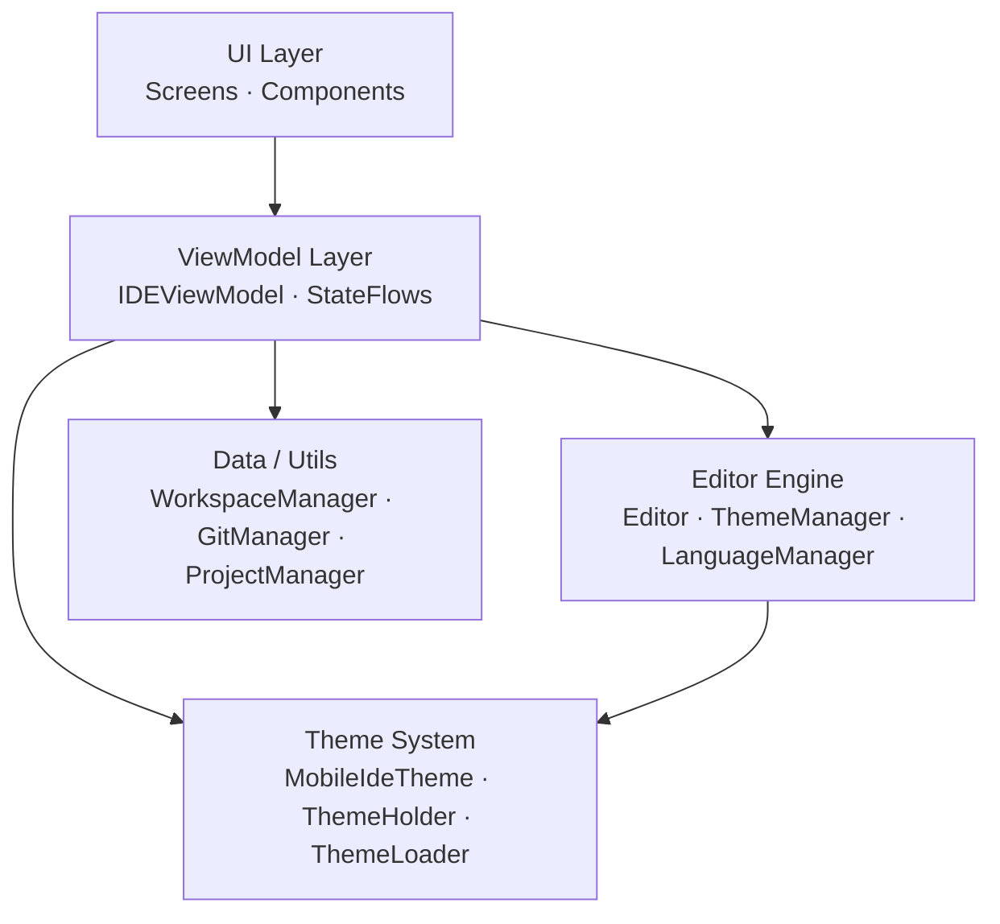

# Module MobileIDE

A full-featured Android IDE running entirely on-device via [AndroidIDE](https://androidide.com)
and [Termux](https://termux.dev). Written in Kotlin with Jetpack Compose, powered by
[Sora Editor](https://github.com/Rosemoe/sora-editor) for syntax highlighting and editing.

## Architecture

The application is structured in five layers:



## Package Overview

| Package | Responsibility |
|---|---|
| `com.mobileide.app` | `MainActivity`, `AppConstants` |
| `com.mobileide.app.data` | Domain models: `Project`, `Language`, `EditorTab` |
| `com.mobileide.app.editor` | `Editor` subclass, `EditorThemeManager`, `LanguageManager`, `KeywordManager`, `FontCache` |
| `com.mobileide.app.editor.intelligent` | Smart editing: `AutoCloseTag`, `BulletContinuation` |
| `com.mobileide.app.logger` | Structured in-app logger |
| `com.mobileide.app.ui.components` | Reusable Compose components |
| `com.mobileide.app.ui.screens` | All application screens |
| `com.mobileide.app.ui.theme` | Material3 theme system, `ThemeHolder`, `ThemeLoader` |
| `com.mobileide.app.utils` | `TextMateSetup`, `WorkspaceManager`, `GitManager`, `ProjectManager` |
| `com.mobileide.app.viewmodel` | `IDEViewModel`, `Screen` enum |

## Generating the Documentation

```bash
# Full HTML site (recommended)
./gradlew :app:dokkaHtml

# GitHub-Flavoured Markdown (for wikis)
./gradlew :app:dokkaGfm
```

Output location: `app/build/dokka/`
