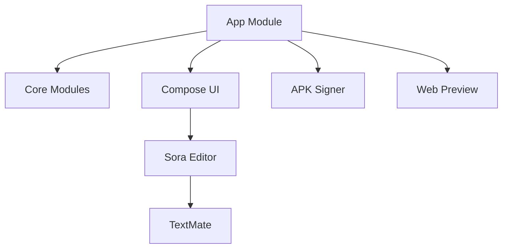
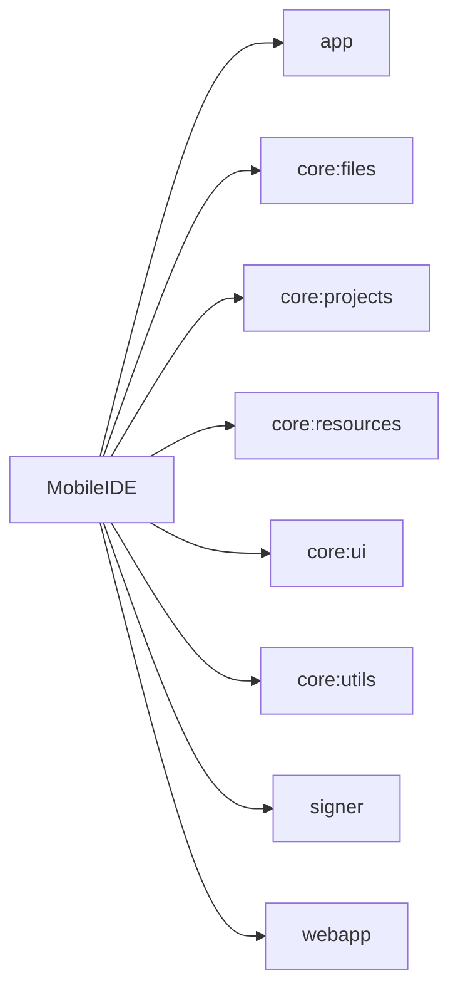

# Module MobileIDE

MobileIDE is a modular Android IDE built with Kotlin,
Jetpack Compose, TextMate grammars and Sora Editor.

---

# Architecture



---

# Multi-Module Structure



---

# Documentation Generation

Generate Markdown:

```bash
./gradlew dokkaGfmMultiModule
```

Generate HTML:

```bash
./gradlew dokkaHtmlMultiModule
```
